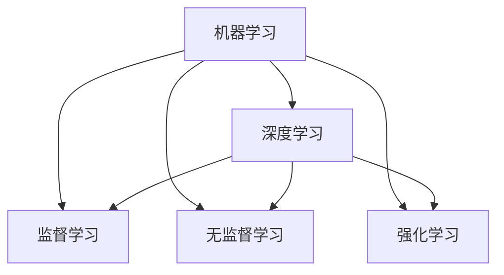

                 

# 文章标题

《人类计算：AI时代的未来就业市场与技能培训发展趋势分析机遇挑战机遇趋势分析》

## 关键词

- 人工智能
- 未来就业市场
- 技能培训
- 人类计算
- 职业发展
- 政策建议

## 摘要

本文从AI时代的背景与基础概念出发，分析了未来就业市场的趋势与挑战，探讨了人类计算的概念与内涵。接着，详细解析了AI的核心技术，包括机器学习、深度学习和自然语言处理。在技能培训与职业发展部分，本文分析了市场需求与技能类别，探讨了技能培训方式与资源，并提出了职业规划与自我提升的策略。最后，通过行业案例分析和AI项目实战指导，总结了AI时代的人才培养与政策建议，为读者提供了全面的技术指南和前瞻性思考。

## 引言

随着人工智能（AI）技术的迅猛发展，我们正步入一个前所未有的“AI时代”。在这个时代，人工智能不仅改变了我们的生活方式，还深刻影响着就业市场。传统职业正面临变革，而新技能的需求也随之涌现。为了应对这一变革，人类计算这一概念应运而生，成为连接人与AI的重要桥梁。

本文旨在探讨AI时代的未来就业市场与技能培训发展趋势，分析其中的机遇与挑战。我们将首先回顾AI的发展历程，分析其在各行业的应用现状。接着，深入解析人类计算的概念，探讨其与人工智能的关系。随后，我们将解析AI的核心技术，包括机器学习、深度学习和自然语言处理。在技能培训与职业发展部分，我们将分析市场需求与技能类别，探讨技能培训方式与资源。最后，通过行业案例分析和AI项目实战指导，总结AI时代的人才培养与政策建议。

本文将带领读者一步步深入了解AI时代下的就业市场与技能培训，帮助大家把握时代机遇，迎接未来挑战。

## 第一部分：AI时代背景与基础概念

### 第1章：AI时代背景与就业市场变革

#### 1.1 AI时代的到来与发展历程

人工智能（AI）作为一种模拟、延伸和扩展人类智能的理论、方法、技术及应用系统，其发展历程可以追溯到20世纪50年代。最初的AI研究主要集中在符号主义和逻辑推理上，如逻辑推理机、专家系统等。然而，由于数据稀缺和计算能力的限制，早期AI的研究并未取得实质性突破。

随着计算机技术的发展，特别是互联网的普及和大数据的积累，AI迎来了新的发展阶段。21世纪初，以深度学习为代表的机器学习方法取得了重大突破，使得AI在图像识别、自然语言处理、语音识别等领域取得了显著成果。如今，AI已经渗透到各行各业，成为推动产业变革的重要力量。

AI在各行业的应用现状也是AI时代的一个重要特征。从制造业到医疗健康，从金融到物流，AI技术的应用不仅提高了效率和准确性，还开辟了新的商业模式和服务场景。例如，自动驾驶技术正在改变交通运输行业，而智能医疗系统则有望提高疾病诊断的准确率和治疗效果。

#### 1.2 未来就业市场的趋势与挑战

随着AI技术的不断进步，未来就业市场将面临深刻的变革。一方面，传统职业正在被自动化和智能化取代，导致某些行业的就业机会减少。另一方面，新兴职业和岗位不断涌现，对人才的需求也在不断变化。

首先，产业结构调整与就业机会变化是未来就业市场的一大趋势。随着AI技术的广泛应用，一些重复性、低技能的工作将逐渐被自动化系统取代，而需要高级技能和创新能力的工作机会将逐渐增加。例如，数据科学家、机器学习工程师、AI产品经理等岗位将成为热门职业。

其次，技能需求变化与人才竞争也是未来就业市场的一大挑战。在AI时代，技术技能和创新能力将成为核心竞争力。企业不仅需要具备技术技能的员工，还需要能够进行创新和变革的人才。因此，如何培养和吸引这些人才成为企业面临的重要问题。

#### 1.3 人类计算的概念与内涵

人类计算（Human Computing）是一种将人类的认知能力与计算能力相结合的方法，旨在发挥人类与机器各自的优势。人类计算的概念最早可以追溯到1970年代，由哈佛大学教授马文·明斯基提出。他认为，人类和机器之间的合作可以创造出更加强大的智能系统。

人类计算的核心在于人机协同，即将人类的感知、推理、判断等认知能力与计算机的高速计算能力相结合，共同解决问题。在AI时代，人类计算的重要性日益凸显。通过人类计算，我们可以更好地理解和利用人工智能，使其更好地服务于人类社会。

人类计算与人工智能的关系密不可分。人工智能依赖于大量的数据和强大的计算能力，而人类计算则可以提供更深刻的理解和创新思维。两者相结合，可以创造出更加智能化和高效的系统。

#### 1.4 AI时代对教育体系的影响

AI时代的到来对教育体系也带来了深远的影响。首先，教育内容需要与时俱进，加入更多的AI相关知识。传统的教育模式已经无法满足AI时代的需求，需要更多以项目和实践为导向的课程。其次，教育方式也需要创新。在线教育、虚拟现实等新兴教育方式可以更好地适应AI时代的学习需求。

此外，AI时代对教师的角色也提出了新的要求。教师不仅需要具备扎实的专业知识，还需要具备教学创新和引导学生自主学习的能力。通过这样的教育体系改革，我们可以更好地培养出适应AI时代的人才。

### 总结

AI时代的到来不仅改变了我们的生活方式，也对就业市场和教育体系产生了深远影响。了解AI的发展历程和人类计算的概念，可以帮助我们更好地把握未来就业市场的趋势与挑战。通过不断学习和适应，我们可以在这个时代中找到自己的定位，发挥自己的优势。

## 第2章：AI核心技术解析

#### 2.1 机器学习基础

机器学习（Machine Learning，ML）是人工智能的核心技术之一，它使计算机系统能够从数据中学习并做出决策或预测。机器学习的基本概念包括模型训练、模型评估和模型应用。

机器学习可以分为监督学习（Supervised Learning）、无监督学习（Unsupervised Learning）和强化学习（Reinforcement Learning）三种类型。

- **监督学习**：监督学习是一种有标注数据的学习方法，系统通过已有数据的输入和输出关系来训练模型，从而能够对新的输入数据进行预测。常见的监督学习方法包括线性回归、逻辑回归、决策树和神经网络等。

- **无监督学习**：无监督学习是在没有标注数据的情况下，通过观察数据的内在结构来进行学习。它主要用于数据降维、聚类分析和模式识别等领域。常见的无监督学习方法包括K-均值聚类、主成分分析（PCA）和自编码器等。

- **强化学习**：强化学习是一种通过不断试错和反馈来学习最优策略的方法。它主要应用于动态决策问题，如游戏、机器人控制和自动驾驶等。强化学习的关键概念包括状态（State）、动作（Action）、奖励（Reward）和策略（Policy）。

#### 2.2 深度学习原理与应用

深度学习（Deep Learning，DL）是机器学习的一种方法，其核心思想是通过多层神经网络（Neural Network）来模拟人类大脑的神经网络结构，从而实现对复杂数据的学习和建模。

- **深度学习的基本架构**：深度学习的基本架构包括输入层、隐藏层和输出层。每个隐藏层都对输入数据进行处理，并传递给下一层。通过层层递进的方式，深度学习模型能够提取出数据的复杂特征。

- **深度学习在图像识别和自然语言处理中的应用**：

  - **图像识别**：深度学习在图像识别领域取得了显著成就。卷积神经网络（CNN）是图像识别中最常用的深度学习模型。通过多个卷积层和池化层的堆叠，CNN能够提取图像的局部特征和全局特征，从而实现图像分类和目标检测。

  - **自然语言处理**：深度学习在自然语言处理（NLP）领域也发挥着重要作用。循环神经网络（RNN）和长短期记忆网络（LSTM）是NLP中常用的深度学习模型。通过序列到序列（Seq2Seq）模型和注意力机制，深度学习能够处理变长的序列数据，实现文本生成、机器翻译和情感分析等任务。

#### 2.3 自然语言处理技术

自然语言处理（Natural Language Processing，NLP）是人工智能的重要分支，它致力于使计算机能够理解、解释和生成自然语言。

- **语言模型和词嵌入**：语言模型（Language Model）是NLP的基础，它用于预测下一个单词或字符的概率。词嵌入（Word Embedding）是将单词映射到低维向量空间的方法，通过词嵌入，可以捕捉单词的语义信息，从而提高NLP任务的效果。

- **语音识别与生成**：语音识别（Speech Recognition）是将语音信号转换为文本的技术，其核心是声学模型和语言模型的结合。语音生成（Text-to-Speech，TTS）则是将文本转换为语音的技术，它涉及文本语调、节奏和发音的生成。

### 2.4 机器学习与深度学习的关系

机器学习和深度学习是紧密相关的两个领域。机器学习是更广泛的概念，包括深度学习在内的多种学习方式。深度学习是机器学习的一个分支，它通过多层神经网络来模拟人类的认知过程，实现对复杂数据的学习和建模。

机器学习和深度学习的关系可以用下图来表示：



### 总结

通过对AI核心技术的解析，我们可以看到机器学习和深度学习在图像识别、自然语言处理等领域的重要应用。同时，自然语言处理技术的发展也使得计算机能够更好地理解和生成自然语言。这些技术的进步不仅推动了人工智能的发展，也为未来就业市场和技能培训带来了新的机遇和挑战。

## 第二部分：技能培训与职业发展

### 第3章：AI技能培训趋势分析

#### 3.1 市场需求与技能类别

随着人工智能技术的不断发展，市场对AI技能的需求日益增长。不同职业路径对AI技能的需求也不同，下面我们将分析热门AI技能需求以及不同职业路径所需的AI技能。

**热门AI技能需求分析**

1. **数据科学家**：数据科学家是AI时代的重要职业，他们负责收集、清洗和分析大量数据，从中提取有价值的信息。数据科学家需要具备以下技能：

   - **编程技能**：熟练掌握Python、R等编程语言。
   - **数据分析工具**：熟练使用Pandas、NumPy、Matplotlib等数据分析工具。
   - **机器学习框架**：熟悉Scikit-learn、TensorFlow、PyTorch等机器学习框架。
   - **数据库管理**：熟练使用MySQL、PostgreSQL等数据库。

2. **机器学习工程师**：机器学习工程师是负责开发和部署机器学习模型的专业人员。他们需要具备以下技能：

   - **编程技能**：熟练掌握Python等编程语言。
   - **机器学习框架**：熟悉TensorFlow、PyTorch等机器学习框架。
   - **数据处理**：熟悉数据预处理和特征工程。
   - **模型评估**：熟悉模型评估指标和方法。

3. **深度学习工程师**：深度学习工程师专注于使用深度学习算法解决复杂问题。他们需要具备以下技能：

   - **编程技能**：熟练掌握Python等编程语言。
   - **深度学习框架**：熟悉TensorFlow、PyTorch等深度学习框架。
   - **神经网络设计**：熟悉神经网络的设计和优化。
   - **计算机视觉与自然语言处理**：了解计算机视觉和自然语言处理的基本原理。

4. **AI产品经理**：AI产品经理负责AI产品的规划、设计和推广。他们需要具备以下技能：

   - **市场分析**：熟悉市场需求和竞争对手分析。
   - **产品设计**：了解产品设计流程和方法。
   - **项目管理**：掌握项目管理工具和方法。
   - **技术理解**：了解AI技术的基本原理和应用。

**不同职业路径所需的AI技能**

1. **数据科学家**：数据科学家通常需要具备较强的编程和数据分析能力，能够处理复杂数据集，并运用机器学习算法进行数据挖掘和分析。

2. **机器学习工程师**：机器学习工程师需要具备较强的编程和机器学习算法能力，能够设计、实现和部署机器学习模型。

3. **深度学习工程师**：深度学习工程师需要具备较强的编程和深度学习算法能力，能够设计和优化深度学习模型。

4. **AI产品经理**：AI产品经理需要具备市场分析、产品设计和技术理解等多方面的能力，能够将AI技术与产品需求相结合。

#### 3.2 技能培训方式与资源

随着AI技术的普及，各种AI技能培训方式也应运而生。以下是一些常见的技能培训方式与资源：

**在线教育与线下培训**

- **在线教育**：在线教育提供了灵活的学习时间和丰富的课程资源，适合在职人员和有自主学习能力的人。常见的在线教育平台包括Coursera、edX、Udacity等。
- **线下培训**：线下培训通常由专业培训机构或大学提供，课程内容更为系统，有面对面的交流和讨论，适合有一定基础和希望深入学习的学员。

**开放课程与认证体系**

- **开放课程**：开放课程是免费的在线课程，通常由大学和研究机构提供。这些课程不仅提供了丰富的学习资源，还有专业的导师指导和同学互助。
- **认证体系**：认证体系是验证学习者技能和知识的专业认证，如谷歌的AI认证、亚马逊的机器学习认证等。获得认证可以增加求职者的竞争力。

#### 3.3 技能培训效果评估

技能培训效果评估是衡量培训质量和学员学习成果的重要手段。以下是一些常用的评估方法和指标：

- **考试与评估**：通过考试和评估来检验学员对知识的掌握程度。考试形式包括在线考试、笔试和面试等。
- **项目实践**：通过实际项目来考察学员的综合能力和应用能力。项目实践可以是模拟项目，也可以是真实项目的部分。
- **反馈与评价**：收集学员的反馈和评价，了解培训过程中的优点和不足，不断改进培训内容和方法。

**培训成果的衡量指标**

- **知识掌握程度**：通过考试和评估来衡量学员对AI知识的掌握程度。
- **技能应用能力**：通过项目实践来评估学员在实际工作中应用AI技能的能力。
- **职业发展**：通过学员的职业发展情况来衡量培训对学员职业发展的影响。

**培训效果的跟踪与分析**

- **跟踪调查**：定期对学员进行跟踪调查，了解他们的职业发展和学习成果。
- **数据分析**：通过数据分析来评估培训的效果，识别优势和不足，为后续培训提供参考。

#### 3.4 职业规划与自我提升

职业规划是个人职业发展的重要环节，对于AI领域的从业者来说尤为重要。以下是一些职业规划与自我提升的策略：

- **明确职业目标**：根据自己的兴趣和优势，设定明确的职业目标，如成为数据科学家、机器学习工程师等。
- **持续学习**：AI技术更新迅速，持续学习是保持竞争力的关键。可以通过参加培训、阅读专业书籍、关注行业动态等方式来不断提升自己的知识水平。
- **实践项目**：通过参与实际项目，锻炼自己的实际操作能力，积累项目经验。
- **网络拓展**：通过参加行业会议、加入专业社群等方式，拓展人脉，了解行业趋势。
- **专业认证**：通过获得专业认证来提升自己的专业水平，增加求职竞争力。

#### 3.5 人力资源市场的需求与供给

人力资源市场的需求与供给是影响AI技能培训和发展的重要因素。以下是一些影响需求与供给的因素：

- **技术发展**：AI技术的快速发展增加了对AI技能的需求，同时也提高了对从业者的要求。
- **行业变革**：随着AI技术的应用，一些传统行业正在变革，对AI技能的需求也在增加。
- **教育体系**：教育体系的改革和AI课程的开设可以增加AI技能的供给。
- **就业政策**：政府的就业政策和支持措施可以影响AI技能培训和发展。

#### 3.6 国际化视野下的AI技能培训与发展

随着全球化的发展，国际化的视野对于AI技能培训和发展具有重要意义。以下是一些国际化视野下的AI技能培训和发展趋势：

- **跨国合作**：国际间的合作项目和研究交流可以促进AI技术的创新和应用。
- **国际化课程**：国际化课程和认证体系可以提升学员的国际竞争力。
- **国际化就业**：国际化的就业市场为AI技能人才提供了更多的机会和挑战。

#### 3.7 总结与展望

AI技能培训与职业发展是AI时代的一个重要议题。通过分析市场需求与技能类别，了解技能培训方式与资源，以及职业规划与自我提升策略，我们可以更好地应对AI时代的挑战。未来，随着AI技术的不断进步，AI技能培训和发展将迎来更多机遇和挑战。从业者需要不断提升自己的技能和知识，适应时代的发展。

### 第4章：职业发展与就业规划

#### 4.1 AI行业的职业路径

在AI时代，不同职业路径的岗位职责和成长路径有所不同，以下将介绍几种常见职业路径的岗位职责和成长路径。

**数据科学家**

- **岗位职责**：
  - 数据收集与预处理：负责收集和整理数据，进行数据清洗和预处理。
  - 数据分析与模型构建：使用统计分析、机器学习等方法，分析数据，构建预测模型。
  - 模型评估与优化：评估模型的性能，进行模型优化和调参。
  - 结果解释与沟通：将分析结果解释给非技术人员，撰写报告和演示。

- **成长路径**：
  - 初级数据科学家：负责具体的数据分析和模型构建工作。
  - 中级数据科学家：参与项目管理和跨部门合作，负责更复杂的数据分析任务。
  - 高级数据科学家：担任项目负责人，指导团队工作，参与公司战略决策。

**机器学习工程师**

- **岗位职责**：
  - 模型研发与设计：设计并实现机器学习算法，构建机器学习模型。
  - 模型训练与优化：训练模型，调整参数，优化模型性能。
  - 模型部署与维护：将模型部署到生产环境，进行监控和维护。
  - 技术支持与培训：为团队成员提供技术支持，进行技能培训。

- **成长路径**：
  - 初级机器学习工程师：负责具体模型的研发和优化。
  - 中级机器学习工程师：参与项目管理和跨部门合作，负责更复杂的模型设计。
  - 高级机器学习工程师：担任项目负责人，指导团队工作，参与公司战略决策。

**AI产品经理**

- **岗位职责**：
  - 产品规划与设计：制定产品规划和设计，制定产品需求文档。
  - 市场调研与分析：进行市场调研，分析用户需求和市场趋势。
  - 项目管理：协调团队工作，确保项目按时交付。
  - 产品推广与运营：制定产品推广策略，进行产品运营。

- **成长路径**：
  - 初级AI产品经理：负责具体的产品设计和项目管理。
  - 中级AI产品经理：参与跨部门合作，负责更复杂的产品规划和推广。
  - 高级AI产品经理：担任产品部门负责人，制定公司级产品战略。

**深度学习工程师**

- **岗位职责**：
  - 算法研发与设计：设计并实现深度学习算法，构建深度学习模型。
  - 模型训练与优化：训练模型，调整参数，优化模型性能。
  - 模型部署与维护：将模型部署到生产环境，进行监控和维护。
  - 技术支持与培训：为团队成员提供技术支持，进行技能培训。

- **成长路径**：
  - 初级深度学习工程师：负责具体模型的研发和优化。
  - 中级深度学习工程师：参与项目管理和跨部门合作，负责更复杂的模型设计。
  - 高级深度学习工程师：担任项目负责人，指导团队工作，参与公司战略决策。

#### 4.2 职业规划与自我提升

职业规划是个人职业发展的重要环节，对于AI领域的从业者来说尤为重要。以下是一些职业规划与自我提升的策略：

**职业发展规划的重要性**

- **目标明确**：职业规划可以帮助从业者明确自己的职业目标，制定清晰的职业发展路径。
- **持续成长**：职业规划可以促进从业者不断学习新知识、提升技能，保持竞争力。
- **资源整合**：职业规划可以帮助从业者整合资源，如人脉、信息等，为职业发展提供支持。

**自我评估与能力提升策略**

- **自我评估**：从业者应定期进行自我评估，了解自己的优势、劣势和兴趣所在，从而制定合适的职业规划。
- **技能提升**：根据职业规划，从业者应主动学习新技能，如编程、机器学习、深度学习等，提升自己的专业能力。
- **实践经验**：通过参与实际项目，从业者可以积累实践经验，提升项目管理和团队合作能力。
- **持续学习**：随着AI技术的快速发展，从业者需要保持持续学习的态度，关注行业动态，学习新技术。

**职业转型与跨界合作**

- **职业转型**：随着AI技术的广泛应用，一些传统职业正在转型，如数据分析师转型为数据科学家，软件工程师转型为机器学习工程师等。从业者可以根据行业趋势和个人兴趣，考虑职业转型。
- **跨界合作**：跨界合作可以促进不同领域之间的交流与融合，如AI与医疗、金融、制造等领域的合作。从业者可以通过跨界合作，拓宽视野，提升自己的综合能力。

**创新能力培养**

- **创新能力**：在AI时代，创新能力是职业发展的关键因素。从业者应培养自己的创新能力，如通过参加创新竞赛、撰写技术博客、参与开源项目等方式，提升自己的创新能力。
- **思维训练**：通过思维训练，如逻辑思维、系统思维、创新思维等，可以提升从业者的思维能力，为创新能力提供基础。
- **资源整合**：创新往往需要整合多种资源，如技术、资金、人才等。从业者应学会如何整合资源，为创新提供支持。

**总结**

职业规划与自我提升是AI领域从业者应对AI时代挑战的重要策略。通过明确职业目标、自我评估、技能提升和持续学习，从业者可以不断提升自己的竞争力。同时，通过职业转型、跨界合作和创新能力培养，从业者可以在AI时代中找到自己的定位，实现职业发展的突破。

### 第5章：行业案例分析

#### 5.1 金融行业的AI应用案例

金融行业一直是人工智能技术应用的前沿领域，AI技术的应用不仅提高了金融服务的效率，还改变了金融市场的运作模式。以下将分析金融行业中的一些AI应用案例。

**金融风控**

金融风控是指金融机构对信用风险、市场风险、操作风险等进行管理和控制。AI技术在金融风控中的应用主要包括信用评分、欺诈检测和风险预测等方面。

- **信用评分**：金融机构使用AI技术对客户的信用评分进行评估，通过分析客户的信用历史、财务状况、社会行为等多方面的数据，预测客户的信用风险。例如，银行可以使用机器学习算法对客户的信用评分进行自动化评估，从而提高信用审批的效率和准确性。

- **欺诈检测**：AI技术在欺诈检测中发挥着重要作用。金融机构可以通过分析客户的交易行为、账户活动等数据，利用机器学习算法检测异常行为，从而预防欺诈行为。例如，信用卡公司可以使用神经网络模型检测信用卡欺诈，通过实时分析客户的消费行为，识别潜在的欺诈交易。

- **风险预测**：金融机构可以利用AI技术进行风险预测，提前识别潜在的市场风险和信用风险。通过分析宏观经济数据、市场趋势等，金融机构可以预测市场的波动和风险，从而采取相应的风险管理措施。

**智能投顾**

智能投顾（Robo-Advisor）是一种基于人工智能技术的在线投资顾问服务，通过分析用户的财务状况、投资目标和风险偏好，为用户提供个性化的投资建议。

- **个性化投资建议**：智能投顾系统会根据用户的个人信息和投资目标，利用大数据分析和机器学习算法，为用户生成个性化的投资组合。通过实时跟踪市场和用户行为，智能投顾可以动态调整投资策略，提高投资收益。

- **风险控制**：智能投顾系统可以对用户的投资组合进行实时监控，通过分析市场数据和历史表现，识别潜在的风险，并提供相应的风险控制建议。例如，当市场出现大幅波动时，智能投顾可以及时调整投资策略，降低风险。

- **用户互动**：智能投顾系统还可以与用户进行互动，通过在线问答、实时消息等方式，为用户提供即时的投资咨询和建议。通过与用户的互动，智能投顾可以更好地了解用户的需求和风险偏好，提供更加个性化的服务。

**金融数据分析**

AI技术在金融数据分析中的应用非常广泛，通过对大量金融数据进行分析，AI可以帮助金融机构更好地理解市场趋势、风险因素和投资机会。

- **市场趋势分析**：金融机构可以使用AI技术对市场数据进行分析，预测市场趋势和波动。通过分析历史数据和宏观经济指标，AI可以识别市场规律和趋势，为投资决策提供支持。

- **风险因素分析**：金融机构可以通过AI技术分析金融市场的风险因素，如利率风险、汇率风险、信用风险等。通过分析数据，AI可以识别潜在的风险因素，并提供相应的风险管理建议。

- **投资机会分析**：AI技术可以帮助金融机构发现投资机会，通过分析市场数据、宏观经济指标和行业趋势，AI可以识别具有潜力的投资标的，为投资者提供投资建议。

#### 5.2 医疗健康领域的AI应用案例

医疗健康领域是AI技术应用的另一个重要领域，AI技术在医疗诊断、健康管理、药物研发等方面发挥着重要作用。

**疾病诊断**

AI技术在疾病诊断中的应用可以显著提高诊断的准确性和效率。以下是一些AI在疾病诊断中的应用案例：

- **影像诊断**：在医学影像领域，AI技术可以通过分析X光片、CT扫描、MRI图像等，帮助医生进行疾病的诊断。例如，AI可以识别肺部结节、乳腺癌等疾病，提供辅助诊断建议。通过使用深度学习算法，AI可以在影像诊断中达到甚至超过医生的准确率。

- **实验室检测**：在实验室检测领域，AI技术可以分析实验室数据，如血液样本、尿液样本等，帮助医生进行疾病诊断。通过机器学习算法，AI可以对检测数据进行分析，识别异常指标，提供诊断建议。

- **电子病历分析**：AI技术可以分析电子病历数据，提取关键信息，帮助医生进行诊断。通过自然语言处理技术，AI可以理解医生在病历中的描述，识别疾病症状和病史，提供诊断支持。

**健康管理**

AI技术在健康管理中的应用可以帮助用户监测健康状况，提供个性化的健康建议。

- **健康监测**：AI技术可以通过穿戴设备、健康应用程序等收集用户的心率、血压、睡眠质量等健康数据，通过数据分析，AI可以识别健康风险，提供健康建议。例如，AI可以提醒用户调整作息时间、饮食结构等，以预防疾病。

- **慢性病管理**：对于慢性病患者，AI技术可以通过持续监测病情，提供个性化的治疗建议。通过分析患者的健康数据和医疗记录，AI可以识别病情变化，调整治疗方案，提高治疗效果。

- **健康咨询**：AI技术可以提供在线健康咨询服务，通过自然语言处理和语音识别技术，AI可以与用户进行互动，解答健康问题，提供专业的健康建议。

**药物研发**

AI技术在药物研发中的应用可以加速新药的研发过程，提高研发成功率。

- **靶点识别**：AI技术可以通过分析生物数据，如基因序列、蛋白质结构等，识别潜在的药物靶点。通过机器学习算法，AI可以筛选出具有治疗潜力的药物靶点，为药物研发提供方向。

- **分子设计**：AI技术可以帮助药物研发人员设计新的药物分子。通过分析药物分子的结构和性质，AI可以预测药物分子的活性、毒性和代谢途径，帮助研发人员优化药物分子设计。

- **临床研究**：AI技术可以分析临床试验数据，评估药物的安全性和有效性。通过分析大量临床试验数据，AI可以识别药物的疗效和副作用，为药物上市提供参考。

#### 5.3 制造业与物流行业的AI应用案例

制造业和物流行业是AI技术应用的另一个重要领域，AI技术可以提高生产效率、优化物流流程，提高整个供应链的运营效率。

**智能制造**

智能制造是指利用人工智能技术实现生产过程的自动化、智能化。以下是一些AI在智能制造中的应用案例：

- **设备维护**：通过AI技术，可以对生产线上的设备进行实时监控和预测性维护。AI可以通过分析设备运行数据，预测设备故障，提前进行维护，减少设备故障带来的生产停工风险。

- **生产调度**：AI技术可以帮助企业优化生产调度，通过分析生产计划和设备状态，AI可以动态调整生产计划，确保生产线的平稳运行，提高生产效率。

- **质量检测**：AI技术可以通过图像识别和自然语言处理等技术，对产品质量进行实时检测。通过分析产品质量数据，AI可以识别质量问题，提供改进建议，提高产品质量。

**智能物流**

智能物流是指利用人工智能技术优化物流流程，提高物流效率。以下是一些AI在智能物流中的应用案例：

- **路径优化**：AI技术可以通过分析交通数据、配送需求和路线条件，为物流车辆提供最优的配送路径。通过路径优化，可以减少配送时间，提高配送效率。

- **仓库管理**：AI技术可以帮助企业优化仓库管理，通过自动识别和分类技术，AI可以对仓库内的货物进行实时监控和管理，提高仓库利用率。

- **仓储机器人**：AI技术可以开发智能仓储机器人，通过自动化搬运和分类技术，提高仓储效率。智能仓储机器人可以在仓库内自主导航，自动完成货物的搬运和分类任务。

**总结**

通过以上行业案例分析，我们可以看到AI技术在金融、医疗健康、制造业和物流等领域的广泛应用。AI技术的应用不仅提高了行业的效率，还改变了行业的运作模式。随着AI技术的不断进步，未来AI在更多领域的应用将会更加广泛，为各行业带来更多机遇和挑战。

### 第6章：AI项目实战指导

#### 6.1 项目规划与需求分析

AI项目规划与需求分析是项目成功的关键环节。合理的项目规划可以帮助团队明确项目目标，制定详细的实施计划，确保项目按时交付。需求分析则是确保项目满足用户需求的重要步骤。

**项目规划**

1. **项目目标**：明确项目的目标和预期成果。项目目标应该具体、可衡量、可实现、相关性强、时限明确（SMART原则）。

2. **项目范围**：确定项目的范围，明确项目的任务和职责，避免项目范围蔓延。

3. **项目进度**：制定项目进度计划，包括关键里程碑、交付日期等。

4. **资源分配**：根据项目需求，合理分配人力、物力、财力等资源，确保项目顺利实施。

5. **风险管理**：识别项目风险，制定相应的应对策略，降低风险对项目的影响。

6. **沟通计划**：制定项目沟通计划，确保项目团队、利益相关者之间的信息畅通。

**需求分析**

1. **用户需求**：通过调查问卷、访谈等方式，收集用户的需求和期望，确保项目满足用户需求。

2. **功能需求**：根据用户需求，明确项目的功能需求，包括系统的主要功能、子功能等。

3. **非功能需求**：明确项目的非功能需求，如性能、可靠性、安全性、可维护性等。

4. **需求文档**：编写详细的需求文档，包括需求描述、功能规格、界面设计等，确保需求清晰、完整、一致。

#### 6.2 技术选型与架构设计

技术选型与架构设计是AI项目成功的关键。合理的架构设计可以提高系统的可扩展性、可靠性和性能，而技术选型则决定了项目的技术路线和开发效率。

**技术选型**

1. **编程语言**：根据项目需求和团队技能，选择适合的编程语言。常用的AI编程语言包括Python、Java、C++等。

2. **机器学习框架**：选择合适的机器学习框架，如TensorFlow、PyTorch、Scikit-learn等，根据项目需求，选择适合的框架。

3. **数据库**：根据数据存储和查询需求，选择合适的数据库，如MySQL、MongoDB、Redis等。

4. **数据处理工具**：选择合适的数据处理工具，如Pandas、NumPy、Matplotlib等，用于数据清洗、分析和可视化。

5. **云计算平台**：选择合适的云计算平台，如AWS、Azure、Google Cloud等，用于部署和管理AI模型。

**架构设计**

1. **系统架构**：根据项目需求，设计系统的整体架构，包括数据层、服务层、表现层等。

2. **模块划分**：将系统划分为多个模块，如数据收集模块、数据处理模块、模型训练模块等，确保模块间的高内聚、低耦合。

3. **分布式架构**：对于大规模数据处理和模型训练，采用分布式架构，提高系统的处理能力和效率。

4. **安全性设计**：确保系统的数据安全和用户隐私，采用加密、认证、授权等技术，防止数据泄露和未经授权的访问。

5. **可扩展性设计**：设计系统时考虑未来的扩展性，确保系统能够适应业务规模的变化，如通过水平扩展、垂直扩展等方式。

#### 6.3 项目实施与优化

项目实施是AI项目从设计到交付的关键步骤。合理的实施过程可以提高开发效率，确保项目质量。以下是一些项目实施的关键环节：

**1. 数据收集与处理**

- **数据收集**：根据项目需求，收集所需的数据，包括结构化数据和非结构化数据。
- **数据清洗**：对收集的数据进行清洗，去除重复数据、缺失值和异常值，确保数据质量。
- **数据预处理**：对数据进行标准化、归一化等预处理，为模型训练做好准备。

**2. 模型训练与优化**

- **模型选择**：根据项目需求，选择合适的模型，如线性回归、决策树、神经网络等。
- **模型训练**：使用训练数据对模型进行训练，调整模型参数，提高模型性能。
- **模型评估**：使用验证数据对模型进行评估，选择性能最优的模型。
- **模型优化**：对模型进行优化，如调整学习率、批量大小等参数，提高模型性能。

**3. 模型部署与监控**

- **模型部署**：将训练好的模型部署到生产环境，进行实时预测和应用。
- **模型监控**：对模型进行实时监控，如性能监控、异常检测等，确保模型稳定运行。

**4. 系统集成与测试**

- **系统集成**：将AI模型与其他系统模块进行集成，确保系统功能的完整性。
- **功能测试**：对系统的功能进行测试，确保系统满足需求。
- **性能测试**：对系统的性能进行测试，如响应时间、并发处理能力等，确保系统的高性能。

**系统性能优化与测试**

1. **性能优化**：通过对代码、数据库、网络等各个层面的优化，提高系统的性能。
   - **代码优化**：通过代码优化，如减少循环次数、避免冗余计算等，提高代码的执行效率。
   - **数据库优化**：通过索引优化、分库分表等技术，提高数据库的查询性能。
   - **网络优化**：通过网络优化，如CDN加速、负载均衡等，提高网络的传输效率。

2. **测试方法**：使用自动化测试工具和手动测试相结合的方法，进行全面测试。
   - **自动化测试**：通过编写自动化测试脚本，对系统的功能、性能等进行自动化测试。
   - **手动测试**：通过手动测试，如黑盒测试、白盒测试等，发现潜在的问题和缺陷。

3. **测试覆盖率**：确保测试覆盖率达到较高水平，包括功能测试、性能测试、安全测试等。

4. **持续集成与部署**：采用持续集成（CI）和持续部署（CD）的方法，提高开发效率和系统稳定性。

#### 6.4 开发环境搭建与代码实现

开发环境搭建是AI项目实施的基础。以下是一些常见的开发环境搭建步骤：

**1. 环境配置**

- **操作系统**：选择合适的操作系统，如Windows、Linux等。
- **编程语言**：安装编程语言环境，如Python、Java等。
- **开发工具**：安装集成开发环境（IDE），如PyCharm、Visual Studio等。
- **数据库**：安装数据库软件，如MySQL、MongoDB等。
- **机器学习框架**：安装机器学习框架，如TensorFlow、PyTorch等。

**2. 代码实现**

- **代码规范**：遵循代码规范，如PEP8（Python代码规范），确保代码的可读性和可维护性。
- **版本控制**：使用版本控制工具，如Git，管理代码版本，便于协作和追踪变更。
- **模块化开发**：将代码划分为多个模块，实现模块化开发，提高代码的可重用性和可维护性。
- **文档编写**：编写详细的文档，包括代码注释、使用说明、测试用例等，确保代码的可读性和可维护性。

#### 6.5 代码解读与分析

以下是一个简单的机器学习项目的代码解读与分析：

**代码示例：线性回归模型**

```python
import numpy as np
from sklearn.linear_model import LinearRegression
from sklearn.model_selection import train_test_split
from sklearn.metrics import mean_squared_error

# 数据预处理
X = np.array([[1], [2], [3], [4], [5]])
y = np.array([1, 2, 2.5, 3, 4])

# 数据划分
X_train, X_test, y_train, y_test = train_test_split(X, y, test_size=0.2, random_state=42)

# 模型训练
model = LinearRegression()
model.fit(X_train, y_train)

# 模型预测
y_pred = model.predict(X_test)

# 模型评估
mse = mean_squared_error(y_test, y_pred)
print("Mean Squared Error:", mse)
```

**代码解读**

- **数据预处理**：使用numpy库创建数据集，并对数据进行划分。
- **模型训练**：使用线性回归模型训练数据集，使用fit方法进行训练。
- **模型预测**：使用预测方法predict对测试数据进行预测。
- **模型评估**：使用均方误差mean_squared_error对模型进行评估。

**代码分析**

- **线性回归模型**：线性回归模型是一种简单的机器学习模型，通过拟合数据点来确定线性关系。
- **数据划分**：数据划分是机器学习项目中的重要步骤，通过划分训练集和测试集，可以评估模型的泛化能力。
- **模型训练**：模型训练是机器学习项目的核心步骤，通过训练数据集，模型可以学习到数据的规律。
- **模型预测**：模型预测是评估模型性能的重要步骤，通过测试数据集，可以评估模型在实际应用中的效果。
- **模型评估**：模型评估是确保模型质量和性能的关键步骤，通过评估指标，可以了解模型的优缺点。

#### 6.6 项目小结

通过以上实战指导，我们了解了AI项目从规划到实施的关键步骤，包括项目规划与需求分析、技术选型与架构设计、项目实施与优化、开发环境搭建与代码实现等。同时，我们也通过代码示例进行了详细的解读与分析，展示了AI项目的实际开发过程。这些实战经验和技巧对于AI项目开发和实施具有重要的指导意义。

### 第7章：AI时代的人才培养与政策建议

#### 7.1 教育体系改革

随着人工智能技术的迅猛发展，传统教育体系面临重大挑战。为了培养适应AI时代需求的人才，教育体系改革势在必行。

**AI教育课程设置与教学资源**

1. **AI基础知识**：在基础教育阶段，应设置AI基础知识课程，让学生了解AI的基本概念、原理和应用。

2. **编程与算法**：加强编程和算法教学，培养学生解决问题的能力。推荐Python、Java等编程语言，并引入算法竞赛和项目实践。

3. **专业课程**：在高等教育阶段，设置专门的AI专业课程，如机器学习、深度学习、自然语言处理等。课程内容应与时俱进，紧跟AI技术的前沿动态。

4. **跨学科融合**：鼓励跨学科课程设置，如数据科学与计算机科学、人工智能与心理学等，培养具有综合能力的复合型人才。

**教学资源**

1. **开源课程**：利用开源课程和在线教育资源，丰富教学内容，提高教学效果。如MIT、斯坦福等世界名校的AI课程。

2. **教材与辅导材料**：编写适合AI教学的教材和辅导材料，确保教学质量。

3. **实验室与实践平台**：建设AI实验室和实践平台，提供丰富的实验资源和项目实践机会。

**教学方式**

1. **项目驱动教学**：以项目为导向，让学生在实践中学习和掌握AI知识。

2. **在线教育与线下培训**：结合在线教育和线下培训，灵活安排学习时间和内容。

3. **导师制**：引入导师制，为学生提供专业指导，帮助他们解决学习和职业发展中的问题。

#### 7.2 人才培养与激励机制

**人才评估与选拔机制**

1. **综合素质评价**：评估学生的综合素质，包括学术成绩、创新能力、项目经验、团队合作能力等。

2. **人才选拔机制**：建立科学的人才选拔机制，确保选拔到优秀的人才。

**职业发展与激励机制**

1. **职业发展规划**：指导学生制定职业发展规划，明确职业目标，提升职业竞争力。

2. **培训与晋升机会**：为员工提供持续的培训机会和晋升通道，激发员工的职业发展动力。

3. **绩效激励机制**：建立合理的绩效激励机制，奖励优秀员工，提升整体工作效率。

#### 7.3 政策建议与行业展望

**政策建议**

1. **政府支持**：政府应加大对AI教育和产业发展的支持力度，制定相关政策，鼓励企业投资AI技术和人才培养。

2. **教育投入**：增加教育投入，改善教育基础设施，提高教育质量。

3. **产业合作**：鼓励高校与企业合作，共同培养AI人才，推动产学研一体化发展。

4. **人才培养计划**：制定人才培养计划，针对不同层次的人才需求，提供相应的培养方案。

**行业展望**

1. **技术创新**：随着AI技术的不断进步，未来将在更多领域实现突破，如自动驾驶、智能医疗、智能家居等。

2. **产业变革**：AI技术的广泛应用将推动各行业的变革，提高生产效率，改善生活质量。

3. **就业机会**：AI时代的到来将创造大量的就业机会，如数据科学家、AI工程师、AI产品经理等。

4. **国际化发展**：随着全球化的发展，AI技术和人才将更加国际化，跨国合作和竞争将更加频繁。

**总结**

AI时代对教育体系、人才培养和行业政策提出了新的要求。通过教育体系改革、人才培养与激励机制以及政策建议，我们可以更好地应对AI时代的挑战，培养出适应时代需求的高素质AI人才。同时，行业展望也为AI时代的未来发展提供了方向和机遇。

### 附录

#### 附录A：AI相关资源与工具

**开源框架和库**

1. **TensorFlow**：由Google开发的开源深度学习框架，支持多种编程语言，适用于各种深度学习任务。

2. **PyTorch**：由Facebook开发的开源深度学习框架，具有灵活的动态计算图，适用于研究性和工程性项目。

3. **Scikit-learn**：用于机器学习的Python库，提供了多种经典的机器学习算法和工具。

4. **Keras**：用于深度学习的Python库，提供了简洁的API，方便快速实现深度学习模型。

5. **OpenCV**：开源计算机视觉库，提供了丰富的计算机视觉算法和工具。

6. **NumPy**：用于数值计算的Python库，提供了高效的数组操作和数学函数。

**在线学习平台与资源**

1. **Coursera**：提供大量AI相关课程，包括深度学习、机器学习等。

2. **edX**：由哈佛大学和麻省理工学院共同创办，提供高质量的AI课程。

3. **Udacity**：提供实践驱动的AI课程，包括深度学习工程师、数据科学家等。

4. **Kaggle**：数据科学竞赛平台，提供丰富的数据集和比赛项目。

5. **AI教程网**：提供丰富的AI教程和资源，适合初学者和进阶者。

#### 附录B：参考文献

1. **Goodfellow, I., Bengio, Y., & Courville, A. (2016). *Deep Learning*。MIT Press.**
   
2. **Mitchell, T. M. (1997). *Machine Learning*. McGraw-Hill.**

3. **Russell, S., & Norvig, P. (2020). *Artificial Intelligence: A Modern Approach*. Pearson.**

4. **Koller, D., & Friedman, N. (2009). *Elements of Statistical Learning: Data Mining, Inference, and Prediction*. Springer.**

5. **Bryson, J. J. (2012). *A History of Machine Learning*. Now Publishers.**

6. **Schneck, C. R. (2017). *Artificial Intelligence in Financial Markets*. Springer.**

7. **Topol, E. J. (2019). *The Future of Healthcare: Can AI Transform Disease Treatment?.** Basic Books.

8. **Schwab, J. (2016). *The Fourth Industrial Revolution: What It Means, How to Respond*. World Economic Forum.

9. **Davenport, T. H., & Patil, D. J. (2017). *Big Data at Work*. Harvard Business Review Press.**

10. **Brynjolfsson, E., & McAfee, A. (2014). *The Second Machine Age: Work, Progress, and Prosperity in a Time of Brilliant Technologies*. W. W. Norton & Company.**

