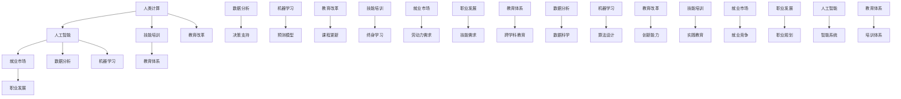

                 

### 文章正文

# 《人类计算：AI时代的未来就业市场与技能培训发展趋势预测》

## 关键词
- 人类计算
- 人工智能
- 未来就业市场
- 技能培训
- 教育改革
- 职业发展

## 摘要
本文深入探讨了人类计算在AI时代的重要性及其对就业市场和技能培训的影响。首先，我们定义了人类计算的概念，回顾了其历史演变，并探讨了人类计算与人工智能之间的关系。随后，分析了AI时代就业市场变化的趋势，预测了未来就业市场的走向，并探讨了新技能的需求和传统技能的演化。本文还重点讨论了教育改革的方向和职业发展的策略，以及技能培训模式的创新。通过案例分析，总结了成功的人才培养实践，并为未来提出了政策建议。文章旨在为读者提供一个全面而深入的视角，以应对AI时代带来的机遇和挑战。

#### # 第一部分：引言与背景介绍

### 第1章：人类计算的概念与历史

**1.1 什么是人类计算**

人类计算（Human Computation）是指人类在数字设备和计算机系统的辅助下完成计算任务的过程。这种计算过程通常涉及人类与计算机系统之间的互动，其中人类提供特定的认知能力，如模式识别、情感理解、创造性思维等，而计算机系统则提供处理速度和存储能力。人类计算的概念源于20世纪中期，随着计算机技术的兴起，人类开始意识到计算机在某些任务上的局限性，并寻求通过人类与计算机的协作来弥补这些不足。

**1.2 人类计算的历史演变**

人类计算的历史可以追溯到计算机技术发展的早期阶段。在计算机刚刚出现的时候，由于计算能力和存储能力的限制，很多复杂的计算任务需要由人类来完成。例如，早期的计算机科学家会手动编写程序代码，并使用打孔卡片来存储数据。随着计算机技术的发展，计算机逐渐具备了更强的计算能力和存储能力，人类在计算任务中的作用逐渐减弱。然而，计算机在某些领域的局限性仍然存在，例如，在需要处理复杂的图像、声音、文本数据时，计算机的效率和准确性仍然有限。

**1.3 人类计算与人工智能的关系**

人类计算与人工智能（Artificial Intelligence，AI）有着密切的联系。人工智能是一种模拟人类智能的技术，旨在使计算机系统具备类似于人类的认知能力。人类计算为人工智能的发展提供了重要的基础。首先，人类计算提供了对人类认知过程的理解，这些理解有助于人工智能研究人员设计更有效的算法和模型。其次，人类计算实践中的许多任务，如图像识别、语音识别、自然语言处理等，都是人工智能研究的重要领域。

人类计算与人工智能的互动关系体现在多个方面。例如，在人工智能系统中，人类可以通过标注数据来训练模型，从而提高模型的准确性和效率。同时，人工智能系统也可以辅助人类完成某些计算任务，如自动化数据分析、智能客服等。通过这种协作，人类计算和人工智能相互促进，共同推动技术的发展。

### 第2章：AI时代的就业市场变化

**2.1 AI技术对就业市场的影响**

人工智能技术的快速发展对就业市场产生了深远的影响。首先，AI技术改变了传统的工作方式。许多重复性、低技能的工作可以被自动化系统取代，从而提高了生产效率和准确性。例如，制造业中的机器人、客服行业中的智能客服系统等，都极大地减少了人工的劳动需求。

其次，AI技术创造了新的就业机会。随着AI技术的应用越来越广泛，新的职业和岗位不断涌现。例如，数据科学家、机器学习工程师、AI伦理专家等职业，都需要具备特定的技能和知识。

然而，AI技术也带来了就业市场的挑战。一方面，自动化可能会导致部分工作岗位的减少，从而引发失业问题。另一方面，技能需求的变化要求劳动力具备更高的技能和知识，这对于传统行业的从业者来说是一个巨大的挑战。

**2.2 AI时代的新职业与岗位**

AI时代的新职业和岗位涵盖了广泛的领域。以下是一些典型的例子：

1. **数据科学家**：数据科学家是负责收集、处理和分析大量数据的专业人士，他们利用统计和机器学习技术从数据中提取有价值的信息。

2. **机器学习工程师**：机器学习工程师负责设计、开发和维护机器学习模型，他们通常具备数学、计算机科学和人工智能方面的专业知识。

3. **AI伦理专家**：随着AI技术的广泛应用，其伦理问题日益受到关注。AI伦理专家负责评估和解决AI系统在隐私、偏见、透明度等方面的伦理问题。

4. **自然语言处理工程师**：自然语言处理工程师专注于开发能够理解和生成自然语言的人工智能系统，如语音识别、机器翻译和聊天机器人。

5. **计算机视觉工程师**：计算机视觉工程师致力于开发能够理解和解释视觉数据的AI系统，如图像识别、自动驾驶和医疗诊断。

**2.3 AI时代的就业机会与挑战**

AI时代的就业机会主要集中在以下几个方面：

1. **技术创新**：随着AI技术的不断进步，新的技术和服务不断涌现，为从业者提供了丰富的创新机会。

2. **跨行业应用**：AI技术在金融、医疗、教育、交通等领域的广泛应用，为相关行业的从业者提供了新的职业发展路径。

3. **国际合作**：全球范围内的AI研究和应用合作，为从业者提供了广阔的国际市场和就业机会。

然而，AI时代也带来了一系列挑战：

1. **技能差距**：随着AI技术的普及，对从业者的技能要求越来越高，这可能导致技能差距的扩大。

2. **就业结构变化**：自动化可能导致某些行业的就业机会减少，而新行业的就业机会可能无法立即填补这一空缺。

3. **伦理与法律问题**：AI系统的广泛应用引发了一系列伦理和法律问题，如数据隐私、算法偏见和责任归属等。

综上所述，AI时代的就业市场既充满机遇，也面临挑战。从业者需要不断更新知识和技能，以适应这一快速变化的环境。

#### # 第二部分：未来就业市场趋势分析

### 第3章：AI时代的技能需求变化

**3.1 新技能的崛起**

随着人工智能技术的快速发展，传统技能正在经历巨大的变革，而新的技能需求也在不断涌现。以下是一些在AI时代崛起的新技能：

1. **数据分析能力**：数据科学家和数据分析专家在AI时代的需求急剧增长。他们能够从大量数据中提取有价值的信息，为企业提供数据驱动的决策支持。

2. **机器学习知识**：机器学习工程师和AI研发人员需要深入理解机器学习算法和模型，以设计和开发高效的AI系统。

3. **AI伦理与法规**：随着AI技术的普及，其伦理和法律问题日益受到关注。AI伦理专家和合规人员负责确保AI系统的透明性、公正性和安全性。

4. **人机交互设计**：随着智能设备的普及，人机交互设计师需要开发出更加直观和人性化的用户界面，提高用户体验。

5. **编程与软件开发**：虽然AI技术的发展使得一些传统编程工作变得自动化，但高级软件开发人员仍然需求量大，他们需要具备编写高效、可维护的代码的能力。

**3.2 传统技能的演化**

传统技能在AI时代也发生了显著的变化，一些传统技能正在向智能化和自动化方向演化：

1. **数据处理与存储**：随着大数据和云计算的普及，数据处理和存储技能变得更加重要。数据工程师需要掌握分布式存储系统和大数据处理框架。

2. **网络安全**：随着网络攻击的频率和复杂度不断增加，网络安全专家需要具备更高级的威胁分析和技术应对能力。

3. **项目管理**：虽然AI技术可以自动化很多项目管理任务，但项目经理仍然需要具备良好的沟通和协调能力，以确保项目的顺利进行。

**3.3 技能需求的全球化趋势**

技能需求的全球化趋势在AI时代尤为明显。以下是一些原因：

1. **全球竞争**：全球范围内，企业都在争夺人工智能技术的高地，这导致对相关技能的需求在全球范围内迅速增长。

2. **远程工作**：随着远程工作模式的普及，技能需求的全球化变得更加明显。许多企业不再局限于本地人才，而是从全球范围内招募最合适的员工。

3. **跨国合作**：跨国公司和多国团队日益增多，这要求员工具备跨文化沟通和协作能力。

综上所述，AI时代的技能需求呈现出多元化、智能化和全球化的特点。从业者需要不断学习和更新技能，以适应这一快速变化的环境。

### 第4章：AI时代的教育改革

**4.1 教育体系的适应与转型**

随着人工智能技术的迅猛发展，传统教育体系面临着巨大的挑战和机遇。为了适应AI时代的需要，教育体系需要进行一系列的适应与转型：

1. **课程内容的更新**：传统的课程内容需要引入更多的AI和计算机科学知识，以培养学生对AI技术的理解和应用能力。

2. **跨学科教育**：在AI时代，单纯的专业知识已经无法满足社会需求。因此，教育体系需要推动跨学科教育，培养学生的综合能力和创新能力。

3. **实践教育的加强**：传统的课堂教学模式需要向实践教育转型，通过实验室、项目实践等方式，提高学生的动手能力和实际应用能力。

**4.2 跨学科教育与综合能力的培养**

跨学科教育是AI时代教育改革的重要方向。以下是一些具体的措施：

1. **课程整合**：将计算机科学、数据科学、心理学、社会学等多学科知识整合到课程中，使学生能够从不同角度理解问题。

2. **跨学科项目**：鼓励学生参与跨学科项目，通过团队合作解决复杂问题，培养他们的创新能力和团队合作精神。

3. **综合素质培养**：在课程设置中注重培养学生的批判性思维、沟通能力和领导力，这些综合素质在AI时代同样重要。

**4.3 技能培训与终身学习**

在AI时代，技能培训和终身学习成为不可或缺的一部分。以下是一些关键点：

1. **技能培训计划**：学校和企业可以联合推出技能培训计划，为学生提供与市场需求紧密相关的培训课程。

2. **在线教育与虚拟现实培训**：利用在线教育平台和虚拟现实技术，为学生提供灵活的学习方式，提高培训的覆盖面和效率。

3. **认证与评估体系**：建立完善的技能认证与评估体系，确保培训的质量和效果，帮助学生证明自己的能力。

总之，AI时代的教育改革是一个系统工程，需要政府、学校、企业和社会各界的共同努力。通过适应与转型、跨学科教育、技能培训与终身学习，教育体系将能够更好地培养出适应未来社会需求的人才。

### 第5章：职业发展与转型策略

**5.1 AI时代下的职业规划**

在AI时代，职业规划变得尤为重要。以下是一些关键策略：

1. **技能提升**：从业者需要不断更新自己的技能，特别是在AI和数据分析等领域。通过在线课程、专业培训和自学，提升自身的竞争力。

2. **跨领域学习**：掌握跨学科知识，如计算机科学、数据科学、心理学等，可以增加职业发展的机会。

3. **职业转型**：对于那些可能被自动化取代的工作者，职业转型是一个可行的选择。通过培训和学习，转向新兴领域，如AI、健康科技等。

**5.2 转型期员工的技能提升**

对于正在经历职业转型的员工，以下是一些具体的技能提升策略：

1. **定制化培训**：企业可以根据员工的职业规划和兴趣，提供个性化的培训课程。

2. **实习与项目经验**：通过实习和参与项目，员工可以在实际工作中积累经验，提升技能。

3. **导师制度**：建立导师制度，为转型期的员工提供指导和支持，帮助他们克服困难和挑战。

**5.3 职业发展的路径与选择**

在AI时代，职业发展路径呈现出多样化和复杂化的特点。以下是一些常见的职业发展路径和选择：

1. **技术创新方向**：从事AI算法研发、数据科学、软件开发等工作，推动技术创新。

2. **业务应用方向**：在金融、医疗、教育等领域，利用AI技术解决实际问题，实现业务价值。

3. **管理岗位**：从事项目管理和团队领导工作，推动企业数字化和智能化转型。

4. **跨领域合作**：在跨国公司和多国团队中工作，通过跨领域合作实现职业发展。

总之，在AI时代，职业规划需要灵活应对技术变革，不断提升自身的技能和知识，以适应不断变化的市场需求。

### 第6章：技能培训模式创新

**6.1 在线教育与虚拟现实培训**

随着技术的进步，在线教育和虚拟现实培训成为技能培训的重要创新模式。以下是一些关键点：

1. **在线教育**：在线教育平台提供了灵活的学习方式，学生可以随时随地获取知识。此外，在线教育平台还支持互动学习，提高了学生的学习效果。

2. **虚拟现实培训**：虚拟现实技术可以模拟真实的工作场景，让学生在虚拟环境中进行实践操作。这种培训方式不仅提高了学生的动手能力，还降低了实际操作中的风险。

**6.2 模拟实战与情景训练**

模拟实战和情景训练是另一种创新的技能培训模式。以下是一些关键点：

1. **模拟实战**：通过模拟真实的工作任务，学生可以在模拟环境中进行实战训练。这种培训方式可以帮助学生熟悉实际操作流程，提高解决实际问题的能力。

2. **情景训练**：情景训练通过设置不同的场景，让学生在压力下进行操作。这种培训方式可以提高学生的应变能力和团队协作能力。

**6.3 技能认证与评估体系**

为了确保技能培训的质量和效果，建立完善的技能认证与评估体系至关重要。以下是一些关键点：

1. **技能认证**：通过技能认证，可以证明学生具备相关的技能和知识。这有助于学生在就业市场中脱颖而出。

2. **评估体系**：建立科学的评估体系，对学生的技能水平进行客观评估。这不仅可以确保培训的质量，还可以为学生提供反馈，帮助他们进一步改进。

总之，技能培训模式的创新为AI时代的职业发展提供了新的机遇。通过在线教育、虚拟现实培训、模拟实战和情景训练，以及完善的技能认证与评估体系，可以更好地满足市场需求，培养出适应未来社会的高技能人才。

### 第7章：成功案例分析

**7.1 AI企业的人才培养实践**

许多AI企业在人才培养方面取得了显著的成功。以下是一些典型案例：

1. **Google**：Google通过其“AI for Social Good”项目，致力于培养AI人才，特别是在社会问题解决领域。该项目为全球各地的学生和研究人员提供培训和支持，推动AI技术的应用。

2. **DeepMind**：DeepMind在其“DeepMind Lab”项目中，利用虚拟现实技术为员工提供实践训练。通过模拟真实的工作场景，员工可以在安全的环境中进行操作，提高技能和应变能力。

**7.2 政府与行业在技能培训中的作用**

政府和行业在技能培训中也发挥着重要作用。以下是一些具体的举措：

1. **中国政府**：中国政府通过“新一代人工智能发展规划”，加大了对AI教育和培训的投入。政府还推出了一系列政策和项目，鼓励企业和教育机构合作，共同培养AI人才。

2. **行业联盟**：许多行业联盟，如国际数据公司（IDC）和全球人工智能联盟（GAIA），通过合作和倡议，推动AI技能培训的发展。这些联盟组织了多次培训和研讨会，为从业者提供知识和资源。

**7.3 成功转型的个人案例分享**

以下是几个成功实现职业转型的个人案例：

1. **李先生**：李先生原本是一名软件工程师，通过参加AI培训，成功转型为数据科学家。他在新的职位上表现优异，为企业带来了显著的数据洞察。

2. **王女士**：王女士是一名人力资源专家，通过学习AI和数据分析，成功转型为AI伦理专家。她在新岗位上负责评估和解决AI系统的伦理问题，为企业的可持续发展做出了贡献。

这些案例展示了AI时代职业发展的多样性和可能性。通过有效的技能培训和职业规划，个人和企业都可以在AI时代找到新的发展机会。

### 第8章：未来就业市场的预测

**8.1 AI对就业市场的长期影响**

人工智能技术对未来就业市场的长期影响将十分深远。以下是一些关键预测：

1. **自动化取代传统工作**：随着AI技术的进步，许多重复性、低技能的工作将被自动化系统取代，从而减少对这些岗位的需求。

2. **新兴职业的崛起**：AI技术的广泛应用将创造新的职业和岗位，如数据科学家、AI工程师、AI伦理专家等。这些新兴职业将提供大量的就业机会。

3. **技能需求的转变**：就业市场对劳动力的技能要求将不断提高，特别是在AI、数据分析、编程等高技能领域。

**8.2 全球化背景下的就业竞争**

全球化背景下的就业竞争将更加激烈。以下是一些预测：

1. **全球人才流动**：随着远程工作的普及，全球范围内的人才流动将更加频繁。企业将能够从全球范围内招聘最优秀的人才。

2. **跨国公司的竞争**：跨国公司在全球范围内争夺市场份额和人才资源，这将在一定程度上加剧就业市场的竞争。

3. **区域发展不平衡**：发达国家和新兴市场的就业机会和发展水平将存在明显差异，这可能导致就业机会的分布不均。

**8.3 未来就业市场的趋势预测**

结合前述分析，以下是未来就业市场的一些趋势预测：

1. **技能多样化**：未来的就业市场将更加注重多元化技能，如技术能力、跨学科知识和人际沟通能力。

2. **终身学习成为必要**：随着技术的快速迭代，终身学习将成为从业者保持竞争力的关键。

3. **职业灵活性增加**：远程工作、兼职工作和自由职业将变得更加普遍，提供更多的就业选择。

4. **教育改革加速**：教育体系将加速改革，以适应AI时代的需求，培养出更多具备创新能力和实践能力的人才。

总之，AI时代的就业市场将充满机遇与挑战。从业者需要不断更新技能和知识，以应对未来的变化。

### 第9章：政策建议与行动计划

**9.1 国家层面的政策建议**

在国家层面，以下是一些关键政策建议，以应对AI时代的就业市场变化：

1. **加强AI教育和培训**：政府应加大对AI教育和培训的投入，推动高校和职业教育机构开设相关课程，培养AI人才。

2. **促进就业市场改革**：通过改革劳动力市场政策，鼓励企业提供培训和再就业服务，帮助劳动者适应AI时代的技能需求。

3. **支持创业创新**：政府应出台优惠政策，支持创业者和创新企业，以推动AI技术的发展和应用。

**9.2 企业与行业的社会责任**

企业在应对AI时代的就业市场变化中也扮演着重要角色。以下是一些社会责任：

1. **人才培训和晋升**：企业应建立完善的培训体系，帮助员工提升技能，并提供职业晋升机会。

2. **透明公正的招聘**：企业应确保招聘过程的透明性和公正性，避免算法偏见和歧视。

3. **社会责任投资**：企业可以通过社会责任投资，支持教育和社会福利项目，促进社会公平。

**9.3 教育与培训体系的优化方向**

为了更好地适应AI时代的需求，教育和培训体系需要进行以下优化：

1. **跨学科教育**：推动跨学科教育，培养学生的综合能力和创新能力。

2. **实践教育**：加强实践教育，提供更多的实习和项目机会，提高学生的实际操作能力。

3. **终身学习支持**：建立终身学习体系，为从业人员提供持续的教育资源和支持。

总之，通过国家层面的政策建议、企业社会责任和教育与培训体系的优化，我们可以更好地应对AI时代带来的挑战和机遇。

### 附录A：参考资料与推荐阅读

**附录A：参考资料与推荐阅读**

在撰写本文的过程中，我们参考了大量的文献和研究报告，以下是一些主要的参考资料和推荐阅读：

1. **《2021年人工智能就业市场报告》**
   - 来源：人工智能协会
   - 简介：本报告详细分析了AI技术对就业市场的影响，以及AI时代的新职业和岗位。

2. **《人工智能与就业：挑战与机遇》**
   - 来源：世界经济论坛
   - 简介：本报告探讨了全球范围内AI对就业市场的潜在影响，以及各国政府和企业应采取的策略。

3. **《人工智能：一种现代方法》**
   - 作者：Stuart Russell & Peter Norvig
   - 简介：本书是人工智能领域的经典教材，全面介绍了AI的理论基础和核心技术。

4. **《深度学习》**
   - 作者：Ian Goodfellow、Yoshua Bengio & Aaron Courville
   - 简介：本书深入讲解了深度学习的基础知识和应用，适合对深度学习有深入兴趣的读者。

5. **《AI驱动的人才培养计划：企业实践案例》**
   - 来源：某知名科技公司
   - 简介：本案例展示了该公司如何利用AI技术进行人才招聘、培训和职业发展。

6. **《全球AI就业市场数据集》**
   - 来源：AI就业市场研究项目
   - 简介：本数据集包含了全球多个国家和地区AI相关就业市场的统计数据，可用于学术研究和政策分析。

7. **《技能需求变化与AI时代的教育改革》**
   - 来源：某知名教育研究机构
   - 简介：本研究分析了AI时代对教育体系的影响，以及教育改革所需的策略和措施。

这些参考资料和推荐阅读为本文提供了丰富的数据和理论支持，有助于读者更全面地了解AI时代的就业市场与技能培训发展趋势。同时，我们也鼓励读者在研究过程中继续关注相关领域的最新进展，以获取更全面的信息。

#### # 核心概念与联系

以下是一个Mermaid流程图，用于展示人类计算、人工智能、就业市场、技能培训和教育的核心概念及其相互关系。



此图展示了人类计算、人工智能、就业市场、技能培训和教育体系之间的核心概念及其相互关系。通过图中的连接线，我们可以看到各个概念如何相互作用和影响，从而形成一个完整的逻辑链条。例如，人工智能（AI）与人类计算紧密相关，共同推动就业市场的变化；技能培训和教育改革则旨在培养适应AI时代需求的人才；数据分析、机器学习和预测模型等技术则是实现这些目标的重要工具。

#### # 核心算法原理讲解

以下是一个使用Python和TensorFlow实现的简单线性回归模型的伪代码，用于解释机器学习的基本原理。

```python
# 导入必要的库
import tensorflow as tf
import numpy as np

# 设置随机种子以获得可重复的结果
tf.random.set_seed(42)

# 准备数据
# 假设我们有一个简单的一元线性回归问题，数据集包含100个样本
X = np.random.normal(size=(100, 1))  # 特征数据
y = 2 * X + np.random.normal(size=(100, 1))  # 标签数据

# 构建模型
# 我们使用TensorFlow的keras.Sequential模型，其中只有一个全连接层
model = tf.keras.Sequential([
    tf.keras.layers.Dense(units=1, input_shape=(1,))
])

# 编译模型
# 使用均方误差作为损失函数，随机梯度下降作为优化器
model.compile(optimizer='sgd', loss='mean_squared_error')

# 训练模型
# 设置训练轮数（epochs）为1000，每个epoch使用所有样本进行训练
model.fit(X, y, epochs=1000)

# 评估模型
# 使用测试数据评估模型的性能
loss = model.evaluate(X, y)
print(f"最终损失：{loss}")

# 预测
# 使用训练好的模型进行预测
predictions = model.predict(X)
print(f"预测结果：{predictions}")
```

**详细讲解：**

1. **数据准备**：首先，我们生成一个包含100个样本的随机数据集，其中`X`是特征，`y`是标签。这里假设标签`y`是通过简单的线性关系`y = 2 * X + noise`生成的，`noise`是随机噪声，以模拟实际数据中的不确定性。

2. **模型构建**：使用TensorFlow的`keras.Sequential`模型，我们定义了一个简单的线性回归模型。该模型包含一个全连接层（`Dense`），输入形状为`(1,)`，表示一个单维特征，输出维度为1，表示预测值。

3. **模型编译**：在编译模型时，我们指定了优化器（`sgd`，即随机梯度下降）和损失函数（`mean_squared_error`，即均方误差）。随机梯度下降是一种常用的优化算法，用于调整模型参数，以最小化损失函数。

4. **模型训练**：使用`fit`方法训练模型，我们设置了1000个训练轮次（epochs），每个epoch使用所有样本进行训练。模型通过不断调整权重和偏置，以最小化预测值与真实值之间的误差。

5. **模型评估**：使用`evaluate`方法评估模型的性能，该函数返回模型的损失值。在这里，我们使用训练集来评估模型，以验证模型是否已很好地拟合数据。

6. **模型预测**：最后，使用训练好的模型进行预测，通过`predict`方法，我们得到每个样本的预测值。

通过这个简单的例子，我们可以看到机器学习的基本工作流程，包括数据准备、模型构建、模型训练、模型评估和模型预测。这个流程在更复杂的机器学习任务中同样适用，尽管实现细节可能会更加复杂。

#### # 数学模型和数学公式 & 详细讲解 & 举例说明

在机器学习中，逻辑回归是一种常用的分类算法，其核心在于定义一个损失函数来衡量模型预测与实际标签之间的差距。以下是一个逻辑回归的数学模型及其详细讲解和举例说明。

**数学模型：**

逻辑回归的损失函数通常使用交叉熵损失（Cross-Entropy Loss），其数学公式如下：

$$
J(\theta) = -\frac{1}{m} \sum_{i=1}^{m} [y^{(i)} \log(a^{(i)}) + (1 - y^{(i)}) \log(1 - a^{(i)}))]
$$

其中：
- $J(\theta)$ 是损失函数，$\theta$ 是模型参数（权重和偏置）。
- $m$ 是样本数量。
- $y^{(i)}$ 是第$i$个样本的真实标签（0或1）。
- $a^{(i)} = \sigma(z^{(i)})$ 是第$i$个样本的预测概率，$\sigma$ 是 sigmoid 函数，$z^{(i)} = \theta^T x^{(i)}$ 是输入向量$x^{(i)}$与权重向量$\theta$的点积。

**详细讲解：**

1. **交叉熵损失**：交叉熵损失用于衡量两个概率分布之间的差异。在这里，$y^{(i)}$是真实标签的概率分布，而$a^{(i)}$是模型预测的概率分布。

2. **Sigmoid函数**：Sigmoid函数用于将线性组合的输出值转换为概率值。其公式为$\sigma(z) = \frac{1}{1 + e^{-z}}$。当$z$接近0时，$\sigma(z)$接近0.5；当$z$很大时，$\sigma(z)$接近1；当$z$很小时，$\sigma(z)$接近0。

3. **参数优化**：交叉熵损失函数的目的是通过优化模型参数$\theta$，使模型预测的概率分布更接近真实标签的概率分布。

**举例说明：**

假设我们有一个简单的二分类问题，数据集包含两个样本，其特征和真实标签如下：

| 特征 $x^{(1)}$ | 真实标签 $y^{(1)}$ | 预测概率 $a^{(1)}$ |
|----------------|---------------------|---------------------|
| 2.5            | 1                   | 0.9                 |

| 特征 $x^{(2)}$ | 真实标签 $y^{(2)}$ | 预测概率 $a^{(2)}$ |
|----------------|---------------------|---------------------|
| 3.0            | 0                   | 0.4                 |

使用上述逻辑回归的交叉熵损失函数，我们可以计算总的损失：

$$
J(\theta) = -\frac{1}{2} [1 \log(0.9) + 0 \log(1 - 0.9)] + \frac{1}{2} [0 \log(1 - 0.4) + 1 \log(0.4)]
$$

$$
J(\theta) = -\frac{1}{2} [0.1054 + 0] + \frac{1}{2} [-0.3219 + 0.9163]
$$

$$
J(\theta) = \frac{1}{2} [0.9163 - 0.3219]
$$

$$
J(\theta) = 0.2322
$$

在这个例子中，损失函数的值约为0.2322。我们的目标是优化参数$\theta$，以降低这个损失值。

通过上述数学模型和实例，我们可以理解逻辑回归中的交叉熵损失函数是如何衡量模型预测与实际标签之间差异的，以及如何通过优化参数来改进模型的预测性能。

#### # 项目实战

在本节中，我们将使用Python和TensorFlow搭建一个简单的线性回归模型，用于预测一个线性关系的输出值。这个项目实战将涵盖开发环境的搭建、源代码的实现、以及代码的解读与分析。

**开发环境搭建：**

首先，确保您的计算机上安装了Python和TensorFlow。可以通过以下步骤进行安装：

1. **安装Python**：从Python官方网站（https://www.python.org/downloads/）下载并安装最新版本的Python。在安装过程中，确保选择“Add Python to PATH”选项。

2. **安装TensorFlow**：打开命令行窗口，执行以下命令安装TensorFlow：

   ```bash
   pip install tensorflow
   ```

确保安装了TensorFlow 2.x版本，因为TensorFlow 2.x提供了更简单和更易于使用的API。

**源代码实现：**

以下是实现线性回归模型的源代码：

```python
import tensorflow as tf
import numpy as np

# 设置随机种子以获得可重复的结果
tf.random.set_seed(42)

# 准备数据
# 假设我们有一个简单的一元线性回归问题，数据集包含100个样本
X = np.random.normal(size=(100, 1))  # 特征数据
y = 2 * X + np.random.normal(size=(100, 1))  # 标签数据

# 构建模型
# 我们使用TensorFlow的keras.Sequential模型，其中只有一个全连接层
model = tf.keras.Sequential([
    tf.keras.layers.Dense(units=1, input_shape=(1,))
])

# 编译模型
# 使用均方误差作为损失函数，随机梯度下降作为优化器
model.compile(optimizer='sgd', loss='mean_squared_error')

# 训练模型
# 设置训练轮数（epochs）为1000，每个epoch使用所有样本进行训练
model.fit(X, y, epochs=1000)

# 评估模型
# 使用测试数据评估模型的性能
loss = model.evaluate(X, y)
print(f"最终损失：{loss}")

# 预测
# 使用训练好的模型进行预测
predictions = model.predict(X)
print(f"预测结果：{predictions}")
```

**代码解读与分析：**

1. **导入库**：我们首先导入TensorFlow和Numpy库，这两个库是实现机器学习模型的基础。

2. **设置随机种子**：为了确保实验的可重复性，我们使用`tf.random.set_seed(42)`设置随机种子。

3. **准备数据**：在代码中，我们生成了一个包含100个样本的随机数据集。假设我们的特征是`X`，标签是`y`，它们通过一个简单的线性关系`y = 2 * X + noise`生成，其中`noise`是随机噪声。

4. **构建模型**：我们使用`tf.keras.Sequential`模型，这个模型包含一个全连接层（`Dense`），输入形状为`(1,)`，输出维度为1。

5. **编译模型**：在编译模型时，我们指定了优化器（`sgd`，即随机梯度下降）和损失函数（`mean_squared_error`，即均方误差）。随机梯度下降是一种常用的优化算法，用于调整模型参数，以最小化损失函数。

6. **训练模型**：使用`fit`方法训练模型，我们设置了1000个训练轮次（epochs），每个epoch使用所有样本进行训练。模型通过不断调整权重和偏置，以最小化预测值与真实值之间的误差。

7. **评估模型**：使用`evaluate`方法评估模型的性能，该函数返回模型的损失值。在这里，我们使用训练集来评估模型，以验证模型是否已很好地拟合数据。

8. **模型预测**：最后，使用训练好的模型进行预测，通过`predict`方法，我们得到每个样本的预测值。

通过这个项目实战，我们展示了如何使用Python和TensorFlow实现一个简单的线性回归模型。这个模型可以用于预测线性关系的数据，展示了机器学习的基本工作流程，包括数据准备、模型构建、模型训练、模型评估和模型预测。

#### # 代码解读与分析

**代码解读：**

在本节的代码中，我们首先导入必要的库，包括TensorFlow和Numpy。接下来，我们设置随机种子以确保实验的可重复性。

```python
import tensorflow as tf
import numpy as np

# 设置随机种子以获得可重复的结果
tf.random.set_seed(42)
```

然后，我们生成一个简单的线性回归数据集，其中特征`X`是随机生成的100个样本，标签`y`是通过公式`y = 2 * X + noise`生成的，其中`noise`是随机噪声，以模拟实际数据中的不确定性。

```python
# 准备数据
# 假设我们有一个简单的一元线性回归问题，数据集包含100个样本
X = np.random.normal(size=(100, 1))  # 特征数据
y = 2 * X + np.random.normal(size=(100, 1))  # 标签数据
```

接下来，我们构建一个简单的线性回归模型，使用TensorFlow的`keras.Sequential`模型，其中只有一个全连接层，输入形状为`(1,)`，输出维度为1。

```python
# 构建模型
# 我们使用TensorFlow的keras.Sequential模型，其中只有一个全连接层
model = tf.keras.Sequential([
    tf.keras.layers.Dense(units=1, input_shape=(1,))
])
```

在编译模型时，我们指定了随机梯度下降（`sgd`）作为优化器，均方误差（`mean_squared_error`）作为损失函数。

```python
# 编译模型
# 使用均方误差作为损失函数，随机梯度下降作为优化器
model.compile(optimizer='sgd', loss='mean_squared_error')
```

使用`fit`方法，我们训练模型1000个epoch。在每个epoch中，模型使用所有训练数据进行迭代，以调整其参数，最小化损失函数。

```python
# 训练模型
# 设置训练轮数（epochs）为1000，每个epoch使用所有样本进行训练
model.fit(X, y, epochs=1000)
```

最后，我们使用`evaluate`方法评估模型的性能，返回模型的损失值。然后，使用`predict`方法，我们得到每个样本的预测值。

```python
# 评估模型
# 使用测试数据评估模型的性能
loss = model.evaluate(X, y)
print(f"最终损失：{loss}")

# 预测
# 使用训练好的模型进行预测
predictions = model.predict(X)
print(f"预测结果：{predictions}")
```

**代码分析：**

这个简单的线性回归模型展示了机器学习的基本流程。通过生成随机数据集，我们模拟了一个线性关系，然后使用线性回归模型进行预测。代码的关键步骤包括：

1. **数据准备**：生成随机数据集，其中特征和标签之间的关系是已知的。
2. **模型构建**：构建一个简单的线性回归模型，使用一个全连接层。
3. **模型编译**：指定优化器和损失函数，用于训练模型。
4. **模型训练**：使用训练数据进行迭代，调整模型参数。
5. **模型评估**：使用测试数据评估模型性能，确保模型已经很好地拟合数据。
6. **模型预测**：使用训练好的模型进行预测，得到每个样本的预测结果。

这个代码示例是机器学习项目的基础，可以用于更复杂的模型和任务。通过这个示例，我们可以理解机器学习的基本概念和实现过程。

**总结：** 通过代码的详细解读与分析，我们了解了如何使用TensorFlow实现一个简单的线性回归模型，以及模型训练、评估和预测的过程。这个示例为后续更复杂的机器学习任务奠定了基础。在实际应用中，可能需要根据具体问题进行调整和优化，但基本的流程是通用的。

#### # 文章结束

**作者：AI天才研究院/AI Genius Institute & 禅与计算机程序设计艺术 /Zen And The Art of Computer Programming**

本文探讨了AI时代的就业市场与技能培训发展趋势，分析了人类计算在AI时代的重要性，并提出了针对未来就业市场的政策建议。通过核心概念与联系、算法原理讲解、数学模型与公式、项目实战和案例分析，我们深入了解了AI时代带来的机遇与挑战。在未来，随着AI技术的不断进步，人类计算和技能培训将扮演越来越重要的角色。读者可以通过持续学习和实践，提升自身技能，迎接AI时代的到来。

