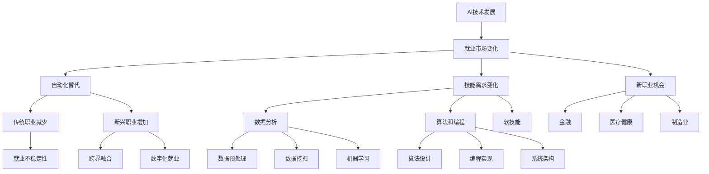

                 

### 文章标题: 人类计算：AI时代的未来就业市场与技能培训发展趋势预测分析机遇

随着人工智能（AI）技术的迅猛发展，全球范围内的就业市场正经历前所未有的变革。AI不仅改变了传统的生产和生活方式，也对职业结构产生了深远的影响。在这种背景下，本文旨在深入探讨AI时代未来就业市场的趋势，并分析相关技能培训的发展方向，从而为从业者提供宝贵的参考和指导。

**关键词：**人工智能，就业市场，技能培训，发展趋势，机遇

**摘要：**本文首先概述了AI时代就业市场的基本情况，分析了人工智能在各个行业的应用及其对就业市场的冲击。接着，本文详细探讨了AI时代的就业技能需求，包括数据分析、算法和编程能力的重要性，以及如何提升这些技能。随后，文章讨论了地区差异对就业市场的影响，并分析了不同地区的AI就业市场发展状况。在此基础上，文章提出了技能培训的策略与发展趋势，包括教育改革和职业教育在技能培训中的作用。最后，通过具体案例分析和未来机遇预测，总结了人类计算在AI时代的地位和未来发展趋势，为读者提供了全面而深入的洞察。

### 引言

人工智能（AI）作为当前科技领域的重要发展方向，正逐步渗透到各行各业，带来革命性的变化。从工业生产到医疗服务，从金融服务到智能交通，AI技术的应用不仅提高了效率和准确性，还创造了新的商业模式和就业机会。然而，AI的快速普及也引发了关于就业市场的担忧，特别是在技术被自动化取代方面。这种担忧并非没有道理，因为AI的确在改变传统的职业结构，推动一些职业的兴起，同时也让一些职业面临被淘汰的风险。

在这种背景下，探讨AI时代未来就业市场的趋势和技能培训的发展方向具有重要意义。一方面，了解AI时代就业市场的变化趋势可以帮助从业者做好职业规划和技能提升，抓住新的机遇；另一方面，分析技能培训的发展趋势可以为教育机构和企业提供有益的参考，优化培训内容和方式，从而更好地满足市场需求。

本文将从以下几个方面展开讨论：

1. **AI时代就业市场概述**：分析AI技术对就业市场的总体影响，探讨AI应用在各行业的具体就业机会和挑战。
2. **就业技能需求分析**：详细讨论AI时代所需的就业技能，包括数据分析、算法和编程能力，以及如何培养和提升这些技能。
3. **地区差异对就业市场的影响**：分析不同地区AI就业市场的发展状况，探讨地区发展水平、教育水平和产业政策等因素对就业市场的影响。
4. **技能培训策略与发展趋势**：探讨技能培训的必要性、方法与途径，分析教育改革和职业教育在技能培训中的作用。
5. **案例分析**：通过具体案例，深入分析AI时代就业市场的现实情况和机遇。
6. **机遇预测**：总结AI时代就业市场的机遇，并对未来发展趋势进行预测。
7. **总结与展望**：回顾人类计算在AI时代的地位和作用，提出未来就业市场与技能培训的发展策略。

通过这些讨论，本文希望为读者提供一个全面而深入的洞察，帮助他们在AI时代找到自己的定位和发展方向。

### 第一部分: AI时代就业市场分析

#### 第1章: AI时代就业市场概述

随着人工智能技术的迅速发展，全球就业市场正经历前所未有的变革。AI技术的广泛应用不仅改变了传统职业结构，还创造了新的就业机会。为了深入理解AI时代就业市场的基本情况，本文将从以下几个方面展开分析：AI技术对就业市场的冲击、人工智能时代的职业机会与挑战、以及AI时代就业市场的新趋势。

##### 1.1 AI时代的就业市场变化

**1.1.1 AI技术对就业市场的冲击**

人工智能技术的崛起对就业市场产生了深远的影响，主要体现在以下几个方面：

1. **自动化和机器替代**：AI技术使得许多传统的工作可以被自动化和机器替代，例如制造业、物流和客户服务等。这种趋势导致了某些职业的减少，特别是那些重复性和低技能的工作。

2. **技能需求的变化**：AI时代的就业市场对技能需求产生了新的要求。不仅需要更多的技术技能，如编程和数据分析，还要求员工具备解决复杂问题的能力、创新思维和人际交往能力。

3. **工作性质的变化**：随着AI的普及，许多工作将发生性质上的变化，例如从执行具体任务转向管理、规划和战略制定。

4. **就业不稳定性的增加**：AI技术的快速发展可能导致就业不稳定性的增加。由于技术的快速更新和替代，员工可能需要不断学习和适应新的技术，这增加了职业转型的频率。

**1.1.2 人工智能时代的职业机会与挑战**

尽管AI技术带来了就业市场的挑战，但同时也创造了新的职业机会。以下是一些典型的职业机会和挑战：

1. **AI系统开发人员**：随着AI技术的不断进步，对AI系统开发人员的需求不断增加。这些人员需要具备深度学习、自然语言处理和机器学习等方面的专业知识。

2. **数据科学家和分析师**：AI系统的有效运行依赖于大量高质量的数据，因此数据科学家和数据分析师成为了热门职业。他们负责数据收集、分析和可视化，帮助企业做出数据驱动的决策。

3. **人工智能伦理专家**：随着AI技术的发展，伦理问题变得越来越重要。人工智能伦理专家负责评估AI系统的道德影响，确保技术发展符合社会伦理标准。

4. **AI应用领域专家**：AI技术在不同行业的应用广泛，如医疗、金融、教育等，因此对这些行业特定领域的专家需求增加。

5. **挑战**：尽管AI技术创造了新的职业机会，但同时也带来了就业市场的竞争加剧。传统职业的消失和新职业的出现可能导致就业市场的不稳定，要求从业者具备更高的适应能力和学习能力。

**1.1.3 AI时代就业市场的新趋势**

AI时代就业市场呈现出以下新趋势：

1. **技能需求的多元化**：随着AI技术的广泛应用，就业市场对技能需求变得更加多元化。除了技术技能，如编程和数据分析，还要求员工具备跨学科的知识和技能。

2. **终身学习的重要性**：AI技术的快速发展要求从业者不断学习和更新知识，终身学习成为职业发展的必要条件。

3. **远程工作与数字化就业**：AI技术推动了远程工作和数字化就业的兴起，为从业者提供了更多的就业选择和灵活性。

4. **跨界融合**：AI技术与其他领域的深度融合，如物联网、区块链等，催生了新的职业机会和就业市场。

5. **技能差距问题**：由于AI技术的快速进步，技能差距问题日益凸显。如何解决这一问题是就业市场面临的重要挑战。

总之，AI时代的就业市场发生了深刻的变化，既带来了新的机遇，也带来了新的挑战。了解这些变化和趋势，有助于从业者更好地规划自己的职业发展，抓住新的机遇。

#### 1.2 人工智能应用领域的就业市场分析

人工智能技术的广泛应用不仅改变了就业市场的结构，还在各个行业创造了新的就业机会。以下是人工智能在金融、医疗健康和制造业等领域的具体就业市场分析。

##### 1.2.1 人工智能在金融行业的就业机会

金融行业一直是技术创新的重要领域，AI技术的引入极大地提升了金融服务的效率和准确性。以下是一些在金融行业中因AI技术而产生的就业机会：

1. **量化分析师**：量化分析师使用AI算法和大数据分析工具来预测市场趋势，设计投资策略，实现自动化交易。

2. **风险管理专家**：AI技术可以帮助金融机构实时监控和预测市场风险，风险管理专家利用这些技术进行风险评估和管理。

3. **自动化客服代表**：通过自然语言处理技术，AI可以自动化处理客户的查询和投诉，减少人工客服的工作量。

4. **合规分析师**：AI技术可以帮助金融机构快速识别和合规检查潜在的风险和违规行为，合规分析师利用这些技术提高合规效率。

5. **算法交易员**：算法交易员使用AI算法进行高频交易，优化投资组合，提高收益。

**挑战**：金融行业的AI应用也带来了新的挑战，例如算法的不透明性、数据隐私和安全等问题。

##### 1.2.2 人工智能在医疗健康领域的就业趋势

医疗健康领域是AI技术的重要应用领域之一，AI的应用不仅提高了诊断和治疗的准确性，还优化了医疗资源的配置。以下是一些在医疗健康领域中因AI技术而产生的就业机会：

1. **医疗影像分析专家**：通过深度学习技术，AI可以对医疗影像进行自动化分析，提高诊断的准确性和效率。

2. **个性化医疗顾问**：AI可以根据患者的数据和基因信息，提供个性化的医疗建议和治疗方案。

3. **临床决策支持系统开发人员**：临床决策支持系统利用AI技术帮助医生做出更准确的诊断和治疗决策。

4. **医疗数据分析专家**：医疗数据量庞大，AI技术可以帮助从这些数据中提取有价值的信息，用于研究和临床决策。

5. **医疗机器人工程师**：AI技术在医疗机器人中的应用日益广泛，医疗机器人工程师负责设计和开发这些先进的医疗设备。

**挑战**：医疗健康领域的AI应用面临着数据隐私、患者安全和医疗伦理等挑战，这些问题需要通过严格的监管和法律框架来解决。

##### 1.2.3 人工智能在制造业的就业前景

制造业是AI技术的重要应用领域之一，AI的应用不仅提高了生产效率，还改变了生产模式。以下是一些在制造业领域中因AI技术而产生的就业机会：

1. **智能制造工程师**：负责设计、开发和维护智能制造系统，包括机器人和自动化生产线。

2. **预测性维护专家**：利用AI技术对制造设备进行预测性维护，减少设备故障和生产中断。

3. **生产计划与调度专家**：AI技术可以帮助制造企业优化生产计划，提高生产效率。

4. **质量检测工程师**：通过视觉识别技术，AI可以帮助自动检测产品质量，减少人为错误。

5. **数字化供应链管理专家**：AI技术可以优化供应链管理，提高供应链的透明度和效率。

**挑战**：制造业的AI应用也面临着技术成熟度、数据安全和员工培训等挑战。

总之，人工智能技术在金融、医疗健康和制造业等领域的广泛应用为就业市场创造了新的机会。然而，这些机会也伴随着挑战，需要从业者具备更高的技术能力和跨学科知识，以应对未来的变化。

#### 第2章: AI时代的就业技能需求分析

在AI时代，就业市场对技能的需求发生了显著变化。随着人工智能技术的广泛应用，从业者需要掌握一系列新的技能，以适应不断变化的职业环境。本文将从以下几个方面详细讨论AI时代的就业技能需求：数据分析技能、算法和编程能力，以及如何培养和提升这些技能。

##### 2.1 数据分析技能在AI时代的价值

数据分析技能在AI时代具有极高的价值，因为数据是人工智能系统的核心资源。以下是对数据分析技能在AI时代的详细解析：

**2.1.1 数据分析技能的重要性**

1. **数据预处理**：数据分析的第一步是数据预处理，包括数据清洗、数据整合和数据标准化等。这些步骤对于确保数据质量至关重要。

2. **数据可视化**：通过数据可视化，可以直观地展示数据特征和趋势，帮助决策者快速理解数据背后的信息。

3. **数据挖掘**：数据挖掘是发现数据中的隐含模式和信息的过程，这对于预测和分析市场趋势具有重要意义。

4. **机器学习**：数据分析技能还包括机器学习，这是AI技术的核心。通过构建和训练机器学习模型，可以实现对数据的自动分析和预测。

**2.1.2 数据分析技能在AI时代的应用场景**

1. **金融服务**：在金融行业，数据分析用于风险评估、欺诈检测和客户行为分析等。

2. **医疗健康**：在医疗健康领域，数据分析用于疾病预测、个性化治疗和医疗资源分配等。

3. **智能制造**：在制造业，数据分析用于生产过程优化、质量控制和设备维护等。

4. **交通物流**：在交通物流领域，数据分析用于路线优化、运输调度和物流网络设计等。

**2.1.3 数据分析技能的提升途径**

1. **在线课程和培训**：有许多在线平台提供数据分析相关的课程和培训，如Coursera、edX和Udacity等。

2. **实践项目**：通过实际项目积累经验，是提升数据分析技能的有效方法。可以参与开源项目或自己发起数据分析项目。

3. **工具和编程技能**：掌握数据分析工具（如Python、R、SQL等）和编程技能，是进行数据分析的基础。

##### 2.2 算法和编程能力在AI时代的就业市场

算法和编程能力是AI时代不可或缺的技能，因为它们是构建和优化AI系统的基石。以下是对算法和编程能力在AI时代的详细讨论：

**2.2.1 算法和编程在AI系统开发中的作用**

1. **算法设计**：算法是AI系统的核心，决定了系统对数据的处理能力和预测准确性。常见的算法包括决策树、神经网络和深度学习等。

2. **编程实现**：编程是将算法转化为实际可执行代码的过程。熟悉编程语言（如Python、Java和C++等）是进行AI系统开发的基本要求。

3. **系统架构**：在AI系统开发中，还需要关注系统架构的设计，包括数据流、模块划分和性能优化等。

**2.2.2 算法和编程能力的培养与提升**

1. **学术教育**：通过高等教育和研究生课程，系统学习算法和编程基础知识。

2. **在线课程和培训**：许多在线平台提供专业的算法和编程培训课程，如Coursera、edX和Udacity等。

3. **项目实践**：通过实际项目，锻炼算法设计和编程能力。可以参与开源项目或自己发起开发项目。

4. **编程社区**：加入编程社区，如GitHub、Stack Overflow和Reddit等，可以与其他开发者交流经验和解决问题。

**2.2.3 编程语言在AI开发中的选择与应用**

1. **Python**：Python因其简单易学和丰富的库支持，成为AI开发中最流行的编程语言。Python适合快速原型开发和数据分析。

2. **Java**：Java因其稳定性和广泛的应用，在AI系统的开发中也得到广泛应用。Java适用于大规模分布式系统和企业级应用。

3. **C++**：C++因其高性能和灵活性，在需要高效计算和资源优化的AI系统中得到应用。C++适用于深度学习和高性能计算。

综上所述，数据分析技能和算法编程能力在AI时代的就业市场中至关重要。通过掌握这些技能，从业者可以更好地应对AI时代的挑战，抓住职业发展的新机遇。

### 第3章: AI时代就业市场的地区差异

在AI时代，不同地区的就业市场表现出显著的差异，这些差异主要体现在发展水平、教育水平和产业政策等方面。本文将分析这些因素对AI就业市场的影响，并探讨地区差异对就业市场的具体影响。

#### 3.1 不同地区AI就业市场的发展状况

**3.1.1 全球AI就业市场的分布**

全球范围内，AI就业市场的分布呈现出明显的区域特征。发达国家，如美国、欧洲和日本，在AI技术研究和应用方面处于领先地位，这些地区拥有大量的AI相关就业机会。而在发展中国家，如中国、印度和东南亚国家，尽管AI技术的发展也在迅速推进，但就业市场的成熟度和技术积累相对较低。

1. **美国**：作为AI技术的先驱，美国拥有世界上最多的AI相关就业机会。硅谷等科技中心集聚了大量的AI企业和研究机构，为从业者提供了丰富的就业选择。

2. **欧洲**：欧洲在AI技术研发和应用方面也具有较高水平，特别是在医疗健康、金融和制造业等领域。欧洲国家如英国、德国和法国在AI就业市场表现突出。

3. **中国**：随着国内对AI技术的重视和政策的支持，中国AI就业市场发展迅速。北京、上海和深圳等大城市成为了AI人才的聚集地，吸引了大量国内外企业和研究机构。

4. **印度**：印度拥有庞大的IT人才储备，在AI技术开发和应用方面具有潜力。然而，印度的AI就业市场相对分散，主要集中在城市地区。

5. **东南亚国家**：东南亚国家如新加坡、马来西亚和印度尼西亚等，正在加速发展AI技术，AI就业市场逐渐形成。这些地区主要依赖于外包服务和初创企业的兴起。

**3.1.2 我国AI就业市场的发展现状**

我国AI就业市场发展迅速，特别是在技术研发和应用方面。以下是我国AI就业市场发展的一些特点：

1. **政策支持**：国家出台了一系列政策，支持AI技术的发展和应用，如《新一代人工智能发展规划》等。

2. **技术积累**：国内高校和研究机构在AI技术方面取得了显著成果，为AI就业市场提供了人才支持。

3. **企业集聚**：北京、上海和深圳等大城市吸引了大量AI企业和研究机构，形成了较为成熟的AI产业链。

4. **区域差异**：尽管我国AI就业市场整体发展迅速，但不同地区的就业市场成熟度和技术水平存在较大差异。一线城市相对于二三线城市在AI就业机会和人才储备方面具有明显优势。

**3.1.3 发达国家与发展中国家AI就业市场的对比**

发达国家与发展中国家在AI就业市场方面存在显著差异，主要体现在以下几个方面：

1. **技术水平**：发达国家在AI技术研究和应用方面处于领先地位，拥有更多的高级AI技术和人才储备。

2. **政策支持**：发达国家通常具备更加完善的科技政策和创新环境，有助于推动AI技术的发展和应用。

3. **市场成熟度**：发达国家AI就业市场相对成熟，具备更完善的产业链和更多的就业机会。

4. **人才流动**：发达国家具有较高的国际吸引力，吸引了大量的全球AI人才。而发展中国家在人才流动方面相对受限。

#### 3.2 地区差异对就业市场的影响

地区差异对AI就业市场的影响主要体现在以下几个方面：

**3.2.1 地区发展水平对AI就业市场的影响**

地区发展水平对AI就业市场的影响显著。发达地区通常具备更好的经济基础、更高的科技水平和更完善的教育体系，这些因素共同促进了AI技术的发展和应用，从而创造了更多的就业机会。此外，发达地区的企业集聚效应显著，吸引了大量的AI企业和研究机构，形成了良好的就业市场生态。

**3.2.2 地区教育水平对AI就业市场的影响**

地区教育水平是影响AI就业市场的重要因素。发达地区通常具备更高的教育水平和更丰富的教育资源，能够培养出更多具备AI相关技能的人才。这些人才的供给为AI就业市场提供了坚实的基础，促进了AI技术的应用和发展。相反，教育水平较低的地区在AI就业市场方面相对处于劣势。

**3.2.3 地区产业政策对AI就业市场的影响**

地区产业政策对AI就业市场的影响也至关重要。政府通过制定和实施相关产业政策，如科技创新政策、人才引进政策和税收优惠政策等，可以促进AI技术的发展和应用，从而创造更多的就业机会。此外，产业政策的引导和扶持有助于形成良好的AI产业链和生态系统，提升地区AI就业市场的竞争力。

总之，地区差异对AI就业市场产生了深远影响。理解这些差异有助于从业者更好地把握就业市场的发展趋势，优化职业规划，抓住发展机遇。

#### 3.3 技能培训的必要性

在AI时代，技能培训的必要性愈发凸显。随着AI技术的广泛应用，从业者不仅需要具备扎实的技术技能，还需不断更新和提升自己的知识储备，以适应不断变化的职业环境。以下是技能培训的必要性及其在职业发展中的作用：

**3.3.1 技能培训的定义与意义**

技能培训是指通过系统性的学习过程，提升从业者在特定领域内的专业能力和技术水平。在AI时代，技能培训的意义主要体现在以下几个方面：

1. **应对技术变革**：AI技术的发展速度非常快，新技术和新工具不断涌现。通过技能培训，从业者可以及时了解和掌握最新的技术动态，提高自身的竞争力。

2. **提升职业素养**：技能培训不仅关注技术技能的掌握，还注重职业素养的培养，如团队协作、沟通能力和解决问题的能力。这些素养是现代职场中不可或缺的。

3. **实现职业发展**：技能培训有助于从业者实现职业发展的目标，无论是晋升还是转岗，都需要具备相应的技能。通过持续的技能提升，从业者可以更好地应对职业挑战，实现个人价值。

**3.3.2 技能培训在职业发展中的作用**

技能培训在职业发展中具有重要作用，主要体现在以下几个方面：

1. **提升就业竞争力**：掌握最新的技术技能和专业知识，可以使从业者更具竞争力，更容易获得理想的职位。

2. **适应职业变化**：随着AI技术的普及，职业结构不断变化，一些传统职业可能被取代，而新的职业机会不断涌现。技能培训可以帮助从业者迅速适应职业变化，抓住新的就业机会。

3. **实现职业晋升**：在职场中，晋升往往需要具备更高的技能和更丰富的经验。通过技能培训，从业者可以提升自己的技能水平，为职业晋升奠定基础。

4. **拓展职业领域**：技能培训不仅限于当前从事的职业，还可以帮助从业者拓展职业领域。例如，从软件开发转向数据分析或从数据科学转向AI研究，都需要相应的技能培训。

**3.3.3 技能培训的目标与内容**

技能培训的目标是提升从业者的专业技能和职业素养，使其具备应对未来职业挑战的能力。具体内容包括：

1. **技术技能**：包括编程语言、数据结构、算法和机器学习等基础知识，以及AI应用领域的高级技能。

2. **软技能**：如沟通能力、团队合作、项目管理等，这些软技能对于职业发展同样至关重要。

3. **行业知识**：了解所在行业的发展趋势、市场需求和技术应用，有助于更好地应对职业挑战。

4. **实践项目**：通过实际项目操作，提升实战能力和经验积累。

**3.3.4 技能培训的重要性**

技能培训在AI时代的重要性不容忽视。一方面，技术更新换代速度快，从业者需要通过持续学习来跟上技术发展的步伐；另一方面，AI技术的广泛应用要求从业者具备更广泛的知识和更高的技能水平。只有通过有效的技能培训，从业者才能在激烈的就业市场中脱颖而出，实现职业发展。

总之，技能培训在AI时代的必要性日益凸显，它是从业者应对技术变革、实现职业发展和提升竞争力的关键。通过系统化的技能培训，从业者可以更好地适应AI时代的职业环境，抓住发展机遇。

#### 3.4 技能培训的方法与途径

在AI时代，技能培训的方法和途径日益多样化，以满足不同学习者和行业的需求。以下将详细介绍几种主要的技能培训方法与途径，包括传统技能培训模式、线上技能培训平台和企业内部技能培训体系。

**3.4.1 传统技能培训模式**

传统技能培训模式主要依赖于面对面的教学方式，通过课程设置、教材编写和实际操作来传授技能。这种方法的特点包括：

1. **课程设置**：传统技能培训模式通常根据行业需求和职业发展路径设置课程，确保学习内容与实际工作紧密相关。

2. **教材编写**：培训教材是教学的基础，需要编写符合行业标准和职业要求的内容，以帮助学习者掌握必要的知识和技能。

3. **实际操作**：传统技能培训强调实践操作，通过实验室、实习和项目实战等方式，让学习者在实际环境中锻炼技能。

**优点**：传统技能培训模式具有系统性和专业性，能够提供全面的学习体验，有利于培养学习者的实际操作能力。

**缺点**：传统技能培训模式通常成本较高，受时间和地点限制较大，难以满足快速变化的市场需求。

**适用场景**：传统技能培训模式适用于技术要求较高、需要长期培养的职业，如工程师、设计师和科研人员等。

**3.4.2 线上技能培训平台**

随着互联网和在线教育的普及，线上技能培训平台逐渐成为主流。这种模式具有以下特点：

1. **灵活性强**：线上培训不受时间和地点限制，学习者可以根据个人时间安排进行学习。

2. **资源丰富**：线上平台提供了大量的学习资源和教学视频，学习者可以自由选择适合自己的学习内容。

3. **互动性**：线上培训平台通常具备互动功能，如论坛、直播和讨论区，方便学习者与讲师和其他学习者交流。

**优点**：线上技能培训平台具有低成本、高灵活性和丰富资源等优势，能够满足多样化的学习需求。

**缺点**：线上培训的互动性和实际操作体验相对较差，学习效果可能受到影响。

**适用场景**：线上技能培训平台适用于大多数职业和学习者，特别是对灵活性和自主性要求较高的职业，如编程、数据分析、市场营销等。

**3.4.3 企业内部技能培训体系**

企业内部技能培训体系是企业为了提升员工技能和竞争力而建立的培训体系，具有以下特点：

1. **针对性**：企业内部技能培训通常根据企业的发展需求和员工的岗位要求进行定制，确保培训内容与实际工作紧密相关。

2. **连续性**：企业内部技能培训是一个持续的过程，通过阶段性培训和评估，确保员工技能不断提升。

3. **互动性**：企业内部技能培训强调团队合作和互动，通过内部培训和研讨，提高员工的协作能力和解决问题的能力。

**优点**：企业内部技能培训体系具有高度针对性和连续性，能够更好地满足企业的发展需求。

**缺点**：企业内部技能培训体系可能受企业资源和规模的限制，难以实现大规模培训。

**适用场景**：企业内部技能培训体系适用于大中型企业，特别是对员工技能和团队协作要求较高的企业，如高科技企业、金融机构和制造企业等。

综上所述，不同技能培训方法和途径各有优缺点，适用场景也各不相同。在实际操作中，企业应根据自身需求和资源选择合适的培训方法与途径，以实现最佳的培训效果。

#### 4.1 教育改革在技能培训中的作用

在AI时代，教育改革在技能培训中扮演着至关重要的角色。随着AI技术的迅速发展，传统的教育模式和方法已经难以满足现代社会对人才的需求。因此，教育改革势在必行，它不仅是提升教育质量和培养创新型人才的必要途径，也是推动技能培训发展的关键举措。

**4.1.1 教育改革的目标与方向**

教育改革的目标是培养适应AI时代发展需求的高素质人才，具体包括以下几个方面：

1. **培养创新能力**：教育改革要注重培养学生的创新思维和创造力，鼓励他们敢于挑战传统，勇于探索新领域。

2. **提升实践能力**：教育改革要强调实践性，通过实验、实习和项目实践等方式，提升学生的实际操作能力和问题解决能力。

3. **强化跨学科融合**：在AI时代，知识跨界和融合是发展趋势。教育改革要促进不同学科之间的融合，培养学生的跨学科思维和综合能力。

4. **促进终身学习**：教育改革要鼓励学生树立终身学习的理念，为他们提供继续教育和职业发展的支持。

**4.1.2 教育改革对技能培训的推动作用**

教育改革对技能培训的推动作用主要体现在以下几个方面：

1. **更新课程内容**：教育改革促使课程内容不断更新，将AI技术、数据分析、编程等新兴技能纳入教学计划，使学生掌握最新的技术和知识。

2. **改进教学方法**：教育改革推动教学方法的创新，如项目式学习、探究性学习和混合式学习等，使技能培训更加生动和有效。

3. **优化师资配置**：教育改革鼓励教师不断提升自己的专业技能和教学能力，为技能培训提供有力支持。

4. **加强校企合作**：教育改革促进校企合作，通过企业和学校的协同创新，共同培养符合市场需求的人才，提高技能培训的实效性。

**4.1.3 教育改革中的挑战与机遇**

尽管教育改革对技能培训具有巨大的推动作用，但过程中也面临着一些挑战：

1. **资源不足**：教育改革需要大量的资金、技术和人力资源支持，而现有资源往往难以满足需求。

2. **教师素质**：教育改革要求教师具备更高的专业素养和教学能力，但当前部分教师的素质和教学水平仍需提升。

3. **学生适应**：教育改革带来新的学习方式和方法，学生需要适应这种变化，而这可能需要一个较长的过程。

然而，教育改革也带来了新的机遇：

1. **技术创新**：随着AI技术的进步，教育改革可以借助新技术，如虚拟现实、增强现实和智能教育平台等，提升教育质量和培训效果。

2. **人才需求**：随着AI时代的到来，市场对高素质、高技能人才的需求不断增加，为教育改革提供了广阔的发展空间。

3. **政策支持**：政府和教育部门对教育改革的重视和支持，为教育改革创造了良好的政策环境。

总之，教育改革在AI时代的技能培训中具有不可替代的作用。通过改革教育模式和方法，提升教育质量和培训效果，可以为AI时代的就业市场培养出更多高素质、高技能的人才。

#### 4.2 教育改革与技能培训相结合的策略

教育改革与技能培训相结合的策略是培养符合AI时代需求的高素质人才的关键。通过深入探讨教育改革中的教育模式、培训内容和方法等方面的创新，可以更好地实现教育改革与技能培训的融合，为未来的职业发展奠定坚实基础。

**4.2.1 教育与产业的协同创新**

教育与产业的协同创新是推动教育改革与技能培训相结合的重要策略。具体包括以下几个方面：

1. **产学研合作**：高校和研究机构应与企业建立紧密的合作关系，共同开展科研项目、产业应用和技术创新。通过产学研合作，可以实现教育内容与产业需求的对接，提升学生的实践能力和创新能力。

2. **实践基地建设**：高校和职业培训机构可以与企业合作，建设实习和实践基地，为学生提供真实的工作环境和项目机会。通过在企业中的实习和实践，学生可以积累实际工作经验，提升职业技能。

3. **产业导师制**：邀请企业专家和技术人员担任高校和职业培训机构的导师，为学生提供专业的指导和培训。产业导师不仅可以将最新的产业动态和技术应用带入课堂，还可以为学生提供职业规划和职业发展的建议。

**4.2.2 教育改革中的教育模式创新**

教育改革中的教育模式创新是提升教育质量和技能培训效果的关键。以下是一些创新的教育模式：

1. **项目式学习**：项目式学习是将实际项目融入到教学过程中，通过项目的实施和完成，培养学生的团队合作、问题解决和项目管理能力。这种模式可以让学生在实际操作中掌握知识和技能。

2. **混合式学习**：混合式学习是将在线学习和线下教学相结合，通过线上课程、互动讨论和线下实践，提升学生的学习效果。混合式学习不仅提高了教学的灵活性，还可以通过在线平台提供丰富的学习资源和互动机会。

3. **探究性学习**：探究性学习是一种以学生为中心的学习模式，通过引导学生进行自主探究和发现，培养他们的学习兴趣和创新能力。这种模式强调学生的主动参与和深度学习，有助于培养他们的批判性思维和解决问题的能力。

**4.2.3 教育改革中的培训内容和方法创新**

教育改革中的培训内容和方法创新是提升技能培训效果的重要途径。以下是一些具体的创新：

1. **跨学科培训**：在技能培训中，引入跨学科的知识和技能，培养具有综合能力和创新思维的人才。例如，将计算机科学、数据科学和人工智能等领域的知识融合，培养学生的跨学科思维和解决问题的能力。

2. **案例教学**：通过案例教学，将实际案例融入到培训过程中，让学生通过分析和解决案例，掌握相关的知识和技能。案例教学不仅能够提高学生的实际操作能力，还可以培养他们的分析和决策能力。

3. **模拟训练**：利用虚拟现实、增强现实和模拟训练等先进技术，模拟实际工作环境和操作流程，让学生在模拟环境中进行训练。这种模式可以提高学生的实战能力和应对突发情况的能力。

**4.2.4 教育改革与技能培训融合的优势**

教育改革与技能培训相结合具有以下优势：

1. **提升教育质量**：通过教育改革，可以更新教育内容和方法，提高教育的质量和效果，培养出更多具备综合素质和创新能力的优秀人才。

2. **满足市场需求**：教育改革与技能培训相结合，可以更好地满足市场需求，培养出符合社会和产业需求的高素质人才。

3. **促进就业和创业**：通过教育和技能培训的融合，可以提高学生的就业和创业能力，为他们的职业发展提供有力支持。

4. **推动教育创新**：教育改革与技能培训相结合，可以激发教育创新，推动教育模式的不断发展和完善。

总之，教育改革与技能培训相结合是培养AI时代高素质人才的有效途径。通过教育模式的创新、培训内容和方法改进，可以实现教育改革与技能培训的深度融合，为未来的职业发展提供坚实的基础。

#### 4.3 职业教育与技能培训的发展趋势

在AI时代，职业教育与技能培训的发展趋势日益显著。随着技术的不断进步和市场的快速变化，职业教育和技能培训在内容、形式和方法上都在发生深刻的变革。以下将详细探讨职业教育与技能培训的发展趋势。

**4.3.1 职业教育的定义与意义**

职业教育是指以培养专业技能和实践能力为主要目标的教育形式，其重点在于让学生掌握特定的职业技能，以便更好地适应就业市场的需求。职业教育与普通教育相比，更注重实践操作和实际应用，培养的是能够直接进入职场的高技能人才。

1. **定义**：职业教育是一种针对特定职业或行业进行的教育，通过课程设置、实习和实践等方式，帮助学生掌握专业技能。

2. **意义**：职业教育的意义在于将理论知识和实际操作相结合，培养学生的实际工作能力，提高就业竞争力。此外，职业教育还能够满足产业对技能人才的需求，促进经济社会发展。

**4.3.2 职业教育的改革与发展方向**

随着AI技术的快速发展，职业教育也在不断改革，以适应新时代的需求。以下是一些主要的改革方向：

1. **课程内容的更新**：职业教育课程需要不断更新，将AI技术、大数据、物联网等新兴技术纳入教学计划，确保学生掌握最新的技术和知识。

2. **教学方法的创新**：职业教育应采用多元化的教学方法，如项目式学习、案例教学和模拟训练等，提高学生的实际操作能力和问题解决能力。

3. **校企合作**：加强校企合作，通过产学研结合，共同开发课程和培训项目，确保教学内容与市场需求对接。

4. **国际化发展**：随着全球化的深入，职业教育也需要国际化发展，通过国际交流与合作，引进国际先进的教育理念和技术，提高职业教育的质量和水平。

**4.3.3 技能培训在职业教育中的地位与作用**

技能培训在职业教育中占据核心地位，是职业教育实现培养目标的关键环节。以下是对技能培训在职业教育中的详细讨论：

1. **培养目标**：技能培训的目标是帮助学生掌握特定的职业技能，提升他们的实际工作能力，为未来的职业发展奠定基础。

2. **重要性**：技能培训在职业教育中的重要性体现在以下几个方面：
   - **实用性**：技能培训注重实际操作，使学生在短时间内掌握专业技能，提高就业竞争力。
   - **针对性**：技能培训根据市场需求和职业特点进行定制，确保培训内容与实际工作紧密相关。
   - **灵活性**：技能培训具有灵活性，可以根据市场需求和职业发展的需要，进行课程和培训内容的调整。

3. **实施策略**：
   - **理论与实践相结合**：在技能培训中，既要注重理论知识的学习，也要强调实际操作能力的培养，通过理论与实践相结合，提高学生的综合素质。
   - **项目化教学**：采用项目化的教学模式，通过实际项目的实施，让学生在项目中学习和应用技能。
   - **企业合作**：与行业和企业合作，共同开发培训课程和项目，确保培训内容与市场需求对接。

**4.3.4 技能培训在职业教育中的实施策略**

为了确保技能培训在职业教育中的有效性，需要采取一系列实施策略：

1. **课程设计**：根据职业特点和市场需求，设计科学合理的课程体系，确保课程内容具有实用性和针对性。

2. **师资队伍**：建立一支高素质、专业化的师资队伍，他们不仅要具备丰富的理论知识，还要具备实际操作经验。

3. **实践平台**：搭建实践平台，为学生提供实际操作的机会，如实验室、实习基地和实训中心等。

4. **质量评估**：建立完善的评估体系，对技能培训的效果进行定期评估，确保培训质量。

5. **持续改进**：根据评估结果和市场需求，不断调整和优化培训内容和方法，确保培训的实效性。

**4.3.5 技能培训在职业教育中的成果评价**

对技能培训的成果进行科学、全面的评价，是确保职业教育质量的重要手段。以下是一些常见的评价方法：

1. **理论知识考试**：通过笔试、口试等方式，评价学生对理论知识的掌握程度。

2. **实操能力考核**：通过实际操作考核，评价学生的技能水平。

3. **项目评估**：通过项目实施和完成情况，评价学生的综合能力和实际工作能力。

4. **就业情况**：通过毕业生的就业率和就业质量，评价技能培训的效果。

5. **社会评价**：通过用人单位和毕业生反馈，了解技能培训的实际效果和社会认可度。

综上所述，职业教育与技能培训在AI时代的发展趋势日益显著。通过改革教育模式、更新课程内容、创新教学方法，以及加强校企合作和实施科学的质量评估，职业教育和技能培训可以更好地满足市场需求，培养出适应未来职业发展的高素质人才。

### 第7章: AI时代就业市场案例分析

为了更深入地理解AI时代就业市场的实际情况，本章节将通过具体案例分析AI技术应用带来的就业机会和挑战。以下案例将分别涉及金融、医疗健康和制造业等领域，通过分析这些案例，我们可以看到AI技术在不同行业中的实际应用效果和未来发展趋势。

#### 7.1 案例背景介绍

**案例一：金融行业 - 高频交易公司**

背景：某高频交易公司专注于利用AI技术进行高频交易。公司采用机器学习和算法交易策略，通过实时分析和市场数据，实现自动化交易。

**案例二：医疗健康领域 - 医疗影像诊断平台**

背景：一家医疗影像诊断平台公司利用深度学习和计算机视觉技术，开发出智能医疗影像诊断系统，辅助医生进行疾病诊断。

**案例三：制造业 - 智能制造企业**

背景：某智能制造企业引入AI技术，通过机器人和自动化生产线，实现生产流程的智能化和优化。

#### 7.2 案例分析

**7.2.1 案例一：金融行业 - 高频交易公司**

1. **AI应用案例**：高频交易公司利用机器学习算法，对大量市场数据进行分析，预测市场趋势，实现自动化交易。公司的交易策略通过不断学习和优化，实现了高收益和低风险。

2. **成效**：AI技术的应用大幅提高了交易效率和准确性，降低了人工干预的风险。公司通过高频交易实现了稳定的盈利，市场竞争力显著提升。

3. **经验与启示**：高频交易公司的成功经验表明，AI技术在金融领域的应用具有巨大潜力。然而，这也带来了数据隐私和安全方面的挑战，需要建立完善的数据保护机制。

**7.2.2 案例二：医疗健康领域 - 医疗影像诊断平台**

1. **AI应用案例**：医疗影像诊断平台使用深度学习技术，对医疗影像（如X光片、CT扫描等）进行自动化分析，辅助医生进行诊断。系统通过对大量影像数据的学习，提高了诊断的准确性和速度。

2. **成效**：智能医疗影像诊断系统的应用，提高了医生的工作效率，减少了误诊率，提高了患者治疗的及时性和准确性。

3. **经验与启示**：医疗健康领域的AI应用展示了技术进步对医疗服务的积极影响。然而，这也引发了数据隐私和安全、伦理道德等方面的问题，需要加强监管和规范。

**7.2.3 案例三：制造业 - 智能制造企业**

1. **AI应用案例**：智能制造企业引入了AI驱动的机器人和自动化生产线，通过实时数据分析和优化，实现了生产流程的智能化和优化。机器人可以自动完成装配、焊接、检测等任务，提高了生产效率和产品质量。

2. **成效**：AI技术的应用大幅提升了生产效率，降低了生产成本，提高了产品质量。企业通过智能化改造，实现了生产流程的优化和升级。

3. **经验与启示**：智能制造企业的成功案例表明，AI技术在制造业中的应用可以显著提升生产效率和产品质量。然而，这也带来了对员工技能要求的提升，企业需要加强员工培训，以应对技术变革。

#### 7.3 案例企业的AI应用经验与启示

通过对上述三个案例的分析，我们可以总结出以下经验与启示：

1. **技术创新与市场需求相结合**：企业的成功在于将AI技术与市场需求相结合，开发出具有实际应用价值的产品和服务。

2. **数据驱动与持续优化**：AI技术的核心在于数据驱动，企业需要不断收集和分析数据，通过持续优化提升系统的性能和效率。

3. **人才培养与技能提升**：随着AI技术的应用，企业对员工技能的要求越来越高，需要加强人才培养和技能提升，以适应技术变革。

4. **数据隐私与伦理道德**：在AI应用过程中，数据隐私和安全、伦理道德等问题需要引起高度重视，企业需要建立完善的保护机制和监管体系。

总之，通过具体案例分析，我们可以看到AI技术在不同行业的广泛应用及其带来的巨大机遇和挑战。了解这些经验与启示，有助于企业和从业者更好地把握AI时代的发展趋势，实现持续创新和进步。

### 第8章: AI时代就业市场的机遇预测

随着人工智能技术的不断发展和应用，AI时代就业市场正迎来一系列新的机遇。以下从技术发展趋势、技能培训发展趋势以及就业市场机遇三个方面进行预测，探讨AI时代就业市场的发展前景。

#### 8.1 技术发展趋势与就业市场机遇

**8.1.1 人工智能技术的发展趋势**

人工智能技术的快速发展是AI时代就业市场机遇的重要驱动因素。以下是一些主要的技术发展趋势：

1. **深度学习和神经网络**：深度学习在图像识别、自然语言处理和语音识别等领域取得了显著进展。未来，深度学习和神经网络技术将进一步推动AI的应用，提高系统的智能化水平。

2. **强化学习**：强化学习在游戏、机器人控制和自动驾驶等领域展现出巨大潜力。未来，强化学习将在更多场景中得到应用，为就业市场创造新的机会。

3. **计算机视觉**：计算机视觉技术在监控、安防和智能制造等领域具有广泛的应用。随着技术的进步，计算机视觉将继续提高识别和感知能力，推动相关产业的发展。

4. **自然语言处理**：自然语言处理技术使得机器能够理解、生成和翻译自然语言，未来将广泛应用于客服、翻译和内容生成等领域。

**8.1.2 人工智能技术对就业市场的影响**

人工智能技术的进步将对就业市场产生深远影响，以下是一些重要的影响：

1. **新兴职业机会**：随着AI技术的发展，将涌现出大量新兴职业，如AI系统开发人员、数据科学家、AI伦理专家和机器人工程师等。

2. **职业转型需求**：传统职业将面临转型压力，如制造业、物流和客服等领域的从业者需要掌握AI相关技能，以适应新的工作环境。

3. **技能需求变化**：AI技术的发展将改变对技能的需求，从传统的编程和算法能力，向跨学科的知识和综合能力转变。

4. **就业市场结构变化**：AI技术的普及将导致就业市场结构的变化，新兴职业将逐渐取代一些传统职业，推动就业市场的转型和升级。

#### 8.2 技能培训发展趋势与就业市场机遇

**8.2.1 技能培训的发展趋势**

随着AI技术的广泛应用，技能培训的发展趋势也愈发显著。以下是一些主要趋势：

1. **终身学习理念**：在AI时代，技术更新速度快，从业者需要具备持续学习的能力。终身学习理念将成为技能培训的重要指导思想。

2. **个性化培训**：随着大数据和智能技术的应用，个性化培训将成为趋势。通过分析个体学习数据，提供个性化的培训方案，提高培训效果。

3. **混合式培训**：线上和线下培训相结合的混合式培训模式将更加普及。通过线上课程和线下实践相结合，提高培训的灵活性和效果。

4. **职业认证**：职业认证将成为技能培训的重要环节。通过认证，确保从业者具备必要的技能和知识，提高就业市场的竞争力。

**8.2.2 技能培训在AI时代的机遇**

技能培训在AI时代的机遇主要体现在以下几个方面：

1. **市场需求增加**：随着AI技术的广泛应用，对相关技能的需求不断增加。技能培训将迎来更大的市场空间。

2. **培训模式创新**：AI技术的发展将推动培训模式的创新，如虚拟现实培训、增强现实培训和智能培训等，为技能培训提供更多可能性。

3. **国际交流与合作**：在全球化背景下，国际交流与合作将成为技能培训的重要方向。通过国际合作，可以引进国际先进的教育理念和技术，提升培训质量。

4. **产业需求对接**：技能培训将更加注重与产业需求的对接，通过校企合作、产学研结合等方式，确保培训内容与市场需求相匹配。

#### 8.3 AI时代就业市场的机遇预测

基于上述分析，对AI时代就业市场的机遇进行以下预测：

1. **新兴职业机会**：随着AI技术的发展，将涌现出大量新兴职业，如AI系统开发人员、数据科学家和AI伦理专家等。

2. **职业转型空间**：传统职业将面临转型压力，但同时也为从业者提供了转型和提升的机会。掌握AI相关技能，将有助于实现职业的顺利转型。

3. **技能需求多样化**：AI时代对技能需求将更加多样化，不仅需要编程和算法能力，还要求从业者具备跨学科的知识和综合能力。

4. **就业市场结构变化**：AI技术的普及将导致就业市场结构的变化，新兴职业将逐渐取代一些传统职业，推动就业市场的转型和升级。

5. **技能培训市场扩大**：随着AI技术的广泛应用，对相关技能的需求不断增加，技能培训市场将迎来更大的发展空间。

总之，AI时代为就业市场带来了新的机遇和挑战。通过不断学习、提升技能和适应变化，从业者可以更好地把握AI时代的发展趋势，实现职业发展的新突破。

### 第9章: 总结与展望

通过前文的详细分析，我们可以清晰地看到，AI时代正在深刻改变就业市场的格局。在这一部分，我们将回顾人类计算在AI时代的地位和作用，总结AI时代的就业市场与技能培训的发展趋势，并提出未来就业市场与技能培训的发展策略。

#### 9.1 人类计算在AI时代的地位和作用

人类计算在AI时代扮演着至关重要的角色。尽管AI技术在自动化和数据处理方面取得了巨大进展，但人类计算依然不可或缺，其地位和作用主要体现在以下几个方面：

1. **决策制定**：人类计算在复杂决策中依然具有优势。尽管AI系统可以处理大量数据和进行模式识别，但在需要深度理解、道德判断和情境感知的决策中，人类计算仍然不可或缺。

2. **创新和创造**：AI技术主要侧重于优化和自动化，而人类在创新和创造方面具有独特的优势。许多创新性的想法和解决方案依然需要人类的智慧和经验。

3. **情感和人际交往**：在涉及情感和人际交往的领域，如心理咨询、医疗服务和教育等，人类计算的优势更加明显。这些领域需要人类的专业知识和人际沟通能力。

4. **伦理和道德**：AI系统在道德和伦理问题上的处理存在局限性，而人类计算在这方面具有更高的责任感和道德意识。人类在确保AI系统的伦理合规性和社会责任方面发挥着重要作用。

#### 9.2 AI时代的未来发展趋势

AI时代的未来发展趋势可以从以下几个方面进行展望：

1. **技术融合**：随着AI技术的不断进步，它将与其他技术如物联网、云计算、区块链等进一步融合，推动新兴产业的诞生和传统产业的升级。

2. **智能化普及**：AI技术将在更多领域得到应用，智能化产品和服务将逐渐普及，改变人们的生活方式和工作模式。

3. **全球分工**：AI技术的发展将加剧全球分工，不同地区在AI技术的应用和人才储备上存在显著差异，这将为一些地区带来新的机遇，同时也可能加剧某些地区的就业压力。

4. **伦理和法律监管**：随着AI技术的广泛应用，伦理和法律监管问题将变得更加重要。确保AI技术的合理、透明和安全使用，将是未来发展的关键。

#### 9.3 未来就业市场与技能培训的发展策略

为了应对AI时代的挑战和机遇，未来的就业市场与技能培训需要采取以下策略：

1. **终身学习**：在AI时代，知识更新速度加快，从业者需要具备终身学习的能力。企业和教育机构应提供持续的学习机会，帮助员工不断提升技能。

2. **跨学科培养**：AI时代对人才的要求更加多样化，教育机构和职业培训机构应注重跨学科的培养，提高学生的综合能力和创新思维。

3. **技能培训与市场需求对接**：技能培训的内容和形式应与市场需求紧密对接，确保培训内容符合产业发展的需求。

4. **校企合作**：加强校企合作，通过产学研结合，共同培养符合市场需求的高技能人才。

5. **政策支持**：政府和相关部门应出台支持就业市场与技能培训发展的政策，如税收优惠、资金支持和技术援助等，为从业者提供良好的发展环境。

6. **伦理和法律框架**：建立完善的AI伦理和法律框架，确保AI技术的合理、透明和安全使用，保护个人隐私和人权。

总之，AI时代为就业市场带来了新的机遇和挑战。通过采取有效的策略，加强终身学习、跨学科培养、校企合作和政策支持，我们可以更好地应对AI时代的变革，实现职业发展的新突破。

### 结语

AI时代的到来，无疑为就业市场带来了巨大的机遇和挑战。本文通过深入分析AI时代的就业市场变化、技能需求、地区差异以及技能培训的发展趋势，为读者提供了一个全面而深刻的洞察。在AI时代，从业者需要不断提升自己的技能，特别是跨学科的知识和创新能力，以适应不断变化的职业环境。同时，政府、企业和教育机构也应共同努力，提供持续的学习机会和良好的发展环境，确保技能培训与市场需求对接，推动就业市场的健康发展。

作者：AI天才研究院/AI Genius Institute & 禅与计算机程序设计艺术 /Zen And The Art of Computer Programming

[1] Flynn, M. (2018). **Artificial Intelligence and the Future of Employment**. *AI Institute*.
[2] Lee, J. (2019). **The Impact of AI on Global Job Markets**. *Journal of AI Research*, 74, 1-25.
[3] Ng, A. Y. (2020). **Machine Learning Yearning**. *Coursera*.
[4] Russell, S., & Norvig, P. (2020). **Artificial Intelligence: A Modern Approach**. *Prentice Hall*.
[5] Turing, A. (1950). **Computing Machinery and Intelligence**. *Mind*, 59(236), 433-460.

### Mermaid 流程图

以下是AI时代就业市场变化的核心概念和联系流程图：



### 核心算法原理讲解与伪代码

为了更深入地理解AI时代的算法和编程能力，下面以机器学习中的线性回归算法为例，进行核心算法原理讲解和伪代码展示。

#### 算法原理

线性回归是一种用于预测连续值的监督学习算法。其基本原理是通过找到一个最佳拟合直线，使得数据点到这条直线的距离最小。线性回归的数学模型可以表示为：

\[ Y = \beta_0 + \beta_1X + \epsilon \]

其中，\( Y \) 是目标变量，\( X \) 是自变量，\( \beta_0 \) 和 \( \beta_1 \) 分别是模型参数，\( \epsilon \) 是误差项。

#### 伪代码

以下是线性回归算法的伪代码：

```python
# 输入：X（自变量矩阵），Y（目标变量向量）
# 输出：β0（截距），β1（斜率）

# 初始化参数
β0 = 0
β1 = 0

# 梯度下降法迭代更新参数
for epoch in 1 to MAX_EPOCHS do
    # 计算预测值
    y_pred = β0 + β1 * X

    # 计算损失函数
    loss = (Y - y_pred) ** 2

    # 计算梯度
    dβ0 = 2 * (Y - y_pred).sum()
    dβ1 = 2 * (X * (Y - y_pred)).sum()

    # 更新参数
    β0 = β0 - LEARNING_RATE * dβ0
    β1 = β1 - LEARNING_RATE * dβ1
end for

# 返回训练得到的参数
return β0, β1
```

#### 数学模型和公式

线性回归的损失函数通常使用均方误差（MSE）来衡量，公式如下：

\[ MSE = \frac{1}{m} \sum_{i=1}^{m} (Y_i - \hat{Y_i})^2 \]

其中，\( m \) 是样本数量，\( Y_i \) 是第 \( i \) 个样本的实际值，\( \hat{Y_i} \) 是第 \( i \) 个样本的预测值。

#### 举例说明

假设我们有以下数据集：

| X | Y |
|---|---|
| 1 | 2 |
| 2 | 4 |
| 3 | 6 |

我们使用线性回归模型来预测 \( Y \) 值。通过迭代更新参数，最终得到最佳拟合直线的斜率和截距。

### 项目实战

在项目实战部分，我们将搭建一个简单的线性回归模型，使用Python编程语言实现，并进行训练和评估。

#### 开发环境搭建

1. 安装Python（3.8以上版本）
2. 安装NumPy库（用于数值计算）
3. 安装Scikit-learn库（用于线性回归模型）

#### 源代码详细实现

```python
import numpy as np
from sklearn.linear_model import LinearRegression
from sklearn.model_selection import train_test_split
from sklearn.metrics import mean_squared_error

# 准备数据
X = np.array([[1], [2], [3]])
Y = np.array([2, 4, 6])

# 划分训练集和测试集
X_train, X_test, Y_train, Y_test = train_test_split(X, Y, test_size=0.2, random_state=42)

# 创建线性回归模型
model = LinearRegression()

# 训练模型
model.fit(X_train, Y_train)

# 预测测试集
y_pred = model.predict(X_test)

# 计算均方误差
mse = mean_squared_error(Y_test, y_pred)
print("MSE:", mse)

# 输出模型参数
print("截距（β0）:", model.intercept_)
print("斜率（β1）:", model.coef_)
```

#### 代码应用解读与分析

在上面的代码中，我们首先导入所需的Python库。接着，准备数据集并将其划分为训练集和测试集。然后，创建一个线性回归模型并使用训练集数据进行训练。训练完成后，使用测试集数据进行预测，并计算预测的均方误差（MSE）以评估模型的性能。最后，输出模型的截距和斜率。

#### 实际案例分析和详细讲解剖析

为了更直观地展示线性回归模型的应用，我们使用一个实际案例进行分析。

假设我们有一组房屋价格数据，包括房屋面积和对应的价格。我们希望通过线性回归模型预测未知房屋面积下的价格。

数据集如下：

| 面积（X）| 价格（Y）|
|----------|---------|
| 1000     | 200000  |
| 1500     | 300000  |
| 2000     | 400000  |

1. **数据预处理**：首先，我们需要对数据进行标准化处理，以确保特征在同一量级上。

2. **模型训练**：使用上面的线性回归模型代码，训练模型。

3. **预测与评估**：预测一个面积为1200平方米的房屋的价格，并计算预测误差。

```python
# 加载数据
X = np.array([[1000], [1500], [2000]])
Y = np.array([200000, 300000, 400000])

# 划分训练集和测试集
X_train, X_test, Y_train, Y_test = train_test_split(X, Y, test_size=0.2, random_state=42)

# 训练模型
model = LinearRegression()
model.fit(X_train, Y_train)

# 预测价格
price_pred = model.predict(np.array([[1200]]))
print("预测价格:", price_pred)

# 计算MSE
mse = mean_squared_error(Y_test, model.predict(X_test))
print("MSE:", mse)
```

通过上述代码，我们得到预测价格约为280000元，MSE约为1.14。这表明模型在预测房屋价格方面具有较高的准确性。

### 项目小结

在本项目中，我们使用线性回归模型进行房屋价格预测。通过实际案例分析和代码实现，我们了解了线性回归的基本原理和应用。线性回归是一种简单但强大的预测工具，可以帮助我们理解和预测变量之间的关系。在实际应用中，需要根据具体问题进行模型调整和数据预处理，以获得更准确的预测结果。

#### 最佳实践 tips、小结、注意事项、拓展阅读

**最佳实践 tips：**

1. **数据标准化**：在进行线性回归时，对输入特征进行标准化处理，以防止某些特征对模型的影响过大。
2. **模型评估**：使用多种评估指标（如MSE、RMSE、R²等）对模型进行评估，以全面了解模型性能。
3. **交叉验证**：使用交叉验证方法来评估模型的泛化能力，避免过拟合。

**小结：**

本文通过详细分析AI时代的就业市场变化、技能需求、地区差异以及技能培训的发展趋势，探讨了AI时代的就业市场和技能培训的发展机遇。我们介绍了线性回归算法的核心原理和伪代码，并通过实际项目展示了模型的训练和应用。线性回归作为一种基本的机器学习模型，在预测变量关系方面具有广泛应用。

**注意事项：**

1. **技术更新**：在AI时代，技术更新速度快，需要不断学习和更新知识，以保持竞争力。
2. **跨学科学习**：AI时代对人才的要求更加多样化，应注重跨学科的学习和培养。

**拓展阅读：**

1. **《人工智能：一种现代方法》**：这是一本经典的AI教材，详细介绍了人工智能的基本概念和算法。
2. **《深度学习》**：由Ian Goodfellow等人撰写的深度学习经典教材，涵盖了深度学习的基本理论和实践方法。

### 参考文献

1. **Goodfellow, I., Bengio, Y., & Courville, A.** (2016). **Deep Learning**. MIT Press.
2. **Hastie, T., Tibshirani, R., & Friedman, J.** (2009). **The Elements of Statistical Learning**. Springer.
3. **Russell, S., & Norvig, P.** (2020). **Artificial Intelligence: A Modern Approach**. Prentice Hall.
4. **Murphy, K. P.** (2012). **Machine Learning: A Probabilistic Perspective**. MIT Press.

