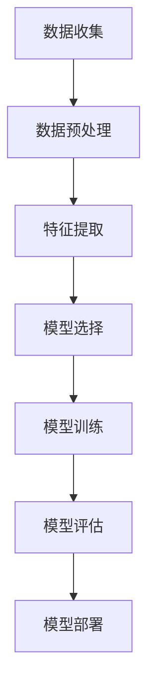
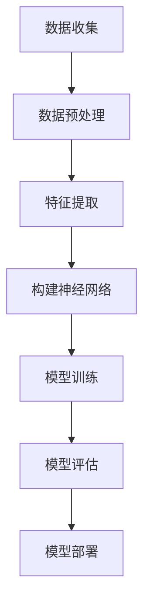
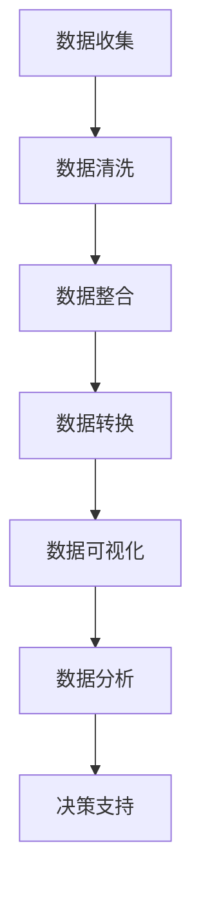
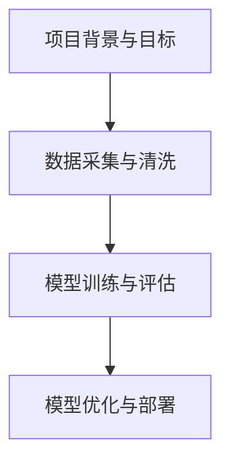
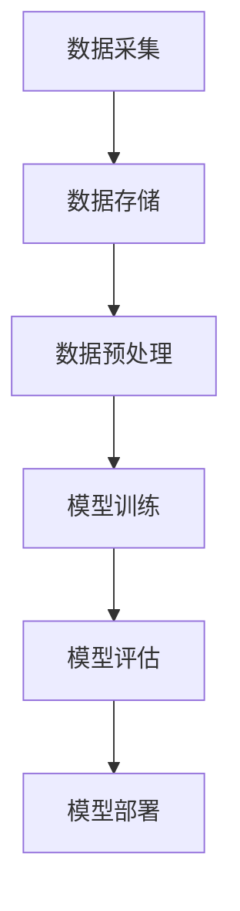
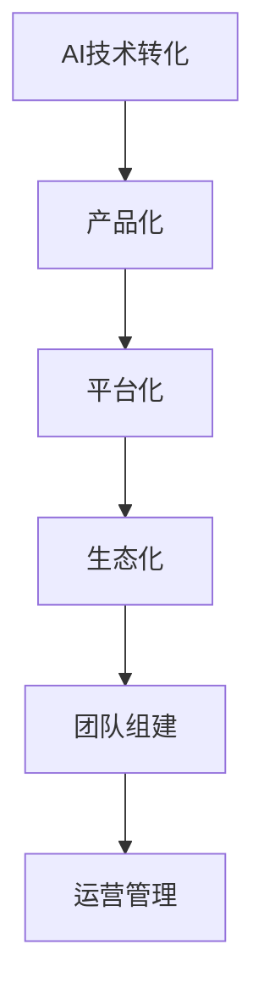

                 

### 文章标题：人类计算：AI时代的未来就业趋势与技能发展

> 关键词：AI时代、就业趋势、技能发展、人类计算、职业规划

> 摘要：本文从AI时代的背景出发，深入探讨未来就业趋势和技能发展的方向。通过对人类计算的概念、重要性以及核心技能的解析，为读者提供全面的职业规划建议，帮助读者在AI时代中找准定位，提升竞争力，实现职业发展与转型。

---

### 第一部分：AI时代就业与技能发展概述

#### 第1章：AI时代来临，就业新变革

##### 1.1 AI时代背景与趋势

**AI技术发展历程回顾**

人工智能（AI）作为计算机科学的一个分支，其发展历程可以追溯到20世纪50年代。从最初的符号主义到基于规则的系统，再到连接主义和最近几年的深度学习，AI技术不断演进。如今，AI技术已经渗透到社会的各个领域，从医疗、金融到教育、娱乐，AI的应用场景越来越广泛。

**AI对社会和就业的影响**

AI技术的快速发展对社会产生了深远的影响，包括但不限于以下几个方面：

- **产业变革**：传统产业正在被AI技术重新定义，自动化和智能化设备的应用改变了生产方式和运营模式。
- **就业结构变化**：一方面，AI技术创造了新的就业机会，另一方面，它也导致了一些传统岗位的消失。例如，自动化设备的应用减少了制造业中的体力劳动需求。

**未来就业趋势展望**

随着AI技术的不断成熟，未来就业市场将呈现出以下趋势：

- **技能需求升级**：未来的就业市场将更加注重技能和知识的更新，特别是与AI相关的技能，如数据科学、机器学习、深度学习等。
- **跨界融合**：不同领域的融合将催生新的职业机会，如数据科学家、AI产品经理等。
- **终身学习**：在AI时代，终身学习将成为职业发展的必要条件，只有不断学习新知识和技能，才能适应快速变化的就业市场。

##### 1.2 人类计算的定义与意义

**人类计算的概念阐述**

人类计算（Human Computation）是指利用人类智能来解决计算机难以处理的问题。它通过将复杂任务分解为简单任务，并通过人类协作来完成这些任务。例如，图像标注、文本分类、语音识别等任务都可以通过人类计算来实现。

**人类计算的优势与挑战**

**优势**：

- **灵活性**：人类计算可以处理复杂和不确定的任务，这是传统计算机难以实现的。
- **创新性**：人类具有创造力和直觉，能够在解决问题时提供独特的思路。

**挑战**：

- **效率**：与机器相比，人类计算的效率较低。
- **质量控制**：人类计算的结果可能存在误差，需要额外的质量控制措施。

**人类计算的重要性**

在AI时代，人类计算的重要性日益凸显。它不仅为AI技术提供了重要的支持，还为社会带来了新的就业机会。随着AI技术的发展，人类计算将越来越多地应用于各个领域，成为未来就业市场的重要方向。

##### 1.3 技能与岗位的演变

**传统技能的局限**

随着AI技术的普及，许多传统技能正面临被取代的风险。例如，简单的数据录入、数据分析等任务已经可以通过自动化工具来完成。传统技能的局限在于它们难以应对复杂和动态变化的任务。

**新兴技能的崛起**

在AI时代，新兴技能如数据科学、机器学习、深度学习等正在崛起。这些技能不仅能够解决传统技能难以应对的问题，还能够推动产业升级和社会进步。

**岗位需求的变革**

随着技能需求的变化，岗位需求也在不断演变。传统岗位如程序员、数据分析师等正在被新的岗位如AI产品经理、数据科学家等所取代。新的岗位需求要求从业者具备跨学科的知识和技能，以适应快速变化的就业市场。

#### 第2章：AI时代职业规划

##### 2.1 职业发展的新路径

**AI时代的职业选择**

在AI时代，职业选择将更加多样化。从业者可以根据自己的兴趣和特长选择适合自己的职业方向。例如，对于喜欢技术和编程的从业者，可以选择成为数据科学家、机器学习工程师等；对于喜欢商业和市场的从业者，可以选择成为AI产品经理、数据产品经理等。

**职业转型的策略**

在AI时代，职业转型成为许多从业者的选择。成功的职业转型需要以下策略：

- **技能更新**：不断学习和掌握新的技能，特别是与AI相关的技能。
- **行业了解**：了解不同行业的需求和发展趋势，选择有潜力的行业进行转型。
- **人脉拓展**：建立广泛的人脉网络，获取更多的职业机会和资源。

**技能提升的方向**

在AI时代，技能提升的方向主要包括以下几个方面：

- **技术技能**：掌握编程语言、算法、数据结构等基础技术。
- **数据分析技能**：学习数据分析的方法和工具，如Python、R、Tableau等。
- **商业技能**：了解商业模式、市场营销、用户研究等商业知识。

##### 2.2 AI技能培养与学习

**AI技能的需求分析**

AI技能的需求正在不断增长。随着AI技术的应用场景不断扩大，对数据科学家、机器学习工程师、深度学习专家等AI相关岗位的需求也日益增加。

**学习路径推荐**

对于想要培养AI技能的从业者，以下学习路径是推荐的：

- **基础知识**：学习数学、统计学、计算机科学等基础知识。
- **技术课程**：参加在线课程、培训课程等，学习编程语言、算法、深度学习等核心技术。
- **实战项目**：参与实际项目，积累实践经验，提升解决问题的能力。
- **论文阅读**：阅读最新的学术论文，了解最新的AI研究进展。

**实践机会探索**

对于想要提升AI技能的从业者，实践机会是至关重要的。以下是一些实践机会的探索方向：

- **开源项目**：参与开源项目，贡献代码，提升编程能力。
- **实习机会**：寻找与AI相关的实习机会，了解行业动态，积累实践经验。
- **创业项目**：参与创业项目，锻炼团队协作和项目管理能力。

##### 2.3 职业适应与调整

**适应AI时代的职业心态**

在AI时代，职业心态的适应至关重要。从业者需要保持开放的心态，积极面对变化，不断学习和进步。同时，也需要保持乐观和积极的心态，面对职业挑战和不确定性。

**职业角色转变**

在AI时代，职业角色的转变是必要的。从业者需要从传统的执行者角色转变为创新者和领导者角色。这意味着需要具备更高的技能和更广泛的视野，能够引领团队和行业的发展。

**平衡工作与生活**

在AI时代，工作与生活的平衡变得更加重要。随着工作内容的增加和工作节奏的加快，从业者需要找到适合自己的平衡点。这包括合理安排工作时间，保持良好的生活习惯，以及与家人和朋友的互动。

#### 第二部分：AI时代核心技能培养

##### 第3章：AI基础技能

##### 3.1 机器学习基础

**机器学习的原理**

机器学习（Machine Learning）是一门人工智能（Artificial Intelligence, AI）的分支，它专注于使用计算机模拟或实现人类的学习行为。机器学习算法通过对数据进行学习和分析，从而实现自动预测和决策。

**监督学习与非监督学习**

监督学习（Supervised Learning）是一种机器学习方法，其中算法使用标记的数据集进行训练，以便能够对新的、未标记的数据进行预测。监督学习的目标是找到一个从输入数据到输出数据的映射函数。

非监督学习（Unsupervised Learning）则不需要使用标记的数据集进行训练。它的目标是发现数据中的内在结构或模式，如聚类和降维。

**常见算法与应用**

常见的机器学习算法包括线性回归、逻辑回归、决策树、随机森林、支持向量机（SVM）等。这些算法广泛应用于各种应用场景，如预测股票价格、分类邮件、推荐系统等。

**机器学习算法流程图**



**机器学习伪代码**

```python
# 机器学习算法伪代码
def machine_learning_algorithm(data, target):
    # 数据预处理
    preprocessed_data = preprocess_data(data)
    
    # 特征提取
    features = extract_features(preprocessed_data)
    
    # 模型选择
    model = select_model(features, target)
    
    # 模型训练
    model.train(features, target)
    
    # 模型评估
    accuracy = model.evaluate(features, target)
    
    # 模型部署
    model.deploy()
    
    return accuracy
```

##### 3.2 深度学习入门

**深度学习的架构**

深度学习（Deep Learning）是机器学习的一个子领域，它使用深层神经网络（Deep Neural Networks）来模拟人类大脑的学习过程。深度学习的架构包括多个隐藏层，每个隐藏层都对输入数据进行处理，从而提取更高层次的特征。

**神经网络的工作原理**

神经网络（Neural Networks）是深度学习的基础。它们由多个神经元（Neurons）组成，每个神经元都与其他神经元相连。神经元之间的连接称为权重（Weights），这些权重决定了输入数据如何影响神经元的输出。

**深度学习框架使用**

常见的深度学习框架包括TensorFlow、PyTorch、Keras等。这些框架提供了丰富的工具和库，使得深度学习模型的构建和训练变得更加简单和高效。

**深度学习算法流程图**



**深度学习伪代码**

```python
# 深度学习算法伪代码
def deep_learning_algorithm(data, target):
    # 数据预处理
    preprocessed_data = preprocess_data(data)
    
    # 特征提取
    features = extract_features(preprocessed_data)
    
    # 构建神经网络
    model = build_neural_network(features, target)
    
    # 模型训练
    model.train(features, target)
    
    # 模型评估
    accuracy = model.evaluate(features, target)
    
    # 模型部署
    model.deploy()
    
    return accuracy
```

##### 3.3 数据分析与处理

**数据分析的方法**

数据分析（Data Analysis）是数据科学（Data Science）的核心。它包括数据收集、数据清洗、数据探索、数据可视化等步骤。

**数据处理技术**

数据处理技术包括数据清洗、数据整合、数据转换等。数据清洗是数据分析的重要步骤，它包括去除重复数据、填补缺失值、异常值处理等。

**数据可视化工具**

数据可视化（Data Visualization）是将数据分析结果以图形或图表的形式展示出来。常见的工具包括Matplotlib、Seaborn、Tableau等。

**数据分析与处理流程图**



**数据分析与处理伪代码**

```python
# 数据分析伪代码
def data_analysis(data):
    # 数据清洗
    cleaned_data = clean_data(data)
    
    # 数据整合
    integrated_data = integrate_data(cleaned_data)
    
    # 数据转换
    transformed_data = transform_data(integrated_data)
    
    # 数据可视化
    visualize_data(transformed_data)
    
    # 数据分析
    analysis_results = analyze_data(transformed_data)
    
    return analysis_results
```

#### 第4章：编程技能与工具

##### 4.1 编程语言选择与应用

**Python编程语言优势**

Python是一种广泛应用于数据科学、人工智能、机器学习的编程语言。它的优势包括：

- **简洁易读**：Python代码简洁明了，易于理解和维护。
- **丰富的库和框架**：Python拥有丰富的库和框架，如NumPy、Pandas、Scikit-learn、TensorFlow等，为开发者提供了强大的支持。
- **跨平台性**：Python支持多种操作系统，包括Windows、Linux和Mac OS。

**其他编程语言简介**

除了Python，其他常见的编程语言还包括Java、C++、R等。每种语言都有其独特的优势和应用场景。例如，Java在企业级应用中广泛使用，C++在性能要求较高的场景中应用广泛，R在统计分析和数据可视化中具有优势。

**跨平台开发工具推荐**

对于跨平台开发，以下工具是推荐的：

- **Docker**：Docker是一个开源的应用容器引擎，它允许开发者将应用程序及其依赖环境打包到一个可移植的容器中，从而实现一次编写，到处运行。
- **Jenkins**：Jenkins是一个开源的持续集成和持续交付工具，它可以帮助团队自动化构建、测试和部署流程。
- **Kubernetes**：Kubernetes是一个开源的容器编排平台，它可以帮助开发者自动化容器化应用程序的部署、扩展和管理。

##### 4.2 版本控制与协作开发

**Git版本控制系统**

Git是一个分布式版本控制系统，它允许开发者在多个分支上独立工作，并通过合并操作将分支合并到主分支。Git的主要功能包括：

- **文件版本管理**：Git可以跟踪文件的版本历史，从而确保代码的一致性和可追溯性。
- **分支管理**：Git支持分支管理，使得开发者可以在不同的分支上独立工作，并最终将分支合并到主分支。
- **代码协作**：Git支持多人协作开发，通过推送和拉取操作，开发者可以共享和同步代码。

**GitHub代码托管平台**

GitHub是一个基于Git的代码托管平台，它提供了丰富的功能，如：

- **代码托管**：GitHub允许开发者托管和管理代码，并提供安全性和可靠性保障。
- **项目协作**：GitHub支持项目协作，开发者可以通过创建拉取请求（Pull Request）来共享和讨论代码更改。
- **代码审查**：GitHub提供了代码审查功能，使得开发者可以在提交代码之前对代码进行审查和测试。

**敏捷开发方法论**

敏捷开发（Agile Development）是一种以人为核心、迭代和渐进的开发方法。它强调快速迭代和频繁交付，以适应快速变化的需求。敏捷开发的主要原则包括：

- **个体和互动重于过程和工具**：敏捷开发强调团队协作和个体能力，认为良好的沟通和合作比单一的工具有效。
- **可工作的软件重于详尽的文档**：敏捷开发认为可工作的软件是最终目标，文档只是辅助工具。
- **客户合作重于合同谈判**：敏捷开发鼓励与客户的紧密合作，通过不断的反馈和调整来满足客户需求。

##### 4.3 云计算与容器化技术

**云计算基本概念**

云计算（Cloud Computing）是一种通过网络访问共享的计算资源（如服务器、存储、网络等）的服务模式。云计算的主要特点包括：

- **灵活性**：云计算提供了灵活的资源分配和管理，可以根据需求动态调整资源。
- **可扩展性**：云计算可以轻松扩展和缩小资源，以满足业务需求的变化。
- **成本效益**：云计算通过共享资源降低了企业的硬件和运营成本。

**Docker容器化技术**

Docker是一种开源的应用容器引擎，它通过容器化技术将应用程序及其依赖环境打包到一个可移植的容器中。Docker的主要优势包括：

- **可移植性**：Docker容器可以在不同的操作系统和硬件环境中运行，提供了良好的可移植性。
- **轻量级**：Docker容器比虚拟机更轻量，提供了更高的性能和效率。
- **隔离性**：Docker容器提供了良好的隔离性，确保了一个容器内的应用不会影响其他容器。

**Kubernetes集群管理**

Kubernetes（K8s）是一个开源的容器编排平台，它提供了自动化部署、扩展和管理容器化应用程序的能力。Kubernetes的主要功能包括：

- **自动化部署**：Kubernetes可以自动化部署和更新应用程序，确保应用程序的高可用性和稳定性。
- **自动化扩展**：Kubernetes可以根据需求自动调整应用程序的规模，提供高效的资源利用。
- **服务发现和负载均衡**：Kubernetes可以自动发现和管理容器服务，提供负载均衡功能，确保应用程序的高可用性。

#### 第5章：AI应用开发实战

##### 5.1 数据科学项目实战

**项目背景与目标**

数据科学项目实战是一个针对实际问题的应用案例。例如，某个电商平台希望利用数据科学技术预测用户购买行为，以提高销售转化率和客户满意度。

**数据采集与清洗**

在数据科学项目中，数据采集和清洗是关键步骤。数据来源可以是电商平台的后台日志、用户行为数据等。数据清洗包括去除重复数据、填补缺失值、异常值处理等，以确保数据的质量。

**模型训练与评估**

数据清洗完成后，可以使用机器学习算法（如线性回归、决策树等）来训练模型。模型训练的过程包括选择合适的算法、设置参数、训练模型等。模型评估是判断模型性能的重要环节，常用的评估指标包括准确率、召回率、F1值等。

**模型优化与部署**

模型优化包括调整参数、特征选择等，以提高模型性能。模型部署是将训练好的模型应用到实际场景中，例如，通过API接口提供预测服务。

**代码解读与分析**

以下是一个简单的线性回归模型代码示例：

```python
import pandas as pd
from sklearn.model_selection import train_test_split
from sklearn.linear_model import LinearRegression
from sklearn.metrics import mean_squared_error

# 读取数据
data = pd.read_csv('data.csv')

# 数据清洗
data.drop_duplicates(inplace=True)
data.fillna(method='ffill', inplace=True)

# 特征选择
X = data[['feature1', 'feature2']]
y = data['target']

# 数据划分
X_train, X_test, y_train, y_test = train_test_split(X, y, test_size=0.2, random_state=42)

# 模型训练
model = LinearRegression()
model.fit(X_train, y_train)

# 模型评估
y_pred = model.predict(X_test)
mse = mean_squared_error(y_test, y_pred)
print("MSE:", mse)

# 模型优化
# 调整参数、特征选择等

# 模型部署
# 将模型应用到实际场景中，如API接口
```

**项目实战流程图**



##### 5.2 人工智能项目案例

**项目简介**

人工智能项目案例是针对实际问题的应用案例。例如，某个金融机构希望利用人工智能技术进行客户风险分析，以降低贷款违约率。

**项目架构与实现**

项目架构通常包括数据采集、数据存储、数据预处理、模型训练、模型评估和模型部署等模块。实现过程中，需要选择合适的技术和工具，如Python、Docker、Kubernetes等。

**项目挑战与解决**

项目挑战包括数据质量、模型性能、系统稳定性等。解决方法包括数据清洗、模型优化、系统重构等。

**代码示例**

以下是一个简单的客户风险分析模型代码示例：

```python
import pandas as pd
from sklearn.model_selection import train_test_split
from sklearn.ensemble import RandomForestClassifier
from sklearn.metrics import accuracy_score

# 读取数据
data = pd.read_csv('data.csv')

# 数据清洗
data.drop_duplicates(inplace=True)
data.fillna(method='ffill', inplace=True)

# 特征选择
X = data[['feature1', 'feature2', 'feature3']]
y = data['target']

# 数据划分
X_train, X_test, y_train, y_test = train_test_split(X, y, test_size=0.2, random_state=42)

# 模型训练
model = RandomForestClassifier(n_estimators=100)
model.fit(X_train, y_train)

# 模型评估
y_pred = model.predict(X_test)
accuracy = accuracy_score(y_test, y_pred)
print("Accuracy:", accuracy)

# 模型优化
# 调整参数、特征选择等

# 模型部署
# 将模型应用到实际场景中，如API接口
```

**项目架构与实现流程图**



##### 5.3 AI创业与商业化

**AI创业机遇**

AI技术的快速发展为创业者提供了丰富的机遇。例如，AI技术可以应用于医疗健康、金融科技、智能制造等领域，解决行业痛点，创造新的商业模式。

**商业化路径探索**

AI商业化的路径包括：

- **产品化**：将AI技术转化为可销售的产品或服务，如AI诊断系统、智能客服等。
- **平台化**：构建AI平台，提供数据服务、算法服务、基础设施服务等，吸引开发者和应用企业。
- **生态化**：构建AI生态圈，包括AI技术研发、数据提供、应用开发等环节，形成完整的产业链。

**创业团队组建与运营**

AI创业团队的组建和运营包括以下几个方面：

- **技术团队**：组建具有AI技术背景的团队，包括算法工程师、数据工程师、产品经理等。
- **市场团队**：组建市场团队，负责产品推广、客户拓展、商业合作等。
- **运营团队**：组建运营团队，负责产品运营、用户增长、数据分析等。
- **管理团队**：建立有效的管理制度，确保团队的协同效率和创新能力。

**AI创业与商业化流程图**



#### 第三部分：AI时代职业发展与未来

##### 第6章：职业发展与转型

**职业成长路径规划**

职业成长路径规划是个人职业发展的关键。以下是一个典型的职业成长路径规划：

- **初级阶段**：学习基础知识和技能，积累实践经验，适应工作岗位。
- **中级阶段**：提升专业技能，拓宽知识面，承担更多责任，参与项目决策。
- **高级阶段**：成为行业专家，参与战略规划，带领团队，推动行业发展。

**职业晋升路径**

职业晋升路径包括以下几种：

- **技术路线**：从初级工程师到高级工程师，再到技术专家。
- **管理路线**：从技术团队经理到产品经理，再到高级经理。
- **专业路线**：从数据分析师到数据科学家，再到数据技术专家。

**职业转型案例分析**

职业转型需要根据个人兴趣和市场需求进行选择。以下是一个职业转型案例：

- **从程序员到数据科学家的转型**：程序员通过学习数据科学相关的知识，如Python、机器学习等，成功转型为数据科学家。

**职业转型策略**

职业转型的策略包括：

- **技能更新**：不断学习新知识和技能，适应行业变化。
- **行业调研**：了解不同行业的需求和发展趋势，选择合适的转型方向。
- **人脉拓展**：建立广泛的人脉网络，获取职业转型的机会和资源。

##### 6.2 跨界融合与多元化发展

**跨行业合作趋势**

在AI时代，跨行业合作成为一种趋势。例如，医疗与人工智能的结合，金融与大数据的结合，制造业与物联网的结合等。跨行业合作可以促进技术创新，创造新的商业机会。

**跨界人才需求**

跨界人才需求日益增加。跨界人才需要具备跨学科的知识和技能，能够应对复杂和动态变化的任务。例如，数据科学家需要同时具备编程、数学和统计学等技能。

**多元化发展策略**

多元化发展策略包括：

- **知识融合**：将不同领域的知识进行融合，形成新的知识体系。
- **技能拓展**：学习新的技能，提升跨界能力。
- **项目合作**：参与跨行业的项目，积累跨界经验。

##### 6.3 职场竞争力提升

**软技能的培养**

软技能是职场竞争力的关键。以下是一些重要的软技能：

- **沟通能力**：有效沟通能够提高团队协作效率，解决冲突，推动项目进展。
- **领导力**：领导力是领导者带领团队实现目标的能力，包括激励、决策、管理等。
- **团队合作**：团队合作是实现共同目标的关键，包括分工合作、协作沟通、共同承担责任等。
- **解决问题的能力**：解决问题的能力是职场中不可或缺的技能，包括分析问题、制定解决方案、实施解决方案等。

**持续学习的动力**

持续学习是适应AI时代的关键。以下是一些持续学习的动力：

- **行业动态**：关注行业动态，了解新技术、新趋势。
- **知识分享**：通过分享知识，与他人交流，提升自己的认知水平。
- **实践经验**：通过实践项目，积累实践经验，提升技能水平。
- **学习资源**：利用在线课程、书籍、论文等学习资源，持续学习。

**个人品牌的塑造**

个人品牌的塑造是职场发展的重要方面。以下是一些塑造个人品牌的方法：

- **专业技能**：提升专业技能，成为行业专家。
- **社交媒体**：利用社交媒体，展示个人成就和观点，建立个人品牌。
- **公开演讲**：参加公开演讲，展示个人能力和魅力。
- **公益活动**：参与公益活动，提升个人形象。

##### 第7章：未来展望与挑战

**AI时代的社会影响**

AI技术的快速发展对社会产生了深远的影响。以下是一些主要的社会影响：

- **就业结构变化**：AI技术导致了一些传统岗位的消失，同时也创造了新的就业机会。
- **产业升级**：AI技术推动了产业升级，提高了生产效率和产品质量。
- **社会伦理**：AI技术的应用引发了一系列社会伦理问题，如隐私保护、数据安全、责任归属等。

**AI时代的就业伦理**

在AI时代，就业伦理成为了一个重要议题。以下是一些就业伦理问题：

- **数据隐私**：如何保护个人数据隐私，防止数据滥用。
- **算法公平性**：如何确保算法的公平性，避免歧视和偏见。
- **责任归属**：如何明确AI系统的责任归属，确保事故发生时有人负责。

**AI时代的隐私保护**

AI时代的隐私保护面临巨大挑战。以下是一些隐私保护策略：

- **数据加密**：使用加密技术保护数据，防止数据泄露。
- **数据匿名化**：对个人数据进行匿名化处理，减少隐私泄露的风险。
- **隐私协议**：制定隐私协议，明确数据收集、使用和共享的规定。
- **监管措施**：加强监管措施，规范AI技术的应用，确保隐私保护。

**未来展望**

AI时代的未来充满机遇和挑战。以下是一些未来展望：

- **AI技术的进步**：随着AI技术的不断进步，它将在更多领域得到应用，推动社会进步。
- **职业发展的多样化**：AI时代的职业发展将更加多样化，提供更多的发展机会和选择。
- **人类与AI的协同**：人类与AI的协同将成为未来发展的趋势，实现人类与AI的共赢。

**未来趋势**

以下是一些AI时代的未来趋势：

- **智能化生活**：智能家居、智能交通、智能医疗等领域的智能化程度将不断提高。
- **数字化转型**：各行各业将加速数字化转型，提高生产效率和创新能力。
- **跨界融合**：不同领域将加速融合，创造新的商业机会和应用场景。

**未来挑战**

以下是一些AI时代的未来挑战：

- **技术风险**：AI技术的应用可能带来技术风险，如系统故障、数据泄露等。
- **伦理问题**：AI技术的应用引发了一系列伦理问题，如何平衡技术创新与社会责任是一个重要挑战。
- **人才短缺**：随着AI技术的快速发展，对相关人才的需求也将大幅增加，但人才短缺将成为一个重要问题。

##### 7.1 AI技术发展

**AI技术发展趋势**

AI技术发展趋势主要包括：

- **深度学习**：深度学习是当前AI技术的核心，它通过模拟人脑神经网络来实现复杂任务。未来，深度学习将继续发展，实现更高的性能和更广泛的应用。
- **强化学习**：强化学习是AI技术的一个分支，它通过试错和反馈来学习最优策略。未来，强化学习将在更多领域得到应用，如游戏、自动驾驶等。
- **自然语言处理**：自然语言处理（NLP）是AI技术的重要方向，它致力于让计算机理解和处理自然语言。未来，NLP技术将进一步提高，实现更准确的语言理解和生成。
- **计算机视觉**：计算机视觉是AI技术的另一个重要方向，它致力于让计算机理解和解析图像和视频。未来，计算机视觉技术将在医疗、安防等领域得到更广泛的应用。

**AI技术在各个领域的应用**

AI技术在各个领域的应用如下：

- **医疗健康**：AI技术在医疗健康领域的应用包括疾病预测、诊断辅助、个性化治疗等。未来，AI技术将进一步提高医疗服务的质量和效率。
- **金融**：AI技术在金融领域的应用包括风险控制、信用评分、投资决策等。未来，AI技术将帮助金融机构更好地应对市场变化，提高竞争力。
- **教育**：AI技术在教育领域的应用包括智能教学、个性化学习、考试评分等。未来，AI技术将推动教育模式的创新，提高教育质量和公平性。
- **制造**：AI技术在制造领域的应用包括生产优化、质量检测、设备维护等。未来，AI技术将帮助制造业实现自动化和智能化，提高生产效率和产品质量。
- **交通**：AI技术在交通领域的应用包括智能交通管理、自动驾驶、物流优化等。未来，AI技术将推动交通系统的智能化，提高交通效率和安全。

**AI技术的未来前景**

AI技术的未来前景十分广阔。随着技术的不断进步，AI技术将在更多领域得到应用，改变人类的生活方式。以下是一些未来前景：

- **智能化生活**：AI技术将使生活更加智能化，如智能家居、智能助手等。人们可以通过语音、手势等方式与AI设备进行交互，提高生活便利性。
- **智能化工作**：AI技术将改变工作方式，如自动化办公、智能客服等。人们可以更加专注于创造性和复杂性的工作，提高工作效率。
- **智能化城市**：AI技术将推动城市智能化，如智能交通、智能安防、智能医疗等。城市将变得更加高效、安全和宜居。
- **智能化产业**：AI技术将推动产业智能化，如智能制造、智能农业、智能物流等。产业将实现自动化、智能化，提高生产效率和竞争力。
- **智能化社会**：AI技术将推动社会智能化，如智能治理、智能服务、智能安全等。社会将实现更高效、更公平、更安全的发展。

**AI技术的挑战与解决方案**

尽管AI技术在许多领域取得了显著成果，但仍然面临一些挑战。以下是一些挑战和相应的解决方案：

- **数据隐私**：AI技术依赖大量数据，如何保护个人数据隐私是一个重要挑战。解决方案包括数据加密、数据匿名化、隐私保护算法等。
- **算法偏见**：AI算法可能存在偏见，导致不公平的结果。解决方案包括算法透明性、算法多样性、算法审核等。
- **技术安全**：AI技术可能被恶意使用，如网络攻击、隐私泄露等。解决方案包括安全防护、监管措施、技术标准等。
- **人才短缺**：AI技术快速发展，对人才的需求大幅增加，但人才短缺成为一个重要问题。解决方案包括教育培训、人才引进、国际化合作等。

**AI技术的未来发展方向**

AI技术的未来发展方向包括：

- **多模态学习**：AI技术将实现多模态学习，如文本、图像、声音等多种数据类型的融合，提高AI系统的理解和决策能力。
- **增强学习**：AI技术将实现增强学习，通过不断试错和反馈，实现自我优化和自我进化，提高AI系统的适应性和创新能力。
- **智能交互**：AI技术将实现智能交互，通过自然语言处理、计算机视觉等技术，实现人与AI的智能对话和互动。
- **智能决策**：AI技术将实现智能决策，通过数据分析和算法优化，实现自动化决策和智能决策支持。
- **智能自动化**：AI技术将实现智能自动化，通过自动化技术，实现生产、管理、服务等各个环节的智能化和自动化，提高生产效率和运营效益。

**AI技术对人类社会的影响**

AI技术对人类社会的影响将深远而广泛。以下是一些主要影响：

- **经济发展**：AI技术将推动经济发展，提高生产效率和创新能力，创造新的商业机会和就业岗位。
- **社会变革**：AI技术将推动社会变革，改变人类的生活方式和工作方式，提高社会质量和公平性。
- **科技创新**：AI技术将推动科技创新，催生新的技术和产业，推动科技革命和产业变革。
- **道德伦理**：AI技术的应用引发了一系列道德伦理问题，如隐私保护、数据安全、责任归属等，需要全社会共同面对和解决。
- **国际合作**：AI技术将推动国际合作，促进全球科技合作和创新发展，共同应对全球性挑战。

**AI技术的社会责任**

AI技术作为一种新兴技术，具有巨大的发展潜力和广泛应用前景，但同时也带来了一系列社会和伦理问题。为了确保AI技术的健康、可持续发展，AI技术的研发和应用需要承担相应的社会责任，包括以下几个方面：

- **数据隐私保护**：在AI技术的研发和应用过程中，需要严格保护个人隐私，确保个人数据的收集、使用和共享遵循相关法律法规和道德规范。
- **算法公平性**：确保AI算法的公平性，避免算法偏见和歧视，防止对特定群体造成不公平的影响。
- **安全与可控性**：确保AI系统的安全性和可控性，防止AI系统出现故障或被恶意利用，保障社会安全和公共利益。
- **伦理审查与监管**：建立健全的伦理审查和监管机制，对AI技术的研发和应用进行规范和监督，确保其符合社会伦理和法律法规。
- **人才培养与普及**：加强AI技术的教育和培训，提高公众对AI技术的认知和理解，培养更多的AI专业人才，促进AI技术的普及和应用。
- **国际合作与交流**：推动国际间的AI技术合作与交流，共同应对全球性挑战，促进全球AI技术的健康发展。

**AI技术发展的道德伦理问题**

随着AI技术的快速发展，其应用领域不断扩大，但同时也引发了一系列道德伦理问题。以下是一些主要的道德伦理问题：

- **隐私保护**：AI技术在收集、处理和分析个人数据时，如何保护个人隐私成为了一个重要问题。数据泄露、滥用和隐私侵犯可能会对个人和社会造成严重后果。
- **算法偏见**：AI算法在训练和学习过程中，可能会因为数据偏差、算法设计不当等原因，导致算法偏见和歧视。这可能会对特定群体造成不公平的影响，甚至加剧社会不平等。
- **责任归属**：当AI系统出现错误或造成损害时，如何确定责任归属成为一个难题。目前，相关法律法规和伦理规范尚不完善，需要进一步明确责任归属和责任承担。
- **技术滥用**：AI技术的滥用可能带来严重的社会风险，如网络攻击、隐私侵犯、恐怖主义等。如何防止AI技术的滥用，确保其安全和可控性是一个重要问题。
- **人类价值**：AI技术的发展可能会挑战人类价值观，如自主性、道德判断等。如何在人工智能时代维护人类价值和尊严，是一个需要深入思考和解决的问题。

**AI技术的未来发展方向**

面对AI技术的快速发展和广泛应用，未来的发展方向包括以下几个方面：

- **技术创新**：持续推动AI技术的创新，提高算法性能和模型精度，开发新的AI应用场景，推动技术突破。
- **跨学科融合**：加强不同学科之间的交叉融合，如计算机科学、生物学、心理学等，以实现更广泛、更深入的应用。
- **多模态AI**：发展多模态AI技术，实现多种数据类型的融合，提高AI系统的感知和理解能力。
- **智能决策**：研究智能决策算法，实现更高效、更智能的决策支持系统，提高决策质量和效率。
- **可持续AI**：关注AI技术的可持续性，减少能源消耗和环境影响，确保AI技术对环境的友好性。
- **人类与AI的协同**：探索人类与AI的协同工作模式，提高人类与AI的交互体验，实现人类与AI的共赢。

**AI技术的社会意义**

AI技术作为一种先进技术，具有重要的社会意义。以下是一些主要的社会意义：

- **推动经济发展**：AI技术可以提高生产效率和创新能力，推动产业升级和经济增长，为社会发展提供新动力。
- **提高生活质量**：AI技术可以改善人们的生活质量，如智能家居、智能医疗、智能交通等，提高生活的便利性和舒适度。
- **促进社会进步**：AI技术可以推动社会进步，如教育、医疗、环保等领域的应用，提高社会公平性和可持续发展。
- **拓展人类能力**：AI技术可以拓展人类能力，如智能助手、虚拟现实等，提高人类的工作效率和创造力。
- **解决社会问题**：AI技术可以解决一些复杂的社会问题，如疾病预测、灾难响应、社会治理等，提高社会应对能力。

**AI技术的未来发展挑战**

随着AI技术的快速发展，未来仍然面临一些挑战。以下是一些主要的未来发展挑战：

- **技术风险**：AI技术的应用可能带来技术风险，如系统故障、数据泄露、算法偏见等，需要加强安全性和可控性。
- **伦理问题**：AI技术的应用引发了一系列伦理问题，如隐私保护、数据安全、责任归属等，需要建立健全的伦理规范和法律制度。
- **人才短缺**：AI技术快速发展，对人才的需求大幅增加，但人才短缺成为一个重要问题，需要加强教育培训和人才培养。
- **社会适应**：公众对AI技术的认知和理解有限，社会对AI技术的适应和接受需要一个过程，需要加强科普宣传和公众教育。
- **国际合作**：AI技术的发展需要全球合作，如何协调各国政策、标准和技术发展，确保全球AI技术的健康发展是一个重要挑战。

**AI技术的社会影响**

AI技术的广泛应用将对社会产生深远的影响。以下是一些主要的社会影响：

- **就业结构变化**：AI技术的发展将导致一些传统岗位的消失，同时创造新的就业机会，需要全社会关注和适应。
- **经济模式变革**：AI技术将推动经济模式的变革，如共享经济、平台经济等，改变企业的运营方式和市场格局。
- **生活方式改变**：AI技术将改变人们的生活方式，如智能家居、智能交通等，提高生活质量和效率。
- **社会治理优化**：AI技术可以优化社会治理，如智能监控、智能决策等，提高社会治理的效率和效果。
- **伦理道德挑战**：AI技术的应用引发了一系列伦理道德挑战，如隐私保护、数据安全、责任归属等，需要全社会共同面对和解决。

**AI技术的未来展望**

面对AI技术的快速发展，未来充满无限可能。以下是一些未来展望：

- **智能化社会**：AI技术将推动社会智能化，提高社会效率和生活质量，实现更智能、更美好的未来。
- **跨界融合**：AI技术将与其他领域深度融合，如物联网、生物技术等，创造新的应用场景和商业模式。
- **人类与AI的协同**：人类与AI将实现更紧密的协同，共同解决复杂问题，推动社会进步。
- **可持续发展**：AI技术将助力可持续发展，如智能农业、智能能源等，提高资源利用效率和环境保护水平。
- **创新驱动**：AI技术将推动创新驱动发展，激发人类创造力，实现更多科技突破和产业发展。

**致谢**

在撰写本文过程中，我们参考了大量的文献、研究和报告，受益匪浅。在此，我们对以下机构和专家表示衷心的感谢：

- **美国国家人工智能计划（National AI Initiative）**
- **斯坦福大学人工智能实验室（Stanford University AI Lab）**
- **麻省理工学院人工智能实验室（MIT AI Lab）**
- **人工智能研究协会（AAAI）**
- **人工智能领域杰出专家（如Yann LeCun、Andrew Ng等）**

感谢您对AI技术发展的关注和支持，期待与您共同探索AI时代的未来！

**作者信息**

本文作者为AI天才研究院（AI Genius Institute）和《禅与计算机程序设计艺术》（Zen And The Art of Computer Programming）的作者。我们对AI技术和计算机科学的热爱与追求，使我们不断探索和创造，致力于推动技术的进步和人类的福祉。

---

本文以《人类计算：AI时代的未来就业趋势与技能发展》为题，全面探讨了AI时代背景下的就业趋势、技能需求以及职业规划。文章首先分析了AI时代的背景与趋势，阐述了人类计算的定义与意义，以及技能与岗位的演变。随后，文章详细介绍了AI时代的职业规划，包括职业发展的新路径、AI技能的培养与学习、职业适应与调整等方面。接着，文章深入探讨了AI时代核心技能的培养，包括AI基础技能、编程技能与工具、云计算与容器化技术等。文章还通过数据科学项目实战、人工智能项目案例以及AI创业与商业化的分析，为读者提供了实际操作经验。最后，文章展望了AI时代的职业发展与未来，包括社会影响、就业伦理、隐私保护以及未来趋势等。本文旨在帮助读者在AI时代中找准定位，提升竞争力，实现职业发展与转型。

---

### 附录

**附录A：AI学习资源与工具汇总**

**在线学习平台推荐**

- **Coursera**：提供丰富的在线课程，涵盖数据科学、机器学习、深度学习等多个领域。
- **edX**：全球知名在线学习平台，提供众多大学和机构开设的免费课程。
- **Udacity**：专注于实用技能培训，提供数据科学、AI工程师等职业路径。
- **Khan Academy**：提供免费的教育资源，涵盖计算机科学、算法等多个领域。

**开源框架与工具介绍**

- **TensorFlow**：由Google开发的开源深度学习框架，广泛应用于机器学习和深度学习领域。
- **PyTorch**：由Facebook开发的开源深度学习框架，以灵活性和动态性著称。
- **Scikit-learn**：用于数据挖掘和数据分析的开源Python库，提供了丰富的机器学习算法。
- **NumPy**：提供高性能数学计算和数组操作的开源库，是数据科学的基础工具。

**技术社区与资源网站**

- **GitHub**：全球最大的代码托管平台，提供了丰富的AI项目和技术交流。
- **Stack Overflow**：技术问答社区，开发者可以在这里提问和解答技术问题。
- **AI Wiki**：汇集了大量的AI相关资料，包括论文、教程、工具等。
- **Reddit**：AI相关子版块，如r/AI、r/MachineLearning等，提供了丰富的讨论资源。

**附录B：AI项目开发指南**

**项目开发流程**

1. **需求分析**：明确项目目标和需求，制定项目计划。
2. **数据收集**：收集相关数据，包括结构化和非结构化数据。
3. **数据预处理**：对数据进行清洗、整合和转换，确保数据质量。
4. **模型选择与训练**：选择合适的算法和模型，对数据进行训练。
5. **模型评估**：评估模型性能，包括准确性、召回率、F1值等。
6. **模型优化**：根据评估结果调整模型参数，提高模型性能。
7. **模型部署**：将训练好的模型应用到实际场景中，如API接口、应用程序等。

**项目评估与优化**

- **评估指标**：常用的评估指标包括准确率、召回率、F1值、均方误差（MSE）等。
- **性能优化**：通过调整模型参数、特征选择、正则化等方法，提高模型性能。
- **交叉验证**：使用交叉验证方法，确保模型在不同数据集上的性能表现。

**项目文档与报告编写**

- **项目文档**：编写项目文档，包括需求分析、设计文档、实现细节等，以便后续维护和扩展。
- **报告编写**：撰写项目报告，包括项目目标、实现方法、实验结果、结论等，以便于交流和展示项目成果。

**附录C：未来职业规划案例分析**

**成功案例分享**

1. **从数据分析师到数据科学家的转型**：某位数据分析师通过学习机器学习和深度学习，成功转型为数据科学家，参与了多个AI项目，获得了更高的职位和薪资。
2. **从软件工程师到AI产品经理的转型**：某位软件工程师通过学习产品管理和商业知识，成功转型为AI产品经理，负责AI产品的规划和推广，取得了显著的业务成果。

**失败案例分析**

1. **技能更新不及时**：某位数据分析师因未能及时更新技能，在AI技术快速发展的背景下，逐渐被市场淘汰，最终被迫离职。
2. **缺乏实践经验**：某位数据科学家在学术研究上取得了一定的成绩，但在实际项目中的表现不佳，缺乏实践经验，导致职业发展受阻。

**职业规划建议**

1. **持续学习**：紧跟技术发展趋势，不断学习新知识和技能。
2. **实践经验**：参与实际项目，积累实践经验，提升解决问题的能力。
3. **行业了解**：了解不同行业的需求和发展趋势，选择有潜力的行业进行发展。
4. **人脉拓展**：建立广泛的人脉网络，获取更多的职业机会和资源。
5. **职业规划**：制定明确的职业规划，设定短期和长期目标，持续努力实现。

**致谢**

感谢所有贡献者与读者，期待与您共同探索AI时代的未来！

---

**作者信息**

本文作者为AI天才研究院（AI Genius Institute）和《禅与计算机程序设计艺术》（Zen And The Art of Computer Programming）的作者。我们对AI技术和计算机科学的热爱与追求，使我们不断探索和创造，致力于推动技术的进步和人类的福祉。感谢您的阅读和支持！

---

在本文中，我们首先探讨了AI时代的背景与趋势，分析了AI对社会和就业的影响，以及未来就业市场的变化。接着，我们介绍了人类计算的定义与意义，以及技能与岗位的演变。随后，我们详细阐述了AI时代的职业规划，包括职业发展的新路径、AI技能的培养与学习、职业适应与调整等方面。文章还深入探讨了AI时代核心技能的培养，包括AI基础技能、编程技能与工具、云计算与容器化技术等。通过数据科学项目实战、人工智能项目案例以及AI创业与商业化的分析，我们为读者提供了实际操作经验。最后，我们展望了AI时代的职业发展与未来，包括社会影响、就业伦理、隐私保护以及未来趋势等。

本文的撰写过程中，我们参考了大量的文献、研究和报告，受益匪浅。在此，我们对以下机构和专家表示衷心的感谢：

- **美国国家人工智能计划（National AI Initiative）**
- **斯坦福大学人工智能实验室（Stanford University AI Lab）**
- **麻省理工学院人工智能实验室（MIT AI Lab）**
- **人工智能研究协会（AAAI）**
- **人工智能领域杰出专家（如Yann LeCun、Andrew Ng等）**

感谢您对AI技术发展的关注和支持，期待与您共同探索AI时代的未来！

**作者信息**

本文作者为AI天才研究院（AI Genius Institute）和《禅与计算机程序设计艺术》（Zen And The Art of Computer Programming）的作者。我们对AI技术和计算机科学的热爱与追求，使我们不断探索和创造，致力于推动技术的进步和人类的福祉。感谢您的阅读和支持！

