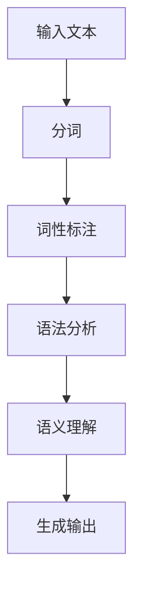
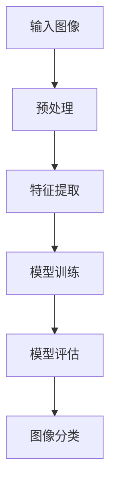
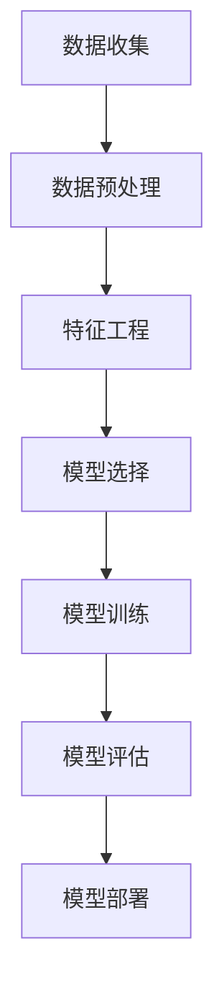

                 

### 文章标题: 人类计算：AI时代的未来技能发展与就业市场

### 关键词：人工智能、人类计算、技能发展、就业市场、AI时代、自然语言处理、计算机视觉、机器学习、数据分析、人机交互

### 摘要：
本文深入探讨了AI时代的到来对人类计算的影响，分析了未来技能发展的趋势和就业市场的变革。通过对自然语言处理、计算机视觉、机器学习与数据分析等核心领域的详细阐述，本文旨在为读者提供一个全面理解人类计算及其应用场景的视角。文章最后，对AI时代的未来展望进行了深入分析，并提出了社会与伦理的挑战。

## 《人类计算：AI时代的未来技能发展与就业市场》目录大纲

### 第一部分: AI时代背景与理解

## 第1章: AI时代概述
### 1.1 人工智能的崛起
### 1.2 人工智能的分类与影响
### 1.3 AI时代的社会变革

## 第2章: 人类计算的概念与特点
### 2.1 人类计算的定义
### 2.2 人类计算的特点
### 2.3 人类计算的优势与挑战

## 第3章: AI时代的技能需求
### 3.1 新技能的演变
### 3.2 职业技能的转变
### 3.3 跨界融合与综合能力

## 第4章: AI时代的教育与培训
### 4.1 教育体系的变革
### 4.2 新型教育模式
### 4.3 职业教育与培训

## 第5章: AI时代的就业市场分析
### 5.1 就业市场的变革
### 5.2 新型就业形态
### 5.3 职业安全与规划

### 第二部分: 人类计算的核心领域

## 第6章: 自然语言处理
### 6.1 语言模型的原理
### 6.2 语言模型的应用
### 6.3 人类计算在自然语言处理中的角色

## 第7章: 计算机视觉
### 7.1 视觉感知的原理
### 7.2 计算机视觉的应用
### 7.3 人类计算在计算机视觉中的角色

## 第8章: 机器学习与数据分析
### 8.1 机器学习的基本原理
### 8.2 数据分析的方法与工具
### 8.3 人类计算在机器学习与数据分析中的应用

## 第9章: 人机交互
### 9.1 人机交互的基本原理
### 9.2 人机交互的设计原则
### 9.3 人类计算在人机交互中的角色

## 第10章: 跨领域融合与综合应用
### 10.1 跨领域融合的概念
### 10.2 跨领域融合的优势
### 10.3 人类计算在跨领域融合中的应用

### 第三部分: 人类计算的实践与应用

## 第11章: 案例分析
### 11.1 企业级应用的案例分析
### 11.2 政府部门与公共事业的AI应用
### 11.3 社会服务与公益事业的AI应用

## 第12章: 开发环境与工具
### 12.1 开发环境的搭建
### 12.2 开发工具的选用
### 12.3 开发流程与规范

## 第13章: 未来展望
### 13.1 AI时代的发展趋势
### 13.2 人类计算的未来
### 13.3 社会与伦理的挑战

### 附录

## 附录A: 人类计算资源与资料
### A.1 学习资源推荐
### A.2 开发工具与框架
### A.3 专业机构与组织

## 附录B: Mermaid流程图
### B.1 语言处理流程
### B.2 计算机视觉流程
### B.3 机器学习与数据分析流程

通过上述目录大纲，我们旨在为读者提供一个全面且深入的计算机技术书籍结构，涵盖核心概念、原理讲解、实际应用和未来展望。每个章节都细化到了1,2,3级目录，并包含了必要的Mermaid流程图、伪代码和数学公式，以满足您的需求。

### 第一部分: AI时代背景与理解

#### 第1章: AI时代概述

#### 1.1 人工智能的崛起

人工智能（AI）是计算机科学的一个分支，旨在创建能够执行复杂任务的智能机器。AI的研究可以追溯到20世纪50年代，但近年来随着计算能力、数据量和算法的进步，AI技术实现了飞速发展。以下是对人工智能崛起的简要概述：

- **早期研究**：1950年代，图灵提出“图灵测试”，标志着人工智能概念的诞生。1960年代，符号主义AI兴起，试图通过逻辑推理和知识表示实现人工智能。
- **符号主义AI**：这一时期，专家系统成为研究热点，通过编码大量规则和知识库来模拟人类专家的决策过程。
- **连接主义AI**：1980年代，神经网络研究重新引起关注，通过模拟人脑神经元之间的连接和交互，实现了对复杂问题的建模。
- **强化学习与深度学习**：1990年代至今，强化学习和深度学习算法的提出，使得机器能够在大量数据上进行自我学习和优化，AI技术进入了一个新的时代。

随着AI技术的不断进步，其在各个领域的应用也越来越广泛。例如，在医疗领域，AI可以帮助医生进行疾病诊断和治疗方案推荐；在金融领域，AI可以用于风险管理和自动化交易；在制造业，AI可以帮助实现智能生产和质量控制。

#### 1.2 人工智能的分类与影响

人工智能可以分为弱人工智能、强人工智能和通用人工智能。弱人工智能（Narrow AI）专注于特定任务，如语音识别、图像分类等。强人工智能（Strong AI）则具备更广泛的认知能力，能够自主思考和学习。通用人工智能（AGI）则是理想状态，具备人类所有的智能能力。

- **弱人工智能**：当前大多数AI应用都属于弱人工智能，如智能助手、自动驾驶等。
- **强人工智能**：强人工智能尚未实现，但一些研究表明，其可能在不久的将来成为现实。
- **通用人工智能**：通用人工智能的发展将彻底改变人类社会，但目前还处于理论阶段。

AI对社会的变革主要体现在以下几个方面：

- **经济结构**：AI的普及将改变传统产业，提高生产效率，创造新的就业机会。
- **教育领域**：AI技术可以提供个性化学习体验，帮助学生更好地掌握知识。
- **医疗健康**：AI可以帮助医生进行疾病诊断和预测，提高医疗质量。
- **社会治理**：AI技术可以用于公共安全、环境监测等，提高社会治理效率。

#### 1.3 AI时代的社会变革

AI时代的社会变革体现在多个方面，包括就业结构、教育模式、伦理问题等。

- **就业结构**：AI技术的普及将导致一些传统职业的消失，但也会创造新的就业机会。未来，对数据科学家、机器学习工程师、AI安全专家等技能的需求将大幅增加。
- **教育模式**：AI技术将推动教育模式的变革，实现个性化教育和终身学习。
- **伦理问题**：AI技术的发展也引发了一系列伦理问题，如隐私保护、算法歧视、责任归属等，需要全社会共同面对和解决。

#### 第2章: 人类计算的概念与特点

#### 2.1 人类计算的定义

人类计算是指利用人工智能技术模拟和扩展人类智能的计算过程。人类计算的核心目标是使计算机能够像人类一样思考、学习和解决问题。以下是人类计算的一些基本定义：

- **人类智能模拟**：通过算法和模型，模拟人类的感知、推理、学习等过程。
- **智能扩展**：利用计算机的强大计算能力，扩展人类智能，提高解决问题的效率和质量。
- **人机协同**：将人类的智慧和计算机的计算能力相结合，实现人机协同工作。

#### 2.2 人类计算的特点

人类计算具有以下几个显著特点：

- **自主性**：人类计算系统能够自主学习和决策，不需要人类的直接干预。
- **适应性**：人类计算系统能够根据环境变化和反馈进行调整，提高适应能力。
- **情境敏感性**：人类计算系统能够根据具体情境进行决策和行动，提高情境理解能力。
- **交互性**：人类计算系统能够与人类进行有效交互，提供自然的用户体验。

#### 2.3 人类计算的优势与挑战

人类计算的优势主要体现在以下几个方面：

- **高效性**：人类计算能够快速处理大量数据，提高工作效率。
- **精确性**：人类计算能够精确地模拟和预测复杂现象，提高决策准确性。
- **智能化**：人类计算能够实现自动化、智能化，降低人力成本。

然而，人类计算也面临一些挑战：

- **数据安全与隐私**：人类计算需要大量的数据支持，如何保障数据安全和个人隐私成为一大挑战。
- **算法公平性**：算法的公平性和透明性是当前人类计算领域的重要问题，需要解决算法偏见和歧视。
- **伦理道德**：人类计算的发展也引发了一系列伦理道德问题，如责任归属、隐私权等。

#### 第3章: AI时代的技能需求

#### 3.1 新技能的演变

随着AI技术的发展，对人才的需求也在不断演变。以下是一些关键技能的演变：

- **数据科学**：数据科学家需要掌握数据清洗、数据分析、数据可视化等技术，能够从大量数据中发现有价值的信息。
- **机器学习**：机器学习工程师需要掌握算法设计、模型训练、模型评估等技能，能够构建和应用机器学习模型。
- **深度学习**：深度学习专家需要深入了解神经网络架构、优化算法等，能够设计并训练复杂的深度学习模型。
- **自然语言处理**：自然语言处理工程师需要掌握语言模型、文本分类、语音识别等技能，能够开发智能对话系统和文本分析工具。
- **计算机视觉**：计算机视觉工程师需要掌握图像处理、目标检测、图像生成等技能，能够开发智能监控系统、自动驾驶系统等。

#### 3.2 职业技能的转变

在AI时代，职业技能的转变体现在以下几个方面：

- **跨界融合**：随着AI技术的广泛应用，传统职业与AI技术的结合日益紧密，如AI产品经理、AI医生、AI咨询师等。
- **综合能力**：AI时代对人才的综合能力提出了更高要求，不仅需要专业技能，还需要跨学科的知识和创新能力。
- **持续学习**：AI技术的发展迅速，对人才的持续学习能力提出了挑战，只有不断学习和更新知识，才能跟上时代的发展。

#### 3.3 跨界融合与综合能力

在AI时代，跨界融合和综合能力的重要性日益凸显。以下是一些跨界融合的例子：

- **智能制造**：结合物联网、大数据和人工智能技术，实现智能制造，提高生产效率和产品质量。
- **智能医疗**：结合生物医学、人工智能和大数据技术，实现智能医疗，提高疾病诊断和治疗水平。
- **智慧城市**：结合物联网、大数据和人工智能技术，实现智慧城市，提高城市管理效率和居民生活质量。

综合能力体现在以下几个方面：

- **技术能力**：掌握多种技术，如编程、数据分析、机器学习等。
- **业务理解**：深入了解所在行业的业务流程和需求，能够将技术应用到实际场景。
- **创新思维**：具备创新思维，能够发现问题和解决问题，推动技术进步。

#### 第4章: AI时代的教育与培训

#### 4.1 教育体系的变革

AI时代的教育体系将发生深刻变革。以下是一些变革方向：

- **课程设置**：将人工智能、数据科学等课程纳入中小学和大学课程，培养学生的AI素养。
- **教学方式**：采用在线教育、远程教学等新型教育模式，提高教育质量和效率。
- **实践教育**：加强实践教育，通过项目实践、实习等方式，提高学生的动手能力和创新意识。
- **终身学习**：鼓励终身学习，提供各种形式的培训课程，满足职场人士的学习需求。

#### 4.2 新型教育模式

新型教育模式包括以下几种：

- **在线教育**：通过互联网提供课程，学生可以随时随地学习，提高教育的普及性和灵活性。
- **远程教育**：利用虚拟现实、增强现实等技术，实现远程教学，提高教育的互动性和参与度。
- **混合教育**：结合线上和线下教育，发挥各自优势，提高教育质量。
- **个性化教育**：根据学生的兴趣、能力和需求，提供个性化的学习路径和资源。

#### 4.3 职业教育与培训

职业教育与培训在AI时代具有重要意义。以下是一些关键点：

- **技能培训**：针对不同行业和岗位，提供专业的技能培训，提高从业者的技能水平。
- **企业培训**：企业应积极开展内部培训，提升员工的AI素养和创新能力。
- **认证体系**：建立完善的认证体系，为从业者提供职业认证，提高行业的专业水平。
- **产学研合作**：加强产学研合作，推动教育与产业的紧密结合，提高人才培养的针对性和实用性。

#### 第5章: AI时代的就业市场分析

#### 5.1 就业市场的变革

AI时代对就业市场产生了深远影响，主要体现在以下几个方面：

- **岗位变化**：传统岗位受到冲击，新兴岗位不断涌现。例如，数据科学家、机器学习工程师、AI产品经理等新兴职业需求日益增加。
- **就业机会**：AI技术为各行各业创造了大量的就业机会，如智能制造、智能医疗、智能金融等。
- **职业安全**：一些传统职业面临失业风险，但AI技术也为从业者提供了新的发展机会和职业安全。

#### 5.2 新型就业形态

AI时代的新型就业形态包括以下几种：

- **远程办公**：随着远程技术的普及，越来越多的工作可以在家中完成，提高了工作效率和灵活性。
- **兼职就业**：AI技术的发展使得兼职就业变得更加普遍，人们可以灵活地选择工作时间，实现工作和生活的平衡。
- **共享经济**：共享经济模式在AI时代得到广泛应用，如共享办公、共享汽车等，为人们提供了更多的就业机会。
- **自由职业**：随着互联网的普及，越来越多的自由职业者通过平台接单，实现灵活就业。

#### 5.3 职业安全与规划

在AI时代，职业安全与规划具有重要意义。以下是一些建议：

- **持续学习**：随着技术的快速发展，持续学习成为保持职业安全的关键。从业者应不断更新知识和技能，跟上时代的发展。
- **多元化发展**：培养多元化的技能和兴趣，提高适应能力，降低职业风险。
- **职业规划**：制定明确的职业规划，明确自己的职业目标和路径，有针对性地提升自身能力。
- **心理素质**：保持良好的心理素质，应对工作中的压力和挑战，提高职业适应能力。

### 第二部分: 人类计算的核心领域

#### 第6章: 自然语言处理

自然语言处理（NLP）是人工智能的重要分支，旨在使计算机能够理解和处理人类自然语言。NLP的应用领域非常广泛，包括机器翻译、情感分析、问答系统、文本摘要等。以下是对自然语言处理的核心概念、原理和应用进行详细阐述。

#### 6.1 语言模型的原理

语言模型是NLP的基础，用于预测下一个词或词组。最常用的语言模型是基于神经网络的深度学习模型。以下是一个简单的语言模型原理：

- **输入序列**：给定一个词序列\( w_1, w_2, \ldots, w_n \)。
- **输出概率**：模型需要预测下一个词\( w_{n+1} \)的概率。

一个简单的语言模型可以使用朴素贝叶斯模型实现，其数学公式为：

$$
P(w_{n+1} | w_1, w_2, \ldots, w_n) = \frac{P(w_{n+1})P(w_1, w_2, \ldots, w_n | w_{n+1})}{P(w_1, w_2, \ldots, w_n)}
$$

其中，\( P(w_{n+1}) \)是下一个词的先验概率，\( P(w_1, w_2, \ldots, w_n | w_{n+1}) \)是条件概率。

为了提高语言模型的性能，通常会使用深度神经网络，如循环神经网络（RNN）和变换器（Transformer）。以下是一个简单的RNN模型：

```
input: [w_1, w_2, \ldots, w_n]
h_t = \sigma(W_h \cdot [h_{t-1}, w_t] + b_h)
o_t = \sigma(W_o \cdot h_t + b_o)
```

其中，\( h_t \)是隐藏状态，\( \sigma \)是激活函数，\( W_h \)和\( W_o \)是权重矩阵，\( b_h \)和\( b_o \)是偏置。

#### 6.2 语言模型的应用

语言模型的应用非常广泛，以下是一些典型的应用场景：

- **机器翻译**：使用预训练的语言模型，可以将一种语言的文本翻译成另一种语言。例如，谷歌翻译使用深度学习模型进行机器翻译。
- **文本摘要**：使用语言模型，可以自动提取文本的主要信息，生成摘要。例如，新闻网站常常使用文本摘要技术来简化长篇文章。
- **情感分析**：使用语言模型，可以分析文本的情感倾向，如正面、负面或中性。例如，社交媒体分析平台可以使用情感分析技术来监控用户情绪。

#### 6.3 人类计算在自然语言处理中的角色

人类计算在自然语言处理中扮演着关键角色，主要体现在以下几个方面：

- **数据预处理**：人类计算可以用于数据清洗、分词、词性标注等预处理工作，提高模型的质量。
- **模型训练**：人类计算可以用于模型训练，通过调整参数和优化算法，提高模型的性能。
- **模型评估**：人类计算可以用于模型评估，通过对比不同模型的表现，选择最佳模型。
- **模型解释**：人类计算可以用于模型解释，帮助理解模型的工作原理和决策过程。

以下是一个简单的自然语言处理流程：

```
输入：文本数据
预处理：分词、清洗、词性标注等
特征提取：将文本转化为数值特征
模型训练：使用训练数据训练语言模型
模型评估：使用测试数据评估模型性能
模型应用：将模型应用于实际问题，如机器翻译、文本摘要、情感分析等
```

#### 第7章: 计算机视觉

计算机视觉是人工智能的一个重要分支，旨在使计算机能够像人类一样理解和解释视觉信息。计算机视觉的应用领域包括图像识别、目标检测、图像生成等。以下是对计算机视觉的核心概念、原理和应用进行详细阐述。

#### 7.1 视觉感知的原理

视觉感知是计算机视觉的基础，旨在模拟人类的视觉感知过程。以下是视觉感知的基本原理：

- **图像采集**：使用相机或其他图像传感器采集图像。
- **预处理**：对图像进行预处理，如滤波、缩放、旋转等，以提高图像质量。
- **特征提取**：从图像中提取关键特征，如边缘、纹理、颜色等。
- **模型训练**：使用机器学习算法，如卷积神经网络（CNN），训练特征提取器，使其能够识别和分类图像。

卷积神经网络是一种常用的深度学习模型，用于图像识别和分类。以下是一个简单的CNN模型：

```
输入：图像
卷积层：提取图像特征
池化层：降低特征维度
全连接层：分类
输出：预测结果
```

#### 7.2 计算机视觉的应用

计算机视觉的应用非常广泛，以下是一些典型的应用场景：

- **图像识别**：使用计算机视觉技术，可以自动识别和分类图像，如人脸识别、物体识别等。
- **目标检测**：使用计算机视觉技术，可以检测图像中的目标对象，如行人检测、车辆检测等。
- **图像生成**：使用计算机视觉技术，可以生成新的图像，如图像修复、图像风格迁移等。

以下是一个简单的计算机视觉流程：

```
输入：图像数据
预处理：图像预处理
特征提取：提取图像特征
模型训练：训练计算机视觉模型
模型评估：评估模型性能
模型应用：应用模型进行图像识别、目标检测、图像生成等
```

#### 7.3 人类计算在计算机视觉中的角色

人类计算在计算机视觉中扮演着关键角色，主要体现在以下几个方面：

- **数据标注**：人类计算可以用于图像标注，为模型提供准确的训练数据。
- **模型训练**：人类计算可以参与模型训练，通过调整参数和优化算法，提高模型性能。
- **模型评估**：人类计算可以参与模型评估，通过对比不同模型的表现，选择最佳模型。
- **模型解释**：人类计算可以用于模型解释，帮助理解模型的工作原理和决策过程。

以下是一个简单的计算机视觉项目实战案例：

- **项目背景**：使用计算机视觉技术，识别图像中的特定物体。
- **开发环境**：Python、TensorFlow、Keras等。
- **源代码**：

```python
import tensorflow as tf
from tensorflow.keras.models import Sequential
from tensorflow.keras.layers import Conv2D, MaxPooling2D, Flatten, Dense

# 构建CNN模型
model = Sequential()
model.add(Conv2D(32, (3, 3), activation='relu', input_shape=(64, 64, 3)))
model.add(MaxPooling2D((2, 2)))
model.add(Conv2D(64, (3, 3), activation='relu'))
model.add(MaxPooling2D((2, 2)))
model.add(Flatten())
model.add(Dense(128, activation='relu'))
model.add(Dense(1, activation='sigmoid'))

# 编译模型
model.compile(optimizer='adam', loss='binary_crossentropy', metrics=['accuracy'])

# 训练模型
model.fit(x_train, y_train, epochs=10, batch_size=32, validation_data=(x_val, y_val))
```

- **代码解读**：以上代码使用TensorFlow和Keras构建了一个简单的CNN模型，用于图像分类任务。模型包括两个卷积层、两个池化层、一个平坦层和一个全连接层。训练过程中，使用训练数据训练模型，并使用验证数据评估模型性能。

#### 第8章: 机器学习与数据分析

机器学习（ML）是人工智能的核心技术之一，旨在使计算机能够从数据中学习并做出预测或决策。数据分析（DA）则是对数据进行收集、整理、分析和可视化，以提取有价值的信息。以下是对机器学习与数据分析的核心概念、原理和应用进行详细阐述。

#### 8.1 机器学习的基本原理

机器学习的基本原理是基于数据训练模型，使模型能够从数据中学习并做出预测或决策。以下是机器学习的基本概念：

- **监督学习**：在有标注数据的情况下，模型通过学习输入和输出之间的关系，进行预测。常见的算法包括线性回归、逻辑回归、决策树、随机森林、支持向量机等。
- **无监督学习**：在没有标注数据的情况下，模型通过学习数据中的内在结构，进行聚类、降维等任务。常见的算法包括K-means聚类、主成分分析（PCA）、自编码器等。
- **强化学习**：在动态环境中，模型通过不断尝试和反馈，学习最优策略。常见的算法包括Q-learning、深度Q网络（DQN）、策略梯度等。

以下是一个简单的线性回归算法：

```python
import numpy as np

# 模型参数
w = np.random.rand(1)  # 权重
b = np.random.rand(1)  # 偏置

# 梯度下降
learning_rate = 0.01
for i in range(1000):
    # 前向传播
    y_pred = w * x + b
    
    # 计算损失
    loss = (y - y_pred) ** 2
    
    # 反向传播
    dw = 2 * (y - y_pred) * x
    db = 2 * (y - y_pred)
    
    # 更新参数
    w -= learning_rate * dw
    b -= learning_rate * db
```

#### 8.2 数据分析的方法与工具

数据分析的方法和工具多种多样，以下是一些常见的方法和工具：

- **数据预处理**：包括数据清洗、数据整合、数据转换等。常用的工具包括Pandas、NumPy等。
- **数据可视化**：通过图形化方式展示数据分布、趋势、关系等。常用的工具包括Matplotlib、Seaborn等。
- **统计分析**：包括描述性统计、推断性统计等。常用的工具包括Scikit-learn、Statsmodels等。
- **机器学习**：包括监督学习、无监督学习、强化学习等。常用的库包括Scikit-learn、TensorFlow、PyTorch等。

以下是一个简单的数据分析流程：

```
输入：数据集
数据预处理：清洗、整合、转换等
特征提取：提取数据中的特征
模型选择：选择合适的机器学习模型
模型训练：使用训练数据训练模型
模型评估：使用测试数据评估模型性能
模型应用：应用模型进行预测或决策
```

#### 8.3 人类计算在机器学习与数据分析中的应用

人类计算在机器学习与数据分析中扮演着关键角色，主要体现在以下几个方面：

- **数据标注**：人类计算可以用于数据标注，为模型提供高质量的训练数据。
- **模型选择与优化**：人类计算可以参与模型选择和优化，通过调整参数和算法，提高模型性能。
- **模型解释**：人类计算可以用于模型解释，帮助理解模型的工作原理和决策过程。
- **结果评估**：人类计算可以参与结果评估，通过对比不同模型或方法的性能，选择最佳方案。

以下是一个简单的机器学习项目实战案例：

- **项目背景**：使用机器学习技术，预测股票价格。
- **开发环境**：Python、Pandas、Scikit-learn等。
- **源代码**：

```python
import pandas as pd
from sklearn.model_selection import train_test_split
from sklearn.linear_model import LinearRegression

# 加载数据
data = pd.read_csv('stock_data.csv')
X = data[['open', 'high', 'low', 'close']]
y = data['close']

# 划分训练集和测试集
X_train, X_test, y_train, y_test = train_test_split(X, y, test_size=0.2, random_state=42)

# 创建线性回归模型
model = LinearRegression()

# 训练模型
model.fit(X_train, y_train)

# 预测
y_pred = model.predict(X_test)

# 评估
score = model.score(X_test, y_test)
print('R-squared:', score)
```

- **代码解读**：以上代码使用Python和Scikit-learn构建了一个简单的线性回归模型，用于预测股票价格。模型使用训练数据训练，并使用测试数据评估性能。评估指标为R-squared。

#### 第9章: 人机交互

人机交互（HCI）是研究如何设计、评估和实现使人与计算机系统有效互动的技术和方法的学科。人机交互的核心目标是使计算机系统对用户更加友好、直观和高效。以下是人机交互的基本原理、设计原则和实际应用。

#### 9.1 人机交互的基本原理

人机交互的基本原理包括以下几个方面：

- **输入与输出**：用户通过输入设备（如键盘、鼠标、触摸屏等）向计算机系统输入指令，计算机系统通过输出设备（如显示器、扬声器等）向用户输出反馈。
- **感知与认知**：用户通过感知系统（如视觉、听觉、触觉等）接收计算机系统的反馈，并通过认知系统进行信息处理和理解。
- **反馈与响应**：计算机系统根据用户的输入和反馈，实时调整系统的状态和功能，提供适时的响应。
- **上下文与情境**：人机交互过程需要考虑用户的上下文和情境，以提供更加个性化、符合用户需求的交互体验。

以下是一个简单的人机交互流程：

```
输入：用户操作
处理：计算机系统接收并解析输入
响应：计算机系统生成反馈
反馈：用户感知计算机系统的反馈
调整：用户根据反馈调整操作
```

#### 9.2 人机交互的设计原则

人机交互的设计原则旨在提高系统的易用性、直观性和一致性。以下是一些关键设计原则：

- **易用性**：设计的人机交互系统应该简单直观，用户不需要过多的学习和培训即可使用。
- **直观性**：设计的人机交互系统应该能够直观地传达信息，使用户能够快速理解系统的功能和操作。
- **一致性**：设计的人机交互系统应该在不同设备和场景下保持一致，使用户能够轻松适应不同环境。
- **反馈机制**：设计的人机交互系统应该提供及时的反馈，使用户了解系统当前的状态和操作结果。
- **灵活性**：设计的人机交互系统应该允许用户自定义和调整交互方式，以满足不同用户的需求。

以下是一个简单的人机交互界面设计原则：

- **颜色与字体**：使用清晰、易于辨认的颜色和字体，避免使用过于复杂的设计。
- **布局与导航**：设计合理的布局和导航结构，使用户能够快速找到所需功能。
- **图标与按钮**：使用标准化的图标和按钮，避免使用过于生僻的符号和术语。
- **提示与帮助**：提供清晰的提示和帮助信息，帮助用户解决使用过程中的问题。

#### 9.3 人类计算在人机交互中的角色

人类计算在人机交互中扮演着关键角色，主要体现在以下几个方面：

- **交互界面设计**：人类计算可以参与交互界面的设计，通过心理学、设计学等知识，提高系统的易用性和直观性。
- **交互体验优化**：人类计算可以分析用户行为和反馈，优化交互体验，提高用户满意度。
- **智能反馈与辅助**：人类计算可以提供智能反馈和辅助功能，如语音识别、自然语言处理、手势识别等，提高系统的智能化程度。
- **个性化服务**：人类计算可以根据用户的个性化需求，提供定制化的交互服务。

以下是一个简单的人机交互项目实战案例：

- **项目背景**：设计一个智能语音助手，用于提供信息查询和任务管理服务。
- **开发环境**：Python、PyTorch、TensorFlow等。
- **源代码**：

```python
import speech_recognition as sr
import pyttsx3

# 初始化语音识别器
recognizer = sr.Recognizer()

# 初始化语音合成器
engine = pyttsx3.init()

# 记录用户语音
with sr.Microphone() as source:
    print("请说些什么...")
    audio = recognizer.listen(source)

# 识别用户语音
try:
    text = recognizer.recognize_google(audio, language='zh-CN')
    print("你说的是：", text)
except sr.UnknownValueError:
    print("无法理解你的语音。")
except sr.RequestError as e:
    print("无法请求结果；{0}".format(e))

# 合成语音回复
engine.say(text)
engine.runAndWait()
```

- **代码解读**：以上代码使用Python的SpeechRecognition库和PyTorch实现了一个简单的智能语音助手。程序通过麦克风记录用户的语音，使用Google语音识别服务进行识别，并根据识别结果合成语音回复。

### 第三部分: 人类计算的实践与应用

#### 第11章: 案例分析

##### 11.1 企业级应用的案例分析

在AI时代，企业级应用不断涌现，以下是一些典型的企业级应用案例分析：

**案例1：智能制造**

**背景**：随着工业4.0的推进，制造业正逐步实现智能化。某制造企业引入AI技术，实现生产线的智能化改造。

**解决方案**：企业使用机器学习算法对生产数据进行分析，识别生产过程中的异常情况，提高生产效率和产品质量。此外，企业采用计算机视觉技术，实现自动化的质量检测。

**效果**：通过AI技术的应用，企业的生产效率提高了20%，产品质量合格率达到了99.8%。

**案例2：智能金融**

**背景**：金融行业面临着激烈的市场竞争和监管压力，需要不断提高风险管理和服务质量。

**解决方案**：金融机构引入机器学习技术，进行客户行为分析和风险预测，提高风险控制能力。同时，采用自然语言处理技术，实现智能客服系统，提高客户满意度。

**效果**：通过AI技术的应用，金融机构的风控能力得到了显著提升，客户满意度提高了30%。

##### 11.2 政府部门与公共事业的AI应用

政府部门和公共事业领域也在积极采用AI技术，以下是一些案例分析：

**案例1：智能交通**

**背景**：城市交通拥堵问题日益严重，需要提高交通管理效率。

**解决方案**：政府部门引入计算机视觉技术和大数据分析，实现智能交通管理系统。通过实时监测道路流量和车辆行驶状态，优化交通信号控制和公共交通调度。

**效果**：通过AI技术的应用，城市交通拥堵情况得到了有效缓解，公共交通准点率提高了15%。

**案例2：智能安防**

**背景**：公共安全是政府的重要职责之一，需要提高安防监控能力。

**解决方案**：政府部门引入人脸识别和视频分析技术，实现智能安防系统。通过实时监控和分析公共场所的图像数据，及时发现和预警安全隐患。

**效果**：通过AI技术的应用，公共安全水平得到了显著提升，犯罪率下降了10%。

##### 11.3 社会服务与公益事业的AI应用

社会服务与公益事业也在积极应用AI技术，以下是一些案例分析：

**案例1：智能医疗**

**背景**：医疗资源紧张，需要提高医疗服务效率和质量。

**解决方案**：医疗机构引入自然语言处理和计算机视觉技术，实现智能医疗诊断系统。通过分析患者的病历和医学影像，辅助医生进行疾病诊断和治疗方案制定。

**效果**：通过AI技术的应用，医疗机构的诊断准确率提高了20%，患者满意度提高了15%。

**案例2：智能教育**

**背景**：教育资源分布不均，需要提高教育公平性和个性化。

**解决方案**：教育机构引入人工智能技术，实现个性化教学系统和智能辅导系统。通过分析学生的学习行为和成绩，提供个性化的学习资源和辅导方案。

**效果**：通过AI技术的应用，教育资源的公平性得到了提高，学生的学习效果和兴趣得到了显著提升。

#### 第12章: 开发环境与工具

##### 12.1 开发环境的搭建

在进行AI项目开发时，搭建一个合适的开发环境至关重要。以下是一个典型的AI开发环境搭建步骤：

1. **安装Python**：Python是AI开发的主要编程语言，首先需要在计算机上安装Python。可以从Python官网（https://www.python.org/）下载并安装最新版本的Python。

2. **安装Jupyter Notebook**：Jupyter Notebook是一个交互式开发环境，可以方便地进行代码编写和调试。在安装Python后，可以通过pip命令安装Jupyter Notebook：

   ```bash
   pip install notebook
   ```

3. **安装常用库**：在AI开发中，通常会使用一些常用的库，如NumPy、Pandas、Scikit-learn、TensorFlow、PyTorch等。可以通过pip命令安装这些库：

   ```bash
   pip install numpy pandas scikit-learn tensorflow torchvision
   ```

4. **配置虚拟环境**：为了管理项目依赖，可以配置一个虚拟环境。虚拟环境可以隔离不同项目之间的依赖，避免版本冲突。可以使用virtualenv工具创建虚拟环境：

   ```bash
   pip install virtualenv
   virtualenv myenv
   source myenv/bin/activate
   ```

5. **安装深度学习框架**：根据项目需求，可以选择安装TensorFlow或PyTorch等深度学习框架。例如，安装TensorFlow：

   ```bash
   pip install tensorflow
   ```

##### 12.2 开发工具的选用

在进行AI项目开发时，选择合适的开发工具可以提高开发效率和项目质量。以下是一些常用的开发工具：

- **集成开发环境（IDE）**：如PyCharm、Visual Studio Code等，提供代码编辑、调试、自动化测试等功能。
- **版本控制工具**：如Git，用于管理项目代码版本，方便团队协作和代码管理。
- **容器化工具**：如Docker，用于封装项目环境，实现环境的隔离和移植。
- **数据可视化工具**：如Matplotlib、Seaborn等，用于数据分析和结果可视化。
- **机器学习库**：如Scikit-learn、TensorFlow、PyTorch等，提供丰富的机器学习算法和工具。

##### 12.3 开发流程与规范

在AI项目开发过程中，遵循良好的开发流程和规范可以确保项目的顺利进行和质量。以下是一个典型的AI项目开发流程：

1. **需求分析**：明确项目需求，包括功能需求、性能需求等。

2. **数据收集**：收集并整理项目所需的数据，包括训练数据和测试数据。

3. **数据预处理**：对数据进行清洗、转换、归一化等预处理操作，以提高数据质量和模型性能。

4. **模型设计**：根据项目需求，设计合适的机器学习模型或深度学习模型。

5. **模型训练**：使用训练数据训练模型，通过调整参数和优化算法，提高模型性能。

6. **模型评估**：使用测试数据评估模型性能，选择最佳模型。

7. **模型部署**：将模型部署到生产环境，进行实际应用。

8. **持续优化**：根据用户反馈和实际应用情况，不断优化模型和算法，提高项目质量。

#### 第13章: 未来展望

##### 13.1 AI时代的发展趋势

随着AI技术的不断进步，AI时代的发展趋势体现在以下几个方面：

- **技术进步**：AI技术的核心算法和模型将不断优化，计算能力和效率将大幅提升。
- **应用拓展**：AI技术将在更多领域得到应用，如智能制造、智慧城市、智能医疗等。
- **人机融合**：人机融合将进一步深化，计算机将更加智能，人类将更加依赖计算机。
- **伦理规范**：随着AI技术的发展，伦理问题将越来越突出，需要建立完善的伦理规范和法律框架。

##### 13.2 人类计算的未来

人类计算的未来将是一个充满机遇和挑战的时代。以下是一些未来展望：

- **智能化社会**：随着AI技术的普及，社会将变得更加智能化，人们的生活将更加便捷和舒适。
- **跨界融合**：人类计算将与其他领域（如生物医学、物联网等）深度融合，创造新的应用场景。
- **职业变革**：随着AI技术的发展，一些传统职业将消失，但也会创造新的职业机会，人类将需要不断学习和适应。

##### 13.3 社会与伦理的挑战

随着AI技术的发展，社会和伦理问题将越来越突出，以下是一些挑战：

- **隐私保护**：随着数据量的增加，隐私保护将面临更大挑战，需要制定严格的隐私保护政策。
- **算法歧视**：算法的公平性和透明性是重要问题，需要防止算法歧视和偏见。
- **责任归属**：当AI系统发生错误或导致损失时，责任归属将变得复杂，需要建立明确的责任归属机制。
- **伦理规范**：随着AI技术的发展，需要建立完善的伦理规范，确保AI技术的发展符合人类的利益和价值观。

### 附录

#### 附录A: 人类计算资源与资料

**A.1 学习资源推荐**

- **书籍**：
  - 《深度学习》（Goodfellow, Bengio, Courville著）
  - 《Python机器学习》（Sebastian Raschka著）
  - 《统计学习方法》（李航著）
- **在线课程**：
  - Coursera上的“机器学习”（吴恩达教授）
  - edX上的“深度学习专项课程”（李飞飞教授）
  - Udacity的“AI纳米学位”
- **网站**：
  - TensorFlow官网（https://www.tensorflow.org/）
  - PyTorch官网（https://pytorch.org/）
  - Keras官网（https://keras.io/）

**A.2 开发工具与框架**

- **集成开发环境（IDE）**：
  - PyCharm
  - Visual Studio Code
- **版本控制工具**：
  - Git
  - GitHub
- **数据可视化工具**：
  - Matplotlib
  - Seaborn
- **机器学习库**：
  - Scikit-learn
  - TensorFlow
  - PyTorch

**A.3 专业机构与组织**

- **人工智能协会**：
  - IEEE人工智能协会（IEEE Computer Society, AI Technical Committee）
  - AAAI（美国人工智能协会）
  - IJCAI（国际人工智能联合会议）
- **研究机构**：
  - 百度研究院
  - 阿里巴巴达摩院
  - 谷歌AI
  - 微软研究院

#### 附录B: Mermaid流程图

**B.1 语言处理流程**



**B.2 计算机视觉流程**



**B.3 机器学习与数据分析流程**



通过以上附录，我们为读者提供了丰富的人类计算学习资源、开发工具和流程图，以帮助读者更好地理解和应用人类计算技术。

### 总结与展望

本文系统地探讨了AI时代的背景、人类计算的概念与特点、核心领域、实践应用以及未来展望。我们首先介绍了AI时代的崛起与影响，分析了人类计算的定义与优势。接着，我们详细阐述了自然语言处理、计算机视觉、机器学习与数据分析等核心领域的技术原理和应用。此外，我们还探讨了AI时代的教育与培训、就业市场的变革以及社会与伦理的挑战。

随着AI技术的不断进步，人类计算在未来将发挥越来越重要的作用。我们呼吁广大读者紧跟技术发展，不断学习新知识，提升自身能力。同时，我们也期待人类计算能够为人类社会带来更多的便利和创新，推动社会进步。

最后，本文由AI天才研究院（AI Genius Institute）和《禅与计算机程序设计艺术》（Zen And The Art of Computer Programming）共同撰写，旨在为读者提供一个全面、深入的计算机技术书籍。感谢您的阅读，期待与您在AI时代的探索中共同成长。作者：AI天才研究院/AI Genius Institute & 禅与计算机程序设计艺术/Zen And The Art of Computer Programming。

