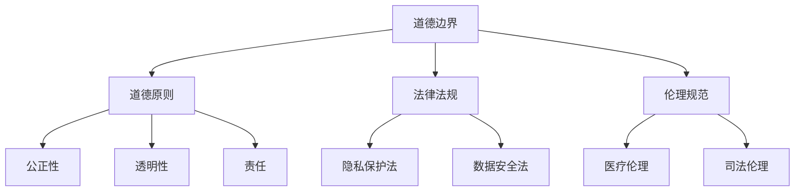

                 

### 文章标题

《人类计算：AI时代的道德边界》

### 关键词

人工智能，道德边界，算法偏见，隐私权，法律与政策框架，企业社会责任，国际合作

### 摘要

随着人工智能（AI）技术的迅猛发展，其在各个领域的应用愈发广泛。然而，AI技术带来的道德边界问题也随之凸显。本文旨在探讨AI时代的道德边界，包括道德边界的理论探讨、AI技术的道德问题、构建道德边界的策略与实施，以及未来的趋势与挑战。通过系统分析，本文旨在为读者提供全面、深入的AI道德边界理解，以推动AI技术健康、可持续的发展。

---

### 《人类计算：AI时代的道德边界》目录大纲

#### 第一部分：引言与背景

1. **概述与引言**
   - **1.1 AI时代的到来**
   - **1.2 人类计算的概念**
   - **1.3 书籍目的与结构**

2. **道德边界的概念与重要性**
   - **2.1 道德边界的概念与联系**
     - **2.1.1 道德边界的定义与范围**
     - **2.1.2 道德边界的重要性**
     - **Mermaid流程图：道德边界的核心要素**
   - **2.2 道德伦理原则**
     - **2.2.1 常见的道德伦理原则**
     - **2.2.2 原则的应用与局限性**
   - **2.3 法律与政策框架**
     - **2.3.1 法律与政策的作用**
     - **2.3.2 国际法规与标准**

3. **AI技术的道德问题**
   - **3.1 算法偏见与歧视**
     - **3.1.1 算法偏见的概念与影响**
     - **3.1.2 偏见与歧视的案例研究**
     - **3.1.3 减少算法偏见的策略**
   - **3.2 隐私权与数据保护**
     - **3.2.1 隐私权的概念与挑战**
     - **3.2.2 数据保护法规与政策**
     - **3.2.3 数据匿名化与加密技术**
   - **3.3 AI在公共安全与法律中的应用**
     - **3.3.1 AI在公共安全中的应用**
     - **3.3.2 AI在司法系统中的应用**
     - **3.3.3 道德边界在公共安全与法律中的挑战**

4. **构建道德边界的策略与实施**
   - **4.1 企业社会责任**
     - **4.1.1 企业社会责任的背景**
     - **4.1.2 AI伦理委员会的设立**
     - **4.1.3 企业道德框架的建立**
   - **4.2 教育与实践**
     - **4.2.1 教育与道德边界**
     - **4.2.2 道德边界的实践案例**
     - **4.2.3 国际合作与经验分享**

5. **展望与结论**
   - **5.1 道德边界的未来发展趋势**
   - **5.2 潜在挑战与应对策略**
   - **5.3 总结与展望**

### 附录

- **附录 A：进一步阅读资料**
  - **A.1 相关书籍推荐**
  - **A.2 学术文章与报告**

- **附录 B：参考资料**
  - **B.1 术语表**
  - **B.2 数据源与工具**

---

### 第一部分：引言与背景

#### 概述与引言

随着人工智能（AI）技术的迅猛发展，人类计算的概念逐渐浮现。人类计算是指利用计算技术增强人类能力，实现更高效率和更广范围的任务完成。AI技术的核心在于其能够通过学习、推理和决策来模拟人类智能，从而在各个领域发挥重要作用。

AI时代的到来，标志着人类计算进入了一个全新的阶段。AI技术不仅在医疗、金融、交通等领域取得了显著成果，还开始深入到社会管理的方方面面。然而，AI技术的发展也带来了诸多道德边界问题。如何确保AI技术在伦理和法律的框架内运行，成为当前社会面临的一个重要挑战。

本书旨在探讨AI时代的道德边界问题，系统分析道德边界的概念与重要性、常见的道德伦理原则、法律与政策框架、AI技术的道德问题、构建道德边界的策略与实施，以及未来的发展趋势与挑战。通过这本书，我们希望能够为读者提供全面、深入的AI道德边界理解，为推动AI技术健康、可持续的发展提供参考。

#### 1.1 AI时代的到来

人工智能（AI）时代的到来，标志着计算技术的发展进入了一个全新的阶段。AI技术以其独特的优势，已经在众多领域取得了显著的成果。

首先，AI技术在医疗领域的应用日益广泛。通过机器学习和深度学习算法，AI能够分析大量的医疗数据，帮助医生进行诊断和治疗。例如，AI系统能够通过分析影像资料，快速识别出潜在疾病，提高诊断的准确性和效率。此外，AI还能够在个性化医疗方面发挥作用，根据患者的基因信息和生活习惯，为其提供个性化的治疗方案。

其次，AI技术在金融领域也有重要应用。AI算法能够快速处理海量数据，进行风险评估、投资策略优化等任务。例如，通过分析市场趋势和历史数据，AI系统能够预测股票价格的变化，帮助投资者做出更加明智的决策。此外，AI技术在反欺诈方面也具有显著优势，能够实时监控交易行为，识别潜在的欺诈行为，保护金融机构和客户的利益。

再者，AI技术在交通领域的应用正在逐步改变人们的出行方式。自动驾驶技术是AI在交通领域的重要应用之一。通过感知环境、做出决策和控制车辆，自动驾驶系统能够实现车辆的自主行驶，提高交通安全性和效率。此外，AI技术还能够在交通管理和物流配送方面发挥作用，通过优化路线和调度，减少交通拥堵和运输成本。

AI技术不仅在传统行业取得了显著成果，还在新兴领域展现了巨大的潜力。例如，在农业领域，AI技术能够通过分析土壤、气候和作物生长数据，实现精准农业，提高农业生产效率。在环境保护领域，AI技术能够通过监测环境数据，预测环境污染和生态破坏，提出有效的环境保护措施。

总之，AI时代的到来，不仅为各行业带来了新的机遇，也带来了新的挑战。如何确保AI技术在伦理和法律的框架内运行，使其真正造福人类社会，是我们需要深入思考和研究的重要问题。

#### 1.2 人类计算的概念

人类计算（Human Computation）是指利用计算技术和人类智能相结合，以实现更高效率和更广范围的任务完成。它是一种通过人工智能（AI）增强人类能力的方法，旨在弥补人类在处理复杂任务时的局限性和不足。

人类计算的核心在于将人类的智慧和计算能力有机结合，通过人工智能算法处理和分析大量数据，然后将结果反馈给人类，使其能够做出更加精准和高效的决策。这种模式不仅提高了任务完成的效率，还扩展了人类智能的应用范围。

具体来说，人类计算的应用场景主要包括以下几个方面：

首先，人类计算在图像识别和自然语言处理领域具有显著优势。通过深度学习和卷积神经网络等AI技术，计算机可以处理和分析大量的图像和文本数据，从而实现对图像内容的准确识别和对文本信息的理解。例如，在图像识别任务中，人类计算系统能够识别出图像中的物体、场景和人物，并提供相应的标签。在自然语言处理任务中，人类计算系统能够理解用户的语言意图，提供智能化的问答和对话服务。

其次，人类计算在知识图谱和数据分析领域也得到了广泛应用。通过构建知识图谱，人类计算系统能够将大量分散的数据整合成一张统一的知识网络，从而提供更加全面和准确的信息。在数据分析领域，人类计算系统能够快速处理和分析大量数据，发现潜在的模式和规律，为决策提供支持。

此外，人类计算还在智能交互和辅助决策方面发挥了重要作用。通过人机交互技术，人类计算系统能够与人类进行自然对话，理解人类的语言和意图，并提供相应的服务和建议。在辅助决策领域，人类计算系统能够根据用户的需求和偏好，提供个性化的推荐和决策支持，帮助用户更好地做出决策。

总之，人类计算作为一种结合人类智慧和计算能力的方法，不仅提高了任务完成的效率，还为各领域的研究和应用提供了新的思路和工具。随着AI技术的不断发展，人类计算在未来必将发挥更加重要的作用。

#### 1.3 书籍目的与结构

本书旨在深入探讨AI时代的道德边界问题，为读者提供全面、系统的理解和思考。具体目标如下：

1. **明确道德边界的概念**：通过详细阐述道德边界的定义、范围和重要性，帮助读者理解道德边界的核心概念和意义。

2. **分析道德伦理原则**：介绍常见的道德伦理原则，如公正性、透明性、责任等，探讨这些原则在AI领域的应用和局限性。

3. **探讨法律与政策框架**：分析法律和政策在规范道德边界中的作用，介绍国际间关于道德边界的相关法规与标准。

4. **讨论AI技术的道德问题**：分析算法偏见与歧视、隐私权与数据保护、AI在公共安全与法律中的应用等方面的道德问题，提出解决方案和策略。

5. **构建道德边界的策略与实施**：探讨企业社会责任、教育与实践等方面的策略与实施，为构建道德边界提供实际指导。

6. **展望未来的发展趋势与挑战**：预测道德边界的未来发展趋势，分析潜在挑战与应对策略，为未来AI技术的发展提供参考。

本书结构分为五个部分：

- **第一部分：引言与背景**：介绍AI时代的到来和人类计算的概念，为后续章节奠定基础。

- **第二部分：道德边界的理论探讨**：探讨道德边界的概念、重要性、道德伦理原则和法律与政策框架。

- **第三部分：AI技术的道德问题**：分析算法偏见与歧视、隐私权与数据保护、AI在公共安全与法律中的应用等方面的道德问题。

- **第四部分：构建道德边界的策略与实施**：探讨企业社会责任、教育与实践等方面的策略与实施。

- **第五部分：展望与结论**：总结全书要点，预测未来的发展趋势与挑战，为未来AI技术的发展提供参考。

通过本书的阅读，读者将能够全面理解AI时代的道德边界问题，为实际应用和决策提供有益的参考。

#### 第二部分：道德边界的概念与重要性

道德边界是一个多维度的概念，涉及道德原则、法律法规和伦理规范等多个层面。本部分将详细探讨道德边界的定义、重要性及其在AI时代面临的具体挑战。

##### 2.1 道德边界的概念

道德边界是指人类社会在道德准则和伦理规范下，为行为和决策设定的界限。它不仅包括对个体行为的道德要求，还涉及对集体行为和社会责任的伦理约束。道德边界的核心在于平衡个体利益与社会利益，确保人类社会和谐、可持续地发展。

在AI时代，道德边界的定义更为复杂。首先，AI技术具有高度的自主性和复杂性，其行为和决策往往难以完全预测和控制。这意味着，传统的道德边界可能无法有效适用于AI系统。其次，AI技术涉及大量数据和信息，这些数据和信息可能包含个人隐私和敏感信息。因此，道德边界在保护个人隐私和数据安全方面具有重要意义。

道德边界可以理解为以下几个要素的集合：

1. **道德原则**：包括公正性、透明性、责任等基本道德原则。这些原则为AI系统的设计、开发和应用提供了基本的伦理指导。
2. **法律法规**：通过法律和法规的形式，对AI系统的行为和责任进行规范。例如，隐私保护法、数据安全法等。
3. **伦理规范**：涉及特定领域或行业的道德规范，如医疗伦理、司法伦理等。这些规范为AI技术在具体领域的应用提供了具体的伦理指导。

综上所述，道德边界是一个多维度的概念，它不仅涉及个体行为的道德要求，还包括法律和伦理层面的规范。在AI时代，道德边界的定义和范围需要进一步拓展和深化，以适应AI技术的高速发展。

##### 2.1.1 道德边界的定义与范围

道德边界的定义涉及多个维度，包括道德原则、法律法规和伦理规范。具体来说，道德边界可以理解为以下几个方面：

1. **道德原则**：道德原则是道德边界的核心，包括公正性、透明性、责任等。公正性要求AI系统在决策过程中不偏不倚，公平对待所有个体。透明性要求AI系统的决策过程清晰透明，用户能够理解AI系统是如何做出决策的。责任则要求AI系统在出现错误或造成损害时，能够承担相应的责任。

2. **法律法规**：法律法规为道德边界提供了法律保障。在AI时代，各国纷纷出台相关法律法规，以规范AI系统的行为。例如，欧盟的《通用数据保护条例》（GDPR）明确了个人数据的处理和保护规则，美国的《加州消费者隐私法》（CCPA）则规定了个人隐私权和数据透明度的要求。这些法律法规为AI系统的应用设定了明确的法律边界。

3. **伦理规范**：伦理规范是特定领域或行业的道德准则，如医疗伦理、司法伦理等。这些规范为AI技术在具体领域的应用提供了具体的伦理指导。例如，在医疗领域，AI系统的应用需要遵守医学伦理准则，确保患者的隐私和生命安全。在司法领域，AI系统的应用需要遵循司法伦理原则，确保司法公正和透明。

综上所述，道德边界的范围不仅包括道德原则和法律法规，还涉及具体的伦理规范。在AI时代，道德边界的定义和范围需要不断拓展和深化，以适应AI技术的高速发展。

**Mermaid流程图：道德边界的核心要素**

通过上述定义与范围的阐述，我们可以更好地理解道德边界的概念，为后续的探讨奠定基础。

##### 2.1.2 道德边界的重要性

道德边界在AI时代具有至关重要的意义，其主要体现在以下几个方面：

1. **保障社会公正**：AI技术的自主性和复杂性使其在决策过程中可能存在偏见和歧视。如果没有明确的道德边界，这些偏见和歧视可能会导致社会不公。例如，在招聘系统中，如果算法存在性别或种族偏见，会导致某些群体在就业机会上受到不公平对待。道德边界通过设定公正性原则，确保AI系统在决策过程中公平对待所有个体。

2. **保护个人隐私**：AI技术的发展使得数据收集和分析能力大幅提升，但这也带来了个人隐私保护的挑战。道德边界通过隐私保护法等法律法规，对数据收集、存储和使用进行规范，确保个人隐私不被滥用。例如，欧盟的《通用数据保护条例》（GDPR）明确规定了个人数据的处理和保护规则，有效保护了用户的隐私权。

3. **促进AI技术的可持续发展**：AI技术具有广泛的应用前景，但也面临着道德和社会责任问题。道德边界通过设定透明性和责任等原则，推动AI技术的可持续发展。例如，在自动驾驶领域，道德边界要求AI系统能够在紧急情况下做出合理、透明的决策，以保障公共安全。

4. **提高AI系统的可信度**：道德边界有助于提高AI系统的可信度。当用户能够信任AI系统的决策和行为时，AI系统的应用范围将更加广泛。例如，在医疗诊断领域，如果AI系统能够遵守道德边界，提供准确、透明的诊断结果，医生和患者将更加信任AI系统，从而提高医疗服务的质量。

5. **应对国际法规挑战**：随着AI技术的全球化发展，不同国家和地区在道德边界方面的法律法规和伦理规范可能存在差异。道德边界有助于统一国际法规，为跨国合作和监管提供基础。例如，国际社会通过制定统一的隐私保护法规，促进跨境数据流通和合作。

总之，道德边界在AI时代的重要性不可忽视。通过明确道德边界，我们能够确保AI技术在伦理和法律的框架内运行，促进社会的公正、安全和可持续发展。

##### 2.2 道德伦理原则

在AI时代，道德伦理原则为AI系统的设计和应用提供了重要的指导。常见的道德伦理原则包括公正性、透明性、责任等，这些原则旨在确保AI系统在伦理和法律的框架内运行，保护用户和社会的利益。

1. **公正性**：公正性要求AI系统在决策过程中公平对待所有个体，不偏袒任何一方。公正性是道德伦理原则的核心，它确保AI系统不会因算法偏见、数据偏差等原因而导致不公平的结果。例如，在招聘系统中，公正性原则要求AI系统不因性别、种族或年龄等因素而对应聘者产生偏见。

2. **透明性**：透明性要求AI系统的决策过程清晰透明，用户能够理解AI系统是如何做出决策的。透明性有助于增强用户对AI系统的信任，提高系统的可解释性。例如，在金融投资领域，透明性原则要求AI系统在做出投资决策时，向用户展示决策依据和逻辑，以便用户理解和监督。

3. **责任**：责任要求AI系统在出现错误或造成损害时，能够承担相应的责任。责任原则确保AI系统在应用过程中不会因为无法承担责任而逃避责任，从而保护用户和社会的利益。例如，在自动驾驶领域，责任原则要求AI系统能够在紧急情况下做出合理、透明的决策，以避免事故发生。

除了上述三个核心原则，还有一些其他的道德伦理原则也对AI系统的设计和应用具有重要影响：

4. **自主性**：自主性要求AI系统能够独立地做出决策，不受外部干扰。自主性原则确保AI系统能够在复杂环境中自主行动，提高系统的效率和适应性。例如，在军事领域，自主性原则要求AI系统能够自主识别目标并做出攻击决策，以提高作战效率。

5. **可靠性**：可靠性要求AI系统在长时间运行中保持稳定的性能和功能。可靠性原则确保AI系统能够在关键时刻正常运行，避免因故障或错误导致严重后果。例如，在航空航天领域，可靠性原则要求AI系统在长期飞行任务中保持高可靠性和稳定性，以保障飞行安全。

6. **安全性**：安全性要求AI系统在设计和应用过程中考虑到各种安全威胁，确保系统的安全性和防护能力。安全性原则确保AI系统不会受到恶意攻击或篡改，从而保障用户和社会的利益。例如，在网络领域，安全性原则要求AI系统能够抵御各种网络攻击，保护网络数据的安全。

这些道德伦理原则不仅为AI系统的设计和应用提供了指导，也为相关法律法规的制定提供了基础。在实际应用中，这些原则需要综合考虑，以确保AI系统在伦理和法律的框架内运行，造福人类社会。

##### 2.2.2 原则的应用与局限性

道德伦理原则在AI领域的应用和局限性是一个复杂且具有挑战性的议题。虽然这些原则为AI系统的设计和应用提供了重要的指导，但在实际应用中，它们也面临着诸多局限和挑战。

首先，公正性原则在AI系统的应用中具有重要作用。公正性要求AI系统在决策过程中公平对待所有个体，避免因算法偏见、数据偏差等原因导致不公平的结果。在实际应用中，公正性原则可以通过多种方法实现，例如数据重新采样、特征工程和算法优化等。然而，这些方法的局限性在于，它们无法完全消除数据中的偏见和算法的不公平性。例如，在一个基于历史数据集的招聘系统中，如果数据集中存在性别或种族偏见，即使进行了数据重新采样和特征工程，AI系统仍然可能表现出类似的偏见。因此，公正性原则在实际应用中的局限性在于，它难以彻底解决数据偏差问题。

其次，透明性原则在AI领域的应用也具有重要意义。透明性要求AI系统的决策过程清晰透明，用户能够理解AI系统是如何做出决策的。在实际应用中，透明性可以通过可视化工具、解释性算法和决策路径展示等方式实现。然而，这些方法的局限性在于，它们往往只能解释部分决策过程，而无法完全揭示AI系统的内部机制。例如，在深度学习模型中，由于模型参数和权重的复杂性，很难将其决策过程解释得清晰明了。此外，一些先进的AI技术，如生成对抗网络（GAN）和变分自编码器（VAE），其决策过程更加复杂，难以用现有的解释性工具进行解释。因此，透明性原则在实际应用中的局限性在于，它难以满足用户对AI系统决策过程完全透明的要求。

责任原则是道德伦理原则中的重要一环。责任原则要求AI系统能够在出现错误或造成损害时，承担相应的责任。在实际应用中，责任原则可以通过多种方式实现，例如设立AI伦理委员会、制定责任分配协议和建立责任保险等。然而，这些方法的局限性在于，它们往往难以在法律和伦理层面明确AI系统的责任归属。例如，在一个自动驾驶系统中，如果发生交通事故，责任可能会涉及到车辆制造商、软件开发商和用户等多个方面。确定各方的责任归属是一个复杂且具有争议的问题，需要综合考虑技术、法律和伦理等多个因素。因此，责任原则在实际应用中的局限性在于，它难以在法律和伦理层面明确AI系统的责任归属。

此外，其他道德伦理原则如自主性、可靠性和安全性等也在实际应用中面临一定的局限性。自主性原则要求AI系统能够独立地做出决策，不受外部干扰。然而，在实际应用中，AI系统的自主性可能受到数据质量、算法可靠性和环境复杂性等因素的影响。可靠性原则要求AI系统在长时间运行中保持稳定的性能和功能。然而，AI系统可能会因算法错误、硬件故障或外部干扰等原因导致性能下降或失效。安全性原则要求AI系统能够抵御各种安全威胁，保护用户和社会的利益。然而，随着AI技术的不断发展和网络攻击手段的多样化，AI系统的安全性面临着新的挑战。

总之，道德伦理原则在AI领域的应用和局限性是一个复杂且具有挑战性的议题。虽然这些原则为AI系统的设计和应用提供了重要的指导，但它们在实际应用中仍然面临诸多局限和挑战。要解决这些问题，需要从技术、法律和伦理等多个层面进行综合考虑和持续探索。

##### 2.3 法律与政策框架

法律与政策框架在规范道德边界方面发挥着至关重要的作用。它们不仅为AI系统的设计和应用提供了明确的指导，还为处理AI技术带来的道德争议提供了法律依据。以下将详细分析法律与政策在规范道德边界中的作用，以及国际间关于道德边界的相关法规与标准。

#### 2.3.1 法律与政策的作用

法律与政策在规范道德边界方面的作用主要体现在以下几个方面：

1. **明确行为规范**：法律与政策为AI系统的开发和应用设定了明确的行为规范，确保AI技术在不损害人类利益和社会公共利益的前提下运行。例如，欧盟的《通用数据保护条例》（GDPR）明确了个人数据的处理和保护规则，要求企业在收集、存储和使用用户数据时必须遵循严格的规范。

2. **保障用户权益**：法律与政策通过保护用户的隐私权、知情权和选择权等权益，确保用户在AI技术应用中的合法权益得到保障。例如，美国的《加州消费者隐私法》（CCPA）规定了用户对个人数据的访问权、删除权和拒绝销售权，使用户能够更好地控制自己的数据。

3. **促进技术发展**：法律与政策通过提供明确的规则和框架，为AI技术的创新和发展提供保障。例如，欧盟的《人工智能法案》旨在推动人工智能的健康发展，为AI技术的研发和应用提供政策支持。

4. **规范行业行为**：法律与政策通过规范企业行为，防止AI技术的滥用和不当应用。例如，美国的《算法透明度法案》要求企业公开其算法决策的依据和逻辑，提高算法的透明度和可解释性。

#### 2.3.2 国际法规与标准

随着AI技术的全球化发展，国际间关于道德边界的相关法规与标准也逐步建立和完善。以下介绍几个具有代表性的国际法规与标准：

1. **欧盟的《通用数据保护条例》（GDPR）**：GDPR是欧盟于2018年5月25日实施的个人信息保护法规，其核心目标是保护个人数据的隐私权和自由。GDPR规定了个人数据的处理和保护规则，包括数据收集的合法性、数据处理的透明性、用户对数据的访问权、删除权和拒绝销售权等。GDPR的严格规定对全球企业的数据处理行为产生了深远影响。

2. **美国的《加州消费者隐私法》（CCPA）**：CCPA是加利福尼亚州于2018年通过的一项隐私保护法案，其核心目标是赋予消费者对其个人数据的控制权。CCPA规定了用户对个人数据的访问权、删除权和拒绝销售权，并对企业的数据处理行为设定了严格的要求。CCPA的影响已超出加利福尼亚州，对全球范围内的数据处理行为产生了重要影响。

3. **欧盟的《人工智能法案》**：欧盟的《人工智能法案》旨在制定欧盟范围内的人工智能框架，促进人工智能的健康发展。该法案涵盖了人工智能的各个方面，包括技术评估、市场准入、透明性和责任等。欧盟的人工智能法案是全球范围内首个针对人工智能的综合性法案，对全球人工智能政策产生了重要影响。

4. **国际标准化组织（ISO）的ISO/IEC 27001标准**：ISO/IEC 27001标准是国际标准化组织制定的关于信息安全管理的标准，其核心目标是保护信息的机密性、完整性和可用性。该标准适用于各种类型的组织，包括提供AI服务的公司。ISO/IEC 27001标准为AI系统在信息安全方面的管理和实施提供了重要指导。

5. **美国国家标准与技术研究院（NIST）的NIST SP 800-53标准**：NIST SP 800-53标准是NIST制定的关于信息系统安全控制的标准，其核心目标是保护信息系统免受各种安全威胁。该标准涵盖了AI系统的设计、开发、部署和维护等方面，为AI系统的安全控制提供了详细指导。

总之，国际间关于道德边界的相关法规与标准在规范AI技术行为、保障用户权益和促进技术发展方面发挥了重要作用。随着AI技术的不断进步，这些法规与标准也将不断更新和完善，以应对新的挑战和需求。

#### 第三部分：AI技术的道德问题

随着人工智能（AI）技术的飞速发展，其在各个领域的应用日益广泛，但同时也引发了一系列道德问题。本部分将探讨AI技术中的几个重要道德问题，包括算法偏见与歧视、隐私权与数据保护以及AI在公共安全与法律中的应用，分析这些问题对人类社会的深远影响，并提出相应的解决方案和策略。

##### 3.1 算法偏见与歧视

算法偏见与歧视是指AI算法在决策过程中，因数据集、算法设计或训练过程等原因，导致对某些群体产生不公平对待的现象。算法偏见可能源于数据集的不平衡、历史数据的偏见或者算法本身的设计缺陷，从而在招聘、信用评分、医疗诊断等应用中产生负面影响。

**3.1.1 算法偏见的概念与影响**

算法偏见的概念可以从多个角度理解：

- **数据偏见**：当训练数据集中包含历史偏见或社会偏见时，AI算法可能会在决策过程中复制这些偏见。例如，如果招聘系统的训练数据集中女性应聘者的比例较低，算法可能会倾向于拒绝女性应聘者。

- **算法设计偏见**：某些算法设计可能本身就包含偏见。例如，用于信用评分的算法可能会对某些种族或社会阶层的人给予较低的分值，从而导致歧视。

- **反馈循环**：算法偏见可能导致错误的决策，这些错误的数据反馈到算法中，进一步加剧偏见。例如，如果一个监控系统对某些种族的人进行过度监控，那么这些数据将导致算法在未来对相同种族的人进行更多监控。

算法偏见的影响是多方面的：

- **社会不公**：算法偏见可能导致某些群体在社会机会、资源分配等方面受到不公平对待，加剧社会不平等。

- **经济损失**：企业因算法偏见而错失优秀人才或客户，可能导致经济损失。

- **法律风险**：算法偏见可能导致企业面临法律诉讼和监管处罚，增加合规成本。

**3.1.2 偏见与歧视的案例研究**

以下是一些算法偏见与歧视的实际案例：

- **招聘系统中的性别偏见**：在某些公司的招聘系统中，算法可能会根据候选人的姓名或教育背景等特征，自动筛选出某些性别或种族的候选人。研究表明，一些公司的招聘算法对女性候选人的通过率明显低于男性候选人。

- **信用评分中的种族歧视**：某些信用评分模型可能会根据申请人的种族、居住地等因素进行评分，导致某些种族的申请人获得较低的信用评分，从而影响他们的贷款利率和金融产品的购买。

- **医疗诊断中的偏见**：在医疗诊断领域，算法可能会根据历史数据对不同种族或性别的患者进行不同的诊断结果。例如，某些算法可能会对黑人患者诊断出的心脏病概率低于白人患者，导致黑人患者无法及时得到治疗。

**3.1.3 减少算法偏见的策略**

为了减少算法偏见，可以采取以下策略：

- **数据平衡**：确保训练数据集中不同群体的比例合理，避免历史偏见在算法中再现。

- **算法透明性**：提高算法的可解释性，使决策过程透明，方便识别和纠正偏见。

- **反偏见算法**：开发专门用于识别和纠正算法偏见的算法，例如反偏见分类器。

- **多样化团队**：组建多样化的团队，确保算法设计和评估过程不受单一视角的影响。

- **伦理审查**：在算法开发和部署前，进行严格的伦理审查，确保算法的设计和实现符合道德和伦理要求。

通过上述策略，我们可以逐步减少算法偏见，促进AI技术的公平和公正应用。

##### 3.2 隐私权与数据保护

隐私权是个人对其个人信息享有的控制权，而数据保护则是指对个人数据的收集、存储、使用和分享进行规范，以防止隐私泄露和数据滥用。随着AI技术的发展，AI系统对个人数据的依赖性日益增加，隐私权和数据保护问题也变得更加突出。

**3.2.1 隐私权的概念与挑战**

隐私权的概念可以追溯到个人对其个人信息的主权。在AI时代，隐私权面临的挑战主要表现在以下几个方面：

- **数据收集的广泛性**：AI系统通常需要大量的个人数据作为训练和推理的基础。然而，这种广泛的数据收集可能超出用户的预期，导致隐私泄露风险。

- **数据共享的复杂性**：AI系统可能需要与其他系统和组织共享数据，这增加了数据泄露的风险。此外，数据共享协议的透明度和安全性也成为一个挑战。

- **数据使用的模糊性**：AI系统在处理个人数据时，可能使用一些未明确告知用户的数据用途和算法。这种模糊性可能导致用户对数据使用的失控。

**3.2.2 数据保护法规与政策**

为了应对隐私权和数据保护方面的挑战，各国纷纷出台了相关法规与政策。以下是一些重要的数据保护法规与政策：

- **欧盟的《通用数据保护条例》（GDPR）**：GDPR是欧盟最具影响力的数据保护法规，它规定了个人数据的处理和保护规则，包括数据收集的合法性、用户对数据的访问权、删除权和拒绝销售权等。GDPR对企业的数据处理行为设定了严格的规范。

- **美国的《加州消费者隐私法》（CCPA）**：CCPA是加利福尼亚州的一项隐私保护法案，它规定了用户对个人数据的访问权、删除权和拒绝销售权。CCPA的影响已超出加利福尼亚州，对全球范围内的数据处理行为产生了重要影响。

- **中国的《个人信息保护法》（PIPL）**：PIPL是中国的一部重要数据保护法规，它规定了个人信息的处理和保护规则，包括数据处理的原则、用户的权利、数据安全等。PIPL旨在保护个人信息权益，促进个人信息合理利用。

**3.2.3 数据匿名化与加密技术**

为了加强数据保护，数据匿名化和加密技术成为重要的手段。数据匿名化通过去除或修改个人识别信息，使数据无法直接关联到特定个人。加密技术则通过加密数据内容，确保数据在传输和存储过程中的安全性。

- **数据匿名化**：数据匿名化技术包括数据遮挡、数据泛化、数据随机化等。这些技术可以降低数据泄露的风险，但同时也可能影响数据的分析和使用。

- **加密技术**：加密技术包括对称加密和非对称加密等。对称加密使用相同的密钥进行加密和解密，而非对称加密则使用一对密钥，其中一个用于加密，另一个用于解密。加密技术可以有效保护数据隐私，但需要处理密钥管理和分发问题。

通过数据匿名化和加密技术，我们可以有效加强数据保护，减少隐私泄露的风险。

##### 3.3 AI在公共安全与法律中的应用

AI技术在公共安全和法律领域具有广泛的应用，为提升公共安全、司法公正和社会治理水平提供了新的手段。然而，这些应用也带来了诸多道德边界问题，需要我们在实践中予以关注和解决。

**3.3.1 AI在公共安全中的应用**

AI技术在公共安全中的应用主要体现在以下几个方面：

- **视频监控**：通过视频监控技术，AI系统可以对公共场所进行实时监控，识别和预警潜在的犯罪行为。例如，人脸识别技术可以快速识别嫌疑人，提高抓捕效率。

- **反恐与网络安全**：AI系统可以分析大量的网络数据，识别潜在的网络攻击和恐怖活动，提高公共安全防范能力。例如，通过异常检测技术，AI系统可以识别出异常的网络行为，防止网络攻击。

- **交通管理**：AI技术可以优化交通管理，减少交通拥堵和事故发生率。例如，通过实时交通数据分析，AI系统可以提供最优的路线规划，减少交通拥堵。

**3.3.2 AI在司法系统中的应用**

AI技术在司法系统中的应用有助于提高司法效率和公正性：

- **案件处理**：AI系统可以自动化处理大量的案件数据，提供辅助决策支持。例如，通过自然语言处理技术，AI系统可以快速分析案件文件，为法官提供参考。

- **证据分析**：AI系统可以对证据进行自动化分析，提高证据的可信度和可靠性。例如，通过图像识别技术，AI系统可以快速识别和分类证据，提高证据分析效率。

- **审判辅助**：AI系统可以辅助法官进行判决，提高判决的准确性和公正性。例如，通过数据分析技术，AI系统可以提供定罪概率和量刑建议，为法官提供参考。

**3.3.3 道德边界在公共安全与法律中的挑战**

AI在公共安全与法律中的应用也面临着诸多道德边界挑战：

- **隐私侵犯**：AI系统在监控和数据分析过程中，可能侵犯个人隐私权。例如，视频监控和人脸识别技术可能对个人隐私造成侵犯。

- **算法偏见**：AI系统在决策过程中可能存在算法偏见，导致不公正的结果。例如，如果AI系统在招聘中存在性别或种族偏见，可能导致不公平的就业机会分配。

- **责任归属**：当AI系统在公共安全或司法系统中出现错误时，责任归属成为一个难题。例如，如果AI系统在监控中错误识别嫌疑人，导致无辜者被逮捕，责任归属问题将难以解决。

为了应对这些挑战，需要在AI系统的设计和应用过程中，严格遵循道德伦理原则，确保AI系统的透明性、公正性和责任性。同时，需要建立相应的法律和政策框架，对AI在公共安全与法律中的应用进行规范，确保其在道德边界的范围内运行。

#### 4.1 企业社会责任

在AI技术日益普及的今天，企业社会责任（CSR）成为了一个重要议题。企业不仅要追求经济效益，还需要关注其行为对社会的长期影响。特别是在AI技术的应用中，企业社会责任显得尤为重要，因为它直接关系到AI系统的道德边界和公平性。

**4.1.1 企业社会责任的背景**

企业社会责任是指企业在追求经济利益的同时，承担起对环境、社会和利益相关者责任的理念和实践。随着社会的进步和技术的变革，企业社会责任逐渐成为企业可持续发展的重要组成部分。特别是在AI技术的快速发展中，企业社会责任的重要性愈加凸显。因为AI技术不仅影响着企业自身的业务模式，还可能对社会公平、隐私保护、就业等方面产生深远影响。

**4.1.2 AI伦理委员会的设立**

为了确保AI技术的道德边界，企业可以设立AI伦理委员会，负责监督和评估AI系统的设计和应用。以下是AI伦理委员会的设立步骤和职责：

1. **设立委员会**：首先，企业应成立一个独立的AI伦理委员会，成员应包括企业内部的技术专家、伦理学家、法律专家以及外部顾问。委员会成员应具备跨学科的知识背景，能够从不同角度评估AI技术的道德风险。

2. **职责分工**：AI伦理委员会的职责主要包括：
   - **道德风险评估**：对AI系统的设计和应用进行道德风险评估，确保其符合伦理和法律要求。
   - **伦理审查**：审查AI系统的开发过程，确保其遵循公正、透明和责任等道德原则。
   - **决策咨询**：为企业提供关于AI技术的道德决策咨询，确保AI系统的应用不会对社会造成负面影响。

3. **透明性和参与度**：AI伦理委员会的决策过程应保持透明，并鼓励外部利益相关者参与。例如，可以通过公开研讨会、公众咨询等方式，听取公众和专家的意见和建议。

**4.1.3 企业道德框架的建立**

为了确保AI技术的道德应用，企业需要建立一套完整的道德框架，包括以下方面：

1. **道德原则**：明确企业的道德原则，如公正性、透明性、责任等。这些原则应贯穿于AI系统的整个生命周期，从设计、开发到部署和维护。

2. **政策与标准**：制定详细的AI技术应用政策与标准，确保AI系统的设计和应用符合伦理和法律要求。例如，可以制定数据保护政策、隐私保护措施和算法透明性要求。

3. **培训与教育**：对企业员工进行道德培训和教育，提高其道德意识和责任意识。特别是技术团队和决策者，应深入了解AI技术的道德边界和潜在风险。

4. **监督与评估**：建立监督和评估机制，对AI系统的道德应用进行定期评估和审查。可以通过内部审计、第三方评估等方式，确保AI系统的道德框架得到有效执行。

通过设立AI伦理委员会和建立企业道德框架，企业可以更好地承担社会责任，确保AI技术的道德边界，为社会带来积极的影响。

##### 4.2 教育与实践

在AI技术不断发展的背景下，教育与实践在构建道德边界中扮演着至关重要的角色。通过系统的教育，提高公众的道德意识和技术素养；通过实践，检验和优化道德边界的实际应用。以下将探讨教育与道德边界、道德边界的实践案例以及国际合作与经验分享。

**4.2.1 教育与道德边界**

教育是提高公众道德意识和理解道德边界的重要手段。通过教育，可以培养公众对AI技术的正确认知和负责任的态度。具体措施包括：

1. **基础教育**：在各级教育阶段，融入AI技术和道德边界的知识。例如，在中小学阶段，可以通过计算机科学课程介绍基本的AI概念和道德原则；在高等教育阶段，设置专门的伦理学课程，深入探讨AI技术的道德问题。

2. **专业培训**：针对技术从业人员和决策者，开展专业培训，提高其道德素养和责任意识。例如，对于AI开发人员，可以开展伦理学、隐私保护和数据安全等方面的培训，确保其在设计和应用AI系统时遵循道德原则。

3. **公众宣传**：通过媒体、社交网络和公众讲座等方式，普及AI技术的道德边界知识。例如，可以组织AI伦理工作坊、研讨会和公开课，邀请专家和学者讲解AI技术的道德挑战和应对策略。

**4.2.2 道德边界的实践案例**

实践是检验道德边界的有效途径。以下是一些道德边界的实践案例：

1. **企业实践**：许多企业已经开始建立AI伦理委员会，制定AI技术应用政策，确保AI系统的道德边界。例如，谷歌和微软等科技巨头制定了AI伦理准则，并在产品开发和应用中严格遵守。

2. **政府实践**：各国政府也在积极推动AI伦理立法和政策制定。例如，欧盟通过了《人工智能法案》，为AI技术的发展设定了严格的道德和法律边界。

3. **社区实践**：在社区层面，一些非政府组织和志愿者团体也开展了AI伦理教育活动。例如，AI for People组织通过举办社区讲座和工作坊，提高公众对AI伦理问题的关注和参与。

**4.2.3 国际合作与经验分享**

国际合作与经验分享在构建全球道德边界中具有重要意义。以下是一些国际合作与经验分享的举措：

1. **国际组织和论坛**：国际组织和论坛如联合国、国际人工智能联合会（IJCAI）等，为各国政府和专家提供了一个交流和合作的平台。通过这些平台，各国可以分享AI伦理的政策和实践经验，共同探讨全球AI伦理问题。

2. **跨国合作项目**：一些跨国合作项目如“欧洲人工智能联盟”（AI Alliance）等，旨在通过国际合作，推动AI技术的道德发展。这些项目通常涉及多个国家的研究机构和政府，共同开展AI伦理研究和政策制定。

3. **经验交流与学习**：各国可以通过互访、研讨会和培训等方式，交流AI伦理的经验和教训。例如，中国政府可以学习欧盟的AI伦理法规和实施经验，以制定符合本国国情的AI伦理政策。

总之，通过教育与实践，可以不断提高公众的道德意识和技术素养，构建有效的道德边界，推动AI技术的健康、可持续发展。

### 第四部分：构建道德边界的策略与实施

在AI时代，构建道德边界是一个复杂而重要的任务，需要从多个层面进行策略规划和实施。本部分将探讨企业社会责任、教育与实践等方面的策略与实施，为AI技术的道德应用提供实际指导。

#### 4.1 企业社会责任

企业社会责任（CSR）在AI技术的道德边界构建中起着至关重要的作用。企业不仅要追求经济效益，还应对其行为对社会的长期影响负责。以下是企业如何通过社会责任来构建道德边界的策略：

**4.1.1 企业社会责任的背景**

企业社会责任起源于20世纪初，随着社会发展和企业对环境、社会和利益相关者责任的重视，其内涵不断扩展。在AI时代，企业社会责任尤为重要，因为AI技术的应用对隐私、公平性和透明性等方面提出了新的挑战。企业通过承担社会责任，可以确保AI技术在道德边界的范围内运行，促进社会和谐与可持续发展。

**4.1.2 AI伦理委员会的设立**

AI伦理委员会是确保企业AI技术应用符合道德原则的重要机制。以下是AI伦理委员会设立的关键步骤和职责：

1. **组建委员会**：成立一个独立的AI伦理委员会，成员应包括内部技术专家、伦理学家、法律专家以及外部顾问。这些成员应具备跨学科的知识和经验，以确保从多角度评估AI技术的道德风险。

2. **职责分工**：AI伦理委员会的职责主要包括：
   - **道德风险评估**：对AI系统的设计和应用进行道德风险评估，识别潜在的伦理问题。
   - **伦理审查**：审查AI系统的开发过程，确保其遵循公正、透明和责任等道德原则。
   - **决策咨询**：为企业提供关于AI技术的道德决策咨询，确保AI系统的应用不会对社会造成负面影响。

3. **透明性和参与度**：AI伦理委员会的决策过程应保持透明，并鼓励外部利益相关者参与。例如，可以通过公开研讨会、公众咨询等方式，听取公众和专家的意见和建议。

**4.1.3 企业道德框架的建立**

为了确保AI技术的道德应用，企业需要建立一套完整的道德框架，包括以下方面：

1. **道德原则**：明确企业的道德原则，如公正性、透明性、责任等。这些原则应贯穿于AI系统的整个生命周期，从设计、开发到部署和维护。

2. **政策与标准**：制定详细的AI技术应用政策与标准，确保AI系统的设计和应用符合伦理和法律要求。例如，可以制定数据保护政策、隐私保护措施和算法透明性要求。

3. **培训与教育**：对企业员工进行道德培训和教育，提高其道德意识和责任意识。特别是技术团队和决策者，应深入了解AI技术的道德边界和潜在风险。

4. **监督与评估**：建立监督和评估机制，对AI系统的道德应用进行定期评估和审查。可以通过内部审计、第三方评估等方式，确保AI系统的道德框架得到有效执行。

通过设立AI伦理委员会和建立企业道德框架，企业可以更好地承担社会责任，确保AI技术的道德边界，为社会带来积极的影响。

#### 4.2 教育与实践

教育和实践在构建AI技术的道德边界中具有至关重要的地位。通过系统的教育，提高公众的道德意识和技术素养；通过实践，检验和优化道德边界的实际应用。以下是教育与道德边界、道德边界的实践案例以及国际合作与经验分享的探讨。

**4.2.1 教育与道德边界**

教育是提高公众道德意识和理解道德边界的有效手段。以下是在各级教育阶段实施道德边界教育的具体措施：

1. **基础教育**：在中小学阶段，应将AI技术和道德边界的基本知识融入计算机科学课程。通过项目式学习、游戏和实验等方式，让学生了解AI技术的基本原理及其道德影响。

2. **高等教育**：在高等教育阶段，设置专门的AI伦理学课程，深入探讨AI技术的道德问题。例如，研究算法偏见、隐私保护、责任分配等主题，培养具备跨学科知识和道德素养的专业人才。

3. **专业培训**：针对技术人员、政策制定者和管理人员，提供专业培训，提高其道德素养和责任意识。培训内容应涵盖AI技术的最新发展、伦理原则、法律框架和实践经验。

**4.2.2 道德边界的实践案例**

实践是检验道德边界有效性的重要途径。以下是几个道德边界的实践案例：

1. **企业实践**：许多企业已经开始在其AI项目中实施道德边界策略。例如，通过建立AI伦理委员会，制定AI技术应用政策，确保AI系统符合道德和法律要求。这些实践案例可以为企业提供宝贵的经验，促进整个行业道德边界的提升。

2. **政府实践**：各国政府也在积极推动AI伦理立法和政策制定。例如，欧盟通过了《人工智能法案》，为AI技术的发展设定了严格的道德和法律边界。这些政策为政府机构和企业在AI技术应用中提供了明确的指导。

3. **社区实践**：在社区层面，非政府组织和志愿者团体也在开展AI伦理教育活动。例如，通过举办社区讲座、研讨会和工作坊，提高公众对AI伦理问题的关注和参与。这些活动有助于营造全社会关注和重视AI道德边界的氛围。

**4.2.3 国际合作与经验分享**

国际合作与经验分享在构建全球道德边界中具有重要意义。以下是一些国际合作与经验分享的举措：

1. **国际组织和论坛**：国际组织和论坛如联合国、国际人工智能联合会（IJCAI）等，为各国政府和专家提供了一个交流和合作的平台。通过这些平台，各国可以分享AI伦理的政策和实践经验，共同探讨全球AI伦理问题。

2. **跨国合作项目**：一些跨国合作项目如“欧洲人工智能联盟”（AI Alliance）等，旨在通过国际合作，推动AI技术的道德发展。这些项目通常涉及多个国家的研究机构和政府，共同开展AI伦理研究和政策制定。

3. **经验交流与学习**：各国可以通过互访、研讨会和培训等方式，交流AI伦理的经验和教训。例如，中国政府可以学习欧盟的AI伦理法规和实施经验，以制定符合本国国情的AI伦理政策。

通过教育与实践，以及国际合作与经验分享，我们可以逐步构建起AI技术的道德边界，确保AI技术在道德和法律的框架内运行，为人类社会带来更大的福祉。

### 第五部分：展望与结论

#### 5.1 道德边界的未来发展趋势

随着人工智能（AI）技术的不断进步，道德边界的构建和实施也将面临新的挑战和机遇。未来，道德边界的发展趋势主要包括以下几个方面：

1. **技术进步驱动**：随着AI技术的不断发展，其自主性和复杂度将进一步提高。这意味着道德边界的设计和实施需要更加灵活和高效，以应对技术变革带来的新挑战。

2. **全球化合作**：随着AI技术的全球化应用，各国在道德边界方面的合作将变得更加紧密。国际组织和跨国合作项目将发挥更大作用，共同制定全球统一的AI伦理标准和法规。

3. **法律法规完善**：各国政府和国际组织将不断完善AI伦理法律法规，确保AI技术在社会中得到规范和合理应用。例如，更多的隐私保护法、数据安全法等法规将逐步出台，为AI技术的道德边界提供法律保障。

4. **公众参与度提高**：随着公众对AI技术的关注和了解不断增加，公众在道德边界构建中的参与度也将逐步提高。通过公众咨询、公开听证等方式，公众的声音将更加直接地影响到AI技术的道德边界。

5. **企业社会责任加强**：企业作为AI技术的研发和应用主体，其社会责任将进一步加强。企业将通过建立AI伦理委员会、实施道德框架等方式，确保AI技术符合道德和法律要求，为社会带来积极影响。

#### 5.2 潜在挑战与应对策略

尽管道德边界的构建和实施在未来的发展趋势中充满希望，但仍然面临诸多潜在挑战。以下是一些主要挑战及其应对策略：

1. **技术不确定性**：AI技术的快速进步使得其道德边界难以预见。应对策略是加强基础研究和应用研究，提升对AI技术发展的预见性，为道德边界的构建提供科学依据。

2. **数据隐私保护**：AI技术对大量个人数据的依赖可能导致隐私泄露。应对策略是完善隐私保护法规，提高数据匿名化和加密技术水平，确保数据在收集、存储和使用过程中的安全。

3. **跨国法律冲突**：全球各国在AI伦理法规方面的差异可能导致跨国法律冲突。应对策略是加强国际合作，推动全球统一的AI伦理标准和法规的制定。

4. **公众信任问题**：公众对AI技术的信任度较低，可能阻碍其普及和应用。应对策略是提高AI系统的透明性和可解释性，增强公众对AI技术的信任。

5. **责任归属不清**：当AI系统出现错误或造成损害时，责任归属问题将变得复杂。应对策略是明确AI系统的责任主体，建立责任分配机制，确保各方能够承担相应的责任。

#### 5.3 总结与展望

通过对AI时代道德边界的全面探讨，我们认识到道德边界在保障社会公正、保护个人隐私和推动AI技术可持续发展中的重要作用。未来，随着AI技术的不断进步和全球化发展，道德边界的构建和实施将面临新的挑战和机遇。我们呼吁各方共同努力，通过技术创新、法律法规完善和国际合作，构建一个公平、透明和负责任的AI时代。

在未来的发展中，道德边界不仅是AI技术规范和约束的工具，更是推动社会进步和人类福祉的重要保障。让我们携手共进，共同迎接AI时代的到来，为构建一个更加美好和和谐的世界而努力。

### 附录

#### 附录 A：进一步阅读资料

**A.1 相关书籍推荐**

- **《智能时代：算法如何重塑世界》** —— 作者：杰里米·里夫金
  - 本书详细探讨了AI技术对人类社会的影响，包括道德边界、经济模式和社会变革等方面。

- **《人工智能时代：工作、财富与我们的未来》** —— 作者：尼克·博斯特罗姆
  - 本书从哲学、经济学和社会学等多个角度分析了AI时代可能带来的道德、经济和社会挑战。

- **《算法崛起：人工智能的法律与伦理问题》** —— 作者：约瑟夫·M. 朱兰
  - 本书深入探讨了AI技术的法律和伦理问题，包括算法偏见、隐私保护、责任归属等。

**A.2 学术文章与报告**

- **《人工智能的伦理问题》** —— 作者：牛津互联网研究所
  - 本文分析了人工智能在伦理方面面临的挑战，包括公正性、透明性、责任等。

- **《欧盟人工智能白皮书》** —— 欧盟委员会
  - 本报告提出了欧盟在人工智能领域的发展战略，包括道德边界、法律框架和国际合作等方面。

- **《算法偏见与歧视》** —— 作者：大卫·布鲁克斯
  - 本文详细讨论了算法偏见和歧视的问题，提出了减少算法偏见的策略和建议。

#### 附录 B：参考资料

**B.1 术语表**

- **道德边界**：指在道德准则和伦理规范下，为行为和决策设定的界限。
- **算法偏见**：指AI算法在决策过程中，因数据集、算法设计等原因，导致对某些群体产生不公平对待的现象。
- **隐私权**：指个人对其个人信息享有的控制权。
- **数据保护**：指对个人数据的收集、存储、使用和分享进行规范，以防止隐私泄露和数据滥用。

**B.2 数据源与工具**

- **数据源**：
  - **欧盟委员会官方网站**：提供关于人工智能的政策、法规和报告。
  - **联合国人工智能高级别小组**：提供关于人工智能的国际合作、政策研究和最佳实践。
  - **国际人工智能联合会（IJCAI）**：发布人工智能领域的研究论文和报告。

- **工具**：
  - **人工智能伦理评估工具**：用于评估AI系统的道德风险和伦理问题。
  - **隐私保护工具**：如数据匿名化和加密技术，用于保护个人隐私和数据安全。

通过附录部分的进一步阅读资料和参考资料，读者可以更深入地了解AI时代的道德边界问题，为实际应用和研究提供有益的参考。

