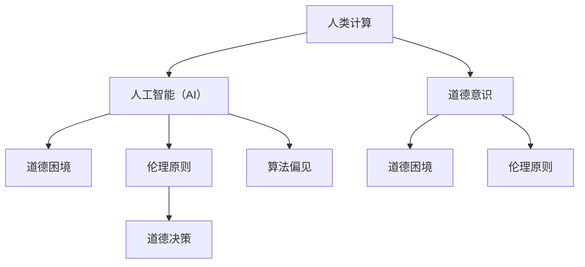

                 

# 文章标题：人类计算：在AI时代增强道德意识

## 关键词

AI时代，道德意识，人类计算，道德决策，伦理原则，教育，法律与政策

## 摘要

随着人工智能（AI）技术的迅猛发展，人类计算在各个领域中的应用愈发广泛。然而，AI在提供便利和效率的同时，也引发了诸多道德和伦理问题。本文旨在探讨人类计算在AI时代的道德意识提升，分析人类计算的基本原理与AI的关系，以及道德意识的计算模型。通过深入分析教育、工作、法律等领域的道德困境，提出针对AI时代的教育与道德教育策略，并探讨法律与政策在构建道德框架中的角色。同时，通过综合案例分析，展示人类计算与道德意识在现实世界中的应用，为未来人类计算与道德意识的发展提供方向和策略。

### 目录大纲

1. 第一部分：基础概念与理论
    1.1 什么是人类计算
    1.2 人类计算与AI的关系
    1.3 人类计算的历史与演变
    2. AI时代的道德意识
    2.1 AI与道德的关联
    2.2 AI伦理的基本原则
    2.3 道德意识的计算模型
    3. 人类计算中的道德困境
    3.1 人工智能带来的挑战
    3.2 道德决策的复杂性
    3.3 道德困境的案例研究

2. 第二部分：应用实践
    4. AI时代的教育与道德教育
    4.1 AI对教育的影响
    4.2 道德教育在AI时代的重要性
    4.3 道德教育的AI辅助工具
    5. AI时代的工作伦理
    5.1 AI时代的工作模式
    5.2 道德意识在工作中的应用
    5.3 AI驱动的工作伦理
    6. AI时代的法律与政策
    6.1 AI法律框架的构建
    6.2 道德政策的设计
    6.3 法律与道德的互动关系
    7. AI时代的未来展望
    7.1 人类计算与道德意识的未来发展
    7.2 面向未来的道德教育
    7.3 AI时代的道德挑战与应对策略

3. 第三部分：综合案例分析
    8. 人类计算与道德意识的应用案例
    8.1 案例一：AI在医疗领域的道德应用
    8.2 案例二：AI在交通管理中的道德考量
    8.3 案例三：AI在金融领域的道德责任
    9. 人类计算与道德意识的跨领域整合
    9.1 跨领域整合的重要性
    9.2 教育与法律中的跨领域应用
    9.3 工作与法律中的跨领域应用

### 1.1 什么是人类计算

人类计算是一种基于人类思维和认知过程的计算模式，它不仅仅依赖于传统计算机科学的算法和逻辑推理，更强调了人的直觉、情感、道德判断等因素在计算中的作用。与传统的计算模型不同，人类计算关注的是如何将人类的智慧和知识融入计算机系统中，使得计算机能够在复杂、不确定和动态的环境中表现出更高的灵活性和适应性。

人类计算的基本原理可以概括为以下几点：

1. **多模态感知与处理**：人类计算依赖于多种感官信息的输入和处理，如视觉、听觉、触觉等。计算机系统通过模拟人类感官系统，可以实现多模态数据的融合和处理，从而提升信息获取和理解的效率。

2. **情感与直觉**：人类在处理信息时，往往依赖于直觉和情感。这些非理性的因素在许多情况下能够帮助人类做出快速且准确的决策。人类计算通过引入情感计算和认知建模技术，试图让计算机系统具备类似人类的情感和直觉。

3. **协作与社交**：人类在解决问题时，常常通过协作和社交来获取外部信息和支持。人类计算强调人机协作和社会计算，通过构建智能社交网络，提升计算机系统的协作能力和社交智能。

4. **道德与伦理**：人类在决策过程中，不仅要考虑效率和技术，更要关注道德和伦理问题。人类计算将道德意识作为核心要素，通过构建道德计算模型，帮助计算机系统在复杂情境中做出符合道德规范的决策。

### 1.2 人类计算与AI的关系

人工智能（AI）是计算机科学的一个分支，旨在使机器具备类似人类的智能。AI技术通过模拟人类思维和行为模式，实现了对复杂问题的求解和决策。人类计算与AI有着紧密的联系，二者相互促进，共同推动了计算技术的发展。

首先，人类计算为AI提供了理论基础和实践指导。AI的发展需要从人类智能中汲取灵感，人类计算通过对人类思维过程的模拟和理解，为AI算法的设计提供了重要的参考。例如，基于人类直觉和情感的AI算法，可以通过学习人类专家的经验和知识，提高问题的解决能力。

其次，AI技术的进步也为人类计算提供了强大的工具和支持。通过机器学习和深度学习等技术，AI系统可以处理大规模、多维度的数据，快速识别复杂模式，从而提升人类计算的效率和质量。此外，AI还可以辅助人类进行复杂决策，特别是在道德和伦理问题上，AI可以通过数据分析和技术模拟，为人类提供更多的信息和参考。

然而，人类计算与AI也存在一定的差异。人类计算强调人类智慧和情感的融入，注重计算过程中的人性化因素。而AI则更注重算法和技术的优化，追求效率和准确性。在AI时代，人类计算需要更好地与AI结合，发挥各自的优势，共同推动计算技术的发展。

### 1.3 人类计算的历史与演变

人类计算的历史可以追溯到计算机科学的起源。早在20世纪40年代，图灵（Alan Turing）提出了图灵机的概念，揭示了计算机的基本工作原理。图灵机是一种抽象的计算模型，通过模拟人类思维过程，实现了对复杂问题的求解。

随着计算机技术的不断发展，人类计算逐渐从理论走向实践。20世纪50年代，人工智能的概念被提出，标志着人类尝试将计算机与人类思维相结合。在这个阶段，人类计算主要关注的是如何将逻辑推理和符号计算应用于实际问题中。

进入20世纪80年代，基于知识的系统（Knowledge-Based Systems）成为人类计算的一个重要发展方向。这些系统通过知识表示和推理技术，实现了对复杂问题的求解。同时，多智能体系统（Multi-Agent Systems）的提出，进一步丰富了人类计算的理论和实践。

21世纪初，随着互联网和大数据技术的兴起，人类计算迎来了新的发展机遇。智能计算、情感计算、社会计算等新兴领域，为人类计算注入了新的活力。人类计算开始更加关注人机协作、情感交互和社会影响，逐步形成了综合性的计算理论体系。

在AI时代，人类计算将继续演变和发展。通过深度学习、强化学习等先进技术，人类计算将进一步提升其智能水平和应用能力。同时，人类计算也需要更好地应对AI带来的道德和伦理挑战，确保计算技术的发展符合人类的价值观和道德规范。

### 2.1 AI与道德的关联

人工智能（AI）与道德之间的关联日益紧密，成为当今社会关注的一个重要议题。AI技术的快速发展，使得计算机系统在处理复杂任务时表现出超凡的智能，然而，这种智能并非无懈可击。AI系统在决策过程中，往往会面临道德和伦理的挑战，这些挑战源于AI算法的设计、数据来源、应用场景等多个方面。

首先，AI算法的设计直接影响到其道德行为的判断。一个缺乏道德意识的AI系统，可能会在无意中做出违背道德规范的决策。例如，自动驾驶汽车在紧急避让行人时，需要迅速做出决策，但不同算法可能会导致不同的结果，有的可能选择保护行人，有的则可能选择保护乘客。这种情况下，算法的道德选择显得尤为重要。

其次，数据来源的道德问题也不可忽视。AI系统依赖于大量的数据进行训练和优化，这些数据往往来源于现实世界的各种渠道。如果数据中包含歧视性、偏见性或违反隐私的信息，AI系统可能会在无形中放大这些不良特征，从而产生不公平、不公正的决策。例如，如果一个招聘系统的训练数据中包含性别歧视，那么该系统可能会在推荐候选人时，不公平地倾向于某一性别。

最后，AI应用场景的道德考量至关重要。不同应用场景对道德行为的期望和要求不同，例如，医疗AI系统需要保证患者的隐私和生命安全，金融AI系统需要维护市场公平和客户利益。在实际应用中，AI系统需要在复杂的环境中，根据道德和伦理原则，做出符合社会期望的决策。

总之，AI与道德的关联体现在算法设计、数据来源和应用场景等多个层面。AI技术的发展，需要不断审视和优化其道德行为，确保在为人类社会带来便利的同时，不损害人类的道德和伦理价值。

#### 2.2 AI伦理的基本原则

AI伦理的基本原则是确保人工智能在应用过程中遵循道德规范，保护人类的权益和利益。这些基本原则不仅为AI技术的发展提供了指导，也为伦理审查和评估提供了依据。以下是几个关键的基本原则：

1. **公平与无偏见**：AI系统应当确保公平和无偏见，避免在决策过程中对特定群体产生歧视。具体措施包括数据清洗、算法透明性以及定期审计，以确保AI系统的公平性。

2. **透明性与可解释性**：AI系统应当具备透明性和可解释性，使人们能够理解其决策过程和结果。这有助于增强用户对AI系统的信任，并便于发现和纠正潜在的问题。透明性可以通过可视化和解释技术实现，如决策树、神经网络解释工具等。

3. **隐私保护**：AI系统在处理个人数据时，应当严格保护用户的隐私。这包括数据的收集、存储、处理和共享过程，确保用户的数据不被未经授权的第三方访问。隐私保护可以通过数据加密、匿名化处理等技术手段实现。

4. **责任与问责**：AI系统的设计、开发和部署者应当承担相应的责任，确保AI系统的行为符合道德和法律要求。在发生问题时，应当能够追溯责任，并采取有效的措施进行纠正。责任与问责机制可以通过明确的法律框架和行业规范建立。

5. **安全性**：AI系统应当具备高水平的安全性，防止被恶意攻击或滥用。安全性包括系统的抗攻击能力、数据安全以及物理安全等多个方面。安全措施可以包括访问控制、安全监控和应急响应等。

6. **人类价值观的尊重**：AI系统应当尊重和保护人类价值观，如自由、平等、公正等。这要求AI系统在设计和应用过程中，充分考虑人类社会的价值观和道德规范，确保AI技术的发展符合人类的利益。

通过遵循这些基本原则，AI技术可以在为人类社会带来巨大利益的同时，避免对人类造成道德和伦理上的伤害。

#### 2.3 道德意识的计算模型

道德意识的计算模型是研究如何将道德意识融入计算机系统的重要课题。这种模型旨在模拟人类在道德决策过程中的思考方式，使计算机系统能够在复杂情境中做出符合道德规范的决策。以下是一种可能的道德意识计算模型，包括关键组件和算法原理。

**关键组件**：

1. **道德知识库**：存储与道德相关的知识，包括道德规则、价值体系、伦理原则等。这些知识可以来源于专家经验、法律法规、道德哲学等。

2. **情境感知模块**：获取当前环境中的信息，包括人的行为、社会规范、文化背景等。该模块通过传感器、数据采集等技术实现。

3. **道德推理引擎**：根据道德知识库和情境感知模块的信息，进行道德推理，生成道德决策。

4. **效用评估模块**：对决策结果进行效用评估，计算各方案的可能结果及其对人类利益的影响。

**算法原理**：

1. **情境识别**：首先，道德推理引擎通过情境感知模块获取当前情境的信息，包括人物关系、行为动机、社会规范等。

2. **道德判断**：根据道德知识库中的规则和原则，道德推理引擎对情境进行道德判断，识别出可能存在的道德问题。

3. **道德决策**：道德推理引擎根据道德判断结果，从多个可能的决策方案中选择一个最优方案。决策过程中，效用评估模块会对各方案进行评估，选择对人类利益最有利的方案。

4. **反馈调整**：道德决策执行后，系统通过反馈机制，评估决策效果，并根据反馈结果调整道德知识库和决策策略。

**数学模型**：

道德决策过程可以用期望效用理论（Expected Utility Theory）来描述。具体公式如下：

$$
\text{Expected Utility} = \sum_{i} p_i \cdot u_i
$$

其中，\( p_i \) 是行为 \( i \) 的概率，\( u_i \) 是相应行为产生的效用值。

通过这种道德意识的计算模型，计算机系统能够在复杂情境中做出符合道德规范的决策，为AI时代的道德计算提供了理论基础和实践指导。

### 3.1 人工智能带来的挑战

人工智能（AI）技术的迅猛发展，为人类社会带来了前所未有的机遇，同时也引发了一系列复杂的道德和伦理挑战。这些挑战不仅涉及技术本身，还涉及社会、法律和伦理等多个层面。以下将深入探讨这些挑战，并提出可能的解决方案。

首先，人工智能在道德决策方面带来了巨大的复杂性。AI系统在处理复杂任务时，往往需要做出快速且准确的决策。然而，这些决策往往涉及到道德和伦理问题，例如自动驾驶汽车在紧急情况下如何选择避让行人和乘客、医疗AI系统在诊断和治疗过程中如何平衡患者利益和社会责任等。由于AI系统的决策过程缺乏人类的直觉和情感，很难确保其决策始终符合道德规范。因此，如何在AI系统中构建有效的道德决策机制，成为亟待解决的关键问题。

其次，人工智能在数据隐私和安全方面带来了新的挑战。AI系统需要大量数据进行训练和优化，这些数据往往包含个人隐私信息。如果这些数据遭到泄露或滥用，将严重侵犯个人隐私权。此外，AI系统在处理敏感信息时，还需要确保数据的安全性和完整性，防止数据被恶意攻击或篡改。为此，需要建立严格的数据保护机制和隐私政策，确保用户数据的安全。

第三，人工智能在就业和劳动力市场方面引发了深刻变革。随着AI技术的普及，许多传统工作岗位可能会被自动化和智能化替代，导致大规模失业和职业转型。这不仅对劳动者的生计造成威胁，还可能引发社会不稳定和道德问题。例如，如何确保AI技术的普及不会加剧贫富差距，如何为失业的劳动者提供培训和再就业机会，都是亟待解决的问题。

第四，人工智能在国际竞争和合作方面带来了新的挑战。AI技术的快速发展，使得各国在军事、经济、科技等领域展开了激烈的竞争。然而，AI技术的滥用和恶意使用，如网络攻击、数据窃取、人工智能武器等，可能对全球安全和稳定构成严重威胁。同时，国际合作在AI技术的发展中显得尤为重要，需要建立国际规则和标准，确保AI技术的合理、公平和可持续发展。

针对上述挑战，可以采取以下解决方案：

1. **道德和伦理教育**：加强道德和伦理教育，培养社会公众对AI技术的正确认知和理性态度，提高全民的道德素质和伦理意识。

2. **法律和政策制定**：制定严格的法律和政策，规范AI技术的开发、应用和监管，确保AI系统的行为符合道德和法律要求。

3. **技术创新**：推动技术创新，开发更安全、更智能、更符合伦理要求的AI系统，从源头上减少道德风险。

4. **跨学科合作**：加强跨学科合作，将伦理学、法学、心理学、社会学等领域的知识和方法引入AI技术的研究和应用中，提高AI技术的道德水平和社会责任。

5. **国际合作**：加强国际交流与合作，共同制定AI技术的国际规则和标准，推动全球AI技术的合理、公平和可持续发展。

通过上述措施，可以有效应对AI技术带来的道德和伦理挑战，确保AI技术在为人类社会带来巨大利益的同时，不损害人类的道德和伦理价值。

#### 3.2 道德决策的复杂性

道德决策的复杂性体现在多个层面，包括人类价值观的多样性、道德原则的多变性以及情境的具体性。首先，人类价值观的多样性使得道德决策难以统一。不同文化、宗教和哲学观点可能对同一问题有不同的道德判断。例如，在某些文化中，生命至上，而在另一些文化中，集体利益更为重要。这种价值观的多样性增加了道德决策的复杂性。

其次，道德原则的多变性也使得道德决策更加困难。道德原则不是固定不变的，而是随着社会、历史和科技的发展而变化。例如，过去对同性恋的歧视，现在已经逐渐被许多国家和社会接受。同样，随着AI技术的发展，传统道德原则也需要重新审视和调整。例如，自动驾驶汽车在紧急情况下的道德决策，就需要重新定义“最小伤害原则”。

最后，情境的具体性进一步增加了道德决策的复杂性。现实生活中的情境往往是多变且复杂的，决策者需要考虑到各种因素，包括时间限制、资源限制以及涉及的各方利益。例如，医生在紧急情况下需要迅速做出决策，既要考虑到患者的生命安全，又要平衡医疗资源的分配。

为了应对这些复杂性，可以采取以下策略：

1. **多元价值观的融合**：通过跨文化交流和对话，促进不同价值观的相互理解和尊重，寻找共同道德基础。

2. **动态道德原则**：建立动态道德原则体系，根据社会发展和科技进步，及时调整和更新道德规范。

3. **情境分析工具**：开发情境分析工具，帮助决策者在复杂情境中识别关键因素，进行有效的道德决策。

4. **道德推理模型**：构建基于AI的道德推理模型，模拟人类道德决策过程，提供决策支持和建议。

通过上述策略，可以有效应对道德决策的复杂性，提高道德决策的质量和有效性。

#### 3.3 道德困境的案例研究

在探讨道德决策的复杂性时，通过实际案例研究可以帮助我们更好地理解道德困境的具体表现及其解决策略。以下是几个典型的道德困境案例，以及对应的解决思路。

**案例一：自动驾驶汽车的道德决策**

自动驾驶汽车在紧急情况下如何选择避让行人或乘客，是一个典型的道德困境。不同算法可能产生不同的决策结果。例如，一种算法可能选择保护行人，但可能导致乘客受伤；另一种算法可能选择保护乘客，但可能导致行人死亡。解决这个困境的方法包括：

1. **情景模拟与预设规则**：在自动驾驶系统设计时，通过大量情景模拟和测试，预设不同的道德决策规则。这些规则可以根据不同的伦理原则进行制定，例如“最小伤害原则”或“责任归属原则”。

2. **透明性与可解释性**：确保自动驾驶系统的决策过程透明和可解释，使公众和监管机构能够理解和信任系统的决策。

3. **实时决策辅助**：在自动驾驶系统中集成实时决策辅助系统，通过AI技术分析当前情境，提供多种可能的决策方案，供驾驶员或乘客选择。

**案例二：医疗AI系统的道德决策**

医疗AI系统在诊断和治疗过程中，需要处理大量复杂的医疗数据。在面临罕见病例或道德困境时，AI系统可能难以做出最优决策。例如，一个罕见病患者的治疗需要昂贵的药物，但这个药物可能对另一个急需治疗的患者有更好的效果。解决这个困境的方法包括：

1. **多学科协作**：在医疗AI系统的开发和应用过程中，引入医学专家、伦理学家和律师等专业人士，共同制定决策规则和道德标准。

2. **道德算法模型**：构建基于伦理原则的道德算法模型，确保AI系统在处理复杂情境时，能够依据道德原则做出合理的决策。

3. **患者参与**：在决策过程中，充分尊重患者的意愿和选择，让患者参与决策，共同制定治疗方案。

**案例三：社交媒体平台的内容审核**

社交媒体平台在内容审核中，经常面临道德困境，例如如何平衡言论自由和防止网络暴力。一些平台可能因为审查不力而受到批评，而过于严格的审查则可能侵犯用户的言论自由。解决这个困境的方法包括：

1. **透明审核标准**：制定透明、公正的内容审核标准，确保用户能够理解平台的审核原则。

2. **技术改进**：利用AI技术，如自然语言处理和图像识别，提高内容审核的效率和准确性。

3. **公众监督与反馈**：建立公众监督机制，接受用户的反馈和投诉，及时调整审核策略。

通过这些案例研究，我们可以看到，道德困境在现实中具有高度复杂性。解决这些困境需要综合运用技术、法律和伦理等多方面手段，确保在复杂情境中做出符合道德规范的决策。

### 4.1 AI对教育的影响

人工智能（AI）在教育领域的应用正在迅速扩展，带来了深刻的变革。首先，AI技术通过个性化学习平台，为每个学生提供定制化的学习路径和资源。这些平台利用数据分析和机器学习算法，根据学生的学习进度、兴趣和能力，推荐最适合的学习内容和方法。这不仅提高了学习效率，还帮助学生更好地掌握知识点。

其次，AI技术在教学过程中扮演了辅助角色。智能教学系统可以实时监测学生的学习状态，识别学习难点和薄弱环节，提供针对性的辅导和指导。例如，智能辅导系统可以通过自然语言处理技术，回答学生的问题，提供解题思路和解释，帮助学生自主学习。

此外，AI技术还促进了教育资源的共享和普及。通过在线教育平台和虚拟课堂，学生可以随时随地获取优质的教育资源，打破了时间和空间的限制。这为偏远地区和资源匮乏的学校提供了宝贵的学习机会，推动了教育公平。

然而，AI在教育领域的影响也引发了一些担忧。首先，AI可能导致教育资源的分配不均。在经济发达地区，学校和教育机构可能更容易获得先进的AI技术，而在经济落后的地区，学生可能无法享受到同样的教育资源。其次，过度依赖AI技术可能导致教师的角色被削弱，教师的专业知识和教学能力可能被忽视。

为了应对这些挑战，需要采取以下措施：

1. **平衡技术与人文教育**：在推动AI技术应用的同时，强调人文教育的重要性，培养学生的批判性思维、道德意识和创新能力。

2. **提高教师的技术素养**：为教师提供AI技术的培训和支持，帮助教师掌握AI工具，提升教学效果。

3. **关注教育公平**：通过政策支持和资源分配，确保所有学生，无论身处何地，都能享受到优质的教育资源。

4. **加强伦理教育**：在AI教育应用中，融入伦理教育，培养学生正确使用AI技术的意识和道德责任感。

通过上述措施，可以充分发挥AI技术在教育领域的积极作用，同时避免其带来的负面影响，推动教育的全面发展和进步。

#### 4.2 道德教育在AI时代的重要性

在AI时代，道德教育的重要性愈发凸显。随着人工智能技术的迅速发展，AI在医疗、金融、交通等领域的广泛应用，不仅提升了效率和便利性，也带来了诸多道德和伦理问题。这些问题的解决离不开道德教育，尤其是对道德意识的培养。

首先，道德教育有助于增强人们对AI技术的正确认知。在AI技术日益普及的背景下，公众需要了解AI技术的工作原理、应用场景以及潜在风险。通过道德教育，人们可以更全面地认识AI技术，避免盲目崇拜或恐惧，从而更好地利用这项技术，为社会发展做出贡献。

其次，道德教育是培养AI从业者的关键环节。AI技术从业者需要具备扎实的专业知识，同时也需要具备良好的道德素质。道德教育可以帮助从业者理解伦理原则和道德规范，确保他们在技术开发和应用过程中，始终将道德和伦理价值放在首位。例如，在自动驾驶汽车的设计和开发中，道德教育可以帮助工程师在面对紧急情况时，做出符合道德规范的决策。

此外，道德教育还可以促进社会对AI技术的监管和规范。随着AI技术的发展，政府、企业和社会组织需要制定相应的法律法规和伦理准则，确保AI技术的合理、公正和可持续发展。道德教育可以为这些法规和准则的制定提供理论依据和实践指导，推动建立良好的AI技术应用环境。

为了在AI时代有效地进行道德教育，需要采取以下措施：

1. **融入课程体系**：将道德教育纳入学校课程体系，从基础教育到高等教育，全面培养学生的道德素养。

2. **开展专题教育**：针对AI领域的道德和伦理问题，开展专题教育和实践活动，提高学生的认知和应对能力。

3. **跨学科合作**：道德教育与计算机科学、心理学、社会学等学科相结合，形成跨学科的教育模式，提升教育的深度和广度。

4. **加强师资培训**：为教师提供AI伦理和道德教育的培训，提升其教学水平和专业素养。

通过上述措施，可以确保道德教育在AI时代得到充分的重视和有效实施，为社会的可持续发展提供坚实的道德基础。

#### 4.3 道德教育的AI辅助工具

道德教育在AI时代的推进离不开技术的支持，AI辅助工具在道德教育中的应用尤为重要。以下将探讨几种常见的AI辅助工具，及其在道德教育中的具体应用。

**1. 情境模拟器**

情境模拟器是一种基于AI技术的教育工具，能够创建复杂的道德决策情境，帮助学生理解不同道德选择的影响。例如，通过虚拟现实（VR）技术，学生可以模拟自动驾驶汽车在紧急情况下的决策，体验不同选择带来的结果。这种互动式学习方式，不仅增强了学生的参与感，还能帮助他们更好地理解和内化道德原则。

**2. 道德推理游戏**

道德推理游戏利用AI技术，设计出具有挑战性的道德问题，引导学生思考和解决。例如，一款名为“道德困境”的游戏，通过设定各种道德冲突场景，要求玩家在有限时间内做出决策，并解释其理由。这种游戏不仅提高了学生的道德决策能力，还能培养他们的批判性思维和沟通技巧。

**3. 自然语言处理（NLP）工具**

自然语言处理工具可以帮助教师和学生更好地理解和讨论道德问题。通过文本分析技术，AI工具可以自动提取文本中的道德关键词和观点，提供相关的道德资源和建议。例如，AI助手可以回答学生在道德讨论中提出的问题，提供案例研究和道德理论支持，帮助学生深入探讨道德问题。

**4. 数据分析与可视化工具**

数据分析与可视化工具可以帮助教师评估学生的道德学习进展，发现教学中的薄弱环节。通过收集和分析学生在情境模拟、游戏和讨论中的表现数据，AI工具可以生成详细的报告，为教师提供个性化教学建议。例如，教师可以根据数据分析结果，调整教学策略，增强对特定道德问题的讲解和讨论。

**5. 在线道德社区**

在线道德社区利用社交媒体和AI技术，为学生提供一个开放、互动的学习平台。学生可以在社区中分享道德观点、讨论道德案例，并获得他人的反馈和建议。这种互动式学习模式，不仅促进了学生的道德思考，还能培养他们的社会责任感和合作精神。

通过这些AI辅助工具，道德教育可以更加生动、有趣和有效。学生不仅能够在虚拟情境中锻炼道德决策能力，还能通过与他人的互动，加深对道德问题的理解和思考。同时，教师也能通过AI工具，更好地了解学生的学习情况，提供个性化的教学支持。这为道德教育在AI时代的创新发展提供了强有力的技术支持。

### 5.1 AI时代的工作模式

随着人工智能（AI）技术的不断进步，工作模式正在发生深刻变革。AI在提高工作效率、优化资源分配和创造新的就业机会方面发挥了重要作用。然而，这种变革也带来了新的挑战，尤其是对道德和伦理的考量。

首先，AI技术的普及使得自动化和智能化成为现代工作模式的趋势。传统的重复性、低技能工作逐渐被AI系统所取代，而AI系统则能更高效地完成复杂的任务。例如，在制造业中，智能机器人可以替代人工进行生产线的操作，大大提高了生产效率和产品质量。在服务业中，智能客服系统能够24/7无缝服务，提升了客户体验。

其次，AI技术推动了远程工作和灵活工作制的普及。远程工作工具和协作平台，如Zoom、Slack和Trello，使得员工可以在全球范围内协同工作，不受时间和地点的限制。这种工作模式不仅提高了员工的工作效率，还促进了全球人才流动，为企业带来了更多创新机会。

然而，AI时代的工作模式也引发了一些道德和伦理问题。首先，AI系统的决策往往缺乏人类的直觉和情感，可能导致不公平的决策。例如，招聘系统可能会因数据偏见而倾向于某一性别或种族，影响就业机会的公平性。其次，自动化和智能化可能导致失业问题，特别是在低技能岗位中，大量劳动者可能因AI技术的应用而失去工作。这引发了对劳动者权益和社会稳定的担忧。

为了应对这些挑战，可以采取以下措施：

1. **加强伦理培训**：企业和教育机构应加强员工的伦理培训，确保他们在使用AI技术时，能够遵守道德规范，减少偏见和不公平。

2. **公平就业政策**：政府和企业应制定公平就业政策，确保AI技术在招聘和晋升过程中不歧视任何群体，保障劳动者的权益。

3. **劳动者再培训**：为受AI技术影响的劳动者提供再培训和职业转换支持，帮助他们掌握新技能，适应新的工作模式。

4. **平衡自动化与人性化**：在推动自动化和智能化的同时，保留部分需要人类情感和创造力的工作，确保工作模式的人性化。

通过上述措施，可以更好地应对AI时代工作模式带来的道德和伦理挑战，实现人工智能与人类工作协同发展的目标。

### 5.2 道德意识在工作中的应用

在AI时代，道德意识在工作中的应用至关重要。它不仅关乎企业和社会的可持续发展，还直接影响到员工的职业伦理和工作表现。以下将探讨道德意识在工作中的应用，包括如何提高员工的道德素养、建立良好的企业文化和制定有效的道德规范。

**1. 提高员工的道德素养**

员工的道德素养是确保工作环境健康和高效的关键。企业可以通过以下几种方式提高员工的道德素养：

- **道德培训**：定期开展道德培训和研讨会，帮助员工了解伦理原则和道德规范。这些培训可以包括案例研讨、道德决策模拟和道德行为准则的讲解。

- **领导示范**：领导者的行为对员工具有示范作用。领导者应通过自身行为树立榜样，展现高尚的道德品质和责任感。

- **激励机制**：建立道德行为奖励机制，鼓励员工遵守道德规范。例如，对在道德方面表现突出的员工进行表彰和奖励。

**2. 建立良好的企业文化**

企业文化是塑造员工道德意识的重要工具。以下措施有助于建立积极向上的企业文化：

- **伦理宣言**：制定明确的伦理宣言，明确企业价值观和道德标准，使员工在工作中有所遵循。

- **透明沟通**：确保企业内部沟通透明，让员工了解企业的运营状况、决策过程和道德考量，增强员工对企业的信任和认同。

- **团队合作**：鼓励团队合作和互助精神，培养员工的社会责任感和集体荣誉感。

**3. 制定有效的道德规范**

制定明确的道德规范是确保企业行为符合道德和法律要求的基础。以下措施有助于制定有效的道德规范：

- **内部调查与审计**：定期进行内部调查和审计，发现潜在的问题和风险，及时采取措施进行纠正。

- **道德决策框架**：构建道德决策框架，帮助员工在面对道德困境时，能够依据明确的准则做出合理决策。

- **外部监督与反馈**：邀请外部专家和利益相关者参与道德规范的制定和审查，确保规范的科学性和公正性。

通过上述措施，企业可以在AI时代有效地应用道德意识，促进员工的道德素养提升，建立积极向上的企业文化，并制定有效的道德规范。这不仅有助于企业的可持续发展，还能为员工提供良好的工作环境，提升工作效率和满意度。

### 5.3 AI驱动的工作伦理

在AI时代，工作伦理面临新的挑战和机遇。AI技术的快速发展使得工作流程自动化和智能化，但同时也引发了道德和伦理方面的质疑。以下将探讨AI驱动的工作伦理，包括自动化决策的道德责任、对人类劳动的替代性影响以及如何在AI时代维护伦理标准。

**1. 自动化决策的道德责任**

自动化决策在提高工作效率的同时，也可能带来道德风险。例如，AI系统在金融交易、医疗诊断和交通管理中的决策，需要遵循明确的道德准则。然而，AI系统的决策过程往往复杂且不透明，可能因为算法偏见或数据偏差导致不公平的决策结果。因此，企业在开发和应用AI系统时，需要承担以下道德责任：

- **确保算法透明性**：开发透明、可解释的AI算法，使决策过程可追溯和可理解，提高用户对AI系统的信任。
- **遵循道德规范**：确保AI系统的设计和应用符合伦理原则和法律法规，避免因算法偏见导致歧视或不公平。
- **责任追究机制**：建立责任追究机制，明确AI系统开发、部署和运维各方的责任，确保在发生道德问题时，能够迅速采取措施进行纠正。

**2. 对人类劳动的替代性影响**

AI技术的广泛应用，使得许多传统工作岗位被自动化系统所取代，对人类劳动产生了深远影响。一方面，AI技术提高了生产效率，创造了新的就业机会；另一方面，自动化可能导致部分劳动力失业，引发社会不稳定。为了应对这种替代性影响，需要采取以下措施：

- **劳动者再培训**：为失业的劳动者提供再培训机会，帮助他们掌握新的技能，适应新的工作需求。
- **平衡自动化与人力**：在推动自动化的同时，保留部分需要人类智慧和创造力的工作，确保工作环境的人性化。
- **社会支持政策**：政府和企业应制定相应的支持政策，如失业救济、职业转换补贴等，减轻劳动者因自动化带来的经济压力。

**3. 维护AI时代的伦理标准**

在AI时代，维护伦理标准尤为重要。以下措施有助于在AI时代维护伦理标准：

- **跨学科合作**：加强伦理学、法学、计算机科学等领域的合作，共同制定AI技术的伦理准则和标准。
- **伦理审查机制**：建立AI项目的伦理审查机制，确保AI系统的开发和部署符合伦理要求。
- **公众参与**：鼓励公众参与AI技术的伦理讨论和决策过程，确保AI技术的发展符合社会期望和价值观。

通过上述措施，可以有效地应对AI时代工作伦理的挑战，确保AI技术在为人类社会带来巨大利益的同时，不损害人类的道德和伦理价值。

### 6.1 AI法律框架的构建

在人工智能（AI）技术飞速发展的时代，建立一套完善的AI法律框架显得尤为重要。这不仅有助于规范AI技术的研发与应用，还能确保AI系统的行为符合法律和伦理要求，保障公众利益。以下是构建AI法律框架的几个关键方面。

首先，**AI隐私保护法律**是首要考虑的内容。随着AI技术的应用日益广泛，个人数据的收集、存储和处理变得愈发复杂。为了保护个人隐私，法律需要明确规定数据收集的合法性、数据使用的透明性以及数据主体的知情权和控制权。这可以通过制定数据保护法、隐私权法等来实现，确保在AI数据处理过程中，个人隐私不受侵犯。

其次，**AI责任归属法律**的构建也是关键。在AI系统发生错误或造成损害时，如何界定责任主体是法律框架需要解决的核心问题。传统责任制度往往难以适用于复杂的AI系统，因此需要建立新的责任归属机制。这可能包括明确AI系统开发者的责任、运营者的责任以及使用者的责任。例如，对于自动驾驶汽车的交通事故，可能需要明确制造商、运营公司和驾驶员之间的责任划分。

此外，**AI伦理规范法律**的制定也是必不可少的。AI系统在决策过程中，往往涉及道德和伦理问题。为了确保AI技术的道德合规性，法律需要制定相应的伦理规范，包括AI算法的透明性、公平性和可解释性等。例如，可以借鉴欧洲《通用数据保护条例》（GDPR）中的部分规定，要求AI系统在设计、开发和部署过程中，必须遵循伦理原则。

**跨学科合作**是构建AI法律框架的重要途径。由于AI技术涉及多个领域，包括计算机科学、伦理学、法学等，因此，需要多个学科的专业人士共同参与，制定符合实际应用需求的法律法规。这可以通过成立跨学科研究小组、建立多部门合作机制等方式来实现。

**公众参与**也是法律框架构建中不可或缺的一部分。AI技术对公众的生活和社会有着深远的影响，因此，公众的意见和需求应当在法律制定过程中得到充分考虑。可以通过公众咨询、立法听证等方式，广泛征集公众意见，确保法律框架的公正性和合理性。

通过上述措施，可以构建一个科学、合理且具备前瞻性的AI法律框架，为AI技术的健康发展提供有力保障。

### 6.2 道德政策的设计

在AI时代，道德政策的设计不仅关系到技术的合法合规性，更关乎社会的公平、正义和可持续发展。以下将探讨道德政策设计的基本原则、关键要素和实际操作步骤。

**1. 基本原则**

设计道德政策时，需要遵循以下几个基本原则：

- **公正性**：确保政策对所有相关方公平，避免因算法偏见或数据偏差导致的不公平现象。
- **透明性**：政策制定和执行过程应保持透明，使公众能够了解政策的具体内容和实施情况。
- **可解释性**：政策应具有明确的解释性，使决策者和执行者能够理解政策的意图和操作方法。
- **灵活性**：政策设计应具备一定的灵活性，以应对技术发展和社会变迁带来的新挑战。

**2. 关键要素**

道德政策的设计包括以下几个关键要素：

- **道德框架**：明确AI系统的道德要求和行为准则，包括数据保护、算法公平、隐私保护等方面。
- **监管机构**：设立专门的监管机构，负责监督和评估AI系统的道德合规性，确保政策的有效实施。
- **责任界定**：明确AI系统开发、部署和使用过程中的责任归属，确保在发生道德问题时，能够迅速追究责任。
- **公众参与**：鼓励公众参与政策制定和审查，通过公众咨询、立法听证等方式，确保政策符合社会期望和价值观。

**3. 实际操作步骤**

道德政策的设计通常包括以下几个步骤：

- **需求分析**：通过调研和咨询，了解社会对AI技术的期望和担忧，确定政策设计的重点和方向。
- **原则制定**：根据需求分析结果，制定道德政策的基本原则和框架，明确政策的目标和期望。
- **政策制定**：在原则指导下，详细制定政策的具体条款和操作细则，确保政策具有可操作性和可执行性。
- **公众咨询**：将政策草案公开征求公众意见，通过公众咨询和立法听证，完善政策内容。
- **立法通过**：将政策提交立法机构审议，通过立法程序，确保政策的法律效力和权威性。
- **实施监督**：建立监督机制，对政策执行情况进行监测和评估，及时发现问题并进行调整。

通过遵循上述基本原则、关键要素和操作步骤，可以设计出科学、合理且具备前瞻性的道德政策，为AI技术的发展提供有力保障。

### 6.3 法律与道德的互动关系

法律与道德作为社会规范的重要组成部分，在维护社会秩序和公正方面发挥着各自的作用。在AI时代，法律与道德的互动关系更加紧密，两者相互依存、相互补充，共同构建一个公平、公正和可持续发展的社会。

首先，法律与道德在目标上具有一致性。法律旨在通过明确的行为规范和制裁机制，维护社会秩序和公共利益；道德则通过价值观和伦理原则的引导，规范个体行为，促进社会和谐。在AI技术的应用中，法律和道德的共同目标是确保技术发展符合人类的道德标准和法律要求，避免技术滥用和道德风险。

其次，法律与道德在执行过程中相互依赖。法律提供了明确的规范和制裁手段，使道德规范具有强制性和约束力。例如，数据保护法规定了个人数据的使用范围和保护措施，这为道德准则的实施提供了法律依据。同时，道德规范也为法律的制定和执行提供了伦理指导，帮助法律更贴近社会实际需求。

然而，法律与道德也存在一定的差异。法律是明确、具体和可操作的规范，通过立法和执法过程实现；道德则是内在的伦理规范，更多依赖于个体自觉和道德教育。在AI技术的发展过程中，法律往往难以覆盖所有的道德问题，而道德规范则可以提供更为细致和灵活的指导。

为了实现法律与道德的良性互动，需要采取以下措施：

1. **加强法律与道德教育**：通过法律和道德教育，提高公众的法律意识和道德素养，使个体在行为选择中能够自觉遵守法律和道德规范。

2. **构建法律与道德协调机制**：在政策制定和执行过程中，建立法律与道德的协调机制，确保法律规范与道德原则相一致，避免因法律漏洞或道德失范导致的问题。

3. **推动跨学科合作**：法律、道德、计算机科学等领域专家的跨学科合作，有助于制定科学、合理且符合实际需求的法律法规和道德规范。

4. **加强公众参与**：鼓励公众参与法律和道德政策的制定和执行过程，通过公众咨询、立法听证等方式，确保法律和道德政策能够真正反映社会需求和价值观。

通过上述措施，可以促进法律与道德的良性互动，确保AI时代的技术发展在法律和道德的双重保障下，为人类社会带来更多福祉。

### 7.1 人类计算与道德意识的未来发展

随着人工智能（AI）技术的不断发展，人类计算与道德意识的未来发展面临诸多机遇与挑战。首先，人类计算将在技术层面上进一步融入道德意识，使得计算机系统能够在复杂、不确定的环境中做出更符合道德规范的决策。例如，通过引入伦理算法和道德推理模型，AI系统可以在医疗、金融、交通等领域，更好地处理道德困境，提高决策的公平性和透明性。

其次，人类计算与道德意识的结合将在社会层面上带来深远影响。随着AI技术的普及，公众对道德和伦理问题的关注度将提高，推动社会对道德教育的重视。教育系统将更加注重培养学生的道德素养和伦理意识，培养具备道德计算能力的新一代人工智能从业者。

然而，人类计算与道德意识的未来发展也面临挑战。首先，如何确保AI系统在复杂情境中始终遵循道德规范，仍需进一步研究和探索。其次，随着AI技术的应用范围不断扩大，隐私保护和数据安全等问题将变得更加复杂，需要制定更加完善的法律法规和道德规范。

为了应对这些挑战，未来需要采取以下措施：

1. **加强跨学科研究**：推动伦理学、法学、计算机科学等领域的跨学科合作，共同研究人类计算与道德意识的融合路径。

2. **完善伦理规范**：制定科学、合理的伦理规范，确保AI系统在各个应用场景中，始终遵循道德和法律要求。

3. **公众参与与监督**：鼓励公众参与AI技术和伦理规范的讨论，通过立法听证、公众咨询等方式，确保政策制定更加透明和民主。

4. **道德教育普及**：加强道德教育，培养公众的道德素养和伦理意识，为AI时代的社会发展奠定坚实基础。

通过上述措施，可以确保人类计算与道德意识在未来发展中，更好地服务于人类社会，实现技术进步与道德价值的高度统一。

### 7.2 面向未来的道德教育

面向未来，道德教育需要在多个层面上进行创新和发展，以应对人工智能（AI）时代带来的新挑战。以下将探讨道德教育的发展方向和关键策略。

**1. 教育内容更新**

首先，道德教育的内容需要与时代发展同步。在AI时代，道德教育不仅要关注传统伦理问题，如正义、公正、尊重等，还需要引入新的伦理议题，如AI伦理、隐私保护、算法公平等。通过课程设计和教学内容的更新，让学生在早期就了解并掌握与AI技术相关的道德原则和规范。

**2. 教学方法多样化**

传统的道德教育方法往往以讲授和讨论为主，但在AI时代，需要更加注重实践和互动。例如，通过虚拟现实（VR）和增强现实（AR）技术，学生可以模拟真实情境，进行道德决策练习。此外，可以引入案例研究和道德困境游戏，让学生在实际情境中应用道德原则，提高他们的道德判断和决策能力。

**3. 跨学科整合**

道德教育不应局限于单一学科，而应与多个学科相结合。例如，计算机科学、法律、心理学和社会学等领域的知识可以为道德教育提供丰富的背景和支持。通过跨学科整合，学生能够从不同角度理解道德问题，形成更全面和深入的道德认知。

**4. 社会参与与合作**

道德教育需要与社区和社会组织合作，让学生在真实的社会环境中学习道德。例如，可以组织学生参与社区服务项目、道德辩论比赛或社会调查，让他们在实践中感受道德的重要性和影响力。此外，可以邀请伦理学家、法律专家和AI技术从业者等来校讲座，为学生提供前沿的道德教育和职业指导。

**5. 个性化学习**

道德教育应该根据学生的个体差异进行个性化教学。通过数据分析和学习习惯分析，教师可以了解学生的道德认知水平和行为倾向，制定针对性的教育计划和资源。例如，对于道德认知水平较高的学生，可以提供更具挑战性的道德议题和研究项目；对于道德认知水平较低的学生，可以提供更多的实践机会和辅导。

**6. 伦理教育与职业指导相结合**

在高中和大学阶段，道德教育应与职业指导相结合，帮助学生了解不同职业领域中的道德挑战和职业责任。通过职业规划指导，学生可以根据自己的兴趣和价值观选择合适的职业方向，并在职业生涯中坚持道德原则。

通过上述策略，道德教育可以在AI时代得到更好的发展，培养出具备高度道德素养和伦理意识的新一代人才，为社会的可持续发展做出贡献。

### 7.3 AI时代的道德挑战与应对策略

在AI时代，道德挑战层出不穷，涉及隐私保护、数据安全、算法公平性等多个方面。以下将深入探讨这些道德挑战，并提出相应的应对策略。

**1. 隐私保护**

AI技术的发展使得大量个人数据被收集和分析，隐私保护成为一大道德挑战。应对策略包括：

- **加强数据保护法律**：完善数据保护法律法规，明确数据收集、处理和使用的权限和责任，确保个人隐私不受侵犯。
- **数据最小化原则**：在数据收集和处理过程中，遵循数据最小化原则，仅收集和处理必要的个人信息。
- **数据加密和匿名化**：采用先进的加密技术和匿名化处理，确保数据在传输和存储过程中的安全性。

**2. 数据安全**

数据安全是AI时代的另一大道德挑战，尤其是面对网络攻击和数据泄露风险。应对策略包括：

- **加强网络安全防护**：建立多层次的安全防护体系，包括防火墙、入侵检测系统等，防范网络攻击和数据泄露。
- **定期安全审计**：定期进行安全审计，发现和修复潜在的安全漏洞，确保数据安全。
- **用户教育**：加强用户的数据安全意识教育，提醒用户注意网络安全风险，并采取相应的安全措施。

**3. 算法公平性**

算法公平性是AI时代的重要道德议题，算法偏见可能导致不公平的决策。应对策略包括：

- **算法透明性**：确保算法的透明性，使决策过程可追溯和可理解，提高用户对AI系统的信任。
- **算法审计**：定期对AI算法进行审计，评估其公平性和准确性，发现和纠正算法偏见。
- **多元化数据集**：采用多元化的数据集进行训练，避免算法因数据偏见而产生不公平的决策。

**4. 道德责任界定**

在AI时代，道德责任的界定变得复杂。应对策略包括：

- **明确责任归属**：在法律和政策层面明确AI系统的开发、部署和使用过程中的责任归属，确保在发生道德问题时，能够迅速追究责任。
- **伦理审查机制**：建立AI项目的伦理审查机制，确保AI系统的设计和应用符合道德和法律要求。
- **公众参与**：鼓励公众参与AI技术和道德政策的制定和审查，确保政策制定更加透明和民主。

通过上述策略，可以有效应对AI时代的道德挑战，确保AI技术在为人类社会带来巨大利益的同时，不损害人类的道德和伦理价值。

### 8.1 案例一：AI在医疗领域的道德应用

人工智能（AI）在医疗领域的应用日益广泛，为提高诊断准确性、优化治疗方案和提升医疗服务效率发挥了重要作用。然而，AI在医疗中的应用也引发了一系列道德和伦理问题，需要我们深入探讨和解决。

**案例背景**：

某医疗机构引入了一款基于AI的辅助诊断系统，用于辅助医生进行肺癌的早期诊断。该系统通过分析大量的医学影像数据，能够快速、准确地识别出肺癌病灶，为医生提供诊断建议。然而，在实际应用过程中，系统出现了一些道德问题：

- **数据偏见**：AI系统在训练过程中，使用的数据集中包含较多来自发达国家的病例，而欠发达地区的病例较少，导致系统在某些地区表现出较大的诊断偏差。
- **决策透明性**：AI系统的决策过程不透明，医生难以理解系统是如何做出诊断建议的，这引发了医生的疑虑和患者的担忧。

**道德困境**：

1. **数据公平性**：由于数据集的不公平性，系统在欠发达地区的诊断准确性可能较低，导致这些地区的患者无法获得及时和准确的诊断服务。
2. **决策透明性**：AI系统的决策不透明，医生和患者难以信任系统，可能影响诊断和治疗的顺利进行。

**应对策略**：

1. **数据多元化**：确保AI系统在训练过程中使用多元化的数据集，包括不同地区、不同种族和不同文化背景的病例数据，提高系统的公平性和准确性。
2. **增强决策透明性**：开发可解释的AI模型，使医生和患者能够理解AI系统的决策过程，提高信任度。
3. **伦理审查**：在引入AI系统前，进行严格的伦理审查，确保系统的设计、开发和应用符合道德和法律要求。
4. **用户培训**：为医生和患者提供AI系统的培训，使他们了解系统的优势和使用方法，增强用户对系统的信任。

**案例分析**：

该案例表明，AI在医疗领域的应用不仅需要技术上的创新，更需要关注道德和伦理问题。通过多元化数据集、增强决策透明性和伦理审查等措施，可以有效解决AI在医疗应用中的道德困境，提高医疗服务质量和公平性。

### 8.2 案例二：AI在交通管理中的道德考量

随着自动驾驶技术的发展，AI在交通管理中的应用日益普及。自动驾驶汽车（AV）通过传感器、大数据和机器学习算法，能够在复杂的交通环境中自主导航和避障，大幅提高了交通安全和效率。然而，AI在交通管理中的应用也带来了一系列道德和伦理挑战，需要我们深入探讨和解决。

**案例背景**：

某城市引进了一款自动驾驶公交车系统，用于替代传统公交车。该系统通过AI技术，能够实时监测交通状况，优化行驶路线，提高运营效率。然而，在实际应用中，系统面临以下道德问题：

- **紧急情况下的决策**：在遇到紧急情况时，如前方有行人突然闯入，自动驾驶公交车需要迅速做出决策。不同的AI算法可能导致不同的决策结果，例如选择保护行人或乘客。
- **算法偏见**：由于训练数据的不完善，AI系统可能在某些情况下表现出偏见，如对特定种族或性别的人做出不同的决策。

**道德困境**：

1. **紧急情况下的道德决策**：自动驾驶汽车在紧急情况下如何做出道德决策，保护行人和乘客的安全，成为一个亟待解决的问题。
2. **算法偏见**：AI系统可能因数据偏见而做出不公平的决策，影响不同群体的利益。

**应对策略**：

1. **多目标决策模型**：开发多目标决策模型，综合考虑行人、乘客和其他道路用户的安全和利益，确保在紧急情况下做出公平、合理的决策。
2. **算法透明性和可解释性**：确保AI算法的透明性和可解释性，使公众能够理解系统的决策过程，增强用户对系统的信任。
3. **多元化数据集**：在算法训练过程中，使用多元化的数据集，包括不同种族、性别和文化背景的样本，减少算法偏见。
4. **伦理审查和监管**：在引入AI系统前，进行严格的伦理审查和监管，确保系统的设计、开发和应用符合道德和法律要求。
5. **公众参与**：鼓励公众参与AI交通管理系统的讨论和决策过程，通过公众咨询和立法听证，确保政策制定更加透明和民主。

**案例分析**：

该案例表明，AI在交通管理中的应用需要充分考虑道德和伦理问题。通过多目标决策模型、算法透明性和多元化数据集等措施，可以有效解决AI在交通管理中的道德困境，提高交通系统的安全性和公平性。

### 8.3 案例三：AI在金融领域的道德责任

人工智能（AI）在金融领域的应用日益广泛，从自动化交易到风险评估，AI技术极大地提高了金融服务的效率和准确性。然而，AI在金融领域的应用也引发了一系列道德和伦理问题，需要我们深入探讨和解决。

**案例背景**：

某银行引入了一款基于AI的贷款审批系统，用于快速评估客户的信用风险，并提供个性化的贷款方案。该系统通过分析客户的财务数据、信用记录和行为数据，能够快速、准确地做出贷款决策。然而，在实际应用中，系统面临以下道德问题：

- **算法偏见**：AI系统可能因训练数据的不完善或偏见，对特定群体（如低收入群体、女性等）产生不公平的贷款决策。
- **隐私侵犯**：AI系统在处理客户数据时，可能侵犯客户的隐私权，特别是在数据收集和共享过程中。

**道德困境**：

1. **算法偏见**：AI系统可能因数据偏见而对特定群体产生歧视，影响这些群体的金融权益。
2. **隐私侵犯**：在数据收集和共享过程中，客户隐私可能受到侵犯，导致隐私泄露和数据滥用。

**应对策略**：

1. **算法透明性和可解释性**：确保AI算法的透明性和可解释性，使银行和客户能够理解系统的决策过程，增强信任。
2. **数据多样化和公平性**：在算法训练过程中，使用多样化的数据集，确保算法对各个群体公平，减少偏见。
3. **隐私保护机制**：建立严格的隐私保护机制，确保客户数据在收集、存储和处理过程中得到充分保护，避免隐私泄露。
4. **伦理审查和监管**：在引入AI系统前，进行严格的伦理审查和监管，确保系统的设计、开发和应用符合道德和法律要求。
5. **公众参与**：鼓励公众参与AI金融系统的讨论和决策过程，通过公众咨询和立法听证，确保政策制定更加透明和民主。

**案例分析**：

该案例表明，AI在金融领域的应用需要充分考虑道德和伦理问题。通过算法透明性、数据多样化和隐私保护等措施，可以有效解决AI在金融应用中的道德困境，提高金融服务的公平性和透明度。

### 9.1 跨领域整合的重要性

在AI时代，跨领域整合在推动人类计算与道德意识的深度融合中起着至关重要的作用。跨领域整合不仅有助于解决单一领域内的道德困境，还能提升整个社会的道德素养和伦理水平。以下将探讨跨领域整合的几个关键方面及其对人类计算与道德意识的推动作用。

**1. 多学科合作**

跨领域整合首先体现在多学科合作中。道德教育和AI技术的融合需要伦理学家、计算机科学家、心理学家、社会学家等各领域专家的共同努力。通过跨学科合作，可以开发出更符合道德规范和伦理原则的AI系统，确保其在复杂、不确定的环境中做出合理的决策。例如，在医疗领域，医生、伦理学家和AI专家共同合作，确保AI辅助诊断系统在处理患者数据时，既能提高诊断准确性，又能保护患者隐私。

**2. 综合应用**

跨领域整合还体现在AI技术的综合应用中。AI技术不仅应用于单一领域，如金融、医疗、交通等，还可以跨领域应用，为更多领域提供解决方案。例如，通过将AI技术与法律、政策相结合，可以开发出更智能的司法辅助系统，提高司法公正性和效率。在教育领域，AI技术与道德教育相结合，可以为学生提供个性化、互动式的道德教育体验，提高他们的道德素养和伦理意识。

**3. 社会参与**

跨领域整合也强调公众的广泛参与。在AI时代，社会公众不仅是AI技术的受益者，也是道德伦理的守护者。通过跨领域整合，可以鼓励公众参与AI技术和道德政策的讨论和制定，确保政策制定更加透明和民主。例如，在自动驾驶汽车的应用中，可以通过公众咨询、立法听证等方式，广泛征集公众意见，确保AI系统的设计、开发和应用符合社会期望和道德规范。

**4. 道德决策**

跨领域整合在道德决策过程中也发挥了重要作用。在复杂的社会环境中，单一领域的道德决策往往难以应对各种复杂的情境。通过跨领域整合，可以构建更加全面和系统的道德决策框架，提高决策的公平性和合理性。例如，在涉及环境保护和经济发展的问题上，可以通过跨领域整合，综合考虑经济、社会和环境等多个因素，制定出更加科学和合理的政策。

**5. 社会创新**

跨领域整合还推动了社会创新。通过将不同领域的知识和技术相结合，可以开发出全新的解决方案，解决传统方法难以解决的问题。例如，在应对气候变化问题上，通过跨领域整合，可以将AI技术与可持续发展、环境保护等领域相结合，开发出更加智能、高效的解决方案，推动社会的可持续发展。

通过上述跨领域整合，可以充分发挥人类计算与道德意识的潜力，推动AI技术的健康发展，确保其在为人类社会带来巨大利益的同时，不损害人类的道德和伦理价值。

### 9.2 教育与法律中的跨领域应用

在教育领域，跨领域整合为道德教育和法律教育提供了新的机遇。通过将道德教育和法律教育相结合，可以培养出既具备道德素养又了解法律规范的复合型人才。以下将探讨教育与法律中的跨领域应用及其对人类计算与道德意识的促进作用。

**1. 道德教育与法律教育的融合**

道德教育和法律教育的融合有助于培养学生的道德素养和法律意识。在课程设计中，可以将道德教育和法律教育内容相结合，例如在法律课程中引入道德案例分析，通过分析真实案例中的道德困境，使学生了解法律背后的道德原则和伦理价值。同样，在道德教育课程中，可以结合法律知识，让学生了解法律如何维护道德规范，提高他们对法律的尊重和遵守。

**2. 教育与法律实践的结合**

教育领域可以通过法律实践项目，将道德教育和法律教育落实到实际操作中。例如，学校可以组织法律援助活动，让学生参与法律咨询和案件代理，提高他们的法律实践能力。同时，通过模拟法庭活动，学生可以模拟法律审判过程，锻炼他们的道德决策和法律应用能力。这种实践项目不仅有助于培养学生的法律素养，还能提高他们的道德判断力和社会责任感。

**3. 法律框架下的道德教育**

法律框架为道德教育提供了重要的支持和保障。在教育过程中，可以结合法律法规，培养学生的法律意识和道德素养。例如，在学校规章制度中，融入道德教育和法律教育内容，制定明确的道德准则和行为规范，使学生了解法律对道德行为的要求。此外，通过法律宣传和教育活动，可以提高学生对社会法律环境的认知，增强他们的法律意识和社会责任感。

**4. 跨学科师资力量的整合**

教育与法律中的跨领域应用需要跨学科师资力量的整合。教师可以通过跨学科合作，共同开发道德教育和法律教育课程，提高教学效果。例如，伦理学教授和法律教师可以共同设计课程，探讨法律中的道德问题，分析道德原则在法律实践中的应用。同时，教师可以通过培训和学习，提高自身的跨学科教学能力，为学生提供更加全面的教育资源。

**5. 社会资源的共享**

教育与法律中的跨领域应用需要充分利用社会资源。学校可以与法律机构、社会组织合作，共同开展道德教育和法律教育活动。例如，邀请法律专家、伦理学家和社会组织代表来校讲座，分享他们的经验和见解，提高学生的道德和法律素养。此外，学校可以与社会法律机构合作，建立法律实践基地，为学生提供更多的实践机会。

通过教育与法律中的跨领域应用，可以培养出具备道德素养和法律意识的新一代人才，提高他们的道德判断力和社会责任感。这为人类计算与道德意识的融合提供了有力支持，推动社会的可持续发展。

### 9.3 工作与法律中的跨领域应用

在AI时代，工作与法律的跨领域应用显得尤为重要，这不仅有助于确保人工智能技术的发展符合法律和伦理要求，还能提高企业在AI时代的工作效率和竞争力。以下将探讨跨领域应用的具体实例及其对人类计算与道德意识的促进作用。

**1. 企业合规管理**

在AI时代，企业需要遵守日益复杂的法律法规和道德规范。跨领域应用可以帮助企业实现合规管理。例如，企业可以通过整合法律和AI技术，建立智能合规管理系统。该系统利用自然语言处理和机器学习算法，自动分析法律法规和内部规章制度，识别合规风险，并提供合规建议。这种跨领域应用不仅提高了企业的合规效率，还确保了企业在AI应用中的法律合规性。

**2. 人工智能伦理审查**

在AI项目的开发和应用过程中，伦理审查至关重要。跨领域应用可以通过整合伦理学和法律知识，建立AI伦理审查机制。例如，企业可以设立专门的AI伦理审查委员会，该委员会由伦理学家、法律专家和AI技术专家组成。在AI项目立项前，委员会对项目进行全面的伦理审查，评估项目的设计、开发和部署是否符合道德和法律要求。这种跨领域应用确保了AI技术的道德合规性，减少了潜在的法律风险。

**3. 人工智能责任界定**

在AI应用中，责任界定常常是一个复杂的问题。通过跨领域应用，可以建立清晰的责任界定机制。例如，企业可以制定AI责任分配准则，明确在AI项目的开发、部署和使用过程中，各方的责任和义务。这种准则可以结合法律和伦理原则，确保在发生道德或法律问题时，能够迅速追溯责任，采取相应的纠正措施。这种跨领域应用有助于保护企业、用户和第三方的合法权益。

**4. 数据隐私保护**

随着AI技术的广泛应用，数据隐私保护成为重要议题。跨领域应用可以通过整合法律和技术，建立全面的数据隐私保护机制。例如，企业可以采用加密技术、数据匿名化和隐私计算等手段，保护用户数据的安全和隐私。同时，企业需要遵守相关法律法规，如《通用数据保护条例》（GDPR），确保数据处理符合法律要求。这种跨领域应用不仅保护了用户的隐私权益，还增强了企业在数据隐私保护方面的竞争力。

**5. 公众参与和透明度**

在AI时代，公众对AI技术和应用的参与和监督日益重要。跨领域应用可以通过建立透明、公开的机制，增强公众对AI技术的信任。例如，企业可以通过建立AI伦理委员会，邀请公众代表参与，确保AI项目的设计、开发和部署过程透明、公正。此外，企业还可以通过公开AI项目的决策过程和结果，接受公众的监督和反馈，提高AI技术的透明度。

通过工作与法律中的跨领域应用，企业可以在AI时代实现合规管理、伦理审查、责任界定、数据隐私保护和公众参与，从而提高工作效率和竞争力，确保AI技术的发展符合道德和法律要求。

### 附录A: 关键术语与概念

#### 关键术语定义

1. **人类计算**：一种基于人类思维和认知过程的计算模式，强调将人类的智慧、情感和道德判断融入计算机系统中。
2. **人工智能（AI）**：模拟人类智能的技术，通过算法和模型，使计算机系统具备学习、推理、决策和问题解决能力。
3. **道德意识**：人类在道德判断和决策过程中表现出的意识和能力，包括道德认知、道德情感和道德行为。
4. **道德困境**：在决策过程中，因道德原则和利益冲突而难以做出明确选择的情境。
5. **伦理原则**：指导道德决策的基本原则，如公正、公平、尊重、责任等。
6. **算法偏见**：AI算法在决策过程中，因数据偏见、算法设计缺陷等原因，导致对不同群体产生不公平的决策。

#### 概念关联图

### 附录B: 进一步阅读

#### 推荐阅读书目

1. Norvig, P. (2012). *Paradigms of AI Programming: Case Studies in Common Sense*. Morgan Kaufmann.
2. Russell, S., & Norvig, P. (2016). *Artificial Intelligence: A Modern Approach*. Prentice Hall.
3. Fogg, B. J. (2009). *Persuasive Technology: Using Computers to Change What We Think and Do*. Morgan Kaufmann.
4. Nussbaum, M. C. (2015). *Not for Profit: Why Democracy Needs the Humanities*. Princeton University Press.
5. Rawls, J. (1971). *A Theory of Justice*. Harvard University Press.

#### 相关网站与资源

1. **AI伦理研究协会**：[https://www.aaai.org/Conferences/AAAI/ethics]
2. **人工智能法律资源库**：[https://www.kluwerlawonline.com/portal/server.pt/community/ai_law_resource_library]
3. **欧洲人工智能协会**：[https://www.aics-eu.org/]
4. **通用数据保护条例（GDPR）**：[https://gdpr.eu/]
5. **AI伦理指南**：[https://www.aaai.org/Organization/Conferences/AAAI-17/Papers/AAAI17-paper-427.pdf]

