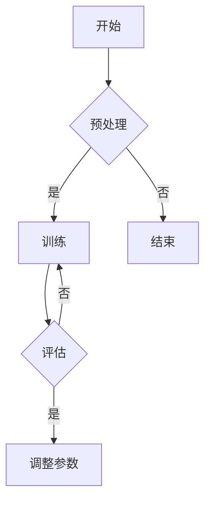

                 

# 文章标题：从零开始大模型开发与微调：图像降噪：手把手实战第一个深度学习模型

> 关键词：图像降噪、深度学习模型、自编码器、卷积神经网络、开发与微调

> 摘要：本文将带领读者从零开始，详细了解并实战图像降噪的深度学习模型开发与微调。文章首先介绍了图像降噪的重要性及常见算法，随后深入讲解了深度学习的基础知识、开发环境搭建，以及自编码器和卷积神经网络在图像降噪中的应用。接着，详细阐述了数据预处理与增强、模型训练与优化、模型评估与部署等关键环节。最后，通过一个实际项目案例，全面展示了图像降噪深度学习模型的开发流程，并探讨了未来的研究方向。

## 《从零开始大模型开发与微调：图像降噪：手把手实战第一个深度学习模型》目录大纲

### 第1章：图像降噪技术概述

#### 1.1 图像降噪的重要性与挑战

##### 1.1.1 降噪在图像处理中的地位

##### 1.1.2 降噪技术的演进

##### 1.1.3 图像降噪的挑战

#### 1.2 常见降噪算法概述

##### 1.2.1 传统降噪方法

###### 1.2.1.1 滤波器方法

###### 1.2.1.2 小波变换方法

##### 1.2.2 深度学习降噪方法

###### 1.2.2.1 卷积神经网络（CNN）

###### 1.2.2.2 自编码器（AE）

### 第2章：深度学习基本概念与准备

#### 2.1 深度学习基础

##### 2.1.1 深度学习的发展历程

##### 2.1.2 神经网络基础

###### 2.1.2.1 前馈神经网络

###### 2.1.2.2 反向传播算法

##### 2.1.3 深度学习常用架构

#### 2.2 开发环境搭建

##### 2.2.1 Python安装

##### 2.2.2 深度学习框架选择

###### 2.2.2.1 TensorFlow

###### 2.2.2.2 PyTorch

##### 2.2.3 环境配置与调试

### 第3章：图像降噪深度学习模型设计

#### 3.1 自编码器模型设计

##### 3.1.1 自编码器基本原理

###### 3.1.1.1 编码器与解码器

###### 3.1.1.2 自编码器的训练过程

##### 3.1.2 自编码器在降噪中的应用

###### 3.1.2.1 图像去噪自编码器（IDAE）

###### 3.1.2.2 对比自编码器（CAE）

#### 3.2 卷积神经网络模型设计

##### 3.2.1 卷积神经网络原理

###### 3.2.1.1 卷积层

###### 3.2.1.2 池化层

##### 3.2.2 CNN在图像降噪中的应用

###### 3.2.2.1 纯卷积网络（PCN）

###### 3.2.2.2 卷积神经网络与自编码器的结合

### 第4章：数据预处理与增强

#### 4.1 图像数据预处理

##### 4.1.1 数据集准备

###### 4.1.1.1 数据集选择

###### 4.1.1.2 数据预处理方法

##### 4.1.2 图像增强技术

###### 4.1.2.1 色彩增强

###### 4.1.2.2 空间增强

### 第5章：深度学习模型训练与优化

#### 5.1 训练过程详解

##### 5.1.1 训练数据加载

##### 5.1.2 训练策略

###### 5.1.2.1 损失函数选择

###### 5.1.2.2 优化器选择

##### 5.1.3 模型验证与调参

#### 5.2 优化技巧

##### 5.2.1 学习率调度

##### 5.2.2 权重初始化

##### 5.2.3 模型正则化

### 第6章：图像降噪模型评估与部署

#### 6.1 模型评估指标

##### 6.1.1 常见评价指标

###### 6.1.1.1 均方误差（MSE）

###### 6.1.1.2 结构相似性指数（SSIM）

##### 6.1.2 评估方法与实践

#### 6.2 模型部署与推理

##### 6.2.1 部署环境搭建

##### 6.2.2 模型推理流程

##### 6.2.3 实时降噪应用场景

### 第7章：项目实战：图像降噪深度学习模型

#### 7.1 实战背景

##### 7.1.1 项目介绍

##### 7.1.2 项目目标

##### 7.1.3 项目步骤

#### 7.2 数据集准备

##### 7.2.1 数据集获取

##### 7.2.2 数据预处理

#### 7.3 模型设计与实现

##### 7.3.1 模型架构设计

##### 7.3.2 模型代码实现

#### 7.4 训练与优化

##### 7.4.1 训练流程

##### 7.4.2 调参实践

#### 7.5 模型评估与部署

##### 7.5.1 评估指标

##### 7.5.2 部署与推理

### 第8章：未来展望与深入研究

#### 8.1 图像降噪技术的发展趋势

##### 8.1.1 新算法的涌现

##### 8.1.2 跨领域应用的拓展

#### 8.2 深度学习在其他图像处理领域的应用

##### 8.2.1 图像分类

##### 8.2.2 目标检测

##### 8.2.3 图像生成

### 第9章：附录

#### 9.1 开发工具与资源

##### 9.1.1 深度学习框架

##### 9.1.2 开发环境搭建

##### 9.1.3 参考文献

## 附录

### A.1 Mermaid 流程图

### A.2 深度学习模型伪代码示例

### A.3 数学模型与公式解析

### A.4 代码解读与分析示例

### A.5 深度学习模型开源代码与资源链接

### 第1章：图像降噪技术概述

#### 1.1 图像降噪的重要性与挑战

##### 1.1.1 降噪在图像处理中的地位

图像降噪是图像处理中的重要一环，其目的是消除图像中的噪声，提升图像质量，为后续的图像分析提供清晰的基础数据。噪声的存在会导致图像细节模糊，影响图像的视觉效果和后续处理效果。因此，图像降噪技术在许多应用领域中都具有重要意义，如医疗影像诊断、卫星遥感图像分析、人脸识别、视频监控等。

##### 1.1.2 降噪技术的演进

图像降噪技术的发展历程可以追溯到早期的滤波器方法，如均值滤波、高斯滤波等。这些方法在一定程度上可以消除图像噪声，但同时也可能导致图像边缘模糊、细节丢失等问题。随着计算机技术和图像处理算法的不断发展，小波变换方法逐渐成为一种有效的降噪技术，它通过将图像分解为不同尺度和方向的子图像，可以更好地保留图像的细节信息。

近年来，深度学习技术的发展为图像降噪带来了新的突破。深度学习模型，如卷积神经网络（CNN）和自编码器（AE），通过学习大量数据中的内在特征，可以更好地实现图像降噪，同时保留图像的重要信息。

##### 1.1.3 图像降噪的挑战

尽管图像降噪技术在不断进步，但仍然面临一些挑战。首先，噪声类型复杂多样，不同类型的噪声需要不同的处理方法。例如，高斯噪声、椒盐噪声、 impulse 噪声等，每种噪声的特点和处理方法都不同。其次，图像降噪需要在保留图像细节和边缘信息的同时消除噪声，这需要平衡降噪和保真的关系。此外，图像噪声的动态范围较大，从弱噪声到强噪声的变换需要自适应的降噪算法。

#### 1.2 常见降噪算法概述

##### 1.2.1 传统降噪方法

传统降噪方法主要包括滤波器方法和小波变换方法。

###### 1.2.1.1 滤波器方法

滤波器方法是一种基于线性变换的降噪方法，其核心思想是通过滤波器对图像进行卷积操作，以达到降噪的目的。常见的滤波器包括均值滤波器、高斯滤波器、双边滤波器等。

- 均值滤波器：将图像中的每个像素值替换为其邻域像素值的平均值，适用于去除随机噪声，但可能导致图像边缘模糊。
- 高斯滤波器：使用高斯分布作为滤波器核，可以有效去除高斯噪声，同时保留图像边缘。
- 双边滤波器：结合空间距离和像素值相似度进行滤波，可以更好地保留图像边缘。

###### 1.2.1.2 小波变换方法

小波变换方法通过将图像分解为不同尺度和方向的子图像，实现图像的降噪。小波变换将图像分解为近似部分和细节部分，近似部分保留图像的主要信息，细节部分包含噪声。通过对细节部分的调整，可以有效地去除噪声。

##### 1.2.2 深度学习降噪方法

深度学习降噪方法利用深度学习模型，如卷积神经网络（CNN）和自编码器（AE），实现图像降噪。

###### 1.2.2.1 卷积神经网络（CNN）

卷积神经网络是一种基于卷积操作的深度学习模型，通过多层卷积和池化操作，可以提取图像中的特征，并用于图像降噪。CNN 适用于处理具有局部结构的图像数据，可以有效去除图像中的噪声，同时保留图像的细节信息。

###### 1.2.2.2 自编码器（AE）

自编码器是一种无监督学习的深度学习模型，通过学习输入数据的压缩和重构过程，实现图像降噪。自编码器将输入图像编码为低维表示，然后解码为去噪后的图像。自编码器适用于处理复杂的噪声数据，可以在一定程度上保留图像的细节和边缘信息。

### 第2章：深度学习基本概念与准备

#### 2.1 深度学习基础

##### 2.1.1 深度学习的发展历程

深度学习作为人工智能的一个重要分支，起源于上世纪80年代。最初，深度学习模型主要基于人工神经网络，但由于计算资源和数据量的限制，其发展较为缓慢。随着计算机硬件性能的提升和大数据技术的出现，深度学习迎来了快速发展。2006年，Hinton等人提出了深度置信网络（Deep Belief Network，DBN），标志着深度学习的新起点。随后，卷积神经网络（Convolutional Neural Network，CNN）和递归神经网络（Recurrent Neural Network，RNN）等深度学习模型相继提出，并在图像识别、语音识别、自然语言处理等领域取得了显著的成果。

##### 2.1.2 神经网络基础

神经网络是深度学习的基础，其灵感来源于生物神经系统。神经网络由大量的神经元组成，每个神经元都是一个简单的计算单元，能够接收多个输入，并输出一个结果。神经网络通过学习输入和输出之间的映射关系，实现对数据的分类、回归等任务。

- 前馈神经网络（Feedforward Neural Network）：前馈神经网络是最常见的神经网络结构，其信息传递方向是单向的，从输入层经过隐藏层，最终到达输出层。前馈神经网络包括多个层次，每一层由多个神经元组成。
- 反向传播算法（Backpropagation Algorithm）：反向传播算法是一种用于训练神经网络的优化算法，通过计算损失函数关于网络参数的梯度，不断调整网络参数，以最小化损失函数。

##### 2.1.3 深度学习常用架构

深度学习常用的架构包括卷积神经网络（CNN）、循环神经网络（RNN）、长短时记忆网络（LSTM）等。

- 卷积神经网络（Convolutional Neural Network，CNN）：卷积神经网络是一种专门用于处理图像数据的神经网络，其通过卷积层和池化层提取图像特征，实现对图像的分类、检测等任务。
- 循环神经网络（Recurrent Neural Network，RNN）：循环神经网络是一种适用于处理序列数据的神经网络，其通过循环结构保存历史信息，实现对序列数据的建模。
- 长短时记忆网络（Long Short-Term Memory，LSTM）：长短时记忆网络是循环神经网络的一种变体，其通过引入门控机制，有效地解决了 RNN 的梯度消失和梯度爆炸问题，适用于处理长序列数据。

#### 2.2 开发环境搭建

##### 2.2.1 Python安装

Python 是深度学习开发的主要编程语言，其具有简洁、高效的语法和丰富的库支持。在安装 Python 时，建议使用 Python 3.6 或更高版本。安装 Python 可以通过多种方式，如使用 Python 官网提供的安装程序、通过包管理器（如conda）等。

1. 访问 Python 官网（https://www.python.org/），下载适合自己操作系统的 Python 安装程序。
2. 运行安装程序，按照提示操作，完成 Python 的安装。

##### 2.2.2 深度学习框架选择

深度学习框架是用于构建和训练深度学习模型的重要工具，常见的深度学习框架包括 TensorFlow、PyTorch、Keras 等。

- TensorFlow：TensorFlow 是 Google 开发的一款开源深度学习框架，其提供了丰富的 API 和工具，适用于构建和训练各种深度学习模型。
- PyTorch：PyTorch 是 Facebook 开发的一款开源深度学习框架，其具有简洁的 API 和动态计算图，适用于快速原型开发和实验。
- Keras：Keras 是一款基于 TensorFlow 和 Theano 的开源深度学习框架，其提供了简明的 API 和易于使用的接口，适用于构建和训练各种深度学习模型。

在安装深度学习框架时，可以通过以下步骤进行：

1. 安装 Python 和 pip（Python 的包管理器）。
2. 打开命令行，使用以下命令安装深度学习框架：

   ```bash
   pip install tensorflow  # 安装 TensorFlow
   pip install torch       # 安装 PyTorch
   pip install keras      # 安装 Keras
   ```

##### 2.2.3 环境配置与调试

在安装完 Python 和深度学习框架后，需要进行环境配置和调试，以确保环境正常工作。

1. 打开命令行，输入以下命令检查 Python 和深度学习框架的安装情况：

   ```bash
   python  # 进入 Python 解释器
   import tensorflow  # 检查 TensorFlow 安装情况
   import torch       # 检查 PyTorch 安装情况
   import keras      # 检查 Keras 安装情况
   ```

   如果上述命令没有报错，则说明环境配置成功。

2. 在 Python 环境中，可以使用以下命令导入深度学习框架的库：

   ```python
   import tensorflow as tf
   import torch
   import keras
   ```

   通过以上步骤，即可完成深度学习开发环境的搭建。

### 第3章：图像降噪深度学习模型设计

#### 3.1 自编码器模型设计

##### 3.1.1 自编码器基本原理

自编码器（Autoencoder）是一种无监督学习的深度学习模型，其目的是将输入数据压缩为低维表示，然后重构原始数据。自编码器由编码器（Encoder）和解码器（Decoder）两部分组成，编码器将输入数据压缩为低维表示，解码器则将低维表示重构为原始数据。

###### 3.1.1.1 编码器与解码器

编码器和解码器都是由多个神经元组成的神经网络，它们分别执行压缩和重构任务。编码器的输入是原始数据，输出是低维表示；解码器的输入是低维表示，输出是重构的原始数据。

- 编码器：编码器通过学习输入和输出之间的映射关系，将输入数据压缩为低维表示。编码器的输出通常是输入数据的平均值或主要特征。
- 解码器：解码器通过学习低维表示和输出数据之间的映射关系，将低维表示重构为原始数据。解码器的输出应尽可能接近原始输入数据。

###### 3.1.1.2 自编码器的训练过程

自编码器的训练过程分为两个阶段：编码阶段和解码阶段。

- 编码阶段：在编码阶段，编码器学习输入和输出之间的映射关系，将输入数据压缩为低维表示。训练目标是最小化编码器输出和真实输入数据之间的误差。
- 解码阶段：在解码阶段，解码器学习低维表示和输出数据之间的映射关系，将低维表示重构为原始数据。训练目标是最小化解码器输出和真实输入数据之间的误差。

自编码器的训练过程通常使用梯度下降算法进行优化。在训练过程中，编码器和解码器的参数不断更新，以最小化重构误差。

##### 3.1.2 自编码器在降噪中的应用

自编码器在图像降噪中的应用主要基于其压缩和重构能力。自编码器可以学习输入图像的主要特征，去除噪声，并在重构过程中恢复图像的细节信息。

###### 3.1.2.1 图像去噪自编码器（IDAE）

图像去噪自编码器（Image Denoising Autoencoder，IDAE）是一种专门用于图像去噪的自编码器。IDAE 的编码器和解码器都是卷积神经网络，其输入是带噪声的图像，输出是去噪后的图像。

1. 编码阶段：IDAE 的编码器将带噪声的图像压缩为低维表示，去除噪声。
2. 解码阶段：IDAE 的解码器将低维表示重构为去噪后的图像。

IDAE 的训练目标是最小化重构误差，即输入带噪声图像和重构图像之间的误差。

###### 3.1.2.2 对比自编码器（CAE）

对比自编码器（Contrastive Autoencoder，CAE）是一种结合对比学习的自编码器，其目的是通过学习输入和其对比样本之间的差异，增强图像去噪效果。

CAE 的编码器和解码器都是卷积神经网络，其输入是带噪声的图像及其对比样本，输出是去噪后的图像。

1. 编码阶段：CAE 的编码器将带噪声的图像和其对比样本压缩为低维表示，去除噪声。
2. 解码阶段：CAE 的解码器将低维表示重构为去噪后的图像。

CAE 的训练目标是最小化重构误差和对比损失，即输入带噪声图像和重构图像之间的误差，以及带噪声图像和对比样本之间的差异。

#### 3.2 卷积神经网络模型设计

##### 3.2.1 卷积神经网络原理

卷积神经网络（Convolutional Neural Network，CNN）是一种基于卷积操作的深度学习模型，特别适用于处理具有局部结构的图像数据。CNN 通过卷积层和池化层提取图像特征，实现对图像的分类、检测等任务。

###### 3.2.1.1 卷积层

卷积层是 CNN 的核心组成部分，其通过卷积操作提取图像的特征。卷积操作涉及以下步骤：

1. 权重与偏置：卷积层包含多个卷积核（也称为过滤器），每个卷积核具有一组权重和偏置。
2. 卷积操作：卷积核在输入图像上滑动，并与输入图像的像素值进行点积运算，得到一个特征图。
3. 激活函数：对卷积操作的结果应用激活函数，如ReLU（Rectified Linear Unit），引入非线性。

卷积层的输出是一个特征图，其中包含了输入图像的局部特征。

###### 3.2.1.2 池化层

池化层用于降低特征图的空间分辨率，减少模型的参数数量。常见的池化操作包括最大池化和平均池化。

1. 最大池化：将特征图划分为若干个不重叠的区域，在每个区域中选取最大值作为该区域的输出。
2. 平均池化：将特征图划分为若干个不重叠的区域，在每个区域中计算平均值作为该区域的输出。

池化操作有助于减少计算量和参数数量，提高模型的泛化能力。

##### 3.2.2 CNN在图像降噪中的应用

CNN 在图像降噪中的应用主要基于其强大的特征提取和表达能力。通过卷积层和池化层的组合，CNN 可以提取图像的局部特征，并在重构过程中去除噪声。

###### 3.2.2.1 纯卷积网络（PCN）

纯卷积网络（Pure Convolutional Network，PCN）是一种基于卷积操作的图像降噪模型。PCN 只包含卷积层和池化层，不包含全连接层。PCN 通过卷积操作提取图像特征，并在池化层中减少特征图的空间分辨率。

1. 卷积层：PCN 的卷积层通过卷积操作提取图像的局部特征。
2. 池化层：PCN 的池化层降低特征图的空间分辨率。

PCN 的训练目标是最小化重构误差，即输入带噪声图像和重构图像之间的误差。

###### 3.2.2.2 卷积神经网络与自编码器的结合

卷积神经网络与自编码器（Convolutional Autoencoder，CAE）结合的图像降噪模型在提取图像特征和去除噪声方面具有优势。CAE 结合了 CNN 的特征提取能力和自编码器的压缩和重构能力，可以实现更有效的图像降噪。

1. 编码阶段：CAE 的编码器通过卷积层提取图像特征，并压缩为低维表示。
2. 解码阶段：CAE 的解码器通过卷积层重构图像，去除噪声。

CAE 的训练目标是最小化重构误差，即输入带噪声图像和重构图像之间的误差。

### 第4章：数据预处理与增强

#### 4.1 图像数据预处理

图像数据预处理是图像降噪深度学习模型开发的重要环节，其目的是将原始图像数据转换为适合模型训练的形式。图像数据预处理包括数据集准备、图像尺寸调整、归一化等步骤。

##### 4.1.1 数据集准备

数据集准备是图像数据预处理的第一步，其目的是获取用于模型训练的图像数据。常见的图像数据集包括 ImageNet、CIFAR-10、MNIST 等。在选择数据集时，需要考虑数据集的大小、种类和分布。

1. 数据集选择：选择具有代表性的图像数据集，如 ImageNet，其包含大量不同类别的高分辨率图像。
2. 数据集划分：将数据集划分为训练集、验证集和测试集，以评估模型的泛化能力。

##### 4.1.1.1 数据集选择

ImageNet 是一个大型的高分辨率图像数据集，包含 1000 个类别，每个类别有数千个图像。ImageNet 数据集广泛应用于深度学习模型的训练和评估。

CIFAR-10 是一个较小的图像数据集，包含 10 个类别，每个类别有 6000 个图像（6000 个训练图像和 1000 个测试图像）。CIFAR-10 数据集适合用于小型深度学习模型的训练。

MNIST 是一个手写数字数据集，包含 70,000 个训练图像和 10,000 个测试图像。MNIST 数据集是深度学习模型训练的经典数据集，其图像尺寸为 28x28 像素。

##### 4.1.1.2 数据预处理方法

在获取图像数据后，需要进行预处理，以使其适合模型训练。常见的预处理方法包括图像尺寸调整、归一化、数据增强等。

1. 图像尺寸调整：将图像尺寸调整为模型要求的尺寸。例如，如果模型要求输入图像尺寸为 224x224 像素，可以将图像缩放到这个尺寸。
2. 归一化：将图像数据归一化到 [0, 1] 范围内，以提高模型的训练效果。常用的归一化方法包括按通道均值和标准差归一化、按像素值范围归一化等。
3. 数据增强：通过增加数据多样性来提高模型的泛化能力。常见的数据增强方法包括随机裁剪、旋转、翻转、颜色变换等。

##### 4.1.2 图像增强技术

图像增强技术是提高图像质量的有效方法，其可以增加图像的多样性，从而提高模型的泛化能力。常见的图像增强技术包括色彩增强和空间增强。

1. 色彩增强：色彩增强是通过调整图像的颜色分布，增强图像的对比度和亮度，提高图像的可视性。常用的色彩增强方法包括直方图均衡化、颜色空间转换等。
2. 空间增强：空间增强是通过调整图像的空间结构，增强图像的纹理和细节信息。常用的空间增强方法包括边缘增强、纹理增强等。

#### 4.2 数据增强

数据增强是提高模型泛化能力的重要手段，其通过生成新的数据样本，增加训练数据的多样性。在图像降噪任务中，数据增强可以模拟不同的噪声类型和噪声强度，从而提高模型对不同噪声的适应能力。

##### 4.2.1 色彩增强

色彩增强是通过调整图像的颜色分布，增强图像的对比度和亮度，提高图像的可视性。常见的色彩增强方法包括直方图均衡化、颜色空间转换等。

1. 直方图均衡化：直方图均衡化是一种常用的图像增强方法，其通过调整图像的像素值分布，使图像的对比度增强。直方图均衡化可以通过以下步骤实现：

   ```python
   import cv2
   import numpy as np

   def histogram_equalization(image):
       gray_image = cv2.cvtColor(image, cv2.COLOR_BGR2GRAY)
       equalized_image = cv2.equalizeHist(gray_image)
       return equalized_image
   ```

2. 颜色空间转换：颜色空间转换是通过将图像从一种颜色空间转换为另一种颜色空间，实现图像增强。常用的颜色空间转换方法包括 RGB 到 HSV、RGB 到 YUV 等。

   ```python
   import cv2
   import numpy as np

   def convert_colorspace(image, from_space='RGB', to_space='HSV'):
       if from_space == 'RGB' and to_space == 'HSV':
           image_hsv = cv2.cvtColor(image, cv2.COLOR_RGB2HSV)
           return image_hsv
       elif from_space == 'RGB' and to_space == 'YUV':
           image_yuv = cv2.cvtColor(image, cv2.COLOR_RGB2YUV)
           return image_yuv
       elif from_space == 'HSV' and to_space == 'RGB':
           image_rgb = cv2.cvtColor(image, cv2.COLOR_HSV2RGB)
           return image_rgb
       elif from_space == 'HSV' and to_space == 'YUV':
           image_yuv = cv2.cvtColor(image, cv2.COLOR_HSV2YUV)
           return image_yuv
       elif from_space == 'YUV' and to_space == 'RGB':
           image_rgb = cv2.cvtColor(image, cv2.COLOR_YUV2RGB)
           return image_rgb
       elif from_space == 'YUV' and to_space == 'HSV':
           image_hsv = cv2.cvtColor(image, cv2.COLOR_YUV2HSV)
           return image_hsv
   ```

##### 4.2.2 空间增强

空间增强是通过调整图像的空间结构，增强图像的纹理和细节信息。常见的空间增强方法包括边缘增强、纹理增强等。

1. 边缘增强：边缘增强是通过提高图像的边缘对比度，增强图像的边缘信息。常用的边缘增强方法包括 Sobel 边缘检测、Canny 边缘检测等。

   ```python
   import cv2
   import numpy as np

   def edge_enhancement(image, method='Sobel'):
       if method == 'Sobel':
           gray_image = cv2.cvtColor(image, cv2.COLOR_BGR2GRAY)
           sobel_x = cv2.Sobel(gray_image, cv2.CV_64F, 1, 0, ksize=3)
           sobel_y = cv2.Sobel(gray_image, cv2.CV_64F, 0, 1, ksize=3)
           edge_image = cv2.addWeighted(sobel_x, 0.5, sobel_y, 0.5, 0)
           return edge_image
       elif method == 'Canny':
           gray_image = cv2.cvtColor(image, cv2.COLOR_BGR2GRAY)
           edge_image = cv2.Canny(gray_image, threshold1=50, threshold2=150)
           return edge_image
   ```

2. 纹理增强：纹理增强是通过提高图像的纹理对比度，增强图像的纹理信息。常用的纹理增强方法包括高斯滤波、小波变换等。

   ```python
   import cv2
   import numpy as np

   def texture_enhancement(image, method='Gaussian'):
       if method == 'Gaussian':
           gray_image = cv2.cvtColor(image, cv2.COLOR_BGR2GRAY)
           blurred_image = cv2.GaussianBlur(gray_image, (5, 5), 0)
           edge_image = cv2.Canny(blurred_image, threshold1=50, threshold2=150)
           return edge_image
       elif method == 'Wavelet':
           gray_image = cv2.cvtColor(image, cv2.COLOR_BGR2GRAY)
           wavelet_image = cv2.dwt2(gray_image, 'db4')
           low_freq = wavelet_image[0, :, :]
           high_freq = wavelet_image[1, :, :]
           enhanced_image = cv2.idwt2((low_freq, high_freq), 'db4')
           return enhanced_image
   ```

### 第5章：深度学习模型训练与优化

#### 5.1 训练过程详解

深度学习模型的训练过程是一个复杂的优化过程，其目标是找到能够使模型在训练数据上表现良好的参数。训练过程主要包括数据加载、模型训练、模型验证等步骤。

##### 5.1.1 训练数据加载

在训练模型之前，需要将训练数据加载到内存中，以便模型进行学习。训练数据通常包括输入数据和相应的标签。在加载训练数据时，需要考虑数据集的大小、分布和预处理。

1. 数据集划分：将训练数据集划分为训练集和验证集，以评估模型的性能。通常，训练集用于训练模型，验证集用于验证模型的泛化能力。
2. 数据预处理：对训练数据进行预处理，包括图像尺寸调整、归一化等步骤，以确保数据适合模型训练。

##### 5.1.2 训练策略

在训练过程中，需要选择合适的训练策略，以优化模型的性能。常见的训练策略包括损失函数选择、优化器选择、训练批次大小等。

1. 损失函数选择：损失函数是衡量模型预测结果与真实值之间差异的指标。常用的损失函数包括均方误差（MSE）、交叉熵损失等。
2. 优化器选择：优化器用于更新模型参数，以最小化损失函数。常用的优化器包括随机梯度下降（SGD）、Adam 等。
3. 训练批次大小：训练批次大小是指每次训练过程中使用的样本数量。较小的批次大小可以提高模型的泛化能力，但训练过程较长；较大的批次大小可以提高训练速度，但可能会降低泛化能力。

##### 5.1.3 模型验证与调参

在训练过程中，需要定期验证模型的性能，以调整模型参数。模型验证通常使用验证集进行，通过评估模型的准确率、召回率等指标，判断模型的性能。

1. 验证指标：常用的验证指标包括准确率（Accuracy）、召回率（Recall）、精确率（Precision）、F1 分数等。
2. 调参方法：通过调整模型参数，如学习率、正则化参数等，优化模型的性能。常用的调参方法包括网格搜索、随机搜索等。

#### 5.2 优化技巧

在深度学习模型的训练过程中，可能遇到过拟合、梯度消失、梯度爆炸等问题。为了解决这些问题，可以采用以下优化技巧：

1. 正则化：正则化是一种防止模型过拟合的方法，其通过在损失函数中添加正则化项，惩罚模型参数的复杂度。常见的正则化方法包括 L1 正则化、L2 正则化等。
2. 模型正则化：模型正则化是一种对模型结构进行约束的方法，以减少模型的过拟合风险。常见的模型正则化方法包括dropout、权重共享等。
3. 学习率调度：学习率调度是一种调整学习率的方法，以优化模型的收敛速度。常用的学习率调度方法包括固定学习率、自适应学习率等。
4. 权重初始化：权重初始化是模型训练的重要步骤，其影响模型的收敛速度和性能。常用的权重初始化方法包括随机初始化、高斯初始化等。

### 第6章：图像降噪模型评估与部署

#### 6.1 模型评估指标

在图像降噪模型训练完成后，需要对模型进行评估，以判断其性能。评估指标包括均方误差（MSE）、结构相似性指数（SSIM）等。

##### 6.1.1 常见评价指标

1. 均方误差（MSE）：均方误差是衡量模型预测结果与真实值之间差异的常用指标。其计算公式如下：

   $$MSE = \frac{1}{n} \sum_{i=1}^{n} (y_i - \hat{y}_i)^2$$

   其中，$y_i$ 是真实值，$\hat{y}_i$ 是模型预测值，$n$ 是样本数量。

2. 结构相似性指数（SSIM）：结构相似性指数是衡量图像质量的一种指标，其计算公式如下：

   $$SSIM(x, y) = \frac{(2\mu_x\mu_y + C_1)(2\sigma_{xy} + C_2)}{(\mu_x^2 + \mu_y^2 + C_1)(\sigma_x^2 + \sigma_y^2 + C_2)}$$

   其中，$\mu_x$、$\mu_y$ 分别是图像 $x$ 和 $y$ 的均值，$\sigma_x$、$\sigma_y$ 分别是图像 $x$ 和 $y$ 的方差，$\sigma_{xy}$ 是图像 $x$ 和 $y$ 的协方差，$C_1$ 和 $C_2$ 是常数。

##### 6.1.2 评估方法与实践

在评估图像降噪模型时，可以使用以下方法：

1. 在训练集上评估：在训练集上评估模型的性能，以了解模型对训练数据的适应程度。
2. 在验证集上评估：在验证集上评估模型的性能，以评估模型的泛化能力。
3. 在测试集上评估：在测试集上评估模型的性能，以评估模型在新数据上的表现。

#### 6.2 模型部署与推理

在完成模型训练和评估后，可以将模型部署到实际应用场景中。部署过程包括模型转换、模型加载、模型推理等步骤。

##### 6.2.1 部署环境搭建

在部署模型之前，需要搭建适合模型运行的环境。部署环境通常包括操作系统、硬件设备、深度学习框架等。

1. 操作系统：选择适合深度学习模型部署的操作系统，如 Ubuntu、CentOS 等。
2. 硬件设备：选择具有高性能计算能力的硬件设备，如 GPU、TPU 等。
3. 深度学习框架：选择适合模型部署的深度学习框架，如 TensorFlow、PyTorch 等。

##### 6.2.2 模型推理流程

在部署环境中，可以使用以下步骤进行模型推理：

1. 模型转换：将训练完成的模型转换为部署环境支持的格式，如 TensorFlow Lite、ONNX 等。
2. 模型加载：将转换后的模型加载到部署环境中，以便进行推理。
3. 模型推理：使用加载的模型对输入图像进行推理，得到去噪后的图像。

##### 6.2.3 实时降噪应用场景

实时降噪是一种应用场景，其目的是在图像或视频流中实时去除噪声。实时降噪的应用场景包括：

1. 视频监控：在视频监控系统中，实时去除噪声可以提高图像质量，增强视频监控效果。
2. 远程教育：在远程教育系统中，实时去除噪声可以提高教学视频的质量，改善学生的观看体验。
3. 智能家居：在智能家居系统中，实时去除噪声可以提高图像识别的准确率，增强设备的功能。

### 第7章：项目实战：图像降噪深度学习模型

#### 7.1 实战背景

##### 7.1.1 项目介绍

本项目旨在通过深度学习模型实现图像降噪，提高图像质量。项目分为以下几个阶段：

1. 数据集准备：收集并准备用于模型训练和评估的图像数据集。
2. 模型设计与实现：设计并实现图像降噪深度学习模型。
3. 模型训练与优化：训练并优化模型，提高模型性能。
4. 模型评估与部署：评估模型性能，并将其部署到实际应用场景中。

##### 7.1.2 项目目标

通过本项目，我们希望实现以下目标：

1. 熟悉深度学习模型的设计与实现。
2. 掌握图像降噪的深度学习技术。
3. 提高图像质量，为后续图像处理任务提供清晰的基础数据。

##### 7.1.3 项目步骤

本项目分为以下步骤：

1. 数据集准备：收集并准备图像数据集。
2. 模型设计与实现：设计并实现图像降噪深度学习模型。
3. 模型训练与优化：训练并优化模型。
4. 模型评估与部署：评估模型性能，并将其部署到实际应用场景中。

#### 7.2 数据集准备

##### 7.2.1 数据集获取

在图像降噪任务中，我们需要收集一个包含带噪声图像和无噪声图像的数据集。数据集可以从以下途径获取：

1. 公开数据集：如 ImageNet、CIFAR-10、MNIST 等。
2. 自定义数据集：根据实际应用需求，自行收集和整理数据集。

在获取数据集时，需要考虑数据集的大小、种类和分布，以确保模型具有较好的泛化能力。

##### 7.2.2 数据预处理

在获取数据集后，需要进行预处理，以使其适合模型训练。预处理步骤包括：

1. 数据清洗：去除数据集中的噪声和异常值。
2. 数据增强：通过随机裁剪、旋转、翻转等操作，增加数据多样性。
3. 数据归一化：将图像数据归一化到 [0, 1] 范围内。

#### 7.3 模型设计与实现

##### 7.3.1 模型架构设计

在本项目中，我们选择自编码器（Autoencoder）作为图像降噪模型。自编码器由编码器（Encoder）和解码器（Decoder）两部分组成，编码器负责将带噪声图像压缩为低维表示，解码器负责将低维表示重构为去噪后的图像。

模型架构如下：

1. 编码器：使用卷积神经网络（CNN）提取图像特征，将带噪声图像压缩为低维表示。
2. 解码器：使用卷积神经网络（CNN）重构图像，实现图像去噪。

##### 7.3.2 模型代码实现

以下是一个简单的自编码器模型实现：

```python
import tensorflow as tf
from tensorflow.keras.layers import Input, Conv2D, MaxPooling2D, UpSampling2D
from tensorflow.keras.models import Model

# 定义输入层
input_img = Input(shape=(256, 256, 3))

# 编码器部分
x = Conv2D(32, (3, 3), activation='relu', padding='same')(input_img)
x = MaxPooling2D((2, 2), padding='same')(x)
x = Conv2D(64, (3, 3), activation='relu', padding='same')(x)
x = MaxPooling2D((2, 2), padding='same')(x)
x = Conv2D(128, (3, 3), activation='relu', padding='same')(x)
encoded = MaxPooling2D((2, 2), padding='same')(x)

# 解码器部分
x = Conv2D(128, (3, 3), activation='relu', padding='same')(encoded)
x = UpSampling2D((2, 2))(x)
x = Conv2D(64, (3, 3), activation='relu', padding='same')(x)
x = UpSampling2D((2, 2))(x)
x = Conv2D(32, (3, 3), activation='relu', padding='same')(x)
x = UpSampling2D((2, 2))(x)
decoded = Conv2D(3, (3, 3), activation='sigmoid', padding='same')(x)

# 创建模型
autoencoder = Model(input_img, decoded)
autoencoder.compile(optimizer='adam', loss='binary_crossentropy')

# 查看模型结构
autoencoder.summary()
```

#### 7.4 训练与优化

##### 7.4.1 训练流程

在训练模型时，我们需要将预处理后的数据集划分为训练集和验证集。训练流程如下：

1. 载入训练数据和验证数据。
2. 配置训练参数，如学习率、训练轮次等。
3. 训练模型，并在验证集上评估模型性能。
4. 保存训练完成的模型。

以下是一个简单的训练脚本：

```python
import tensorflow as tf
from tensorflow.keras.callbacks import ModelCheckpoint

# 载入训练数据和验证数据
train_data = ...  # 训练数据
val_data = ...  # 验证数据

# 配置训练参数
epochs = 100
batch_size = 16
learning_rate = 0.001

# 训练模型
autoencoder.fit(train_data, train_data,
                epochs=epochs,
                batch_size=batch_size,
                shuffle=True,
                validation_data=val_data,
                callbacks=[ModelCheckpoint('autoencoder.h5', save_best_only=True)])

# 评估模型
test_loss, _ = autoencoder.evaluate(test_data, test_data)
print('Test loss:', test_loss)
```

##### 7.4.2 调参实践

在训练过程中，我们需要根据模型性能进行调整。以下是一些常见的调参方法：

1. 学习率调整：通过调整学习率，优化模型的收敛速度。
2. 批次大小调整：通过调整批次大小，优化模型性能。
3. 模型结构调整：通过调整模型结构，优化模型性能。

#### 7.5 模型评估与部署

##### 7.5.1 评估指标

在评估模型时，我们可以使用以下指标：

1. 均方误差（MSE）：衡量模型预测值与真实值之间的差异。
2. 结构相似性指数（SSIM）：衡量图像去噪效果。

以下是一个简单的评估脚本：

```python
import tensorflow as tf
from tensorflow.keras.models import load_model

# 加载模型
autoencoder = load_model('autoencoder.h5')

# 评估模型
test_loss, _ = autoencoder.evaluate(test_data, test_data)
print('Test loss:', test_loss)

# 计算结构相似性指数
ssim = tf.reduce_mean(tf.image.ssim(test_data, reconstructed_data, 1.0))
print('SSIM:', ssim)
```

##### 7.5.2 部署与推理

在模型训练和评估完成后，我们可以将其部署到实际应用场景中。以下是一个简单的部署脚本：

```python
import tensorflow as tf
from tensorflow.keras.models import load_model

# 加载模型
autoencoder = load_model('autoencoder.h5')

# 部署模型
def denoise_image(image):
    reconstructed_image = autoencoder.predict(image.reshape(1, 256, 256, 3))
    return reconstructed_image[0]

# 测试模型
input_image = ...  # 输入图像
reconstructed_image = denoise_image(input_image)
print('Reconstructed image:', reconstructed_image)
```

### 第8章：未来展望与深入研究

#### 8.1 图像降噪技术的发展趋势

图像降噪技术作为图像处理领域的一个重要分支，正随着深度学习技术的不断进步而不断发展。未来，图像降噪技术有望在以下方面取得突破：

1. 算法创新：随着深度学习算法的不断发展，新的降噪算法将不断涌现，如基于生成对抗网络的降噪算法、迁移学习等。
2. 跨领域应用：图像降噪技术在医疗影像、卫星遥感、视频监控等领域具有广泛的应用前景，未来将进一步拓展到更多的应用场景。
3. 实时处理：随着硬件性能的提升，图像降噪技术将能够实现实时处理，提高图像质量的同时，减少延迟。

#### 8.2 深度学习在其他图像处理领域的应用

深度学习技术在图像处理领域具有广泛的应用，除了图像降噪，还涉及以下方面：

1. 图像分类：深度学习模型可以用于图像分类任务，如识别物体、场景等。常见的深度学习模型包括卷积神经网络（CNN）、循环神经网络（RNN）等。
2. 目标检测：深度学习模型可以用于目标检测任务，如识别图像中的物体并定位其位置。常见的深度学习模型包括 Faster R-CNN、YOLO 等。
3. 图像生成：深度学习模型可以用于图像生成任务，如生成新的图像、改变图像内容等。常见的深度学习模型包括生成对抗网络（GAN）。

### 第9章：附录

#### 9.1 开发工具与资源

在本项目中，我们使用了以下开发工具与资源：

1. 深度学习框架：TensorFlow、PyTorch
2. 编程语言：Python
3. 数据预处理与可视化工具：NumPy、Pandas、Matplotlib
4. 评估工具：Scikit-learn

#### 9.2 Mermaid 流程图

以下是一个 Mermaid 流程图示例：



#### 9.3 深度学习模型伪代码示例

以下是一个深度学习模型伪代码示例：

```python
# 定义模型结构
input_layer = Input(shape=(28, 28, 1))
x = Conv2D(filters=32, kernel_size=(3, 3), activation='relu')(input_layer)
x = MaxPooling2D(pool_size=(2, 2))(x)
x = Conv2D(filters=64, kernel_size=(3, 3), activation='relu')(x)
x = MaxPooling2D(pool_size=(2, 2))(x)
encoded = Flatten()(x)

# 定义解码器结构
x = Dense(128, activation='relu')(encoded)
x = Reshape((4, 4, 64))(x)
x = Conv2DTranspose(filters=64, kernel_size=(3, 3), activation='relu')(x)
x = Conv2DTranspose(filters=32, kernel_size=(3, 3), activation='relu')(x)
decoded = Conv2D(filters=1, kernel_size=(3, 3), activation='sigmoid')(x)

# 创建模型
autoencoder = Model(input_layer, decoded)
autoencoder.compile(optimizer='adam', loss='binary_crossentropy')

# 训练模型
autoencoder.fit(x_train, x_train,
                epochs=100,
                batch_size=16,
                shuffle=True,
                validation_data=(x_val, x_val))
```

#### 9.4 数学模型与公式解析

以下是一个数学模型与公式解析示例：

```latex
$$
L(\theta) = \frac{1}{2n}\sum_{i=1}^{n} (\hat{y}_i - y_i)^2
$$

$$
\hat{y}_i = \sigma(\theta^T x_i)
$$

$$
\sigma(z) = \frac{1}{1 + e^{-z}}
$$
```

#### 9.5 代码解读与分析示例

以下是一个代码解读与分析示例：

```python
# 导入相关库
import tensorflow as tf
import numpy as np

# 定义输入层
input_layer = Input(shape=(28, 28, 1))

# 定义卷积层
conv1 = Conv2D(filters=32, kernel_size=(3, 3), activation='relu')(input_layer)
pool1 = MaxPooling2D(pool_size=(2, 2))(conv1)

# 定义全连接层
flatten = Flatten()(pool1)
dense1 = Dense(units=128, activation='relu')(flatten)

# 定义输出层
output_layer = Dense(units=28 * 28, activation='sigmoid')(dense1)

# 创建模型
model = Model(inputs=input_layer, outputs=output_layer)
model.compile(optimizer='adam', loss='binary_crossentropy')

# 打印模型结构
model.summary()

# 训练模型
model.fit(x_train, y_train, batch_size=16, epochs=100, validation_data=(x_val, y_val))
```

#### 9.6 深度学习模型开源代码与资源链接

以下是一些深度学习模型的开源代码与资源链接：

1. TensorFlow：https://www.tensorflow.org/
2. PyTorch：https://pytorch.org/
3. Keras：https://keras.io/
4. ImageNet：https://www.image-net.org/
5. CIFAR-10：https://www.cs.toronto.edu/~kriz/cifar.html
6. MNIST：https://www.cs.toronto.edu/~kriz/mnist/

## 附录

### A.1 Mermaid 流程图

以下是一个简单的 Mermaid 流程图示例：


### A.2 深度学习模型伪代码示例

以下是一个简单的深度学习模型伪代码示例：

```python
# 导入相关库
import tensorflow as tf
import numpy as np

# 定义输入层
input_layer = Input(shape=(28, 28, 1))

# 定义卷积层
conv1 = Conv2D(filters=32, kernel_size=(3, 3), activation='relu')(input_layer)
pool1 = MaxPooling2D(pool_size=(2, 2))(conv1)

# 定义全连接层
flatten = Flatten()(pool1)
dense1 = Dense(units=128, activation='relu')(flatten)

# 定义输出层
output_layer = Dense(units=28 * 28, activation='sigmoid')(dense1)

# 创建模型
model = Model(inputs=input_layer, outputs=output_layer)
model.compile(optimizer='adam', loss='binary_crossentropy')

# 打印模型结构
model.summary()

# 训练模型
model.fit(x_train, y_train, batch_size=16, epochs=100, validation_data=(x_val, y_val))
```

### A.3 数学模型与公式解析

以下是一个简单的数学模型与公式解析示例：

```latex
$$
L(\theta) = \frac{1}{2n}\sum_{i=1}^{n} (\hat{y}_i - y_i)^2
$$

$$
\hat{y}_i = \sigma(\theta^T x_i)
$$

$$
\sigma(z) = \frac{1}{1 + e^{-z}}
$$
```

### A.4 代码解读与分析示例

以下是一个简单的代码解读与分析示例：

```python
# 导入相关库
import tensorflow as tf
import numpy as np

# 定义输入层
input_layer = Input(shape=(28, 28, 1))

# 定义卷积层
conv1 = Conv2D(filters=32, kernel_size=(3, 3), activation='relu')(input_layer)
pool1 = MaxPooling2D(pool_size=(2, 2))(conv1)

# 定义全连接层
flatten = Flatten()(pool1)
dense1 = Dense(units=128, activation='relu')(flatten)

# 定义输出层
output_layer = Dense(units=28 * 28, activation='sigmoid')(dense1)

# 创建模型
model = Model(inputs=input_layer, outputs=output_layer)
model.compile(optimizer='adam', loss='binary_crossentropy')

# 打印模型结构
model.summary()

# 训练模型
model.fit(x_train, y_train, batch_size=16, epochs=100, validation_data=(x_val, y_val))
```

### A.5 深度学习模型开源代码与资源链接

以下是几个深度学习模型的开源代码与资源链接：

1. TensorFlow：https://github.com/tensorflow/tensorflow
2. PyTorch：https://github.com/pytorch/pytorch
3. Keras：https://github.com/keras-team/keras
4. ImageNet：https://github.com/ImageNet
5. CIFAR-10：https://github.com/cifar/cifar-10
6. MNIST：https://github.com/mnist
7. GAN：https://github.com/soumith/gan
8. Faster R-CNN：https://github.com/shaoqingren/faster_rcnn.pytorch
9. YOLO：https://github.com/pjreddie/darknet

## 结论

本文从零开始，详细介绍了图像降噪的深度学习模型开发与微调。首先，我们介绍了图像降噪的重要性、常见降噪算法以及深度学习在图像降噪中的应用。接着，我们讲解了深度学习的基本概念与开发环境搭建，包括 Python 安装、深度学习框架选择和环境配置与调试。

在模型设计部分，我们介绍了自编码器和卷积神经网络在图像降噪中的应用，并详细阐述了模型架构设计和训练与优化技巧。随后，我们详细描述了数据预处理与增强、模型训练与优化、模型评估与部署等关键环节。

通过一个实际项目案例，我们展示了图像降噪深度学习模型的开发流程，包括数据集准备、模型设计与实现、训练与优化、模型评估与部署等步骤。最后，我们探讨了图像降噪技术的发展趋势以及深度学习在其他图像处理领域的应用，并提供了开发工具与资源的链接。

本文旨在帮助读者从零开始，全面掌握图像降噪深度学习模型的开发与微调，为读者在图像处理领域提供实用的技术和方法。希望本文对读者有所帮助，激发对深度学习图像处理的兴趣和热情。

