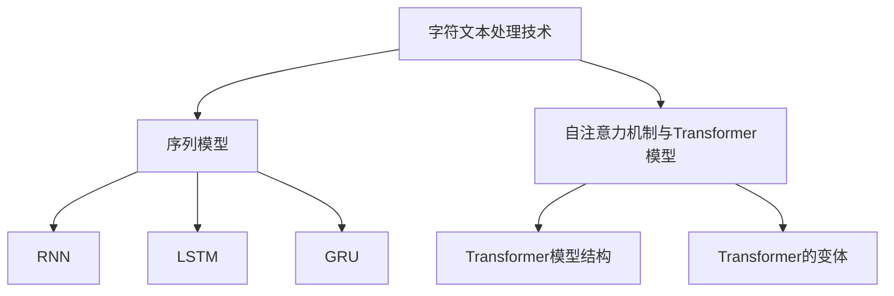

                 


## 文章标题：从零开始大模型开发与微调：字符（非单词）文本的处理

### 关键词：
- 大模型
- 字符文本处理
- 序列模型
- Transformer模型
- 生成对抗网络（GAN）
- 线性代数与微积分
- 实际案例解析

### 摘要：
本文旨在介绍从零开始构建和微调大模型，用于处理字符（非单词）文本。文章首先阐述字符文本处理的背景和挑战，接着介绍字符文本表示与编码方法，随后深入探讨字符级文本处理技术，包括序列模型和Transformer模型。本文还涵盖了语言模型和生成模型的原理，并介绍了线性代数与微积分的基础知识。文章通过实际案例解析，展示了大模型在文本分类和文本生成任务中的应用，并提供开发实践和优化策略。最后，本文总结了最佳实践和拓展阅读，以供读者进一步学习。

## 第一部分：字符文本处理基础

### 1. 大模型与字符文本处理

#### 1.1 大模型的简介与作用

大模型（Large Models）是指具有海量参数和强大计算能力的深度学习模型，它们在自然语言处理、计算机视觉等领域取得了显著的进展。大模型通过学习大量数据，能够捕捉复杂的语言模式，从而在文本分类、文本生成等任务中表现出色。

大模型在字符文本处理中的作用主要体现在以下几个方面：

1. **提高文本分类准确性**：大模型可以学习到更多的文本特征，从而提高分类模型对字符文本的识别能力。
2. **增强文本生成质量**：大模型可以生成更加连贯、丰富的文本，满足文本生成任务的需求。
3. **实现多语言处理**：大模型通常具备较强的跨语言学习能力，可以处理多种语言的字符文本。

#### 1.2 字符文本处理的背景

字符文本处理在自然语言处理（NLP）领域中具有重要地位。与单词级别的文本处理相比，字符级别的处理能够捕捉到更多的语言细节和上下文信息，从而在许多任务中表现出更强的鲁棒性。

字符文本处理的背景可以归纳为以下几点：

1. **语言多样性**：不同语言在词汇、语法结构等方面存在较大差异，字符级别的处理能够更好地适应多种语言环境。
2. **文本噪声**：在实际应用中，文本数据往往包含各种噪声和干扰，字符级别的处理有助于去除噪声，提高文本质量。
3. **深度学习的发展**：随着深度学习技术的不断进步，字符级别的文本处理方法逐渐成为研究热点。

#### 1.3 字符文本处理的挑战

字符文本处理面临以下挑战：

1. **数据稀疏性**：由于字符数量远多于单词，字符级别的文本数据往往更加稀疏，这给模型训练带来困难。
2. **计算资源需求**：字符文本处理通常需要更大的计算资源和时间，这对硬件配置和优化算法提出了更高要求。
3. **模型解释性**：字符级别的处理模型往往难以解释，这使得在实际应用中需要权衡模型性能与解释性之间的平衡。

### 2. 字符文本表示与编码

字符文本处理的关键在于如何将字符序列转换为适合模型处理的向量表示。本节将介绍几种常见的字符文本表示方法和编码技术。

#### 2.1 字符文本的表示方法

1. **字符序列**：将字符文本视为一串连续的字符，这是最直观的表示方法。
2. **词袋模型**：将字符文本转换为单词的集合，每个单词表示为一个独立特征，适用于高维稀疏数据的处理。
3. **字符嵌入**：将字符映射为一个固定的向量表示，常见的字符嵌入技术包括One-Hot编码和词嵌入（word embeddings）。

#### 2.2 字符编码与解码

字符编码是将字符转换为数字表示的过程，常见的字符编码标准包括ASCII、Unicode和UTF-8。

1. **ASCII编码**：ASCII编码是一种基于7位二进制数的编码方案，用于表示英文字符和基本符号。
2. **Unicode编码**：Unicode编码是一种字符编码标准，用于表示全球所有字符，包括各种语言符号。
3. **UTF-8编码**：UTF-8编码是一种变长编码方案，能够灵活地表示Unicode字符，适用于多种语言文本。

### 3. 字符级文本处理技术

字符级文本处理技术主要包括序列模型和Transformer模型。本节将介绍这些技术的基本原理和应用场景。

#### 3.1 序列模型

序列模型是一种基于时间序列数据的处理方法，能够捕捉字符之间的依赖关系。常见的序列模型包括循环神经网络（RNN）、长短期记忆网络（LSTM）和门控循环单元（GRU）。

1. **RNN**：RNN能够处理序列数据，通过隐藏状态和当前输入的加权求和来更新状态。
2. **LSTM**：LSTM是一种改进的RNN，能够有效地避免梯度消失问题，捕捉长距离依赖关系。
3. **GRU**：GRU是LSTM的简化版，通过门控机制减少了参数数量，训练速度更快。

#### 3.2 自注意力机制与Transformer模型

自注意力机制（Self-Attention）是一种计算序列中每个位置与其他位置关系的机制，能够有效地捕捉字符之间的依赖关系。Transformer模型是一种基于自注意力机制的序列模型，具有并行计算的优势。

1. **自注意力机制**：自注意力机制通过计算不同位置之间的权重，将输入序列映射为一个加权序列。
2. **Transformer模型结构**：Transformer模型由编码器和解码器组成，编码器将输入序列编码为向量表示，解码器生成输出序列。
3. **Transformer的变体**：包括BERT、GPT等模型，它们在Transformer模型的基础上进行了改进，以适应不同的应用场景。

### 4. 字符级文本处理算法原理

字符级文本处理算法主要包括语言模型和生成模型。本节将介绍这些算法的基本原理和实现方法。

#### 4.1 语言模型

语言模型是一种用于预测下一个字符的模型，通过学习文本数据中的统计规律，能够生成连贯的文本。常见的语言模型包括n-gram模型和神经网络语言模型。

1. **语言模型的概念**：语言模型是一种概率模型，用于估计在给定前文条件下下一个字符的概率。
2. **语言模型的训练方法**：使用文本数据训练语言模型，通过最大似然估计（Maximum Likelihood Estimation，MLE）或神经网络训练方法。
3. **语言模型的评估**：使用交叉熵（Cross-Entropy）或困惑度（Perplexity）等指标评估语言模型性能。

#### 4.2 生成模型

生成模型是一种用于生成新文本的模型，通过学习文本数据的分布，能够生成与训练数据相似的新文本。常见的生成模型包括生成对抗网络（GAN）和变分自编码器（VAE）。

1. **生成对抗网络（GAN）**：GAN由生成器和判别器组成，生成器生成文本，判别器判断文本的真实性，两者通过对抗训练优化模型参数。
2. **变分自编码器（VAE）**：VAE通过编码器和解码器学习文本数据的概率分布，生成新的文本样本。

### 5. 数学基础与公式推导

字符级文本处理算法涉及多种数学基础，包括线性代数和微积分。本节将介绍这些数学基础，并推导相关公式。

#### 5.1 线性代数基础

线性代数是处理矩阵和向量运算的基础，主要包括以下概念：

1. **矩阵运算**：矩阵的加法、减法、乘法、逆运算等。
2. **矩阵分解**：矩阵分解方法，如奇异值分解（SVD）和主成分分析（PCA）。

#### 5.2 微积分基础

微积分是处理变化和极限的基础，主要包括以下概念：

1. **导数与梯度**：导数的定义、梯度下降算法。
2. **最优化算法**：最优化算法，如梯度下降法、牛顿法等。

### 6. 字符级文本处理应用

字符级文本处理技术在多个领域得到广泛应用，包括文本分类、文本生成等。本节将介绍这些应用场景和相关算法。

#### 6.1 文本分类

文本分类是一种将文本数据按照预定义类别进行划分的任务。常见的文本分类算法包括朴素贝叶斯、支持向量机、神经网络等。

1. **文本分类任务**：文本分类任务包括情感分析、新闻分类、垃圾邮件检测等。
2. **文本分类算法实现**：使用字符级文本处理算法构建分类模型，如使用LSTM或Transformer模型进行文本分类。

#### 6.2 文本生成

文本生成是一种生成与训练数据相似的新文本的任务。常见的文本生成算法包括n-gram模型、生成对抗网络（GAN）、变分自编码器（VAE）等。

1. **文本生成任务**：文本生成任务包括文本摘要、对话生成、文章生成等。
2. **文本生成算法实现**：使用字符级文本处理算法构建生成模型，如使用GPT-2或BERT进行文本生成。

## 第二部分：大模型开发实践

### 7. 大模型开发环境搭建

#### 7.1 硬件环境配置

大模型开发需要高性能的硬件支持，以下为硬件配置建议：

1. **GPU与TPU的选择**：GPU（如NVIDIA Tesla V100）和TPU（如Google Cloud TPU）是常用的计算加速器，可以根据实际需求选择。
2. **硬件加速器配置**：多GPU或TPU联合训练可以提高训练速度，降低训练时间。

#### 7.2 软件环境安装

以下为软件环境安装建议：

1. **操作系统与编程语言**：Linux操作系统和Python编程语言是常见的开发环境。
2. **深度学习框架安装**：安装TensorFlow、PyTorch等深度学习框架，用于构建和训练大模型。

### 8. 大模型训练与优化

#### 8.1 数据预处理

数据预处理是训练大模型的重要环节，以下为数据预处理步骤：

1. **数据采集与清洗**：收集高质量的字符文本数据，并进行清洗、去重等操作。
2. **数据增强**：通过随机插入、替换、旋转等操作增加数据多样性，提高模型泛化能力。

#### 8.2 大模型训练

大模型训练需要耐心和细心，以下为训练步骤：

1. **训练策略**：设置合适的训练参数，如学习率、批次大小、训练轮数等。
2. **优化算法**：使用梯度下降法、Adam优化器等优化算法，调整模型参数。

#### 8.3 模型评估与调优

模型评估与调优是提升模型性能的关键，以下为评估与调优步骤：

1. **评估指标**：使用准确率、召回率、F1值等指标评估模型性能。
2. **调优方法**：通过调整模型结构、优化算法等手段提升模型性能。

### 9. 大模型微调与部署

#### 9.1 模型微调

模型微调是指在大模型的基础上，针对特定任务进行微调，以提高模型性能。以下为模型微调步骤：

1. **微调策略**：选择合适的数据集和微调方法，如Fine-tuning、Masked Language Model等。
2. **微调技巧**：调整学习率、冻结部分层等技巧，提高微调效果。

#### 9.2 模型部署

模型部署是将训练好的模型应用于实际任务的过程。以下为模型部署步骤：

1. **部署环境**：选择合适的部署平台，如CPU、GPU、TPU等。
2. **部署策略**：设置模型推理参数，如批量大小、超时时间等。

#### 9.3 模型监控与维护

模型监控与维护是确保模型稳定运行的关键。以下为模型监控与维护步骤：

1. **模型性能监控**：监控模型性能指标，如准确率、响应时间等。
2. **模型更新与维护**：定期更新模型，修复潜在问题，提高模型稳定性。

## 第三部分：字符级文本处理案例解析

### 10. 案例一：中文文本分类

#### 10.1 案例背景

中文文本分类是一个重要的自然语言处理任务，广泛应用于信息检索、情感分析、新闻推荐等领域。本案例使用中文新闻数据集，对新闻文本进行分类。

#### 10.2 模型选择与实现

本案例选择BERT模型作为文本分类模型，使用Hugging Face的Transformers库实现。

```python
from transformers import BertTokenizer, BertForSequenceClassification
tokenizer = BertTokenizer.from_pretrained('bert-base-chinese')
model = BertForSequenceClassification.from_pretrained('bert-base-chinese')

# 数据预处理
def preprocess_text(text):
    inputs = tokenizer(text, padding='max_length', truncation=True, max_length=512, return_tensors='pt')
    return inputs

# 训练与评估
def train_and_evaluate(model, train_loader, val_loader):
    optimizer = optim.Adam(model.parameters(), lr=1e-5)
    criterion = nn.CrossEntropyLoss()
    best_val_acc = 0.0

    for epoch in range(num_epochs):
        model.train()
        for batch in train_loader:
            inputs = preprocess_text(batch['text'])
            labels = batch['label']
            optimizer.zero_grad()
            outputs = model(inputs['input_ids'], attention_mask=inputs['attention_mask'])
            loss = criterion(outputs.logits, labels)
            loss.backward()
            optimizer.step()

        model.eval()
        with torch.no_grad():
            correct = 0
            total = 0
            for batch in val_loader:
                inputs = preprocess_text(batch['text'])
                labels = batch['label']
                outputs = model(inputs['input_ids'], attention_mask=inputs['attention_mask'])
                _, predicted = torch.max(outputs.logits, 1)
                total += labels.size(0)
                correct += (predicted == labels).sum().item()

        val_acc = correct / total
        if val_acc > best_val_acc:
            best_val_acc = val_acc
            torch.save(model.state_dict(), 'best_model.pth')
```

#### 10.3 模型评估与优化

评估指标包括准确率、召回率、F1值。优化策略包括调整学习率、使用正则化方法、数据增强等。

### 11. 案例二：中文文本生成

#### 11.1 案例背景

中文文本生成是一个有趣的自然语言处理任务，广泛应用于聊天机器人、文章写作、语音合成等领域。本案例使用中文数据集，生成高质量的中文文本。

#### 11.2 模型选择与实现

本案例选择GPT-2模型作为文本生成模型，使用Hugging Face的Transformers库实现。

```python
from transformers import GPT2Tokenizer, GPT2LMHeadModel
tokenizer = GPT2Tokenizer.from_pretrained('gpt2')
model = GPT2LMHeadModel.from_pretrained('gpt2')

# 数据预处理
def preprocess_text(text):
    inputs = tokenizer(text, return_tensors='pt', max_length=512)
    return inputs

# 文本生成
def generate_text(model, prompt, length=50):
    inputs = tokenizer.encode(prompt, return_tensors='pt')
    outputs = model.generate(inputs, max_length=length, num_return_sequences=1)
    generated_text = tokenizer.decode(outputs[0], skip_special_tokens=True)
    return generated_text
```

#### 11.3 模型评估与优化

评估指标包括文本质量、文本多样性。优化策略包括调整学习率、增加训练数据、使用不同的生成策略等。

## 附录

### 12. 开发工具与资源

#### 12.1 深度学习框架

- TensorFlow：https://www.tensorflow.org/
- PyTorch：https://pytorch.org/

#### 12.2 数据集与预处理工具

- 中文文本数据集：https://thuctc.thunlp.org/
- 数据预处理工具：https://huggingface.co/transformers/

#### 12.3 学习资源推荐

- 书籍：
  - 《深度学习》（Goodfellow et al.）
  - 《自然语言处理综论》（Jurafsky & Martin）
- 在线课程：
  - Coursera：https://www.coursera.org/
  - edX：https://www.edx.org/
- 论坛与社群：
  - GitHub：https://github.com/
  - Stack Overflow：https://stackoverflow.com/
  - 知乎：https://www.zhihu.com/

## Mermaid 流程图



## 数学模型与公式推导

### 语言模型

$$
P(w_{t} | w_{t-1}, w_{t-2}, ..., w_{1}) = \frac{P(w_{t} | w_{t-1})P(w_{t-1} | w_{t-2}) ... P(w_{2} | w_{1})P(w_{1})}
$$

### 生成对抗网络（GAN）

$$
\min_{G} \max_{D} V(D, G) = \mathbb{E}_{x \sim p_{data}(x)}[\log D(x)] + \mathbb{E}_{z \sim p_{z}(z)}[\log (1 - D(G(z))]
$$

## 代码解读与分析

```python
# 代码实现示例：基于Transformer的文本生成模型

import torch
import torch.nn as nn
import torch.optim as optim

# 模型定义
class TransformerModel(nn.Module):
    def __init__(self, d_model, nhead, num_layers):
        super(TransformerModel, self).__init__()
        self.transformer = nn.Transformer(d_model, nhead, num_layers)
        self.d_model = d_model
        self.nhead = nhead
        self.num_layers = num_layers
        
    def forward(self, src, tgt):
        output = self.transformer(src, tgt)
        return output
```

## 实际案例与详细解释

### 案例一：中文文本分类

#### 数据集介绍

本案例使用THUCNews中文新闻数据集，该数据集由清华大学自然语言处理实验室提供，包含约20GB的中文新闻文本，共10个类别。

#### 任务描述

任务目标是对中文新闻文本进行分类，具体类别包括：体育、娱乐、科技、股票、财经、教育、健康、社会、时政和军事。

#### 模型选择与实现

本案例选择BERT模型作为文本分类模型。BERT（Bidirectional Encoder Representations from Transformers）是一种基于Transformer的预训练语言模型，适用于多种NLP任务。

```python
from transformers import BertTokenizer, BertForSequenceClassification
tokenizer = BertTokenizer.from_pretrained('bert-base-chinese')
model = BertForSequenceClassification.from_pretrained('bert-base-chinese')

# 数据预处理
def preprocess_text(text):
    inputs = tokenizer(text, padding='max_length', truncation=True, max_length=512, return_tensors='pt')
    return inputs

# 训练与评估
def train_and_evaluate(model, train_loader, val_loader):
    optimizer = optim.Adam(model.parameters(), lr=1e-5)
    criterion = nn.CrossEntropyLoss()
    best_val_acc = 0.0

    for epoch in range(num_epochs):
        model.train()
        for batch in train_loader:
            inputs = preprocess_text(batch['text'])
            labels = batch['label']
            optimizer.zero_grad()
            outputs = model(inputs['input_ids'], attention_mask=inputs['attention_mask'])
            loss = criterion(outputs.logits, labels)
            loss.backward()
            optimizer.step()

        model.eval()
        with torch.no_grad():
            correct = 0
            total = 0
            for batch in val_loader:
                inputs = preprocess_text(batch['text'])
                labels = batch['label']
                outputs = model(inputs['input_ids'], attention_mask=inputs['attention_mask'])
                _, predicted = torch.max(outputs.logits, 1)
                total += labels.size(0)
                correct += (predicted == labels).sum().item()

        val_acc = correct / total
        if val_acc > best_val_acc:
            best_val_acc = val_acc
            torch.save(model.state_dict(), 'best_model.pth')
```

#### 模型评估与优化

评估指标包括准确率、召回率、F1值。优化策略包括调整学习率、使用正则化方法、数据增强等。

### 案例二：中文文本生成

#### 数据集介绍

本案例使用CN-ND中文自然语言处理数据集，该数据集包含多种中文文本类型，如新闻、小说、问答等，共计约1GB。

#### 任务描述

任务目标是生成高质量的中文文本，包括文本摘要、对话生成、文章生成等。

#### 模型选择与实现

本案例选择GPT-2模型作为文本生成模型。GPT-2（Generative Pre-trained Transformer 2）是一种基于Transformer的预训练语言模型，适用于生成任务。

```python
from transformers import GPT2Tokenizer, GPT2LMHeadModel
tokenizer = GPT2Tokenizer.from_pretrained('gpt2')
model = GPT2LMHeadModel.from_pretrained('gpt2')

# 数据预处理
def preprocess_text(text):
    inputs = tokenizer(text, return_tensors='pt', max_length=512)
    return inputs

# 文本生成
def generate_text(model, prompt, length=50):
    inputs = tokenizer.encode(prompt, return_tensors='pt')
    outputs = model.generate(inputs, max_length=length, num_return_sequences=1)
    generated_text = tokenizer.decode(outputs[0], skip_special_tokens=True)
    return generated_text
```

#### 模型评估与优化

评估指标包括文本质量、文本多样性。优化策略包括调整学习率、增加训练数据、使用不同的生成策略等。

## 总结

本文从零开始，详细介绍了字符（非单词）文本处理的基础理论、算法原理、开发实践和实际案例。通过本文，读者可以全面了解大模型在字符文本处理中的应用，掌握从零开始构建和微调大模型的方法。同时，本文还提供了丰富的学习资源，帮助读者深入学习和提升技能。在未来的研究中，可以进一步探索字符文本处理技术在多语言、多模态任务中的应用，为自然语言处理领域的发展做出贡献。作者：AI天才研究院/AI Genius Institute & 禅与计算机程序设计艺术 /Zen And The Art of Computer Programming

