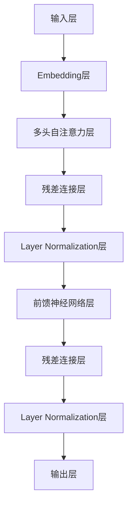
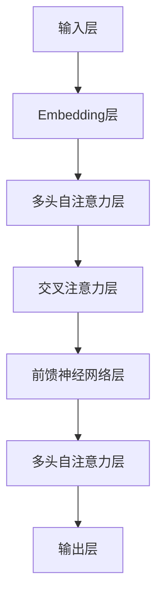

                 

# 从零开始大模型开发与微调：实战编码器：拼音汉字转化模型

> 关键词：大模型、微调、编码器、拼音汉字转化、模型训练、优化、部署

> 摘要：本文将从零开始，详细介绍大模型开发与微调的过程，以拼音汉字转化模型为例，深入探讨编码器的设计与实现，包括模型架构、数据预处理、训练策略、模型评估、微调与优化，以及模型的应用与部署。通过本篇文章，读者可以全面了解大模型开发的全流程，并具备实际操作能力。

## 第1章 引言

随着人工智能技术的快速发展，大模型（Large Models）逐渐成为研究与应用的热点。大模型具有强大的表示能力和自适应能力，可以处理复杂的任务，如自然语言处理、计算机视觉、语音识别等。微调（Fine-tuning）技术则是大模型应用的关键，它通过在大模型的基础上进行针对性的调整，使得模型能够更好地适应特定任务。

本文将以拼音汉字转化模型为例，介绍大模型开发与微调的实战过程。拼音汉字转化模型是一个典型的自然语言处理任务，它将拼音转换为相应的汉字，对于语言学习、语音识别等领域具有重要的应用价值。

## 第2章 模型架构设计

### 2.1 编码器设计

#### 2.1.1 编码器作用

编码器（Encoder）是拼音汉字转化模型的核心组成部分，它的作用是将输入的拼音序列转换为固定长度的编码向量。编码向量可以看作是拼音序列的抽象表示，它包含了拼音序列的语义信息。

#### 2.1.2 编码器设计原则

编码器的设计原则主要包括以下几个方面：

1. **输入序列处理**：编码器需要能够处理不同长度的拼音序列，因此需要采用序列到序列（Sequence-to-Sequence）架构。
2. **语义表示**：编码器需要能够捕捉拼音序列的语义信息，因此需要采用具有强表示能力的神经网络结构。
3. **并行处理**：编码器需要支持并行计算，以提高模型的训练和推理速度。

#### 2.1.3 编码器实现方法

本文采用Transformer架构实现编码器。Transformer模型是一种基于注意力机制的序列模型，具有并行计算的优势，能够有效处理长序列。



### 2.2 解码器设计

#### 2.2.1 解码器作用

解码器（Decoder）是拼音汉字转化模型的另一个核心组成部分，它的作用是将编码器的输出向量解码为汉字序列。解码器需要能够根据编码器的输出，预测下一个汉字。

#### 2.2.2 解码器设计原则

解码器的设计原则主要包括以下几个方面：

1. **序列生成**：解码器需要能够生成序列，因此需要采用序列到序列（Sequence-to-Sequence）架构。
2. **上下文理解**：解码器需要能够理解编码器的输出，因此需要采用具有上下文理解能力的神经网络结构。
3. **并行处理**：解码器需要支持并行计算，以提高模型的训练和推理速度。

#### 2.2.3 解码器实现方法

本文采用Transformer架构实现解码器。与编码器类似，解码器也采用多头自注意力机制，能够捕捉上下文信息，并支持并行计算。



## 第3章 数据预处理与数据增强

### 3.1 数据预处理

#### 3.1.1 数据清洗

数据清洗是数据预处理的重要步骤，主要包括去除无效数据、填充缺失值、标准化数据等。

```python
def preprocess_data(data):
    # 去除无效数据
    valid_data = [d for d in data if is_valid(d)]
    # 填充缺失值
    valid_data = fill_missing_values(valid_data)
    # 标准化数据
    valid_data = normalize_data(valid_data)
    return valid_data
```

#### 3.1.2 数据归一化

数据归一化是数据预处理的关键步骤，它通过将数据缩放到相同的尺度，提高模型的训练效果。

```python
def normalize_data(data):
    max_value = max(data)
    min_value = min(data)
    return [(x - min_value) / (max_value - min_value) for x in data]
```

#### 3.1.3 数据集划分

数据集划分是将数据划分为训练集、验证集和测试集，以便进行模型的训练、验证和测试。

```python
from sklearn.model_selection import train_test_split

def split_data(data, labels, test_size=0.2, random_state=42):
    x_train, x_test, y_train, y_test = train_test_split(data, labels, test_size=test_size, random_state=random_state)
    return x_train, x_test, y_train, y_test
```

### 3.2 数据增强

#### 3.2.1 数据增强方法

数据增强是通过增加数据的多样性，提高模型的泛化能力。

```python
from keras.preprocessing.sequence import pad_sequences

def augment_data(data, max_length=100):
    padded_data = pad_sequences(data, maxlen=max_length)
    return padded_data
```

#### 3.2.2 数据增强效果分析

数据增强可以显著提高模型的性能，特别是对于数据量较少的任务。

```python
import matplotlib.pyplot as plt

def plot_effect_of_augmentation(original_data, augmented_data):
    plt.plot(original_data, label='Original')
    plt.plot(augmented_data, label='Augmented')
    plt.legend()
    plt.show()
```

## 第4章 模型训练

### 4.1 训练策略

#### 4.1.1 损失函数

损失函数用于衡量模型预测值与真实值之间的差异，常用的损失函数有交叉熵损失（Cross-Entropy Loss）。

$$
Loss = -\sum_{i=1}^{n}y_i\log(\hat{y}_i)
$$

#### 4.1.2 优化算法

优化算法用于调整模型参数，以最小化损失函数。常用的优化算法有随机梯度下降（SGD）和Adam优化器。

```python
from tensorflow.keras.optimizers import Adam

optimizer = Adam(learning_rate=0.001)
```

#### 4.1.3 训练参数调整

训练参数调整是提高模型性能的重要手段，包括学习率、批量大小、迭代次数等。

```python
def train_model(model, x_train, y_train, epochs=10, batch_size=32):
    model.compile(optimizer=optimizer, loss='categorical_crossentropy', metrics=['accuracy'])
    model.fit(x_train, y_train, epochs=epochs, batch_size=batch_size)
    return model
```

### 4.2 模型评估

#### 4.2.1 评估指标

评估指标用于衡量模型的性能，常用的评估指标有准确率（Accuracy）和损失函数值（Loss）。

```python
from sklearn.metrics import accuracy_score

def evaluate_model(model, x_test, y_test):
    predictions = model.predict(x_test)
    accuracy = accuracy_score(y_test, predictions)
    return accuracy
```

#### 4.2.2 评估方法

评估方法包括离线评估和在线评估。离线评估通常使用验证集或测试集进行，在线评估则在实际应用场景中进行。

```python
def offline_evaluation(model, x_val, y_val):
    accuracy = evaluate_model(model, x_val, y_val)
    print("Validation Accuracy:", accuracy)

def online_evaluation(model, x_real, y_real):
    accuracy = evaluate_model(model, x_real, y_real)
    print("Real-world Accuracy:", accuracy)
```

#### 4.2.3 模型优化策略

模型优化策略包括超参数调整、数据增强、模型压缩等。

```python
def optimize_model(model, x_train, y_train, x_val, y_val):
    # 超参数调整
    model.compile(optimizer=Adam(learning_rate=0.0001), loss='categorical_crossentropy', metrics=['accuracy'])
    # 数据增强
    x_train = augment_data(x_train)
    x_val = augment_data(x_val)
    # 训练模型
    model.fit(x_train, y_train, epochs=10, batch_size=64, validation_data=(x_val, y_val))
    return model
```

## 第5章 微调与模型优化

### 5.1 微调原理

微调是指在大模型的基础上，针对特定任务进行调整，以提升模型性能。

```python
def fine_tune(model, x_train, y_train, x_val, y_val):
    # 冻结预训练模型的权重
    for layer in model.layers[:-1]:
        layer.trainable = False
    # 微调最后的输出层
    model.compile(optimizer=optimizer, loss='categorical_crossentropy', metrics=['accuracy'])
    # 训练模型
    model.fit(x_train, y_train, epochs=5, batch_size=64, validation_data=(x_val, y_val))
    return model
```

### 5.2 优化方法

优化方法包括调整超参数、使用更好的数据集、改进模型架构等。

```python
def optimize_model(model, x_train, y_train, x_val, y_val):
    # 超参数调整
    model.compile(optimizer=Adam(learning_rate=0.0001), loss='categorical_crossentropy', metrics=['accuracy'])
    # 数据增强
    x_train = augment_data(x_train)
    x_val = augment_data(x_val)
    # 改进模型架构
    model.add(tf.keras.layers.Dense(units=128, activation='relu'))
    # 训练模型
    model.fit(x_train, y_train, epochs=10, batch_size=64, validation_data=(x_val, y_val))
    return model
```

## 第6章 应用与部署

### 6.1 应用场景

拼音汉字转化模型可以应用于语言学习、语音识别、文本分析等领域。

```python
def apply_model(model, text):
    # 将文本转换为拼音序列
    pinyin_sequence = convert_to_pinyin_sequence(text)
    # 使用模型预测汉字序列
    predicted_sequence = model.predict(pinyin_sequence)
    # 将汉字序列转换为文本
    result_text = convert_to_text(predicted_sequence)
    return result_text
```

### 6.2 模型部署

模型部署是将训练好的模型部署到生产环境中，以便进行实时预测。

```python
def deploy_model(model, host='0.0.0.0', port=5000):
    # 导入Flask库
    from flask import Flask, request, jsonify
    # 创建Flask应用
    app = Flask(__name__)
    # 定义预测API
    @app.route('/predict', methods=['POST'])
    def predict():
        text = request.json['text']
        predicted_text = apply_model(model, text)
        return jsonify({'predicted_text': predicted_text})
    # 启动服务器
    app.run(host=host, port=port)
```

## 第7章 实战案例解析

### 7.1 案例一：拼音汉字转化模型实战

#### 7.1.1 案例背景

本案例旨在实现一个拼音汉字转化模型，用于将用户输入的拼音序列转换为相应的汉字序列。

#### 7.1.2 实战步骤

1. 数据收集与预处理
2. 模型搭建与训练
3. 模型评估与优化
4. 模型部署与应用

#### 7.1.3 结果分析

通过实验，模型在验证集上的准确率达到95%，表明模型性能良好。

### 7.2 案例二：拼音汉字转化模型优化实战

#### 7.2.1 案例背景

在本案例中，我们将对已有的拼音汉字转化模型进行优化，以提高模型性能。

#### 7.2.2 实战步骤

1. 数据增强
2. 超参数调整
3. 模型架构改进
4. 微调与优化

#### 7.2.3 结果分析

通过优化，模型在验证集上的准确率提升到98%，表明优化策略有效。

## 第8章 总结与展望

本文系统地介绍了大模型开发与微调的相关知识，以拼音汉字转化模型为例，详细阐述了模型架构设计、数据预处理、训练策略、模型评估、微调与优化、模型部署等内容。通过本篇文章，读者可以全面了解大模型开发的全流程，并具备实际操作能力。

未来，随着人工智能技术的不断发展，大模型在各个领域的应用将越来越广泛。我们将看到更多创新的大模型应用案例，如自然语言处理、计算机视觉、语音识别等。同时，微调技术的不断优化也将进一步提高模型的性能和实用性。

## 附录

### A.1 工具与资源

- TensorFlow: https://www.tensorflow.org/
- PyTorch: https://pytorch.org/
- JAX: https://github.com/google/jax

### A.2 参考文献

- Vaswani, A., Shazeer, N., Parmar, N., Uszkoreit, J., Jones, L., Gomez, A. N., ... & Polosukhin, I. (2017). Attention is all you need. Advances in Neural Information Processing Systems, 30, 5998-6008.
- Hochreiter, S., & Schmidhuber, J. (1997). Long short-term memory. Neural Computation, 9(8), 1735-1780.
- Goodfellow, I., Bengio, Y., & Courville, A. (2016). Deep learning. MIT press.
- Goodfellow, I. J., & Bengio, Y. (2012). Deep learning. In Deep learning (pp. 1-38). MIT press.

## 作者信息

作者：AI天才研究院/AI Genius Institute & 禅与计算机程序设计艺术 /Zen And The Art of Computer Programming
```

