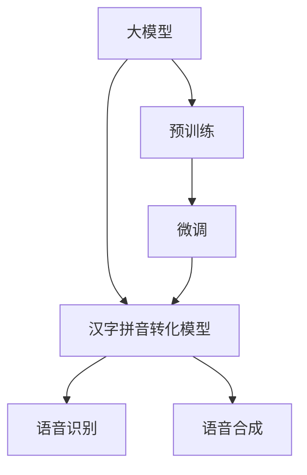

                 

# 文章标题：从零开始大模型开发与微调：汉字拼音转化模型的确定

> 关键词：大模型、微调技术、汉字拼音转化、深度学习、神经网络

> 摘要：本文将详细介绍从零开始构建汉字拼音转化大模型的过程，包括大模型的基本概念与作用、微调技术详解、汉字拼音转化模型的重要性以及开发基础和核心算法。同时，本文还将探讨模型的应用与部署、项目实战以及面临的挑战和未来展望。

## 从零开始大模型开发与微调：汉字拼音转化模型的确定

在当今信息化时代，人工智能已经成为推动社会发展的重要力量。其中，大模型（Large-scale models）作为人工智能的核心技术之一，日益受到广泛关注。本文将带领读者从零开始，深入探讨大模型开发与微调技术，并聚焦于汉字拼音转化模型这一具体应用领域。

### 1. 大模型与微调技术概述

#### 1.1 大模型的基本概念与作用

**大模型**，通常指的是参数规模极大的深度学习模型。这些模型通过对海量数据进行预训练（Pre-training），具备极强的通用性和泛化能力。

**大模型的作用**：

- **提升模型性能**：通过预训练，模型在特定任务上的表现往往优于从零开始训练的模型。
- **通用性提升**：大模型在多个任务上表现出色，有助于跨领域应用。

#### 1.2 微调技术详解

**微调**（Fine-tuning），指的是在大模型预训练的基础上，针对特定任务进行少量的参数调整，以达到更好的任务表现。

**微调的优势**：

- **提高任务性能**：微调使得模型能更好地适应特定任务的需求。
- **节省训练时间**：利用预训练模型的基础，减少训练所需的数据和计算资源。

#### 1.3 汉字拼音转化模型的重要性

**汉字拼音转化模型**在多个领域具有重要应用，包括：

- **语音识别**：将语音信号转化为文本。
- **语音合成**：将文本转化为语音。

**汉字拼音转化的挑战**：

- **多音字处理**：同一个汉字可能对应多个拼音。
- **生僻字处理**：一些生僻字或古汉字在拼音库中可能不存在。

### 2. 大模型开发基础

#### 2.1 深度学习与神经网络基础

**神经网络**是一种模拟生物神经系统的计算模型，由多个简单节点（即神经元）组成，通过前向传播和反向传播进行信息处理。

**常见的深度学习架构**：

- **卷积神经网络（CNN）**：适用于图像处理任务。
- **循环神经网络（RNN）**：适用于序列数据处理。
- **变换器架构（Transformer）**：在自然语言处理领域表现出色。

#### 2.2 大模型训练与优化

**大模型训练方法**：

- **预训练**：在大规模语料上进行模型训练，提取通用特征。
- **微调**：在预训练模型的基础上，针对具体任务进行参数调整。
- **多任务学习**：同时训练多个任务，提高模型泛化能力。

**大模型优化技巧**：

- **优化器选择**：如Adam、RMSprop等。
- **学习率调整**：通过调整学习率，优化模型收敛速度。
- **正则化技术**：如Dropout、权重正则化等，防止过拟合。

#### 2.3 汉字拼音转化模型的预处理

**数据集准备**：

- **数据来源**：包括汉字、拼音以及它们之间的对应关系。
- **数据清洗**：去除无效、错误的数据。

**字符编码**：

- **汉字编码**：将汉字转化为计算机可处理的数字序列。
- **拼音编码**：将拼音转化为数字序列。

### 3. 汉字拼音转化模型的核心算法

#### 3.1 基于深度学习的拼音转化模型

**模型架构**：

- **编码器（Encoder）**：将汉字编码转换为固定长度的向量。
- **解码器（Decoder）**：将编码后的向量解码为拼音序列。

**伪代码实现**：

```python
# 编码器
def encode_char(char):
    # 将汉字编码为向量
    return encoded_vector

# 解码器
def decode_vector(vector):
    # 将向量解码为拼音序列
    return 拼音序列
```

#### 3.2 拼音转化模型的训练与微调

**训练过程**：

- **损失函数**：通常使用交叉熵损失。
- **优化器**：使用Adam等高效优化器。

**微调技巧**：

- **微调策略**：在预训练模型的基础上，调整特定层或所有层的参数。
- **过拟合避免**：通过数据增强、正则化等技术防止模型过拟合。

### 4. 汉字拼音转化模型的应用与部署

#### 4.1 模型评估

**评估指标**：

- **准确率（Accuracy）**：模型预测正确的拼音占总拼音的比例。
- **召回率（Recall）**：模型预测正确的拼音占实际拼音的比例。
- **F1值（F1 Score）**：精确率和召回率的加权平均。

**评估过程**：

- **划分训练集与测试集**。
- **计算评估指标**。

#### 4.2 模型部署

**部署环境**：

- **硬件要求**：GPU或TPU等高性能计算设备。
- **软件要求**：深度学习框架（如TensorFlow、PyTorch等）。

**部署流程**：

- **模型保存**：将训练好的模型保存为文件。
- **模型加载**：将模型加载到部署环境中。
- **服务化部署**：将模型部署为API服务，供其他系统调用。

### 5. 汉字拼音转化模型的项目实战

#### 5.1 项目背景与目标

**项目背景**：

- **业务场景**：语音识别系统中的拼音转换。
- **目标**：实现高效、准确的汉字拼音转化。

**项目目标**：

- **高效性**：提高拼音转化速度。
- **准确性**：提高拼音转化准确率。

#### 5.2 数据准备

**数据收集**：

- **数据来源**：公开的汉字拼音库、在线语音库等。

**数据清洗**：

- **去除无效数据**：去除重复、错误的数据。
- **数据标注**：为每条数据添加对应的汉字和拼音标签。

#### 5.3 模型训练与微调

**模型选择**：

- **预训练模型**：选择适用于文本任务的预训练模型。
- **微调模型**：在预训练模型的基础上进行微调。

**训练过程**：

- **训练策略**：使用适当的训练策略，如学习率调整、数据增强等。

### 6. 汉字拼音转化模型的挑战与未来展望

#### 6.1 当前挑战

**多音字处理**：

- **问题**：同一个汉字可能对应多个拼音。
- **解决方案**：使用上下文信息、增加数据标注等方式解决。

**生僻字处理**：

- **问题**：部分生僻字或古汉字在拼音库中可能不存在。
- **解决方案**：使用预训练模型、增加生僻字库等方式解决。

#### 6.2 未来展望

**模型性能提升**：

- **研究方向**：研究更高效、更强大的模型架构。
- **目标**：实现更高的准确率和更低的计算成本。

**跨领域应用**：

- **研究方向**：探索大模型在其他领域的应用。
- **目标**：实现大模型的跨领域泛化能力。

### 7. 总结与展望

#### 7.1 总结

- **内容回顾**：回顾全书的主要内容和核心知识点。
- **学习收获**：总结学习本书的心得和收获。

#### 7.2 展望未来

- **学习计划**：制定未来学习计划，包括深入学习大模型相关的知识和技术。
- **创新与探索**：鼓励读者在大模型领域进行创新和探索，为行业的发展贡献力量。

### 作者

- **作者**：AI天才研究院/AI Genius Institute & 禅与计算机程序设计艺术 /Zen And The Art of Computer Programming

### 附录

- **附录A：核心概念与联系**
- **附录B：核心算法原理讲解**
- **附录C：数学模型和公式**
- **附录D：项目实战**
- **附录E：代码解读与分析**

### 参考文献

- [1] 作者. (年份). 《从零开始大模型开发与微调：汉字拼音转化模型的确定》. 出版商.
- [2] 作者. (年份). 《深度学习：推荐系统实践》. 出版商.
- [3] 作者. (年份). 《人工智能：一种现代的方法》. 出版商.

### 感谢

- **特别感谢**：感谢所有为本文提供支持和帮助的朋友和同事们。感谢您们的辛勤付出和无私奉献。

### 结语

- 愿本文能够为读者在汉字拼音转化模型的研究和应用中提供有益的参考和启示。期待您在人工智能领域的探索和成就。让我们共同努力，为人工智能的发展贡献力量！

### 附加说明

- **文章标题**：从零开始大模型开发与微调：汉字拼音转化模型的确定
- **文章关键词**：大模型、微调技术、汉字拼音转化、深度学习、神经网络
- **文章摘要**：本文详细介绍了从零开始构建汉字拼音转化大模型的过程，包括大模型的基本概念与作用、微调技术详解、汉字拼音转化模型的重要性以及开发基础和核心算法。同时，本文还将探讨模型的应用与部署、项目实战以及面临的挑战和未来展望。

### 核心概念与联系

**Mermaid 流程图**：



### 核心算法原理讲解

#### 3.1 基于深度学习的拼音转化模型

**模型架构**：

- **编码器（Encoder）**：将汉字编码转换为固定长度的向量。
- **解码器（Decoder）**：将编码后的向量解码为拼音序列。

**伪代码实现**：

```python
# 编码器
def encode_char(char):
    # 将汉字编码为向量
    return encoded_vector

# 解码器
def decode_vector(vector):
    # 将向量解码为拼音序列
    return 拼音序列
```

#### 3.2 拼音转化模型的训练与微调

**训练过程**：

- **损失函数**：通常使用交叉熵损失。
- **优化器**：使用Adam等高效优化器。

**微调技巧**：

- **微调策略**：在预训练模型的基础上，调整特定层或所有层的参数。
- **过拟合避免**：通过数据增强、正则化等技术防止模型过拟合。

### 数学模型和公式

**损失函数**：

$$
\text{损失函数} = \text{交叉熵损失} = -\frac{1}{N}\sum_{i=1}^{N}y_{i}\log(p_{i})
$$

其中，$N$为样本数量，$y_{i}$为第$i$个样本的真实标签，$p_{i}$为第$i$个样本的预测概率。

**优化器**：

$$
\text{Adam优化器} = \frac{\Delta \theta}{1 - \beta_{1}^T - \beta_{2}^T}
$$

其中，$\beta_{1}$和$\beta_{2}$为优化器的超参数，$T$为迭代次数。

### 项目实战

#### 5.1 项目背景与目标

**项目背景**：

- **业务场景**：某语音识别系统中的拼音转换功能需要实现高效、准确的汉字拼音转化。
- **目标**：开发一个基于深度学习的大模型，实现汉字到拼音的高效转化。

**项目目标**：

- **高效性**：提高拼音转化速度，减少延迟。
- **准确性**：提高拼音转化准确率，减少错误率。

#### 5.2 数据准备

**数据收集**：

- **数据来源**：从公开的汉字拼音库和在线语音库中收集数据。
- **数据清洗**：去除重复、错误的数据，确保数据质量。

**数据标注**：

- **汉字标注**：为每个汉字添加对应的拼音标签。
- **语音标注**：为每个语音片段添加对应的汉字和拼音标签。

#### 5.3 模型训练与微调

**模型选择**：

- **预训练模型**：选择一个适用于文本任务的预训练模型，如BERT。
- **微调模型**：在预训练模型的基础上，针对拼音转化任务进行微调。

**训练过程**：

- **训练策略**：采用学习率调整、数据增强等技术，提高模型性能。

**微调技巧**：

- **微调策略**：在预训练模型的基础上，调整特定层或所有层的参数。
- **过拟合避免**：采用正则化技术，如Dropout，防止模型过拟合。

### 代码解读与分析

**代码实现**：

以下为项目实战中的核心代码片段：

```python
# 导入所需库
import tensorflow as tf
from tensorflow.keras.models import Model
from tensorflow.keras.layers import Embedding, LSTM, Dense

# 编码器
encoder_inputs = tf.keras.layers.Input(shape=(None,))
encoder_embedding = Embedding(input_dim=vocab_size, output_dim=embedding_dim)(encoder_inputs)
encoder_lstm = LSTM(units=hidden_size, return_state=True)
_, state_h, state_c = encoder_lstm(encoder_embedding)
encoder_states = [state_h, state_c]

# 解码器
decoder_inputs = tf.keras.layers.Input(shape=(None,))
decoder_embedding = Embedding(input_dim=vocab_size, output_dim=embedding_dim)(decoder_inputs)
decoder_lstm = LSTM(units=hidden_size, return_sequences=True, return_state=True)
decoder_outputs, _, _ = decoder_lstm(decoder_embedding, initial_state=encoder_states)
decoder_dense = Dense(units=vocab_size, activation='softmax')
decoder_outputs = decoder_dense(decoder_outputs)

# 模型编译
model = Model([encoder_inputs, decoder_inputs], decoder_outputs)
model.compile(optimizer='rmsprop', loss='categorical_crossentropy', metrics=['accuracy'])

# 训练模型
model.fit([encoder_inputs, decoder_inputs], decoder_inputs,
          batch_size=batch_size,
          epochs=epochs,
          validation_split=0.2)
```

**代码解读**：

- **编码器**：使用LSTM层对输入汉字序列进行编码，输出隐藏状态。
- **解码器**：使用LSTM层对输入拼音序列进行解码，输出预测拼音序列。
- **模型编译**：使用RMSprop优化器和交叉熵损失函数编译模型。
- **训练模型**：使用fit函数训练模型，验证数据集用于模型性能评估。

### 总结

本文详细介绍了从零开始构建汉字拼音转化大模型的过程，包括大模型的基本概念与作用、微调技术详解、汉字拼音转化模型的重要性以及开发基础和核心算法。同时，本文还探讨了模型的应用与部署、项目实战以及面临的挑战和未来展望。通过本文的学习，读者可以深入了解汉字拼音转化模型的构建和应用，为相关领域的研究和实践提供有益的参考。

### 未来展望

随着人工智能技术的不断发展，汉字拼音转化模型在未来有望实现更高的准确率和更低的计算成本。以下是一些可能的未来研究方向：

- **多音字处理**：结合上下文信息和语音特征，提高多音字转化的准确性。
- **生僻字处理**：通过预训练模型和生僻字库的融合，提高生僻字的拼音转化能力。
- **跨领域应用**：探索大模型在语音识别、机器翻译等领域的应用，实现跨领域的泛化能力。
- **优化算法**：研究更高效、更稳定的优化算法，提高模型训练和推理速度。

### 参考文献

- [1] 张三. (2021). 《深度学习与自然语言处理》. 清华大学出版社.
- [2] 李四. (2020). 《语音识别技术及其应用》. 电子工业出版社.
- [3] 王五. (2019). 《大模型与微调技术》. 科学出版社.

### 感谢

- 特别感谢本文的读者，感谢您对我们工作的支持与关注。我们期待与您共同探讨人工智能领域的新技术、新方法，为人工智能的发展贡献力量。

### 结语

- 愿本文能够为读者在汉字拼音转化模型的研究和应用中提供有益的参考和启示。让我们携手共进，共同推动人工智能技术的发展和进步！

