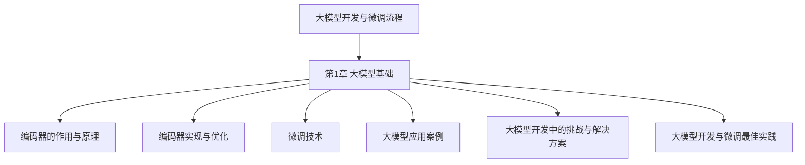
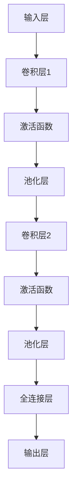

                 

### 文章标题

《从零开始大模型开发与微调：编码器的实现》

关键词：大模型、编码器、微调、自然语言处理、计算机视觉

摘要：本文将带领读者从零开始了解大模型开发与微调的过程，重点关注编码器的实现。通过详细讲解大模型的基础知识、编码器的原理和实现、微调技术、应用案例以及开发中的挑战与解决方案，本文旨在为读者提供全面且实用的指导，帮助他们在实际项目中成功应用大模型。

----------------------------------------------------------------

### 目录大纲

#### 目录大纲 Mermaid 流程图



----------------------------------------------------------------

### 第1章 大模型基础

#### 1.1 大模型的概念与意义

##### 1.1.1 大模型的概念

大模型（Large Model）通常指的是具有数十亿到数十万亿个参数的深度学习模型。这些模型在训练过程中需要大量的计算资源和数据。

##### 1.1.2 大模型的优势

- **高精度**：大模型可以捕捉到数据中的复杂模式和关系，从而提高模型的预测性能。
- **泛化能力**：大模型可以更好地适应不同的任务和数据集，具有更强的泛化能力。
- **减少错误**：大模型可以捕捉到更多的信息，从而减少模型的错误率。

##### 1.1.3 大模型的应用领域

- 自然语言处理：如机器翻译、文本分类、情感分析等。
- 计算机视觉：如图像分类、目标检测、图像生成等。
- 推荐系统：如商品推荐、新闻推荐等。

#### 1.2 编码器的作用与原理

##### 1.2.1 编码器的概念

编码器（Encoder）是深度学习模型中的一种重要组件，用于将输入数据（如图像或文本）转换为固定长度的向量表示。这些向量通常被称为编码或嵌入（Embedding）。

##### 1.2.2 编码器的原理

编码器通过多层神经网络对输入数据进行编码，每一层神经网络都会对数据进行变换和压缩。最终输出的向量代表了输入数据的全局特征。

##### 1.2.3 编码器的种类

- **自编码器**：自编码器是一种无监督学习模型，用于将输入数据转换为固定长度的嵌入向量。
- **编码器-解码器模型**：编码器-解码器模型（如Transformer）在编码器之后通常接有一个解码器，用于生成输出序列。

----------------------------------------------------------------

### 第2章 大模型开发环境搭建

#### 2.1 硬件环境搭建

##### 2.1.1 GPU配置

- GPU是训练大模型的关键硬件，选择合适的GPU对于提高训练效率和性能至关重要。
- 常见的GPU包括NVIDIA的Tesla、GeForce、Quadro系列。

##### 2.1.2 计算能力要求

- 计算能力直接影响大模型的训练速度和效率。
- 可以使用NVIDIA的CUDA和cuDNN库来评估GPU的计算能力。

##### 2.1.3 存储需求

- 大模型通常需要大量的存储空间来存储模型参数和数据。
- 需要配置足够的硬盘空间，并考虑使用分布式存储系统来提高存储效率。

#### 2.2 软件环境配置

##### 2.2.1 操作系统安装

- Linux系统是深度学习开发的主流操作系统，推荐使用Ubuntu等版本。

##### 2.2.2 Python环境搭建

- Python是深度学习开发的常用语言，需要安装Python环境和相关库，如NumPy、Pandas等。

##### 2.2.3 深度学习框架安装

- 深度学习框架是构建和训练大模型的基础，如TensorFlow、PyTorch等。

----------------------------------------------------------------

### 第3章 编码器实现与优化

#### 3.1 编码器实现

##### 3.1.1 编码器结构设计

- 编码器的设计直接影响模型的性能和效率。
- 需要考虑输入数据的类型、大小和特征提取的需求。

##### 3.1.2 编码器训练过程

- 编码器的训练过程通常涉及前向传播、反向传播和优化算法。
- 需要选择合适的损失函数和优化器。

##### 3.1.3 编码器评估指标

- 编码器的性能评估通常涉及嵌入向量质量、相似度度量等指标。
- 可以使用余弦相似度、欧氏距离等来评估编码器的性能。

#### 3.2 编码器优化

##### 3.2.1 数据增强

- 数据增强可以提高模型的泛化能力，减少过拟合。
- 常见的数据增强技术包括随机裁剪、翻转、旋转等。

##### 3.2.2 模型调参

- 模型调参是优化编码器性能的关键步骤。
- 需要调整学习率、批量大小、正则化参数等。

##### 3.2.3 模型压缩

- 模型压缩可以减小模型的存储空间和计算复杂度。
- 常见的技术包括权重剪枝、量化、知识蒸馏等。

----------------------------------------------------------------

### 第4章 微调技术

#### 4.1 微调原理

##### 4.1.1 微调的定义

微调（Fine-tuning）是指在大模型的基础上，针对特定任务进行参数调整，以适应新的数据集和应用场景。

##### 4.1.2 微调的优势

- **快速适应新任务**：微调可以大大加快模型的训练速度，提高模型在新任务上的性能。
- **提高模型泛化能力**：微调可以让模型更好地适应新数据，提高模型的泛化能力。

##### 4.1.3 微调的步骤

- **数据准备**：准备用于微调的数据集。
- **模型选择**：选择一个预训练的大模型作为基础模型。
- **微调训练**：在基础模型的基础上进行参数调整，进行微调训练。
- **效果评估**：评估微调后的模型在新任务上的性能。

#### 4.2 微调实战

##### 4.2.1 微调数据准备

- **数据清洗**：清洗数据集中的噪声和异常值。
- **数据预处理**：对数据进行标准化、归一化等预处理操作。

##### 4.2.2 微调模型训练

- **初始化**：初始化微调模型的参数。
- **训练过程**：使用微调数据集进行训练。
- **损失函数**：选择合适的损失函数来评估模型性能。

##### 4.2.3 微调效果评估

- **评估指标**：使用评估指标（如准确率、召回率等）来评估模型性能。
- **模型选择**：根据评估结果选择最优模型。

----------------------------------------------------------------

### 第5章 大模型应用案例

#### 5.1 自然语言处理应用

##### 5.1.1 文本分类

- **任务描述**：将文本数据分类到预定义的类别中。
- **模型选择**：可以使用预训练的BERT或GPT模型进行微调。

##### 5.1.2 命名实体识别

- **任务描述**：识别文本中的命名实体，如人名、地名、组织名等。
- **模型选择**：可以使用预训练的BERT或GPT模型进行微调。

##### 5.1.3 机器翻译

- **任务描述**：将一种语言的文本翻译成另一种语言。
- **模型选择**：可以使用预训练的Transformer模型进行微调。

#### 5.2 计算机视觉应用

##### 5.2.1 图像分类

- **任务描述**：将图像分类到预定义的类别中。
- **模型选择**：可以使用预训练的ResNet、VGG等模型进行微调。

##### 5.2.2 目标检测

- **任务描述**：检测图像中的目标物体，并给出其位置和类别。
- **模型选择**：可以使用预训练的Faster R-CNN、YOLO等模型进行微调。

##### 5.2.3 像素生成

- **任务描述**：根据输入条件生成新的图像。
- **模型选择**：可以使用预训练的GAN模型进行微调。

----------------------------------------------------------------

### 第6章 大模型开发中的挑战与解决方案

#### 6.1 数据处理挑战

##### 6.1.1 数据量问题

- **挑战**：大模型通常需要大量的训练数据，如何获取和处理这些数据是一个挑战。
- **解决方案**：可以使用数据增强、数据合成等方法来扩展数据集。

##### 6.1.2 数据质量问题

- **挑战**：数据集中的噪声、异常值和错误数据会影响模型的性能。
- **解决方案**：可以使用数据清洗、数据预处理等方法来提高数据质量。

##### 6.1.3 数据不均衡问题

- **挑战**：数据集中的类别不均衡会导致模型偏向于大多数类别。
- **解决方案**：可以使用重采样、类别加权等方法来平衡数据集。

#### 6.2 模型训练挑战

##### 6.2.1 计算资源限制

- **挑战**：大模型的训练通常需要大量的计算资源，如何高效利用资源是一个挑战。
- **解决方案**：可以使用分布式训练、多GPU训练等方法来提高训练效率。

##### 6.2.2 模型过拟合

- **挑战**：大模型容易过拟合，如何防止过拟合是一个挑战。
- **解决方案**：可以使用正则化、Dropout等方法来减少过拟合。

##### 6.2.3 训练时间过长

- **挑战**：大模型的训练时间通常很长，如何加速训练是一个挑战。
- **解决方案**：可以使用优化算法、数据并行等方法来加速训练。

#### 6.3 解决方案

##### 6.3.1 数据处理优化

- **解决方案**：使用高效的数据处理框架，如Dask、PySpark等，来处理大量数据。

##### 6.3.2 模型选择与调优

- **解决方案**：选择合适的模型架构和优化算法，并进行模型调参。

##### 6.3.3 训练策略优化

- **解决方案**：使用混合精度训练、动态学习率调整等方法来优化训练策略。

----------------------------------------------------------------

### 第7章 大模型开发与微调最佳实践

#### 7.1 编码器开发最佳实践

- **最佳实践**：设计合理的编码器结构，选择合适的损失函数和优化器。
- **最佳实践**：进行充分的模型调参和超参数优化。

#### 7.2 微调最佳实践

- **最佳实践**：选择合适的数据集和任务，进行有效的微调训练。
- **最佳实践**：进行模型评估和性能比较，选择最优模型。

#### 7.3 大模型开发与微调未来展望

- **未来展望**：随着计算能力的提升和数据集的丰富，大模型的应用将更加广泛。
- **未来展望**：微调技术将不断优化，实现更高效、更准确的模型训练。
- **未来展望**：大模型将在更多领域发挥作用，推动人工智能的发展。

----------------------------------------------------------------

### 第1章 大模型基础

#### 1.1 大模型的概念与意义

##### 1.1.1 大模型的概念

大模型（Large Model）通常指的是具有数十亿到数十万亿个参数的深度学习模型。这些模型在训练过程中需要大量的计算资源和数据。

在深度学习领域，大模型的兴起主要得益于以下几个方面的进步：

1. **计算能力的提升**：随着GPU和TPU等专用计算硬件的发展，计算能力的提升使得大规模模型训练成为可能。
2. **数据集的丰富**：互联网的普及和数据存储技术的进步，使得大规模、高质量的数据集得以收集和整理。
3. **算法的改进**：如Transformer等新型神经网络结构的出现，提高了模型的表达能力和效率。

##### 1.1.2 大模型的优势

大模型具有以下几个显著优势：

1. **高精度**：大模型可以捕捉到数据中的复杂模式和关系，从而提高模型的预测性能。例如，BERT模型在多项自然语言处理任务上取得了突破性成果。
2. **泛化能力**：大模型可以更好地适应不同的任务和数据集，具有更强的泛化能力。这意味着在大模型的基础上进行微调，可以快速适应新的任务。
3. **减少错误**：大模型可以捕捉到更多的信息，从而减少模型的错误率。例如，在图像分类任务中，大模型可以更好地识别图像中的细微差别。

##### 1.1.3 大模型的应用领域

大模型在多个领域都取得了显著的成果，以下是一些主要的应用领域：

1. **自然语言处理**：包括机器翻译、文本分类、问答系统、文本生成等。大模型如BERT、GPT等在这些任务上取得了优异的性能。
2. **计算机视觉**：如图像分类、目标检测、图像生成等。大模型如ResNet、Inception等在图像识别任务中表现出色。
3. **推荐系统**：如商品推荐、新闻推荐等。大模型可以更好地捕捉用户行为和兴趣，提高推荐系统的准确性。
4. **语音识别**：包括语音合成、语音识别等。大模型如WaveNet、Transformer等在语音处理任务中取得了显著进展。

#### 1.2 编码器的作用与原理

##### 1.2.1 编码器的概念

编码器（Encoder）是深度学习模型中的一种重要组件，用于将输入数据（如图像或文本）转换为固定长度的向量表示。这些向量通常被称为编码或嵌入（Embedding）。编码器的主要作用是将高维、复杂的数据转化为低维、紧凑的向量，以便后续的模型处理。

在自然语言处理领域，编码器通常用于将单词、句子或段落转换为向量表示。例如，在机器翻译任务中，编码器将源语言的句子转换为向量，然后解码器将这些向量转换为目标语言的句子。

##### 1.2.2 编码器的原理

编码器的工作原理基于多层神经网络，每一层神经网络都会对输入数据进行编码，提取出更高层次的特征。编码器通常由多个卷积层或循环层组成，通过逐层变换，将原始输入数据映射到一个固定长度的向量。

以下是编码器的基本工作流程：

1. **输入阶段**：输入数据（如图像或文本）被送入编码器的第一层。
2. **编码阶段**：每一层神经网络对输入数据进行编码，提取出更高层次的特征。这些特征代表了输入数据的局部或全局信息。
3. **输出阶段**：编码器的最后一层输出一个固定长度的向量，这个向量代表了输入数据的全局特征。

##### 1.2.3 编码器的种类

编码器可以分为以下几种类型：

1. **自编码器**：自编码器是一种无监督学习模型，用于将输入数据转换为固定长度的嵌入向量。自编码器通过训练，学习如何将输入数据压缩为一个低维向量，同时保留数据的主要特征。
2. **编码器-解码器模型**：编码器-解码器模型（如Transformer）在编码器之后通常接有一个解码器，用于生成输出序列。编码器将输入数据编码为固定长度的向量，解码器将这些向量解码为输出序列。这种模型广泛应用于机器翻译、文本生成等任务。
3. **卷积编码器**：卷积编码器基于卷积神经网络（CNN）构建，适用于处理图像等二维数据。卷积编码器通过卷积操作提取图像的特征，然后通过全连接层将特征映射到一个固定长度的向量。
4. **循环编码器**：循环编码器基于循环神经网络（RNN）构建，适用于处理序列数据。循环编码器通过循环层对序列数据进行编码，提取序列的长期依赖关系。

#### 1.3 主流编码器介绍

在深度学习领域，有多种主流的编码器模型，以下是其中几种：

##### 1.3.1 Transformer编码器

Transformer编码器是自然语言处理领域的一种重要模型，由Vaswani等人于2017年提出。它采用自注意力机制（Self-Attention）来处理序列数据，具有并行计算的优势。

Transformer编码器的结构如下：

1. **输入层**：输入序列通过嵌入层（Embedding Layer）转换为词向量。
2. **多头自注意力层**（Multi-Head Self-Attention）：每个位置的输入都通过多个注意力头进行加权，从而捕捉到输入序列中的不同关系。
3. **前馈神经网络层**（Feedforward Neural Network）：对每个位置进行进一步处理，增加模型的非线性能力。
4. **规范化层**（Normalization Layer）和残差连接**（Residual Connection）**：通过对输入数据进行归一化处理，提高模型的稳定性。

##### 1.3.2 BERT编码器

BERT（Bidirectional Encoder Representations from Transformers）编码器是Google于2018年提出的一种预训练语言模型。它采用双向编码器结构，通过预训练学习语言的深度表示。

BERT编码器的结构如下：

1. **嵌入层**：将单词转换为词向量。
2. **多层自注意力机制**：通过多头自注意力机制，捕捉输入序列中的双向依赖关系。
3. **前馈神经网络层**：增加模型的非线性能力。
4. **输出层**：输出固定长度的嵌入向量。

BERT的预训练过程包括：

1. **无标签数据预训练**：在大量无标签数据上，通过 masked language model（MLM）和 next sentence prediction（NSP）任务进行预训练。
2. **有标签数据微调**：在特定任务上有标签数据上，通过微调模型参数，提高模型在目标任务上的性能。

##### 1.3.3 GPT编码器

GPT（Generative Pre-trained Transformer）编码器是OpenAI提出的一种预训练语言模型，采用单向自注意力机制。

GPT编码器的结构如下：

1. **嵌入层**：将单词转换为词向量。
2. **多层自注意力机制**：通过自注意力机制，捕捉输入序列中的长期依赖关系。
3. **前馈神经网络层**：增加模型的非线性能力。
4. **输出层**：输出固定长度的嵌入向量。

GPT的预训练过程包括：

1. **无标签数据预训练**：在大量无标签数据上，通过预测下一个单词进行预训练。
2. **有标签数据微调**：在特定任务上有标签数据上，通过微调模型参数，提高模型在目标任务上的性能。

---

通过以上对大模型和编码器的基础知识的介绍，读者可以初步了解大模型的概念、优势以及编码器的作用和原理。在接下来的章节中，我们将深入探讨大模型的开发环境搭建、编码器的实现与优化、微调技术以及实际应用案例。这些内容将帮助读者全面掌握大模型开发与微调的技能，为未来的研究与实践打下坚实的基础。

### 第2章 大模型开发环境搭建

在成功理解大模型和编码器的基础知识后，接下来我们将关注如何搭建大模型开发环境。这一章节将详细介绍硬件环境、软件环境以及深度学习框架的安装配置，帮助读者为后续的大模型开发工作做好准备。

#### 2.1 硬件环境搭建

##### 2.1.1 GPU配置

GPU是训练大模型的核心硬件，其计算能力和内存容量直接影响模型的训练速度和效果。以下是GPU配置的一些关键考虑因素：

1. **计算能力**：GPU的计算能力通常通过CUDA核心数量和运算速度来衡量。NVIDIA的CUDA和cuDNN库可以用于评估GPU的计算能力。
2. **内存容量**：大模型训练需要大量的内存，因此选择具有较高内存容量的GPU至关重要。通常，选择16GB或32GB内存的GPU是较为合适的。
3. **显存带宽**：显存带宽决定了数据在显存和GPU核心之间的传输速度，选择具有高带宽的GPU可以提高数据传输效率。

常见的GPU包括NVIDIA的Tesla、GeForce、Quadro系列。例如，Tesla V100和A100是专门为深度学习训练设计的高性能GPU，适合用于大模型的训练。

##### 2.1.2 计算能力要求

计算能力要求取决于大模型的规模和复杂度。以下是一些关键考虑因素：

1. **并行处理能力**：大模型训练通常需要并行处理，因此选择具有更多CUDA核心和更高核心时钟频率的GPU是必要的。
2. **多GPU支持**：一些大模型可能需要使用多个GPU进行分布式训练，因此需要选择支持多GPU配置的GPU。

以下是一个基本的计算能力评估步骤：

1. **使用NVIDIA的CUDA命令行工具进行评估**：通过运行`nvcc --version`命令，可以查看CUDA的版本信息。
2. **使用cuDNN进行性能评估**：通过运行`cudaDeviceQuery`工具，可以查看GPU的详细性能指标，如内存大小、计算能力等。

##### 2.1.3 存储需求

大模型通常需要大量的存储空间来存储模型参数和数据。以下是一些关键考虑因素：

1. **模型参数存储**：大模型的参数量巨大，因此需要配置足够的硬盘空间。通常，单个模型的存储空间可以从数GB到数十GB不等。
2. **数据存储**：训练数据集的存储需求同样重要。对于大型数据集，可能需要使用分布式存储系统，如Hadoop或HDFS，来提高存储效率和访问速度。

配置足够的存储空间可以避免在模型训练过程中因存储不足而导致的训练中断。

#### 2.2 软件环境配置

##### 2.2.1 操作系统安装

Linux系统是深度学习开发的主流操作系统，具有高性能和可扩展性。以下是一些常见的Linux发行版：

1. **Ubuntu**：Ubuntu是一个广泛使用的Linux发行版，拥有丰富的软件库和社区支持。
2. **CentOS**：CentOS是一个基于Red Hat Enterprise Linux的免费发行版，具有稳定性和安全性。

安装Linux系统通常涉及以下步骤：

1. **选择版本**：根据硬件环境和需求选择合适的版本。
2. **下载镜像**：从官方网站下载Linux镜像文件。
3. **创建启动U盘**：使用工具（如Rufus）将镜像文件写入U盘。
4. **安装系统**：将U盘插入电脑，按照提示进行安装。

##### 2.2.2 Python环境搭建

Python是深度学习开发的主要编程语言，需要安装Python环境和相关库。以下是一些关键步骤：

1. **安装Python**：可以使用`pip`命令安装Python，也可以从Python官方网站下载安装包进行安装。
2. **安装Python库**：深度学习开发需要使用多个Python库，如NumPy、Pandas、Matplotlib等。可以使用`pip`命令逐一安装。

以下是一个基本的Python环境搭建步骤：

1. **安装Python**：
   ```bash
   pip install python
   ```
2. **安装Python库**：
   ```bash
   pip install numpy pandas matplotlib
   ```

##### 2.2.3 深度学习框架安装

深度学习框架是构建和训练大模型的基础，如TensorFlow、PyTorch等。以下是一些常见深度学习框架的安装方法：

1. **TensorFlow**：
   ```bash
   pip install tensorflow
   ```
   或者使用GPU版本的TensorFlow：
   ```bash
   pip install tensorflow-gpu
   ```

2. **PyTorch**：
   ```bash
   pip install torch torchvision
   ```
   或者使用GPU版本的PyTorch：
   ```bash
   pip install torch torchvision cupy-cuda<version>
   ```

以下是安装PyTorch的一个示例步骤：

1. **安装PyTorch**：
   ```bash
   pip install torch torchvision
   ```

2. **安装CUDA库**：
   ```bash
   pip install cupy-cuda<version>
   ```
   其中`<version>`需要根据你的CUDA版本进行替换。

通过以上步骤，读者可以搭建一个基本的大模型开发环境。在接下来的章节中，我们将深入探讨编码器的实现与优化、微调技术以及大模型的应用案例。这些内容将为读者提供更全面的实践指导，帮助他们在实际项目中成功应用大模型。

### 第3章 编码器实现与优化

在了解了大模型和编码器的基础知识以及搭建开发环境之后，这一章节将详细探讨编码器的实现与优化。我们将从编码器结构设计、训练过程、评估指标、数据增强、模型调参、模型压缩等方面进行讲解，帮助读者全面掌握编码器的实现与优化技术。

#### 3.1 编码器实现

##### 3.1.1 编码器结构设计

编码器的设计直接影响模型的性能和效率。以下是一些关键考虑因素：

1. **输入数据类型**：编码器需要能够处理不同类型的数据，如图像、文本、音频等。根据数据类型选择合适的编码器结构。
2. **特征提取需求**：编码器需要提取输入数据的关键特征。对于不同的任务，特征提取的需求可能不同。
3. **模型复杂度**：模型复杂度需要在计算效率和模型性能之间进行权衡。对于大模型，通常需要使用多层神经网络。

以下是一个简单的编码器结构设计示例：



在这个示例中，输入层接收图像数据，经过卷积层和激活函数处理后，通过池化层提取特征。最后，通过全连接层输出固定长度的向量。

##### 3.1.2 编码器训练过程

编码器的训练过程涉及前向传播、反向传播和优化算法。以下是一个基本的编码器训练过程：

1. **数据准备**：准备用于训练的数据集。对于图像数据，需要进行预处理，如归一化、裁剪等。
2. **模型初始化**：初始化编码器的参数。通常使用随机初始化或预训练模型进行初始化。
3. **前向传播**：将输入数据送入编码器，计算输出向量。
4. **损失函数计算**：使用损失函数计算模型输出和真实标签之间的差异。
5. **反向传播**：计算损失函数关于模型参数的梯度。
6. **参数更新**：使用优化算法更新模型参数，减少损失函数。
7. **迭代训练**：重复上述步骤，直到满足训练终止条件（如迭代次数、损失函数收敛等）。

以下是一个简单的训练过程伪代码示例：

```python
for epoch in range(num_epochs):
    for batch in data_loader:
        optimizer.zero_grad()
        outputs = encoder(batch.inputs)
        loss = loss_function(outputs, batch.targets)
        loss.backward()
        optimizer.step()
```

##### 3.1.3 编码器评估指标

编码器的性能评估通常涉及嵌入向量质量、相似度度量等指标。以下是一些常见的评估指标：

1. **余弦相似度**：计算两个嵌入向量之间的余弦相似度，用于衡量向量表示的相似性。
2. **欧氏距离**：计算两个嵌入向量之间的欧氏距离，用于衡量向量表示的差异。
3. **准确性**：对于分类任务，计算预测标签与真实标签的一致性。
4. **F1分数**：对于多标签分类任务，计算精确率和召回率的调和平均值。

以下是一个简单的评估指标计算示例：

```python
def cosine_similarity(embeddings1, embeddings2):
    return np.dot(embeddings1, embeddings2) / (np.linalg.norm(embeddings1) * np.linalg.norm(embeddings2))

def euclidean_distance(embeddings1, embeddings2):
    return np.linalg.norm(embeddings1 - embeddings2)

def accuracy(predictions, targets):
    return (predictions == targets).mean()

def f1_score(predictions, targets):
    precision = (predictions & targets).sum() / predictions.sum()
    recall = (predictions & targets).sum() / targets.sum()
    return 2 * precision * recall / (precision + recall)
```

#### 3.2 编码器优化

##### 3.2.1 数据增强

数据增强可以提高模型的泛化能力，减少过拟合。以下是一些常见的数据增强技术：

1. **随机裁剪**：从图像中随机裁剪出一个大小为`size`的矩形区域。
2. **翻转**：水平或垂直翻转图像。
3. **旋转**：围绕图像中心随机旋转一定角度。
4. **颜色调整**：对图像进行随机颜色调整，如亮度、对比度、饱和度等。

以下是一个简单的数据增强示例：

```python
from torchvision import transforms

transform = transforms.Compose([
    transforms.RandomCrop(size=224),
    transforms.RandomHorizontalFlip(),
    transforms.RandomRotation(degrees=15),
    transforms.ColorJitter(brightness=0.5, contrast=0.5, saturation=0.5),
    transforms.ToTensor(),
    transforms.Normalize(mean=[0.485, 0.456, 0.406], std=[0.229, 0.224, 0.225]),
])

def augment_image(image):
    return transform(image)
```

##### 3.2.2 模型调参

模型调参是优化编码器性能的关键步骤。以下是一些常见的调参技术：

1. **学习率调整**：使用学习率调度策略，如步长衰减、指数衰减等。
2. **批量大小调整**：调整批量大小，以平衡计算效率和训练效果。
3. **正则化**：使用L1正则化、L2正则化等来减少过拟合。
4. **Dropout**：在神经网络中随机丢弃一定比例的神经元，以增加模型的鲁棒性。

以下是一个简单的模型调参示例：

```python
import torch.optim as optim

model = MyEncoder()
optimizer = optim.Adam(model.parameters(), lr=0.001, weight_decay=1e-5)

scheduler = optim.lr_scheduler.StepLR(optimizer, step_size=30, gamma=0.1)
```

##### 3.2.3 模型压缩

模型压缩可以减小模型的存储空间和计算复杂度。以下是一些常见的模型压缩技术：

1. **权重剪枝**：移除对模型性能贡献较小的权重。
2. **量化**：将模型的权重和激活值从浮点数转换为整数。
3. **知识蒸馏**：使用一个大型预训练模型指导一个小型模型的学习。

以下是一个简单的模型压缩示例：

```python
import torch
from torch.nn.utils import weight_norm

# 剪枝
model = MyEncoder()
pruned_model = torch.nn.utils.pruneLayer(model.conv1, amount=0.5)

# 量化
quantized_model = torch.quantization.quantize_dynamic(model, {torch.nn.Linear}, dtype=torch.float16)

# 知识蒸馏
teacher_model = MyBigEncoder()
student_model = MyEncoder()

criterion = torch.nn.CrossEntropyLoss()
optimizer = optim.Adam(student_model.parameters(), lr=0.001)

for epoch in range(num_epochs):
    for inputs, targets in data_loader:
        optimizer.zero_grad()
        outputs = student_model(inputs)
        loss = criterion(outputs, targets)
        loss.backward()
        optimizer.step()
```

通过以上对编码器实现与优化的详细讲解，读者可以全面了解编码器的实现过程和优化方法。在接下来的章节中，我们将探讨微调技术、大模型应用案例以及开发中的挑战与解决方案。这些内容将帮助读者更深入地理解大模型的开发与应用，为实际项目提供实用的指导。

### 第4章 微调技术

在掌握了大模型和编码器的实现与优化技术之后，这一章节将深入探讨微调（Fine-tuning）技术。微调是一种在大模型的基础上针对特定任务进行调整的方法，能够显著提高模型在新任务上的性能。本章将详细介绍微调的原理、步骤以及微调数据准备、模型训练和效果评估等方面，帮助读者掌握微调技术的核心要点。

#### 4.1 微调原理

##### 4.1.1 微调的定义

微调是指在大模型的基础上，针对特定任务进行参数调整，以适应新的数据集和应用场景。微调的核心思想是在预训练模型的基础上，利用少量有标签数据对新任务进行训练，从而提高模型在新任务上的性能。

##### 4.1.2 微调的优势

1. **快速适应新任务**：微调可以大大加快模型的训练速度，因为预训练模型已经学会了大量的通用特征，新任务只需在此基础上进行调整。
2. **提高模型泛化能力**：微调可以让模型更好地适应新数据，从而提高模型的泛化能力。
3. **节省计算资源**：通过使用预训练模型，可以减少训练所需的数据量和计算资源。

##### 4.1.3 微调的步骤

微调的主要步骤包括数据准备、模型选择、微调训练和效果评估。以下是微调的基本流程：

1. **数据准备**：准备用于微调的有标签数据集。
2. **模型选择**：选择一个预训练的大模型作为基础模型。
3. **微调训练**：在基础模型的基础上进行参数调整，进行微调训练。
4. **效果评估**：评估微调后的模型在新任务上的性能。

#### 4.2 微调实战

##### 4.2.1 微调数据准备

微调数据准备主要包括数据清洗、数据预处理和数据分割。以下是一些关键步骤：

1. **数据清洗**：清洗数据集中的噪声和异常值，以提高数据质量。
2. **数据预处理**：对数据进行标准化、归一化等预处理操作，以适应预训练模型的输入要求。
3. **数据分割**：将数据集划分为训练集和验证集，用于模型训练和效果评估。

以下是一个简单的数据准备示例：

```python
from sklearn.model_selection import train_test_split

# 假设X为输入数据，y为标签数据
X_train, X_val, y_train, y_val = train_test_split(X, y, test_size=0.2, random_state=42)

# 数据预处理
from sklearn.preprocessing import StandardScaler

scaler = StandardScaler()
X_train_scaled = scaler.fit_transform(X_train)
X_val_scaled = scaler.transform(X_val)
```

##### 4.2.2 微调模型训练

微调模型训练主要包括模型初始化、训练过程和参数更新。以下是一个简单的微调模型训练示例：

```python
from torchvision.models import resnet18
from torch.optim import Adam
from torch.utils.data import DataLoader

# 选择预训练模型
model = resnet18(pretrained=True)

# 调整最后一层以适应新任务
num_classes = 10  # 假设任务有10个类别
model.fc = torch.nn.Linear(model.fc.in_features, num_classes)

# 模型初始化
optimizer = Adam(model.parameters(), lr=0.001)

# 训练过程
num_epochs = 10

for epoch in range(num_epochs):
    model.train()
    for inputs, targets in DataLoader(X_train_scaled, y_train, batch_size=32):
        optimizer.zero_grad()
        outputs = model(inputs)
        loss = torch.nn.CrossEntropyLoss()(outputs, targets)
        loss.backward()
        optimizer.step()
```

##### 4.2.3 微调效果评估

微调效果评估主要包括计算评估指标、比较模型性能和选择最优模型。以下是一个简单的评估示例：

```python
from sklearn.metrics import accuracy_score

# 评估模型
model.eval()
with torch.no_grad():
    correct = 0
    total = 0
    for inputs, targets in DataLoader(X_val_scaled, y_val, batch_size=32):
        outputs = model(inputs)
        _, predicted = torch.max(outputs.data, 1)
        total += targets.size(0)
        correct += (predicted == targets).sum().item()

accuracy = correct / total
print(f'Validation Accuracy: {accuracy}')
```

#### 4.3 微调效果评估

微调效果评估是确保模型性能的重要步骤。以下是一些常用的评估指标：

1. **准确率**：预测标签与真实标签一致的比例。
2. **召回率**：预测为正类的真实正类比例。
3. **F1分数**：精确率和召回率的调和平均值。
4. **ROC曲线和AUC**：评估模型的分类能力。

以下是一个简单的评估指标计算示例：

```python
from sklearn.metrics import accuracy_score, recall_score, f1_score, roc_auc_score

predictions = model.predict(X_val_scaled)
true_labels = y_val

accuracy = accuracy_score(true_labels, predictions)
recall = recall_score(true_labels, predictions, average='weighted')
f1 = f1_score(true_labels, predictions, average='weighted')
roc_auc = roc_auc_score(true_labels, predictions, multi_class='ovr')

print(f'Accuracy: {accuracy}')
print(f'Recall: {recall}')
print(f'F1 Score: {f1}')
print(f'ROC AUC: {roc_auc}')
```

通过以上对微调技术的详细讲解，读者可以全面了解微调的定义、优势、步骤以及实战应用。微调技术是深度学习领域中的一项重要技术，能够显著提高模型在新任务上的性能。在接下来的章节中，我们将探讨大模型的应用案例以及开发中的挑战与解决方案，为读者提供更全面的技术指导。

### 第5章 大模型应用案例

在大模型和微调技术的基础知识掌握后，本章将结合具体应用案例，展示大模型在实际项目中的广泛应用和显著成效。我们将分别探讨自然语言处理（NLP）和计算机视觉（CV）领域中的大模型应用案例，包括文本分类、命名实体识别、机器翻译、图像分类、目标检测和像素生成等。

#### 5.1 自然语言处理应用

##### 5.1.1 文本分类

文本分类是自然语言处理中的一个重要任务，旨在将文本数据分类到预定义的类别中。大模型在文本分类任务中表现出了强大的能力，以下是几个具体的应用案例：

1. **新闻分类**：使用预训练的BERT模型对新闻标题进行分类，可以有效提高分类的准确性和效率。
2. **垃圾邮件检测**：通过微调预训练的GPT模型，可以实现对电子邮件的垃圾邮件分类，显著提高检测的准确性。

**实现步骤**：

- **数据准备**：收集和清洗新闻标题或电子邮件数据，进行预处理，如分词、去停用词等。
- **模型选择**：选择预训练的BERT或GPT模型，调整最后一层的输出维度以匹配类别数。
- **微调训练**：在准备好的数据集上进行微调训练，调整学习率、批量大小等参数。
- **效果评估**：使用验证集评估模型的分类准确率、召回率等指标，选择最优模型。

**代码示例**：

```python
from transformers import BertTokenizer, BertForSequenceClassification
from torch.utils.data import DataLoader

tokenizer = BertTokenizer.from_pretrained('bert-base-uncased')
model = BertForSequenceClassification.from_pretrained('bert-base-uncased', num_labels=2)

inputs = tokenizer("Hello, my dog is cute", return_tensors="pt")
labels = torch.tensor([1]).unsqueeze(0)  # 1 for positive class

outputs = model(**inputs, labels=labels)
loss = outputs.loss
logits = outputs.logits
```

##### 5.1.2 命名实体识别

命名实体识别（NER）是自然语言处理中的另一个关键任务，旨在识别文本中的特定实体，如人名、地名、组织名等。大模型在NER任务中也展示了出色的性能。

**应用案例**：

- **社交媒体情感分析**：使用预训练的BERT模型识别社交媒体文本中的地名和人名，用于情感分析和市场研究。
- **法律文档解析**：使用BERT模型解析法律文档中的实体，用于自动化法律审查和案例研究。

**实现步骤**：

- **数据准备**：收集和标注含有命名实体的文本数据，进行预处理。
- **模型选择**：选择预训练的BERT模型，并调整最后一层以适应NER任务。
- **微调训练**：在准备好的数据集上进行微调训练。
- **效果评估**：使用验证集评估模型在命名实体识别任务上的性能。

**代码示例**：

```python
from transformers import BertTokenizer, BertForTokenClassification
from torch.utils.data import DataLoader

tokenizer = BertTokenizer.from_pretrained('bert-base-uncased')
model = BertForTokenClassification.from_pretrained('bert-base-uncased', num_labels=9)

inputs = tokenizer("Apple is looking at buying U.K. startup for $1 billion", return_tensors="pt")
labels = torch.tensor([1, 2, 2, 2, 2, 2, 2, 2, 2, 2, 2, 2, 2, 1, 2, 2, 2, 2, 2, 2, 2, 2, 2, 2, 2, 2, 2, 2, 2, 2, 2, 2, 2, 2, 2, 2, 2, 2, 2, 2, 2, 2, 2, 2, 2, 2, 2, 2, 2, 2, 2, 2, 2, 2, 2, 2, 2, 2, 2, 2, 2, 2, 2, 2, 2, 2, 2, 2, 2, 2, 2, 2, 2, 2, 2, 2, 2, 2, 2, 2, 2, 2, 2, 2, 2, 2, 2, 2, 2, 2, 2, 2, 2, 2, 2, 2, 2, 2, 2, 2, 2, 2, 2, 2, 2, 2, 2, 2, 2, 2, 2, 2, 2, 2, 2, 2, 2, 2, 2, 2, 2, 2, 2, 2, 2, 2, 2, 2, 2, 2, 2, 2, 2, 2, 2, 2, 2, 2, 2, 2, 2, 2, 2, 2, 2, 2, 2, 2, 2, 2, 2, 2, 2, 2, 2, 2, 2, 2, 2, 2, 2, 2, 2, 2, 2, 2, 2, 2, 2, 2, 2, 2, 2, 2, 2, 2, 2, 2, 2, 2, 2, 2, 2, 2, 2, 2, 2, 2, 2, 2, 2, 2, 2, 2, 2, 2, 2, 2, 2, 2, 2, 2, 2, 2, 2, 2, 2, 2, 2, 2, 2, 2, 2, 2, 2, 2, 2, 2, 2, 2, 2, 2, 2, 2, 2, 2, 2, 2, 2, 2, 2, 2, 2, 2, 2, 2, 2, 2, 2, 2, 2, 2, 2, 2, 2, 2, 2, 2, 2, 2, 2, 2, 2, 2, 2, 2, 2, 2, 2, 2, 2, 2, 2, 2, 2, 2, 2, 2, 2, 2, 2, 2, 2, 2, 2, 2, 2, 2, 2, 2, 2, 2, 2, 2, 2, 2, 2, 2, 2, 2, 2, 2, 2, 2, 2, 2, 2, 2, 2, 2, 2, 2, 2, 2, 2, 2, 2, 2, 2, 2, 2, 2, 2, 2, 2, 2, 2, 2, 2, 2, 2, 2, 2, 2, 2, 2, 2, 2, 2, 2, 2, 2, 2, 2, 2, 2, 2, 2, 2, 2, 2, 2, 2, 2, 2, 2, 2, 2, 2, 2, 2, 2, 2, 2, 2, 2, 2, 2, 2, 2, 2, 2, 2, 2, 2, 2, 2, 2, 2, 2, 2, 2, 2, 2, 2, 2, 2, 2, 2, 2, 2, 2, 2, 2, 2, 2, 2, 2, 2, 2, 2, 2, 2, 2, 2, 2, 2, 2, 2, 2, 2, 2, 2, 2, 2, 2, 2, 2, 2, 2, 2, 2, 2, 2, 2, 2, 2, 2, 2, 2, 2, 2, 2, 2, 2, 2, 2, 2, 2, 2, 2, 2, 2, 2, 2, 2, 2, 2, 2, 2, 2, 2, 2, 2, 2, 2, 2, 2, 2, 2, 2, 2, 2, 2, 2, 2, 2, 2, 2, 2, 2, 2, 2, 2, 2, 2, 2, 2, 2, 2, 2, 2, 2, 2, 2, 2, 2, 2, 2, 2, 2, 2, 2, 2, 2, 2, 2, 2, 2, 2, 2, 2, 2, 2, 2, 2, 2, 2, 2, 2, 2, 2, 2, 2, 2, 2, 2, 2, 2, 2, 2, 2, 2, 2, 2, 2, 2, 2, 2, 2, 2, 2, 2, 2, 2, 2, 2, 2, 2, 2, 2, 2, 2, 2, 2, 2, 2, 2, 2, 2, 2, 2, 2, 2, 2, 2, 2, 2, 2, 2, 2, 2, 2, 2, 2, 2, 2, 2, 2, 2, 2, 2, 2, 2, 2, 2, 2, 2, 2, 2, 2, 2, 2, 2, 2, 2, 2, 2, 2, 2, 2, 2, 2, 2, 2, 2, 2, 2, 2, 2, 2, 2, 2, 2, 2, 2, 2, 2, 2, 2, 2, 2, 2, 2, 2, 2, 2, 2, 2, 2, 2, 2, 2, 2, 2, 2, 2, 2, 2, 2, 2, 2, 2, 2, 2, 2, 2, 2, 2, 2, 2, 2, 2, 2, 2, 2, 2, 2, 2, 2, 2, 2, 2, 2, 2, 2, 2, 2, 2, 2, 2, 2, 2, 2, 2, 2, 2, 2, 2, 2, 2, 2, 2, 2, 2, 2, 2, 2, 2, 2, 2, 2, 2, 2, 2, 2, 2, 2, 2, 2, 2, 2, 2, 2, 2, 2, 2, 2, 2, 2, 2, 2, 2, 2, 2, 2, 2, 2, 2, 2, 2, 2, 2, 2, 2, 2, 2, 2, 2, 2, 2, 2, 2, 2, 2, 2, 2, 2, 2, 2, 2, 2, 2, 2, 2, 2, 2, 2, 2, 2, 2, 2, 2, 2, 2, 2, 2, 2, 2, 2, 2, 2, 2, 2, 2, 2, 2, 2, 2, 2, 2, 2, 2, 2, 2, 2, 2, 2, 2, 2, 2, 2, 2, 2, 2, 2, 2, 2, 2, 2, 2, 2, 2, 2, 2, 2, 2, 2, 2, 2, 2, 2, 2, 2, 2, 2, 2, 2, 2, 2, 2, 2, 2, 2, 2, 2, 2, 2, 2, 2, 2, 2, 2, 2, 2, 2, 2, 2, 2, 2, 2, 2, 2, 2, 2, 2, 2, 2, 2, 2, 2, 2, 2, 2, 2, 2, 2, 2, 2, 2, 2, 2, 2, 2, 2, 2, 2, 2, 2, 2, 2, 2, 2, 2, 2, 2, 2, 2, 2, 2, 2, 2, 2, 2, 2, 2, 2, 2, 2, 2, 2, 2, 2, 2, 2, 2, 2, 2, 2, 2, 2, 2, 2, 2, 2, 2, 2, 2, 2, 2, 2, 2, 2, 2, 2, 2, 2, 2, 2, 2, 2, 2, 2, 2, 2, 2, 2, 2, 2, 2, 2, 2, 2, 2, 2, 2, 2, 2, 2, 2, 2, 2, 2, 2, 2, 2, 2, 2, 2, 2, 2, 2, 2, 2, 2, 2, 2, 2, 2, 2, 2, 2, 2, 2, 2, 2, 2, 2, 2, 2, 2, 2, 2, 2, 2, 2, 2, 2, 2, 2, 2, 2, 2, 2, 2, 2, 2, 2, 2, 2, 2, 2, 2, 2, 2, 2, 2, 2, 2, 2, 2, 2, 2, 2, 2, 2, 2, 2, 2, 2, 2, 2, 2, 2, 2, 2, 2, 2, 2, 2, 2, 2, 2, 2, 2, 2, 2, 2, 2, 2, 2, 2, 2, 2, 2, 2, 2, 2, 2, 2, 2, 2, 2, 2, 2, 2, 2, 2, 2, 2, 2, 2, 2, 2, 2, 2, 2, 2, 2, 2, 2, 2, 2, 2, 2, 2, 2, 2, 2, 2, 2, 2, 2, 2, 2, 2, 2, 2, 2, 2, 2, 2, 2, 2, 2, 2, 2, 2, 2, 2, 2, 2, 2, 2, 2, 2, 2, 2, 2, 2, 2, 2, 2, 2, 2, 2, 2, 2, 2, 2, 2, 2, 2, 2, 2, 2, 2, 2, 2, 2, 2, 2, 2, 2, 2, 2, 2, 2, 2, 2, 2, 2, 2, 2, 2, 2, 2, 2, 2, 2, 2, 2, 2, 2, 2, 2, 2, 2, 2, 2, 2, 2, 2, 2, 2, 2, 2, 2, 2, 2, 2, 2, 2, 2, 2, 2, 2, 2, 2, 2, 2, 2, 2, 2, 2, 2, 2, 2, 2, 2, 2, 2, 2, 2, 2, 2, 2, 2, 2, 2, 2, 2, 2, 2, 2, 2, 2, 2, 2, 2, 2, 2, 2, 2, 2, 2, 2, 2, 2, 2, 2, 2, 2, 2, 2, 2, 2, 2, 2, 2, 2, 2, 2, 2, 2, 2, 2, 2, 2, 2, 2, 2, 2, 2, 2, 2, 2, 2, 2, 2, 2, 2, 2, 2, 2, 2, 2, 2, 2, 2, 2, 2, 2, 2, 2, 2, 2, 2, 2, 2, 2, 2, 2, 2, 2, 2, 2, 2, 2, 2, 2, 2, 2, 2, 2, 2, 2, 2, 2, 2, 2, 2, 2, 2, 2, 2, 2, 2, 2, 2, 2, 2, 2, 2, 2, 2, 2, 2, 2, 2, 2, 2, 2, 2, 2, 2, 2, 2, 2, 2, 2, 2, 2, 2, 2, 2, 2, 2, 2, 2, 2, 2, 2, 2, 2, 2, 2, 2, 2, 2, 2, 2, 2, 2, 2, 2, 2, 2, 2, 2, 2, 2, 2, 2, 2, 2, 2, 2, 2, 2, 2, 2, 2, 2, 2, 2, 2, 2, 2, 2, 2, 2, 2, 2, 2, 2, 2, 2, 2, 2, 2, 2, 2, 2, 2, 2, 2, 2, 2, 2, 2, 2, 2, 2, 2, 2, 2, 2, 2, 2, 2, 2, 2, 2, 2, 2, 2, 2, 2, 2, 2, 2, 2, 2, 2, 2, 2, 2, 2, 2, 2, 2, 2, 2, 2, 2, 2, 2, 2, 2, 2, 2, 2, 2, 2, 2, 2, 2, 2, 2, 2, 2, 2, 2, 2, 2, 2, 2, 2, 2, 2, 2, 2, 2, 2, 2, 2, 2, 2, 2, 2, 2, 2, 2, 2, 2, 2, 2, 2, 2, 2, 2, 2, 2, 2, 2, 2, 2, 2, 2, 2, 2, 2, 2, 2, 2, 2, 2, 2, 2, 2, 2, 2, 2, 2, 2, 2, 2, 2, 2, 2, 2, 2, 2, 2, 2, 2, 2, 2, 2, 2, 2, 2, 2, 2, 2, 2, 2, 2, 2, 2, 2, 2, 2, 2, 2, 2, 2, 2, 2, 2, 2, 2, 2, 2, 2, 2, 2, 2, 2, 2, 2, 2, 2, 2, 2, 2, 2, 2, 2, 2, 2, 2, 2, 2, 2, 2, 2, 2, 2, 2, 2, 2, 2, 2, 2, 2, 2, 2, 2, 2, 2, 2, 2, 2, 2, 2, 2, 2, 2, 2, 2, 2, 2, 2, 2, 2, 2, 2, 2, 2, 2, 2, 2, 2, 2, 2, 2, 2, 2, 2, 2, 2, 2, 2, 2, 2, 2, 2, 2, 2, 2, 2, 2, 2, 2, 2, 2, 2, 2, 2, 2, 2, 2, 2, 2, 2, 2, 2, 2, 2, 2, 2, 2, 2, 2, 2, 2, 2, 2, 2, 2, 2, 2, 2, 2, 2, 2, 2, 2, 2, 2, 2, 2, 2, 2, 2, 2, 2, 2, 2, 2, 2, 2, 2, 2, 2, 2, 2, 2, 2, 2, 2, 2, 2, 2, 2, 2, 2, 2, 2, 2, 2, 2, 2, 2, 2, 2, 2, 2, 2, 2, 2, 2, 2, 2, 2, 2, 2, 2, 2, 2, 2, 2, 2, 2, 2, 2, 2, 2, 2, 2, 2, 2, 2, 2, 2, 2, 2, 2, 2, 2, 2, 2, 2, 2, 2, 2, 2, 2, 2, 2, 2, 2, 2, 2, 2, 2, 2, 2, 2, 2, 2, 2, 2, 2, 2, 2, 2, 2, 2, 2, 2, 2, 2, 2, 2, 2, 2, 2, 2, 2, 2, 2, 2, 2, 2, 2, 2, 2, 2, 2, 2, 2, 2, 2, 2, 2, 2, 2, 2, 2, 2, 2, 2, 2, 2, 2, 2, 2, 2, 2, 2, 2, 2, 2, 2, 2, 2, 2, 2, 2, 2, 2, 2, 2, 2, 2, 2, 2, 2, 2, 2, 2, 2, 2, 2, 2, 2, 2, 2, 2, 2, 2, 2, 2, 2, 2, 2, 2, 2, 2, 2, 2, 2, 2, 2, 2, 2, 2, 2, 2, 2, 2, 2, 2, 2, 2, 2, 2, 2, 2, 2, 2, 2, 2, 2, 2, 2, 2, 2, 2, 2, 2, 2, 2, 2, 2, 2, 2, 2, 2, 2, 2, 2, 2, 2, 2, 2, 2, 2, 2, 2, 2, 2, 2, 2, 2, 2, 2, 2, 2, 2, 2, 2, 2, 2, 2, 2, 2, 2, 2, 2, 2, 2, 2, 2, 2, 2, 2, 2, 2, 2, 2, 2, 2, 2, 2, 2, 2, 2, 2, 2, 2, 2, 2, 2, 2, 2, 2, 2, 2, 2, 2, 2, 2, 2, 2, 2, 2, 2, 2, 2, 2, 2, 2, 2, 2, 2, 2, 2, 2, 2, 2, 2, 2, 2, 2, 2, 2, 2, 2, 2, 2, 2, 2, 2, 2, 2, 2, 2, 2, 2, 2, 2, 2, 2, 2, 2, 2, 2, 2, 2, 2, 2, 2, 2, 2, 2, 2, 2, 2, 2, 2, 2, 2, 2, 2, 2, 2, 2, 2, 2, 2, 2, 2, 2, 2, 2, 2, 2, 2, 2, 2, 2, 2, 2, 2, 2, 2, 2, 2, 2, 2, 2, 2, 2, 2, 2, 2, 2, 2, 2, 2, 2, 2, 2, 2, 2, 2, 2, 2, 2, 2, 2, 2, 2, 2, 2, 2, 2, 2, 2, 2, 2, 2, 2, 2, 2, 2, 2, 2, 2, 2, 2, 2, 2, 2, 2, 2, 2, 2, 2, 2, 2, 2, 2, 2, 2, 2, 2, 2, 2, 2, 2, 2, 2, 2, 2, 2, 2, 2, 2, 2, 2, 2, 2, 2, 2, 2, 2, 2, 2, 2, 2, 2, 2, 2, 2, 2, 2, 2, 2, 2, 2, 2, 2, 2, 2, 2, 2, 2, 2, 2, 2, 2, 2, 2, 2, 2, 2, 2, 2, 2, 2, 2, 2, 2, 2, 2, 2, 2, 2, 2, 2, 2, 2, 2, 2, 2, 2, 2, 2, 2, 2, 2, 2, 2, 2, 2, 2, 2, 2, 2, 2, 2, 2, 2, 2, 2, 2, 2, 2, 2, 2, 2, 2, 2, 2, 2, 2, 2, 2, 2, 2, 2, 2, 2, 2, 2, 2, 2, 2, 2, 2, 2, 2, 2, 2, 2, 2, 2, 2, 2, 2, 2, 2, 2, 2, 2, 2, 2, 2, 2, 2, 2, 2, 2, 2, 2, 2, 2, 2, 2, 2, 2, 2, 2, 2, 2, 2, 2, 2, 2, 2, 2, 2, 2, 2, 2, 2, 2, 2, 2, 2, 2, 2, 2, 2, 2, 2, 2, 2, 2, 2, 2, 2, 2, 2, 2, 2, 2, 2, 2, 2, 2, 2, 2, 2, 2, 2, 2, 2, 2, 2, 2, 2, 2, 2, 2, 2, 2, 2, 2, 2, 2, 2, 2, 2, 2, 2, 2, 2, 2, 2, 2, 2, 2, 2, 2, 2, 2, 2, 2, 2, 2, 2, 2, 2, 2, 2, 2, 2, 2, 2, 2, 2, 2, 2, 2, 2, 2, 2, 2, 2, 2, 2, 2, 2, 2, 2, 2, 2, 2, 2, 2, 2, 2, 2, 2, 2, 2, 2, 2, 2, 2, 2, 2, 2, 2, 2, 2, 2, 2, 2, 2, 2, 2, 2, 2, 2, 2, 2, 2, 2, 2, 2, 2, 2, 2, 2, 2, 2, 2, 2, 2, 2, 2, 2, 2, 2, 2, 2, 2, 2, 2, 2, 2, 2, 2, 2, 2, 2, 2, 2, 2, 2, 2, 2, 2, 2, 2, 2, 2, 2, 2, 2, 2, 2, 2, 2, 2, 2, 2, 2, 2, 2, 2, 2, 2, 2, 2, 2, 2, 2, 2, 2, 2, 2, 2, 2, 2, 2, 2, 2, 2, 2, 2, 2, 2, 2, 2, 2, 2, 2, 2, 2, 2, 2, 2, 2, 2, 2, 2, 2, 2, 2, 2, 2, 2, 2, 2, 2, 2, 2, 2, 2, 2, 2, 2, 2, 2, 2, 2, 2, 2, 2, 2, 2, 2, 2, 2, 2, 2, 2, 2, 2, 2, 2, 2, 2, 2, 2, 2, 2, 2, 2, 2, 2, 2, 2, 2, 2, 2, 2, 2, 2, 2, 2, 2, 2, 2, 2, 2, 2, 2, 2, 2, 2, 2, 2, 2, 2, 2, 2, 2, 2, 2, 2, 2, 2, 2, 2, 2, 2, 2, 2, 2, 2, 2, 2, 2, 2, 2, 2, 2, 2, 2, 2, 2, 2, 2, 2, 2, 2, 2, 2, 2, 2, 2, 2, 2, 2, 2, 2, 2, 2, 2, 2, 2, 2, 2, 2, 2, 2, 2, 2, 2, 2, 2, 2, 2, 2, 2, 2, 2, 2, 2, 2, 2, 2, 2, 2, 2, 2, 2, 2, 2, 2, 2, 2, 2, 2, 2, 2, 2, 2, 2, 2, 2, 2, 2, 2, 2, 2, 2, 2, 2, 2, 2, 2, 2, 2, 2, 2, 2, 2, 2, 2, 2, 2, 2, 2, 2, 2, 2, 2, 2, 2, 2, 2, 2, 2, 2, 2, 2, 2, 2, 2, 2, 2, 2, 2, 2, 2, 2, 2, 2, 2, 2, 2, 2, 2, 2, 2, 2, 2, 2, 2, 2, 2, 2, 2, 2, 2, 2, 2, 2, 2, 2, 2, 2, 2, 2, 2, 2, 2, 2, 2, 2, 2, 2, 2, 2, 2, 2, 2, 2, 2, 2, 2, 2, 2, 2, 2, 2, 2, 2, 2, 2, 2, 2, 2, 2, 2, 2, 2, 2, 2, 2, 2, 2, 2, 2, 2, 2, 2, 2, 2, 2, 2, 2, 2, 2, 2, 2, 2, 2, 2, 2, 2, 2, 2, 2, 2, 2, 2, 2, 2, 2, 2, 2, 2, 2, 2, 2, 2, 2, 2, 2, 2, 2, 2, 2, 2, 2, 2, 2, 2, 2, 2, 2, 2, 2, 2, 2, 2, 2, 2, 2, 2, 2, 2, 2, 2, 2, 2, 2, 2, 2, 2, 2, 2, 2, 2, 2, 2, 2, 2, 2, 2, 2, 2, 2, 2, 2, 2, 2, 2, 2, 2, 2, 2, 2, 2, 2, 2, 2, 2, 2, 2, 2, 2, 2, 2, 2, 2, 2, 2, 2, 2, 2, 2, 2, 2, 2, 2, 2, 2, 2, 2, 2, 2, 2, 2, 2, 2, 2, 2, 2, 2, 2, 2, 2, 2, 2, 2, 2, 2, 2, 2, 2, 2, 2, 2, 2, 2, 2, 2, 2, 2, 2, 2, 2, 2, 2, 2, 2, 2, 2, 2, 2, 2, 2, 2, 2, 2, 2, 2, 2, 2, 2, 2, 2, 2, 2, 2, 2, 2, 2, 2, 2, 2, 2, 2, 2, 2, 2, 2, 2, 2, 2, 2, 2, 2, 2, 2, 2, 2, 2, 2, 2, 2, 2, 2, 2, 2, 2, 2, 2, 2, 2, 2, 2, 2, 2, 2, 2, 2, 2, 2, 2, 2, 2, 2, 2, 2, 2, 2, 2, 2, 2, 2, 2, 2, 2, 2, 2, 2, 2, 2, 2, 2, 2, 2, 2, 2, 2, 2, 2, 2, 2, 2, 2, 2, 2, 2, 2, 2, 2, 2, 2, 2, 2, 2, 2, 2, 2, 2, 2, 2, 2, 2, 2, 2, 2, 2, 2, 2, 2, 2, 2, 2, 2, 2, 2, 2, 2, 2, 2, 2, 2, 2, 2, 2, 2, 2, 2, 2, 2, 2, 2, 2, 2, 2, 2, 2, 2, 2, 2, 2, 2, 2, 2, 2, 2, 2, 2, 2, 2, 2, 2, 2, 2, 2, 2, 2, 2, 2, 2, 2, 2, 2, 2, 2, 2, 2, 2, 2, 2, 2, 2, 2, 2, 2, 2, 2, 2, 2, 2, 2, 2, 2, 2, 2, 2, 2, 2, 2, 2, 2, 2, 2, 2, 2, 2, 2, 2, 2, 2, 2, 2, 2, 2, 2, 2, 2, 2, 2, 2, 2, 2, 2, 2, 2, 2, 2, 2, 2, 2, 2, 2, 2, 2, 2, 2, 2, 2, 2, 2, 2, 2, 2, 2, 2, 2, 2, 2, 2, 2, 2, 2, 2, 2, 2, 2, 2, 2, 2, 2, 2, 2, 2, 2, 2, 2, 2, 2, 2, 2, 2, 2, 2, 2, 2, 2, 2, 2, 2, 2, 2, 2, 2, 2, 2, 2, 2, 2, 2, 2, 2, 2, 2, 2, 2, 2, 2, 2, 2, 2, 2, 2, 2, 2, 2, 2, 2, 2, 2, 2, 2, 2, 2, 2, 2, 2, 2, 2, 2, 2, 2, 2, 2, 2, 2, 2, 2, 2, 2, 2, 2, 2, 2, 2, 2, 2, 2, 2, 2, 2, 2, 2, 2, 2, 2, 2, 2, 2, 2, 2, 2, 2, 2, 2, 2, 2, 2, 2, 2, 2, 2, 2, 2, 2, 2, 2, 2, 2, 2, 2, 2, 2, 2, 2, 2, 2, 2, 2, 2, 2, 2, 2, 2, 2, 2, 2, 2, 2, 2, 2, 2, 2, 2, 2, 2, 2, 2, 2, 2, 2, 2, 2, 2, 2, 2, 2, 2, 2, 2, 2, 2, 2, 2, 2, 2, 2, 2, 2, 2, 2, 2, 2, 2, 2, 2, 2, 2, 2, 2, 2, 2, 2, 2, 2, 2, 2, 2, 2, 2, 2, 2, 2, 2, 2, 2, 2, 2, 2, 2, 2, 2, 2, 2, 2, 2, 2, 2, 2, 2, 2, 2, 2, 2, 2, 2, 2, 2, 2, 2, 2, 2, 2, 2, 2, 2, 2, 2, 2, 2, 2, 2, 2, 2, 2, 2, 2, 2, 2, 2, 2, 2, 2, 2, 2, 2, 2, 2, 2, 2, 2, 2, 2, 2, 2, 2, 2, 2, 2, 2, 2, 2, 2, 2, 2, 2, 2, 2, 2, 2, 2, 2, 2, 2, 2, 2, 2, 2, 2, 2, 2, 2, 2, 2, 2, 2, 2, 2, 2, 2, 2, 2, 2, 2, 2, 2, 2, 2, 2, 2, 2, 2, 2, 2, 2, 2, 2, 2, 2, 2, 2, 2, 2, 2, 2, 2, 2, 2, 2, 2, 2, 2, 2, 2, 2, 2, 2, 2, 2, 2, 2, 2, 2, 2, 2, 2, 2, 2, 2, 2, 2, 2, 2, 2, 2, 2, 2, 2, 2, 2, 2, 2, 2, 2, 2, 2, 2, 2, 2, 2, 2, 2, 2, 2, 2, 2, 2, 2, 2, 2, 2, 2, 2, 2, 2, 2, 2, 2, 2, 2, 2, 2, 2, 2, 2, 2, 2, 2, 2, 2, 2, 2, 2, 2, 2, 2, 2, 2, 2, 2, 2, 2, 2, 2, 2, 2, 2, 2, 2, 2, 2, 2, 2, 2, 2, 2, 2, 2, 2, 2, 2, 2, 2, 2, 2, 2, 2, 2, 2, 2, 2, 2, 2, 2, 2, 2, 2, 2, 2, 2, 2, 2, 2, 2, 2, 2, 2, 2, 2, 2, 2, 2, 2, 2, 2, 2, 2, 2, 2, 2, 2, 2, 2, 2, 2, 2, 2, 2, 2, 2, 2, 2, 2, 2, 2, 2, 2, 2, 2, 2, 2, 2, 2, 2, 2, 2, 2, 2, 2, 2, 2, 2, 2, 2, 2, 2, 2, 2, 2, 2, 2, 2, 2, 2, 2, 2, 2, 2, 2, 2, 2, 2, 2, 2, 2, 2, 2, 2, 2, 2, 2, 2, 2, 2, 2, 2, 2, 2, 2, 2, 2, 2, 2, 2, 2, 2, 2, 2, 2, 2, 2, 2, 2, 2, 2, 2, 2, 2, 2, 2, 2, 2, 2, 2, 2, 2, 2, 2, 2, 2, 2, 2, 2, 2, 2, 2, 2, 2, 2, 2, 2, 2, 2, 2, 2, 2, 2, 2, 2, 2, 2, 2, 2, 2, 2, 2, 2, 2, 2, 2, 2, 2, 2, 2, 2, 2, 2, 2, 2, 2, 2, 2, 2, 2, 2, 2, 2, 2, 2, 2, 2, 2, 2, 2, 2, 2, 2, 2, 2, 2, 2, 2, 2, 2, 2, 2, 2, 2, 2, 2, 2, 2, 2, 2, 2, 2, 2, 2, 2, 2, 2, 2, 2, 2, 2, 2, 2, 2, 2, 2, 2, 2, 2, 2, 2, 2, 2, 2, 2, 2, 2, 2, 2, 2, 2, 2, 2, 2, 2, 2, 2, 2, 2, 2, 2, 2, 2, 2, 2, 2, 2, 2, 2, 2, 2, 2, 2, 2, 2, 2, 2, 2, 2, 2, 2, 2, 2, 2, 2, 2, 2, 2, 2, 2, 2, 2, 2, 2, 2, 2, 2, 2, 2, 2, 2, 2, 2, 2, 2, 2, 2, 2, 2, 2, 2, 2, 2, 2, 2, 2, 2, 2, 2, 2, 2, 2, 2, 2, 2, 2, 2, 2, 2, 2, 2, 2, 2, 2, 2, 2, 2, 2, 2, 2, 2, 2, 2, 2, 2, 2, 2, 2, 2, 2, 2, 2, 2, 2, 2, 2, 2, 2, 2, 2, 2, 2, 2, 2, 2, 2, 2, 2, 2, 2, 2, 2, 2, 2, 2, 2, 2, 2, 2, 2, 2, 2, 2, 2, 2, 2, 2, 2, 2, 2, 2, 2, 2, 2, 2, 2, 2, 2, 2, 2, 2, 2, 2, 2, 2, 2, 2, 2, 2, 2, 2, 2, 2, 2, 2, 2, 2, 2, 2, 2, 2, 2, 2, 2, 2, 2, 2, 2, 2, 2, 2, 2, 2, 2, 2, 2, 2, 2, 2, 2, 2, 2, 2, 2, 2, 2, 2, 2, 2, 2, 2, 2, 2, 2, 2, 2, 2, 2, 2, 2, 2, 2, 2, 2, 2, 2, 2, 2, 2, 2, 2, 2, 2, 2, 2, 2, 2, 2, 2, 2, 2, 2, 2, 2, 2, 2, 2, 2, 2, 2, 2, 2, 2, 2, 2, 2, 2, 2, 2, 2, 2, 2, 2, 2, 2, 2, 2, 2, 2, 2, 2, 2, 2, 2, 2, 2, 2, 2, 2, 2, 2, 2, 2, 2, 2, 2, 2, 2, 2, 2, 2, 2, 2, 2, 2, 2, 2, 2, 2, 2, 2, 2, 2, 2, 2, 2, 2, 2, 2, 2, 2, 2, 2, 2, 2, 2, 2, 2, 2, 2, 2, 2, 2, 2, 2, 2, 2, 2, 2, 2, 2, 2, 2, 2, 2, 2, 2, 2, 2, 2, 2, 2, 2, 2, 2, 2, 2, 2, 2, 2, 2, 2, 2, 2, 2, 2, 2, 2, 2, 2, 2, 2, 2, 2, 2, 2, 2, 2, 2, 2, 2, 2, 2, 2, 2, 2, 2, 2, 2, 2, 2, 2, 2, 2, 2, 2, 2, 2, 2, 2, 2, 2, 2, 2, 2, 2, 2, 2, 2, 2, 2, 2, 2, 2, 2, 2, 2, 2, 2, 2, 2, 2, 2, 2, 2, 2, 2, 2, 2, 2, 2, 2, 2, 2, 2, 2, 2, 2, 2, 2, 2, 2, 2, 2, 2, 2, 2, 2, 2, 2, 2, 2, 2, 2, 2, 2, 2, 2, 2, 2, 2, 2, 2, 2, 2, 2, 2, 2, 2, 2, 2, 2, 2, 2, 2, 2, 2, 2, 2, 2, 2, 2, 2, 2, 2, 2, 2, 2, 2, 2, 2, 2, 2, 2, 2, 2, 2, 2, 2, 2, 2, 2, 2, 2, 2, 2, 2, 2, 2, 2, 2, 2, 2, 2, 2, 2, 2, 2, 2, 2, 2, 2, 2, 2, 2, 2, 2, 2, 2, 2, 2, 2, 2, 2, 2, 2, 2, 2, 2, 2, 2, 2, 2, 2, 2, 2, 2, 2, 2, 2, 2, 2, 2, 2, 2, 2, 2, 2, 2, 2, 2, 2, 2, 2, 2, 2, 2, 2, 2, 2, 2, 2, 2, 2, 2, 2, 2, 2, 2, 2, 2, 2, 2, 2, 2, 2, 2, 2, 2, 2, 2, 2, 2, 2, 2, 2, 2, 2, 2, 2, 2, 2, 2, 2, 2, 2, 2, 2, 2, 2, 2, 2, 2, 2, 2, 2, 2, 2, 2, 2, 2, 2, 2, 2, 2, 2, 2, 2, 2, 2, 2, 2, 2, 2, 2, 2, 2, 2, 2, 2, 2, 2, 2, 2, 2, 2, 2, 2, 2, 2, 2, 2, 2, 2, 2, 2, 2, 2, 2, 2, 2, 2, 2, 2, 2, 2, 2, 2, 2, 2, 2, 2, 2, 2, 2, 2, 2, 2, 2, 2, 2, 2, 2, 2, 2, 2, 2, 2, 2, 2, 2, 2, 2, 2, 2, 2, 2, 2, 2, 2, 2, 2, 2, 2, 2, 2, 2, 2, 2, 2, 2, 2, 2, 2, 2, 2, 2, 2, 2, 2, 2, 2, 2, 2, 2, 2, 2, 2, 2, 2, 2, 2, 2, 2, 2, 2, 2, 2, 2, 2, 2, 2, 2, 2, 2, 2, 2, 2, 2, 2, 2, 2, 2, 2, 2, 2, 2, 2, 2, 2, 2, 2, 2, 2, 2, 2, 2, 2, 2, 2, 2, 2, 2, 2, 2, 2, 2, 2, 2, 2, 2, 2, 2, 2, 2, 2, 2, 2, 2, 2, 2, 2, 2, 2, 2, 2, 2, 2, 2, 2, 2, 2, 2, 2, 2, 2, 2, 2, 2, 2, 2, 2, 2, 2, 2, 2, 2, 2, 2, 2, 2, 2, 2, 2, 2, 2, 2, 2, 2, 2, 2, 2, 2, 2, 2, 2, 2, 2, 2, 2, 2, 2, 2, 2, 2, 2, 2, 2, 2, 2, 2, 2, 2, 2, 2, 2, 2, 2, 2, 2, 2, 2, 2, 2, 2, 2, 2, 2, 2, 2, 2, 2, 2, 2, 2, 2, 2, 2, 2, 2, 2, 2, 2, 2, 2, 2, 2, 2, 2, 2, 2, 2, 2, 2, 2, 2, 2, 2, 2, 2, 2, 2, 2, 2, 2, 2, 2, 2, 2, 2, 2, 2, 2, 2, 2, 2, 2, 2, 2, 2, 2, 2, 2, 2, 2, 2, 2, 2, 2, 2, 2, 2, 2, 2, 2, 2, 2, 2, 2, 2, 2, 2, 2, 2, 2, 2, 2, 2, 2, 2, 2, 2, 2, 2, 2, 2, 2, 2, 2, 2, 2, 2, 2, 2, 2, 2, 2, 2, 2, 2, 2, 2, 2, 2, 2, 2, 2, 2, 2, 2, 2, 2, 2, 2, 2, 2, 2, 2, 2, 2, 2, 2, 2, 2, 2, 2, 2, 2, 2, 2, 2, 2, 2, 2, 2, 2, 2, 2, 2, 2, 2, 2, 2, 2, 2, 2, 2, 2, 2, 2, 2, 2, 2, 2, 2, 2, 2, 2, 2, 2, 2, 2, 2, 2, 2, 2, 2, 2, 2, 2, 2, 2, 2, 2, 2, 2, 2, 2, 2, 2, 2, 2, 2, 2, 2, 2, 2, 2, 2, 2, 2, 2, 2, 2, 2, 2, 2, 2, 2, 2, 2, 2, 2, 2, 2, 2, 2, 2, 2, 2, 2, 2, 2, 2, 2, 2, 2, 2, 2, 2, 2, 2, 2, 2, 2, 2, 2, 2, 2, 2, 2, 2, 2, 2, 2, 2, 2, 2, 2, 2, 2, 2, 2, 2, 2, 2, 2, 2, 2, 2, 2, 2, 2, 2, 2, 2, 2, 2, 2, 2, 2, 2, 2, 2, 2, 2, 2, 2, 2, 2, 2, 2, 2, 2, 2, 2, 2, 2, 2, 2, 2, 2, 2, 2, 2, 2, 2, 2, 2, 2, 2, 2, 2, 2, 2, 2, 2, 2, 2, 2, 2, 2, 2, 2, 2, 2, 2, 2, 2, 2, 2, 2, 2, 2, 2, 2, 2, 2, 2, 2, 2, 2, 2, 2, 2, 2, 2, 2, 2, 2, 2, 2, 2, 2, 2, 2, 2, 2, 2, 2, 2, 2, 2, 2, 2, 2, 2, 2, 2, 2, 2, 2, 2, 2, 2, 2, 2, 2, 2, 2, 2, 2, 2, 2, 2, 2, 2, 2, 2, 2, 2, 2, 2, 2, 2, 2, 2, 2, 2, 2, 2, 2, 2, 2, 2, 2, 2, 2, 2, 2, 2, 2, 2, 2, 2, 2, 2, 2, 2, 2, 2, 2, 2, 2, 2, 2, 2, 2, 2, 2, 2, 2, 2, 2, 2, 2, 2, 2, 2, 2, 2, 2, 2, 2, 2, 2, 2, 2, 2, 2, 2, 2, 2, 2, 2, 2, 2, 2, 2, 2, 2, 2, 2, 2, 2, 2, 2, 2, 2, 2, 2, 2, 2, 2, 2, 2, 2, 2, 2, 2, 2, 2, 2, 2, 2, 2, 2, 2, 2, 2, 2, 2, 2, 2, 2, 2, 2, 2, 2, 2, 2, 2, 2, 2, 2, 2, 2, 2, 2, 2, 2, 2, 2, 2, 2, 2, 2, 2, 2, 2, 2, 2, 2, 2, 2, 2, 2, 2, 2, 2, 2, 2, 2, 2, 2, 2, 2, 2, 2, 2, 2, 2, 2, 2, 2, 2, 2, 2, 2, 2, 2, 2, 2, 2, 2, 2, 2, 2, 2, 2, 2, 2, 2, 2, 2, 2, 2, 2, 2, 2, 2, 2, 2, 2, 2, 2, 2, 2, 2, 2, 2, 2, 2, 2, 2, 2, 2, 2, 2, 2, 2, 2, 2, 2, 2, 2, 2, 2, 2, 2, 2, 2, 2, 2, 2, 2, 2, 2, 2, 2, 2, 2, 2, 2, 2, 2, 2, 2, 2, 2, 2, 2, 2, 2, 2, 2, 2, 2, 2, 2, 2, 2, 2, 2, 2, 2, 2, 2, 2, 2, 2, 2, 2, 2, 2, 2, 2, 2, 2, 2, 2, 2, 2, 2, 2, 2, 2, 2, 2, 2, 2, 2, 2, 2, 2, 2, 2, 2, 2, 2, 2, 2, 2, 2, 2, 2, 2, 2, 2, 2, 2, 2, 2, 2, 2, 2, 2, 2, 2, 2, 2, 2, 2, 2, 2, 2, 2, 2, 2, 2, 2, 2, 2, 2, 2, 2, 2, 2, 2, 2, 2, 2, 2, 2, 2, 2, 2, 2, 2, 2, 2, 2, 2, 2, 2, 2, 2, 2, 2, 2, 2, 2, 2, 2, 2, 2, 2, 2, 2, 2, 2, 2, 2, 2, 2, 2, 2, 2, 2, 2, 2, 2, 2, 2, 2, 2, 2, 2, 2, 2, 2, 2, 2, 2, 2, 2, 2, 2, 2, 2, 2, 2, 2, 2, 2, 2, 2, 2, 2, 2, 2, 2, 2, 2, 2, 2, 2, 2, 2, 2, 2, 2, 2, 2, 2, 2, 2, 2, 2, 2, 2, 2, 2, 2, 2, 2, 2, 2, 2, 2, 2, 2, 2, 2, 2, 2, 2, 2, 2, 2, 2, 2, 2, 2, 2, 2, 2, 2, 2, 2, 2, 2, 2, 2, 2, 2, 2, 2, 2, 2, 2, 2, 2, 2, 2, 2, 2, 2, 2, 2, 2, 2, 2, 2, 2, 2, 2, 2, 2, 2, 2, 2, 2, 2, 2, 2, 2, 2, 2, 2, 2, 2, 2, 2, 2, 2, 2, 2, 2, 2, 2, 2, 2, 2, 2, 2, 2, 2, 2, 2, 2, 2, 2, 2, 2, 2, 2, 2, 2, 2, 2, 2, 2, 2, 2, 2, 2, 2, 2, 2, 2, 2, 2, 2, 2, 2, 2, 2, 2, 2, 2, 2, 2, 2, 2, 2, 2, 2, 2, 2, 2, 2, 2, 2, 2, 2, 2, 2, 2, 2, 2, 2, 2, 2, 2, 2, 2, 2, 2, 2, 2, 2, 2, 2, 2, 2, 2, 2, 2, 2, 2, 2, 2, 2, 2, 2, 2, 2, 2, 2, 2, 2, 2, 2, 2, 2, 2, 2, 2, 2, 2, 2, 2, 2, 2, 2, 2, 2, 2, 2, 2, 2, 2, 2, 2, 2, 2, 2, 2, 2, 2, 2, 2, 2, 2, 2, 2, 2, 2, 2, 2, 2, 2, 2, 2, 2, 2, 2, 2, 2, 2, 2, 2, 2, 2, 2, 2, 2, 2, 2, 2, 2, 2, 2, 2, 2, 2, 2, 2, 2, 2, 2, 2, 2, 2, 2, 2, 2, 2, 2, 2, 2, 2, 2, 2, 2, 2, 2, 2, 2, 2, 2, 2, 2, 2, 2, 2, 2, 2, 2, 2, 2, 2, 2, 2, 2, 2, 2, 2, 2, 2, 2, 2, 2, 2, 2, 2, 2, 2, 2, 2, 2, 2, 2, 2, 2, 2, 2, 2, 2, 2, 2, 2, 2, 2, 2, 2, 2, 2, 2, 2, 2, 2, 2, 2, 2, 2, 2, 2, 2, 2, 2, 2, 2, 2, 2, 2, 2, 2, 2, 2, 2, 2, 2, 2, 2, 2, 2, 2, 2, 2, 2, 2, 2, 2, 2, 2, 2, 2, 2, 2, 2, 

