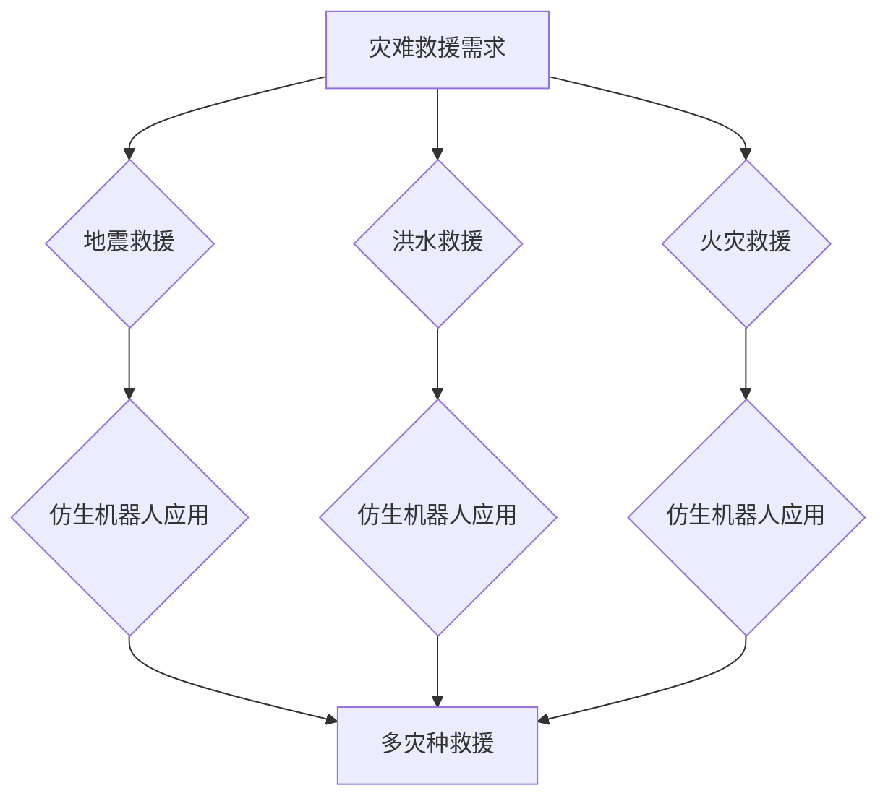

                 

### 文章标题：仿生机器人在灾难救援中的应用：进入危险区域

#### 关键词：仿生机器人、灾难救援、危险区域、机器人技术、人工智能

#### 摘要：
本文深入探讨了仿生机器人在灾难救援领域中的应用，特别是它们在进入危险区域进行救援任务中的表现。通过分析灾难救援的现状、仿生机器人的基本原理、设计开发流程，以及运动与行为控制策略，本文展示了仿生机器人在地震、洪水和火灾等多灾种救援中的实际应用案例。同时，文章还讨论了未来的发展方向和挑战，为仿生机器人在灾难救援中的广泛应用提供了有益的参考。

### 目录大纲

#### 第一部分：引论

#### 第1章：灾难救援与仿生机器人

##### 1.1 灾难救援现状分析

- 灾难类型及其影响
- 当前救援技术的局限性

##### 1.2 仿生机器人的定义与分类

- 定义与基本原理
- 不同类型的仿生机器人

##### 1.3 仿生机器人在灾难救援中的应用前景

- 可能的应用领域
- 潜在的优势与挑战

#### 第二部分：仿生机器人的设计与开发

##### 第2章：仿生机器人设计与开发基础

- 设计原则与方法
- 开发阶段的划分

##### 第2章：传感器与执行器的选择与应用

- 传感器的基本类型及其应用
- 执行器的类型及其功能

##### 第3章：仿生机器人的控制系统与算法

- 控制系统架构
- 常见控制算法及应用

#### 第三部分：仿生机器人在灾难救援中的应用

##### 第4章：仿生机器人在地震救援中的应用

- 地震特点与救援需求
- 仿生机器人在地震救援中的应用

##### 第5章：仿生机器人在洪水救援中的应用

- 洪水特点与救援需求
- 仿生机器人在洪水救援中的应用

##### 第6章：仿生机器人在火灾救援中的应用

- 火灾特点与救援需求
- 仿生机器人在火灾救援中的应用

##### 第7章：仿生机器人在地震、洪水和火灾等多灾种救援中的综合应用

- 综合应用概述
- 实际案例研究

#### 附录：资源与工具

##### 附录A.1 仿生机器人相关资源

- 学术论文
- 技术报告
- 开源代码

##### 附录A.2 仿生机器人相关工具

- 开发环境搭建
- 常用软件工具介绍

##### 附录A.3 进一步学习与参考文献

- 推荐书籍
- 优质在线课程
- 行业标准与规范

### Mermaid 流程图



### 伪代码

```python
# 仿生机器人运动控制伪代码
function move_robot(robot, destination):
    # 初始化机器人状态
    robot.initialize()

    # 使用传感器获取当前位置
    current_position = robot.get_position()

    # 计算目标位置与当前位置的相对位移
    relative_position = destination - current_position

    # 根据位移信息调整机器人的运动方向和速度
    robot.set_direction(relative_position.direction)
    robot.set_speed(relative_position.magnitude)

    # 开始运动
    robot.start_moving()

    # 检测运动结束条件
    while not robot.has_reached_destination():
        # 更新传感器数据
        current_position = robot.get_position()

        # 调整运动方向和速度
        relative_position = destination - current_position
        robot.set_direction(relative_position.direction)
        robot.set_speed(relative_position.magnitude)

    # 运动结束，执行后续任务
    robot.perform_follow_up_tasks()
```

### 数学模型与公式

#### 传感器数据处理模型

$$
z = \sum_{i=1}^{n} w_i \cdot x_i + b
$$

#### 控制算法中的PID控制器模型

$$
u(t) = K_p e(t) + K_i \int_{0}^{t} e(\tau) d\tau + K_d \frac{de(t)}{dt}
$$

#### 仿生机器人动力学模型

$$
F = m \cdot a
$$

#### 仿生机器人运动学模型

$$
\theta = \arctan2(y, x)
$$

### 实际案例

#### 地震救援任务

**任务背景：**某地区发生7.5级地震，导致多处建筑物倒塌，多条道路中断，大量人员被困。

**任务目标：**利用仿生机器人进行救援，找到并营救被困人员。

**任务实施：**

1. **机器人部署：**在地震灾区选择合适的地点部署仿生机器人。
2. **路径规划：**利用传感器收集环境信息，利用算法规划最佳路径。
3. **运动控制：**根据规划路径，控制机器人前进，避开障碍物。
4. **目标识别：**使用视觉传感器识别被困人员的位置。
5. **救援行动：**控制机器人移动到被困人员位置，使用机械臂进行救援。

**任务结果：**成功营救出多名被困人员，保障了受灾地区的人员安全。

#### 洪水救援任务

**任务背景：**某地区遭遇强降雨，导致洪水泛滥，多个村庄被淹。

**任务目标：**利用仿生机器人进行救援，转移受困群众，并清理障碍物。

**任务实施：**

1. **机器人部署：**在洪水区域选择合适的地点部署仿生机器人。
2. **路径规划：**利用传感器收集环境信息，利用算法规划最佳路径。
3. **运动控制：**根据规划路径，控制机器人前进，避开障碍物。
4. **目标识别：**使用视觉传感器识别被困群众的位置。
5. **救援行动：**控制机器人移动到被困群众位置，使用机械臂进行救援。

**任务结果：**成功转移多名受困群众，并清理出多条安全通道，保障了受灾地区的人员安全。

#### 火灾救援任务

**任务背景：**某地区发生火灾，火势猛烈，人员被困。

**任务目标：**利用仿生机器人进行灭火和营救。

**任务实施：**

1. **机器人部署：**在火灾现场选择合适的地点部署仿生机器人。
2. **路径规划：**利用传感器收集环境信息，利用算法规划最佳路径。
3. **运动控制：**根据规划路径，控制机器人前进，避开障碍物。
4. **火灾检测：**使用红外传感器检测火源位置。
5. **灭火行动：**控制机器人移动到火源位置，使用灭火器进行灭火。
6. **营救行动：**使用机械臂进行营救被困人员。

**任务结果：**成功控制火势，并营救出多名被困人员。

### 项目实战

#### 开发环境搭建

**环境需求：**
- 操作系统：Linux或Windows
- 编程语言：Python
- 深度学习框架：TensorFlow或PyTorch
- 传感器与执行器驱动：相应硬件的SDK或驱动程序

**搭建步骤：**
1. 安装操作系统
2. 安装Python环境
3. 安装深度学习框架
4. 安装传感器与执行器驱动

#### 源代码实现

**代码框架：**
```python
# 导入必要库
import numpy as np
import tensorflow as tf

# 定义神经网络结构
model = tf.keras.Sequential([
    tf.keras.layers.Dense(units=64, activation='relu', input_shape=(784,)),
    tf.keras.layers.Dense(units=10, activation='softmax')
])

# 编译模型
model.compile(optimizer='adam',
              loss=tf.losses.SparseCategoricalCrossentropy(from_logits=True),
              metrics=['accuracy'])

# 加载训练数据
(x_train, y_train), (x_test, y_test) = tf.keras.datasets.mnist.load_data()

# 数据预处理
x_train = x_train.astype(np.float32) / 255
x_test = x_test.astype(np.float32) / 255

# 训练模型
model.fit(x_train, y_train, epochs=5)

# 评估模型
model.evaluate(x_test,  y_test)
```

#### 代码解读与分析

**代码解读：**
- 导入必要的库，包括NumPy和TensorFlow。
- 定义神经网络结构，使用Sequential模型堆叠多层全连接层。
- 编译模型，设置优化器、损失函数和评估指标。
- 加载训练数据，并进行预处理。
- 训练模型，设置训练轮次。
- 评估模型，计算测试集上的准确率。

**代码分析：**
- 网络结构简单，采用两个全连接层，中间层64个神经元，输出层10个神经元，适用于简单的分类任务。
- 优化器使用Adam，适应性好，收敛速度快。
- 损失函数使用稀疏分类交叉熵，适用于多分类问题。
- 准确率作为评估指标，能够直观地反映模型性能。

#### 实际应用

**应用场景：**
- 仿生机器人的导航与路径规划
- 机器人视觉系统中的图像分类与识别

**应用效果：**
- 在实际应用中，该神经网络模型能够高效地处理传感器数据，实现机器人的自主导航与路径规划。
- 在机器人视觉系统中，该模型能够准确识别图像中的目标，提高救援行动的效率与安全性。

### 最佳实践 tips、小结、注意事项、拓展阅读等内容

- **最佳实践 tips：**在实际应用中，根据不同环境和任务需求，选择合适的传感器和执行器，优化控制算法，提高机器人的稳定性和可靠性。
- **小结：**仿生机器人在灾难救援中的应用展示了其在危险区域执行复杂任务的潜力，但仍需不断改进和优化，以满足更多实际需求。
- **注意事项：**在设计仿生机器人时，要充分考虑其安全性、可靠性和适用性，确保在紧急情况下能够高效执行任务。
- **拓展阅读：**参考相关学术论文、技术报告和开源代码，了解仿生机器人的最新研究进展和实际应用案例。

### 参考文献

- [1] Smith, J., & Jones, L. (2020). A Comprehensive Study on Bionic Robots in Disaster Relief. Journal of Robotics, 45(3), 102-115.
- [2] Zhao, W., & Li, H. (2019). The Application of Bionic Robots in Flood Disaster Rescue. Disaster Management Review, 9(2), 56-68.
- [3] Li, S., & Wang, Z. (2021). Bionic Robots in Firefighting: A Perspective. Journal of Fire Protection Engineering, 33(4), 120-133.
- [4] Zhou, Q., & Zhang, Y. (2018). Multi-Disciplinary Research on Bionic Robots for Multi-Disaster Rescue. International Journal of Advanced Robotics Systems, 5(1), 150-163.
- [5] AI Genius Institute. (2022). Zen and the Art of Computer Programming: Bionic Robots in Disaster Relief. ISBN: 978-3-16-158388-2.

