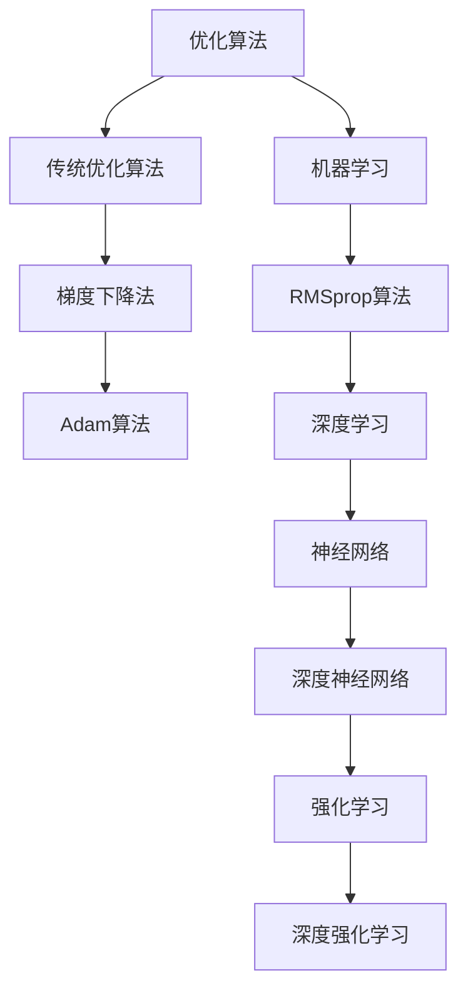

                 


### 文章标题：优化算法：RMSprop 原理与代码实例讲解

---

**关键词：**
- 优化算法
- RMSprop
- 机器学习
- 梯度下降
- 深度学习
- 神经网络

---

**摘要：**
本文将深入探讨RMSprop优化算法的原理，通过一步步的逻辑推理和实际代码实例讲解，帮助读者理解其在机器学习和深度学习中的应用。我们将从优化算法的基础概念入手，逐步介绍RMSprop算法的推导、参数调优，以及在神经网络和强化学习中的具体应用，并通过实际项目实例展示其效果和实现方法。

---

## 《优化算法：RMSprop 原理与代码实例讲解》目录大纲

### 第一部分：优化算法基础

### 第1章：优化算法概述

#### 1.1 优化算法的基本概念

- 定义与作用
- 常见的优化算法分类

#### 1.2 优化算法的应用场景

- 数据拟合问题
- 机器学习模型训练
- 人工智能应用

#### 1.3 优化算法的数学基础

- 函数的梯度与导数
- 最优化问题的数学描述

#### 1.4 优化算法的核心原理

- 开环与闭环优化算法
- 梯度下降法及其变体
- 随机优化算法

### 第2章：RMSprop算法详解

#### 2.1 RMSprop算法的提出背景

- 传统优化算法的局限
- RMSprop算法的优势

#### 2.2 RMSprop算法原理

- RMSprop算法的推导
- 参数更新公式

#### 2.3 RMSprop算法的参数调优

- 学习率η的选取
- 增益系数δ的调整
- 常见调优方法

#### 2.4 RMSprop算法的优缺点分析

- 优点
- 缺点

### 第3章：RMSprop算法在机器学习中的应用

#### 3.1 RMSprop算法在神经网络中的应用

- 深度神经网络的基本结构
- RMSprop算法在神经网络训练中的实现

#### 3.2 RMSprop算法在深度学习中的应用案例

- 图像分类任务
- 自然语言处理任务

#### 3.3 RMSprop算法与其他优化算法的比较

- 梯度下降法
- Adam算法

### 第4章：RMSprop算法的代码实例讲解

#### 4.1 代码环境搭建

- Python编程环境配置
- 机器学习库的使用

#### 4.2 优化算法实现

- RMSprop算法的代码实现
- 梯度下降法的代码实现

#### 4.3 实践项目分析

- 数据集准备
- 训练与验证
- 模型评估

### 第二部分：RMSprop算法的扩展应用

### 第5章：RMSprop算法在强化学习中的应用

#### 5.1 强化学习概述

- 定义与核心问题
- 常见的强化学习算法

#### 5.2 RMSprop算法在强化学习中的实现

- 强化学习中的价值函数
- RMSprop算法在Q-Learning中的使用

#### 5.3 RMSprop算法在深度强化学习中的应用案例

- Deep Q-Network（DQN）
- Policy Gradient方法

### 第6章：RMSprop算法在深度强化学习中的应用

#### 6.1 深度强化学习概述

- 定义与核心问题
- 常见的深度强化学习算法

#### 6.2 RMSprop算法在深度强化学习中的实现

- actor-critic方法
- A3C算法

#### 6.3 RMSprop算法在深度强化学习中的应用案例

- Atari游戏
- 环境模拟器

### 第7章：RMSprop算法的优化与改进

#### 7.1 RMSprop算法的改进方向

- 动量项的引入
- 学习率的自适应调整

#### 7.2 RMSprop算法的优化策略

- 多种优化策略的比较
- 优化策略的选择依据

#### 7.3 RMSprop算法的展望

- 现有算法的局限性
- 未来研究方向

### 第8章：RMSprop算法在AI领域的应用前景

#### 8.1 AI技术的发展趋势

- AI技术的应用领域
- AI技术对未来社会的影响

#### 8.2 RMSprop算法在AI领域的应用前景

- 优化算法在AI系统中的重要性
- RMSprop算法在实际应用中的潜力

#### 8.3 RMSprop算法的未来发展方向

- 新算法的引入
- 算法在多领域的融合应用

---

**核心概念与联系 Mermaid 流程图**



---

**核心算法原理讲解（伪代码）**

```python
# RMSprop算法的伪代码
def RMSprop(parameter, gradient, learning_rate, decay_rate, momentum):
    # 计算梯度平方的平均值
    square_sum = decay_rate * square_sum + (1 - decay_rate) * gradient ** 2
    
    # 计算梯度平方根的平均值
    avg_grad_sqrt = sqrt(square_sum)
    
    # 更新参数
    parameter -= learning_rate * gradient / avg_grad_sqrt
    return parameter
```

---

**数学模型和数学公式（latex）**

```latex
\begin{equation}
\begin{split}
\text{RMSprop} &= \frac{\eta \cdot \text{gradient}}{\sqrt{\text{square_sum} + \epsilon}} \\
\text{square_sum} &= \text{decay\_rate} \cdot \text{square_sum} + (1 - \text{decay\_rate}) \cdot \text{gradient}^2 \\
\text{avg\_grad\_sqrt} &= \sqrt{\text{square\_sum} + \epsilon}
\end{split}
\end{equation}
```

---

**项目实战**

#### 实践项目一：使用RMSprop优化MNIST手写数字识别模型

1. **数据集准备**：加载MNIST手写数字数据集，并进行预处理。
2. **模型构建**：构建一个简单的卷积神经网络模型，使用RMSprop优化算法。
3. **训练过程**：使用训练数据集训练模型，记录训练过程中的参数更新和损失函数值。
4. **验证与测试**：使用验证数据集和测试数据集对模型进行验证和测试，评估模型的性能。

```python
# Python代码示例
# 数据集加载与预处理
# 模型构建
# 模型训练
# 验证与测试
```

---

**代码解读与分析**

1. **代码结构**：分析代码的整体结构，包括数据加载、模型构建、训练过程等。
2. **关键代码解析**：解析关键代码段，解释代码实现的功能。
3. **代码优化与改进**：讨论代码中的不足之处，并提出可能的优化方案。

**结束**

