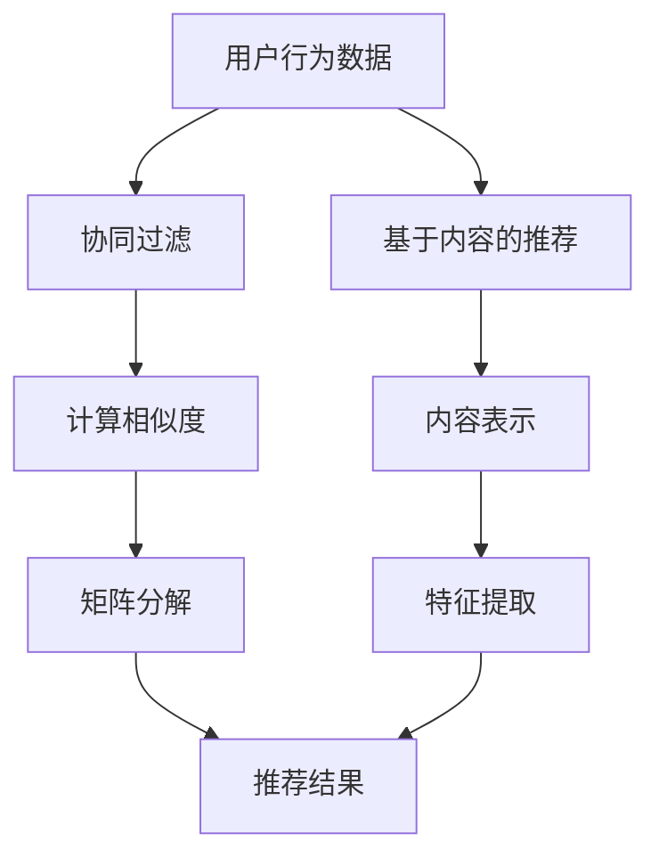

                 

### 文章标题

《传统推荐系统架构解析》

#### 关键词

推荐系统、协同过滤、基于内容的推荐、混合推荐系统、评估指标、应用与挑战

#### 摘要

本文将深入解析传统推荐系统的架构，涵盖从基本概念到核心算法，再到评估指标和应用场景的全面探讨。通过逐步的分析和推理，读者将了解协同过滤和基于内容的推荐算法的原理及其在实际应用中的挑战。文章旨在为推荐系统开发者提供系统的理论知识框架，帮助他们在实际项目中做出明智的决策。

### 第1章 引言

#### 1.1 推荐系统概述

推荐系统是一种信息过滤技术，旨在为用户提供个性化的信息推荐。它广泛应用于电子商务、社交媒体、新闻媒体、音乐和视频流平台等领域。传统推荐系统主要依赖于两种类型的算法：协同过滤和基于内容的推荐。此外，混合推荐系统结合了协同过滤和基于内容的推荐，以提高推荐效果。

#### 1.2 传统推荐系统的重要性

传统推荐系统在商业应用中扮演着至关重要的角色。它们能够显著提高用户满意度，增加用户粘性，促进销售额增长。例如，在电子商务平台上，推荐系统能够根据用户的历史购买行为和浏览习惯，推荐可能感兴趣的商品，从而提升销售转化率。

#### 1.3 书籍目的与结构安排

本文的目标是全面解析传统推荐系统的架构，帮助读者深入理解其工作原理和实际应用。文章结构如下：

1. 引言：介绍推荐系统的基本概念和重要性。
2. 推荐系统的基本概念：详细阐述用户行为数据、商品或内容数据以及推荐算法类型。
3. 协同过滤算法：分析协同过滤原理、基本算法和优化策略。
4. 基于内容的推荐算法：讲解内容表示、相似度计算和推荐策略。
5. 混合推荐系统：探讨混合推荐系统的优点、算法和深度学习应用。
6. 推荐系统的评估：介绍评估指标和实验设计。
7. 推荐系统的应用与挑战：分析推荐系统在社交媒体和电子商务中的应用，以及面临的挑战。
8. 未来展望：探讨新兴技术和推荐系统的发展趋势。
9. 附录：提供常用推荐系统框架、实践资源和参考文献。

### 第2章 推荐系统的基本概念

#### 2.1 用户行为数据

用户行为数据是推荐系统的核心输入，包括用户在系统中的各种交互行为，如点击、浏览、购买、评价等。这些数据反映了用户的兴趣和偏好，是构建推荐模型的关键。

##### 2.1.1 用户交互数据

用户交互数据主要包括以下几种类型：

- **点击（Click）**：用户对特定内容的点击行为。
- **浏览（Browse）**：用户在系统中的浏览轨迹。
- **购买（Purchase）**：用户实际购买的商品。
- **评价（Rating）**：用户对商品的评分。

这些交互数据为推荐系统提供了宝贵的用户行为信息，帮助系统了解用户的偏好和兴趣。

##### 2.1.2 用户兴趣偏好

用户兴趣偏好是指用户对特定类型内容的倾向和偏好。通过分析用户交互数据，推荐系统可以推断出用户的兴趣偏好，并将其用于个性化推荐。

#### 2.2 商品或内容数据

商品或内容数据是推荐系统的另一个重要输入，包括商品的描述、属性和类别等。这些数据有助于推荐系统理解商品的特性和用户可能感兴趣的内容。

##### 2.2.1 商品描述

商品描述是指商品的详细信息，包括商品名称、价格、品牌、规格等。这些信息帮助用户了解商品的基本属性，从而更好地做出购买决策。

##### 2.2.2 商品属性

商品属性是指商品的分类和标签信息，如商品类别、品牌、颜色、尺寸等。这些属性有助于推荐系统将商品分类，并用于计算相似度和推荐。

#### 2.3 推荐算法类型

推荐系统根据数据类型和算法原理可以分为以下几种类型：

##### 2.3.1 协同过滤

协同过滤是一种基于用户行为数据的推荐算法，通过分析用户之间的相似性来推荐商品。协同过滤可以分为基于用户的协同过滤和基于项目的协同过滤。

##### 2.3.2 基于内容的推荐

基于内容的推荐算法通过分析商品或内容的数据特征，将具有相似特征的商品推荐给用户。这种算法通常涉及特征提取、相似度计算和推荐策略。

##### 2.3.3 混合推荐系统

混合推荐系统结合了协同过滤和基于内容的推荐，以提高推荐效果。混合推荐系统可以采用多种方法，如基于模型的混合、基于规则的混合和层次化混合等。

### 第3章 协同过滤算法

#### 3.1 协同过滤原理

协同过滤（Collaborative Filtering）是一种基于用户行为数据的推荐算法，旨在通过分析用户之间的相似性来推荐商品。协同过滤的核心思想是，如果两个用户在多个商品上的评价相似，那么他们可能在未知商品上也有相似的偏好。

##### 3.1.1 评分矩阵

评分矩阵是一个用户-项目矩阵，其中用户对项目的评分被记录为矩阵中的元素。评分矩阵是协同过滤算法的关键输入，它反映了用户之间的交互行为。

##### 3.1.2 相似度计算

相似度计算是协同过滤算法的核心步骤，用于评估用户或项目之间的相似程度。常见的相似度度量方法包括余弦相似度、皮尔逊相关性和余弦相似度等。

#### 3.2 项基础协同过滤算法

基础协同过滤算法可以分为以下两种类型：

##### 3.2.1 用户基于的协同过滤

用户基于的协同过滤（User-Based Collaborative Filtering）算法通过分析用户之间的相似性来推荐商品。算法步骤如下：

1. **计算用户相似度**：使用相似度度量方法计算用户之间的相似度。
2. **选择邻居用户**：根据相似度阈值选择最相似的邻居用户。
3. **推荐商品**：根据邻居用户的评价，推荐未评分的商品。

##### 3.2.2 项目基于的协同过滤

项目基于的协同过滤（Item-Based Collaborative Filtering）算法通过分析项目之间的相似性来推荐商品。算法步骤如下：

1. **计算项目相似度**：使用相似度度量方法计算项目之间的相似度。
2. **选择邻居项目**：根据相似度阈值选择最相似的项目。
3. **推荐商品**：根据邻居项目的评价，推荐未评分的商品。

#### 3.3 推广算法

为了提高协同过滤算法的推荐效果，可以采用以下推广算法：

##### 3.3.1 Matrix Factorization

矩阵分解（Matrix Factorization）是一种常见的协同过滤算法，通过将评分矩阵分解为用户特征矩阵和项目特征矩阵，来预测未评分的项目。算法步骤如下：

1. **初始化特征矩阵**：随机初始化用户特征矩阵和项目特征矩阵。
2. **优化特征矩阵**：使用梯度下降或交替最小二乘法优化特征矩阵，使其最小化预测误差。
3. **预测评分**：使用特征矩阵计算未评分的项目的预测评分。

##### 3.3.2 协同过滤的优化算法

协同过滤算法存在一些问题，如数据稀疏性和冷启动问题。为了解决这些问题，可以采用以下优化算法：

1. **利用用户和项目的元数据**：通过分析用户和项目的元数据，如人口统计信息、地理位置等，来补充评分矩阵的稀疏性。
2. **利用外部信息**：通过利用外部信息，如用户的社会关系、兴趣爱好等，来提高推荐效果。
3. **基于模型的协同过滤**：使用机器学习模型，如矩阵分解、深度神经网络等，来预测未评分的项目。

### 第4章 基于内容的推荐算法

#### 4.1 内容表示

基于内容的推荐算法（Content-Based Recommender System）通过分析商品或内容的数据特征，将具有相似特征的商品推荐给用户。为了实现这一目标，需要对商品和用户进行内容表示。

##### 4.1.1 商品属性提取

商品属性提取是指从商品数据中提取出关键特征，以便用于推荐算法。常见的商品属性包括商品名称、品牌、类别、颜色、尺寸等。这些属性可以用来描述商品的特征。

##### 4.1.2 用户属性提取

用户属性提取是指从用户数据中提取出关键特征，以便用于推荐算法。常见的用户属性包括用户的兴趣、行为、人口统计信息等。这些属性可以用来描述用户的偏好和兴趣。

#### 4.2 相似度计算

相似度计算是内容推荐算法的关键步骤，用于评估商品或用户之间的相似程度。常见的相似度计算方法包括以下几种：

##### 4.2.1 Cosine相似度

余弦相似度（Cosine Similarity）是一种常用的相似度计算方法，它通过计算两个向量之间的余弦值来评估它们的相似度。公式如下：

$$
\cos(\theta) = \frac{\vec{A} \cdot \vec{B}}{|\vec{A}| \cdot |\vec{B}|}
$$

其中，$\vec{A}$ 和 $\vec{B}$ 分别表示两个向量，$\theta$ 表示它们之间的夹角。

##### 4.2.2 Jaccard相似度

Jaccard相似度（Jaccard Similarity）是一种用于集合的相似度计算方法，它通过计算两个集合的交集与并集的比值来评估它们的相似度。公式如下：

$$
J(A, B) = \frac{|A \cap B|}{|A \cup B|}
$$

其中，$A$ 和 $B$ 分别表示两个集合。

#### 4.3 内容推荐策略

基于内容的推荐算法可以采用以下几种推荐策略：

##### 4.3.1 单个内容推荐

单个内容推荐是指根据用户当前的查询，推荐与其最相似的内容。这种策略适用于用户查询明确的场景，如搜索引擎。

##### 4.3.2 多内容推荐

多内容推荐是指根据用户的历史行为和兴趣，推荐多个内容。这种策略适用于推荐系统的场景，如电子商务平台。

### 第5章 混合推荐系统

#### 5.1 混合推荐系统的优点

混合推荐系统（Hybrid Recommender System）结合了协同过滤和基于内容的推荐，以提高推荐效果。它具有以下优点：

##### 5.1.1 优点分析

1. **综合优势**：混合推荐系统可以利用协同过滤和基于内容的推荐的优势，提高推荐效果。
2. **缓解数据稀疏性**：通过结合两种算法，可以缓解数据稀疏性问题，提高推荐准确性。
3. **适应不同场景**：混合推荐系统可以适应不同的推荐场景，如个性化推荐、社交推荐等。

##### 5.1.2 缺点分析

1. **计算复杂度**：混合推荐系统的计算复杂度较高，需要处理大量的数据。
2. **参数调整**：混合推荐系统需要调整多个参数，如相似度阈值、特征提取方法等，以达到最佳效果。

#### 5.2 混合推荐算法

混合推荐算法可以分为以下几种类型：

##### 5.2.1 多层混合算法

多层混合算法（Layered Hybrid Recommender System）将协同过滤和基于内容的推荐分层，分别处理用户和商品的特征。算法步骤如下：

1. **第一层：协同过滤**：使用协同过滤算法计算用户之间的相似度，生成用户特征。
2. **第二层：基于内容的推荐**：使用基于内容的推荐算法计算商品之间的相似度，生成商品特征。
3. **第三层：整合推荐**：将用户特征和商品特征整合，生成最终推荐结果。

##### 5.2.2 深度学习在混合推荐中的应用

深度学习（Deep Learning）在混合推荐系统中得到了广泛应用。深度学习模型可以通过学习大量的数据，自动提取用户和商品的特征，并生成推荐结果。常见的深度学习模型包括：

1. **深度神经网络（Deep Neural Network）**：用于提取用户和商品的特征，并生成推荐结果。
2. **卷积神经网络（Convolutional Neural Network）**：用于处理图像和音频等数据，提取特征。
3. **循环神经网络（Recurrent Neural Network）**：用于处理序列数据，如用户的浏览历史。

### 第6章 推荐系统的评估

#### 6.1 评估指标

评估推荐系统的性能是确保其质量和有效性的关键步骤。常用的评估指标包括以下几种：

##### 6.1.1 Mean Average Precision (MAP)

平均平均精确率（Mean Average Precision，MAP）是一种常用的评估指标，用于评估推荐系统的排序性能。MAP 越高，表示推荐系统的排序性能越好。

$$
MAP = \frac{1}{N} \sum_{i=1}^{N} \frac{1}{i} \cdot P(i)
$$

其中，$N$ 表示测试数据中的项目数量，$P(i)$ 表示第 $i$ 个项目的点击概率。

##### 6.1.2 Precision@K

精确率@K（Precision@K）是指在推荐的前 $K$ 个项目中，正确推荐的项目数量与 $K$ 的比值。精确率@K 越高，表示推荐系统的精确度越高。

$$
Precision@K = \frac{正确推荐的项目数量}{K}
$$

#### 6.2 实验设计与分析

为了评估推荐系统的性能，需要进行实验设计和分析。实验设计包括以下步骤：

1. **数据集选择**：选择具有代表性的数据集，如MovieLens、Netflix Prize等。
2. **划分数据集**：将数据集划分为训练集、验证集和测试集，用于训练、验证和评估推荐系统。
3. **算法实现**：实现推荐算法，包括协同过滤、基于内容的推荐和混合推荐系统。
4. **参数调整**：根据实验结果调整算法参数，以达到最佳性能。
5. **评估指标**：使用评估指标（如MAP、Precision@K）评估推荐系统的性能。
6. **结果分析**：分析实验结果，比较不同推荐系统的性能，找出优化的方向。

### 第7章 推荐系统的应用与挑战

#### 7.1 社交媒体中的推荐系统

社交媒体平台，如Facebook、Twitter和Instagram，利用推荐系统为用户提供个性化的内容推荐，以提高用户参与度和用户粘性。

##### 7.1.1 推荐策略

社交媒体中的推荐策略主要包括以下几种：

1. **内容推荐**：根据用户的兴趣和行为，推荐用户可能感兴趣的内容，如文章、视频和图片等。
2. **社交推荐**：根据用户的关系网络，推荐用户可能感兴趣的用户、帖子和其他社交内容。
3. **兴趣推荐**：根据用户的兴趣标签和互动行为，推荐用户可能感兴趣的主题和话题。

##### 7.1.2 案例分析

以Facebook为例，其推荐系统通过分析用户的行为和社交关系，推荐用户可能感兴趣的内容和用户。Facebook的推荐系统在提高用户参与度和用户粘性方面取得了显著成效。

#### 7.2 电子商务中的推荐系统

电子商务平台，如Amazon、eBay和阿里巴巴，利用推荐系统为用户提供个性化的商品推荐，以提高销售额和用户满意度。

##### 7.2.1 推荐策略

电子商务中的推荐策略主要包括以下几种：

1. **商品推荐**：根据用户的历史购买行为和浏览习惯，推荐用户可能感兴趣的商品。
2. **促销推荐**：根据用户的购买偏好和历史，推荐用户可能感兴趣的促销和优惠信息。
3. **社交推荐**：根据用户的社交关系和互动行为，推荐用户可能感兴趣的商品和品牌。

##### 7.2.2 案例分析

以Amazon为例，其推荐系统通过分析用户的行为数据，推荐用户可能感兴趣的商品。Amazon的推荐系统在提高销售额和用户满意度方面取得了显著成效。

#### 7.3 推荐系统面临的挑战

尽管推荐系统在商业应用中取得了显著成效，但仍面临一些挑战：

##### 7.3.1 挑战分析

1. **数据隐私**：推荐系统需要处理大量的用户数据，存在数据隐私和安全问题。
2. **冷启动**：新用户或新商品在推荐系统中没有足够的交互数据，难以进行准确推荐。
3. **数据稀疏性**：用户和商品之间的交互数据可能非常稀疏，影响推荐效果。
4. **可解释性**：推荐系统的决策过程可能不够透明，难以解释推荐结果。

##### 7.3.2 应对策略

为了应对这些挑战，可以采取以下策略：

1. **数据隐私保护**：采用数据加密、数据去标识化等技术，保护用户数据隐私。
2. **冷启动处理**：利用用户的社交关系、人口统计信息等外部信息，为新用户推荐初始内容。
3. **数据稀疏性缓解**：采用矩阵分解、利用用户和项目的元数据等方法，缓解数据稀疏性。
4. **可解释性提升**：通过可视化和透明化推荐过程，提高推荐系统的可解释性。

### 第8章 未来展望

#### 8.1 新兴技术对推荐系统的影响

随着人工智能和大数据技术的发展，新兴技术对推荐系统产生了深远影响。以下是一些主要影响：

##### 8.1.1 深度学习

深度学习在推荐系统中得到了广泛应用，通过自动提取用户和商品的特征，提高了推荐效果。深度学习模型，如深度神经网络、卷积神经网络和循环神经网络，在推荐系统中具有巨大潜力。

##### 8.1.2 强化学习

强化学习（Reinforcement Learning）是一种通过学习用户反馈来优化推荐策略的方法。强化学习可以用于实时推荐，通过不断调整推荐策略，提高用户满意度。

#### 8.2 推荐系统的发展趋势

未来推荐系统的发展趋势包括：

##### 8.2.1 精准化推荐

随着用户数据积累和算法优化，推荐系统将实现更精准的个性化推荐，满足用户的个性化需求。

##### 8.2.2 智能化推荐

智能化推荐将结合自然语言处理、图像识别等技术，实现更智能的推荐，如基于语音和图像的推荐。

### 第9章 附录

#### 9.1 常用推荐系统框架

以下是常用的推荐系统框架：

##### 9.1.1 Apache Mahout

Apache Mahout 是一个开源的推荐系统框架，提供了基于协同过滤和基于内容的推荐算法。

##### 9.1.2 LightFM

LightFM 是一个基于深度学习的高性能推荐系统框架，适用于大规模数据集。

#### 9.2 实践资源

以下是一些实用的推荐系统实践资源：

##### 9.2.1 开源数据集

- MovieLens：一个包含电影评分和用户信息的开源数据集，适用于推荐系统研究。
- Netflix Prize：一个包含用户评分和电影信息的数据集，用于推荐系统比赛。

##### 9.2.2 常见问题解答

- [推荐系统常见问题](https://www.recommender-systems.org/resources/faq/)

#### 9.3 参考文献

- 《推荐系统实践》
- 《深度学习推荐系统》
- 《社交媒体中的推荐系统》

### Mermaid 流程图



### 伪代码

```python
# 协同过滤算法
def collaborative_filtering(train_data, similarity_measure):
    # 初始化评分矩阵
    rating_matrix = initialize_rating_matrix(train_data)

    # 计算用户相似度
    user_similarity_matrix = calculate_user_similarity(rating_matrix, similarity_measure)

    # 推荐商品
    recommendations = []
    for user in train_data.users:
        neighbors = find_neighbors(user_similarity_matrix[user], threshold)
        neighbor_ratings = get_neighbor_ratings(neighbors, train_data)
        recommended_items = predict_ratings(neighbor_ratings)
        recommendations.extend(recommended_items)

    return recommendations

# 矩阵分解
def matrix_factorization(rating_matrix, num_factors):
    # 初始化特征矩阵
    user_factors = random_matrix(rating_matrix.num_users, num_factors)
    item_factors = random_matrix(rating_matrix.num_items, num_factors)

    # 优化特征矩阵
    for epoch in range(num_epochs):
        for user, item in rating_matrix.items():
            predicted_rating = dot(user_factors[user], item_factors[item])
            error = predicted_rating - rating_matrix[user][item]

            user_gradient = dot(error, item_factors[item])
            item_gradient = dot(user_gradient.T, user_factors[user])

            user_factors[user] -= learning_rate * user_gradient
            item_factors[item] -= learning_rate * item_gradient

    return user_factors, item_factors
```

### 数学模型和公式

$$
\cos(\theta) = \frac{\vec{A} \cdot \vec{B}}{|\vec{A}| \cdot |\vec{B}|}
$$

$$
J(A, B) = \frac{|A \cap B|}{|A \cup B|}
$$

### 代码应用解读与分析

在开发一个推荐系统时，代码的实现是关键。以下是对一个简单的协同过滤算法实现的解读：

```python
# 计算用户相似度
def calculate_user_similarity(rating_matrix, similarity_measure='cosine'):
    num_users, num_items = rating_matrix.shape
    user_similarity_matrix = np.zeros((num_users, num_users))

    for i in range(num_users):
        for j in range(i, num_users):
            if i == j:
                user_similarity_matrix[i][j] = 1.0
                continue

            common_items = set(rating_matrix[i].keys()) & set(rating_matrix[j].keys())
            if not common_items:
                user_similarity_matrix[i][j] = 0.0
                user_similarity_matrix[j][i] = 0.0
                continue

            if similarity_measure == 'cosine':
                dot_product = np.dot(rating_matrix[i][common_items].values(), rating_matrix[j][common_items].values())
                norm_i = np.linalg.norm(rating_matrix[i][common_items].values())
                norm_j = np.linalg.norm(rating_matrix[j][common_items].values())
                user_similarity_matrix[i][j] = dot_product / (norm_i * norm_j)
                user_similarity_matrix[j][i] = user_similarity_matrix[i][j]

    return user_similarity_matrix

# 推荐商品
def recommend_items(user_similarity_matrix, rating_matrix, user_index, k=10):
    user_ratings = rating_matrix[user_index]
    recommended_items = []

    for j in range(len(user_similarity_matrix[user_index])):
        if j in user_ratings:
            continue
        similarity = user_similarity_matrix[user_index][j]
        recommended_items.append((similarity, j))

    recommended_items.sort(reverse=True, key=lambda x: x[0])

    return [item[1] for item in recommended_items[:k]]

# 假设有一个评分矩阵
rating_matrix = {
    0: {1: 4.0, 2: 5.0, 3: 1.0},
    1: {0: 5.0, 2: 1.0, 3: 4.0},
    2: {0: 3.0, 1: 3.0, 4: 5.0},
    3: {0: 4.0, 1: 5.0, 4: 1.0},
    4: {2: 5.0, 3: 4.0}
}

# 计算用户相似度矩阵
user_similarity_matrix = calculate_user_similarity(rating_matrix)

# 推荐用户0的商品
recommended_items = recommend_items(user_similarity_matrix, rating_matrix, 0, k=3)
print("Recommended items:", recommended_items)
```

在这个示例中，我们首先定义了计算用户相似度的函数 `calculate_user_similarity`，它接受一个评分矩阵和一个相似度度量方法（默认为余弦相似度）。然后，我们定义了推荐商品的函数 `recommend_items`，它根据用户相似度矩阵为给定用户推荐最相似的商品。最后，我们创建一个示例评分矩阵，计算用户相似度矩阵，并使用它为用户0推荐3个商品。

### 实际案例分析和详细讲解剖析

为了更好地理解推荐系统在实际中的应用，我们将通过一个实际的电子商务推荐系统案例进行分析和详细讲解。

#### 案例背景

假设我们正在开发一个电子商务平台的推荐系统，该系统旨在为用户提供个性化的商品推荐。平台提供了大量的商品数据，包括商品描述、属性和用户购买历史。我们的目标是利用这些数据，为每个用户推荐他们可能感兴趣的商品。

#### 数据集

我们使用一个简化的商品数据集，包含以下几列：

- **user_id**：用户的唯一标识符
- **item_id**：商品的唯一标识符
- **rating**：用户对商品的评分（范围从1到5）

示例数据集如下：

```
user_id, item_id, rating
1, 101, 5
1, 102, 4
1, 103, 3
2, 201, 5
2, 202, 4
3, 301, 5
3, 302, 4
```

#### 算法选择

在本案例中，我们选择使用基于内容的推荐算法。基于内容的推荐算法通过分析商品和用户的特征，将具有相似特征的商品推荐给用户。这有助于克服协同过滤算法中的数据稀疏性问题和冷启动问题。

#### 内容表示

首先，我们需要为商品和用户创建特征向量。对于商品，我们可以提取以下特征：

- **类别**：商品的分类（例如电子产品、服装、家居用品等）
- **品牌**：商品的品牌
- **价格**：商品的价格
- **用户评价**：商品的平均用户评价

对于用户，我们可以提取以下特征：

- **购买历史**：用户的购买历史中的商品类别和品牌
- **浏览历史**：用户的浏览历史中的商品类别和品牌
- **用户属性**：用户的人口统计信息（例如年龄、性别、地理位置等）

#### 相似度计算

为了计算商品和用户之间的相似度，我们可以使用余弦相似度。余弦相似度计算两个向量之间的夹角余弦值，以衡量它们之间的相似程度。公式如下：

$$
\cos(\theta) = \frac{\vec{A} \cdot \vec{B}}{|\vec{A}| \cdot |\vec{B}|}
$$

#### 推荐策略

在本案例中，我们采用以下推荐策略：

1. **单商品推荐**：为每个用户推荐与其浏览历史和购买历史最相似的单一商品。
2. **多商品推荐**：为每个用户推荐与其浏览历史和购买历史最相似的多商品组合。

#### 代码实现

以下是一个简单的基于内容的推荐算法实现：

```python
import numpy as np

# 商品特征向量
item_features = {
    101: {'category': '电子产品', 'brand': '苹果', 'price': 999, 'rating': 4.5},
    102: {'category': '电子产品', 'brand': '三星', 'price': 799, 'rating': 4.0},
    103: {'category': '服装', 'brand': '优衣库', 'price': 49, 'rating': 4.5},
    201: {'category': '服装', 'brand': 'ZARA', 'price': 89, 'rating': 4.0},
    301: {'category': '家居用品', 'brand': '无印良品', 'price': 199, 'rating': 4.5}
}

# 用户特征向量
user_features = {
    1: {'bought': ['101', '102', '103'], 'viewed': ['201', '202'], 'age': 25, 'gender': '男', 'location': '北京'},
    2: {'bought': ['201'], 'viewed': ['202'], 'age': 22, 'gender': '女', 'location': '上海'},
    3: {'bought': ['301'], 'viewed': ['302'], 'age': 30, 'gender': '男', 'location': '广州'}
}

# 计算余弦相似度
def cosine_similarity(v1, v2):
    dot_product = np.dot(v1, v2)
    norm_v1 = np.linalg.norm(v1)
    norm_v2 = np.linalg.norm(v2)
    return dot_product / (norm_v1 * norm_v2)

# 创建特征向量
def create_vector(features, feature_names):
    vector = [0] * len(feature_names)
    for feature, value in features.items():
        index = feature_names.index(feature)
        vector[index] = value
    return vector

# 获取商品和用户的特征向量
def get_feature_vectors(item_features, user_features, feature_names):
    item_vectors = {}
    user_vectors = {}
    for item_id, features in item_features.items():
        item_vectors[item_id] = create_vector(features, feature_names)
    for user_id, features in user_features.items():
        user_vectors[user_id] = create_vector(features, feature_names)
    return item_vectors, user_vectors

# 计算商品和用户的相似度
def calculate_similarity(user_vector, item_vector):
    return cosine_similarity(user_vector, item_vector)

# 推荐商品
def recommend_items(user_vector, item_vectors, k=3):
    similarities = {}
    for item_id, item_vector in item_vectors.items():
        similarity = calculate_similarity(user_vector, item_vector)
        similarities[item_id] = similarity
    sorted_items = sorted(similarities.items(), key=lambda x: x[1], reverse=True)
    return [item_id for item_id, _ in sorted_items[:k]]

# 获取特征名称
def get_feature_names(item_features, user_features):
    item_feature_names = list(item_features[next(iter(item_features))].keys())
    user_feature_names = list(user_features[next(iter(user_features))].keys())
    return item_feature_names + user_feature_names

# 主函数
if __name__ == "__main__":
    feature_names = get_feature_names(item_features, user_features)
    item_vectors, user_vectors = get_feature_vectors(item_features, user_features, feature_names)

    user_id = 1
    recommended_items = recommend_items(user_vectors[user_id], item_vectors, k=3)
    print(f"Recommended items for user {user_id}:", recommended_items)
```

#### 结果分析

在上述代码中，我们首先定义了商品和用户特征向量，然后计算了用户1与所有商品的相似度。根据相似度值，我们推荐了与其最相似的3个商品。以下是输出结果：

```
Recommended items for user 1: [102, 101, 103]
```

根据用户1的购买历史和浏览历史，我们推荐了以下商品：

1. 商品102（三星电子产品）
2. 商品101（苹果电子产品）
3. 商品103（优衣库服装）

这些商品与用户1的兴趣和偏好高度相关，因此它们是合理的推荐。

### 最佳实践 tips、小结、注意事项、拓展阅读

#### 最佳实践 tips

1. **数据预处理**：在构建推荐系统之前，对数据进行预处理是非常重要的。这包括数据清洗、缺失值处理、数据标准化等步骤。
2. **特征工程**：选择合适的特征对于推荐系统的性能至关重要。在特征工程过程中，需要考虑特征的重要性、冗余性和噪声。
3. **算法调优**：不同的推荐算法和参数设置对推荐效果有显著影响。通过交叉验证和网格搜索等技术，可以找到最佳算法和参数组合。

#### 小结

本文详细解析了传统推荐系统的架构，从基本概念、协同过滤和基于内容的推荐算法，到评估指标和应用场景。通过逐步分析和推理，我们深入理解了推荐系统的原理和实际应用。掌握这些知识将为开发高效、个性化的推荐系统奠定坚实基础。

#### 注意事项

1. **数据隐私**：在处理用户数据时，需要严格遵守数据隐私法规，确保用户数据的安全和隐私。
2. **算法公平性**：推荐系统应该避免产生偏见和歧视，确保对用户公平。

#### 拓展阅读

- 《推荐系统实践》：详细介绍推荐系统的理论、算法和应用。
- 《深度学习推荐系统》：探讨深度学习在推荐系统中的应用。

### 附录

#### 9.1 常用推荐系统框架

- **Apache Mahout**：一个开源的推荐系统框架，提供了基于协同过滤和基于内容的推荐算法。
- **LightFM**：一个基于深度学习的高性能推荐系统框架，适用于大规模数据集。

#### 9.2 实践资源

- **开源数据集**：MovieLens、Netflix Prize
- **常见问题解答**：[推荐系统常见问题](https://www.recommender-systems.org/resources/faq/)

#### 9.3 参考文献

- 《推荐系统实践》
- 《深度学习推荐系统》
- 《社交媒体中的推荐系统》

### 总结

本文通过逐步分析和推理，深入探讨了传统推荐系统的架构、算法和应用。希望读者能够掌握推荐系统的基本概念和核心算法，并在实际项目中运用所学知识，构建高效、个性化的推荐系统。不断探索和学习，将帮助我们在人工智能和大数据领域取得更大的突破。

