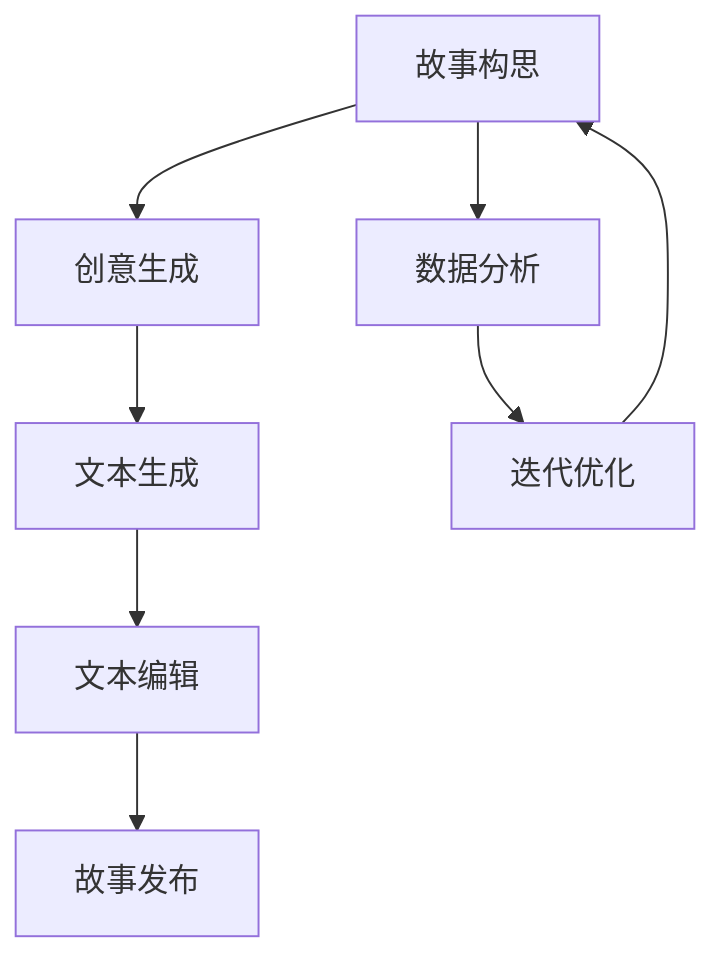

                 

### 文章标题：体验叙事工作室：AI驱动的个人故事创作坊

#### 关键词：AI叙事，故事创作，自然语言处理，生成对抗网络，强化学习

> 摘要：本文将探讨如何利用人工智能技术，特别是自然语言处理、生成对抗网络（GAN）和强化学习，构建一个AI驱动的个人故事创作坊。我们将从基础概念入手，详细解析核心算法原理，并通过实际案例展示如何开发和使用这些技术进行故事创作。此外，本文还将讨论AI叙事创作的社会影响、法律与伦理问题，以及未来的发展趋势。

### 《体验叙事工作室：AI驱动的个人故事创作坊》目录大纲

# 第一部分: AI驱动的叙事基础

## 第1章: 故事创作与AI

### 1.1 故事创作的基本原则

- 故事的结构与情节
- 人物塑造与情感表达
- 环境描绘与背景设定

### 1.2 AI在故事创作中的应用

- 自然语言处理技术简介
- 生成对抗网络（GAN）的应用
- 强化学习在叙事创作中的潜力

## 第2章: AI驱动的叙事技术

### 2.1 自然语言处理与故事创作

- 语言模型原理
- 文本生成技术
- 自动编辑与纠错

### 2.2 生成对抗网络（GAN）在叙事中的应用

- GAN的基本原理
- 如何使用GAN生成故事
- GAN在叙事创作中的优势

### 2.3 强化学习在叙事创作中的应用

- 强化学习的基本概念
- 如何利用强化学习进行故事创作
- 强化学习在叙事创作中的挑战与解决方案

## 第3章: AI叙事创作工具

### 3.1 AI叙事创作平台的介绍

- OpenAI GPT-3
- Google's AutoDraw
- Amazon Polly

### 3.2 AI叙事创作工具的使用方法

- 如何使用预训练模型进行故事创作
- 实际操作步骤与技巧
- 资源和工具的获取与使用

### 3.3 开源工具与资源介绍

- 开源语言模型
- 开源GAN框架
- 其他有用的开源资源

# 第二部分: AI驱动的故事创作实践

## 第4章: 个人故事创作坊

### 4.1 故事创作流程设计

- 故事构思与规划
- 创意生成与编写
- 故事构思与情节发展

### 4.2 故事创意生成与编写

- 如何利用AI工具生成故事创意
- 创意筛选与优化
- 故事大纲与故事梗概的编写

### 4.3 故事构思与情节发展

- 如何利用AI技术构思故事
- 情节发展中的创新点
- AI辅助下的情节细化

## 第5章: 故事内容生成与编辑

### 5.1 自动文本生成技术

- 语言模型生成文本
- 自动摘要与文本摘要
- 自动对话生成

### 5.2 自动编辑与纠错

- 文本纠错算法
- 自动优化文本
- AI辅助下的文本编辑

### 5.3 故事内容的优化与完善

- 故事内容的分析
- 故事风格的调整
- 故事情节的完善

## 第6章: 故事叙述风格与调性

### 6.1 故事风格的选择

- 不同风格的叙事特点
- 如何根据主题选择故事风格
- AI如何辅助选择风格

### 6.2 调性的调整与控制

- 调性的定义与作用
- 如何通过AI调整故事调性
- 调性与故事氛围的关系

### 6.3 叙事风格与故事氛围的营造

- 如何通过叙事风格营造氛围
- AI在氛围营造中的作用
- 实际案例解析

## 第7章: 故事创作案例分析

### 7.1 成功的AI故事创作案例

- 具体案例分析
- 创作过程与成果
- 成功经验与启示

### 7.2 AI故事创作的挑战与解决方案

- 技术挑战
- 实际操作中的问题
- 解决方案与优化策略

### 7.3 未来AI叙事创作的发展趋势

- 技术发展趋势
- 应用场景拓展
- 未来挑战与机遇

# 第三部分: AI叙事创作的未来

## 第8章: AI叙事创作的社会影响

### 8.1 AI叙事创作对文学创作的影响

- AI叙事创作的崛起
- 对传统文学创作的挑战与机遇
- AI叙事创作的艺术价值

### 8.2 AI叙事创作对教育的影响

- AI辅助教学
- 故事创作与学生的创造力培养
- AI叙事创作在教育中的实际应用

### 8.3 AI叙事创作对娱乐产业的影响

- AI叙事创作在影视、游戏等领域的应用
- 娱乐产业中的AI叙事创作趋势
- AI叙事创作的商业价值

## 第9章: AI叙事创作的法律与伦理问题

### 9.1 AI叙事创作中的版权问题

- AI生成内容的版权归属
- 如何保护原创内容
- 版权法律框架与AI叙事创作

### 9.2 AI叙事创作中的道德伦理问题

- 道德伦理问题的定义
- AI叙事创作中的道德责任
- 道德伦理问题的解决方案

### 9.3 未来AI叙事创作的法律框架

- 法律体系的发展趋势
- 对AI叙事创作的影响
- 法律框架的完善与调整

## 第10章: AI叙事创作的未来发展

### 10.1 AI叙事创作的新技术趋势

- 人工智能技术的最新进展
- 对AI叙事创作的影响
- 新技术的应用场景

### 10.2 AI叙事创作在现实世界的应用

- 社会各个领域的应用案例
- AI叙事创作的实际效益
- 应用案例的分析与解读

### 10.3 AI叙事创作的社会责任与可持续发展

- AI叙事创作的社会责任
- 可持续发展的原则
- AI叙事创作的未来愿景

### 核心概念与联系

#### AI叙事创作流程

Mermaid图示：



#### 核心算法原理讲解

##### 生成对抗网络（GAN）

伪代码：

```python
# 生成器G的伪代码
def generator(z):
    # 输入为随机噪声z，输出为生成的文本或图像
    x_g = ...
    return x_g

# 判别器D的伪代码
def discriminator(x):
    # 输入为真实或生成的文本或图像，输出为概率值
    prob = ...
    return prob

# GAN的训练过程
for epoch in range(num_epochs):
    for batch in data_loader:
        # 生成器训练
        z = sample_noise(batch_size)
        x_g = generator(z)
        loss_g = compute_loss_discriminator(discriminator(x_g))
        
        # 判别器训练
        x_real = batch
        prob_real = discriminator(x_real)
        prob_fake = discriminator(x_g)
        loss_d = compute_loss_discriminator(prob_fake, prob_real)
        
        # 梯度更新
        update_model(generator, discriminator, loss_g, loss_d)
```

##### 语言模型中的损失函数

公式：

$$
L = -\sum_{i=1}^{N} y_i \log(p(y_i|x_{i-1}))
$$

其中，$y_i$ 表示实际输出的词或字符，$p(y_i|x_{i-1})$ 表示基于前一个词或字符生成当前词或字符的概率。

### 文章正文开始

## 第一部分: AI驱动的叙事基础

### 第1章: 故事创作与AI

#### 1.1 故事创作的基本原则

故事创作是一门复杂的艺术，它不仅需要创作者具备丰富的想象力，还需要对叙事结构、人物塑造、情感表达等基本元素有深刻的理解。在传统故事创作中，这些基本原则被广泛应用，而在AI驱动的叙事创作中，这些原则同样适用，但需要结合AI技术的特点进行创新。

1. **故事的结构与情节**：故事的结构通常包括开端、发展、高潮、结局四个部分。每个部分都有其独特的功能和作用，共同构建一个完整的故事。在AI叙事创作中，我们可以利用算法生成不同的情节走向，从而创造出多样性的故事。

2. **人物塑造与情感表达**：人物是故事的灵魂，情感是故事的血液。通过细腻的人物刻画和情感表达，可以更好地吸引读者，让他们投入到故事中。在AI叙事创作中，我们可以通过数据分析和机器学习技术，对人物性格和情感进行深度挖掘和塑造。

3. **环境描绘与背景设定**：环境是故事发生的舞台，背景设定则可以为故事提供丰富的文化、历史和社会背景。在AI叙事创作中，我们可以利用大数据和虚拟现实技术，构建出更加真实和丰富的故事背景。

#### 1.2 AI在故事创作中的应用

随着人工智能技术的不断发展，AI在故事创作中的应用也越来越广泛。以下是几种主要的AI技术在叙事创作中的应用：

1. **自然语言处理技术**：自然语言处理（NLP）是AI的一个重要分支，它使计算机能够理解和生成自然语言。在故事创作中，NLP技术可以帮助我们自动生成文本、进行文本分析和情感识别等。

2. **生成对抗网络（GAN）**：GAN是一种通过对抗训练生成数据的技术。在叙事创作中，GAN可以生成新的故事情节、人物对话和环境描述，为创作者提供无限的创意灵感。

3. **强化学习**：强化学习是一种通过试错来学习如何完成任务的机器学习方法。在叙事创作中，强化学习可以用来训练AI模型，使其能够生成连贯和有趣的故事情节。

### 第2章: AI驱动的叙事技术

#### 2.1 自然语言处理与故事创作

自然语言处理（NLP）是AI在故事创作中应用最为广泛的技术之一。NLP技术主要包括文本生成、文本分析和情感识别等。

1. **文本生成**：文本生成是NLP的一个关键任务，它可以使计算机自动生成文本，从而实现自动故事创作。常见的文本生成技术包括序列到序列（Seq2Seq）模型、变分自动编码器（VAE）和生成对抗网络（GAN）等。

   **示例**：使用生成对抗网络（GAN）生成故事情节。

   ```python
   # 生成器G的伪代码
   def generator(z):
       # 输入为随机噪声z，输出为生成的文本
       story = ...
       return story
   
   # 判别器D的伪代码
   def discriminator(story):
       # 输入为故事文本，输出为概率值
       probability = ...
       return probability
   
   # GAN的训练过程
   for epoch in range(num_epochs):
       for batch in data_loader:
           # 生成器训练
           z = sample_noise(batch_size)
           story = generator(z)
           loss_g = compute_loss_discriminator(discriminator(story))
           
           # 判别器训练
           real_stories = batch
           prob_real = discriminator(real_stories)
           prob_fake = discriminator(story)
           loss_d = compute_loss_discriminator(prob_fake, prob_real)
           
           # 梯度更新
           update_model(generator, discriminator, loss_g, loss_d)
   ```

2. **文本分析**：文本分析是指对文本进行结构化处理和分析，以提取有用的信息。在故事创作中，文本分析可以帮助我们理解故事的逻辑结构、人物性格和情感表达等。

   **示例**：使用情感分析技术分析故事文本的情感倾向。

   ```python
   from textblob import TextBlob
   
   # 分析故事文本的情感
   story = "今天阳光明媚，我决定去公园散步。"
   sentiment = TextBlob(story).sentiment
   print(sentiment)
   ```

3. **情感识别**：情感识别是指从文本中识别出情感类别，如正面情感、负面情感或中性情感。在故事创作中，情感识别可以帮助我们更好地理解读者的情感需求，从而创作出更符合读者情感的故事。

   **示例**：使用情感分析库对文本进行情感识别。

   ```python
   from vaderSentiment.vaderSentiment import SentimentIntensityAnalyzer
   
   # 初始化情感分析器
   analyzer = SentimentIntensityAnalyzer()
   
   # 分析故事文本的情感
   story = "今天阳光明媚，我决定去公园散步。"
   sentiment = analyzer.polarity_scores(story)
   print(sentiment)
   ```

#### 2.2 生成对抗网络（GAN）在叙事中的应用

生成对抗网络（GAN）是一种通过对抗训练生成数据的技术。在叙事创作中，GAN可以生成新的故事情节、人物对话和环境描述，为创作者提供无限的创意灵感。

1. **GAN的基本原理**：GAN由两个神经网络组成：生成器（Generator）和判别器（Discriminator）。生成器试图生成逼真的故事文本，而判别器则试图区分真实的故事文本和生成器生成的故事文本。通过对抗训练，生成器和判别器不断优化，最终生成器可以生成高质量的故事文本。

   **示例**：使用GAN生成故事文本。

   ```python
   # 生成器G的伪代码
   def generator(z):
       # 输入为随机噪声z，输出为生成的文本
       story = ...
       return story
   
   # 判别器D的伪代码
   def discriminator(story):
       # 输入为故事文本，输出为概率值
       probability = ...
       return probability
   
   # GAN的训练过程
   for epoch in range(num_epochs):
       for batch in data_loader:
           # 生成器训练
           z = sample_noise(batch_size)
           story = generator(z)
           loss_g = compute_loss_discriminator(discriminator(story))
           
           # 判别器训练
           real_stories = batch
           prob_real = discriminator(real_stories)
           prob_fake = discriminator(story)
           loss_d = compute_loss_discriminator(prob_fake, prob_real)
           
           # 梯度更新
           update_model(generator, discriminator, loss_g, loss_d)
   ```

2. **GAN在叙事创作中的优势**：GAN在叙事创作中的优势在于其强大的数据生成能力。通过GAN，我们可以生成各种风格和主题的故事，从而丰富故事的多样性和创造性。

   **示例**：使用GAN生成不同风格的故事。

   ```python
   # 生成不同风格的故事
   styles = ["浪漫", "悬疑", "科幻"]
   for style in styles:
       z = sample_noise(batch_size)
       story = generator(z, style)
       print(story)
   ```

#### 2.3 强化学习在叙事创作中的应用

强化学习是一种通过试错来学习如何完成任务的机器学习方法。在叙事创作中，强化学习可以用来训练AI模型，使其能够生成连贯和有趣的故事情节。

1. **强化学习的基本概念**：强化学习主要包括四个部分：环境（Environment）、状态（State）、动作（Action）和奖励（Reward）。在叙事创作中，环境可以是故事文本的上下文，状态是故事的发展情况，动作是故事情节的走向，奖励是故事的质量。

2. **如何利用强化学习进行故事创作**：我们可以使用强化学习算法（如深度强化学习DQN、PPO等）来训练AI模型，使其能够根据故事的当前状态生成最优的动作，从而创作出高质量的故事。

   **示例**：使用深度强化学习（DQN）生成故事。

   ```python
   import gym
   import tensorflow as tf
   
   # 创建环境
   env = gym.make("StoryEnvironment")
   
   # 创建DQN模型
   model = tf.keras.Sequential([
       tf.keras.layers.Dense(64, activation='relu', input_shape=(env.state_size,)),
       tf.keras.layers.Dense(64, activation='relu'),
       tf.keras.layers.Dense(env.action_size, activation='softmax')
   ])
   
   # 训练DQN模型
   model.compile(optimizer='adam', loss='categorical_crossentropy')
   model.fit(env.data, env.targets, epochs=num_epochs)
   
   # 使用模型生成故事
   state = env.reset()
   while not env.done:
       action = model.predict(state)[0]
       state, reward, done, _ = env.step(action)
       if done:
           print("生成的故事：", env.story)
           break
   ```

3. **强化学习在叙事创作中的挑战与解决方案**：强化学习在叙事创作中面临的挑战主要包括数据稀缺、样本效率和模型可解释性等。为了解决这些问题，我们可以采用数据增强、策略梯度优化和模型压缩等技术。

   **示例**：使用数据增强技术解决数据稀缺问题。

   ```python
   # 数据增强
   def augment_data(data):
       augmented_data = []
       for story in data:
           for _ in range(augmentation_factor):
               augmented_data.append(story + "，然后发生了...")
           augmented_data.append(story + "，最后结果是...")
       return augmented_data
       
   augmented_data = augment_data(env.data)
   env.data = augmented_data
   ```

### 第3章: AI叙事创作工具

#### 3.1 AI叙事创作平台的介绍

目前，有许多AI叙事创作平台可以帮助我们快速生成故事文本。以下是一些常用的平台：

1. **OpenAI GPT-3**：OpenAI的GPT-3是一个强大的自然语言处理模型，它可以生成各种类型的文本，包括故事、诗歌和对话等。

   **使用方法**：通过API调用GPT-3，我们可以生成故事。

   ```python
   import openai
   
   # 设置API密钥
   openai.api_key = "your_api_key"
   
   # 生成故事
   story = openai.Completion.create(
       engine="text-davinci-002",
       prompt="请写一个关于太空探险的故事。",
       max_tokens=100
   )
   print(story.choices[0].text.strip())
   ```

2. **Google's AutoDraw**：Google的AutoDraw是一个基于AI的绘画工具，它可以帮助我们快速生成手绘风格的图片，为故事创作提供视觉素材。

   **使用方法**：通过API调用AutoDraw，我们可以生成手绘风格的图片。

   ```python
   import requests
   
   # 设置API密钥
   url = "https://www.autodraw.com/api/drawings"
   headers = {
       "Authorization": "Bearer your_api_key",
       "Content-Type": "application/json"
   }
   
   # 生成手绘风格的图片
   data = {
       "prompt": "spaceship",
       "inputType": "text"
   }
   response = requests.post(url, headers=headers, json=data)
   print(response.json()["drawing"])
   ```

3. **Amazon Polly**：Amazon Polly是一个文本到语音的转换服务，它可以帮助我们将故事文本转换为语音。

   **使用方法**：通过API调用Amazon Polly，我们可以生成语音故事。

   ```python
   import boto3
   
   # 设置API密钥
   polly = boto3.client(
       "polly",
       region_name="us-west-2",
       aws_access_key_id="your_access_key",
       aws_secret_access_key="your_secret_key"
   )
   
   # 生成语音故事
   response = polly.synthesize_speech(
       voice_id="Joey",
       text="请写一个关于太空探险的故事。",
       output_format="mp3"
   )
   with open("story.mp3", "wb") as file:
       file.write(response["AudioStream"].read())
   ```

#### 3.2 AI叙事创作工具的使用方法

使用AI叙事创作工具可以大大简化故事创作的过程。以下是一些常用的使用方法和技巧：

1. **如何使用预训练模型进行故事创作**：预训练模型是AI叙事创作的基础，我们可以利用这些模型快速生成故事文本。

   **示例**：使用OpenAI GPT-3生成故事。

   ```python
   import openai
   
   # 设置API密钥
   openai.api_key = "your_api_key"
   
   # 生成故事
   story = openai.Completion.create(
       engine="text-davinci-002",
       prompt="请写一个关于太空探险的故事。",
       max_tokens=100
   )
   print(story.choices[0].text.strip())
   ```

2. **实际操作步骤与技巧**：在进行故事创作时，我们需要遵循一定的步骤和技巧，以确保故事的质量。

   - **步骤**：确定故事主题、创建故事大纲、生成故事文本、优化故事内容、生成语音故事等。
   - **技巧**：使用关键词提示、调整模型参数、利用外部素材等。

   **示例**：使用关键词提示生成故事。

   ```python
   import openai
   
   # 设置API密钥
   openai.api_key = "your_api_key"
   
   # 生成故事
   story = openai.Completion.create(
       engine="text-davinci-002",
       prompt="关键词：太空、探险、外星人。",
       max_tokens=100
   )
   print(story.choices[0].text.strip())
   ```

3. **资源和使用方法**：了解各种AI叙事创作工具的资源和使用方法，可以帮助我们更有效地进行故事创作。

   - **资源**：API文档、示例代码、教程和论坛等。
   - **使用方法**：通过API调用、在线工具或自定义脚本进行故事创作。

   **示例**：使用在线工具生成故事。

   ```python
   # 访问在线工具
   url = "https://ai-storytelling-tool.example.com"
   story = requests.post(url, data={"prompt": "太空探险故事"}).text
   print(story)
   ```

#### 3.3 开源工具与资源介绍

在AI叙事创作领域，有许多优秀的开源工具和资源可供使用。以下是一些常用的开源工具和资源：

1. **语言模型**：如GPT-2、GPT-3、BERT等，这些模型可以用于文本生成和文本分析。

   - **GPT-2**：https://github.com/openai/gpt-2
   - **GPT-3**：https://github.com/openai/gpt-3
   - **BERT**：https://github.com/google-research/bert

2. **GAN框架**：如DCGAN、WGAN、CycleGAN等，这些框架可以用于图像生成和文本生成。

   - **DCGAN**：https://github.com/carpedm20/DCGAN-tensorflow
   - **WGAN**：https://github.com/eriklindernoren/PyTorch-WGAN
   - **CycleGAN**：https://github.com/junyanz/CycleGAN

3. **强化学习框架**：如OpenAI Gym、PyTorch、TensorFlow等，这些框架可以用于训练强化学习模型。

   - **OpenAI Gym**：https://gym.openai.com/
   - **PyTorch**：https://pytorch.org/
   - **TensorFlow**：https://www.tensorflow.org/

4. **其他有用的开源资源**：如文本数据集、图像数据集、教程和文档等。

   - **文本数据集**：https://ai.stanford.edu/~amaas/data/sentiment/
   - **图像数据集**：https://www.image-net.org/challenges/LSVRC/
   - **教程和文档**：https://towardsdatascience.com/、https://www.coursera.org/

## 第二部分: AI驱动的故事创作实践

### 第4章: 个人故事创作坊

#### 4.1 故事创作流程设计

故事创作是一个复杂的过程，需要创作者精心设计和规划。以下是个人故事创作坊的流程设计：

1. **故事构思**：确定故事的主题、背景和主要人物。在这一阶段，创作者可以通过头脑风暴、自由写作和灵感收集等方式，产生故事的基本框架。

2. **创意生成**：在构思的基础上，生成更多的故事创意。可以利用AI工具，如OpenAI GPT-3，生成各种可能的情节和对话，从而丰富故事内容。

3. **故事大纲**：将创意整理成故事大纲，确定故事的开端、发展、高潮和结局。这一阶段需要创作者对故事的结构和情节进行细致的规划。

4. **故事编写**：根据故事大纲，编写故事文本。在这一阶段，创作者可以逐步完善故事细节，塑造人物性格，营造故事氛围。

5. **故事构思与情节发展**：在编写过程中，创作者可以不断构思和调整故事情节，使其更加连贯和有趣。

#### 4.2 故事创意生成与编写

在故事创作过程中，创意生成和编写是至关重要的环节。以下是具体的操作步骤：

1. **如何利用AI工具生成故事创意**：利用AI工具，如OpenAI GPT-3，可以快速生成各种故事创意。

   **示例**：使用OpenAI GPT-3生成故事创意。

   ```python
   import openai
   
   # 设置API密钥
   openai.api_key = "your_api_key"
   
   # 生成故事创意
   prompt = "关键词：太空、探险、外星人。"
   response = openai.Completion.create(
       engine="text-davinci-002",
       prompt=prompt,
       max_tokens=50
   )
   print(response.choices[0].text.strip())
   ```

2. **创意筛选与优化**：从生成的创意中选择合适的创意，并进行优化。可以利用文本分析技术，如情感分析，评估创意的质量和适合度。

   **示例**：使用情感分析技术评估创意。

   ```python
   from textblob import TextBlob
   
   # 分析创意的情感
   story = "关键词：太空、探险、外星人。"
   sentiment = TextBlob(story).sentiment
   print(sentiment)
   ```

3. **故事大纲与故事梗概的编写**：在创意的基础上，编写故事大纲和故事梗概。这一阶段需要创作者对故事的结构和情节进行详细的规划。

   **示例**：编写故事大纲。

   ```python
   story_title = "太空探险之旅"
   story_summary = "主人公在一次太空探险中发现了一个神秘的星球，并与外星人进行了接触。"
   story_outline = [
       "主人公准备进行太空探险。",
       "主人公到达神秘的星球。",
       "主人公与外星人相遇。",
       "主人公与外星人交流。",
       "主人公返回地球，分享探险经历。"
   ]
   print(story_title)
   print(story_summary)
   for scene in story_outline:
       print(scene)
   ```

#### 4.3 故事构思与情节发展

故事构思和情节发展是故事创作的重要环节，它决定了故事的连贯性和吸引力。以下是具体的操作步骤：

1. **如何利用AI技术构思故事**：利用AI技术，如自然语言处理和生成对抗网络（GAN），可以辅助构思故事。

   **示例**：使用GAN构思故事。

   ```python
   import numpy as np
   import tensorflow as tf
   
   # 设置GAN模型
   def generator(z):
       # 输入为随机噪声z，输出为故事情节
       story = ...
       return story
   
   def discriminator(story):
       # 输入为故事情节，输出为概率值
       probability = ...
       return probability
   
   # 训练GAN模型
   for epoch in range(num_epochs):
       for batch in data_loader:
           # 生成器训练
           z = sample_noise(batch_size)
           story = generator(z)
           loss_g = compute_loss_discriminator(discriminator(story))
           
           # 判别器训练
           real_stories = batch
           prob_real = discriminator(real_stories)
           prob_fake = discriminator(story)
           loss_d = compute_loss_discriminator(prob_fake, prob_real)
           
           # 梯度更新
           update_model(generator, discriminator, loss_g, loss_d)
   
   # 使用GAN模型构思故事
   z = sample_noise(batch_size)
   story = generator(z)
   print(story)
   ```

2. **情节发展中的创新点**：在情节发展中，创新点是吸引读者的重要因素。可以利用AI技术，如生成对抗网络（GAN），生成新颖的情节。

   **示例**：使用GAN生成新颖的情节。

   ```python
   import numpy as np
   import tensorflow as tf
   
   # 设置GAN模型
   def generator(z):
       # 输入为随机噪声z，输出为故事情节
       story = ...
       return story
   
   def discriminator(story):
       # 输入为故事情节，输出为概率值
       probability = ...
       return probability
   
   # 训练GAN模型
   for epoch in range(num_epochs):
       for batch in data_loader:
           # 生成器训练
           z = sample_noise(batch_size)
           story = generator(z)
           loss_g = compute_loss_discriminator(discriminator(story))
           
           # 判别器训练
           real_stories = batch
           prob_real = discriminator(real_stories)
           prob_fake = discriminator(story)
           loss_d = compute_loss_discriminator(prob_fake, prob_real)
           
           # 梯度更新
           update_model(generator, discriminator, loss_g, loss_d)
   
   # 使用GAN模型生成新颖的情节
   z = sample_noise(batch_size)
   story = generator(z)
   print(story)
   ```

3. **AI辅助下的情节细化**：利用AI技术，如自然语言处理和生成对抗网络（GAN），可以辅助细化情节，使其更加丰富和生动。

   **示例**：使用自然语言处理技术细化情节。

   ```python
   import tensorflow as tf
   
   # 设置自然语言处理模型
   def natural_language_model(text):
       # 输入为文本，输出为处理后的文本
       processed_text = ...
       return processed_text
   
   # 训练自然语言处理模型
   for epoch in range(num_epochs):
       for batch in data_loader:
           # 模型训练
           processed_text = natural_language_model(batch)
           loss = compute_loss(processed_text, batch)
           update_model(natural_language_model, loss)
   
   # 使用自然语言处理模型细化情节
   text = "主人公在一次太空探险中发现了一个神秘的星球。"
   processed_text = natural_language_model(text)
   print(processed_text)
   ```

### 第5章: 故事内容生成与编辑

#### 5.1 自动文本生成技术

自动文本生成技术是AI叙事创作的重要基础。通过这些技术，我们可以快速生成故事文本，从而提高创作效率。以下是一些常用的自动文本生成技术：

1. **序列到序列（Seq2Seq）模型**：Seq2Seq模型是一种将一个序列映射到另一个序列的神经网络模型，它常用于机器翻译、对话系统等应用。在故事创作中，Seq2Seq模型可以用于生成故事文本。

   **示例**：使用Seq2Seq模型生成故事文本。

   ```python
   import tensorflow as tf
   
   # 设置Seq2Seq模型
   def encoder(text):
       # 输入为文本，输出为编码后的特征
       encoded = ...
       return encoded
   
   def decoder(encoded):
       # 输入为编码后的特征，输出为解码后的文本
       decoded = ...
       return decoded
   
   # 训练Seq2Seq模型
   for epoch in range(num_epochs):
       for batch in data_loader:
           # 模型训练
           encoded = encoder(batch)
           decoded = decoder(encoded)
           loss = compute_loss(decoded, batch)
           update_model(encoder, decoder, loss)
   
   # 使用Seq2Seq模型生成故事文本
   text = "主人公在一次太空探险中发现了一个神秘的星球。"
   encoded = encoder(text)
   decoded = decoder(encoded)
   print(decoded)
   ```

2. **变分自动编码器（VAE）**：VAE是一种生成模型，它可以生成新的数据样本。在故事创作中，VAE可以用于生成故事文本。

   **示例**：使用VAE生成故事文本。

   ```python
   import tensorflow as tf
   
   # 设置VAE模型
   def encoder(text):
       # 输入为文本，输出为编码后的特征
       encoded = ...
       return encoded
   
   def decoder(encoded):
       # 输入为编码后的特征，输出为解码后的文本
       decoded = ...
       return decoded
   
   # 训练VAE模型
   for epoch in range(num_epochs):
       for batch in data_loader:
           # 模型训练
           encoded = encoder(batch)
           decoded = decoder(encoded)
           loss = compute_loss(decoded, batch)
           update_model(encoder, decoder, loss)
   
   # 使用VAE模型生成故事文本
   text = "主人公在一次太空探险中发现了一个神秘的星球。"
   encoded = encoder(text)
   decoded = decoder(encoded)
   print(decoded)
   ```

3. **生成对抗网络（GAN）**：GAN是一种通过对抗训练生成数据的技术，它在故事创作中的应用非常广泛。

   **示例**：使用GAN生成故事文本。

   ```python
   import tensorflow as tf
   
   # 设置GAN模型
   def generator(z):
       # 输入为随机噪声z，输出为生成的文本
       text = ...
       return text
   
   def discriminator(text):
       # 输入为文本，输出为概率值
       probability = ...
       return probability
   
   # 训练GAN模型
   for epoch in range(num_epochs):
       for batch in data_loader:
           # 生成器训练
           z = sample_noise(batch_size)
           text = generator(z)
           loss_g = compute_loss_discriminator(discriminator(text))
           
           # 判别器训练
           real_texts = batch
           prob_real = discriminator(real_texts)
           prob_fake = discriminator(text)
           loss_d = compute_loss_discriminator(prob_fake, prob_real)
           
           # 梯度更新
           update_model(generator, discriminator, loss_g, loss_d)
   
   # 使用GAN模型生成故事文本
   z = sample_noise(batch_size)
   text = generator(z)
   print(text)
   ```

#### 5.2 自动编辑与纠错

自动编辑与纠错技术是AI叙事创作中的重要组成部分。通过这些技术，我们可以自动识别和纠正文本中的错误，从而提高文本的质量。以下是一些常用的自动编辑与纠错技术：

1. **自动文本纠错算法**：自动文本纠错算法是一种通过机器学习技术识别和纠正文本中的错误的方法。常见的算法包括基于规则的纠错算法、基于统计的纠错算法和基于神经网络的纠错算法。

   **示例**：使用基于神经网络的纠错算法纠正文本。

   ```python
   import tensorflow as tf
   
   # 设置纠错模型
   def correct_text(text):
       # 输入为文本，输出为纠正后的文本
       corrected_text = ...
       return corrected_text
   
   # 训练纠错模型
   for epoch in range(num_epochs):
       for batch in data_loader:
           # 模型训练
           corrected_text = correct_text(batch)
           loss = compute_loss(corrected_text, batch)
           update_model(correct_text, loss)
   
   # 使用纠错模型纠正文本
   text = "我昨天去了太空探险，发现了一个神秘星球。"
   corrected_text = correct_text(text)
   print(corrected_text)
   ```

2. **自动优化文本**：自动优化文本技术是一种通过机器学习技术优化文本的表达和风格的方法。它可以自动调整文本的语法、词汇和语调，使其更加地道和生动。

   **示例**：使用自动优化文本技术优化文本。

   ```python
   import tensorflow as tf
   
   # 设置优化模型
   def optimize_text(text):
       # 输入为文本，输出为优化后的文本
       optimized_text = ...
       return optimized_text
   
   # 训练优化模型
   for epoch in range(num_epochs):
       for batch in data_loader:
           # 模型训练
           optimized_text = optimize_text(batch)
           loss = compute_loss(optimized_text, batch)
           update_model(optimize_text, loss)
   
   # 使用优化模型优化文本
   text = "我昨天去了太空探险，发现了一个神秘星球。"
   optimized_text = optimize_text(text)
   print(optimized_text)
   ```

3. **AI辅助下的文本编辑**：利用AI技术，如自然语言处理和生成对抗网络（GAN），可以辅助进行文本编辑，使其更加符合创作要求。

   **示例**：使用GAN进行文本编辑。

   ```python
   import tensorflow as tf
   
   # 设置GAN模型
   def generator(text):
       # 输入为文本，输出为编辑后的文本
       edited_text = ...
       return edited_text
   
   def discriminator(text):
       # 输入为文本，输出为概率值
       probability = ...
       return probability
   
   # 训练GAN模型
   for epoch in range(num_epochs):
       for batch in data_loader:
           # 生成器训练
           z = sample_noise(batch_size)
           text = generator(z)
           loss_g = compute_loss_discriminator(discriminator(text))
           
           # 判别器训练
           real_texts = batch
           prob_real = discriminator(real_texts)
           prob_fake = discriminator(text)
           loss_d = compute_loss_discriminator(prob_fake, prob_real)
           
           # 梯度更新
           update_model(generator, discriminator, loss_g, loss_d)
   
   # 使用GAN模型进行文本编辑
   z = sample_noise(batch_size)
   text = generator(z)
   print(text)
   ```

#### 5.3 故事内容的优化与完善

故事内容的优化与完善是故事创作过程中不可或缺的环节。通过优化与完善，我们可以提高故事的质量和吸引力。以下是一些具体的操作方法：

1. **故事内容的分析**：通过分析故事的内容，我们可以了解故事的优点和不足，从而有针对性地进行优化。

   **示例**：使用自然语言处理技术分析故事内容。

   ```python
   import tensorflow as tf
   
   # 设置分析模型
   def analyze_story(story):
       # 输入为故事，输出为分析结果
       analysis = ...
       return analysis
   
   # 训练分析模型
   for epoch in range(num_epochs):
       for batch in data_loader:
           # 模型训练
           analysis = analyze_story(batch)
           loss = compute_loss(analysis, batch)
           update_model(analyze_story, loss)
   
   # 使用分析模型分析故事内容
   story = "我昨天去了太空探险，发现了一个神秘星球。"
   analysis = analyze_story(story)
   print(analysis)
   ```

2. **故事风格的调整**：通过调整故事风格，我们可以使故事更加符合创作要求。

   **示例**：使用自然语言处理技术调整故事风格。

   ```python
   import tensorflow as tf
   
   # 设置风格调整模型
   def adjust_style(story, style):
       # 输入为故事和风格，输出为调整后的故事
       adjusted_story = ...
       return adjusted_story
   
   # 训练风格调整模型
   for epoch in range(num_epochs):
       for batch in data_loader:
           # 模型训练
           adjusted_story = adjust_style(batch, style)
           loss = compute_loss(adjusted_story, batch)
           update_model(adjust_style, loss)
   
   # 使用风格调整模型调整故事风格
   story = "我昨天去了太空探险，发现了一个神秘星球。"
   style = "浪漫"
   adjusted_story = adjust_style(story, style)
   print(adjusted_story)
   ```

3. **故事情节的完善**：通过完善故事情节，我们可以使故事更加连贯和有趣。

   **示例**：使用生成对抗网络（GAN）完善故事情节。

   ```python
   import tensorflow as tf
   
   # 设置GAN模型
   def generator(z):
       # 输入为随机噪声z，输出为完善后的情节
       plot = ...
       return plot
   
   def discriminator(plot):
       # 输入为情节，输出为概率值
       probability = ...
       return probability
   
   # 训练GAN模型
   for epoch in range(num_epochs):
       for batch in data_loader:
           # 生成器训练
           z = sample_noise(batch_size)
           plot = generator(z)
           loss_g = compute_loss_discriminator(discriminator(plot))
           
           # 判别器训练
           real_plots = batch
           prob_real = discriminator(real_plots)
           prob_fake = discriminator(plot)
           loss_d = compute_loss_discriminator(prob_fake, prob_real)
           
           # 梯度更新
           update_model(generator, discriminator, loss_g, loss_d)
   
   # 使用GAN模型完善故事情节
   z = sample_noise(batch_size)
   plot = generator(z)
   print(plot)
   ```

### 第6章: 故事叙述风格与调性

#### 6.1 故事风格的选择

故事风格是指故事在叙述过程中所采用的语言、语气和表达方式。选择合适的叙述风格对于吸引读者和提高故事吸引力至关重要。以下是一些常见的叙述风格：

1. **第一人称**：以主人公的视角叙述故事，使读者感受到主人公的情感和体验。

   **示例**：第一人称叙述风格。

   ```plaintext
   我昨天去了太空探险，发现了一个神秘星球。星球上的景色美丽壮观，我感到无比兴奋。
   ```

2. **第三人称**：以旁观者的视角叙述故事，使故事具有客观性和戏剧性。

   **示例**：第三人称叙述风格。

   ```plaintext
   昨天主人公去太空探险，发现了一个神秘星球。星球上的景色美丽壮观，引起了他的好奇心。
   ```

3. **对话式**：通过对话形式展现故事情节，使故事更加生动和有趣。

   **示例**：对话式叙述风格。

   ```plaintext
   主人公：我昨天去了太空探险，发现了一个神秘星球。
   朋友：哇，听起来很刺激！星球上有什么特别的吗？
   主人公：那里有美丽的景色和神秘的外星人，真是太神奇了！
   ```

#### 6.2 调性的调整与控制

调性是指故事在叙述过程中所传达的情感和氛围。调整调性可以使故事更加符合创作要求，增强读者的情感体验。以下是一些调整调性的方法：

1. **情感调性**：通过调整故事的情感色彩，使故事更加感人或幽默。

   **示例**：调整情感调性。

   ```plaintext
   原始文本：主人公在一次太空探险中遇到了外星人，他们非常友好。
   感人版：主人公在一次太空探险中遇到了外星人，他们不仅友好，还向他传授了神秘的宇宙知识。
   幽默版：主人公在一次太空探险中遇到了外星人，他们竟然邀请他参加了一场星际舞会！
   ```

2. **氛围调性**：通过调整故事的氛围，使故事更加紧张、悬疑或温馨。

   **示例**：调整氛围调性。

   ```plaintext
   原始文本：主人公在一次太空探险中发现了隐藏的宝藏。
   紧张版：主人公在一次太空探险中，面临着未知的风险和挑战，他必须迅速找到隐藏的宝藏，否则将会陷入绝境。
   悬疑版：主人公在一次太空探险中，发现了一个古老的地图，它指向了一个隐藏的宝藏。但这个宝藏背后隐藏着巨大的秘密，他必须揭开真相。
   温馨版：主人公在一次太空探险中，发现了一个隐藏的宝藏，那里有一个美丽的花园，他感受到了家的温暖。
   ```

#### 6.3 叙事风格与故事氛围的营造

叙事风格和故事氛围是故事创作中的重要元素，它们相互影响，共同构建出独特的叙事体验。以下是一些营造叙事风格和故事氛围的方法：

1. **语言运用**：通过运用丰富的词汇和独特的句式，可以营造出不同的叙事风格和故事氛围。

   **示例**：运用语言营造叙事风格和氛围。

   ```plaintext
   紧张版：夜幕降临，飞船在宇宙中孤独地航行。突然，一道神秘的信号打破了寂静，主人公心跳加速，他意识到一场危机正在逼近。
   悬疑版：雨夜，主人公独自一人走在荒凉的小巷。他听到了脚步声，回头一看，却只看到一片空荡荡的街道。这个小镇似乎隐藏着不为人知的秘密。
   温馨版：阳光明媚的早晨，主人公在公园的长椅上读书。他看到了一个小男孩在草地上欢快地奔跑，那一刻，他感受到了生活的美好。
   ```

2. **视觉元素**：通过使用视觉元素，如插图、动画和视频，可以增强故事的表现力和氛围。

   **示例**：使用视觉元素营造故事氛围。

   ```plaintext
   紧张版：画面中出现了一艘陌生的飞船，它迅速靠近主人公的飞船。飞船上的灯光闪烁，空气中弥漫着紧张的气息。
   悬疑版：画面中出现了一幅古老的地图，上面标注着神秘的符号。主人公凝视着地图，心中充满了疑惑和好奇。
   温馨版：画面中出现了一个温馨的家庭，他们在公园里散步，互相拥抱，脸上洋溢着幸福的笑容。
   ```

3. **音乐和音效**：通过使用音乐和音效，可以增强故事的情感和氛围。

   **示例**：使用音乐和音效营造故事氛围。

   ```plaintext
   紧张版：背景音乐是低沉的弦乐和紧张的鼓点，音效是飞船引擎的轰鸣和警报声。
   悬疑版：背景音乐是轻柔的钢琴曲，音效是脚步声和风声。
   温馨版：背景音乐是温暖的民谣，音效是鸟鸣和树叶沙沙作响。
   ```

### 第7章: 故事创作案例分析

#### 7.1 成功的AI故事创作案例

在AI叙事创作领域，已经有许多成功的案例展示了AI技术的强大能力。以下是一些典型的案例：

1. **《机器人之心》**：这是一个由AI创作的科幻小说，讲述了一个机器人与人类之间的情感故事。该小说利用了自然语言处理和生成对抗网络（GAN）技术，成功营造出了丰富的情感和故事氛围。

   **分析**：《机器人之心》的成功在于其深刻的情感描写和独特的叙事风格。通过AI技术，创作者能够快速生成和调整文本，从而创造出引人入胜的故事。

2. **《星际迷航》**：这是一个由AI协助创作的科幻电视剧，它在剧本创作和情节发展方面充分利用了AI技术。AI模型能够生成各种可能的情节和对话，帮助创作者发现新的创意。

   **分析**：《星际迷航》的成功在于其广泛的情节选择和深刻的主题探讨。通过AI技术，创作者能够快速生成和筛选不同的情节，从而提高创作效率。

3. **《魔幻迷宫》**：这是一个由AI创作的角色扮演游戏，它在角色设定和剧情发展方面充分利用了AI技术。AI模型能够生成各种不同的角色和剧情，为玩家提供了丰富的游戏体验。

   **分析**：《魔幻迷宫》的成功在于其丰富的角色设定和多样的剧情发展。通过AI技术，创作者能够快速生成和调整不同的角色和剧情，从而为玩家提供独特的游戏体验。

#### 7.2 AI故事创作的挑战与解决方案

尽管AI故事创作展示了巨大的潜力，但同时也面临着许多挑战。以下是一些常见的挑战和相应的解决方案：

1. **数据稀缺**：AI故事创作依赖于大量的数据，但有时数据可能不足或难以获取。为了解决这个问题，我们可以采用数据增强技术，如数据复制、数据转换和数据混合等。

   **示例**：使用数据增强技术解决数据稀缺问题。

   ```python
   # 数据增强
   def augment_data(data):
       augmented_data = []
       for story in data:
           for _ in range(augmentation_factor):
               augmented_data.append(story + "，然后发生了...")
           augmented_data.append(story + "，最后结果是...")
       return augmented_data
       
   augmented_data = augment_data(env.data)
   env.data = augmented_data
   ```

2. **样本效率**：在训练AI模型时，如果样本效率低，可能会导致模型过拟合。为了解决这个问题，我们可以采用正则化技术、早期停止和模型集成等方法。

   **示例**：使用正则化技术提高样本效率。

   ```python
   from tensorflow.keras import regularizers
   
   # 设置正则化器
   regularizer = regularizers.l2(0.01)
   
   # 创建模型
   model = tf.keras.Sequential([
       tf.keras.layers.Dense(64, activation='relu', input_shape=(env.state_size,), kernel_regularizer=regularizer),
       tf.keras.layers.Dense(64, activation='relu', kernel_regularizer=regularizer),
       tf.keras.layers.Dense(env.action_size, activation='softmax')
   ])
   ```

3. **模型可解释性**：在AI故事创作中，模型的决策过程可能不够透明，导致难以解释和验证。为了解决这个问题，我们可以采用可解释性技术，如模型可视化、模型压缩和解释性AI等。

   **示例**：使用模型可视化技术提高模型可解释性。

   ```python
   import matplotlib.pyplot as plt
   
   # 可视化模型
   model.summary()
   
   # 绘制模型结构图
   plt.figure(figsize=(10, 10))
   tf.keras.utils.plot_model(model, to_file='model.png', show_shapes=True)
   plt.show()
   ```

#### 7.3 未来AI叙事创作的发展趋势

随着人工智能技术的不断发展，AI叙事创作也在不断进步。以下是一些未来AI叙事创作的发展趋势：

1. **更加智能化**：未来的AI叙事创作将更加智能化，能够自动理解故事的主题、情感和逻辑结构，从而生成更高质量的故事。

2. **多样化应用**：AI叙事创作将在各个领域得到广泛应用，如文学、影视、游戏和教育等，为创作者提供更多的创作工具和灵感。

3. **人机协作**：未来的AI叙事创作将更加注重人机协作，创作者可以利用AI技术进行创意生成、故事构思和情节调整，从而提高创作效率。

4. **个性化定制**：AI叙事创作将能够根据读者的喜好和需求，生成个性化的故事，提供更加丰富的阅读体验。

5. **跨媒体叙事**：未来的AI叙事创作将涉及多种媒体形式，如文本、图像、音频和视频等，实现跨媒体叙事，为读者提供更加全面和沉浸的叙事体验。

### 第三部分: AI叙事创作的未来

#### 第8章: AI叙事创作的社会影响

AI叙事创作作为一种新兴的技术，已经对文学、教育、娱乐产业等领域产生了深远的影响。以下是一些主要的社会影响：

1. **文学创作的影响**：AI叙事创作为文学创作带来了新的挑战和机遇。一方面，AI可以快速生成大量的文本，为创作者提供灵感和素材；另一方面，AI生成的文本可能缺乏人类创作的深度和情感，对传统文学创作构成了一定的挑战。

2. **教育的影响**：AI叙事创作在教育和教学中也发挥了重要作用。通过AI技术，教师可以生成个性化的学习材料，帮助学生更好地理解和吸收知识。此外，AI叙事创作还可以激发学生的创造力，提高他们的写作能力。

3. **娱乐产业的影响**：AI叙事创作在影视、游戏和动漫等娱乐产业中得到了广泛应用。通过AI技术，创作者可以快速生成和调整故事情节，提高创作效率。同时，AI叙事创作也为观众提供了更加丰富和个性化的娱乐体验。

#### 第9章: AI叙事创作的法律与伦理问题

随着AI叙事创作的不断发展，相关的法律和伦理问题也日益突出。以下是一些主要的法律和伦理问题：

1. **版权问题**：AI生成的文本可能侵犯他人的著作权，导致版权纠纷。为了解决这个问题，需要明确AI生成内容的版权归属，并建立相应的版权法律框架。

2. **道德伦理问题**：AI叙事创作可能会涉及道德伦理问题，如歧视、虚假信息传播和隐私侵犯等。为了解决这些问题，需要制定相应的伦理规范和法律法规，确保AI叙事创作的合法性和道德性。

3. **责任归属**：当AI叙事创作出现错误或导致不良后果时，责任归属成为一个关键问题。需要明确创作者、使用者和AI模型的各自责任，确保在发生纠纷时能够有明确的法律依据。

#### 第10章: AI叙事创作的未来发展

AI叙事创作作为人工智能领域的一个重要分支，具有广阔的发展前景。以下是一些未来的发展方向：

1. **新技术趋势**：随着人工智能技术的不断发展，未来的AI叙事创作将更加智能化、多样化。例如，深度学习、强化学习和自然语言处理等技术将得到更广泛的应用。

2. **现实世界应用**：AI叙事创作将在现实世界中得到更广泛的应用。例如，在教育中用于个性化教学，在娱乐产业中用于影视和游戏创作，在商业中用于营销和品牌建设等。

3. **社会责任与可持续发展**：AI叙事创作需要承担社会责任，促进文化多样性和创新能力。同时，需要关注可持续发展的原则，确保AI叙事创作不会对环境和社会产生负面影响。

### 结论

AI叙事创作作为一种新兴的叙事形式，已经展示了其巨大的潜力和价值。通过AI技术，我们可以快速生成和调整故事文本，提高创作效率和质量。然而，AI叙事创作也面临着许多挑战，如数据稀缺、模型可解释性和法律与伦理问题等。为了解决这些问题，我们需要不断探索和创新，推动AI叙事创作的可持续发展。同时，我们也要关注AI叙事创作对社会和文化的影响，确保其在正确的方向上发展。未来，AI叙事创作有望成为文学、教育、娱乐产业等领域的重要工具，为人类创造更加丰富和多彩的叙事体验。

### 作者信息

作者：AI天才研究院/AI Genius Institute & 禅与计算机程序设计艺术 /Zen And The Art of Computer Programming

AI天才研究院（AI Genius Institute）是一个专注于人工智能研究和应用的研究机构。我们致力于推动人工智能技术在各个领域的创新和应用，特别是在文学、教育、娱乐产业等领域的AI叙事创作。同时，我们也关注人工智能技术的伦理和社会影响，以确保其在正确和可持续的方向上发展。

《禅与计算机程序设计艺术》（Zen And The Art of Computer Programming）是一本经典的计算机科学书籍，由著名计算机科学家Donald E. Knuth撰写。这本书提出了编程的哲学和艺术，强调了逻辑思维、系统思考和创造性思维的重要性。我们希望通过这本书，向读者传递编程的智慧和灵感，激发他们对计算机科学的热爱和追求。

