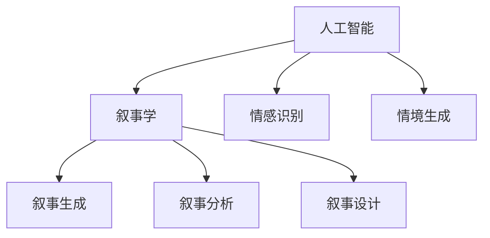
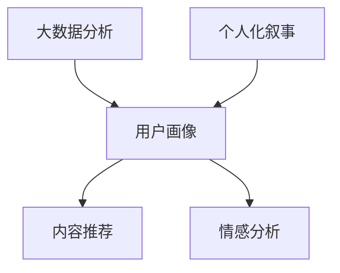

                 

### 文章标题

《体验的个人化叙事：AI驱动的生活故事》

---

关键词：个人化叙事，AI，深度学习，自然语言处理，情感分析，伦理问题

---

摘要：随着人工智能技术的迅猛发展，AI驱动的个人化叙事逐渐成为数字时代的一种新兴表达形式。本文深入探讨了个人化叙事的定义、发展历程、核心概念以及AI在其中的应用。通过分析机器学习、自然语言处理和情感识别等技术，本文展示了AI驱动个人化叙事的技术基础和实际应用。同时，本文还探讨了AI驱动个人化叙事的未来发展趋势，以及可能面临的伦理和隐私问题。希望通过本文的阐述，能够帮助读者更好地理解和应对这一领域的挑战和机遇。 

---

### 目录大纲

1. **个人化叙事的定义与发展历程**
   - **1.1 个人化叙事的定义**
   - **1.2 个人化叙事的发展历程**
   - **1.3 AI技术在个人化叙事中的应用**

2. **AI驱动个人化叙事的核心概念**
   - **2.1 人工智能与叙事学**
   - **2.2 大数据分析与个人化叙事**
   - **2.3 自然语言处理与叙事生成**

3. **AI驱动个人化叙事的技术基础**
   - **3.1 机器学习与深度学习**
   - **3.2 自然语言处理技术**
   - **3.3 AI算法在个人化叙事中的应用**

4. **AI驱动个人化叙事的案例分析**
   - **4.1 社交媒体上的个人化叙事**
   - **4.2 个性化推荐系统中的叙事**
   - **4.3 虚拟角色与个人化叙事**

5. **AI驱动个人化叙事的实际应用**
   - **5.1 个性化新闻阅读**
   - **5.2 个性化故事创作**
   - **5.3 个性化生活记录与分享**

6. **AI驱动个人化叙事的未来发展**
   - **6.1 AI驱动个人化叙事的伦理与隐私问题**
   - **6.2 AI驱动个人化叙事的未来趋势**
   - **6.3 AI驱动个人化叙事的社会影响**

7. **附录**
   - **7.1 AI驱动个人化叙事的工具与资源**
   - **7.2 参考文献与推荐阅读**
   - **7.3 进一步研究的方向**

---

### 个人化叙事的定义与发展历程

#### 1.1 个人化叙事的定义

个人化叙事，顾名思义，是指围绕个体经历、情感和价值观展开的一种叙事方式。它区别于传统的集体叙事，强调个体的独特性和主观性。个人化叙事不仅仅是对过去事件的描述，更是对个体内心感受、情感态度和价值观的表达。这种叙事形式通常以日记、回忆录、博客、短视频等形式存在，其核心在于传达个体的真实感受和独特体验。

我们可以将个人化叙事定义为一个包含三个主要成分的过程：个体经历、情感表达和价值观传达。

- **个体经历**：指个人在生活中所经历的事件和情境，这些经历是个人化叙事的素材来源。
- **情感表达**：指个体在叙事过程中所传达的情感状态，包括喜怒哀乐等各种情感体验。
- **价值观传达**：指个体通过叙事所表达的价值观念和人生哲学，这是个人化叙事的灵魂。

用公式表示，个人化叙事可以定义为：

$$
\text{个人化叙事} = \text{个体经历} + \text{情感表达} + \text{价值观传达}
$$

#### 1.2 个人化叙事的发展历程

个人化叙事的发展历程可以分为两个阶段：传统个人化叙事和现代个人化叙事。

**传统个人化叙事**

传统个人化叙事主要以口述和文字的形式存在。在古代，人们通过口述传统，将家族历史、传说和英雄事迹等传递给后代。在文字发明后，日记、回忆录和自传等成为个人化叙事的主要形式。这些叙事形式虽然形式多样，但都强调个体的真实经历和内心感受。

例如，法国作家蒙田的《随笔集》就是一部典型的个人化叙事作品。蒙田在书中不仅记录了自己的旅行经历，还表达了对人生、道德和哲学的深刻思考。这种个人化的叙事方式，使得读者能够更加直观地感受到作者的情感和思想。

**现代个人化叙事**

随着互联网和社交媒体的兴起，个人化叙事的形式和范围得到了极大的扩展。博客、微博、视频分享平台等新兴媒体为个人化叙事提供了新的舞台，使得每个人都可以成为叙事者。现代个人化叙事不仅涵盖了文字，还涵盖了图片、音频和视频等多种形式。

例如，YouTube上的个人Vlog（视频博客）就是一个典型的现代个人化叙事形式。Vlog制作者通过视频记录自己的生活、旅行和观点，与观众分享自己的经验和感受。这种叙事形式，不仅能够传递个体的真实情感，还能够形成一种独特的互动和社区氛围。

#### 1.3 AI技术在个人化叙事中的应用

随着人工智能技术的不断发展，AI技术在个人化叙事中的应用也变得越来越广泛。AI不仅可以用于个人化叙事的生成，还可以用于个人化叙事的分析和理解。

**个性化推荐系统**

个性化推荐系统是AI在个人化叙事中的一个重要应用。通过分析用户的兴趣和行为数据，AI可以生成个性化的推荐内容，如新闻、文章、视频等。这为个人化叙事提供了新的传播渠道和方式。

例如，YouTube的推荐算法可以根据用户的观看历史和搜索记录，为用户推荐符合个人兴趣的视频。这种个性化推荐不仅能够提高用户体验，还能够促进内容创作者和观众的互动。

**自然语言生成**

自然语言生成技术（NLG）可以基于大量文本数据，生成符合个人风格的叙事内容。这种技术为个人化叙事的创作提供了强大的技术支持。

例如，OpenAI的GPT-3模型可以生成高质量的文本内容，包括新闻、故事和诗歌等。通过训练GPT-3模型，我们可以让它模仿个人写作风格，生成符合个人特色的叙事内容。

**情感识别与分析**

情感识别与分析技术可以帮助AI识别并分析个人的情感状态，从而为个人化叙事提供情感线索和创意灵感。

例如，Facebook的Sentiment Analysis API可以识别文本中的情感极性，如正面、负面和中性。通过分析用户的情感状态，AI可以为个人化叙事提供情感建议，帮助创作者更好地传达情感。

**案例分析：AI驱动的个人化叙事应用**

- **社交媒体上的个人化叙事**：社交媒体平台如微博、抖音等，已经成为个人化叙事的重要载体。通过AI技术，平台可以分析用户生成的内容，识别和推荐个人化叙事。
- **个性化推荐系统中的叙事**：个性化推荐系统通过分析用户行为和兴趣，为用户推荐符合个人喜好的叙事内容。这为个人化叙事的传播提供了新的途径。
- **虚拟角色与个人化叙事**：虚拟角色（如虚拟偶像、虚拟助手等）可以基于用户数据生成个人化叙事。通过机器学习和自然语言处理技术，虚拟角色可以模拟人类叙事，提高用户体验。

总之，AI技术在个人化叙事中的应用，不仅为个人化叙事提供了新的表达形式和传播渠道，也为其带来了更多的创意和可能性。

---

### AI驱动个人化叙事的核心概念

个人化叙事作为一种独特的叙事形式，与人工智能（AI）的结合，为数字时代的叙事提供了全新的可能性。AI驱动的个人化叙事不仅仅是技术的应用，更是一种叙事理念的变革。在这个部分，我们将探讨AI驱动个人化叙事的核心概念，包括人工智能与叙事学、大数据分析与个人化叙事以及自然语言处理与叙事生成。

#### 2.1 人工智能与叙事学

人工智能与叙事学的结合，为叙事学的研究带来了新的视角和方法。叙事学是研究叙事结构和叙事策略的学科，而人工智能则为叙事学提供了强大的工具。

**人工智能在叙事学中的应用**

1. **叙事生成**：人工智能可以通过机器学习和自然语言生成技术，自动生成叙事内容。例如，OpenAI的GPT-3模型可以生成高质量的故事、新闻和诗歌。通过训练这些模型，我们可以让它模仿人类的叙事风格，从而生成符合个人风格的叙事内容。

2. **叙事分析**：人工智能可以用于分析叙事文本的结构和策略。例如，通过自然语言处理技术，我们可以分析故事的主题、情节和角色，从而揭示叙事的深层含义。

3. **叙事设计**：人工智能可以辅助叙事设计师，设计更加复杂和有趣的叙事作品。例如，通过机器学习算法，我们可以预测观众对叙事内容的反应，从而优化叙事设计。

**叙事学在人工智能中的应用**

1. **情感识别**：叙事学关注叙事中的情感表达，而人工智能可以通过情感识别技术，分析叙事文本中的情感极性。这有助于人工智能更好地理解和生成情感丰富的叙事内容。

2. **情境生成**：叙事学中的情境生成理论，可以指导人工智能生成更加真实的叙事场景。通过理解情境生成规则，人工智能可以生成更加连贯和有吸引力的叙事内容。

**核心概念与联系**

人工智能与叙事学的结合，形成了一个新的研究领域，即AI叙事学。在这个领域中，人工智能与叙事学相互影响，共同推动叙事的发展和变革。可以用以下的Mermaid流程图来表示这种关系：



#### 2.2 大数据分析与个人化叙事

大数据分析是AI驱动个人化叙事的重要基础。通过分析大量的用户数据，AI可以生成更加个性化的叙事内容。

**大数据分析在个人化叙事中的应用**

1. **用户画像**：通过分析用户的行为数据、兴趣偏好和情感状态，AI可以生成用户画像。这个用户画像可以作为个人化叙事的参考，帮助生成符合个人喜好的内容。

2. **内容推荐**：基于用户画像，AI可以通过推荐算法，为用户推荐符合个人兴趣的叙事内容。这种推荐不仅包括传统的文本形式，还可以包括视频、音频等多媒体形式。

3. **情感分析**：通过分析用户的情感状态，AI可以生成更加情感化的叙事内容。例如，如果用户表现出沮丧的情感，AI可以生成一些安慰性的故事或建议。

**核心概念与联系**

大数据分析与个人化叙事的关系可以用以下的Mermaid流程图表示：



#### 2.3 自然语言处理与叙事生成

自然语言处理（NLP）是AI驱动个人化叙事的关键技术。通过NLP技术，AI可以理解和生成自然语言文本。

**自然语言处理技术在叙事生成中的应用**

1. **文本生成**：NLP技术可以生成各种类型的文本，如故事、新闻、广告等。通过训练NLP模型，AI可以理解语言的结构和语义，从而生成符合语法和语义规则的叙事内容。

2. **情感分析**：NLP技术可以分析文本中的情感极性，从而为叙事生成提供情感线索。这有助于生成更加情感化和有吸引力的叙事内容。

3. **语义理解**：NLP技术可以帮助AI理解文本的语义，从而生成更加精准和连贯的叙事内容。通过语义理解，AI可以更好地处理复杂的语言结构和上下文关系。

**核心概念与联系**

自然语言处理与叙事生成的关系可以用以下的Mermaid流程图表示：

```mermaid
graph TD
A[NLP技术] --> B[文本生成]
A --> C[情感分析]
A --> D[语义理解]
E[叙事生成] --> B, C, D
```

总之，AI驱动个人化叙事的核心概念包括人工智能与叙事学、大数据分析与个人化叙事以及自然语言处理与叙事生成。这些概念相互关联，共同推动着个人化叙事的发展。通过理解这些核心概念，我们可以更好地把握AI驱动个人化叙事的原理和应用。

---

### AI驱动个人化叙事的技术基础

AI驱动个人化叙事的实现离不开一系列先进技术的支持，这些技术涵盖了机器学习、深度学习、自然语言处理等多个领域。在本章节中，我们将深入探讨这些技术的基础，以及它们在AI驱动个人化叙事中的应用。

#### 3.1 机器学习与深度学习

机器学习和深度学习是AI驱动的核心技术，它们在个人化叙事中发挥着至关重要的作用。

**机器学习在个人化叙事中的应用**

1. **分类和回归任务**：机器学习算法，如决策树、随机森林和支持向量机（SVM），可以用于分析用户数据，识别个人偏好和情感状态。例如，通过分类算法，我们可以将用户划分为不同的兴趣群体，从而为个人化叙事提供目标用户。

2. **聚类分析**：聚类算法，如K-均值聚类和层次聚类，可以用于分析用户数据，发现用户的共同特征和兴趣点。这有助于生成更加精准的个人化叙事内容。

**深度学习算法**

深度学习算法，如卷积神经网络（CNN）、循环神经网络（RNN）和变换器（Transformer），在个人化叙事中具有广泛的应用。

1. **卷积神经网络（CNN）**：CNN是一种强大的图像处理技术，可以用于分析用户的视觉数据，如头像、视频片段等。通过CNN，我们可以提取用户的视觉特征，为个人化叙事提供视觉线索。

2. **循环神经网络（RNN）**：RNN是一种适用于序列数据的学习模型，可以用于分析用户的文本数据，如博客、评论等。通过RNN，我们可以捕捉用户的情感和兴趣变化，为个人化叙事提供情感线索。

3. **变换器（Transformer）**：Transformer是一种基于自注意力机制的深度学习模型，在自然语言处理领域取得了显著成果。通过Transformer，我们可以生成高质量的叙事文本，模拟人类的叙事风格。

**核心算法原理讲解**

以下是深度学习模型在个人化叙事中的应用的伪代码：

```python
# 导入必要的库
import tensorflow as tf
from tensorflow.keras.models import Sequential
from tensorflow.keras.layers import Embedding, LSTM, Dense

# 创建序列模型
model = Sequential()

# 添加嵌入层
model.add(Embedding(vocabulary_size, embedding_dim))

# 添加循环层
model.add(LSTM(units=128, return_sequences=True))

# 添加全连接层
model.add(Dense(units=1, activation='sigmoid'))

# 编译模型
model.compile(optimizer='adam', loss='binary_crossentropy', metrics=['accuracy'])

# 训练模型
model.fit(x_train, y_train, epochs=10, batch_size=64)
```

在这个伪代码中，我们创建了一个简单的序列模型，用于预测用户的情感状态。通过嵌入层，我们可以将文本转换为向量表示。接着，通过循环层，我们可以捕捉文本中的序列特征。最后，通过全连接层，我们可以对用户的情感状态进行分类。

#### 3.2 自然语言处理技术

自然语言处理（NLP）是AI驱动个人化叙事的重要组成部分，它涉及文本的预处理、情感分析、命名实体识别等多个方面。

**文本预处理**

文本预处理是NLP的第一步，包括分词、去除停用词、词性标注等。

1. **分词**：分词是将文本分解为单个词汇的过程。例如，"我喜欢吃苹果"可以被分解为"我"、"喜欢"、"吃"、"苹果"。
2. **去除停用词**：停用词是常见的无意义词汇，如"的"、"了"、"在"等。去除停用词有助于减少噪声，提高模型的性能。
3. **词性标注**：词性标注是给文本中的每个词汇分配一个词性，如名词、动词、形容词等。这有助于理解文本的语义结构。

**情感分析**

情感分析是NLP的重要应用之一，它用于识别文本中的情感极性。

1. **情感极性分类**：情感极性分类是将文本分类为正面、负面或中性。例如，"我很开心"可以被分类为正面情感。
2. **情感强度评估**：情感强度评估是评估情感极性的强度。例如，"我很开心"和"我非常开心"的情感强度不同。

**命名实体识别**

命名实体识别是NLP的另一个重要应用，它用于识别文本中的特定实体，如人名、地名、组织名等。

1. **命名实体识别**：命名实体识别是将文本中的特定实体标注出来。例如，"北京是中国的首都"中，"北京"和"中国"都是命名实体。
2. **关系抽取**：关系抽取是识别命名实体之间的关系。例如，在"苹果公司的创始人史蒂夫·乔布斯去世了"中，"苹果公司"和"史蒂夫·乔布斯"之间存在创始人关系。

**核心算法原理讲解**

以下是自然语言处理技术在情感分析中的应用的伪代码：

```python
# 导入必要的库
import nltk
from nltk.sentiment import SentimentIntensityAnalyzer

# 初始化情感分析器
sia = SentimentIntensityAnalyzer()

# 分析文本的情感极性
text = "我喜欢这个新产品，它真的很棒。"
sentiment = sia.polarity_scores(text)

# 输出情感极性
print(sentiment)
```

在这个伪代码中，我们使用nltk库中的情感分析器，对给定的文本进行情感极性分析。情感分析器返回一个字典，包含正面、负面和中和情感的得分，以及综合的情感得分。

#### 3.3 AI算法在个人化叙事中的应用

AI算法在个人化叙事中的应用，包括文本生成、情感分析和推荐系统等。

**文本生成**

文本生成是AI驱动个人化叙事的核心任务之一。通过文本生成，AI可以创建新的叙事内容。

1. **生成式对抗网络（GAN）**：GAN是一种生成模型，可以生成高质量的文本。通过训练GAN，我们可以让它生成符合个人风格的叙事内容。
2. **变换器（Transformer）**：Transformer是一种基于自注意力机制的深度学习模型，可以用于生成高质量的叙事文本。

**情感分析**

情感分析是AI驱动个人化叙事的重要应用之一。通过情感分析，AI可以识别和理解用户的情感状态。

1. **情感极性分类**：情感极性分类是将文本分类为正面、负面或中性。这有助于生成符合用户情感状态的叙事内容。
2. **情感强度评估**：情感强度评估是评估情感极性的强度。这有助于生成情感丰富、生动有趣的叙事内容。

**推荐系统**

推荐系统是AI驱动个人化叙事的重要工具。通过推荐系统，AI可以推荐符合用户兴趣的叙事内容。

1. **基于内容的推荐**：基于内容的推荐是根据用户的历史行为和兴趣，推荐符合用户兴趣的叙事内容。
2. **基于协同过滤的推荐**：基于协同过滤的推荐是通过分析用户的兴趣和偏好，推荐其他用户喜欢的叙事内容。

**核心算法原理讲解**

以下是AI算法在文本生成和推荐系统中的应用的伪代码：

```python
# 文本生成
import tensorflow as tf
from tensorflow.keras.models import Sequential
from tensorflow.keras.layers import Embedding, LSTM, Dense

# 创建文本生成模型
model = Sequential()
model.add(Embedding(vocabulary_size, embedding_dim))
model.add(LSTM(units=128, return_sequences=True))
model.add(Dense(units=vocabulary_size, activation='softmax'))
model.compile(optimizer='adam', loss='categorical_crossentropy', metrics=['accuracy'])

# 训练模型
model.fit(x_train, y_train, epochs=10, batch_size=64)

# 文本生成
def generate_text(model, seed_text, length=50):
    # 前向传播
    predictions = model.predict(np.array([seed_text]))
    # 选择最可能的词汇
    next_word_index = np.argmax(predictions)
    # 更新种子文本
    seed_text += " " + index_to_word[next_word_index]
    return seed_text

# 生成文本
new_text = generate_text(model, seed_text="我喜欢这个新产品，它真的很棒。")

# 推荐系统
import pandas as pd

# 创建推荐系统
def recommend_content(user_interests, content_library):
    # 根据用户兴趣和内容库生成推荐列表
    recommended_content = []
    for content in content_library:
        if content['interests'].intersection(user_interests).size > 0:
            recommended_content.append(content)
    return recommended_content

# 测试推荐系统
user_interests = {"科技", "创新", "未来"}
content_library = [{"title": "人工智能的未来", "interests": {"科技", "未来"}},
                    {"title": "创新的科技产品", "interests": {"科技", "创新"}},
                    {"title": "未来的生活", "interests": {"未来", "生活"}}]
recommended_content = recommend_content(user_interests, content_library)
print(recommended_content)
```

在这个伪代码中，我们首先创建了一个文本生成模型，用于生成新的叙事内容。接着，我们定义了一个函数`generate_text`，用于生成基于种子文本的新文本。此外，我们还创建了一个简单的推荐系统，用于推荐符合用户兴趣的叙事内容。

通过以上对机器学习、深度学习、自然语言处理以及AI算法在个人化叙事中的应用的深入探讨，我们可以看到，这些技术不仅为个人化叙事提供了强大的技术支持，也为数字时代的叙事带来了新的可能性。

---

### AI驱动个人化叙事的案例分析

在了解了AI驱动个人化叙事的核心概念和理论基础之后，接下来我们将通过几个具体案例，来探讨AI技术在实际个人化叙事中的应用。这些案例将涵盖社交媒体上的个人化叙事、个性化推荐系统中的叙事以及虚拟角色与个人化叙事。

#### 4.1 社交媒体上的个人化叙事

社交媒体平台，如微博、抖音和Instagram等，已经成为个人化叙事的重要载体。用户可以在这些平台上发布自己的故事、视频和图片，与其他用户分享生活经验和情感状态。

**案例分析**

- **微博**：微博是一个中文社交媒体平台，用户可以通过发布微博来分享自己的生活点滴和观点。微博利用AI技术，对用户生成的内容进行分析，识别和推荐符合个人兴趣和情感状态的微博。例如，通过自然语言处理技术，微博可以分析微博文本的情感极性，为用户推荐情感匹配的微博。

- **抖音**：抖音是一款短视频分享平台，用户可以通过录制和编辑短视频，分享自己的生活和创意。抖音利用AI技术，对用户上传的视频内容进行分析，推荐符合用户兴趣和情感状态的视频。例如，通过视频内容分析技术，抖音可以识别视频中的情感和主题，为用户推荐情感匹配和主题相似的视频。

**应用分析**

社交媒体平台利用AI技术，可以实现以下应用：

1. **内容推荐**：通过分析用户的历史行为和兴趣，AI可以为用户推荐符合个人兴趣的叙事内容。这种推荐不仅提高了用户体验，还促进了用户生成内容的传播和互动。

2. **情感识别**：通过情感识别技术，AI可以分析用户生成的内容中的情感极性，为用户提供情感支持和建议。例如，如果用户在社交媒体上发布了一篇情感低落的文章，平台可以推荐一些积极向上的内容，帮助用户缓解情绪。

3. **社区互动**：通过AI技术，社交媒体平台可以分析用户之间的互动和关系，建立更加紧密的社区氛围。例如，通过社交图谱分析技术，平台可以推荐用户之间的互动机会，促进用户之间的交流和互动。

#### 4.2 个性化推荐系统中的叙事

个性化推荐系统是AI驱动个人化叙事的重要应用场景之一。通过分析用户的历史行为和兴趣，推荐系统可以生成个性化的推荐内容，如新闻、文章和视频等。

**案例分析**

- **新闻推荐**：许多新闻网站和平台，如今日头条和BBC新闻，利用AI技术，为用户推荐符合个人兴趣的新闻内容。例如，今日头条利用自然语言处理技术，分析用户的历史阅读记录和搜索关键词，为用户推荐感兴趣的新闻。

- **电子书推荐**：电子书平台，如亚马逊Kindle，利用AI技术，为用户推荐符合个人阅读兴趣的书籍。例如，亚马逊通过分析用户的阅读历史和评价，为用户推荐相似题材和风格的书籍。

**应用分析**

个性化推荐系统在个人化叙事中的应用包括：

1. **内容推荐**：通过分析用户的历史行为和兴趣，推荐系统可以生成个性化的推荐内容。这种推荐不仅提高了用户体验，还促进了内容创作者和用户的互动。

2. **兴趣挖掘**：通过分析用户的行为数据，推荐系统可以挖掘用户的潜在兴趣和需求。例如，通过分析用户的阅读记录和评论，推荐系统可以识别用户对特定话题的偏好，为用户推荐相关的内容。

3. **互动增强**：个性化推荐系统可以增强用户与内容之间的互动。例如，通过推荐用户感兴趣的内容，推荐系统可以促进用户的阅读和评论行为，提高用户粘性和满意度。

#### 4.3 虚拟角色与个人化叙事

虚拟角色，如虚拟偶像、虚拟助手和虚拟演员等，是AI驱动个人化叙事的另一个重要应用场景。通过AI技术，虚拟角色可以模拟人类的叙事能力，为用户提供个性化的互动体验。

**案例分析**

- **虚拟偶像**：虚拟偶像，如洛天依和初音未来，是AI驱动的虚拟歌手。通过自然语言处理和语音合成技术，虚拟偶像可以模仿人类的歌声和说话方式，与粉丝互动和表演。

- **虚拟助手**：虚拟助手，如苹果的Siri和亚马逊的Alexa，是AI驱动的虚拟助手。通过语音识别和自然语言处理技术，虚拟助手可以理解用户的指令，提供个性化的帮助和推荐。

**应用分析**

虚拟角色在个人化叙事中的应用包括：

1. **个性化互动**：通过AI技术，虚拟角色可以模拟人类的叙事能力，与用户进行个性化的互动。这种互动不仅提高了用户的体验，还增强了用户的参与感和归属感。

2. **情感共鸣**：虚拟角色通过情感识别和生成技术，可以识别用户的情感状态，并生成相应的情感反应。这种情感共鸣有助于建立用户与虚拟角色之间的情感联系，提高用户的满意度。

3. **故事创作**：通过自然语言生成和语音合成技术，虚拟角色可以创作个性化的故事和内容，与用户分享生活经验和情感状态。这种故事创作不仅丰富了用户的叙事体验，还促进了用户与虚拟角色之间的情感交流。

总之，AI驱动个人化叙事的案例分析展示了AI技术在不同场景中的应用。通过社交媒体、个性化推荐系统和虚拟角色，AI为个人化叙事带来了新的可能性，为用户创造了更加丰富和个性化的叙事体验。

---

### AI驱动个人化叙事的实际应用

AI驱动的个人化叙事已经在多个实际场景中得到了应用，以下将详细介绍三个具体的应用领域：个性化新闻阅读、个性化故事创作和个性化生活记录与分享。

#### 5.1 个性化新闻阅读

个性化新闻阅读是通过分析用户的兴趣和偏好，为用户推荐符合个人喜好的新闻内容。这种应用利用了AI技术，特别是自然语言处理和机器学习算法，以实现精准的内容推荐。

**应用背景**

随着互联网和新闻媒体的快速发展，用户面临着海量的信息选择。如何从这些信息中筛选出对用户最有价值的内容，成为了一个重要的挑战。个性化新闻阅读通过AI技术，为用户提供了定制化的新闻阅读体验。

**应用分析**

1. **用户兴趣识别**：通过分析用户的阅读历史、搜索记录和社交媒体行为，AI技术可以识别用户的兴趣点。例如，用户可能对科技、体育或娱乐等特定领域感兴趣。

2. **内容推荐**：基于用户兴趣识别的结果，AI算法可以推荐相关的新

