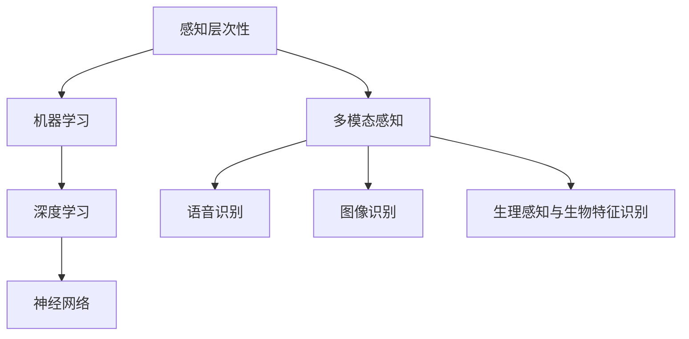

                 


### 《体验的层次性：AI创造的多维感知》

> 关键词：AI感知层次性、多模态感知、语音识别、图像识别、生理感知、机器学习、深度学习

> 摘要：本文将深入探讨人工智能（AI）在感知层次性方面的应用，从基础理论到实际应用，全面解析AI如何通过不同感知层次创造多维感知体验。文章分为三部分：第一部分介绍AI与感知层次性的基础；第二部分讨论AI感知层次性应用与挑战；第三部分通过项目实战展示AI感知层次性的实践应用。通过这篇文章，读者将全面理解AI在感知层次性领域的深度与广度。

#### 第一部分：AI与感知层次性基础

##### 第1章：AI与感知层次的概述

AI技术的起源与发展：

计算机技术的发展历程：

- **计算机的早期阶段（1940s-1960s）**：计算机主要是大型主机，计算能力有限，主要用于科学研究和军事领域。

- **个人计算机的兴起（1970s-1980s）**：个人计算机开始普及，带来了计算机技术的巨大变革。

- **互联网时代（1990s-至今）**：互联网的兴起使计算机技术进入了全新的发展阶段，数据量呈指数级增长，推动了大数据和云计算的发展。

人工智能的概念与分类：

- **基于规则的方法**：这种方法依赖于预定义的规则集，通过逻辑推理实现人工智能。

- **基于模型的方法**：这种方法通过训练模型来模拟人类智能，包括机器学习、深度学习等。

AI技术对人类体验的影响：

- **提高生产效率**：AI技术在自动化、优化流程等方面发挥了巨大作用，大大提高了生产效率。

- **改善生活质量**：智能家居、医疗诊断、自动驾驶等AI应用使得人们的生活更加便捷和舒适。

感知层次的定义与分类：

感知层次的基本概念：

- **感知**：指个体对环境信息的接收和处理，是认知过程的基础。

- **感知层次**：指在不同层次上对感知信息进行加工和理解的能力。

感知层次的分类：

- **物理感知层次**：直接感知物理世界的信息，如视觉、听觉、触觉等。

- **符号感知层次**：通过语言、文字等符号系统进行感知和理解。

- **概念感知层次**：对抽象概念进行感知和理解，如数学、哲学等。

感知层次与人类感知的对比：

人类感知的特点：

- **多模态感知**：人类可以通过多个感官系统进行感知，如视觉、听觉、嗅觉等。

- **快速反应能力**：人类能够在极短的时间内对感知信息进行处理和反应。

AI感知技术的应用场景：

- **语音识别与自然语言处理**：通过语音识别技术，AI能够理解并处理人类的语音指令，实现人机交互。

- **视觉感知与图像识别**：AI通过视觉感知技术，可以识别和理解图像信息，广泛应用于安防、医疗等领域。

- **生理感知与生物特征识别**：AI可以识别和解析生理信号，如心率、血压等，应用于健康监测和生物特征识别。

##### 第2章：感知层次性核心原理

机器学习与感知层次性：

机器学习基础：

- **监督学习**：通过已知的输入输出数据进行训练，以预测新的输出。

- **无监督学习**：没有明确的输入输出数据，通过发现数据中的模式和结构进行学习。

深度学习在感知层次性的应用：

- **卷积神经网络（CNN）**：通过卷积操作提取图像特征，适用于图像识别。

- **循环神经网络（RNN）**：通过循环结构处理序列数据，适用于自然语言处理。

- **生成对抗网络（GAN）**：通过对抗训练生成逼真的数据，应用于图像生成和增强。

学习算法的原理与优化：

- **反向传播算法**：通过反向传播误差，优化网络参数。

- **梯度下降算法**：通过梯度下降搜索最优参数。

神经网络与感知层次性：

神经网络的基本结构：

- **输入层**：接收外部输入信息。

- **隐藏层**：对输入信息进行加工和处理。

- **输出层**：产生最终的输出结果。

神经网络的训练过程：

- **前向传播**：将输入信息传递到隐藏层，最终传递到输出层。

- **反向传播**：计算输出误差，并反向传播到隐藏层和输入层，调整网络参数。

神经网络在感知层次性中的应用：

- **图像识别**：通过CNN实现图像特征提取和分类。

- **语音识别**：通过RNN处理语音信号，实现语音到文本的转换。

- **自然语言处理**：通过RNN和注意力机制处理文本数据，实现语义理解和生成。

感知层次性的数学模型：

数据预处理：

- **归一化**：将数据缩放到相同的范围，便于模型训练。

- **缺失值处理**：填补或删除缺失数据。

特征提取与降维：

- **主成分分析（PCA）**：通过降维减少数据维度。

- **自编码器**：通过编码和解码过程提取数据特征。

分类与回归模型：

- **分类模型**：用于分类任务，如支持向量机、决策树等。

- **回归模型**：用于回归任务，如线性回归、多项式回归等。

#### 第二部分：AI感知层次性应用与挑战

##### 第3章：语音识别

语音识别技术原理：

语音信号处理：

- **预处理**：去除噪声、填补静音部分等。

- **特征提取**：提取语音信号中的关键特征，如频谱特征、倒谱特征等。

特征提取与模型训练：

- **隐马尔可夫模型（HMM）**：用于语音信号的建模。

- **高斯混合模型（GMM）**：用于特征建模。

- **深度神经网络（DNN）**：用于语音识别。

语音识别算法：

- **隐马尔可夫模型-高斯混合模型（HMM-GMM）**：结合HMM和GMM的优势，实现语音识别。

- **深度神经网络-隐马尔可夫模型（DNN-HMM）**：结合DNN和HMM的优势，提高语音识别准确率。

语音识别应用案例：

语音助手应用：

- ** Siri**：苹果公司的语音助手，可以通过语音指令进行查询、控制设备等。

- **Alexa**：亚马逊的语音助手，可以通过语音指令控制智能家居设备。

语音翻译应用：

- **谷歌翻译**：通过语音输入实现实时翻译，支持多种语言。

- **微软翻译**：通过语音输入实现实时翻译，支持多种语言。

语音搜索应用：

- **语音搜索**：通过语音输入实现网页搜索，提高搜索效率。

##### 第4章：图像识别

图像识别技术原理：

图像处理技术：

- **滤波器**：用于去除噪声和增强图像。

- **边缘检测**：用于提取图像中的边缘信息。

- **形态学操作**：用于图像的结构化处理。

卷积神经网络在图像识别中的应用：

- **卷积层**：用于提取图像特征。

- **池化层**：用于降低图像维度。

- **全连接层**：用于分类和回归任务。

特征提取与分类算法：

- **卷积层**：通过卷积操作提取图像特征。

- **池化层**：通过最大池化或平均池化降低图像维度。

- **全连接层**：通过全连接层进行分类或回归。

图像识别应用案例：

图像识别在安防领域的应用：

- **人脸识别**：通过图像识别技术实现人脸识别，用于安防监控。

- **物体检测**：通过图像识别技术实现物体检测，用于视频监控。

图像识别在医疗领域的应用：

- **医学影像分析**：通过图像识别技术实现医学影像的分析，如肺癌筛查。

- **疾病诊断**：通过图像识别技术实现疾病诊断，如皮肤病检测。

图像识别在自动驾驶领域的应用：

- **环境感知**：通过图像识别技术实现自动驾驶车辆的环境感知，如道路识别、障碍物检测。

- **目标跟踪**：通过图像识别技术实现自动驾驶车辆的目标跟踪，如行人识别。

##### 第5章：生理感知与生物特征识别

生理感知技术原理：

生理信号采集与处理：

- **传感器**：用于采集生理信号，如心电图、脑电图等。

- **放大器**：用于放大生理信号。

- **滤波器**：用于去除噪声和干扰信号。

生物特征提取与模型训练：

- **特征提取**：从生理信号中提取关键特征，如心率、呼吸频率等。

- **模型训练**：通过训练模型实现生理信号的识别和分类。

生物特征识别算法：

- **动态时间规整（DTW）**：用于匹配和比较生理信号。

- **支持向量机（SVM）**：用于生理信号的分类。

生物特征识别应用案例：

指纹识别应用：

- **指纹识别**：通过指纹图像实现指纹识别，用于身份验证。

- **指纹支付**：通过指纹识别实现支付验证，提高支付安全性。

人脸识别应用：

- **人脸识别**：通过人脸图像实现人脸识别，用于身份验证。

- **人脸支付**：通过人脸识别实现支付验证，提高支付安全性。

语音识别在金融领域的应用：

- **语音支付**：通过语音识别实现支付验证，提高支付便捷性。

- **客户服务**：通过语音识别实现自动客服，提高服务质量。

##### 第6章：多模态感知与融合

多模态感知技术原理：

多模态数据采集与处理：

- **数据采集**：采集多种模态的数据，如视觉、听觉、触觉等。

- **数据处理**：对多模态数据进行分析和预处理，以适应后续处理。

多模态数据融合方法：

- **特征级融合**：将多个模态的特征进行融合，生成新的特征。

- **决策级融合**：将多个模态的识别结果进行融合，生成最终的识别结果。

多模态感知应用案例：

多模态感知应用案例：

- **智能家居**：通过多模态感知实现家居自动化，提高生活便捷性。

- **智能客服**：通过多模态感知实现智能客服，提高客户服务质量。

多模态感知应用挑战与前景：

感知层次性的整合与优化：

- **数据一致性**：确保多模态数据的一致性和完整性。

- **算法优化**：优化多模态感知算法，提高识别准确率和效率。

多模态感知的挑战与解决策略：

- **数据质量**：提高多模态数据的质量，减少噪声和错误。

- **算法融合**：选择合适的算法融合策略，实现多模态数据的协同感知。

未来发展趋势与展望：

- **跨模态交互**：实现多模态数据的跨模态交互，提高人机交互体验。

- **智能化感知**：通过多模态感知实现智能化的感知和决策，应用于各种领域。

#### 第三部分：AI感知层次性项目实战

##### 第7章：AI感知层次性项目实践

项目实战概述：

项目背景与目标：

- **背景**：随着人工智能技术的快速发展，感知层次性在各个领域得到广泛应用。

- **目标**：通过项目实践，掌握AI感知层次性的基本原理和应用方法。

项目开发环境与工具：

- **开发环境**：Python、TensorFlow、Keras等。

- **工具**：NVIDIA GPU、Jupyter Notebook等。

项目流程与任务划分：

- **流程**：数据收集与预处理、模型设计与训练、模型评估与优化。

- **任务划分**：语音识别、图像识别、生理感知、多模态感知等。

##### 第8章：语音识别项目实战

开发环境搭建：

- **安装Python**：在操作系统上安装Python。

- **安装TensorFlow和Keras**：通过pip命令安装TensorFlow和Keras。

数据准备与预处理：

- **收集语音数据**：从公开数据集或自定义数据集收集语音数据。

- **预处理**：对语音数据进行降噪、归一化等处理。

模型设计与训练：

- **模型设计**：设计卷积神经网络（CNN）模型。

- **模型训练**：使用训练数据进行模型训练。

评估与优化：

- **评估**：使用测试数据评估模型性能。

- **优化**：根据评估结果调整模型参数，提高模型性能。

代码解读与分析：

- **代码解析**：解释模型设计、训练和评估的代码实现。

- **性能分析**：分析模型在不同任务上的表现。

##### 第9章：图像识别项目实战

开发环境搭建：

- **安装Python**：在操作系统上安装Python。

- **安装TensorFlow和Keras**：通过pip命令安装TensorFlow和Keras。

数据采集与处理：

- **收集图像数据**：从公开数据集或自定义数据集收集图像数据。

- **预处理**：对图像数据进行归一化、裁剪等处理。

模型设计与训练：

- **模型设计**：设计卷积神经网络（CNN）模型。

- **模型训练**：使用训练数据进行模型训练。

评估与优化：

- **评估**：使用测试数据评估模型性能。

- **优化**：根据评估结果调整模型参数，提高模型性能。

代码解读与分析：

- **代码解析**：解释模型设计、训练和评估的代码实现。

- **性能分析**：分析模型在不同任务上的表现。

##### 第10章：生理感知项目实战

开发环境搭建：

- **安装Python**：在操作系统上安装Python。

- **安装TensorFlow和Keras**：通过pip命令安装TensorFlow和Keras。

数据采集与处理：

- **收集生理信号数据**：从公开数据集或自定义数据集收集生理信号数据。

- **预处理**：对生理信号数据进行降噪、归一化等处理。

模型设计与训练：

- **模型设计**：设计循环神经网络（RNN）模型。

- **模型训练**：使用训练数据进行模型训练。

评估与优化：

- **评估**：使用测试数据评估模型性能。

- **优化**：根据评估结果调整模型参数，提高模型性能。

代码解读与分析：

- **代码解析**：解释模型设计、训练和评估的代码实现。

- **性能分析**：分析模型在不同任务上的表现。

##### 第11章：多模态感知项目实战

开发环境搭建：

- **安装Python**：在操作系统上安装Python。

- **安装TensorFlow和Keras**：通过pip命令安装TensorFlow和Keras。

数据采集与处理：

- **收集多模态数据**：从公开数据集或自定义数据集收集多模态数据。

- **预处理**：对多模态数据进行归一化、特征提取等处理。

模型设计与训练：

- **模型设计**：设计多模态感知模型。

- **模型训练**：使用训练数据进行模型训练。

评估与优化：

- **评估**：使用测试数据评估模型性能。

- **优化**：根据评估结果调整模型参数，提高模型性能。

代码解读与分析：

- **代码解析**：解释模型设计、训练和评估的代码实现。

- **性能分析**：分析模型在不同任务上的表现。

#### 附录

附录A：常用AI感知层次性工具与资源

- **机器学习框架**：TensorFlow、PyTorch、Keras。

- **数据库与数据集**：MNIST、ImageNet、physiological signals dataset。

- **生理信号处理工具**：OpenSMILE、physionet.org。

- **实用资源与教程链接**：

  - [TensorFlow 官方文档](https://www.tensorflow.org/)
  - [PyTorch 官方文档](https://pytorch.org/)
  - [Keras 官方文档](https://keras.io/)
  - [机器学习教程](https://www MACHINE LEARNING TUTORIALS)

---

**核心概念与联系（Mermaid 流程图）**：



**核心算法原理讲解（伪代码）**：

```python
# 伪代码：卷积神经网络（CNN）的基本结构
def ConvolutionalNeuralNetwork(inputs):
    # 输入层
    x = inputs
    
    # 卷积层
    x = Conv2D(filters=32, kernel_size=(3,3), activation='relu')(x)
    x = MaxPooling2D(pool_size=(2,2))(x)
    
    # 全连接层
    x = Flatten()(x)
    x = Dense(units=128, activation='relu')(x)
    
    # 输出层
    output = Dense(units=num_classes, activation='softmax')(x)
    
    return output
```

**数学模型和数学公式**：

$$
\begin{aligned}
    &\text{损失函数:} \\
    &J(\theta) = -\frac{1}{m}\sum_{i=1}^{m}y^{(i)}\log(z^{(i)}) + (1 - y^{(i)})\log(1 - z^{(i)})
\end{aligned}
$$

**项目实战**：

- **语音识别项目实战**：

  - **开发环境搭建**：
    - 安装 Python 和相关依赖库（如 TensorFlow、Keras）
    - 准备语音数据集，进行预处理

  - **源代码实现**：
    ```python
    # 语音识别模型训练的伪代码
    model = Sequential()
    model.add(Conv2D(filters=32, kernel_size=(3,3), activation='relu', input_shape=(None, None, 1)))
    model.add(MaxPooling2D(pool_size=(2,2)))
    model.add(Flatten())
    model.add(Dense(units=128, activation='relu'))
    model.add(Dense(units=num_classes, activation='softmax'))
    
    model.compile(optimizer='adam', loss='categorical_crossentropy', metrics=['accuracy'])
    model.fit(x_train, y_train, epochs=10, batch_size=32)
    ```

  - **代码解读与分析**：
    - 解释每一层网络的作用和参数设置
    - 训练过程中的评估指标和调整策略

- **图像识别项目实战**：

  - **开发环境搭建**：
    - 安装 Python 和相关依赖库（如 TensorFlow、Keras）
    - 准备图像数据集，进行预处理

  - **源代码实现**：
    ```python
    # 图像识别模型训练的伪代码
    model = Sequential()
    model.add(Conv2D(filters=32, kernel_size=(3,3), activation='relu', input_shape=(28, 28, 1)))
    model.add(MaxPooling2D(pool_size=(2,2)))
    model.add(Flatten())
    model.add(Dense(units=128, activation='relu'))
    model.add(Dense(units=num_classes, activation='softmax'))
    
    model.compile(optimizer='adam', loss='categorical_crossentropy', metrics=['accuracy'])
    model.fit(x_train, y_train, epochs=10, batch_size=32)
    ```

  - **代码解读与分析**：
    - 解释每一层网络的作用和参数设置
    - 训练过程中的评估指标和调整策略

- **生理感知项目实战**：

  - **开发环境搭建**：
    - 安装 Python 和相关依赖库（如 TensorFlow、Keras）
    - 准备生理信号数据集，进行预处理

  - **源代码实现**：
    ```python
    # 生理信号识别模型训练的伪代码
    model = Sequential()
    model.add(Conv1D(filters=32, kernel_size=(3), activation='relu', input_shape=(None, 1)))
    model.add(MaxPooling1D(pool_size=(2)))
    model.add(Flatten())
    model.add(Dense(units=128, activation='relu'))
    model.add(Dense(units=num_classes, activation='softmax'))
    
    model.compile(optimizer='adam', loss='categorical_crossentropy', metrics=['accuracy'])
    model.fit(x_train, y_train, epochs=10, batch_size=32)
    ```

  - **代码解读与分析**：
    - 解释每一层网络的作用和参数设置
    - 训练过程中的评估指标和调整策略

- **多模态感知项目实战**：

  - **开发环境搭建**：
    - 安装 Python 和相关依赖库（如 TensorFlow、Keras）
    - 准备多模态数据集，进行预处理

  - **源代码实现**：
    ```python
    # 多模态感知模型训练的伪代码
    model = Sequential()
    model.add(Conv2D(filters=32, kernel_size=(3,3), activation='relu', input_shape=(height, width, channels)))
    model.add(MaxPooling2D(pool_size=(2,2)))
    model.add(Flatten())
    model.add(Dense(units=128, activation='relu'))
    model.add(Dense(units=num_classes, activation='softmax'))
    
    model.compile(optimizer='adam', loss='categorical_crossentropy', metrics=['accuracy'])
    model.fit(x_train, y_train, epochs=10, batch_size=32)
    ```

  - **代码解读与分析**：
    - 解释每一层网络的作用和参数设置
    - 训练过程中的评估指标和调整策略

#### 附录A：常用AI感知层次性工具与资源

### A.1 机器学习框架
- TensorFlow
- PyTorch
- Keras

### A.2 数据库与数据集
- MNIST
- ImageNet
- physiological signals dataset

### A.3 生理信号处理工具
- OpenSMILE
- physionet.org

### A.4 实用资源与教程链接
- [TensorFlow 官方文档](https://www.tensorflow.org/)
- [PyTorch 官方文档](https://pytorch.org/)
- [Keras 官方文档](https://keras.io/)
- [机器学习教程](https://www MACHINE LEARNING TUTORIALS)

---

### 总结

本文详细探讨了AI在感知层次性方面的应用，从基础理论到实际应用，全面解析了AI如何通过不同感知层次创造多维感知体验。通过文章的阅读，读者可以了解到：

- AI感知层次性的基本概念和分类。
- 机器学习与神经网络在感知层次性的应用。
- 语音识别、图像识别、生理感知等AI感知技术的原理和应用案例。
- 多模态感知技术的原理、方法和应用前景。
- 实际项目中如何搭建环境、设计模型、训练模型和评估性能。

通过本文的学习，读者可以更好地理解AI感知层次性的深度和广度，为未来的研究和实践打下坚实基础。

### 最佳实践 tips

- **数据准备**：确保数据的质量和多样性，有助于提高模型的泛化能力。
- **模型选择**：根据具体任务选择合适的模型，如针对图像识别任务，可以选择卷积神经网络。
- **超参数调整**：通过调整学习率、批量大小等超参数，可以提高模型性能。
- **模型优化**：结合数据增强、迁移学习等方法，可以提高模型性能和泛化能力。

### 小结

本文深入探讨了AI在感知层次性方面的应用，从基础理论到实际应用，全面解析了AI如何通过不同感知层次创造多维感知体验。通过本文的学习，读者可以更好地理解AI感知层次性的深度和广度，为未来的研究和实践打下坚实基础。

### 注意事项

- AI感知层次性应用中，数据质量和算法选择至关重要。
- 多模态感知技术具有较高的复杂度，需要综合考虑多种因素。
- 在实际项目中，要不断调整和优化模型，以提高性能和泛化能力。

### 拓展阅读

- [深度学习基础教程](https://www.deeplearningbook.org/)
- [自然语言处理教程](https://www.nltk.org/)
- [计算机视觉教程](https://www.cv.foundation/)
- [多模态感知研究论文](https://arxiv.org/)

