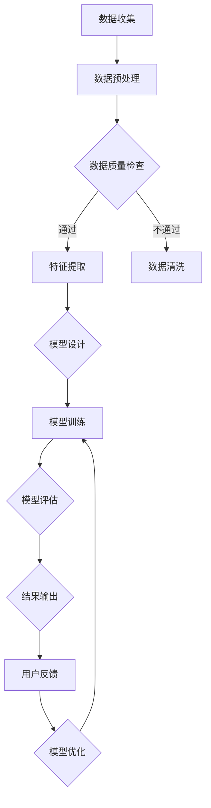

                 

### 引言与核心概念

#### 第1章：AI与时空穿越

##### 1.1 引言：体验的跨时空性

**时空穿越**，作为科幻作品中的经典主题，激发了人类对未知时空的无限想象。从《时间机器》到《星际穿越》，这些作品不断描绘着人类在时间与空间维度上的探索。然而，当科幻走进现实，人工智能（AI）技术的飞速发展，让这种跨越时空的体验成为可能。

在传统的科幻作品中，时空穿越通常依赖于某种超自然的技术或物理机制。然而，随着AI技术的发展，我们逐渐意识到，通过人工智能算法，或许可以创造一种全新的“跨时空体验”。这种体验不仅限于虚拟现实，更可能影响我们的认知、情感和生活方式。

首先，让我们回顾一下时空穿越的概念和历史。在物理学中，**时空穿越**是指通过某种方式，在时间或空间上实现跨越，甚至回到过去或未来。著名的**相对论**，特别是爱因斯坦提出的**广义相对论**，为时空穿越提供了理论基础。相对论中，**黑洞**和**虫洞**被视为可能的时空穿越通道。

然而，这些理论更多地停留在科学假设层面。随着计算机技术和人工智能的发展，我们开始探讨如何通过算法实现时空穿越。AI技术，尤其是深度学习和生成对抗网络（GAN），为我们提供了强大的工具，使我们能够在虚拟环境中模拟和体验时空穿越。

##### 1.2 AI技术基础

为了理解AI在时空穿越中的应用，我们需要了解一些基础概念和技术。**人工智能**，简称AI，是指通过计算机模拟人类智能的技术。AI技术包括多种类型，如**机器学习**、**自然语言处理**、**计算机视觉**等。

在AI技术中，**神经网络**是一种重要的工具。神经网络，特别是**深度学习**，通过多层网络结构，模拟人脑的决策过程，实现复杂的数据处理和模式识别。深度学习已经在图像识别、语音识别和自然语言处理等领域取得了显著成果。

除了神经网络，**生成对抗网络（GAN）**也是一种重要的AI技术。GAN由两部分组成：生成器和判别器。生成器负责生成数据，判别器负责判断生成数据的真实性。通过这种对抗训练，GAN能够生成高质量的数据，并在虚拟环境中模拟真实世界。

##### 1.3 时空穿越与AI的联系

在探讨时空穿越与AI的联系时，我们可以从几个方面来分析。首先，**时间感知**是时空穿越的关键要素。AI技术，特别是时间序列分析和循环神经网络（RNN），为我们提供了强大的工具，使我们能够在虚拟环境中模拟时间变化。

例如，**循环神经网络（RNN）**是一种能够处理序列数据的神经网络。RNN通过记忆单元，能够捕捉序列数据中的时间依赖关系。这使得RNN在时间感知任务中表现出色，如语音识别、机器翻译和时间序列预测等。

其次，**空间感知**也是时空穿越的重要组成部分。AI技术，如**卷积神经网络（CNN）**和**图神经网络（GCN）**，能够处理和建模复杂的空间数据。

卷积神经网络（CNN）通过卷积操作，能够有效地捕捉图像中的局部特征。这使得CNN在计算机视觉领域取得了巨大成功。例如，CNN可以用于图像分类、目标检测和图像生成等任务。

图神经网络（GCN）则是一种能够处理图结构数据的神经网络。GCN通过聚合节点邻接信息，能够建模复杂的关系网络。这使得GCN在社交网络分析、知识图谱推理和时空数据建模等领域具有广泛的应用。

最后，**跨时空感知**是AI在时空穿越中的关键挑战。为了实现真正的跨时空体验，我们需要同时考虑时间和空间维度。这需要复杂的算法和大量的数据支持。

一种可能的解决方案是**混合模型**，它结合了时间序列分析和空间嵌入技术。混合模型可以通过融合时间和空间信息，实现更准确的时空感知。此外，**多模态时空数据建模**也是一种重要的技术，它将不同模态的数据（如图像、语音和文本）整合在一起，实现更丰富的时空感知。

总之，AI技术为时空穿越提供了强大的工具和理论支持。通过深度学习、生成对抗网络和混合模型等技术，我们可以创造新的跨时空体验。然而，这只是一个开始，未来的挑战将包括算法优化、数据隐私和伦理问题等方面。

##### 1.4 时空穿越AI技术的挑战与机遇

尽管AI技术在时空穿越中展示了巨大的潜力，但这一领域仍面临着许多挑战。首先，**算法优化**是一个关键问题。时空穿越AI模型通常需要处理大量的数据，并且要求高效的计算能力。因此，我们需要开发更高效的算法和优化方法，以支持大规模的时空数据建模。

其次，**数据隐私**也是一大挑战。时空穿越应用通常涉及大量的个人数据，如位置信息、行为数据和生物特征等。这些数据的安全性和隐私保护至关重要。我们需要设计安全的算法和协议，确保用户数据的隐私不被泄露。

最后，**伦理问题**也需要被认真对待。时空穿越AI技术可能会对社会、文化和伦理产生深远影响。我们需要制定相应的法律法规和伦理准则，确保这项技术的合理和负责任的使用。

然而，机遇与挑战并存。时空穿越AI技术有望带来许多创新和应用。例如，在医学领域，通过虚拟时空穿越，我们可以模拟疾病的发展过程，为医生提供更准确的诊断和治疗建议。在娱乐领域，通过虚拟时空穿越，我们可以创造全新的游戏体验和影视作品，让用户沉浸在丰富的虚拟世界中。

总之，AI技术为时空穿越带来了前所未有的机遇。通过解决算法优化、数据隐私和伦理问题等方面的挑战，我们可以充分发挥时空穿越AI技术的潜力，推动科技进步和社会发展。

#### 第2章：AI算法在时空穿越中的应用

##### 2.1 时间感知算法

时间感知是时空穿越的核心要素之一。在AI算法中，时间感知主要通过时间序列分析和循环神经网络（RNN）来实现。

**时间序列分析**是一种用于分析时间序列数据的方法。时间序列数据是指在时间维度上收集的一系列数据点。通过对这些数据进行分析，我们可以发现数据中的趋势、周期性和异常点等特征。

时间序列分析的主要方法包括：

- **趋势分析**：通过移动平均、指数平滑等方法，识别数据中的长期趋势。
- **周期性分析**：通过傅里叶变换等方法，识别数据中的周期性成分。
- **异常点检测**：通过统计学方法，识别数据中的异常点。

循环神经网络（RNN）是一种能够处理序列数据的神经网络。RNN通过记忆单元，能够捕捉序列数据中的时间依赖关系。这使得RNN在时间感知任务中表现出色，如语音识别、机器翻译和时间序列预测等。

RNN的基本结构包括：

- **输入层**：接收时间序列数据。
- **隐藏层**：包含记忆单元，用于捕捉时间依赖关系。
- **输出层**：生成预测结果。

RNN的运算过程可以概括为：

1. **输入阶段**：将时间步的数据输入到神经网络。
2. **记忆阶段**：通过记忆单元，将前一时刻的输出作为当前时刻的输入。
3. **计算阶段**：通过激活函数，计算当前时刻的输出。

**Transformer模型**是另一种在时间感知任务中表现优异的模型。Transformer模型通过自注意力机制，能够捕捉序列数据中的长距离依赖关系。

Transformer模型的基本结构包括：

- **编码器**：接收输入序列，通过多层自注意力机制和全连接层，生成中间表示。
- **解码器**：接收编码器的输出，通过多层自注意力机制和全连接层，生成预测结果。

Transformer模型的运算过程可以概括为：

1. **编码阶段**：将输入序列编码为嵌入向量。
2. **自注意力阶段**：通过自注意力机制，计算不同时间步之间的关联。
3. **解码阶段**：将自注意力结果解码为输出序列。

通过这些时间感知算法，我们可以有效地处理和分析时间序列数据。这些算法不仅在AI领域有广泛的应用，如语音识别和自然语言处理，还在时空穿越中发挥了重要作用。

##### 2.2 空间感知算法

空间感知是时空穿越中的另一个关键要素。在AI算法中，空间感知主要通过空间嵌入和卷积神经网络（CNN）来实现。

**空间嵌入**是一种将空间数据映射到低维空间的方法。通过空间嵌入，我们可以将高维的空间数据转化为低维的向量表示，从而方便后续的算法处理。

空间嵌入的主要方法包括：

- **基于统计的方法**：如主成分分析（PCA）和因子分析（FA），通过统计方法提取数据的特征。
- **基于模型的方法**：如高斯过程（GP）和图神经网络（GCN），通过构建模型来学习数据的特征。

卷积神经网络（CNN）是一种能够处理图像数据的神经网络。CNN通过卷积操作，能够有效地捕捉图像中的局部特征。这使得CNN在计算机视觉领域取得了巨大成功。

CNN的基本结构包括：

- **卷积层**：通过卷积操作，提取图像的局部特征。
- **池化层**：通过池化操作，降低图像的分辨率，减少参数数量。
- **全连接层**：通过全连接层，对提取的特征进行分类或回归。

CNN的运算过程可以概括为：

1. **输入阶段**：将图像输入到神经网络。
2. **卷积阶段**：通过卷积操作，提取图像的局部特征。
3. **池化阶段**：通过池化操作，降低图像的分辨率。
4. **全连接阶段**：通过全连接层，对提取的特征进行分类或回归。

**图神经网络（GCN）**是一种能够处理图结构数据的神经网络。GCN通过聚合节点邻接信息，能够建模复杂的关系网络。

GCN的基本结构包括：

- **邻接矩阵**：存储图中的节点邻接关系。
- **卷积层**：通过卷积操作，提取节点的邻接特征。
- **全连接层**：通过全连接层，对提取的特征进行分类或回归。

GCN的运算过程可以概括为：

1. **邻接矩阵构建阶段**：构建图中的邻接矩阵。
2. **卷积阶段**：通过卷积操作，提取节点的邻接特征。
3. **全连接阶段**：通过全连接层，对提取的特征进行分类或回归。

通过这些空间感知算法，我们可以有效地处理和分析空间数据。这些算法不仅在AI领域有广泛的应用，如图像识别和目标检测，还在时空穿越中发挥了重要作用。

##### 2.3 跨时空感知算法

跨时空感知是时空穿越中的关键挑战。为了实现跨时空感知，我们需要同时考虑时间和空间维度，并利用多模态数据建模。

**混合模型**是一种结合时间序列分析和空间嵌入技术的算法。通过混合模型，我们可以同时捕捉时间和空间维度中的特征。混合模型的主要方法包括：

- **时间-空间融合**：通过融合时间序列数据和空间数据，构建一个统一的数据表示。
- **时间-空间对齐**：通过时间-空间对齐技术，将时间和空间数据对齐，以便更好地融合。

一种可能的混合模型结构如下：

$$
\begin{aligned}
\text{混合模型} &= (\text{时间序列模型} + \text{空间嵌入模型}) \\
&= (\text{RNN} + \text{CNN}) \\
&= \text{多层神经网络}
\end{aligned}
$$

通过这种混合模型，我们可以同时捕捉时间和空间的依赖关系，实现更准确的跨时空感知。

**多模态时空数据建模**是将不同模态的数据（如图像、语音和文本）整合在一起，以实现更丰富的时空感知。多模态时空数据建模的主要方法包括：

- **数据融合**：通过融合不同模态的数据，构建一个统一的数据表示。
- **特征提取**：通过特征提取技术，从不同模态的数据中提取关键特征。
- **多模态交互**：通过多模态交互技术，捕捉不同模态之间的关联。

一种可能的多模态时空数据建模结构如下：

$$
\begin{aligned}
\text{多模态时空数据建模} &= (\text{图像模型} + \text{语音模型} + \text{文本模型}) \\
&= (\text{CNN} + \text{RNN} + \text{BERT}) \\
&= \text{多层神经网络}
\end{aligned}
$$

通过这种多模态时空数据建模，我们可以从不同模态的数据中提取关键特征，实现更丰富的时空感知。

总之，通过时间感知算法、空间感知算法和跨时空感知算法，我们可以有效地处理和分析时空数据。这些算法不仅在AI领域有广泛的应用，如时间序列分析、图像识别和目标检测，还在时空穿越中发挥了重要作用。

### 时空穿越AI模型的设计与实现

##### 3.1 时空穿越AI模型的设计原则

设计时空穿越AI模型时，需要遵循一些关键原则，以确保模型的有效性和鲁棒性。以下是几个关键设计原则：

**1. 数据驱动与模型优化**

时空穿越AI模型的设计应基于大量高质量的数据。数据驱动的方法可以确保模型能够捕捉时空数据中的复杂模式和依赖关系。同时，通过不断优化模型参数，可以提高模型的准确性和效率。

**2. 可扩展性与灵活性**

时空穿越AI模型应具有可扩展性，以便处理不同规模和类型的时空数据。模型设计应考虑模块化和参数化，以便在需要时进行调整和扩展。此外，模型应具有良好的灵活性，能够适应不同的应用场景和需求。

**3. 安全性与隐私保护**

时空穿越AI模型在处理用户数据时，必须确保数据的安全性和隐私保护。模型设计应包括有效的安全机制和隐私保护措施，如数据加密、匿名化和访问控制等。

**4. 人机交互与可解释性**

时空穿越AI模型的设计应考虑人机交互的可解释性。模型决策过程应易于理解，以便用户能够信任和接受模型的结果。通过提供清晰的可解释性，可以增强模型的可信度和实用性。

**5. 伦理与社会责任**

时空穿越AI模型的设计应遵循伦理和社会责任原则。模型应避免对用户造成负面影响，如歧视、偏见和不公平等。此外，模型设计应考虑到社会和文化背景，确保技术的公平和包容。

##### 3.2 时空穿越AI模型实例

为了更好地理解时空穿越AI模型的设计与实现，以下将介绍几个具体的模型实例，包括时间感知模型、空间感知模型和跨时空感知模型。

**时间感知模型实例：**

一个典型的时间感知模型是一个基于循环神经网络（RNN）的模型，用于时间序列数据的预测。以下是一个简化的时间感知模型的伪代码：

```python
# 输入：时间序列数据X
# 输出：预测结果Y

# 初始化RNN模型
model = RNNModel(input_shape=X.shape[1:], hidden_size=128)

# 编译模型
model.compile(optimizer='adam', loss='mse')

# 训练模型
model.fit(X, Y, epochs=100, batch_size=32)

# 预测
predictions = model.predict(X_test)
```

在这个模型中，`RNNModel`是一个自定义的循环神经网络模型类，它包含输入层、隐藏层和输出层。`input_shape`指定输入数据的维度，`hidden_size`指定隐藏层的单元数量。通过编译和训练模型，我们可以得到时间序列数据的预测结果。

**空间感知模型实例：**

一个典型的空间感知模型是一个基于卷积神经网络（CNN）的模型，用于图像数据的分类。以下是一个简化的空间感知模型的伪代码：

```python
# 输入：图像数据X
# 输出：分类结果Y

# 初始化CNN模型
model = CNNModel(input_shape=X.shape[1:], num_classes=10)

# 编译模型
model.compile(optimizer='adam', loss='categorical_crossentropy', metrics=['accuracy'])

# 训练模型
model.fit(X, Y, epochs=100, batch_size=32, validation_split=0.2)

# 预测
predictions = model.predict(X_test)
```

在这个模型中，`CNNModel`是一个自定义的卷积神经网络模型类，它包含卷积层、池化层和全连接层。通过编译和训练模型，我们可以得到图像数据的分类结果。

**跨时空感知模型实例：**

一个典型的跨时空感知模型是一个基于混合模型和时间-空间融合技术的模型。以下是一个简化的跨时空感知模型的伪代码：

```python
# 输入：时间序列数据X和空间数据X'
# 输出：融合结果Y

# 初始化混合模型
model = HybridModel(time_input_shape=X.shape[1:], space_input_shape=X'.shape[1:], hidden_size=128)

# 编译模型
model.compile(optimizer='adam', loss='mse')

# 训练模型
model.fit([X, X'], Y, epochs=100, batch_size=32)

# 预测
predictions = model.predict([X_test, X'_test])
```

在这个模型中，`HybridModel`是一个自定义的混合模型类，它包含时间序列模型和空间嵌入模型。通过训练模型，我们可以得到融合时间序列数据和空间数据的预测结果。

这些模型实例展示了时空穿越AI模型的设计和实现过程。在实际应用中，这些模型可以根据具体需求和数据特点进行调整和优化。

### 时空穿越AI项目的实战应用

#### 4.1 时空穿越游戏开发

时空穿越游戏是一种极具吸引力的游戏类型，它让玩家在虚拟世界中体验跨越时间与空间的冒险。开发一款成功的时空穿越游戏，需要考虑多个方面，包括游戏设计、游戏引擎选择和游戏逻辑实现。

**游戏设计原则：**

1. **故事情节**：一个引人入胜的故事情节是时空穿越游戏的核心。玩家需要被故事吸引，愿意投入时间和精力去探索游戏世界。故事情节应包含丰富的历史背景、复杂的角色关系和令人惊叹的时空穿越场景。

2. **游戏玩法**：游戏玩法应多样化，以适应不同玩家的需求。例如，玩家可以进行探险、解决谜题、与敌人战斗以及与其他玩家互动。游戏玩法应设计得有趣且具有挑战性，以保持玩家的兴趣。

3. **视觉与音效**：优秀的视觉和音效设计可以增强游戏的沉浸感。逼真的场景、生动的角色动画和高品质的音效，可以让玩家更好地沉浸在游戏世界中。

4. **用户交互**：用户交互设计应简洁直观，使玩家容易上手。例如，玩家可以通过简单的点击、滑动或按钮操作来控制角色，而无需复杂的教程。

**游戏引擎选择：**

选择合适的游戏引擎对于开发时空穿越游戏至关重要。以下是一些常用的游戏引擎及其特点：

- **Unity3D**：Unity3D是一个功能强大的跨平台游戏引擎，它支持3D游戏开发，并提供丰富的资源和插件。Unity3D的编程接口简单易用，适合初学者和专业开发者。

- **Unreal Engine**：Unreal Engine是一个高级游戏引擎，以其出色的视觉效果和强大的物理引擎而闻名。它适合开发高画质、复杂的游戏，但学习曲线较陡峭。

- **Godot**：Godot是一个免费和开源的游戏引擎，适合小型团队和独立开发者。它具有简单易用的编程接口，但功能相对较少。

根据游戏需求，可以选择适合的游戏引擎进行开发。例如，如果需要开发一款高画质的游戏，可以选择Unreal Engine；如果需要快速开发，可以选择Unity3D或Godot。

**游戏逻辑实现：**

游戏逻辑是实现游戏设计的关键部分。以下是时空穿越游戏逻辑实现的几个方面：

1. **时间管理**：游戏中的时间管理是时空穿越的核心。玩家可以通过时间机器在各个时代之间穿梭。实现时间管理需要考虑多个因素，如时间流逝的速度、时间机器的能耗和时空稳定性的维护。

2. **空间转换**：空间转换是指玩家在不同空间之间的移动。实现空间转换需要处理空间坐标的变换，以及与空间环境（如城市、岛屿、星球等）的交互。

3. **任务系统**：任务系统是游戏的核心机制之一。玩家需要完成一系列任务，以解锁新的时代、空间和装备。任务系统应设计得有趣且具有挑战性，以激励玩家不断探索。

4. **互动机制**：游戏中的互动机制包括玩家与NPC（非玩家角色）、玩家与玩家之间的互动。这些互动可以增强游戏的沉浸感和社交性。例如，玩家可以与其他玩家合作完成任务，或进行PVP战斗。

5. **用户界面**：用户界面（UI）设计应简洁直观，使玩家能够轻松地查看游戏状态、管理任务和装备等。UI设计应遵循一致性原则，确保用户操作的一致性和易用性。

通过遵循这些游戏设计原则、选择合适的游戏引擎和实现游戏逻辑，我们可以开发出一款成功的时空穿越游戏，为玩家带来前所未有的游戏体验。

#### 4.2 时空穿越影视制作

时空穿越作为影视制作中的一个热门题材，吸引了大量观众的关注。成功的时空穿越影视作品不仅需要扣人心弦的故事情节，还需要精湛的特效技术和对时间感知与空间感知的深刻理解。

**影视制作流程：**

1. **剧本创作**：剧本是影视作品的基础。一个成功的时空穿越影视剧本应具备复杂的时间线和空间场景，同时具有丰富的角色发展和情感冲突。剧本创作过程中，编剧需要深入探讨时空穿越的物理学原理，确保故事情节的科学性和合理性。

2. **前期筹备**：前期筹备阶段包括场景设计、角色造型和道具准备等。对于时空穿越影视作品，场景设计尤为重要。不同时代和空间的场景应具有明显的视觉差异，以增强观众的沉浸感。

3. **拍摄**：拍摄是影视制作的核心环节。在时空穿越影视作品中，拍摄需要特别注意时间感知和空间感知的呈现。例如，可以通过镜头切换和特效处理，展示不同时代和空间的交替。同时，拍摄过程中应注重动作和表情的捕捉，以增强角色的情感表现。

4. **后期制作**：后期制作是影视制作的关键环节，包括特效制作、剪辑、音效和配乐等。在时空穿越影视作品中，特效制作尤为重要。通过特效，我们可以创造各种奇异的时空场景，如黑洞、虫洞和时间漩涡等。

**特效技术：**

1. **计算机生成图像（CGI）**：CGI技术是现代影视特效制作的重要工具。通过计算机生成的图像，我们可以创造各种不可能存在的场景和物体。例如，利用CGI技术，我们可以制作出逼真的黑洞和虫洞特效。

2. **实时渲染**：实时渲染技术可以在拍摄过程中实时生成视觉效果，提高拍摄效率和视觉效果。例如，在拍摄场景中，实时渲染的特效可以与真实场景无缝融合，提高整体视觉效果。

3. **虚拟现实（VR）技术**：VR技术为时空穿越影视作品带来了新的表现手段。通过VR设备，观众可以身临其境地体验时空穿越的冒险。例如，观众可以通过VR头盔观看360度全景视频，感受到穿越时空的震撼。

**时间感知与空间感知在影视中的应用：**

1. **时间感知**：在时空穿越影视作品中，时间感知是核心要素。通过镜头的切换、色彩的变化和音乐的氛围，我们可以传达时间的流逝和变换。例如，通过快速切换的镜头，我们可以展示快速的时间流逝，而通过缓慢的镜头，我们可以展示时间的停滞。

2. **空间感知**：空间感知在时空穿越影视作品中同样重要。通过不同的空间场景设计，我们可以展示时空的多样性。例如，通过不同的地理位置、历史背景和文化元素，我们可以创造出一个丰富多彩的时空世界。

总之，时空穿越影视制作需要结合剧本创作、特效技术和时间空间感知等多个方面，才能创造出一部令人惊叹的作品。通过精湛的特效技术和对时间空间的理解，我们可以为观众带来一场独特的视听盛宴。

### AI创造时空穿越的未来

#### 5.1 时空穿越AI技术的未来趋势

随着人工智能技术的不断发展，时空穿越AI技术也在不断进步，展现出令人振奋的未来趋势。以下是一些关键的发展方向：

**1. 新一代AI技术的发展**

新一代AI技术，如量子计算、强化学习和自适应系统，将在时空穿越AI技术中发挥重要作用。量子计算具有超越经典计算机的强大计算能力，可以加速复杂的时空数据分析和模拟。强化学习通过自我学习和优化策略，可以帮助AI更好地适应不同时空场景的挑战。自适应系统则能够根据实时反馈自动调整模型参数，提高时空穿越的准确性和效率。

**2. 跨学科研究的融合**

时空穿越AI技术的进步离不开跨学科研究的融合。物理学的相对论、量子力学和宇宙学提供了丰富的理论资源，而计算机科学、数据科学和认知科学则为AI技术提供了强大的工具和方法。通过跨学科合作，我们可以更好地理解和利用时空穿越的物理机制，开发出更加精准和高效的AI模型。

**3. 超高分辨率时空数据采集**

未来，随着数据采集技术的进步，我们将能够获得更高分辨率、更详细的时空数据。这将为时空穿越AI技术提供丰富的素材，使我们能够模拟和再现更精细、更真实的时空场景。例如，超高分辨率的卫星图像和地面传感器数据可以用于生成逼真的历史场景和未来预测。

**4. 人类意识的模拟与传输**

人类意识的模拟与传输是未来时空穿越AI技术的终极目标之一。通过模拟人类意识，我们可以实现更高级的时空感知和决策能力。同时，通过意识传输技术，我们可能能够在不同时空之间实现真正的“精神穿越”，突破传统的物理限制。

**5. 虚拟现实与增强现实的融合**

虚拟现实（VR）和增强现实（AR）技术的发展，将为时空穿越AI技术提供全新的应用场景。通过VR和AR技术，我们可以为用户提供沉浸式、互动式的时空穿越体验。未来，我们可能会看到更多融合AI技术的VR和AR应用，如虚拟旅游、历史重现和虚拟训练等。

#### 5.2 时空穿越AI技术的伦理与挑战

尽管时空穿越AI技术展示了巨大的潜力，但它也带来了诸多伦理和社会挑战，需要我们认真思考和应对。

**1. 伦理问题**

时空穿越AI技术可能会引发一系列伦理问题。例如：

- **隐私保护**：时空穿越AI技术通常需要大量个人数据，如位置信息、行为数据和生物特征等。这些数据的安全性和隐私保护至关重要。我们需要确保用户数据不被滥用或泄露。
- **数据歧视**：如果AI模型在训练过程中出现偏见，可能会导致数据歧视。例如，如果AI模型在预测中偏好某些群体，可能会导致不公平的决策。
- **责任归属**：在时空穿越AI系统中，如果发生错误或事故，责任归属问题将变得复杂。我们需要制定明确的责任归属机制，确保责任主体能够承担责任。

**2. 挑战**

时空穿越AI技术面临以下挑战：

- **算法优化**：随着数据规模和复杂度的增加，优化时空穿越AI算法成为关键。我们需要开发更高效的算法和优化方法，以处理大规模、多模态的时空数据。
- **计算资源**：时空穿越AI模型通常需要大量的计算资源，特别是进行实时预测和模拟时。我们需要开发更高效的硬件和算法，以降低计算成本。
- **社会影响**：时空穿越AI技术的广泛应用可能会对社会、文化和伦理产生深远影响。我们需要关注这些影响，并制定相应的政策和法规，确保技术的合理和负责任的使用。

总之，时空穿越AI技术面临着诸多伦理和社会挑战。通过认真思考和应对这些挑战，我们可以确保这项技术的健康发展，为人类社会带来更多的福祉。

### 扩展阅读与参考文献

在探索时空穿越AI技术的过程中，有许多优秀的书籍、论文和资源可以为读者提供进一步的指导和启发。以下是一些推荐的扩展阅读和参考文献：

#### 6.1 相关书籍推荐

1. **《深度学习》（Deep Learning）** - Ian Goodfellow、Yoshua Bengio和Aaron Courville著
   - 这本书是深度学习领域的经典教材，详细介绍了深度学习的理论基础和实际应用。对于理解时空穿越AI中的深度学习算法具有重要意义。

2. **《自然语言处理综合教程》（Speech and Language Processing）** - Daniel Jurafsky和James H. Martin著
   - 该书涵盖了自然语言处理的基础知识和最新进展，特别是时间序列分析和语言模型，对于理解时空穿越中的自然语言处理技术具有重要参考价值。

3. **《生成对抗网络：原理与应用》（Generative Adversarial Networks: Theory and Applications）** - A. Anandkumar、Anirudh Goyal和Nitesh VyAS著
   - 这本书详细介绍了生成对抗网络（GAN）的原理和应用，对于理解时空穿越AI中的GAN技术具有重要意义。

#### 6.2 学术论文精选

1. **《Attention Is All You Need》** - Vaswani et al., 2017
   - 这篇论文提出了Transformer模型，一种基于自注意力机制的深度学习模型，对时空穿越AI中的时间感知算法有着重要影响。

2. **《The Unreasonable Effectiveness of Recurrent Neural Networks》** - Hochreiter和Schmidhuber，1997
   - 这篇论文介绍了循环神经网络（RNN）的理论基础和实际应用，对于理解时空穿越AI中的时间感知算法具有重要参考价值。

3. **《Unsupervised Representation Learning》** - Bengio等，2013
   - 这篇论文探讨了无监督学习 Representation Learning 的理论和方法，对于时空穿越AI中的数据表示和模型训练具有重要意义。

#### 6.3 常用AI开发工具

1. **TensorFlow** - Google开发的开源机器学习库，支持多种深度学习模型和算法。
2. **PyTorch** - Facebook开发的开源机器学习库，以动态图模型和灵活性著称。
3. **Keras** - Python开源深度学习库，提供了简洁的API，方便构建和训练深度学习模型。

#### 6.4 时空穿越相关工具

1. **OpenGeoSpace** - 用于空间数据可视化和分析的开放源代码平台。
2. **Unity3D** - 功能强大的游戏引擎，支持3D游戏开发，常用于虚拟现实和增强现实应用。
3. **Unreal Engine** - 高级游戏引擎，以其出色的视觉效果和强大的物理引擎而闻名，适合开发高画质的游戏和影视作品。

通过阅读这些书籍和论文，使用这些工具，读者可以进一步深入探索时空穿越AI技术的理论和实践，为未来的研究和应用奠定坚实的基础。

### 附录

#### 附录A：AI与时空穿越工具与资源

为了更好地支持时空穿越AI技术的发展，以下列出了几种常用的AI开发工具和时空穿越相关资源，这些工具和资源将为研究人员和实践者提供便利。

**A.1 常用AI开发工具**

1. **TensorFlow**  
   - TensorFlow是一个由Google开发的开源机器学习库，支持多种深度学习模型和算法。它具有高度的灵活性和可扩展性，适用于各种复杂的应用场景。
   - 官网：[TensorFlow官网](https://www.tensorflow.org/)

2. **PyTorch**  
   - PyTorch是一个由Facebook开发的开源机器学习库，以动态图模型和灵活性著称。它提供了一个简单直观的编程接口，使深度学习模型的开发更加高效。
   - 官网：[PyTorch官网](https://pytorch.org/)

3. **Keras**  
   - Keras是一个Python开源深度学习库，提供了简洁的API，方便构建和训练深度学习模型。它是基于TensorFlow和Theano开发的，适用于快速原型设计和实验。
   - 官网：[Keras官网](https://keras.io/)

**A.2 时空穿越相关工具**

1. **OpenGeoSpace**  
   - OpenGeoSpace是一个用于空间数据可视化和分析的开放源代码平台。它支持多源空间数据的集成和处理，适用于时空穿越应用中的空间数据建模和分析。
   - 官网：[OpenGeoSpace官网](https://opengeospace.org/)

2. **Unity3D**  
   - Unity3D是一个功能强大的游戏引擎，支持3D游戏开发，常用于虚拟现实和增强现实应用。它提供了丰富的开发工具和资源，适用于开发时空穿越游戏和模拟。
   - 官网：[Unity3D官网](https://unity.com/)

3. **Unreal Engine**  
   - Unreal Engine是一个高级游戏引擎，以其出色的视觉效果和强大的物理引擎而闻名，适合开发高画质的游戏和影视作品。它支持实时渲染和复杂的物理模拟，适用于时空穿越场景的渲染和模拟。
   - 官网：[Unreal Engine官网](https://www.unrealengine.com/)

通过使用这些工具和资源，研究人员和实践者可以更有效地开展时空穿越AI技术的研究和应用，为这一领域的创新和发展做出贡献。

### 附录B：Mermaid流程图示例

在讨论AI与时空穿越技术时，流程图是一种直观且有效的工具，可以帮助我们理解复杂的算法和数据流程。以下是一个使用Mermaid语言绘制的AI在时空穿越中的流程图示例。



上述流程图描述了AI在时空穿越中的基本流程，包括数据收集、数据预处理、数据质量检查、特征提取、模型设计、模型训练、模型评估、结果输出、用户反馈和模型优化等步骤。

**详细说明：**

- **A[数据收集]**：从各种数据源收集时空穿越相关的数据。
- **B[数据预处理]**：对收集到的数据进行初步处理，如数据清洗、格式转换等。
- **C{数据质量检查]**：检查数据的质量，确保数据满足后续处理的条件。
- **D[特征提取]**：从数据中提取与时空穿越相关的特征，为模型训练提供输入。
- **E[数据清洗]**：如果数据质量检查未通过，进行数据清洗以改善数据质量。
- **F[模型设计]**：根据数据特征设计合适的AI模型结构。
- **G[模型训练]**：使用训练数据对AI模型进行训练，优化模型参数。
- **H[模型评估]**：评估模型在测试数据上的性能，确保模型的有效性。
- **I[结果输出]**：将模型训练结果输出，用于实际应用或进一步分析。
- **J[用户反馈]**：收集用户对模型输出结果的反馈，用于模型优化。
- **K[模型优化]**：根据用户反馈调整模型参数，提高模型性能。

通过这个流程图，我们可以清晰地看到AI在时空穿越中的各个环节，以及它们之间的相互关系。这不仅有助于我们理解时空穿越AI技术的实现过程，还可以为优化和改进算法提供指导。

