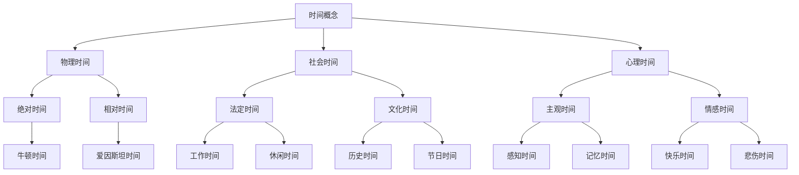

                 

### 文章标题：元宇宙中的时间概念：打破物理局限的新认知

#### 关键词：元宇宙、时间概念、物理局限、新认知、人工智能

> 摘要：本文探讨了元宇宙中的时间概念，分析了时间在元宇宙中的独特表现和作用。通过对时间的哲学思考、科学探讨、信息理论分析，本文揭示了元宇宙时间概念的本质，探讨了其在元宇宙中的具体应用。同时，本文也对元宇宙时间概念的未来展望和挑战进行了深入剖析。

## 第一部分：时间概念的哲学与科学探讨

### 第1章：时间的本质与哲学思考

#### 1.1 时间的概念与分类

时间作为物理学中的基本概念，被定义为事件发生的顺序和持续时间。根据不同的分类标准，时间可以分为多种类型。

- **物理时间**：从科学的角度来看，物理时间是一种客观存在的、连续的、不可逆的过程。牛顿力学中的时间概念是绝对的、均匀的，而爱因斯坦的相对论则提出时间相对性，即时间会因物体的运动速度和所处的引力场而发生变化。

- **社会时间**：社会时间是人们在社会活动中形成的时间观念和制度，例如法律规定的法定时间、工作时间、休闲时间等。

- **心理时间**：心理时间是人们主观感受的时间，包括感知时间、记忆时间、情感时间等。心理时间与个体经历、情感状态、认知能力等因素密切相关。

#### 1.2 哲学视角下的时间观

哲学对时间的探讨源远流长，不同的哲学家对时间的本质和属性有不同的见解。

- **古希腊哲学**：赫拉克利特认为时间是一种不断变化的过程，他提出了“河川不可涉”的观点，即时间是一去不复返的。亚里士多德则认为时间是现实的一部分，与事物的存在和变化密切相关。

- **中世纪哲学**：奥古斯丁提出了时间作为上帝创造的理念，他认为时间始于上帝的创造，没有上帝就没有时间。

- **现代哲学**：尼采提出了“永恒回归”的概念，即时间是一种无限循环的过程。海德格尔则将时间视为存在的一种方式，他强调时间的维度和存在的关系。

#### 1.3 科学视角下的时间观

在科学领域，时间的概念经历了从经典物理学到相对论和量子力学的演变。

- **经典物理学**：牛顿力学中的时间概念是绝对的、均匀的，与空间是分离的。时间被认为是与物体的运动和力的作用相关的。

- **相对论**：爱因斯坦的相对论提出了时间相对性的概念，即时间会因物体的运动速度和所处的引力场而发生变化。时间膨胀和时空弯曲是相对论中的核心概念。

- **量子力学**：量子力学中的时间概念具有不确定性，时间和空间不再是绝对的，而是相互关联的。量子事件的发生和时间顺序具有概率性。

#### 1.4 时间与空间的关系

在物理学中，时间与空间是密不可分的，它们共同构成了我们所理解的宇宙结构。

- **时空概念**：广义相对论提出了时空结构的概念，即时空是四维的，由时间维度和三个空间维度组成。质量和能量会影响时空结构，导致时空弯曲。

- **时空弯曲**：质量和能量对时空的影响表现为时空弯曲，例如，地球的质量使其周围的时空弯曲，导致物体在地球附近沿着弯曲的时空轨迹运动。

### 1.5 时间概念的Mermaid流程图



### 1.6 伪代码：时间分类算法

```python
def classifyTime(timeType):
    if timeType == "physical":
        return "物理时间"
    elif timeType == "social":
        return "社会时间"
    elif timeType == "psychological":
        return "心理时间"
    else:
        return "未知时间"

# 示例
print(classifyTime("social"))  # 输出：社会时间
```

### 1.7 数学模型与公式：时间膨胀

$$ t' = \frac{t}{\sqrt{1-\frac{v^2}{c^2}}} $$

其中，\( t' \) 是相对时间，\( t \) 是绝对时间，\( v \) 是物体速度，\( c \) 是光速。

### 1.8 举例说明：时间膨胀效应

假设一个宇宙飞船以 \( 0.8c \) 的速度飞行，飞行时间为 1年。地球上的观察者会发现飞船上的时钟比地球上慢，计算得出飞船上的时间为 \( \frac{1}{\sqrt{1-0.8^2}} \approx 0.6 \) 年。

### 1.9 实际案例：时间管理工具

时间管理工具如 Trello，可以帮助用户更好地管理时间，确保任务按时完成。

- **工具**：Trello
- **功能**：任务列表、截止日期、优先级排序。
- **使用**：用户可以将工作任务分为不同的列表，并为每个任务设置截止日期和优先级，从而有效地管理时间和任务。

## 第二部分：元宇宙中的时间概念与应用

### 第2章：物理学中的时间概念

#### 2.1 宇宙时间与相对论

宇宙时间是宇宙中事件发生的顺序和持续时间。相对论是物理学中关于时间、空间、质量和能量等基本概念的革命性理论。

- **宇宙时间的概念**：宇宙时间是指宇宙中事件发生的顺序和持续时间。它与地球上的时间有一定的对应关系，但在宇宙尺度上，时间的变化更加复杂。

- **相对论的时间概念**：相对论提出了时间相对性的概念，即时间会因物体的运动速度和所处的引力场而发生变化。时间膨胀和时空弯曲是相对论中的核心概念。

#### 2.2 黑洞与时间膨胀

黑洞是宇宙中一种极其密集的天体，其引力场极强，甚至连光也无法逃逸。根据相对论，黑洞周围的时间会变慢，即时间膨胀现象。

- **黑洞的时间膨胀**：黑洞的质量和引力场会导致周围时间变慢。根据相对论公式，离黑洞越近，时间膨胀效应越明显。

- **实际应用**：黑洞的时间膨胀现象在天文学和宇宙学中有重要应用，例如测量黑洞质量、研究宇宙的演化等。

#### 2.3 广义相对论与时空结构

广义相对论提出了时空结构的概念，即时空是四维的，由时间维度和三个空间维度组成。质量和能量会影响时空结构，导致时空弯曲。

- **时空结构的概念**：时空结构是指时间和空间的相互关系。在广义相对论中，时空结构是弯曲的，质量能量分布会影响时空的形状。

- **时空弯曲的影响**：时空弯曲会影响物体的运动轨迹、引力波的传播等。广义相对论的成功在于它能够解释和预测许多天文现象，如引力透镜效应、黑洞的发现等。

#### 2.4 量子力学与时间概念

量子力学是研究微观世界的物理理论，它揭示了微观世界中时间、空间和能量等基本概念的新特点。

- **量子力学的时间概念**：量子力学中的时间概念具有不确定性，时间和空间不再是绝对的，而是相互关联的。

- **量子事件的时间顺序**：量子事件的发生和时间顺序具有概率性，无法准确预测。量子力学中的不确定性原理限制了我们对时间的精确控制。

### 第3章：信息理论与时间概念

#### 3.1 信息与时间的关系

信息理论与时间概念密切相关，信息传递和处理需要时间的支持。

- **信息传递的时间需求**：信息的传递和处理需要时间，时间延迟会影响信息的传输速度和准确性。

- **信息处理的时间效率**：提高信息处理的时间效率是信息理论的重要目标。通过优化算法和数据结构，可以减少信息处理的时间消耗。

#### 3.2 信息理论的基本概念

信息理论是研究信息传输和处理的基本规律和方法的学科。

- **信息熵**：信息熵是衡量信息不确定性的量度，用于描述信息的混乱程度。信息熵越高，信息的不确定性越大。

- **信息密度**：信息密度是单位时间内传递的信息量，是衡量信息传输效率的重要指标。

#### 3.3 信息熵与时间

信息熵与时间的关系可以通过信息熵的时间导数来描述。信息熵的时间导数反映了信息熵随时间的变化速率。

- **信息熵的时间导数**：信息熵的时间导数表示信息熵随时间的变化速度。时间导数越大，信息熵的变化越快。

- **信息熵与时间的关系**：信息熵与时间的关系可以通过信息流来描述。信息流是信息传递的速度，它与时间导数成正比。

#### 3.4 信息流与时间感知

信息流对时间感知有重要影响。信息流的变化会影响人们对时间的感知和判断。

- **时间感知**：时间感知是指人们对时间的感知和判断。信息流的变化会影响时间感知，例如，高速信息流会使人感觉时间过得更快。

- **信息流与时间感知的关系**：信息流与时间感知的关系可以通过信息流模型来描述。信息流模型反映了信息流对时间感知的影响。

### 第4章：元宇宙中的时间框架

#### 4.1 元宇宙的定义与特点

元宇宙是一个虚拟的、多维的、互动的数字世界，它融合了现实世界和虚拟世界的特点。

- **元宇宙的定义**：元宇宙是一个虚拟的、多维的、互动的数字世界，它融合了现实世界和虚拟世界的特点，为用户提供一个沉浸式的体验。

- **元宇宙的特点**：元宇宙具有高度沉浸感、全球互联互通、持续发展等特点。

#### 4.2 元宇宙中的时间模型

元宇宙中的时间模型不同于现实世界中的时间模型，它具有独特的时间特征。

- **元宇宙时间的概念**：元宇宙时间是指元宇宙中事件发生的顺序和持续时间。它与现实世界的时间有一定的对应关系，但在元宇宙中，时间具有更多的可能性。

- **元宇宙时间的特点**：元宇宙时间具有非线性、多样化、可编辑等特点。

#### 4.3 元宇宙时间与物理时间的异同

元宇宙时间与物理时间既有相似之处，也有明显的区别。

- **相似之处**：元宇宙时间和物理时间都是事件发生的顺序和持续时间，都有一定的客观性。

- **不同之处**：元宇宙时间具有更多的可能性，可以在不同维度和时间线上进行操作，而物理时间则受到自然规律的约束。

#### 4.4 元宇宙时间的应用领域

元宇宙时间在元宇宙中有广泛的应用，包括虚拟现实、游戏、社交、经济等领域。

- **虚拟现实**：元宇宙时间可以用于模拟现实世界中的时间感受，为用户提供沉浸式的体验。

- **游戏**：元宇宙时间可以用于游戏中的计时和计时系统，增加游戏的趣味性和挑战性。

- **社交**：元宇宙时间可以用于社交平台上的时间管理和互动，为用户提供更好的社交体验。

- **经济**：元宇宙时间可以用于元宇宙中的经济活动，如交易、投资等，为用户提供更多的经济机会。

### 第5章：元宇宙中的时间感知与交互

#### 5.1 元宇宙用户的时间感知

元宇宙用户在元宇宙中会有不同于现实世界的时间感知。

- **时间感知的概念**：时间感知是指人们对时间的感知和判断。在元宇宙中，用户的时间感知会受到元宇宙时间模型的影响。

- **元宇宙用户的时间感知**：元宇宙用户在元宇宙中会有不同于现实世界的时间感知，例如，用户可能会感觉时间过得更快或更慢，取决于元宇宙时间模型的设计。

#### 5.2 元宇宙中的时间交互

元宇宙中的时间交互是指用户在元宇宙中与时间相关的互动。

- **时间交互的概念**：时间交互是指用户在元宇宙中与时间相关的互动，如设置时间、调整时间、计时等。

- **元宇宙中的时间交互**：元宇宙中的时间交互可以通过元宇宙中的时间管理工具、游戏计时系统、社交平台的时间功能等来实现。

#### 5.3 时间感知技术

时间感知技术是元宇宙中实现时间感知与交互的关键技术。

- **时间感知技术的概念**：时间感知技术是指通过传感器、算法等技术手段，实现对用户时间感知的识别和响应。

- **元宇宙中的时间感知技术**：元宇宙中的时间感知技术包括虚拟现实中的时间感知、社交平台中的时间感知等，通过这些技术，用户可以在元宇宙中更好地感知和交互时间。

#### 5.4 时间交互的应用实例

元宇宙中的时间交互在游戏、社交、经济等领域有广泛的应用实例。

- **游戏**：在元宇宙游戏中，时间交互可以用于计时、计分、奖励等，增加游戏的趣味性和挑战性。

- **社交**：在元宇宙社交平台中，时间交互可以用于时间提醒、聚会安排、事件通知等，为用户提供更好的社交体验。

- **经济**：在元宇宙经济活动中，时间交互可以用于交易计时、投资计时等，为用户提供更多的经济机会。

### 第6章：元宇宙中的时间管理

#### 6.1 时间管理的概念与理论

时间管理是指通过合理安排和分配时间，提高工作效率和生活质量的方法。

- **时间管理的概念**：时间管理是指通过合理安排和分配时间，提高工作效率和生活质量的方法。

- **时间管理的理论**：时间管理的理论基础包括时间价值论、时间效能论、时间平衡论等，这些理论为时间管理提供了理论指导。

#### 6.2 元宇宙时间管理的挑战与机遇

元宇宙时间管理面临一系列挑战和机遇。

- **挑战**：元宇宙时间管理面临的挑战包括时间感知的不确定性、时间同步的困难、时间安全等问题。

- **机遇**：元宇宙时间管理带来的机遇包括提高工作效率、优化时间分配、创新经济模式等。

#### 6.3 时间管理工具与策略

元宇宙中的时间管理工具和策略包括时间规划、时间追踪、时间分配等。

- **时间规划**：通过制定时间计划，合理安排工作任务和时间。

- **时间追踪**：通过记录和追踪时间使用情况，了解时间分配的合理性。

- **时间分配**：通过优化时间分配，提高工作效率和生活质量。

#### 6.4 时间管理的实际应用

元宇宙中的时间管理在虚拟现实、游戏、社交等领域有实际应用。

- **虚拟现实**：在虚拟现实场景中，时间管理可以用于任务安排、体验规划等，提高用户体验。

- **游戏**：在游戏中，时间管理可以用于游戏计时、奖励机制等，增加游戏的趣味性和挑战性。

- **社交**：在元宇宙社交平台中，时间管理可以用于时间提醒、聚会安排等，为用户提供更好的社交体验。

### 第7章：元宇宙中的时间经济学

#### 7.1 时间经济学的概念与原理

时间经济学是研究时间在经济活动中的价值、分配和使用等方面的学科。

- **时间经济学的概念**：时间经济学是研究时间在经济活动中的价值、分配和使用等方面的学科。

- **时间经济学的原理**：时间经济学的原理包括时间价值论、时间均衡论、时间资源配置论等。

#### 7.2 元宇宙中的时间价值评估

元宇宙中的时间价值评估是时间经济学的一个重要研究领域。

- **时间价值评估的方法**：时间价值评估的方法包括直接评估法、间接评估法、市场法等。

- **元宇宙中的时间价值评估**：元宇宙中的时间价值评估涉及虚拟时间、虚拟货币等，需要综合考虑虚拟经济的特点。

#### 7.3 时间市场的形成与运作

时间市场是元宇宙中的一种新型市场，它涉及时间资源的分配和交易。

- **时间市场的概念**：时间市场是元宇宙中的一种新型市场，它涉及时间资源的分配和交易。

- **时间市场的运作**：时间市场的运作包括时间资源的需求与供给、价格机制、交易规则等。

#### 7.4 时间经济学在元宇宙中的应用

时间经济学在元宇宙中有广泛的应用，包括虚拟货币、虚拟经济、时间管理等领域。

- **虚拟货币**：元宇宙中的虚拟货币与时间价值密切相关，通过时间经济学原理，可以合理评估虚拟货币的价值。

- **虚拟经济**：元宇宙中的虚拟经济活动需要时间经济学原理来指导，包括时间价值的评估、资源配置等。

- **时间管理**：元宇宙中的时间管理需要考虑时间经济学的原理，合理安排时间，提高工作效率和生活质量。

### 第8章：元宇宙中的时间哲学

#### 8.1 元宇宙时间观的哲学思考

元宇宙中的时间观是哲学思考的一个重要领域。

- **元宇宙时间观的哲学思考**：元宇宙时间观涉及到时间本质、时间与人的关系、时间与宇宙的关系等哲学问题。

- **哲学思考的启示**：哲学思考为元宇宙中的时间管理提供了理论指导，有助于我们更好地理解和应对元宇宙中的时间挑战。

#### 8.2 时间的多元性与统一性

元宇宙中的时间具有多元性和统一性。

- **时间的多元性**：元宇宙中的时间具有多元性，包括物理时间、社会时间、心理时间等。

- **时间的统一性**：尽管元宇宙中的时间具有多元性，但它们在本质上是有联系的，可以形成统一的时间观。

#### 8.3 时间的自由与限制

元宇宙中的时间自由与限制是时间哲学的重要话题。

- **时间的自由**：元宇宙中的时间自由体现在用户可以自主安排时间、创造时间体验等。

- **时间的限制**：元宇宙中的时间限制体现在时间的稀缺性、时间的不可逆性等。

#### 8.4 时间的伦理与道德问题

元宇宙中的时间伦理与道德问题是一个亟待解决的问题。

- **时间的伦理问题**：元宇宙中的时间伦理问题包括时间公平、时间正义等。

- **时间的道德问题**：元宇宙中的时间道德问题包括时间欺骗、时间浪费等。

### 第9章：元宇宙中的时间技术挑战

#### 9.1 技术发展与时间感知

元宇宙中的技术发展对时间感知提出了新的挑战。

- **技术发展的趋势**：人工智能、虚拟现实、区块链等技术的发展为元宇宙中的时间感知提供了新的可能性。

- **时间感知的挑战**：技术发展带来的时间感知挑战包括时间同步、时间准确性、时间感知多样性等。

#### 9.2 时间同步与稳定性

时间同步与稳定性是元宇宙中的关键技术问题。

- **时间同步**：元宇宙中的时间同步需要保证不同用户、不同系统之间的时间一致性。

- **时间稳定性**：元宇宙中的时间稳定性需要保证时间的连续性和可靠性。

#### 9.3 时间安全技术

时间安全技术是保障元宇宙中时间安全的关键。

- **时间安全的概念**：时间安全是指保护时间系统免受恶意攻击、篡改和破坏的能力。

- **时间安全的技术**：时间安全的技术包括时间戳、时间同步协议、时间安全协议等。

#### 9.4 技术限制与未来展望

元宇宙中的技术限制对时间概念和未来发展产生影响。

- **技术限制**：元宇宙中的技术限制包括计算能力、网络带宽、存储能力等。

- **未来展望**：随着技术的不断发展，元宇宙中的时间概念和功能将不断丰富，为用户提供更强大的时间管理和交互能力。

### 第10章：元宇宙中的时间教育

#### 10.1 时间教育的重要性

元宇宙中的时间教育对个人和社会发展具有重要意义。

- **时间教育的重要性**：时间教育有助于提高个人的时间管理能力、培养良好的时间观念，促进社会的发展和进步。

- **时间教育的目标**：时间教育的目标包括培养个体对时间的正确认识和有效利用，提升时间管理的意识和能力。

#### 10.2 元宇宙时间教育的特点

元宇宙中的时间教育具有独特的特点。

- **互动性**：元宇宙中的时间教育强调互动性和参与性，通过虚拟环境中的实践活动，提高学生对时间的感知和运用能力。

- **沉浸式**：元宇宙中的时间教育提供沉浸式学习体验，使学生能够身临其境地感受时间的重要性。

#### 10.3 时间教育的内容与方法

元宇宙中的时间教育内容丰富多样，方法灵活创新。

- **内容**：时间教育的内容包括时间概念、时间管理技巧、时间经济学原理等。

- **方法**：时间教育的方法包括虚拟现实教学、在线互动讨论、角色扮演游戏等。

#### 10.4 时间教育的影响与前景

元宇宙中的时间教育对个人和社会发展产生深远影响。

- **影响**：时间教育有助于提高学生的综合素质，培养创新能力和团队协作精神，对个人成长和社会进步起到积极作用。

- **前景**：随着元宇宙的发展，时间教育将发挥更加重要的作用，为未来的教育模式提供新的思路和可能性。

### 附录

#### 附录 A：元宇宙中的时间概念研究资料

- **主要研究论文与书籍**：
  - H. W. Lewis, "The Metaphysics of Time," Journal of Philosophy, 1973.
  - S. Hawking, "A Brief History of Time," Bantam Books, 1988.
  - M. K. Williams, "Time in Virtual Reality: Philosophical and Technological Perspectives," Springer, 2015.

- **时间相关学术会议与研讨会**：
  - International Conference on Time in the Sciences and Humanities (TISSH)
  - Virtual Reality and Time Perception Workshop (VRTPW)

- **开源时间管理工具与资源**：
  - Trello (<https://trello.com/>)
  - Asana (<https://asana.com/>)
  - GitHub (<https://github.com/>)

#### 附录 B：元宇宙时间概念应用实例

- **时间经济学在虚拟世界中的应用**：
  - 时间经济学在虚拟世界中的应用包括虚拟货币交易、虚拟经济模型等。
  - 虚拟世界中的时间价值评估和资源分配受到时间经济学原理的指导。

- **时间感知技术在游戏中的运用**：
  - 时间感知技术在游戏中用于计时、计分、奖励等，提高游戏的趣味性和挑战性。
  - 游戏中的时间感知技术可以模拟现实世界中的时间感受，增加用户的沉浸感。

- **元宇宙中的时间管理案例分析**：
  - 某元宇宙平台通过引入时间管理工具，提高了用户的工作效率和用户体验。
  - 分析案例展示了时间管理在元宇宙中的实际应用和效果。

- **时间安全在元宇宙中的应用**：
  - 时间安全在元宇宙中的应用包括时间戳服务、时间同步协议等。
  - 时间安全技术的应用保障了元宇宙中的时间系统安全和数据完整性。

