                 

### 引言

在科技飞速发展的今天，虚拟现实（VR）和增强现实（AR）技术逐渐融入到我们的日常生活中，为各个行业带来了前所未有的变革。而在这其中，元宇宙（Metaverse）作为一个全新的概念，正逐渐成为人们关注的焦点。元宇宙不仅仅是一个虚拟世界，它是一个由无数虚拟空间组成的网络，连接了现实世界和虚拟世界，为人们提供了一个全新的交互体验。

随着元宇宙概念的兴起，一个全新的娱乐体验形式——元宇宙主题公园也应运而生。元宇宙主题公园是现实与虚拟相结合的产物，它不仅保留了传统主题公园的乐趣，还通过先进的VR和AR技术，为游客带来了更加沉浸式的体验。在这个主题公园中，游客可以穿越到各种虚拟世界，与虚拟角色互动，甚至参与虚拟活动，享受到前所未有的娱乐体验。

本文将围绕元宇宙主题公园这一概念，详细探讨其背景、定义、技术基础、设计与运营原则、案例分析以及未来发展趋势。希望通过本文的介绍，能让读者对元宇宙主题公园有更深入的了解，并能够展望其未来的发展前景。

### 关键词

- 元宇宙
- 虚拟现实
- 增强现实
- 主题公园
- 游客体验
- 技术融合
- 设计原则
- 运营管理

### 摘要

本文旨在探讨元宇宙主题公园这一新兴娱乐形式，分析其背景、定义、技术基础、设计与运营原则，以及国际知名案例，并展望其未来发展趋势。通过本文的讨论，读者将了解到元宇宙主题公园如何通过虚拟现实和增强现实技术，实现现实与虚拟的深度融合，为游客带来全新的娱乐体验。同时，本文还将对元宇宙主题公园的挑战与对策进行深入分析，为行业从业者提供参考。

---

#### 第一部分：元宇宙主题公园概述

### 第1章：元宇宙与主题公园

#### 1.1 元宇宙的兴起与发展

元宇宙（Metaverse）这一概念起源于科幻小说，其本质是一个虚拟的、三维的、沉浸式的数字世界，可以看作是互联网的下一个阶段。随着近年来虚拟现实（VR）和增强现实（AR）技术的迅猛发展，元宇宙的概念逐渐从科幻走向现实。

#### 1.1.1 元宇宙的概念

元宇宙可以被定义为一个由多个虚拟世界组成的生态体系，这些虚拟世界通过高度集成的人工智能、大数据、云计算等技术相互连接，形成一个连续且互动的虚拟空间。在这个空间中，人们可以使用虚拟角色（Avatar）进行交流和活动，实现与现实世界类似的生活和工作体验。

#### 1.1.2 元宇宙的发展历程

元宇宙的发展可以分为几个阶段：

- **概念引入阶段**：20世纪90年代，科幻小说家尼尔·斯蒂芬森在《雪崩》中首次提出了元宇宙的概念。
- **技术探索阶段**：2000年代，随着互联网和虚拟现实技术的初步发展，元宇宙的概念开始逐渐为人所知。
- **实际应用阶段**：近年来，随着VR和AR技术的成熟，元宇宙开始从概念走向实际应用，许多企业和机构纷纷投入元宇宙的研究和开发。

#### 1.1.3 元宇宙的潜在影响

元宇宙的兴起将对多个领域产生深远的影响：

- **娱乐产业**：元宇宙为游戏、影视、音乐等娱乐形式提供了新的互动方式，创造出更丰富的娱乐体验。
- **教育领域**：元宇宙可以为学习者提供沉浸式的学习环境，提高学习效果和兴趣。
- **社交网络**：元宇宙为人们提供了新的社交平台，使得虚拟社交成为现实社交的重要补充。
- **商业应用**：元宇宙为电子商务、虚拟展会、在线购物等提供了新的商业模式，为企业创造了更多机会。

#### 1.2 主题公园的现状与挑战

主题公园作为传统娱乐产业的重要组成部分，近年来面临着一系列挑战和变革：

#### 1.2.1 主题公园的发展历程

主题公园起源于19世纪末的美国，早期的主题公园主要是以游乐园的形式出现，提供简单的娱乐设施。随着技术的发展和需求的增长，主题公园逐渐增加了更多的主题元素和互动体验，如过山车、水上乐园、情景表演等。

#### 1.2.2 主题公园面临的问题与挑战

- **同质化竞争**：随着主题公园数量的增加，市场竞争日益激烈，同质化现象严重，导致游客满意度下降。
- **体验单一**：传统主题公园主要依赖物理设施，缺乏创新的互动体验，难以满足游客对多样化和沉浸式体验的需求。
- **技术更新慢**：传统主题公园在技术应用方面较为滞后，难以紧跟科技潮流，影响游客体验。

#### 1.2.3 元宇宙为传统主题公园带来的机遇

元宇宙技术的兴起为传统主题公园带来了新的机遇：

- **多样化体验**：通过VR和AR技术，主题公园可以为游客提供多样化、沉浸式的体验，增强游客的参与感和满意度。
- **互动性增强**：元宇宙中的虚拟角色和互动元素可以与游客实时互动，提升主题公园的互动性和娱乐性。
- **运营模式创新**：元宇宙为传统主题公园提供了新的商业模式，如虚拟门票、虚拟商品销售等，增加收入来源。

#### 1.3 元宇宙主题公园的定义与特点

元宇宙主题公园是指利用虚拟现实（VR）和增强现实（AR）技术，将虚拟世界与现实世界结合，为游客提供沉浸式娱乐体验的主题公园。以下是元宇宙主题公园的定义与特点：

#### 1.3.1 元宇宙主题公园的定义

元宇宙主题公园是一种新型主题公园，它利用虚拟现实和增强现实技术，创建一个与现实世界相互交织的虚拟空间，为游客提供沉浸式的娱乐体验。

#### 1.3.2 元宇宙主题公园的特点

- **沉浸式体验**：通过VR和AR技术，游客可以进入一个完全沉浸的虚拟世界，与虚拟角色和场景互动。
- **互动性强**：元宇宙主题公园中的虚拟角色和互动元素可以与游客实时互动，提供个性化的体验。
- **多样化主题**：元宇宙主题公园可以创建多种主题场景，如历史、科幻、游戏等，满足不同游客的需求。
- **创新商业模式**：元宇宙主题公园可以通过虚拟门票、虚拟商品销售等方式，创造新的收入来源。

#### 1.3.3 元宇宙主题公园的运营模式

元宇宙主题公园的运营模式与传统主题公园有所不同，更加注重用户体验和创新：

- **虚拟门票**：游客可以通过购买虚拟门票进入元宇宙主题公园，享受不同的虚拟体验。
- **虚拟商品销售**：元宇宙主题公园可以销售虚拟商品，如虚拟服饰、虚拟道具等，增加收入。
- **个性化定制**：元宇宙主题公园可以根据游客的喜好和需求，提供个性化的体验和定制服务。

### 小结

本章对元宇宙和主题公园的概念进行了介绍，分析了元宇宙的兴起与发展，探讨了传统主题公园的现状与挑战，并阐述了元宇宙为传统主题公园带来的机遇。接着，本章详细介绍了元宇宙主题公园的定义与特点，以及其运营模式。通过本章的讨论，我们能够更好地理解元宇宙主题公园这一新兴娱乐形式，并为后续章节的内容打下基础。

---

#### 第二部分：元宇宙技术基础

### 第2章：虚拟现实与增强现实技术

#### 2.1 虚拟现实技术

虚拟现实（Virtual Reality，VR）技术是一种通过计算机生成三维模拟环境，使人们能够沉浸在其中的技术。在元宇宙主题公园中，VR技术是实现沉浸式体验的核心。

#### 2.1.1 虚拟现实的基本概念

虚拟现实技术的基本概念包括以下几个方面：

- **三维模拟环境**：虚拟现实技术通过计算机生成三维模拟环境，使人们能够在其中自由移动和操作。
- **感知融合**：虚拟现实技术通过视觉、听觉、触觉等多种感官刺激，使人们感觉仿佛置身于真实世界中。
- **交互性**：虚拟现实技术允许用户在虚拟环境中进行操作，与虚拟世界中的物体和角色进行互动。

#### 2.1.2 虚拟现实技术的核心组件

虚拟现实技术的核心组件主要包括以下几个方面：

- **头戴式显示器（HMD）**：头戴式显示器是虚拟现实技术的关键设备，它通过覆盖用户双眼，显示虚拟环境的三维图像，使用户产生沉浸感。
- **跟踪系统**：跟踪系统用于跟踪用户的头部和手部位置，使虚拟环境能够与用户的动作保持同步。
- **输入设备**：输入设备如手柄、手套等，用于用户与虚拟环境的交互。

#### 2.1.3 虚拟现实技术的应用

虚拟现实技术广泛应用于多个领域，包括娱乐、教育、医疗、军事等。在元宇宙主题公园中，虚拟现实技术主要用于以下方面：

- **沉浸式娱乐体验**：虚拟现实技术为游客提供沉浸式的娱乐体验，如虚拟过山车、虚拟探险等。
- **教育培训**：虚拟现实技术可以用于模拟危险环境，提供安全的教育培训，如飞行模拟、医疗手术等。
- **虚拟旅游**：虚拟现实技术使游客能够虚拟地游览世界各地的名胜古迹，增加旅游体验的多样性。

#### 2.2 增强现实技术

增强现实（Augmented Reality，AR）技术是一种将虚拟信息叠加到真实环境中的技术。在元宇宙主题公园中，AR技术可以增强游客的感知体验，使其与现实世界互动更加自然。

#### 2.2.1 增强现实的基本概念

增强现实技术的基本概念包括以下几个方面：

- **虚拟信息叠加**：增强现实技术通过摄像头捕捉真实环境，并在其上叠加虚拟信息，如文字、图像、视频等。
- **实时交互**：增强现实技术允许用户与虚拟信息进行实时交互，如点击、拖拽等。
- **感知增强**：增强现实技术通过视觉、听觉等多种感官刺激，增强用户的感知体验。

#### 2.2.2 增强现实技术的核心组件

增强现实技术的核心组件主要包括以下几个方面：

- **增强现实设备**：如智能手机、平板电脑、智能眼镜等，这些设备通过摄像头和显示屏，实现虚拟信息的叠加和显示。
- **软件应用**：增强现实软件应用用于生成和显示虚拟信息，如AR滤镜、AR游戏等。
- **跟踪系统**：跟踪系统用于跟踪设备的位置和方向，确保虚拟信息与现实环境的精确匹配。

#### 2.2.3 增强现实技术的应用

增强现实技术广泛应用于多个领域，包括零售、医疗、教育、娱乐等。在元宇宙主题公园中，增强现实技术主要用于以下方面：

- **增强现实游戏**：增强现实技术为游客提供新的游戏体验，如AR角色扮演、AR战斗等。
- **信息展示**：增强现实技术可以用于展示主题公园的详细信息，如景点介绍、游戏规则等。
- **互动体验**：增强现实技术可以增强游客的互动体验，如与虚拟角色互动、参与AR活动等。

#### 2.3 虚拟与现实的融合

虚拟现实和增强现实技术各自具有独特的特点和应用场景，但它们之间的融合可以为元宇宙主题公园带来更多的可能性。

#### 2.3.1 虚拟与现实的交互方式

虚拟与现实的交互方式主要包括以下几种：

- **空间交互**：通过虚拟现实设备和增强现实设备，用户可以在虚拟环境中进行空间交互，如行走、跳跃、抓取等。
- **手势交互**：通过手势识别技术，用户可以使用手势与虚拟环境进行交互，如手势点击、手势操作等。
- **语音交互**：通过语音识别和语音合成技术，用户可以使用语音与虚拟环境进行交互，如语音命令、语音问答等。

#### 2.3.2 虚拟现实与增强现实的融合趋势

随着虚拟现实和增强现实技术的不断进步，二者的融合趋势愈发明显：

- **混合现实（Mixed Reality，MR）**：混合现实技术是虚拟现实和增强现实技术的结合，它能够将虚拟物体与现实物体无缝融合，提供更丰富的交互体验。
- **全息投影**：全息投影技术可以将虚拟物体投影到真实环境中，实现虚拟与现实的融合。
- **智能眼镜**：智能眼镜结合了虚拟现实和增强现实技术，为用户提供了一个全新的交互界面，使虚拟与现实更加紧密地融合。

#### 2.3.3 融合技术的挑战与未来

虚拟现实与增强现实技术的融合面临着一系列挑战：

- **技术难题**：融合技术的实现需要解决虚拟现实和增强现实技术之间的兼容性问题，如数据同步、交互一致性等。
- **用户体验**：融合技术的用户体验需要进一步提升，以满足用户对沉浸式体验的需求。
- **硬件设备**：融合技术的硬件设备需要更小、更轻、更智能，以适应不同的使用场景。

然而，随着技术的不断进步，融合技术的未来前景依然非常广阔：

- **更广泛的场景应用**：融合技术将在更多领域得到应用，如医疗、教育、建筑等。
- **更丰富的交互体验**：融合技术将为用户提供更加丰富和多样化的交互体验。
- **更高效的运营管理**：融合技术将有助于提升元宇宙主题公园的运营效率和用户体验。

### 小结

本章对虚拟现实和增强现实技术进行了详细介绍，分析了它们的基本概念、核心组件和应用。同时，本章还探讨了虚拟与现实的融合趋势，以及融合技术的挑战与未来。通过本章的讨论，我们能够更好地理解元宇宙主题公园的技术基础，并为后续章节的内容打下基础。

---

### 第3章：元宇宙主题公园的设计原则与规划

#### 3.1 元宇宙主题公园的设计原则

元宇宙主题公园的设计原则是确保其能够提供沉浸式、互动性强且多样化的娱乐体验，同时考虑用户需求、创新性和可持续性。以下是一些关键设计原则：

##### 3.1.1 用户需求导向

用户需求是设计元宇宙主题公园的核心。为了满足不同游客的需求，公园需要提供多种类型的虚拟体验，如角色扮演、虚拟探险、互动游戏等。此外，设计应考虑不同年龄段、文化背景和兴趣的游客，确保每个人都能找到适合自己的娱乐项目。

##### 3.1.2 创新与独特性

元宇宙主题公园应具备独特的主题和体验，以吸引游客。创新性设计可以通过引入最新的VR和AR技术、创造独特的虚拟场景和角色来实现。例如，可以设计一个以未来科幻为主题的区域，或者创建一个历史场景的虚拟重现。

##### 3.1.3 可持续性与环境友好

在设计过程中，应考虑可持续发展原则，确保元宇宙主题公园对环境的友好性。这包括减少能源消耗、使用环保材料和废物回收等。此外，公园可以通过教育游客有关环境保护的重要性来提高公众意识。

#### 3.2 元宇宙主题公园的规划与布局

元宇宙主题公园的规划与布局是确保其能够提供无缝、连贯的游客体验的关键。以下是一些关键规划步骤：

##### 3.2.1 场景规划

场景规划应考虑到虚拟与现实交互的流畅性。公园可以划分为多个主题区域，如探险、科幻、历史等。每个区域应设计独特的虚拟环境和互动体验，使游客能够在不同的场景中畅游。

##### 3.2.2 活动规划

活动规划应与场景规划相匹配，确保游客在游览过程中不断体验到新鲜感和乐趣。活动可以包括虚拟角色互动、虚拟游戏、表演秀等。此外，公园还可以设计一些特定的时间段活动，如节日庆典或主题派对。

##### 3.2.3 设施规划

设施规划应考虑到游客的需求和舒适度。公园应配备足够的休息区、餐饮区和服务设施。此外，应确保设施的设计与虚拟体验相协调，以增强游客的整体体验。

#### 3.3 元宇宙主题公园的用户体验设计

用户体验设计是元宇宙主题公园成功的关键。以下是一些关键用户体验设计原则：

##### 3.3.1 互动体验设计

互动体验设计应使游客能够与虚拟角色和环境进行自然交互。例如，游客可以通过语音、手势或触摸屏幕与虚拟角色互动。设计应考虑交互的直观性和响应速度，以确保游客能够轻松地与虚拟世界互动。

##### 3.3.2 游戏化设计

游戏化设计可以增加游客的参与度和娱乐性。例如，可以设计一些任务、挑战或奖励系统，使游客在完成特定目标时获得成就感。游戏化设计还可以通过积分、等级系统等机制鼓励游客重复访问公园。

##### 3.3.3 情境创设

情境创设是营造沉浸式体验的关键。公园可以通过声音、光线、特效等手段创造逼真的虚拟情境，使游客能够完全投入到虚拟世界中。例如，可以在虚拟探险区域中使用自然声音和光线效果，以增强游客的探险体验。

### 小结

本章介绍了元宇宙主题公园的设计原则、规划与布局，以及用户体验设计的关键要素。通过遵循这些原则和设计方法，元宇宙主题公园能够提供沉浸式、互动性强且多样化的娱乐体验，满足游客的期望，并在竞争激烈的市场中脱颖而出。下一章将探讨元宇宙主题公园的运营与管理策略。

---

### 第4章：元宇宙主题公园的运营与管理

#### 4.1 元宇宙主题公园的运营策略

元宇宙主题公园的运营策略需要综合考虑市场营销、用户体验和运营效率，以确保公园能够持续吸引游客并实现商业成功。

##### 4.1.1 营销策略

营销策略是吸引游客的关键。以下是一些有效的营销策略：

- **数字营销**：通过社交媒体、在线广告和内容营销等数字渠道，提高公园的知名度和吸引力。利用虚拟现实和增强现实技术制作引人入胜的营销视频，展示公园的独特体验。
- **线下推广**：举办线下活动，如主题派对、虚拟现实体验日等，吸引游客参观公园。与当地社区合作，参与社区活动和展会，提升公园的曝光度。
- **合作伙伴**：与相关行业的企业建立合作伙伴关系，如游戏开发商、VR硬件制造商等，共同推广公园的虚拟体验。

##### 4.1.2 用户服务策略

用户服务策略是提升游客满意度和忠诚度的关键。以下是一些重要的用户服务策略：

- **个性化体验**：根据游客的喜好和需求，提供个性化的虚拟体验和定制服务。利用数据分析，了解游客的行为和偏好，为他们推荐合适的体验项目。
- **高效的客户支持**：提供多渠道的客户支持，包括在线聊天、电话热线和现场服务。确保游客在遇到问题时能够迅速获得帮助，提升用户体验。
- **游客反馈机制**：建立游客反馈机制，收集游客对公园的反馈和建议。定期分析反馈数据，改进服务质量和体验。

##### 4.1.3 运营效率优化

运营效率优化是确保公园能够高效运营的重要环节。以下是一些优化运营效率的策略：

- **自动化管理**：利用自动化工具和系统，提高运营效率。例如，使用自动化票务系统、自动化巡检系统和智能监控设备，减少人工操作和误差。
- **数据分析**：通过数据分析，了解公园的运营状况和游客行为，识别潜在问题和优化机会。例如，分析游客流量数据，优化园区布局和活动安排，提高游客满意度。
- **员工培训**：定期对员工进行培训，提高他们的技能和专业知识。确保员工能够熟练操作设备，提供高质量的客户服务。

#### 4.2 元宇宙主题公园的资产管理

资产管理是确保公园长期稳定运营的重要环节。以下是一些关键资产管理策略：

##### 4.2.1 投资与成本控制

- **预算规划**：制定详细的预算规划，确保投资和运营成本的合理分配。在投资决策中，要考虑项目的长期回报和风险，避免盲目投资。
- **成本控制**：通过优化采购流程、降低能耗和减少浪费等措施，控制成本。定期审核成本支出，确保预算执行的有效性。

##### 4.2.2 固定资产的管理与维护

- **设备维护**：定期对虚拟现实和增强现实设备进行维护和更新，确保其正常运行。制定设备维护计划，提前预测和解决潜在问题，避免设备故障影响运营。
- **设施维护**：确保公园的设施如休息区、餐饮区和卫生间等始终保持良好的状态。定期进行清洁和维护，提升游客的舒适度和满意度。

##### 4.2.3 智能化资产管理

- **智能监控**：使用智能监控设备，实时监测公园的运营状况和安全情况。例如，通过视频监控和智能传感器，监测游客流量、设备运行状态和安全隐患，提高运营效率和安全水平。
- **数据分析**：利用数据分析技术，对资产管理进行优化。通过分析设备使用数据、游客行为数据等，优化设备配置和运营策略，降低运营成本和提高运营效率。

#### 4.3 元宇宙主题公园的风险管理

风险管理是确保公园运营稳定和持续发展的重要环节。以下是一些关键风险管理策略：

##### 4.3.1 运营风险

- **应急预案**：制定应急预案，应对可能出现的运营风险，如设备故障、游客事故等。确保应急预案的有效性和可操作性，减少突发事件对公园运营的影响。
- **风险控制**：通过风险识别和控制措施，降低运营风险。例如，定期进行设备检查和维护，确保设备安全可靠；制定严格的游客安全规则，防止游客受伤。

##### 4.3.2 技术风险

- **技术更新**：紧跟技术发展趋势，定期更新虚拟现实和增强现实技术，确保公园的竞争力和用户体验。同时，要关注技术更新带来的安全风险，采取相应的安全措施。
- **数据安全**：加强数据安全管理，确保游客信息的安全。通过数据加密、访问控制等技术手段，防止数据泄露和滥用。

##### 4.3.3 市场风险

- **市场调研**：定期进行市场调研，了解游客需求和市场趋势。通过市场调研数据，调整运营策略和产品服务，适应市场需求变化。
- **竞争分析**：分析竞争对手的运营策略和产品服务，识别竞争优势和劣势。通过差异化策略，提升公园的竞争力。

#### 小结

本章讨论了元宇宙主题公园的运营策略、资产管理风险管理和运营风险控制策略。通过有效的运营策略和风险管理，元宇宙主题公园能够提供优质的游客体验，实现商业成功和可持续发展。下一章将分析国际知名元宇宙主题公园的案例，为读者提供实践经验和启示。

---

### 第5章：国际知名元宇宙主题公园案例解析

在全球范围内，元宇宙主题公园的发展逐渐成熟，一些知名的主题公园通过引入虚拟现实（VR）和增强现实（AR）技术，为游客带来了全新的娱乐体验。以下将介绍几个具有代表性的国际知名元宇宙主题公园案例，分析其技术特点、运营策略及成功经验。

#### 5.1 案例一：迪士尼的虚拟现实体验

迪士尼作为全球娱乐产业的巨头，一直致力于将虚拟现实技术融入到其主题公园中，提供独特的娱乐体验。以下为迪士尼虚拟现实体验的介绍：

##### 5.1.1 迪士尼虚拟现实体验的介绍

迪士尼的虚拟现实体验主要包括两个部分：一是《迪士尼奇妙之旅》，二是《迪士尼乐园之旅》。

- **《迪士尼奇妙之旅》**：通过VR头戴设备，游客可以进入一个完全沉浸的虚拟世界，与迪士尼的经典角色互动，如米奇、唐老鸭等。游客可以在虚拟世界中游玩各种游乐设施，体验奇幻的冒险。
- **《迪士尼乐园之旅》**：这是一个基于增强现实技术的体验，游客可以通过智能设备观看虚拟的迪士尼乐园，并与之互动。游客可以观看迪士尼乐园的全景图，选择参观不同的景点，甚至可以与虚拟角色互动。

##### 5.1.2 迪士尼虚拟现实体验的技术特点

迪士尼的虚拟现实体验具有以下技术特点：

- **高沉浸感**：通过高质量的VR头戴设备和增强现实技术，游客可以感受到身临其境的体验。
- **个性化**：迪士尼的虚拟现实体验可以根据游客的喜好和需求进行个性化设置，提供个性化的娱乐内容。
- **互动性强**：虚拟角色与游客的互动，增强了体验的互动性和趣味性。

##### 5.1.3 迪士尼虚拟现实体验的运营策略

迪士尼在运营虚拟现实体验方面采取了以下策略：

- **内容更新**：迪士尼定期更新虚拟现实内容，保持游客的新鲜感和兴趣。
- **营销推广**：通过社交媒体、线上广告和线下活动，提高虚拟现实体验的知名度，吸引游客。
- **跨平台推广**：迪士尼的虚拟现实体验不仅在主题公园内提供，还可以在家庭娱乐设备上体验，扩大用户群体。

#### 5.2 案例二：环球影城的增强现实体验

环球影城作为另一个全球知名的主题公园，也在其园区中引入了增强现实技术，为游客带来了丰富的互动体验。以下为环球影城增强现实体验的介绍：

##### 5.2.1 环球影城增强现实体验的介绍

环球影城的增强现实体验主要包括两个部分：一是《怪物电力公司》，二是《侏罗纪世界》。

- **《怪物电力公司》**：通过增强现实眼镜，游客可以进入一个怪物生活的电力公司，与各种怪物互动。游客可以体验怪物的工作环境，甚至可以与怪物一起跳舞。
- **《侏罗纪世界》**：通过增强现实技术，游客可以进入一个真实的侏罗纪世界，与恐龙互动。游客可以观察恐龙的行为，甚至可以骑上恐龙进行探险。

##### 5.2.2 环球影城增强现实体验的技术特点

环球影城的增强现实体验具有以下技术特点：

- **高真实感**：通过增强现实技术，游客可以感受到与真实世界相似的体验，增加了互动的趣味性。
- **多样化**：环球影城提供了多种增强现实体验，满足了不同游客的需求。
- **安全性**：增强现实体验采用了安全措施，确保游客在互动过程中不会受到伤害。

##### 5.2.3 环球影城增强现实体验的运营策略

环球影城在运营增强现实体验方面采取了以下策略：

- **内容丰富**：不断更新和扩展增强现实体验的内容，保持游客的兴趣。
- **互动性强**：增强现实体验设计了许多互动环节，增加了游客的参与感。
- **品牌联动**：将增强现实体验与环球影城的品牌形象相结合，提升品牌知名度。

#### 5.3 案例三：其他知名元宇宙主题公园的案例分析

除了迪士尼和环球影城，全球还有许多其他知名的元宇宙主题公园，如乐高乐园、方特乐园等。这些主题公园也通过引入虚拟现实和增强现实技术，为游客提供了丰富的娱乐体验。

- **乐高乐园**：乐高乐园以其独特的乐高积木为主题，通过虚拟现实技术，游客可以参与乐高积木的搭建和创作。
- **方特乐园**：方特乐园以中国传统文化和现代科技相结合，通过虚拟现实和增强现实技术，为游客提供了丰富的文化体验。

这些知名元宇宙主题公园的成功经验表明，虚拟现实和增强现实技术在主题公园中的应用具有巨大的潜力。通过不断创新和优化，这些主题公园不仅为游客提供了独特的娱乐体验，也提升了自身的市场竞争力和品牌价值。

### 小结

通过分析迪士尼、环球影城以及其他知名元宇宙主题公园的案例，我们可以看到虚拟现实和增强现实技术在主题公园中的应用如何为游客带来全新的娱乐体验。这些案例的成功经验也为其他主题公园提供了宝贵的参考，帮助他们更好地利用技术提升游客体验，实现商业成功。

---

### 第6章：元宇宙主题公园的未来趋势

随着技术的不断进步和市场的不断发展，元宇宙主题公园的未来趋势呈现出多样化和创新化的特点。以下是元宇宙主题公园在未来可能面临的技术发展、市场前景以及可持续发展策略。

#### 6.1 技术发展对元宇宙主题公园的影响

技术发展是元宇宙主题公园未来发展的关键驱动力。以下是几个主要的技术发展趋势：

##### 6.1.1 5G与元宇宙主题公园

5G技术的普及将为元宇宙主题公园带来更高的网络速度和更低的延迟，从而提升用户体验。5G网络的高带宽和低延迟特性使得大规模的虚拟现实和增强现实体验成为可能，游客可以在更短的时间内享受到无缝的虚拟体验。

- **实时互动**：5G网络将实现游客与虚拟角色和场景的实时互动，提升互动体验的流畅性和真实性。
- **大数据与AI**：5G与大数据和人工智能（AI）技术的结合，将使元宇宙主题公园能够更好地了解游客需求，提供个性化的体验。

##### 6.1.2 虚拟现实硬件的进步

虚拟现实硬件的进步将继续推动元宇宙主题公园的发展。以下是几个重要的硬件发展趋势：

- **更轻便的头戴式显示器**：随着技术的进步，头戴式显示器的重量和体积将不断减小，使得游客可以更轻松地体验虚拟现实。
- **更精确的跟踪系统**：更精确的跟踪系统将提升游客与虚拟世界的交互质量，使得互动更加自然和真实。

##### 6.1.3 智能化的提升

智能化的提升将使元宇宙主题公园的运营更加高效和精准。以下是几个智能化的发展趋势：

- **自动化运营**：通过自动化技术，元宇宙主题公园可以实现自动票务、自动清洁等，减少人力成本和提高运营效率。
- **个性化推荐**：基于大数据和AI技术，元宇宙主题公园可以为游客提供个性化的体验推荐，提升游客满意度。

#### 6.2 元宇宙主题公园的市场前景

元宇宙主题公园的市场前景广阔，以下是全球和中国市场的趋势：

##### 6.2.1 全球市场趋势

- **快速增长**：随着虚拟现实和增强现实技术的普及，元宇宙主题公园的市场需求持续增长。根据市场研究机构的预测，元宇宙主题公园的市场规模将在未来几年内实现快速增长。
- **区域差异**：不同地区的市场需求存在差异。发达地区如北美和欧洲对元宇宙主题公园的需求较高，而新兴市场如亚洲和非洲则表现出更大的增长潜力。

##### 6.2.2 中国市场趋势

- **政策支持**：中国政府积极推动数字经济发展，为元宇宙主题公园的发展提供了良好的政策环境。
- **消费升级**：随着居民收入水平的提高，中国消费者对高质量、个性化娱乐体验的需求逐渐增加，为元宇宙主题公园提供了广阔的市场空间。

#### 6.3 元宇宙主题公园的可持续发展策略

可持续发展是元宇宙主题公园未来发展的重要方向。以下是几个可持续发展策略：

##### 6.3.1 环境保护措施

- **绿色能源**：使用绿色能源，如太阳能和风能，减少能源消耗和碳排放。
- **废物回收**：建立完善的废物回收系统，减少对环境的负面影响。

##### 6.3.2 社会责任

- **社区参与**：与当地社区建立合作关系，参与社区活动，提高公园的社会价值。
- **公益活动**：通过公益活动，提升公园的公众形象，回馈社会。

##### 6.3.3 可持续发展模型

- **闭环经济**：构建闭环经济模型，通过资源循环利用，减少资源消耗和浪费。
- **长期规划**：制定长期的可持续发展规划，确保公园的长期稳定发展。

### 小结

元宇宙主题公园的未来发展充满机遇和挑战。技术进步将带来更丰富的虚拟体验，市场需求将推动公园的快速发展，而可持续发展策略将确保公园的长期成功。通过不断创新和优化，元宇宙主题公园将在未来娱乐市场中占据重要地位，为游客带来前所未有的娱乐体验。

---

### 第7章：元宇宙主题公园的挑战与对策

在元宇宙主题公园的发展过程中，面临着一系列的挑战，包括技术挑战、市场挑战以及社会责任和可持续发展等方面的挑战。针对这些挑战，需要采取有效的对策来确保元宇宙主题公园的可持续发展。

#### 7.1 技术挑战

元宇宙主题公园依赖虚拟现实（VR）和增强现实（AR）技术，因此技术挑战是首要考虑的问题。

##### 7.1.1 技术更新速度

随着科技的快速发展，元宇宙主题公园需要不断更新和升级技术，以保持其竞争力和吸引力。然而，技术的快速更新也带来了成本压力和技术安全风险。

**对策**：

- **技术预研**：提前进行技术预研和规划，确保能够及时引入新技术。
- **技术标准化**：制定技术标准，提高技术升级的兼容性和可维护性。

##### 7.1.2 技术安全与隐私保护

元宇宙主题公园涉及大量用户数据和隐私信息，因此技术安全与隐私保护至关重要。

**对策**：

- **数据加密**：采用数据加密技术，确保用户数据的安全。
- **隐私保护政策**：制定严格的隐私保护政策，明确用户数据的收集、使用和共享规则。

##### 7.1.3 技术标准化

技术标准化有助于提升元宇宙主题公园的运营效率，减少技术冲突和兼容性问题。

**对策**：

- **行业联盟**：加入行业联盟，参与技术标准的制定。
- **技术共享**：与其他企业和技术开发者共享技术知识和经验。

#### 7.2 市场挑战

元宇宙主题公园在市场中面临着激烈的竞争，同时需要应对消费者偏好和市场监管等方面的挑战。

##### 7.2.1 竞争环境

随着元宇宙概念的普及，越来越多的企业进入这一领域，竞争环境日益激烈。

**对策**：

- **差异化定位**：通过提供独特的虚拟体验和创新服务，形成差异化优势。
- **品牌建设**：加强品牌建设，提升公园的知名度和美誉度。

##### 7.2.2 消费者偏好

消费者对元宇宙主题公园的偏好不断变化，如何满足消费者的多样化需求是市场挑战之一。

**对策**：

- **市场调研**：定期进行市场调研，了解消费者需求和市场趋势。
- **个性化服务**：根据消费者的需求提供个性化的服务，提升用户体验。

##### 7.2.3 市场监管

元宇宙主题公园需要遵守相关法律法规，尤其是在数据保护、隐私安全和内容审查等方面。

**对策**：

- **合规性评估**：定期进行合规性评估，确保运营符合法律法规要求。
- **监管合作**：与监管部门建立良好的合作关系，及时了解政策和法规动态。

#### 7.3 社会责任与可持续发展

元宇宙主题公园作为新兴的娱乐形式，需要承担社会责任，并实现可持续发展。

##### 7.3.1 环境保护

元宇宙主题公园在运营过程中需要考虑环境保护问题，减少对自然资源的消耗。

**对策**：

- **绿色能源**：采用可再生能源，减少碳排放。
- **废物管理**：建立废物回收和处理系统，减少废物对环境的影响。

##### 7.3.2 社会责任

元宇宙主题公园需要积极参与社会公益活动，提升公园的社会价值。

**对策**：

- **社区参与**：与当地社区建立合作关系，参与社区活动。
- **公益活动**：定期组织公益活动，回馈社会。

##### 7.3.3 可持续发展

元宇宙主题公园需要制定长期的可持续发展战略，确保公园的长期稳定发展。

**对策**：

- **经济可持续发展**：通过创新和优化，提高经济效益。
- **生态可持续发展**：保护自然环境，实现生态平衡。

### 小结

元宇宙主题公园在发展过程中面临多种挑战，包括技术更新、市场竞争、法律法规和环境保护等方面。通过采取有效的对策，如技术预研、数据加密、差异化定位、市场调研和绿色能源等，元宇宙主题公园可以克服这些挑战，实现可持续发展。

---

### 附录A：元宇宙主题公园技术参考

元宇宙主题公园的技术实现涉及多种先进的计算机技术和虚拟现实（VR）与增强现实（AR）技术。以下是对相关技术领域的详细参考：

#### A.1 虚拟现实技术参考

##### 1. 虚拟现实硬件
- **头戴式显示器（HMD）**：如Oculus Rift、HTC Vive、Sony PlayStation VR等，提供高分辨率和低延迟的视觉体验。
- **位置跟踪系统**：包括外部传感器和内置陀螺仪、加速度计等，用于实时跟踪用户的头部和手部运动。
- **输入设备**：如手柄、手套和手势识别设备，提供用户与虚拟世界的交互方式。

##### 2. 虚拟现实软件
- **渲染引擎**：如Unity和Unreal Engine，用于创建和渲染虚拟场景。
- **虚拟现实框架**：如OpenVR和VRChat，提供开发虚拟现实应用的API和工具。

##### 3. 虚拟现实算法
- **图形渲染算法**：包括光追踪、阴影处理和纹理映射等，用于生成逼真的三维图像。
- **物理引擎**：如PhysX和Bullet，用于模拟虚拟环境中的物理现象，如碰撞检测和物体运动。

#### A.2 增强现实技术参考

##### 1. 增强现实硬件
- **增强现实眼镜**：如Microsoft HoloLens、Google Glass等，提供叠加虚拟信息到真实世界的能力。
- **增强现实手机应用**：使用普通手机摄像头和显示器，通过AR应用实现增强现实功能。

##### 2. 增强现实软件
- **增强现实框架**：如ARKit和ARCore，提供开发增强现实应用的API和工具。
- **增强现实内容创建工具**：如Unity的AR Foundation和Unreal Engine的AR模块，用于创建和导出AR内容。

##### 3. 增强现实算法
- **图像识别与处理**：包括特征提取、图像匹配和SLAM（同步定位与映射）等，用于识别和跟踪真实环境中的目标。
- **虚拟信息渲染**：包括三维建模、纹理映射和渲染技术，用于将虚拟信息叠加到真实世界中。

#### A.3 元宇宙相关平台与工具

##### 1. 元宇宙平台
- **Ethereum**：一个去中心化的区块链平台，用于创建虚拟资产和交易。
- **Decentraland**：一个基于区块链的虚拟现实平台，提供虚拟世界和虚拟商品交易平台。

##### 2. 开发工具
- **3D建模软件**：如Blender和Autodesk Maya，用于创建虚拟环境中的三维模型。
- **游戏引擎**：如Unity和Unreal Engine，用于开发和测试虚拟现实和增强现实应用。
- **编程语言**：如C++和Python，用于编写虚拟现实和增强现实应用的后端逻辑和算法。

### 附录B：元宇宙主题公园项目案例列表

以下是一些国内外知名的元宇宙主题公园项目案例：

#### B.1 国外知名案例
- **迪士尼**：结合VR和AR技术，提供沉浸式娱乐体验。
- **环球影城**：通过AR技术，创造与现实世界互动的虚拟角色体验。
- **Seoullo 360**：韩国首尔的一个虚拟现实主题公园，提供全景360度虚拟体验。

#### B.2 国内知名案例
- **腾讯**：通过其虚拟现实游戏平台，打造虚拟主题公园。
- **华强方特**：结合VR和AR技术，提供科普教育和娱乐体验。
- **北京虚拟现实主题公园**：通过VR技术，提供多样化的虚拟体验。

#### B.3 其他地区知名案例
- **日本**：许多主题公园引入了先进的VR和AR技术，如富士山VR体验。
- **欧洲**：多个国家的主题公园在元宇宙概念的指导下，进行技术创新和探索。

这些案例展示了元宇宙主题公园在不同地区的应用和发展，为行业提供了丰富的参考和实践经验。

### 附录C：元宇宙主题公园相关术语解释

以下是对元宇宙主题公园中一些关键术语的详细解释：

#### C.1 元宇宙（Metaverse）
- **定义**：元宇宙是一个由多个虚拟世界组成的生态体系，通过高度集成的人工智能、大数据、云计算等技术相互连接，形成一个连续且互动的虚拟空间。
- **特点**：具有沉浸式体验、互动性强、多样化的虚拟世界和可持续发展的特点。

#### C.2 虚拟现实（Virtual Reality，VR）
- **定义**：虚拟现实是一种通过计算机生成三维模拟环境，使人们能够沉浸其中的技术。
- **特点**：具有沉浸感强、交互性强、高度真实感等特点。

#### C.3 增强现实（Augmented Reality，AR）
- **定义**：增强现实是一种将虚拟信息叠加到真实环境中的技术。
- **特点**：具有虚拟信息叠加、实时交互、增强感知等特点。

#### C.4 相关术语解释
- **Avatar**：虚拟角色，代表用户在虚拟世界中的形象。
- **VR/AR头戴设备**：用于提供虚拟现实或增强现实体验的设备，如头戴式显示器。
- **SLAM（同步定位与映射）**：一种用于在虚拟环境中实时定位和构建环境的算法。
- **区块链**：一种去中心化的分布式数据库，用于记录和验证交易。

通过这些术语的解释，读者可以更好地理解元宇宙主题公园的技术和概念。

### 附录D：元宇宙主题公园设计流程与指南

元宇宙主题公园的设计是一个复杂且创造性的过程，涉及多个方面，包括用户调研、创意生成、项目管理等。以下是一个详细的设计流程与指南：

#### D.1 设计流程

##### 1. 用户调研
- **目标用户分析**：明确主题公园的目标用户群体，包括年龄、兴趣爱好、消费能力等。
- **需求收集**：通过调查问卷、访谈和观察等方式，收集目标用户的需求和期望。
- **数据分析**：对收集的数据进行分析，识别出用户的关键需求和痛点。

##### 2. 创意生成
- **创意构思**：根据用户调研结果，构思元宇宙主题公园的创意概念，包括主题、场景、活动等。
- **概念验证**：通过原型设计、模拟测试等方式，验证创意的可行性和吸引力。
- **创意筛选**：从多个创意中筛选出最佳方案，进行深入设计和开发。

##### 3. 项目管理
- **项目规划**：制定详细的项目计划，包括时间表、预算、资源分配等。
- **团队协作**：组建专业团队，包括设计师、开发人员、运营人员等，确保项目顺利进行。
- **质量控制**：建立质量管理体系，确保设计过程和最终产品的质量。

##### 4. 设计实施
- **场景设计**：根据创意概念，设计虚拟场景和互动元素，包括角色、道具、建筑等。
- **技术开发**：利用VR、AR技术和其他相关技术，开发主题公园的虚拟体验。
- **测试与优化**：进行多轮测试，收集用户反馈，优化设计和体验。

##### 5. 上线与运营
- **上线准备**：准备上线所需的所有资源，包括硬件设备、软件应用、营销材料等。
- **上线发布**：正式上线元宇宙主题公园，向公众开放。
- **运营管理**：持续运营和管理公园，收集用户反馈，优化用户体验。

#### D.2 设计指南

##### 1. 用户需求导向
- **需求分析**：深入分析用户需求，确保设计满足用户期望。
- **个性化体验**：根据用户需求提供个性化服务，提高用户满意度。

##### 2. 创新与独特性
- **技术创新**：引入最新的VR、AR技术，提供独特、新颖的体验。
- **主题独特**：打造独特的主题场景，提升公园的吸引力和竞争力。

##### 3. 可持续性与环境友好
- **环保设计**：采用环保材料和节能技术，减少对环境的影响。
- **社会责任**：参与社区活动和公益活动，提升公园的社会价值。

##### 4. 用户体验设计
- **沉浸感**：设计高度沉浸的虚拟场景，提升用户体验。
- **互动性**：提供丰富的互动元素，增强用户参与感。
- **游戏化**：引入游戏化设计，提高用户粘性。

##### 5. 技术开发
- **技术兼容性**：确保不同设备和平台之间的兼容性。
- **安全稳定**：确保系统的安全性和稳定性，防止数据泄露和设备故障。

通过遵循这些设计流程和指南，元宇宙主题公园的设计和开发可以更加高效、创新且符合用户需求，为游客提供难忘的娱乐体验。

### 附录E：元宇宙主题公园运营与管理指南

#### E.1 运营策略

元宇宙主题公园的运营策略需要综合考虑市场营销、用户体验和服务质量，以实现公园的长期发展和盈利。以下是几个关键的运营策略：

##### 1. 多元化体验

为了满足不同游客的需求，元宇宙主题公园应提供多样化的体验项目。除了传统的VR和AR体验外，还可以引入3D全息投影、AI互动等新兴技术，创造独特的娱乐项目。

##### 2. 营销推广

有效的营销推广是吸引游客的关键。元宇宙主题公园可以通过以下渠道进行营销推广：

- **数字营销**：利用社交媒体、搜索引擎优化（SEO）、内容营销等方式提高公园的在线知名度。
- **线下推广**：举办主题活动、开放日、体验活动等，吸引游客前来体验。
- **合作伙伴**：与旅游公司、酒店、在线旅行社等合作，扩大市场覆盖面。

##### 3. 用户体验优化

提升用户体验是运营成功的关键。以下是一些用户体验优化的策略：

- **个性化服务**：通过大数据和AI技术，了解游客的喜好和行为，提供个性化的体验推荐。
- **互动性强**：设计丰富的互动环节，增加游客的参与度和满意度。
- **实时反馈**：建立反馈机制，及时收集游客的反馈，快速响应并改进服务。

##### 4. 服务质量保障

服务质量直接影响游客的满意度和复游率。以下是保障服务质量的几个策略：

- **员工培训**：定期对员工进行培训，提高他们的专业技能和服务意识。
- **设备维护**：确保虚拟现实设备和AR设备的正常运行，及时进行维护和更新。
- **安全保障**：建立完善的安全管理制度，确保游客的人身安全和数据安全。

#### E.2 管理模式

元宇宙主题公园的管理模式需要灵活、高效，以适应快速变化的市场和技术环境。以下是几个关键的管理模式：

##### 1. 项目化管理

元宇宙主题公园可以采用项目化管理模式，将不同的运营项目视为独立的项目进行管理。每个项目都有明确的目标、计划和资源分配，确保项目能够按时、按质量完成。

##### 2. 智能化管理

利用物联网（IoT）、大数据和AI技术，实现公园的智能化管理。例如，通过传感器和监控设备实时监控设备状态和游客流量，优化运营决策。

##### 3. 分级管理

根据不同的职责和权限，建立分级管理模式。例如，管理层负责战略规划和决策，运营层负责日常运营和服务质量，技术层负责技术支持和维护。

#### E.3 用户服务

用户服务是元宇宙主题公园运营的重要组成部分。以下是几个关键的用户服务策略：

##### 1. 多渠道服务

提供多渠道的用户服务，包括线上和线下渠道。线上渠道可以通过网站、社交媒体、在线客服等提供服务，线下渠道可以通过现场服务、电话热线等提供服务。

##### 2. 个性化服务

通过大数据和AI技术，提供个性化的用户服务。例如，根据用户的历史行为和偏好，推荐合适的体验项目和优惠活动。

##### 3. 高效响应

建立快速响应机制，确保用户的问题和需求能够及时得到解决。例如，通过在线客服系统、热线电话等提供实时支持。

##### 4. 用户反馈

建立用户反馈机制，收集游客的意见和建议，不断改进服务。例如，通过在线调查、反馈表等收集用户的反馈，并定期进行分析和总结。

#### E.4 安全管理

安全管理是元宇宙主题公园运营的基本要求。以下是几个关键的安全管理策略：

##### 1. 数据安全

确保游客的数据安全，采取加密、访问控制等措施，防止数据泄露和滥用。

##### 2. 设备安全

定期对虚拟现实和增强现实设备进行检查和维护，确保设备的正常运行和安全。

##### 3. 环境安全

确保公园的环境安全，采取防火、防盗、防滑等措施，防止游客发生意外事故。

##### 4. 应急预案

制定应急预案，应对可能出现的突发事件，如设备故障、游客受伤等，确保能够迅速响应和处置。

通过实施这些运营和管理策略，元宇宙主题公园可以提供高质量的娱乐体验，提升游客满意度，实现商业成功。

### 结语

元宇宙主题公园作为元宇宙概念在娱乐领域的重要应用，正逐步改变着传统主题公园的运营模式，为游客带来前所未有的沉浸式体验。本文通过对元宇宙与主题公园、虚拟现实与增强现实技术、设计原则与规划、运营与管理策略、案例分析以及未来趋势的深入探讨，全面介绍了元宇宙主题公园的各个方面。

首先，我们分析了元宇宙的兴起与发展，阐述了虚拟现实和增强现实技术在元宇宙中的核心作用，并探讨了元宇宙对娱乐产业、教育、社交网络等领域的潜在影响。接着，我们介绍了主题公园的现状与挑战，以及元宇宙为传统主题公园带来的机遇。

在技术基础部分，我们详细介绍了虚拟现实和增强现实技术的概念、核心组件、应用以及虚拟与现实的融合趋势，为元宇宙主题公园的技术实现提供了理论基础。在设计与规划部分，我们提出了元宇宙主题公园的设计原则、规划与布局、用户体验设计等，确保公园能够提供高质量的娱乐体验。

运营与管理部分，我们讨论了元宇宙主题公园的营销策略、用户服务策略、运营效率优化、资产管理、风险管理等关键运营策略，以及管理模式的创新。案例分析部分，我们介绍了迪士尼、环球影城等国际知名元宇宙主题公园的案例，为行业提供了宝贵的参考。最后，我们探讨了元宇宙主题公园的未来趋势、挑战与对策，为公园的可持续发展提供了策略建议。

总之，元宇宙主题公园是一个充满机遇和挑战的领域，其未来发展将依赖于技术的创新和运营管理的优化。随着虚拟现实和增强现实技术的不断进步，元宇宙主题公园将在娱乐市场中占据越来越重要的地位，为游客带来更加丰富、多样的娱乐体验。

未来，我们期待看到更多创新性的元宇宙主题公园项目问世，进一步提升用户体验，推动元宇宙概念的普及与发展。同时，行业也需要持续关注技术安全、隐私保护、可持续发展等问题，确保元宇宙主题公园能够健康、稳定地发展。

**作者**：AI天才研究院/AI Genius Institute & 禅与计算机程序设计艺术 /Zen And The Art of Computer Programming

---

## 使用Mermaid流程图展示元宇宙主题公园的核心概念架构

```mermaid
graph TD
    A[元宇宙主题公园] --> B[虚拟现实技术]
    A --> C[增强现实技术]
    B --> D[沉浸式体验]
    C --> E[互动体验]
    A --> F[设计原则与规划]
    A --> G[运营与管理策略]
    B --> H[硬件设备]
    C --> I[软件应用]
    D --> J[感知融合]
    E --> K[空间交互]
    F --> L[用户需求导向]
    F --> M[创新与独特性]
    F --> N[可持续性与环境友好]
    G --> O[营销策略]
    G --> P[用户服务策略]
    G --> Q[运营效率优化]
    H --> R[头戴式显示器]
    H --> S[跟踪系统]
    I --> T[渲染引擎]
    I --> U[虚拟现实框架]
    J --> V[视觉感知]
    J --> W[听觉感知]
    K --> X[手势交互]
    K --> Y[语音交互]
    L --> Z[多样化体验]
    M --> AA[个性化定制]
    N --> BB[环保设计]
    O --> CC[数字营销]
    O --> DD[线下推广]
    O --> EE[合作伙伴]
    P --> FF[个性化服务]
    P --> GG[互动性强]
    P --> HH[高效响应]
    Q --> II[自动化管理]
    Q --> JJ[数据分析]
    Q --> KK[员工培训]
    R --> LL[高分辨率]
    R --> MM[低延迟]
    S --> NN[位置跟踪]
    S --> OO[动作识别]
    T --> PP[图形渲染]
    T --> QQ[物理模拟]
    U --> WW[API接口]
    U --> XX[开发工具]
    V --> YY[光线追踪]
    V --> ZZ[阴影处理]
    W --> AAA[音效处理]
    W --> BBB[环境音效]
    X --> CCC[手势识别]
    X --> DDD[触摸控制]
    Y --> EEE[语音识别]
    Y --> FFF[语音合成]
    Z --> GGG[角色扮演]
    Z --> HHH[虚拟探险]
    AA --> IIII[定制活动]
    BB --> JJJI[废物回收]
    CC --> KKKK[社交媒体营销]
    CC --> LLLL[在线广告]
    DD --> MMMM[主题派对]
    DD --> NNNN[虚拟现实体验日]
    EE --> OOOO[游戏开发商]
    EE --> PPPP[VR硬件制造商]
    FF --> QQQQ[游客偏好分析]
    FF --> RRRR[推荐系统]
    GG --> SSSS[活动设计]
    GG --> TTTT[互动环节]
    HH --> UUUU[多渠道服务]
    HH --> VVVV[快速响应]
    II --> WWWW[设备监控]
    II --> XXXX[自动化流程]
    JJ --> YYYU[游客行为分析]
    JJ --> ZZZZ[运营优化]
    KK --> AAAA[技术培训]
    KK --> BBBB[安全意识]
    LL --> CCCP[图像质量]
    LL --> DDDD[PPI提升]
    MM --> EEET[响应时间]
    MM --> FFET[延迟优化]
    NN --> GGGG[位置定位]
    NN --> HHHH[动作捕捉]
    OO --> IIIO[传感器融合]
    OO --> JJJO[惯性测量]
    PP --> KKKK[渲染引擎]
    PP --> LLLK[物理引擎]
    QQ --> MMMM[API调用]
    QQ --> NNNN[SDK集成]
    WW --> OOOO[效果处理]
    WW --> PPPP[音效合成]
    XX --> QQQQ[开发框架]
    XX --> RRRR[开发工具链]
    YY --> SSSS[语音识别库]
    YY --> TTTT[语音合成器]
    ZZ --> UUUU[虚拟角色]
    ZZ --> VVVV[虚拟场景]
    GGG --> WWW[任务系统]
    GGG --> XXX[奖励机制]
    HHH --> BBB[冒险游戏]
    HHH --> CCC[探险活动]
    IIII --> GGGG[私人定制]
    IIII --> HHHH[专属体验]
    JJJ --> IIII[数据分析]
    JJJ --> KKKK[市场调研]
    IIII --> LLLL[活动策划]
    IIII --> MMMM[产品开发]
    JJJ --> NNNN[用户体验优化]
    JJJ --> OOOO[服务改进]
    KKKK --> PPPP[竞争分析]
    KKKK --> QQQQ[趋势研究]
    LLLL --> SSSS[活动设计]
    LLLL --> TTTT[体验优化]
    MMMM --> UUUU[运营优化]
    MMMM --> VVVV[营销策略]
    MMMM --> XXXX[风险管理]
    NNNN --> YYYU[数据分析]
    NNNN --> ZZZZ[用户反馈]
    OOOO --> WWW[品牌合作]
    OOOO --> XXX[市场拓展]
    PPPP --> GGGG[产品推荐]
    PPPP --> HHHH[服务改进]
    QQQQ --> SSSS[用户体验评估]
    QQQQ --> TTTT[服务改进]
    RRRR --> UUUU[个性化服务]
    RRRR --> VVVV[互动设计]
    SSSS --> WWW[活动策划]
    SSSS --> XXX[用户参与]
    TTTT --> UUUU[互动体验设计]
    TTTT --> VVVV[用户满意度提升]
    UUUU --> WWW[运营优化]
    UUUU --> XXX[用户体验改进]
    VVVV --> WWW[营销推广]
    VVVV --> XXX[品牌建设]
    WWW --> XXX[运营效率提升]
```

这个Mermaid流程图展示了元宇宙主题公园的核心概念架构，从元宇宙、虚拟现实、增强现实技术，到设计原则与规划、运营与管理策略，再到用户体验设计和技术实现细节，形成了一个全面的逻辑架构，帮助读者更好地理解和掌握元宇宙主题公园的各个方面。

