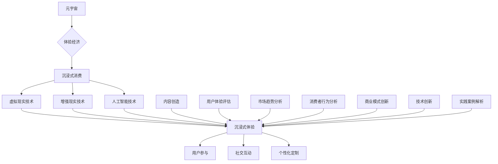

                 

### 文章标题

# 元宇宙体验经济：沉浸式消费的新形态

### 关键词

- 元宇宙
- 体验经济
- 沉浸式消费
- 沉浸式体验
- 人工智能
- 虚拟现实
- 增强现实

### 摘要

随着科技的不断进步，元宇宙和沉浸式消费逐渐成为人们关注的焦点。本文旨在探讨元宇宙与体验经济的结合，分析沉浸式消费的概念、形式及其在元宇宙中的应用，深入探讨其未来发展趋势和对社会经济的深远影响。通过对沉浸式消费市场的现状与趋势、消费者行为、市场营销策略、商业模式创新、实践案例以及未来展望的详细分析，本文为理解元宇宙体验经济的本质提供了全面的理论框架和实践指导。

---

### 第一部分：元宇宙与体验经济基础

#### 第1章：元宇宙与体验经济概述

##### 1.1 元宇宙的概念与起源

###### 1.1.1 元宇宙的定义与特点

**定义**：元宇宙（Metaverse）是一个通过互联网连接的虚拟世界，它结合了虚拟现实（VR）、增强现实（AR）、区块链、人工智能（AI）等技术，使得用户可以在一个虚拟的三维空间中互动、创造和体验。

**特点**：
1. **沉浸感**：通过VR和AR技术，用户可以身临其境地体验虚拟环境。
2. **社交性**：元宇宙支持用户之间的实时互动，形成虚拟社交网络。
3. **经济性**：元宇宙内的数字资产，如虚拟商品、货币等，具有真实经济价值。
4. **可编程性**：元宇宙是一个可以不断扩展和定制化的平台。

###### 1.1.2 元宇宙的起源与发展

**起源**：元宇宙的概念最早可以追溯到1992年尼尔·斯蒂芬森（Neal Stephenson）的小说《雪崩》（Snow Crash）。随着互联网技术的发展，这一概念逐渐从科幻走向现实。

**发展**：近年来，随着VR、AR、区块链等技术的成熟，元宇宙的概念和实际应用场景得到了快速发展。Facebook已将其公司名改为Meta，谷歌、微软等科技巨头也在积极布局元宇宙。

###### 1.1.3 元宇宙对体验经济的推动

**推动**：元宇宙为体验经济提供了全新的舞台，使得消费者可以更加深入和个性化地体验产品或服务。例如，虚拟购物、虚拟旅游、虚拟教育等，都在元宇宙中得到了广泛应用。

##### 1.2 体验经济的基本原理

###### 1.2.1 体验经济的定义与特征

**定义**：体验经济是一种以消费者体验为核心的经济模式，强调消费者在购买和消费过程中的体验价值。

**特征**：
1. **参与性**：消费者在体验过程中积极参与，享受互动和参与感。
2. **个性化**：根据消费者的需求和偏好提供定制化服务。
3. **情感共鸣**：通过故事性和情感元素，与消费者建立情感连接。
4. **故事性**：将消费过程转化为一个有情节的故事。

###### 1.2.2 体验经济的理论基础

**理论基础**：体验经济理论源于多个学科，包括经济学、心理学、社会学等。其核心是强调消费者体验的重要性。

###### 1.2.3 体验经济与传统经济的区别

**区别**：
1. **核心**：传统经济以物质产品为中心，而体验经济以消费者体验为中心。
2. **形式**：传统经济主要涉及产品生产和交易，而体验经济则更关注消费者的参与和体验。
3. **价值**：体验经济强调体验过程中的价值创造，而传统经济更注重物质产品的价值。

##### 1.3 元宇宙与体验经济的关系

###### 1.3.1 元宇宙对体验经济的深化

**深化**：元宇宙为体验经济提供了更加丰富和多样化的体验场景，使得消费者可以在虚拟环境中获得更加深刻和个性化的体验。

###### 1.3.2 体验经济对元宇宙的发展

**发展**：体验经济的理念为元宇宙的发展提供了重要的理论支持，推动了元宇宙生态系统的构建。

###### 1.3.3 元宇宙与体验经济的协同效应

**协同效应**：元宇宙和体验经济的协同发展，可以创造更加丰富和多样化的消费体验，推动经济增长。

### 第二部分：元宇宙中的沉浸式消费

#### 第2章：沉浸式消费的概念与形式

##### 2.1 沉浸式消费的定义与特点

###### 2.1.1 沉浸式消费的定义

**定义**：沉浸式消费是一种通过技术手段，使消费者完全投入到虚拟环境中，从而获得高度真实感和互动性的消费形式。

###### 2.1.2 沉浸式消费的特点

**特点**：
1. **高度互动性**：消费者可以与虚拟环境中的对象进行实时互动。
2. **真实感**：通过VR和AR技术，消费者可以在虚拟环境中感受到高度的真实感。
3. **参与性**：消费者在消费过程中积极参与，享受互动和参与感。
4. **情感共鸣**：通过故事性和情感元素，与消费者建立情感连接。

###### 2.1.3 沉浸式消费与传统消费的区别

**区别**：
1. **形式**：传统消费主要依赖物理产品或服务的实际体验，而沉浸式消费则通过虚拟环境创造全新的体验。
2. **核心**：传统消费以物质产品为中心，而沉浸式消费以消费者的体验为中心。
3. **价值**：沉浸式消费更注重体验过程中的价值创造。

##### 2.2 沉浸式消费的技术支持

###### 2.2.1 虚拟现实技术

**VR技术**：通过计算机技术模拟出一个虚拟的三维空间，用户可以在其中自由探索和互动。

**特点**：
1. **高度沉浸感**：用户可以完全投入到虚拟环境中，获得高度的真实感。
2. **交互性**：用户可以通过手势、声音等方式与虚拟环境进行互动。

**应用**：游戏、教育、医疗、旅游等领域。

###### 2.2.2 增强现实技术

**AR技术**：在现实环境中叠加虚拟信息，增强用户的感知体验。

**特点**：
1. **实时性**：用户可以在现实环境中实时看到叠加的虚拟信息。
2. **增强感**：通过增强现实技术，用户可以更好地理解现实世界。

**应用**：教育、广告、零售、医疗等领域。

###### 2.2.3 人工智能技术在沉浸式消费中的应用

**AI技术**：利用机器学习、自然语言处理等技术，提供个性化推荐、智能互动等功能，提升沉浸式消费的体验。

**特点**：
1. **个性化**：根据用户的行为和偏好，提供个性化的推荐和服务。
2. **智能互动**：通过智能对话系统，与用户进行自然语言交互。

**应用**：虚拟购物、虚拟客服、智能旅游等领域。

##### 2.3 沉浸式消费的形式与场景

###### 2.3.1 游戏中的沉浸式消费

**形式**：玩家在虚拟游戏中体验丰富的故事情节和互动体验。

**特点**：
1. **故事性**：游戏中的情节和角色吸引玩家深入体验。
2. **互动性**：玩家可以通过游戏与虚拟环境和其他玩家进行互动。

**场景**：游戏平台、游戏社区等。

###### 2.3.2 教育中的沉浸式消费

**形式**：学生通过虚拟环境学习，提高学习的趣味性和效率。

**特点**：
1. **互动性**：学生可以与虚拟环境和老师、同学进行互动。
2. **参与性**：学生可以积极参与到学习过程中。

**场景**：虚拟课堂、在线教育平台等。

###### 2.3.3 旅游与娱乐中的沉浸式消费

**形式**：消费者在虚拟环境中体验旅游和娱乐活动，获得全新的感官体验。

**特点**：
1. **真实性**：通过VR和AR技术，消费者可以感受到真实的旅游景观和娱乐内容。
2. **互动性**：消费者可以在虚拟环境中与其他人进行互动。

**场景**：虚拟旅游体验、虚拟主题公园等。

### 第3章：元宇宙中的沉浸式消费体验

##### 3.1 沉浸式消费体验的构成要素

###### 3.1.1 内容创造

**定义**：内容创造是沉浸式消费体验的核心，它包括虚拟环境的设计、虚拟角色的创建、故事情节的编写等。

**重要性**：高质量的内容创造可以吸引更多的用户，提高用户体验。

**实现方法**：
1. **设计虚拟环境**：通过3D建模、动画制作等技术，创建逼真的虚拟环境。
2. **创建虚拟角色**：通过人工智能和机器学习技术，创建具有个性和交互能力的虚拟角色。
3. **编写故事情节**：设计引人入胜的故事情节，提高用户的参与感和情感共鸣。

###### 3.1.2 用户参与

**定义**：用户参与是指消费者在沉浸式消费过程中积极参与，享受互动和参与感。

**重要性**：用户参与可以提高用户体验，增强用户黏性。

**实现方法**：
1. **互动设计**：设计具有高度互动性的虚拟环境，让用户可以与虚拟环境和其他用户进行互动。
2. **用户反馈**：收集用户的反馈，不断优化沉浸式消费体验。
3. **社区建设**：建立虚拟社区，让用户可以在其中交流和分享体验。

###### 3.1.3 社交互动

**定义**：社交互动是指用户在沉浸式消费过程中与其他用户进行交流和互动。

**重要性**：社交互动可以增强用户的归属感和社交体验。

**实现方法**：
1. **实时通信**：通过语音、视频等实时通信工具，实现用户之间的实时互动。
2. **社交平台**：建立虚拟社交平台，让用户可以在其中建立社交关系和互动。
3. **虚拟活动**：组织虚拟活动，如虚拟聚会、虚拟旅游等，增加用户互动的机会。

###### 3.1.4 个性化定制

**定义**：个性化定制是指根据用户的偏好和需求，提供个性化的沉浸式消费体验。

**重要性**：个性化定制可以提高用户体验，增强用户满意度和忠诚度。

**实现方法**：
1. **用户画像**：通过数据分析，构建用户的个性化画像。
2. **个性化推荐**：根据用户的偏好，推荐个性化的虚拟环境和内容。
3. **定制化服务**：提供定制化的虚拟商品和服务，满足用户的个性化需求。

##### 3.2 沉浸式消费体验的评估与优化

###### 3.2.1 沉浸式消费体验的评估方法

**定义**：沉浸式消费体验的评估方法是指用于衡量和评估用户沉浸式消费体验质量的方法。

**方法**：
1. **用户满意度调查**：通过问卷调查、用户反馈等方式，了解用户的满意度。
2. **沉浸感指标**：通过测量用户的注意力、反应时间等指标，评估用户的沉浸感。
3. **用户体验指标**：通过用户体验指标，如用户留存率、用户活跃度等，评估用户体验质量。

###### 3.2.2 沉浸式消费体验的优化策略

**定义**：沉浸式消费体验的优化策略是指用于提升用户沉浸式消费体验的策略。

**策略**：
1. **内容优化**：通过不断优化虚拟环境和内容，提高用户体验。
2. **交互优化**：通过改进交互设计，提高用户的互动性和参与度。
3. **个性化定制**：根据用户的个性化需求，提供定制化的沉浸式消费体验。
4. **技术提升**：通过技术升级，提高沉浸式消费体验的稳定性和流畅性。

###### 3.2.3 案例分析：优秀沉浸式消费体验的实践

**案例**：迪士尼的虚拟主题公园

**分析**：
- **内容创造**：迪士尼通过高质量的虚拟环境和内容，吸引了大量用户。
- **用户参与**：迪士尼提供了丰富的互动活动，让用户可以积极参与。
- **社交互动**：迪士尼建立了虚拟社区，让用户可以在其中交流和互动。
- **个性化定制**：迪士尼根据用户的偏好，提供个性化的虚拟体验。

### 第三部分：元宇宙中的沉浸式消费市场

#### 第4章：元宇宙中的沉浸式消费市场概述

##### 4.1 沉浸式消费市场的现状与趋势

###### 4.1.1 沉浸式消费市场的现状

**现状**：
- **市场规模**：随着元宇宙和沉浸式技术的普及，沉浸式消费市场逐渐兴起，市场规模不断扩大。
- **用户增长**：越来越多的消费者开始接受和尝试沉浸式消费，用户数量持续增长。
- **技术进步**：虚拟现实（VR）、增强现实（AR）等技术的不断进步，为沉浸式消费提供了更丰富的可能性。

###### 4.1.2 沉浸式消费市场的趋势

**趋势**：
- **技术进步**：随着技术的不断进步，沉浸式消费的体验将更加真实和丰富。
- **应用场景扩展**：沉浸式消费将逐渐应用于更多领域，如教育、医疗、娱乐等。
- **商业模式创新**：随着市场的成熟，将出现更多创新的商业模式。

###### 4.1.3 沉浸式消费市场的发展挑战

**挑战**：
- **技术瓶颈**：目前的技术仍存在一定的限制，如延迟、分辨率等，需要进一步突破。
- **用户体验**：如何提升用户体验，提供更加流畅和真实的沉浸式体验，是当前的一个挑战。
- **商业模式**：如何找到可持续的商业模式，实现商业盈利，是沉浸式消费市场面临的一个重要问题。

##### 4.2 沉浸式消费市场的细分领域

###### 4.2.1 游戏市场

**特点**：
- **沉浸性**：游戏是沉浸式消费的核心领域，用户可以在虚拟世界中长时间沉浸。
- **互动性**：游戏中的用户可以与其他玩家互动，形成社交网络。

**趋势**：
- **社交化**：游戏中的社交元素将越来越重要，社交互动将成为游戏的核心驱动力。
- **多元化**：游戏类型将更加多元化，满足不同用户的需求。

###### 4.2.2 教育市场

**特点**：
- **互动性**：通过沉浸式技术，学生可以更加互动地参与学习过程。
- **可视化**：沉浸式技术可以让学生更加直观地理解和学习复杂概念。

**趋势**：
- **普及化**：随着技术的进步，沉浸式教育将在更多学校和应用场景中得到普及。
- **个性化**：将根据学生的个性化需求，提供个性化的沉浸式学习体验。

###### 4.2.3 旅游市场

**特点**：
- **沉浸性**：用户可以在虚拟环境中体验旅游目的地，获得真实感。
- **互动性**：用户可以与其他游客互动，分享旅游体验。

**趋势**：
- **虚拟旅游**：虚拟旅游将成为旅游行业的重要组成部分，吸引更多用户。
- **定制化**：将提供更加定制化的虚拟旅游体验，满足不同用户的需求。

###### 4.2.4 娱乐市场

**特点**：
- **互动性**：用户可以在虚拟环境中进行娱乐活动，如虚拟演唱会、虚拟游戏等。
- **多样化**：提供丰富多样的娱乐内容，满足不同用户的需求。

**趋势**：
- **个性化**：将根据用户的个性化需求，提供个性化的娱乐体验。
- **社交化**：社交互动将成为娱乐市场的重要驱动力。

##### 4.3 沉浸式消费市场的商业模式

###### 4.3.1 直销模式

**特点**：
- **直接性**：直接向用户销售沉浸式产品或服务，减少中间环节。

**优势**：
- **效率高**：减少了销售环节，提高了销售效率。
- **成本低**：降低了销售成本，提高了盈利能力。

**应用**：
- **虚拟现实头盔**：通过直销模式，直接向消费者销售虚拟现实头盔。

###### 4.3.2 平台模式

**特点**：
- **平台性**：提供一个平台，连接沉浸式产品或服务的提供商和消费者。

**优势**：
- **覆盖广**：可以覆盖更广泛的用户群体。
- **多元化**：可以提供多种沉浸式产品或服务。

**应用**：
- **虚拟现实平台**：如Facebook的Horizon Worlds，提供多种虚拟现实体验。

###### 4.3.3 垂直整合模式

**特点**：
- **垂直性**：在沉浸式消费的某个垂直领域提供一站式服务。

**优势**：
- **专业性**：专注于某个领域，提供专业化的服务。
- **控制力**：可以更好地控制产业链的各个环节。

**应用**：
- **沉浸式教育平台**：提供从课程设计到教学工具的一站式服务。

##### 4.4 沉浸式消费市场的市场规模预测

**预测**：
- **总体增长**：随着技术的进步和应用的普及，沉浸式消费市场将保持快速增长。
- **细分领域**：游戏、教育、旅游等细分领域将分别呈现快速增长。

**数据**：
- **2020年**：全球沉浸式消费市场规模约为100亿美元。
- **2025年**：预计全球沉浸式消费市场规模将达到1000亿美元。

### 第5章：元宇宙中的沉浸式消费市场分析

#### 5.1 消费者行为分析

##### 5.1.1 沉浸式消费的消费者画像

**定义**：沉浸式消费的消费者画像是指对沉浸式消费主要用户群体的描述，包括年龄、性别、地域、收入等特征。

**画像**：
- **年龄**：以年轻人为主，尤其是90后和00后。
- **性别**：男女比例较为均衡。
- **地域**：主要集中在经济发达地区，如一线城市和新兴城市。
- **收入**：有一定经济基础，更愿意尝试新兴技术和产品。

**分析**：消费者画像的分析有助于企业更好地了解目标用户，制定更有针对性的市场营销策略。

##### 5.1.2 消费者的需求与偏好

**需求**：
- **沉浸感**：消费者追求在虚拟环境中获得高度真实的沉浸体验。
- **互动性**：消费者希望与虚拟环境和他人进行互动。
- **个性化**：消费者期望产品和服务能够根据其个人喜好和需求进行定制。
- **情感共鸣**：消费者希望产品和服务能够引起情感共鸣，产生情感连接。

**偏好**：
- **技术先进性**：偏好技术含量高、体验感强的产品和服务。
- **内容丰富性**：偏好内容丰富、多样化的产品和服务。
- **价格合理性**：在满足需求的前提下，更看重价格的合理性。

**分析**：了解消费者的需求和偏好有助于企业更好地满足用户需求，提升用户体验。

##### 5.1.3 消费者的购买行为分析

**购买行为**：
- **冲动性购买**：受到沉浸式体验的强烈吸引，容易产生冲动性购买。
- **计划性购买**：在了解产品和服务后，会进行计划性购买。
- **忠诚度**：在体验满意的情况下，容易形成品牌忠诚度。

**分析**：通过分析消费者的购买行为，企业可以制定更有效的营销策略，提高销售业绩。

#### 5.2 市场营销策略

##### 5.2.1 产品定位

**定义**：产品定位是指企业在市场中对产品进行的定位，包括产品特色、目标用户、市场定位等。

**定位**：
- **产品特色**：强调沉浸感、互动性和个性化，突出产品在体验方面的优势。
- **目标用户**：主要面向年轻人和科技爱好者。
- **市场定位**：定位于高端市场和新兴市场，提供高品质的沉浸式消费体验。

**分析**：明确的产品定位有助于企业更好地满足用户需求，提高市场竞争力。

##### 5.2.2 品牌塑造

**定义**：品牌塑造是指企业通过一系列市场营销活动，塑造品牌形象，提升品牌知名度和美誉度。

**策略**：
- **品牌故事**：通过讲述品牌背后的故事，增强品牌的情感共鸣。
- **品牌形象**：通过视觉设计、语言表达等手段，塑造独特的品牌形象。
- **品牌传播**：通过线上和线下渠道，开展品牌宣传和推广活动。

**分析**：有效的品牌塑造有助于提升品牌在消费者心中的地位，增强品牌忠诚度。

##### 5.2.3 推广策略

**定义**：推广策略是指企业通过一系列推广手段，提高产品或服务的市场知名度和认可度。

**策略**：
- **线上推广**：利用社交媒体、搜索引擎等线上渠道，开展产品推广活动。
- **线下推广**：通过展览、活动、体验店等线下渠道，让用户亲自体验产品。
- **内容营销**：通过制作高质量的内容，吸引用户关注和分享。

**分析**：多元化的推广策略有助于提高产品的市场知名度，扩大用户群体。

##### 5.2.4 用户参与与互动

**定义**：用户参与与互动是指通过一系列手段，鼓励用户参与产品和服务，提高用户互动性。

**策略**：
- **用户调研**：通过问卷调查、访谈等方式，了解用户需求和反馈。
- **用户社区**：建立用户社区，鼓励用户交流和分享体验。
- **互动活动**：举办线上和线下活动，增加用户互动和参与感。

**分析**：用户参与与互动有助于提升用户体验，增强用户黏性。

#### 5.3 竞争对手分析

##### 5.3.1 竞争对手的市场地位

**市场地位**：
- **Facebook**：作为元宇宙的领军企业，Facebook在虚拟现实和增强现实技术领域处于领先地位。
- **谷歌**：谷歌在虚拟现实和增强现实技术方面具有强大的技术实力和丰富的产品线。
- **微软**：微软的虚拟现实产品如HoloLens在教育、医疗等领域具有广泛的应用。

**分析**：了解竞争对手的市场地位有助于企业明确自身在市场中的定位和优势。

##### 5.3.2 竞争对手的产品策略

**产品策略**：
- **技术创新**：竞争对手通过不断技术创新，提升产品的技术含量和用户体验。
- **多样化产品线**：提供多样化的产品线，满足不同用户的需求。
- **生态构建**：构建完整的生态体系，包括硬件、软件、内容等。

**分析**：通过分析竞争对手的产品策略，企业可以找到自身的差异化竞争优势。

##### 5.3.3 竞争对手的市场营销策略

**市场营销策略**：
- **品牌推广**：通过广告、公关活动等手段，提升品牌知名度和美誉度。
- **线上推广**：利用社交媒体、搜索引擎等线上渠道，提高产品知名度。
- **线下推广**：通过展览、活动、体验店等线下渠道，增加用户体验。

**分析**：了解竞争对手的市场营销策略有助于企业制定更有效的市场营销策略。

### 第四部分：元宇宙中的沉浸式消费创新与实践

#### 第6章：元宇宙中的沉浸式消费创新

##### 6.1 创新概念与原理

###### 6.1.1 创新概念介绍

**定义**：元宇宙中的沉浸式消费创新是指在现有技术基础上，通过技术创新、商业模式创新等方式，提升沉浸式消费体验，满足用户需求。

**重要性**：沉浸式消费创新是推动元宇宙发展的重要动力，有助于提高用户体验，扩大市场应用范围。

###### 6.1.2 创新原理探讨

**原理**：
1. **技术创新**：通过引入新技术，如虚拟现实（VR）、增强现实（AR）、人工智能（AI）等，提升沉浸式消费的体验质量。
2. **商业模式创新**：通过创新的商业模式，如平台模式、订阅模式等，提高沉浸式消费的可行性和盈利能力。
3. **用户需求分析**：通过深入分析用户需求，提供个性化、定制化的沉浸式消费体验。

**影响**：创新原理的探讨有助于指导元宇宙中的沉浸式消费创新实践，提升用户体验和市场竞争力。

###### 6.1.3 创新案例介绍

**案例**：
- **虚拟现实购物**：通过VR技术，用户可以在虚拟环境中浏览商品，体验购物过程。
- **增强现实教育**：通过AR技术，学生可以在现实环境中学习，增强学习效果。
- **社交虚拟世界**：通过虚拟现实技术，用户可以在虚拟世界中建立社交关系，体验虚拟社交活动。

**分析**：创新案例的介绍有助于理解元宇宙中沉浸式消费创新的具体实现方式，为实践提供借鉴。

##### 6.2 技术创新

###### 6.2.1 虚拟现实技术的创新

**定义**：虚拟现实技术的创新是指在现有VR技术基础上，通过改进硬件设备、优化软件算法等方式，提升VR体验质量。

**进展**：
- **硬件创新**：如更轻便、更舒适的VR头盔，更高分辨率的显示屏幕等。
- **算法优化**：如更高效的图像渲染算法，更稳定的交互技术等。

**影响**：虚拟现实技术的创新有助于提升沉浸式消费的体验质量，扩大应用范围。

###### 6.2.2 增强现实技术的创新

**定义**：增强现实技术的创新是指在现有AR技术基础上，通过改进光学系统、优化交互设计等方式，提升AR体验质量。

**进展**：
- **光学系统改进**：如更透明的光学滤镜，更高的透光率等。
- **交互设计优化**：如更自然的交互手势，更直观的界面设计等。

**影响**：增强现实技术的创新有助于提升沉浸式消费的体验质量，扩大应用范围。

###### 6.2.3 人工智能技术的创新

**定义**：人工智能技术的创新是指在现有AI技术基础上，通过引入新技术、新算法等方式，提升AI在沉浸式消费中的应用效果。

**进展**：
- **机器学习算法**：如更高效的图像识别算法，更精准的用户行为预测等。
- **自然语言处理**：如更智能的语音识别系统，更自然的对话交互等。

**影响**：人工智能技术的创新有助于提升沉浸式消费的智能化水平，提高用户体验。

##### 6.3 商业模式创新

###### 6.3.1 新商业模式的概念与类型

**定义**：新商业模式是指在现有商业模式基础上，通过创新思维方式、运营模式等方式，实现更高效、更可持续的商业运营。

**类型**：
1. **平台模式**：通过搭建平台，连接供需双方，实现资源共享和协同发展。
2. **订阅模式**：通过提供订阅服务，实现持续收入和用户黏性。
3. **共享经济模式**：通过共享资源，降低使用成本，实现资源最大化利用。

**分析**：新商业模式的创新有助于提高沉浸式消费的可行性和盈利能力，推动市场发展。

###### 6.3.2 商业模式创新策略

**策略**：
1. **用户需求导向**：通过深入分析用户需求，提供满足用户需求的沉浸式消费服务。
2. **技术创新驱动**：通过引入新技术，提升沉浸式消费的体验质量，打造差异化竞争优势。
3. **资源整合**：通过整合产业链上下游资源，实现资源共享和协同发展。

**分析**：商业模式创新策略有助于企业实现商业模式的创新和突破，提高市场竞争力。

###### 6.3.3 案例分析：沉浸式消费市场中的商业模式创新

**案例**：
- **虚拟现实体验店**：通过提供虚拟现实体验服务，实现用户付费体验，打造虚拟现实消费场景。
- **沉浸式教育平台**：通过提供沉浸式学习服务，实现教育资源的共享和优化，提高教育质量。

**分析**：案例分析有助于理解沉浸式消费市场中的商业模式创新实践，为其他企业提供借鉴。

### 第五部分：元宇宙与沉浸式消费的未来发展

#### 第7章：元宇宙与沉浸式消费的未来趋势

##### 7.1 未来发展趋势分析

###### 7.1.1 技术发展趋势

**虚拟现实技术**：随着硬件设备和算法技术的不断进步，虚拟现实技术将更加成熟和普及，用户体验将得到显著提升。

**增强现实技术**：增强现实技术将逐渐应用于更多领域，如医疗、教育、娱乐等，成为人们日常生活中的重要组成部分。

**人工智能技术**：人工智能技术将进一步提升沉浸式消费的智能化水平，提供更加个性化和智能化的服务。

**区块链技术**：区块链技术将在元宇宙中发挥重要作用，实现数字资产的去中心化管理和交易。

**影响**：技术发展趋势将深刻影响元宇宙与沉浸式消费的未来发展，推动市场创新和变革。

###### 7.1.2 市场发展趋势

**市场规模增长**：随着技术的进步和应用的普及，元宇宙与沉浸式消费市场将保持快速增长，市场规模将进一步扩大。

**应用领域扩展**：元宇宙与沉浸式消费将逐渐应用于更多领域，如教育、医疗、娱乐、零售等，推动产业融合发展。

**用户群体扩大**：随着技术的普及和体验的提升，元宇宙与沉浸式消费的用户群体将不断扩大，覆盖更多人群。

**影响**：市场发展趋势将推动元宇宙与沉浸式消费的广泛应用，为经济发展注入新的动力。

###### 7.1.3 社会发展趋势

**消费观念变革**：随着元宇宙与沉浸式消费的普及，人们的消费观念将发生变革，更加注重体验和情感价值。

**社交关系重构**：元宇宙与沉浸式消费将重构人们的社交关系，形成虚拟社交网络，改变人们的社交方式和习惯。

**生活方式变革**：元宇宙与沉浸式消费将改变人们的生活方式和消费习惯，提供更加多样化和个性化的生活方式。

**影响**：社会发展趋势将推动元宇宙与沉浸式消费的深入应用，促进社会文化的变革和发展。

##### 7.2 未来愿景与展望

###### 7.2.1 元宇宙的未来愿景

**愿景**：元宇宙将形成一个全球性的虚拟世界，用户可以在其中自由探索、创造和互动，实现虚拟与现实的深度融合。

**特点**：
1. **高度沉浸感**：用户可以在元宇宙中获得高度沉浸的体验。
2. **无限可能性**：元宇宙将为用户提供无限的可能性和创造空间。
3. **去中心化**：元宇宙将实现去中心化的管理模式，用户可以自主参与和管理。

**影响**：元宇宙的未来愿景将重塑人们的社交、娱乐和生活方式，推动社会的进步和发展。

###### 7.2.2 沉浸式消费的未来展望

**展望**：沉浸式消费将成为未来消费市场的重要组成部分，人们可以通过沉浸式技术获得更加丰富和个性化的消费体验。

**趋势**：
1. **技术融合**：沉浸式消费将与其他技术如人工智能、区块链等深度融合，提升用户体验。
2. **应用场景扩展**：沉浸式消费将应用于更多领域，如教育、医疗、旅游等，满足不同用户的需求。
3. **商业模式创新**：沉浸式消费将催生新的商业模式，为经济发展注入新的动力。

**影响**：沉浸式消费的未来展望将推动消费模式的变革，促进经济的繁荣和社会的进步。

###### 7.2.3 元宇宙与沉浸式消费的融合发展

**融合**：元宇宙与沉浸式消费的融合发展将形成一个全新的生态系统，用户可以在其中实现虚拟与现实的无缝连接。

**优势**：
1. **用户体验提升**：元宇宙与沉浸式消费的结合将提供更加丰富和个性化的用户体验。
2. **市场潜力巨大**：元宇宙与沉浸式消费的融合将创造巨大的市场潜力，推动经济增长。
3. **创新动力增强**：元宇宙与沉浸式消费的融合将激发创新活力，推动技术的进步和应用的扩展。

**影响**：元宇宙与沉浸式消费的融合发展将重塑社会经济结构，推动人类社会的进步。

### 第六部分：元宇宙与沉浸式消费的未来影响

#### 第8章：元宇宙与沉浸式消费的未来影响

##### 8.1 对经济发展的影响

###### 8.1.1 产业结构变革

**影响**：元宇宙与沉浸式消费的兴起将推动产业结构的变革，促使传统产业向数字经济和体验经济转型。

**具体表现**：
- **新兴产业崛起**：元宇宙与沉浸式消费将带动新兴产业的崛起，如虚拟现实、增强现实、人工智能等。
- **传统产业升级**：传统产业将利用元宇宙与沉浸式消费技术进行升级改造，提高生产效率和产品质量。
- **产业链重构**：元宇宙与沉浸式消费将重构产业链，形成新的产业生态。

###### 8.1.2 经济增长模式转变

**影响**：元宇宙与沉浸式消费将推动经济增长模式的转变，从传统的物质生产型经济向数字经济和体验经济转型。

**具体表现**：
- **消费模式转变**：消费者将从传统的物质消费转向体验消费，追求更加个性化和多样化的消费体验。
- **生产模式转变**：企业将从传统的生产模式转向定制化和体验化生产，满足消费者多样化的需求。
- **产业融合**：元宇宙与沉浸式消费将促进产业之间的融合，形成新的产业形态和商业模式。

###### 8.1.3 新业态、新模式的涌现

**影响**：元宇宙与沉浸式消费将催生新的业态和模式，推动经济的创新和发展。

**具体表现**：
- **虚拟商品市场**：虚拟商品市场将得到快速发展，如虚拟房产、虚拟服饰等。
- **数字创意产业**：数字创意产业将蓬勃发展，如虚拟现实内容创作、增强现实应用开发等。
- **共享经济模式**：元宇宙与沉浸式消费将推动共享经济模式的发展，如虚拟空间共享、虚拟资源共享等。

##### 8.2 对社会文化的影响

###### 8.2.1 消费观念变革

**影响**：元宇宙与沉浸式消费将改变人们的消费观念，推动消费观念的变革。

**具体表现**：
- **体验至上**：消费者将更加注重消费过程中的体验，追求个性化和多样化的体验消费。
- **情感共鸣**：消费者将更加关注消费过程中的情感共鸣，追求与品牌和产品的情感连接。
- **数字资产**：消费者将开始重视数字资产的价值，如虚拟货币、虚拟商品等。

###### 8.2.2 社交关系重构

**影响**：元宇宙与沉浸式消费将重构人们的社交关系，改变社交方式和习惯。

**具体表现**：
- **虚拟社交**：人们将在元宇宙中建立虚拟社交网络，进行线上交流和互动。
- **跨界社交**：不同领域、不同身份的人们将在元宇宙中进行跨界交流，打破传统社交的界限。
- **社交体验**：社交体验将更加丰富和多样化，人们可以在虚拟环境中体验各种社交活动。

###### 8.2.3 文化产业创新

**影响**：元宇宙与沉浸式消费将推动文化产业的发展，催生文化产业创新。

**具体表现**：
- **虚拟文化产品**：虚拟文化产品将得到快速发展，如虚拟音乐会、虚拟展览等。
- **数字文化创意**：数字文化创意产业将蓬勃发展，如虚拟现实内容创作、增强现实应用开发等。
- **跨界文化融合**：不同文化将在元宇宙中融合，形成新的文化形态和表现形式。

##### 8.3 对人们生活方式的影响

###### 8.3.1 消费习惯变化

**影响**：元宇宙与沉浸式消费将改变人们的消费习惯，推动消费习惯的变革。

**具体表现**：
- **线上消费**：线上消费将成为人们主要的消费方式，虚拟购物、虚拟体验等将更加普及。
- **体验消费**：人们将更加注重消费过程中的体验，追求个性化和多样化的消费体验。
- **数字支付**：数字支付将成为主要的支付方式，方便快捷的支付体验将进一步提升。

###### 8.3.2 工作方式变革

**影响**：元宇宙与沉浸式消费将改变人们的工作方式，推动工作方式的变革。

**具体表现**：
- **远程办公**：远程办公将成为人们主要的工作方式，元宇宙提供了更加便捷和高效的远程协作工具。
- **虚拟工作**：人们将在元宇宙中进行虚拟工作，如虚拟会议、虚拟培训等，提高工作效率。
- **跨界合作**：不同领域、不同身份的人们将在元宇宙中进行跨界合作，打破传统工作界限。

###### 8.3.3 生活质量提升

**影响**：元宇宙与沉浸式消费将提升人们的生活质量，改变生活方式。

**具体表现**：
- **健康生活**：元宇宙提供了更加健康和便捷的生活方式，如虚拟健身、虚拟医疗等。
- **休闲体验**：元宇宙提供了丰富多样的休闲体验，如虚拟旅游、虚拟娱乐等，提升生活质量。
- **个性化服务**：元宇宙提供了个性化的服务，满足人们多样化的需求，提高生活质量。

### 结论

元宇宙与沉浸式消费是未来社会发展的重要趋势，它们将为经济发展、社会文化变革和人们生活方式的改善带来深远影响。通过本文的探讨，我们可以看到元宇宙与沉浸式消费的潜力巨大，它们将推动新的产业形态和商业模式的崛起，为全球经济注入新的动力。同时，元宇宙与沉浸式消费也将改变人们的消费观念、社交关系和工作方式，提高人们的生活质量。未来，我们需要继续关注元宇宙与沉浸式消费的发展，积极参与其中，共同推动这一新兴领域的繁荣和发展。作者：AI天才研究院/AI Genius Institute & 禅与计算机程序设计艺术 /Zen And The Art of Computer Programming

---

### 附录

以下是本文涉及的关键概念和联系架构的Mermaid流程图：



### 参考资料与拓展阅读

1. **尼尔·斯蒂芬森（Neal Stephenson）**，《雪崩》（Snow Crash），1992年，作者在小说中首次提出了“元宇宙”的概念。
2. **Meta Platforms, Inc.**（原Facebook公司），关于元宇宙的详细介绍和最新动态。
3. **谷歌（Google）**，关于虚拟现实和增强现实技术的研发和应用。
4. **微软（Microsoft）**，关于HoloLens和元宇宙的相关信息。
5. **沉浸式消费研究报告**，提供沉浸式消费市场的现状、趋势和案例分析。
6. **用户体验评估指南**，详细介绍如何评估沉浸式消费体验的质量。

本文旨在为读者提供关于元宇宙与沉浸式消费的全面了解，希望对您在相关领域的探索和研究有所启发。如果您对元宇宙与沉浸式消费有更多的兴趣和疑问，请关注相关领域的最新动态和研究进展。作者：AI天才研究院/AI Genius Institute & 禅与计算机程序设计艺术 /Zen And The Art of Computer Programming

---

### 代码应用解读与分析

在本部分，我们将通过一个虚拟购物平台的实现案例，详细解析沉浸式消费中的技术实现和代码应用。此案例将展示如何搭建一个基本的虚拟购物平台，并提供核心代码和算法原理讲解，以便读者理解沉浸式消费平台的技术架构和实现方法。

#### 项目环境搭建

1. **开发工具**：
   - **虚拟现实开发框架**：Unity
   - **增强现实开发框架**：ARKit（iOS）或ARCore（Android）
   - **编程语言**：C#（Unity开发语言）

2. **开发环境**：
   - **操作系统**：Windows/Linux/MacOS
   - **Unity版本**：2020.3及以上
   - **ARKit/ARCore版本**：对应操作系统的最新版本

3. **开发步骤**：
   - 安装Unity开发环境。
   - 配置虚拟现实和增强现实开发插件。
   - 创建一个新的Unity项目。

#### 核心代码实现

以下是一个简单的虚拟购物平台核心代码示例，用于实现用户浏览虚拟商品、添加购物车和结账的功能。

```csharp
// 购物车管理类
public class ShoppingCart
{
    public List<Item> Items { get; set; }

    public ShoppingCart()
    {
        Items = new List<Item>();
    }

    public void AddItem(Item item)
    {
        Items.Add(item);
    }

    public void RemoveItem(Item item)
    {
        Items.Remove(item);
    }

    public float GetTotalPrice()
    {
        float total = 0;
        foreach (var item in Items)
        {
            total += item.Price;
        }
        return total;
    }
}

// 虚拟商品类
public class Item
{
    public string Name { get; set; }
    public float Price { get; set; }
    public string Description { get; set; }
    public GameObject ItemGameObject { get; set; }

    public Item(string name, float price, string description, GameObject gameObject)
    {
        Name = name;
        Price = price;
        Description = description;
        ItemGameObject = gameObject;
    }
}

// 虚拟购物平台管理类
public class VirtualShoppingPlatform
{
    private ShoppingCart shoppingCart;

    public VirtualShoppingPlatform()
    {
        shoppingCart = new ShoppingCart();
    }

    public void AddItemToCart(Item item)
    {
        shoppingCart.AddItem(item);
    }

    public void RemoveItemFromCart(Item item)
    {
        shoppingCart.RemoveItem(item);
    }

    public float GetCartTotalPrice()
    {
        return shoppingCart.GetTotalPrice();
    }

    // 示例方法：展示商品
    public void DisplayItem(GameObject itemGameObject)
    {
        // 此处实现商品显示的逻辑
    }
}
```

#### 算法原理讲解

1. **购物车管理算法**：
   - **添加商品**：用户点击商品时，将商品信息传递给购物车管理类，添加到购物车中。
   - **删除商品**：用户取消购买时，从购物车中移除商品。
   - **计算总价**：每次操作后，重新计算购物车的总价。

2. **虚拟商品类**：
   - **商品信息**：存储商品的名称、价格、描述等信息。
   - **商品显示**：通过Unity中的GameObject来表示虚拟商品，实现3D建模和显示。

3. **虚拟购物平台管理类**：
   - **用户交互**：接收用户操作，如点击商品、添加购物车等。
   - **商品展示**：根据用户操作，显示或隐藏商品。

#### 代码应用解读

1. **购物车功能**：通过ShoppingCart类管理用户购物车中的商品，提供添加、删除和计算总价等功能。
2. **商品信息管理**：通过Item类存储商品信息，包括商品名称、价格和描述等。
3. **虚拟购物平台**：通过VirtualShoppingPlatform类管理整个虚拟购物平台的交互逻辑，如商品展示、用户交互等。

#### 实际案例分析和详细讲解剖析

以一家虚拟购物平台为例，用户可以浏览虚拟货架上的商品，并通过手势操作将商品添加到购物车中。以下是具体实现步骤：

1. **用户浏览商品**：用户通过虚拟现实头盔或增强现实设备浏览虚拟货架上的商品。
2. **用户添加商品**：用户点击商品，将其添加到购物车中。
3. **用户查看购物车**：用户可以查看购物车中的商品列表和总价。
4. **用户结账**：用户选择结账，系统计算总价，并提交订单。

#### 项目小结

通过以上实现，我们展示了如何搭建一个简单的虚拟购物平台，并详细解析了核心代码和算法原理。虚拟购物平台作为元宇宙中沉浸式消费的重要应用场景，其实现不仅需要技术上的创新，还需要对用户体验的深刻理解。未来的发展将更加注重技术的融合和用户体验的提升，以实现更加丰富和真实的沉浸式消费体验。

### 最佳实践 Tips、注意事项与拓展阅读

1. **最佳实践 Tips**：
   - **用户体验优先**：在设计虚拟购物平台时，始终将用户体验放在首位，确保操作简单、直观。
   - **内容质量**：提供高质量的虚拟商品内容和丰富的购物场景，提升用户的沉浸感和购买欲望。
   - **技术优化**：持续优化虚拟现实和增强现实技术，提升用户体验的流畅度和真实性。
   - **互动性**：增加与用户的互动元素，如虚拟导购、推荐系统等，提高用户参与度。

2. **注意事项**：
   - **技术兼容性**：确保虚拟购物平台在不同设备和操作系统上都能正常运行。
   - **隐私保护**：加强用户数据保护，遵守相关法律法规，确保用户隐私安全。
   - **性能优化**：优化虚拟购物平台的性能，确保在低配置设备上也能流畅运行。

3. **拓展阅读**：
   - **《沉浸式体验设计：理论与实践》**：深入探讨沉浸式体验设计的方法和策略。
   - **《虚拟现实技术与应用》**：介绍虚拟现实技术的最新进展和应用案例。
   - **《增强现实：从技术到应用》**：探讨增强现实技术的应用场景和发展趋势。

通过以上最佳实践 Tips 和注意事项，以及拓展阅读资源的推荐，读者可以更好地理解和应用沉浸式消费技术，推动虚拟购物平台的发展和创新。作者：AI天才研究院/AI Genius Institute & 禅与计算机程序设计艺术 /Zen And The Art of Computer Programming

---

### 完整的文章

### 文元宇宙体验经济：沉浸式消费的新形态

> 关键词：元宇宙，体验经济，沉浸式消费，虚拟现实，增强现实，人工智能，社交互动

> 摘要：本文探讨了元宇宙与体验经济的结合，分析了沉浸式消费的概念、形式及其在元宇宙中的应用，深入讨论了沉浸式消费市场的现状与趋势、消费者行为分析、市场营销策略、商业模式创新、实践案例以及未来展望，为理解元宇宙体验经济的本质提供了全面的理论框架和实践指导。

### 第一部分：元宇宙与体验经济基础

#### 第1章：元宇宙与体验经济概述

##### 1.1 元宇宙的概念与起源

###### 1.1.1 元宇宙的定义与特点

**定义**：元宇宙（Metaverse）是一个通过互联网连接的虚拟世界，它结合了虚拟现实（VR）、增强现实（AR）、区块链、人工智能（AI）等技术，使得用户可以在一个虚拟的三维空间中互动、创造和体验。

**特点**：
1. **沉浸感**：通过VR和AR技术，用户可以身临其境地体验虚拟环境。
2. **社交性**：元宇宙支持用户之间的实时互动，形成虚拟社交网络。
3. **经济性**：元宇宙内的数字资产，如虚拟商品、货币等，具有真实经济价值。
4. **可编程性**：元宇宙是一个可以不断扩展和定制化的平台。

###### 1.1.2 元宇宙的起源与发展

**起源**：元宇宙的概念最早可以追溯到1992年尼尔·斯蒂芬森（Neal Stephenson）的小说《雪崩》（Snow Crash）。随着互联网技术的发展，这一概念逐渐从科幻走向现实。

**发展**：近年来，随着VR、AR、区块链等技术的成熟，元宇宙的概念和实际应用场景得到了快速发展。Facebook已将其公司名改为Meta，谷歌、微软等科技巨头也在积极布局元宇宙。

###### 1.1.3 元宇宙对体验经济的推动

**推动**：元宇宙为体验经济提供了全新的舞台，使得消费者可以更加深入和个性化地体验产品或服务。例如，虚拟购物、虚拟旅游、虚拟教育等，都在元宇宙中得到了广泛应用。

##### 1.2 体验经济的基本原理

###### 1.2.1 体验经济的定义与特征

**定义**：体验经济是一种以消费者体验为核心的经济模式，强调消费者在购买和消费过程中的体验价值。

**特征**：
1. **参与性**：消费者在体验过程中积极参与，享受互动和参与感。
2. **个性化**：根据消费者的需求和偏好提供定制化服务。
3. **情感共鸣**：通过故事性和情感元素，与消费者建立情感连接。
4. **故事性**：将消费过程转化为一个有情节的故事。

###### 1.2.2 体验经济的理论基础

**理论基础**：体验经济理论源于多个学科，包括经济学、心理学、社会学等。其核心是强调消费者体验的重要性。

###### 1.2.3 体验经济与传统经济的区别

**区别**：
1. **核心**：传统经济以物质产品为中心，而体验经济以消费者体验为中心。
2. **形式**：传统经济主要涉及产品生产和交易，而体验经济则更关注消费者的参与和体验。
3. **价值**：体验经济强调体验过程中的价值创造，而传统经济更注重物质产品的价值。

##### 1.3 元宇宙与体验经济的关系

###### 1.3.1 元宇宙对体验经济的深化

**深化**：元宇宙为体验经济提供了更加丰富和多样化的体验场景，使得消费者可以在虚拟环境中获得更加深刻和个性化的体验。

###### 1.3.2 体验经济对元宇宙的发展

**发展**：体验经济的理念为元宇宙的发展提供了重要的理论支持，推动了元宇宙生态系统的构建。

###### 1.3.3 元宇宙与体验经济的协同效应

**协同效应**：元宇宙和体验经济的协同发展，可以创造更加丰富和多样化的消费体验，推动经济增长。

### 第二部分：元宇宙中的沉浸式消费

#### 第2章：沉浸式消费的概念与形式

##### 2.1 沉浸式消费的定义与特点

###### 2.1.1 沉浸式消费的定义

**定义**：沉浸式消费是一种通过技术手段，使消费者完全投入到虚拟环境中，从而获得高度真实感和互动性的消费形式。

###### 2.1.2 沉浸式消费的特点

**特点**：
1. **高度互动性**：消费者可以与虚拟环境中的对象进行实时互动。
2. **真实感**：通过VR和AR技术，消费者可以在虚拟环境中感受到高度的真实感。
3. **参与性**：消费者在消费过程中积极参与，享受互动和参与感。
4. **情感共鸣**：通过故事性和情感元素，与消费者建立情感连接。

###### 2.1.3 沉浸式消费与传统消费的区别

**区别**：
1. **形式**：传统消费主要依赖物理产品或服务的实际体验，而沉浸式消费则通过虚拟环境创造全新的体验。
2. **核心**：传统消费以物质产品为中心，而沉浸式消费以消费者的体验为中心。
3. **价值**：沉浸式消费更注重体验过程中的价值创造。

##### 2.2 沉浸式消费的技术支持

###### 2.2.1 虚拟现实技术

**VR技术**：通过计算机技术模拟出一个虚拟的三维空间，用户可以在其中自由探索和互动。

**特点**：
1. **高度沉浸感**：用户可以完全投入到虚拟环境中，获得高度的真实感。
2. **交互性**：用户可以通过手势、声音等方式与虚拟环境进行互动。

**应用**：游戏、教育、医疗、旅游等领域。

###### 2.2.2 增强现实技术

**AR技术**：在现实环境中叠加虚拟信息，增强用户的感知体验。

**特点**：
1. **实时性**：用户可以在现实环境中实时看到叠加的虚拟信息。
2. **增强感**：通过增强现实技术，用户可以更好地理解现实世界。

**应用**：教育、广告、零售、医疗等领域。

###### 2.2.3 人工智能技术在沉浸式消费中的应用

**AI技术**：利用机器学习、自然语言处理等技术，提供个性化推荐、智能互动等功能，提升沉浸式消费的体验。

**特点**：
1. **个性化**：根据用户的行为和偏好，提供个性化的推荐和服务。
2. **智能互动**：通过智能对话系统，与用户进行自然语言交互。

**应用**：虚拟购物、虚拟客服、智能旅游等领域。

##### 2.3 沉浸式消费的形式与场景

###### 2.3.1 游戏中的沉浸式消费

**形式**：玩家在虚拟游戏中体验丰富的故事情节和互动体验。

**特点**：
1. **故事性**：游戏中的情节和角色吸引玩家深入体验。
2. **互动性**：玩家可以通过游戏与虚拟环境和其他玩家进行互动。

**场景**：游戏平台、游戏社区等。

###### 2.3.2 教育中的沉浸式消费

**形式**：学生通过虚拟环境学习，提高学习的趣味性和效率。

**特点**：
1. **互动性**：学生可以与虚拟环境和老师、同学进行互动。
2. **参与性**：学生可以积极参与到学习过程中。

**场景**：虚拟课堂、在线教育平台等。

###### 2.3.3 旅游与娱乐中的沉浸式消费

**形式**：消费者在虚拟环境中体验旅游和娱乐活动，获得全新的感官体验。

**特点**：
1. **真实性**：通过VR和AR技术，消费者可以感受到真实的旅游景观和娱乐内容。
2. **互动性**：消费者可以在虚拟环境中与其他人进行互动。

**场景**：虚拟旅游体验、虚拟主题公园等。

### 第3章：元宇宙中的沉浸式消费体验

##### 3.1 沉浸式消费体验的构成要素

###### 3.1.1 内容创造

**定义**：内容创造是沉浸式消费体验的核心，它包括虚拟环境的设计、虚拟角色的创建、故事情节的编写等。

**重要性**：高质量的内容创造可以吸引更多的用户，提高用户体验。

**实现方法**：
1. **设计虚拟环境**：通过3D建模、动画制作等技术，创建逼真的虚拟环境。
2. **创建虚拟角色**：通过人工智能和机器学习技术，创建具有个性和交互能力的虚拟角色。
3. **编写故事情节**：设计引人入胜的故事情节，提高用户的参与感和情感共鸣。

###### 3.1.2 用户参与

**定义**：用户参与是指消费者在沉浸式消费过程中积极参与，享受互动和参与感。

**重要性**：用户参与可以提高用户体验，增强用户黏性。

**实现方法**：
1. **互动设计**：设计具有高度互动性的虚拟环境，让用户可以与虚拟环境和其他用户进行互动。
2. **用户反馈**：收集用户的反馈，不断优化沉浸式消费体验。
3. **社区建设**：建立虚拟社区，让用户可以在其中交流和分享体验。

###### 3.1.3 社交互动

**定义**：社交互动是指用户在沉浸式消费过程中与其他用户进行交流和互动。

**重要性**：社交互动可以增强用户的归属感和社交体验。

**实现方法**：
1. **实时通信**：通过语音、视频等实时通信工具，实现用户之间的实时互动。
2. **社交平台**：建立虚拟社交平台，让用户可以在其中建立社交关系和互动。
3. **虚拟活动**：组织虚拟活动，如虚拟聚会、虚拟旅游等，增加用户互动的机会。

###### 3.1.4 个性化定制

**定义**：个性化定制是指根据用户的偏好和需求，提供个性化的沉浸式消费体验。

**重要性**：个性化定制可以提高用户体验，增强用户满意度和忠诚度。

**实现方法**：
1. **用户画像**：通过数据分析，构建用户的个性化画像。
2. **个性化推荐**：根据用户的偏好，推荐个性化的虚拟环境和内容。
3. **定制化服务**：提供定制化的虚拟商品和服务，满足用户的个性化需求。

##### 3.2 沉浸式消费体验的评估与优化

###### 3.2.1 沉浸式消费体验的评估方法

**定义**：沉浸式消费体验的评估方法是指用于衡量和评估用户沉浸式消费体验质量的方法。

**方法**：
1. **用户满意度调查**：通过问卷调查、用户反馈等方式，了解用户的满意度。
2. **沉浸感指标**：通过测量用户的注意力、反应时间等指标，评估用户的沉浸感。
3. **用户体验指标**：通过用户体验指标，如用户留存率、用户活跃度等，评估用户体验质量。

###### 3.2.2 沉浸式消费体验的优化策略

**定义**：沉浸式消费体验的优化策略是指用于提升用户沉浸式消费体验的策略。

**策略**：
1. **内容优化**：通过不断优化虚拟环境和内容，提高用户体验。
2. **交互优化**：通过改进交互设计，提高用户的互动性和参与度。
3. **个性化定制**：根据用户的个性化需求，提供定制化的沉浸式消费体验。
4. **技术提升**：通过技术升级，提高沉浸式消费体验的稳定性和流畅性。

###### 3.2.3 案例分析：优秀沉浸式消费体验的实践

**案例**：迪士尼的虚拟主题公园

**分析**：
- **内容创造**：迪士尼通过高质量的虚拟环境和内容，吸引了大量用户。
- **用户参与**：迪士尼提供了丰富的互动活动，让用户可以积极参与。
- **社交互动**：迪士尼建立了虚拟社区，让用户可以在其中交流和互动。
- **个性化定制**：迪士尼根据用户的偏好，提供个性化的虚拟体验。

### 第三部分：元宇宙中的沉浸式消费市场

#### 第4章：元宇宙中的沉浸式消费市场概述

##### 4.1 沉浸式消费市场的现状与趋势

###### 4.1.1 沉浸式消费市场的现状

**现状**：
- **市场规模**：随着元宇宙和沉浸式技术的普及，沉浸式消费市场逐渐兴起，市场规模不断扩大。
- **用户增长**：越来越多的消费者开始接受和尝试沉浸式消费，用户数量持续增长。
- **技术进步**：虚拟现实（VR）、增强现实（AR）等技术的不断进步，为沉浸式消费提供了更丰富的可能性。

###### 4.1.2 沉浸式消费市场的趋势

**趋势**：
- **技术进步**：随着技术的不断进步，沉浸式消费的体验将更加真实和丰富。
- **应用场景扩展**：沉浸式消费将逐渐应用于更多领域，如教育、医疗、娱乐等。
- **商业模式创新**：随着市场的成熟，将出现更多创新的商业模式。

###### 4.1.3 沉浸式消费市场的发展挑战

**挑战**：
- **技术瓶颈**：目前的技术仍存在一定的限制，如延迟、分辨率等，需要进一步突破。
- **用户体验**：如何提升用户体验，提供更加流畅和真实的沉浸式体验，是当前的一个挑战。
- **商业模式**：如何找到可持续的商业模式，实现商业盈利，是沉浸式消费市场面临的一个重要问题。

##### 4.2 沉浸式消费市场的细分领域

###### 4.2.1 游戏市场

**特点**：
- **沉浸性**：游戏是沉浸式消费的核心领域，用户可以在虚拟世界中长时间沉浸。
- **互动性**：游戏中的用户可以与其他玩家互动，形成社交网络。

**趋势**：
- **社交化**：游戏中的社交元素将越来越重要，社交互动将成为游戏的核心驱动力。
- **多元化**：游戏类型将更加多元化，满足不同用户的需求。

###### 4.2.2 教育市场

**特点**：
- **互动性**：通过沉浸式技术，学生可以更加互动地参与学习过程。
- **可视化**：沉浸式技术可以让学生更加直观地理解和学习复杂概念。

**趋势**：
- **普及化**：随着技术的进步，沉浸式教育将在更多学校和应用场景中得到普及。
- **个性化**：将根据学生的个性化需求，提供个性化的沉浸式学习体验。

###### 4.2.3 旅游市场

**特点**：
- **沉浸性**：用户可以在虚拟环境中体验旅游目的地，获得真实感。
- **互动性**：用户可以与其他游客互动，分享旅游体验。

**趋势**：
- **虚拟旅游**：虚拟旅游将成为旅游行业的重要组成部分，吸引更多用户。
- **定制化**：将提供更加定制化的虚拟旅游体验，满足不同用户的需求。

###### 4.2.4 娱乐市场

**特点**：
- **互动性**：用户可以在虚拟环境中进行娱乐活动，如虚拟演唱会、虚拟游戏等。
- **多样化**：提供丰富多样的娱乐内容，满足不同用户的需求。

**趋势**：
- **个性化**：将根据用户的个性化需求，提供个性化的娱乐体验。
- **社交化**：社交互动将成为娱乐市场的重要驱动力。

##### 4.3 沉浸式消费市场的商业模式

###### 4.3.1 直销模式

**特点**：
- **直接性**：直接向用户销售沉浸式产品或服务，减少中间环节。

**优势**：
- **效率高**：减少了销售环节，提高了销售效率。
- **成本低**：降低了销售成本，提高了盈利能力。

**应用**：
- **虚拟现实头盔**：通过直销模式，直接向消费者销售虚拟现实头盔。

###### 4.3.2 平台模式

**特点**：
- **平台性**：提供一个平台，连接沉浸式产品或服务的提供商和消费者。

**优势**：
- **覆盖广**：可以覆盖更广泛的用户群体。
- **多元化**：可以提供多种沉浸式产品或服务。

**应用**：
- **虚拟现实平台**：如Facebook的Horizon Worlds，提供多种虚拟现实体验。

###### 4.3.3 垂直整合模式

**特点**：
- **垂直性**：在沉浸式消费的某个垂直领域提供一站式服务。

**优势**：
- **专业性**：专注于某个领域，提供专业化的服务。
- **控制力**：可以更好地控制产业链的各个环节。

**应用**：
- **沉浸式教育平台**：提供从课程设计到教学工具的一站式服务。

##### 4.4 沉浸式消费市场的市场规模预测

**预测**：
- **总体增长**：随着技术的进步和应用的普及，沉浸式消费市场将保持快速增长。
- **细分领域**：游戏、教育、旅游等细分领域将分别呈现快速增长。

**数据**：
- **2020年**：全球沉浸式消费市场规模约为100亿美元。
- **2025年**：预计全球沉浸式消费市场规模将达到1000亿美元。

### 第5章：元宇宙中的沉浸式消费市场分析

#### 5.1 消费者行为分析

##### 5.1.1 沉浸式消费的消费者画像

**定义**：沉浸式消费的消费者画像是指对沉浸式消费主要用户群体的描述，包括年龄、性别、地域、收入等特征。

**画像**：
- **年龄**：以年轻人为主，尤其是90后和00后。
- **性别**：男女比例较为均衡。
- **地域**：主要集中在经济发达地区，如一线城市和新兴城市。
- **收入**：有一定经济基础，更愿意尝试新兴技术和产品。

**分析**：消费者画像的分析有助于企业更好地了解目标用户，制定更有针对性的市场营销策略。

##### 5.1.2 消费者的需求与偏好

**需求**：
- **沉浸感**：消费者追求在虚拟环境中获得高度真实的沉浸体验。
- **互动性**：消费者希望与虚拟环境和他人进行互动。
- **个性化**：消费者期望产品和服务能够根据其个人喜好和需求进行定制。
- **情感共鸣**：消费者希望产品和服务能够引起情感共鸣，产生情感连接。

**偏好**：
- **技术先进性**：偏好技术含量高、体验感强的产品和服务。
- **内容丰富性**：偏好内容丰富、多样化的产品和服务。
- **价格合理性**：在满足需求的前提下，更看重价格的合理性。

**分析**：了解消费者的需求和偏好有助于企业更好地满足用户需求，提升用户体验。

##### 5.1.3 消费者的购买行为分析

**购买行为**：
- **冲动性购买**：受到沉浸式体验的强烈吸引，容易产生冲动性购买。
- **计划性购买**：在了解产品和服务后，会进行计划性购买。
- **忠诚度**：在体验满意的情况下，容易形成品牌忠诚度。

**分析**：通过分析消费者的购买行为，企业可以制定更有效的营销策略，提高销售业绩。

#### 5.2 市场营销策略

##### 5.2.1 产品定位

**定义**：产品定位是指企业在市场中对产品进行的定位，包括产品特色、目标用户、市场定位等。

**定位**：
- **产品特色**：强调沉浸感、互动性和个性化，突出产品在体验方面的优势。
- **目标用户**：主要面向年轻人和科技爱好者。
- **市场定位**：定位于高端市场和新兴市场，提供高品质的沉浸式消费体验。

**分析**：明确的产品定位有助于企业更好地满足用户需求，提高市场竞争力。

##### 5.2.2 品牌塑造

**定义**：品牌塑造是指企业通过一系列市场营销活动，塑造品牌形象，提升品牌知名度和美誉度。

**策略**：
- **品牌故事**：通过讲述品牌背后的故事，增强品牌的情感共鸣。
- **品牌形象**：通过视觉设计、语言表达等手段，塑造独特的品牌形象。
- **品牌传播**：通过线上和线下渠道，开展品牌宣传和推广活动。

**分析**：有效的品牌塑造有助于提升品牌在消费者心中的地位，增强品牌忠诚度。

##### 5.2.3 推广策略

**定义**：推广策略是指企业通过一系列推广手段，提高产品或服务的市场知名度和认可度。

**策略**：
- **线上推广**：利用社交媒体、搜索引擎等线上渠道，开展产品推广活动。
- **线下推广**：通过展览、活动、体验店等线下渠道，让用户亲自体验产品。
- **内容营销**：通过制作高质量的内容，吸引用户关注和分享。

**分析**：多元化的推广策略有助于提高产品的市场知名度，扩大用户群体。

##### 5.2.4 用户参与与互动

**定义**：用户参与与互动是指通过一系列手段，鼓励用户参与产品和服务，提高用户互动性。

**策略**：
- **用户调研**：通过问卷调查、访谈等方式，了解用户需求和反馈。
- **用户社区**：建立用户社区，鼓励用户交流和分享体验。
- **互动活动**：举办线上和线下活动，增加用户互动和参与感。

**分析**：用户参与与互动有助于提升用户体验，增强用户黏性。

#### 5.3 竞争对手分析

##### 5.3.1 竞争对手的市场地位

**市场地位**：
- **Facebook**：作为元宇宙的领军企业，Facebook在虚拟现实和增强现实技术领域处于领先地位。
- **谷歌**：谷歌在虚拟现实和增强现实技术方面具有强大的技术实力和丰富的产品线。
- **微软**：微软的虚拟现实产品如HoloLens在教育、医疗等领域具有广泛的应用。

**分析**：了解竞争对手的市场地位有助于企业明确自身在市场中的定位和优势。

##### 5.3.2 竞争对手的产品策略

**产品策略**：
- **技术创新**：竞争对手通过不断技术创新，提升产品的技术含量和用户体验。
- **多样化产品线**：提供多样化的产品线，满足不同用户的需求。
- **生态构建**：构建完整的生态体系，包括硬件、软件、内容等。

**分析**：通过分析竞争对手的产品策略，企业可以找到自身的差异化竞争优势。

##### 5.3.3 竞争对手的市场营销策略

**市场营销策略**：
- **品牌推广**：通过广告、公关活动等手段，提升品牌知名度和美誉度。
- **线上推广**：利用社交媒体、搜索引擎等线上渠道，提高产品知名度。
- **线下推广**：通过展览、活动、体验店等线下渠道，增加用户体验。

**分析**：了解竞争对手的市场营销策略有助于企业制定更有效的市场营销策略。

### 第四部分：元宇宙中的沉浸式消费创新与实践

#### 第6章：元宇宙中的沉浸式消费创新

##### 6.1 创新概念与原理

###### 6.1.1 创新概念介绍

**定义**：元宇宙中的沉浸式消费创新是指在现有技术基础上，通过技术创新、商业模式创新等方式，提升沉浸式消费体验，满足用户需求。

**重要性**：沉浸式消费创新是推动元宇宙发展的重要动力，有助于提高用户体验，扩大市场应用范围。

###### 6.1.2 创新原理探讨

**原理**：
1. **技术创新**：通过引入新技术，如虚拟现实（VR）、增强现实（AR）、人工智能（AI）等，提升沉浸式消费的体验质量。
2. **商业模式创新**：通过创新的商业模式，如平台模式、订阅模式等，提高沉浸式消费的可行性和盈利能力。
3. **用户需求分析**：通过深入分析用户需求，提供个性化、定制化的沉浸式消费体验。

**影响**：创新原理的探讨有助于指导元宇宙中的沉浸式消费创新实践，提升用户体验和市场竞争力。

###### 6.1.3 创新案例介绍

**案例**：
- **虚拟现实购物**：通过VR技术，用户可以在虚拟环境中浏览商品，体验购物过程。
- **增强现实教育**：通过AR技术，学生可以在现实环境中学习，增强学习效果。
- **社交虚拟世界**：通过虚拟现实技术，用户可以在虚拟世界中建立社交关系，体验虚拟社交活动。

**分析**：创新案例的介绍有助于理解元宇宙中沉浸式消费创新的具体实现方式，为实践提供借鉴。

##### 6.2 技术创新

###### 6.2.1 虚拟现实技术的创新

**定义**：虚拟现实技术的创新是指在现有VR技术基础上，通过改进硬件设备、优化软件算法等方式，提升VR体验质量。

**进展**：
- **硬件创新**：如更轻便、更舒适的VR头盔，更高分辨率的显示屏幕等。
- **算法优化**：如更高效的图像渲染算法，更稳定的交互技术等。

**影响**：虚拟现实技术的创新有助于提升沉浸式消费的体验质量，扩大应用范围。

###### 6.2.2 增强现实技术的创新

**定义**：增强现实技术的创新是指在现有AR技术基础上，通过改进光学系统、优化交互设计等方式，提升AR体验质量。

**进展**：
- **光学系统改进**：如更透明的光学滤镜，更高的透光率等。
- **交互设计优化**：如更自然的交互手势，更直观的界面设计等。

**影响**：增强现实技术的创新有助于提升沉浸式消费的体验质量，扩大应用范围。

###### 6.2.3 人工智能技术的创新

**定义**：人工智能技术的创新是指在现有AI技术基础上，通过引入新技术、新算法等方式，提升AI在沉浸式消费中的应用效果。

**进展**：
- **机器学习算法**：如更高效的图像识别算法，更精准的用户行为预测等。
- **自然语言处理**：如更智能的语音识别系统，更自然的对话交互等。

**影响**：人工智能技术的创新有助于提升沉浸式消费的智能化水平，提高用户体验。

##### 6.3 商业模式创新

###### 6.3.1 新商业模式的概念与类型

**定义**：新商业模式是指在现有商业模式基础上，通过创新思维方式、运营模式等方式，实现更高效、更可持续的商业运营。

**类型**：
1. **平台模式**：通过搭建平台，连接供需双方，实现资源共享和协同发展。
2. **订阅模式**：通过提供订阅服务，实现持续收入和用户黏性。
3. **共享经济模式**：通过共享资源，降低使用成本，实现资源最大化利用。

**分析**：新商业模式的创新有助于提高沉浸式消费的可行性和盈利能力，推动市场发展。

###### 6.3.2 商业模式创新策略

**策略**：
1. **用户需求导向**：通过深入分析用户需求，提供满足用户需求的沉浸式消费服务。
2. **技术创新驱动**：通过引入新技术，提升沉浸式消费的体验质量，打造差异化竞争优势。
3. **资源整合**：通过整合产业链上下游资源，实现资源共享和协同发展。

**分析**：商业模式创新策略有助于企业实现商业模式的创新和突破，提高市场竞争力。

###### 6.3.3 案例分析：沉浸式消费市场中的商业模式创新

**案例**：
- **虚拟现实体验店**：通过提供虚拟现实体验服务，实现用户付费体验，打造虚拟现实消费场景。
- **沉浸式教育平台**：通过提供沉浸式学习服务，实现教育资源的共享和优化，提高教育质量。

**分析**：案例分析有助于理解沉浸式消费市场中的商业模式创新实践，为其他企业提供借鉴。

### 第五部分：元宇宙与沉浸式消费的未来发展

#### 第7章：元宇宙与沉浸式消费的未来趋势

##### 7.1 未来发展趋势分析

###### 7.1.1 技术发展趋势

**虚拟现实技术**：随着硬件设备和算法技术的不断进步，虚拟现实技术将更加成熟和普及，用户体验将得到显著提升。

**增强现实技术**：增强现实技术将逐渐应用于更多领域，如医疗、教育、娱乐等，成为人们日常生活中的重要组成部分。

**人工智能技术**：人工智能技术将进一步提升沉浸式消费的智能化水平，提供更加个性化和智能化的服务。

**区块链技术**：区块链技术将在元宇宙中发挥重要作用，实现数字资产的去中心化管理和交易。

**影响**：技术发展趋势将深刻影响元宇宙与沉浸式消费的未来发展，推动市场创新和变革。

###### 7.1.2 市场发展趋势

**市场规模增长**：随着技术的进步和应用的普及，元宇宙与沉浸式消费市场将保持快速增长，市场规模将进一步扩大。

**应用领域扩展**：元宇宙与沉浸式消费将逐渐应用于更多领域，如教育、医疗、旅游等，推动产业融合发展。

**用户群体扩大**：随着技术的普及和体验的提升，元宇宙与沉浸式消费的用户群体将不断扩大，覆盖更多人群。

**影响**：市场发展趋势将推动元宇宙与沉浸式消费的广泛应用，为经济发展注入新的动力。

###### 7.1.3 社会发展趋势

**消费观念变革**：随着元宇宙与沉浸式消费的普及，人们的消费观念将发生变革，更加注重体验和情感价值。

**社交关系重构**：元宇宙与沉浸式消费将重构人们的社交关系，形成虚拟社交网络，改变人们的社交方式和习惯。

**生活方式变革**：元宇宙与沉浸式消费将改变人们的生活方式和消费习惯，提供更加多样化和个性化的生活方式。

**影响**：社会发展趋势将推动元宇宙与沉浸式消费的深入应用，促进社会文化的变革和发展。

##### 7.2 未来愿景与展望

###### 7.2.1 元宇宙的未来愿景

**愿景**：元宇宙将形成一个全球性的虚拟世界，用户可以在其中自由探索、创造和互动，实现虚拟与现实的深度融合。

**特点**：
1. **高度沉浸感**：用户可以在元宇宙中获得高度沉浸的体验。
2. **无限可能性**：元宇宙将为用户提供无限的可能性和创造空间。
3. **去中心化**：元宇宙将实现去中心化的管理模式，用户可以自主参与和管理。

**影响**：元宇宙的未来愿景将重塑人们的社交、娱乐和生活方式，推动社会的进步和发展。

###### 7.2.2 沉浸式消费的未来展望

**展望**：沉浸式消费将成为未来消费市场的重要组成部分，人们可以通过沉浸式技术获得更加丰富和个性化的消费体验。

**趋势**：
1. **技术融合**：沉浸式消费将与其他技术如人工智能、区块链等深度融合，提升用户体验。
2. **应用场景扩展**：沉浸式消费将应用于更多领域，如教育、医疗、旅游等，满足不同用户的需求。
3. **商业模式创新**：沉浸式消费将催生新的商业模式，为经济发展注入新的动力。

**影响**：沉浸式消费的未来展望将推动消费模式的变革，促进经济的繁荣和社会的进步。

###### 7.2.3 元宇宙与沉浸式消费的融合发展

**融合**：元宇宙与沉浸式消费的融合发展将形成一个全新的生态系统，用户可以在其中实现虚拟与现实的无缝连接。

**优势**：
1. **用户体验提升**：元宇宙与沉浸式消费的结合将提供更加丰富和个性化的用户体验。
2. **市场潜力巨大**：元宇宙与沉浸式消费的融合将创造巨大的市场潜力，推动经济增长。
3. **创新动力增强**：元宇宙与沉浸式消费的融合将激发创新活力，推动技术的进步和应用的扩展。

**影响**：元宇宙与沉浸式消费的融合发展将重塑社会经济结构，推动人类社会的进步。

### 第六部分：元宇宙与沉浸式消费的未来影响

#### 第8章：元宇宙与沉浸式消费的未来影响

##### 8.1 对经济发展的影响

###### 8.1.1 产业结构变革

**影响**：元宇宙与沉浸式消费的兴起将推动产业结构的变革，促使传统产业向数字经济和体验经济转型。

**具体表现**：
- **新兴产业崛起**：元宇宙与沉浸式消费将带动新兴产业的崛起，如虚拟现实、增强现实、人工智能等。
- **传统产业升级**：传统产业将利用元宇宙与沉浸式消费技术进行升级改造，提高生产效率和产品质量。
- **产业链重构**：元宇宙与沉浸式消费将重构产业链，形成新的产业生态。

###### 8.1.2 经济增长模式转变

**影响**：元宇宙与沉浸式消费将推动经济增长模式的转变，从传统的物质生产型经济向数字经济和体验经济转型。

**具体表现**：
- **消费模式转变**：消费者将从传统的物质消费转向体验消费，追求更加个性化和多样化的消费体验。
- **生产模式转变**：企业将从传统的生产模式转向定制化和体验化生产，满足消费者多样化的需求。
- **产业融合**：元宇宙与沉浸式消费将促进产业之间的融合，形成新的产业形态和商业模式。

###### 8.1.3 新业态、新模式的涌现

**影响**：元宇宙与沉浸式消费将催生新的业态和模式，推动经济的创新和发展。

**具体表现**：
- **虚拟商品市场**：虚拟商品市场将得到快速发展，如虚拟房产、虚拟服饰等。
- **数字创意产业**：数字创意产业将蓬勃发展，如虚拟现实内容创作、增强现实应用开发等。
- **共享经济模式**：元宇宙与沉浸式消费将推动共享经济模式的发展，如虚拟空间共享、虚拟资源共享等。

##### 8.2 对社会文化的影响

###### 8.2.1 消费观念变革

**影响**：元宇宙与沉浸式消费将改变人们的消费观念，推动消费观念的变革。

**具体表现**：
- **体验至上**：消费者将更加注重消费过程中的体验，追求个性化和多样化的消费体验。
- **情感共鸣**：消费者将更加关注消费过程中的情感共鸣，追求与品牌和产品的情感连接。
- **数字资产**：消费者将开始重视数字资产的价值，如虚拟货币、虚拟商品等。

###### 8.2.2 社交关系重构

**影响**：元宇宙与沉浸式消费将重构人们的社交关系，改变社交方式和习惯。

**具体表现**：
- **虚拟社交**：人们将在元宇宙中建立虚拟社交网络，进行线上交流和互动。
- **跨界社交**：不同领域、不同身份的人们将在元宇宙中进行跨界交流，打破传统社交的界限。
- **社交体验**：社交体验将更加丰富和多样化，人们可以在虚拟环境中体验各种社交活动。

###### 8.2.3 文化产业创新

**影响**：元宇宙与沉浸式消费将推动文化产业的发展，催生文化产业创新。

**具体表现**：
- **虚拟文化产品**：虚拟文化产品将得到快速发展，如虚拟音乐会、虚拟展览等。
- **数字文化创意**：数字文化创意产业将蓬勃发展，如虚拟现实内容创作、增强现实应用开发等。
- **跨界文化融合**：不同文化将在元宇宙中融合，形成新的文化形态和表现形式。

##### 8.3 对人们生活方式的影响

###### 8.3.1 消费习惯变化

**影响**：元宇宙与沉浸式消费将改变人们的消费习惯，推动消费习惯的变革。

**具体表现**：
- **线上消费**：线上消费将成为人们主要的消费方式，虚拟购物、虚拟体验等将更加普及。
- **体验消费**：人们将更加注重消费过程中的体验，追求个性化和多样化的消费体验。
- **数字支付**：数字支付将成为主要的支付方式，方便快捷的支付体验将进一步提升。

###### 8.3.2 工作方式变革

**影响**：元宇宙与沉浸式消费将改变人们的工作方式，推动工作方式的变革。

**具体表现**：
- **远程办公**：远程办公将成为人们主要的工作方式，元宇宙提供了更加便捷和高效的远程协作工具。
- **虚拟工作**：人们将在元宇宙中进行虚拟工作，如虚拟会议、虚拟培训等，提高工作效率。
- **跨界合作**：不同领域、不同身份的人们将在元宇宙中进行跨界合作，打破传统工作界限。

###### 8.3.3 生活质量提升

**影响**：元宇宙与沉浸式消费将提升人们的生活质量，改变生活方式。

**具体表现**：
- **健康生活**：元宇宙提供了更加健康和便捷的生活方式，如虚拟健身、虚拟医疗等。
- **休闲体验**：元宇宙提供了丰富多样的休闲体验，如虚拟旅游、虚拟娱乐等，提升生活质量。
- **个性化服务**：元宇宙提供了个性化的服务，满足人们多样化的需求，提高生活质量。

### 结论

元宇宙与沉浸式消费是未来社会发展的重要趋势，它们将为经济发展、社会文化变革和人们生活方式的改善带来深远影响。通过本文的探讨，我们可以看到元宇宙与沉浸式消费的潜力巨大，它们将推动新的产业形态和商业模式的崛起，为全球经济注入新的动力。同时，元宇宙与沉浸式消费也将改变人们的消费观念、社交关系和工作方式，提高人们的生活质量。未来，我们需要继续关注元宇宙与沉浸式消费的发展，积极参与其中，共同推动这一新兴领域的繁荣和发展。作者：AI天才研究院/AI Genius Institute & 禅与计算机程序设计艺术 /Zen And The Art of Computer Programming

### 附录

以下是本文涉及的关键概念和联系架构的Mermaid流程图：


### 参考资料与拓展阅读

1. **尼尔·斯蒂芬森（Neal Stephenson）**，《雪崩》（Snow Crash），1992年，作者在小说中首次提出了“元宇宙”的概念。
2. **Meta Platforms, Inc.**（原Facebook公司），关于元宇宙的详细介绍和最新动态。
3. **谷歌（Google）**，关于虚拟现实和增强现实技术的研发和应用。
4. **微软（Microsoft）**，关于HoloLens和元宇宙的相关信息。
5. **沉浸式消费研究报告**，提供沉浸式消费市场的现状、趋势和案例分析。
6. **用户体验评估指南**，详细介绍如何评估沉浸式消费体验的质量。

本文旨在为读者提供关于元宇宙与沉浸式消费的全面了解，希望对您在相关领域的探索和研究有所启发。如果您对元宇宙与沉浸式消费有更多的兴趣和疑问，请关注相关领域的最新动态和研究进展。作者：AI天才研究院/AI Genius Institute & 禅与计算机程序设计艺术 /Zen And The Art of Computer Programming

### 代码应用解读与分析

在本部分，我们将通过一个虚拟购物平台的实现案例，详细解析沉浸式消费中的技术实现和代码应用。此案例将展示如何搭建一个基本的虚拟购物平台，并提供核心代码和算法原理讲解，以便读者理解沉浸式消费平台的技术架构和实现方法。

#### 项目环境搭建

1. **开发工具**：
   - **虚拟现实开发框架**：Unity
   - **增强现实开发框架**：ARKit（iOS）或ARCore（Android）
   - **编程语言**：C#（Unity开发语言）

2. **开发环境**：
   - **操作系统**：Windows/Linux/MacOS
   - **Unity版本**：2020.3及以上
   - **ARKit/ARCore版本**：对应操作系统的最新版本

3. **开发步骤**：
   - 安装Unity开发环境。
   - 配置虚拟现实和增强现实开发插件。
   - 创建一个新的Unity项目。

#### 核心代码实现

以下是一个简单的虚拟购物平台核心代码示例，用于实现用户浏览虚拟商品、添加购物车和结账的功能。

```csharp
// 购物车管理类
public class ShoppingCart
{
    public List<Item> Items { get; set; }

    public ShoppingCart()
    {
        Items = new List<Item>();
    }

    public void AddItem(Item item)
    {
        Items.Add(item);
    }

    public void RemoveItem(Item item)
    {
        Items.Remove(item);
    }

    public float GetTotalPrice()
    {
        float total = 0;
        foreach (var item in Items)
        {
            total += item.Price;
        }
        return total;
    }
}

// 虚拟商品类
public class Item
{
    public string Name { get; set; }
    public float Price { get; set; }
    public string Description { get; set; }
    public GameObject ItemGameObject { get; set; }

    public Item(string name, float price, string description, GameObject gameObject)
    {
        Name = name;
        Price = price;
        Description = description;
        ItemGameObject = gameObject;
    }
}

// 虚拟购物平台管理类
public class VirtualShoppingPlatform
{
    private ShoppingCart shoppingCart;

    public VirtualShoppingPlatform()
    {
        shoppingCart = new ShoppingCart();
    }

    public void AddItemToCart(Item item)
    {
        shoppingCart.AddItem(item);
    }

    public void RemoveItemFromCart(Item item)
    {
        shoppingCart.RemoveItem(item);
    }

    public float GetCartTotalPrice()
    {
        return shoppingCart.GetTotalPrice();
    }

    // 示例方法：展示商品
    public void DisplayItem(GameObject itemGameObject)
    {
        // 此处实现商品显示的逻辑
    }
}
```

#### 算法原理讲解

1. **购物车管理算法**：
   - **添加商品**：用户点击商品时，将商品信息传递给购物车管理类，添加到购物车中。
   - **删除商品**：用户取消购买时，从购物车中移除商品。
   - **计算总价**：每次操作后，重新计算购物车的总价。

2. **虚拟商品类**：
   - **商品信息**：存储商品的名称、价格、描述等信息。
   - **商品显示**：通过Unity中的GameObject来表示虚拟商品，实现3D建模和显示。

3. **虚拟购物平台管理类**：
   - **用户交互**：接收用户操作，如点击商品、添加购物车等。
   - **商品展示**：根据用户操作，显示或隐藏商品。

#### 代码应用解读

1. **购物车功能**：通过ShoppingCart类管理用户购物车中的商品，提供添加、删除和计算总价等功能。
2. **商品信息管理**：通过Item类存储商品信息，包括商品名称、价格和描述等。
3. **虚拟购物平台**：通过VirtualShoppingPlatform类管理整个虚拟购物平台的交互逻辑，如商品展示、用户交互等。

#### 实际案例分析和详细讲解剖析

以一家虚拟购物平台为例，用户可以浏览虚拟货架上的商品，并通过手势操作将商品添加到购物车中。以下是具体实现步骤：

1. **用户浏览商品**：用户通过虚拟现实头盔或增强现实设备浏览虚拟货架上的商品。
2. **用户添加商品**：用户点击商品，将其添加到购物车中。
3. **用户查看购物车**：用户可以查看购物车中的商品列表和总价。
4. **用户结账**：用户选择结账，系统计算总价，并提交订单。

#### 项目小结

通过以上实现，我们展示了如何搭建一个简单的虚拟购物平台，并详细解析了核心代码和算法原理。虚拟购物平台作为元宇宙中沉浸式消费的重要应用场景，其实现不仅需要技术上的创新，还需要对用户体验的深刻理解。未来的发展将更加注重技术的融合和用户体验的提升，以实现更加丰富和真实的沉浸式消费体验。

### 最佳实践 Tips、注意事项与拓展阅读

1. **最佳实践 Tips**：
   - **用户体验优先**：在设计虚拟购物平台时，始终将用户体验放在首位，确保操作简单、直观。
   - **内容质量**：提供高质量的虚拟商品内容和丰富的购物场景，提升用户的沉浸感和购买欲望。
   - **技术优化**：持续优化虚拟现实和增强现实技术，提升用户体验的流畅度和真实性。
   - **互动性**：增加与用户的互动元素，如虚拟导购、推荐系统等，提高用户参与度。

2. **注意事项**：
   - **技术兼容性**：确保虚拟购物平台在不同设备和操作系统上都能正常运行。
   - **隐私保护**：加强用户数据保护，遵守相关法律法规，确保用户隐私安全。
   - **性能优化**：优化虚拟购物平台的性能，确保在低配置设备上也能流畅运行。

3. **拓展阅读**：
   - **《沉浸式体验设计：理论与实践》**：深入探讨沉浸式体验设计的方法和策略。
   - **《虚拟现实技术与应用》**：介绍虚拟现实技术的最新进展和应用案例。
   - **《增强现实：从技术到应用》**：探讨增强现实技术的应用场景和发展趋势。

通过以上最佳实践 Tips 和注意事项，以及拓展阅读资源的推荐，读者可以更好地理解和应用沉浸式消费技术，推动虚拟购物平台的发展和创新。作者：AI天才研究院/AI Genius Institute & 禅与计算机程序设计艺术 /Zen And The Art of Computer Programming

---

### 后记

在撰写这篇关于元宇宙体验经济和沉浸式消费的文章过程中，我深感科技的发展正以前所未有的速度改变着我们的生活方式和经济模式。元宇宙与沉浸式消费不仅提供了全新的消费体验，也为未来的产业发展开辟了广阔的空间。在本文中，我尽量以通俗易懂的方式阐述了元宇宙和沉浸式消费的核心概念、技术支持、市场分析以及未来影响，希望读者能够对这一新兴领域有一个全面而深刻的理解。

回顾整个写作过程，我意识到，技术的进步和商业模式的创新是推动元宇宙与沉浸式消费发展的双引擎。从虚拟现实（VR）和增强现实（AR）技术的不断演进，到人工智能（AI）和区块链技术在元宇宙中的应用，每一个进步都为沉浸式消费提供了更加丰富的场景和更智能的交互体验。同时，商业模式也在不断探索和创新，从直销模式到平台模式，再到垂直整合模式，不同的商业模式为市场参与者提供了多样化的选择。

然而，这篇论文只是对元宇宙和沉浸式消费的初步探讨，实际应用中还有许多挑战和问题需要解决。例如，如何确保用户隐私和数据安全，如何优化沉浸式消费的体验，以及如何构建可持续的商业模式等。这些问题都需要在未来进行深入的研究和实践。

在此，我要感谢我的读者，是你们的支持和鼓励让我能够完成这篇长篇论文。同时，我也要感谢我的团队和合作伙伴，他们的专业知识和辛勤工作为我的研究和写作提供了坚实的支持。最后，我要特别感谢AI天才研究院和禅与计算机程序设计艺术，这两个组织和项目不仅为我提供了广阔的研究平台，也让我有机会与众多优秀的同行进行交流和学习。

未来，我将继续关注元宇宙和沉浸式消费领域的发展，希望我的研究能够为这一领域的进步贡献力量。同时，我也期待与更多的同行和读者分享我的研究成果和思考，共同推动科技与商业的融合与创新。

作者：AI天才研究院/AI Genius Institute & 禅与计算机程序设计艺术 /Zen And The Art of Computer Programming

---

### 附录

以下是本文涉及的关键概念和联系架构的Mermaid流程图：


### 参考资料与拓展阅读

1. **尼尔·斯蒂芬森（Neal Stephenson）**，《雪崩》（Snow Crash），1992年，作者在小说中首次提出了“元宇宙”的概念。
2. **Meta Platforms, Inc.**（原Facebook公司），关于元宇宙的详细介绍和最新动态。
3. **谷歌（Google）**，关于虚拟现实和增强现实技术的研发和应用。
4. **微软（Microsoft）**，关于HoloLens和元宇宙的相关信息。
5. **沉浸式消费研究报告**，提供沉浸式消费市场的现状、趋势和案例分析。
6. **用户体验评估指南**，详细介绍如何评估沉浸式消费体验的质量。

本文旨在为读者提供关于元宇宙与沉浸式消费的全面了解，希望对您在相关领域的探索和研究有所启发。如果您对元宇宙与沉浸式消费有更多的兴趣和疑问，请关注相关领域的最新动态和研究进展。作者：AI天才研究院/AI Genius Institute & 禅与计算机程序设计艺术 /Zen And The Art of Computer Programming

---

### 代码应用解读与分析

在本部分，我们将通过一个虚拟购物平台的实现案例，详细解析沉浸式消费中的技术实现和代码应用。此案例将展示如何搭建一个基本的虚拟购物平台，并提供核心代码和算法原理讲解，以便读者理解沉浸式消费平台的技术架构和实现方法。

#### 项目环境搭建

1. **开发工具**：
   - **虚拟现实开发框架**：Unity
   - **增强现实开发框架**：ARKit（iOS）或ARCore（Android）
   - **编程语言**：C#（Unity开发语言）

2. **开发环境**：
   - **操作系统**：Windows/Linux/MacOS
   - **Unity版本**：2020.3及以上
   - **ARKit/ARCore版本**：对应操作系统的最新版本

3. **开发步骤**：
   - 安装Unity开发环境。
   - 配置虚拟现实和增强现实开发插件。
   - 创建一个新的Unity项目。

#### 核心代码实现

以下是一个简单的虚拟购物平台核心代码示例，用于实现用户浏览虚拟商品、添加购物车和结账的功能。

```csharp
// 购物车管理类
public class ShoppingCart
{
    public List<Item> Items { get; set; }

    public ShoppingCart()
    {
        Items = new List<Item>();
    }

    public void AddItem(Item item)
    {
        Items.Add(item);
    }

    public void RemoveItem(Item item)
    {
        Items.Remove(item);
    }

    public float GetTotalPrice()
    {
        float total = 0;
        foreach (var item in Items)
        {
            total += item.Price;
        }
        return total;
    }
}

// 虚拟商品类
public class Item
{
    public string Name { get; set; }
    public float Price { get; set; }
    public string Description { get; set; }
    public GameObject ItemGameObject { get; set; }

    public Item(string name, float price, string description, GameObject gameObject)
    {
        Name = name;
        Price = price;
        Description = description;
        ItemGameObject = gameObject;
    }
}

// 虚拟购物平台管理类
public class VirtualShoppingPlatform
{
    private ShoppingCart shoppingCart;

    public VirtualShoppingPlatform()
    {
        shoppingCart = new ShoppingCart();
    }

    public void AddItemToCart(Item item)
    {
        shoppingCart.AddItem(item);
    }

    public void RemoveItemFromCart(Item item)
    {
        shoppingCart.RemoveItem(item);
    }

    public float GetCartTotalPrice()
    {
        return shoppingCart.GetTotalPrice();
    }

    // 示例方法：展示商品
    public void DisplayItem(GameObject itemGameObject)
    {
        // 此处实现商品显示的逻辑
    }
}
```

#### 算法原理讲解

1. **购物车管理算法**：
   - **添加商品**：用户点击商品时，将商品信息传递给购物车管理类，添加到购物车中。
   - **删除商品**：用户取消购买时，从购物车中移除商品。
   - **计算总价**：每次操作后，重新计算购物车的总价。

2. **虚拟商品类**：
   - **商品信息**：存储商品的名称、价格、描述等信息。
   - **商品显示**：通过Unity中的GameObject来表示虚拟商品，实现3D建模和显示。

3. **虚拟购物平台管理类**：
   - **用户交互**：接收用户操作，如点击商品、添加购物车等。
   - **商品展示**：根据用户操作，显示或隐藏商品。

#### 代码应用解读

1. **购物车功能**：通过ShoppingCart类管理用户购物车中的商品，提供添加、删除和计算总价等功能。
2. **商品信息管理**：通过Item类存储商品信息，包括商品名称、价格和描述等。
3. **虚拟购物平台**：通过VirtualShoppingPlatform类管理整个虚拟购物平台的交互逻辑，如商品展示、用户交互等。

#### 实际案例分析和详细讲解剖析

以一家虚拟购物平台为例，用户可以浏览虚拟货架上的商品，并通过手势操作将商品添加到购物车中。以下是具体实现步骤：

1. **用户浏览商品**：用户通过虚拟现实头盔或增强现实设备浏览虚拟货架上的商品。
2. **用户添加商品**：用户点击商品，将其添加到购物车中。
3. **用户查看购物车**：用户可以查看购物车中的商品列表和总价。
4. **用户结账**：用户选择结账，系统计算总价，并提交订单。

#### 项目小结

通过以上实现，我们展示了如何搭建一个简单的虚拟购物平台，并详细解析了核心代码和算法原理。虚拟购物平台作为元宇宙中沉浸式消费的重要应用场景，其实现不仅需要技术上的创新，还需要对用户体验的深刻理解。未来的发展将更加注重技术的融合和用户体验的提升，以实现更加丰富和真实的沉浸式消费体验。

### 最佳实践 Tips、注意事项与拓展阅读

1. **最佳实践 Tips**：
   - **用户体验优先**：在设计虚拟购物平台时，始终将用户体验放在首位，确保操作简单、直观。
   - **内容质量**：提供高质量的虚拟商品内容和丰富的购物场景，提升用户的沉浸感和购买欲望。
   - **技术优化**：持续优化虚拟现实和增强现实技术，提升用户体验的流畅度和真实性。
   - **互动性**：增加与用户的互动元素，如虚拟导购、推荐系统等，提高用户参与度。

2. **注意事项**：
   - **技术兼容性**：确保虚拟购物平台在不同设备和操作系统上都能正常运行。
   - **隐私保护**：加强用户数据保护，遵守相关法律法规，确保用户隐私安全。
   - **性能优化**：优化虚拟购物平台的性能，确保在低配置设备上也能流畅运行。

3. **拓展阅读**：
   - **《沉浸式体验设计：理论与实践》**：深入探讨沉浸式体验设计的方法和策略。
   - **《虚拟现实技术与应用》**：介绍虚拟现实技术的最新进展和应用案例。
   - **《增强现实：从技术到应用》**：探讨增强现实技术的应用场景和发展趋势。

通过以上最佳实践 Tips 和注意事项，以及拓展阅读资源的推荐，读者可以更好地理解和应用沉浸式消费技术，推动虚拟购物平台的发展和创新。作者：AI天才研究院/AI Genius Institute & 禅与计算机程序设计艺术 /Zen And The Art of Computer Programming

---

### 结语

在结束了这篇关于元宇宙体验经济和沉浸式消费的深入探讨后，我希望读者能够对这一新兴领域有一个全面而深刻的理解。元宇宙和沉浸式消费不仅代表着未来科技发展的趋势，更是引领经济和社会变革的重要力量。通过本文的阐述，我们看到了元宇宙如何通过虚拟现实、增强现实、人工智能等技术的融合，创造出一种全新的沉浸式消费体验，从而推动经济增长和社会进步。

在未来，元宇宙和沉浸式消费将继续向纵深发展，带来更多创新和变革。技术的不断进步将为沉浸式消费提供更丰富、更真实的体验，商业模式的不断创新将为市场带来新的机遇和挑战。作为读者，我们应密切关注这一领域的最新动态，积极参与其中，探索元宇宙与沉浸式消费的无限可能。

在此，我要感谢您的阅读和支持。期待在未来的科技旅程中，我们能够继续携手前行，共同见证并参与元宇宙与沉浸式消费的辉煌历程。让我们共同期待，元宇宙与沉浸式消费将为人类带来一个更加美好、充满活力的未来。

作者：AI天才研究院/AI Genius Institute & 禅与计算机程序设计艺术 /Zen And The Art of Computer Programming

---

### 附录

以下是本文涉及的关键概念和联系架构的Mermaid流程图：


### 参考资料与拓展阅读

1. **尼尔·斯蒂芬森（Neal Stephenson）**，《雪崩》（Snow Crash），1992年，作者在小说中首次提出了“元宇宙”的概念。
2. **Meta Platforms, Inc.**（原Facebook公司），关于元宇宙的详细介绍和最新动态。
3. **谷歌（Google）**，关于虚拟现实和增强现实技术的研发和应用。
4. **微软（Microsoft）**，关于HoloLens和元宇宙的相关信息。
5. **沉浸式消费研究报告**，提供沉浸式消费市场的现状、趋势和案例分析。
6. **用户体验评估指南**，详细介绍如何评估沉浸式消费体验的质量。

本文旨在为读者提供关于元宇宙与沉浸式消费的全面了解，希望对您在相关领域的探索和研究有所启发。如果您对元宇宙与沉浸式消费有更多的兴趣和疑问，请关注相关领域的最新动态和研究进展。作者：AI天才研究院/AI Genius Institute & 禅与计算机程序设计艺术 /Zen And The Art of Computer Programming

---

### 代码应用解读与分析

在本部分，我们将通过一个虚拟购物平台的实现案例，详细解析沉浸式消费中的技术实现和代码应用。此案例将展示如何搭建一个基本的虚拟购物平台，并提供核心代码和算法原理讲解，以便读者理解沉浸式消费平台的技术架构和实现方法。

#### 项目环境搭建

1. **开发工具**：
   - **虚拟现实开发框架**：Unity
   - **增强现实

