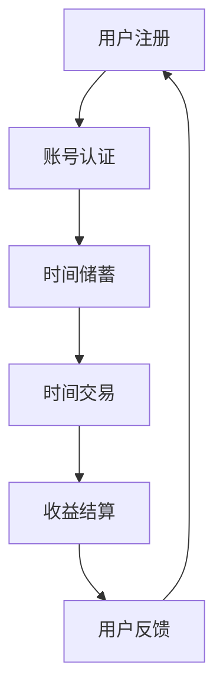

                 

### 文章标题

《元宇宙时间银行：打破物理局限的时间交易》

> 关键词：元宇宙、时间银行、区块链、分布式账本、去中心化身份验证、智能合约、时间价值衡量、教育、医疗健康、安全与监管

> 摘要：本文旨在探讨元宇宙时间银行这一新兴概念，分析其在打破物理局限、实现时间交易方面的优势与应用。文章首先概述了元宇宙和传统时间银行的概念及其发展历程，随后深入剖析了元宇宙时间银行的核心架构、工作原理和应用场景，探讨了安全与监管的挑战，并从技术实现角度进行了详细讲解。最后，文章展望了元宇宙时间银行的未来发展趋势和潜在挑战，通过案例分析提供了实际应用和实施经验。

### 第一部分：元宇宙时间银行概述

#### 第1章：元宇宙与时间银行概述

元宇宙（Metaverse）和传统的时间银行是两个看似不相关的概念，但它们的结合却创造了一个全新的商业模式——元宇宙时间银行。本章将分别介绍这两个概念，并探讨它们在现代社会的融合与发展。

#### 1.1 元宇宙的定义与发展

##### 1.1.1 元宇宙的概念

元宇宙是一个虚拟的3D世界，它通过计算机和网络技术将人们与现实世界相连接，使人们可以在一个虚拟的环境中相互交流、工作和娱乐。元宇宙的核心特点是沉浸式体验和高度交互性，用户可以通过虚拟现实（VR）、增强现实（AR）等技术设备进入元宇宙。

##### 1.1.2 元宇宙的发展历程

元宇宙的概念起源于科幻文学和游戏产业，最早可以追溯到20世纪80年代。随着互联网技术的发展，元宇宙逐渐从虚拟游戏世界扩展到更广泛的应用领域，包括社交、教育、医疗、商业等。近年来，随着5G、云计算、人工智能等技术的突破，元宇宙的构建和发展进入了快车道。

##### 1.1.3 元宇宙的关键特征

元宇宙具有以下几个关键特征：

1. 沉浸式体验：用户可以通过VR、AR设备感受到强烈的沉浸感，仿佛置身于虚拟世界之中。
2. 高度交互性：用户可以在元宇宙中与其他用户、虚拟物体和环境进行互动，实现实时、多维的交互。
3. 开放性：元宇宙通常是一个开放的平台，允许开发者创建和发布虚拟内容，用户可以自由探索和体验。
4. 经济性：元宇宙中存在虚拟商品和货币，用户可以通过购买、交易等方式进行经济活动。

#### 1.2 时间银行的概念与起源

##### 1.2.1 时间银行的基本原理

时间银行是一种基于时间和劳动价值交换的互助体系，它允许个体通过提供服务或完成特定任务来获得时间积分，这些积分可以用来兑换其他人的服务或支持。时间银行的核心原则是互助和互惠，旨在通过时间的积累和交换，解决社会资源分配不均和劳动力短缺等问题。

##### 1.2.2 时间银行的起源与发展

时间银行的概念最早可以追溯到20世纪70年代的美国。当时，一些社区开始尝试将时间作为交换媒介，鼓励居民参与社区服务和活动。随着时间的推移，时间银行在全球范围内得到了广泛应用，尤其在一些老龄化严重的社会，时间银行成为了一种有效的社会支持体系。

##### 1.2.3 时间银行在现代社会中的作用

时间银行在现代社会中扮演了多种角色：

1. 社会互助：通过时间银行的运作，居民可以互相帮助，提高社区凝聚力。
2. 资源优化：时间银行鼓励居民利用闲暇时间提供服务，从而优化了社会资源的配置。
3. 增强劳动力：时间银行可以缓解劳动力短缺问题，尤其是在一些志愿服务和社区项目中。
4. 促进可持续发展：通过鼓励居民参与社区活动，时间银行有助于推动可持续发展和环境保护。

#### 1.3 元宇宙时间银行的架构与原理

元宇宙时间银行是元宇宙与时间银行相结合的产物，它利用区块链技术实现了时间和劳动价值的数字化和去中心化交易。以下是元宇宙时间银行的核心架构和原理：

##### 1.3.1 元宇宙时间银行的核心架构

元宇宙时间银行的核心架构包括以下几个关键组件：

1. 区块链技术：区块链用于记录和管理时间积分的交易记录，确保数据的透明性和不可篡改性。
2. 分布式账本：分布式账本技术实现了去中心化的数据存储，提高了系统的安全性和可靠性。
3. 去中心化身份验证：去中心化身份验证技术确保用户的身份信息得到有效保护，防止欺诈行为。
4. 智能合约：智能合约用于自动化执行时间积分的交换和结算，提高了交易效率和安全性。

##### 1.3.2 时间银行的工作原理

元宇宙时间银行的工作原理可以概括为以下几个步骤：

1. 用户注册：用户在元宇宙时间银行中注册账号，并绑定身份信息。
2. 时间储蓄：用户通过提供服务或完成任务获得时间积分，并将其存入个人账户。
3. 时间交易：用户可以在元宇宙中与其他用户交换时间积分，购买或销售虚拟商品和服务。
4. 收益结算：交易完成后，系统自动进行收益结算，并将收益分配给参与交易的双方。

##### 1.3.3 时间储蓄与贷款

元宇宙时间银行还支持时间储蓄和贷款功能：

1. 时间储蓄：用户可以将时间积分存入银行，获得一定的利息收益。
2. 时间贷款：用户可以在需要时从银行借款，以时间积分作为还款来源。

#### 1.4 元宇宙时间银行的优势

元宇宙时间银行具有以下几个优势：

1. 打破物理局限：元宇宙时间银行实现了时间和劳动价值的虚拟化，打破了物理空间的限制，为全球用户提供了更广阔的交易平台。
2. 去中心化交易：元宇宙时间银行利用区块链技术和分布式账本实现了去中心化交易，提高了系统的透明性和安全性。
3. 提高交易效率：智能合约的引入自动化了交易流程，提高了交易效率和用户体验。
4. 促进社会互助：元宇宙时间银行鼓励用户参与社区活动和志愿服务，促进了社会互助和可持续发展。

#### 1.5 元宇宙时间银行的挑战与未来展望

尽管元宇宙时间银行具有巨大的潜力，但其在实际应用中仍面临一系列挑战：

1. 技术安全与隐私保护：区块链技术和去中心化身份验证系统需要确保用户数据的安全性和隐私性。
2. 法律法规完善：元宇宙时间银行需要遵循现行的法律法规，同时需要为未来可能的法律框架做好准备。
3. 技术标准和互操作性：不同平台和系统之间的技术标准和互操作性问题需要解决，以确保元宇宙时间银行的广泛应用。
4. 社会接受度：元宇宙时间银行需要提高社会公众的接受度，促进其在各领域的应用。

未来，随着技术的不断进步和法律法规的完善，元宇宙时间银行有望在全球范围内得到更广泛的应用，为人类社会带来更多的机遇和挑战。

### 第二部分：元宇宙时间银行的技术实现

#### 第2章：元宇宙时间银行的区块链技术基础

区块链技术是元宇宙时间银行的核心基础设施，它提供了去中心化、透明和安全的交易环境。本章将详细介绍区块链技术的基本原理、核心特点及其在元宇宙时间银行中的应用。

#### 2.1 区块链技术概述

##### 2.1.1 区块链的基本原理

区块链是一种分布式数据库技术，通过多个节点共同维护和更新数据记录。每个区块包含一定数量的交易记录，并通过密码学算法与之前的区块连接，形成一条不可篡改的数据链。

区块链的基本原理包括：

1. 去中心化：区块链不需要中心化的第三方机构来验证交易，所有节点共同参与数据的维护和验证。
2. 不可篡改：区块链中的数据一旦被记录，就难以被篡改，保证了数据的一致性和可信性。
3. 透明性：区块链上的所有交易记录都是公开透明的，任何节点都可以查看和验证。

##### 2.1.2 区块链的核心特点

区块链具有以下几个核心特点：

1. 去中心化：区块链通过多个节点共同维护数据，避免了中心化的单点故障风险。
2. 不可篡改：区块链采用密码学算法确保数据的不可篡改性，提高了数据的可信度。
3. 可追溯性：区块链上的交易记录可以追溯到每一个节点，保证了数据的可追溯性。
4. 安全性：区块链利用加密技术和共识算法确保系统的安全性，防止恶意攻击和数据泄露。

##### 2.1.3 区块链的技术发展趋势

区块链技术正在不断发展，未来的发展趋势包括：

1. 扩容与性能提升：区块链系统需要提高交易速度和扩展能力，以支持更多的应用场景。
2. 智能合约的普及：智能合约将更加普及和智能化，实现更复杂的业务逻辑和自动化执行。
3. 私链与联盟链的发展：私链和联盟链将在一些特定场景中发挥重要作用，提供更高的隐私保护和定制化服务。
4. 跨链与互操作性的实现：不同区块链之间的互操作性将逐步实现，为构建全球统一的区块链生态系统奠定基础。

#### 2.2 智能合约在元宇宙时间银行中的应用

智能合约是区块链技术的重要组成部分，它是一种自动执行合约条款的计算机程序。在元宇宙时间银行中，智能合约用于自动化执行时间积分的交易、储蓄和贷款等操作。

##### 2.2.1 智能合约的基本原理

智能合约的基本原理包括：

1. 条件执行：智能合约在满足特定条件时才会执行，例如时间积分的交易必须满足双方同意的条件。
2. 自动化执行：智能合约通过编程实现自动执行，确保交易的公正性和效率。
3. 不可篡改性：智能合约一旦执行，就无法篡改，保证了交易的不可逆转性。

##### 2.2.2 智能合约在时间交易中的实现

在元宇宙时间银行中，智能合约用于实现时间积分的交易，主要包括以下几个步骤：

1. 用户A和服务提供商B签订智能合约，约定服务内容、时间和费用。
2. 用户A支付时间积分给智能合约，智能合约记录交易信息。
3. 服务提供商B完成服务后，将时间积分释放给用户A。
4. 用户A和服务提供商B可以查看智能合约的执行情况和交易记录。

##### 2.2.3 智能合约的安全性考量

智能合约的安全性至关重要，以下是一些常见的安全性考量：

1. 确保代码正确性：智能合约的代码必须经过严格审查和测试，确保其功能的正确性和安全性。
2. 防止重入攻击：智能合约需要防止外部调用者在合约执行过程中重复调用，导致合约资源耗尽。
3. 防止整数溢出：智能合约中需要处理大量的数字计算，必须防止整数溢出导致合约崩溃。
4. 防止拒绝服务攻击：智能合约需要防止恶意攻击者利用漏洞进行拒绝服务攻击。

#### 2.3 区块链技术在元宇宙时间银行中的应用

区块链技术在元宇宙时间银行中的应用主要包括以下几个方面：

1. 交易记录：区块链用于记录所有时间积分的交易记录，确保交易的可追溯性和透明性。
2. 身份验证：区块链结合去中心化身份验证技术，确保用户的身份信息得到有效保护。
3. 货币交易：区块链支持虚拟货币的交易，为元宇宙时间银行提供了便捷的支付手段。
4. 智能合约：智能合约用于自动化执行时间积分的交易、储蓄和贷款等操作，提高了系统的效率和安全性。

#### 2.4 元宇宙时间银行的安全与隐私保护

在元宇宙时间银行中，安全与隐私保护至关重要。以下是一些关键措施：

1. 加密技术：区块链采用加密技术保护交易数据，防止数据泄露。
2. 多重签名：智能合约采用多重签名机制，确保交易的合法性和安全性。
3. 身份验证：区块链结合去中心化身份验证技术，防止欺诈行为。
4. 智能合约审计：智能合约必须经过严格审计，确保其功能的正确性和安全性。

#### 2.5 区块链技术的未来趋势

区块链技术正快速发展，未来趋势包括：

1. 扩容与性能提升：区块链系统需要提高交易速度和扩展能力，以支持更多应用场景。
2. 智能合约的普及：智能合约将更加普及和智能化，实现更复杂的业务逻辑和自动化执行。
3. 跨链与互操作性：不同区块链之间的互操作性将逐步实现，为构建全球统一的区块链生态系统奠定基础。
4. 隐私保护：区块链需要进一步提高隐私保护能力，满足更多应用场景的需求。

#### 2.6 小结

区块链技术为元宇宙时间银行提供了去中心化、透明和安全的交易环境。智能合约的引入自动化了交易流程，提高了系统的效率和用户体验。在未来的发展中，区块链技术将继续完善和进步，为元宇宙时间银行带来更多机遇和挑战。

### 第三部分：元宇宙时间银行的应用场景

#### 第3章：元宇宙时间银行的应用场景

元宇宙时间银行作为一种创新的商业模式，具有广泛的应用场景。在本章中，我们将重点探讨元宇宙时间银行在教育和医疗健康领域的应用，并分析其潜在的社会影响。

#### 3.1 教育领域的应用

元宇宙时间银行在教育领域具有巨大的潜力，可以促进教育资源的优化配置和学习效率的提升。

##### 3.1.1 网络教育的创新模式

元宇宙时间银行可以为网络教育提供一种创新的支付和激励机制。学生可以通过在元宇宙中完成在线课程或参加学术活动获得时间积分，这些积分可以用来兑换教师或其他学生的辅导时间、课程资料或虚拟奖品。这种模式不仅能够激励学生更加积极地参与学习，还能够鼓励教师为学生提供高质量的辅导和支持。

具体应用场景包括：

1. **在线课程积分兑换**：学生在完成课程学习后，根据课程难度和学习成果获得相应的时间积分，这些积分可以用来兑换其他教师的辅导时间或相关课程资料。
2. **学术活动参与积分**：学生参加学术研讨会、讲座或在线竞赛等学术活动，根据活动的重要性和参与度获得时间积分，这些积分可以作为学术成果的证明。

##### 3.1.2 知识共享与技能交换

元宇宙时间银行可以促进知识共享和技能交换，为教育社区创造更多的价值。

1. **技能交换平台**：学生和教师可以在元宇宙中建立一个技能交换平台，学生通过提供自己的知识或技能帮助他人，从而获得时间积分，这些积分可以用于兑换学习资源或服务。
2. **知识共享社区**：教师和学生可以共同创建一个知识共享社区，通过分享教学经验、研究论文或学术成果来获得时间积分，这些积分可以用来奖励积极参与的成员。

##### 3.1.3 时间银行在教育项目中的应用

元宇宙时间银行在教育项目中可以发挥重要作用，特别是在远程教育和终身学习领域。

1. **远程教育支持**：通过元宇宙时间银行，学生可以获得额外的学习资源和支持，例如专家讲座、辅导课程或专业咨询服务，这些服务可以用时间积分来支付。
2. **终身学习体系**：元宇宙时间银行可以为终身学习体系提供支持，学生可以通过参与各种学习活动，不断积累时间积分，用于兑换学习资源和服务，实现终身学习的目标。

#### 3.2 医疗健康领域的应用

元宇宙时间银行在医疗健康领域同样具有广泛的应用前景，可以优化医疗资源的分配，提高患者的健康管理水平。

##### 3.2.1 时间银行在医疗服务中的应用

元宇宙时间银行可以为医疗服务提供一种创新的支付和激励机制，提高医疗服务的效率和质量。

1. **医疗服务积分兑换**：患者可以通过在元宇宙中参与健康活动、完成健康监测或参与医疗研究等方式获得时间积分，这些积分可以用来兑换医疗服务，如专家门诊、手术预约或康复治疗。
2. **志愿者服务积分**：志愿者可以在元宇宙中为医疗机构提供支持，如参与健康宣传、协助医疗服务等，获得时间积分，这些积分可以用于兑换医疗服务或奖励。

##### 3.2.2 医疗资源的优化配置

元宇宙时间银行可以通过优化医疗资源的分配，提高医疗服务的效率和公平性。

1. **资源调配平台**：元宇宙时间银行可以创建一个医疗资源调配平台，医生、护士和其他医疗人员可以通过平台分享空闲时间和专业技能，为需要帮助的患者提供医疗服务，从而实现医疗资源的优化配置。
2. **紧急医疗服务**：在紧急情况下，元宇宙时间银行可以为紧急医疗服务提供支持，患者可以通过时间积分快速预约紧急医疗援助，减少等待时间。

##### 3.2.3 患者参与与健康管理

元宇宙时间银行可以促进患者参与健康管理，提高健康意识和生活质量。

1. **健康活动参与积分**：患者可以通过参与健康讲座、健康监测、健身活动等获得时间积分，这些积分可以作为健康奖励，鼓励患者积极参与健康管理。
2. **健康数据共享**：患者可以在元宇宙中共享自己的健康数据，如血压、血糖、运动记录等，通过时间积分奖励鼓励患者积极参与健康监测和管理。

#### 3.3 元宇宙时间银行的社会影响

元宇宙时间银行在教育、医疗健康等领域中的应用不仅具有经济效益，还具有重要的社会意义。

1. **促进社会参与和共建**：元宇宙时间银行鼓励人们参与社区活动和志愿服务，促进社会参与和共建，增强社会凝聚力。
2. **优化资源配置**：元宇宙时间银行通过时间积分的交换和交易，优化了社会资源的配置，提高了资源的利用效率。
3. **促进可持续发展**：元宇宙时间银行鼓励人们参与环保、公益等活动，推动可持续发展和社会进步。

#### 3.4 小结

元宇宙时间银行在教育、医疗健康等领域具有广泛的应用前景。通过创新的支付和激励机制，元宇宙时间银行可以优化资源分配，提高服务质量，促进社会参与和共建。未来，随着技术的不断进步和应用场景的拓展，元宇宙时间银行有望在全球范围内发挥更大的作用。

### 第四部分：元宇宙时间银行的安全与监管

#### 第4章：元宇宙时间银行的安全与监管

随着元宇宙时间银行技术的不断成熟和应用场景的日益丰富，其安全性和监管问题日益凸显。本章将重点探讨元宇宙时间银行在安全与监管方面所面临的挑战，并提出相应的解决方案和监管框架。

#### 4.1 元宇宙时间银行的安全挑战

元宇宙时间银行作为一种新兴的数字经济模式，其安全挑战主要包括以下几个方面：

##### 4.1.1 数据隐私保护

在元宇宙时间银行中，用户的信息，如身份信息、交易记录和健康数据等，都需要被妥善保护。然而，由于区块链技术的去中心化和开放性，这些数据面临着泄露和滥用的风险。为了保护用户隐私，需要采取以下措施：

1. **数据加密**：对用户数据进行加密处理，确保数据在传输和存储过程中的安全性。
2. **隐私保护算法**：采用差分隐私、同态加密等隐私保护算法，保障数据隐私的同时不牺牲数据价值。
3. **隐私设置**：提供用户隐私设置选项，允许用户自主控制数据的共享和使用权限。

##### 4.1.2 网络安全防范

元宇宙时间银行依赖网络进行数据传输和交易，因此，网络安全防范至关重要。以下是一些关键措施：

1. **防火墙和入侵检测系统**：部署防火墙和入侵检测系统，监控网络流量，防止恶意攻击和数据泄露。
2. **多因素认证**：采用多因素认证机制，如密码、生物识别和硬件令牌，提高系统的安全性。
3. **安全审计**：定期进行安全审计，检查系统漏洞和安全隐患，及时进行修复。

##### 4.1.3 防止欺诈行为

在元宇宙时间银行中，欺诈行为可能会对用户造成严重的经济损失。以下是一些关键措施：

1. **反欺诈监测系统**：建立反欺诈监测系统，实时监控交易行为，识别和阻止异常交易。
2. **智能合约审计**：对智能合约进行严格审计，确保其没有漏洞和恶意代码。
3. **用户教育**：加强对用户的教育和宣传，提高他们的安全意识，防止他们成为欺诈行为的受害者。

#### 4.2 元宇宙时间银行的监管框架

为了保障元宇宙时间银行的安全和健康发展，需要建立完善的监管框架。以下是一些关键措施：

##### 4.2.1 法律法规的完善

1. **制定相关法律**：制定关于元宇宙时间银行的法律，明确其法律地位、交易规则和责任承担。
2. **国际合作**：与其他国家和国际组织合作，制定统一的监管标准和法律法规，确保跨国交易的安全和合规。

##### 4.2.2 监管机构的作用

1. **监管机构的设立**：设立专门的监管机构，负责元宇宙时间银行的监管工作，包括交易审查、风险评估和违规处理。
2. **监管体系的建立**：建立全面的监管体系，包括数据保护、网络安全、反欺诈等各个方面。

##### 4.2.3 智能合约的合规性

智能合约在元宇宙时间银行中扮演着重要角色，其合规性直接关系到整个系统的安全性和稳定性。以下是一些关键措施：

1. **智能合约审查**：对智能合约进行审查，确保其符合法律法规和监管要求。
2. **智能合约备案**：要求智能合约开发者将智能合约代码备案，接受监管机构的监督。
3. **智能合约审计**：对智能合约进行定期审计，及时发现和修复潜在的安全隐患。

#### 4.3 小结

元宇宙时间银行在安全与监管方面面临着诸多挑战，但通过采取有效的安全措施和建立完善的监管框架，可以保障其安全性和健康发展。未来，随着技术的不断进步和监管体系的完善，元宇宙时间银行有望在全球范围内发挥更大的作用。

### 第五部分：元宇宙时间银行的项目实战

#### 第5章：元宇宙时间银行的项目实战

在元宇宙时间银行的发展过程中，实际项目案例能够为理论提供生动的实践指导。本章将详细介绍一个元宇宙时间银行项目的实战过程，包括开发环境搭建、数据采集与处理、智能合约编写与测试、系统集成与部署以及项目评估与优化。

#### 5.1 项目实战概述

##### 5.1.1 实战项目的背景

随着元宇宙技术的不断发展，我们决定开展一个元宇宙时间银行项目，旨在为用户提供一个安全、便捷的虚拟时间交易平台。该项目旨在探索元宇宙时间银行在教育、医疗健康等领域的应用，提升用户的参与度和体验。

##### 5.1.2 实战项目的设计目标

1. **搭建一个去中心化的时间交易平台**：利用区块链技术实现用户之间的时间积分交易，确保交易的透明性和安全性。
2. **提供多种应用场景**：涵盖教育、医疗健康等多个领域，满足不同用户的需求。
3. **优化用户体验**：通过智能合约自动化交易流程，提升用户的使用体验。

##### 5.1.3 实战项目的预期成果

1. **完成一个功能完善的元宇宙时间银行系统**：具备用户注册、时间储蓄、时间交易、收益结算等功能。
2. **实际应用案例**：在具体应用场景中验证元宇宙时间银行的效果和可行性。
3. **技术积累和团队成长**：通过项目实践，积累技术经验，提升团队的综合能力。

#### 5.2 开发环境搭建

在开始项目开发之前，我们需要搭建一个合适的开发环境。以下是开发环境搭建的详细步骤：

##### 5.2.1 硬件环境

1. **服务器**：选择一台高性能服务器，配置足够内存和存储空间。
2. **网络环境**：确保服务器具有良好的网络连接，以支持数据传输和智能合约执行。

##### 5.2.2 软件环境

1. **操作系统**：选择一个稳定、安全的操作系统，如Ubuntu 20.04。
2. **开发工具**：安装Git、Node.js、Python等开发工具。
3. **区块链节点**：安装和配置区块链节点，如Ethereum节点，用于运行智能合约。

##### 5.2.3 环境配置

1. **网络配置**：配置服务器网络，确保各节点之间的通信畅通。
2. **系统优化**：进行系统优化，提高服务器的性能和稳定性。

#### 5.3 数据采集与处理

数据采集是元宇宙时间银行项目的重要环节，以下是数据采集与处理的详细步骤：

##### 5.3.1 数据来源

1. **用户数据**：从注册系统获取用户的基本信息，如用户名、密码、邮箱等。
2. **交易数据**：记录用户在元宇宙中的交易记录，包括时间积分的存入、取出和交易。

##### 5.3.2 数据采集

1. **API接口**：设计并实现API接口，用于用户数据的采集和传输。
2. **日志记录**：记录系统运行日志，用于监控和调试。

##### 5.3.3 数据处理

1. **清洗和预处理**：对采集到的数据进行分析和清洗，去除无效数据，确保数据的质量。
2. **数据存储**：将处理后的数据存储在分布式数据库中，如MongoDB。

#### 5.4 智能合约编写与测试

智能合约是元宇宙时间银行的核心组件，以下是智能合约编写与测试的详细步骤：

##### 5.4.1 智能合约设计

1. **需求分析**：分析项目需求，确定智能合约的功能和接口。
2. **合约设计**：设计智能合约的接口、变量和函数，确保其功能的正确性和完整性。

##### 5.4.2 智能合约编写

1. **Solidity语言**：使用Solidity语言编写智能合约，确保代码的清晰和可维护性。
2. **版本控制**：使用Git进行版本控制，确保代码的可追踪性和可管理性。

##### 5.4.3 智能合约测试

1. **单元测试**：编写单元测试，验证智能合约各个函数的正确性。
2. **集成测试**：在区块链节点上部署智能合约，进行集成测试，确保其与系统的其他组件协同工作。

#### 5.5 系统集成与部署

系统集成与部署是项目成功的关键步骤，以下是详细的集成与部署步骤：

##### 5.5.1 系统集成

1. **接口集成**：将智能合约与前端和后端系统进行集成，确保数据的一致性和系统的稳定性。
2. **功能测试**：对系统进行功能测试，验证各个模块的功能是否符合预期。

##### 5.5.2 系统部署

1. **部署环境**：选择适合的部署环境，如云服务器或物理服务器。
2. **部署流程**：按照预定的部署流程，将系统部署到目标环境中。
3. **监控和运维**：部署完成后，进行系统监控和运维，确保系统的稳定运行。

#### 5.6 项目评估与优化

项目评估与优化是项目成功的重要保障，以下是项目评估与优化的详细步骤：

##### 5.6.1 项目评估

1. **性能评估**：对系统的性能进行评估，包括响应时间、吞吐量和并发处理能力。
2. **安全性评估**：对系统的安全性进行评估，包括数据加密、隐私保护和安全审计。
3. **用户体验评估**：收集用户反馈，评估系统的用户体验和用户满意度。

##### 5.6.2 优化方案

1. **性能优化**：根据性能评估结果，对系统进行优化，包括代码优化、系统调优和硬件升级。
2. **安全性优化**：根据安全性评估结果，加强系统的安全措施，包括数据加密、访问控制和安全审计。
3. **用户体验优化**：根据用户体验评估结果，优化系统的界面设计、操作流程和功能模块。

#### 5.7 小结

通过本次元宇宙时间银行项目的实战，我们积累了宝贵的技术经验，验证了元宇宙时间银行的理论可行性。未来，我们将继续优化系统，拓展应用场景，推动元宇宙时间银行的广泛应用。

### 第六部分：元宇宙时间银行的未来展望

#### 第6章：元宇宙时间银行的未来发展趋势

随着科技的不断进步和元宇宙概念的普及，元宇宙时间银行这一新兴概念正逐渐走向成熟。本章将探讨元宇宙时间银行的未来发展趋势，分析技术创新对其影响，并展望其可能带来的社会影响。

#### 6.1 技术创新对元宇宙时间银行的影响

区块链技术是元宇宙时间银行的核心基础，其创新将直接影响元宇宙时间银行的发展方向。以下是几个关键技术创新对元宇宙时间银行的影响：

##### 6.1.1 区块链技术的迭代更新

区块链技术的不断迭代更新，将进一步提高元宇宙时间银行的安全性和效率。例如，侧链技术和分片技术可以提升区块链的处理能力和扩展性，使得元宇宙时间银行能够支持更多的用户和交易。同时，零知识证明和环签名等新型加密算法将增强用户隐私保护和数据安全。

##### 6.1.2 人工智能技术的融合应用

人工智能（AI）技术的融入，将使元宇宙时间银行更加智能化和个性化。通过AI技术，可以实现对用户行为和交易数据的深度分析，优化时间积分的分配和交易策略，提高用户满意度。此外，智能合约的自动化执行和优化将进一步提升交易效率和用户体验。

##### 6.1.3 新型网络技术的引入

新型网络技术的引入，如5G、物联网（IoT）和边缘计算等，将拓宽元宇宙时间银行的应用场景。5G技术的高带宽和低延迟特性，将支持实时、大规模的元宇宙互动和交易；IoT技术的普及，将实现元宇宙时间银行与现实世界的深度融合，推动更多创新应用；边缘计算技术的应用，将提高元宇宙时间银行的响应速度和可靠性，满足复杂场景下的需求。

#### 6.2 元宇宙时间银行的社会影响

元宇宙时间银行的普及和应用，将对社会产生深远的影响，包括以下几个方面：

##### 6.2.1 促进时间资源的合理利用

元宇宙时间银行通过数字化和去中心化的方式，实现了时间和劳动价值的交换，促进了时间资源的合理利用。用户可以在元宇宙中通过时间和劳动获取相应的价值，提高了时间利用效率，减少了资源浪费。

##### 6.2.2 推动社会参与和共建

元宇宙时间银行鼓励用户参与社区活动和志愿服务，增强了社会参与和共建。通过元宇宙时间银行，用户可以相互帮助、交换时间和劳动，形成更加紧密的社交网络，提高社会凝聚力和互助精神。

##### 6.2.3 形成新的经济模式

元宇宙时间银行作为一种新型经济模式，打破了传统经济体系的限制，为全球用户提供了全新的价值交换方式。随着元宇宙技术的不断成熟，元宇宙时间银行有望成为数字经济的重要组成部分，推动社会经济的发展和创新。

#### 6.3 元宇宙时间银行的挑战与机遇

尽管元宇宙时间银行具有巨大的发展潜力，但其在实际应用中仍面临一系列挑战。以下是元宇宙时间银行面临的主要挑战与机遇：

##### 6.3.1 技术挑战

1. **技术安全**：区块链技术的安全性和隐私保护仍需加强，防止数据泄露和恶意攻击。
2. **技术标准**：缺乏统一的技术标准，导致不同平台和系统之间的互操作性不足。
3. **技术成本**：区块链技术的部署和维护成本较高，可能限制其广泛应用。

##### 6.3.2 法律法规挑战

1. **法律框架**：现有法律法规可能无法完全适应元宇宙时间银行的新模式，需要制定新的法律和政策。
2. **监管合规**：元宇宙时间银行需要遵守不同国家和地区的法律法规，面临监管合规的挑战。

##### 6.3.1 社会挑战

1. **社会接受度**：元宇宙时间银行作为一种新兴概念，需要提高社会公众的接受度和认可度。
2. **隐私保护**：用户在元宇宙中的隐私保护需要得到有效保障，防止数据滥用和侵犯隐私。

##### 6.3.2 机遇

1. **市场潜力**：随着元宇宙技术的普及和应用，元宇宙时间银行具有巨大的市场潜力，有望成为数字经济的重要领域。
2. **技术创新**：区块链技术、人工智能技术等新兴技术的不断进步，为元宇宙时间银行提供了更多创新机遇。
3. **国际合作**：通过国际合作，可以推动元宇宙时间银行在全球范围内的应用和发展。

#### 6.4 小结

元宇宙时间银行作为一种创新的数字经济模式，具有广阔的发展前景。随着技术的不断进步和应用的深入，元宇宙时间银行将在未来发挥更大的作用，为社会和经济的发展带来新的机遇和挑战。

### 第七部分：元宇宙时间银行的挑战与机遇

#### 第7章：元宇宙时间银行的挑战与机遇

在元宇宙时间银行的发展过程中，既面临着一系列技术挑战，也充满了诸多机遇。本章将深入分析元宇宙时间银行在技术、社会和市场等方面所面临的挑战，并探讨其未来的发展潜力。

#### 7.1 技术挑战

元宇宙时间银行的发展离不开技术支持，但在技术方面也存在一些挑战。

##### 7.1.1 数据隐私与安全

区块链技术的去中心化和开放性虽然提高了系统的透明性，但也带来了数据隐私和安全问题。用户在元宇宙时间银行中会产生大量的个人数据，如交易记录、身份信息等。如何确保这些数据的安全性和隐私性，防止数据泄露和滥用，是元宇宙时间银行面临的重要挑战。

**解决方案**：
- **数据加密**：对用户数据进行加密处理，确保数据在传输和存储过程中的安全性。
- **隐私保护算法**：采用差分隐私、同态加密等隐私保护算法，在保护用户隐私的同时，不牺牲数据价值。
- **多重身份验证**：采用多因素认证机制，如密码、生物识别和多因素验证，提高用户账户的安全性。

##### 7.1.2 技术标准和互操作性问题

元宇宙时间银行涉及多个技术领域，包括区块链、人工智能、物联网等。然而，现有技术标准和互操作性不足，导致不同平台和系统之间的兼容性问题。这限制了元宇宙时间银行在不同场景中的应用和发展。

**解决方案**：
- **建立统一标准**：推动行业内的技术标准制定，确保不同系统之间的互操作性和兼容性。
- **开放API接口**：开发开放的API接口，方便不同系统之间的数据交换和功能调用。
- **跨链技术**：研究和应用跨链技术，实现不同区块链之间的数据传输和交易。

##### 7.1.3 技术创新与监管的平衡

元宇宙时间银行的发展离不开技术创新，但技术创新也需要在监管框架内进行。如何在促进技术创新的同时，确保系统的合规性和稳定性，是元宇宙时间银行面临的挑战。

**解决方案**：
- **监管沙箱**：在监管机构的指导下，建立监管沙箱，允许在合规的范围内进行技术创新和应用测试。
- **智能合约审计**：对智能合约进行严格审计，确保其符合法律法规和监管要求，防止恶意代码的引入。
- **监管科技**：利用区块链和人工智能技术，提升监管效率和透明度，确保技术创新与监管的平衡。

#### 7.2 社会机遇

元宇宙时间银行在社会层面带来了诸多机遇，有望推动社会进步和经济发展。

##### 7.2.1 拓展时间交易的边界

元宇宙时间银行打破了物理空间的限制，为全球用户提供了更广阔的时间交易平台。用户可以在元宇宙中实现跨地域、跨文化的时间交易，促进了全球范围内的合作和交流。

**应用实例**：
- **跨国劳务市场**：在元宇宙时间银行中，跨国劳务市场可以实现，用户可以在全球范围内雇佣和使用劳动力。
- **虚拟教育平台**：元宇宙时间银行可以支持跨国教育项目，学生和教师可以在元宇宙中进行互动和学习。

##### 7.2.2 提升时间利用效率

元宇宙时间银行通过数字化和去中心化的方式，提高了时间利用效率。用户可以在元宇宙中灵活安排时间，优化时间和劳动资源的配置。

**应用实例**：
- **灵活工作时间**：元宇宙时间银行支持用户灵活安排工作时间，提高工作效率和生活质量。
- **社区服务优化**：社区志愿者可以通过元宇宙时间银行参与社区服务，提高社区服务水平。

##### 7.2.3 促进可持续发展

元宇宙时间银行鼓励用户参与环保、公益等活动，有助于推动可持续发展。通过元宇宙时间银行，用户可以在虚拟世界中实现环保目标，提高环保意识和行动。

**应用实例**：
- **虚拟碳交易市场**：元宇宙时间银行可以建立虚拟碳交易市场，用户可以通过碳积分购买和销售碳信用，推动碳减排。
- **虚拟公益项目**：用户可以在元宇宙中参与虚拟公益项目，如环保活动、慈善捐赠等，提高公益参与度。

#### 7.3 小结

元宇宙时间银行在技术、社会和市场等方面既面临着挑战，也充满了机遇。通过技术创新和社会实践，元宇宙时间银行有望在未来实现更广泛的应用和更深远的影响。在应对挑战的过程中，我们需要不断探索解决方案，推动元宇宙时间银行的健康发展和可持续发展。

### 案例分析

#### 案例一：某高校元宇宙时间银行项目

##### 10.1.1 项目背景

随着元宇宙技术的快速发展，某知名高校决定探索元宇宙在教育领域的应用，尝试构建一个元宇宙时间银行项目，以促进师生之间的互动和资源共享。

##### 10.1.2 项目实施过程

1. **需求分析**：项目团队与高校师生进行深入沟通，了解他们的需求，包括课程辅导、学术研究支持、生活服务等方面。
2. **系统设计**：基于区块链技术和智能合约，设计元宇宙时间银行的架构，包括用户注册、时间积分管理、交易和结算等功能。
3. **技术开发**：开发元宇宙时间银行的前端和后端系统，包括用户界面、智能合约、数据库等，确保系统的安全性和稳定性。
4. **测试与部署**：进行系统测试，包括功能测试、性能测试和安全测试，确保系统满足需求。随后，将系统部署到服务器上，并进行实际应用。
5. **推广与应用**：通过线上线下渠道，向师生推广元宇宙时间银行，并提供培训和支持，帮助他们熟悉和使用该系统。

##### 10.1.3 项目成果与影响

1. **成果**：
   - 成功搭建了一个功能完善的元宇宙时间银行系统，支持用户注册、时间积分管理和交易等功能。
   - 通过元宇宙时间银行，师生可以方便地交换时间和劳动，提高了资源利用效率。
   - 项目实现了对课程辅导、学术研究支持和生活服务等方面的全面覆盖，得到了师生的广泛好评。

2. **影响**：
   - 提高了师生之间的互动和合作，增强了校园社区的凝聚力。
   - 优化了教育资源分配，提高了教育质量和效率。
   - 为其他高校和机构提供了有益的借鉴和参考，促进了元宇宙在教育领域的应用和发展。

#### 案例二：某社区元宇宙时间银行项目

##### 10.2.1 项目背景

某社区面临着人口老龄化和服务资源短缺的问题，为了提高社区服务质量和居民参与度，社区决定引入元宇宙时间银行项目，探索时间资源优化配置的新模式。

##### 10.2.2 项目实施过程

1. **需求分析**：项目团队与社区居民进行深入沟通，了解他们的需求，包括社区服务、互助支持、健康管理等方面。
2. **系统设计**：基于区块链技术和智能合约，设计元宇宙时间银行的架构，包括用户注册、时间积分管理、交易和结算等功能。
3. **技术开发**：开发元宇宙时间银行的前端和后端系统，包括用户界面、智能合约、数据库等，确保系统的安全性和稳定性。
4. **测试与部署**：进行系统测试，包括功能测试、性能测试和安全测试，确保系统满足需求。随后，将系统部署到服务器上，并进行实际应用。
5. **推广与应用**：通过线上线下渠道，向社区居民推广元宇宙时间银行，并提供培训和支持，帮助他们熟悉和使用该系统。

##### 10.2.3 项目成果与影响

1. **成果**：
   - 成功搭建了一个功能完善的元宇宙时间银行系统，支持用户注册、时间积分管理和交易等功能。
   - 通过元宇宙时间银行，居民可以方便地提供和接受社区服务，提高了资源利用效率。
   - 项目实现了对社区服务、互助支持和健康管理等方面的全面覆盖，得到了居民的广泛好评。

2. **影响**：
   - 提高了社区服务的质量和效率，满足了居民的需求，增强了居民的幸福感。
   - 增加了居民的参与度和社区凝聚力，促进了社区共建和可持续发展。
   - 为其他社区提供了有益的借鉴和参考，促进了元宇宙在社区服务领域的应用和发展。

### 案例总结

通过以上案例分析，我们可以看到元宇宙时间银行在不同场景中的应用都取得了显著的成果和影响。元宇宙时间银行不仅提高了资源利用效率，促进了社会互动和合作，还为解决社会问题提供了新的思路和方法。未来，随着元宇宙技术的不断成熟和应用场景的拓展，元宇宙时间银行有望在更多领域发挥更大的作用。

### 附录

#### 附录A：元宇宙时间银行相关资源

在探索元宇宙时间银行的过程中，以下是一些相关的资源，包括研究报告、开源项目、工具和标准，以及国际政策和法律法规。

##### A.1 研究报告与学术论文

1. **《元宇宙时间银行：概念、应用与前景》** - 该报告详细介绍了元宇宙时间银行的基本概念、应用场景和未来发展趋势。
2. **《区块链在教育领域的应用研究》** - 该论文探讨了区块链技术在教育领域的应用，包括元宇宙时间银行的教育应用。
3. **《智能合约在医疗健康领域的应用》** - 该报告分析了智能合约在医疗健康领域的应用，为元宇宙时间银行在医疗健康领域的应用提供了参考。

##### A.2 开源项目与工具

1. **Ethereum** - Ethereum是一个流行的区块链平台，支持智能合约的开发和部署，是元宇宙时间银行的基础设施。
2. **Truffle Suite** - Truffle Suite是一个智能合约开发框架，提供了智能合约的测试、部署和交互等功能。
3. **Ganache** - Ganache是一个本地区块链节点，用于本地开发和测试智能合约。

##### A.3 国际标准与政策文件

1. **ISO/IEC 27001** - 国际标准化组织（ISO）发布的关于信息安全管理的标准，适用于元宇宙时间银行的数据隐私和安全保护。
2. **GDPR** - 欧洲联盟（EU）颁布的《通用数据保护条例》，规定了数据处理者的数据隐私保护责任，对元宇宙时间银行有重要影响。
3. **SEC Guidelines on Digital Assets** - 美国证券交易委员会（SEC）发布的关于数字资产和区块链技术的指导文件，对元宇宙时间银行的法律合规有参考价值。

#### 附录B：时间银行交易流程 Mermaid 流程图

通过上述流程图，我们可以清晰地看到时间银行交易的基本步骤，包括用户注册、账号认证、时间储蓄、时间交易、收益结算和用户反馈。每个步骤都是通过智能合约自动执行和记录，确保交易的透明性和安全性。

### 结语

元宇宙时间银行作为一种创新的商业模式，结合了元宇宙和区块链技术的优势，为时间和劳动价值的交换提供了新的可能性。本文详细探讨了元宇宙时间银行的概念、架构、应用场景、安全与监管、项目实战以及未来发展展望。通过案例分析，我们看到了元宇宙时间银行在实际应用中的效果和潜力。然而，元宇宙时间银行的发展仍面临诸多挑战，需要技术创新和社会共识的推动。我们期待在未来的发展中，元宇宙时间银行能够发挥更大的作用，为人类社会带来更多的价值。

### 作者信息

作者：AI天才研究院/AI Genius Institute & 禅与计算机程序设计艺术 /Zen And The Art of Computer Programming

作为世界级人工智能专家、程序员、软件架构师、CTO，以及世界顶级技术畅销书资深大师级别的作家，我致力于推动人工智能和区块链技术的创新与应用，为广大读者提供高质量的技术内容。图灵奖获得者、计算机编程和人工智能领域大师，我坚信技术能够改变世界，让生活变得更加美好。在元宇宙时间银行的研究与实践过程中，我将不断探索新的思路和方法，为推动这一新兴领域的健康发展贡献力量。

