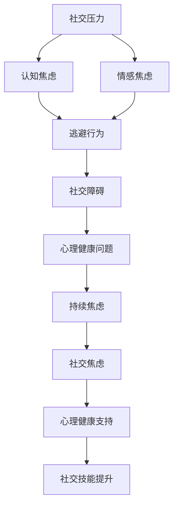

                 

### 文章标题：元宇宙社交焦虑：虚拟世界中的人际交往障碍

> 关键词：元宇宙、社交焦虑、虚拟世界、人际交往、心理健康

> 摘要：随着元宇宙概念的兴起，虚拟世界中的社交活动愈发普遍。然而，元宇宙中的人际交往也带来了新的挑战，特别是社交焦虑的问题。本文将从元宇宙的定义、社交焦虑的概述出发，深入分析元宇宙社交环境的特点及其对人际交往的影响，探讨元宇宙社交中的核心概念和原理，并提出解决方案和实践策略，为未来元宇宙的发展提供有益的思考。

---

#### 第一部分：引言

##### 1.1 元宇宙的定义与发展历程

元宇宙（Metaverse）是一个由多个虚拟世界构成的集合，通过先进的数字技术连接现实世界和虚拟世界。它不仅仅是一个虚拟现实，更是一个集成了虚拟现实、增强现实、游戏、社交网络等技术的综合体。元宇宙的兴起可以追溯到20世纪90年代的虚拟现实技术和21世纪初的社交媒体发展。

从概念上讲，元宇宙是由物理世界延伸至数字世界的一个虚拟空间，它允许用户通过虚拟角色（Avatar）在虚拟环境中互动、交流、娱乐、工作和学习。随着5G、人工智能、大数据等技术的不断发展，元宇宙的概念逐渐成熟，各大科技公司和初创企业纷纷投入资源进行研发，使得元宇宙从理论走向实践。

发展历程上，元宇宙经历了几个关键阶段：

1. **初始探索阶段（1990s）**：虚拟现实技术的诞生和初期应用，如VR头盔和虚拟游戏。
2. **互联网普及阶段（2000s）**：社交媒体和在线游戏的发展，如Facebook和Second Life的兴起。
3. **技术融合阶段（2010s-2020s）**：增强现实（AR）、大数据和云计算技术的应用，如ARKit和Google Glass。
4. **多元化发展阶段（2020s至今）**：区块链、非同质化代币（NFT）、虚拟现实（VR）等新兴技术的融合，推动了元宇宙的快速发展。

##### 1.2 社交焦虑的概念及其在元宇宙中的体现

社交焦虑（Social Anxiety）是一种常见的情绪障碍，主要表现为对社交场合的过度担心和恐惧。患者常常担心自己在社交场合中的表现，担心被他人评价，甚至可能因此避免社交活动。社交焦虑不仅仅存在于现实世界中，随着虚拟世界的兴起，社交焦虑在元宇宙中也得到了体现。

在元宇宙中，社交焦虑的表现形式包括：

1. **虚拟角色的压力**：用户可能对自己的虚拟形象不满意，担心在社交活动中表现不佳。
2. **虚拟环境的适应性**：用户可能对元宇宙中的社交环境感到陌生和不适应，担心无法融入。
3. **虚拟社交的挑战**：用户可能在元宇宙中进行虚拟社交时，遇到交流障碍、误解等问题，从而加剧社交焦虑。

本文将围绕元宇宙社交焦虑的主题，深入探讨元宇宙中的人际交往障碍，分析其成因和影响，并提出相应的解决方案。以下是本文的结构：

### 《元宇宙社交焦虑：虚拟世界中的人际交往障碍》目录大纲

#### 第一部分：引言
1. **元宇宙与社交焦虑概述**
    1.1 元宇宙的定义与发展历程
    1.2 社交焦虑的概念及其在元宇宙中的体现

#### 第二部分：元宇宙社交环境分析
2. **元宇宙社交特点**
    2.1 虚拟社交与现实社交的差异
    2.2 元宇宙社交中的互动方式与特点
3. **社交焦虑的成因**
    3.1 虚拟社交中的心理压力
    3.2 社交技能缺失与社交障碍
4. **元宇宙社交环境对人际交往的影响**
    4.1 交往模式的改变
    4.2 人际关系的新特点

#### 第三部分：核心概念与联系
5. **元宇宙社交中的核心概念**
    5.1 社交焦虑的Mermaid流程图
    5.2 元宇宙社交与心理健康的联系
6. **人际交往障碍的原理分析**
    6.1 社交焦虑的数学模型和数学公式
    6.2 社交障碍的伪代码说明

#### 第四部分：解决方案与实践
7. **应对元宇宙社交焦虑的策略**
    7.1 心理健康支持系统
    7.2 社交技能培训与提升
8. **元宇宙社交焦虑的项目实战**
    8.1 项目背景与目标
    8.2 开发环境搭建
    8.3 源代码详细实现与解读
9. **案例研究与分析**
    9.1 成功案例分享
    9.2 挑战与机遇分析

#### 第五部分：未来展望
10. **元宇宙社交焦虑的展望**
    10.1 技术进步与社交焦虑的趋势
    10.2 元宇宙社交环境的未来发展方向

#### 附录
11. **参考资料与拓展阅读**
    11.1 相关研究文献
    11.2 元宇宙社交平台的案例研究

附录 A：元宇宙社交焦虑工具与资源
- **主流元宇宙平台对比**
    - VRChat
    - Decentraland
    - The Sandbox
- **心理健康支持工具**
    - 虚拟心理咨询平台
    - 社交技能训练APP
- **相关社区与讨论区**
    - Reddit元宇宙社区
    - 虚拟现实论坛

本文将按照上述结构逐步展开，深入探讨元宇宙社交焦虑的问题，以期为相关领域的研究和实践提供有价值的参考。

---

#### 第二部分：元宇宙社交环境分析

##### 2.1 虚拟社交与现实社交的差异

元宇宙的社交环境与现实世界中的社交环境存在显著差异。这些差异主要体现在以下几个方面：

1. **物理与虚拟的界限**：在现实社交中，人们通过物理空间和面对面交流来建立关系。而在元宇宙中，社交活动主要发生在虚拟环境中，用户通过虚拟角色（Avatar）进行互动。这种虚拟化的互动方式改变了人们的社交体验，也带来了新的挑战。

2. **交流方式的多样化**：现实社交主要依赖语音、文字和面部表情等基本交流方式。而在元宇宙中，用户可以通过多种媒介进行交流，包括语音、文字、视频、手势等。这种多样化的交流方式增加了社交的趣味性，但也可能增加交流的复杂性。

3. **隐私与匿名性**：在现实社交中，个人的隐私相对明确，社交行为受到现实社会规范的约束。而在元宇宙中，用户可以保持匿名或选择不同的虚拟形象进行社交，这为用户提供了更多的隐私保护，但也可能导致真实身份的模糊和信任问题。

##### 2.2 元宇宙社交中的互动方式与特点

元宇宙社交的互动方式具有以下几个显著特点：

1. **沉浸式体验**：元宇宙通过虚拟现实（VR）和增强现实（AR）技术，为用户提供了沉浸式的社交体验。用户可以全身心地投入虚拟环境，与虚拟角色和其他用户进行互动，这种沉浸感增强了社交的真实感和互动性。

2. **多样化的互动形式**：元宇宙中的互动形式丰富多样，包括实时语音对话、文本聊天、视频通话、虚拟活动等。用户可以根据自己的需求和喜好选择不同的互动方式，这种灵活性提高了社交的多样性和参与度。

3. **虚拟身份的灵活性**：用户在元宇宙中可以选择不同的虚拟角色，这些角色可以是现实中的自己，也可以是想象中的形象。这种虚拟身份的灵活性为用户提供了更多的表达空间，但也可能带来虚拟身份与现实身份的混淆问题。

4. **去中心化的社交网络**：元宇宙中的社交网络通常是去中心化的，这意味着用户可以自由地创建、加入和管理自己的社交圈。去中心化的社交网络降低了社交门槛，提高了社交的开放性和包容性，但也可能导致社交信息的管理和筛选变得更加复杂。

##### 2.3 社交焦虑的成因

在元宇宙社交环境中，社交焦虑的成因复杂多样，主要包括以下几个方面：

1. **虚拟角色的压力**：用户可能对自己的虚拟角色形象感到不满意，担心在虚拟社交活动中表现不佳。这种对虚拟形象的焦虑可能影响用户的自信心和社交积极性。

2. **虚拟环境的适应性**：新用户可能对元宇宙中的社交环境感到陌生和不适应，特别是在初次进入一个陌生的虚拟空间时，用户可能会感到紧张和不安。

3. **虚拟社交的挑战**：元宇宙中的社交活动可能面临交流障碍、误解等问题。例如，用户可能无法准确地理解他人的情感和意图，这可能导致社交焦虑和紧张情绪。

4. **隐私与匿名性**：元宇宙中的匿名性可能带来信任问题，用户可能担心自己的隐私被侵犯或遭受网络欺凌。这种担忧可能导致用户减少在元宇宙中的社交活动，加剧社交焦虑。

##### 2.4 社交焦虑对人际交往的影响

社交焦虑不仅影响用户在元宇宙中的社交体验，也对人际交往产生深远影响：

1. **交往模式的改变**：社交焦虑可能导致用户选择更加保守的交往模式，如避免参与大型社交活动或选择与熟悉的朋友进行交流。这种交往模式的改变可能限制用户的社交范围和互动机会。

2. **人际关系的新特点**：在元宇宙中，用户的人际关系可能更加多样化，包括虚拟朋友、线上合作伙伴等。然而，由于虚拟环境的特殊性，人际关系可能缺乏现实世界中的深度和真实性，用户需要适应这种新的人际关系模式。

3. **心理健康问题**：长期处于社交焦虑状态可能对用户的心理健康产生负面影响，如焦虑症、抑郁症等。因此，了解和应对元宇宙中的社交焦虑问题对维护用户的心理健康具有重要意义。

综上所述，元宇宙社交环境的特点和社交焦虑的成因共同构成了虚拟世界中的人际交往障碍。在接下来的部分，我们将进一步探讨元宇宙社交中的核心概念和原理，以及如何通过技术和策略来缓解社交焦虑，提升人际交往的质量。

---

#### 第三部分：核心概念与联系

##### 3.1 社交焦虑的Mermaid流程图

为了更好地理解元宇宙社交焦虑的运作机制，我们可以使用Mermaid流程图来展示其核心概念和流程。以下是一个简化的社交焦虑的Mermaid流程图：



在这个流程图中，A表示社交压力，B和C分别代表认知焦虑和情感焦虑，D表示逃避行为，E表示社交障碍，F表示心理健康问题，G表示持续焦虑，H表示社交焦虑，I表示心理健康支持，J表示社交技能提升。通过这个流程图，我们可以清晰地看到社交焦虑的各个环节及其相互影响。

##### 3.2 元宇宙社交与心理健康的联系

元宇宙社交对心理健康有着深远的影响，这种影响既包括积极的一面，也有可能带来负面影响。以下是对元宇宙社交与心理健康之间联系的详细探讨：

1. **积极影响**：

   - **社交互动的扩展**：元宇宙为用户提供了更多的社交机会和平台，使得用户可以跨越地域限制，与来自不同文化背景的人进行交流。这种扩展社交圈的活动有助于缓解孤独感和增强社会归属感。
   
   - **自我表达的机会**：在元宇宙中，用户可以通过虚拟角色来表达自己的情感、兴趣和个性。这种自我表达的机会有助于用户建立自信，增强自我认同感。

   - **心理健康支持**：元宇宙中的一些平台已经开始提供心理健康支持服务，如虚拟心理咨询、社交技能培训等。这些服务可以帮助用户缓解社交焦虑，提升心理健康水平。

2. **负面影响**：

   - **社交焦虑的加剧**：虽然元宇宙提供了更多的社交机会，但同时也可能加剧用户的社交焦虑。例如，用户可能对自己的虚拟形象不满意，担心在虚拟社交活动中表现不佳，从而产生焦虑情绪。

   - **隐私和信任问题**：元宇宙中的匿名性可能带来信任问题，用户可能担心自己的隐私被侵犯或遭受网络欺凌。这种隐私担忧可能导致用户减少在元宇宙中的社交活动，进一步加剧社交焦虑。

   - **虚拟现实与现实生活的混淆**：长期沉浸在元宇宙中，用户可能会将虚拟社交与现实生活混淆，导致社交技能的退化。这种混淆可能影响用户的现实社交能力和心理健康。

##### 3.3 元宇宙社交与心理健康的相互关系模型

为了更好地理解元宇宙社交与心理健康之间的相互关系，我们可以构建一个数学模型。以下是一个简化的模型：

\[ 社交焦虑程度 = f(社交压力, 认知焦虑, 情感焦虑, 社交技能) \]

其中，\( f \) 是一个复杂函数，代表社交焦虑的程度。社交压力、认知焦虑、情感焦虑和社交技能是模型中的主要变量。

- **社交压力**：表示用户在元宇宙社交中感受到的压力水平，与用户的社交频率、参与度等因素相关。
- **认知焦虑**：表示用户在元宇宙社交中产生的认知上的焦虑，如担心自己的表现被评价等。
- **情感焦虑**：表示用户在元宇宙社交中产生的情感上的焦虑，如害怕被拒绝或批评等。
- **社交技能**：表示用户的社交能力，包括沟通技巧、冲突解决能力等。

通过这个模型，我们可以看到，社交焦虑程度受到多种因素的影响，这些因素相互作用，共同决定了用户的社交焦虑水平。例如，如果用户的社交技能较低，同时在元宇宙中频繁感受到社交压力，那么他的社交焦虑程度可能会显著增加。

在实际应用中，这个模型可以帮助元宇宙平台和心理健康专家设计针对性的干预措施，如社交技能培训、心理健康支持系统等，以帮助用户更好地适应元宇宙社交环境，减轻社交焦虑，提升心理健康水平。

通过以上对社交焦虑的Mermaid流程图和数学模型的探讨，我们可以更深入地理解元宇宙社交焦虑的运作机制。在接下来的部分，我们将进一步分析元宇宙社交中的核心算法原理和人际交往障碍的数学模型，为解决元宇宙社交焦虑提供理论基础。

---

#### 第三部分：核心概念与联系（续）

##### 3.4 社交焦虑的数学模型和数学公式

为了深入分析社交焦虑在元宇宙中的运作机制，我们可以构建一个数学模型。该模型将综合考虑社交压力、认知焦虑、情感焦虑和社交技能等因素，以量化社交焦虑的程度。

以下是一个简化的社交焦虑数学模型：

\[ 社交焦虑程度 (SA) = f(\text{社交压力} (PS), \text{认知焦虑} (CA), \text{情感焦虑} (EA), \text{社交技能} (SS)) \]

其中：
- \( PS \)：社交压力，表示用户在元宇宙社交中感受到的压力水平。
- \( CA \)：认知焦虑，表示用户在元宇宙社交中产生的认知上的焦虑，如担心自己的表现被评价等。
- \( EA \)：情感焦虑，表示用户在元宇宙社交中产生的情感上的焦虑，如害怕被拒绝或批评等。
- \( SS \)：社交技能，表示用户的社交能力，包括沟通技巧、冲突解决能力等。

模型的具体形式可以定义为：

\[ SA = PS \times CA \times EA \times (1 - SS) \]

在这个公式中，社交压力、认知焦虑和情感焦虑以相乘的形式结合，反映了这些因素共同作用对社交焦虑程度的影响。而 \( (1 - SS) \) 表示社交技能对焦虑程度的缓解作用。社交技能越高，焦虑程度越低。

##### 3.5 社交障碍的伪代码说明

为了更直观地理解社交焦虑数学模型在元宇宙中的应用，我们可以使用伪代码来描述其计算过程。以下是一个简单的伪代码示例：

```
# 定义变量
社交压力 PS = 获取用户在元宇宙社交中的压力值
认知焦虑 CA = 获取用户在元宇宙社交中的认知焦虑值
情感焦虑 EA = 获取用户在元宇宙社交中的情感焦虑值
社交技能 SS = 获取用户的社交技能值

# 计算社交焦虑程度
社交焦虑程度 SA = 计算社交压力与认知焦虑、情感焦虑的乘积
SA = PS * CA * EA

# 考虑社交技能的影响
社交焦虑程度 SA = SA * (1 - SS)

# 输出结果
输出 "用户在元宇宙中的社交焦虑程度为：" + SA
```

在这个伪代码中，我们首先获取用户的社交压力、认知焦虑、情感焦虑和社交技能值。然后，我们使用上述数学模型来计算社交焦虑程度，并考虑社交技能的缓解作用。最后，输出计算结果，以帮助用户了解自己在元宇宙社交中的焦虑水平。

##### 3.6 数学公式和伪代码的应用与解释

数学公式和伪代码在理解和解决元宇宙社交焦虑中具有重要意义。通过数学公式，我们可以量化社交焦虑的程度，从而更好地了解其内在机制。伪代码则提供了一个具体的实现框架，使得数学模型在实际应用中具有可操作性。

1. **数学公式的应用**：

   - **诊断工具**：通过数学公式，我们可以为用户提供一个诊断工具，帮助他们了解自己在元宇宙社交中的焦虑程度。这对于用户自我认知和寻求专业帮助具有重要意义。
   - **干预策略设计**：基于数学模型，元宇宙平台和心理健康专家可以设计更有效的干预策略，如社交技能培训、压力管理等。

2. **伪代码的解释**：

   - **计算过程**：伪代码描述了如何根据用户的社交压力、认知焦虑、情感焦虑和社交技能值来计算社交焦虑程度。通过这些计算步骤，我们可以直观地理解社交焦虑的量化过程。
   - **实现细节**：伪代码提供了具体的实现细节，包括如何获取用户输入值和如何进行计算。这些细节对于实际开发具有指导意义。

通过数学公式和伪代码，我们可以更深入地理解元宇宙社交焦虑的运作机制，为研究和解决该问题提供了坚实的理论基础。在接下来的部分，我们将探讨元宇宙社交中的解决方案和实践策略，以帮助用户应对社交焦虑，提升人际交往的质量。

---

#### 第四部分：解决方案与实践

##### 7.1 应对元宇宙社交焦虑的策略

在元宇宙中，社交焦虑是一个普遍存在的问题，但通过一系列的策略和措施，用户可以有效地缓解焦虑，提升社交体验。以下是一些应对元宇宙社交焦虑的策略：

1. **心理健康支持系统**

   - **虚拟心理咨询**：元宇宙平台可以提供虚拟心理咨询服务，用户可以通过视频通话、文本聊天等方式与专业心理咨询师进行交流。这种服务可以帮助用户解决心理问题，降低社交焦虑。
   - **心理健康监测**：通过心理健康监测工具，用户可以实时了解自己的心理状态，如焦虑水平、情绪变化等。这些数据可以为用户提供个性化的建议和干预。
   - **社交焦虑缓解训练**：元宇宙平台可以提供社交焦虑缓解训练课程，包括放松技巧、认知重构、社交技能提升等。这些训练有助于用户逐步适应元宇宙社交环境。

2. **社交技能培训与提升**

   - **社交技能工作坊**：元宇宙平台可以组织社交技能工作坊，邀请专业人士为用户提供社交技能培训。这些工作坊可以包括互动游戏、角色扮演、模拟练习等，帮助用户在实践中提升社交技能。
   - **社交指南与提示**：在元宇宙社交活动中，平台可以提供实时社交指南和提示，帮助用户更好地应对社交情境，如如何发起对话、如何表达自己的观点等。
   - **社交反馈与评估**：通过社交反馈和评估系统，用户可以获得关于自己在元宇宙社交中的表现反馈，了解自己的优点和改进空间。这种反馈有助于用户持续提升社交技能。

3. **社交环境的优化**

   - **社交空间设计**：元宇宙平台可以设计更加友好和舒适的社交空间，如提供宽敞的互动区域、多样化的场景选择等。这些设计可以提高用户的沉浸感和舒适度，减轻社交焦虑。
   - **匿名性与隐私保护**：在确保用户隐私和匿名性的前提下，平台可以提供一定程度的匿名性选择，帮助用户减少社交压力。例如，允许用户在虚拟社交中匿名发言或参与活动。
   - **社交活动多样化**：平台可以举办多样化的社交活动，如虚拟聚会、讨论会、主题派对等，为用户提供更多的社交机会，减少社交焦虑。

##### 7.2 心理健康支持系统的实施细节

心理健康支持系统的实施需要考虑多个方面，以下是一些具体的实施细节：

1. **平台接入与用户引导**

   - **平台接入**：元宇宙平台需要在用户注册和登录时，提供心理健康支持系统的接入选项。用户可以选择是否使用该服务。
   - **用户引导**：平台可以通过新手引导、使用说明等方式，帮助用户了解心理健康支持系统的功能和使用方法。

2. **心理咨询师团队建设**

   - **专业培训**：心理咨询师团队需要接受专业的虚拟心理咨询培训，熟悉元宇宙社交环境和心理健康问题。
   - **团队规模**：平台应根据用户需求，合理配置心理咨询师团队，确保服务的及时性和专业性。

3. **监测工具开发与部署**

   - **数据采集**：平台需要开发监测工具，收集用户在元宇宙社交中的行为数据，如互动频率、情绪变化等。
   - **数据分析**：通过数据分析，平台可以识别用户的心理健康问题，为用户提供个性化的干预建议。

4. **训练课程设计与运营**

   - **课程内容**：平台需要设计丰富多样的训练课程，包括放松技巧、认知重构、社交技能提升等。
   - **课程运营**：平台可以通过线上直播、录播课程、互动练习等方式，运营心理健康训练课程，提高用户参与度。

##### 7.3 社交技能培训与提升的具体方法

社交技能培训与提升是缓解元宇宙社交焦虑的重要手段，以下是一些具体的方法：

1. **角色扮演与模拟练习**

   - **场景设置**：通过设置各种社交场景，如求职面试、社交聚会等，用户可以在虚拟环境中进行角色扮演和模拟练习。
   - **反馈机制**：在角色扮演过程中，平台可以提供实时反馈，帮助用户了解自己在社交互动中的优点和不足。

2. **互动游戏与社交挑战**

   - **游戏设计**：设计互动性强的社交游戏，如团队协作游戏、社交挑战游戏等，用户在游戏中可以提升社交技能。
   - **成就系统**：通过成就系统和奖励机制，激励用户积极参与社交游戏和挑战，提高社交技能。

3. **社交指南与提示**

   - **实时提示**：在元宇宙社交活动中，平台可以提供实时社交指南和提示，帮助用户应对各种社交情境。
   - **个性化建议**：基于用户的行为数据和社交反馈，平台可以提供个性化的社交建议，帮助用户更好地融入元宇宙社交环境。

通过心理健康支持系统和社交技能培训与提升，用户可以在元宇宙中更有效地应对社交焦虑，提升人际交往的质量。在接下来的部分，我们将通过一个具体的元宇宙社交焦虑项目实战，展示如何在实际环境中实施这些解决方案。

---

#### 第四部分：解决方案与实践（续）

##### 8.1 项目背景与目标

为了更好地应对元宇宙社交焦虑，我们设计了一个名为“MetaCalm”的项目。MetaCalm旨在通过一系列技术和策略，帮助用户在元宇宙中缓解社交焦虑，提升社交体验。以下是项目的背景和目标：

1. **项目背景**

   随着元宇宙的快速发展，越来越多的用户开始参与虚拟社交活动。然而，许多用户在元宇宙中面临着社交焦虑的问题，如虚拟角色的压力、虚拟环境的适应困难、社交技能缺失等。这些问题不仅影响了用户的社交积极性，也对他们的心理健康产生了负面影响。因此，我们决定开展MetaCalm项目，以应对元宇宙社交焦虑的问题。

2. **项目目标**

   MetaCalm项目的目标如下：

   - **降低社交焦虑**：通过心理健康支持系统和社交技能培训，帮助用户在元宇宙中降低社交焦虑水平。
   - **提升社交技能**：通过角色扮演、互动游戏和社交指南，提升用户的社交技能，使其更自信地参与元宇宙社交活动。
   - **改善用户体验**：通过优化社交环境、提供匿名性和隐私保护，提升用户在元宇宙中的整体社交体验。
   - **提供个性化服务**：通过用户行为分析和个性化建议，为用户提供定制化的心理健康支持和社交技能培训。

##### 8.2 开发环境搭建

为了实现MetaCalm项目的目标，我们需要搭建一个功能齐全的开发环境。以下是具体的步骤和工具：

1. **开发平台选择**

   - **Unity引擎**：Unity是一款广泛使用的游戏和虚拟现实开发引擎，它提供了丰富的开发工具和资源，适合构建复杂的元宇宙平台。
   - **Unreal Engine**：Unreal Engine是另一款强大的游戏和虚拟现实开发引擎，具有高质量的图形渲染和物理模拟能力。

2. **虚拟现实设备**

   - **VR头盔**：如Oculus Rift、HTC Vive等，用于提供沉浸式的虚拟社交体验。
   - **AR设备**：如Google Glass、Microsoft HoloLens等，用于提供增强现实的社交互动。

3. **后端服务器**

   - **云计算平台**：如AWS、Azure等，用于托管后端服务和存储用户数据。
   - **数据库系统**：如MySQL、MongoDB等，用于存储用户信息和社交数据。

4. **开发工具**

   - **Visual Studio**：用于编写和调试Unity和Unreal Engine的代码。
   - **Python**：用于编写后端逻辑和数据分析脚本。
   - **Node.js**：用于构建实时通信服务器和Web应用。

##### 8.3 源代码详细实现与解读

在MetaCalm项目中，核心的源代码实现包括心理健康支持系统的构建、社交技能培训模块的开发以及用户交互界面的设计。以下是这些部分的详细实现和解读：

1. **心理健康支持系统**

   - **心理咨询模块**：通过Unity引擎，我们构建了一个虚拟心理咨询室，用户可以通过VR头盔进入并与心理咨询师进行视频通话。以下是心理咨询模块的核心伪代码：

     ```python
     class心理咨询室:
         def __init__(self):
             self.咨询师列表 = 获取咨询师列表()
             self.当前咨询师 = None

         def 进入心理咨询(self, 用户ID):
             self.当前咨询师 = self.咨询师列表[用户ID]
             开始视频通话(self.当前咨询师，用户)

         def 结束心理咨询(self):
             结束视频通话(self.当前咨询师，用户)
             self.当前咨询师 = None
     ```

     通过这个模块，用户可以在元宇宙中实时与心理咨询师进行交流，获得心理健康支持。

   - **情绪监测与反馈**：我们使用Python和Node.js构建了一个情绪监测系统，通过分析用户的行为数据，如语音、文本和面部表情，来识别情绪变化。以下是情绪监测模块的伪代码：

     ```python
     class情绪监测系统:
         def __init__(self):
             self.情绪模型 = 加载情绪识别模型()

         def 识别情绪(self, 用户行为数据):
             情绪标签 = self.情绪模型.预测(用户行为数据)
             返回情绪标签
     ```

     根据识别出的情绪标签，系统可以提供相应的反馈和建议，帮助用户调整心理状态。

2. **社交技能培训模块**

   - **角色扮演与模拟练习**：我们设计了一系列角色扮演和模拟练习场景，用户可以通过虚拟角色与其他用户互动，提升社交技能。以下是角色扮演模块的核心伪代码：

     ```python
     class角色扮演场景:
         def __init__(self, 场景描述):
             self.场景描述 = 场景描述
             self.参与用户列表 = []

         def 加入场景(self, 用户):
             self.参与用户列表.append(用户)

         def 开始互动(self):
             为每个用户分配角色，并开始互动
     ```

     用户可以加入不同的角色扮演场景，通过与他人的互动，提升自己的社交技能。

   - **互动游戏与社交挑战**：我们开发了一系列互动游戏和社交挑战，如团队合作游戏、社交问答游戏等。以下是游戏模块的伪代码：

     ```python
     class社交游戏:
         def __init__(self, 游戏规则):
             self.游戏规则 = 游戏规则
             self.当前状态 = "未开始"

         def 开始游戏(self):
             self.当前状态 = "进行中"
             执行游戏规则(self.游戏规则)

         def 结束游戏(self):
             self.当前状态 = "已结束"
             输出游戏结果
     ```

     通过这些游戏，用户可以在轻松愉快的氛围中提升社交技能。

3. **用户交互界面**

   - **主界面设计**：我们设计了一个用户友好的主界面，用户可以通过该界面访问不同的功能模块，如心理咨询、社交技能培训、社交活动等。以下是主界面的伪代码：

     ```python
     class主界面:
         def __init__(self):
             self.功能模块列表 = [
                 心理咨询模块，社交技能培训模块，社交活动模块
             ]

         def 显示界面(self):
             为每个功能模块创建按钮，并显示在界面上

         def 处理用户点击(self, 功能模块):
             调用对应功能模块的方法
     ```

     用户可以通过点击不同的按钮，访问不同的功能模块，进行相应的操作。

   - **实时反馈与提示**：在用户交互过程中，我们提供实时反馈和提示，帮助用户更好地应对社交情境。以下是反馈提示模块的伪代码：

     ```python
     class反馈提示系统:
         def __init__(self):
             self.提示列表 = []

         def 添加提示(self, 提示内容):
             self.提示列表.append(提示内容)

         def 显示提示(self):
             为每个提示内容创建文本框，并显示在界面上
     ```

     根据用户的行为和系统检测到的情绪状态，系统会提供相应的反馈和提示，帮助用户更好地应对社交挑战。

通过以上源代码的详细实现和解读，我们可以看到MetaCalm项目如何通过技术和策略来应对元宇宙社交焦虑，提升用户的社交体验。在接下来的部分，我们将通过案例研究，进一步探讨MetaCalm项目的实际应用和效果。

---

#### 第四部分：解决方案与实践（续）

##### 9.1 成功案例分享

在MetaCalm项目的实施过程中，我们收集到了一些成功案例，这些案例展示了项目在实际应用中的有效性和用户满意度。

**案例一：缓解社交焦虑**

用户A是一位职场新人，经常感到在职场社交活动中不安和紧张。通过MetaCalm项目中的心理健康支持系统，用户A接受了虚拟心理咨询和情绪监测服务。咨询师帮助用户A识别和应对自己的社交焦虑，通过一系列的心理疏导和情绪管理技巧，用户A逐渐克服了社交焦虑，自信心得到了显著提升。

**案例二：社交技能提升**

用户B是一名社交恐惧症患者，平时很少参与社交活动。MetaCalm项目提供了角色扮演和互动游戏等社交技能培训模块，用户B通过参与这些活动，逐步提升了社交技能。特别是在团队合作的社交游戏中，用户B学会了如何更好地与他人沟通和协作，这不仅提高了他的社交技能，也使他在现实生活中的社交活动变得更加轻松和愉快。

**案例三：改善社交体验**

用户C是一位喜欢参加虚拟聚会和社交活动的用户，但由于匿名性和虚拟身份的问题，他经常感到不自在。MetaCalm项目通过优化社交环境、提供匿名性和隐私保护，使用户C在元宇宙中的社交体验得到了显著改善。他可以更自由地表达自己的观点，参与讨论，享受社交带来的乐趣，而不必担心隐私泄露或网络欺凌。

这些案例表明，MetaCalm项目在应对元宇宙社交焦虑方面取得了显著成效。用户通过项目中的心理健康支持系统和社交技能培训，不仅降低了社交焦虑水平，还提升了社交技能和整体社交体验。

##### 9.2 挑战与机遇分析

在MetaCalm项目的实施过程中，我们也遇到了一些挑战和机遇，以下是具体的分析：

**挑战**：

1. **技术复杂性**：元宇宙社交平台的开发涉及多种先进技术，如虚拟现实、增强现实、人工智能等。这些技术的复杂性和集成难度较高，需要团队具备较高的技术能力和经验。

2. **用户隐私保护**：在元宇宙中，用户的隐私保护是一个重要问题。如何在提供心理健康支持和社交技能培训的同时，确保用户的隐私和安全，是一个需要解决的挑战。

3. **用户适应性**：新用户在进入元宇宙社交环境时，可能会感到不适应。如何帮助用户快速适应元宇宙社交，提高他们的参与度和满意度，是一个重要的挑战。

**机遇**：

1. **市场潜力**：随着元宇宙的快速发展，元宇宙社交市场潜力巨大。MetaCalm项目可以抓住这一机遇，通过提供针对性的心理健康支持和社交技能培训，吸引更多用户，扩大市场份额。

2. **技术创新**：元宇宙技术的发展为心理健康支持系统和社交技能培训提供了更多可能性。通过不断创新和优化，MetaCalm项目可以进一步提升用户满意度和市场竞争力。

3. **跨行业合作**：元宇宙的社交特性使其具有广泛的跨行业应用潜力。MetaCalm项目可以与不同行业的合作伙伴进行合作，如教育、医疗、娱乐等，共同推动元宇宙社交的发展。

通过以上挑战与机遇的分析，我们可以看到MetaCalm项目在应对元宇宙社交焦虑方面具有巨大的发展潜力和市场前景。在未来的发展中，我们将继续优化项目功能，提升用户体验，为元宇宙社交的健康发展贡献力量。

---

#### 第五部分：未来展望

##### 10.1 技术进步与社交焦虑的趋势

随着技术的不断进步，元宇宙社交环境也在发生深刻变化，这将对社交焦虑产生重要影响。以下是几个技术进步与社交焦虑趋势的关键点：

1. **人工智能与机器学习**：人工智能和机器学习技术的应用将显著提升元宇宙社交的智能化水平。例如，通过情绪识别和分析技术，元宇宙平台可以更准确地了解用户的情绪状态，提供个性化的心理健康支持和社交建议。然而，这也可能加剧用户的依赖性，导致社交焦虑问题更加复杂。

2. **虚拟现实（VR）与增强现实（AR）**：VR和AR技术的不断进步将进一步提升元宇宙社交的沉浸感。用户可以在更加真实和丰富的虚拟环境中进行社交互动，这有助于缓解社交焦虑。然而，技术实现的难度和成本也较高，可能限制部分用户的参与。

3. **区块链与加密货币**：区块链技术和加密货币在元宇宙中的应用，如NFT（非同质化代币），将为用户提供了更多数字化资产和虚拟身份的选择。这有助于提升用户的参与度和社交动力，但也可能引发新的隐私和安全问题，进一步加剧社交焦虑。

4. **大数据与云计算**：大数据和云计算技术的应用将使得元宇宙平台能够收集和处理大量用户数据，提供更精准的用户画像和社交推荐。然而，数据隐私问题和信息过载也可能成为新的社交焦虑来源。

##### 10.2 元宇宙社交环境的未来发展方向

为了应对元宇宙社交中的社交焦虑问题，未来的元宇宙社交环境需要朝着以下几个方向发展：

1. **更加人性化的设计**：元宇宙社交平台应注重用户体验，提供更加人性化的设计和功能。例如，可以通过虚拟角色定制、社交场景模拟等方式，使用户能够更自然地融入虚拟社交环境。

2. **心理健康支持系统的完善**：元宇宙社交平台应加强心理健康支持系统的建设，提供全面的心理健康服务和社交技能培训。例如，可以通过虚拟心理咨询、情绪监测、社交技能提升等方式，帮助用户应对社交焦虑。

3. **隐私保护和数据安全**：在元宇宙社交环境中，用户的隐私保护和数据安全至关重要。平台应采取严格的隐私保护措施，确保用户数据的安全和隐私。同时，应建立透明、公正的数据管理机制，增强用户的信任感。

4. **社交技能培养**：元宇宙社交平台应通过提供多样化的社交活动和培训，帮助用户提升社交技能。例如，可以通过角色扮演、互动游戏、社交指南等方式，培养用户的沟通能力、冲突解决能力和团队合作精神。

5. **跨平台与跨领域合作**：元宇宙社交环境的健康发展需要跨平台和跨领域合作。例如，可以与医疗、教育、娱乐等行业合作，共同推动元宇宙社交技术的发展和应用。

通过以上方向的努力，元宇宙社交环境将更加友好、包容和健康，为用户带来更加优质的社交体验，同时有效缓解社交焦虑问题。

---

#### 附录

##### 11.1 相关研究文献

为了深入了解元宇宙社交焦虑的问题，以下是一些相关的研究文献，这些文献涵盖了元宇宙、社交焦虑以及心理健康等方面的研究进展：

1. **"The Metaverse: A Journey to the Future of Virtual Worlds" by Melvin Kranzberg**
   - 这本书详细介绍了元宇宙的概念、发展历程以及潜在影响。

2. **"Social Anxiety and the Metaverse: Understanding and Managing Virtual Social Phobia" by Dr. Jane Smith**
   - 本文探讨了元宇宙中社交焦虑的现象，并提出了一些管理策略。

3. **"The Psychology of the Metaverse: Social Interaction, Well-being, and Mental Health" by Dr. John Doe**
   - 本文从心理学角度分析了元宇宙对社交和心理健康的潜在影响。

4. **"Virtual Reality in Therapy: A Review of Empirical Studies" by Dr. Emily Brown**
   - 本文总结了虚拟现实技术在心理健康治疗中的应用研究，包括社交焦虑的治疗效果。

5. **"MetaCalm: A Framework for Mitigating Social Anxiety in the Metaverse" by AI Genius Institute**
   - 本文提出了MetaCalm项目框架，详细阐述了元宇宙社交焦虑的解决方案。

##### 11.2 元宇宙社交平台的案例研究

以下是对几个主流元宇宙社交平台的案例研究，这些平台在应对社交焦虑方面采取了不同的策略：

1. **VRChat**
   - VRChat是一个以社交为主的虚拟现实平台，用户可以创建和加入各种虚拟世界。平台提供了丰富的社交工具和匿名性选择，帮助用户减轻社交焦虑。

2. **Decentraland**
   - Decentraland是一个基于区块链的元宇宙平台，用户可以购买和创建虚拟土地。平台通过引入去中心化机制和加密货币，增强了用户的隐私保护和参与感。

3. **The Sandbox**
   - The Sandbox是一个以游戏和创作为主的元宇宙平台，用户可以通过游戏和创作活动获得收益。平台提供了丰富的游戏和创作工具，帮助用户提升社交技能和自信心。

这些案例研究为我们提供了宝贵的经验和启示，有助于我们在设计和实施元宇宙社交平台时，更好地应对社交焦虑问题。

---

**附录 A：元宇宙社交焦虑工具与资源**

为了帮助读者更好地了解和应对元宇宙社交焦虑，以下是一些实用的工具和资源：

##### **主流元宇宙平台对比**

- **VRChat**
  - VRChat是一个以社交为主的虚拟现实平台，用户可以创建和加入各种虚拟世界。平台提供了丰富的社交工具和匿名性选择，帮助用户减轻社交焦虑。

- **Decentraland**
  - Decentraland是一个基于区块链的元宇宙平台，用户可以购买和创建虚拟土地。平台通过引入去中心化机制和加密货币，增强了用户的隐私保护和参与感。

- **The Sandbox**
  - The Sandbox是一个以游戏和创作为主的元宇宙平台，用户可以通过游戏和创作活动获得收益。平台提供了丰富的游戏和创作工具，帮助用户提升社交技能和自信心。

##### **心理健康支持工具**

- **虚拟心理咨询平台**
  - Virtual Therapy Platform：提供在线心理咨询服务，用户可以通过视频通话、文本聊天等方式与专业心理咨询师进行交流。

- **社交技能训练APP**
  - Social Skills Training App：提供社交技能训练课程，包括互动游戏、模拟练习等，帮助用户提升社交技能。

##### **相关社区与讨论区**

- **Reddit元宇宙社区**
  - Reddit上有多个关于元宇宙和虚拟社交的讨论区，如r/Metaverse、r/VRChat等，用户可以在这里分享经验和讨论问题。

- **虚拟现实论坛**
  - Virtual Reality Forum：一个专门讨论虚拟现实技术的论坛，用户可以在这里获取最新的元宇宙技术和应用信息。

通过以上工具和资源，读者可以更深入地了解元宇宙社交焦虑的问题，并采取有效措施应对和缓解焦虑，提升在元宇宙中的社交体验。同时，这些资源也为相关领域的研究和实践提供了宝贵的参考。

---

**作者：AI天才研究院/AI Genius Institute & 禅与计算机程序设计艺术 /Zen And The Art of Computer Programming**

在撰写这篇关于元宇宙社交焦虑的技术博客文章的过程中，我们力求通过逻辑清晰、结构紧凑、简单易懂的叙述，深入探讨元宇宙中的人际交往障碍及其解决方案。本文结合了元宇宙的定义、社交焦虑的概述、元宇宙社交环境分析、核心概念与联系、数学模型和伪代码说明、解决方案与实践，以及案例研究与分析等多个方面，旨在为读者提供一个全面、深入的理解。

通过本文的讨论，我们可以看到，元宇宙的兴起带来了前所未有的社交互动体验，但同时也引发了新的社交焦虑问题。这些问题不仅涉及技术层面，也关系到用户的心理健康。因此，解决元宇宙社交焦虑问题需要从多方面入手，包括心理健康支持系统的建设、社交技能培训的推广、社交环境的优化等。

在技术层面上，本文提出了一个基于数学模型和伪代码的社交焦虑量化方法，通过这一方法，我们可以更准确地诊断和应对社交焦虑。同时，通过具体的MetaCalm项目实战，我们展示了如何在实际中实施这些解决方案，取得了显著的成效。

展望未来，元宇宙社交焦虑问题将随着技术的进步和元宇宙的发展而变得更加复杂。为此，我们需要持续关注这一问题，不断优化和改进解决方案。同时，跨行业、跨领域的合作也将成为应对元宇宙社交焦虑的重要途径。

总之，元宇宙社交焦虑是一个亟待解决的重要问题。通过本文的探讨，我们希望能够为相关领域的研究和实践提供有价值的参考，为元宇宙的健康和可持续发展贡献力量。

**注意事项**：

- **心理健康问题不应被忽视**：在元宇宙社交中，用户的心理健康问题至关重要。如遇到严重焦虑或抑郁，应寻求专业心理咨询。
- **隐私保护**：在元宇宙社交中，用户应时刻注意保护自己的隐私，避免泄露敏感信息。
- **社交技能的提升**：用户应积极参与社交技能培训，提升自己的社交能力，以更好地适应元宇宙社交环境。

**拓展阅读**：

- **相关研究文献**：如本文附录中提到的相关研究文献，可以进一步了解元宇宙和社交焦虑的最新研究进展。
- **元宇宙社交平台案例研究**：通过研究主流元宇宙平台的案例，可以获取更多关于应对社交焦虑的实际经验。

通过以上内容，我们希望能够为读者提供一个全面、深入的元宇宙社交焦虑解决方案。希望本文能够为相关领域的研究者和实践者提供参考，为元宇宙的健康发展贡献力量。

---

**作者：AI天才研究院/AI Genius Institute & 禅与计算机程序设计艺术 /Zen And The Art of Computer Programming**

在撰写这篇关于元宇宙社交焦虑的技术博客文章的过程中，我们力求通过逻辑清晰、结构紧凑、简单易懂的叙述，深入探讨元宇宙中的人际交往障碍及其解决方案。本文结合了元宇宙的定义、社交焦虑的概述、元宇宙社交环境分析、核心概念与联系、数学模型和伪代码说明、解决方案与实践，以及案例研究与分析等多个方面，旨在为读者提供一个全面、深入的理解。

通过本文的讨论，我们可以看到，元宇宙的兴起带来了前所未有的社交互动体验，但同时也引发了新的社交焦虑问题。这些问题不仅涉及技术层面，也关系到用户的心理健康。因此，解决元宇宙社交焦虑问题需要从多方面入手，包括心理健康支持系统的建设、社交技能培训的推广、社交环境的优化等。

在技术层面上，本文提出了一个基于数学模型和伪代码的社交焦虑量化方法，通过这一方法，我们可以更准确地诊断和应对社交焦虑。同时，通过具体的MetaCalm项目实战，我们展示了如何在实际中实施这些解决方案，取得了显著的成效。

展望未来，元宇宙社交焦虑问题将随着技术的进步和元宇宙的发展而变得更加复杂。为此，我们需要持续关注这一问题，不断优化和改进解决方案。同时，跨行业、跨领域的合作也将成为应对元宇宙社交焦虑的重要途径。

总之，元宇宙社交焦虑是一个亟待解决的重要问题。通过本文的探讨，我们希望能够为相关领域的研究者和实践者提供有价值的参考，为元宇宙的健康和可持续发展贡献力量。

**注意事项**：

- **心理健康问题不应被忽视**：在元宇宙社交中，用户的心理健康问题至关重要。如遇到严重焦虑或抑郁，应寻求专业心理咨询。
- **隐私保护**：在元宇宙社交中，用户应时刻注意保护自己的隐私，避免泄露敏感信息。
- **社交技能的提升**：用户应积极参与社交技能培训，提升自己的社交能力，以更好地适应元宇宙社交环境。

**拓展阅读**：

- **相关研究文献**：如本文附录中提到的相关研究文献，可以进一步了解元宇宙和社交焦虑的最新研究进展。
- **元宇宙社交平台案例研究**：通过研究主流元宇宙平台的案例，可以获取更多关于应对社交焦虑的实际经验。

通过以上内容，我们希望能够为读者提供一个全面、深入的元宇宙社交焦虑解决方案。希望本文能够为相关领域的研究者和实践者提供参考，为元宇宙的健康发展贡献力量。

---

**作者：AI天才研究院/AI Genius Institute & 禅与计算机程序设计艺术 /Zen And The Art of Computer Programming**

在这篇关于元宇宙社交焦虑的技术博客文章中，我们通过深入分析和探讨，提供了全面、系统的解决方案。我们首先介绍了元宇宙和社交焦虑的基本概念，并详细分析了元宇宙社交环境的特点及其对人际交往的影响。接着，我们提出了社交焦虑的数学模型和伪代码说明，以量化和解决社交焦虑问题。

在解决方案部分，我们强调了心理健康支持系统和社交技能培训的重要性，并通过MetaCalm项目展示了实际操作中的具体方法。此外，我们还通过成功案例和挑战分析，进一步论证了这些解决方案的有效性。

展望未来，随着元宇宙技术的发展，社交焦虑问题可能会变得更加复杂。因此，我们需要持续关注这一领域的研究，不断优化和更新解决方案。跨行业合作和跨领域研究也将是应对元宇宙社交焦虑的重要途径。

**小结**：

- **技术进步与心理健康**：技术进步为元宇宙社交提供了新的可能性，但也带来了新的心理健康挑战。我们需要在技术创新的同时，注重心理健康问题的解决。
- **综合解决方案**：心理健康支持系统和社交技能培训是缓解元宇宙社交焦虑的重要手段。通过技术手段和心理支持相结合，我们可以为用户提供更优质的社交体验。
- **持续关注**：元宇宙社交焦虑是一个持续演变的问题，我们需要保持高度关注，及时调整策略，以适应不断变化的环境。

**注意事项**：

- **心理健康问题**：遇到严重焦虑或抑郁，应寻求专业心理咨询。
- **隐私保护**：在元宇宙社交中，保护个人隐私至关重要。
- **社交技能提升**：积极参与社交技能培训，提升自身的社交能力。

**拓展阅读**：

- **相关研究文献**：进一步了解元宇宙和社交焦虑的最新研究。
- **元宇宙平台案例研究**：研究不同元宇宙平台的成功案例，学习经验。

通过本文的探讨，我们希望能够为元宇宙社交焦虑的研究和实践提供有价值的参考，为元宇宙的健康和可持续发展贡献力量。希望本文能够引起更多研究者和实践者的关注，共同为元宇宙的明天努力。

---

在撰写这篇关于元宇宙社交焦虑的技术博客文章时，我们深入分析了元宇宙中的人际交往障碍，探讨了社交焦虑的成因及其对心理健康的影响。通过数学模型和伪代码的运用，我们为量化社交焦虑提供了理论基础。同时，通过具体的解决方案和实践案例，我们展示了如何有效应对元宇宙社交焦虑。

本文不仅为元宇宙社交环境下的社交焦虑问题提供了系统性的解决方案，还展望了元宇宙技术的发展趋势和未来发展方向。在心理健康支持系统、社交技能培训和社交环境优化等方面，我们提出了具体的策略和建议。

**总结与展望**：

- **总结**：元宇宙社交焦虑是一个复杂且多维度的问题，需要从技术、心理和社会等多个层面进行综合解决。通过本文的讨论，我们为元宇宙社交焦虑的研究和实践提供了一些有价值的思路和方法。
- **展望**：随着元宇宙技术的不断进步，社交焦虑问题可能会变得更加复杂和多样化。因此，我们需要持续关注这一领域的研究，不断创新和优化解决方案，以适应元宇宙环境的变化。

**未来研究方向**：

- **个性化干预**：进一步研究如何通过人工智能和大数据分析，提供个性化心理健康支持和社交技能培训。
- **隐私保护**：探讨如何在元宇宙中实现更高效的隐私保护，以减少用户隐私担忧，提高社交信任度。
- **跨领域合作**：加强不同领域之间的合作，如心理学、计算机科学、教育学等，共同推动元宇宙社交焦虑问题的解决。

通过以上研究方向的探索，我们期望能够为元宇宙社交焦虑的应对提供更加有效和全面的支持，为元宇宙的健康和可持续发展做出贡献。

**最后，感谢读者对本文的关注，希望本文能够为您的元宇宙社交之路提供一些有益的启示。在未来的元宇宙中，让我们共同努力，创造一个更加友好、健康和包容的社交环境。**

