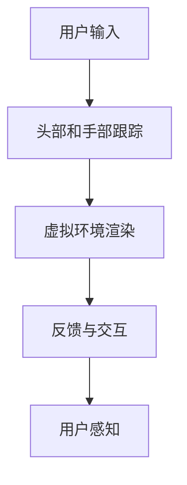
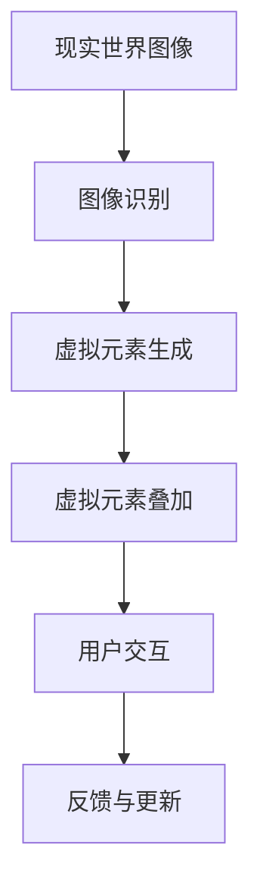
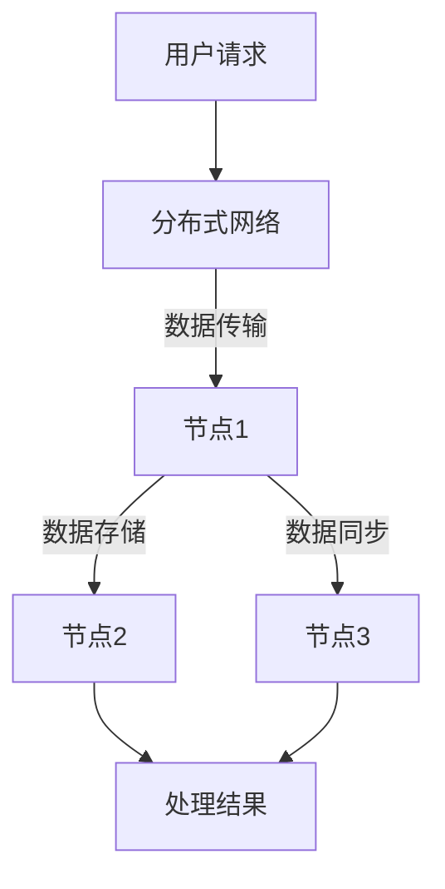
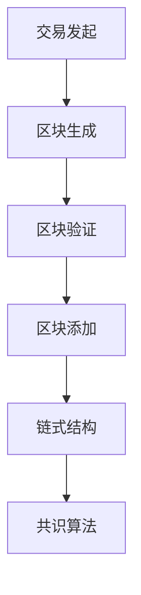
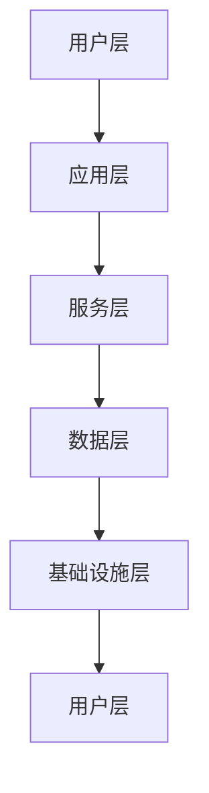
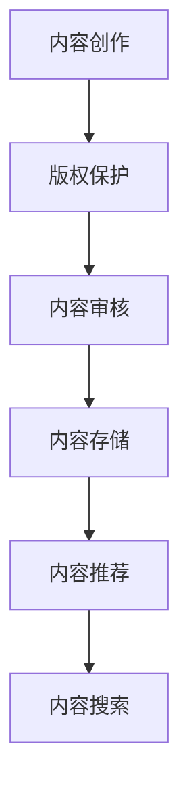
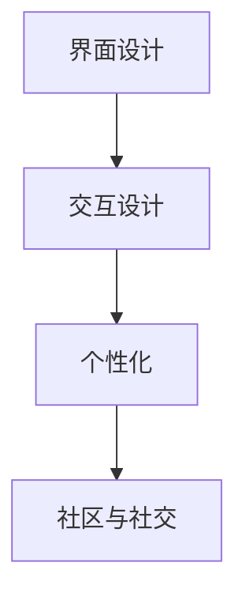
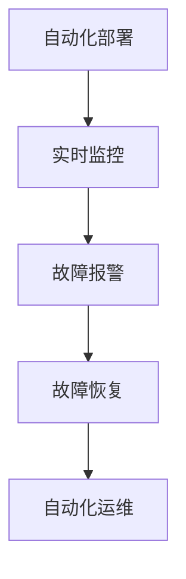
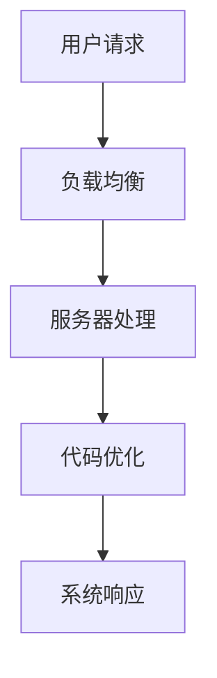

                 

### 文章标题：元宇宙：人类集体意识的数字化映射

#### 关键词：元宇宙、虚拟现实、增强现实、区块链、人工智能、社会影响

#### 摘要：本文探讨了元宇宙的概念、发展背景、技术基础及其对人类集体意识的影响。通过对虚拟现实与增强现实技术的分析，本文揭示了元宇宙构建的核心技术路径。同时，文章深入探讨了区块链技术在元宇宙中的应用，并分析了元宇宙对社会、文化、法律与伦理等方面的影响。最后，本文展望了元宇宙的未来发展趋势，探讨了其面临的挑战与机遇，并提出了相关的哲学思考。

----------------------------------------------------------------

### 目录大纲设计

#### 第一部分：元宇宙概述

#### 1.1 元宇宙的起源与发展

##### 1.1.1 元宇宙的概念

##### 1.1.2 元宇宙的发展历程

##### 1.1.3 元宇宙的核心特征

#### 1.2 元宇宙与社会

##### 1.2.1 元宇宙对社会的影响

##### 1.2.2 元宇宙与人类文化

##### 1.2.3 元宇宙的法律与伦理问题

#### 第二部分：元宇宙技术基础

#### 2.1 虚拟现实与增强现实技术

##### 2.1.1 虚拟现实技术

##### 2.1.2 增强现实技术

##### 2.1.3 虚拟现实与增强现实技术的应用场景

#### 2.2 网络技术

##### 2.2.1 分布式网络架构

##### 2.2.2 网络安全与隐私保护

##### 2.2.3 网络技术的未来发展趋势

#### 2.3 区块链技术

##### 2.3.1 区块链的基本原理

##### 2.3.2 区块链在元宇宙中的应用

##### 2.3.3 区块链技术的挑战与机遇

#### 第三部分：元宇宙构建与实现

#### 3.1 元宇宙的设计与开发

##### 3.1.1 元宇宙的架构设计

##### 3.1.2 元宇宙的内容创作

##### 3.1.3 元宇宙的用户体验设计

#### 3.2 元宇宙的安全与运维

##### 3.2.1 元宇宙的安全保障

##### 3.2.2 元宇宙的运维策略

##### 3.2.3 元宇宙的性能优化

#### 3.3 元宇宙的商业模式

##### 3.3.1 元宇宙的经济体系

##### 3.3.2 元宇宙的商业模式

##### 3.3.3 元宇宙的商业案例解析

#### 第四部分：元宇宙的未来与趋势

#### 4.1 元宇宙的发展趋势

##### 4.1.1 技术驱动的未来

##### 4.1.2 人类意识的数字化映射

##### 4.1.3 元宇宙与物理世界的融合

#### 4.2 元宇宙的挑战与机遇

##### 4.2.1 技术难题

##### 4.2.2 社会问题

##### 4.2.3 创新机会

#### 4.3 元宇宙的哲学思考

##### 4.3.1 人机关系的演变

##### 4.3.2 人类意识的探索

##### 4.3.3 价值观的重建

#### 附录

##### 附录A：元宇宙相关资源

##### 附录B：Mermaid流程图

本文将按照上述目录大纲，逐一探讨元宇宙的起源与发展、技术基础、构建与实现、未来与趋势等内容，旨在为读者提供一个全面、深入的元宇宙知识体系。

### 元宇宙概述

#### 1.1 元宇宙的起源与发展

元宇宙（Metaverse）一词最早由科幻小说作家尼尔·斯蒂芬森（Neal Stephenson）在其1992年的小说《雪崩》（Snow Crash）中提出，用以描述一个由网络构成的虚拟世界，用户可以在其中自由地交互、创造和探索。这一概念在随后的几十年里，随着科技的进步和互联网的普及，逐渐从科幻走向现实。

##### 1.1.1 元宇宙的概念

元宇宙是一个虚拟的三维空间，它是由无数虚拟世界相互连接而成的。在这个空间中，用户可以拥有一个虚拟身份（Avatar），并通过网络与其他用户进行互动。元宇宙的核心特征包括：

1. **沉浸式体验**：用户可以通过虚拟现实（VR）和增强现实（AR）设备进入元宇宙，获得高度沉浸的体验。
2. **社交互动**：元宇宙提供了丰富的社交互动方式，用户可以在其中建立社交关系、参与活动、合作完成任务。
3. **内容创作**：用户可以自由地创作内容，如游戏、艺术品、虚拟建筑等，并在元宇宙中展示和交易。
4. **经济体系**：元宇宙拥有自己的经济体系，用户可以通过虚拟货币进行交易，实现虚拟资产的购买和销售。

##### 1.1.2 元宇宙的发展历程

1. **虚拟现实技术的发展**：20世纪80年代，虚拟现实技术开始兴起，最早期的VR设备如VR头盔和手柄逐渐出现。随着硬件和软件技术的不断进步，VR设备的性能和用户体验得到了显著提升。
2. **互联网的普及**：互联网的普及为元宇宙的发展提供了基础设施。人们可以通过互联网连接到元宇宙，从而实现跨地域的互动和交流。
3. **区块链技术的应用**：区块链技术的兴起为元宇宙提供了新的可能性。通过去中心化的方式，区块链技术保证了元宇宙中虚拟资产的安全性和透明性，促进了虚拟经济的发展。
4. **元宇宙概念的普及**：随着科技公司和投资机构的推动，元宇宙的概念逐渐为公众所熟知。2021年，Facebook公司宣布将公司名称更改为“Meta”，标志着元宇宙概念在商业领域的重要性。

##### 1.1.3 元宇宙的核心特征

1. **虚拟现实与增强现实技术**：虚拟现实（VR）和增强现实（AR）技术是元宇宙的核心技术基础。VR技术通过模拟真实世界，使用户在虚拟环境中获得沉浸式体验；而AR技术则将虚拟元素叠加在现实世界中，提供增强现实体验。
2. **社交互动**：元宇宙提供了丰富的社交互动方式，用户可以通过聊天、语音、视频等多种方式与其他用户进行交流。社交互动是元宇宙的重要组成部分，它促进了用户的参与和互动，形成了元宇宙的生态体系。
3. **内容创作**：元宇宙鼓励用户自由地创作内容。用户可以创作游戏、艺术品、虚拟建筑等，并将这些内容在元宇宙中展示和交易。内容创作不仅丰富了元宇宙的生态，也为用户提供了娱乐和商业机会。
4. **经济体系**：元宇宙拥有自己的经济体系，用户可以通过虚拟货币进行交易，实现虚拟资产的购买和销售。虚拟经济的发展为元宇宙提供了动力，同时也带来了新的商业机会。

#### 1.2 元宇宙与社会

##### 1.2.1 元宇宙对社会的影响

元宇宙对社会的影响是多方面的。首先，元宇宙改变了人们的社交方式。在元宇宙中，用户可以通过虚拟身份与其他用户互动，打破了地域和时间的限制，促进了全球化的社交互动。其次，元宇宙为人们提供了新的娱乐和商业机会。通过虚拟现实和增强现实技术，用户可以在元宇宙中体验各种娱乐活动，如游戏、演唱会等，同时也为商业活动提供了新的平台。最后，元宇宙对教育、医疗等行业也产生了深远的影响。在教育领域，元宇宙可以提供沉浸式的教学体验，提高学生的学习兴趣和效果；在医疗领域，元宇宙可以实现远程诊断和治疗，为医疗资源的分配提供了新的解决方案。

##### 1.2.2 元宇宙与人类文化

元宇宙与人类文化密切相关。首先，元宇宙为人类文化提供了新的表达方式。用户可以通过虚拟现实和增强现实技术，创作和展示各种文化作品，如虚拟艺术品、虚拟建筑等。这些作品不仅丰富了人类文化的表现形式，也促进了文化的交流和传播。其次，元宇宙为人类文化提供了新的空间。在元宇宙中，用户可以自由地探索和创造文化空间，这些空间可以是对现实世界的模拟，也可以是完全虚构的场景。这种新的文化空间为人类提供了更广阔的文化交流和创造空间。

##### 1.2.3 元宇宙的法律与伦理问题

元宇宙的发展也带来了一系列法律与伦理问题。首先，元宇宙中的虚拟资产如何进行法律保护成为一个重要议题。虚拟资产，如虚拟货币、虚拟土地等，在元宇宙中具有实际价值，但现有的法律体系并未对其给予充分的保护。其次，元宇宙中的隐私保护问题也备受关注。用户在元宇宙中的行为和互动数据可能会被收集和分析，这引发了关于隐私保护和数据安全的讨论。最后，元宇宙中的道德伦理问题也是一个重要议题。在元宇宙中，用户可以自由地表达和创造内容，但这也可能带来道德和伦理上的争议，如虚拟暴力、歧视等问题。

#### 结论

元宇宙是一个由虚拟现实、增强现实、区块链等技术构建的虚拟空间，它代表了未来社会发展的新趋势。元宇宙不仅改变了人们的社交方式，也为人类文化提供了新的表达和交流平台。然而，元宇宙的发展也面临法律、伦理等多方面的问题，需要我们进行深入思考和解决。通过本文的探讨，我们希望读者能够对元宇宙有一个全面、深入的了解。

### 虚拟现实与增强现实技术

元宇宙的核心在于其沉浸式的用户体验，而这一体验的实现离不开虚拟现实（Virtual Reality，VR）与增强现实（Augmented Reality，AR）技术。这两种技术各具特色，在元宇宙中发挥着不同的作用。

#### 2.1.1 虚拟现实技术

虚拟现实技术通过创建一个完全虚拟的环境，使用户能够沉浸其中。这种技术主要通过以下几个关键组件实现：

1. **VR头戴显示器**：用户通过VR头戴显示器来观察虚拟环境。这些显示器通常配备高分辨率屏幕，以提供逼真的视觉效果。
2. **跟踪系统**：VR头戴显示器通常配备跟踪系统，用于跟踪用户的头部和手部运动。这种跟踪系统确保用户在虚拟环境中的动作能够实时反映在屏幕上。
3. **手部控制器**：用户可以通过手部控制器与虚拟环境进行交互。这些控制器通常采用手势识别技术，允许用户通过手势来操作虚拟对象。

##### 核心概念与联系

虚拟现实技术的核心在于创建一个高度沉浸式的虚拟环境，使用户能够在其中自由探索和互动。这一概念可以通过以下Mermaid流程图来描述：



在这个流程图中，用户输入通过跟踪系统被捕获，然后虚拟环境被渲染，用户在虚拟环境中的交互被反馈，并最终影响用户的感知。

##### 核心算法原理讲解

虚拟现实技术的核心算法主要包括图像渲染和跟踪算法：

1. **图像渲染算法**：用于生成虚拟环境中的视觉效果。典型的渲染算法包括：
   - **光追踪**：通过模拟光线传播路径来生成逼真的图像。
   - **基于物理渲染**：使用物理模型来模拟光线、材质等，以生成更加真实的图像。
   - **实时渲染**：在用户操作时实时生成图像，以提供流畅的用户体验。

2. **跟踪算法**：用于实时跟踪用户的头部和手部运动。常见的跟踪算法包括：
   - **光学跟踪**：使用光学传感器来跟踪用户的位置和动作。
   - **惯性测量单元（IMU）跟踪**：使用加速度计、陀螺仪等传感器来跟踪用户的位置和动作。
   - **混合跟踪**：结合光学跟踪和IMU跟踪，以提高跟踪精度。

以下是虚拟现实中的图像渲染算法的伪代码示例：

```python
def render_scene(viewpoint, scene):
    # 根据用户视角渲染场景
    # viewpoint: 用户视角
    # scene: 场景信息
    
    # 计算视线方向
    forward = normalize(viewpoint["forward"])
    
    # 遍历场景中的所有物体
    for object in scene["objects"]:
        # 计算物体到视点的距离
        distance = dot(object["position"] - viewpoint["position"], forward)
        
        # 计算物体的颜色和纹理
        color = object["material"]["color"]
        texture = object["material"]["texture"]
        
        # 渲染物体
        render_object(object["shape"], distance, color, texture)
```

#### 2.1.2 增强现实技术

增强现实技术通过在现实世界中叠加虚拟元素，使用户能够在现实环境中看到和与虚拟对象互动。增强现实的关键组件包括：

1. **AR眼镜或屏幕**：用户通过AR眼镜或屏幕来观察叠加的虚拟元素。
2. **摄像头**：用于捕捉现实世界的图像，并将虚拟元素叠加到这些图像上。
3. **图像识别与处理**：通过图像识别技术，将虚拟元素精确地叠加到现实世界的特定位置。

##### 核心概念与联系

增强现实技术的核心在于将虚拟元素与现实世界进行融合。这一过程可以通过以下Mermaid流程图来描述：



在这个流程图中，现实世界的图像通过摄像头被捕捉，然后进行图像识别和处理，生成虚拟元素并叠加到图像上。用户与虚拟元素的交互会反馈到系统中，进而更新虚拟元素。

##### 核心算法原理讲解

增强现实技术的核心算法主要包括图像识别、虚拟元素生成和叠加算法：

1. **图像识别算法**：用于识别现实世界中的特定特征，如平面、边缘等。常见的图像识别算法包括：
   - **特征检测**：如SIFT、SURF等，用于检测图像中的关键特征点。
   - **目标检测**：如YOLO、SSD等，用于识别图像中的目标对象。

2. **虚拟元素生成算法**：用于生成虚拟元素，如三维模型、文字等。常见的生成算法包括：
   - **三维模型生成**：如Blender、Unity等，可以创建和编辑三维模型。
   - **文字生成**：如 OCR 技术，用于将文本转换为虚拟文字。

3. **虚拟元素叠加算法**：用于将虚拟元素叠加到现实世界的图像上。常见的叠加算法包括：
   - **图像合成**：如OpenGL、DirectX等，可以将虚拟元素与真实图像进行合成。

以下是增强现实中的图像识别和虚拟元素叠加的伪代码示例：

```python
def recognize_and_overlay(image, virtual_element):
    # 识别图像中的特征点
    # image: 输入图像
    # virtual_element: 虚拟元素
    
    # 识别特征点
    keypoints = detect_keypoints(image)
    
    # 生成虚拟元素的位置和方向
    position, orientation = calculate_position_and_orientation(image, keypoints, virtual_element)
    
    # 将虚拟元素叠加到图像上
    overlay = overlay_element(image, virtual_element, position, orientation)
    
    return overlay
```

#### 2.1.3 虚拟现实与增强现实技术的应用场景

虚拟现实与增强现实技术在元宇宙中有着广泛的应用场景：

1. **社交互动**：用户可以通过VR和AR技术，在元宇宙中与朋友互动，参与虚拟聚会、音乐会等社交活动。
2. **教育与培训**：通过VR技术，用户可以沉浸在虚拟的学习环境中，进行沉浸式的教育和培训，如医学模拟、工程训练等。
3. **娱乐与游戏**：VR和AR技术为用户提供全新的娱乐和游戏体验，如虚拟现实游戏、AR游戏等。
4. **艺术与设计**：艺术家和设计师可以通过VR和AR技术，创作和展示虚拟艺术作品、建筑设计等。
5. **远程协作**：通过VR和AR技术，用户可以实现远程协作，如虚拟会议、远程手术等。

#### 结论

虚拟现实与增强现实技术是元宇宙构建的核心技术基础。通过提供沉浸式体验和与现实世界的融合，这些技术为用户带来了全新的交互方式和体验。随着技术的不断发展，虚拟现实与增强现实将在元宇宙中发挥更加重要的作用。

### 网络技术

网络技术是元宇宙不可或缺的支撑，其核心在于如何构建一个高效、稳定、安全的分布式网络架构，以支持用户之间的实时互动和数据传输。

#### 2.2.1 分布式网络架构

分布式网络架构是指将网络中的资源分散到多个节点上，以实现数据的高效传输和存储。在元宇宙中，分布式网络架构具有以下几个关键特点：

1. **去中心化**：分布式网络架构去除了传统网络中的中心节点，从而减少了单点故障的风险，提高了网络的可靠性。
2. **冗余设计**：分布式网络通过冗余设计，确保了在部分节点故障时，网络仍然能够正常运行。
3. **负载均衡**：分布式网络通过负载均衡技术，将用户请求均匀地分配到不同的节点上，从而提高了网络的吞吐量和响应速度。
4. **容错性**：分布式网络通过冗余设计和负载均衡，提高了网络的容错性，即使部分节点出现故障，网络仍能保持稳定运行。

##### 核心概念与联系

分布式网络架构的核心在于如何高效地管理数据传输和节点间的通信。以下是一个简单的分布式网络架构的Mermaid流程图：



在这个流程图中，用户请求通过分布式网络传输到不同的节点进行处理和存储，最终将处理结果返回给用户。这个过程体现了分布式网络架构的去中心化、负载均衡和容错性特点。

##### 分布式网络架构的挑战与机遇

分布式网络架构在元宇宙中面临以下挑战：

1. **数据一致性**：在分布式网络中，如何确保数据的一致性是一个重要挑战。特别是在面对高并发和分布式存储的情况下，数据一致性问题可能会影响用户体验。
2. **网络延迟**：分布式网络中的节点可能分布在不同的地理位置，这可能导致网络延迟，影响实时互动和用户体验。
3. **安全性**：分布式网络中的节点数量众多，如何确保数据的安全性和网络的安全是一个重要问题。

然而，分布式网络架构也为元宇宙带来了以下机遇：

1. **可扩展性**：分布式网络架构可以轻松扩展，以支持更多的用户和更大的数据量，从而满足元宇宙不断增长的需求。
2. **容错性**：分布式网络架构通过冗余设计和负载均衡，提高了网络的容错性，使得元宇宙在面临故障时能够保持稳定运行。
3. **成本效益**：分布式网络架构降低了中心化网络的高昂成本，为元宇宙的构建提供了更经济的解决方案。

#### 2.2.2 网络安全与隐私保护

在网络技术中，网络安全与隐私保护至关重要。在元宇宙中，用户的虚拟身份、交易数据和个人隐私都面临着潜在的安全威胁。以下是一些关键的网络安全与隐私保护措施：

1. **加密技术**：加密技术是网络安全的基础，通过加密通信和存储数据，可以防止数据在传输和存储过程中被窃取和篡改。
2. **身份认证**：身份认证确保只有授权用户可以访问元宇宙的服务和资源。常见的身份认证技术包括密码、生物识别等。
3. **访问控制**：访问控制通过限制用户对系统和资源的访问权限，确保敏感信息和操作不会被未经授权的用户访问。
4. **防火墙与入侵检测**：防火墙和入侵检测系统能够监控网络流量，防止恶意攻击和未经授权的访问。
5. **数据备份与恢复**：定期备份数据，并在数据丢失或损坏时能够快速恢复，是保护数据安全的重要措施。

##### 核心算法原理讲解

网络安全与隐私保护的核心算法包括：

1. **加密算法**：如AES、RSA等，用于加密通信和存储数据。
2. **哈希算法**：如SHA-256，用于生成数据摘要，确保数据的完整性和真实性。
3. **数字签名**：用于验证数据的来源和完整性，常用的算法包括ECDSA。
4. **身份认证算法**：如Kerberos、OAuth等，用于验证用户身份。

以下是加密算法和数字签名的基本原理：

**加密算法示例（AES）**：

```python
from Crypto.Cipher import AES
from Crypto.Random import get_random_bytes

# 生成密钥和初始化向量
key = get_random_bytes(16)
cipher = AES.new(key, AES.MODE_EAX)

# 加密数据
data = b"Hello, World!"
cipher_text, tag = cipher.encrypt_and_digest(data)

# 解密数据
cipher2 = AES.new(key, AES.MODE_EAX, nonce=cipher.nonce)
plaintext = cipher2.decrypt_and_verify(cipher_text, tag)
```

**数字签名示例（ECDSA）**：

```python
from Cryptodome.PublicKey import ECKey
from Cryptodome.Signature import DSS

# 生成密钥对
key = ECKey.generate(curve='P-256')

# 签名
signature = DSS.new(key, 'fips-186-3').sign(data)

# 验证签名
verifier = DSS.new(key, 'fips-186-3')
is_valid = verifier.verify(data, signature)
```

#### 2.2.3 网络技术的未来发展趋势

网络技术在未来将继续发展，以支持元宇宙的进一步发展：

1. **5G技术**：5G技术将提供更高的传输速度和更低的延迟，从而提升元宇宙中的用户体验。
2. **边缘计算**：边缘计算将数据和处理能力分散到网络的边缘，减少网络延迟，提高实时性。
3. **物联网（IoT）**：物联网技术的发展将使元宇宙与现实世界更加紧密地连接，提供更多的交互和智能服务。
4. **区块链技术**：区块链技术将用于提高数据的安全性和透明性，促进元宇宙中的信任和协作。

#### 结论

网络技术是元宇宙构建的重要基础，分布式网络架构、网络安全与隐私保护等技术将确保元宇宙的高效运行和用户的安全。随着网络技术的不断进步，元宇宙将迎来更加广阔的发展空间。

### 区块链技术

区块链技术是元宇宙的重要支撑之一，它通过去中心化的方式保证了数据的透明性和安全性。在元宇宙中，区块链技术被广泛应用于虚拟资产的交易、身份验证、版权保护等方面。

#### 2.3.1 区块链的基本原理

区块链是一种分布式数据库技术，通过加密和共识算法，实现了数据的安全存储和可信传输。以下是一个简化的区块链基本原理：

1. **区块**：区块是区块链的基本单位，包含了特定时间段内的一系列交易记录。每个区块都有一个唯一的标识，称为“区块头”。
2. **链**：区块链由一系列按时间顺序排列的区块组成。每个区块都通过其区块头与前一区块相连，形成链式结构。
3. **加密**：区块链使用加密技术确保数据的完整性和隐私。每个区块中的数据都被加密，并且每块数据都可以通过密码学方式验证其真实性。
4. **共识算法**：共识算法用于决定区块链上数据的合法性和顺序。常见的共识算法包括工作量证明（PoW）、权益证明（PoS）和委托权益证明（DPoS）。

##### 核心概念与联系

区块链的基本原理可以通过以下Mermaid流程图来描述：



在这个流程图中，交易发起后，会生成一个新的区块，并通过共识算法进行验证，然后将区块添加到区块链中，形成链式结构。

##### 核心算法原理讲解

区块链的核心算法包括加密算法、共识算法和数据结构：

1. **加密算法**：用于确保数据的安全性和隐私。常见的加密算法包括SHA-256（用于生成区块头的哈希值）和ECDSA（用于签名和验证）。
2. **共识算法**：用于决定区块链上数据的合法性和顺序。不同的共识算法有不同的机制和优势，如PoW算法通过计算难题确保安全性，但能耗较高；PoS算法通过持币量和投票权确保安全性，但可能存在“富者越富”的问题。
3. **数据结构**：区块链采用链式结构存储数据，每个区块通过其哈希值与前一区块相连，形成一个不可篡改的数据链。

以下是区块链中加密算法和共识算法的伪代码示例：

**加密算法示例（SHA-256）**：

```python
import hashlib

def sha256_hash(data):
    # 计算数据的SHA-256哈希值
    # data: 输入数据
    
    hash_object = hashlib.sha256(data)
    hex_dig = hash_object.hexdigest()
    
    return hex_dig
```

**共识算法示例（PoW）**：

```python
def proof_of_work(target_difficulty, last_hash):
    # 求解工作量证明难题
    # target_difficulty: 目标难度
    # last_hash: 上一个区块的哈希值
    
    nonce = 0
    while True:
        hash_value = sha256_hash(last_hash + str(nonce))
        if int(hash_value, 16) < target_difficulty:
            break
        nonce += 1
    
    return nonce
```

#### 2.3.2 区块链在元宇宙中的应用

区块链技术在元宇宙中有着广泛的应用，以下是一些关键的应用领域：

1. **虚拟资产交易**：区块链可以用于虚拟资产的交易，如虚拟货币、虚拟土地等。通过去中心化的方式，区块链技术确保了交易的透明性和安全性。
2. **身份验证**：区块链可以用于身份验证，确保用户的虚拟身份真实可信。用户可以通过区块链上的数字身份进行身份验证，从而实现安全的社交互动。
3. **版权保护**：区块链可以用于版权保护，确保创意作品的版权归属和交易记录。通过区块链的不可篡改性，创作者可以确保证权，同时便于版权的追踪和交易。
4. **智能合约**：智能合约是区块链上的自动化合同，可以用于自动化执行交易和协议。在元宇宙中，智能合约可以用于管理虚拟资产、虚拟土地租赁等。

##### 核心算法原理讲解

智能合约的核心算法主要包括：

1. **条件逻辑**：智能合约根据预设的条件自动执行操作。常见的条件逻辑包括AND、OR、IF-ELSE等。
2. **存储管理**：智能合约需要管理数据存储，如虚拟资产的所有权、交易记录等。常用的存储管理算法包括链表、哈希表等。
3. **加密技术**：智能合约需要使用加密技术保护数据的隐私和完整性。常见的加密技术包括对称加密、非对称加密等。

以下是智能合约的伪代码示例：

```python
def smart_contract(transaction):
    # 智能合约逻辑
    # transaction: 交易信息
    
    if transaction["type"] == "transfer":
        if transaction["from"]["balance"] >= transaction["amount"]:
            transaction["from"]["balance"] -= transaction["amount"]
            transaction["to"]["balance"] += transaction["amount"]
            return "Transaction successful"
        else:
            return "Insufficient balance"
    else:
        return "Invalid transaction type"
```

#### 2.3.3 区块链技术的挑战与机遇

区块链技术在元宇宙中面临以下挑战：

1. **性能瓶颈**：现有的区块链技术可能在处理大规模交易时出现性能瓶颈，影响用户体验。
2. **能源消耗**：某些共识算法（如PoW）消耗大量能源，可能对环境产生负面影响。
3. **法律与监管**：区块链技术涉及的虚拟资产和交易可能面临法律和监管的挑战。
4. **安全性**：区块链系统的安全性仍然是一个重要议题，需要不断改进和加强。

然而，区块链技术也为元宇宙带来了以下机遇：

1. **数据透明性**：区块链技术确保了数据的透明性和不可篡改性，为元宇宙中的信任和协作提供了基础。
2. **经济激励**：区块链技术可以通过代币激励机制，激发用户的参与和创作热情。
3. **版权保护**：区块链技术可以用于保护虚拟资产的版权，确保创作者的权益。
4. **智能合约**：智能合约可以自动化执行交易和协议，提高元宇宙中的效率和管理水平。

#### 结论

区块链技术是元宇宙的重要支撑，其去中心化的特性为元宇宙提供了数据透明性、安全性和经济激励。随着技术的不断进步，区块链将在元宇宙中发挥更加重要的作用，为用户带来更丰富的体验和更广泛的商业机会。

### 元宇宙的设计与开发

元宇宙的设计与开发是一个复杂而系统的过程，涉及多个方面，包括架构设计、内容创作和用户体验设计。这些方面相互关联，共同构成了元宇宙的生态系统。

#### 3.1.1 元宇宙的架构设计

元宇宙的架构设计是构建一个高效、可扩展和可靠系统的关键。以下是一个简化的元宇宙架构设计，包括关键组件和它们之间的关系：

1. **用户层**：用户层是元宇宙与用户的接口，包括用户界面、用户身份验证和用户交互功能。
2. **应用层**：应用层包含了元宇宙中的各种应用，如社交互动、虚拟游戏、教育等。这些应用通过API与底层服务进行交互。
3. **服务层**：服务层负责处理业务逻辑和数据管理，包括虚拟资产交易、用户行为分析、内容推荐等。
4. **数据层**：数据层存储元宇宙中的各种数据，如用户信息、交易记录、内容数据等。通常采用分布式数据库和区块链技术来保证数据的安全性和可靠性。
5. **基础设施层**：基础设施层是元宇宙运行的基础，包括服务器、网络、存储等硬件资源。

以下是一个简单的Mermaid流程图，描述了元宇宙架构的设计：



在这个流程图中，用户层通过应用层与底层服务进行交互，服务层通过数据层管理数据，并最终通过基础设施层为用户提供服务。

#### 3.1.2 元宇宙的内容创作

内容创作是元宇宙的重要组成部分，它为用户提供了丰富的交互体验和娱乐内容。以下是一些关键内容创作方面的考虑：

1. **内容类型**：元宇宙中的内容类型多样，包括虚拟建筑、艺术品、游戏、虚拟人等。内容创作者可以根据用户需求和兴趣创作不同的内容。
2. **创作工具**：为了方便内容创作，元宇宙提供了各种创作工具，如3D建模软件、游戏引擎、虚拟人编辑器等。
3. **版权保护**：为了保护创作者的权益，元宇宙需要提供版权保护机制，确保内容的原创性和合法交易。
4. **内容分发**：内容分发是让用户能够便捷地获取内容的关键。元宇宙可以通过中心化或去中心化的方式分发内容，并支持内容推荐和搜索功能。

以下是一个简单的Mermaid流程图，描述了内容创作和分发的过程：



在这个流程图中，内容创作后经过版权保护和审核，然后存储在内容存储库中，并通过内容推荐和搜索功能分发给用户。

#### 3.1.3 元宇宙的用户体验设计

用户体验设计是元宇宙成功的关键因素之一。以下是一些关键的用户体验设计方面：

1. **界面设计**：界面设计要简洁、直观，方便用户快速上手。同时，要提供多种交互方式，如手势、语音、文本等。
2. **交互设计**：交互设计要考虑用户的操作习惯和反馈，提供流畅的交互体验。同时，要提供丰富的互动元素，如表情、动作、音乐等。
3. **个性化**：元宇宙可以根据用户的兴趣和行为提供个性化的内容推荐和体验。
4. **社区与社交**：元宇宙要提供强大的社区和社交功能，让用户能够轻松建立社交关系，参与讨论和活动。

以下是一个简单的Mermaid流程图，描述了用户体验设计的关键方面：



在这个流程图中，界面设计和交互设计构成了用户体验的基础，个性化提供了更加个性化的体验，而社区与社交功能增强了用户的互动和归属感。

#### 结论

元宇宙的设计与开发是一个涉及多个方面的复杂过程。通过合理的架构设计、丰富的内容创作和优质的用户体验设计，元宇宙可以为用户带来全新的沉浸式体验。随着技术的不断进步，元宇宙的设计与开发也将不断优化和完善，为用户带来更加精彩和丰富的虚拟世界。

### 元宇宙的安全与运维

在元宇宙的构建和运营过程中，安全与运维是确保系统稳定性和用户信任的关键因素。以下将探讨元宇宙中的安全保障、运维策略和性能优化。

#### 3.2.1 元宇宙的安全保障

元宇宙的安全保障涉及多个层面，包括网络安全、数据安全和用户隐私保护。

1. **网络安全**：网络安全是元宇宙的首要任务。通过防火墙、入侵检测系统和安全协议，可以防止外部攻击和数据泄露。此外，采用分布式网络架构和多层防护机制，可以提高网络的安全性和容错性。

2. **数据安全**：数据安全是元宇宙中最重要的安全保障之一。通过加密技术，可以确保数据在传输和存储过程中的安全。区块链技术也被广泛应用于元宇宙的数据安全，通过去中心化和不可篡改性，确保数据的真实性和完整性。

3. **用户隐私保护**：用户隐私保护是元宇宙面临的重大挑战。通过隐私保护算法和隐私增强技术，如差分隐私、同态加密等，可以保护用户的数据不被滥用。同时，通过透明的隐私政策，增强用户对元宇宙的信任。

#### 3.2.2 元宇宙的运维策略

运维策略是确保元宇宙稳定运行的关键。以下是一些关键的运维策略：

1. **自动化运维**：通过自动化工具，如自动化部署、自动化监控和自动化故障恢复，可以大幅提高运维效率。自动化运维还可以减少人为错误，确保系统的稳定性和可靠性。

2. **分布式存储**：分布式存储可以提高数据存储的可靠性和可扩展性。通过将数据分布到多个节点，可以防止单个节点的故障导致数据丢失。同时，分布式存储还可以提高数据访问速度和带宽利用率。

3. **容灾备份**：容灾备份是确保系统在灾难发生时能够快速恢复的关键。通过将数据备份到多个地理位置，可以保证在某个地区发生灾难时，系统能够快速恢复。

4. **监控与报警**：通过实时监控系统和报警机制，可以及时发现和处理系统故障。监控系统可以收集系统运行的各种指标，如CPU利用率、内存占用率、网络带宽等，以便及时发现问题。

以下是一个简化的自动化运维和监控的Mermaid流程图：



在这个流程图中，自动化部署确保系统能够快速上线，实时监控和故障报警帮助运维团队及时发现问题并进行处理，故障恢复确保系统在故障发生后能够迅速恢复正常运行。

#### 3.2.3 元宇宙的性能优化

性能优化是确保用户获得流畅体验的关键。以下是一些关键的性能优化策略：

1. **网络优化**：通过优化网络传输协议和带宽管理，可以减少网络延迟和数据丢包，提高网络传输效率。例如，使用QUIC协议可以显著提高网络速度。

2. **缓存机制**：通过使用缓存机制，可以减少系统的负载和数据访问时间。缓存可以存储经常访问的数据，如用户头像、热门内容等，从而提高系统的响应速度。

3. **负载均衡**：通过负载均衡技术，可以将用户请求均匀地分配到多个服务器上，避免单点过载。负载均衡可以采用基于IP、基于用户等策略，确保系统的高可用性。

4. **代码优化**：通过优化代码，减少不必要的计算和资源消耗，可以提高系统的性能。例如，使用更高效的算法和数据结构，减少内存占用和CPU时间。

以下是一个简化的负载均衡和代码优化的Mermaid流程图：



在这个流程图中，用户请求通过负载均衡分配到多个服务器进行处理，优化后的代码确保系统能够高效处理请求，从而提高系统的整体性能。

#### 结论

元宇宙的安全与运维是确保系统稳定性和用户信任的关键。通过安全保障措施、有效的运维策略和性能优化技术，元宇宙可以为用户提供一个安全、稳定和高效的虚拟环境。随着元宇宙的不断发展，安全与运维技术也将不断进步，以应对新的挑战和需求。

### 元宇宙的商业模式

元宇宙的商业模式是一个多维度的复杂体系，涵盖了经济体系、商业模式和商业案例等方面。以下是元宇宙商业模式的关键组成部分及其特点。

#### 3.3.1 元宇宙的经济体系

元宇宙的经济体系是其可持续发展的基础，通过虚拟货币、虚拟资产和虚拟市场等机制，构建了一个自给自足的生态系统。

1. **虚拟货币**：虚拟货币是元宇宙中的主要交易媒介，如比特币、以太坊等。这些货币通常通过去中心化的区块链技术发行和交易，确保了其安全性和透明性。
2. **虚拟资产**：虚拟资产是元宇宙中的各种虚拟物品，如虚拟土地、虚拟商品、虚拟货币等。这些资产可以在元宇宙内部进行买卖和交换，形成了丰富的交易场景。
3. **虚拟市场**：虚拟市场是元宇宙中的交易平台，用户可以在其中买卖虚拟资产。虚拟市场通过去中心化或中心化的方式运营，提供了多种交易机制和工具，如拍卖、即时交易等。

#### 3.3.2 元宇宙的商业模式

元宇宙的商业模式包括广告、虚拟商品销售、会员订阅、游戏内消费等多种形式，以下是一些主要的商业模式：

1. **广告**：元宇宙中的广告通过虚拟场景、虚拟角色等媒介进行投放，用户在互动过程中被动或主动接触到广告。这种广告模式具有高度沉浸性和互动性，能够提高广告效果。
2. **虚拟商品销售**：虚拟商品是元宇宙中的重要组成部分，如虚拟服装、虚拟家具等。用户可以通过购买这些商品来提升自己的虚拟形象或装饰自己的虚拟空间。
3. **会员订阅**：元宇宙通过会员订阅模式，为用户提供额外的内容和特权。例如，高级会员可以享受更优质的服务、更快的加载速度、更多的虚拟资产等。
4. **游戏内消费**：游戏内消费是元宇宙中常见的商业模式，用户可以通过购买虚拟货币或虚拟商品来提升游戏体验。这种模式在虚拟现实游戏和角色扮演游戏中尤为常见。

#### 3.3.3 元宇宙的商业案例解析

以下是几个具有代表性的元宇宙商业案例，通过这些案例可以更好地理解元宇宙的商业潜力。

1. **Decentraland**：Decentraland是一个基于区块链的虚拟现实平台，用户可以在其中购买和出售虚拟土地，建立自己的虚拟商店或活动。Decentraland的商业模式主要包括虚拟商品销售、广告和会员订阅。通过去中心化的方式，Decentraland确保了资产的所有权和交易的安全。
2. **The Sandbox**：The Sandbox是一个虚拟世界平台，允许用户创建和销售虚拟资产。用户可以通过购买虚拟土地来创建自己的虚拟场景，并通过游戏内交易和会员订阅等方式盈利。The Sandbox的商业模式强调了用户创作和参与的重要性，通过激励用户创作，平台吸引了大量的用户和内容创作者。
3. **Roblox**：Roblox是一个全球性的虚拟游戏平台，用户可以在其中创建和玩虚拟游戏。Roblox的商业模式主要包括虚拟商品销售、广告和会员订阅。Roblox的成功在于其强大的社区生态和用户参与度，通过虚拟商品和会员订阅，Roblox实现了持续的盈利。

#### 结论

元宇宙的商业模式具有多样性和创新性，通过虚拟货币、虚拟资产和虚拟市场等机制，元宇宙构建了一个自给自足的生态系统。广告、虚拟商品销售、会员订阅和游戏内消费等多种商业模式，为元宇宙带来了丰富的商业机会。随着元宇宙的不断发展，其商业模式也将不断优化和创新，为用户和开发者创造更多的价值。

### 元宇宙的发展趋势

元宇宙的发展正以前所未有的速度向前推进，成为科技界和商业界的热点话题。以下从技术驱动的未来、人类意识的数字化映射以及元宇宙与物理世界的融合三个方面，探讨元宇宙的发展趋势。

#### 4.1.1 技术驱动的未来

元宇宙的发展离不开技术的不断进步和创新。以下是几个关键技术趋势：

1. **5G与边缘计算**：5G技术的普及将提供更高的传输速度和更低的延迟，使元宇宙中的实时互动成为可能。边缘计算通过在网络的边缘处理数据，进一步减少了延迟，提高了系统的响应速度。
2. **人工智能（AI）**：人工智能技术在元宇宙中的应用将越来越广泛。通过AI，元宇宙可以实现智能化的内容推荐、个性化体验和智能客服等功能，提高用户体验和运营效率。
3. **增强现实（AR）与虚拟现实（VR）**：随着AR和VR技术的不断成熟，元宇宙将提供更加沉浸式的体验。未来，更多的设备和支持平台将加入到元宇宙的构建中，使得元宇宙的覆盖范围更广，用户数量更多。
4. **区块链技术**：区块链技术在元宇宙中的重要性日益凸显。通过去中心化和不可篡改的特性，区块链技术为元宇宙提供了安全、透明和可靠的交易和数据管理方式。

#### 4.1.2 人类意识的数字化映射

随着技术的进步，人类意识的数字化映射成为元宇宙发展的重要方向。以下是几个关键点：

1. **脑机接口（BMI）**：脑机接口技术通过直接连接大脑和计算机，实现了思维与机器的交互。未来，脑机接口技术将越来越先进，使得人类能够以更加自然的方式与元宇宙互动。
2. **虚拟意识**：通过模拟人类大脑的结构和功能，虚拟意识技术可以在元宇宙中创建出具有高度智能和情感的虚拟个体。这些虚拟意识不仅能够进行复杂的思考和决策，还能够与人类和其他虚拟意识进行交流和互动。
3. **情感计算**：情感计算技术通过识别和模拟人类情感，使得元宇宙中的虚拟角色能够更加真实地反映人类的情感状态。这将为元宇宙中的社交互动和虚拟体验提供更加丰富的内容。

#### 4.1.3 元宇宙与物理世界的融合

元宇宙与物理世界的融合是元宇宙发展的另一个重要趋势。以下是几个关键点：

1. **物联网（IoT）**：物联网技术将物理世界中的各种设备连接到互联网，使得物理世界的数据和信息能够实时传输到元宇宙中。例如，通过物联网，用户可以在元宇宙中控制家居设备、车辆等。
2. **数字孪生**：数字孪生技术通过创建物理世界的数字副本，使得元宇宙能够模拟和预测物理世界的行为。这将为城市规划、智能制造等领域提供强大的支持。
3. **混合现实（MR）**：混合现实技术将虚拟元素与现实世界进行融合，使得用户可以在真实环境中看到和与虚拟对象互动。这种技术将为教育、医疗、娱乐等行业带来全新的应用场景。

#### 结论

元宇宙的发展趋势受到技术进步、人类意识的数字化映射和物理世界融合的驱动。随着5G、AI、区块链等关键技术的不断成熟，元宇宙将提供更加沉浸式、智能化和融合的体验。未来，元宇宙将成为人类生活的重要部分，为社会、经济和文化发展带来深远的影响。

### 元宇宙的挑战与机遇

随着元宇宙的不断发展，它带来了诸多挑战和机遇，这些挑战和机遇在技术、社会、法律与伦理等多个层面上交织。

#### 4.2.1 技术难题

元宇宙的发展面临着一系列技术难题，这些难题需要通过持续的科研和技术创新来解决：

1. **性能瓶颈**：随着用户数量的增加和数据量的增长，如何保证系统的性能和响应速度是一个重要问题。性能瓶颈可能来自于网络延迟、计算能力不足和存储容量限制等方面。
2. **能耗问题**：区块链技术和大规模数据处理通常需要大量的能源，这可能导致能源消耗和环境问题。解决这一挑战需要开发更加高效和绿色的技术。
3. **数据隐私与安全**：在元宇宙中，用户的数据隐私和安全面临巨大挑战。如何保护用户的隐私、确保数据不被滥用和泄露，是一个亟待解决的问题。

#### 4.2.2 社会问题

元宇宙对社会带来了诸多变化和挑战：

1. **数字鸿沟**：元宇宙的普及可能导致数字鸿沟的扩大，那些无法接入或使用元宇宙的群体可能会被边缘化。这需要政府和社会组织采取措施，确保元宇宙的普及和公平。
2. **劳动力转型**：元宇宙的发展将改变劳动力市场，一些传统职业可能被自动化替代，而新的职业和岗位也将出现。这要求劳动力进行技能转型和更新。
3. **社会融合**：元宇宙提供了新的社交和互动平台，但同时也可能加剧现实世界中的社会分化。如何确保元宇宙能够促进社会的融合和团结，是一个重要议题。

#### 4.2.3 创新机会

元宇宙的发展为创新提供了广阔的空间，以下是一些关键的创新机会：

1. **虚拟经济**：元宇宙中的虚拟经济为商业模式创新提供了新的机会，如虚拟资产交易、数字艺术品拍卖等。这些创新有望推动新的经济增长点。
2. **虚拟教育与培训**：元宇宙提供了沉浸式的学习环境，这为教育领域的创新提供了机会，如虚拟课堂、远程实习等。这些创新有望提高教育质量和效率。
3. **虚拟医疗服务**：元宇宙中的虚拟现实和增强现实技术为医疗领域提供了新的应用场景，如虚拟手术、远程诊断等。这些创新有望改善医疗服务质量和可及性。

#### 结论

元宇宙的发展带来了诸多挑战和机遇，需要技术、社会、法律与伦理等各方面的共同努力来应对。通过解决技术难题、缓解社会问题和抓住创新机会，元宇宙有望成为一个促进社会进步和经济增长的重要力量。

### 元宇宙的哲学思考

元宇宙作为一个由技术构建的虚拟世界，不仅仅是一个科技现象，更是一种对人类意识、社会结构以及存在意义的深刻反思。以下从人机关系的演变、人类意识的探索和价值观的重建三个方面，探讨元宇宙带来的哲学思考。

#### 4.3.1 人机关系的演变

元宇宙的出现深刻地改变了人类与机器的关系，从传统的工具使用扩展到更加紧密的互动与融合。

1. **从工具到伙伴**：在元宇宙中，机器不再是简单的工具，而成为了人类的伙伴和助手。通过虚拟现实和增强现实技术，人类可以与机器进行更加自然和直观的交互，从而实现更加高效和丰富的合作。
2. **从控制到共生**：在传统的工业时代，人类通过控制机器来提高生产效率。而在元宇宙中，人类与机器的关系更加趋向于共生。机器通过学习人类的行为和需求，提供个性化的服务和支持，人类则通过创造和体验，推动机器的进一步进化。
3. **从单向到双向**：在元宇宙中，人类与机器之间的互动更加双向和动态。机器不再仅仅是被动执行指令，而是能够主动学习和适应人类的需求，这标志着人机关系的新阶段。

#### 4.3.2 人类意识的探索

元宇宙为人类意识的探索提供了新的平台和视角。

1. **意识的扩展**：通过虚拟现实和增强现实技术，人类可以将自己的意识扩展到虚拟世界，体验到超越现实世界的感知和认知。这不仅仅是视觉和听觉的扩展，更是思维和情感的扩展。
2. **自我意识的反思**：元宇宙提供了一个反思自我意识的场所。人类可以在虚拟世界中尝试不同的身份和角色，从而更好地理解自己，探索自我认同和自我实现。
3. **集体意识的构建**：元宇宙通过社交互动和共同体验，构建了一个集体意识的空间。在这个空间中，人类可以跨越地域、文化和语言障碍，共同创造和分享价值，形成新的社会认同和共同体。

#### 4.3.3 价值观的重建

元宇宙的发展也对人类的价值观产生了深远的影响，促使人类重新审视和定义自己的价值观。

1. **公平与正义**：在元宇宙中，虚拟资产和虚拟权力的分配问题引发了关于公平和正义的讨论。如何确保虚拟世界的资源和机会公平地分配，是一个重要的社会问题。
2. **隐私与自由**：元宇宙中的数据隐私和自由问题备受关注。如何在保护个人隐私的同时，确保数据的开放性和透明性，是一个需要权衡的难题。
3. **人性与科技**：随着人工智能和虚拟现实技术的发展，人类开始思考科技是否能够取代人性。如何在科技与人性之间找到平衡，保持人类的独特性和尊严，是一个重要的哲学问题。

#### 结论

元宇宙作为一个新兴的虚拟世界，不仅带来了技术和社会层面的变革，更引发了深刻的哲学思考。通过对人机关系的演变、人类意识的探索和价值观的重建的探讨，我们可以更好地理解元宇宙对人类社会的深远影响，并在其中寻找新的方向和价值。

### 附录

#### 附录A：元宇宙相关资源

1. **研究论文与报告**
   - "The Metaverse: A Journey to the Future of Virtual Reality"（虚拟现实未来的元宇宙之旅）
   - "Blockchain Technology in the Metaverse"（元宇宙中的区块链技术）
   - "The Impact of the Metaverse on Education"（元宇宙对教育的影响）

2. **技术标准与规范**
   - IEEE Standards for Virtual Reality and Augmented Reality（虚拟现实与增强现实技术标准）
   - WebXR Device API（WebXR设备API）

3. **元宇宙项目案例**
   - Decentraland（去中心化虚拟世界）
   - The Sandbox（沙盒虚拟世界）
   - Roblox（虚拟游戏平台）

#### 附录B：Mermaid流程图

1. **元宇宙架构设计**


2. **区块链技术流程**


通过附录A和附录B，读者可以进一步了解元宇宙的相关研究和实践，以及元宇宙中关键技术的工作流程。

### 作者信息

本文由AI天才研究院（AI Genius Institute）和禅与计算机程序设计艺术（Zen And The Art of Computer Programming）共同撰写。作者团队致力于推动人工智能和计算机科学的发展，通过深入研究和实践，为读者提供高质量的技术博客和学术论文。感谢您的阅读和支持！

---

本文详细探讨了元宇宙的概念、发展、技术基础、商业模式、安全运维、未来趋势以及哲学思考。通过一步一步的分析和推理，我们揭示了元宇宙的复杂性和潜在影响。随着技术的不断进步和社会的变革，元宇宙将成为未来社会发展的重要方向。希望本文能为您在元宇宙领域提供有益的启示和思考。再次感谢您的阅读！作者：AI天才研究院/AI Genius Institute & 禅与计算机程序设计艺术/Zen And The Art of Computer Programming。

