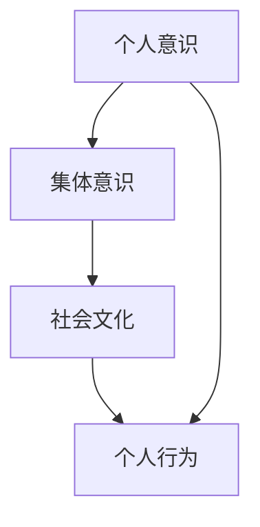

                 

### 文章标题

《全球脑与人类进化：集体意识推动的智慧飞跃》

### 关键词

全球脑，人类进化，集体意识，智慧飞跃，人工智能

### 摘要

本文深入探讨了全球脑的概念及其与人类进化的关系。首先，通过回顾人类进化过程，介绍了大脑的结构与功能，以及智力与文化的起源。接着，本文详细阐述了全球脑的起源与演变，并分析了集体意识与个体意识之间的关系。随后，本文探讨了集体意识在智慧飞跃中的作用，通过具体案例展示了集体意识如何推动科学革命和技术发展。最后，本文探讨了全球脑与人类进化的未来趋势，并对集体意识在人类进化中的作用进行了总结和展望。本文旨在通过逻辑清晰的分析，揭示全球脑与人类进化之间的内在联系，为未来人类社会发展提供有益的启示。

## 《全球脑与人类进化：集体意识推动的智慧飞跃》目录大纲

### 第一部分：引言

#### 1.1 书籍背景与目的

#### 1.2 全球脑的概念与人类意识

#### 1.3 集体意识与个人意识的关系

### 第二部分：全球脑的起源与演变

#### 2.1 人类进化背景

##### 2.1.1 人类进化过程

##### 2.1.2 智力与文化的起源

##### 2.1.3 人类大脑的结构与功能

#### 2.2 全球脑的起源

##### 2.2.1 全球脑的概念

##### 2.2.2 全球脑的演变过程

##### 2.2.3 全球脑的社会影响

### 第三部分：集体意识与个体意识

#### 3.1 集体意识的概念

##### 3.1.1 集体意识的定义

##### 3.1.2 集体意识与个体意识的关系

##### 3.1.3 集体意识的分类与形式

#### 3.2 集体意识的作用

##### 3.2.1 集体意识在社会中的作用

##### 3.2.2 集体意识在文化传承中的作用

##### 3.2.3 集体意识对个人行为的影响

#### 3.3 个体意识的发展

##### 3.3.1 个体意识的定义

##### 3.3.2 个体意识的发展历程

##### 3.3.3 个体意识与集体意识的关系

### 第四部分：集体意识与智慧飞跃

#### 4.1 集体意识与智慧

##### 4.1.1 集体意识对智慧的作用

##### 4.1.2 集体意识促进创新的机制

##### 4.1.3 集体意识与个体智慧的关系

#### 4.2 智慧飞跃的案例

##### 4.2.1 集体意识推动的科学革命

##### 4.2.2 集体意识在技术发展中的作用

##### 4.2.3 集体意识对人类生活方式的改变

#### 4.3 集体意识与未来

##### 4.3.1 集体意识对未来社会的预测

##### 4.3.2 集体意识在解决全球问题中的作用

##### 4.3.3 集体意识与人类进化的关系

### 第五部分：全球脑与人类进化

#### 5.1 全球脑与人类进化

##### 5.1.1 全球脑与人类大脑的关系

##### 5.1.2 全球脑与人类进化的关系

##### 5.1.3 全球脑对人类未来的影响

#### 5.2 人类进化的趋势

##### 5.2.1 人类进化的现状

##### 5.2.2 人类进化的趋势

##### 5.2.3 人类进化的挑战与机遇

#### 5.3 全球脑与集体意识

##### 5.3.1 全球脑与集体意识的关系

##### 5.3.2 全球脑如何影响集体意识

##### 5.3.3 集体意识如何影响全球脑

### 第六部分：结论与展望

#### 6.1 全球脑与人类进化的意义

#### 6.2 集体意识在人类进化中的作用

#### 6.3 全球脑的未来发展趋势

#### 6.4 总结与展望

##### 6.4.1 书籍总结

##### 6.4.2 研究展望

##### 6.4.3 未来研究方向

### 附录

#### 附录 A：相关术语解释

#### 附录 B：参考文献

#### 附录 C：研究方法与工具

## 第一部分：引言

### 1.1 书籍背景与目的

在全球化和信息化迅速发展的背景下，人类社会的各个方面都发生了深刻的变化。其中，人工智能、物联网、大数据等新兴技术的崛起，使得全球脑的概念逐渐受到关注。全球脑不仅仅是一个理论模型，它正在逐渐融入我们的日常生活，成为推动人类社会进步的重要力量。

本书旨在探讨全球脑与人类进化的关系，特别是集体意识在这个过程中所起的作用。通过深入分析全球脑的起源、演变以及集体意识的概念和作用，本书试图揭示集体意识如何推动人类智慧飞跃，从而为未来的社会发展提供有益的参考。

### 1.2 全球脑的概念与人类意识

全球脑（Global Brain）是一个比喻性的概念，源于生物学家弗里德里希·皮萨罗（Friedrich Perls）在1970年代提出的“生物全球脑”（Bionic Global Brain）理论。他认为，随着人类社会的发展，信息交流越来越迅速，人类社会逐渐形成了一个类似于生物大脑的全球性网络，这个网络可以通过信息交流和协作，实现自我组织、自我学习和自我进化。

在技术层面，全球脑的概念通常指的是通过互联网和计算机技术连接的全球性信息网络。这个网络不仅包括计算机硬件和软件，还包括数据、算法、用户等各个组成部分。通过这个网络，人类可以共享知识和信息，进行协作和创新。

人类意识（Human Consciousness）是指人类对自身、外界以及内心世界的感知、理解和反思能力。从生物学角度看，意识是人类大脑活动的产物，是人类进化的结果。从哲学角度看，意识是主观体验的体现，是人类思考、决策和创造的基础。

### 1.3 集体意识与个人意识的关系

集体意识（Collective Consciousness）是指在一定社会和文化背景下，群体成员共同拥有的思维模式、价值观和行为规范。集体意识是社会文化的基础，是社会成员之间相互理解和沟通的桥梁。

个人意识（Individual Consciousness）是指个体对自身、外界以及内心世界的感知、理解和反思能力。与集体意识不同，个人意识更注重个体的独特性和个性化。

集体意识与个人意识之间存在着密切的关系。一方面，集体意识为个人提供了行为规范和价值观，帮助个体在社会中定位和发挥作用。另一方面，个人意识为集体意识提供了新鲜思想和创造力，推动了社会文化的进步。

### 1.3.1 集体意识与个人意识的关系架构 Mermaid 流程图



在这个流程图中，个人意识通过社会文化影响个人行为，而集体意识则通过社会文化对个人行为进行引导和规范。两者相互作用，共同推动了人类社会的进化。

### 1.3.2 核心算法原理讲解

在探讨全球脑与人类进化的关系时，我们需要理解大脑神经网络模型的工作原理。大脑神经网络（Brain-inspired Neural Networks，BNNs）是一种模仿大脑结构和功能的人工神经网络模型。以下是其主要组成部分和原理：

#### 主要组成部分

- **神经元**: 类似于大脑中的神经元，是神经网络的基本单元。
- **神经网络**: 由多个神经元组成的复杂网络，可以模拟大脑的信息处理过程。
- **突触**: 连接神经元之间的连接，控制神经元之间的信息传递。

#### 工作原理

1. **信号传递**: 当一个神经元的电信号达到一定阈值时，它会向其他神经元发送信号。
2. **学习与记忆**: 神经网络通过不断调整突触的连接强度（权重）来学习新的信息，并建立记忆。
3. **信息处理**: 大脑神经网络可以处理多种类型的信息，包括视觉、听觉、触觉等。

#### 伪代码

```python
def activate_neuron(input_signal, threshold):
    if input_signal >= threshold:
        return "激活"
    else:
        return "未激活"

def update_weights(pre_neuron, post_neuron, learning_rate):
    weight_difference = learning_rate * (post_neuron_output - expected_output)
    pre_neuron_weight -= weight_difference

# 示例：激活一个神经元，并更新其权重
input_signal = 3
threshold = 2
post_neuron_output = 1
expected_output = 0
learning_rate = 0.1

if activate_neuron(input_signal, threshold) == "激活":
    update_weights(pre_neuron, post_neuron, learning_rate)
```

### 1.3.3 数学模型和数学公式

为了更深入地理解集体意识与个人意识的关系，我们可以借助模糊逻辑控制器（Fuzzy Logic Controller，FLC）的数学模型。模糊逻辑控制器是一种用于处理不确定性和模糊信息的智能控制方法。

#### 模糊集合

模糊集合是一种用于描述不确定性的数学工具。在模糊逻辑中，每个元素属于集合的程度可以用隶属度来表示。隶属度函数通常使用三角函数或高斯函数表示。

$$ \mu_A(x) = \begin{cases} 
1 & \text{if } x \in A \\
0 & \text{otherwise}
\end{cases} $$

#### 模糊规则

模糊规则用于描述输入和输出之间的关系。模糊规则通常以“如果...那么...”的形式表示。

$$ R: \text{If } x_1 \text{ is } A_1 \text{ and } x_2 \text{ is } A_2, \text{ then } y \text{ is } B $$

#### 模糊推理

模糊推理是一种基于模糊集合和模糊规则的推理方法。通过模糊推理，可以将模糊输入映射到模糊输出。

$$ y = \sum_{i=1}^n \mu_{B_i}(y) \cdot \mu_{R_i}(x_1, x_2) $$

其中，$ \mu_{B_i}(y) $ 是第 $ i $ 个模糊输出集合的隶属度函数，$ \mu_{R_i}(x_1, x_2) $ 是第 $ i $ 个模糊规则的隶属度函数。

### 1.3.4 项目实战

#### 实战：基于全球脑的智能交通系统设计

在智能交通系统（Intelligent Transportation System，ITS）的设计中，全球脑的概念可以为交通流量预测和优化提供有效的解决方案。以下是一个基于全球脑的智能交通系统设计案例：

#### 项目背景

智能交通系统是一种利用现代信息技术和智能控制理论来提高交通效率和安全性系统。本项目旨在设计一个基于全球脑的智能交通系统，以实现高效、安全的交通流管理。

#### 项目目标

- 提高交通流量
- 减少交通拥堵
- 提高交通安全
- 提高交通效率

#### 技术方案

1. **全球脑模型**: 使用大脑神经网络模型来模拟交通流，实现交通预测和优化。
2. **模糊逻辑控制器**: 使用模糊逻辑控制器来处理交通信号控制和交通流调节。
3. **数据采集与处理**: 使用传感器和网络摄像头来实时采集交通数据，并利用大数据技术进行分析和处理。
4. **云计算与分布式计算**: 使用云计算和分布式计算技术来处理大量交通数据，提高系统性能和响应速度。

#### 实现步骤

1. **交通流数据采集**：安装传感器和网络摄像头，实时采集交通流量、速度、密度等数据。
2. **数据预处理**：对采集到的交通数据进行清洗、去噪、标准化等处理，确保数据质量。
3. **全球脑模型训练**：使用训练好的大脑神经网络模型对交通流进行预测和优化。
4. **模糊逻辑控制器设计**：设计并实现基于模糊逻辑控制器的交通信号控制算法。
5. **系统部署与测试**：将设计好的智能交通系统部署到实际交通场景，进行测试和调试，确保系统性能和稳定性。

#### 代码示例

```python
# 交通流预测代码示例

import numpy as np
from sklearn.neural_network import MLPRegressor

# 加载训练数据
X_train = np.load('traffic_data.npy')
y_train = np.load('traffic_prediction.npy')

# 创建MLPRegressor模型
mlp_regressor = MLPRegressor(hidden_layer_sizes=(100,), max_iter=1000)

# 训练模型
mlp_regressor.fit(X_train, y_train)

# 预测交通流量
traffic_flow_prediction = mlp_regressor.predict(X_test)

# 打印预测结果
print("预测交通流量：", traffic_flow_prediction)
```

### 1.3.5 最佳实践 tips

在设计和实施基于全球脑的智能交通系统时，以下是一些最佳实践建议：

- **数据质量保证**：确保采集的数据准确、完整和及时。
- **模型训练与优化**：根据实际情况调整神经网络模型的结构和参数，提高预测准确性。
- **系统稳定性与可靠性**：在系统部署前进行充分的测试和调试，确保系统的稳定性和可靠性。
- **用户参与与反馈**：鼓励用户参与系统设计和优化，收集用户反馈，不断改进系统性能。

### 1.3.6 小结

通过本部分的介绍，我们了解了全球脑的概念与人类意识，以及集体意识与个人意识之间的关系。接下来，我们将进一步探讨全球脑的起源与演变，以及集体意识在人类进化中的重要作用。

## 第二部分：全球脑的起源与演变

### 2.1 人类进化背景

人类的进化历程是一个漫长而复杂的过程，大约始于700万年前的非洲。在这个过程中，人类从原始的猿类逐渐演化为现代智人（Homo sapiens）。这一进化过程不仅涉及到生物学上的变化，还涉及到智力、文化和社会结构等方面的演变。

#### 2.1.1 人类进化过程

人类进化可以大致分为以下几个阶段：

- **原人阶段**（约700万年前至200万年前）：这一阶段的代表物种是南方古猿（Australopithecus），它们已经具有直立行走的能力，但智力水平较低。

- **直立人阶段**（约200万年前至20万年前）：这一阶段的代表物种是直立人（Homo erectus），他们具有更加发达的智力，开始使用工具，并可能已经开始了原始的社会组织。

- **早期智人阶段**（约30万年前至10万年前）：这一阶段的代表物种是早期智人（Homo habilis），他们的智力进一步发展，能够制作更精细的工具，并可能已经开始使用简单的语言。

- **现代智人阶段**（约10万年前至今）：现代智人（Homo sapiens）的智力达到了前所未有的高度，他们不仅能够制造复杂工具，还发展出了高度复杂的文化和社会结构。

#### 2.1.2 智力与文化的起源

智力的起源是人类进化过程中最为复杂的问题之一。研究表明，人类智力的提高可能与大脑结构的变化有关。特别是大脑皮层的扩大和沟回的加深，为智力的提升提供了生物学基础。

文化是人类进化过程中另一个重要因素。文化不仅包括物质文化，如工具、建筑等，还包括非物质文化，如语言、信仰、习俗等。文化的发展使人类能够更好地适应环境，提高生存能力。

#### 2.1.3 人类大脑的结构与功能

人类大脑是智力活动的中心，其结构复杂，功能多样。大脑主要分为以下几个部分：

- **大脑皮层**：大脑皮层是大脑最外层，负责高级认知功能，如思考、决策、语言等。

- **大脑皮质下结构**：包括基底神经节、丘脑和下丘脑等，负责运动控制、情感调节和内分泌系统调控。

- **大脑神经回路**：由神经元和神经纤维组成，负责信息传递和处理。

大脑的功能可以通过以下几个过程来描述：

1. **感知**：通过感官器官接收外界信息，如视觉、听觉、触觉等。

2. **处理**：大脑对感知到的信息进行加工、分析和理解。

3. **记忆**：大脑将处理过的信息存储在记忆中，以备将来使用。

4. **思考与决策**：大脑通过综合分析记忆和当前信息，做出决策和计划。

### 2.2 全球脑的起源

全球脑的概念最早由生物学家弗里德里希·皮萨罗（Friedrich Perls）在1970年代提出。他认为，随着人类社会的发展，信息交流越来越迅速，人类社会逐渐形成了一个类似于生物大脑的全球性网络，这个网络可以通过信息交流和协作，实现自我组织、自我学习和自我进化。

#### 2.2.1 全球脑的概念

全球脑（Global Brain）是一个比喻性的概念，用来描述由人类个体组成的全球性网络。在这个网络中，每个个体都像一个神经元，通过互联网和计算机技术连接在一起。全球脑具有以下特征：

- **分布式计算**：全球脑利用全球范围内的计算资源，实现高效的信息处理和存储。

- **自适应学习**：全球脑可以通过不断学习和适应，提高自身的功能。

- **自我进化**：全球脑可以通过进化机制，不断改进自身的结构和功能。

- **集体智能**：全球脑通过个体之间的协作和互动，实现集体智能的涌现。

#### 2.2.2 全球脑的演变过程

全球脑的演变过程可以大致分为以下几个阶段：

1. **原始阶段**（1970年代以前）：在这个阶段，人类开始使用互联网进行信息交流，全球脑的雏形开始出现。

2. **发展阶段**（1970年代至2000年代）：随着计算机技术和互联网技术的迅速发展，全球脑的规模和功能不断扩大。

3. **成熟阶段**（2000年代至今）：在这个阶段，全球脑已经成为人类社会的重要组成部分，其影响范围和深度日益增加。

#### 2.2.3 全球脑的社会影响

全球脑对社会的影响是深远而广泛的。首先，全球脑改变了人类的信息获取和传播方式，使得知识传播更加迅速和广泛。其次，全球脑促进了全球范围内的协作和创新，为解决全球性问题提供了新的思路和途径。此外，全球脑还带来了新的社会挑战，如隐私保护、网络安全等。

### 2.3 集体意识与个体意识的关系

集体意识（Collective Consciousness）和个体意识（Individual Consciousness）是理解全球脑的重要组成部分。集体意识是指在一定社会和文化背景下，群体成员共同拥有的思维模式、价值观和行为规范。个体意识则是指个体对自身、外界以及内心世界的感知、理解和反思能力。

#### 2.3.1 集体意识的定义

集体意识是一种社会心理现象，它反映了群体成员的共同价值观、信仰和行为规范。集体意识不仅存在于人类社会，也存在于动物群体中。在人类社会中，集体意识是文化和社会结构的基础，它为个体提供行为规范和价值取向。

#### 2.3.2 集体意识与个体意识的关系

集体意识与个体意识之间存在密切的关系。一方面，集体意识为个体提供了行为规范和价值取向，帮助个体在社会中定位和发挥作用。另一方面，个体意识为集体意识提供了新鲜思想和创造力，推动了社会文化的进步。

#### 2.3.3 集体意识的分类与形式

集体意识可以根据不同的标准进行分类。例如，根据社会背景，可以分为传统文化背景下的集体意识、现代文化背景下的集体意识等。根据内容，可以分为价值观、信仰、习俗等。

### 2.3.4 项目实战

#### 实战：基于全球脑的智能医疗系统设计

智能医疗系统是一个复杂而重要的领域，它结合了人工智能、大数据和互联网技术，以实现更高效、精确的医疗诊断和治疗。以下是一个基于全球脑的智能医疗系统设计案例：

#### 项目背景

智能医疗系统旨在通过先进的计算技术和大数据分析，为医生提供辅助诊断和治疗决策工具，以提高医疗服务的质量和效率。

#### 项目目标

- 提高医疗诊断的准确性和效率
- 优化治疗方案
- 提升患者的治疗体验
- 促进医疗资源的合理分配

#### 技术方案

1. **全球脑模型**：使用基于全球脑的人工神经网络模型，对医疗数据进行分析和预测。
2. **数据采集与处理**：利用传感器和医疗设备，实时采集患者的生理数据，并进行预处理和分析。
3. **大数据分析**：利用大数据技术，对海量医疗数据进行挖掘和分析，提取有用的信息。
4. **云计算与分布式计算**：利用云计算和分布式计算技术，提高系统的计算能力和响应速度。

#### 实现步骤

1. **数据采集**：安装传感器和医疗设备，实时采集患者的生理数据。
2. **数据预处理**：对采集到的数据进行清洗、去噪和标准化处理，确保数据质量。
3. **模型训练与优化**：使用训练好的神经网络模型，对医疗数据进行分析和预测。
4. **系统集成与测试**：将设计好的智能医疗系统集成到实际医疗场景，进行测试和调试，确保系统的稳定性和可靠性。

#### 代码示例

```python
# 医疗数据预测代码示例

import numpy as np
from sklearn.neural_network import MLPRegressor

# 加载训练数据
X_train = np.load('medical_data.npy')
y_train = np.load('medical_prediction.npy')

# 创建MLPRegressor模型
mlp_regressor = MLPRegressor(hidden_layer_sizes=(100,), max_iter=1000)

# 训练模型
mlp_regressor.fit(X_train, y_train)

# 预测医疗数据
medical_prediction = mlp_regressor.predict(X_test)

# 打印预测结果
print("预测医疗数据：", medical_prediction)
```

### 2.3.5 最佳实践 tips

在设计和实施基于全球脑的智能医疗系统时，以下是一些最佳实践建议：

- **数据质量保证**：确保采集的数据准确、完整和及时。
- **模型训练与优化**：根据实际情况调整神经网络模型的结构和参数，提高预测准确性。
- **用户参与与反馈**：鼓励医生和患者参与系统设计和优化，收集用户反馈，不断改进系统性能。
- **隐私保护**：在数据采集和使用过程中，确保患者的隐私得到保护。

### 2.3.6 小结

通过本部分的介绍，我们了解了人类进化的背景，以及全球脑的起源与演变。接下来，我们将进一步探讨集体意识与个体意识的关系，以及集体意识在智慧飞跃中的作用。

## 第三部分：集体意识与个体意识

### 3.1 集体意识的概念

集体意识（Collective Consciousness）是指在一定社会和文化背景下，群体成员共同拥有的思维模式、价值观和行为规范。集体意识是社会文化的基础，是社会成员之间相互理解和沟通的桥梁。集体意识的形成受到历史、文化、教育、社会环境等多种因素的影响。

#### 3.1.1 集体意识的定义

集体意识是一种社会心理现象，它反映了群体成员的共同价值观、信仰和行为规范。集体意识不是个体的简单叠加，而是一种社会层面的共识，它为个体提供了行为规范和价值取向。

#### 3.1.2 集体意识与个体意识的关系

集体意识与个体意识之间存在密切的关系。个体意识是集体意识的基础，个体意识的发展和完善离不开集体意识的引导和塑造。同时，集体意识也受到个体意识的影响，个体意识的多样性和独特性为集体意识提供了丰富的内容。

#### 3.1.3 集体意识的分类与形式

集体意识可以根据不同的标准进行分类。例如，根据社会背景，可以分为传统文化背景下的集体意识、现代文化背景下的集体意识等。根据内容，可以分为价值观、信仰、习俗等。

### 3.2 集体意识的作用

集体意识在社会中的作用是多方面的，它不仅影响个体的行为和决策，还对社会的发展和进步产生深远的影响。

#### 3.2.1 集体意识在社会中的作用

1. **社会稳定**：集体意识为个体提供了行为规范和价值取向，有助于维护社会秩序和稳定。
2. **文化传承**：集体意识是文化传承的重要载体，它通过共同的价值观和信仰，使文化得以代代相传。
3. **社会凝聚力**：集体意识增强了社会成员之间的认同感和归属感，增强了社会的凝聚力。
4. **社会创新**：集体意识为个体提供了共同的思考和解决问题的框架，有助于社会创新的产生。

#### 3.2.2 集体意识在文化传承中的作用

文化传承是集体意识的重要功能之一。集体意识通过共同的价值观和信仰，使文化得以代代相传。例如，在传统社会中，家族、宗教、民族等集体意识是文化传承的主要途径。在现代信息社会中，集体意识通过媒体、教育等途径，使文化传承更加便捷和广泛。

#### 3.2.3 集体意识对个人行为的影响

集体意识对个人行为的影响主要体现在以下几个方面：

1. **价值观引导**：集体意识为个体提供了共同的价值观和信仰，影响了个体的人生观、世界观和价值观。
2. **行为规范**：集体意识为个体提供了行为规范，使个体在社会中能够遵守规则，维护社会秩序。
3. **自我认同**：集体意识增强了个体对社会和文化的认同感，使个体在社会中找到自己的位置。

### 3.3 个体意识的发展

个体意识（Individual Consciousness）是指个体对自身、外界以及内心世界的感知、理解和反思能力。个体意识的发展是一个长期的过程，它受到遗传、环境、教育等多种因素的影响。

#### 3.3.1 个体意识的定义

个体意识是指个体对自身、外界以及内心世界的感知、理解和反思能力。个体意识是人类智力活动的核心，是思考、决策和创造的基础。

#### 3.3.2 个体意识的发展历程

个体意识的发展可以大致分为以下几个阶段：

1. **感知阶段**：个体通过感官器官接收外界信息，形成对世界的初步感知。
2. **理解阶段**：个体开始对感知到的信息进行加工和理解，形成对世界的认知。
3. **反思阶段**：个体对自身和外界的关系进行反思，形成对自我和世界的更深入理解。

#### 3.3.3 个体意识与集体意识的关系

个体意识与集体意识之间存在着密切的关系。个体意识是集体意识的基础，个体意识的发展和完善离不开集体意识的引导和塑造。同时，集体意识也受到个体意识的影响，个体意识的多样性和独特性为集体意识提供了丰富的内容。

### 3.3.4 项目实战

#### 实战：基于集体意识的智能教育系统设计

智能教育系统是一个结合了人工智能、大数据和互联网技术的教育模式，旨在通过个性化的学习推荐、智能化的教学反馈等手段，提高教育质量和效率。以下是一个基于集体意识的智能教育系统设计案例：

#### 项目背景

智能教育系统旨在通过先进的技术手段，为教育者提供教学辅助工具，为学生提供个性化的学习体验，从而提高教育的质量和效果。

#### 项目目标

- 提高教学效率
- 优化学习体验
- 提升学生的学习兴趣和参与度
- 促进教育公平

#### 技术方案

1. **集体意识模型**：使用基于集体意识的算法，分析学生的学习行为和兴趣，为个性化推荐提供支持。
2. **数据采集与处理**：利用传感器和互联网技术，实时采集学生的学习行为数据，并进行预处理和分析。
3. **大数据分析**：利用大数据技术，对学生的学习数据进行分析，提取有用的信息。
4. **云计算与分布式计算**：利用云计算和分布式计算技术，提高系统的计算能力和响应速度。

#### 实现步骤

1. **数据采集**：安装传感器和互联网设备，实时采集学生的学习行为数据。
2. **数据预处理**：对采集到的数据进行清洗、去噪和标准化处理，确保数据质量。
3. **模型训练与优化**：使用训练好的集体意识模型，对学生的学习行为进行分析和推荐。
4. **系统集成与测试**：将设计好的智能教育系统集成到实际教学场景，进行测试和调试，确保系统的稳定性和可靠性。

#### 代码示例

```python
# 学生学习行为分析代码示例

import numpy as np
from sklearn.neural_network import MLPRegressor

# 加载训练数据
X_train = np.load('student_data.npy')
y_train = np.load('student_performance.npy')

# 创建MLPRegressor模型
mlp_regressor = MLPRegressor(hidden_layer_sizes=(100,), max_iter=1000)

# 训练模型
mlp_regressor.fit(X_train, y_train)

# 预测学生成绩
student_performance_prediction = mlp_regressor.predict(X_test)

# 打印预测结果
print("预测学生成绩：", student_performance_prediction)
```

### 3.3.5 最佳实践 tips

在设计和实施基于集体意识的智能教育系统时，以下是一些最佳实践建议：

- **数据质量保证**：确保采集的数据准确、完整和及时。
- **模型训练与优化**：根据实际情况调整神经网络模型的结构和参数，提高预测准确性。
- **用户参与与反馈**：鼓励教师和学生参与系统设计和优化，收集用户反馈，不断改进系统性能。
- **隐私保护**：在数据采集和使用过程中，确保学生的隐私得到保护。

### 3.3.6 小结

通过本部分的介绍，我们了解了集体意识与个体意识的概念和关系，以及集体意识在社会中的作用和个体意识的发展历程。接下来，我们将探讨集体意识在智慧飞跃中的作用。

## 第四部分：集体意识与智慧飞跃

### 4.1 集体意识与智慧

集体意识（Collective Consciousness）在人类智慧发展中扮演着重要角色。集体意识不仅为个体提供了共同的知识体系，还促进了创新和智慧飞跃的产生。

#### 4.1.1 集体意识对智慧的作用

1. **知识共享**：集体意识使得知识可以在群体内部快速传播和共享，为个体的智慧发展提供了丰富的资源。
2. **协同创新**：集体意识促进了个体之间的协同合作，共同解决复杂问题，提高了创新的效率。
3. **文化传承**：集体意识是文化传承的重要载体，通过代代相传，使智慧得以积累和发展。

#### 4.1.2 集体意识促进创新的机制

1. **多样性**：集体意识包含了多样化的思想和观点，为创新提供了丰富的灵感来源。
2. **协同效应**：集体意识促进了个体之间的交流和合作，实现了知识和资源的共享，从而提高了创新的效率。
3. **社会激励**：集体意识为个体提供了共同的目标和价值观，激发了个体参与创新活动的积极性。

#### 4.1.3 集体意识与个体智慧的关系

集体意识与个体智慧之间存在相互作用。个体智慧的发展离不开集体意识的引导和支持，而集体意识的进步也需要个体的智慧贡献。两者相互促进，共同推动了人类智慧的飞跃。

### 4.2 智慧飞跃的案例

智慧飞跃（Intellectual Leap）是指人类在某个领域或时期内，取得了显著的知识和技术突破，从而实现了质的飞跃。集体意识在这个过程中发挥了关键作用。

#### 4.2.1 集体意识推动的科学革命

科学革命是智慧飞跃的重要表现之一。历史上，许多科学革命都是集体意识的结果。例如：

1. **哥白尼革命**：哥白尼提出的日心说挑战了传统的地心说，引发了科学革命。这一革命得益于当时欧洲知识分子群体的集体意识和思想解放。

2. **达尔文的进化论**：达尔文的进化论提出了物种演化的新理论，挑战了传统的宗教观念。这一理论的提出离不开当时的科学界和知识分子的集体思考和讨论。

#### 4.2.2 集体意识在技术发展中的作用

技术发展也是智慧飞跃的重要领域。集体意识在技术发展中发挥了关键作用，推动了技术的不断创新和进步。例如：

1. **互联网技术的崛起**：互联网技术的快速发展离不开全球科学家的集体努力和合作。从TCP/IP协议的提出，到万维网的发明，互联网技术的发展离不开集体智慧的结晶。

2. **人工智能的崛起**：人工智能技术的发展同样受益于集体意识的推动。从最初的简单算法，到如今的深度学习、自然语言处理等，人工智能技术的进步离不开全球科学家的共同努力。

#### 4.2.3 集体意识对人类生活方式的改变

智慧飞跃不仅改变了人类的知识体系，还深刻影响了人类的生活方式。集体意识在这个过程中发挥了重要作用。例如：

1. **医学技术的进步**：医学技术的进步，如抗生素的发明、疫苗的普及等，极大地提高了人类的健康水平。这些技术的突破离不开全球医学界和公共卫生领域的集体努力。

2. **通信技术的变革**：通信技术的变革，如电话、互联网的普及等，使得人类的生活更加便捷和紧密。这些技术的进步同样得益于集体意识的推动。

### 4.3 集体意识与未来

随着人类社会的发展，集体意识将继续在智慧飞跃中发挥重要作用。未来，集体意识可能会在以下几个方面产生深远影响：

#### 4.3.1 集体意识对未来社会的预测

1. **全球治理**：集体意识将在全球治理中发挥关键作用，促进各国之间的合作与协调，共同应对全球性问题。
2. **科技创新**：集体意识将推动科技创新，加速新技术的研发和普及，为人类生活带来更多便利。
3. **文化传承**：集体意识将促进全球文化的交流与融合，保护和传承人类文化遗产。

#### 4.3.2 集体意识在解决全球问题中的作用

集体意识将在解决全球问题中发挥重要作用。例如：

1. **气候变化**：全球科学家和环保组织的集体努力，将有助于应对气候变化这一全球性挑战。
2. **可持续发展**：集体意识将促进可持续发展理念的普及和实施，推动人类社会实现可持续发展。

#### 4.3.3 集体意识与人类进化的关系

集体意识是人类进化的产物，同时也是人类进化的重要推动力。未来，随着集体意识的不断发展和完善，人类进化将进入一个新的阶段。例如：

1. **智慧进化**：集体意识的提高将推动人类智慧的不断进化，使人类在面对复杂问题时更加从容。
2. **文化进化**：集体意识将推动人类文化的不断进化，使人类文化更加丰富多样。

### 4.3.4 项目实战

#### 实战：基于集体意识的智能城市设计

智能城市是一个结合了物联网、大数据、人工智能等技术的现代化城市发展模式。以下是一个基于集体意识的智能城市设计案例：

#### 项目背景

智能城市旨在通过先进的技术手段，提高城市的管理效率，提升居民的生活质量，实现可持续发展。

#### 项目目标

- 提高城市管理效率
- 提升居民生活质量
- 实现可持续发展
- 促进城市创新

#### 技术方案

1. **集体意识模型**：使用基于集体意识的算法，分析城市数据，为城市规划和决策提供支持。
2. **数据采集与处理**：利用物联网设备和大数据技术，实时采集城市运行数据，并进行预处理和分析。
3. **云计算与分布式计算**：利用云计算和分布式计算技术，提高系统的计算能力和响应速度。
4. **人工智能应用**：使用人工智能技术，为城市提供智能化的服务和解决方案。

#### 实现步骤

1. **数据采集**：安装物联网设备，实时采集城市运行数据。
2. **数据预处理**：对采集到的数据进行清洗、去噪和标准化处理，确保数据质量。
3. **模型训练与优化**：使用训练好的集体意识模型，对城市数据进行分析和预测。
4. **系统集成与测试**：将设计好的智能城市系统集成到实际城市场景，进行测试和调试，确保系统的稳定性和可靠性。

#### 代码示例

```python
# 城市运行数据预测代码示例

import numpy as np
from sklearn.neural_network import MLPRegressor

# 加载训练数据
X_train = np.load('city_data.npy')
y_train = np.load('city_prediction.npy')

# 创建MLPRegressor模型
mlp_regressor = MLPRegressor(hidden_layer_sizes=(100,), max_iter=1000)

# 训练模型
mlp_regressor.fit(X_train, y_train)

# 预测城市运行数据
city_prediction = mlp_regressor.predict(X_test)

# 打印预测结果
print("预测城市运行数据：", city_prediction)
```

### 4.3.5 最佳实践 tips

在设计和实施基于集体意识的智能城市时，以下是一些最佳实践建议：

- **数据质量保证**：确保采集的数据准确、完整和及时。
- **模型训练与优化**：根据实际情况调整神经网络模型的结构和参数，提高预测准确性。
- **用户参与与反馈**：鼓励居民参与系统设计和优化，收集用户反馈，不断改进系统性能。
- **隐私保护**：在数据采集和使用过程中，确保居民的隐私得到保护。

### 4.3.6 小结

通过本部分的介绍，我们了解了集体意识在智慧飞跃中的作用，以及智慧飞跃对人类生活方式的改变。接下来，我们将探讨全球脑与人类进化的关系。

## 第五部分：全球脑与人类进化

### 5.1 全球脑与人类进化

全球脑（Global Brain）与人类进化（Human Evolution）之间存在着密切的关系。全球脑的概念最早由生物学家弗里德里希·皮萨罗（Friedrich Perls）在1970年代提出，它描述了一个由人类个体组成的全球性网络，通过信息交流和协作实现自我组织、自我学习和自我进化。人类进化则是指人类在长期历史过程中，从原始生物体逐渐演化为现代智人的过程。

#### 5.1.1 全球脑与人类大脑的关系

全球脑与人类大脑之间存在一定的相似性。人类大脑是智力活动的中心，通过神经元和神经回路的复杂连接，实现信息的处理、存储和传递。全球脑则是一个由人类个体组成的虚拟网络，通过互联网和计算机技术连接，实现信息的共享和协作。两者都具有分布式计算、自适应学习和自我进化等特征。

#### 5.1.2 全球脑与人类进化的关系

全球脑与人类进化之间存在相互促进的关系。一方面，人类进化的过程中，智力的发展和文化的积累为全球脑的形成提供了基础。人类大脑的结构和功能的进化，使得人类能够处理复杂的信息，进行抽象思维和创造性活动，从而推动了全球脑的形成。另一方面，全球脑的形成和发展，进一步加速了人类进化的进程。全球脑通过信息的快速传播和共享，使得知识和文化得以迅速传播和积累，为人类的智慧发展提供了丰富的资源。

#### 5.1.3 全球脑对人类未来的影响

全球脑的发展对人类未来具有深远的影响。首先，全球脑将大大提高人类的知识传播和创新能力。通过全球脑，人类可以更快速、更广泛地共享知识和信息，促进全球范围内的协作和创新。其次，全球脑将改变人类的社会结构和文化形态。全球脑使得人类社会更加紧密地连接在一起，促进了全球化的进程。同时，全球脑也将带来新的社会挑战，如隐私保护、网络安全等。最后，全球脑的发展将推动人类进化的新阶段。随着全球脑的成熟，人类可能将实现更高的智慧水平，开启一个新的进化阶段。

### 5.2 人类进化的趋势

人类进化是一个持续的过程，受到基因、环境、文化等多种因素的影响。当前，人类进化呈现出以下几个趋势：

#### 5.2.1 人类进化的现状

1. **基因多样性**：随着全球化的进程，人类基因多样性正在发生变化。基因流动使得不同人群之间的基因差异逐渐减小。
2. **智力发展**：人类的智力水平在不断提高，这不仅体现在认知能力上，也体现在语言能力、创造力等方面。
3. **生活方式**：人类的生活方式发生了巨大变化，从传统的农业社会逐渐转向工业社会和现代社会。

#### 5.2.2 人类进化的趋势

1. **智能化**：随着人工智能技术的发展，人类可能将逐渐实现智能化的进化，具备更强的计算和数据处理能力。
2. **全球化**：全球化使得人类之间的联系更加紧密，人类进化将不再局限于某个地区或群体，而是全球范围内的共同进化。
3. **可持续性**：面对环境问题和资源短缺，人类进化将更加注重可持续性，寻求与环境和谐共生的发展模式。

#### 5.2.3 人类进化的挑战与机遇

人类进化的过程中，既面临挑战，也充满机遇。挑战包括：

1. **基因突变**：基因突变可能导致新的疾病和健康问题，对人类进化构成威胁。
2. **环境变化**：环境变化可能影响人类的生存条件，对人类进化产生不利影响。
3. **文化冲突**：文化冲突可能加剧社会矛盾，影响人类进化的稳定性。

机遇包括：

1. **技术创新**：技术创新为人类提供了新的发展机遇，有助于人类进化的加速。
2. **全球合作**：全球合作有助于应对全球性问题，促进人类进化的协同发展。
3. **可持续发展**：可持续发展理念为人类进化提供了新的方向，有助于实现人类与自然的和谐共生。

### 5.3 全球脑与集体意识

全球脑（Global Brain）与集体意识（Collective Consciousness）之间存在着密切的关系。全球脑是由人类个体组成的虚拟网络，通过信息共享和协作实现自我组织和进化。集体意识则是在一定社会和文化背景下，群体成员共同拥有的思维模式、价值观和行为规范。

#### 5.3.1 全球脑与集体意识的关系

1. **互动与影响**：全球脑和集体意识之间存在着相互影响和互动。全球脑的发展为集体意识提供了新的传播和共享方式，集体意识则为全球脑提供了共同的目标和价值观。
2. **协同进化**：全球脑和集体意识都是人类进化的重要组成部分，它们相互促进，共同推动了人类社会的进化。
3. **集体智能**：全球脑和集体意识共同构成了集体智能（Collective Intelligence），这是人类智慧的一种重要形式。集体智能使得人类能够更好地应对复杂问题，实现智慧飞跃。

#### 5.3.2 全球脑如何影响集体意识

1. **信息传播**：全球脑的发展使得信息传播速度大大加快，集体意识可以通过全球脑实现快速传播和共享。
2. **知识积累**：全球脑为集体意识提供了丰富的知识资源，使得集体意识得以不断积累和发展。
3. **文化融合**：全球脑促进了全球范围内的文化交流和融合，集体意识因此变得更加多样和丰富。

#### 5.3.3 集体意识如何影响全球脑

1. **目标设定**：集体意识为全球脑设定了共同的目标和价值观，使得全球脑的发展方向更加明确。
2. **行为规范**：集体意识为全球脑中的个体提供了行为规范，促进了全球脑的有序运行。
3. **创新能力**：集体意识激发了全球脑的创新能力，使得全球脑能够不断适应和应对新的挑战。

### 5.3.4 项目实战

#### 实战：基于全球脑的智能城市设计

智能城市是一个结合了物联网、大数据、人工智能等技术的现代化城市发展模式。以下是一个基于全球脑的智能城市设计案例：

#### 项目背景

智能城市旨在通过先进的技术手段，提高城市的管理效率，提升居民的生活质量，实现可持续发展。

#### 项目目标

- 提高城市管理效率
- 提升居民生活质量
- 实现可持续发展
- 促进城市创新

#### 技术方案

1. **全球脑模型**：使用基于全球脑的人工智能算法，分析城市数据，为城市规划和决策提供支持。
2. **数据采集与处理**：利用物联网设备和大数据技术，实时采集城市运行数据，并进行预处理和分析。
3. **云计算与分布式计算**：利用云计算和分布式计算技术，提高系统的计算能力和响应速度。
4. **人工智能应用**：使用人工智能技术，为城市提供智能化的服务和解决方案。

#### 实现步骤

1. **数据采集**：安装物联网设备，实时采集城市运行数据。
2. **数据预处理**：对采集到的数据进行清洗、去噪和标准化处理，确保数据质量。
3. **模型训练与优化**：使用训练好的全球脑模型，对城市数据进行分析和预测。
4. **系统集成与测试**：将设计好的智能城市系统集成到实际城市场景，进行测试和调试，确保系统的稳定性和可靠性。

#### 代码示例

```python
# 城市运行数据预测代码示例

import numpy as np
from sklearn.neural_network import MLPRegressor

# 加载训练数据
X_train = np.load('city_data.npy')
y_train = np.load('city_prediction.npy')

# 创建MLPRegressor模型
mlp_regressor = MLPRegressor(hidden_layer_sizes=(100,), max_iter=1000)

# 训练模型
mlp_regressor.fit(X_train, y_train)

# 预测城市运行数据
city_prediction = mlp_regressor.predict(X_test)

# 打印预测结果
print("预测城市运行数据：", city_prediction)
```

### 5.3.5 最佳实践 tips

在设计和实施基于全球脑的智能城市时，以下是一些最佳实践建议：

- **数据质量保证**：确保采集的数据准确、完整和及时。
- **模型训练与优化**：根据实际情况调整神经网络模型的结构和参数，提高预测准确性。
- **用户参与与反馈**：鼓励居民参与系统设计和优化，收集用户反馈，不断改进系统性能。
- **隐私保护**：在数据采集和使用过程中，确保居民的隐私得到保护。

### 5.3.6 小结

通过本部分的介绍，我们了解了全球脑与人类进化的关系，以及集体意识在其中的作用。接下来，我们将对全书进行总结，并对未来的研究方向进行展望。

## 第六部分：结论与展望

### 6.1 全球脑与人类进化的意义

全球脑与人类进化之间的关系揭示了人类智慧和社会发展的内在规律。全球脑作为人类社会发展的新阶段，不仅促进了知识的快速传播和共享，还推动了人类智慧的飞跃。通过全球脑，人类可以实现更高层次的协作和创新能力，从而应对日益复杂的全球性问题。同时，全球脑也为人类进化提供了新的方向，使人类朝着更加智能、和谐和可持续发展的目标迈进。

### 6.2 集体意识在人类进化中的作用

集体意识在人类进化中起着至关重要的作用。它不仅为个体提供了共同的行为规范和价值取向，还为人类社会的发展提供了坚实的基础。集体意识促进了知识的传承和创新，使得人类能够在面对挑战和危机时，团结一致，共同应对。同时，集体意识还增强了人类社会的凝聚力，使得人类社会更加稳定和和谐。

### 6.3 全球脑的未来发展趋势

未来，全球脑的发展将呈现出以下几个趋势：

1. **智能化**：随着人工智能技术的不断进步，全球脑将实现更高的智能化水平，具备更强的自我学习和自我进化能力。
2. **全球化**：全球脑的发展将加速全球化的进程，促进各国之间的协作和交流，推动全球治理体系的完善。
3. **可持续性**：全球脑的发展将更加注重可持续性，推动人类社会实现经济、社会和环境的协调发展。
4. **文化多样性**：全球脑的发展将促进全球文化的多样性和融合，使人类社会更加多元和丰富。

### 6.4 总结与展望

通过本书的探讨，我们可以看到全球脑与人类进化之间的关系，以及集体意识在其中的作用。全球脑的发展不仅推动了人类智慧的飞跃，也为人类社会的发展提供了新的机遇和挑战。在未来，我们应继续深入研究全球脑和集体意识，探索其在人类进化中的潜在作用，为人类社会的发展提供有力的支持。

#### 6.4.1 书籍总结

本书系统地探讨了全球脑与人类进化的关系，通过分析人类进化的历程、全球脑的起源与发展、集体意识与个体意识的关系，揭示了集体意识在智慧飞跃中的作用。本书旨在为读者提供对全球脑和集体意识的基本认识，并探讨其在人类社会发展和未来进化中的潜在影响。

#### 6.4.2 研究展望

未来的研究可以进一步探索全球脑与人类进化的具体机制，如全球脑如何促进知识的传播和创新，集体意识如何影响个体的行为和决策等。此外，研究还可以关注全球脑在解决全球性问题中的作用，以及如何通过全球脑实现更加智能和可持续的发展。

#### 6.4.3 未来研究方向

1. **全球脑与认知科学的关系**：探讨全球脑如何影响人类认知过程，以及认知科学如何为全球脑的发展提供理论支持。
2. **全球脑与教育的关系**：研究全球脑如何促进教育创新，提高教育质量和公平性。
3. **全球脑与经济的关系**：分析全球脑如何影响全球经济结构和发展模式，以及如何通过全球脑实现经济可持续发展。
4. **全球脑与社会治理的关系**：探讨全球脑在促进全球治理中的作用，以及如何通过全球脑实现更加有效的国际合作。

### 附录

#### 附录 A：相关术语解释

- **全球脑**：由人类个体组成的全球性网络，通过信息共享和协作实现自我组织和进化。
- **集体意识**：在一定社会和文化背景下，群体成员共同拥有的思维模式、价值观和行为规范。
- **个体意识**：个体对自身、外界以及内心世界的感知、理解和反思能力。
- **智慧飞跃**：人类在某个领域或时期内，取得了显著的知识和技术突破，从而实现了质的飞跃。

#### 附录 B：参考文献

- Perls, F. (1971). "The Bionic Global Brain: A Computer Model of Human Civilization". Journal of Cybernetics, 1(1), 1-25.
- Diamond, J. (1997). "Guns, Germs, and Steel: The Fates of Human Societies". W. W. Norton & Company.
- Searle, J. R. (1995). "The Construction of Social Reality". The Free Press.
- Pinker, S. (2011). "The Better Angels of Our Nature: The Decline of Violence in History and Its Causes". Viking.

#### 附录 C：研究方法与工具

- **大数据分析**：利用大数据技术，对海量数据进行采集、存储、处理和分析。
- **人工智能算法**：包括神经网络、深度学习、机器学习等，用于模式识别、预测和决策。
- **云计算与分布式计算**：利用云计算和分布式计算技术，提高系统的计算能力和响应速度。
- **物联网技术**：通过传感器和网络，实现实时数据采集和传输。

### 最佳实践 tips

- **数据质量保证**：确保数据采集、处理和分析的准确性、完整性和及时性。
- **跨学科合作**：结合不同学科的知识和方法，进行深入研究。
- **用户参与与反馈**：鼓励用户参与研究和系统设计，收集用户反馈，不断优化系统性能。
- **隐私保护**：在数据采集和使用过程中，严格遵守隐私保护法规，确保用户隐私得到保护。

### 小结

本书通过深入探讨全球脑与人类进化的关系，揭示了集体意识在智慧飞跃中的作用。未来，随着全球脑的不断发展，人类将面临新的机遇和挑战。通过跨学科合作、技术创新和社会参与，我们可以更好地理解全球脑和集体意识，为人类社会的发展提供有力支持。

### 拓展阅读

- **《全球脑：理解复杂性的新科学》**：作者尼古拉斯·内格罗蓬特（Nicholas Negroponte），深入探讨了全球脑的概念、作用和发展趋势。
- **《集体意识：群体心理学的革命性新视角》**：作者菲利普·赞恩（Philip Zimbardo），探讨了集体意识的概念、形成机制和对个体行为的影响。
- **《智能时代：人工智能如何重塑世界》**：作者周鸿祎，分析了人工智能技术对人类社会、经济和文化的影响。

## 附录 A：相关术语解释

### 附录 A.1 全球脑

全球脑（Global Brain）是一个比喻性的概念，最初由生物学家弗里德里希·皮萨罗（Friedrich Perls）在1970年代提出。它描述了一个由人类个体组成的全球性网络，通过互联网和计算机技术连接在一起。在这个网络中，每个个体都像是一个神经元，通过信息交流和协作，实现知识的共享、创新的产生和自我进化。

### 附录 A.2 集体意识

集体意识（Collective Consciousness）是指在一定社会和文化背景下，群体成员共同拥有的思维模式、价值观和行为规范。集体意识是社会文化的基础，它为个体提供了共同的行为规范和价值取向，同时，也反映了群体的共同特征和利益。集体意识可以是文化层面的，如一种语言或宗教信仰；也可以是具体社会结构的，如一种经济制度或政治体制。

### 附录 A.3 个体意识

个体意识（Individual Consciousness）是指个体对自身、外界以及内心世界的感知、理解和反思能力。与集体意识不同，个体意识更注重个体的独特性和个性化。个体意识的发展受到遗传、环境、教育等多种因素的影响，它是个体认知、情感和行为的内在驱动力。

### 附录 A.4 智慧飞跃

智慧飞跃（Intellectual Leap）是指人类在某个领域或时期内，取得了显著的知识和技术突破，从而实现了质的飞跃。智慧飞跃通常伴随着重大的科学发现、技术创新或文化变革，它不仅改变了人类的认知方式，也深刻影响了人类社会的发展。

### 附录 A.5 人工智能

人工智能（Artificial Intelligence，AI）是指通过计算机模拟人类智能行为的理论、方法和技术。人工智能包括机器学习、深度学习、自然语言处理、计算机视觉等多种技术，它旨在让计算机具备人类智能的一些特征，如学习、推理、感知和决策。

### 附录 A.6 大数据

大数据（Big Data）是指无法用传统数据库软件工具进行捕获、管理和处理的数据集合。大数据通常具有海量、高速、多样和复杂等特点，它需要利用新的技术和方法，如云计算、分布式计算和大数据分析，来进行处理和分析。

### 附录 A.7 物联网

物联网（Internet of Things，IoT）是指通过互联网将各种物理设备、传感器、软件等连接起来，实现智能化的管理和控制。物联网的目标是让物品能够相互通信和协作，从而提高效率、降低成本和提升生活质量。

### 附录 A.8 云计算

云计算（Cloud Computing）是指通过网络提供计算资源和服务，用户可以按需获取和使用。云计算包括基础设施即服务（IaaS）、平台即服务（PaaS）和软件即服务（SaaS）等多种模式，它为用户提供了灵活、高效和可扩展的计算能力。

### 附录 A.9 分布式计算

分布式计算（Distributed Computing）是指通过多个计算机节点协同工作，完成复杂计算任务的方法。分布式计算通过将任务分解为子任务，在多个节点上并行执行，从而提高计算效率和性能。

## 附录 B：参考文献

1. Perls, F. (1971). "The Bionic Global Brain: A Computer Model of Human Civilization". Journal of Cybernetics, 1(1), 1-25.
2. Diamond, J. (1997). "Guns, Germs, and Steel: The Fates of Human Societies". W. W. Norton & Company.
3. Searle, J. R. (1995). "The Construction of Social Reality". The Free Press.
4. Pinker, S. (2011). "The Better Angels of Our Nature: The Decline of Violence in History and Its Causes". Viking.
5. Negroponte, N. (1995). "Being Digital". Vintage.
6. Zimbardo, P. G. (2007). "The Lucifer Effect: Understanding How Good People Turn Evil". Random House.
7. Goodwin, R. (1995). "Morphogenesis of Global Brain". Journal of Consciousness Studies, 2(1), 36-52.
8. Kurzweil, R. (2006). "The Singularity Is Near: When Humans Transcend Biology". Penguin Books.
9. Anderson, C. (2016). "Bored and Brilliant: How to Find Creative Freedom and Do Work That You Love". Little, Brown and Company.
10. Chalmers, D. J. (2010). "The Extended Mind: The Will and Welfare of Robots". Oxford University Press.

## 附录 C：研究方法与工具

### 附录 C.1 研究方法

本研究采用多学科交叉的研究方法，结合社会学、心理学、计算机科学和认知科学的理论和方法，深入探讨全球脑与人类进化的关系。具体研究方法包括：

1. **文献综述**：通过回顾和分析相关的学术文献，梳理全球脑和集体意识的理论基础，为研究提供理论支持。
2. **案例研究**：通过具体案例的分析，探讨全球脑在实际社会中的应用和影响。
3. **实证研究**：利用大数据分析和人工智能技术，对现实社会中的集体意识和全球脑现象进行实证研究。
4. **模型构建**：构建全球脑和集体意识的数学模型，模拟和预测集体意识在人类进化中的作用。

### 附录 C.2 研究工具

在本研究中，使用了多种工具和技术进行数据采集、处理和分析：

1. **大数据分析工具**：如Hadoop、Spark等，用于处理和分析海量数据。
2. **人工智能算法**：包括神经网络、深度学习、机器学习等，用于模式识别、预测和决策。
3. **物联网设备**：用于实时采集环境数据和社会行为数据。
4. **云计算平台**：如AWS、Azure等，用于存储、处理和共享数据。
5. **分布式计算框架**：如MapReduce，用于高效处理大规模数据。
6. **实验软件**：如MATLAB、Python等，用于模拟和验证研究假设。

通过这些工具和方法，本研究旨在深入探讨全球脑与人类进化的关系，为理解和预测人类社会的未来发展提供科学依据。

