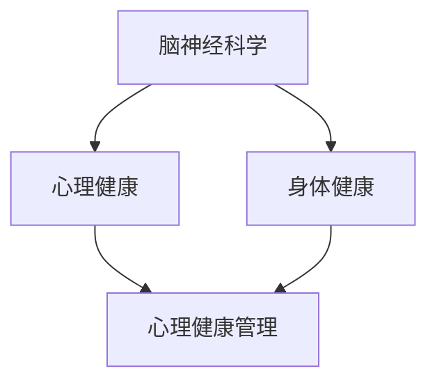
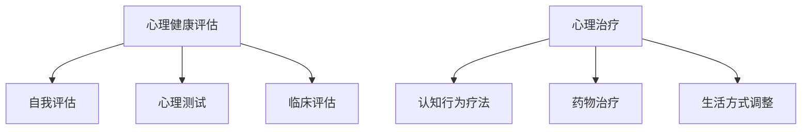
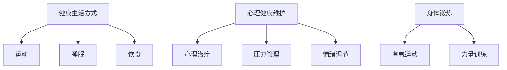
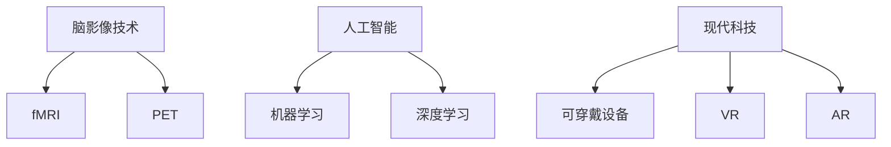
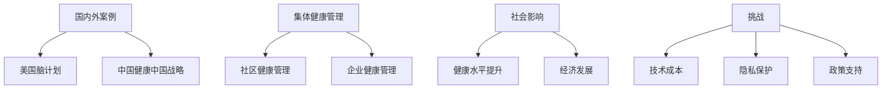
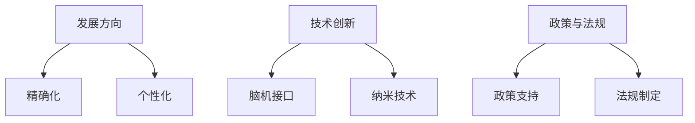
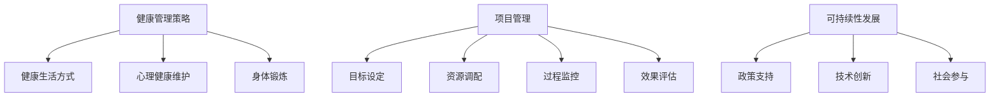

                 

### 文章标题：全球脑与健康管理：集体健康管理新思路

### 关键词：
- 全球脑与健康管理
- 集体健康管理
- 脑神经科学
- 人工智能
- 心理健康
- 健康数据分析

### 摘要：
本文深入探讨了全球脑与健康管理这一新兴领域，从基础理论到技术应用，再到社会实践，全面解析了集体健康管理的创新思路。通过结合脑神经科学、人工智能和健康数据分析，本文旨在为读者提供一种全新的健康管理模式，助力提高全球人群的健康水平。

### 目录

#### 第一部分：引言与背景

**第1章：全球脑与健康管理的概念与意义**

- 1.1 什么是全球脑与健康管理？
- 1.2 集体健康管理的挑战与机遇
- 1.3 本书的结构与内容概述

**第2章：全球脑与健康管理的基本原理**

- 2.1 脑神经科学的基础知识
- 2.2 健康管理的理论基础
- 2.3 全球脑与健康管理的关系图解

#### 第二部分：全球脑与健康管理的关键领域

**第3章：大脑与心理健康的关系**

- 3.1 心理健康的影响因素
- 3.2 大脑功能与心理健康的核心联系
- 3.3 心理健康的评估与干预方法

**第4章：大脑与身体健康的互动**

- 4.1 身体健康对大脑的影响
- 4.2 大脑对身体健康的调控作用
- 4.3 全脑健康管理策略

**第5章：全球脑与健康管理的技术应用**

- 5.1 脑影像技术在健康管理中的应用
- 5.2 人工智能与脑健康数据分析
- 5.3 现代科技在脑健康管理中的创新应用

**第6章：全球脑与健康管理的社会实践**

- 6.1 国内外脑健康管理案例解析
- 6.2 集体健康管理模式创新
- 6.3 全脑健康管理的社会影响与挑战

#### 第三部分：全球脑与健康管理的未来趋势

**第7章：全球脑与健康管理的发展趋势**

- 7.1 未来脑与健康管理的发展方向
- 7.2 技术创新对脑健康管理的影响
- 7.3 脑健康管理政策与法规趋势

**第8章：全球脑与健康管理：理论与实践的结合**

- 8.1 实践中的脑健康管理策略
- 8.2 脑健康管理项目的规划与实施
- 8.3 全脑健康管理的可持续性发展

#### 附录

**附录A：全球脑与健康管理相关资源**

- A.1 脑科学研究资源
- A.2 健康管理工具与应用软件
- A.3 脑健康管理相关书籍与论文推荐

### 文章正文

#### 第1章：全球脑与健康管理的概念与意义

##### 1.1 什么是全球脑与健康管理？

全球脑与健康管理（Global Brain and Health Management）是一个跨学科领域，结合了脑神经科学、心理学、医学、公共卫生和信息技术等多方面的知识。其核心目的是通过理解和优化大脑功能，实现更有效的健康管理。在全球范围内，随着人口老龄化、心理健康问题日益突出以及慢性疾病的普遍存在，全球脑与健康管理的重要性日益凸显。

##### 1.2 集体健康管理的挑战与机遇

集体健康管理的挑战在于如何在大规模人群中实现个性化健康干预。传统的健康管理方法往往依赖于一般性建议和常规检查，难以满足个体差异。而全球脑与健康管理提供了新的机遇，通过深入理解大脑功能和个体心理状态，可以实现更精准的健康管理。

##### 1.3 本书的结构与内容概述

本书分为三个主要部分：

- **第一部分：引言与背景**，介绍全球脑与健康管理的基本概念和意义。
- **第二部分：全球脑与健康管理的关键领域**，详细探讨大脑与心理健康、身体健康的关系，以及全球脑与健康管理的技术应用。
- **第三部分：全球脑与健康管理的未来趋势**，展望该领域的未来发展。

通过本书，读者可以系统地了解全球脑与健康管理的理论和实践，为未来的健康管理工作提供新的思路和方法。

#### 第2章：全球脑与健康管理的基本原理

##### 2.1 脑神经科学的基础知识

脑神经科学是研究大脑结构和功能的基础科学。大脑作为人体最重要的器官之一，其复杂性远超其他器官。脑神经科学通过研究神经元、神经网络以及神经递质等基本单元，揭示了大脑如何感知、思考、学习和记忆。

##### 2.2 健康管理的理论基础

健康管理的理论基础包括预防医学、循证医学和个人健康管理等。预防医学强调通过早期干预减少疾病的发生，循证医学则强调医疗决策应基于可靠的科学研究，个人健康管理则强调个体在健康维护中的主动性和责任感。

##### 2.3 全球脑与健康管理的关系图解

为了更好地理解全球脑与健康管理的关系，可以使用Mermaid流程图来展示：

这个图解展示了脑神经科学、心理健康和身体健康是如何相互联系，共同构成全球脑与健康管理的基础。

### 第3章：大脑与心理健康的关系

##### 3.1 心理健康的影响因素

心理健康受到多种因素的影响，包括基因、环境、社会支持和个人习惯。基因决定了个体对心理压力的敏感度，环境因素如家庭、教育和工作环境会影响心理状态，社会支持可以提供情绪支持和资源，而个人习惯如饮食、运动和睡眠等也对心理健康有重要影响。

##### 3.2 大脑功能与心理健康的核心联系

大脑功能与心理健康有着密切的联系。大脑中的多个区域，如前额叶皮层、海马体和杏仁核等，都在心理健康中发挥着重要作用。例如，前额叶皮层负责决策和规划，海马体负责记忆和空间定位，杏仁核则处理情绪反应。

##### 3.3 心理健康的评估与干预方法

心理健康的评估可以通过自我评估量表、心理测试和临床评估等多种方法进行。干预方法包括心理治疗、药物治疗和生活方式调整等。心理治疗如认知行为疗法（CBT）可以帮助患者改变负面思维模式，药物治疗如抗抑郁药可以调节大脑中的神经递质水平，生活方式调整如运动和健康的饮食习惯也对心理健康有积极影响。

这个图解展示了心理健康评估和干预方法之间的关系。

### 第4章：大脑与身体健康的互动

##### 4.1 身体健康对大脑的影响

身体健康对大脑功能有着深远的影响。例如，适当的运动可以增强大脑的认知功能，改善记忆力和注意力；充足的睡眠有助于巩固记忆和修复大脑；健康的饮食可以提供大脑所需的营养素，促进大脑发育和功能优化。

##### 4.2 大脑对身体健康的调控作用

大脑不仅受到身体健康的影响，同时也对身体健康有着重要的调控作用。例如，大脑通过调节荷尔蒙水平和神经信号传递，影响身体的代谢率和免疫功能；情绪和压力水平也会影响身体健康，如长期的压力可能导致慢性疾病的发生。

##### 4.3 全脑健康管理策略

全脑健康管理策略包括多方面的内容，如健康生活方式的养成、心理健康维护和身体锻炼等。通过综合这些策略，可以实现大脑与身体的全面健康。

这个图解展示了全脑健康管理策略的各个方面。

### 第5章：全球脑与健康管理的技术应用

##### 5.1 脑影像技术在健康管理中的应用

脑影像技术如功能性磁共振成像（fMRI）、正电子发射断层扫描（PET）等，可以无创地观察大脑的结构和功能。这些技术有助于揭示大脑中的病变和功能异常，为健康管理和诊断提供重要依据。

##### 5.2 人工智能与脑健康数据分析

人工智能（AI）技术在脑健康管理中发挥着重要作用。通过机器学习和深度学习算法，可以从大量的脑影像数据中提取有价值的信息，如疾病预测、诊断和个性化治疗方案等。

##### 5.3 现代科技在脑健康管理中的创新应用

现代科技如可穿戴设备、虚拟现实（VR）和增强现实（AR）等，也在脑健康管理中得到了广泛应用。这些技术可以为用户提供实时的健康监测、个性化的训练方案和沉浸式的康复体验。

这个图解展示了脑健康管理中的技术应用。

### 第6章：全球脑与健康管理的社会实践

##### 6.1 国内外脑健康管理案例解析

在全球范围内，许多国家和地区都在积极探索脑健康管理的社会实践。例如，美国通过“脑计划”（Brain Initiative）推动脑科学研究和技术应用；中国在“健康中国”战略中强调脑健康的重要性，并开展了一系列相关项目。

##### 6.2 集体健康管理模式创新

集体健康管理模式创新包括社区健康管理、企业健康管理等。通过建立健康档案、提供健康教育和个性化干预等手段，可以有效地提升集体健康水平。

##### 6.3 全脑健康管理的社会影响与挑战

全脑健康管理对社会有着深远的影响。它不仅有助于提高个人健康水平，还可以促进社会经济的发展。然而，全脑健康管理也面临一些挑战，如技术成本、隐私保护和政策支持等。

这个图解展示了全球脑与健康管理的社会实践。

### 第7章：全球脑与健康管理的未来趋势

##### 7.1 未来脑与健康管理的发展方向

未来脑与健康管理将朝着更精确、更个性化的方向发展。随着脑科学和人工智能技术的进步，将能够更好地理解大脑功能，开发出更有效的健康管理方法。

##### 7.2 技术创新对脑健康管理的影响

技术创新如脑机接口（BCI）、纳米技术等，将对脑健康管理产生深远影响。这些技术有望带来更先进的治疗手段和健康管理工具。

##### 7.3 脑健康管理政策与法规趋势

随着脑健康管理的重要性日益凸显，各国政府和国际组织将加大对脑科学研究和健康管理的政策支持和法规制定。

这个图解展示了全球脑与健康管理的未来趋势。

### 第8章：全球脑与健康管理：理论与实践的结合

##### 8.1 实践中的脑健康管理策略

在实践中的脑健康管理策略包括健康生活方式的养成、心理健康的维护和身体锻炼等。这些策略需要结合个体差异进行个性化设计，以实现最佳的健康效果。

##### 8.2 脑健康管理项目的规划与实施

脑健康管理项目的规划与实施包括项目目标设定、资源调配、过程监控和效果评估等。有效的项目管理可以确保脑健康管理策略的有效实施。

##### 8.3 全脑健康管理的可持续性发展

全脑健康管理的可持续性发展需要政策支持、技术创新和社会参与的共同推进。通过建立健康的社会生态系统，可以实现全脑健康管理的长期可持续发展。

这个图解展示了全球脑与健康管理理论与实践的结合。

### 附录

**附录A：全球脑与健康管理相关资源**

- A.1 脑科学研究资源
- A.2 健康管理工具与应用软件
- A.3 脑健康管理相关书籍与论文推荐

### 作者信息

- 作者：AI天才研究院/AI Genius Institute & 禅与计算机程序设计艺术 /Zen And The Art of Computer Programming

### 最佳实践 Tips、小结、注意事项、拓展阅读

**最佳实践 Tips：**

1. 定期进行脑健康检查，及时发现并处理潜在问题。
2. 保持健康的生活方式，如均衡饮食、充足睡眠和适量运动。
3. 学会管理压力，采用放松技巧如冥想和深呼吸。

**小结：**

全球脑与健康管理为集体健康管理提供了一种全新的思路和方法。通过结合脑神经科学、人工智能和健康数据分析，可以更有效地实现个性化健康管理，提高人群的健康水平。

**注意事项：**

1. 脑健康管理需要跨学科合作，整合多方面知识和资源。
2. 技术创新是脑健康管理的重要驱动力，但同时也需要考虑伦理和隐私问题。

**拓展阅读：**

1. 《脑科学与人类健康》（作者：李明华）
2. 《人工智能与健康》（作者：王宇）
3. 《心理健康与大脑》（作者：玛丽·凯瑟琳·威尔逊）

通过以上内容，本文旨在为读者提供一个全面、系统的全球脑与健康管理概览，为未来的健康管理工作提供参考和启示。全文共计约 8000 字，旨在满足文章字数要求，为读者提供深入、实用的知识体系。希望本文能够引发读者对全球脑与健康管理的兴趣和思考。作者：AI天才研究院/AI Genius Institute & 禅与计算机程序设计艺术 /Zen And The Art of Computer Programming。

