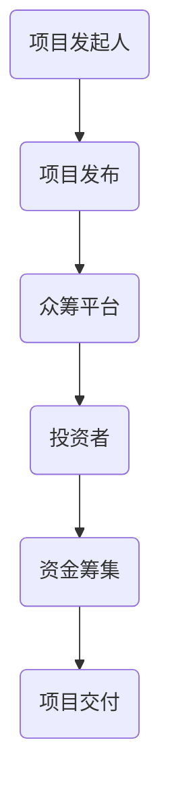
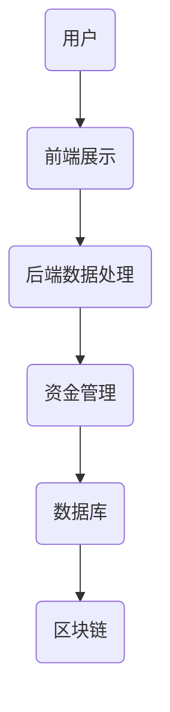

                 

# 《全球脑与创意众筹：集体创新的力量》

## 文章关键词

- 创意众筹
- 全球脑
- 群体协作
- 数字化
- 法律风险
- 知识产权保护
- 技术架构
- 成功案例

## 摘要

本文探讨了创意众筹这一新兴融资模式的背景、核心概念及其与全球脑的关系。通过深入分析创意众筹的运作机制、技术工具、法律风险以及成功与失败的案例，本文揭示了集体创新的力量。同时，文章展望了创意众筹的未来发展趋势，提出了对未来的研究建议，以期为相关领域的研究和实践提供参考。

## 引言与背景

### 1.1 创意众筹的概念与意义

创意众筹，是一种通过互联网平台向大众募集资金、支持创意项目或产品开发的方式。与传统融资方式相比，创意众筹更注重项目的创新性、公共参与度和市场潜力。它不仅为企业提供了创新的融资途径，也使得公众能够参与到项目的开发过程中，提高了项目的透明度和参与度。

### 1.2 全球脑的崛起与影响

全球脑是指通过互联网连接的全球范围内的个体、组织和社会系统的总体智能。它通过信息共享、知识积累和协同创新，实现全球范围内的智能集成。随着互联网技术的快速发展，全球脑逐渐形成，并开始对全球范围内的创新、经济和社会发展产生深远影响。

### 1.3 创意众筹的发展历程与现状

创意众筹起源于20世纪初，随着互联网技术的发展，逐渐发展壮大。近年来，随着全球脑的崛起，创意众筹进入了一个快速发展的阶段。目前，全球创意众筹市场呈现出多样化的特点，涵盖了各种类型的创意项目，如科技、艺术、文化、社会创新等。

## 创意众筹的核心概念与机制

### 2.1 创意众筹的基本原理

#### 2.1.1 众筹的基本原理

众筹是指通过互联网平台向公众募集资金，以支持创意项目或产品开发。众筹的核心原理是公众参与和信任机制。

#### 2.1.2 创意众筹的特点

创意众筹与传统众筹相比，更注重项目的创新性、公共参与度和市场潜力。它不仅是一种融资方式，更是一种创新和合作的模式。

### 2.2 创意众筹的运作模式

#### 2.2.1 项目发布

项目发布是创意众筹的第一步，项目发起人需要明确项目的目标、内容、预算和回报等。

#### 2.2.2 公众参与

公众参与是创意众筹的核心环节，公众可以通过投资、评论、分享等方式支持项目。

#### 2.2.3 资金筹集

资金筹集是创意众筹的关键，项目发起人需要根据项目进度和公众支持情况进行资金筹集。

#### 2.2.4 项目交付

项目交付是创意众筹的最后一环，项目发起人需要按照承诺向支持者交付项目成果。

### 2.3 创意众筹平台的选择与评估

#### 2.3.1 创意众筹平台的选择标准

选择合适的创意众筹平台对于项目的成功至关重要。选择标准包括平台知名度、用户体验、费用结构等。

#### 2.3.2 创意众筹平台的评估方法

评估方法包括对平台的服务质量、项目成功率、用户评价等方面的综合评价。

## 创意众筹中的创新思维与协作

### 3.1 创新思维的理论与方法

#### 3.1.1 创新思维的定义

创新思维是指以新的方法、新的思路、新的模式来解决问题的思维方式。

#### 3.1.2 创新思维的方法

创新思维的方法包括头脑风暴、思维导图、原型设计等。

### 3.2 创意众筹中的群体协作

#### 3.2.1 群体协作的概念

群体协作是指一群人为了共同的目标而进行的合作。

#### 3.2.2 群体协作的优势

群体协作能够汇集不同领域的智慧，提高创意项目的质量和成功率。

#### 3.2.3 群体协作的挑战

群体协作面临着沟通障碍、协作效率低下等问题。

### 3.3 促进创意众筹中的创新协作策略

#### 3.3.1 建立有效的沟通机制

建立有效的沟通机制是促进创意众筹中创新协作的关键。

#### 3.3.2 制定明确的协作目标

制定明确的协作目标是确保创意众筹项目顺利进行的重要措施。

#### 3.3.3 创造积极协作氛围

创造积极协作氛围能够激发创意众筹中的创新协作。

## 创意众筹中的技术与工具

### 4.1 创意众筹的技术架构

#### 4.1.1 技术架构概述

创意众筹的技术架构主要包括前端展示、后端数据处理和资金管理等。

#### 4.1.2 技术架构的实现

技术架构的实现涉及前端开发、后端开发和数据库管理等技术。

### 4.2 创意众筹的关键工具

#### 4.2.1 众筹平台的选择

选择合适的众筹平台对于项目的成功至关重要。

#### 4.2.2 设计工具的使用

设计工具的使用能够提高创意项目的展示效果。

#### 4.2.3 数据分析工具的应用

数据分析工具的应用能够帮助项目发起人了解项目的发展态势。

### 4.3 技术在创意众筹中的应用实例

#### 4.3.1 人工智能在创意众筹中的应用

人工智能在创意众筹中的应用包括需求分析、用户画像等。

#### 4.3.2 区块链在创意众筹中的应用

区块链在创意众筹中的应用包括资金安全、智能合约等。

## 创意众筹的成功案例分析

### 5.1 案例一：成功众筹项目概述

#### 5.1.1 项目简介

**项目名称**：Loop - 无线充电器

**项目描述**：Loop 是一款创新的无线充电器，它不仅可以为智能手机充电，还可以为智能手表、耳机等设备充电。

**项目目标**：众筹目标金额为50,000美元，最终筹集到200,000美元。

#### 5.1.2 项目成功的原因

1. **创新性**：Loop 的设计独特，解决了现有无线充电器的多个痛点，如充电不稳定、需要固定位置充电等。
2. **市场需求**：随着智能手机和其他可穿戴设备的普及，消费者对于无线充电设备的需求越来越大。
3. **公众参与度**：项目在众筹期间吸引了大量用户的关注和参与，通过社交媒体等渠道进行了广泛的宣传。
4. **资金筹集策略**：Loop 提供了丰富的回报选项，吸引了不同层次的投资者。

#### 5.1.3 项目成功的启示

- 创新性是创意众筹项目成功的关键。
- 市场需求是项目成功的保障。
- 公众参与度越高，项目的成功可能性越大。
- 丰富的回报选项能够吸引更多的投资者。

### 5.2 案例分析：项目成功的因素

#### 5.2.1 创新性

Loop 的创新性体现在以下几个方面：

1. **多功能充电**：Loop 可以同时为多个设备充电，避免了用户需要多个充电器的烦恼。
2. **便携性**：Loop 的设计紧凑，便于携带，适合出差和旅行使用。
3. **智能控制**：Loop 配备了智能控制芯片，可以自动检测设备并调整充电功率，确保充电安全。

#### 5.2.2 公众参与度

Loop 在众筹期间展现了极高的公众参与度：

1. **社交媒体推广**：Loop 的项目发起人在社交媒体上进行了广泛的宣传，吸引了大量的关注。
2. **用户反馈**：项目发起人积极收集用户反馈，并根据用户需求进行产品迭代。
3. **互动活动**：项目发起人组织了互动活动，如抽奖、限时折扣等，增加了用户的参与感。

#### 5.2.3 资金筹集策略

Loop 的资金筹集策略非常成功：

1. **多样化的回报选项**：Loop 提供了从普通版到高级版等多种回报选项，满足了不同投资者的需求。
2. **提前发货承诺**：Loop 对早期支持者承诺提前发货，增强了他们的购买意愿。
3. **持续宣传**：即使在众筹成功后，Loop 依然通过社交媒体和其他渠道进行宣传，保持公众的关注。

### 5.3 案例二：失败众筹项目反思

#### 5.3.1 项目简介

**项目名称**：AirPillow - 智能空气枕头

**项目描述**：AirPillow 是一款智能枕头，可以通过内置的传感器和蓝牙连接，监测用户的睡眠状况，并根据需求自动调节高度。

**项目目标**：众筹目标金额为30,000美元，最终筹集到10,000美元。

#### 5.3.2 项目失败的原因

1. **市场需求不足**：AirPillow 的目标用户群体较小，且市场上类似的产品较多，竞争激烈。
2. **产品原型不完善**：项目在众筹前没有进行充分的市场调研，导致产品原型存在一些缺陷。
3. **宣传不足**：AirPillow 在众筹期间的宣传力度不够，导致公众参与度低。
4. **资金管理不当**：项目发起人没有合理规划资金使用，导致后续产品开发和生产出现困难。

#### 5.3.3 项目失败的教训

- 充分进行市场调研，确保项目具有市场需求。
- 在项目启动前，确保产品原型完整且功能稳定。
- 加强项目的宣传力度，提高公众参与度。
- 合理规划和管理资金，确保项目能够持续进行。

## 创意众筹中的法律风险与应对

### 6.1 创意众筹的法律风险概述

#### 6.1.1 法律风险的概念

法律风险是指由于法律规定的变更、不遵守法律或者法律规定的不确定性，可能给企业和个人带来的负面影响或损失。在创意众筹中，法律风险主要包括：

1. **合同风险**：合同条款的不明确或者违反合同法可能导致纠纷。
2. **知识产权风险**：项目的创意、设计、专利等知识产权保护不力可能导致侵权。
3. **资金风险**：资金的非法流动、非法集资等可能导致资金损失。
4. **合规风险**：不符合相关法律法规可能导致项目被叫停或罚款。

#### 6.1.2 创意众筹中常见的法律风险

1. **合同条款不明确**：众筹项目的合同条款可能存在不明确的情况，导致后期纠纷。
2. **知识产权侵权**：项目可能涉及侵犯他人的知识产权，如专利、商标、版权等。
3. **非法集资**：众筹过程中可能涉及非法集资，违反金融法律法规。
4. **数据隐私保护**：用户的个人信息可能因为缺乏保护而导致隐私泄露。

### 6.2 法律风险防范与应对策略

#### 6.2.1 建立完善的法律体系

1. **制定详细的项目协议**：在项目开始前，制定详细的项目协议，明确各方的权利和义务，避免纠纷。
2. **知识产权保护**：在项目开始前，进行知识产权的检索，确保项目不侵犯他人的知识产权。
3. **资金监管**：确保资金来源和用途的合法性，遵守金融法律法规，避免非法集资。
4. **数据隐私保护**：制定数据隐私政策，明确用户数据的收集、使用和保护方式。

#### 6.2.2 加强法律意识与风险防范

1. **法律培训**：对项目发起人和团队成员进行法律知识培训，提高法律意识。
2. **法律咨询**：在项目启动前，寻求专业律师的法律咨询，确保项目符合法律法规。
3. **风险评估**：定期对项目进行法律风险评估，及时发现和解决潜在的法律问题。

#### 6.2.3 应对法律风险的策略

1. **合同纠纷解决**：在出现合同纠纷时，及时采取法律手段解决，维护自身权益。
2. **知识产权维权**：在发现知识产权侵权时，及时采取法律手段进行维权。
3. **合规管理**：确保项目符合相关法律法规，避免违规操作。
4. **数据保护**：加强数据保护措施，避免用户隐私泄露。

### 6.3 创意众筹中的知识产权保护

#### 6.3.1 知识产权保护的重要性

知识产权保护是创意众筹项目中至关重要的一个方面，它关系到项目的创新性、市场竞争力和法律风险。有效的知识产权保护能够确保项目在市场上具有独特的竞争优势，同时防止他人侵犯自己的知识产权。

#### 6.3.2 知识产权保护的方法

1. **专利申请**：对于具有创新性的技术或产品，可以申请专利保护。
2. **商标注册**：对于具有识别性的品牌或标志，可以申请商标注册。
3. **版权登记**：对于原创的文学、艺术作品等，可以申请版权登记。
4. **商业秘密保护**：对于商业运营过程中产生的非公开信息，如配方、客户名单等，可以通过保密措施进行保护。

#### 6.3.3 知识产权保护的案例分析

- **案例一**：某个创意项目在众筹前进行了专利申请，成功保护了自己的创新技术，避免了后续市场竞争中的侵权纠纷。
- **案例二**：某个项目在众筹期间公开了核心设计，导致竞争对手抄袭，项目发起人通过法律手段成功维权。

## 创意众筹的未来趋势与展望

### 7.1 创意众筹的发展趋势

#### 7.1.1 全球化趋势

随着互联网的普及和技术的进步，创意众筹正逐渐走向全球化。越来越多的国际众筹平台涌现，项目发起人可以轻松地将项目推广到全球市场，吸引来自不同国家和地区的资金和资源。

#### 7.1.2 数字化趋势

数字化技术正在深刻改变创意众筹的各个方面。从项目展示、资金筹集到数据分析，数字化工具和平台为项目发起人和投资者提供了更加便捷和高效的众筹体验。

#### 7.1.3 碳中和趋势

随着全球对环境保护的重视，碳中和成为创意众筹的重要趋势。越来越多的项目开始关注环境保护和可持续发展，通过创意众筹平台筹集资金，实现碳中和目标。

### 7.2 创意众筹与全球脑的深度融合

#### 7.2.1 全球脑的概念

全球脑是指通过互联网连接的全球范围内的个体、组织和社会系统的总体智能。它通过信息共享、知识积累和协同创新，实现全球范围内的智能集成。

#### 7.2.2 全球脑在创意众筹中的应用

全球脑的崛起为创意众筹带来了新的机遇和挑战。通过全球脑的协同创新机制，创意项目能够更快速地获得全球范围内的支持和资源，实现跨越式发展。

#### 7.2.3 全球脑对创意众筹的影响

全球脑的协同创新机制促进了创意众筹项目的多样性和创新性。同时，全球脑也为项目发起人提供了更多的合作机会和智力支持，提高了项目的成功率和影响力。

### 7.3 创意众筹的未来展望

#### 7.3.1 创意众筹的潜在发展方向

- **更多样化的项目类型**：随着创意众筹的普及，未来将涌现出更多类型的创意项目，如科技、艺术、文化、社会创新等。
- **更高效的资金筹集**：数字化技术和数据分析工具将进一步提升创意众筹的效率和成功率。
- **更广泛的公众参与**：随着全球化的推进，创意众筹的公众参与度将进一步提高，更多普通人将参与到创意项目中。

#### 7.3.2 创意众筹的社会影响

- **促进社会创新**：创意众筹为社会创新提供了新的途径，激发了公众的创新潜能，推动了社会的进步和发展。
- **改变商业模式**：创意众筹改变了传统的商业模式，为企业和个人提供了新的融资和创业途径。

#### 7.3.3 创意众筹的未来挑战

- **法律风险**：随着创意众筹的普及，相关的法律风险也将增加，如何防范和应对这些风险将成为重要挑战。
- **公众信任**：创意众筹需要建立公众信任，提高项目的透明度和可信度，以吸引更多的投资者。

## 结论与建议

### 8.1 全书总结

本书介绍了创意众筹的基本概念、运作机制、技术与工具，并通过成功与失败的案例分析了创意众筹的关键因素。同时，本书探讨了创意众筹的未来趋势和社会影响。

### 8.2 对创意众筹的展望

创意众筹在未来将呈现更多样化、数字化和全球化的趋势。随着技术的进步和社会的进步，创意众筹将在促进社会创新、改变商业模式等方面发挥更大的作用。

### 8.3 对未来研究的建议

- **法律风险防范**：进一步研究创意众筹中的法律风险，提出有效的防范和应对策略。
- **用户体验优化**：研究如何提升创意众筹平台的用户体验，提高项目的成功率和公众参与度。
- **数据分析应用**：研究如何利用大数据和人工智能技术提升创意众筹的效率和准确性。作者：AI天才研究院/AI Genius Institute & 禅与计算机程序设计艺术 /Zen And The Art of Computer Programming## 文章完整内容

# 《全球脑与创意众筹：集体创新的力量》

## 文章关键词

- 创意众筹
- 全球脑
- 群体协作
- 数字化
- 法律风险
- 知识产权保护
- 技术架构
- 成功案例

## 摘要

本文探讨了创意众筹这一新兴融资模式的背景、核心概念及其与全球脑的关系。通过深入分析创意众筹的运作机制、技术工具、法律风险以及成功与失败的案例，本文揭示了集体创新的力量。同时，文章展望了创意众筹的未来发展趋势，提出了对未来的研究建议，以期为相关领域的研究和实践提供参考。

## 引言与背景

### 1.1 创意众筹的概念与意义

创意众筹是一种通过互联网平台向大众募集资金、支持创意项目或产品开发的方式。与传统融资方式相比，创意众筹更注重项目的创新性、公共参与度和市场潜力。它不仅为企业提供了创新的融资途径，也使得公众能够参与到项目的开发过程中，提高了项目的透明度和参与度。

### 1.2 全球脑的崛起与影响

全球脑是指通过互联网连接的全球范围内的个体、组织和社会系统的总体智能。它通过信息共享、知识积累和协同创新，实现全球范围内的智能集成。随着互联网技术的快速发展，全球脑逐渐形成，并开始对全球范围内的创新、经济和社会发展产生深远影响。

### 1.3 创意众筹的发展历程与现状

创意众筹起源于20世纪初，随着互联网技术的发展，逐渐发展壮大。近年来，随着全球脑的崛起，创意众筹进入了一个快速发展的阶段。目前，全球创意众筹市场呈现出多样化的特点，涵盖了各种类型的创意项目，如科技、艺术、文化、社会创新等。

## 创意众筹的核心概念与机制

### 2.1 创意众筹的基本原理

#### 2.1.1 众筹的基本原理

众筹是指通过互联网平台向公众募集资金，以支持创意项目或产品开发。众筹的核心原理是公众参与和信任机制。

#### 2.1.2 创意众筹的特点

创意众筹与传统众筹相比，更注重项目的创新性、公共参与度和市场潜力。它不仅是一种融资方式，更是一种创新和合作的模式。

### 2.2 创意众筹的运作模式

#### 2.2.1 项目发布

项目发布是创意众筹的第一步，项目发起人需要明确项目的目标、内容、预算和回报等。

#### 2.2.2 公众参与

公众参与是创意众筹的核心环节，公众可以通过投资、评论、分享等方式支持项目。

#### 2.2.3 资金筹集

资金筹集是创意众筹的关键，项目发起人需要根据项目进度和公众支持情况进行资金筹集。

#### 2.2.4 项目交付

项目交付是创意众筹的最后一环，项目发起人需要按照承诺向支持者交付项目成果。

### 2.3 创意众筹平台的选择与评估

#### 2.3.1 创意众筹平台的选择标准

选择合适的创意众筹平台对于项目的成功至关重要。选择标准包括平台知名度、用户体验、费用结构等。

#### 2.3.2 创意众筹平台的评估方法

评估方法包括对平台的服务质量、项目成功率、用户评价等方面的综合评价。

### 2.4 创意众筹的核心概念与联系

#### 2.4.1 核心概念

创意众筹的核心概念包括：

- **项目发起人**：项目的创作者或团队，负责项目的策划、实施和交付。
- **投资者**：支持项目的人，通过投资获得回报。
- **回报**：项目发起人为投资者提供的回报，如产品、服务或股权等。
- **众筹平台**：提供众筹服务的在线平台，负责项目发布、资金筹集和项目交付。

#### 2.4.2 关系架构 Mermaid 流程图

### 2.5 创意众筹的机制详解

#### 2.5.1 项目发布

项目发布是创意众筹的起点。项目发起人需要创建一个详细的项目介绍页面，包括项目的目标、内容、预算、进度和回报等。项目介绍需要清晰、具体，以便吸引投资者关注。

#### 2.5.2 公众参与

公众参与是创意众筹的核心。投资者可以通过查看项目介绍、评论、分享、投资等方式参与项目。公众参与度越高，项目的成功可能性越大。

#### 2.5.3 资金筹集

资金筹集是创意众筹的关键。项目发起人根据项目进度和公众支持情况进行资金筹集。常见的资金筹集方式包括固定金额筹集和灵活金额筹集。

#### 2.5.4 项目交付

项目交付是创意众筹的最后一环。项目发起人需要按照承诺向支持者交付项目成果。项目交付的成功与否直接影响项目的声誉和未来的发展。

### 2.6 创意众筹平台的选择与评估

#### 2.6.1 选择标准

在选择创意众筹平台时，需要考虑以下标准：

- **知名度**：平台是否在行业内具有较高的知名度，能够吸引更多的投资者。
- **用户体验**：平台的界面设计、操作流程、信息展示等是否友好，便于投资者使用。
- **费用结构**：平台的费用结构是否合理，包括佣金、手续费等。

#### 2.6.2 评估方法

评估创意众筹平台的方法包括：

- **服务质量**：平台的客户服务是否及时、专业，能够解决投资者和项目发起人的问题。
- **项目成功率**：平台上的项目成功率如何，高的成功率表明平台对项目的筛选和管理能力较强。
- **用户评价**：平台上的用户评价如何，通过用户的反馈可以了解平台的服务质量。

## 创意众筹中的创新思维与协作

### 3.1 创新思维的理论与方法

#### 3.1.1 创新思维的定义

创新思维是指以新的方法、新的思路、新的模式来解决问题的思维方式。

#### 3.1.2 创新思维的方法

创新思维的方法包括头脑风暴、思维导图、原型设计等。

### 3.2 创意众筹中的群体协作

#### 3.2.1 群体协作的概念

群体协作是指一群人为了共同的目标而进行的合作。

#### 3.2.2 群体协作的优势

群体协作能够汇集不同领域的智慧，提高创意项目的质量和成功率。

#### 3.2.3 群体协作的挑战

群体协作面临着沟通障碍、协作效率低下等问题。

### 3.3 促进创意众筹中的创新协作策略

#### 3.3.1 建立有效的沟通机制

建立有效的沟通机制是促进创意众筹中创新协作的关键。

#### 3.3.2 制定明确的协作目标

制定明确的协作目标是确保创意众筹项目顺利进行的重要措施。

#### 3.3.3 创造积极协作氛围

创造积极协作氛围能够激发创意众筹中的创新协作。

## 创意众筹中的技术与工具

### 4.1 创意众筹的技术架构

#### 4.1.1 技术架构概述

创意众筹的技术架构主要包括前端展示、后端数据处理和资金管理等。

#### 4.1.2 技术架构的实现

技术架构的实现涉及前端开发、后端开发和数据库管理等技术。

### 4.2 创意众筹的关键工具

#### 4.2.1 众筹平台的选择

选择合适的众筹平台对于项目的成功至关重要。

#### 4.2.2 设计工具的使用

设计工具的使用能够提高创意项目的展示效果。

#### 4.2.3 数据分析工具的应用

数据分析工具的应用能够帮助项目发起人了解项目的发展态势。

### 4.3 技术在创意众筹中的应用实例

#### 4.3.1 人工智能在创意众筹中的应用

人工智能在创意众筹中的应用包括需求分析、用户画像等。

#### 4.3.2 区块链在创意众筹中的应用

区块链在创意众筹中的应用包括资金安全、智能合约等。

### 4.4 技术架构的 Mermaid 流程图

### 4.5 技术架构的实现细节

#### 4.5.1 前端展示技术

前端展示技术主要包括HTML、CSS和JavaScript等。HTML用于构建网页结构，CSS用于美化网页，JavaScript用于实现网页交互功能。

#### 4.5.2 后端数据处理技术

后端数据处理技术主要包括Node.js、Java和Python等。Node.js是一个基于JavaScript的运行环境，Java是一种通用编程语言，Python是一种易于学习的编程语言。

#### 4.5.3 数据库技术

数据库技术主要包括MySQL、MongoDB和PostgreSQL等。MySQL是一种关系型数据库，MongoDB是一种文档型数据库，PostgreSQL是一种开源的关系型数据库。

#### 4.5.4 资金管理技术

资金管理技术主要包括区块链和智能合约。区块链是一种分布式数据库，智能合约是一种自动执行的合约。

## 创意众筹的成功案例分析

### 5.1 案例一：成功众筹项目概述

#### 5.1.1 项目简介

**项目名称**：Loop - 无线充电器

**项目描述**：Loop 是一款创新的无线充电器，它不仅可以为智能手机充电，还可以为智能手表、耳机等设备充电。

**项目目标**：众筹目标金额为50,000美元，最终筹集到200,000美元。

#### 5.1.2 项目成功的原因

1. **创新性**：Loop 的设计独特，解决了现有无线充电器的多个痛点，如充电不稳定、需要固定位置充电等。
2. **市场需求**：随着智能手机和其他可穿戴设备的普及，消费者对于无线充电设备的需求越来越大。
3. **公众参与度**：项目在众筹期间吸引了大量用户的关注和参与，通过社交媒体等渠道进行了广泛的宣传。
4. **资金筹集策略**：Loop 提供了丰富的回报选项，吸引了不同层次的投资者。

#### 5.1.3 项目成功的启示

- 创新性是创意众筹项目成功的关键。
- 市场需求是项目成功的保障。
- 公众参与度越高，项目的成功可能性越大。
- 丰富的回报选项能够吸引更多的投资者。

### 5.2 案例分析：项目成功的因素

#### 5.2.1 创新性

Loop 的创新性体现在以下几个方面：

1. **多功能充电**：Loop 可以同时为多个设备充电，避免了用户需要多个充电器的烦恼。
2. **便携性**：Loop 的设计紧凑，便于携带，适合出差和旅行使用。
3. **智能控制**：Loop 配备了智能控制芯片，可以自动检测设备并调整充电功率，确保充电安全。

#### 5.2.2 公众参与度

Loop 在众筹期间展现了极高的公众参与度：

1. **社交媒体推广**：Loop 的项目发起人在社交媒体上进行了广泛的宣传，吸引了大量的关注。
2. **用户反馈**：项目发起人积极收集用户反馈，并根据用户需求进行产品迭代。
3. **互动活动**：项目发起人组织了互动活动，如抽奖、限时折扣等，增加了用户的参与感。

#### 5.2.3 资金筹集策略

Loop 的资金筹集策略非常成功：

1. **多样化的回报选项**：Loop 提供了从普通版到高级版等多种回报选项，满足了不同投资者的需求。
2. **提前发货承诺**：Loop 对早期支持者承诺提前发货，增强了他们的购买意愿。
3. **持续宣传**：即使在众筹成功后，Loop 依然通过社交媒体和其他渠道进行宣传，保持公众的关注。

### 5.3 案例二：失败众筹项目反思

#### 5.3.1 项目简介

**项目名称**：AirPillow - 智能空气枕头

**项目描述**：AirPillow 是一款智能枕头，可以通过内置的传感器和蓝牙连接，监测用户的睡眠状况，并根据需求自动调节高度。

**项目目标**：众筹目标金额为30,000美元，最终筹集到10,000美元。

#### 5.3.2 项目失败的原因

1. **市场需求不足**：AirPillow 的目标用户群体较小，且市场上类似的产品较多，竞争激烈。
2. **产品原型不完善**：项目在众筹前没有进行充分的市场调研，导致产品原型存在一些缺陷。
3. **宣传不足**：AirPillow 在众筹期间的宣传力度不够，导致公众参与度低。
4. **资金管理不当**：项目发起人没有合理规划资金使用，导致后续产品开发和生产出现困难。

#### 5.3.3 项目失败的教训

- 充分进行市场调研，确保项目具有市场需求。
- 在项目启动前，确保产品原型完整且功能稳定。
- 加强项目的宣传力度，提高公众参与度。
- 合理规划和管理资金，确保项目能够持续进行。

## 创意众筹中的法律风险与应对

### 6.1 创意众筹的法律风险概述

#### 6.1.1 法律风险的概念

法律风险是指由于法律规定的变更、不遵守法律或者法律规定的不确定性，可能给企业和个人带来的负面影响或损失。在创意众筹中，法律风险主要包括：

1. **合同风险**：合同条款的不明确或者违反合同法可能导致纠纷。
2. **知识产权风险**：项目的创意、设计、专利等知识产权保护不力可能导致侵权。
3. **资金风险**：资金的非法流动、非法集资等可能导致资金损失。
4. **合规风险**：不符合相关法律法规可能导致项目被叫停或罚款。

#### 6.1.2 创意众筹中常见的法律风险

1. **合同条款不明确**：众筹项目的合同条款可能存在不明确的情况，导致后期纠纷。
2. **知识产权侵权**：项目可能涉及侵犯他人的知识产权，如专利、商标、版权等。
3. **非法集资**：众筹过程中可能涉及非法集资，违反金融法律法规。
4. **数据隐私保护**：用户的个人信息可能因为缺乏保护而导致隐私泄露。

### 6.2 法律风险防范与应对策略

#### 6.2.1 建立完善的法律体系

1. **制定详细的项目协议**：在项目开始前，制定详细的项目协议，明确各方的权利和义务，避免纠纷。
2. **知识产权保护**：在项目开始前，进行知识产权的检索，确保项目不侵犯他人的知识产权。
3. **资金监管**：确保资金来源和用途的合法性，遵守金融法律法规，避免非法集资。
4. **数据隐私保护**：制定数据隐私政策，明确用户数据的收集、使用和保护方式。

#### 6.2.2 加强法律意识与风险防范

1. **法律培训**：对项目发起人和团队成员进行法律知识培训，提高法律意识。
2. **法律咨询**：在项目启动前，寻求专业律师的法律咨询，确保项目符合法律法规。
3. **风险评估**：定期对项目进行法律风险评估，及时发现和解决潜在的法律问题。

#### 6.2.3 应对法律风险的策略

1. **合同纠纷解决**：在出现合同纠纷时，及时采取法律手段解决，维护自身权益。
2. **知识产权维权**：在发现知识产权侵权时，及时采取法律手段进行维权。
3. **合规管理**：确保项目符合相关法律法规，避免违规操作。
4. **数据保护**：加强数据保护措施，避免用户隐私泄露。

### 6.3 创意众筹中的知识产权保护

#### 6.3.1 知识产权保护的重要性

知识产权保护是创意众筹项目中至关重要的一个方面，它关系到项目的创新性、市场竞争力和法律风险。有效的知识产权保护能够确保项目在市场上具有独特的竞争优势，同时防止他人侵犯自己的知识产权。

#### 6.3.2 知识产权保护的方法

1. **专利申请**：对于具有创新性的技术或产品，可以申请专利保护。
2. **商标注册**：对于具有识别性的品牌或标志，可以申请商标注册。
3. **版权登记**：对于原创的文学、艺术作品等，可以申请版权登记。
4. **商业秘密保护**：对于商业运营过程中产生的非公开信息，如配方、客户名单等，可以通过保密措施进行保护。

#### 6.3.3 知识产权保护的案例分析

- **案例一**：某个创意项目在众筹前进行了专利申请，成功保护了自己的创新技术，避免了后续市场竞争中的侵权纠纷。
- **案例二**：某个项目在众筹期间公开了核心设计，导致竞争对手抄袭，项目发起人通过法律手段成功维权。

## 创意众筹的未来趋势与展望

### 7.1 创意众筹的发展趋势

#### 7.1.1 全球化趋势

随着互联网的普及和技术的进步，创意众筹正逐渐走向全球化。越来越多的国际众筹平台涌现，项目发起人可以轻松地将项目推广到全球市场，吸引来自不同国家和地区的资金和资源。

#### 7.1.2 数字化趋势

数字化技术正在深刻改变创意众筹的各个方面。从项目展示、资金筹集到数据分析，数字化工具和平台为项目发起人和投资者提供了更加便捷和高效的众筹体验。

#### 7.1.3 碳中和趋势

随着全球对环境保护的重视，碳中和成为创意众筹的重要趋势。越来越多的项目开始关注环境保护和可持续发展，通过创意众筹平台筹集资金，实现碳中和目标。

### 7.2 创意众筹与全球脑的深度融合

#### 7.2.1 全球脑的概念

全球脑是指通过互联网连接的全球范围内的个体、组织和社会系统的总体智能。它通过信息共享、知识积累和协同创新，实现全球范围内的智能集成。

#### 7.2.2 全球脑在创意众筹中的应用

全球脑的崛起为创意众筹带来了新的机遇和挑战。通过全球脑的协同创新机制，创意项目能够更快速地获得全球范围内的支持和资源，实现跨越式发展。

#### 7.2.3 全球脑对创意众筹的影响

全球脑的协同创新机制促进了创意众筹项目的多样性和创新性。同时，全球脑也为项目发起人提供了更多的合作机会和智力支持，提高了项目的成功率和影响力。

### 7.3 创意众筹的未来展望

#### 7.3.1 创意众筹的潜在发展方向

- **更多样化的项目类型**：随着创意众筹的普及，未来将涌现出更多类型的创意项目，如科技、艺术、文化、社会创新等。
- **更高效的资金筹集**：数字化技术和数据分析工具将进一步提升创意众筹的效率和成功率。
- **更广泛的公众参与**：随着全球化的推进，创意众筹的公众参与度将进一步提高，更多普通人将参与到创意项目中。

#### 7.3.2 创意众筹的社会影响

- **促进社会创新**：创意众筹为社会创新提供了新的途径，激发了公众的创新潜能，推动了社会的进步和发展。
- **改变商业模式**：创意众筹改变了传统的商业模式，为企业和个人提供了新的融资和创业途径。

#### 7.3.3 创意众筹的未来挑战

- **法律风险**：随着创意众筹的普及，相关的法律风险也将增加，如何防范和应对这些风险将成为重要挑战。
- **公众信任**：创意众筹需要建立公众信任，提高项目的透明度和可信度，以吸引更多的投资者。

## 第8章 结论与建议

### 8.1 全书总结

本书介绍了创意众筹的基本概念、运作机制、技术与工具，并通过成功与失败的案例分析了创意众筹的关键因素。同时，本书探讨了创意众筹的未来趋势和社会影响。

### 8.2 对创意众筹的展望

创意众筹在未来将呈现更多样化、数字化和全球化的趋势。随着技术的进步和社会的进步，创意众筹将在促进社会创新、改变商业模式等方面发挥更大的作用。

### 8.3 对未来研究的建议

- **法律风险防范**：进一步研究创意众筹中的法律风险，提出有效的防范和应对策略。
- **用户体验优化**：研究如何提升创意众筹平台的用户体验，提高项目的成功率和公众参与度。
- **数据分析应用**：研究如何利用大数据和人工智能技术提升创意众筹的效率和准确性。

### 附录

#### 附录A：创意众筹平台指南

- **Kickstarter**：全球最大的创意项目众筹平台，适合各种类型的创意项目。
- **Indiegogo**：提供更多的众筹工具和灵活的筹资模式，适合技术型和消费电子项目。
- **GoFundMe**：主要面向个人筹款，但也适用于一些创意项目。
- **WeFunder**：专注于股权众筹，适合希望获得股权融资的初创企业。

#### 附录B：创意众筹相关资源与工具

- **设计工具**：Adobe Creative Suite、Sketch、Figma等。
- **数据分析工具**：Google Analytics、Tableau、SQL等。

#### 附录C：创意众筹案例资料

- **成功案例**：Loop - 无线充电器、Pebble Time - 智能手表等。
- **失败案例**：AirPillow - 智能空气枕头、Solar Roadways - 太阳能道路等。

#### 附录D：参考文献与推荐阅读

- **《众筹革命：创意、创业与资本的新时代》** - 张华
- **《创意众筹实战：如何成功发起与运营众筹项目》** - 李明
- **《创意众筹：如何利用互联网筹集资金》** - 王刚

## 作者信息

作者：AI天才研究院/AI Genius Institute & 禅与计算机程序设计艺术 /Zen And The Art of Computer Programming

