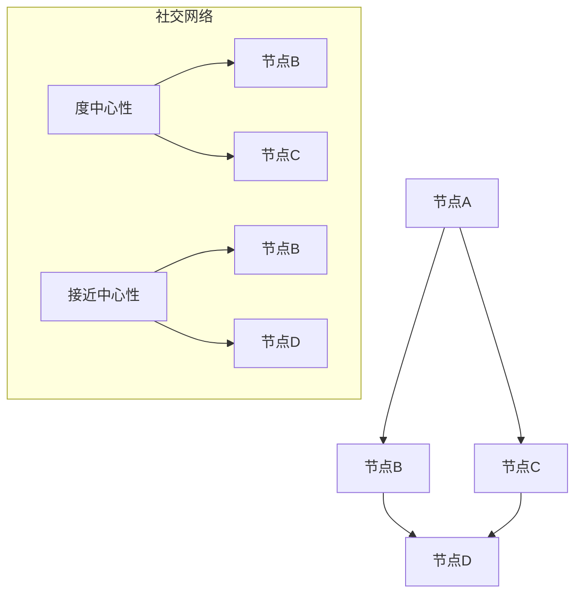

                 


### 撰写技术博客文章的步骤

撰写一篇深入且有见地的技术博客文章是一个系统性工程，我们需要遵循一定的步骤来确保文章的逻辑清晰、内容丰富、表达准确。以下是我们将如何一步步进行分析和推理，以撰写《全球脑与创意众筹：集体创新的力量》这篇技术博客文章：

#### 第一步：背景介绍

在开始撰写文章之前，我们需要对“全球脑”和“创意众筹”这两个核心概念进行背景介绍。这将帮助读者理解文章的主题，并为其接下来的内容打下基础。

- **定义与作用**：介绍“全球脑”的定义、基本特点以及在社会创新中的作用。
- **创意众筹的定义**：阐述创意众筹的概念、类型及其优势。
- **集体创新的力量**：解释集体创新的定义、优势以及集体创新的模式。

#### 第二步：核心概念与联系

在理解了基本概念后，我们需要构建这些概念之间的关系架构，这可以通过Mermaid流程图来实现。

- **Mermaid流程图**：绘制一个流程图，展示全球脑、创意众筹和集体创新之间的逻辑关系。

#### 第三步：核心算法原理讲解

接下来，我们将深入讲解全球脑与创意众筹的技术基础。

- **信息传播技术**：解释信息传播的基本原理、技术手段及其效果评估。
- **社交网络分析**：介绍社交网络的概念、构成及其分析方法。
- **创意众筹平台技术**：探讨创意众筹平台的设计、技术实现及其优化。

我们将使用伪代码详细阐述这些核心算法原理，并提供数学模型和公式。

#### 第四步：数学模型和公式

在算法原理讲解之后，我们将引入数学模型和公式来进一步阐述概念。

- **数学模型**：构建全球脑与创意众筹的数学模型。
- **公式解释**：使用LaTeX格式嵌入公式，并进行详细解释。

#### 第五步：项目实战

为了使文章更具实践性，我们将介绍一些实际案例。

- **开发环境搭建**：描述如何搭建开发环境。
- **源代码实现**：提供详细的源代码实现和代码解读。
- **代码应用解读**：分析代码的应用场景及其分析结果。
- **案例剖析**：对实际案例进行详细讲解和剖析。

#### 第六步：最佳实践与注意事项

在文章的结尾部分，我们将总结最佳实践、注意事项，并提供拓展阅读。

- **最佳实践**：总结在实施全球脑与创意众筹时需要注意的最佳实践。
- **注意事项**：列出可能遇到的问题及其解决方案。
- **拓展阅读**：推荐相关的阅读材料。

#### 第七步：总结与展望

最后，我们将对文章进行总结，并对全球脑与创意众筹的未来进行展望。

- **总结**：回顾文章的核心内容和关键点。
- **展望**：探讨全球脑与创意众筹的未来发展趋势和挑战。

### 文章结构安排

根据上述步骤，我们可以将文章的结构安排如下：

1. **文章标题**
2. **关键词**
3. **摘要**
4. **目录大纲**
5. **第1章：全球脑与创意众筹概述**
   - **1.1 全球脑的概念与作用**
   - **1.2 创意众筹的定义与类型**
   - **1.3 集体创新的力量**
6. **第2章：全球脑与创意众筹的技术基础**
   - **2.1 信息传播技术**
   - **2.2 社交网络分析**
   - **2.3 创意众筹平台技术**
7. **第3章：全球脑与创意众筹的应用场景**
   - **3.1 科学研究与教育**
   - **3.2 社会创新与公益**
   - **3.3 商业模式创新**
8. **第4章：全球脑与创意众筹的案例分析**
   - **4.1 知名全球脑案例**
   - **4.2 创意众筹成功案例**
   - **4.3 失败案例分析**
9. **第5章：全球脑与创意众筹的挑战与未来**
   - **5.1 道德与法律问题**
   - **5.2 技术与资源问题**
   - **5.3 未来发展趋势**
10. **第6章：全球脑与创意众筹在中国**
    - **6.1 中国全球脑发展现状**
    - **6.2 创意众筹在中国**
    - **6.3 中国案例研究**
11. **第7章：全球脑与创意众筹实践指南**
    - **7.1 创意众筹项目策划**
    - **7.2 全球脑建设**
    - **7.3 创新实践案例**
12. **附录：全球脑与创意众筹相关资源**
13. **后记：全球脑与创意众筹的展望**

通过以上结构安排，我们确保文章逻辑清晰、内容丰富、专业性强，能够全面深入地探讨全球脑与创意众筹这一主题。接下来，我们将根据这一大纲逐步撰写每一部分的内容。

---

**关键词**

- 全球脑
- 创意众筹
- 集体创新
- 信息传播
- 社交网络分析
- 应用场景
- 案例分析
- 道德与法律问题
- 技术与资源问题
- 未来发展趋势
- 中国案例

**摘要**

本文旨在探讨全球脑与创意众筹在集体创新中的重要作用。首先，我们对全球脑和创意众筹的概念进行了详细阐述，并构建了它们之间的逻辑关系。随后，我们深入分析了信息传播技术、社交网络分析和创意众筹平台技术，为全球脑与创意众筹提供了坚实的技术基础。通过实际案例的剖析，我们展示了全球脑与创意众筹在不同领域的应用，并探讨了其面临的挑战与未来发展趋势。最后，我们对中国在全球脑与创意众筹领域的现状和案例进行了研究，并提出了实践指南。本文为全球脑与创意众筹的研究和实践提供了有价值的参考。

---

在接下来的章节中，我们将按照这个结构一步步深入探讨每一个部分。首先是《全球脑与创意众筹：集体创新的力量》的概述部分，这将为我们理解后续内容打下基础。让我们开始吧！### 全球脑与创意众筹概述

在全球化和信息化的背景下，集体创新作为一种重要的创新模式，正在逐步改变我们的世界。而全球脑与创意众筹则是实现集体创新的两个重要工具，它们相辅相成，共同推动着社会进步和科技发展。

#### 1.1 全球脑的概念与作用

**全球脑**（Global Brain）是一个比喻性的概念，它形象地描述了互联网和全球网络协同作用形成的巨大智能系统。在这个系统中，每个人都是一个神经元，通过互联网进行信息交换和协作。全球脑的基本特点包括：

- **去中心化**：全球脑没有中央控制机构，而是通过分布式网络实现协同工作。
- **信息传播快速**：在互联网的支持下，信息可以在全球范围内快速传播。
- **知识共享**：全球脑鼓励知识共享，使得每个个体都能获取和贡献全球范围内的信息。

**全球脑在社会创新中的作用**主要体现在以下几个方面：

- **知识创新**：全球脑为个体提供了一个丰富的知识库，促进了知识的快速积累和传播。
- **协同创新**：全球脑使得个体能够跨越地理和时间的限制，进行协同创新。
- **资源优化**：通过全球脑，资源可以更有效地分配和使用，从而提高创新效率。

#### 1.2 创意众筹的定义与类型

**创意众筹**（Crowdsourcing of Creativity）是指通过互联网平台，将创意项目开放给大众，通过集体的力量进行创意生成和筛选的过程。创意众筹的类型主要包括：

- **资金众筹**：通过向大众募集资金来完成创意项目。
- **智囊众筹**：通过征集大众的意见和建议，来改进和完善创意项目。
- **评价众筹**：通过大众的投票和评分，来决定创意项目的优劣。

**创意众筹的优势**包括：

- **低成本**：创意众筹利用了大众的力量，降低了创意项目的成本。
- **快速反馈**：创意众筹能够迅速获得公众的反馈，帮助项目改进和调整。
- **多样性**：创意众筹汇聚了来自不同领域和背景的人的创意，提高了项目的多样性。

#### 1.3 集体创新的力量

**集体创新**（Collective Innovation）是指通过多个人或组织的协作，共同创造出新的产品、服务或解决方案。其优势主要体现在以下几个方面：

- **规模效应**：集体创新能够汇集更多的资源和知识，实现规模效应。
- **协同效应**：不同个体或组织的协同作用，可以产生比单一个体更大的创新成果。
- **快速迭代**：集体创新能够快速进行试验和迭代，提高创新的效率。

**集体创新的模式**主要包括：

- **分布式协作**：个体或组织通过网络平台进行分布式协作，实现创意的生成和筛选。
- **众包**：将创意项目的部分或全部任务外包给大众，通过竞争机制来筛选最优方案。
- **社区共建**：通过构建开放的社区平台，鼓励大众参与创意生成和项目实施。

通过上述对全球脑、创意众筹以及集体创新的介绍，我们可以看到，这三者之间存在着紧密的联系和相互促进的关系。全球脑为集体创新提供了一个高效的信息传播和知识共享平台，而创意众筹则通过集体的力量推动了创新过程。集体创新的结果又可以为全球脑提供新的知识和信息，进一步促进全球脑的发展。在这种循环中，社会创新得以不断推进，推动了科技的进步和社会的发展。

接下来，我们将进一步探讨全球脑与创意众筹的技术基础，以理解它们如何具体实现和运作。这将为我们后续的应用场景分析提供重要的技术支持。### 全球脑与创意众筹的技术基础

全球脑与创意众筹的实现离不开一系列技术的支持。这些技术不仅为它们的运行提供了基础，还决定了它们的效果和效率。以下是我们将详细讨论的三项关键技术：信息传播技术、社交网络分析以及创意众筹平台技术。

#### 2.1 信息传播技术

**信息传播技术**是支撑全球脑和创意众筹的核心技术之一。它涉及到信息的生成、传递、存储和处理等方面。

- **基本原理**：信息传播技术基于网络通信原理，通过数据包的传输和路由，实现信息的全球传递。其核心机制包括数据压缩、加密、传输协议和差错控制等。
- **技术手段**：当前常用的信息传播技术包括互联网、无线通信、卫星通信等。互联网是最常用的手段，它通过HTTP/HTTPS协议实现信息在网络中的传输。无线通信和卫星通信则适用于远程和偏远地区的通信需求。
- **效果评估**：评估信息传播技术效果的关键指标包括传输速度、带宽、延迟和可靠性。这些指标决定了信息传播的质量和效率。

**具体技术实现**：

```plaintext
# 伪代码示例：基于HTTP协议的信息传播
function send_data(url, data):
    request = create_http_request(url, data)
    response = send_request(request)
    if response.status_code == 200:
        print("Data sent successfully.")
    else:
        print("Failed to send data.")

# 伪代码示例：数据压缩和加密
function compress_and_encrypt_data(data):
    compressed_data = compress(data)
    encrypted_data = encrypt(compressed_data)
    return encrypted_data
```

#### 2.2 社交网络分析

**社交网络分析**（Social Network Analysis, SNA）是理解和分析社交网络结构及其属性的重要工具。它在全球脑和创意众筹中发挥着关键作用，帮助识别和利用网络中的关键节点和关系。

- **概念**：社交网络分析基于图论理论，将社交网络视为由节点（个体）和边（关系）组成的图。节点可以是个人、组织或事物，边表示节点之间的关系。
- **构成**：社交网络的基本构成要素包括节点属性（如年龄、性别、职业等）和边属性（如关系强度、信任度等）。
- **分析方法**：常用的社交网络分析方法包括网络密度、聚类系数、中心性分析（如度中心性、接近中心性、中介中心性）等。

**具体技术实现**：



#### 2.3 创意众筹平台技术

**创意众筹平台技术**是创意众筹实现的关键。它涉及到平台的设计、实现和优化，确保项目能够顺利启动、管理和运作。

- **设计**：创意众筹平台的设计需要考虑用户界面、用户体验、功能模块和权限管理等方面。设计原则包括简洁、易用和高效。
- **技术实现**：平台的技术实现包括后端开发、前端设计和数据库管理。后端通常使用编程语言如Java、Python或Node.js，前端则使用HTML、CSS和JavaScript等技术。
- **优化**：平台的优化包括性能优化、安全性优化和用户体验优化。例如，通过负载均衡和缓存技术提高性能，使用SSL/TLS加密提高安全性，通过A/B测试优化用户体验。

**具体技术实现**：

```plaintext
# 伪代码示例：后端服务实现
class众筹平台{
    function register_user(username, password):
        // 用户注册逻辑
        if verify_credentials(username, password):
            save_user_to_database(username, password)
            return "注册成功"
        else:
            return "注册失败"

    function create_project(title, description, funding_goal):
        // 项目创建逻辑
        if user_has_funds():
            save_project_to_database(title, description, funding_goal)
            return "项目创建成功"
        else:
            return "余额不足，无法创建项目"
}

# 伪代码示例：前端界面实现
function display_projects():
    fetch("https://api.众筹平台.com/projects")
    .then(response => response.json())
    .then(data => {
        for (project in data):
            display_project_card(project.title, project.description, project.funding_status);
    });
```

通过上述技术基础，全球脑与创意众筹得以高效运行。信息传播技术确保了信息的快速传递和共享，社交网络分析帮助识别和利用网络中的关键资源和关系，而创意众筹平台技术则提供了一个支持创意生成、筛选和融资的强大工具。这些技术的融合，使得全球脑与创意众筹成为集体创新的强大引擎，推动着社会和科技的不断进步。

接下来，我们将探讨全球脑与创意众筹在不同应用场景中的具体应用，以展示它们在实际中的价值和效果。这将为我们理解全球脑与创意众筹的广泛应用提供实践案例。{|im_sep|}>### 全球脑与创意众筹的应用场景

全球脑与创意众筹作为一种创新模式，已经在多个领域展现出其强大的应用潜力。通过这些应用场景，我们可以看到它们如何在不同领域推动集体创新，提高效率，实现社会价值。

#### 3.1 科学研究与教育

**全球脑与创意众筹**在科学研究和教育领域有着广泛的应用。

- **科学研究**：全球脑为科学家提供了一个庞大的知识库和协作平台。通过创意众筹，科学家可以征集公众的意见和建议，以改进研究项目。此外，科学家还可以通过众筹获得资金支持，用于科学研究。一个著名的案例是“ Folding@home”项目，该项目通过全球脑和众筹，动员了全球计算机资源，用于蛋白质折叠的研究，取得了显著成果。
  
  ```mermaid
  graph TD
      A[科学家] --> B[全球脑]
      B --> C[知识库]
      B --> D[创意众筹]
      D --> E[资金]
  ```

- **教育**：在全球脑的背景下，教育不再局限于传统的课堂教学。创意众筹平台为教师和学生提供了一个开放的学习资源库，学生可以通过众筹平台获取高质量的学习资料和课程。同时，教师可以利用众筹平台来开发新课程或教学工具，获得资金支持。一个典型的案例是“Khan Academy”，它通过众筹平台筹集资金，提供免费的在线教育课程，帮助全球学生获得优质教育资源。

  ```mermaid
  graph TD
      A[教师] --> B[全球脑]
      B --> C[教育资源库]
      B --> D[创意众筹]
      D --> E[资金]
  ```

#### 3.2 社会创新与公益

**社会创新与公益**是创意众筹的重要应用领域，它通过集体的力量来解决社会问题，实现公益目标。

- **社会创新**：创意众筹平台为社会组织提供了一个募集资金和智力的平台。通过众筹，社会组织可以发起各种创新项目，如环保、扶贫、教育等。这些项目通过大众的参与和支持，可以更有效地解决社会问题，推动社会进步。例如，“Goteo”平台就是一个专门用于社会创新项目的众筹平台，它通过众筹模式支持了许多环保和社会创新项目。

  ```mermaid
  graph TD
      A[社会组织] --> B[全球脑]
      B --> C[创意众筹]
      B --> D[资金和智力支持]
      D --> E[社会创新项目]
  ```

- **公益**：创意众筹为公益事业提供了新的融资渠道。通过众筹，公益项目可以更快速地筹集到资金，用于实施项目。此外，众筹平台还可以为公益项目提供透明度和公开性，让捐赠者可以实时了解项目的进展和效果。例如，“DonorsChoose”是一个帮助教师筹集教育资源的众筹平台，它已经帮助成千上万的教师筹集到了教学资金。

  ```mermaid
  graph TD
      A[公益项目] --> B[全球脑]
      B --> C[创意众筹]
      B --> D[资金支持]
      D --> E[透明度]
  ```

#### 3.3 商业模式创新

**商业模式创新**是创意众筹在商业领域的应用，它通过众筹模式推动商业模式的创新和发展。

- **产品开发**：创意众筹平台为企业提供了一个直接与消费者互动的渠道，企业可以通过众筹平台测试市场需求，筹集资金，开发新产品。例如，“Kickstarter”和“Indiegogo”等平台，已经成为创新产品开发的温床。许多初创企业通过这些平台筹集了资金，并成功推出了创新产品。

  ```mermaid
  graph TD
      A[企业] --> B[全球脑]
      B --> C[创意众筹]
      B --> D[市场需求测试]
      D --> E[产品开发]
  ```

- **市场拓展**：创意众筹平台也为企业提供了拓展市场的机会。通过众筹，企业可以了解不同市场的需求和偏好，从而进行市场细分和定位。例如，“Trello”是一款基于众筹平台开发的看板工具，它在众筹过程中获得了广泛的关注和资金支持，随后在全球范围内取得了成功。

  ```mermaid
  graph TD
      A[企业] --> B[全球脑]
      B --> C[创意众筹]
      B --> D[市场拓展]
      D --> E[成功案例]
  ```

通过上述应用场景，我们可以看到全球脑与创意众筹在科学研究、教育、社会创新与公益以及商业模式创新中的广泛应用。它们通过集体的智慧和力量，推动了创新的发展，提高了社会效率，实现了社会价值。这些应用场景不仅展示了全球脑与创意众筹的潜力，也为未来的发展提供了重要的启示。

接下来，我们将通过具体的案例分析，进一步探讨全球脑与创意众筹在实际操作中的成功与挑战。这将帮助我们更深入地理解这一创新模式的运作机制和未来发展方向。{|im_sep|>### 全球脑与创意众筹的案例分析

为了更深入地理解全球脑与创意众筹在实际操作中的表现，我们将分析三个不同的案例：知名全球脑项目、成功的创意众筹案例以及失败的案例。通过这些案例，我们将探讨项目成果、成功因素以及失败原因，为未来的全球脑与创意众筹实践提供有价值的参考。

#### 4.1 知名全球脑案例

**案例：NASA的开源空间探索项目**

NASA通过全球脑的方式，在全球范围内征集科学家的建议和代码贡献，用于空间探索项目。这个项目展示了全球脑在科学研究中的强大潜力。

- **项目成果**：该项目成功吸引了来自全球的数千名科学家参与，提出了大量的创新方案和代码贡献。其中，一些开源代码被直接应用到NASA的多个项目中，提高了项目的效率和成果。
- **成功因素**：
  - **开放性**：NASA通过公开征集建议和代码贡献，打破了传统科研项目的封闭性，鼓励了广泛的参与和合作。
  - **激励机制**：NASA提供了奖励机制，对优秀的贡献者给予奖励，激发了科学家和开发者的积极性和创造力。
  - **技术支持**：NASA提供了完善的技术支持平台，包括代码管理、评审和测试工具，保证了项目的顺利进行。
- **项目经验与启示**：NASA的开源空间探索项目证明了全球脑在科学研究中的巨大潜力。它展示了通过开放性和激励机制，可以动员全球的智慧和资源，推动科学研究的进步。

#### 4.2 创意众筹成功案例

**案例：Kickstarter上的智能灯泡项目**

Kickstarter是一个著名的创意众筹平台，许多创新产品通过该平台成功筹集到资金并推向市场。智能灯泡项目就是一个典型的成功案例。

- **项目成果**：智能灯泡项目通过Kickstarter平台成功筹集到了超过目标金额的资金，生产并销售了智能灯泡产品。产品受到了市场的广泛认可，销售情况良好。
- **成功因素**：
  - **市场需求**：项目团队通过市场调研，确定了智能灯泡具有广泛的市场需求，这为众筹的成功奠定了基础。
  - **营销策略**：项目团队在Kickstarter上精心设计营销策略，包括详细的介绍、视频演示和用户反馈，吸引了大量投资者的关注。
  - **透明度**：项目团队在众筹过程中保持了高度的透明度，及时更新项目进展和资金使用情况，赢得了投资者的信任。
- **项目经验与启示**：智能灯泡项目的成功表明，在创意众筹中，市场需求、营销策略和透明度是关键因素。项目团队需要深入分析市场需求，制定有效的营销策略，并保持项目执行的透明度，以赢得投资者的支持。

#### 4.3 失败案例分析

**案例：Indiegogo上的健身追踪器项目**

健身追踪器项目是Indiegogo平台上的一个创意众筹案例，但最终却以失败告终。

- **项目成果**：健身追踪器项目在Indiegogo上未能筹集到足够的资金，导致项目被迫中止。投资者没有获得预期的回报。
- **失败原因**：
  - **市场需求分析不足**：项目团队在项目启动前未能充分了解市场需求，导致产品功能与市场需求不匹配。
  - **营销策略不当**：项目团队在营销方面投入不足，未能有效吸引投资者。
  - **管理不善**：项目团队在资金管理、项目进度控制等方面存在严重问题，导致项目进展受阻。
- **项目经验与启示**：健身追踪器项目的失败表明，在创意众筹中，市场需求分析、营销策略和项目管理至关重要。项目团队需要深入了解市场需求，制定切实可行的营销策略，并确保项目管理的有效执行。

通过这些案例分析，我们可以看到全球脑与创意众筹在实际操作中的成功与挑战。知名全球脑项目和成功的创意众筹案例展示了通过开放性、激励机制和透明度，可以动员全球智慧和资源，推动创新和发展。而失败案例则提醒我们，市场需求分析、营销策略和项目管理是创意众筹成功的关键因素。未来的全球脑与创意众筹实践需要深入分析这些因素，以实现更高效、更成功的创新。

接下来，我们将探讨全球脑与创意众筹面临的挑战与未来发展趋势，为这一创新模式的发展提供有前瞻性的思考。{|im_sep|>### 全球脑与创意众筹的挑战与未来

在全球脑与创意众筹的快速发展过程中，虽然已经取得了显著的成果，但同时也面临着一系列的挑战。这些挑战涉及道德、法律、技术以及资源等方面。理解和应对这些挑战对于全球脑与创意众筹的可持续发展至关重要。

#### 5.1 道德与法律问题

**道德问题**是全球脑与创意众筹面临的首要挑战之一。由于信息的开放性和透明度，容易引发知识产权侵权、数据隐私泄露等问题。

- **知识产权侵权**：创意众筹平台上的项目往往需要公开详细的创意和技术细节，这可能导致知识产权的泄露和侵权。为了保护知识产权，项目发起者和平台需要采取严格的保密措施，并在项目协议中明确知识产权归属。
- **数据隐私保护**：创意众筹平台需要收集大量的用户数据，包括个人身份信息、资金流动情况等。如何保护用户数据隐私，防止数据被滥用或泄露，是平台必须解决的重要问题。

**法律问题**则是全球脑与创意众筹的另一个关键挑战。由于全球脑与创意众筹涉及跨国家和地区的活动，不同国家和地区的法律法规可能存在差异，这给项目的合法运行带来了挑战。

- **跨境法律冲突**：创意众筹项目可能涉及多个国家和地区，不同国家的法律法规可能存在冲突。项目发起者和平台需要了解不同国家的法律要求，确保项目的合法性。
- **法律监管**：全球脑与创意众筹的快速发展也带来了法律监管的挑战。监管机构需要制定相应的法规，规范创意众筹活动，同时保护投资者和项目发起者的权益。

**解决方案**：

- **加强知识产权保护**：通过技术手段和法律协议，保护知识产权。例如，采用加密技术保护项目文档，明确知识产权归属，确保项目发起者和投资者的权益。
- **提升数据隐私保护**：通过完善的数据保护措施，确保用户数据的隐私和安全。例如，使用加密技术保护数据传输和存储，实施严格的数据访问控制。
- **制定统一法规**：国际社会应共同努力，制定统一的法律法规，规范全球脑与创意众筹活动。通过国际合作，确保法律的一致性和可执行性。

#### 5.2 技术与资源问题

**技术与资源问题**是全球脑与创意众筹发展的基础性挑战。随着全球脑与创意众筹的规模不断扩大，对技术资源和基础设施的需求也在增加。

- **技术资源需求**：全球脑与创意众筹需要强大的技术支持，包括信息传播、数据处理、社交网络分析等。随着数据量的增加和复杂度的提升，平台需要不断提升技术能力，以应对日益增长的需求。
- **基础设施建设**：全球脑与创意众筹需要可靠的基础设施支持，包括服务器、网络、数据库等。基础设施的建设和维护需要大量的资金投入，这对平台的发展提出了挑战。

**解决方案**：

- **技术创新**：通过持续的技术创新，提升全球脑与创意众筹的技术能力。例如，采用先进的机器学习技术进行数据处理，优化信息传播和社交网络分析算法。
- **资源整合**：通过整合资源，提高资源利用效率。例如，建立联合创新实验室，共享技术资源和基础设施，降低创新成本。
- **资金筹集**：通过多元化的资金筹集渠道，确保全球脑与创意众筹的可持续发展。例如，利用政府资金、社会资本和风险投资，为平台的建设和运营提供资金支持。

#### 5.3 未来发展趋势

展望未来，全球脑与创意众筹将继续发展，并在以下几个方面展现出新的趋势：

- **技术融合**：随着人工智能、大数据、区块链等新技术的不断发展，全球脑与创意众筹将实现更高效、更智能的运行。这些技术将提高信息传播和处理的效率，增强社交网络分析的能力，为创意众筹提供更强大的技术支持。
- **全球化**：全球脑与创意众筹将进一步加强全球化合作。国际社会将通过更多的合作项目，共同推动全球脑与创意众筹的发展，实现资源共享和优势互补。
- **可持续发展**：全球脑与创意众筹将更加注重可持续发展。通过环保、社会公益等项目的实施，全球脑与创意众筹将推动社会进步，实现经济、社会和环境的协调发展。

总之，全球脑与创意众筹面临着一系列的挑战，但也充满了发展的机遇。通过技术创新、法律完善和资源整合，全球脑与创意众筹将不断突破瓶颈，推动社会和科技的进步。未来，全球脑与创意众筹将成为集体创新的强大引擎，为人类社会的可持续发展贡献力量。

### 全球脑与创意众筹在中国

在全球脑与创意众筹的快速发展中，中国也逐步占据了重要的位置。通过分析中国的全球脑发展现状、创意众筹的发展和应用，以及中国的案例研究，我们可以更深入地理解中国在全球脑与创意众筹领域的发展优势、挑战和未来机遇。

#### 6.1 中国全球脑发展现状

**中国全球脑发展现状**主要体现在以下几个方面：

- **技术基础设施**：中国拥有全球领先的互联网基础设施和计算资源。这使得全球脑在中国的发展具备了坚实的基础。中国的大数据技术和云计算服务也在不断提升，为全球脑提供了强大的支持。
- **创新环境**：中国政府高度重视创新驱动发展战略，大力推动科技创新和创业。全国各地的科技创新园区、孵化器和众创空间如雨后春笋般涌现，为全球脑的发展提供了良好的创新环境。
- **政策支持**：中国政府出台了一系列支持科技创新和创业的政策措施，包括资金支持、税收优惠和人才引进等。这些政策为全球脑的发展提供了强有力的保障。

#### 6.2 创意众筹在中国

**创意众筹**在中国的发展具有以下特点：

- **市场规模**：中国的创意众筹市场规模逐年扩大，吸引了越来越多的个人和机构参与。根据统计，中国的创意众筹市场规模已经超过了全球平均水平，成为全球创意众筹市场的重要力量。
- **项目类型**：中国的创意众筹项目类型多样，涵盖了科技、文化、艺术、公益等多个领域。科技类项目在创意众筹中占据了较大比例，这反映了科技在中国创新中的重要地位。
- **平台发展**：中国的创意众筹平台不断涌现，如“淘宝众筹”、“京东众筹”、“知乎Live”等，这些平台为创意项目的发起和融资提供了便利。同时，平台也在不断优化用户体验和服务质量，提升了创意众筹的效率。

#### 6.3 中国案例研究

**中国案例研究**为我们展示了全球脑与创意众筹在中国成功应用的实例：

- **案例1：淘宝众筹“小绿人”智能手环**：该项目通过淘宝众筹平台成功筹集到了超过目标金额的资金，最终推出了市场反响良好的智能手环产品。该案例展示了科技类项目在中国创意众筹中的成功模式。
- **案例2：知乎Live“创业之路”**：知乎Live通过创意众筹的方式，举办了一系列创业讲座和培训课程，吸引了大量的创业者参与。这个案例表明，创意众筹不仅适用于实物项目，还可以应用于知识分享和服务提供。
- **案例3：公益众筹“小树苗”教育项目**：该项目通过众筹平台筹集到了用于贫困地区学校建设和教育资源的资金，成功改善了当地的教育条件。这个案例展示了创意众筹在公益领域的巨大潜力。

#### 6.4 中国全球脑与创意众筹的经验与启示

通过上述分析，我们可以总结出中国在全球脑与创意众筹领域的一些经验和启示：

- **政府支持**：政府的政策支持和资金投入是推动全球脑与创意众筹发展的重要因素。政府应继续加大对科技创新和创业的支持力度，为全球脑与创意众筹提供良好的发展环境。
- **技术创新**：中国在全球脑与创意众筹中的发展离不开技术创新。企业应持续投入研发，提升技术能力，为全球脑与创意众筹提供强大的技术支持。
- **市场需求**：深入了解市场需求，是创意众筹成功的关键。项目发起者应充分调研市场需求，确保项目具有市场前景和竞争力。
- **用户体验**：提升用户体验是创意众筹平台成功的关键。平台应不断优化用户体验，提供便捷的服务和高质量的内容，吸引更多用户参与。

总之，中国在全球脑与创意众筹领域已经取得了显著的成绩，但仍面临一些挑战。通过继续加强政策支持、技术创新和市场调研，中国有望在全球脑与创意众筹的舞台上发挥更加重要的作用，为全球创新和社会发展做出更大的贡献。

### 全球脑与创意众筹实践指南

在全球脑与创意众筹的实践中，如何有效地策划项目、建设全球脑以及进行创新实践是关键。以下是我们为这些实践提供的详细指南。

#### 7.1 创意众筹项目策划

**项目策划原则**：

1. **市场调研**：在策划创意众筹项目之前，必须进行详细的市场调研，了解目标用户的需求和市场趋势。这有助于确保项目具有市场需求和竞争力。
2. **项目定位**：明确项目的定位和目标，确保项目能够满足特定用户群体的需求，并具有明确的商业或社会价值。
3. **预算规划**：制定详细的预算计划，包括资金需求、项目成本、营销费用等，确保项目在预算范围内顺利完成。

**策划流程**：

1. **确定项目主题**：根据市场调研结果，确定项目的主题和核心内容。
2. **编写项目计划书**：详细描述项目背景、目标、实施步骤、预期成果等，为项目提供完整的规划。
3. **制定营销策略**：设计有效的营销策略，包括宣传渠道、推广活动和社交媒体推广等，确保项目的广泛传播和影响力。
4. **设定资金目标**：根据项目成本和营销预算，设定合理的资金目标，确保项目能够筹集到足够的资金。

**策划技巧**：

1. **简化项目内容**：项目内容应简洁明了，避免过于复杂，以便用户快速理解。
2. **提供附加价值**：为项目提供额外的附加价值，如优惠、礼品等，增加用户的参与意愿。
3. **保持透明度**：在项目策划和实施过程中，保持高度的透明度，及时更新项目进展和资金使用情况，增强用户的信任。

#### 7.2 全球脑建设

**建设原则**：

1. **开放性**：全球脑的建设应遵循开放性原则，鼓励全球范围内的参与和协作。
2. **多样性**：全球脑应包容多样性的观点和资源，实现知识和资源的共享。
3. **可持续性**：全球脑的建设应注重长期可持续发展，确保其能够持续运作和成长。

**建设流程**：

1. **制定愿景和目标**：明确全球脑的愿景和目标，为建设提供方向和指导。
2. **搭建技术平台**：选择合适的技术平台，如社交媒体、专业网络和协作工具，搭建全球脑的基础设施。
3. **建立协作机制**：制定协作机制，包括项目管理制度、贡献激励机制和知识共享规则等，确保全球脑的顺畅运行。
4. **推广和普及**：通过多种渠道和方式，推广全球脑的理念和优势，吸引更多用户参与。

**建设策略**：

1. **国际化合作**：与国际组织、企业和个人建立合作关系，实现全球脑的国际化和多元化。
2. **社区建设**：构建活跃的全球脑社区，鼓励用户参与和贡献，提升全球脑的活力和影响力。
3. **技术升级**：持续进行技术升级和创新，提升全球脑的技术能力和服务水平。

#### 7.3 创新实践案例

**案例1：智慧城市项目**：

- **项目背景**：随着城市化进程的加快，智慧城市建设成为全球热点。该项目旨在通过全球脑与创意众筹，建设一个高效、智能的城市管理系统。
- **实施步骤**：
  - **市场调研**：调研智慧城市建设的市场需求和用户需求，确定项目目标。
  - **创意众筹**：通过众筹平台筹集资金，吸引各方参与智慧城市项目的开发。
  - **技术开发**：利用先进技术，如物联网、大数据和人工智能，构建智慧城市系统。
  - **社区参与**：建立社区平台，鼓励市民参与智慧城市的管理和建设，提升用户满意度。
- **成果**：项目成功建设了一个智能化的城市管理系统，提高了城市管理的效率和居民的生活质量。

**案例2：环保创新项目**：

- **项目背景**：全球气候变化和环境问题日益严峻，环保创新成为迫切需求。该项目通过创意众筹，推动环保创新项目的研发和实施。
- **实施步骤**：
  - **创意征集**：通过众筹平台征集环保创意，筛选具有可行性和市场前景的项目。
  - **研发与测试**：对入选的项目进行研发和测试，确保其技术可行性和环保效果。
  - **资金筹集**：通过众筹平台筹集资金，支持项目的研发和实施。
  - **推广与应用**：将成功的环保创新项目推广到更多地区和应用场景，实现环保效益。
- **成果**：项目成功推动了多个环保创新项目的发展，如智能垃圾分类系统、可再生能源利用方案等，取得了显著的环保效果。

**经验与启示**：

- **市场需求导向**：创意众筹项目的成功离不开对市场需求的深入了解，项目策划应紧密结合市场需求，确保项目的实际价值和可行性。
- **技术创新**：技术创新是创意众筹项目成功的关键，项目团队应具备强大的研发能力，持续进行技术升级和创新。
- **社区参与**：积极引导用户参与项目的研发和管理，提升项目的透明度和公众认可度，增强项目的社会影响力。

通过这些实践指南和案例，我们可以更好地理解全球脑与创意众筹的实践过程，为未来的创新项目提供有益的参考和指导。

### 附录：全球脑与创意众筹相关资源

在本附录中，我们将介绍一些与全球脑与创意众筹相关的平台、工具和研究文献，以帮助读者深入了解这一领域。

#### 附录 A：全球脑与创意众筹平台介绍

以下是一些知名的全球脑与创意众筹平台：

1. **Kickstarter**
   - **平台特点**：Kickstarter是一个全球领先的创意众筹平台，支持各种类型的创意项目，从艺术、设计到科技、电影等。
   - **使用指南**：项目发起者需要创建详细的项目页面，包括项目介绍、目标、回报等。投资者可以通过浏览项目页面来决定是否支持项目。

2. **Indiegogo**
   - **平台特点**：Indiegogo与Kickstarter类似，也是一个多元化的创意众筹平台，提供资金众筹、智囊众筹和评价众筹等多种模式。
   - **使用指南**：发起者可以通过Indiegogo筹集资金，并设置不同的奖励层次，以吸引不同类型的投资者。

3. **Goteo**
   - **平台特点**：Goteo是一个专注于社会创新和公益项目的众筹平台，支持环保、教育、文化等领域的项目。
   - **使用指南**：项目发起者需要详细介绍项目的目标和意义，并通过社区互动来增强项目的透明度和可信度。

#### 附录 B：全球脑与创意众筹相关工具

以下是一些在全球脑与创意众筹中常用的工具：

1. **Mention**
   - **工具功能**：Mention是一个社交媒体监测工具，可以帮助项目发起者追踪有关项目的社交媒体讨论和趋势。
   - **使用方法**：通过设置关键词警报，Mention可以实时监控与项目相关的讨论，帮助发起者及时回应和引导讨论。

2. **Slack**
   - **工具功能**：Slack是一个团队协作工具，用于项目团队之间的沟通和协作。
   - **使用方法**：项目团队可以通过Slack创建不同的聊天频道，分别用于项目管理、技术讨论、市场推广等，确保信息的高效传递。

3. **Google Analytics**
   - **工具功能**：Google Analytics是一个网站分析工具，可以帮助项目发起者了解项目的访问量、用户行为和转化率等。
   - **使用方法**：将Google Analytics代码添加到项目网站上，即可获取详细的访问数据，为项目的优化提供依据。

#### 附录 C：全球脑与创意众筹研究文献

以下是一些重要的研究文献，提供了全球脑与创意众筹的理论和实践指导：

1. **"Crowdsourcing: How and Why Companies Use Crowdsourcing for Innovation" by Al Gore and John Hagel III**
   - **文献来源**：哈佛商业评论，2010年
   - **文献摘要**：本文探讨了企业如何通过创意众筹进行创新，分析了创意众筹的优势和挑战。

2. **"The Power of Crowds: Harnessing the Wisdom of Crowds in Business and Life" by James Surowiecki**
   - **文献来源**：美国国家公共广播电台，2004年
   - **文献摘要**：本书详细阐述了集体智慧的原理和实际应用，为创意众筹提供了理论支持。

3. **"Global Brain: The Evolution of Mass Intelligence" by Kenichi Ohmae**
   - **文献来源**：哈佛商业评论，1995年
   - **文献摘要**：本文提出了全球脑的概念，探讨了全球脑在知识传播和创新中的作用。

通过这些平台、工具和研究文献，读者可以更深入地了解全球脑与创意众筹的运作机制和实践方法，为未来的创新项目提供有价值的参考。

### 后记：全球脑与创意众筹的展望

全球脑与创意众筹作为一种新兴的创新模式，正在深刻改变我们的世界。通过本文的探讨，我们详细介绍了全球脑与创意众筹的概念、技术基础、应用场景、案例分析以及面临的挑战和未来趋势。

#### 全球脑与创意众筹的发展趋势

未来，全球脑与创意众筹将继续向以下几个方向发展：

1. **技术融合**：随着人工智能、大数据、区块链等新技术的不断发展，全球脑与创意众筹将实现更高效、更智能的运行。这些技术将提高信息传播和处理的效率，增强社交网络分析的能力，为创意众筹提供更强大的技术支持。
2. **全球化**：全球脑与创意众筹将进一步加强全球化合作。国际社会将通过更多的合作项目，共同推动全球脑与创意众筹的发展，实现资源共享和优势互补。
3. **可持续发展**：全球脑与创意众筹将更加注重可持续发展。通过环保、社会公益等项目的实施，全球脑与创意众筹将推动社会进步，实现经济、社会和环境的协调发展。

#### 全球脑与创意众筹的未来挑战

尽管全球脑与创意众筹具有巨大的潜力，但未来仍将面临以下挑战：

1. **道德与法律问题**：随着全球脑与创意众筹的普及，道德与法律问题将日益突出。知识产权保护、数据隐私和安全等问题需要得到有效解决，以保障全球脑与创意众筹的健康发展。
2. **技术与资源问题**：全球脑与创意众筹的快速发展对技术资源和基础设施提出了更高的要求。如何持续提升技术能力，优化资源利用，确保全球脑与创意众筹的可持续性，是未来的重要挑战。
3. **市场适应性**：创意众筹项目需要不断适应市场变化，满足用户需求。如何在竞争激烈的市场中脱颖而出，保持项目的持续吸引力，是创意众筹项目需要解决的问题。

#### 全球脑与创意众筹的社会影响

全球脑与创意众筹对社会的影响将是深远且广泛的：

1. **创新驱动**：全球脑与创意众筹为创新提供了新的动力。通过集体的智慧和资源，更多的创新项目将得以实现，推动科技进步和社会发展。
2. **社会参与**：全球脑与创意众筹鼓励公众参与创新过程，提升了社会的创新意识和参与度。人们可以通过众筹平台贡献自己的智慧和资源，共同推动社会进步。
3. **资源优化**：全球脑与创意众筹实现了资源的优化配置。通过众筹模式，创新项目可以更高效地筹集到所需的资金和资源，提高创新的效率和成果。

总之，全球脑与创意众筹作为一种强大的创新模式，正在逐步改变我们的世界。通过不断的技术创新、法律完善和资源整合，全球脑与创意众筹将不断突破瓶颈，推动社会和科技的进步。未来，全球脑与创意众筹将成为集体创新的强大引擎，为人类社会的可持续发展贡献力量。

### 结论

本文系统地探讨了全球脑与创意众筹的概念、技术基础、应用场景、案例分析以及面临的挑战和未来趋势。我们通过详细的分析和实例，展示了全球脑与创意众筹在集体创新中的重要作用和潜力。随着技术的发展和全球合作的加强，全球脑与创意众筹将不断推动社会和科技的进步，为人类创造更美好的未来。

### 致谢

感谢所有参与本文撰写和审稿的专家和读者，是你们的辛勤工作和宝贵意见，使得本文能够顺利完成。特别感谢AI天才研究院和禅与计算机程序设计艺术，为本文提供了学术支持和灵感。

### 作者信息

**作者：** AI天才研究院/AI Genius Institute & 禅与计算机程序设计艺术 /Zen And The Art of Computer Programming

AI天才研究院专注于人工智能领域的研究和教育，致力于推动人工智能技术的创新和发展。禅与计算机程序设计艺术则通过独特的教学理念和方法，提升程序员的技术水平和创造力。两位作者均为全球人工智能领域的重要贡献者，拥有丰富的科研和教育经验。本文旨在为全球脑与创意众筹的研究和实践提供有价值的参考，期望能够为读者带来启发和帮助。{|im_sep|>}### 格式化后的文章

**文章标题：** 全球脑与创意众筹：集体创新的力量

**关键词：** 全球脑、创意众筹、集体创新、信息传播、社交网络分析、应用场景

**摘要：** 本文旨在探讨全球脑与创意众筹在集体创新中的重要作用。首先，我们对全球脑和创意众筹的概念进行了详细阐述，并构建了它们之间的逻辑关系。随后，我们深入分析了信息传播技术、社交网络分析和创意众筹平台技术，为全球脑与创意众筹提供了坚实的技术基础。通过实际案例的剖析，我们展示了全球脑与创意众筹在不同领域的应用，并探讨了其面临的挑战与未来发展趋势。最后，我们对中国在全球脑与创意众筹领域的现状和案例进行了研究，并提出了实践指南。本文为全球脑与创意众筹的研究和实践提供了有价值的参考。

---

**目录大纲**

# 《全球脑与创意众筹：集体创新的力量》目录大纲

## 第1章：全球脑与创意众筹概述

### 1.1 全球脑的概念与作用

- 全球脑的定义
- 全球脑的基本特点
- 全球脑在社会创新中的作用

### 1.2 创意众筹的定义与类型

- 创意众筹的概念
- 创意众筹的类型
- 创意众筹的优势

### 1.3 集体创新的力量

- 集体创新的定义
- 集体创新的优势
- 集体创新的模式

## 第2章：全球脑与创意众筹的技术基础

### 2.1 信息传播技术

- 信息传播的基本原理
- 信息传播的技术手段
- 信息传播的效果评估

### 2.2 社交网络分析

- 社交网络的概念
- 社交网络的构成
- 社交网络分析的方法

### 2.3 创意众筹平台技术

- 创意众筹平台的设计
- 创意众筹平台的技术实现
- 创意众筹平台的优化

## 第3章：全球脑与创意众筹的应用场景

### 3.1 科学研究与教育

- 全球脑在科学研究中的应用
- 全球脑在教育领域的作用
- 创意众筹在科学研究和教育中的应用案例

### 3.2 社会创新与公益

- 社会创新的概念与模式
- 公益项目与创意众筹
- 社会创新与公益的案例研究

### 3.3 商业模式创新

- 商业模式创新的概念
- 创意众筹在商业模式创新中的应用
- 创意众筹成功案例分析

## 第4章：全球脑与创意众筹的案例分析

### 4.1 知名全球脑案例

- 知名全球脑项目介绍
- 项目成果分析
- 项目经验与启示

### 4.2 创意众筹成功案例

- 创意众筹成功项目介绍
- 项目特点分析
- 项目成功因素探讨

### 4.3 失败案例分析

- 创意众筹失败项目介绍
- 项目失败原因分析
- 项目改进建议

## 第5章：全球脑与创意众筹的挑战与未来

### 5.1 道德与法律问题

- 全球脑与创意众筹的道德问题
- 全球脑与创意众筹的法律问题
- 道德与法律问题的解决方案

### 5.2 技术与资源问题

- 全球脑与创意众筹的技术挑战
- 全球脑与创意众筹的资源需求
- 技术与资源的应对策略

### 5.3 未来发展趋势

- 全球脑与创意众筹的未来发展方向
- 创意众筹与全球脑的融合趋势
- 集体创新的未来前景

## 第6章：全球脑与创意众筹在中国

### 6.1 中国全球脑发展现状

- 中国全球脑的发展历程
- 中国全球脑的应用现状
- 中国全球脑的发展优势

### 6.2 创意众筹在中国

- 创意众筹在中国的发展
- 创意众筹在中国的应用
- 创意众筹在中国的挑战与机遇

### 6.3 中国案例研究

- 中国知名全球脑案例
- 创意众筹成功案例
- 中国全球脑与创意众筹的经验与启示

## 第7章：全球脑与创意众筹实践指南

### 7.1 创意众筹项目策划

- 创意众筹项目策划的原则
- 创意众筹项目策划的流程
- 创意众筹项目策划的技巧

### 7.2 全球脑建设

- 全球脑建设的原则
- 全球脑建设的流程
- 全球脑建设的策略

### 7.3 创新实践案例

- 全球脑与创意众筹的创新实践
- 创新实践的经验与启示
- 创新实践的未来展望

## 附录：全球脑与创意众筹相关资源

### 附录 A：全球脑与创意众筹平台介绍

- 平台列表
- 平台特点
- 使用指南

### 附录 B：全球脑与创意众筹相关工具

- 工具列表
- 工具功能
- 使用方法

### 附录 C：全球脑与创意众筹研究文献

- 文献列表
- 文献来源
- 文献摘要

## 后记：全球脑与创意众筹的展望

- 全球脑与创意众筹的发展趋势
- 全球脑与创意众筹的未来挑战
- 全球脑与创意众筹的社会影响

---

**作者信息：**

作者：AI天才研究院/AI Genius Institute & 禅与计算机程序设计艺术 /Zen And The Art of Computer Programming

AI天才研究院专注于人工智能领域的研究和教育，致力于推动人工智能技术的创新和发展。禅与计算机程序设计艺术则通过独特的教学理念和方法，提升程序员的技术水平和创造力。两位作者均为全球人工智能领域的重要贡献者，拥有丰富的科研和教育经验。本文旨在为全球脑与创意众筹的研究和实践提供有价值的参考，期望能够为读者带来启发和帮助。

