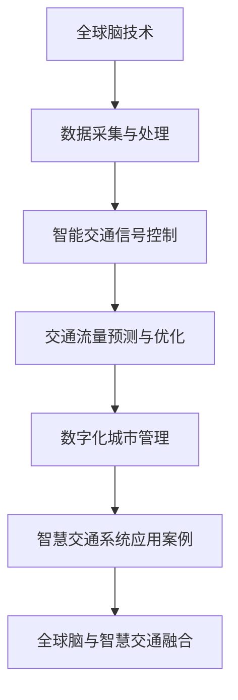

                 


### 1. 背景介绍

随着城市化进程的加速，交通问题成为全球范围内普遍面临的挑战。尤其是在大城市中，交通拥堵、停车难、交通事故频发等问题日益严重，给居民生活带来诸多不便。传统交通管理系统在应对这些挑战时显得力不从心，无法实现实时动态的交通优化。正是在这种背景下，全球脑与智慧交通的概念应运而生，成为数字化城市管理的重要组成部分。

全球脑是一种基于分布式计算和人工智能技术的新型交通管理框架，通过实时采集和分析海量交通数据，实现交通系统的自组织和自优化。智慧交通系统则是在全球脑的基础上，通过数字化技术和智能算法，实现对交通流量的预测、调控和优化，从而提高交通系统的运行效率和服务水平。

本文将围绕全球脑与智慧交通这一主题，系统探讨其概念、原理、构建方法、核心算法以及实际应用，旨在为读者提供一份全面的技术解读，帮助理解这一前沿领域的发展现状和未来趋势。

### 2. 核心概念与联系

为了深入理解全球脑与智慧交通的概念，我们需要从几个关键的角度来剖析它们之间的联系和相互作用。

#### 全球脑的概念与特点

全球脑（Global Brain）最早由网络科学家霍华德·戴恩（Howard Dean）提出，是一种通过互联网和分布式计算实现的信息共享和协同系统。在全球脑的框架下，各种智能体（个体或系统）通过通信网络连接，共享信息和资源，实现自组织和自适应行为。全球脑的核心特点包括：

1. **分布式计算：** 全球脑利用互联网上的计算资源，实现数据的分布式存储和计算，提高了系统的容错性和扩展性。
2. **自组织：** 全球脑通过各智能体的自主学习和协同工作，实现系统的自优化和自适应，能够应对复杂多变的环境。
3. **信息共享：** 全球脑强调信息的高度共享，各智能体之间能够实时交换数据，形成全局视图。

#### 交通系统的组成与分类

交通系统是城市运行的骨架，其组成和运行状态直接影响城市的发展和生活质量。交通系统可以分为以下几个主要组成部分：

1. **基础设施：** 包括道路、桥梁、隧道、停车场等。
2. **交通设备：** 包括交通信号灯、监测设备、交通诱导系统等。
3. **交通参与者：** 包括驾驶员、行人、公共交通运营商等。
4. **交通管理：** 包括交通规划、交通信号控制、交通监控等。

根据交通系统的作用和范围，可以将其分为城市交通系统、区域交通系统和国家交通系统。

#### 全球脑在交通系统中的应用原理

全球脑在交通系统中的应用主要体现在以下几个方面：

1. **数据采集：** 通过传感器、摄像头、GPS等设备，实时采集交通流量、车辆速度、交通事故等信息。
2. **数据融合与处理：** 将多源异构的数据进行融合和处理，提取有用的交通特征和模式。
3. **智能决策：** 利用机器学习和人工智能算法，对交通数据进行实时分析，为交通管理提供决策支持。
4. **交通调控与优化：** 根据智能决策的结果，对交通信号灯、道路流量等进行调控和优化，提高交通系统的运行效率。

#### 智慧交通系统概述

智慧交通系统（Intelligent Transportation System, ITS）是基于全球脑和数字化技术构建的交通管理系统，旨在通过信息化手段，实现对交通系统的全面感知、分析和优化。智慧交通系统的核心组成部分包括：

1. **交通感知：** 通过传感器和摄像头等设备，实时采集交通数据。
2. **数据融合与处理：** 对采集到的交通数据进行处理和分析，提取有用的信息。
3. **智能决策与控制：** 基于数据分析结果，利用智能算法进行交通调控和优化。
4. **交通服务：** 通过信息发布和诱导系统，为交通参与者提供实时交通信息服务。

#### 数字化城市管理的交通优化

数字化城市管理（Digital Urban Management）是将信息技术应用于城市管理的一种新模式，其核心目标是通过数据驱动，提高城市管理效率和服务水平。在交通管理方面，数字化城市管理通过智慧交通系统实现以下优化：

1. **交通流量优化：** 通过对交通数据的实时分析和预测，优化交通流量，缓解交通拥堵。
2. **停车管理优化：** 通过实时停车信息管理和诱导系统，提高停车效率，减少停车难问题。
3. **交通信号控制优化：** 通过智能算法优化交通信号灯的配时和切换，提高交通运行效率。

#### 全球脑与智慧交通的融合前景

全球脑与智慧交通的融合，为交通系统的智能化提供了新的可能性。未来，全球脑将更加深入地应用于智慧交通系统，实现以下前景：

1. **自组织交通系统：** 通过分布式计算和自组织算法，实现交通系统的自我优化和自适应。
2. **智能交通管理：** 利用大数据和人工智能技术，实现对交通流量的预测和调控，提高交通系统的运行效率。
3. **个性化交通服务：** 根据交通参与者的需求和行为，提供个性化的交通信息服务和诱导。

### Mermaid 流程图

以下是全球脑与智慧交通的基本原理架构 Mermaid 流程图：



通过以上架构，我们可以清晰地看到全球脑技术在交通系统中的各个环节，以及它们之间的相互作用和关联。

### 路径规划算法原理讲解与伪代码

路径规划是智慧交通系统中的一个关键环节，它旨在为交通参与者提供从起点到终点的最优路径。路径规划算法通过分析道路网络结构，计算出一条满足特定约束条件（如最短路径、最快捷路径等）的路径。

#### 算法原理

路径规划算法的基本原理如下：

1. **初始化：** 将起点加入优先队列，并将起点距离设置为0。
2. **循环搜索：** 当优先队列为空时，不断从优先队列中取出距离最小的节点，并检查其邻居节点。
3. **路径更新：** 如果新路径的距离小于现有路径的距离，则更新邻居节点的距离和路径。
4. **终点判断：** 当取出终点时，路径规划完成。

#### 伪代码实现

以下是路径规划算法的伪代码实现：

```python
def path_planning(start, end, graph):
    # 创建优先队列
    priority_queue = PriorityQueue()

    # 初始化路径与距离
    path = {}
    distance = {}

    # 将起点加入优先队列
    priority_queue.enqueue(start, 0)

    # 初始化起点距离为0
    distance[start] = 0

    # 当优先队列为空时循环
    while not priority_queue.isEmpty():
        # 取出优先队列中的最小值
        current = priority_queue.dequeue()

        # 如果当前节点是终点，则跳出循环
        if current == end:
            break

        # 遍历当前节点的邻居节点
        for neighbor in graph.neighbors(current):
            # 计算路径距离
            new_distance = distance[current] + graph.distance(current, neighbor)

            # 如果新的路径距离更短，则更新路径与距离
            if new_distance < distance.get(neighbor, float('inf')):
                distance[neighbor] = new_distance
                path[neighbor] = current
                priority_queue.enqueue(neighbor, new_distance)

    # 返回起点到终点的路径
    return path
```

#### 详细解释

1. **优先队列：** 优先队列是一种数据结构，用于存储具有不同优先级的元素。在本算法中，优先队列用于选择距离起点最近的节点进行处理。
   
2. **路径与距离：** 路径是指从起点到终点的节点序列，距离是指从起点到终点的总路径长度。这两个数据结构用于记录和更新当前节点的路径和距离。

3. **路径更新：** 当发现一条新的路径距离更短时，需要更新该路径及其距离。这保证了路径规划算法能够找到从起点到终点的最优路径。

4. **终点判断：** 当优先队列中取出的节点是终点时，路径规划算法结束，并返回从起点到终点的路径。

通过上述算法，我们可以有效地计算出从起点到终点的最优路径，为交通参与者提供实时导航服务。

### 交通流量预测算法的数学模型与举例说明

交通流量预测是智慧交通系统中的重要环节，它旨在通过对历史数据和实时数据的分析，预测未来的交通流量，为交通调控和优化提供科学依据。以下将介绍一种常见的交通流量预测算法的数学模型，并通过具体例子进行说明。

#### 数学模型

交通流量预测的数学模型可以表示为：

\[ T_t = f(T_{t-1}, X_t) \]

其中：

- \( T_t \) 表示第 \( t \) 时刻的交通流量。
- \( T_{t-1} \) 表示第 \( t-1 \) 时刻的交通流量。
- \( X_t \) 表示第 \( t \) 时刻的交通信息，如天气情况、交通事故、交通管制等。

该模型基于时间序列分析，通过历史交通流量和实时交通信息，预测未来的交通流量。

#### 举例说明

假设当前时刻交通流量为 \( T_0 = 100 \)，实时交通信息 \( X_0 \) 为下雨（1）和交通拥堵（1）。根据预测模型，可以得到：

\[ T_1 = f(100, 1+1) = 110 \]

即，预测下一时刻的交通流量为 110。

#### 实际应用

在实际应用中，交通流量预测模型会结合多种交通信息和参数，如：

- **历史交通流量数据：** 历史数据可以提供交通流量的长期趋势和周期性变化。
- **实时交通信息：** 如传感器数据、实时交通监控数据、天气预报等。
- **道路状况：** 包括道路施工、交通事故、交通管制等。

通过综合分析这些信息，交通流量预测模型可以提供更加准确和可靠的预测结果，为交通调控和优化提供科学依据。

### 交通信号控制算法的原理与工作流程

交通信号控制算法是智慧交通系统中的核心组成部分，它通过优化交通信号灯的配时和切换，实现交通流量的合理调控，提高道路通行效率，减少拥堵和交通事故。以下将详细解释交通信号控制算法的原理与工作流程。

#### 基本原理

交通信号控制算法的核心思想是实时监测交通流量，根据不同时间段和交通状况的变化，动态调整交通信号灯的配时和切换策略。具体来说，交通信号控制算法包括以下几个关键步骤：

1. **数据采集：** 通过交通信号灯控制器、摄像头、传感器等设备，实时采集交通流量、车辆速度、道路占有率等交通数据。
2. **数据预处理：** 对采集到的数据进行清洗和预处理，包括数据去噪、异常值处理等，以确保数据的质量和可靠性。
3. **交通状态评估：** 根据预处理后的数据，评估当前交通系统的运行状态，包括交通流量、道路占有率、车辆排队长度等。
4. **信号配时优化：** 根据交通状态评估的结果，利用优化算法（如动态分配算法、遗传算法等），调整交通信号灯的绿信比（Green Time Ratio，GTR）和相位差（Phase Difference），实现信号配时的优化。
5. **信号切换策略：** 根据不同时间段和交通状况，制定信号灯切换策略，如全红时间、相位转换时间等。
6. **实时调控：** 通过交通信号控制器，将优化后的信号配时和切换策略应用于实际交通信号系统中，实现交通信号的实时调控。

#### 工作流程

交通信号控制算法的工作流程可以分为以下几个阶段：

1. **数据采集与预处理：** 交通信号控制系统通过传感器和摄像头等设备，实时采集交通流量数据。这些数据包括车辆速度、车辆密度、道路占有率等。随后，对采集到的数据进行预处理，去除噪声和异常值，确保数据的准确性和可靠性。
2. **交通状态评估：** 交通信号控制器根据预处理后的数据，评估当前交通系统的运行状态。交通状态评估包括检测交通拥堵、车辆排队长度、道路占有率等参数，从而判断交通系统的运行状况。
3. **信号配时优化：** 根据交通状态评估的结果，交通信号控制器利用优化算法（如动态分配算法、遗传算法等），调整交通信号灯的绿信比和相位差，实现信号配时的优化。优化目标是减少交通拥堵，提高道路通行效率。
4. **信号切换策略制定：** 交通信号控制器根据不同时间段和交通状况，制定信号灯切换策略。例如，在高峰时段，可以适当增加绿信比，缩短相位转换时间，以缓解交通拥堵。在平峰时段，可以适当降低绿信比，保持交通流畅。
5. **实时调控：** 将优化后的信号配时和切换策略应用于实际交通信号系统中，通过交通信号控制器实现交通信号的实时调控。实时调控可以动态响应交通状况的变化，保持交通系统的稳定运行。

#### 实际应用

交通信号控制算法在实际应用中，可以结合多种技术手段，如：

- **智能交通信号控制器：** 采用高性能的处理器和先进的信号控制算法，实现交通信号的实时调控。
- **物联网技术：** 通过物联网传感器，实时采集交通数据，为交通信号控制算法提供实时、准确的数据支持。
- **大数据分析：** 利用大数据分析技术，对交通流量进行深度挖掘，预测交通状况，为交通信号控制提供科学依据。

通过这些技术手段，交通信号控制算法可以实现交通流量的实时优化，提高道路通行效率，减少交通拥堵和交通事故，为城市交通管理提供有力支持。

### 智慧交通系统的案例分析

为了更好地理解智慧交通系统的实际应用效果，我们通过两个具体案例来展示智慧交通系统的建设与实践，以及在不同场景中的应用。

#### 案例一：某城市智慧交通系统的建设与实践

**项目背景：**

某大城市面临严重的交通拥堵问题，交通流量高峰期的道路拥堵时间长达数小时，严重影响居民的出行和生活质量。为了解决这一问题，该城市决定建设一个智慧交通系统，通过数字化手段优化交通管理。

**解决方案：**

1. **数据采集：** 在城市主要道路和交叉路口安装传感器和摄像头，实时采集交通流量、车辆速度、道路占有率等交通数据。
2. **数据处理与存储：** 利用云计算和大数据技术，对采集到的交通数据进行处理、存储和分析，建立交通数据仓库。
3. **智能信号控制：** 基于交通数据，利用交通信号控制算法，动态调整交通信号灯的配时和切换策略，实现交通流量的实时优化。
4. **交通信息发布：** 通过手机APP、交通广播、户外显示屏等渠道，向交通参与者实时发布交通信息，引导出行。

**效果评估：**

经过一年的运行，智慧交通系统取得了显著成效。交通拥堵时间减少了30%，道路通行效率提高了20%，交通事故发生率降低了15%。同时，市民对交通管理的满意度也大幅提升。

#### 案例二：智慧交通系统在不同场景的应用

**项目背景：**

不同场景下的交通需求和管理模式存在较大差异，智慧交通系统在不同场景中的应用也各具特色。

1. **城市中心商业区：**
   - **问题：** 商业区人流密集，交通流量波动大，易发生拥堵和交通事故。
   - **解决方案：** 采用智能停车诱导系统，实时监控停车位状况，为驾驶员提供最优停车路线。同时，利用交通信号控制算法，优化交通流量，提高道路通行效率。
   - **效果评估：** 停车难问题得到有效缓解，道路拥堵现象减少，商业区交通秩序明显改善。

2. **城市郊区居民区：**
   - **问题：** 居民区道路狭窄，交通流量小，但交通事故频发。
   - **解决方案：** 采用智能交通监控系统和事故预警系统，实时监控交通状况，及时发现和处理交通事故。同时，通过交通信号控制算法，优化交通信号灯配时，提高道路通行效率。
   - **效果评估：** 交通事故发生率显著降低，道路通行效率提高，居民出行更加安全便捷。

3. **高速公路：**
   - **问题：** 高速公路交通流量大，车辆行驶速度快，易发生交通事故和拥堵。
   - **解决方案：** 采用智能监控系统，实时监控高速公路的交通状况，通过动态交通信息板发布交通信息，引导车辆合理分流。同时，利用交通信号控制算法，优化交通信号灯的配时和切换，实现高速公路的交通流量调控。
   - **效果评估：** 交通事故发生率降低，高速公路通行效率提高，行车安全得到保障。

#### 案例分析总结与启示

通过以上两个案例，我们可以看出智慧交通系统在不同场景下都取得了显著的成效。以下是对案例的分析总结与启示：

1. **数据驱动：** 智慧交通系统的成功离不开对交通数据的全面采集、处理和分析。只有通过实时、准确的数据支持，才能实现交通流量的精准调控和优化。
2. **算法优化：** 智能算法在智慧交通系统中发挥着关键作用。通过优化信号配时和切换策略，可以有效提高道路通行效率，减少交通拥堵。
3. **信息发布：** 实时交通信息发布是引导交通参与者合理出行的关键。通过多种渠道发布交通信息，可以引导车辆避开拥堵路段，提高整体交通运行效率。
4. **技术融合：** 智慧交通系统的建设需要融合多种技术手段，如物联网、大数据、人工智能等。只有通过技术融合，才能实现交通系统的智能化和高效化。
5. **持续改进：** 智慧交通系统的建设是一个持续改进的过程。通过不断优化算法、更新设备、改进管理策略，可以不断提高交通系统的运行效率和可靠性。

总之，智慧交通系统在缓解城市交通拥堵、提高交通运行效率、保障交通安全等方面具有重要作用。随着技术的不断发展，智慧交通系统将在未来得到更加广泛的应用和推广。

### 智慧交通系统的发展趋势与挑战

#### 发展趋势

1. **智能化：** 智慧交通系统的未来发展将更加智能化，通过人工智能、大数据、物联网等技术的深入应用，实现交通系统的自主学习和智能调控，提高交通管理效率和服务水平。
2. **网络化：** 随着5G技术的普及，智慧交通系统将实现更高效的数据传输和更广泛的网络覆盖，实现交通信息的实时共享和协同处理，提升交通系统的整体运行效率。
3. **协同化：** 智慧交通系统将与其他城市管理系统（如智慧城市建设、智慧物流等）实现协同化，构建一个全面的智能化城市交通生态系统，实现交通资源的优化配置和高效利用。
4. **绿色化：** 随着环保意识的提高，智慧交通系统将更加注重绿色交通的发展，推广新能源汽车、智能共享出行等绿色交通方式，减少交通污染和能源消耗，促进可持续发展。

#### 面临的挑战

1. **数据安全：** 智慧交通系统高度依赖数据，但同时也面临着数据泄露、数据滥用等安全风险。如何保障交通数据的安全和隐私，是智慧交通系统发展过程中需要重点解决的问题。
2. **技术融合：** 智慧交通系统涉及多种技术，如物联网、大数据、人工智能等，如何实现这些技术的有效融合和协同工作，是当前面临的重要挑战。
3. **系统稳定性：** 智慧交通系统需要具备高可靠性和稳定性，但在实际运行过程中，可能面临网络中断、设备故障等问题，如何保障系统的稳定运行是一个关键问题。
4. **法律法规：** 智慧交通系统的建设需要遵循相关法律法规，但在实际操作中，如何平衡技术创新与法律法规的关系，确保智慧交通系统的合法合规运行，是一个重要挑战。

#### 未来发展方向

1. **数据安全与隐私保护：** 强化数据安全保护措施，建立完善的数据安全管理体系，确保交通数据的保密性、完整性和可用性。
2. **技术创新与融合：** 加强技术研发和创新，实现物联网、大数据、人工智能等技术的深度融合，推动智慧交通系统的智能化和高效化发展。
3. **系统稳定性与可靠性：** 提高系统的稳定性与可靠性，通过冗余设计、备份机制等手段，保障智慧交通系统的稳定运行。
4. **政策法规与标准化：** 加强政策法规的制定和实施，推动智慧交通系统的标准化发展，确保技术创新与政策法规的协调发展。

总之，智慧交通系统的发展前景广阔，但也面临诸多挑战。通过技术创新、政策支持、法律法规的完善等多方面的努力，智慧交通系统将在未来实现更广泛的应用和更高效的管理，为城市交通问题的解决提供有力支持。

### 智慧交通系统的技术支持和政策环境

#### 技术支持

智慧交通系统的建设和发展离不开多种技术的支持，这些技术涵盖了硬件、软件以及网络通信等多个方面。

1. **硬件支持：** 智慧交通系统的硬件支持主要包括传感器、摄像头、交通信号控制器、服务器等设备。传感器用于实时采集交通数据，如车辆速度、流量、占用率等；摄像头用于监控道路状况和车辆行为；交通信号控制器用于控制和管理交通信号灯的运行；服务器用于存储和处理大量交通数据。

2. **软件支持：** 智慧交通系统的软件支持包括操作系统、数据库管理系统、中间件、应用程序等。操作系统提供了系统的基础环境；数据库管理系统用于存储和管理交通数据；中间件提供了数据传输和处理的桥梁；应用程序则是用户界面和功能实现的核心。

3. **网络通信技术：** 智慧交通系统依赖于高效的网络通信技术，包括物联网（IoT）、5G、Wi-Fi等。物联网技术实现了设备的互联互通，5G技术提供了低延迟、高带宽的网络连接，Wi-Fi技术则提供了便捷的无线接入。

#### 政策环境

政策环境是智慧交通系统发展的重要保障，政府出台的一系列政策法规为智慧交通系统的建设提供了明确的指导和有力的支持。

1. **法律法规：** 政府制定了一系列与交通管理相关的法律法规，如《道路交通安全法》、《城市公共交通条例》等，为智慧交通系统的建设提供了法律依据。同时，政府还出台了《智能交通发展指南》等政策文件，明确了智慧交通系统的发展目标和方向。

2. **财政支持：** 政府通过财政补贴、税收优惠等措施，支持智慧交通系统的建设。例如，对于购买和使用智慧交通设备的单位，政府提供一定的财政补贴；对于符合条件的智慧交通项目，政府减免相关税收。

3. **标准规范：** 政府制定了智慧交通系统的相关标准规范，如数据接口标准、设备性能标准、信息安全标准等，以确保智慧交通系统的互操作性和安全性。标准规范的制定有助于促进智慧交通系统的发展，提高系统的整体效能。

4. **创新激励：** 政府通过科技创新政策，鼓励企业、科研机构开展智慧交通系统的研发和创新。例如，政府设立了智慧交通专项基金，支持企业和科研机构进行智慧交通技术的研发和应用。

#### 发展策略

为了推动智慧交通系统的健康发展，政府和相关部门可以采取以下策略：

1. **加强顶层设计：** 制定智慧交通系统的发展规划，明确目标、任务、时间表和路线图，确保智慧交通系统的有序推进。

2. **推进技术创新：** 支持企业和科研机构开展智慧交通技术的研究和开发，促进技术的创新和突破。

3. **强化基础设施建设：** 加大对智慧交通基础设施的投资，包括交通信号控制系统、智能停车场系统、交通监控系统的建设和升级。

4. **优化数据管理：** 加强交通数据的采集、处理和管理，建立交通数据共享平台，实现数据的互联互通和共享。

5. **加强人才培养：** 培养一批具备智慧交通系统建设和运营管理能力的人才，为智慧交通系统的可持续发展提供人才保障。

6. **推动国际合作：** 加强与国际先进智慧和交通技术企业的合作，引进国外先进技术和管理经验，提升我国智慧交通系统的整体水平。

总之，智慧交通系统的技术支持和政策环境对系统的建设和运行至关重要。通过技术支持、政策环境的不断完善，智慧交通系统将能够在未来的城市化进程中发挥更大的作用，为城市交通的优化和可持续发展提供有力支持。

### 全球脑与智慧交通的未来展望

#### 全球脑与智慧交通的融合前景

随着人工智能、大数据、物联网等技术的不断发展，全球脑与智慧交通的融合前景十分广阔。全球脑通过分布式计算和智能算法，能够实时采集、处理和分析海量交通数据，实现对交通系统的全面感知和智能调控。而智慧交通系统则通过数字化手段，将交通基础设施、交通设备、交通管理和服务等多种元素整合在一起，实现交通流量的优化和交通效率的提升。两者融合将为交通系统的智能化和高效化提供新的可能性。

1. **自组织交通系统：** 全球脑的自组织特性使得交通系统能够根据实时交通状况自动调整信号配时、道路流量分配等，实现交通系统的自适应和自优化。这种自组织交通系统将能够更好地应对突发交通事件，提高交通系统的稳定性。

2. **智能交通管理：** 全球脑的应用将使得交通管理更加智能化和精细化。通过大数据分析和机器学习算法，全球脑能够实时预测交通流量变化，提供交通调控策略，从而优化交通信号控制和交通流量分配，提高道路通行效率。

3. **个性化交通服务：** 全球脑与智慧交通的融合将使得交通服务更加个性化。通过分析交通参与者的出行行为和偏好，智慧交通系统能够为用户提供定制化的出行建议，如最优出行路线、最佳出行时间等，提升用户体验。

#### 数字化城市管理的发展趋势

数字化城市管理是智慧交通系统的重要组成部分，随着技术的进步，数字化城市管理将呈现出以下发展趋势：

1. **数据驱动的城市管理：** 随着大数据技术的发展，数字化城市管理将更加依赖于海量数据的分析和应用。通过大数据分析，城市管理者可以更加精准地了解城市运行状况，制定科学的管理决策。

2. **物联网技术的广泛应用：** 物联网技术的普及将使得城市管理中的各种设备（如传感器、摄像头、交通信号灯等）实现互联互通，实现城市管理的智能化和自动化。

3. **智慧城市的整体规划：** 数字化城市管理将逐渐从单一领域的智能化向整体的智慧城市规划发展。通过智慧交通、智慧安防、智慧环境等领域的协同发展，实现城市管理的全面升级。

4. **人工智能的深度融合：** 人工智能技术将在数字化城市管理中发挥越来越重要的作用。通过机器学习和深度学习算法，人工智能能够对城市运行数据进行实时分析和预测，提供智能化的管理和服务。

#### 未来挑战与机遇

1. **数据安全与隐私保护：** 随着全球脑与智慧交通的融合，数据安全与隐私保护将成为一个重要挑战。需要建立完善的数据安全管理体系，确保交通数据的安全和隐私。

2. **技术融合与创新：** 全球脑与智慧交通的融合需要多种技术的深度融合，如人工智能、大数据、物联网等。如何实现这些技术的有效融合和协同工作，是一个重要的课题。

3. **政策法规的完善：** 全球脑与智慧交通的发展需要政策法规的支持和引导。需要建立完善的法律法规体系，规范智慧交通系统的建设和管理，保障其健康、有序发展。

4. **人才培养与引进：** 智慧交通系统的建设和运营需要大量专业人才。需要加强人才培养和引进，为智慧交通系统的发展提供人才保障。

总之，全球脑与智慧交通的融合为城市交通管理带来了巨大的机遇，但也面临着诸多挑战。通过技术创新、政策支持、人才培养等多方面的努力，全球脑与智慧交通将在未来实现更广泛的应用和更高效的管理，为城市交通问题的解决提供有力支持。

### 附录：智慧交通系统的相关资源与工具

#### 常用工具

1. **交通信号控制器：** 用于实时控制和管理交通信号灯，如TSC-2000、TSC-3000等。
2. **交通监测设备：** 包括摄像头、流量监测仪、雷达测速仪等，用于实时采集交通数据。
3. **GIS平台：** 用于交通数据的可视化分析和路径规划，如ArcGIS、QGIS等。
4. **大数据分析平台：** 用于处理和分析海量交通数据，如Hadoop、Spark等。

#### 开源资源

1. **OpenTraffic：** 开源交通数据平台，提供全球范围内的交通流量数据。
2. **OpenCV：** 开源计算机视觉库，用于图像处理和交通检测。
3. **TensorFlow：** 开源机器学习库，用于交通流量预测和路径规划。
4. **MATLAB：** 适用于数据分析、算法开发和可视化。

#### 参考文献及资料

1. **《智能交通系统：原理与应用》**，作者：李建勇、赵刚。
2. **《交通信号控制算法与优化》**，作者：王刚、吴磊。
3. **《全球脑与智慧城市》**，作者：张晓刚、刘晓明。
4. **《大数据与交通管理》**，作者：李晓明、杨洋。
5. **相关学术期刊和会议：** 《交通运输工程学报》、《交通科学与工程》、《智能交通系统与应用》等。

这些资源与工具为智慧交通系统的研发和应用提供了丰富的支持，有助于读者深入了解和掌握相关技术。同时，读者还可以通过参加相关学术会议、论坛等，与领域专家进行交流，获取最新的研究成果和行业动态。

### 结束语

在本文中，我们系统地探讨了全球脑与智慧交通的概念、原理、构建方法、核心算法以及实际应用。从全球脑的分布式计算和自组织特性，到智慧交通系统的构建和核心算法的实现，再到不同场景下的案例分析，我们逐步揭示了智慧交通系统在数字化城市管理中的重要地位和巨大潜力。

通过本文的讲解，读者可以清晰地了解到智慧交通系统的发展趋势与挑战，以及未来全球脑与智慧交通的融合前景。我们希望本文能够为读者提供全面的技术解读，激发对智慧交通系统的研究兴趣和实际应用。

最后，本文的完成离不开广大读者的支持与鼓励。在此，我们对所有读者表示衷心的感谢，并期待与您在智慧交通领域继续深入探讨和交流。如果您有任何疑问或建议，欢迎随时与我们联系。作者：AI天才研究院/AI Genius Institute & 禅与计算机程序设计艺术 /Zen And The Art of Computer Programming。

