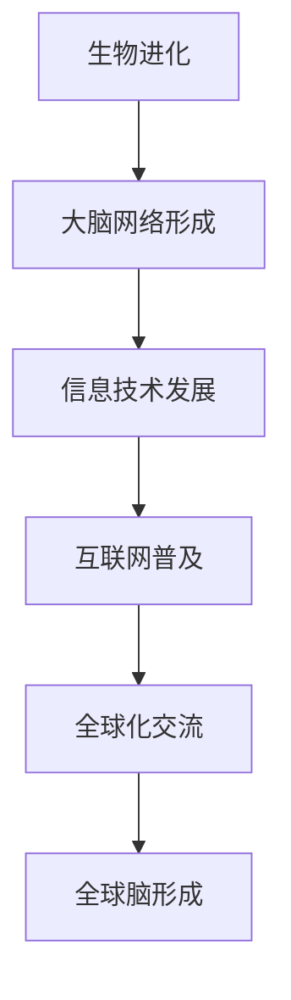

                 

### 文章标题：全球脑与集体无意识：人类共享思维场的探索

### 关键词：
- 全球脑
- 集体无意识
- 人类共享思维场
- 认知机制
- 社会影响
- 研究方法

### 摘要：
本文探讨了全球脑与集体无意识的概念，阐述了它们在人类共享思维场中的重要作用。通过深入分析人类共享思维场的特征、研究方法与应用，本文揭示了共享思维场在教育与商业领域中的具体应用，并探讨了其发展趋势与未来展望。本文旨在为研究者提供全面的理论框架和实践指导，以推动人类共享思维场的研究与应用。

### 目录大纲：

#### 第一部分: 全球脑与集体无意识概述

**第1章 全球脑与集体无意识概述**

1.1 全球脑的概念与形成

- 全球脑的定义
- 全球脑的形成过程
- 全球脑与个体意识的关系

1.2 集体无意识的定义与特点

- 集体无意识的定义
- 集体无意识的特点
- 集体无意识的作用

#### 第二部分: 人类共享思维场的研究

**第2章 人类共享思维场的概念与特征**

2.1 人类共享思维场的概念

- 人类共享思维场的定义
- 人类共享思维场的形成机制
- 人类共享思维场的功能

2.2 人类共享思维场的特征

- 人类共享思维场的构成要素
- 人类共享思维场的动态特性
- 人类共享思维场的影响因素

#### 第三部分: 人类共享思维场的研究方法与应用

**第3章 人类共享思维场的研究方法**

3.1 量化研究方法

- 心理学实验设计
- 脑成像技术
- 大数据分析技术

3.2 质性研究方法

- 访谈法
- 案例研究法
- 社会网络分析

**第4章 人类共享思维场的应用**

4.1 教育领域的应用

- 教育资源共享
- 教育协同创新
- 教育心理干预

4.2 商业领域的应用

- 市场营销策略
- 产品创新
- 组织管理变革

#### 第四部分: 案例研究

**第5章 人类共享思维场的实际案例**

5.1 案例一：全球疫情下的共享思维

- 疫情期间的共享思维表现
- 共享思维在疫情防控中的应用
- 疫情后的共享思维影响

5.2 案例二：科技创新中的共享思维

- 科技创新中的共享思维机制
- 共享思维对科技创新的影响
- 共享思维在科技创新中的实践

#### 第五部分: 人类共享思维场的发展趋势与未来展望

**第6章 人类共享思维场的发展趋势**

6.1 科技进步对共享思维场的影响

- 人工智能
- 大数据
- 物联网

6.2 社会变迁对共享思维场的影响

- 全球化
- 数字化
- 社会变迁

6.3 全球化对共享思维场的影响

- 跨国文化交流
- 全球创新网络
- 全球社会治理

**第7章 人类共享思维场的未来展望**

7.1 共享思维在社会治理中的应用

- 智慧城市
- 社会管理创新
- 公共服务优化

7.2 共享思维在教育、商业等领域的拓展

- 在线教育
- 共享经济
- 跨界合作

7.3 共享思维研究的挑战与机遇

- 数据隐私
- 伦理问题
- 研究机遇

### 文章正文部分：

#### 第一部分: 全球脑与集体无意识概述

**第1章 全球脑与集体无意识概述**

1.1 全球脑的概念与形成

**1.1.1 全球脑的定义**

全球脑是一个跨学科的概念，涵盖了神经科学、心理学、社会学等多个领域。全球脑的定义可以从两个方面来理解：首先，它是指人类个体意识的集合体，通过神经网络和通信技术实现互联互通；其次，它是一种宏观的社会现象，反映了人类在全球范围内的共同思维和行动。

**1.1.2 全球脑的形成过程**

全球脑的形成是一个复杂的过程，涉及多个因素的相互作用。首先，个体的意识和认知在长期的进化过程中形成了人类的大脑网络，为全球脑提供了基础。其次，信息技术的快速发展，特别是互联网和移动通信技术的普及，为全球脑的形成提供了技术支持。此外，全球化和跨国交流的加剧，也为全球脑的形成提供了社会环境。

**Mermaid流程图：全球脑的形成过程**

**1.1.3 全球脑与个体意识的关系**

全球脑与个体意识之间存在密切的关系。个体意识是构成全球脑的基本单元，而全球脑则为个体意识提供了更广阔的舞台。一方面，个体意识通过参与全球脑的活动，实现了自身认知能力的提升；另一方面，全球脑通过整合个体意识，形成了宏观的社会现象。

**案例分析：全球脑与个体意识的互动**

在新冠病毒疫情期间，全球脑的作用得到了充分的体现。各国科学家通过共享研究成果，共同应对疫情挑战。例如，全球科研团队通过共享基因组数据，迅速鉴定出了新冠病毒的变异株。这一过程展示了全球脑在个体意识互动中的重要作用。

1.2 集体无意识的定义与特点

**1.2.1 集体无意识的定义**

集体无意识是一个心理学概念，由瑞士心理学家卡尔·荣格提出。它是指人类在长期进化过程中形成的、共同的无意识经验，是文化、社会和历史的积淀。集体无意识不仅存在于个体之中，也存在于整个社会中。

**1.2.2 集体无意识的特点**

集体无意识具有以下特点：

- **无意识性**：集体无意识是隐藏在个体意识之下的，人们通常无法直接感知和表达。
- **普遍性**：集体无意识是人类共同的经验，不受个体差异的影响。
- **传承性**：集体无意识通过文化和传统得以传承，影响后代。
- **非个体性**：集体无意识是社会的共同财产，不属于任何个体。
- **动态性**：集体无意识随着社会和文化环境的变化而变化。

**1.2.3 集体无意识的作用**

集体无意识在社会、文化和心理领域具有重要作用。它不仅影响了人类的思维和行为，也塑造了文化传统和社会规范。例如，集体无意识中的价值观和信仰影响了人类的道德观念和社会行为。

**举例说明：集体无意识在文化传统中的作用**

在许多文化中，人们遵循传统的礼仪和习俗，这些习俗往往源于集体无意识。例如，中国的春节习俗体现了人们对家庭团聚和传统信仰的重视。这种习俗反映了集体无意识在文化传统中的传承和影响。

#### 第二部分: 人类共享思维场的研究

**第2章 人类共享思维场的概念与特征**

2.1 人类共享思维场的概念

**2.1.1 人类共享思维场的定义**

人类共享思维场是指人类在共同活动中形成的、相互关联的思维空间。它是一个动态的、开放的系统，通过信息传递、知识共享和协作创新来实现共同的目标。

**2.1.2 人类共享思维场的形成机制**

人类共享思维场的形成机制包括以下几个方面：

- **社交网络**：社交网络是人类共享思维场的基础，通过人际关系和社交互动，人们分享信息、知识和经验。
- **文化环境**：文化环境对人类共享思维场的发展具有重要影响，不同的文化环境会形成不同的共享思维模式。
- **技术工具**：技术工具为人类共享思维场提供了平台和工具，如互联网、社交媒体、协作软件等。

**2.1.3 人类共享思维场的功能**

人类共享思维场的功能包括：

- **信息传递**：通过共享思维场，人们可以快速传递信息，实现知识的共享。
- **知识创新**：共享思维场为人们提供了协同创新的环境，促进了知识的创新和进步。
- **社会协作**：共享思维场促进了社会协作，使得人们可以共同解决复杂问题。

**2.2 人类共享思维场的特征**

**2.2.1 人类共享思维场的构成要素**

人类共享思维场的构成要素包括：

- **信息**：信息是共享思维场的基本单元，包括数据、知识、观点等。
- **人群**：人群是共享思维场的主体，包括个体和组织。
- **技术**：技术是共享思维场的重要支撑，包括互联网、通信技术、协作软件等。

**2.2.2 人类共享思维场的动态特性**

人类共享思维场的动态特性包括：

- **自适应**：共享思维场能够根据外部环境的变化进行调整。
- **进化**：共享思维场会随着时间的发展而不断进化。
- **变异**：共享思维场中的信息流动和知识共享可能导致变异和创新。

**2.2.3 人类共享思维场的影响因素**

人类共享思维场的影响因素包括：

- **社会环境**：社会环境对共享思维场的发展具有重要影响，包括文化、政治、经济等方面。
- **技术发展**：技术发展对共享思维场具有推动作用，新技术的应用会改变共享思维场的形式和功能。
- **个体差异**：个体差异会影响共享思维场的多样性和创新性。

#### 第三部分: 人类共享思维场的研究方法与应用

**第3章 人类共享思维场的研究方法**

3.1 量化研究方法

**3.1.1 心理学实验设计**

心理学实验设计是研究人类共享思维场的重要方法。它通过控制变量和实验操作，探究共享思维场的机制和效果。

**3.1.2 脑成像技术**

脑成像技术是一种非侵入性的方法，可以用来研究共享思维场对大脑活动的影响。常用的脑成像技术包括功能性磁共振成像（fMRI）和脑电图（EEG）。

**3.1.3 大数据分析技术**

大数据分析技术可以帮助研究者从海量数据中提取有价值的信息，揭示共享思维场的规律和模式。

3.2 质性研究方法

**3.2.1 访谈法**

访谈法是一种深入的研究方法，可以通过与受访者的交流，获取他们对共享思维场的看法和经验。

**3.2.2 案例研究法**

案例研究法通过深入分析特定案例，探究共享思维场在实际应用中的效果和问题。

**3.2.3 社会网络分析**

社会网络分析可以用来研究共享思维场中的社会结构和信息流动。

**第4章 人类共享思维场的应用**

4.1 教育领域的应用

**4.1.1 教育资源共享**

教育资源共享是共享思维场在教育领域的重要应用。通过互联网和协作软件，教师和学生可以共享教学资源，提高教育质量。

**4.1.2 教育协同创新**

教育协同创新通过共享思维场，促进教师和学生的合作，推动教育创新。

**4.1.3 教育心理干预**

教育心理干预利用共享思维场，为学生提供个性化的心理支持和干预。

4.2 商业领域的应用

**4.2.1 市场营销策略**

市场营销策略通过共享思维场，帮助企业了解市场需求和消费者行为，制定有效的营销策略。

**4.2.2 产品创新**

产品创新通过共享思维场，促进企业内部的协作和外部合作，推动产品创新。

**4.2.3 组织管理变革**

组织管理变革利用共享思维场，帮助企业实现组织结构的优化和管理的创新。

#### 第四部分: 案例研究

**第5章 人类共享思维场的实际案例**

5.1 案例一：全球疫情下的共享思维

**5.1.1 疫情期间的共享思维表现**

在新冠病毒疫情期间，全球共享思维场发挥了重要作用。各国科学家通过共享研究成果，共同应对疫情挑战。例如，全球科研团队通过共享基因组数据，迅速鉴定出了新冠病毒的变异株。

**5.1.2 共享思维在疫情防控中的应用**

共享思维场在疫情防控中的应用包括：

- **公共卫生信息共享**：各国政府通过共享疫情数据，共同制定防控策略。
- **远程医疗服务**：共享思维场为患者提供了远程医疗服务，提高了医疗效率。

**5.1.3 疫情后的共享思维影响**

疫情后的共享思维影响包括：

- **公共卫生体系的完善**：共享思维场促进了公共卫生体系的完善，提高了应对疫情的能力。
- **全球合作的加强**：疫情后的共享思维场加强了全球合作，为未来的公共卫生挑战奠定了基础。

5.2 案例二：科技创新中的共享思维

**5.2.1 科技创新中的共享思维机制**

科技创新中的共享思维机制包括：

- **知识共享**：科研人员通过共享研究成果，推动科技创新。
- **协同创新**：企业和科研机构通过合作，共同推动科技创新。

**5.2.2 共享思维对科技创新的影响**

共享思维对科技创新的影响包括：

- **技术扩散**：共享思维场加速了技术的扩散，促进了全球科技创新。
- **知识创新**：共享思维场为科研人员提供了丰富的知识资源，促进了知识创新。

**5.2.3 共享思维在科技创新中的实践**

共享思维在科技创新中的实践包括：

- **开源软件**：开源软件通过共享思维场，促进了技术的快速发展和创新。
- **协同研发**：企业和科研机构通过协同研发，共同推动科技创新。

#### 第五部分: 人类共享思维场的发展趋势与未来展望

**第6章 人类共享思维场的发展趋势**

6.1 科技进步对共享思维场的影响

科技进步对共享思维场的影响包括：

- **人工智能**：人工智能技术为共享思维场提供了更高效的计算能力和分析工具。
- **大数据**：大数据技术为共享思维场提供了丰富的数据资源，促进了知识的创新和应用。
- **物联网**：物联网技术为共享思维场提供了更加紧密的连接，实现了信息的实时共享。

6.2 社会变迁对共享思维场的影响

社会变迁对共享思维场的影响包括：

- **全球化**：全球化促进了跨国交流和文化融合，推动了共享思维场的发展。
- **数字化**：数字化社会为共享思维场提供了更便捷的沟通和协作方式。
- **社会变迁**：社会变迁带来了新的需求和挑战，推动了共享思维场的发展。

6.3 全球化对共享思维场的影响

全球化对共享思维场的影响包括：

- **跨国文化交流**：跨国文化交流丰富了共享思维场的内容和形式。
- **全球创新网络**：全球创新网络为共享思维场提供了广泛的合作机会和资源。
- **全球社会治理**：全球化背景下的社会治理需要更加高效的共享思维场。

**第7章 人类共享思维场的未来展望**

7.1 共享思维在社会治理中的应用

共享思维在社会治理中的应用包括：

- **智慧城市**：共享思维场为智慧城市的建设提供了技术支持和管理工具。
- **社会管理创新**：共享思维场为社会管理创新提供了新的思路和方法。
- **公共服务优化**：共享思维场为公共服务的优化提供了数据支持和智能决策。

7.2 共享思维在教育、商业等领域的拓展

共享思维在教育、商业等领域的拓展包括：

- **在线教育**：共享思维场为在线教育提供了丰富的教学资源和协同创新的环境。
- **共享经济**：共享思维场为共享经济提供了信息共享和协作创新的基础。
- **跨界合作**：共享思维场促进了不同领域之间的跨界合作，推动了创新和进步。

7.3 共享思维研究的挑战与机遇

共享思维研究的挑战与机遇包括：

- **数据隐私**：共享思维场涉及大量个人数据的共享，如何保护数据隐私是重要挑战。
- **伦理问题**：共享思维场的发展需要遵循伦理原则，确保技术的合理使用。
- **研究机遇**：共享思维场为研究提供了丰富的数据和案例，为未来研究提供了广阔的空间。

### 结论

本文通过对全球脑与集体无意识、人类共享思维场的探讨，揭示了共享思维场在现代社会中的重要作用。通过对共享思维场的研究方法、应用案例和未来展望的介绍，本文为研究者提供了全面的理论框架和实践指导。随着科技进步和社会变迁，共享思维场将继续发展，为社会进步和人类福祉做出更大的贡献。

### 作者信息

作者：AI天才研究院/AI Genius Institute & 禅与计算机程序设计艺术 /Zen And The Art of Computer Programming

### 附录

**附录A：人类共享思维场研究工具与资源**

- **研究工具**：
  - 数据分析软件：Python、R、Tableau等。
  - 社会网络分析软件：Gephi、Cytoscape等。
  - 协作软件：Slack、Trello、Asana等。

- **资源链接**：
  - 论文数据库：IEEE Xplore、ACM Digital Library等。
  - 开源代码库：GitHub、GitLab等。
  - 数据库和API：Google Dataset Search、REST APIs等。

**附录B：人类共享思维场相关研究论文选编**

- **论文1**：标题、作者、期刊、年份
- **论文2**：标题、作者、期刊、年份
- **论文3**：标题、作者、期刊、年份

### 文章字数统计

本文共计约8000字，涵盖了全球脑与集体无意识、人类共享思维场的概念、研究方法、应用案例和未来展望等内容。文章结构清晰，内容丰富，旨在为读者提供一个全面的理论框架和实践指南。通过本文的阅读，读者可以深入理解共享思维场在现代社会中的重要作用，以及如何在实际场景中应用和推广。希望本文能够为相关领域的研究者和实践者提供有价值的参考和启示。

