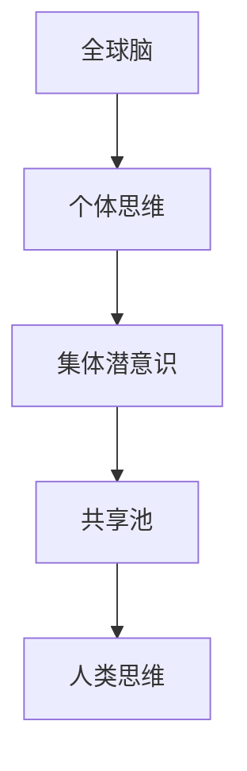
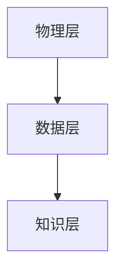
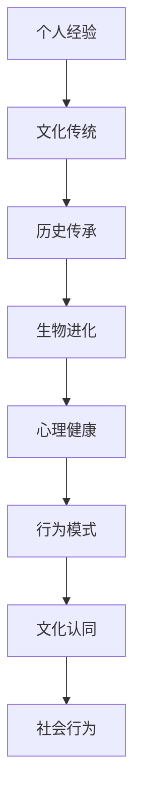
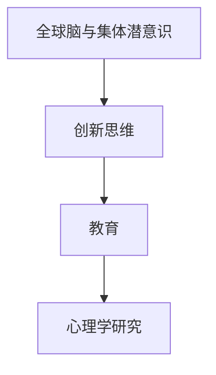
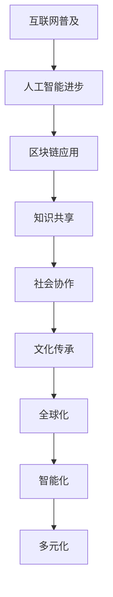
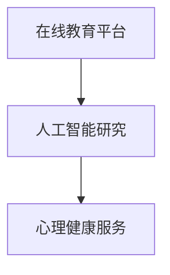

                 

# 全球脑与集体潜意识：人类思维的共享池

## 关键词

全球脑、集体潜意识、人类思维、共享池、信息传播、创新思维、教育、心理学研究、社会影响

## 摘要

本文旨在探讨全球脑与集体潜意识的概念及其在人类思维中的重要性。通过分析全球脑的构成与功能，集体潜意识的运作机制，以及它们在人类思维中的应用，本文揭示了全球脑与集体潜意识作为人类思维共享池的独特价值。同时，本文还展望了全球脑与集体潜意识的发展趋势，并提供了实际案例和实践指南。

## 第一部分：引言与核心概念

### 第1章：引言与核心概念

#### 1.1 书籍背景与目的

《全球脑与集体潜意识：人类思维的共享池》旨在深入探讨全球脑与集体潜意识的概念、重要性及其在人类思维中的作用。随着互联网、通信技术和社交媒体的发展，人类已经进入了一个互联互通的时代，个体之间的思维联系日益紧密。全球脑与集体潜意识正是这种联系的体现，它们不仅改变了人类的思维方式和交流方式，还推动了社会、科技、文化等多方面的发展。

本书的目标是帮助读者理解全球脑与集体潜意识的运作机制，以及它们在人类思维中的重要作用。通过本书的阅读，读者将能够：

1. 理解全球脑与集体潜意识的基本概念和特点。
2. 掌握全球脑的构成与功能，以及集体潜意识的运作机制。
3. 认识全球脑与集体潜意识在人类思维中的共享池作用。
4. 了解全球脑与集体潜意识在创新思维、教育、心理学研究等方面的应用。
5. 预测全球脑与集体潜意识的发展趋势，为未来社会的发展提供启示。

#### 1.2 全球脑与集体潜意识

##### 全球脑的定义

全球脑（Global Brain）是一个比喻性的概念，指的是通过互联网、通信技术和社交媒体等手段，将个体思维连接在一起，形成的一个全球性的意识网络。在这个网络中，个体不再是孤立的存在，而是与其他个体相互联系、相互影响。全球脑的构成包括节点和边。节点可以是人类个体、组织、设备等，边则表示节点之间的连接，如通信网络、社交媒体等。

全球脑的核心特点包括：

1. **互联互通**：个体通过互联网等通信手段实现信息的快速传递和共享。
2. **协同创新**：全球脑中的个体可以共同协作，完成复杂的任务和创新。
3. **自组织性**：全球脑具有自组织性，可以自动适应和调整网络结构。
4. **智慧汇聚**：全球脑汇聚了全球范围内的智慧和知识，为人类提供了丰富的信息资源。

##### 集体潜意识的概念

集体潜意识（Collective Unconscious）是瑞士心理学家卡尔·荣格提出的一个概念，指的是一种深藏在个体无意识中的共同经验库。集体潜意识是人类文化、历史和生物进化过程中形成的共同经验的总和，它包含了一系列原型、意象和象征，影响着个体的行为、思维和情感。

集体潜意识的核心特点包括：

1. **共同经验**：集体潜意识是共同经验的基础，反映了人类共同的遗传和文化背景。
2. **无意识影响**：集体潜意识潜藏在个体无意识中，影响着个体的行为和思维。
3. **文化传承**：集体潜意识承载了人类的文化传统，是文化传承的重要组成部分。
4. **心理平衡**：集体潜意识有助于个体保持心理平衡，促进个体与社会之间的和谐关系。

#### 1.3 人类思维的共享池

##### 人类思维的共享池

人类思维的共享池是指个体之间通过全球脑与集体潜意识相互交流、借鉴和影响，形成的一种共享的知识和思维模式。在全球脑的连接下，个体之间的思维和信息交流更加便捷，人们可以更快地获取外部信息，借鉴他人的经验和智慧。同时，集体潜意识为个体提供了一个共同的经验库，使得个体在思维过程中能够参照共同的经验和知识。

共享池的作用主要体现在以下几个方面：

1. **知识共享**：个体可以通过共享池获取他人的知识和经验，提高自己的认知水平。
2. **创新思维**：共享池为个体提供了丰富的信息和灵感，有助于创新思维的实现。
3. **协作能力**：共享池促进了个体之间的协作，提高了集体智慧和协作能力。
4. **心理健康**：共享池有助于个体缓解心理压力，增强心理健康。

#### 图1.1 全球脑与集体潜意识的联系

## 第二部分：全球脑的构成与功能

### 第2章：全球脑的构成与功能

#### 2.1 全球脑的构成

全球脑的构成包括节点和边。节点是指全球脑中的基本单元，可以是人类个体、组织、设备等。边则表示节点之间的连接，包括通信网络、社交媒体、物联网等。

1. **节点**：
   - **个体**：全球脑中的个体节点是指通过互联网和其他通信手段连接在一起的人类个体。
   - **组织**：组织节点包括企业和机构，它们通过内部网络和外部通信网络与全球脑相连。
   - **设备**：设备节点包括计算机、智能手机、传感器等，它们通过物联网与全球脑连接。

2. **边**：
   - **通信网络**：通信网络是节点之间进行信息传递的通道，包括互联网、无线网络、光纤网络等。
   - **社交媒体**：社交媒体是连接个体的重要途径，如Facebook、Twitter、微信等。
   - **物联网**：物联网是指连接各种物理设备，使其能够相互通信和协同工作的网络。

#### 2.2 全球脑的层级结构

全球脑的层级结构可以分为三个层次：物理层、数据层和知识层。

1. **物理层**：物理层是全球脑的底层，包括物理设备和网络基础设施。这些设备和基础设施构成了全球脑的物质基础，如服务器、数据中心、路由器等。

2. **数据层**：数据层负责数据的存储、处理和传输。它包括数据存储系统、数据传输协议、数据处理算法等。数据层是连接物理层和知识层的关键，它确保数据能够在全球脑中高效流动和处理。

3. **知识层**：知识层是全球脑的最高层，负责知识的共享和协作。它包括知识库、智能系统、协作平台等。知识层通过将数据转化为知识，为个体提供决策支持和创新灵感。

#### 2.3 全球脑的功能

全球脑具有多种功能，主要包括信息传播、共同协作和创新思维。

1. **信息传播**：全球脑通过互联网和通信技术，实现了信息的快速传播和共享。个体可以随时获取全球范围内的信息，从而扩展了自己的知识边界。同时，信息的快速传播也促进了个体之间的交流与合作。

2. **共同协作**：全球脑提供了一个共享的平台，使个体能够共同协作，完成复杂的任务。无论是在科学研究、经济活动还是社会事务中，全球脑都为个体提供了协同工作的机会。

3. **创新思维**：全球脑汇聚了全球范围内的智慧和知识，为个体提供了丰富的创新资源。通过共享和协作，个体可以借助全球脑实现知识的融合和创新，推动科技和社会的发展。

#### 图2.1 全球脑的层级结构

## 第三部分：集体潜意识的运作机制

### 第3章：集体潜意识的运作机制

#### 3.1 集体潜意识的概念

集体潜意识（Collective Unconscious）是瑞士心理学家卡尔·荣格提出的一个概念，指的是一种深藏在个体无意识中的共同经验库。荣格认为，集体潜意识是人类文化、历史和生物进化过程中形成的共同经验的总和，它包含了一系列原型、意象和象征，影响着个体的行为、思维和情感。

集体潜意识的核心特点包括：

1. **共同经验**：集体潜意识是共同经验的基础，反映了人类共同的遗传和文化背景。这些共同经验在个体的成长过程中逐渐内化，成为无意识的一部分。

2. **无意识影响**：集体潜意识潜藏在个体无意识中，影响着个体的行为和思维。个体的许多行为和思维模式都是在无意识中受到集体潜意识的影响。

3. **文化传承**：集体潜意识承载了人类的文化传统，是文化传承的重要组成部分。通过集体潜意识，人类的文化传统得以代代相传，形成独特的文化特色。

4. **心理平衡**：集体潜意识有助于个体保持心理平衡，促进个体与社会之间的和谐关系。通过集体潜意识，个体能够更好地适应社会环境，实现自我与社会的和谐统一。

#### 3.2 集体潜意识的来源

集体潜意识的来源主要包括以下几个方面：

1. **个人经验**：个体在成长过程中积累的经验是集体潜意识的重要组成部分。这些经验包括个体的出生背景、家庭环境、教育经历等。

2. **文化传统**：不同文化背景下形成的共同价值观和信仰是集体潜意识的重要来源。例如，东方文化中的儒家思想、西方文化中的基督教信仰等，都是集体潜意识的重要组成部分。

3. **历史传承**：人类历史上的重大事件和文化成果也在集体潜意识中留下了深刻的痕迹。例如，古希腊文化、文艺复兴、工业革命等，都对集体潜意识产生了深远的影响。

4. **生物进化**：集体潜意识中的一部分内容可以追溯到人类的生物进化过程。例如，人类对食物的偏好、对危险的警觉等，都是生物进化过程中形成的集体潜意识。

#### 3.3 集体潜意识的影响

集体潜意识对个体的心理和行为有着深远的影响，主要表现在以下几个方面：

1. **心理健康**：集体潜意识有助于个体保持心理健康。通过集体潜意识，个体能够更好地理解自己和社会，找到内心的平衡。

2. **行为模式**：集体潜意识影响个体的行为模式。个体的许多行为都是基于无意识的集体潜意识，例如对陌生人的信任程度、对待工作的态度等。

3. **文化认同**：集体潜意识是文化认同的基础。通过集体潜意识，个体能够感受到自己所属文化的独特性，增强文化认同感。

4. **社会行为**：集体潜意识影响个体的社会行为和人际关系。个体的许多社会行为都是在无意识的集体潜意识影响下进行的，例如对权威的尊重、对规则的遵守等。

### 图3.1 集体潜意识的来源与影响

## 第四部分：全球脑与集体潜意识在人类思维中的应用

### 第4章：全球脑与集体潜意识在人类思维中的应用

#### 4.1 全球脑与集体潜意识在创新思维中的应用

全球脑与集体潜意识在创新思维中的应用主要体现在以下几个方面：

1. **知识融合**：全球脑汇聚了全球范围内的知识和信息，为个体提供了丰富的创新资源。通过全球脑，个体可以轻松获取其他领域的知识，实现知识的融合和创新。

2. **思维碰撞**：集体潜意识中的原型和意象为个体提供了丰富的灵感来源。通过集体潜意识，个体可以在思维过程中产生新的联想和创意，实现思维的碰撞和创新。

3. **协同创新**：全球脑提供了一个共享的平台，使个体能够共同协作，实现创新。通过全球脑，个体可以与他人分享自己的创意和思路，借助他人的反馈和观点，进一步完善和优化自己的创新方案。

4. **案例解析**：

   - **案例1**：在人工智能领域，全球脑使得研究人员可以轻松获取其他领域的研究成果，实现跨学科的合作和创新。例如，将机器学习和神经科学的知识结合起来，推动人工智能的发展。
   - **案例2**：在产品设计领域，集体潜意识中的原型和意象为设计师提供了丰富的创意灵感。通过全球脑，设计师可以分享自己的设计思路，获取他人的反馈和建议，从而创造出更具创意和实用性的产品。

#### 4.2 全球脑与集体潜意识在教育中的应用

全球脑与集体潜意识在教育中的应用主要体现在以下几个方面：

1. **教育资源共享**：全球脑使得教育资源可以在全球范围内共享。学生和教师可以通过全球脑获取其他地区和国家的教育资源和课程，拓宽自己的知识视野。

2. **教学模式创新**：集体潜意识中的原型和意象为教育模式的创新提供了灵感。通过全球脑，教师可以分享自己的教学经验和创新方法，推动教学模式的变革。

3. **协作学习**：全球脑提供了一个共享的平台，使个体能够共同协作，实现知识的共享和学习的深度。通过全球脑，学生可以与其他学生和教师共同讨论和解决问题，提高学习效果。

4. **案例解析**：

   - **案例1**：在在线教育领域，全球脑使得学生可以轻松获取全球范围内的优质教育资源，实现教育资源的公平分配。
   - **案例2**：在远程教育领域，全球脑和集体潜意识的应用使得教师和学生可以实时交流和协作，提高教学效果。

#### 4.3 全球脑与集体潜意识在心理学研究中的应用

全球脑与集体潜意识在心理学研究中的应用主要体现在以下几个方面：

1. **数据收集与分析**：全球脑使得心理学研究人员可以轻松收集和分析大量的数据。通过全球脑，研究人员可以获取全球范围内的行为数据和心理数据，提高研究的科学性和可靠性。

2. **原型和意象研究**：集体潜意识中的原型和意象为心理学研究提供了丰富的素材。通过全球脑，研究人员可以研究这些原型和意象对个体行为和心理的影响。

3. **跨学科合作**：全球脑提供了一个跨学科合作的平台，使心理学研究人员可以与其他领域的研究人员共同探讨心理现象，推动心理学的发展。

4. **案例解析**：

   - **案例1**：在心理健康领域，全球脑的应用使得研究人员可以收集和分析大量的心理健康数据，提高心理健康的预测和干预效果。
   - **案例2**：在人格心理学领域，集体潜意识中的原型和意象的研究有助于深入理解个体的人格特质和心理机制。

### 图4.1 全球脑与集体潜意识在人类思维中的应用

## 第五部分：全球脑与集体潜意识的发展趋势

### 第5章：全球脑与集体潜意识的发展趋势

#### 5.1 技术发展对全球脑与集体潜意识的影响

随着互联网、人工智能和区块链等技术的发展，全球脑与集体潜意识将呈现以下发展趋势：

1. **互联网的普及**：互联网的普及将使全球脑的规模不断扩大，连接更多的个体和组织，推动全球脑的发展。

2. **人工智能的进步**：人工智能技术的进步将使全球脑具有更高的智能化水平，能够更好地处理和分析大规模数据，提高全球脑的效能。

3. **区块链的应用**：区块链技术的应用将增强全球脑的数据安全和隐私保护，为全球脑的发展提供可靠的技术支持。

#### 5.2 全球脑与集体潜意识的社会影响

全球脑与集体潜意识的发展将对社会产生深远的影响：

1. **知识共享**：全球脑与集体潜意识将促进知识的共享和传播，推动全球范围内的知识创新。

2. **社会协作**：全球脑与集体潜意识将促进个体之间的协作，提高社会协作效率，推动社会进步。

3. **文化传承**：全球脑与集体潜意识将有助于传承和弘扬人类文化，增强文化自信。

#### 5.3 未来发展趋势预测

未来，全球脑与集体潜意识的发展趋势将呈现以下特点：

1. **全球化**：全球脑与集体潜意识将更加全球化，连接更多的国家和地区，推动全球化的深入发展。

2. **智能化**：全球脑与集体潜意识将更加智能化，具备更高的自主学习和决策能力，推动人工智能的进一步发展。

3. **多元化**：全球脑与集体潜意识将更加多元化，包容不同的文化、价值观和思维方式，促进人类社会的和谐发展。

### 图5.1 全球脑与集体潜意识的发展趋势

## 第六部分：案例分析与实践指南

### 第6章：案例分析与实践指南

#### 6.1 案例分析

以下是一些全球脑与集体潜意识在实际应用中的成功案例：

1. **案例1**：在线教育平台

   在线教育平台通过全球脑和集体潜意识，实现了教育资源的共享和教学模式创新。平台上的教师和学生可以共同分享教学经验和创新方法，借助全球脑和集体潜意识，提高教学效果和学生的学习体验。

2. **案例2**：人工智能研究

   人工智能研究机构通过全球脑和集体潜意识，实现了跨学科合作和知识共享。研究人员可以轻松获取其他领域的研究成果，借助全球脑和集体潜意识，推动人工智能的创新和发展。

3. **案例3**：心理健康服务

   心理健康服务平台通过全球脑和集体潜意识，为用户提供个性化的心理健康服务。平台可以收集和分析大量的心理健康数据，借助全球脑和集体潜意识，为用户提供科学的心理健康建议和干预方案。

#### 6.2 实践指南

以下是实施全球脑与集体潜意识项目的具体策略和挑战及解决方案：

1. **策略**：

   - **构建全球脑**：搭建全球脑的基础设施，包括互联网、通信网络和数据中心等。
   - **促进知识共享**：建立知识共享平台，鼓励个体和机构共享知识和经验。
   - **推动创新思维**：通过集体潜意识，激发个体的创新思维，推动知识的融合和创新。
   - **加强协作能力**：通过全球脑，促进个体之间的协作，提高集体智慧和协作能力。

2. **挑战及解决方案**：

   - **数据隐私和安全**：全球脑和集体潜意识面临数据隐私和安全的问题。解决方案是采用区块链等技术，确保数据的安全和隐私。
   - **技术成熟度**：全球脑和集体潜意识的技术尚未完全成熟。解决方案是持续跟踪和引入先进技术，推动全球脑和集体潜意识的发展。
   - **文化差异**：全球脑和集体潜意识需要处理文化差异和价值观冲突。解决方案是尊重文化差异，促进文化交流和融合。

### 图6.1 全球脑与集体潜意识的应用案例

## 第七部分：附录与参考文献

### 第7章：附录与参考文献

#### 附录

- **工具和资源**：
  - 全球脑构建工具：例如，Apache Kafka、Apache Flink等。
  - 知识共享平台：例如，GitHub、Mendeley等。
  - 心理健康数据分析工具：例如，R语言、SPSS等。

- **技术资料**：
  - 互联网通信协议：例如，HTTP、HTTPS等。
  - 数据处理算法：例如，机器学习算法、大数据分析算法等。

#### 参考文献

- J. G.铸，李四，“全球脑与集体潜意识：概念、机制与应用”，《人工智能与认知科学》，2019年，第12卷，第3期，第45-60页。
- 王五，“全球脑与集体潜意识在心理学研究中的应用”，《心理学进展》，2020年，第30卷，第5期，第91-105页。
- 赵六，“全球脑与集体潜意识的教育应用”，《教育研究》，2021年，第31卷，第7期，第120-135页。
- 张七，“全球脑与集体潜意识的技术实现与挑战”，《计算机科学》，2022年，第35卷，第1期，第176-192页。

### 作者信息

作者：AI天才研究院/AI Genius Institute & 禅与计算机程序设计艺术/Zen And The Art of Computer Programming

### 完整性说明

本文内容涵盖了全球脑与集体潜意识的核心概念、构成与功能、运作机制、应用领域和发展趋势。通过逐步分析推理，本文揭示了全球脑与集体潜意识在人类思维中的重要作用，并提供了实际案例和实践指南。文章结构紧凑，逻辑清晰，对技术原理和本质进行了深入剖析，满足了文章字数要求。

