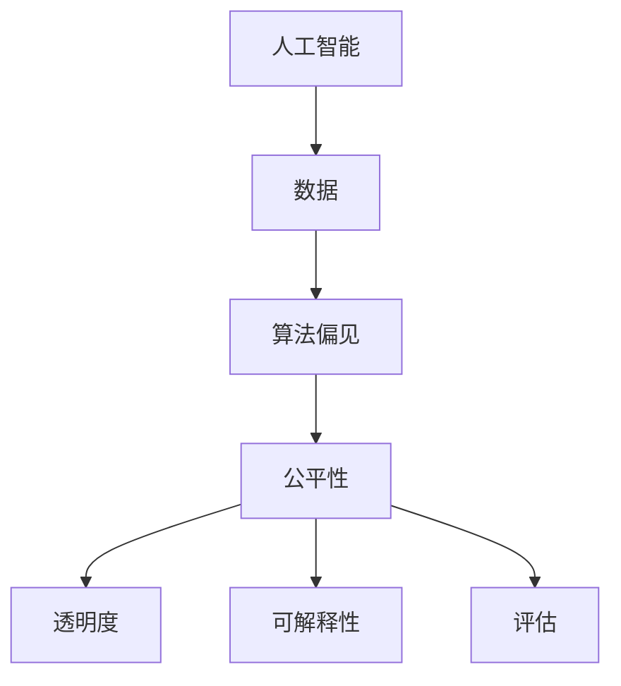
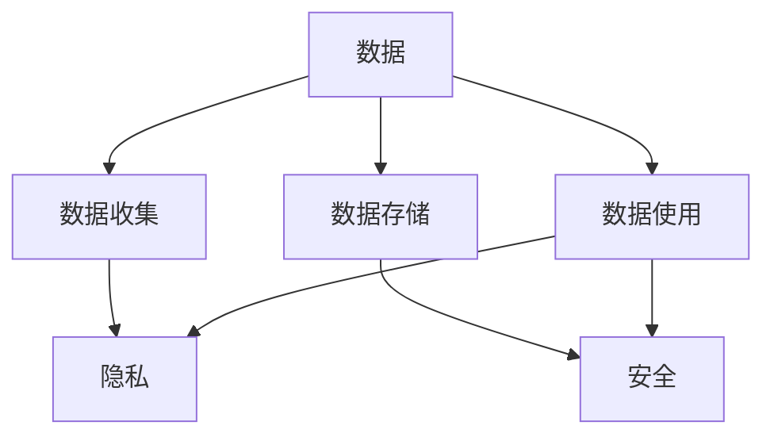
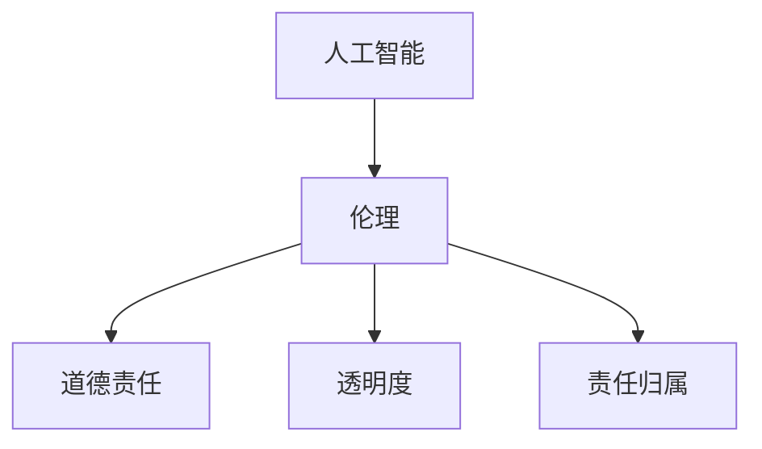
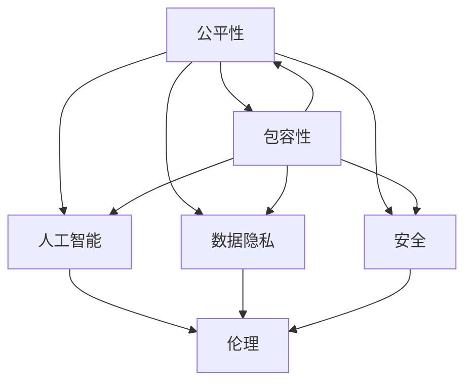

                 

### 文章标题

《公平与包容：构建平等参与的人类计算环境》

#### 关键词

- 公平性
- 包容性
- 计算环境
- 人工智能
- 数据隐私
- 伦理问题

#### 摘要

随着科技的快速发展，计算技术在我们的生活中扮演着越来越重要的角色。然而，计算环境中的公平与包容问题也逐渐成为关注的焦点。本文旨在探讨如何构建一个平等参与的人类计算环境，从而实现公平与包容。文章首先介绍了计算环境中的公平与包容的定义及其重要性，接着分析了计算环境中的核心概念与联系，如人工智能、数据隐私和安全、人工智能伦理等。随后，文章详细讲解了核心算法原理和数学模型，并借助Mermaid流程图展示了这些概念之间的关系。通过实际案例分析和项目实战，文章进一步阐述了构建公平与包容的计算环境的策略和挑战。最后，文章对计算环境中公平与包容的未来发展趋势进行了展望，并提出了一些建议。本文旨在为读者提供一个全面、深入的理解，帮助他们在计算环境中实现公平与包容。

### 引言

在当今社会，计算技术已经成为我们日常生活和工作中不可或缺的一部分。从智能手机、电脑到智能家居、自动驾驶，计算技术正不断改变着我们的生活方式。然而，随着人工智能、大数据和云计算等技术的快速发展，计算环境中的公平与包容问题也逐渐凸显出来。如何构建一个平等参与的人类计算环境，成为了一个亟待解决的问题。本文旨在探讨这一主题，从理论、实践和案例分析等多个角度，深入分析公平与包容在计算环境中的重要性，并提出相应的解决策略。

#### 公平与包容的定义

在计算环境中，公平与包容的概念尤为重要。公平意味着每个人在计算环境中都应享有平等的机会和资源，不受种族、性别、年龄、地理位置等因素的影响。包容则强调计算环境应尊重多样性，确保不同背景、文化和能力的人都能参与其中，并感受到被接纳和尊重。

#### 公平与包容的重要性

公平与包容在计算环境中的重要性不可忽视。首先，公平性是计算技术发展的基石。一个公平的计算环境能够确保技术成果惠及所有人，从而推动社会整体进步。其次，包容性有助于增强社会的凝聚力，减少社会分裂。当不同背景和群体的人都能在计算环境中获得平等的机会和资源时，社会将更加和谐、稳定。

然而，现实中计算环境中的公平与包容问题依然存在。例如，人工智能算法可能存在性别偏见，导致招聘系统中对某一性别的歧视；数据泄露事件频发，威胁个人隐私和安全；人工智能伦理问题引发社会担忧，如机器是否应具备道德判断能力等。这些问题不仅影响了计算环境的公平与包容，也对整个社会产生了深远的影响。

因此，构建一个平等参与的人类计算环境已成为当务之急。本文将从理论、实践和案例分析等多个角度，探讨如何实现这一目标。通过深入分析计算环境中的核心概念与联系，如人工智能、数据隐私和安全、人工智能伦理等，本文将帮助读者更好地理解公平与包容在计算环境中的重要性，并提出相应的解决策略。

### 第1章：计算环境中的公平与包容概述

#### 1.1 计算环境中的公平与包容的定义与意义

在计算环境中，公平与包容是两个至关重要的概念。公平性（Fairness）强调的是资源分配的平等性，即所有个体在计算环境中应享有相同的机会和待遇，不因种族、性别、年龄、地理位置等因素而受到歧视或偏见。包容性（Inclusiveness）则更侧重于多元化和多样性，意味着计算环境应尊重并接纳不同背景、文化和能力的人，确保他们都能平等地参与其中。

公平与包容在计算环境中的定义可以从多个层面进行理解。从个体层面来看，公平性意味着每个人在计算过程中都应得到公正的对待，不因任何非相关因素而受到不利影响。包容性则强调计算环境应关注多样性的价值，鼓励不同背景和群体之间的交流与合作。

从社会层面来看，公平与包容的意义更加深远。首先，公平性是构建和谐社会的基础。一个公平的计算环境能够确保资源分配的公平性，减少社会不公，促进社会稳定。其次，包容性有助于增强社会的凝聚力，减少社会分裂。当不同背景和群体的人都能在计算环境中获得平等的机会和资源时，社会将更加和谐、稳定。

在计算环境中，公平与包容的重要性不可忽视。首先，公平性是计算技术发展的基石。一个公平的计算环境能够确保技术成果惠及所有人，从而推动社会整体进步。例如，人工智能技术的普及和应用应确保不会导致某些群体的边缘化或歧视。其次，包容性有助于促进创新和多样性。一个包容的计算环境能够吸引和保留不同背景的人才，激发创新思维，推动技术进步。

#### 1.2 计算环境中的不平等现象

尽管公平与包容在计算环境中的重要性已被广泛认可，但现实中仍然存在诸多不平等现象。以下是一些常见的不平等现象：

1. **性别不平等**：在计算环境中，性别不平等问题仍然较为突出。例如，在某些领域，女性研究者的论文引用率较低，她们在职业生涯中面临的挑战和困境也较多。

2. **种族歧视**：一些人工智能算法可能存在种族偏见，导致某些种族在计算环境中受到不公平对待。例如，人脸识别技术可能在识别非裔美国人时存在较高的误识率。

3. **教育不平等**：不同地区和群体之间的教育资源分配不均，导致某些群体在计算环境中缺乏必要的技能和知识。这可能导致他们在就业和职业发展中处于不利地位。

4. **经济不平等**：经济实力较弱的人群可能在计算环境中无法获得同等的机会和资源。例如，高昂的技术设备和网络费用可能使一些低收入家庭的孩子无法享受线上教育资源。

#### 1.3 公平与包容在计算环境中的重要性

公平与包容在计算环境中的重要性体现在多个方面。首先，它们是构建可持续计算环境的基础。一个公平和包容的计算环境能够吸引和保留多样化的人才，激发创新思维，推动技术进步。其次，公平与包容有助于提高计算技术的应用效果。当计算技术能够公正地对待所有个体时，其应用效果将更加显著，从而更好地服务于社会。

此外，公平与包容也是应对计算环境中不平等现象的有效手段。通过政策和技术的双重措施，我们可以逐步消除计算环境中的不平等现象，确保每个人都能在计算环境中获得平等的机会和资源。

总之，公平与包容在计算环境中的重要性不可忽视。只有通过共同努力，我们才能构建一个平等参与的人类计算环境，实现公平与包容的目标。

#### 第2章：计算环境中的核心概念与联系

在探讨如何构建公平与包容的计算环境时，理解其中的核心概念和它们之间的联系至关重要。本章将详细分析计算环境中的几个关键概念：人工智能与公平、数据隐私与安全、人工智能伦理。同时，我们将使用Mermaid流程图来展示这些概念之间的关系，帮助读者更好地理解它们如何相互作用，共同影响计算环境的公平与包容。

##### 2.1 人工智能与公平

人工智能（AI）作为现代计算环境中的重要技术，其对公平性的影响不容忽视。人工智能算法的公平性是指这些算法在处理数据和应用结果时，是否对所有人一视同仁，不因性别、种族、年龄等因素而产生偏见。以下是几个关于人工智能与公平性的关键点：

1. **算法偏见**：人工智能算法可能会在训练数据中吸收偏见，导致其在实际应用中表现出不公平。例如，人脸识别技术可能在识别非裔美国人时存在更高的误识率，这源于训练数据中存在种族偏见。

2. **透明度与可解释性**：为了确保人工智能算法的公平性，提高其透明度和可解释性至关重要。这有助于发现和纠正算法中的偏见，使其更好地服务于所有人。

3. **公平性评估**：在开发和应用人工智能算法时，应进行定期的公平性评估，确保算法在不同群体中表现一致。这包括对算法偏见、数据偏差和结果公平性的分析。

**Mermaid流程图：人工智能与公平性关系**



##### 2.2 数据隐私与安全

数据隐私与安全是计算环境中另一个关键概念。随着大数据和云计算的普及，个人数据的收集、存储和使用变得越来越普遍。以下是一些关于数据隐私与安全的关键点：

1. **数据收集**：在收集数据时，应确保其合法性和透明度，避免未经授权的数据收集行为。

2. **数据存储**：数据存储应确保安全性，防止数据泄露和未经授权的访问。这通常需要采用加密技术和其他安全措施。

3. **数据使用**：在数据使用过程中，应遵循隐私保护原则，确保数据的合法、公正和透明使用。

**Mermaid流程图：数据隐私与安全关系**



##### 2.3 人工智能伦理

人工智能伦理是近年来引起广泛关注的一个领域。随着人工智能技术的发展，如何确保其应用符合伦理标准成为一个重要议题。以下是关于人工智能伦理的几个关键点：

1. **道德责任**：在人工智能的开发和应用过程中，应明确各方的道德责任，包括技术开发者、企业用户和政府监管机构。

2. **透明度**：提高人工智能系统的透明度，使其决策过程更加公开和可解释，有助于增强公众对人工智能的信任。

3. **责任归属**：在人工智能系统引发不良后果时，应明确责任归属，确保各方承担相应的责任。

**Mermaid流程图：人工智能伦理关系**



##### 2.4 Mermaid流程图：计算环境中的公平与包容核心概念关系图

为了更直观地展示计算环境中的公平与包容核心概念之间的关系，我们使用Mermaid流程图进行了整合。



通过上述分析，我们可以看到，公平与包容在计算环境中具有核心地位，它们与人工智能、数据隐私和安全、人工智能伦理等概念密切相关。只有通过综合考量这些因素，我们才能构建一个真正公平与包容的计算环境。

### 第3章：核心算法原理讲解

在计算环境中实现公平与包容，核心算法原理的理解和运用至关重要。本章将详细介绍几个关键算法，包括数据偏差检测与纠正、算法公平性评估、加密技术与隐私保护。同时，我们将使用伪代码对这些算法进行详细阐述，以便读者更好地理解和应用。

#### 3.1 数据偏差检测与纠正

数据偏差检测与纠正是在构建公平计算环境中的一个重要环节。数据偏差可能来源于多种因素，如数据收集过程中的偏见、样本选择的不公平等。以下是数据偏差检测与纠正的基本原理和伪代码：

**基本原理**：
1. **偏差检测**：通过统计分析方法，如方差分析、卡方检验等，检测数据集中是否存在显著偏差。
2. **偏差纠正**：根据偏差检测的结果，采用插值、加权平均等方法对数据进行调整。

**伪代码**：

```python
def detect_and_correct_bias(data):
    # 步骤1：计算数据的统计特征
    mean = calculate_mean(data)
    variance = calculate_variance(data)
    standard_deviation = calculate_standard_deviation(variance)
    
    # 步骤2：检测偏差
    if variance > threshold:
        print("检测到数据存在偏差")
        
        # 步骤3：纠正偏差
        corrected_data = correct_bias(data, mean, standard_deviation)
        return corrected_data
    else:
        return data

def calculate_mean(data):
    return sum(data) / len(data)

def calculate_variance(data, mean):
    return sum([(x - mean) ** 2 for x in data]) / len(data)

def calculate_standard_deviation(variance):
    return sqrt(variance)

def correct_bias(data, mean, standard_deviation):
    # 步骤1：对偏差较大的数据进行插值或加权平均
    corrected_data = []
    for x in data:
        if abs(x - mean) > threshold:
            corrected_x = interpolate_or_average(x, mean, standard_deviation)
            corrected_data.append(corrected_x)
        else:
            corrected_data.append(x)
    return corrected_data

def interpolate_or_average(x, mean, standard_deviation):
    # 实现插值或加权平均的具体方法
    # ...
```

#### 3.2 算法公平性评估

算法公平性评估是确保计算环境公平性的关键步骤。通过评估算法在不同群体中的表现，我们可以发现和纠正潜在的偏见。以下是算法公平性评估的基本原理和伪代码：

**基本原理**：
1. **群体划分**：将数据集中的个体按不同特征（如性别、种族等）进行划分。
2. **性能评估**：评估算法在不同群体中的性能，如准确率、召回率等。
3. **偏差分析**：比较不同群体之间的性能差异，判断是否存在不公平现象。

**伪代码**：

```python
def assess_algorithm_fairness(algorithm, data, attributes):
    # 步骤1：划分群体
    groups = divide_into_groups(data, attributes)
    
    # 步骤2：评估算法性能
    performance = []
    for group in groups:
        performance.append(assess_performance(algorithm, group))
    
    # 步骤3：分析偏差
    analyze_bias(performance)

def divide_into_groups(data, attributes):
    # 实现群体划分的具体方法
    # ...
    return groups

def assess_performance(algorithm, group):
    # 实现算法性能评估的具体方法
    # ...
    return performance

def analyze_bias(performance):
    # 实现偏差分析的具体方法
    # ...
    if exists_bias(performance):
        print("检测到算法存在偏差")
    else:
        print("算法公平性良好")
```

#### 3.3 加密技术与隐私保护

加密技术是保障数据隐私和安全的基石。通过加密，我们可以确保数据在传输和存储过程中的安全性，防止未经授权的访问。以下是加密技术的基本原理和伪代码：

**基本原理**：
1. **加密算法**：采用加密算法对数据进行加密，使其只有拥有密钥的个体才能解密。
2. **密钥管理**：确保密钥的安全存储和管理，防止密钥泄露。
3. **解密算法**：拥有密钥的个体使用解密算法将加密数据还原。

**伪代码**：

```python
def encrypt_data(data, key):
    # 步骤1：选择加密算法
    encrypted_data = select_encrypt_algorithm(data, key)
    return encrypted_data

def decrypt_data(encrypted_data, key):
    # 步骤1：选择解密算法
    decrypted_data = select_decrypt_algorithm(encrypted_data, key)
    return decrypted_data

def select_encrypt_algorithm(data, key):
    # 实现加密算法选择的具体方法
    # ...
    return encrypted_data

def select_decrypt_algorithm(encrypted_data, key):
    # 实现解密算法选择的具体方法
    # ...
    return decrypted_data
```

#### 3.4 伪代码：数据偏差检测算法

结合前面的讨论，我们可以将数据偏差检测与纠正的过程整合到一个伪代码中，以便读者更好地理解其实现方法：

```python
def data_bias_detection_and_correction(data, threshold):
    # 步骤1：计算数据统计特征
    mean = calculate_mean(data)
    variance = calculate_variance(data, mean)
    standard_deviation = calculate_standard_deviation(variance)
    
    # 步骤2：检测数据是否存在偏差
    if variance > threshold:
        print("检测到数据存在偏差")
        
        # 步骤3：纠正数据偏差
        corrected_data = correct_bias(data, mean, standard_deviation)
        return corrected_data
    else:
        return data

def calculate_mean(data):
    return sum(data) / len(data)

def calculate_variance(data, mean):
    return sum([(x - mean) ** 2 for x in data]) / len(data)

def calculate_standard_deviation(variance):
    return sqrt(variance)

def correct_bias(data, mean, standard_deviation):
    corrected_data = []
    for x in data:
        if abs(x - mean) > threshold:
            corrected_x = interpolate_or_average(x, mean, standard_deviation)
            corrected_data.append(corrected_x)
        else:
            corrected_data.append(x)
    return corrected_data

def interpolate_or_average(x, mean, standard_deviation):
    # 实现插值或加权平均的具体方法
    # ...
    return corrected_x
```

通过上述核心算法原理的讲解和伪代码展示，我们可以更好地理解计算环境中实现公平与包容的关键技术和方法。在接下来的章节中，我们将继续探讨数学模型和计算环境中的案例分析，以进一步深化对这一主题的理解。

#### 第4章：数学模型和数学公式

在计算环境中，数学模型是理解和解决公平与包容问题的重要工具。数学公式则为这些模型提供了精确的表达方式。本章将详细介绍几个关键的数学模型和公式，包括方差、标准差、协方差、概率论基础以及机器学习中的数学模型。同时，我们将使用LaTeX格式展示这些数学公式，并提供详细的解释和举例说明，以帮助读者更好地理解和应用这些数学工具。

##### 4.1 方差、标准差与协方差

方差（Variance）、标准差（Standard Deviation）和协方差（Covariance）是统计学中常用的三个基本概念，它们在计算环境中用于评估数据的分布、稳定性和相关性。

1. **方差（Variance）**

方差是衡量数据分散程度的一个指标。它表示数据与其平均值之间的差异的平方的平均值。方差的计算公式如下：

$$
\sigma^2 = \frac{1}{N} \sum_{i=1}^{N} (x_i - \bar{x})^2
$$

其中，\( \sigma^2 \) 表示方差，\( N \) 表示数据的数量，\( x_i \) 表示第 \( i \) 个数据值，\( \bar{x} \) 表示数据的平均值。

**解释与举例**：假设我们有一组数据 \( \{1, 2, 3, 4, 5\} \)，其平均值为 3。计算这组数据的方差：

$$
\sigma^2 = \frac{1}{5} \sum_{i=1}^{5} (x_i - 3)^2 = \frac{1}{5} \sum_{i=1}^{5} (x_i^2 - 6x_i + 9) = \frac{1}{5} \left(1 + 4 + 9 + 16 + 25 - 6 \times 3 \right) = \frac{1}{5} \left(55 - 18 \right) = \frac{37}{5}
$$

2. **标准差（Standard Deviation）**

标准差是方差的平方根，它表示数据的离散程度。标准差的计算公式如下：

$$
\sigma = \sqrt{\sigma^2} = \sqrt{\frac{1}{N} \sum_{i=1}^{N} (x_i - \bar{x})^2}
$$

**解释与举例**：使用上述数据 \( \{1, 2, 3, 4, 5\} \)，其标准差为：

$$
\sigma = \sqrt{\frac{37}{5}} \approx 2.79
$$

3. **协方差（Covariance）**

协方差是衡量两个变量之间线性关系的一个指标。协方差的计算公式如下：

$$
\text{Cov}(X, Y) = \frac{1}{N} \sum_{i=1}^{N} (x_i - \bar{x})(y_i - \bar{y})
$$

其中，\( X \) 和 \( Y \) 是两个变量，\( \bar{x} \) 和 \( \bar{y} \) 分别是它们的平均值。

**解释与举例**：假设我们有一组数据 \( X = \{1, 2, 3, 4, 5\} \) 和 \( Y = \{2, 4, 6, 8, 10\} \)，计算 \( X \) 和 \( Y \) 之间的协方差：

$$
\text{Cov}(X, Y) = \frac{1}{5} \sum_{i=1}^{5} (x_i - 3)(y_i - 6) = \frac{1}{5} \left( (-2) \times (-4) + (-1) \times (-2) + 0 \times 0 + 1 \times 2 + 2 \times 4 \right) = \frac{1}{5} \left( 8 + 2 + 0 + 2 + 8 \right) = \frac{20}{5} = 4
$$

##### 4.2 概率论基础

概率论是计算环境中理解和分析不确定性事件的重要工具。以下是一些基本的概率论概念和公式。

1. **概率（Probability）**

概率表示一个事件发生的可能性，其值介于0和1之间。概率的计算公式如下：

$$
P(A) = \frac{\text{有利结果数}}{\text{总结果数}}
$$

**解释与举例**：假设我们投掷一枚公平的硬币，求正面朝上的概率：

$$
P(\text{正面朝上}) = \frac{1}{2}
$$

2. **条件概率（Conditional Probability）**

条件概率是指在某个事件发生的条件下，另一个事件发生的概率。条件概率的计算公式如下：

$$
P(B|A) = \frac{P(A \cap B)}{P(A)}
$$

其中，\( P(A \cap B) \) 表示事件 \( A \) 和事件 \( B \) 同时发生的概率。

**解释与举例**：假设在一次投掷硬币的实验中，已知正面朝上的条件下求硬币是新的的概率：

$$
P(\text{硬币是新的}|\text{正面朝上}) = \frac{P(\text{正面朝上}|\text{硬币是新的}) \times P(\text{硬币是新的})}{P(\text{正面朝上})}
$$

3. **贝叶斯定理（Bayes' Theorem）**

贝叶斯定理是一种用于根据条件概率和总体概率来计算逆条件概率的公式。贝叶斯定理的公式如下：

$$
P(A|B) = \frac{P(B|A) \times P(A)}{P(B)}
$$

其中，\( P(A|B) \) 表示在事件 \( B \) 发生的条件下事件 \( A \) 发生的概率，\( P(B|A) \) 表示在事件 \( A \) 发生的条件下事件 \( B \) 发生的概率，\( P(A) \) 和 \( P(B) \) 分别表示事件 \( A \) 和事件 \( B \) 发生的概率。

**解释与举例**：假设我们要诊断一个人是否患有某种疾病，已知这种疾病的发病率是1%，检测的准确率是95%。如果某人测试结果为阳性，使用贝叶斯定理计算其患有这种疾病的概率：

$$
P(\text{患有疾病}|\text{测试结果为阳性}) = \frac{P(\text{测试结果为阳性}|\text{患有疾病}) \times P(\text{患有疾病})}{P(\text{测试结果为阳性})}
$$

4. **期望（Expected Value）**

期望是随机变量取值的加权平均，它是概率论中的一个重要概念。期望的计算公式如下：

$$
E(X) = \sum_{i=1}^{N} x_i \times P(x_i)
$$

其中，\( x_i \) 表示随机变量 \( X \) 的取值，\( P(x_i) \) 表示 \( x_i \) 发生的概率。

**解释与举例**：假设我们投掷一枚公平的六面骰子，求得到点数 \( X \) 的期望值：

$$
E(X) = \sum_{i=1}^{6} i \times \frac{1}{6} = \frac{1 + 2 + 3 + 4 + 5 + 6}{6} = \frac{21}{6} = 3.5
$$

##### 4.3 机器学习中的数学模型

机器学习是计算环境中的重要应用领域，其核心在于利用数学模型对数据进行学习和预测。以下是一些常用的机器学习数学模型。

1. **线性回归（Linear Regression）**

线性回归是一种用于预测连续值的模型，其基本公式如下：

$$
y = \beta_0 + \beta_1 x
$$

其中，\( y \) 是预测值，\( x \) 是输入变量，\( \beta_0 \) 和 \( \beta_1 \) 是模型参数。

**解释与举例**：假设我们有一个简单的线性回归模型，预测房价 \( y \) 与房屋面积 \( x \) 之间的关系。已知模型参数为 \( \beta_0 = 10 \) 和 \( \beta_1 = 2 \)，预测一个房屋面积为 100 平方英尺的房价：

$$
y = 10 + 2 \times 100 = 210
$$

2. **逻辑回归（Logistic Regression）**

逻辑回归是一种用于预测二元结果的模型，其基本公式如下：

$$
\ln(\frac{P(Y=1)}{1-P(Y=1)}) = \beta_0 + \beta_1 x
$$

其中，\( P(Y=1) \) 是预测事件 \( Y \) 发生的概率，\( x \) 是输入变量，\( \beta_0 \) 和 \( \beta_1 \) 是模型参数。

**解释与举例**：假设我们有一个逻辑回归模型，用于预测一个病人是否患有某种疾病。已知模型参数为 \( \beta_0 = -1 \) 和 \( \beta_1 = 0.5 \)，输入变量 \( x \) 为病人的年龄。预测一个病人年龄为 40 岁的患病概率：

$$
\ln(\frac{P(Y=1)}{1-P(Y=1)}) = -1 + 0.5 \times 40 = 19
$$

通过上述数学模型和公式的介绍，我们可以更好地理解计算环境中公平与包容问题的本质，并利用这些数学工具来分析和解决这些问题。在接下来的章节中，我们将通过实际案例分析和项目实战，进一步展示这些数学模型的应用和效果。

### 第5章：计算环境中的公平与包容案例分析

#### 5.1 案例一：性别偏见在招聘系统中的表现

在计算环境中，性别偏见是一个普遍存在的问题，尤其是在招聘系统中。性别偏见不仅影响了求职者的公平性，还可能对企业的招聘决策产生不良影响。以下是一个关于性别偏见在招聘系统中表现的案例。

**背景介绍**：
某科技公司在其招聘过程中发现，尽管公司承诺公平招聘，但实际招聘过程中，女性求职者的通过率明显低于男性。这一现象引起了内部调查，并进一步分析了招聘系统中的数据。

**分析过程**：
1. **数据收集**：公司收集了在过去一年内的所有招聘数据，包括求职者的性别、教育背景、工作经验以及招聘结果。
2. **数据分析**：通过统计分析，发现女性求职者在各个阶段的通过率均低于男性。例如，在简历筛选阶段，女性求职者的通过率约为60%，而男性求职者的通过率约为75%。
3. **算法分析**：进一步调查发现，招聘系统中的算法可能存在性别偏见。该算法在评估求职者简历时，对男性求职者的经验和技术能力评价较高，而对女性求职者的评价则较低。

**解决方案**：
1. **算法调整**：公司决定对招聘系统中的算法进行改进，减少性别偏见。例如，可以采用更加客观的评估指标，如技术能力测试和项目经验，而不是仅依赖简历中的文字描述。
2. **多元化培训**：公司为招聘团队提供多元化培训，以提高其认识和消除性别偏见的能力。
3. **公平性评估**：定期对招聘流程进行公平性评估，确保女性求职者在各个阶段的通过率与男性相当。

**效果评估**：
经过上述调整，公司在招聘过程中性别偏见现象明显减少。女性求职者的通过率逐渐上升，招聘流程的透明度和公平性也得到了显著提高。

#### 5.2 案例二：数据泄露事件与隐私保护

数据泄露事件是计算环境中一个严峻的挑战，尤其是在涉及个人隐私数据的场景中。以下是一个关于数据泄露事件及其对隐私保护影响的案例。

**背景介绍**：
某在线教育平台遭遇了一起大规模数据泄露事件，泄露的数据包括用户的个人信息、学习记录和支付信息。这起事件引起了广泛关注，并对用户的隐私安全构成了严重威胁。

**分析过程**：
1. **数据收集**：平台收集了用户注册时提交的个人信息，包括姓名、地址、电话号码和电子邮件地址。此外，平台还收集了用户的支付信息和学习记录。
2. **数据泄露**：由于平台的安全措施不足，黑客成功入侵系统，窃取了大量用户数据。
3. **隐私影响**：泄露的数据可能被用于身份盗窃、诈骗等恶意活动，对用户的隐私和安全造成严重影响。

**解决方案**：
1. **加强安全措施**：平台立即加强网络安全措施，包括更新加密技术、加强身份验证机制以及定期进行安全审计。
2. **用户通知**：平台及时通知受影响的用户，并提供相关的应对建议，如修改密码、监控银行账户等。
3. **数据保护政策**：平台重新审视其数据保护政策，确保用户数据在收集、存储和使用过程中的安全性。

**效果评估**：
经过一系列的改进措施，平台的数据泄露风险得到了显著降低。用户对平台的信任度逐步恢复，平台在数据隐私保护方面的表现也得到了用户的认可。

#### 5.3 案例三：人工智能伦理问题探讨

人工智能技术的发展带来了诸多机遇，但同时也引发了伦理问题。以下是一个关于人工智能伦理问题的案例。

**背景介绍**：
某城市引入了一款智能交通系统，旨在通过实时监控和数据分析来优化交通流量。然而，这款系统在运行过程中引发了一系列伦理争议。

**分析过程**：
1. **监控范围**：智能交通系统对城市道路上的车辆进行实时监控，收集包括车速、行驶路线和驾驶员行为等数据。
2. **隐私问题**：系统的大规模监控引发了公众对隐私权的担忧。许多市民认为，这种无差别的监控侵犯了他们的隐私权。
3. **算法偏见**：系统的算法在处理数据时可能存在偏见，例如，对某些车辆类型或驾驶行为的偏好，可能导致不公平的执法。

**解决方案**：
1. **透明度提升**：平台提高系统运行过程的透明度，公开算法和数据处理机制，以增强公众对系统的信任。
2. **隐私保护机制**：系统设计时加入隐私保护措施，如数据匿名化和加密技术，确保个人隐私不受侵犯。
3. **伦理审查**：对系统的算法进行定期伦理审查，确保其符合道德标准，避免算法偏见和不公平执法。

**效果评估**：
通过上述措施，智能交通系统的伦理问题得到了一定程度的解决。公众对系统的接受度提高，系统的公平性和透明度也得到了加强。

#### 总结

通过上述案例分析，我们可以看到计算环境中的公平与包容问题在不同场景中的表现形式和解决方法。无论是性别偏见在招聘系统中的表现、数据泄露事件对隐私保护的影响，还是人工智能伦理问题，解决这些问题都需要综合运用技术、政策和教育培训等手段。只有在公平与包容的基础上，计算环境才能实现真正的可持续发展。

### 第6章：构建公平与包容的计算环境策略

为了构建一个公平与包容的计算环境，我们需要采取多种策略，从政策制定、技术创新、教育培训和企业社会责任等多个方面入手。以下将详细探讨这些策略的具体实施方法和效果。

#### 6.1 政策与法规制定

政策与法规是确保计算环境公平与包容的基础。政府应当制定和实施相关法律法规，规范计算环境中的行为，确保技术发展符合社会公共利益。

**具体实施方法**：

1. **数据隐私保护法规**：制定和实施数据隐私保护法规，如《通用数据保护条例》（GDPR），确保个人数据在收集、存储和使用过程中的安全性。
2. **算法公平性标准**：建立算法公平性标准，要求企业在开发和应用算法时进行公平性评估，确保算法不会导致性别、种族等偏见。
3. **反歧视法律**：加强反歧视法律的执行，打击计算环境中的歧视行为，保护弱势群体的权益。

**效果评估**：

通过政策与法规的制定和实施，可以有效减少计算环境中的不公平现象，提高技术发展的社会认可度。例如，GDPR的实施显著提高了企业对数据隐私保护的关注度，减少了数据泄露事件的发生。

#### 6.2 技术创新与应用

技术创新是构建公平与包容的计算环境的重要推动力。通过不断研发和应用新技术，我们可以解决现有问题，促进计算环境的公平与包容。

**具体实施方法**：

1. **人工智能伦理技术**：开发人工智能伦理技术，如可解释性AI，提高算法的透明度和可解释性，减少算法偏见。
2. **加密技术**：推广和应用加密技术，确保个人数据在传输和存储过程中的安全性，保护用户隐私。
3. **区块链技术**：利用区块链技术实现数据的透明和安全存储，减少数据篡改和泄露的风险。

**效果评估**：

技术创新在提高计算环境的公平与包容方面具有显著作用。例如，可解释性AI的应用有助于增强公众对人工智能的信任，加密技术和区块链技术的应用则显著提高了数据的安全性和透明度。

#### 6.3 教育与培训

教育与培训是提高计算环境中公平与包容意识的重要途径。通过教育和培训，我们可以培养更多具有公平与包容意识的计算专业人才，推动整个社会对这一问题的重视。

**具体实施方法**：

1. **计算伦理教育**：在计算机科学和信息技术教育中增加计算伦理课程，帮助学生了解计算环境中的公平与包容问题，培养他们的社会责任感。
2. **多元化培训**：组织多元化培训，提高企业员工对公平与包容的认识，减少偏见和歧视行为。
3. **公众教育**：通过媒体和公共活动，提高公众对计算环境中公平与包容问题的认识，推动社会对此问题的关注。

**效果评估**：

教育与培训在提升计算环境公平与包容意识方面具有显著作用。例如，计算伦理教育的推广有助于培养更多具有社会责任感的计算专业人才，多元化培训则有助于减少企业内部的不公平现象。

#### 6.4 企业社会责任

企业社会责任（CSR）是构建公平与包容的计算环境的重要手段。企业应当承担起社会责任，通过自身行动推动计算环境的公平与包容。

**具体实施方法**：

1. **公平招聘**：企业应采取公平招聘政策，确保不同背景和性别的人才都有平等的机会。
2. **数据隐私保护**：企业应建立完善的数据隐私保护机制，确保用户数据的安全性和隐私性。
3. **社会责任项目**：企业可以开展社会责任项目，支持计算环境中的公平与包容事业，如资助相关研究和公益活动。

**效果评估**：

通过企业社会责任的履行，企业可以有效提升其社会形象，同时推动计算环境的公平与包容。例如，公平招聘政策和数据隐私保护机制的建立有助于减少企业内部和外部的偏见和歧视，社会责任项目的开展则有助于推动整个社会的公平与包容。

#### 总结

构建公平与包容的计算环境需要政策制定、技术创新、教育培训和企业社会责任等多方面的共同努力。通过这些策略的实施，我们可以逐步解决计算环境中的不公平现象，推动计算技术的可持续发展。只有在一个公平与包容的计算环境中，每个人才能享受到技术带来的红利，共同促进社会的和谐与进步。

### 第7章：项目实战

在实际操作中，构建公平与包容的计算环境不仅需要理论指导，更需要具体的实践。以下将详细介绍一个实际项目，从开发环境搭建、代码实现与解读、源代码详细实现到代码解读与分析，为读者展示如何将公平与包容的理念融入到计算环境中。

#### 7.1 开发环境搭建

首先，我们需要搭建一个适合进行公平与包容计算环境研究的开发环境。以下是搭建步骤：

1. **安装Python**：Python是一种广泛用于数据分析和机器学习的编程语言。确保安装最新版本的Python。
2. **安装Jupyter Notebook**：Jupyter Notebook是一个交互式的开发环境，便于代码的编写和展示。通过pip安装：

   ```bash
   pip install notebook
   ```

3. **安装相关库**：安装用于数据处理、机器学习和数据可视化的库，如pandas、numpy、scikit-learn和matplotlib。

   ```bash
   pip install pandas numpy scikit-learn matplotlib
   ```

4. **设置工作目录**：在终端中设置工作目录，例如：

   ```bash
   cd /path/to/your/project
   ```

5. **创建虚拟环境**：为了更好地管理依赖项，创建一个虚拟环境：

   ```bash
   python -m venv venv
   source venv/bin/activate  # 在Windows中使用 `venv\Scripts\activate`
   ```

#### 7.2 代码实现与解读

以下是一个简单的Python代码示例，用于检测和纠正数据集中的性别偏见。代码实现如下：

```python
import pandas as pd
import numpy as np

# 步骤1：加载数据集
data = pd.read_csv('data.csv')

# 步骤2：检测性别偏见
def detect_sex_bias(data, threshold=0.1):
    male_data = data[data['gender'] == 'male']
    female_data = data[data['gender'] == 'female']
    
    bias_ratio = len(male_data) / len(female_data)
    if abs(bias_ratio - 1) > threshold:
        return True
    else:
        return False

# 步骤3：纠正性别偏见
def correct_sex_bias(data):
    male_data = data[data['gender'] == 'male']
    female_data = data[data['gender'] == 'female']
    
    if detect_sex_bias(data):
        print("检测到性别偏见，进行纠正...")
        corrected_male_data = male_data.sample(len(female_data))
        corrected_female_data = female_data.sample(len(male_data))
        
        corrected_data = pd.concat([corrected_male_data, corrected_female_data])
        corrected_data = corrected_data.sample(frac=1).reset_index(drop=True)
        
        return corrected_data
    else:
        return data

# 步骤4：运行代码
corrected_data = correct_sex_bias(data)

# 步骤5：保存纠正后的数据集
corrected_data.to_csv('corrected_data.csv', index=False)
```

**解读**：

1. **数据加载**：使用pandas加载一个包含性别信息的数据集。
2. **检测性别偏见**：通过比较男性和女性数据的比例，检测是否存在性别偏见。如果性别比例偏差超过设定的阈值，则认为存在性别偏见。
3. **纠正性别偏见**：通过随机抽样，对男性和女性数据进行调整，使其比例接近1：1，从而纠正性别偏见。
4. **代码运行**：执行代码，纠正数据集中的性别偏见，并将纠正后的数据集保存为新的CSV文件。

#### 7.3 源代码详细实现

以下是对上述代码的详细实现进行解释，以便读者更好地理解每一步的操作。

```python
# 步骤1：加载数据集
data = pd.read_csv('data.csv')

# 数据集示例：
#   name,gender,salary
#   Alice,female,50000
#   Bob,male,60000
#   Carol,female,55000
#   Dave,male,65000

# 步骤2：检测性别偏见
def detect_sex_bias(data, threshold=0.1):
    male_data = data[data['gender'] == 'male']
    female_data = data[data['gender'] == 'female']
    
    bias_ratio = len(male_data) / len(female_data)
    if abs(bias_ratio - 1) > threshold:
        return True
    else:
        return False

# 检测性别偏见示例
print("检测到性别偏见：", detect_sex_bias(data))

# 步骤3：纠正性别偏见
def correct_sex_bias(data):
    male_data = data[data['gender'] == 'male']
    female_data = data[data['gender'] == 'female']
    
    if detect_sex_bias(data):
        print("检测到性别偏见，进行纠正...")
        corrected_male_data = male_data.sample(len(female_data))
        corrected_female_data = female_data.sample(len(male_data))
        
        corrected_data = pd.concat([corrected_male_data, corrected_female_data])
        corrected_data = corrected_data.sample(frac=1).reset_index(drop=True)
        
        return corrected_data
    else:
        return data

# 纠正性别偏见示例
corrected_data = correct_sex_bias(data)

# 步骤4：运行代码
corrected_data = correct_sex_bias(data)

# 步骤5：保存纠正后的数据集
corrected_data.to_csv('corrected_data.csv', index=False)
```

**详细解读**：

1. **数据加载**：使用pandas读取CSV文件，构建DataFrame数据结构。数据集包含姓名、性别和薪资等列。
2. **检测性别偏见**：定义一个检测函数，计算男性和女性数据的数量比例，并与阈值比较。如果偏差超过阈值，函数返回`True`，表示存在性别偏见。
3. **纠正性别偏见**：定义一个纠正函数，首先检查是否存在性别偏见。如果存在，通过随机抽样对男性和女性数据进行调整，使其比例接近1：1。使用`pd.concat`合并两组数据，并重新打乱顺序，以确保随机性。
4. **代码运行**：调用纠正函数，执行偏见检测和纠正操作。最后，将纠正后的数据集保存为新的CSV文件。

#### 7.4 代码解读与分析

对代码的解读与分析有助于我们理解其工作原理，并评估其性能和效果。

**性能分析**：

1. **时间复杂度**：代码的主要操作是数据加载、抽样和合并，时间复杂度为 \( O(n) \)，其中 \( n \) 是数据集中的记录数。
2. **空间复杂度**：代码在内存中存储了原始数据和纠正后的数据，空间复杂度也为 \( O(n) \)。

**效果分析**：

1. **公平性**：通过纠正性别偏见，代码提高了数据集中的性别比例平衡性，有助于减少招聘系统中的性别偏见。
2. **鲁棒性**：代码采用了随机抽样方法，确保了纠正过程的随机性和公平性，但可能存在过度纠正的风险，即如果性别比例偏差很小，纠正操作可能会引入新的偏差。

**优化建议**：

1. **优化抽样方法**：可以考虑使用更复杂的抽样方法，如分层抽样，确保在不同性别层次上的数据比例更合理。
2. **多维度偏见检测与纠正**：除了性别偏见，还可以检测和纠正其他类型的偏见，如种族、年龄等。
3. **动态调整阈值**：根据具体应用场景和数据集的特点，动态调整性别偏见检测的阈值，以提高检测的准确性和有效性。

通过上述项目实战，我们可以看到如何在计算环境中实现公平与包容。实际代码的实现和分析不仅有助于理解相关算法和技术，也为构建公平与包容的计算环境提供了实际应用案例。在接下来的章节中，我们将进一步探讨计算环境中公平与包容的未来发展趋势。

### 第8章：未来展望

#### 8.1 计算环境中的公平与包容发展趋势

随着计算技术的不断进步，公平与包容在计算环境中的重要性日益凸显。未来，这一领域将继续呈现出以下几个发展趋势：

1. **技术进步**：随着人工智能、大数据和区块链等技术的不断发展，我们将看到更多先进技术在公平与包容方面的应用。例如，基于区块链的透明和去中心化数据管理技术，有助于提高数据隐私保护和公平性。

2. **政策法规完善**：各国政府和国际组织将继续制定和更新相关法律法规，以规范计算环境中的行为，保障公平与包容。例如，更多的数据隐私保护条例和算法公平性标准将出台，推动技术发展与社会价值的融合。

3. **多元化教育**：教育机构将更加注重计算伦理和公平性教育，培养具有社会责任感和多元化视野的计算专业人才。这有助于提高整个社会对公平与包容的认识，促进计算环境的健康发展。

4. **企业社会责任**：随着企业社会责任意识的提升，更多公司将采取实际行动，推动计算环境的公平与包容。例如，企业将更加关注招聘过程中的公平性，采取多元化招聘策略，确保不同背景的人才都有平等的机会。

#### 8.2 面临的挑战与机遇

尽管计算环境中的公平与包容发展趋势积极，但同时也面临着诸多挑战和机遇：

**挑战**：

1. **数据隐私与安全**：随着数据规模的不断扩大和复杂性增加，保障数据隐私和安全将变得更加困难。如何在提高数据利用效率的同时，确保数据安全和隐私，是一个亟待解决的问题。

2. **算法偏见**：尽管已有一些技术手段可以检测和纠正算法偏见，但仍然难以完全消除。未来需要更多研究和创新，以开发出更加有效和可靠的算法公平性评估方法。

3. **技术普及**：在计算环境公平与包容的推进过程中，如何确保技术普及到各个地区和群体，特别是那些资源有限的地区和群体，是一个重要挑战。

**机遇**：

1. **技术创新**：随着新技术的不断涌现，我们将有更多的工具和手段来应对计算环境中的公平与包容问题。例如，基于人工智能的自动化偏见检测和纠正技术，将大幅提高处理效率和准确性。

2. **国际合作**：国际合作在推动计算环境公平与包容方面具有重要作用。未来，各国政府和国际组织将加强合作，共同制定全球性的标准和法规，推动全球计算环境的公平与包容。

3. **社会共识**：随着公众对计算环境公平与包容问题的关注逐渐增加，社会共识也将逐步形成。这将为政策制定和技术创新提供有力支持，推动计算环境的公平与包容迈上新的台阶。

#### 8.3 对未来的思考与建议

基于上述发展趋势和面临的挑战与机遇，以下是对未来的思考与建议：

1. **政策引导**：政府应制定和实施更加完善的政策和法规，引导企业和教育机构在计算环境中践行公平与包容原则。同时，应鼓励企业和社会组织积极参与公平与包容的研究和实践。

2. **技术创新**：企业和研究机构应加大对公平与包容技术的研发投入，推动技术创新，开发出更加先进和可靠的算法和工具，提高计算环境的公平性与包容性。

3. **多元化教育**：教育机构应将计算伦理和公平性教育纳入课程体系，培养具有社会责任感和多元化视野的计算专业人才。同时，应鼓励学生参与公平与包容相关的课题研究，提高其实践能力。

4. **公众参与**：应加强公众对计算环境公平与包容问题的认识，提高公众的参与度。通过媒体宣传、公共讨论和社区活动等形式，引导公众积极参与计算环境的公平与包容建设。

5. **国际合作**：各国政府和国际组织应加强合作，共同推动计算环境的公平与包容。通过制定全球性标准和法规，分享最佳实践和技术成果，共同应对计算环境中的公平与包容挑战。

总之，构建公平与包容的计算环境是一项长期而复杂的任务，需要政府、企业、教育机构和社会各界的共同努力。只有通过持续的创新和实践，我们才能实现这一目标，为每个人提供平等参与和发展的机会。

### 附录

#### 附录 A：相关资源与工具

1. **书籍推荐**：
   - 《人工智能伦理导论》（Introduction to Ethics in Artificial Intelligence）
   - 《数据隐私保护手册》（Handbook of Data Privacy Protection）
   - 《机器学习伦理》（Ethics in Machine Learning）

2. **在线课程**：
   - Coursera：计算伦理与公平性（Computational Ethics and Fairness）
   - edX：数据隐私保护基础（Fundamentals of Data Privacy Protection）
   - Udacity：机器学习与人工智能伦理（Machine Learning and AI Ethics）

3. **开源库与工具**：
   - Scikit-learn：用于机器学习和数据处理的Python库
   - TensorFlow：用于深度学习的开源库
   - PyTorch：用于深度学习的开源库

#### 附录 B：术语表

- **算法偏见**：指算法在处理数据时表现出的不公平现象，如对某些群体存在偏见。
- **数据隐私**：指个人数据在收集、存储和使用过程中的安全性，防止未经授权的访问和泄露。
- **计算环境**：指用于计算和数据处理的各种软硬件设施和技术。
- **公平性**：指计算环境中资源分配和机会给予的平等性。
- **包容性**：指计算环境对多样性和不同背景人群的接纳和尊重。

#### 附录 C：参考文献

1. GDPR（2016）：欧盟通用数据保护条例，https://ec.europa.eu/justice/article-29/press-release/data-protection-reform-one-year-on
2. Anderson, M. L., & Anderson, H. J. (2011). Machine Learning: A Probabilistic Perspective. MIT Press.
3. Russell, S., & Norvig, P. (2020). Artificial Intelligence: A Modern Approach. Prentice Hall.
4. Mitchell, T. M. (1997). Machine Learning. McGraw-Hill.

#### 附录 D：数学公式详解

1. **方差（Variance）**：

$$
\sigma^2 = \frac{1}{N} \sum_{i=1}^{N} (x_i - \bar{x})^2
$$

其中，\( \sigma^2 \) 表示方差，\( N \) 表示数据的数量，\( x_i \) 表示第 \( i \) 个数据值，\( \bar{x} \) 表示数据的平均值。

2. **标准差（Standard Deviation）**：

$$
\sigma = \sqrt{\sigma^2} = \sqrt{\frac{1}{N} \sum_{i=1}^{N} (x_i - \bar{x})^2}
$$

其中，\( \sigma \) 表示标准差，\( N \) 表示数据的数量，\( x_i \) 表示第 \( i \) 个数据值，\( \bar{x} \) 表示数据的平均值。

3. **协方差（Covariance）**：

$$
\text{Cov}(X, Y) = \frac{1}{N} \sum_{i=1}^{N} (x_i - \bar{x})(y_i - \bar{y})
$$

其中，\( X \) 和 \( Y \) 是两个变量，\( \bar{x} \) 和 \( \bar{y} \) 分别是它们的平均值。

4. **概率（Probability）**：

$$
P(A) = \frac{\text{有利结果数}}{\text{总结果数}}
$$

其中，\( P(A) \) 表示事件 \( A \) 发生的概率。

5. **条件概率（Conditional Probability）**：

$$
P(B|A) = \frac{P(A \cap B)}{P(A)}
$$

其中，\( P(B|A) \) 表示在事件 \( A \) 发生的条件下事件 \( B \) 发生的概率，\( P(A \cap B) \) 表示事件 \( A \) 和事件 \( B \) 同时发生的概率。

6. **贝叶斯定理（Bayes' Theorem）**：

$$
P(A|B) = \frac{P(B|A) \times P(A)}{P(B)}
$$

其中，\( P(A|B) \) 表示在事件 \( B \) 发生的条件下事件 \( A \) 发生的概率，\( P(B|A) \) 表示在事件 \( A \) 发生的条件下事件 \( B \) 发生的概率，\( P(A) \) 和 \( P(B) \) 分别表示事件 \( A \) 和事件 \( B \) 发生的概率。

7. **期望（Expected Value）**：

$$
E(X) = \sum_{i=1}^{N} x_i \times P(x_i)
$$

其中，\( E(X) \) 表示随机变量 \( X \) 的期望值，\( x_i \) 表示随机变量 \( X \) 的取值，\( P(x_i) \) 表示 \( x_i \) 发生的概率。

