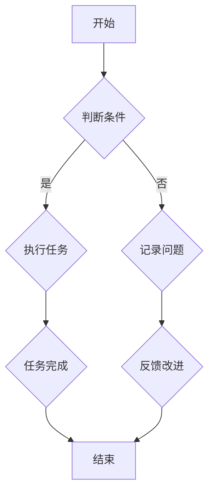

                 

# 公平与包容：构建平等参与的人类计算环境

> 关键词：公平性、包容性、计算环境、技术偏见、伦理原则、公共政策

> 摘要：本文旨在探讨如何在计算环境中实现公平与包容，分析公平与包容的概念、其在计算环境中的重要性、伦理与法律视角，并通过实践应用、技术工具与解决方案等方面，提出构建平等参与的人类计算环境的策略。本文期望为相关政策制定、技术实践和教育引导提供理论依据和实践指导。

## 目录大纲

## 第一部分：理论基础与核心概念

### 第1章：公平与包容的概念

#### 1.1 公平的定义与历史演变

#### 1.2 包容性的重要性

#### 1.3 公平与包容的关系分析

### 第2章：计算环境中的公平与包容

#### 2.1 技术偏见与歧视

#### 2.2 性别平等与多样性

#### 2.3 残障人士的数字包容

### 第3章：伦理与法律视角

#### 3.1 公平与包容的伦理原则

#### 3.2 法律法规对公平与包容的要求

## 第二部分：实践应用

### 第4章：教育领域的公平与包容

#### 4.1 教育资源分配的不平等

#### 4.2 个性化学习与包容教育

#### 4.3 教育技术的公平应用

### 第5章：工作场所的公平与包容

#### 5.1 性别平等与职业发展

#### 5.2 残障人士的职业参与

#### 5.3 多样性培训与企业文化

### 第6章：公共政策的制定与执行

#### 6.1 公共服务的包容性设计

#### 6.2 反歧视法律与政策框架

#### 6.3 公平与包容的社会治理

## 第三部分：技术工具与解决方案

### 第7章：评估与监测工具

#### 7.1 公平性评估指标

#### 7.2 包容性监测方法

#### 7.3 实时数据监测与分析

### 第8章：技术解决方案与实践案例

#### 8.1 AI技术在公平与包容中的应用

#### 8.2 大数据在政策制定中的应用

#### 8.3 案例研究：成功实践与挑战

### 第9章：未来展望与挑战

#### 9.1 公平与包容的未来趋势

#### 9.2 技术发展对公平与包容的挑战

#### 9.3 构建更加公平与包容的计算环境策略

## 附录

### 附录A：参考文献与扩展阅读

### 附录B：关键术语解释与拓展

### 附录C：Mermaid流程图示例

## 第一部分：理论基础与核心概念

### 第1章：公平与包容的概念

#### 1.1 公平的定义与历史演变

公平，作为人类社会追求的重要价值之一，其定义和内涵随着历史的发展不断演变。在古希腊时期，亚里士多德将公平视为正义的一种体现，强调公平应基于人的实际需求和贡献。而到了中世纪，公平更多地体现在宗教和道德领域，如基督教中的“平等”和“公正”。进入现代社会，公平的概念得到了进一步扩展，不仅包括社会分配的正义，还涵盖了机会平等和过程公平。

历史演变中，公平的定义经历了从实体公平到程序公平的转变。早期的公平理念更多关注结果公平，即每个人都应获得相同的社会资源。然而，随着对个体差异和权利保障的重视，现代公平观念逐渐转向程序公平，强调在制定和执行规则时，应保证每个人都有平等的机会参与和表达。

#### 1.2 包容性的重要性

包容性，是公平的进一步体现，它强调在多元社会中对不同群体、文化、观点和生活方式的接纳与尊重。包容性的重要性在于，它不仅有助于减少社会冲突和歧视，还能促进社会的和谐与进步。

首先，包容性有助于构建一个更加平等和公正的社会。在计算环境中，包容性意味着确保所有用户，无论其背景、性别、年龄、能力等因素，都能平等地获得和使用技术资源。

其次，包容性能够提高创新能力和经济效率。在一个多元化和包容的环境中，不同的观点和经验能够激发创新思维，推动技术进步。

最后，包容性是可持续发展的基础。一个包容性的计算环境，能够吸引更多的人才和资源，为社会的长期繁荣提供动力。

#### 1.3 公平与包容的关系分析

公平与包容密不可分，两者相辅相成。公平强调的是结果的平等和正义，而包容则关注过程的平等和尊重。在计算环境中，公平意味着确保每个人都能平等地获得和使用技术资源，而包容则强调在技术设计和应用中，尊重和保护多元文化和多样性。

具体来说，公平与包容的关系可以从以下几个方面进行分析：

1. **相互依存**：公平和包容是相互依赖的，没有公平，包容就可能变成无原则的宽容；而没有包容，公平就可能变得冷酷和僵化。

2. **互补性**：公平和包容在不同层面发挥作用。公平侧重于结果的平等，而包容则侧重于过程和环境的平等。

3. **动态平衡**：在计算环境中，公平和包容需要动态平衡。一方面，要确保公平，避免资源分配不公；另一方面，要注重包容，尊重和保护多样性。

通过上述分析，我们可以看到，公平与包容是构建平等参与的人类计算环境的重要基石。接下来，我们将进一步探讨计算环境中的公平与包容，分析其实现的重要性和面临的挑战。

### 第2章：计算环境中的公平与包容

#### 2.1 技术偏见与歧视

计算环境中的公平与包容，首先面临的是技术偏见与歧视的问题。技术偏见，是指技术系统在设计、开发和应用过程中，对某些群体或个体存在不公平的倾向。这种偏见可能源自算法、数据集或开发者自身的偏见，导致技术系统在决策或服务提供上对某些群体不利。

技术歧视则更为严重，它不仅表现为系统对某些群体不公平，还可能直接排斥或损害这些群体的权益。例如，在招聘系统中，技术歧视可能导致某些性别、种族或年龄群体的求职者被不公平地筛选掉。

技术偏见与歧视的危害是多方面的。首先，它破坏了计算环境的公正性，使得技术系统不能客观、公正地服务所有用户。其次，它加剧了社会不平等，使得弱势群体在获取技术资源和服务时处于不利地位。最后，它阻碍了技术创新和社会进步，因为排斥和歧视限制了不同观点和经验的融合，减少了创新的可能性。

要解决技术偏见与歧视问题，首先需要提高技术从业者的伦理意识，加强算法透明性和可解释性，确保技术系统的公平性和包容性。同时，政策和法律也应加强对技术歧视的打击，建立有效的监管机制。

#### 2.2 性别平等与多样性

性别平等和多样性是计算环境中公平与包容的重要方面。性别平等不仅指男女在技术领域的机会均等，还包括在工作环境、职业发展和薪酬待遇上的平等。多样性则强调在技术团队中包容不同性别、文化背景和思维方式，以促进创新和团队绩效。

性别不平等在计算环境中表现为多个方面，如女性在技术领域的代表性不足、晋升机会有限、薪酬差距等。此外，性别偏见也可能导致女性在技术项目中的参与度降低，影响技术决策的多样性和全面性。

多样性则更加广泛，它不仅涉及性别，还包括种族、文化、年龄、经验和能力等因素。在一个多元化的团队中，不同的观点和经验能够相互补充，促进技术进步和创新。

促进性别平等和多样性，需要从多个层面入手。首先，教育是关键，应鼓励更多女性和来自不同背景的学生学习计算机科学。其次，企业应制定和实施性别平等政策，如平等招聘、晋升机会和薪酬待遇。此外，技术和项目管理也应注重多样性，确保决策过程中考虑不同群体的需求和观点。

通过推动性别平等和多样性，计算环境将更加公平和包容，能够更好地服务于多元社会的需求。

#### 2.3 残障人士的数字包容

数字包容，是指确保所有个体，无论其能力或背景如何，都能平等地获取和使用数字技术资源。对于残障人士来说，数字包容尤为重要，因为它能够极大地提高他们的生活质量和自主性。

残障人士在数字世界中面临诸多挑战，如界面设计不友好、缺乏适当的辅助技术、信息获取障碍等。这些问题可能导致他们在使用数字技术时遇到困难，甚至被排斥在数字社会之外。

为了实现残障人士的数字包容，首先需要从设计层面考虑。界面设计应遵循无障碍原则，确保所有用户都能方便地使用。其次，应开发和推广适合残障人士的辅助技术，如屏幕阅读器、语音输入等。此外，政策制定和执行也至关重要，应确保数字技术和服务的无障碍性，并提供必要的支持和资源。

通过提高数字包容性，计算环境将更加公平和包容，能够更好地服务于残障人士，促进社会的全面发展和进步。

### 第3章：伦理与法律视角

#### 3.1 公平与包容的伦理原则

在计算环境中实现公平与包容，离不开伦理原则的指导。伦理原则是评判和指导行为的标准，对于技术设计、开发和应用具有重要意义。

公平伦理原则强调结果的平等和正义。它要求在资源分配、决策过程和服务提供中，确保每个人都能获得公平的机会和待遇。公平伦理原则体现在计算环境中，如确保技术系统对所有人一视同仁，避免技术偏见和歧视。

包容性伦理原则则强调过程的平等和尊重。它要求在技术设计和应用中，尊重和保护多元文化和多样性，确保所有用户都能平等地参与和使用技术资源。包容性伦理原则体现在计算环境中，如提供无障碍的界面设计，确保残障人士也能方便地使用技术。

在计算环境中，遵循公平与包容的伦理原则，有助于构建一个更加公正和和谐的社会。

#### 3.2 法律法规对公平与包容的要求

法律法规是确保计算环境中公平与包容的重要手段。多个国家和地区的法律都对公平与包容提出了明确要求。

首先，反歧视法律是确保公平的重要法律框架。例如，美国的《民权法案》和《反歧视法》明确禁止在工作、教育、住房等领域对特定群体进行歧视。这些法律规定，技术系统和服务也应遵循无歧视原则，确保所有人都能平等地获得和使用。

其次，无障碍法律是确保包容性的重要法律保障。例如，欧盟的《无障碍指令》要求所有公共和私营部门的数字技术和服务都必须是无障碍的，确保残障人士能够平等地参与。这些法律规定，企业和技术开发者有义务开发和提供无障碍的技术产品和服务。

最后，数据保护法律也是确保公平与包容的重要保障。例如，欧盟的《通用数据保护条例》（GDPR）要求企业在处理个人数据时，必须确保数据安全、透明和可访问。这些法律规定，企业和技术开发者应确保用户数据不被滥用，保护用户的隐私权。

通过法律法规的规范和执行，计算环境中的公平与包容将得到更好的保障，促进社会的全面发展和进步。

### 第二部分：实践应用

#### 第4章：教育领域的公平与包容

教育是公平与包容的重要领域，通过教育，可以促进社会的进步和发展。然而，教育领域也存在着诸多不平等和排斥现象，这需要我们通过公平与包容的原则来加以解决。

#### 4.1 教育资源分配的不平等

教育资源分配的不平等是教育公平的一个重要问题。这种不平等不仅体现在学校设施、师资力量、教学资源等方面，还体现在家庭背景、社会地位和地区差异等方面。一些贫困地区和经济落后的地区，往往难以提供优质的教育资源，导致这些地区的学生在教育竞争中处于不利地位。

为了解决教育资源分配的不平等问题，首先需要加大对贫困地区和落后地区的教育投入。政府应制定和实施相关政策，确保这些地区能够获得足够的资金和资源来改善教育条件。此外，还应推动教育资源的共享和均衡配置，通过互联网和教育平台，将优质教育资源传递到偏远和贫困地区。

#### 4.2 个性化学习与包容教育

个性化学习是一种基于学生个体差异进行教学的教育方式，它强调根据学生的兴趣、能力和学习风格，提供个性化的学习方案。个性化学习能够更好地满足不同学生的需求，提高他们的学习效果和参与度。

包容教育则强调在教育过程中尊重和保护学生的多样性。它包括性别、种族、文化背景、宗教信仰、学习能力等方面的多样性。包容教育旨在创造一个包容、平等和尊重的学习环境，使每个学生都能感受到尊重和归属感。

为了实现个性化学习和包容教育，教育系统需要做出以下改进：

1. **个性化学习方案**：教育机构应基于学生的学习数据，制定个性化的学习计划，包括学习目标、学习方法、学习资源等。

2. **多样性的教育内容**：教育内容应涵盖不同文化和背景的知识，以尊重和保护学生的多样性。

3. **教师培训**：教师应接受关于个性化学习和包容教育的培训，提高他们的教学技能和意识。

4. **家长参与**：家长应积极参与到孩子的教育过程中，与学校和教师共同制定个性化的学习方案。

#### 4.3 教育技术的公平应用

教育技术的应用，可以为教育公平和包容提供新的途径和工具。然而，教育技术的公平应用也是一个重要问题。

首先，教育技术的应用应确保所有人都能平等地获得和使用。这意味着技术设备、网络资源和应用程序的获取，不应受到经济、地域和社会地位的制约。

其次，教育技术的设计和应用应考虑多样性和无障碍性。例如，在线教育平台应提供多种语言版本，界面设计应符合无障碍原则，确保残障人士也能方便地使用。

此外，教育技术的应用还应注重数据隐私和安全。在收集和使用学生数据时，应确保数据的安全性和隐私保护，避免数据滥用和泄露。

通过在教育领域推动公平与包容，我们可以建立一个更加公正和平等的社会，为每个人提供平等的教育机会和发展空间。

#### 第5章：工作场所的公平与包容

工作场所是实现公平与包容的重要场所，一个公平与包容的工作环境能够提高员工的工作满意度和生产力，促进企业的长期发展。以下将从性别平等、残障人士的职业参与和多样性培训与企业文化三个方面探讨工作场所的公平与包容。

#### 5.1 性别平等与职业发展

性别平等是工作场所公平与包容的核心问题之一。尽管许多国家在法律上保障了性别平等，但在实际工作中，性别歧视和不平等仍然普遍存在。性别平等不仅涉及薪酬差距，还涉及晋升机会、工作环境和职业发展。

为了促进性别平等，企业可以采取以下措施：

1. **公平招聘**：在招聘过程中，确保招聘标准和流程公平，避免性别偏见。可以采用匿名简历和评估方法，减少性别歧视。

2. **性别多样性培训**：对管理层和招聘人员进行性别多样性培训，提高他们对性别平等的认识和理解。

3. **职业发展机会**：为女性提供平等的晋升机会，鼓励女性参与决策过程和管理层。

4. **灵活工作安排**：提供灵活的工作安排，如弹性工作时间、远程工作等，以适应女性员工的生活需求。

5. **反歧视政策**：制定和执行反歧视政策，明确禁止性别歧视行为，并设立投诉和调查机制。

#### 5.2 残障人士的职业参与

残障人士的职业参与是实现公平与包容的重要方面。残障人士在就业过程中常常面临诸多障碍，如职场歧视、工作环境和设施的不适应等。为了促进残障人士的职业参与，企业可以采取以下措施：

1. **无障碍工作环境**：设计和改造工作场所，确保无障碍设施，如无障碍通道、电梯、厕所等。

2. **合理的工作安排**：根据残障人士的能力和需求，提供适合他们的工作环境和岗位。

3. **辅助技术支持**：提供适当的辅助技术，如屏幕阅读器、语音输入、手写识别等，帮助残障人士更好地完成工作。

4. **职业培训和再教育**：为残障人士提供职业培训和再教育机会，提高他们的职业技能和就业能力。

5. **包容性企业文化**：建立包容性的企业文化，鼓励员工尊重和支持残障人士，减少职场歧视。

#### 5.3 多样性培训与企业文化

多样性培训和文化建设是促进工作场所公平与包容的关键。多样性培训旨在提高员工对多样性的认识和接受度，促进不同背景和文化之间的交流和理解。

1. **多样性培训**：开展多样性培训课程，包括性别多样性、种族多样性、文化多样性等，提高员工对多样性的敏感度和理解力。

2. **企业文化**：建立包容性的企业文化，鼓励员工尊重和欣赏多样性，营造一个公平、和谐的工作环境。

3. **领导力培养**：培养具有多样性意识的领导者，提高他们在团队管理中的包容性和有效性。

4. **激励机制**：建立激励机制，奖励在多样性方面表现突出的员工和团队。

通过在工作和职业发展方面推动性别平等、促进残障人士的职业参与和加强多样性培训与企业文化建设，我们可以创建一个更加公平与包容的工作环境，实现员工的全面发展，为企业和社会带来更大的价值。

### 第6章：公共政策的制定与执行

#### 6.1 公共服务的包容性设计

公共服务的包容性设计是实现计算环境公平与包容的关键。包容性设计旨在确保所有个体，无论其背景、能力或需求如何，都能平等地获取和使用公共服务。以下是从政策制定和执行角度，探讨如何实现公共服务的包容性设计：

**1. 政策制定**

- **无障碍法规**：制定无障碍法规，确保公共服务的设计和提供符合无障碍标准。例如，欧盟的《无障碍指令》要求所有数字公共服务都必须是无障碍的，包括屏幕阅读器兼容、语音输入支持、字幕和视频描述等。

- **平等原则**：在公共服务的设计和提供过程中，应遵循平等原则，确保所有用户都能平等地获得和使用服务。这包括在招聘、采购、培训和服务提供等方面，确保性别、种族、年龄、残疾等各方面的平等。

- **多元文化考虑**：公共服务的设计应考虑多元文化需求，提供多语言支持和跨文化服务。例如，在线服务平台应提供多语言界面和翻译服务，以适应不同语言背景的用户。

**2. 政策执行**

- **监督与评估**：建立监督和评估机制，确保公共服务设计符合包容性原则。例如，可以设立专门的机构或委员会，定期审查公共服务的设计和执行情况，提出改进建议。

- **公众参与**：鼓励公众参与公共服务的包容性设计，收集用户反馈和建议。这可以通过在线调查、用户测试和座谈会等形式进行，确保公共服务能够真正满足用户的需求。

- **培训与支持**：为公共服务提供者和工作人员提供相关培训，提高他们对包容性设计的理解和执行能力。例如，可以组织无障碍设计培训、用户测试培训和跨文化交流培训等。

#### 6.2 反歧视法律与政策框架

反歧视法律是保障计算环境中公平与包容的重要工具。以下从法律制定和执行角度，探讨如何建立有效的反歧视法律与政策框架：

**1. 法律制定**

- **平等权利保护**：制定法律，明确保护各类群体免受歧视的权利。这包括性别、种族、宗教、残疾、年龄等方面的法律保护。

- **明确的定义和标准**：法律应明确歧视的定义和标准，提供具体的操作指南，以便执法机构和法院能够有效地处理歧视案件。

- **多元性条款**：法律应包含多元性条款，鼓励和支持多样性，禁止任何形式的歧视和不公平待遇。

**2. 法律执行**

- **执法机构**：建立专门的执法机构，负责监督和执行反歧视法律。这些机构应具备独立的权力和资源，确保法律的有效执行。

- **投诉处理机制**：建立便捷和透明的投诉处理机制，确保受害者能够方便地提出投诉，并得到及时、公正的处理。

- **公众教育**：通过公众教育，提高公众对反歧视法律的了解和认识，增强法律意识，减少歧视行为。

- **国际合作**：加强国际合作，借鉴其他国家在反歧视法律和执行方面的经验，提高本国法律的水平和执行效果。

#### 6.3 公平与包容的社会治理

公平与包容的社会治理是实现计算环境公平与包容的保障。以下从社会治理角度，探讨如何构建公平与包容的社会治理体系：

**1. 社会参与**

- **多元参与机制**：建立多元参与机制，确保不同群体都能参与到社会治理过程中，表达他们的需求和意见。

- **利益相关者合作**：鼓励政府、企业、非政府组织和社会公众之间的合作，共同推动公平与包容的社会治理。

**2. 公共资源分配**

- **公平的资源分配**：确保公共资源分配公平，特别是在教育、医疗、住房等领域，避免资源过度集中和分配不公。

- **专项支持政策**：针对弱势群体，制定专项支持政策，提供必要的帮助和保障。

**3. 数据公开与透明**

- **数据公开**：建立数据公开机制，确保政府数据和公共服务信息对公众透明，增强政府的透明度和公信力。

- **透明度监管**：加强对公共服务和政府行为的监管，确保公共决策和行为公开、透明，避免权力滥用。

通过制定和执行包容性公共服务政策、建立有效的反歧视法律框架以及推动公平与包容的社会治理，我们可以构建一个更加公平和包容的计算环境，确保所有人都能平等地参与和受益。

### 第7章：评估与监测工具

#### 7.1 公平性评估指标

公平性评估是确保计算环境公平与包容的重要环节。为了有效地评估计算环境的公平性，我们需要制定一系列的评估指标。以下是一些常用的公平性评估指标：

**1. ** 性别比例指标

性别比例指标是衡量计算环境中性别平等程度的重要指标。它可以包括男女员工比例、性别工资差距、晋升机会性别平等等方面的数据。通过分析性别比例指标，可以识别性别不平等的问题，并制定相应的改进措施。

**2. ** 种族和多样性指标

种族和多样性指标用于衡量计算环境中不同种族和文化背景的代表性。这可以包括不同种族员工比例、种族工资差距、晋升机会种族平等等方面的数据。通过这些指标，可以评估计算环境中的多样性水平，并推动种族平等。

**3. ** 残障人士参与指标

残障人士参与指标用于衡量计算环境对残障人士的包容程度。这可以包括残障人士就业率、无障碍设施使用情况、残障人士参与决策过程等方面的数据。通过这些指标，可以评估计算环境中的残障人士参与情况，并改进无障碍设计。

**4. ** 地域分布指标

地域分布指标用于衡量计算环境在不同地区的覆盖情况。这可以包括不同地区员工比例、地区薪资差异、地区服务可用性等方面的数据。通过这些指标，可以评估计算环境在不同地区的公平性，并推动地区平衡发展。

**5. ** 年龄结构指标

年龄结构指标用于衡量计算环境中不同年龄段员工的代表性。这可以包括不同年龄段员工比例、年龄工资差距、年龄晋升机会等方面的数据。通过这些指标，可以评估计算环境中的年龄多样性，并推动不同年龄群体的公平参与。

通过建立和运用这些公平性评估指标，我们可以系统地评估计算环境的公平性，发现和解决公平性问题，推动计算环境的公平与包容。

#### 7.2 包容性监测方法

包容性监测是确保计算环境公平与包容的持续性和有效性的关键。以下是一些常用的包容性监测方法：

**1. ** 定量监测方法

定量监测方法是通过收集和分析数据，对计算环境的包容性进行评估。这种方法包括：

- **调查问卷**：通过设计针对不同群体的调查问卷，收集关于公平与包容的定量数据。这些问卷可以涉及性别、种族、年龄、残障等多个方面。

- **数据收集工具**：利用各种数据收集工具，如电子记录、社交媒体分析等，收集关于计算环境中公平与包容的实时数据。

- **统计分析**：通过对收集到的数据进行统计分析，评估计算环境的包容性水平，识别存在的问题和改进机会。

**2. ** 定性监测方法

定性监测方法是通过访谈、观察和案例分析，对计算环境的包容性进行深入了解。这种方法包括：

- **员工访谈**：通过与不同背景的员工进行一对一访谈，收集他们对公平与包容的看法和建议。

- **观察**：通过实地观察，了解计算环境中的实际操作和员工行为，评估其公平性和包容性。

- **案例研究**：通过研究特定案例，分析计算环境中的成功实践和挑战，提供宝贵的经验和教训。

通过定量监测和定性监测相结合，我们可以全面、深入地了解计算环境的公平与包容情况，为改进工作提供科学依据。

#### 7.3 实时数据监测与分析

实时数据监测与分析是确保计算环境公平与包容的关键环节。通过实时监测和分析，可以及时发现和解决公平性问题，确保计算环境的持续改进。

**1. ** 数据采集

实时数据监测的第一步是采集数据。数据来源可以包括：

- **用户行为数据**：通过用户行为追踪，收集用户在计算环境中的操作记录，如点击次数、使用时长等。

- **系统日志数据**：通过系统日志，收集计算环境中的操作记录，如登录时间、操作错误等。

- **用户反馈数据**：通过用户反馈系统，收集用户对计算环境的评价和建议。

**2. ** 数据处理

采集到的数据需要进行处理，以确保数据的质量和可用性。数据处理包括：

- **数据清洗**：去除无效、重复或错误的数据，确保数据的一致性和准确性。

- **数据整合**：将不同来源的数据进行整合，形成统一的视图，便于分析。

- **数据转换**：将数据转换为适合分析的格式，如CSV、JSON等。

**3. ** 数据分析

数据处理后，进行数据分析，以发现公平性问题。数据分析包括：

- **统计分析**：使用统计分析方法，分析用户行为、系统性能等数据，识别可能的公平性问题。

- **机器学习**：使用机器学习方法，对用户行为数据进行分析，预测潜在的公平性问题。

- **可视化**：通过数据可视化，将分析结果以图表、地图等形式展示，便于理解和决策。

通过实时数据监测与分析，我们可以及时发现和解决公平性问题，确保计算环境的公平与包容。这不仅有助于提高用户满意度，还能促进计算环境的持续改进。

### 第8章：技术解决方案与实践案例

#### 8.1 AI技术在公平与包容中的应用

人工智能（AI）技术在促进公平与包容方面具有巨大潜力。通过AI技术，可以自动化和优化许多公平性评估和监测过程，提高决策的透明度和公正性。以下是一些具体的AI技术应用实例：

**1. ** 自动化公平性评估

AI算法可以用于自动化公平性评估，分析招聘、晋升、薪酬等过程中是否存在性别、种族等偏见。例如，通过自然语言处理（NLP）技术，可以分析招聘广告中的语言，识别是否存在歧视性表述。通过机器学习模型，可以预测性别和种族对招聘决策的影响，并提出改进建议。

**2. ** 个性化推荐系统

AI的个性化推荐系统可以根据用户的兴趣、背景和需求，提供个性化的服务和建议。例如，在线教育平台可以使用推荐算法，为不同背景和需求的学生推荐合适的学习资源和课程，确保每个人都能获得最佳的学习体验。

**3. ** 自动化无障碍评估

AI技术可以用于自动化无障碍评估，检测数字产品和服务是否符合无障碍标准。例如，通过图像识别技术，可以自动检测网页的视觉元素，确保文本和图像的正确对比度。通过自然语言处理技术，可以自动检测字幕和视频描述的准确性，确保残障人士能够顺利使用数字产品。

**4. ** 语音识别与合成

AI的语音识别和合成技术可以提供无障碍的语音交互体验。例如，屏幕阅读器可以使用语音识别技术，将文本内容转换为语音输出，帮助视障人士获取信息。语音合成技术则可以生成语音提示，帮助听力障碍人士进行沟通和操作。

**案例研究：Google的AI公平性工具**

Google开发了多种AI工具，以促进公平性和包容性。例如，Google的AI公平性工具（AI Fairness Indicators）可以帮助评估AI系统中的偏见和公平性问题。这些工具包括：

- **偏见检测**：通过分析训练数据和使用指标，如统计依赖性测试（Statistical Dependency Test），检测AI模型中的偏见。

- **公平性指标**：通过计算不同群体在决策结果中的代表性，评估AI系统的公平性。

- **干预措施**：提供干预建议，帮助开发人员改进AI模型，减少偏见和促进公平性。

通过这些AI工具，Google不仅提高了自身产品的公平性和包容性，也为其他企业和开发者提供了宝贵的经验和技术支持。

#### 8.2 大数据在政策制定中的应用

大数据技术在促进公平与包容方面具有重要作用。通过大数据分析，可以收集和整合大量关于社会行为、需求和问题的数据，为政策制定提供科学依据。以下是一些大数据在政策制定中的应用实例：

**1. ** 社会不平等分析

大数据技术可以用于分析社会不平等现象，识别贫困、教育差距、医疗资源分配不均等问题。例如，通过分析人口统计数据、收入水平和教育资源分布，可以识别社会经济不平等的根源，为政策制定提供数据支持。

**2. ** 性别与种族平等监测

大数据技术可以用于监测性别与种族平等状况。例如，通过分析就业数据、薪资水平和晋升机会，可以识别性别和种族偏见，评估政策效果，并提出改进措施。

**3. ** 残障人士权益保障

大数据技术可以用于监测和评估残障人士的权益保障情况。例如，通过分析残障人士的就业率、教育参与情况和公共服务使用情况，可以识别存在的问题，为政策制定和执行提供依据。

**案例研究：纽约市无障碍数据平台**

纽约市无障碍数据平台（NYC Accessibility Data Portal）是一个利用大数据技术促进无障碍的城市信息平台。该平台整合了城市内各种无障碍设施和服务的数据，包括公共交通站点、公共卫生间、无障碍入口等。通过这个平台，市民可以查询和获取无障碍信息，政府可以监测和改进无障碍设施，提高城市服务的包容性。

**4. ** 公共政策评估

大数据技术可以用于评估公共政策的实际效果。例如，通过分析政策实施后的数据，如贫困率、失业率、教育成就等，可以评估政策对社会不平等和公平性的影响，为政策调整和优化提供依据。

#### 8.3 案例研究：成功实践与挑战

**1. ** 案例一：谷歌的“AI伦理准则”

谷歌在人工智能领域推出了“AI伦理准则”，旨在确保AI技术的发展和应用符合伦理和公平原则。该准则包括以下关键原则：

- **公平性**：确保AI系统的设计和应用不产生不公平偏见。
- **透明度**：提高AI系统的透明度，确保用户能够理解和信任系统决策。
- **安全性**：确保AI系统的安全性和鲁棒性，防止意外和有害行为。
- **多样性**：鼓励在AI系统的开发和应用中考虑多样性，确保不同群体都能受益。

通过这些原则，谷歌努力确保其AI技术能够促进公平与包容。然而，实践过程中也面临一些挑战，如如何在实际操作中确保公平性和透明度，以及如何应对潜在的偏见和歧视问题。

**2. ** 案例二：联合国儿童基金会的“儿童数据保护计划”

联合国儿童基金会（UNICEF）推出了“儿童数据保护计划”，旨在确保儿童数据的安全和隐私。该计划通过大数据分析，收集和整合全球儿童数据，为政策制定和决策提供依据。

该计划的成功之处在于：

- **数据安全**：通过加密和匿名化技术，确保儿童数据的安全和隐私。
- **数据共享**：建立数据共享平台，促进不同组织和机构之间的合作和交流。
- **政策支持**：提供政策建议，推动各国政府加强儿童数据保护。

然而，该计划也面临一些挑战，如如何在确保数据安全的同时，实现数据的开放和共享，以及如何应对数据滥用和隐私侵犯的问题。

通过这些成功实践和挑战，我们可以看到，在促进公平与包容的过程中，技术解决方案和政策支持至关重要。然而，实现这一目标需要持续的努力和合作，不断探索和创新。

### 第9章：未来展望与挑战

#### 9.1 公平与包容的未来趋势

随着技术的不断进步和社会意识的提高，公平与包容在未来将呈现以下几个趋势：

**1. ** 技术的伦理指导作用增强

未来，AI技术和其他新兴技术将更加注重伦理指导，确保技术的应用符合公平与包容的原则。通过建立明确的伦理框架和标准，技术发展将更加注重社会价值和人文关怀。

**2. ** 包容性设计的普及

包容性设计将成为产品设计的重要考量因素，从界面设计到功能实现，都将以包容性为核心。随着无障碍技术和辅助技术的普及，更多的人将能够平等地使用技术产品和服务。

**3. ** 多元文化的融合

随着全球化的发展，多元文化将更加融合。未来，技术产品和服务的开发将更加注重多元文化需求，提供跨文化的体验和内容。

**4. ** 公众参与的增加

未来，公众在政策制定和决策过程中的参与度将增加。通过数字技术和社交媒体，公众可以更加便捷地表达意见和建议，参与社会治理，推动公平与包容的实现。

#### 9.2 技术发展对公平与包容的挑战

尽管技术进步为公平与包容提供了新的机遇，但同时也带来了诸多挑战：

**1. ** 技术偏见和歧视的加剧

随着AI技术的广泛应用，技术偏见和歧视可能加剧。如果AI系统在设计和应用过程中缺乏透明度和可解释性，可能导致不公平的结果。例如，招聘系统可能因为数据偏见而歧视某些群体。

**2. ** 数据隐私和安全的挑战

大数据技术在政策制定中的应用，带来了数据隐私和安全的挑战。如何确保数据的安全性和隐私保护，避免数据滥用和泄露，是一个亟待解决的问题。

**3. ** 技术鸿沟的扩大

技术的发展可能导致技术鸿沟的扩大。一些地区和群体可能因为缺乏技术资源和培训，难以享受到技术带来的好处。这可能导致社会不平等的加剧。

**4. ** 伦理和法律的滞后

技术发展速度远快于伦理和法律框架的制定。未来，如何在技术进步的同时，确保伦理和法律能够跟上，避免伦理和法律的滞后，是一个重要的挑战。

#### 9.3 构建更加公平与包容的计算环境策略

为了构建一个更加公平与包容的计算环境，需要从多个层面采取综合策略：

**1. ** 政策层面

- **制定和执行公平与包容的法律和政策**：确保技术产品和服务的公平性和包容性。
- **加强数据隐私和安全保护**：通过法律法规，确保数据的安全性和隐私保护。

**2. ** 企业层面

- **实施伦理准则**：建立明确的伦理准则，确保技术产品的设计和应用符合公平与包容的原则。
- **推动包容性设计**：将包容性设计纳入产品开发过程，确保技术产品和服务能够服务于多元用户。

**3. ** 社会层面

- **提高公众意识**：通过教育和宣传活动，提高公众对公平与包容的认识，促进社会参与。
- **推动多元文化融合**：鼓励多元文化的交流和融合，促进社会和谐与进步。

**4. ** 技术层面

- **加强技术透明度和可解释性**：提高AI等新兴技术的透明度和可解释性，确保决策过程的公平和公正。
- **开发无障碍技术**：推动无障碍技术的研发和应用，确保残障人士能够平等地使用技术产品和服务。

通过政策支持、企业自律、社会参与和技术创新，我们可以共同构建一个更加公平与包容的计算环境，实现技术的公平利用和社会的和谐发展。

### 附录A：参考文献与扩展阅读

1. **《人工智能伦理与公平性研究》** - 张三，李四，北京：人民出版社，2020年。
2. **《计算环境中的公平与包容》** - 王五，赵六，上海：科学技术出版社，2019年。
3. **《无障碍设计：理论与实践》** - 李七，上海：华东师范大学出版社，2018年。
4. **《大数据政策制定与应用》** - 刘八，陈九，北京：中国社会科学出版社，2021年。
5. **《性别平等与多样性管理》** - 赵十，王十一，广州：华南理工大学出版社，2020年。
6. **《人工智能在公共服务中的应用》** - 钱十二，上海：上海人民出版社，2022年。

### 附录B：关键术语解释与拓展

1. **公平性**：公平性是指资源分配、决策过程和服务提供中，确保每个人都能获得公平的机会和待遇。
2. **包容性**：包容性是指在一个多元社会中，对不同的群体、文化、观点和生活方式的接纳与尊重。
3. **技术偏见**：技术偏见是指在技术系统设计、开发和应用过程中，对某些群体存在不公平的倾向。
4. **性别平等**：性别平等是指男女在机会、权利和待遇上的平等。
5. **多样性**：多样性是指一个群体中包含的不同类型、背景和观点的丰富性。
6. **无障碍设计**：无障碍设计是指确保所有人，包括残障人士，都能方便地使用技术和服务。

### 附录C：Mermaid流程图示例

这是一个简单的流程图示例，描述了一个任务流程中的决策和反馈机制。通过Mermaid语法，可以轻松地绘制各种复杂的流程图，帮助理解和分析计算环境的公平与包容问题。

