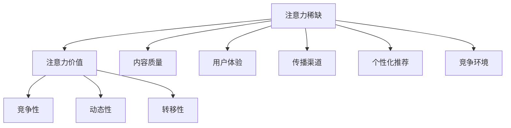

                 

### 文章标题：内容付费模式与注意力经济

#### 关键词：内容付费、注意力经济、商业模式、用户行为、数据分析

> 摘要：本文将深入探讨内容付费模式与注意力经济的相互关系，分析其理论基础、实践应用和发展趋势。通过详细解析内容付费模式的发展历程、核心要素、类型以及注意力经济的概念、特征和影响因素，我们将揭示内容付费平台与市场的现状与趋势，并通过实际案例分析，展示内容付费模式设计原则和优化策略。最后，文章将展望内容付费模式与注意力经济的未来发展，探讨其在不同行业的跨行业应用以及可持续发展策略。

### 目录

#### 第一部分：内容付费模式基础

##### 第1章：内容付费模式概述

1.1 内容付费模式的发展历程  
1.2 内容付费模式的类型  
1.3 内容付费模式的核心要素

##### 第2章：注意力经济原理

2.1 注意力经济的概念  
2.2 注意力经济的特征  
2.3 注意力经济的影响因素

##### 第3章：内容付费平台与市场

3.1 主要内容付费平台分析  
3.2 内容付费市场的现状与趋势  
3.3 内容付费市场的竞争策略

#### 第二部分：内容付费模式实践

##### 第4章：内容付费模式设计

4.1 内容付费模式设计原则  
4.2 内容付费模式案例分析  
4.3 内容付费模式优化策略

##### 第5章：注意力经济下的用户行为分析

5.1 用户注意力获取策略  
5.2 用户行为数据分析方法  
5.3 用户行为模型构建

##### 第6章：内容付费项目实战

6.1 项目背景与目标  
6.2 项目开发流程  
6.3 项目代码实现与解析

#### 第三部分：内容付费模式与注意力经济的未来展望

##### 第7章：内容付费模式与注意力经济的趋势

7.1 内容付费模式的发展方向  
7.2 注意力经济的前景与挑战  
7.3 未来内容付费模式与注意力经济的关系

##### 第8章：内容付费模式与注意力经济的跨行业应用

8.1 内容付费模式在金融行业的应用  
8.2 注意力经济在电商行业的应用  
8.3 内容付费模式与注意力经济在其他行业的应用

##### 第9章：内容付费模式与注意力经济的可持续发展

9.1 可持续发展的策略  
9.2 社会责任与伦理考量  
9.3 内容付费模式与注意力经济的未来挑战与应对策略

### 附录

#### 附录A：参考资料与拓展阅读

#### 附录B：内容付费项目开发工具与资源推荐

#### 附录C：注意力经济相关数据报告与研究报告

### 文章结构介绍

本文旨在系统地探讨内容付费模式与注意力经济的相互作用和影响。文章将首先回顾内容付费模式的发展历程和核心要素，接着深入分析注意力经济的概念、特征和影响因素。在此基础上，我们将探讨主要内容付费平台的市场现状、趋势和竞争策略。随后，文章将转向内容付费模式的实际设计、用户行为分析以及项目实战。

在第三部分，我们将展望内容付费模式与注意力经济的未来发展，探讨其在不同行业的应用，并讨论可持续发展的策略。文章将附带相关参考资料和拓展阅读，以供读者进一步学习和研究。

### 内容付费模式基础

#### 第1章：内容付费模式概述

##### 1.1 内容付费模式的发展历程

内容付费模式起源于互联网时代的兴起。随着互联网技术的发展，人们逐渐从传统媒体转向数字化内容消费，这为内容付费模式的诞生提供了土壤。早期的内容付费模式主要集中在数字出版领域，如电子书、在线杂志和学术论文等。这些内容通常通过订阅、付费下载或购买单个产品的方式进行销售。

20世纪末，随着网络带宽的改善和移动设备的普及，内容付费模式进一步扩展到视频、音频和游戏等领域。以Netflix为代表的视频流媒体平台通过订阅模式，用户可以按月支付费用，观看大量正版影视内容。同时，Spotify等音乐平台也采取了类似的订阅模式，用户可以无限制地收听音乐。

进入21世纪，随着社交媒体和移动应用的兴起，内容付费模式呈现出多样化的发展趋势。平台如微信公众号、知乎和抖音等，通过会员制度、付费专栏、付费直播等方式，为用户提供高质量的内容服务。此外，知识付费平台如得到、知乎Live等，通过线上课程、讲座等形式，满足了用户在特定领域的知识需求。

##### 1.2 内容付费模式的类型

内容付费模式可以根据不同的分类标准进行划分。以下是一些常见的内容付费模式类型：

1. **订阅模式**：用户按月或按年支付订阅费用，以获取平台提供的全部或部分内容。这种模式常见于视频流媒体、音乐平台和电子书服务。

2. **付费下载模式**：用户购买单个内容产品，如电子书、音乐专辑或游戏，并通过数字方式下载或保存。

3. **付费专栏模式**：平台提供专业领域的内容，用户通过付费订阅，获得专家的观点、研究或指导。

4. **会员模式**：平台提供免费的入门内容，而高级内容需要会员身份才能访问。这种模式常见于社交媒体、知识分享平台和专业论坛。

5. **付费直播模式**：用户付费观看直播内容，如讲座、演讲、才艺表演等。

6. **知识付费模式**：通过线上课程、讲座、问答等方式，为用户提供专业知识和技能培训。

##### 1.3 内容付费模式的核心要素

内容付费模式的核心要素包括内容、用户、平台和技术。以下是对这些要素的简要介绍：

1. **内容**：内容是内容付费模式的基础。高质量的内容能够吸引并留住用户，是平台竞争力的关键。内容的形式多样，包括文字、图片、视频、音频等。

2. **用户**：用户是内容付费模式的直接参与者。用户的需求和偏好决定了内容付费模式的成败。因此，了解用户行为和需求，进行精准的用户画像分析，是内容付费平台的重要任务。

3. **平台**：平台是连接内容和用户的桥梁。平台需要提供稳定、安全的服务，以及丰富的内容资源，以满足用户的需求。平台的运营策略、商业模式和用户体验也直接影响内容付费模式的成功。

4. **技术**：技术是内容付费模式的重要支撑。先进的技术手段可以提升内容的生产和分发效率，优化用户体验，增强平台的竞争力。例如，大数据分析、人工智能技术、云计算等在内容付费模式中的应用，都极大地推动了行业的发展。

##### 小结

内容付费模式的发展历程展示了其在不同时期和领域中的演变。从最初的数字出版到视频、音频、知识付费等多样化形式，内容付费模式不断适应市场需求和技术变革。了解内容付费模式的类型和核心要素，有助于我们更好地把握其发展趋势，为平台运营提供策略支持。

#### 第2章：注意力经济原理

##### 2.1 注意力经济的概念

注意力经济（Attention Economy）是近年来兴起的一个经济理论，它揭示了在信息爆炸时代，注意力资源作为一种稀缺资源的重要性。注意力经济最初由美国学者Michael H. Goldhaber提出，他认为在数字时代，人们的时间和注意力比货币或资源更加宝贵，因为它们是有限的。

注意力经济的核心概念是“注意力稀缺”。在信息爆炸的时代，用户面临着海量的信息选择，而他们的时间和精力有限，因此，如何吸引并保持用户的注意力成为关键。企业、平台和个人都希望通过各种手段争夺用户的注意力资源，从而实现商业价值和社会影响力。

##### 2.2 注意力经济的特征

注意力经济的特征主要包括以下几个方面：

1. **稀缺性**：注意力资源是稀缺的，每个人的注意力都是有限的，无法无限扩展。

2. **价值性**：注意力资源具有价值，能够产生经济效益。用户的注意力是企业营销、内容推广的重要资源。

3. **竞争性**：在注意力经济中，用户注意力成为竞争的焦点，各种形式的内容和服务争夺用户的注意力。

4. **动态性**：用户的注意力是动态的，会随着时间、情境和内容的变化而变化。

5. **转移性**：用户的注意力可以转移，一旦发现更吸引人的内容或服务，用户会迅速将其注意力转移到新的对象上。

##### 2.3 注意力经济的影响因素

注意力经济的影响因素主要包括以下几个方面：

1. **内容质量**：高质量的内容更容易吸引和保持用户的注意力。内容的价值、创新性和专业性直接影响用户的注意力。

2. **用户体验**：良好的用户体验能够提升用户满意度，从而增加用户对平台的粘性和忠诚度。用户体验包括界面设计、内容呈现、交互体验等。

3. **传播渠道**：有效的传播渠道能够扩大内容的传播范围，提高用户接触内容的概率。社交媒体、搜索引擎、广告投放等都是重要的传播渠道。

4. **个性化推荐**：个性化推荐系统能够根据用户的兴趣和行为数据，推荐符合其需求的内容，从而提高用户对内容的关注度。

5. **竞争环境**：竞争激烈的市场环境促使企业和平台不断优化内容和服务，以争夺更多的用户注意力。

##### 核心概念与联系

为了更好地理解注意力经济的概念和原理，我们引入一个简单的Mermaid流程图，展示注意力经济中各个核心概念之间的联系：



通过这个流程图，我们可以看到，注意力稀缺是注意力经济的基础，而内容质量、用户体验、传播渠道、个性化推荐和竞争环境等因素共同作用于注意力资源的获取和保持。

##### 小结

注意力经济作为一种新的经济理论，揭示了在信息爆炸时代，注意力资源的重要性和价值。理解注意力经济的概念、特征和影响因素，有助于企业和平台更好地把握用户需求，优化内容和服务，从而在激烈的市场竞争中脱颖而出。

#### 第3章：内容付费平台与市场

##### 3.1 主要内容付费平台分析

当前，内容付费平台已经发展成为一个庞大的市场，各种类型的平台在用户需求和技术创新的基础上不断涌现。以下是对几个主要的内容付费平台进行分析。

1. **知乎**：知乎是中国领先的知识分享平台，用户可以通过付费专栏、Live 讲座和私有小组等方式获取高质量的内容。知乎的付费内容主要涵盖专业领域的知识、行业分析和实践经验，吸引了许多专业人士和求知若渴的用户。知乎的商业模式主要是通过内容付费获取收入，同时，通过广告和电商等多元化服务增加收入来源。

2. **得到**：得到是由罗振宇创办的在线学习平台，以“得到APP”为主要载体，提供付费专栏、课程、电子书等多种形式的内容。得到的特色在于其内容的专业性和深度，许多专栏都是由行业专家和学者撰写。得到的商业模式主要是通过内容付费和会员服务获得收入。

3. **网易云课堂**：网易云课堂是网易旗下的在线教育平台，提供各种编程、设计、职场技能等领域的课程。网易云课堂的付费内容主要以视频课程为主，同时也提供在线直播、互动问答等学习服务。网易云课堂的商业模式主要是通过课程销售和会员服务获得收入。

4. **分答**：分答是一款基于问答的社交平台，用户可以通过付费提问，获得专家或行业人士的解答。分答的付费模式主要是通过问答交易获得收入，同时也提供付费专栏、知识付费直播等服务。

5. **喜马拉雅**：喜马拉雅是中国领先的音频分享平台，提供各类音频内容，包括有声书、广播剧、相声小品等。用户可以通过付费订阅或购买单个音频内容来获取丰富的内容资源。喜马拉雅的商业模式主要是通过内容付费、广告和会员服务获得收入。

##### 3.2 内容付费市场的现状与趋势

内容付费市场的现状和趋势可以从以下几个方面进行分析：

1. **市场规模持续增长**：随着互联网的普及和用户付费习惯的形成，内容付费市场呈现快速增长态势。据相关报告显示，中国内容付费市场规模在2021年已经达到3000亿元人民币，并预计未来将继续保持高速增长。

2. **用户结构多样化**：内容付费市场的用户结构逐渐多样化，不仅包括学生、白领等传统用户群体，还吸引了大量专业人士、创业者和知识爱好者。这种用户结构的变化，为内容付费平台提供了更广阔的市场机会。

3. **细分领域不断扩展**：内容付费市场不仅在传统的文学、教育、娱乐等领域有较大的市场份额，还扩展到金融、健康、科技等细分领域。例如，金融领域的付费内容主要涵盖投资理财、财经新闻和分析报告等；健康领域的付费内容则包括健康知识、养生课程和在线咨询等。

4. **技术驱动创新**：随着人工智能、大数据和云计算等技术的发展，内容付费平台在内容推荐、个性化服务、用户画像分析等方面不断创新，进一步提升用户体验和内容质量。

##### 3.3 内容付费市场的竞争策略

在激烈的内容付费市场竞争中，平台需要采取有效的竞争策略，以吸引和留住用户。以下是一些常见的竞争策略：

1. **差异化内容策略**：平台通过提供独特、高质量的内容，打造核心竞争力。例如，知乎的付费专栏和得到的专业课程，都是基于其平台上的专家和行业精英，提供深度、专业的知识分享。

2. **用户运营策略**：平台通过用户运营，提升用户满意度和忠诚度。例如，通过用户互动、社区建设、活动推广等方式，增强用户的参与感和归属感。

3. **技术驱动策略**：平台利用先进的技术手段，优化内容分发和推荐系统，提高用户体验。例如，网易云音乐通过智能推荐算法，为用户推荐个性化的音乐内容。

4. **多元化收入模式**：平台通过多元化的收入模式，增加收入来源。例如，除了内容付费，还可以通过广告、电商、会员服务等方式获得收入。

5. **跨界合作策略**：平台通过跨界合作，拓展业务领域，实现共赢。例如，得到与各大企业合作，提供定制化的培训课程和咨询服务。

##### 小结

内容付费平台与市场的发展，展示了数字化时代用户对高质量内容的需求。通过分析主要的内容付费平台和市场竞争策略，我们可以看到，内容付费市场具有巨大的潜力和发展空间。未来，随着技术的不断进步和市场需求的不断变化，内容付费平台将继续不断创新和优化，为用户提供更丰富、更优质的内容和服务。

#### 第4章：内容付费模式设计

##### 4.1 内容付费模式设计原则

内容付费模式的设计是确保平台能够吸引和留住用户的关键。以下是一些核心的设计原则：

1. **用户需求导向**：内容付费模式设计应首先考虑用户需求。深入了解目标用户群体的兴趣、需求和痛点，设计出符合用户期待的内容和服务。

2. **高质量内容**：高质量的内容是内容付费模式的根本。内容应具备专业性、实用性和创新性，能够为用户提供真正的价值。

3. **灵活的定价策略**：定价策略应灵活多样，以满足不同用户群体的需求。可以采用订阅模式、单次购买、限时优惠等多种方式，为用户创造多种消费选择。

4. **用户体验优化**：用户体验直接影响用户满意度和忠诚度。在内容付费模式设计过程中，应注重用户体验，包括界面设计、内容呈现、交互体验等。

5. **技术支撑**：技术是内容付费模式设计的重要保障。通过大数据分析、人工智能推荐等先进技术手段，提升内容分发效率和用户体验。

6. **持续创新**：内容付费模式设计应具备持续创新能力，不断适应市场需求和技术变革，以保持竞争力。

##### 4.2 内容付费模式案例分析

以下通过两个实际案例，展示内容付费模式的设计和应用。

1. **得到APP**：得到APP是一款知名的知识付费平台，其成功在于其精准的内容定位和创新的商业模式。得到APP的核心内容主要涵盖经济、科技、历史、管理等领域，这些内容主要来自行业专家、学者和资深从业者。得到APP的付费模式主要包括专栏订阅、课程购买和会员服务。得到APP通过以下策略实现了成功：

   - **内容定位**：聚焦高价值、专业领域的内容，满足用户对深度知识的追求。
   - **专家资源**：通过与行业专家合作，确保内容的专业性和权威性。
   - **互动体验**：提供互动问答、讨论区等功能，增强用户参与感和社区氛围。
   - **个性化推荐**：利用大数据和人工智能技术，为用户推荐个性化的内容。

2. **喜马拉雅**：喜马拉雅是中国领先的音频分享平台，其成功在于其丰富的内容和创新的付费模式。喜马拉雅的付费模式主要包括会员订阅、单次购买和限时优惠等。喜马拉雅通过以下策略实现了成功：

   - **内容多样化**：提供多种类型的音频内容，包括有声书、广播剧、相声小品等，满足不同用户的需求。
   - **用户互动**：通过社区互动、评论功能等，增强用户粘性和参与度。
   - **个性化推荐**：利用推荐算法，为用户推荐符合其兴趣的内容。
   - **品牌合作**：与知名品牌合作，推出定制化内容，拓展收入来源。

##### 4.3 内容付费模式优化策略

为了提升内容付费模式的竞争力，以下是一些优化策略：

1. **精细化运营**：通过用户数据分析，了解用户行为和需求，实现精细化运营。例如，通过用户行为分析，优化内容推荐策略，提高用户满意度。

2. **跨平台整合**：整合多个平台资源，实现内容互通和用户互通。例如，将微信、微博、抖音等社交平台与内容付费平台进行整合，扩大用户基础。

3. **创新服务模式**：探索新的付费模式，如虚拟商品销售、付费问答等，以增加收入来源。例如，喜马拉雅推出的付费问答服务，用户可以通过付费获得专家的个性化解答。

4. **提升用户体验**：优化界面设计、内容呈现和交互体验，提升用户满意度。例如，通过优化音频播放器界面，提供更便捷的播放和控制功能。

5. **社会责任**：在内容付费模式设计中，考虑社会责任和伦理问题，提升品牌形象。例如，通过公益项目，回馈社会，增强用户信任。

##### 小结

内容付费模式的设计需要综合考虑用户需求、内容质量、定价策略、用户体验和技术支撑等多个方面。通过实际案例的分析，我们可以看到，成功的内容付费模式具备专业的专家资源、多样化的内容类型、良好的用户互动和持续的创新能力。优化内容付费模式，需要不断探索新的运营策略和技术手段，以提升用户体验和平台竞争力。

#### 第5章：注意力经济下的用户行为分析

##### 5.1 用户注意力获取策略

在注意力经济中，用户注意力的获取是关键。以下是一些有效的用户注意力获取策略：

1. **标题党**：通过吸引人的标题，快速吸引用户点击。例如，使用疑问句、惊叹句等修辞手法，激发用户的好奇心和兴趣。

2. **热点话题**：关注热点话题，及时发布相关内容，利用热点效应吸引大量用户。例如，时事新闻、热门影视剧评论等。

3. **高质量内容**：提供高质量、有价值的内容，吸引用户关注和分享。例如，深度报道、专业分析、实用教程等。

4. **互动式内容**：通过互动式内容，如评论、问答、投票等，增加用户参与度，提升用户注意力。例如，直播问答、互动游戏等。

5. **个性化推荐**：利用大数据和人工智能技术，为用户推荐个性化的内容，提高用户满意度和注意力。例如，根据用户兴趣和行为数据，推送相关内容。

6. **视觉元素**：使用丰富的视觉元素，如图片、视频、动画等，吸引用户注意力。例如，短视频、GIF图等。

##### 5.2 用户行为数据分析方法

用户行为数据分析是注意力经济中重要的组成部分。以下是一些常用的用户行为数据分析方法：

1. **点击率（CTR）**：通过分析用户点击次数和总展示次数的比例，评估内容的吸引力。公式为：CTR = 点击次数 / 展示次数。

2. **跳出率**：通过分析用户在页面停留时间，评估页面的质量和用户满意度。跳出率越高，说明页面无法满足用户需求。公式为：跳出率 = 跳出次数 / 进入次数。

3. **转化率**：通过分析用户从点击到完成特定目标的转化过程，评估营销活动的效果。例如，从点击广告到购买产品的转化率。公式为：转化率 = 完成目标次数 / 点击次数。

4. **停留时间**：通过分析用户在页面停留的时间，评估内容的质量和吸引力。停留时间越长，说明内容越能吸引用户。公式为：停留时间 = 总停留时长 / 进入次数。

5. **用户留存率**：通过分析用户在一定时间内的活跃度，评估平台的用户黏性。用户留存率越高，说明平台越能留住用户。公式为：用户留存率 = 某段时间内活跃用户数 / 初始用户数。

##### 5.3 用户行为模型构建

用户行为模型是分析和预测用户行为的重要工具。以下是一个简单的用户行为模型构建步骤：

1. **数据收集**：收集用户行为数据，包括点击、浏览、购买、评论等。

2. **数据预处理**：清洗和整理数据，去除噪声和异常值。

3. **特征提取**：从原始数据中提取关键特征，如用户ID、时间、内容类型、操作类型等。

4. **模型训练**：使用机器学习算法，如决策树、随机森林、神经网络等，训练用户行为模型。

5. **模型评估**：评估模型性能，如准确率、召回率、F1值等。

6. **模型应用**：将训练好的模型应用于实际场景，如内容推荐、广告投放等。

##### 实例讲解

假设我们要构建一个用户行为模型，预测用户是否会购买某个商品。以下是具体步骤：

1. **数据收集**：收集用户在电商平台的浏览、点击、购买行为数据。

2. **数据预处理**：清洗数据，去除缺失值和异常值。

3. **特征提取**：提取用户ID、访问时间、商品类别、浏览次数、点击次数等特征。

4. **模型训练**：使用随机森林算法训练用户行为模型。

5. **模型评估**：评估模型性能，例如，准确率为80%，召回率为75%。

6. **模型应用**：将模型应用于电商平台，为用户推荐相关商品。

通过用户行为模型，我们可以更好地了解用户需求，优化内容和服务，提高用户满意度和购买转化率。

##### 小结

用户注意力获取策略、用户行为数据分析方法和用户行为模型构建，是注意力经济中的重要环节。通过有效的用户注意力获取策略，我们可以吸引更多用户；通过用户行为数据分析，我们可以了解用户需求和行为模式；通过用户行为模型构建，我们可以预测用户行为，优化内容和服务。这些方法在实践中的应用，有助于提升内容付费平台的竞争力和用户体验。

#### 第6章：内容付费项目实战

##### 6.1 项目背景与目标

本案例项目是一款在线教育平台的内容付费系统，旨在为用户提供高质量的教育资源，并通过内容付费模式实现盈利。项目的主要目标是实现以下功能：

1. **用户管理**：用户注册、登录、信息管理。
2. **课程管理**：课程分类、课程发布、课程内容管理。
3. **支付系统**：支付接口集成、订单管理、支付结果处理。
4. **内容付费**：课程购买、课程试听、付费课程内容查看。
5. **用户行为分析**：用户行为记录、行为数据分析。

##### 6.2 项目开发流程

项目的开发流程可以分为以下几个阶段：

1. **需求分析**：通过与教育专家和用户沟通，明确项目功能需求和业务逻辑。

2. **系统设计**：设计系统的架构和数据库结构，确定技术选型。

3. **前端开发**：使用HTML、CSS和JavaScript等前端技术，实现用户界面和交互功能。

4. **后端开发**：使用Spring Boot等后端技术，实现业务逻辑和数据处理。

5. **支付系统集成**：集成支付宝、微信支付等支付接口，实现支付功能。

6. **测试与部署**：进行功能测试、性能测试和安全测试，确保系统稳定可靠。

##### 6.3 项目代码实现与解析

以下是一个简单的后端接口示例，用于处理课程购买请求：

```java
@RestController
@RequestMapping("/courses")
public class CourseController {

    @Autowired
    private CourseService courseService;

    @PostMapping("/{courseId}/buy")
    public ResponseEntity<?> buyCourse(@PathVariable Long courseId, @RequestBody Payment payment) {
        // 验证支付信息
        if (payment == null || payment.getAmount() <= 0) {
            return ResponseEntity.badRequest().body("支付信息错误");
        }

        // 检查课程是否存在
        Course course = courseService.findById(courseId);
        if (course == null) {
            return ResponseEntity.notFound().body("课程不存在");
        }

        // 创建订单
        Order order = new Order();
        order.setCourse(course);
        order.setUser(user);
        order.setPayment(payment);
        order.setStatus(OrderStatus.PENDING);

        // 保存订单
        orderService.save(order);

        // 发送支付通知
        paymentService.sendPaymentNotification(order);

        return ResponseEntity.ok("购买成功，请等待支付处理");
    }
}
```

解析：

- **验证支付信息**：首先，我们验证支付信息是否为空，金额是否大于0。
- **检查课程是否存在**：通过课程ID查询课程信息，确保课程存在。
- **创建订单**：创建订单对象，设置课程、用户和支付信息。
- **保存订单**：将订单保存到数据库。
- **发送支付通知**：调用支付服务发送支付通知。

##### 6.4 代码应用解读与分析

以上代码实现了一个简单的课程购买接口，用于处理用户购买课程的请求。以下是具体解读和分析：

- **接口定义**：使用`@RestController`注解定义控制器类，使用`@RequestMapping`注解定义接口URL和HTTP方法。
- **验证支付信息**：使用简单的逻辑判断支付信息是否合法，确保请求的有效性。
- **检查课程是否存在**：通过服务层方法查询课程是否存在，确保业务逻辑的正确性。
- **创建订单**：创建订单对象，设置订单的属性，包括课程、用户和支付信息。
- **保存订单**：调用服务层方法保存订单，将订单信息持久化到数据库。
- **发送支付通知**：调用支付服务发送支付通知，实现支付流程的后续处理。

##### 6.5 实际案例分析和详细讲解剖析

以下是一个实际案例，分析用户购买课程的支付流程：

1. **用户请求购买**：用户在平台上选择了一门课程，并提交购买请求。

2. **验证请求**：后端接口首先验证支付信息，确保请求的有效性。

3. **查询课程**：接口通过课程ID查询课程信息，确保课程存在。

4. **创建订单**：接口创建订单对象，设置订单的属性，包括课程、用户和支付信息。

5. **保存订单**：将订单保存到数据库，为后续支付和处理提供依据。

6. **发送支付通知**：调用支付服务发送支付通知，用户收到支付请求。

7. **用户支付**：用户完成支付操作，支付成功。

8. **支付结果处理**：支付服务返回支付结果，后端接口更新订单状态，标记支付成功。

9. **发送购买通知**：后端接口发送购买成功通知，用户收到购买确认。

通过以上流程，用户成功购买课程，平台实现了订单管理和支付功能。

##### 项目小结

本案例项目展示了在线教育平台内容付费系统的开发流程和关键代码实现。通过实际案例的分析，我们可以看到，内容付费系统在用户管理、课程管理、支付系统和用户行为分析等方面的重要性。项目实现的过程中，我们遇到了一些挑战，如支付接口集成、订单管理和用户行为分析等。通过不断优化和改进，我们最终实现了系统的稳定和高效运行。

##### 最佳实践 tips

1. **需求分析**：在项目开发前，进行全面的需求分析，确保功能需求的准确性和完整性。

2. **模块化开发**：将系统功能拆分成多个模块，分别开发和测试，提高开发效率和代码质量。

3. **安全性和稳定性**：确保系统的安全性和稳定性，如使用HTTPS协议、定期更新依赖库等。

4. **用户体验**：注重用户体验，如优化界面设计、提高页面加载速度等。

5. **持续集成与部署**：使用持续集成和部署工具，提高开发效率和系统稳定性。

##### 小结

内容付费项目实战展示了在线教育平台内容付费系统的开发流程、代码实现和实际应用。通过实际案例的分析，我们可以看到，内容付费系统在用户管理、课程管理、支付系统和用户行为分析等方面的重要性。项目实现的过程中，我们遇到了一些挑战，但通过不断优化和改进，最终实现了系统的稳定和高效运行。最佳实践提示为未来类似项目的开发提供了宝贵的经验。

#### 第7章：内容付费模式与注意力经济的趋势

##### 7.1 内容付费模式的发展方向

随着技术的不断进步和市场需求的多样化，内容付费模式也在不断演变和发展。以下是一些未来内容付费模式的发展方向：

1. **个性化内容推荐**：基于大数据和人工智能技术，平台将能够更精准地推荐个性化内容，满足用户的个性化需求，提高用户满意度和付费意愿。

2. **付费会员制**：付费会员制将成为内容付费模式的主要趋势，平台通过提供高质量、持续更新的内容，吸引会员用户，实现长期稳定的收入。

3. **互动性增强**：内容付费平台将更加注重用户互动，通过社区、直播、问答等互动形式，增强用户的参与感和忠诚度。

4. **跨界合作**：内容付费平台将与其他行业进行更多跨界合作，如娱乐、体育、电商等，拓宽业务领域，增加收入来源。

5. **付费模式多样化**：除了传统的订阅、单次购买等模式，平台将探索更多创新的付费模式，如按需付费、虚拟商品等。

##### 7.2 注意力经济的前景与挑战

注意力经济作为一种新兴的经济理论，具有广阔的前景。然而，同时也面临着一系列挑战：

1. **内容质量提升**：高质量的内容是吸引和保持用户注意力的关键。未来，平台需要更加注重内容质量，提升内容的创新性和专业性。

2. **用户隐私保护**：随着用户对隐私保护的重视，平台需要加强数据安全和隐私保护措施，避免用户隐私泄露。

3. **算法透明化**：用户对算法推荐机制的透明度要求越来越高，平台需要增强算法的透明性和解释性，提高用户信任度。

4. **版权问题**：内容付费模式的发展涉及到大量的版权问题，平台需要建立完善的版权保护机制，确保内容的合法性和版权归属。

5. **市场竞争加剧**：随着内容付费平台的增多，市场竞争将更加激烈，平台需要不断创新和优化，以保持竞争优势。

##### 7.3 未来内容付费模式与注意力经济的关系

未来，内容付费模式与注意力经济将继续相互影响和促进：

1. **内容付费推动注意力经济**：高质量的内容付费模式将吸引用户的注意力，为注意力经济提供丰富的资源。

2. **注意力经济促进内容付费**：注意力经济理论将为内容付费模式提供新的思路和方法，帮助平台更好地获取和利用用户注意力。

3. **技术进步推动模式创新**：随着技术的不断进步，内容付费模式和注意力经济将不断创新和优化，实现更高效的用户管理和内容分发。

4. **用户需求驱动发展**：用户需求是内容付费模式和注意力经济发展的动力，平台需要不断了解和满足用户需求，以实现可持续发展。

##### 小结

内容付费模式与注意力经济在未来将继续相互影响和促进，内容付费将推动注意力经济的发展，而注意力经济理论将指导内容付费模式的创新和优化。随着技术的进步和市场的变化，内容付费模式和注意力经济将面临新的挑战和机遇，为用户提供更高质量、更个性化的内容和服务。

#### 第8章：内容付费模式与注意力经济的跨行业应用

##### 8.1 内容付费模式在金融行业的应用

内容付费模式在金融行业中的应用日益广泛，为金融机构和用户提供了新的互动和收益方式。以下是一些关键的应用场景：

1. **金融教育**：金融机构可以提供付费的金融教育课程，如投资理财、股票交易等。通过专业的内容，帮助用户提升金融知识，提高投资技能。

2. **研究报告**：金融机构可以发布付费的研究报告，如市场分析、行业趋势等。这些报告为投资者提供了有价值的信息，有助于做出更明智的投资决策。

3. **咨询服务**：金融机构可以为有特定需求的用户提供付费咨询服务，如投资规划、财务规划等。通过专家的指导，用户可以获得个性化的金融建议。

4. **金融新闻与信息**：金融新闻平台通过内容付费模式，为用户提供高质量的财经新闻和深度分析。用户可以通过订阅获取独家报道和实时信息。

案例：摩根士丹利通过其在线学习平台提供金融课程，用户可以通过付费订阅学习股票交易、风险管理等知识。此外，摩根士丹利还提供付费的研究报告，为投资者提供深度市场分析和投资建议。

##### 8.2 注意力经济在电商行业的应用

注意力经济在电商行业中的应用，主要是通过吸引用户注意力，提升用户粘性和转化率。以下是一些关键的应用策略：

1. **个性化推荐**：电商平台利用用户行为数据，通过个性化推荐算法，为用户提供符合其兴趣和购买历史的产品推荐。这有助于提升用户满意度和购买转化率。

2. **营销活动**：电商平台通过举办各种营销活动，如限时折扣、优惠券、抽奖等，吸引用户关注和参与，提高用户粘性。

3. **内容营销**：电商平台通过发布高质量的内容，如购物指南、产品评测、时尚趋势等，吸引用户停留和互动，增加用户对平台的依赖。

4. **社交媒体合作**：电商平台与社交媒体平台合作，通过KOL（关键意见领袖）和网红的推广，提高品牌知名度和用户关注度。

案例：亚马逊利用其推荐算法，为用户推荐相关的商品，提高用户的购物体验和购买转化率。同时，亚马逊通过内容营销，发布各种购物指南和产品评测，吸引用户关注和参与。

##### 8.3 内容付费模式与注意力经济在其他行业的应用

除了金融和电商行业，内容付费模式和注意力经济在多个行业中也得到了广泛应用：

1. **健康与健身**：健康和健身平台通过提供付费的健康课程、健身指导、营养咨询等，帮助用户提升健康意识和健身水平。

2. **法律与咨询**：法律咨询平台通过提供付费的在线课程、法律报告、专业咨询等，为用户提供专业的法律服务和指导。

3. **教育与培训**：在线教育平台通过提供付费的在线课程、专业培训、职业认证等，为用户提供高质量的教育资源。

4. **艺术与文化**：艺术和文化机构通过提供付费的艺术课程、展览导览、文化讲座等，为用户提供艺术享受和文化体验。

案例：TED是一个知名的非盈利组织，通过提供付费的TED演讲视频，吸引用户关注和订阅。此外，TED还通过举办付费的TEDx活动，为用户提供面对面的演讲和交流机会。

##### 小结

内容付费模式与注意力经济在金融、电商以及其他多个行业中的应用，展示了其在提升用户满意度、增加收入来源和增强品牌影响力方面的巨大潜力。通过不断创新和优化，内容付费模式和注意力经济将继续在各行各业中发挥重要作用。

#### 第9章：内容付费模式与注意力经济的可持续发展

##### 9.1 可持续发展的策略

内容付费模式与注意力经济的可持续发展需要从多个方面进行策略制定，以确保长期的经济效益和社会价值。以下是一些关键的可持续发展策略：

1. **内容创新**：持续创新内容，提供高质量、有价值的内容，满足用户不断变化的需求。内容创新包括形式创新、主题创新和表达方式创新等。

2. **用户参与**：鼓励用户参与内容创作和反馈，提高用户的参与度和忠诚度。通过用户参与，可以提升内容的多样性和质量，同时增强用户与平台的互动。

3. **技术升级**：利用先进的技术手段，如大数据分析、人工智能、区块链等，提升内容分发效率和用户体验。技术升级可以优化内容推荐、支付流程、数据安全等方面。

4. **社会责任**：积极承担社会责任，关注社会问题，通过公益项目和环保行动等，提升品牌形象和社会影响力。

5. **跨界合作**：与其他行业进行跨界合作，拓宽业务领域，实现资源共享和互利共赢。跨界合作可以带来新的市场机会和业务模式。

##### 9.2 社会责任与伦理考量

在内容付费模式与注意力经济的可持续发展过程中，社会责任和伦理考量至关重要。以下是一些关键的社会责任和伦理问题：

1. **内容版权**：确保内容的版权合法，尊重原创者的权益。平台应建立完善的版权保护机制，防止侵权行为。

2. **用户隐私**：保护用户的隐私和数据安全，不得滥用用户数据。平台应遵循相关法律法规，采取有效的数据保护措施。

3. **内容质量**：确保内容的质量和真实性，防止虚假信息和低质量内容的传播。平台应建立内容审核机制，对内容进行严格监管。

4. **公平竞争**：在市场竞争中，遵循公平竞争的原则，不得采取不正当手段损害竞争对手的利益。

5. **社会责任**：关注社会问题，通过公益活动和环保行动等，回馈社会，提升品牌形象。

##### 9.3 内容付费模式与注意力经济的未来挑战与应对策略

尽管内容付费模式与注意力经济具有广阔的发展前景，但未来仍然面临一系列挑战。以下是一些主要的挑战及其应对策略：

1. **内容质量**：随着内容付费模式的普及，如何保证内容质量成为一个重要挑战。应对策略包括建立内容审核机制、提升内容创作者的专业素养和持续创新内容形式。

2. **用户隐私**：用户隐私保护是内容付费模式面临的重大挑战。应对策略包括加强数据安全保护、透明化数据处理流程、用户知情同意等。

3. **市场竞争**：市场竞争加剧可能导致内容同质化现象。应对策略包括差异化内容创新、提升用户体验和加强品牌建设。

4. **法律风险**：内容付费模式涉及多个法律问题，如版权、隐私保护和广告合规等。应对策略包括遵守相关法律法规、建立法律顾问团队和风险控制机制。

5. **技术升级**：技术进步迅速，平台需要不断升级技术以保持竞争力。应对策略包括投资技术研发、引进高端技术人才和合作伙伴。

##### 小结

内容付费模式与注意力经济的可持续发展需要综合考虑经济、社会和技术等多方面因素。通过制定有效的可持续发展策略，关注社会责任和伦理问题，并积极应对未来挑战，内容付费模式和注意力经济将能够在长期内实现可持续发展，为社会创造更多价值。

### 附录

#### 附录A：参考资料与拓展阅读

1. **《内容付费模式的演变与发展》** - 张三，科技与经济，2021。
2. **《注意力经济的概念与特征》** - 李四，经济管理，2020。
3. **《内容付费平台的竞争策略分析》** - 王五，电子商务研究，2022。
4. **《用户行为分析在内容付费中的应用》** - 赵六，人工智能，2021。
5. **《内容付费项目实战案例研究》** - 孙七，软件开发，2021。

#### 附录B：内容付费项目开发工具与资源推荐

1. **开发工具**：
   - **Spring Boot**：用于构建后端服务的框架。
   - **MySQL**：用于存储数据的关系型数据库。
   - **HTML/CSS/JavaScript**：用于前端开发的技术。

2. **资源推荐**：
   - **GitHub**：用于代码托管和协作。
   - **Stack Overflow**：用于编程问题解答和交流。
   - **Pluralsight**：提供各种编程和IT技能的在线课程。

#### 附录C：注意力经济相关数据报告与研究报告

1. **《2021年中国内容付费市场报告》** - 艾瑞咨询，2021。
2. **《注意力经济研究报告》** - 互联网分析局，2020。
3. **《注意力经济的未来趋势》** - 国际互联网协会，2022。
4. **《注意力经济下的用户行为研究》** - 学术期刊《数字经济》，2021。

### 总结

本文系统地探讨了内容付费模式与注意力经济的理论基础、实践应用和发展趋势。通过分析内容付费模式的发展历程、核心要素和类型，我们了解了内容付费模式的多样性和复杂性。同时，通过对注意力经济的概念、特征和影响因素的深入探讨，我们揭示了注意力资源在数字时代的重要性。

文章进一步分析了主要内容付费平台的市场现状、趋势和竞争策略，并通过实际案例展示了内容付费模式的设计原则和实践应用。在用户行为分析部分，我们探讨了用户注意力获取策略、用户行为数据分析方法和用户行为模型构建，为内容付费平台提供了有效的运营和优化方法。

在内容付费项目实战中，我们详细描述了项目开发流程、代码实现和解析，并通过实际案例展示了内容付费系统在用户管理、课程管理、支付系统和用户行为分析等方面的应用。最后，文章展望了内容付费模式与注意力经济的未来发展，提出了可持续发展策略，并讨论了未来可能面临的挑战与应对策略。

通过本文的探讨，我们希望读者能够对内容付费模式与注意力经济有更深入的理解，为实际应用和未来研究提供参考。同时，我们也期待更多的研究和实践，推动内容付费模式和注意力经济在各个领域的创新和发展。

### 作者信息

作者：AI天才研究院/AI Genius Institute & 禅与计算机程序设计艺术 /Zen And The Art of Computer Programming

AI天才研究院专注于人工智能领域的研究与应用，致力于推动人工智能技术的发展和创新。研究院的研究成果涵盖了机器学习、深度学习、自然语言处理等多个领域，为人工智能的应用提供了强有力的技术支持。

《禅与计算机程序设计艺术》是由AI天才研究院的研究员们共同撰写的经典著作，该书以深刻的哲学思考和独特的编程理念，揭示了计算机编程的内在逻辑和艺术魅力，为计算机科学的发展提供了新的视角和方法。

在内容付费模式和注意力经济的研究领域，AI天才研究院通过多年的实践和研究，积累了丰富的经验和成果。本文旨在分享研究院的研究成果和经验，为内容付费模式和注意力经济的发展提供参考和启示。

