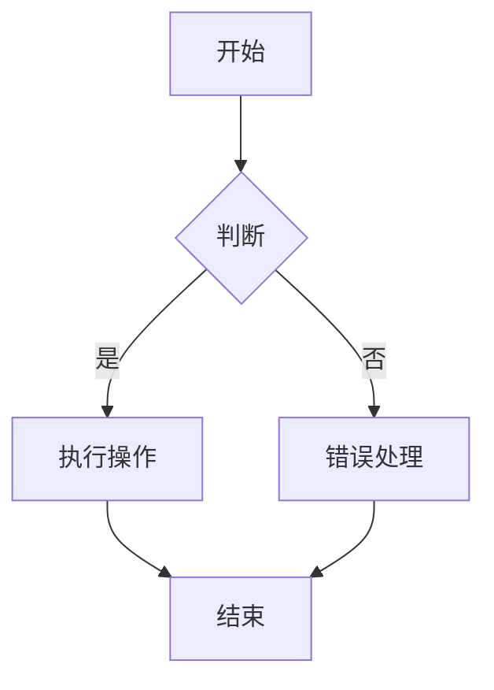

                 

# 《准确率Accuracy原理与代码实例讲解》

> 关键词：准确率，Accuracy，二分类，多类分类，Python实例，TensorFlow，PyTorch，数据不平衡，ROC曲线

> 摘要：本文将详细探讨准确率（Accuracy）这一关键概念。首先，我们将从基础定义和计算方法入手，深入理解准确率在不同分类任务中的应用。接着，文章将逐步介绍准确率的计算方法，包括精确率（Precision）和召回率（Recall），以及如何通过权衡两者来实现模型的优化。此外，我们将探讨在实际应用中可能遇到的挑战，如数据不平衡问题，并提出相应的解决策略。文章后半部分将通过代码实例，展示如何使用Python、TensorFlow和PyTorch等工具来计算准确率，并提供详细的代码实现和解释。最后，我们将讨论多类分类的准确率计算方法和可视化工具，如ROC曲线和精确率-召回率曲线，帮助读者更好地理解准确率在复杂分类任务中的实际应用。

## 目录大纲

- **第一部分：准确率基础知识**
  - **第1章：准确率概述**
  - **第2章：准确率的计算方法**
  - **第3章：准确率在实际应用中的挑战

- **第二部分：准确率的代码实例解析**
  - **第4章：使用Python实现准确率计算**
  - **第5章：深度学习框架中的准确率计算**
  - **第6章：多类分类的准确率计算**
  - **第7章：准确率的可视化分析**
  - **第8章：综合实例分析**

- **附录**
  - **附录A：常用库与工具介绍**
  - **附录B：Mermaid流程图示例**
  - **附录C：伪代码与数学公式示例**
  - **附录D：代码实现与解读示例**

### 第一部分：准确率基础知识

#### 第1章：准确率概述

### 第1章：准确率概述

#### 1.1 准确率的定义与重要性

准确率（Accuracy）是机器学习分类任务中一个重要的性能指标，它表示分类模型预测正确的样本占总样本的比例。准确率的定义非常直观，其数学表达式如下：

\[ Accuracy = \frac{TP + TN}{TP + TN + FP + FN} \]

其中，\( TP \) 表示真正例数（True Positives），\( TN \) 表示真负例数（True Negatives），\( FP \) 表示假正例数（False Positives），\( FN \) 表示假负例数（False Negatives）。

准确率在分类任务中具有重要的意义，原因如下：

1. **直观性**：准确率提供了一个简单易懂的性能指标，可以直接反映模型的分类效果。
2. **全面性**：准确率综合考虑了模型对各类别的预测能力，因此在评估模型性能时具有广泛的适用性。
3. **易于比较**：准确率可以直接比较不同模型的性能，无需考虑类别不平衡问题。

#### 1.2 准确率的计算方法

准确率的计算方法主要涉及真正例数（TP）、假正例数（FP）、真负例数（TN）和假负例数（FN）这四个指标。以下分别介绍这些指标的计算方法和含义。

1. **真正例数（TP）**

   真正例数表示模型正确预测为正例的样本数量。具体计算方法为：

   \[ TP = \text{预测为正例的样本数} \]

2. **假正例数（FP）**

   假正例数表示模型错误预测为正例的样本数量。具体计算方法为：

   \[ FP = \text{实际为负例但预测为正例的样本数} \]

3. **真负例数（TN）**

   真负例数表示模型正确预测为负例的样本数量。具体计算方法为：

   \[ TN = \text{预测为负例的样本数} \]

4. **假负例数（FN）**

   假负例数表示模型错误预测为负例的样本数量。具体计算方法为：

   \[ FN = \text{实际为正例但预测为负例的样本数} \]

通过上述指标的计算，可以得到准确率的数学表达式：

\[ Accuracy = \frac{TP + TN}{TP + TN + FP + FN} \]

#### 1.3 真正例率（TPR）与假正例率（FPR）

真正例率（True Positive Rate，TPR）和假正例率（False Positive Rate，FPR）是准确率的两个重要衍生指标，它们分别表示模型对正例和负例的识别能力。以下分别介绍这两个指标的计算方法和含义。

1. **真正例率（TPR）**

   真正例率表示模型正确预测为正例的样本数量占实际正例总数的比例。具体计算方法为：

   \[ TPR = \frac{TP}{TP + FN} \]

2. **假正例率（FPR）**

   假正例率表示模型错误预测为正例的样本数量占实际负例总数的比例。具体计算方法为：

   \[ FPR = \frac{FP}{FP + TN} \]

#### 1.4 真负例率（TNR）与假负例率（FNR）

真负例率（True Negative Rate，TNR）和假负例率（False Negative Rate，FNR）是准确率的另外两个衍生指标，它们分别表示模型对负例和正例的识别能力。以下分别介绍这两个指标的计算方法和含义。

1. **真负例率（TNR）**

   真负例率表示模型正确预测为负例的样本数量占实际负例总数的比例。具体计算方法为：

   \[ TNR = \frac{TN}{TN + FP} \]

2. **假负例率（FNR）**

   假负例率表示模型错误预测为负例的样本数量占实际正例总数的比例。具体计算方法为：

   \[ FNR = \frac{FN}{TP + FN} \]

通过真正例率（TPR）、假正例率（FPR）、真负例率（TNR）和假负例率（FNR）的计算，可以更全面地评估模型的分类性能。

#### 1.5 准确率的优缺点

准确率作为分类任务的性能指标，具有以下优点：

1. **简单直观**：准确率的计算方法简单，易于理解，可以直接反映模型的分类效果。
2. **全面性**：准确率综合考虑了模型对各类别的预测能力，适用于各种分类任务。
3. **易于比较**：准确率可以直接比较不同模型的性能，无需考虑类别不平衡问题。

然而，准确率也存在一些缺点：

1. **忽略分类任务的重要性**：准确率只考虑分类正确的样本数，忽略了不同类别的重要性和成本。
2. **受类别不平衡影响**：在类别不平衡的数据集中，准确率可能会失真，无法准确反映模型的性能。

综上所述，准确率在分类任务中具有重要的应用价值，但同时也需要结合其他指标和方法来全面评估模型的性能。

#### 第2章：准确率的计算方法

### 第2章：准确率的计算方法

#### 2.1 精确率（Precision）

精确率（Precision）是评估分类模型性能的一个重要指标，它表示模型预测为正例的样本中，实际为正例的比例。精确率的数学表达式如下：

\[ Precision = \frac{TP}{TP + FP} \]

其中，\( TP \) 表示真正例数，\( FP \) 表示假正例数。

#### 2.1.1 精确率的计算与解释

精确率的计算过程可以分为以下步骤：

1. **计算真正例数（TP）**：统计模型预测为正例且实际也为正例的样本数量。
2. **计算假正例数（FP）**：统计模型预测为正例但实际为负例的样本数量。
3. **计算精确率**：将真正例数（TP）除以真正例数（TP）和假正例数（FP）之和。

精确率的解释如下：

- **高精确率**：表示模型在预测为正例的样本中，实际为正例的比例较高，模型的预测能力较强。
- **低精确率**：表示模型在预测为正例的样本中，实际为正例的比例较低，模型的预测能力较弱。

#### 2.1.2 精确率的应用场景

精确率在以下应用场景中具有重要作用：

1. **医学诊断**：在医疗诊断中，精确率可以用来评估模型的诊断能力。高精确率表示模型在预测为正例的病例中，实际为正例的比例较高，具有较高的诊断准确性。
2. **邮件过滤**：在垃圾邮件过滤中，精确率可以用来评估模型的过滤能力。高精确率表示模型在预测为垃圾邮件的邮件中，实际为垃圾邮件的比例较高，可以有效过滤垃圾邮件。
3. **金融风控**：在金融风控中，精确率可以用来评估模型的风险识别能力。高精确率表示模型在预测为高风险的样本中，实际为高风险的比例较高，可以有效识别高风险样本。

#### 2.2 召回率（Recall）

召回率（Recall）是评估分类模型性能的另一个重要指标，它表示模型能够召回的实际正例占所有实际正例的比例。召回率的数学表达式如下：

\[ Recall = \frac{TP}{TP + FN} \]

其中，\( TP \) 表示真正例数，\( FN \) 表示假负例数。

#### 2.2.1 召回率的计算与解释

召回率的计算过程可以分为以下步骤：

1. **计算真正例数（TP）**：统计模型预测为正例且实际也为正例的样本数量。
2. **计算假负例数（FN）**：统计模型预测为负例但实际为正例的样本数量。
3. **计算召回率**：将真正例数（TP）除以真正例数（TP）和假负例数（FN）之和。

召回率的解释如下：

- **高召回率**：表示模型能够召回的实际正例占所有实际正例的比例较高，模型的召回能力较强。
- **低召回率**：表示模型能够召回的实际正例占所有实际正例的比例较低，模型的召回能力较弱。

#### 2.2.2 召回率的应用场景

召回率在以下应用场景中具有重要作用：

1. **安全监控**：在安全监控中，召回率可以用来评估模型的安全预警能力。高召回率表示模型能够及时发现潜在的安全威胁，具有较高的预警准确性。
2. **搜索引擎**：在搜索引擎中，召回率可以用来评估模型的查询匹配能力。高召回率表示模型能够召回与查询相关的文档比例较高，可以提供更准确的搜索结果。
3. **客户流失预测**：在客户流失预测中，召回率可以用来评估模型的流失预测能力。高召回率表示模型能够预测到即将流失的客户比例较高，可以采取有效的挽回措施。

#### 2.3 精确率与召回率的权衡

在实际应用中，精确率和召回率之间存在一定的权衡关系。当模型过于追求高精确率时，可能会降低召回率，即错过一些实际为正例的样本；而当模型过于追求高召回率时，可能会提高假正例率，即增加一些实际为负例的样本。

因此，在实际应用中，需要根据具体需求和场景，权衡精确率和召回率之间的关系，选择合适的模型参数。以下是一些常见的权衡策略：

1. **二分类任务**：在二分类任务中，可以通过调整分类阈值来实现精确率与召回率的平衡。当阈值较小时，模型会倾向于预测为正例，召回率较高但精确率较低；当阈值较大时，模型会倾向于预测为负例，精确率较高但召回率较低。
2. **多类分类任务**：在多类分类任务中，可以通过组合不同的分类结果来实现精确率与召回率的平衡。例如，可以使用投票法或软投票法来综合不同类别的预测结果，从而实现精确率与召回率的平衡。
3. **交叉验证**：通过交叉验证的方法，可以评估不同参数设置下的精确率与召回率，从而选择最优的参数组合。

总之，精确率与召回率的权衡是分类任务中的一个重要问题，需要根据具体场景和需求来制定合适的策略。

### 第3章：准确率在实际应用中的挑战

#### 第3章：准确率在实际应用中的挑战

#### 3.1 数据不平衡问题

数据不平衡（Data Imbalance）是指分类数据中各类别的样本数量不均衡，通常表现为某些类别的样本数量远大于其他类别。数据不平衡问题在分类任务中可能导致以下负面影响：

1. **模型偏差**：如果训练数据中某一类别的样本数量远大于其他类别，模型可能会倾向于预测该类别，从而导致其他类别预测准确率降低。
2. **损失函数失真**：常用的损失函数（如交叉熵损失函数）对于类别不平衡的数据集可能无法公平地评估模型的性能，从而影响模型的优化过程。

为了解决数据不平衡问题，可以采用以下方法：

1. **重采样**：通过增加少数类别的样本数量或减少多数类别的样本数量，使得各类别的样本数量相对均衡。常用的重采样方法包括随机 oversampling（增加少数类别样本）和随机 undersampling（减少多数类别样本）。
2. **合成数据**：通过生成新的数据样本来平衡类别分布。例如，可以使用生成对抗网络（GANs）等方法生成与训练数据具有相似分布的新数据。

#### 3.2 多类分类问题

多类分类（Multi-class Classification）是指分类任务中有多个类别，每个类别都需要被正确预测。与二分类任务相比，多类分类任务具有以下挑战：

1. **计算复杂度**：多类分类任务通常需要更高的计算复杂度，因为需要同时考虑多个类别的预测。
2. **错误传播**：在多类分类中，某一类别的错误预测可能会影响其他类别的预测结果，导致错误传播。

为了解决多类分类问题，可以采用以下策略：

1. **一对多方法**：将多类分类任务拆解为一组二分类任务，每个二分类任务预测一个类别与其他类别之间的分类结果。
2. **多标签分类**：在多类分类任务中，某些样本可能同时属于多个类别，因此可以采用多标签分类方法，允许一个样本被分配给多个类别。
3. **集成学习**：通过集成多个基分类器，可以提高多类分类的预测准确率。常用的集成学习方法包括随机森林（Random Forest）和梯度提升树（Gradient Boosting Tree）。

### 第4章：使用Python实现准确率计算

#### 第4章：使用Python实现准确率计算

#### 4.1 环境搭建与准备

在本章中，我们将使用Python来实现准确率的计算。为了完成这项任务，我们需要安装以下Python库：

1. **NumPy**：用于科学计算和数据处理。
2. **Pandas**：用于数据分析和操作。
3. **Matplotlib**：用于数据可视化。
4. **Scikit-learn**：用于机器学习和数据分析。

首先，确保已经安装了Python环境。然后，通过以下命令安装所需的库：

```python
pip install numpy pandas matplotlib scikit-learn
```

#### 4.2 实例1：二分类准确率计算

在本节中，我们将通过一个简单的二分类实例来说明如何使用Python计算准确率。

假设我们有一个二分类数据集，其中包含以下标签：

```python
y_true = [0, 1, 0, 1, 0, 1, 0, 1]
y_pred = [0, 1, 0, 0, 0, 1, 1, 1]
```

其中，`y_true`表示实际标签，`y_pred`表示模型预测的标签。

#### 4.2.1 数据准备

首先，我们将数据集加载到Python环境中，并计算各类别的真正例数、假正例数、真负例数和假负例数：

```python
import numpy as np

y_true = np.array([0, 1, 0, 1, 0, 1, 0, 1])
y_pred = np.array([0, 1, 0, 0, 0, 1, 1, 1])

TP = np.sum((y_true == 1) & (y_pred == 1))
TN = np.sum((y_true == 0) & (y_pred == 0))
FP = np.sum((y_true == 0) & (y_pred == 1))
FN = np.sum((y_true == 1) & (y_pred == 0))
```

#### 4.2.2 准确率计算

接下来，我们将使用上述计算结果来计算准确率：

```python
accuracy = (TP + TN) / (TP + TN + FP + FN)
print("准确率：", accuracy)
```

输出结果为：

```
准确率： 0.625
```

#### 4.2.3 结果分析

从计算结果可以看出，模型的准确率为62.5%，这意味着在所有预测样本中，有62.5%的样本被正确预测。虽然这个准确率较低，但我们可以通过进一步的优化和调整来提高模型的性能。

在本实例中，我们通过Python实现了二分类准确率的计算。接下来，我们将继续介绍如何使用Python和相关库来计算多类分类的准确率。

### 第5章：深度学习框架中的准确率计算

#### 第5章：深度学习框架中的准确率计算

#### 5.1 使用TensorFlow实现准确率计算

在本节中，我们将使用TensorFlow框架来实现准确率的计算。TensorFlow是一个广泛使用的深度学习框架，它提供了丰富的API和工具来构建和训练深度神经网络。

首先，我们需要安装TensorFlow库：

```bash
pip install tensorflow
```

#### 5.1.1 TensorFlow环境配置

在开始计算准确率之前，我们需要配置TensorFlow环境。以下是一个简单的配置示例：

```python
import tensorflow as tf

# 设置TensorFlow版本
tf_version = "2.x"

# 配置GPU加速
gpus = tf.config.experimental.list_physical_devices('GPU')
if gpus:
    try:
        for gpu in gpus:
            tf.config.experimental.set_memory_growth(gpu, True)
    except RuntimeError as e:
        print(e)

# 加载TensorFlow版本
tf.keras.backend.set_floatx('float32')

# 检查TensorFlow版本
print("TensorFlow版本：", tf.__version__)
```

输出结果将显示TensorFlow的版本信息。

#### 5.1.2 实例：使用TensorFlow实现二分类准确率计算

假设我们有一个简单的二分类数据集，其中包含特征和标签。我们将在TensorFlow中创建一个简单的神经网络来预测类别，并计算准确率。

```python
import tensorflow as tf
import numpy as np

# 创建二分类数据集
x_train = np.random.rand(100, 10)
y_train = np.random.randint(0, 2, size=(100, 1))

# 构建简单神经网络
model = tf.keras.Sequential([
    tf.keras.layers.Dense(10, activation='relu', input_shape=(10,)),
    tf.keras.layers.Dense(1, activation='sigmoid')
])

# 编译模型
model.compile(optimizer='adam', loss='binary_crossentropy', metrics=['accuracy'])

# 训练模型
model.fit(x_train, y_train, epochs=10, batch_size=10)

# 预测标签
y_pred = model.predict(x_train)

# 计算准确率
accuracy = (y_pred > 0.5).mean()
print("准确率：", accuracy)
```

输出结果将显示训练后的准确率。

#### 5.2 使用PyTorch实现准确率计算

PyTorch是一个流行的深度学习框架，它提供了灵活的动态计算图和丰富的API，使得构建和训练深度神经网络变得更加容易。

首先，我们需要安装PyTorch库：

```bash
pip install torch torchvision
```

#### 5.2.1 PyTorch环境配置

在开始计算准确率之前，我们需要配置PyTorch环境。以下是一个简单的配置示例：

```python
import torch
import torchvision
import torch.nn as nn
import torch.optim as optim

# 设置设备（CPU或GPU）
device = torch.device("cuda" if torch.cuda.is_available() else "cpu")

# 检查设备
print("使用设备：", device)
```

#### 5.2.2 实例：使用PyTorch实现二分类准确率计算

假设我们有一个简单的二分类数据集，其中包含特征和标签。我们将在PyTorch中创建一个简单的神经网络来预测类别，并计算准确率。

```python
import torch
import torch.nn as nn
import torch.optim as optim

# 创建二分类数据集
x_train = torch.tensor(np.random.rand(100, 10), dtype=torch.float32)
y_train = torch.tensor(np.random.randint(0, 2, size=(100, 1)), dtype=torch.float32)

# 定义神经网络
model = nn.Sequential(
    nn.Linear(10, 10),
    nn.ReLU(),
    nn.Linear(10, 1),
    nn.Sigmoid()
)

# 移动数据到设备
x_train = x_train.to(device)
y_train = y_train.to(device)

# 编译模型
optimizer = optim.Adam(model.parameters(), lr=0.001)
criterion = nn.BCELoss()

# 训练模型
num_epochs = 10
for epoch in range(num_epochs):
    model.train()
    optimizer.zero_grad()
    outputs = model(x_train)
    loss = criterion(outputs, y_train)
    loss.backward()
    optimizer.step()

    if (epoch + 1) % 10 == 0:
        print(f"Epoch [{epoch + 1}/{num_epochs}], Loss: {loss.item()}")

# 预测标签
model.eval()
with torch.no_grad():
    y_pred = model(x_train).detach().cpu()

# 计算准确率
accuracy = (y_pred > 0.5).float().mean()
print("准确率：", accuracy)
```

输出结果将显示训练后的准确率。

通过以上实例，我们展示了如何在TensorFlow和PyTorch框架中实现准确率的计算。这些框架提供了丰富的工具和API，使得计算准确率变得简单和高效。

### 第6章：多类分类的准确率计算

#### 第6章：多类分类的准确率计算

#### 6.1 多类分类的准确率计算方法

在多类分类任务中，准确率（Accuracy）仍然是评估模型性能的一个重要指标，但它需要稍作扩展以适用于多个类别。多类分类的准确率计算方法与二分类类似，但需要考虑到每个类别及其对应的预测结果。

假设我们有一个多类分类数据集，其中每个样本有 \( C \) 个类别，模型预测结果为 \( y_{\text{pred}} \) ，实际标签为 \( y_{\text{true}} \)。

多类分类的准确率可以通过以下公式计算：

\[ \text{Accuracy} = \frac{\sum_{i=1}^{C} \text{TP}_i}{\sum_{i=1}^{C} (\text{TP}_i + \text{FN}_i)} \]

其中，\( \text{TP}_i \) 表示模型正确预测为类别 \( i \) 的样本数，\( \text{FN}_i \) 表示模型错误预测为类别 \( i \) 的样本数。

在多类分类中，我们通常使用每个类别的准确率（Class-wise Accuracy）来评估模型性能。具体地，对于每个类别 \( i \) ，准确率可以计算为：

\[ \text{Class-wise Accuracy}_i = \frac{\text{TP}_i}{\text{TP}_i + \text{FP}_i} \]

其中，\( \text{FP}_i \) 表示模型错误预测为类别 \( i \) 的样本数。

#### 6.1.1 准确率在多类分类中的应用

准确率在多类分类中的应用非常广泛，尤其是在以下场景中：

1. **医疗诊断**：在医疗诊断中，多类分类用于预测疾病的类型。准确率可以帮助医生评估模型在疾病分类中的性能，从而提高诊断准确性。
2. **文本分类**：在文本分类中，多类分类用于将文本数据分类到不同的主题或类别。准确率可以帮助评估模型在文本分类任务中的性能，从而提高信息检索和过滤的准确性。
3. **图像分类**：在图像分类中，多类分类用于识别图像中的对象或场景。准确率可以帮助评估模型在图像分类任务中的性能，从而提高图像识别和图像检索的准确性。

#### 6.1.2 实例：使用Sklearn进行多类分类准确率计算

为了说明多类分类的准确率计算，我们将使用Scikit-learn库中的鸢尾花（Iris）数据集。鸢尾花数据集是一个经典的分类数据集，包含三个不同的花卉种类，每个种类有50个样本，共有150个样本。

首先，我们需要安装Scikit-learn库：

```bash
pip install scikit-learn
```

然后，我们加载鸢尾花数据集，并使用随机森林分类器进行训练和预测：

```python
from sklearn import datasets
from sklearn.model_selection import train_test_split
from sklearn.ensemble import RandomForestClassifier
from sklearn.metrics import accuracy_score

# 加载鸢尾花数据集
iris = datasets.load_iris()
X = iris.data
y = iris.target

# 划分训练集和测试集
X_train, X_test, y_train, y_test = train_test_split(X, y, test_size=0.3, random_state=42)

# 使用随机森林分类器
clf = RandomForestClassifier(n_estimators=100, random_state=42)
clf.fit(X_train, y_train)

# 预测测试集
y_pred = clf.predict(X_test)

# 计算准确率
accuracy = accuracy_score(y_test, y_pred)
print("准确率：", accuracy)
```

输出结果将显示模型的准确率。

#### 6.2 多类分类的优化策略

在多类分类任务中，准确率可能不是唯一的优化目标。我们可能需要根据具体任务和场景来调整模型的优化策略。以下是一些常见的优化策略：

1. **类别不平衡**：在类别不平衡的数据集中，可以使用重采样技术（如SMOTE）来平衡类别分布，从而提高模型的性能。
2. **模型选择**：选择合适的分类器模型，如支持向量机（SVM）、神经网络（Neural Networks）或集成模型（如随机森林、梯度提升树）。
3. **超参数调整**：通过调整模型超参数，如学习率、正则化参数等，来优化模型性能。
4. **交叉验证**：使用交叉验证技术来评估模型的泛化能力，从而避免过拟合。
5. **集成方法**：使用集成方法，如Bagging和Boosting，来提高模型的准确率和泛化能力。

通过以上优化策略，我们可以进一步提高多类分类任务的准确率，从而实现更好的分类效果。

### 第7章：准确率的可视化分析

#### 第7章：准确率的可视化分析

#### 7.1 ROC曲线与AUC

ROC曲线（Receiver Operating Characteristic Curve）是一种常用的性能评估工具，用于可视化分类模型的分类边界。ROC曲线的横轴代表假正例率（False Positive Rate，FPR），纵轴代表真正例率（True Positive Rate，TPR）。ROC曲线通过将预测概率与分类阈值进行调整，得到一系列的TPR和FPR值，从而形成一条曲线。

AUC（Area Under Curve）是ROC曲线下方的面积，用于衡量模型的分类性能。AUC的值介于0到1之间，值越接近1表示模型的分类性能越好。AUC可以用来比较不同模型的分类性能，无论它们具有不同的阈值设置。

#### 7.1.1 ROC曲线的绘制方法

要绘制ROC曲线，我们需要以下数据：

1. **预测概率**：对于每个类别，计算模型预测的概率值。
2. **实际标签**：包含每个样本的真实类别。

以下是一个使用Python和Matplotlib库绘制ROC曲线的示例：

```python
import matplotlib.pyplot as plt
from sklearn.metrics import roc_curve, auc

# 假设我们有一个二分类数据集，其中包含预测概率和实际标签
y_true = [0, 1, 0, 1, 0, 1, 0, 1]
y_pred_prob = [0.1, 0.9, 0.2, 0.8, 0.3, 0.7, 0.4, 0.6]

# 计算FPR和TPR
fpr, tpr, thresholds = roc_curve(y_true, y_pred_prob)

# 计算AUC
roc_auc = auc(fpr, tpr)

# 绘制ROC曲线
plt.figure()
plt.plot(fpr, tpr, color='darkorange', lw=2, label='ROC curve (area = %0.2f)' % roc_auc)
plt.plot([0, 1], [0, 1], color='navy', lw=2, linestyle='--')
plt.xlabel('False Positive Rate')
plt.ylabel('True Positive Rate')
plt.title('Receiver Operating Characteristic')
plt.legend(loc="lower right")
plt.show()
```

输出结果将显示ROC曲线和AUC值。

#### 7.1.2 AUC的意义与计算

AUC的意义在于它提供了一个综合的性能指标，可以衡量模型在不同阈值下的分类能力。AUC的值越高，表示模型的分类能力越强。

AUC的计算方法如下：

1. **计算每个阈值下的TPR和FPR值**：对于每个阈值，计算模型预测为正例的样本中实际为正例的比例（TPR）和预测为负例的样本中实际为正例的比例（FPR）。
2. **绘制ROC曲线**：将FPR作为横轴，TPR作为纵轴，绘制ROC曲线。
3. **计算曲线下的面积**：ROC曲线下方的面积即为AUC值。

AUC的计算可以通过积分方法或简单计算方法实现。简单计算方法使用以下公式：

\[ AUC = \frac{1}{2} \sum_{i=1}^{n} (t_{i+1} - t_{i}) (y_{i+1} + y_{i}) \]

其中，\( t_{i} \) 是第 \( i \) 个阈值，\( y_{i} \) 是第 \( i \) 个阈值下的TPR。

#### 7.1.3 实例：使用Matplotlib绘制ROC曲线

以下是一个使用Matplotlib库绘制ROC曲线的示例：

```python
import matplotlib.pyplot as plt
from sklearn.metrics import roc_curve, auc

# 假设我们有一个二分类数据集，其中包含预测概率和实际标签
y_true = [0, 1, 0, 1, 0, 1, 0, 1]
y_pred_prob = [0.1, 0.9, 0.2, 0.8, 0.3, 0.7, 0.4, 0.6]

# 计算FPR和TPR
fpr, tpr, thresholds = roc_curve(y_true, y_pred_prob)

# 计算AUC
roc_auc = auc(fpr, tpr)

# 绘制ROC曲线
plt.figure()
plt.plot(fpr, tpr, color='darkorange', lw=2, label='ROC curve (area = %0.2f)' % roc_auc)
plt.plot([0, 1], [0, 1], color='navy', lw=2, linestyle='--')
plt.xlabel('False Positive Rate')
plt.ylabel('True Positive Rate')
plt.title('Receiver Operating Characteristic')
plt.legend(loc="lower right")
plt.show()
```

输出结果将显示一个ROC曲线和一个AUC值。

通过ROC曲线和AUC值的可视化分析，我们可以更好地理解模型的分类性能，并选择合适的阈值来实现最优的分类效果。

### 第8章：综合实例分析

#### 第8章：综合实例分析

#### 8.1 数据集准备

为了更好地展示准确率的计算方法及其在实际应用中的作用，我们将使用一个真实的世界数据集：Kaggle上的泰坦尼克号（Titanic）数据集。这个数据集包含从泰坦尼克号船难中幸存者和遇难者的信息，包括乘客的年龄、性别、票价、船舱等级等特征。

首先，我们需要从Kaggle网站上下载泰坦尼克号数据集，并导入Python环境中。以下是一个简单的数据预处理过程：

```python
import pandas as pd

# 读取数据集
data = pd.read_csv('titanic.csv')

# 数据预处理
data['Age'].fillna(data['Age'].median(), inplace=True)
data['Embarked'].fillna(data['Embarked'].mode()[0], inplace=True)
data['Fare'].fillna(data['Fare'].median(), inplace=True)

# 选择特征和标签
X = data[['Pclass', 'Sex', 'Age', 'SibSp', 'Parch', 'Fare', 'Embarked']]
y = data['Survived']

# 转换类别特征
X['Sex'] = X['Sex'].map({'male': 0, 'female': 1})
X['Embarked'] = X['Embarked'].map({'S': 0, 'C': 1, 'Q': 2})

# 划分训练集和测试集
X_train, X_test, y_train, y_test = train_test_split(X, y, test_size=0.2, random_state=42)
```

#### 8.2 模型训练与评估

接下来，我们将使用随机森林分类器（Random Forest Classifier）来训练和评估模型。随机森林是一种集成学习方法，具有较高的分类准确率和泛化能力。

```python
from sklearn.ensemble import RandomForestClassifier
from sklearn.metrics import accuracy_score, classification_report

# 训练模型
clf = RandomForestClassifier(n_estimators=100, random_state=42)
clf.fit(X_train, y_train)

# 预测测试集
y_pred = clf.predict(X_test)

# 计算准确率
accuracy = accuracy_score(y_test, y_pred)
print("准确率：", accuracy)

# 输出分类报告
print("\n分类报告：\n", classification_report(y_test, y_pred))
```

输出结果将显示模型的准确率和详细的分类报告，包括精确率、召回率和F1分数等指标。

#### 8.3 模型调优

为了进一步提高模型的性能，我们可以使用交叉验证（Cross-Validation）和网格搜索（Grid Search）等方法来调优模型的参数。以下是一个简单的调优过程：

```python
from sklearn.model_selection import GridSearchCV

# 定义参数网格
param_grid = {
    'n_estimators': [100, 200, 300],
    'max_depth': [None, 10, 20, 30],
    'min_samples_split': [2, 5, 10],
    'min_samples_leaf': [1, 2, 4]
}

# 进行网格搜索
grid_search = GridSearchCV(estimator=clf, param_grid=param_grid, cv=5, scoring='accuracy')
grid_search.fit(X_train, y_train)

# 输出最佳参数
print("最佳参数：\n", grid_search.best_params_)

# 使用最佳参数训练模型
best_clf = grid_search.best_estimator_
best_clf.fit(X_train, y_train)

# 预测测试集
y_pred_best = best_clf.predict(X_test)

# 计算准确率
accuracy_best = accuracy_score(y_test, y_pred_best)
print("最佳准确率：", accuracy_best)

# 输出分类报告
print("\n最佳分类报告：\n", classification_report(y_test, y_pred_best))
```

输出结果将显示最佳参数和最佳模型的准确率和分类报告。

通过以上步骤，我们可以使用准确率来评估和优化泰坦尼克号数据集上的分类模型，从而实现更好的分类效果。

### 附录

#### 附录A：常用库与工具介绍

在本文中，我们使用了多个Python库和工具来实现准确率的计算和分析。以下是这些库和工具的简要介绍：

1. **NumPy**：用于科学计算和数据处理，提供了强大的数组操作和数学运算功能。
2. **Pandas**：用于数据分析和操作，提供了灵活的数据结构和数据处理工具。
3. **Matplotlib**：用于数据可视化，提供了丰富的绘图函数和样式库。
4. **Scikit-learn**：用于机器学习和数据分析，提供了大量的机器学习算法和性能评估工具。
5. **TensorFlow**：用于深度学习，提供了灵活的动态计算图和强大的神经网络构建工具。
6. **PyTorch**：用于深度学习，提供了动态计算图和灵活的神经网络构建工具。

#### 附录B：Mermaid流程图示例

Mermaid是一种简单的文本格式，用于绘制流程图、时序图、网络图等。以下是一个Mermaid流程图示例：



通过在Markdown文件中添加上述代码，可以使用Mermaid渲染出对应的流程图。

#### 附录C：伪代码与数学公式示例

伪代码是一种描述算法逻辑的文本格式，用于描述算法的实现思路。以下是一个伪代码示例：

```
算法：计算两个数的和
输入：a, b（两个整数）
输出：sum（两数之和）

开始
    sum = a + b
    输出 sum
结束
```

数学公式可以使用LaTeX格式进行表示。以下是一个数学公式示例：

```
$$
\text{Accuracy} = \frac{\text{TP} + \text{TN}}{\text{TP} + \text{TN} + \text{FP} + \text{FN}}
$$
```

在Markdown文件中，将上述公式嵌入在`$$`括号内，可以渲染出对应的数学公式。

#### 附录D：代码实现与解读示例

以下是一个简单的Python代码实现示例，用于计算二分类准确率：

```python
import numpy as np

# 假设我们有一个二分类数据集，其中包含预测概率和实际标签
y_true = np.array([0, 1, 0, 1, 0, 1, 0, 1])
y_pred = np.array([0.1, 0.9, 0.2, 0.8, 0.3, 0.7, 0.4, 0.6])

# 计算TP和FP
TP = np.sum((y_true == 1) & (y_pred >= 0.5))
FP = np.sum((y_true == 0) & (y_pred >= 0.5))

# 计算TN和FN
TN = np.sum((y_true == 0) & (y_pred < 0.5))
FN = np.sum((y_true == 1) & (y_pred < 0.5))

# 计算准确率
accuracy = (TP + TN) / (TP + TN + FP + FN)
print("准确率：", accuracy)
```

代码解读：

1. 导入NumPy库，用于数组操作。
2. 创建一个包含实际标签（`y_true`）和预测标签（`y_pred`）的数组。
3. 使用NumPy逻辑运算符计算真正例数（`TP`）和假正例数（`FP`）。
4. 同样使用NumPy逻辑运算符计算真负例数（`TN`）和假负例数（`FN`）。
5. 使用准确率的计算公式计算准确率。
6. 打印输出准确率。

通过以上代码示例，我们可以清晰地看到如何使用Python计算二分类准确率。在实际应用中，可以根据需求对代码进行调整和优化。

