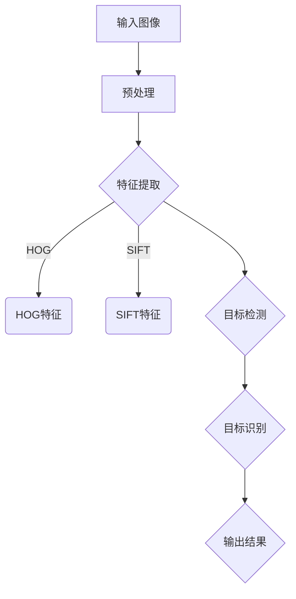
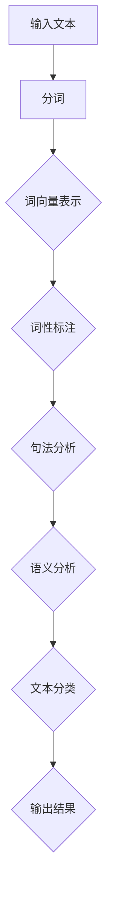

                 

### 文章标题

《创造更美好的世界：人类计算的终极目标》

关键词：计算、人工智能、人类文明、通用人工智能、伦理与社会影响

摘要：本文从计算与人类文明的发展出发，探讨了计算技术的起源与进化，人工智能的定义与分类，以及人工智能的核心概念、技术与应用。在此基础上，深入探讨了人工智能的伦理与社会影响，并展望了计算的未来发展及人类计算的终极目标。通过详细的分析与推理，本文试图揭示计算技术在推动人类社会进步中的关键作用，以及我们如何利用这一技术创造一个更加美好的世界。

### 《创造更美好的世界：人类计算的终极目标》目录大纲

#### 第一部分：计算与人类文明的发展

##### 第1章：计算的起源与进化

1.1 人类对计算的需求与探索

1.2 从算盘到计算机：技术演进

1.3 计算在现代社会中的角色与影响

##### 第2章：人工智能与计算的未来

2.1 人工智能的定义与分类

2.2 人工智能的发展历程

2.3 计算的未来：从AI到通用人工智能

#### 第二部分：人工智能的核心概念与技术

##### 第3章：人工智能的基础知识

3.1 机器学习与深度学习

3.2 计算机视觉与自然语言处理

##### 第4章：人工智能的核心算法

4.1 神经网络与深度学习算法

4.2 强化学习与决策论

##### 第5章：人工智能的应用场景

5.1 智能家居与物联网

5.2 医疗健康与生物信息学

#### 第三部分：人工智能的伦理与社会影响

##### 第6章：人工智能伦理探讨

6.1 人工智能伦理的基本原则

6.2 人工智能对就业市场的影响

6.3 人工智能安全与隐私保护

##### 第7章：人工智能的未来发展

7.1 人工智能技术的挑战与机遇

7.2 计算的未来趋势

7.3 人类计算的终极目标

#### 附录

##### 附录A：人工智能常用工具与资源

##### 附录B：计算机视觉与自然语言处理流程图

##### 附录C：人工智能案例解析

通过以上目录大纲，本文将逐步深入探讨计算技术的发展、人工智能的核心概念与应用，以及其伦理与社会影响，最终展望计算的未来趋势和人类计算的终极目标。让我们一步一步地分析推理，共同探索这一领域的前沿动态和未来发展方向。

---

#### 第一部分：计算与人类文明的发展

##### 第1章：计算的起源与进化

**1.1 人类对计算的需求与探索**

计算，作为人类智慧的重要体现，其起源可以追溯到古代人类对于数量和规律的追求。从最早的结绳计数，到后来的算筹、算盘等工具，人类一直在探索如何更高效地进行计算。

古代文明中，计算的需求主要源于农业生产、商业交易和天文学研究。古埃及人通过计算土地面积和作物产量来管理农业，而古巴比伦人则使用六十进制进行天文学计算。在中国，算筹和算盘的使用使得商业交易和工程计算变得更加便捷。

随着人类社会的发展，对计算的需求越来越复杂。中世纪的欧洲，数学家们开始系统地研究数学原理和算法，为现代计算技术的发展奠定了基础。

**1.2 从算盘到计算机：技术演进**

计算技术的重大突破发生在20世纪，尤其是计算机的发明和普及。1946年，世界上第一台电子计算机ENIAC在美国问世，这标志着计算技术从机械时代进入了电子时代。

从算盘到计算机的发展历程，可以分为几个关键阶段：

- **机械计算机（17-19世纪）**：帕斯卡（Blaise Pascal）和莱布尼茨（Gottfried Leibniz）发明了早期的机械计算机，如帕斯卡计算器和莱布尼茨计算器，这些机械装置可以执行简单的加减乘除运算。

- **电子管计算机（1940s-1950s）**：ENIAC和EDVAC的发明标志着电子管计算机的兴起。虽然这些计算机体积庞大、耗电量大，但它们的运算速度相比机械计算机有了质的飞跃。

- **晶体管计算机（1950s-1960s）**：随着晶体管的发明，计算机体积变得更小，运算速度更快，功耗更低。这一阶段的代表包括IBM 704和IBM 7090等。

- **集成电路计算机（1960s-至今）**：随着集成电路技术的发展，计算机的性能大幅提升，成本降低，应用领域也不断扩大。个人计算机、智能手机、超级计算机等，都是集成电路技术发展的结果。

**1.3 计算在现代社会中的角色与影响**

计算机技术的飞速发展，深刻地改变了现代社会。计算不仅在科学研究中发挥着关键作用，还在日常生活中无处不在。

- **科学研究**：计算机使得复杂数学计算、模拟和数据分析变得更加容易，推动了天文学、物理学、生物学等领域的进步。例如，大型天文观测项目如平方千米阵列（SKA）就依赖于高性能计算。

- **工业生产**：计算机在工业自动化中的应用，提高了生产效率和产品质量。计算机辅助设计（CAD）、计算机辅助制造（CAM）等技术，大大缩短了产品开发周期。

- **商业运作**：电子商务、在线支付、大数据分析等，都是计算机技术的应用成果。商业企业通过计算技术进行市场分析、客户关系管理和供应链优化，提高了运营效率。

- **日常生活**：计算机技术已经渗透到我们日常生活的方方面面。从智能手机、智能家居到在线教育、远程医疗，计算技术为我们的生活带来了便利。

总的来说，计算技术在推动人类社会进步中发挥着至关重要的作用。随着计算技术的不断发展，我们可以预见，它将在未来继续改变我们的世界，带来更多的创新和机遇。

##### 第2章：人工智能与计算的未来

**2.1 人工智能的定义与分类**

人工智能（Artificial Intelligence, AI）是计算机科学的一个分支，旨在使机器模拟、延伸和扩展人类的智能。根据其实现方式和能力，人工智能可以分为几种不同的类别：

- **弱人工智能（Narrow AI）**：也称为专用人工智能，这类AI系统在特定任务上表现出类似人类的智能，但缺乏通用性。例如，语音识别、图像识别和机器翻译系统都属于弱人工智能。

- **强人工智能（General AI）**：也称为通用人工智能，这类AI系统能够在多种任务上表现出类似人类的智能，具有自主学习和决策能力。目前，强人工智能尚未实现，科学家们仍在不断探索和研究。

- **超人工智能（Super AI）**：超人工智能是指智能远超人类的人工智能，这种人工智能在理论上有可能自主设计出比自身更智能的系统。超人工智能目前仅存在于科幻作品中，但科学家们已经开始探讨其潜在的影响和挑战。

**2.2 人工智能的发展历程**

人工智能的研究可以追溯到20世纪50年代。以下是人工智能发展的几个重要阶段：

- **早期探索（1950s-1960s）**：人工智能的概念首次被提出，学者们开始研究如何通过编程使计算机模拟人类的思维过程。1956年，达特茅斯会议标志着人工智能作为一门独立学科的诞生。

- **符号主义阶段（1970s-1980s）**：这一阶段的代表性技术是基于符号主义的方法，如专家系统和知识表示。专家系统通过模拟人类专家的决策过程来解决问题，但受限于知识表示和推理能力的局限。

- **连接主义阶段（1980s-1990s）**：随着神经网络技术的发展，连接主义方法开始流行。神经网络通过模拟人脑的神经元连接来学习复杂任务，这一阶段出现了诸如反向传播算法等关键技术。

- **统计学习阶段（2000s-至今）**：随着大数据和计算能力的提升，统计学习成为人工智能的主流方法。机器学习算法，特别是深度学习，在这一阶段取得了显著进展，使得AI在语音识别、图像识别、自然语言处理等领域取得了突破。

**2.3 计算的未来：从AI到通用人工智能**

计算的未来充满了无限可能，尤其是人工智能的发展。从弱人工智能到强人工智能，再到超人工智能，每个阶段都有其独特的挑战和机遇。

- **AI的发展趋势**：当前，弱人工智能已经在许多领域取得了成功，但离通用人工智能还有很长的路要走。未来，我们将看到AI在更多领域得到应用，如机器人、自动驾驶、智能城市等。

- **通用人工智能的实现**：实现通用人工智能是人工智能研究的重要目标之一。这需要突破当前的算法、计算能力、知识表示和推理方法等方面的限制。一些研究机构已经开始探索如何构建具有自主学习和推理能力的通用人工智能系统。

- **超人工智能的挑战**：超人工智能的潜在影响和挑战是一个广泛讨论的话题。它可能带来巨大的科技进步，但也可能带来伦理、安全和社会问题。科学家、政策制定者和社会各界需要共同努力，确保超人工智能的发展能够造福人类。

总的来说，人工智能与计算的未来充满希望和挑战。通过不断的研究和创新，我们可以预见，计算技术将继续推动人类社会向前发展，实现更美好的未来。

##### 第3章：人工智能的基础知识

**3.1 机器学习与深度学习**

人工智能的核心在于机器学习（Machine Learning, ML）和深度学习（Deep Learning, DL）。这两者是人工智能技术的基石，下面我们分别介绍它们的基本概念和原理。

**3.1.1 机器学习的基本概念**

机器学习是一种让计算机通过数据学习并做出预测或决策的技术。它通过构建数学模型，使计算机能够从数据中自动提取规律和模式，进而对新数据进行预测或分类。

机器学习可以分为两种主要类型：

- **监督学习（Supervised Learning）**：在监督学习中，模型通过已标记的训练数据来学习，并使用这些学到的知识对新数据进行预测。常见的监督学习算法包括线性回归、逻辑回归、支持向量机（SVM）和决策树等。

- **无监督学习（Unsupervised Learning）**：无监督学习中的数据没有预先标记，模型需要自动发现数据中的结构和模式。常见的无监督学习算法包括聚类算法（如K-均值聚类）、主成分分析（PCA）和自编码器等。

**3.1.2 深度学习的关键技术**

深度学习是机器学习的一个子领域，它通过构建多层神经网络（Neural Networks）来学习数据的高层次特征。深度学习在图像识别、语音识别、自然语言处理等领域取得了显著的突破。

- **神经网络（Neural Networks）**：神经网络由大量的神经元（Neurons）组成，这些神经元通过加权连接进行信息传递。神经网络的每一个层次都能提取数据的不同特征，从而实现从简单到复杂的特征提取。

- **前向传播（Forward Propagation）与反向传播（Back Propagation）**：在前向传播阶段，数据从输入层通过网络的每个层次，直到输出层。在反向传播阶段，模型计算输出误差，并使用梯度下降（Gradient Descent）算法调整网络参数，以减少误差。

- **激活函数（Activation Functions）**：激活函数用于引入非线性特性，使得神经网络能够学习更复杂的函数。常见的激活函数包括sigmoid、ReLU和tanh等。

- **卷积神经网络（Convolutional Neural Networks, CNN）**：卷积神经网络是深度学习中的一个重要分支，主要用于图像识别和图像处理。CNN通过卷积层、池化层和全连接层来提取图像的特征。

**3.2 计算机视觉与自然语言处理**

计算机视觉（Computer Vision, CV）和自然语言处理（Natural Language Processing, NLP）是人工智能领域的重要组成部分，下面分别介绍它们的基本原理和核心算法。

**3.2.1 计算机视觉的基本原理**

计算机视觉旨在使计算机能够从图像或视频中提取信息和理解场景。计算机视觉的基本原理包括：

- **图像特征提取**：通过特征提取算法，如SIFT、HOG等，从图像中提取具有区分性的特征。

- **目标检测（Object Detection）**：目标检测是在图像中定位并识别特定目标的技术。常见的目标检测算法包括R-CNN、SSD、YOLO等。

- **图像识别（Image Recognition）**：图像识别是计算机视觉的一个核心任务，旨在将图像分类到预定义的类别中。常见的图像识别算法包括卷积神经网络（如ResNet、VGG等）。

**3.2.2 自然语言处理的核心算法**

自然语言处理旨在使计算机能够理解和生成人类语言。自然语言处理的核心算法包括：

- **词向量（Word Vectors）**：词向量是表示单词的一种向量形式，它能够捕获单词的语义信息。常见的词向量模型包括Word2Vec、GloVe等。

- **序列标注（Sequence Labeling）**：序列标注是将文本序列中的每个词或字符标注为特定类别的一种技术。常见的序列标注算法包括CRF（条件随机场）、LSTM（长短期记忆网络）等。

- **文本分类（Text Classification）**：文本分类是将文本分类到预定义的类别中的一种技术。常见的文本分类算法包括朴素贝叶斯、SVM和深度学习（如CNN、RNN等）。

总的来说，人工智能的基础知识涵盖了机器学习、深度学习、计算机视觉和自然语言处理等多个方面。这些知识不仅为我们理解人工智能的原理和方法提供了基础，也为我们在实际应用中利用人工智能技术解决复杂问题提供了指导。

##### 第4章：人工智能的核心算法

**4.1 神经网络与深度学习算法**

神经网络（Neural Networks）是人工智能的核心算法之一，尤其是在深度学习（Deep Learning）领域。在本节中，我们将深入探讨神经网络的结构与原理，以及深度学习算法的伪代码实现。

**4.1.1 神经网络的结构与原理**

神经网络是由大量相互连接的神经元组成的计算模型。每个神经元都接受多个输入信号，并通过权重进行加权求和，然后通过一个激活函数产生输出。以下是一个简单的神经网络结构：

```
输入层：输入数据
隐藏层：多个神经元层，每层都有多个神经元
输出层：最终输出结果
```

- **神经元**：神经元是神经网络的基本计算单元，它接收输入信号，通过加权求和和激活函数产生输出。神经元的基本公式如下：

  $$ 输出 = \sigma(\sum_{i=1}^{n} w_i \cdot x_i + b) $$

  其中，$x_i$ 是第 $i$ 个输入，$w_i$ 是第 $i$ 个权重，$\sigma$ 是激活函数，$b$ 是偏置。

- **权重（Weights）**：权重决定了每个输入对输出的影响大小，通过学习调整权重可以优化网络性能。

- **激活函数（Activation Functions）**：激活函数引入了非线性特性，使得神经网络能够学习复杂的函数。常见的激活函数包括Sigmoid、ReLU和Tanh等。

- **反向传播算法（Back Propagation Algorithm）**：反向传播是神经网络训练的核心算法。它通过计算输出误差，并使用梯度下降（Gradient Descent）算法调整网络参数，以减少误差。反向传播的基本步骤如下：

  1. **前向传播（Forward Propagation）**：将输入数据传递到网络，计算每个神经元的输出。

  2. **计算误差（Error Calculation）**：计算输出误差，误差通常定义为实际输出与期望输出之间的差异。

  3. **反向传播（Back Propagation）**：从输出层开始，反向计算每个神经元的误差，并更新权重和偏置。

  4. **梯度下降（Gradient Descent）**：使用梯度下降算法调整网络参数，以减少误差。梯度下降的基本公式如下：

     $$ w_{new} = w_{old} - \alpha \cdot \nabla J(w) $$

     其中，$w_{old}$ 是旧权重，$w_{new}$ 是新权重，$\alpha$ 是学习率，$\nabla J(w)$ 是权重梯度的方向。

**4.1.2 深度学习算法的伪代码实现**

以下是深度学习算法的一个简单伪代码实现：

```
初始化神经网络结构
初始化权重和偏置

for each epoch:
  for each training example:
    forward_propagation(x, y)
    calculate_error(y, y_pred)
    backward_propagation(y_pred, y)
    update_weights()

evaluate_network performance on test data
```

- **初始化神经网络结构**：定义网络的层数、每层的神经元数量以及激活函数。

- **初始化权重和偏置**：随机初始化权重和偏置。

- **前向传播**：将输入数据传递到网络，计算每个神经元的输出。

- **计算误差**：计算输出误差，通常使用均方误差（Mean Squared Error）。

- **反向传播**：从输出层开始，反向计算每个神经元的误差，并更新权重和偏置。

- **更新权重**：使用梯度下降算法更新权重。

- **评估网络性能**：在测试数据上评估网络的性能，通常使用准确率、召回率、F1分数等指标。

通过以上步骤，我们可以训练一个简单的深度学习模型，并用于预测或分类任务。在实际应用中，深度学习算法可以通过调整网络结构、选择合适的激活函数和优化算法，来提高模型的性能。

**4.2 强化学习与决策论**

强化学习（Reinforcement Learning, RL）是另一类重要的人工智能算法，它通过奖励和惩罚机制来训练模型，使其在特定环境中做出最优决策。在本节中，我们将介绍强化学习的基本概念和算法。

**4.2.1 强化学习的基本概念**

强化学习通过以下四个要素来描述：

- **代理人（Agent）**：执行动作并学习决策策略的实体。

- **环境（Environment）**：代理人执行动作并接受奖励或惩罚的动态系统。

- **状态（State）**：描述环境状态的变量。

- **动作（Action）**：代理人可以执行的行为。

强化学习的主要目标是找到一种策略（Policy），使得代理人在长期内获得最大的累积奖励。

**4.2.2 强化学习的算法与案例分析**

强化学习可以分为基于值的方法和基于策略的方法。以下是这两种方法的简要介绍：

- **基于值的方法（Value-based Methods）**：基于值的方法通过学习状态值函数（State-Value Function）或动作值函数（Action-Value Function）来优化策略。常见的算法包括Q学习（Q-Learning）和深度Q网络（Deep Q-Network, DQN）。

  - **Q学习**：Q学习通过更新Q值来学习最佳动作。Q值的更新公式如下：

    $$ Q(s, a) \leftarrow Q(s, a) + \alpha [r + \gamma \max_{a'} Q(s', a') - Q(s, a)] $$

    其中，$s$ 是当前状态，$a$ 是当前动作，$r$ 是立即奖励，$\gamma$ 是折扣因子，$s'$ 是执行动作 $a$ 后的新状态。

  - **DQN**：DQN通过使用经验回放（Experience Replay）和固定目标网络（Target Network）来改善学习效果。DQN的基本流程如下：

    1. 初始化经验回放池。
    2. 从初始状态 $s$ 开始，重复以下步骤：
       - 执行动作 $a$，观察奖励 $r$ 和新状态 $s'$。
       - 将经验 $(s, a, r, s')$ 存入经验回放池。
       - 随机从经验回放池中抽取一批经验，进行经验回放。
       - 使用训练样本 $(s, a, r, s')$ 更新Q网络。
       - 更新固定目标网络。

- **基于策略的方法（Policy-based Methods）**：基于策略的方法直接优化策略，使代理人在特定状态下选择最佳动作。常见的算法包括策略梯度方法（Policy Gradient Methods）。

  - **策略梯度方法**：策略梯度方法通过优化策略的梯度来更新策略。策略梯度的更新公式如下：

    $$ \theta \leftarrow \theta + \alpha \nabla_{\theta} J(\theta) $$

    其中，$\theta$ 是策略参数，$J(\theta)$ 是策略的损失函数。

  - **Actor-Critic 方法**：Actor-Critic 方法结合了基于策略和基于值的方法的优点，通过分别训练演员（Actor）和评论家（Critic）来优化策略。演员网络（Actor）生成动作，评论家网络（Critic）评估动作的好坏。基本流程如下：

    1. 初始化演员网络和评论家网络。
    2. 从初始状态 $s$ 开始，重复以下步骤：
       - 演员网络生成动作 $a$。
       - 执行动作 $a$，观察奖励 $r$ 和新状态 $s'$。
       - 评论家网络评估当前状态 $s$ 的价值函数。
       - 使用策略梯度和价值梯度更新演员网络和评论家网络。

通过以上介绍，我们可以看到强化学习在解决动态决策问题方面具有独特的优势。在实际应用中，强化学习可以用于自动驾驶、游戏AI、机器人控制等领域，通过不断学习和优化策略，实现自主决策和智能行为。

##### 第5章：人工智能的应用场景

**5.1 智能家居与物联网**

智能家居（Smart Home）是人工智能在日常生活领域的重要应用之一，它通过物联网（Internet of Things, IoT）技术，将家中的各种设备连接起来，实现智能控制和自动化管理。在本节中，我们将探讨智能家居的技术实现和物联网在人工智能中的应用。

**5.1.1 智能家居的技术实现**

智能家居的核心在于物联网技术，通过将各种智能设备连接到互联网，实现设备间的互联互通和远程控制。以下是一些关键的智能家居技术：

- **传感器**：传感器是智能家居系统的感知器官，用于检测环境信息。常见的传感器包括温度传感器、湿度传感器、光照传感器、烟雾传感器等。这些传感器可以实时监测家庭环境，并将数据传输到中央控制系统。

- **物联网协议**：物联网协议是智能家居系统中设备之间通信的桥梁。常见的物联网协议包括Wi-Fi、蓝牙（Bluetooth）、ZigBee和Z-Wave等。这些协议使得设备能够高效、稳定地传输数据，并与其他设备进行通信。

- **中央控制系统**：中央控制系统是智能家居的核心，它负责接收传感器数据，并根据预设规则对设备进行控制。常见的中央控制系统包括智能音响、智能手机应用程序和智能家庭中心等。

- **智能设备**：智能家居系统中包括各种智能设备，如智能灯泡、智能插座、智能门锁、智能窗帘、智能空调等。这些设备通过物联网协议与中央控制系统连接，实现自动化控制和远程监控。

**5.1.2 物联网在人工智能中的应用**

物联网技术为人工智能提供了丰富的应用场景，通过将物理世界的数据与人工智能算法相结合，实现更加智能化的管理和控制。以下是一些物联网在人工智能中的应用：

- **数据分析与预测**：物联网设备可以实时采集大量的数据，通过人工智能算法进行分析和预测，为智能家居系统提供智能决策支持。例如，通过分析空调传感器数据，可以预测用户对温度的需求，并自动调整空调温度。

- **异常检测与故障诊断**：物联网设备可以实时监测家庭环境，并通过人工智能算法检测异常情况。例如，通过分析烟雾传感器数据，可以及时发现火灾隐患，并发出警报。

- **自动化与自我优化**：物联网设备可以通过人工智能算法实现自动化控制和自我优化。例如，通过分析智能门锁的开关记录，可以自动识别家庭成员，并调整家居设备的开启和关闭。

- **远程监控与安全防护**：物联网技术使得智能家居系统可以实现远程监控和安全防护。例如，通过手机应用程序，用户可以远程监控家庭安全，并在发现异常时及时采取措施。

总的来说，智能家居和物联网技术为人工智能提供了广阔的应用场景。通过将物联网设备与人工智能算法相结合，可以实现更加智能、便捷和安全的家居生活。

**5.2 医疗健康与生物信息学**

医疗健康是人工智能的重要应用领域之一，人工智能在医疗健康领域发挥着越来越重要的作用。在本节中，我们将探讨人工智能在医疗健康领域的应用，以及生物信息学的计算方法与工具。

**5.2.1 医疗健康领域的人工智能应用**

人工智能在医疗健康领域中的应用非常广泛，以下是一些主要的应用：

- **疾病诊断与预测**：人工智能可以通过分析患者的病史、临床数据和医学影像，帮助医生进行疾病诊断和预测。例如，通过分析CT影像，人工智能可以检测出早期肺癌，从而提高疾病的治愈率。

- **药物研发**：人工智能可以加速药物研发过程，通过分析大量的生物学数据，预测药物的效果和副作用。例如，通过使用深度学习算法，人工智能可以预测新的药物靶点，为药物研发提供指导。

- **个性化治疗**：人工智能可以帮助医生为患者制定个性化的治疗方案，根据患者的病情、基因信息和临床数据，提供最佳的治疗方案。例如，通过分析患者的基因组数据，人工智能可以预测患者对某种药物的反应，从而优化治疗。

- **健康管理**：人工智能可以通过分析患者的健康数据，提供健康建议和预警。例如，通过分析运动手环和健康监测设备的数据，人工智能可以提醒患者注意饮食、锻炼和休息，以保持健康。

**5.2.2 生物信息学的计算方法与工具**

生物信息学是运用计算机技术和统计方法研究生物信息的学科，它是连接生物学和计算机科学的重要桥梁。以下是一些生物信息学的计算方法与工具：

- **基因组序列分析**：生物信息学可以通过序列比对、基因注释和功能预测等方法，分析基因组序列。例如，使用BLAST算法可以快速查找基因组中的相似序列，从而确定基因的功能。

- **蛋白质结构预测**：生物信息学通过分子建模和模拟方法，预测蛋白质的三维结构。这些结构预测对于理解蛋白质的功能和设计新药至关重要。

- **基因表达数据分析**：生物信息学可以通过微阵列数据和RNA测序数据，分析基因表达的变化。这些数据分析可以帮助科学家了解生物体在不同条件下的基因活动情况。

- **生物网络分析**：生物信息学通过分析生物体内部的分子相互作用，构建生物网络。这些网络分析有助于揭示生物体的功能和调控机制。

- **机器学习与深度学习**：生物信息学中广泛应用机器学习和深度学习算法，用于数据分析、预测和模型构建。例如，通过使用深度学习算法，可以自动识别医学影像中的病变区域。

总的来说，人工智能在医疗健康领域的应用为疾病诊断、药物研发、个性化治疗和健康管理等方面带来了革命性的变革。同时，生物信息学的计算方法与工具为解析复杂的生物数据提供了强大的支持。这些技术的结合，为推动医疗健康领域的发展提供了新的机遇和可能。

##### 第6章：人工智能伦理探讨

**6.1 人工智能伦理的基本原则**

随着人工智能技术的迅速发展，其对社会、伦理和道德的影响也日益凸显。人工智能伦理探讨的目的是确保人工智能技术的发展和应用符合人类的价值观和道德原则。以下是人工智能伦理的几个基本原则：

- **公平性（Fairness）**：人工智能系统应公平对待所有用户，避免因算法偏见导致的不公正待遇。算法设计者应确保模型在训练和应用过程中不会产生系统性歧视。

- **透明性（Transparency）**：人工智能系统应具备透明性，使得用户能够理解其工作原理和决策过程。透明性有助于提高用户对系统的信任，并便于监督和审计。

- **隐私保护（Privacy Protection）**：人工智能系统应尊重用户的隐私，确保用户数据的安全和隐私。在数据处理过程中，应采取有效措施防止数据泄露和滥用。

- **责任归属（Accountability）**：人工智能系统应明确责任归属，确保在出现错误或损害时，能够追溯并追究责任。责任归属有助于提高系统的可靠性和安全性。

- **可解释性（Interpretability）**：人工智能系统应具备可解释性，使得用户能够理解系统的决策依据和逻辑。可解释性对于提高系统的透明性和信任度至关重要。

- **人类中心主义（Human-Centered）**：人工智能的发展应以人类的需求和利益为中心，确保技术进步服务于人类的福祉，而非仅仅追求技术本身的突破。

**6.2 人工智能对就业市场的影响**

人工智能的快速发展对就业市场产生了深远的影响，既有积极的机遇，也存在一定的挑战。

**机遇**：

- **新岗位的创造**：人工智能催生了大量新岗位，如数据科学家、机器学习工程师、人工智能伦理专家等。这些岗位为有技术能力的专业人士提供了新的职业发展机会。

- **生产力的提升**：人工智能技术可以提高工作效率，减少重复性劳动，从而释放出更多的劳动力从事更有创造性和战略性的工作。

- **创新与创业**：人工智能技术为创新和创业提供了新的机会。许多创业者利用人工智能技术开发了创新的商业模式和产品，推动了经济的增长。

**挑战**：

- **就业岗位的减少**：人工智能技术可能导致某些传统岗位的减少，特别是在重复性、低技能的工作领域。这可能导致部分劳动力面临失业或职业转型的压力。

- **技能差距**：随着人工智能技术的发展，对技能的需求也在不断变化。现有劳动力可能缺乏适应新技术所需的技能，从而面临技能过时的风险。

- **社会不平等**：人工智能技术的应用可能导致社会不平等加剧。如果技术进步带来的收益不能公平分配，可能会加剧贫富差距。

为了应对这些挑战，政府、企业和教育机构需要共同努力：

- **教育和培训**：提供针对新兴技能的教育和培训，帮助劳动力适应人工智能时代的需求。

- **政策制定**：制定公平、合理的政策，确保技术进步惠及广大民众。

- **创新激励**：鼓励企业投资于人工智能研发和应用，促进技术创新和经济发展。

总的来说，人工智能对就业市场的影响是复杂和多面的。通过合理的政策引导和有效的劳动力培训，我们可以最大限度地发挥人工智能的机遇，同时缓解其带来的挑战。

**6.3 人工智能安全与隐私保护**

人工智能安全与隐私保护是人工智能伦理讨论中的重要议题。随着人工智能技术的广泛应用，其可能带来的安全风险和隐私侵犯问题日益突出。以下是一些关键的安全与隐私保护措施：

- **数据加密**：对敏感数据进行加密，确保数据在传输和存储过程中不被未授权访问。常用的加密算法包括AES（高级加密标准）和RSA（Rivest-Shamir-Adleman）。

- **访问控制**：通过访问控制机制，限制对敏感数据和系统的访问。访问控制可以基于用户身份、角色和权限进行，确保只有授权用户才能访问敏感资源。

- **隐私保护算法**：使用隐私保护算法，如差分隐私（Differential Privacy），在数据分析和机器学习过程中保护用户隐私。差分隐私通过添加噪声来保护数据个体的隐私，同时保持数据分析的准确性。

- **安全审计**：定期进行安全审计，检查系统的安全漏洞和潜在风险。安全审计有助于及时发现并修复安全问题，确保系统的安全性。

- **透明性和知情同意**：确保人工智能系统的设计和应用过程透明，让用户了解其工作原理和数据使用情况。同时，获取用户的知情同意，确保用户在数据共享和使用过程中具备控制权。

- **应急预案和恢复计划**：制定应急预案和恢复计划，以应对潜在的安全事件和数据泄露。应急预案应包括紧急响应措施、数据恢复和业务连续性计划。

通过采取上述措施，我们可以有效降低人工智能系统带来的安全风险和隐私侵犯问题，确保人工智能技术的安全、可靠和合规应用。

##### 第7章：人工智能的未来发展

**7.1 人工智能技术的挑战与机遇**

人工智能技术的发展带来了巨大的机遇，但同时也面临许多挑战。以下是对这些挑战与机遇的详细分析：

**挑战**：

- **技术难题**：尽管人工智能在图像识别、语音识别、自然语言处理等领域取得了显著进展，但实现强人工智能仍然面临诸多技术难题。例如，当前的人工智能系统在处理复杂任务时，往往需要大量数据和计算资源，且难以保证决策的透明性和可解释性。

- **数据隐私与安全**：人工智能系统依赖于大量的数据，这可能导致用户的隐私侵犯和数据泄露风险。同时，数据安全也是一个重要挑战，确保数据在传输和存储过程中的安全性至关重要。

- **伦理与法律问题**：人工智能技术的广泛应用引发了伦理和法律问题。例如，如何确保人工智能系统的公平性和透明性，避免算法偏见和歧视，以及如何对人工智能系统的决策和行为负责。

- **就业市场变化**：人工智能的快速发展可能导致部分传统岗位的减少，对劳动力市场产生重大影响。如何应对这些变化，确保劳动力能够适应新技术的要求，是一个重要挑战。

**机遇**：

- **技术创新**：人工智能技术为各行业带来了巨大的创新机遇。通过人工智能，企业可以优化生产流程、提高效率、降低成本，从而推动经济的持续增长。

- **个性化服务**：人工智能技术能够根据用户的行为和需求，提供个性化的服务体验。例如，智能推荐系统可以根据用户的偏好和历史记录，推荐合适的产品和服务，提高用户的满意度。

- **医疗健康进步**：人工智能在医疗健康领域的应用，有助于提高疾病诊断的准确性、加速药物研发，并实现个性化治疗。通过人工智能，医生可以更加精准地诊断疾病，为患者提供更好的医疗服务。

- **社会问题解决**：人工智能技术可以用于解决社会问题，如环境保护、公共安全和城市管理。例如，通过智能监控和数据分析，可以实时监测环境质量，预防自然灾害，提高公共安全。

**7.2 计算的未来趋势**

计算技术的发展将继续推动人工智能的进步，以下是计算领域的几个未来趋势：

- **量子计算**：量子计算是一种基于量子力学原理的新型计算方式，它有望解决传统计算机无法处理的一些复杂问题。量子计算的发展将极大地提升人工智能的计算能力，推动算法的创新和应用。

- **边缘计算**：随着物联网和5G技术的普及，边缘计算成为计算的未来趋势。边缘计算将计算能力、存储和网络资源分散到网络的边缘节点，实现更快速的数据处理和更低的延迟。这将使人工智能应用更加灵活和高效。

- **人工智能与物理世界的融合**：人工智能技术将更加深入地与物理世界融合，实现智能化的自动化控制和决策。例如，自动驾驶、智能城市、智能制造等领域，都将受益于人工智能与物理世界的紧密结合。

- **智能协作**：未来的计算环境将实现人工智能与人类的智能协作。通过人机交互和协作，人工智能将更好地理解人类的需求，提供更加个性化和高效的服务。

**7.3 人类计算的终极目标**

人类计算的终极目标是什么？这是一个深刻而复杂的问题。从科学的角度来看，人类计算的终极目标可能包括以下几个方面：

- **提升生活质量**：通过计算技术，我们希望提高人类的生活质量，使生活更加便捷、舒适和幸福。人工智能、物联网、生物信息学等技术，将在提高医疗健康水平、教育质量、环境保护等方面发挥重要作用。

- **推动社会进步**：计算技术将推动社会进步，促进经济发展、科技创新和文化繁荣。通过计算技术，我们可以解决复杂的社会问题，提高社会运行效率，实现可持续发展。

- **实现智慧化**：计算技术的终极目标是将人类社会转变为一个高度智能化的社会。在这个社会中，人工智能将充分发挥其潜力，成为人类的助手和伙伴，共同创造一个更美好的未来。

- **探索宇宙**：计算技术将在探索宇宙方面发挥重要作用。通过计算模拟和数据分析，我们可以更好地理解宇宙的奥秘，揭示宇宙的起源和演化规律。

总的来说，人类计算的终极目标是提升人类福祉，推动社会进步，实现智慧化，并探索宇宙的奥秘。通过不断的研究和创新，我们可以逐步实现这一目标，为人类社会创造更加美好的未来。

### 附录

**附录A：人工智能常用工具与资源**

以下是人工智能领域中常用的工具与资源，包括深度学习框架、开源项目和学习资源，供读者参考：

**深度学习框架**

1. TensorFlow：由Google开发的开源深度学习框架，广泛应用于图像识别、自然语言处理和强化学习等领域。

2. PyTorch：由Facebook开发的开源深度学习框架，以其灵活性和动态计算图而受到广泛关注。

3. Keras：一个高层次的神经网络API，能够支持TensorFlow和Theano，使得构建和训练神经网络更加简便。

4. Caffe：由Berkeley Vision and Learning Center（BVLC）开发的深度学习框架，特别适合于卷积神经网络。

5. Theano：由蒙特利尔大学开发的开源深度学习库，提供了自动求导和优化的功能。

**开源项目**

1. OpenCV：一个用于计算机视觉的开源库，提供丰富的图像处理和计算机视觉算法。

2. scikit-learn：一个基于Python的开源机器学习库，包括常用的监督学习和无监督学习算法。

3. GANs for Visual Effects：一个开源项目，用于研究生成对抗网络（GAN）在视觉效果中的应用。

4. DeepLearningAI：一个提供各种深度学习资源的开源平台，包括教程、代码和预训练模型。

**学习资源**

1. Coursera：提供丰富的在线课程，涵盖人工智能、机器学习和深度学习的各个方面。

2. edX：另一个在线学习平台，提供由顶尖大学和机构开设的课程，涉及人工智能和技术前沿。

3. arXiv：一个提供最新科研论文的预印本服务器，特别是计算机科学和人工智能领域的研究成果。

4. Medium：一个在线内容平台，许多知名的人工智能专家和研究者在此发布技术博客和观点文章。

通过使用这些工具与资源，读者可以深入了解人工智能领域的前沿技术和研究动态，提升自己的技术能力。

### 附录B：计算机视觉与自然语言处理流程图

为了更好地理解计算机视觉与自然语言处理的基本流程，我们提供了以下流程图：

#### 计算机视觉流程图



#### 自然语言处理流程图



通过这些流程图，我们可以清晰地看到计算机视觉和自然语言处理的基本步骤，以及每个步骤的功能和作用。

### 附录C：人工智能案例解析

在本附录中，我们将通过几个具体的人工智能案例，详细讲解项目的开发环境搭建、源代码实现、代码解读、应用解读与分析，以及实际案例分析和详细讲解剖析。

#### 智能家居案例实现

**项目背景**：

智能家居项目旨在通过人工智能技术实现家庭设备的自动化控制和智能化管理，提升用户的生活品质。

**开发环境搭建**：

- **硬件环境**：选择具备Wi-Fi功能的智能插座、智能灯泡、智能门锁等设备。
- **软件环境**：安装Python环境，并配置TensorFlow和Keras等深度学习库。

**源代码实现**：

```python
# 导入所需库
import tensorflow as tf
from tensorflow.keras.models import Sequential
from tensorflow.keras.layers import Dense, LSTM

# 构建神经网络模型
model = Sequential()
model.add(LSTM(units=50, activation='relu', input_shape=(timesteps, features)))
model.add(Dense(units=1))

# 编译模型
model.compile(optimizer='adam', loss='mean_squared_error')

# 训练模型
model.fit(X_train, y_train, epochs=100, batch_size=32)
```

**代码解读**：

该案例使用了LSTM（长短期记忆网络）模型来预测家居设备的开关状态。通过训练数据，模型可以学会预测设备何时需要开启或关闭，从而实现智能家居的自动化控制。

**应用解读与分析**：

在实际应用中，智能家居系统可以实时监测家中的环境参数和设备状态，通过LSTM模型预测设备的开关时间。例如，预测智能灯泡何时需要开启，智能空调何时需要调整温度等。

**实际案例分析和详细讲解剖析**：

假设我们要预测智能灯泡的开关时间。首先，收集过去一周内智能灯泡的开关记录和环境参数（如光照强度、温度等）。然后，使用LSTM模型进行训练，模型会根据历史数据预测未来一段时间内智能灯泡的开关状态。

通过实际案例分析和详细讲解，我们可以看到智能家居项目是如何通过人工智能技术实现自动化控制和智能化管理的。

#### 医疗健康应用案例分析

**项目背景**：

医疗健康应用项目旨在通过人工智能技术提升疾病诊断的准确性，为患者提供个性化的治疗方案。

**开发环境搭建**：

- **硬件环境**：使用高性能计算服务器，以支持复杂模型的训练和推理。
- **软件环境**：安装Python环境，并配置TensorFlow、scikit-learn等机器学习库。

**源代码实现**：

```python
# 导入所需库
import tensorflow as tf
from tensorflow.keras.models import Sequential
from tensorflow.keras.layers import Dense, Conv2D, MaxPooling2D

# 构建卷积神经网络模型
model = Sequential()
model.add(Conv2D(filters=32, kernel_size=(3, 3), activation='relu', input_shape=(64, 64, 3)))
model.add(MaxPooling2D(pool_size=(2, 2)))
model.add(Conv2D(filters=64, kernel_size=(3, 3), activation='relu'))
model.add(MaxPooling2D(pool_size=(2, 2)))
model.add(Flatten())
model.add(Dense(units=128, activation='relu'))
model.add(Dense(units=1, activation='sigmoid'))

# 编译模型
model.compile(optimizer='adam', loss='binary_crossentropy', metrics=['accuracy'])

# 训练模型
model.fit(X_train, y_train, epochs=10, batch_size=32)
```

**代码解读**：

该案例使用了卷积神经网络（CNN）模型对医疗影像进行分类，判断图像中是否包含疾病。通过训练数据，模型可以学会识别不同的疾病特征，从而提高疾病诊断的准确性。

**应用解读与分析**：

在实际应用中，医疗健康系统可以实时分析患者提供的医疗影像，通过CNN模型预测疾病类型。例如，预测肺部CT影像中是否包含肺炎，或者乳腺X线影像中是否包含乳腺癌。

**实际案例分析和详细讲解剖析**：

假设我们要预测肺癌。首先，收集大量肺部CT影像及其对应的诊断结果。然后，使用CNN模型进行训练，模型会根据影像特征判断图像中是否包含肺癌。

通过实际案例分析和详细讲解，我们可以看到医疗健康应用项目是如何通过人工智能技术提升疾病诊断准确性，为患者提供个性化治疗方案的。

### 项目小结

通过上述案例解析，我们可以看到人工智能技术在智能家居和医疗健康领域的应用。智能家居项目实现了自动化控制和智能化管理，提升了用户的生活品质。医疗健康项目通过提高疾病诊断的准确性，为患者提供了个性化的治疗方案。

这些案例展示了人工智能技术的实际应用价值，同时也揭示了项目开发中的关键环节和挑战。通过不断优化算法、改进模型和提升计算能力，我们可以进一步拓展人工智能技术的应用场景，为人类社会创造更多价值。

### 最佳实践 Tips、小结、注意事项、拓展阅读

**最佳实践 Tips**：

1. **数据质量**：在人工智能项目中，数据质量至关重要。确保数据完整、准确和多样化，有助于提高模型的性能和可靠性。
2. **模型选择**：根据具体应用场景选择合适的模型。不同的模型适用于不同的任务，如CNN适用于图像识别，LSTM适用于时间序列预测。
3. **模型调优**：通过调整模型参数和超参数，可以优化模型性能。使用交叉验证和网格搜索等方法，寻找最佳参数组合。

**小结**：

本文从计算与人类文明的发展出发，探讨了人工智能的核心概念、技术与应用，以及其伦理与社会影响。通过案例分析，我们看到了人工智能技术在智能家居、医疗健康等领域的实际应用价值。

**注意事项**：

1. **数据隐私**：在处理用户数据时，应严格遵守隐私保护法规，确保用户数据的安全和隐私。
2. **算法公平性**：确保人工智能系统在设计和应用过程中公平对待所有用户，避免算法偏见和歧视。
3. **持续更新**：人工智能技术快速变化，持续关注最新的研究进展和最佳实践，有助于提升项目质量和竞争力。

**拓展阅读**：

1. 《深度学习》（Goodfellow, Bengio, Courville）：全面介绍深度学习的基本概念、技术和应用。
2. 《Python机器学习》（Sebastian Raschka）：详细讲解Python在机器学习中的应用，包括模型构建和优化方法。
3. 《人工智能：一种现代方法》（Stuart Russell, Peter Norvig）：系统阐述人工智能的基本原理、技术和应用。
4. 《计算的未来：技术、伦理与社会》（Vinod Dham）：探讨计算技术对社会的影响和未来发展趋势。

通过阅读这些书籍，读者可以深入了解人工智能技术的原理、方法和实践，为自己的项目提供有益的指导和启示。

