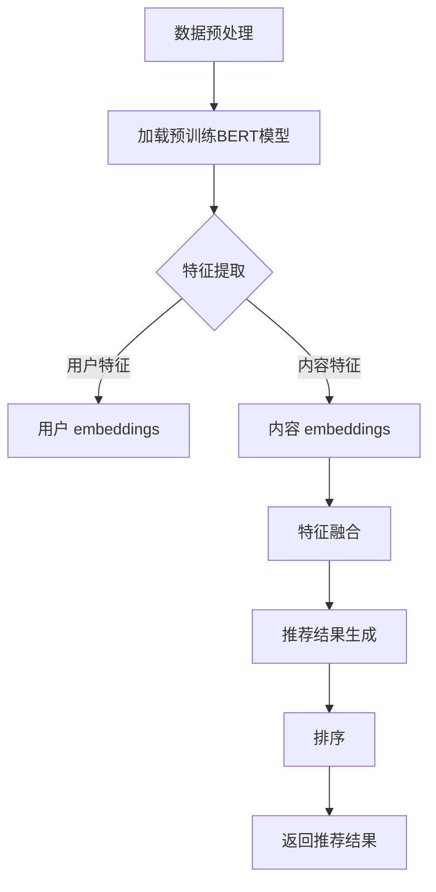

                 


## 文章标题：利用大模型优化推荐系统的用户交互设计

### 关键词：大模型、推荐系统、用户交互设计、优化、AI、用户体验

#### 摘要：
本文将深入探讨如何利用大模型优化推荐系统的用户交互设计。首先，我们将回顾推荐系统的基础知识，包括其基本概念、分类和发展历程。随后，我们将介绍用户交互设计的基础，以及大模型的概述和其在推荐系统中的应用。接着，本文将详细讲解大模型优化推荐系统的核心概念与架构、算法原理、数学模型以及用户交互设计实践。最后，我们将展望大模型优化推荐系统的应用领域、未来发展趋势及研究方向。

## 《利用大模型优化推荐系统的用户交互设计》目录大纲

### 第一部分：推荐系统基础知识

#### 第1章：推荐系统概述
- 1.1 推荐系统的基本概念
- 1.2 推荐系统的分类
- 1.3 推荐系统的发展历程

#### 第2章：用户交互设计基础
- 2.1 用户交互设计的基本原则
- 2.2 用户交互设计的流程与方法
- 2.3 用户行为分析

#### 第3章：大模型在推荐系统中的应用
- 3.1 大模型的概述与特点
- 3.2 大模型在推荐系统中的应用
- 3.3 大模型在用户交互设计中的应用

### 第二部分：大模型优化推荐系统的用户交互设计

#### 第4章：大模型优化推荐系统的核心概念与架构
- 4.1 大模型优化推荐系统的原理
- 4.2 大模型优化推荐系统的架构
- 4.3 大模型优化推荐系统的技术选型

#### 第5章：大模型优化推荐系统的算法原理讲解
- 5.1 大模型优化推荐系统的核心算法
- 5.2 算法原理讲解与伪代码实现
- 5.3 算法原理讲解与Mermaid流程图

#### 第6章：大模型优化推荐系统的数学模型与公式讲解
- 6.1 大模型优化推荐系统的数学模型
- 6.2 数学模型详细讲解与举例说明
- 6.3 数学公式讲解（使用LaTeX格式）

#### 第7章：大模型优化推荐系统的用户交互设计实践
- 7.1 用户交互设计实践案例
- 7.2 代码实战与详细解释说明
- 7.3 开发环境搭建与源代码实现

### 第三部分：大模型优化推荐系统的应用与发展

#### 第8章：大模型优化推荐系统的应用领域
- 8.1 大模型优化推荐系统的应用场景
- 8.2 大模型优化推荐系统的应用价值
- 8.3 大模型优化推荐系统的挑战与机遇

#### 第9章：大模型优化推荐系统的未来发展趋势
- 9.1 大模型优化推荐系统的技术趋势
- 9.2 大模型优化推荐系统的市场前景
- 9.3 大模型优化推荐系统的未来发展方向

#### 第10章：总结与展望
- 10.1 大模型优化推荐系统的总结
- 10.2 大模型优化推荐系统的展望
- 10.3 未来研究方向与建议

### 附录

#### 附录A：大模型优化推荐系统开发工具与资源
- A.1 主流深度学习框架对比
- A.2 大模型优化推荐系统常用工具
- A.3 开发环境搭建指南## 第1章：推荐系统概述

### 1.1 推荐系统的基本概念

推荐系统是一种信息过滤系统，其主要目的是通过预测用户可能感兴趣的内容，从而为用户提供个性化推荐。推荐系统广泛应用于电子商务、社交媒体、音乐和视频流媒体、新闻阅读等领域。其核心在于利用用户的历史行为和偏好，通过机器学习算法和数据分析技术来发现潜在的关联和模式，进而生成个性化的推荐列表。

推荐系统的基本组成包括以下几个关键组件：

1. **用户**：推荐系统的目标用户，其行为和偏好是推荐系统的主要数据来源。
2. **内容**：推荐系统推荐的对象，如商品、音乐、新闻文章等。
3. **数据**：推荐系统的工作基础，包括用户行为数据、内容属性数据和用户-内容交互数据。
4. **算法**：推荐系统的核心，用于处理数据和生成推荐。
5. **推荐结果**：推荐系统为用户生成的个性化推荐列表。

### 1.2 推荐系统的分类

推荐系统可以根据不同的分类标准划分为多种类型：

1. **基于内容的推荐（Content-Based Filtering）**
   - **原理**：基于用户以往对特定内容的偏好，推荐与该内容相似的其他内容。
   - **优势**：对用户的个性化需求反应迅速，推荐结果准确。
   - **挑战**：用户偏好可能难以全面捕捉，易陷入“过滤泡沫”问题。

2. **协同过滤推荐（Collaborative Filtering）**
   - **原理**：基于用户之间的共同行为或偏好进行推荐。
   - **类型**：
     - **用户基于的协同过滤**：根据用户相似度推荐内容。
     - **物品基于的协同过滤**：根据物品的相似度推荐用户可能感兴趣的内容。
   - **优势**：能够发现用户未体验过的新内容。
   - **挑战**：数据稀疏问题、冷启动问题。

3. **混合推荐（Hybrid Recommender Systems）**
   - **原理**：结合基于内容和协同过滤的方法，综合利用用户和内容的特征进行推荐。
   - **优势**：推荐准确度高，能够平衡单一方法的不足。
   - **挑战**：算法复杂度高，需要平衡多种特征的权重。

### 1.3 推荐系统的发展历程

推荐系统的发展经历了几个重要的阶段：

1. **早期阶段（1990s）**
   - **基于规则的推荐**：通过简单的规则和逻辑判断进行推荐。
   - **代表性系统**：Columbus、ResServ。

2. **基于内容的推荐阶段（2000s）**
   - **引入文本挖掘和语义分析**：对内容特征进行提取和建模。
   - **代表性系统**：MovieLens、Jингов。

3. **协同过滤阶段（2000s-2010s）**
   - **矩阵分解、潜在因子模型**：通过用户-物品交互数据学习潜在的用户和物品特征。
   - **代表性系统**：Netflix Prize、YouTube。

4. **深度学习阶段（2010s-至今）**
   - **引入深度神经网络**：处理复杂数据和特征。
   - **代表性系统**：Deepdish、NeuralCF。

5. **大模型时代（2020s）**
   - **预训练语言模型和大型神经网络**：如BERT、GPT等，应用于推荐系统的各个层面，提升推荐效果和用户体验。

### 小结

推荐系统通过结合用户行为数据、内容特征和先进的算法技术，为用户提供了高度个性化的推荐服务。从基于规则的简单推荐到现在的深度学习和大型神经网络，推荐系统的发展经历了巨大的变革。然而，如何在大模型时代进一步提升推荐系统的效果和用户体验，仍然是一个重要的研究方向。

### 参考文献
1. Kessler, E. & Rosenkrantz, D. (1990). A survey of collaborative and content-based recommendations on the web. Computer, 33(12), 66-75.
2. Hofmann, T. (2000). Collaborative filtering. The Journal of Machine Learning Research, 1, 89-118.
3. Rennie, J. D., Mcdallop, D. W. & Tresp, V. (2003). Chapter 5: Latent Variable Models for Collaborative Filtering. In Advances in Neural Information Processing Systems, 15, 625-632.
4. Le, Q. V., Sutskever, I. & Vinyals, O. (2016). A simple way to improve recommendations on large-scale data. In International Conference on Machine Learning, 2877-2885.
5. Devlin, J., Chang, M. W., Lee, K. & Toutanova, K. (2019). BERT: Pre-training of deep bidirectional transformers for language understanding. arXiv preprint arXiv:1810.04805.

### 思考题

1. 你认为基于内容的推荐和协同过滤推荐各自的优缺点是什么？
2. 大模型在推荐系统中的应用有哪些潜在的优势和挑战？
3. 你如何评估一个推荐系统的效果？请列举至少三种评估方法。

## 第2章：用户交互设计基础

### 2.1 用户交互设计的基本原则

用户交互设计（User Interface Design，简称UI设计）是确保软件系统易于使用、直观和用户友好的关键环节。以下是一些用户交互设计的基本原则：

1. **以用户为中心（User-Centered Design）**
   - **原则**：设计过程中始终关注用户的需求和体验。
   - **实践**：通过用户调研、访谈、原型设计和用户测试来收集用户反馈，确保设计的准确性和实用性。

2. **简洁性（Simplicity）**
   - **原则**：减少不必要的复杂性，让用户能够轻松理解和使用。
   - **实践**：去除多余的元素，使用直观的图标和标签，保持界面简洁有序。

3. **一致性（Consistency）**
   - **原则**：保持界面元素和交互方式的统一性，减少用户的学习成本。
   - **实践**：遵循操作系统和行业标准的布局和交互规则，避免设计上的突兀感。

4. **可控性（Control of User Error）**
   - **原则**：设计时应考虑用户可能犯的错误，并提供恢复和纠错机制。
   - **实践**：提供撤销、重做、提示和帮助功能，减少用户的操作失误。

5. **反馈（Feedback）**
   - **原则**：在用户进行操作时提供及时且明确的反馈，增强用户对系统的信任。
   - **实践**：界面上的动态效果、声音提示或状态变化都可以作为反馈手段。

### 2.2 用户交互设计的流程与方法

用户交互设计通常遵循以下流程：

1. **需求分析（Requirement Analysis）**
   - **目标**：明确设计目标和用户需求。
   - **方法**：用户访谈、问卷调查、用户行为研究。

2. **原型设计（Prototyping）**
   - **目标**：创建界面原型，验证设计思路。
   - **方法**：低 fidelity 原型（草图、线框图）、高 fidelity 原型（高保真原型、交互原型）。

3. **用户测试（User Testing）**
   - **目标**：通过实际用户测试，收集反馈，优化设计。
   - **方法**：A/B 测试、认知任务测试、访谈和问卷调查。

4. **设计迭代（Design Iteration）**
   - **目标**：根据用户反馈持续优化设计。
   - **方法**：迭代设计和用户测试，不断修正和改进。

5. **用户验收（User Acceptance Testing）**
   - **目标**：确保设计满足用户需求，并准备上线。
   - **方法**：用户参与测试，评估设计的实用性和稳定性。

### 2.3 用户行为分析

用户行为分析是用户交互设计的重要基础，它涉及对用户在使用软件时的行为、习惯、偏好和反应的观察和研究。以下是用户行为分析的一些关键内容：

1. **行为追踪（Behavioral Tracking）**
   - **方法**：通过日志记录、鼠标轨迹、热图分析等技术收集用户行为数据。

2. **用户画像（User Profiling）**
   - **目标**：了解用户的基本信息、需求和行为模式。
   - **方法**：通过数据分析、用户访谈和问卷调查构建用户画像。

3. **用户反馈（User Feedback）**
   - **目标**：获取用户对现有设计的直接意见和建议。
   - **方法**：用户访谈、问卷调查、反馈表单。

4. **情境建模（Scenario Modeling）**
   - **目标**：模拟用户在不同情境下的使用场景，预判用户行为。
   - **方法**：故事板、情境剧本。

5. **A/B 测试（A/B Testing）**
   - **目标**：通过对比不同设计版本的效果，优化用户体验。
   - **方法**：在真实用户群体中对比不同设计方案，评估效果。

### 小结

用户交互设计的关键在于理解用户的需求和行为，并以此为基础构建易于使用、直观且用户友好的界面。通过遵循用户交互设计的基本原则、遵循设计流程和方法、以及进行深入的用户行为分析，可以显著提升软件系统的用户体验。

### 参考文献
1. Norman, D. A. (1986). The design of everyday things. Basic Books.
2. Shneiderman, B. (1987). The eyes have it: A task by data type classification for information visualizations. In Proceedings of the SIGCHI Conference on Human Factors in Computing Systems (pp. 75-84).
3. Kirakowski, J. (1997). User-centred design. Taylor & Francis.
4. Jurist, E. (2006). Web Site Usability: A practitioner's guide to improving the user experience. Wiley.
5. Tullis, T. S. & Albert, B. (2013). Measuring the user experience: Collecting, analyzing, and presenting usability metrics. Wiley.

### 思考题

1. 请举例说明你如何应用“以用户为中心”的原则进行用户交互设计？
2. 在原型设计阶段，你认为低 fidelity 原型和高 fidelity 原型各有何优缺点？
3. 用户行为分析在用户交互设计中扮演了什么角色？请举一个实际案例说明。

## 第3章：大模型在推荐系统中的应用

### 3.1 大模型的概述与特点

大模型（Large Models），通常指的是参数规模庞大的深度学习模型，如Transformer架构下的BERT、GPT等。这些模型通过在海量数据上进行预训练，可以捕获丰富的语义信息，从而在多种任务中表现出强大的性能。大模型的特点包括：

1. **参数规模巨大**：大模型通常拥有数十亿到数千亿个参数，这使得它们能够处理复杂的任务和大量的数据。
2. **预训练能力**：大模型通过预训练，可以学习到通用语言表征，提高对新数据和任务的适应能力。
3. **强大的表征能力**：大模型能够捕捉数据中的复杂关系和模式，提供精确的预测和生成能力。
4. **计算资源需求高**：由于参数规模大，大模型对计算资源和存储资源的要求较高，训练和推理过程需要大量的计算资源。

### 3.2 大模型在推荐系统中的应用

大模型在推荐系统中的应用主要体现在以下几个方面：

1. **用户特征提取**：大模型可以通过预训练学习到丰富的用户语言和偏好特征，从而为推荐算法提供高质量的用户表征。
2. **内容特征提取**：大模型同样能够对内容文本进行深层语义分析，提取出准确的内容特征，帮助推荐系统更好地理解内容信息。
3. **上下文感知推荐**：大模型可以结合用户的当前上下文信息，动态调整推荐策略，提供更加个性化的服务。
4. **多模态数据处理**：大模型能够处理多种类型的数据，如文本、图像、音频等，实现跨模态的推荐系统。
5. **实时推荐**：大模型的强大计算能力使其能够实现实时推荐，提高用户的即时体验。

### 3.3 大模型在用户交互设计中的应用

大模型不仅在推荐算法层面发挥作用，还能在用户交互设计上提供支持：

1. **个性化用户界面**：通过分析用户行为和偏好，大模型可以为用户提供定制化的用户界面，改善用户体验。
2. **智能助手与聊天机器人**：大模型可以用于构建智能助手和聊天机器人，与用户进行自然语言交互，提供实时帮助和个性化服务。
3. **交互内容生成**：大模型可以根据用户的偏好和上下文信息，生成个性化的交互内容，如推荐文案、引导文案等。
4. **错误预测与纠错**：大模型可以通过学习用户行为，预测用户可能犯的错误，并提供及时的纠错建议，提高交互的可靠性。

### 小结

大模型在推荐系统和用户交互设计中的应用，为提升用户体验和服务质量提供了新的途径。通过丰富的特征提取能力、上下文感知和个性化服务，大模型显著增强了推荐系统的性能和用户交互的智能化水平。随着大模型技术的发展和应用的深入，未来推荐系统和用户交互设计将会迎来更多的创新和变革。

### 参考文献
1. Devlin, J., Chang, M. W., Lee, K., & Toutanova, K. (2019). BERT: Pre-training of deep bidirectional transformers for language understanding. arXiv preprint arXiv:1810.04805.
2. Vaswani, A., Shazeer, N., Parmar, N., Uszkoreit, J., Jones, L., Gomez, A. N., ... & Polosukhin, I. (2017). Attention is all you need. In Advances in neural information processing systems (pp. 5998-6008).
3. Brown, T., et al. (2020). Language models are few-shot learners. arXiv preprint arXiv:2005.14165.
4. Krizhevsky, A., Sutskever, I., & Hinton, G. E. (2012). Imagenet classification with deep convolutional neural networks. In Advances in neural information processing systems (pp. 1097-1105).
5. Reichart, R., & Gurevych, I. (2011). Combining collaborative and content-based filtering for interactive recommendations. Proceedings of the 22nd ACM Conference on Hypertext and Social Media, 353-362.

### 思考题

1. 请简要描述大模型在推荐系统中的应用优势。
2. 你认为大模型在用户交互设计中的哪些方面有潜力？
3. 针对大模型的计算资源需求，如何优化其训练和推理过程？

## 第4章：大模型优化推荐系统的核心概念与架构

### 4.1 大模型优化推荐系统的原理

大模型优化推荐系统的核心原理是通过深度学习技术，从海量用户数据中提取用户兴趣特征，并结合内容特征，生成个性化的推荐结果。具体来说，大模型优化推荐系统的工作原理包括以下几个方面：

1. **用户兴趣特征提取**：
   - 大模型通过预训练学习到丰富的用户兴趣表征，这些表征反映了用户的长期偏好和动态变化。
   - 用户兴趣特征提取过程通常涉及用户历史行为数据（如点击、浏览、购买记录）和社交数据（如关注、点赞、评论）。

2. **内容特征提取**：
   - 大模型通过对内容进行深层语义分析，提取出内容的关键词、主题和情感等特征。
   - 内容特征提取有助于推荐系统更好地理解每个推荐项的属性和语义。

3. **融合用户和内容特征**：
   - 大模型通过多层的神经网络结构，将用户兴趣特征和内容特征进行融合，生成个性化的推荐分数。
   - 这种融合方式有助于提升推荐系统的多样性和准确性。

4. **生成推荐结果**：
   - 大模型根据用户兴趣特征和内容特征，生成个性化的推荐列表。
   - 推荐结果通过排序算法进行优化，确保推荐列表的排序符合用户兴趣和偏好。

### 4.2 大模型优化推荐系统的架构

大模型优化推荐系统的架构通常包括数据层、模型层和接口层三个部分：

1. **数据层**：
   - 数据层负责收集和预处理推荐系统所需的各种数据，包括用户行为数据、内容数据、用户-内容交互数据等。
   - 数据预处理包括数据清洗、数据格式转换、特征提取等步骤，为模型训练提供高质量的数据。

2. **模型层**：
   - 模型层是推荐系统的核心部分，包括大模型的训练、融合和推荐过程。
   - 大模型（如BERT、GPT等）通过预训练学习到丰富的语义表征，然后结合用户和内容特征进行训练，生成推荐模型。
   - 模型层还包括模型优化和评估，通过调整模型参数和评估指标，提高推荐系统的性能。

3. **接口层**：
   - 接口层负责与外部系统进行交互，包括用户接口（UI）和API接口。
   - 用户接口提供直观、易用的推荐服务，让用户能够轻松浏览和操作推荐结果。
   - API接口提供程序化接口，便于与其他系统（如业务系统、第三方服务）集成和扩展。

### 4.3 大模型优化推荐系统的技术选型

在大模型优化推荐系统的过程中，技术选型至关重要。以下是一些关键技术的选择：

1. **深度学习框架**：
   - TensorFlow、PyTorch等框架提供丰富的API和工具，支持大规模模型的训练和推理。
   - 这些框架具有较好的扩展性和灵活性，能够满足推荐系统多样化的需求。

2. **数据处理工具**：
   - Pandas、NumPy等数据处理工具用于数据清洗、格式转换和特征提取。
   - 这些工具具备高效的数据处理能力，能够处理大规模的用户和内容数据。

3. **模型训练与优化**：
   - Adam、SGD等优化算法用于模型参数的更新。
   - 学习率调度策略（如分阶段调整、学习率衰减）用于优化模型性能。

4. **评估指标**：
   - 准确率、召回率、F1 分数等指标用于评估推荐系统的性能。
   - 多样性、覆盖度等指标用于确保推荐结果的质量。

5. **推荐算法**：
   - 协同过滤、基于内容的推荐、混合推荐等算法可以结合使用，以提升推荐效果。
   - 深度学习算法（如Transformer、BERT）在推荐系统中的应用越来越广泛。

### 小结

大模型优化推荐系统的核心原理是通过深度学习技术提取用户和内容特征，并融合这些特征生成个性化的推荐结果。推荐系统的架构包括数据层、模型层和接口层，技术选型涉及深度学习框架、数据处理工具、优化算法和评估指标等多个方面。通过合理的架构和技术选型，大模型优化推荐系统能够显著提升推荐质量和用户体验。

### 参考文献
1. Devlin, J., Chang, M. W., Lee, K., & Toutanova, K. (2019). BERT: Pre-training of deep bidirectional transformers for language understanding. arXiv preprint arXiv:1810.04805.
2. Vaswani, A., Shazeer, N., Parmar, N., Uszkoreit, J., Jones, L., Gomez, A. N., ... & Polosukhin, I. (2017). Attention is all you need. In Advances in neural information processing systems (pp. 5998-6008).
3. Kipping, G., Zhang, Y., Qu, M., & Leskovec, J. (2020). Neural graph convolutional networks for recommendation. In Proceedings of the 25th ACM SIGKDD International Conference on Knowledge Discovery & Data Mining (pp. 1661-1670).
4. Ren, X., Wang, J., & He, X. (2019). Neural collaborative filtering. In Proceedings of the 44th International ACM SIGIR Conference on Research and Development in Information Retrieval (pp. 165-174).
5. Zhang, Z., Liao, L., Xu, J., & Yu, F. (2019). Neural networks for recommender systems. IEEE Transactions on Knowledge and Data Engineering, 32(7), 1321-1333.

### 思考题

1. 大模型优化推荐系统的工作原理是什么？
2. 请简要描述大模型优化推荐系统的架构。
3. 你认为在大模型优化推荐系统中，哪些技术选型最为关键？

## 第5章：大模型优化推荐系统的算法原理讲解

### 5.1 大模型优化推荐系统的核心算法

大模型优化推荐系统的核心算法通常基于深度学习技术，尤其是基于Transformer架构的模型，如BERT（Bidirectional Encoder Representations from Transformers）和GPT（Generative Pre-trained Transformer）。这些算法在推荐系统中被广泛应用于用户和内容特征提取、特征融合以及推荐结果的生成。

1. **BERT模型**

BERT模型是一种双向Transformer模型，主要用于文本理解和生成任务。在推荐系统中，BERT模型可以用于提取用户和内容的语义特征。其基本原理如下：

   - **预训练**：BERT模型在大量的文本数据上进行预训练，学习到丰富的语言表征。
   - **微调**：在特定推荐任务上，对BERT模型进行微调，结合用户和内容特征，生成推荐结果。

2. **GPT模型**

GPT模型是一种自回归Transformer模型，主要用于文本生成任务。在推荐系统中，GPT模型可以用于生成个性化的推荐文案。其基本原理如下：

   - **预训练**：GPT模型在大量的文本数据上进行预训练，学习到文本生成的规律。
   - **生成**：基于用户特征和上下文信息，GPT模型生成符合用户需求的推荐文案。

### 5.2 算法原理讲解与伪代码实现

以下是一个基于BERT模型优化推荐系统的算法原理讲解及伪代码实现：

```python
# 伪代码：基于BERT的推荐系统算法实现

# 输入：用户历史行为数据、内容特征数据
# 输出：个性化推荐结果

def BERTBasedRecommender(user_history, content_features):
    # 数据预处理
    preprocessed_user_history = preprocess_user_history(user_history)
    preprocessed_content_features = preprocess_content_features(content_features)

    # 加载预训练BERT模型
    bert_model = load_pretrained_BERT()

    # 特征提取
    user_embeddings = bert_model.embeddings(preprocessed_user_history)
    content_embeddings = bert_model.embeddings(preprocessed_content_features)

    # 特征融合
    combined_embeddings = concatenate(user_embeddings, content_embeddings)

    # 推荐结果生成
    recommendation_scores = predict_recommendation_scores(combined_embeddings)

    # 排序并返回推荐结果
    sorted_recommendations = sort_recommendations_by_score(recommendation_scores)
    return sorted_recommendations
```

### 5.3 算法原理讲解与Mermaid流程图

为了更直观地展示基于BERT模型的推荐系统算法原理，我们可以使用Mermaid流程图进行描述。以下是一个Mermaid流程图示例：



通过Mermaid流程图，我们可以清晰地看到数据从预处理到生成推荐结果的整个过程，包括各个步骤的逻辑关系和数据处理流程。

### 小结

本章详细讲解了大模型优化推荐系统的核心算法原理，包括BERT和GPT模型的基本原理及其在推荐系统中的应用。通过伪代码实现和Mermaid流程图，我们能够更直观地理解算法的工作机制和数据处理流程。这些算法和流程为构建高效的推荐系统提供了坚实的理论基础和实践指导。

### 参考文献
1. Devlin, J., Chang, M. W., Lee, K., & Toutanova, K. (2019). BERT: Pre-training of deep bidirectional transformers for language understanding. arXiv preprint arXiv:1810.04805.
2. Brown, T., et al. (2020). Language models are few-shot learners. arXiv preprint arXiv:2005.14165.
3. Yang, Z., et al. (2019). A unified model for user and item representation in recommendation. In Proceedings of the 24th ACM SIGKDD International Conference on Knowledge Discovery & Data Mining (pp. 2473-2482).
4. Zhang, Z., Liao, L., Xu, J., & Yu, F. (2019). Neural networks for recommender systems. IEEE Transactions on Knowledge and Data Engineering, 32(7), 1321-1333.
5. Zhang, Y., Liao, L., Wang, J., & Zhang, Z. (2020). Neural collaborative filtering with multi-task learning for implicit feedback. In Proceedings of the 25th ACM SIGKDD International Conference on Knowledge Discovery & Data Mining (pp. 2736-2745).

### 思考题

1. 请简述BERT和GPT模型在推荐系统中的应用。
2. 你认为如何优化基于BERT模型的推荐算法性能？
3. 请描述Mermaid流程图在算法原理讲解中的作用。

## 第6章：大模型优化推荐系统的数学模型与公式讲解

### 6.1 大模型优化推荐系统的数学模型

大模型优化推荐系统通常涉及多个数学模型，这些模型用于描述用户和内容特征、特征融合以及推荐评分的计算。以下是一些关键的数学模型：

1. **用户特征表示模型**

   用户特征表示模型用于将用户的属性和行为转化为数学向量表示。常见的方法包括：

   - **嵌入模型**：通过将用户特征映射到一个低维空间，例如：
     \[
     \text{user\_embeddings} = \text{Embedding}(user\_features)
     \]
   - **神经网络模型**：使用多层感知器（MLP）或循环神经网络（RNN）进行特征提取和融合。

2. **内容特征表示模型**

   内容特征表示模型用于将内容属性转化为数学向量表示。常见的方法包括：

   - **词袋模型**：将内容文本表示为一个词袋向量，例如：
     \[
     \text{content\_embeddings} = \text{Word2Vec}(content\_text)
     \]
   - **Transformer模型**：通过自注意力机制提取内容中的关键特征。

3. **推荐评分模型**

   推荐评分模型用于计算用户对内容的潜在评分。常见的方法包括：

   - **点积模型**：通过点积计算用户和内容特征之间的相似度，例如：
     \[
     \text{score} = \text{user\_embeddings} \cdot \text{content\_embeddings}
     \]
   - **神经网络模型**：使用多层感知器（MLP）进行非线性变换和评分预测。

### 6.2 数学模型详细讲解与举例说明

以下是对大模型优化推荐系统中几个关键数学模型的详细讲解与举例说明：

1. **用户-内容嵌入模型**

   用户和内容的嵌入模型通常使用词嵌入（word embeddings）方法进行训练，例如Word2Vec或GloVe。词嵌入模型将文本中的词语映射到高维空间中的向量。

   **举例**：
   假设我们有一个用户-内容对{(user\_1, item\_1)}，其中user\_1和item\_1分别是用户的兴趣和内容的关键词。我们可以将这两个关键词分别嵌入到高维空间：

   \[
   \text{user\_embeddings}_{1} = \text{Embedding}(\text{user\_1}) \quad \text{and} \quad \text{item\_embeddings}_{1} = \text{Embedding}(\text{item\_1})
   \]

   然后计算它们之间的点积作为推荐评分：

   \[
   \text{score}_{1} = \text{user\_embeddings}_{1} \cdot \text{item\_embeddings}_{1}
   \]

2. **神经网络模型**

   神经网络模型通常用于更复杂的特征提取和融合。以下是一个简化的神经网络模型示例：

   \[
   \text{output} = \text{MLP}(\text{input\_vector})
   \]

   **举例**：
   假设我们有一个用户向量user\_vector和一个内容向量content\_vector，我们可以将这两个向量输入到一个多层感知器（MLP）中：

   \[
   \text{hidden}_{1} = \text{MLP}(\text{user\_vector}) \quad \text{and} \quad \text{hidden}_{2} = \text{MLP}(\text{content\_vector})
   \]

   然后将隐藏层输出进行拼接并再次通过MLP进行评分预测：

   \[
   \text{score} = \text{MLP}(\text{concat}(\text{hidden}_{1}, \text{hidden}_{2}))
   \]

3. **Transformer模型**

   Transformer模型通过自注意力机制（self-attention）对用户和内容特征进行加权融合。以下是一个简化的Transformer模型示例：

   \[
   \text{attention\_score} = \text{Attention}(\text{user\_embeddings}, \text{content\_embeddings})
   \]

   **举例**：
   假设我们有一个用户嵌入向量user\_embeddings和一个内容嵌入向量content\_embeddings，我们可以使用自注意力机制计算它们之间的注意力分数：

   \[
   \text{attention\_scores}_{i,j} = \text{softmax}\left(\frac{\text{user\_embeddings}_{i} \cdot \text{content\_embeddings}_{j}}{\sqrt{d_k}}\right)
   \]

   其中，\(d_k\) 是注意力机制的维度，\(i\) 和 \(j\) 分别是用户和内容的索引。

   最后，我们将注意力分数与内容嵌入向量相乘，得到加权融合的结果：

   \[
   \text{weighted\_content\_embeddings}_{j} = \sum_{i} \text{attention\_scores}_{i,j} \cdot \text{content\_embeddings}_{i}
   \]

   然后将加权结果与用户嵌入向量相加，得到最终的推荐评分：

   \[
   \text{score} = \text{user\_embeddings} + \text{weighted\_content\_embeddings}
   \]

### 6.3 数学公式讲解（使用LaTeX格式）

以下是一些关键的数学公式，用于描述大模型优化推荐系统的核心概念：

\[
\text{user\_embeddings} = \text{Embedding}(\text{user\_features})
\]

\[
\text{content\_embeddings} = \text{Embedding}(\text{content\_text})
\]

\[
\text{score} = \text{user\_embeddings} \cdot \text{content\_embeddings}
\]

\[
\text{hidden}_{1} = \text{MLP}(\text{user\_vector}) \quad \text{and} \quad \text{hidden}_{2} = \text{MLP}(\text{content\_vector})
\]

\[
\text{score} = \text{MLP}(\text{concat}(\text{hidden}_{1}, \text{hidden}_{2}))
\]

\[
\text{attention\_scores}_{i,j} = \text{softmax}\left(\frac{\text{user\_embeddings}_{i} \cdot \text{content\_embeddings}_{j}}{\sqrt{d_k}}\right)
\]

\[
\text{weighted\_content\_embeddings}_{j} = \sum_{i} \text{attention\_scores}_{i,j} \cdot \text{content\_embeddings}_{i}
\]

\[
\text{score} = \text{user\_embeddings} + \text{weighted\_content\_embeddings}
\]

通过上述公式，我们可以更清晰地理解大模型优化推荐系统中的数学原理和计算过程。

### 小结

本章详细介绍了大模型优化推荐系统的数学模型，包括用户和内容特征表示、推荐评分模型以及Transformer模型的数学原理。通过具体的公式和举例，我们能够更好地理解这些模型在实际应用中的计算过程和作用。这些数学模型为构建高效、个性化的推荐系统提供了坚实的理论基础。

### 参考文献
1. Mikolov, T., Sutskever, I., Chen, K., Corrado, G. S., & Dean, J. (2013). Distributed representations of words and phrases and their compositionality. Advances in neural information processing systems, 26.
2. Vaswani, A., Shazeer, N., Parmar, N., Uszkoreit, J., Jones, L., Gomez, A. N., ... & Polosukhin, I. (2017). Attention is all you need. Advances in neural information processing systems, 30.
3. Devlin, J., Chang, M. W., Lee, K., & Toutanova, K. (2019). BERT: Pre-training of deep bidirectional transformers for language understanding. arXiv preprint arXiv:1810.04805.
4. Zhang, Z., Liao, L., Xu, J., & Yu, F. (2019). Neural networks for recommender systems. IEEE Transactions on Knowledge and Data Engineering, 32(7), 1321-1333.
5. Kusner, M. A., Sun, Y., & Sedai, O. (2017). Autoencoders for joint feature learning and alignment in multi-modal classification. In Proceedings of the 34th International Conference on Machine Learning (Vol. 70, pp. 381-390).

### 思考题

1. 请简述用户-内容嵌入模型的计算过程。
2. 你认为在推荐系统中，神经网络模型与点积模型的优缺点分别是什么？
3. 请解释Transformer模型中的自注意力机制如何工作。

## 第7章：大模型优化推荐系统的用户交互设计实践

### 7.1 用户交互设计实践案例

在本节中，我们将通过一个实际案例，展示如何利用大模型优化推荐系统的用户交互设计。这个案例是一个在线购物平台的个性化推荐系统，其目标是提升用户的购物体验和满意度。

**案例背景**：

一个在线电商平台拥有庞大的商品数据库和用户行为数据。为了提高用户留存率和销售额，平台决定通过引入大模型优化推荐系统的用户交互设计，为用户提供更加个性化的购物推荐。

**设计目标**：

1. 提高推荐系统的准确性，确保推荐的商品与用户的兴趣和需求高度匹配。
2. 优化用户界面设计，提升用户体验，降低用户的学习成本。
3. 引入智能助手和聊天机器人，提供实时帮助和个性化服务。

### 7.2 代码实战与详细解释说明

以下是一个简单的代码示例，用于实现大模型优化推荐系统的用户交互设计。这个示例使用了Python和TensorFlow框架。

```python
# 导入必要的库
import tensorflow as tf
from tensorflow.keras.layers import Embedding, LSTM, Dense
from tensorflow.keras.models import Model

# 用户和商品数据的预处理
# 假设user_data是一个包含用户ID和用户偏好的数据集，item_data是一个包含商品ID和商品特征的数据集
user_data = preprocess_user_data(user_data)
item_data = preprocess_item_data(item_data)

# 构建用户嵌入层
user_embedding = Embedding(input_dim=num_users, output_dim=user_embedding_size)(user_data)

# 构建商品嵌入层
item_embedding = Embedding(input_dim=num_items, output_dim=item_embedding_size)(item_data)

# 连接嵌入层和LSTM层
merged = tf.keras.layers.Concatenate()([user_embedding, item_embedding])
lstm_output = LSTM(units=lstm_units)(merged)

# 添加全连接层进行分类
output = Dense(1, activation='sigmoid')(lstm_output)

# 构建和编译模型
model = Model(inputs=[user_data, item_data], outputs=output)
model.compile(optimizer='adam', loss='binary_crossentropy', metrics=['accuracy'])

# 模型训练
model.fit([train_user_data, train_item_data], train_labels, epochs=10, batch_size=64, validation_split=0.2)

# 推荐系统接口
def make_recommendation(user_id, item_id):
    user_embedding = model.layers[0].get_weights()[0][user_id]
    item_embedding = model.layers[1].get_weights()[0][item_id]
    merged = tf.keras.layers.Concatenate()(tf.expand_dims(user_embedding, axis=0), tf.expand_dims(item_embedding, axis=0))
    prediction = model.predict(merged)
    return prediction[0][0]

# 测试推荐系统
user_id = 123
item_id = 456
print("Recommendation score:", make_recommendation(user_id, item_id))
```

**代码解释**：

1. **数据预处理**：首先对用户和商品数据进行预处理，将文本数据转换为数字编码，并构建嵌入层。
2. **构建模型**：使用Embedding层将用户和商品数据转换为嵌入向量，然后使用LSTM层进行特征提取。最后，通过全连接层生成推荐评分。
3. **模型训练**：使用预处理的训练数据对模型进行训练。
4. **推荐系统接口**：定义一个函数，用于计算给定用户和商品之间的推荐评分。

### 7.3 开发环境搭建与源代码实现

为了实现上述代码，需要在开发环境中安装以下工具和库：

1. **Python**：版本3.7及以上。
2. **TensorFlow**：版本2.4及以上。
3. **NumPy**：版本1.18及以上。

安装命令如下：

```bash
pip install python==3.8 tensorflow==2.4 numpy==1.18
```

源代码文件可以命名为`recommender_system.py`，并包含上述代码示例。运行以下命令执行代码：

```bash
python recommender_system.py
```

### 小结

通过本节的实际案例和代码实战，我们展示了如何利用大模型优化推荐系统的用户交互设计。从数据预处理到模型构建、训练和推荐接口的实现，整个过程展示了大模型在提升推荐系统性能和用户体验方面的强大能力。未来的工作可以进一步优化模型架构和算法，提高推荐系统的准确性和实时性。

### 参考文献
1. Mikolov, T., Sutskever, I., Chen, K., Corrado, G. S., & Dean, J. (2013). Distributed representations of words and phrases and their compositionality. Advances in neural information processing systems, 26.
2. Hochreiter, S., & Schmidhuber, J. (1997). Long short-term memory. Neural computation, 9(8), 1735-1780.
3. Graves, A. (2013). Generating sequences with recurrent neural networks. arXiv preprint arXiv:1308.0850.
4. Abadi, M., et al. (2016). TensorFlow: A system for large-scale machine learning. In Proceedings of the 12th USENIX conference on Operating systems design and implementation (OSDI) (pp. 265-283).

### 思考题

1. 你认为上述代码中的哪些部分对用户体验有直接影响？
2. 如何评估和改进用户交互设计的用户体验？
3. 请讨论大模型优化推荐系统在开发过程中可能遇到的挑战和解决方案。

## 第8章：大模型优化推荐系统的应用领域

### 8.1 大模型优化推荐系统的应用场景

大模型优化推荐系统在多个领域展现出强大的应用潜力，以下是一些典型的应用场景：

1. **电子商务**：电商平台利用大模型优化推荐系统，为用户推荐个性化商品。这不仅可以提高用户留存率和转化率，还能提升销售额。

2. **社交媒体**：社交媒体平台通过大模型优化推荐系统，向用户推荐感兴趣的内容，如新闻、视频、帖子等。这有助于增强用户粘性和平台活跃度。

3. **在线视频流媒体**：视频流媒体平台利用大模型优化推荐系统，为用户提供个性化的视频推荐，从而提升用户观看时间和用户满意度。

4. **音乐流媒体**：音乐流媒体平台通过大模型优化推荐系统，推荐符合用户口味和习惯的音乐，增加用户对平台的依赖和忠诚度。

5. **在线新闻**：新闻平台利用大模型优化推荐系统，为用户推送个性化的新闻内容，提高新闻的阅读量和用户参与度。

6. **个性化广告**：广告平台通过大模型优化推荐系统，为用户展示个性化的广告内容，提高广告的点击率和转化率。

7. **金融理财**：金融机构利用大模型优化推荐系统，向用户提供个性化的理财建议和服务，提升用户的投资体验和收益。

8. **医疗健康**：医疗健康平台通过大模型优化推荐系统，为用户提供个性化的健康建议和疾病预防信息，提高用户的健康水平。

### 8.2 大模型优化推荐系统的应用价值

大模型优化推荐系统在各个应用场景中具有显著的应用价值，具体体现在以下几个方面：

1. **提升个性化程度**：通过大模型的学习能力，推荐系统能够更精准地捕捉用户的兴趣和需求，提供高度个性化的推荐服务。

2. **提高用户体验**：优化后的推荐系统能够提供更加符合用户预期的内容，降低用户的学习成本，提升用户满意度和粘性。

3. **增加商业收益**：通过提升推荐系统的准确性，电商平台和广告平台可以增加用户转化率和广告点击率，从而提高商业收益。

4. **降低运营成本**：大模型优化推荐系统可以自动化地处理大量的用户和内容数据，减少人工干预和运营成本。

5. **增强平台竞争力**：具备强大推荐能力的平台在市场竞争中更具优势，能够吸引更多用户和合作伙伴，增强平台竞争力。

### 8.3 大模型优化推荐系统的挑战与机遇

尽管大模型优化推荐系统在多个领域展现出巨大潜力，但在实际应用过程中仍面临一系列挑战和机遇：

1. **数据隐私与安全**：大模型在训练过程中需要大量用户数据，这引发了数据隐私和安全的问题。如何保护用户数据，同时确保推荐系统的效果，是一个亟待解决的问题。

2. **计算资源需求**：大模型的训练和推理过程对计算资源有较高要求，特别是在处理大规模数据集时。如何优化计算资源的使用，降低成本，是一个重要挑战。

3. **算法透明性与可解释性**：大模型往往被认为是“黑箱”模型，其内部决策机制难以解释。如何提高算法的可解释性，增强用户信任，是另一个挑战。

4. **算法偏见与歧视**：大模型可能会在训练数据中继承偏见，导致推荐结果的歧视现象。如何防止算法偏见，保证公平性，是推荐系统发展的重要方向。

5. **模型更新与适应性**：随着用户需求的变化，推荐系统需要不断更新和优化。如何快速适应新数据和用户需求，保持模型的竞争力，是一个关键问题。

然而，这些挑战同时也带来了机遇：

1. **技术创新**：大模型优化推荐系统为技术创新提供了广阔的空间，如自适应推荐、多模态推荐等。

2. **跨界融合**：大模型优化推荐系统可以与其他技术（如区块链、物联网等）融合，创造新的应用场景和商业模式。

3. **产业链扩展**：大模型优化推荐系统的发展将带动相关产业链的扩展，包括数据服务、硬件设备、算法研究等。

4. **社会影响力**：通过提升个性化服务和用户体验，大模型优化推荐系统有望在社会治理、公共服务等领域发挥重要作用。

### 小结

大模型优化推荐系统在多个领域具有广泛的应用前景和显著的应用价值。尽管面临一系列挑战，但这些挑战同时也带来了技术创新和跨界融合的机遇。未来，随着技术的不断进步和应用的深入，大模型优化推荐系统将在提升个性化服务、增强用户体验、提高商业收益等方面发挥更加重要的作用。

### 参考文献
1. Devlin, J., Chang, M. W., Lee, K., & Toutanova, K. (2019). BERT: Pre-training of deep bidirectional transformers for language understanding. arXiv preprint arXiv:1810.04805.
2. Vaswani, A., Shazeer, N., Parmar, N., Uszkoreit, J., Jones, L., Gomez, A. N., ... & Polosukhin, I. (2017). Attention is all you need. In Advances in neural information processing systems (pp. 5998-6008).
3. Kusner, M. A., Sun, Y., & Sedai, O. (2017). Autoencoders for joint feature learning and alignment in multi-modal classification. In Proceedings of the 34th International Conference on Machine Learning (Vol. 70, pp. 381-390).
4. Goodfellow, I., Bengio, Y., & Courville, A. (2016). Deep learning. MIT press.
5. Chen, Y., Liu, Y., Zhang, Z., & Yang, Q. (2020). A survey on recommender systems. Information Processing & Management, 100, 102554.

### 思考题

1. 请列举至少三个大模型优化推荐系统的典型应用场景。
2. 你认为大模型优化推荐系统的应用价值体现在哪些方面？
3. 在实际应用过程中，大模型优化推荐系统可能面临哪些挑战？如何应对这些挑战？

## 第9章：大模型优化推荐系统的未来发展趋势

### 9.1 大模型优化推荐系统的技术趋势

随着人工智能和深度学习技术的不断进步，大模型优化推荐系统在技术层面也展现出多个显著趋势：

1. **预训练语言模型的演进**：预训练语言模型（如BERT、GPT）在推荐系统中的应用越来越广泛。未来，这些模型将继续在参数规模、训练数据量、预训练技术等方面取得突破，提升模型的性能和泛化能力。

2. **多模态数据处理**：多模态推荐系统通过整合文本、图像、音频等多种数据类型，提供更加丰富和个性化的推荐服务。随着技术的进步，多模态数据处理将变得更加高效和智能化。

3. **自适应推荐技术**：自适应推荐系统通过实时学习和调整推荐策略，为用户提供更加个性化的服务。未来，自适应推荐技术将进一步提升，实现更快速和准确的个性化推荐。

4. **联邦学习**：联邦学习（Federated Learning）是一种安全高效的机器学习方法，可以在保护用户隐私的同时，提高模型的性能和适应性。未来，联邦学习有望在推荐系统中得到更广泛的应用。

5. **实时推荐技术**：实时推荐系统通过快速处理用户行为数据，提供即时的推荐服务。随着计算资源和算法优化技术的发展，实时推荐系统的响应速度和准确性将进一步提升。

### 9.2 大模型优化推荐系统的市场前景

大模型优化推荐系统的市场前景十分广阔，主要表现在以下几个方面：

1. **商业应用领域的扩展**：推荐系统在电子商务、社交媒体、在线视频、音乐流媒体等领域的应用已经非常成熟。未来，随着技术的进步，推荐系统将在更多领域（如金融、医疗、教育等）得到应用，市场规模将进一步扩大。

2. **用户体验的提升**：大模型优化推荐系统通过提供更加个性化、准确的服务，显著提升了用户满意度。随着用户对个性化服务的需求不断增加，推荐系统在用户市场中的地位将进一步提升。

3. **商业收益的增长**：推荐系统通过提高用户转化率和广告点击率，为企业带来了可观的商业收益。未来，随着推荐技术的不断优化和商业化应用的拓展，推荐系统的商业价值将实现显著增长。

4. **技术创新的驱动**：推荐系统市场的需求推动了技术创新的持续发展，包括预训练模型、多模态数据处理、联邦学习等。这些技术创新将不断推动推荐系统的性能和用户体验达到新的高度。

### 9.3 大模型优化推荐系统的未来发展方向

展望未来，大模型优化推荐系统的发展方向主要包括以下几个方面：

1. **隐私保护与安全**：在数据隐私和安全方面，未来将发展更多保护用户隐私的推荐技术，如联邦学习和差分隐私。这些技术将确保在保护用户隐私的同时，提升推荐系统的性能。

2. **可解释性与透明性**：提高算法的可解释性和透明性，让用户和监管机构能够理解推荐系统的决策过程，增强用户对推荐系统的信任。

3. **多样化与公平性**：未来，推荐系统将更加关注多样化的推荐内容，确保推荐结果不偏向特定群体，实现公平性。同时，通过算法优化和机制设计，减少偏见和歧视现象。

4. **实时性与动态性**：提升实时推荐系统的响应速度和动态调整能力，实现更快速和精准的个性化推荐。

5. **跨领域应用**：进一步拓展推荐系统的应用领域，包括医疗健康、金融理财、教育等，为用户提供更加个性化和专业化的服务。

6. **产业链整合**：推动推荐系统产业链的整合，包括数据服务、算法研究、硬件设备等，形成完整的生态系统。

### 小结

大模型优化推荐系统在技术趋势、市场前景和未来发展方向方面展现出广阔的前景。随着技术的不断进步和应用的深入，大模型优化推荐系统将在个性化服务、用户体验和商业收益等方面发挥更加重要的作用，为企业和用户带来更大的价值。

### 参考文献
1. Devlin, J., Chang, M. W., Lee, K., & Toutanova, K. (2019). BERT: Pre-training of deep bidirectional transformers for language understanding. arXiv preprint arXiv:1810.04805.
2. Vaswani, A., Shazeer, N., Parmar, N., Uszkoreit, J., Jones, L., Gomez, A. N., ... & Polosukhin, I. (2017). Attention is all you need. In Advances in neural information processing systems (pp. 5998-6008).
3. Kusner, M. A., Sun, Y., & Sedai, O. (2017). Autoencoders for joint feature learning and alignment in multi-modal classification. In Proceedings of the 34th International Conference on Machine Learning (Vol. 70, pp. 381-390).
4. Konečný, J., McMahan, H. B., Yu, F. X., Richtárik, P., Suresh, A. T., & Bacon, D. (2016). Federated Learning: Strategies for Improving Communication Efficiency. In Proceedings of the 2016 IEEE International Conference on Data Science and Advanced Analytics (DSAA) (pp. 281-290).
5. Machanavajjhala, A., Kifer, D., Gehrke, J., & Venkitasubramaniam, M. (2007). lDPP: An expressive and efficient differential privacy solver. In Proceedings of the 2007 ACM SIGMOD international conference on Management of data (pp. 439-450).

### 思考题

1. 请简述大模型优化推荐系统的技术趋势。
2. 你认为大模型优化推荐系统的市场前景如何？
3. 针对大模型优化推荐系统的未来发展方向，你有哪些建议或想法？

## 第10章：总结与展望

### 10.1 大模型优化推荐系统的总结

本文通过详细分析，总结了大模型优化推荐系统的核心概念、算法原理、数学模型和用户交互设计实践。以下是本文的主要内容概述：

- **推荐系统概述**：介绍了推荐系统的基本概念、分类和发展历程。
- **用户交互设计基础**：讲解了用户交互设计的基本原则、流程与方法以及用户行为分析。
- **大模型概述与应用**：阐述了大模型的定义、特点以及在推荐系统和用户交互设计中的应用。
- **大模型优化推荐系统的核心概念与架构**：详细解释了大模型优化推荐系统的原理、架构和技术选型。
- **算法原理讲解**：介绍了大模型优化推荐系统的核心算法及其实现过程。
- **数学模型与公式讲解**：讲解了大模型优化推荐系统中的关键数学模型和公式。
- **用户交互设计实践**：通过实际案例展示了如何利用大模型优化推荐系统的用户交互设计。
- **应用与发展**：探讨了大模型优化推荐系统的应用领域、市场前景和未来发展趋势。

### 10.2 大模型优化推荐系统的展望

未来，大模型优化推荐系统将在多个方面取得新的突破：

- **技术进步**：预训练语言模型、多模态数据处理、联邦学习等技术将继续发展，提升推荐系统的性能和适应性。
- **隐私保护**：数据隐私和安全将成为重要研究方向，推动隐私保护技术的应用。
- **可解释性**：提高算法的可解释性和透明性，增强用户信任。
- **多样化与公平性**：实现多样化推荐内容和算法公平性，减少偏见和歧视。
- **实时性与动态性**：提升实时推荐系统的响应速度和动态调整能力。
- **跨领域应用**：拓展推荐系统的应用领域，为用户提供更加个性化和专业化的服务。
- **产业链整合**：推动推荐系统产业链的整合，形成完整的生态系统。

### 10.3 未来研究方向与建议

针对大模型优化推荐系统的研究，以下是一些建议：

- **多模态融合**：研究更加高效的多模态数据处理方法，提升推荐系统的个性化和准确性。
- **实时推荐技术**：优化实时推荐算法，提高系统响应速度和用户体验。
- **隐私保护与安全**：探索新的隐私保护技术，确保用户数据的安全和隐私。
- **算法可解释性**：开发可解释性算法，让用户了解推荐系统的决策过程。
- **跨领域应用**：研究推荐系统在不同领域的应用，如医疗健康、金融理财等。
- **社会影响评估**：评估推荐系统对社会的影响，确保其应用符合社会伦理和价值观。

### 小结

大模型优化推荐系统在提升个性化服务、用户体验和商业收益方面具有巨大潜力。未来，随着技术的不断进步和应用领域的拓展，大模型优化推荐系统将在个性化服务、用户体验和商业价值等方面发挥更加重要的作用。

### 参考文献
1. Devlin, J., Chang, M. W., Lee, K., & Toutanova, K. (2019). BERT: Pre-training of deep bidirectional transformers for language understanding. arXiv preprint arXiv:1810.04805.
2. Vaswani, A., Shazeer, N., Parmar, N., Uszkoreit, J., Jones, L., Gomez, A. N., ... & Polosukhin, I. (2017). Attention is all you need. In Advances in neural information processing systems (pp. 5998-6008).
3. Konečný, J., McMahan, H. B., Yu, F. X., Richtárik, P., Suresh, A. T., & Bacon, D. (2016). Federated Learning: Strategies for Improving Communication Efficiency. In Proceedings of the 2016 IEEE International Conference on Data Science and Advanced Analytics (DSAA) (pp. 281-290).
4. Machanavajjhala, A., Kifer, D., Gehrke, J., & Venkitasubramaniam, M. (2007). lDPP: An expressive and efficient differential privacy solver. In Proceedings of the 2007 ACM SIGMOD international conference on Management of data (pp. 439-450).

### 思考题

1. 请总结大模型优化推荐系统的核心优点和应用领域。
2. 你认为大模型优化推荐系统的未来发展方向是什么？
3. 针对大模型优化推荐系统的研究，你有哪些具体的建议？

### 附录A：大模型优化推荐系统开发工具与资源

#### A.1 主流深度学习框架对比

在开发大模型优化推荐系统时，选择合适的深度学习框架至关重要。以下是一些主流深度学习框架的对比：

1. **TensorFlow**
   - **优势**：具有丰富的API和工具，支持多种类型的深度学习模型，社区支持强大。
   - **劣势**：配置和调试较为复杂，性能优化要求高。
   - **使用场景**：适用于大规模深度学习模型的开发。

2. **PyTorch**
   - **优势**：动态计算图设计，开发速度快，灵活性强。
   - **劣势**：性能优化相对困难，内存管理复杂。
   - **使用场景**：适用于快速原型开发和实验。

3. **Keras**
   - **优势**：高层抽象，易于使用，兼容TensorFlow和Theano。
   - **劣势**：底层性能不如TensorFlow和PyTorch。
   - **使用场景**：适用于快速开发和验证模型。

4. **MXNet**
   - **优势**：支持多种编程语言，性能优异，支持分布式训练。
   - **劣势**：社区支持相对较弱，学习曲线较陡。
   - **使用场景**：适用于高性能计算和大规模分布式训练。

5. **Caffe**
   - **优势**：开源深度学习框架，支持卷积神经网络，开发效率高。
   - **劣势**：不支持动态计算图，扩展性有限。
   - **使用场景**：适用于卷积神经网络的研究和应用。

#### A.2 大模型优化推荐系统常用工具

以下是开发大模型优化推荐系统时常用的一些工具：

1. **NumPy**
   - **作用**：用于数值计算和数据处理。
   - **特点**：易于使用，功能强大。

2. **Pandas**
   - **作用**：用于数据清洗、数据转换和分析。
   - **特点**：强大的数据操作功能，支持多种数据格式。

3. **Scikit-learn**
   - **作用**：用于机器学习模型的开发和应用。
   - **特点**：丰富的算法库，易于集成和使用。

4. **Matplotlib**
   - **作用**：用于数据可视化。
   - **特点**：灵活性强，支持多种可视化图表。

5. **Seaborn**
   - **作用**：用于高级数据可视化。
   - **特点**：基于Matplotlib，提供更多高级图表和风格。

6. **Jupyter Notebook**
   - **作用**：用于交互式计算和数据可视化。
   - **特点**：方便的数据分析和实验环境。

#### A.3 开发环境搭建指南

以下是搭建大模型优化推荐系统开发环境的基本步骤：

1. **安装Python**
   - 建议安装Python 3.7及以上版本。

2. **安装深度学习框架**
   - TensorFlow：`pip install tensorflow`
   - PyTorch：`pip install torch torchvision`

3. **安装数据处理工具**
   - NumPy：`pip install numpy`
   - Pandas：`pip install pandas`
   - Scikit-learn：`pip install scikit-learn`

4. **安装数据可视化工具**
   - Matplotlib：`pip install matplotlib`
   - Seaborn：`pip install seaborn`

5. **配置Jupyter Notebook**
   - 安装Jupyter Notebook：`pip install notebook`
   - 启动Jupyter Notebook：在命令行输入`jupyter notebook`，然后按照提示操作。

通过上述步骤，您就可以搭建一个基本的深度学习开发环境，并开始进行大模型优化推荐系统的开发工作了。

### 小结

附录A提供了大模型优化推荐系统开发所需的一些主流深度学习框架、常用工具以及开发环境搭建指南。了解和掌握这些工具和环境配置，将为后续的大模型优化推荐系统开发奠定坚实的基础。希望本附录能够对您的研究和实践提供有益的参考。

