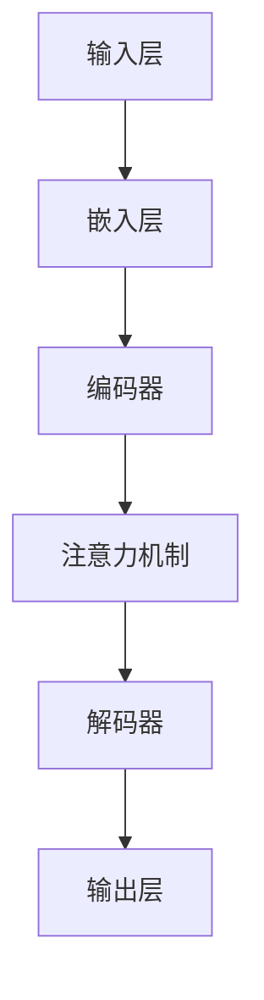

                 

# 《利用大模型提升推荐系统的抗噪声能力》

## 关键词
- 推荐系统
- 大模型
- 抗噪声能力
- 深度学习
- 特征工程
- 预测准确性

## 摘要
本文旨在探讨如何利用大模型提升推荐系统的抗噪声能力。首先，我们介绍了推荐系统的基础知识，包括传统推荐系统的方法和噪声的影响。接着，详细阐述了大模型的基本概念、优势和主流模型，以及其在推荐系统中的应用。随后，我们分析了大模型在提升推荐系统性能中的理论基础，介绍了大模型优化和调参的方法。在此基础上，本文重点讨论了大模型的抗噪声能力原理、常见抗噪声算法、调优策略以及具体案例分析。最后，通过一个项目实战案例，展示了如何在大模型推荐系统中进行环境搭建、算法实现和性能评估。本文旨在为读者提供一个系统、全面的大模型推荐系统抗噪声能力的理解和应用指南。

## 目录

### 利用大模型提升推荐系统的抗噪声能力

#### 第一部分：推荐系统基础

#### 1.1 推荐系统概述

##### 1.1.1 推荐系统的定义与作用

##### 1.1.2 推荐系统的发展历程

##### 1.1.3 推荐系统的关键要素

#### 1.2 传统推荐系统原理

##### 1.2.1 协同过滤方法

##### 1.2.2 基于内容的推荐

##### 1.2.3 混合推荐系统

#### 1.3 大模型在推荐系统中的应用

##### 1.3.1 大模型的优势

##### 1.3.2 大模型在推荐系统中的具体应用

##### 1.3.3 大模型的优势

##### 1.3.4 大模型在推荐系统中的具体应用

#### 1.4 噪声对推荐系统的影响

##### 1.4.1 噪声的定义与类型

##### 1.4.2 噪声对推荐效果的影响

##### 1.4.3 减少噪声的常见方法

#### 第二部分：大模型提升推荐系统性能

#### 2.1 大模型核心概念与架构

##### 2.1.1 大模型的定义与特点

##### 2.1.2 大模型的基本架构

##### 2.1.3 Mermaid流程图：大模型架构详解

#### 2.2 大模型在推荐系统中的实现

##### 2.2.1 大模型训练数据准备

##### 2.2.2 大模型推荐算法实现

##### 2.2.3 伪代码：大模型推荐算法详细解析

#### 2.3 大模型优化与调参

##### 2.3.1 大模型训练优化技巧

##### 2.3.2 大模型调参策略

##### 2.3.3 实际案例：大模型调参经验分享

#### 2.4 大模型性能评估

##### 2.4.1 推荐系统评估指标

##### 2.4.2 大模型性能评估方法

##### 2.4.3 评估结果分析与优化

#### 第三部分：大模型提升推荐系统抗噪声能力

#### 3.1 大模型抗噪声能力原理

##### 3.1.1 大模型如何处理噪声

##### 3.1.2 抗噪声能力的重要指标

##### 3.1.3 Mermaid流程图：抗噪声能力实现机制

#### 3.2 大模型抗噪声算法

##### 3.2.1 常见抗噪声算法介绍

##### 3.2.2 抗噪声算法在推荐系统中的应用

##### 3.2.3 伪代码：抗噪声算法详细解析

#### 3.3 大模型抗噪声调优

##### 3.3.1 抗噪声能力调优策略

##### 3.3.2 抗噪声能力评估与优化

##### 3.3.3 实际案例：大模型抗噪声能力提升实践

#### 3.4 大模型推荐系统优化案例分析

##### 3.4.1 案例一：电商推荐系统抗噪声优化

##### 3.4.2 案例二：新闻推荐系统抗噪声优化

##### 3.4.3 案例三：音乐推荐系统抗噪声优化

#### 第四部分：大模型推荐系统项目实战

#### 4.1 开发环境搭建

##### 4.1.1 硬件与软件环境配置

##### 4.1.2 数据预处理与加载

##### 4.1.3 大模型推荐算法代码实现

#### 4.2 源代码详细解读

##### 4.2.1 数据处理模块解读

##### 4.2.2 推荐算法模块解读

##### 4.2.3 评估模块解读

#### 4.3 项目实战案例

##### 4.3.1 实际数据集获取与处理

##### 4.3.2 大模型推荐算法实现与优化

##### 4.3.3 推荐系统性能评估与优化

#### 附录

##### 附录 A: 大模型推荐系统开发工具与资源

##### A.1 主流深度学习框架对比

##### A.2 大模型推荐系统开源项目推荐

##### A.3 大模型推荐系统相关论文与资料

## 1.1 推荐系统概述

### 1.1.1 推荐系统的定义与作用

推荐系统（Recommendation System）是一种基于用户行为、内容特征或两者结合的方法，旨在向用户推荐他们可能感兴趣的项目或内容。推荐系统广泛应用于电子商务、社交媒体、在线新闻、音乐和视频等领域，其主要目标是提高用户体验、提升用户满意度、增加用户粘性以及提高商业转化率。

**推荐系统的作用**：

1. **个性化体验**：通过分析用户的历史行为和兴趣，推荐系统可以为用户提供个性化的推荐，满足用户的个性化需求。
2. **增加用户参与度**：推荐系统能够向用户展示他们可能感兴趣的内容，从而提高用户的参与度和活跃度。
3. **商业价值**：推荐系统能够帮助平台更好地了解用户需求，提高用户的购买转化率，增加平台的收入。
4. **降低搜索成本**：用户不必在大量信息中搜索，推荐系统能够直接向用户展示他们可能感兴趣的内容。

### 1.1.2 推荐系统的发展历程

推荐系统的发展历程可以分为以下几个阶段：

1. **基于内容的推荐**：最早的推荐系统基于用户过去的行为和内容特征进行推荐，通过计算用户和项目之间的相似度来推荐项目。
2. **协同过滤推荐**：协同过滤（Collaborative Filtering）是一种基于用户行为数据的推荐方法，分为基于用户的协同过滤和基于物品的协同过滤。
   - **基于用户的协同过滤**：找到与当前用户相似的其他用户，推荐他们喜欢的项目。
   - **基于物品的协同过滤**：找到与当前项目相似的其他项目，推荐给用户。
3. **混合推荐系统**：结合基于内容的推荐和协同过滤推荐的方法，以提高推荐准确性。
4. **基于模型的推荐**：使用机器学习算法，如决策树、神经网络等，根据用户和项目的特征进行推荐。
5. **基于知识的推荐**：利用先验知识（如领域专家意见、用户偏好等）进行推荐。
6. **基于大模型的推荐**：使用深度学习模型（如Transformer、BERT等）进行推荐，通过大规模数据进行预训练，从而提高推荐系统的性能。

### 1.1.3 推荐系统的关键要素

推荐系统的关键要素包括用户、项目和推荐算法。以下是这些要素的详细解释：

1. **用户**：用户是推荐系统的核心，推荐系统需要了解用户的历史行为、兴趣偏好和当前需求，以便为其推荐合适的项目。
2. **项目**：项目是推荐系统的推荐对象，可以是商品、音乐、新闻、电影等。项目需要具有丰富的特征信息，以便推荐算法进行特征提取和计算相似度。
3. **推荐算法**：推荐算法是推荐系统的核心，决定了推荐系统的性能和准确性。常见的推荐算法包括基于内容的推荐、协同过滤推荐、混合推荐系统、基于模型的推荐和基于大模型的推荐。

### 1.1.4 推荐系统的分类

根据推荐算法的不同，推荐系统可以分为以下几种类型：

1. **基于内容的推荐**：通过分析项目的内容特征和用户的兴趣偏好，推荐与用户兴趣相似的项目。
2. **协同过滤推荐**：通过分析用户的行为数据，找到相似用户或相似项目，推荐用户可能感兴趣的项目。
3. **混合推荐系统**：结合基于内容的推荐和协同过滤推荐的方法，以提高推荐准确性。
4. **基于模型的推荐**：使用机器学习算法，如决策树、神经网络等，根据用户和项目的特征进行推荐。
5. **基于知识的推荐**：利用先验知识（如领域专家意见、用户偏好等）进行推荐。
6. **基于大模型的推荐**：使用深度学习模型（如Transformer、BERT等）进行推荐，通过大规模数据进行预训练，从而提高推荐系统的性能。

### 1.1.5 推荐系统的挑战

虽然推荐系统在提高用户体验和商业价值方面取得了显著成果，但仍然面临一些挑战：

1. **数据稀疏性**：用户行为数据通常呈现稀疏性，即大多数用户只对一小部分项目进行了行为记录。
2. **冷启动问题**：新用户或新项目缺乏足够的历史数据，难以进行准确推荐。
3. **多样性**：推荐系统需要保证推荐的多样性，避免用户长时间收到重复的内容。
4. **可解释性**：深度学习模型通常缺乏透明性和可解释性，难以理解推荐结果的原因。
5. **实时性**：推荐系统需要快速响应用户行为和需求的变化，提供实时推荐。

### 1.1.6 推荐系统的发展趋势

随着技术的不断进步，推荐系统也呈现出以下发展趋势：

1. **个性化**：推荐系统将更加注重个性化，通过深度学习算法和用户行为分析，为用户提供更符合个人兴趣的推荐。
2. **多样性**：推荐系统将更加注重多样性，通过算法优化和内容多样化策略，提高推荐内容的多样性。
3. **实时性**：推荐系统将更加注重实时性，通过分布式计算和实时数据处理技术，实现快速推荐。
4. **可解释性**：推荐系统将更加注重可解释性，通过模型可视化技术和可解释性算法，提高用户对推荐结果的信任度。
5. **跨平台**：推荐系统将更加注重跨平台，通过整合多种数据和渠道，提供跨平台的个性化推荐服务。

### 1.1.7 推荐系统的商业应用

推荐系统在商业领域具有广泛的应用，以下是一些常见的应用场景：

1. **电子商务**：通过推荐系统，电子商务平台可以推荐用户可能感兴趣的商品，提高用户的购买转化率。
2. **社交媒体**：通过推荐系统，社交媒体平台可以推荐用户可能感兴趣的内容，提高用户的活跃度和参与度。
3. **在线新闻**：通过推荐系统，在线新闻平台可以推荐用户可能感兴趣的新闻，提高用户的阅读量和黏性。
4. **音乐和视频平台**：通过推荐系统，音乐和视频平台可以推荐用户可能感兴趣的音乐和视频，提高用户的播放量和用户留存率。
5. **旅游和酒店**：通过推荐系统，旅游和酒店平台可以推荐用户可能感兴趣的目的地和酒店，提高用户的预订转化率。

### 1.1.8 推荐系统的成功案例

以下是一些成功的推荐系统案例：

1. **亚马逊（Amazon）**：亚马逊通过协同过滤和基于内容的推荐方法，为用户提供个性化的商品推荐，提高了用户购买转化率和平台销售额。
2. **Netflix**：Netflix通过协同过滤和基于内容的推荐方法，为用户提供个性化的电影和电视剧推荐，提高了用户的观看量和平台订阅率。
3. **淘宝（Taobao）**：淘宝通过基于内容的推荐和协同过滤推荐方法，为用户提供个性化的商品推荐，提高了用户购买转化率和平台销售额。
4. **微博（Weibo）**：微博通过协同过滤和基于内容的推荐方法，为用户提供个性化的微博推荐，提高了用户的活跃度和平台流量。

### 1.1.9 总结

推荐系统是一种重要的信息过滤和推荐方法，通过分析用户行为和项目特征，为用户提供个性化的推荐服务。随着技术的不断进步，推荐系统在提高用户体验、增加商业价值等方面具有广泛的应用前景。本文将详细介绍推荐系统的定义、发展历程、关键要素、分类、挑战、发展趋势、商业应用和成功案例，帮助读者全面了解推荐系统的基本概念和应用。

## 1.2 传统推荐系统原理

### 1.2.1 协同过滤方法

协同过滤（Collaborative Filtering）是一种传统的推荐系统方法，主要通过分析用户之间的行为数据来推荐项目。协同过滤方法可以分为两类：基于用户的协同过滤（User-Based Collaborative Filtering）和基于物品的协同过滤（Item-Based Collaborative Filtering）。

**基于用户的协同过滤**：

1. **算法原理**：基于用户的协同过滤方法通过找到与当前用户相似的其他用户，推荐这些用户喜欢的项目。
2. **计算相似度**：计算用户之间的相似度，常用的相似度度量方法包括余弦相似度、皮尔逊相关系数等。
3. **推荐策略**：根据相似度得分，为当前用户推荐相似用户喜欢的项目。

**基于物品的协同过滤**：

1. **算法原理**：基于物品的协同过滤方法通过找到与当前项目相似的其他项目，推荐给用户。
2. **计算相似度**：计算项目之间的相似度，常用的相似度度量方法包括余弦相似度、Jaccard系数等。
3. **推荐策略**：根据相似度得分，为当前用户推荐相似项目。

**协同过滤方法的优缺点**：

**优点**：

- **简单易实现**：协同过滤方法计算简单，易于实现。
- **基于用户行为**：协同过滤方法直接利用用户行为数据，可以捕捉用户之间的相似性。

**缺点**：

- **数据稀疏性**：用户行为数据通常呈现稀疏性，导致协同过滤方法难以准确推荐。
- **冷启动问题**：新用户或新项目缺乏足够的历史数据，导致协同过滤方法难以推荐。
- **多样性不足**：协同过滤方法容易产生高度相似的推荐结果，缺乏多样性。

### 1.2.2 基于内容的推荐

基于内容的推荐（Content-Based Recommendation）是一种通过分析项目的内容特征和用户的兴趣偏好进行推荐的方法。基于内容的推荐方法可以分为以下几类：

**基于文本的推荐**：

1. **算法原理**：基于文本的推荐方法通过分析项目的文本描述（如标题、摘要、标签等），提取关键词和特征，根据用户的兴趣偏好推荐相关项目。
2. **文本处理**：使用自然语言处理（NLP）技术，如词频统计、TF-IDF、主题模型等，对文本进行预处理和特征提取。
3. **推荐策略**：根据用户兴趣词和项目特征词的相似度，为用户推荐相关项目。

**基于标签的推荐**：

1. **算法原理**：基于标签的推荐方法通过分析项目的标签信息，根据用户的兴趣标签推荐相关项目。
2. **标签匹配**：根据用户的兴趣标签和项目的标签信息，计算标签相似度。
3. **推荐策略**：根据标签相似度，为用户推荐具有相似标签的项目。

**基于内容的推荐方法的优缺点**：

**优点**：

- **内容丰富**：基于内容的推荐方法可以充分利用项目的内容特征，为用户提供丰富的推荐信息。
- **易于实现**：基于内容的推荐方法计算简单，易于实现。

**缺点**：

- **用户兴趣变化**：用户的兴趣可能随时间变化，基于内容的推荐方法难以捕捉用户兴趣的变化。
- **多样性不足**：基于内容的推荐方法容易产生高度相关的推荐结果，缺乏多样性。

### 1.2.3 混合推荐系统

混合推荐系统（Hybrid Recommendation System）是一种结合多种推荐方法进行推荐的系统，以弥补单一方法的不足。常见的混合推荐系统包括以下几种类型：

**基于用户的协同过滤 + 基于内容的推荐**：

1. **算法原理**：结合基于用户的协同过滤和基于内容的推荐方法，首先利用基于用户的协同过滤方法推荐相似用户喜欢的项目，然后利用基于内容的推荐方法对这些项目进行进一步筛选。
2. **推荐策略**：为用户推荐相似用户喜欢的、且与用户兴趣相关的项目。

**基于物品的协同过滤 + 基于内容的推荐**：

1. **算法原理**：结合基于物品的协同过滤和基于内容的推荐方法，首先利用基于物品的协同过滤方法推荐相似项目，然后利用基于内容的推荐方法对这些项目进行进一步筛选。
2. **推荐策略**：为用户推荐相似项目，且这些项目与用户兴趣相关。

**混合推荐系统的优缺点**：

**优点**：

- **提高推荐准确性**：混合推荐系统结合多种推荐方法，可以充分利用用户行为数据和项目内容特征，提高推荐准确性。
- **增强多样性**：混合推荐系统可以产生更加多样化的推荐结果，减少单一方法的局限性。

**缺点**：

- **计算复杂度高**：混合推荐系统需要同时计算多种方法的推荐结果，计算复杂度高。
- **参数调优难度大**：混合推荐系统涉及多种方法的参数调优，参数调优难度大。

### 1.2.4 传统推荐系统的方法总结

传统推荐系统方法包括协同过滤推荐、基于内容的推荐和混合推荐系统。每种方法都有其优点和缺点，适用于不同的应用场景。

- **协同过滤推荐**：适用于用户行为数据丰富的场景，但存在数据稀疏性和冷启动问题。
- **基于内容的推荐**：适用于项目内容特征丰富的场景，但存在用户兴趣变化和多样性不足的问题。
- **混合推荐系统**：结合多种推荐方法，可以提高推荐准确性，但计算复杂度高，参数调优难度大。

## 1.3 大模型在推荐系统中的应用

### 1.3.1 大模型的优势

大模型（Large-scale Model）是指那些拥有数十亿甚至数万亿参数的深度学习模型，它们通过在大型数据集上进行预训练，可以学习到丰富的特征表示和复杂的模式。大模型在推荐系统中的应用具有以下优势：

1. **强大的特征表示能力**：大模型可以捕捉到数据中的细微特征和复杂模式，从而提高推荐系统的准确性。
2. **高效的预测能力**：大模型通过大规模数据和复杂网络结构，可以快速地进行预测，减少预测误差。
3. **处理复杂数据类型**：大模型可以处理多种数据类型（如文本、图像、音频等），从而适用于多种推荐场景。
4. **减少冷启动问题**：大模型通过预训练可以在多种任务上泛化，从而减少新用户或新项目的冷启动问题。

### 1.3.2 大模型在推荐系统中的具体应用

大模型在推荐系统中的具体应用主要包括以下几个方面：

1. **用户特征嵌入**：使用大模型（如BERT、GPT）对用户特征进行嵌入，提取用户的高维特征表示。
2. **商品特征嵌入**：使用大模型对商品特征进行嵌入，提取商品的高维特征表示。
3. **交互特征建模**：使用大模型对用户和商品的交互特征进行建模，通过深度神经网络捕捉用户和商品之间的复杂关系。
4. **多模态推荐**：结合文本、图像、音频等多模态数据，使用大模型进行多模态特征提取和融合，提供更精准的推荐。
5. **动态推荐**：利用大模型的自适应能力，根据用户实时行为动态调整推荐策略，提供个性化的动态推荐。

### 1.3.3 大模型在推荐系统中的优势

大模型在推荐系统中的优势主要体现在以下几个方面：

1. **准确性**：大模型通过大规模数据训练，可以学习到更加丰富的特征表示和复杂模式，从而提高推荐系统的准确性。
2. **泛化能力**：大模型在预训练阶段学习到的通用特征表示，可以应用于多种推荐任务，提高模型的泛化能力。
3. **多样性**：大模型可以捕捉到数据中的多样性特征，从而产生更加多样化的推荐结果。
4. **实时性**：大模型具有高效的计算能力，可以快速地进行预测，提供实时的推荐服务。

### 1.3.4 大模型在推荐系统中的挑战

尽管大模型在推荐系统中具有显著优势，但也面临一些挑战：

1. **计算资源需求**：大模型的训练和推理需要大量的计算资源，对硬件设备要求较高。
2. **数据质量**：大模型对数据质量要求较高，数据清洗和数据增强是关键步骤。
3. **模型解释性**：大模型的决策过程通常缺乏透明性，提高模型的可解释性是一个重要研究方向。
4. **隐私保护**：大模型在处理用户数据时需要关注隐私保护问题，确保用户数据的安全。

### 1.3.5 大模型在推荐系统中的应用前景

随着深度学习技术的不断发展，大模型在推荐系统中的应用前景十分广阔。以下是一些潜在的应用场景：

1. **个性化推荐**：通过大模型对用户行为和兴趣进行深入分析，提供个性化的推荐服务。
2. **多模态推荐**：结合文本、图像、音频等多模态数据，提供更加精准和多维度的推荐。
3. **实时推荐**：利用大模型的自适应能力，提供实时、动态的推荐服务。
4. **长尾推荐**：大模型可以更好地处理长尾数据，为小众用户群体提供精准的推荐。

总之，大模型在推荐系统中的应用具有巨大的潜力，通过不断优化和改进，有望进一步提升推荐系统的性能和用户体验。

## 1.4 噪声对推荐系统的影响

### 1.4.1 噪声的定义与类型

噪声（Noise）是指推荐系统中影响推荐效果的不规则、不相关或错误的信息。噪声可以分为以下几种类型：

1. **随机噪声**：随机噪声是指由于随机因素产生的噪声，如数据采集过程中的随机误差。
2. **系统噪声**：系统噪声是指由于系统自身问题产生的噪声，如数据存储和处理过程中的故障。
3. **恶意噪声**：恶意噪声是指由于恶意用户或攻击者故意产生的噪声，如虚假评论、刷单等。

### 1.4.2 噪声对推荐效果的影响

噪声对推荐系统的影响主要体现在以下几个方面：

1. **降低推荐准确性**：噪声会干扰推荐模型的训练过程，导致模型难以学习到有效的特征和模式，从而降低推荐准确性。
2. **增加预测误差**：噪声会导致预测结果与真实值之间的误差增大，降低推荐系统的预测能力。
3. **影响用户满意度**：噪声会影响推荐结果的多样性，导致用户频繁收到重复的推荐，从而降低用户满意度。
4. **损害平台声誉**：噪声会降低推荐系统的可信度，损害平台的声誉，影响用户留存率和转化率。

### 1.4.3 减少噪声的常见方法

为了提高推荐系统的性能和用户体验，减少噪声是关键步骤。以下是一些常见的噪声减少方法：

1. **数据清洗**：通过数据清洗方法，如删除缺失值、去除重复值和异常值等，减少噪声数据。
2. **特征选择**：通过特征选择方法，选择对噪声不敏感的重要特征，降低噪声对模型的影响。
3. **数据增强**：通过数据增强方法，如数据变换、生成对抗网络等，增加带噪声的数据样本，提高模型对噪声的鲁棒性。
4. **噪声识别与过滤**：使用噪声识别算法，如统计方法、机器学习方法等，识别和过滤噪声数据。
5. **模型正则化**：通过模型正则化方法，如Dropout、权重衰减等，减少模型的过拟合现象，提高模型对噪声的鲁棒性。

### 1.4.4 总结

噪声是推荐系统中普遍存在的问题，对推荐系统的性能和用户体验产生负面影响。通过数据清洗、特征选择、数据增强、噪声识别与过滤和模型正则化等方法，可以有效减少噪声，提高推荐系统的性能和可信度。

## 2.1 大模型核心概念与架构

### 2.1.1 大模型的定义与特点

大模型（Large-scale Model）是指那些拥有数十亿甚至数万亿参数的深度学习模型，它们通过在大型数据集上进行预训练，可以学习到丰富的特征表示和复杂的模式。大模型通常具有以下特点：

1. **参数量巨大**：大模型的参数量通常在数十亿到数千亿之间，这使得它们能够捕捉到数据中的细微特征和复杂模式。
2. **强大的表示能力**：大模型能够学习到复杂的数据分布和模式，从而在多种任务上表现优异。
3. **预训练与微调**：大模型通常在大规模通用数据集上进行预训练，然后再在特定任务上进行微调，以适应特定领域的需求。
4. **计算资源需求高**：大模型的训练和推理需要大量的计算资源，通常需要使用高性能的GPU或TPU。

### 2.1.2 大模型的基本架构

大模型的基本架构通常包括以下几个主要部分：

1. **输入层**：输入层负责接收外部输入数据，如文本、图像、音频等。输入数据通常需要进行预处理，如编码、归一化等。
2. **嵌入层**：嵌入层将输入数据转换为向量表示，如使用Embedding层对文本数据进行词向量化。
3. **编码器**：编码器负责对输入数据进行编码，提取关键特征表示。常用的编码器结构包括卷积神经网络（CNN）、循环神经网络（RNN）和Transformer等。
4. **解码器**：解码器负责将编码器提取的特征表示解码为输出结果，如文本生成、图像重构等。解码器通常与编码器具有相同的结构。
5. **注意力机制**：注意力机制是一种用于捕捉数据中长距离依赖关系的技术，可以帮助模型更好地学习复杂模式。
6. **输出层**：输出层负责生成最终的预测结果，如分类标签、文本序列等。

### 2.1.3 Mermaid流程图：大模型架构详解



### 2.1.4 大模型的工作流程

大模型的工作流程通常包括以下步骤：

1. **数据预处理**：对输入数据进行预处理，如文本分词、图像缩放、音频采样等，以适应模型的要求。
2. **嵌入**：将预处理后的输入数据转换为向量表示，如使用Embedding层对文本数据进行词向量化。
3. **编码**：通过编码器对输入数据进行编码，提取关键特征表示。编码器通常使用卷积神经网络（CNN）、循环神经网络（RNN）或Transformer等结构。
4. **注意力机制**：使用注意力机制捕捉数据中的长距离依赖关系，增强模型的表达能力。
5. **解码**：通过解码器将编码器提取的特征表示解码为输出结果。解码器通常与编码器具有相同的结构。
6. **预测与评估**：使用输出结果进行预测，并通过评估指标（如准确率、召回率、F1分数等）评估模型的性能。
7. **优化与调参**：根据评估结果，调整模型参数和结构，提高模型性能。

### 2.1.5 大模型的优缺点

**优点**：

1. **强大的表示能力**：大模型能够学习到复杂的数据分布和模式，从而在多种任务上表现优异。
2. **高效的预测能力**：大模型通过大规模数据和复杂网络结构，可以快速地进行预测，减少预测误差。
3. **减少冷启动问题**：大模型通过预训练可以在多种任务上泛化，从而减少新用户或新项目的冷启动问题。

**缺点**：

1. **计算资源需求高**：大模型的训练和推理需要大量的计算资源，通常需要使用高性能的GPU或TPU。
2. **数据质量要求高**：大模型对数据质量要求较高，需要确保数据集的多样性和准确性。
3. **模型解释性不足**：大模型的决策过程通常缺乏透明性，提高模型的可解释性是一个重要研究方向。

### 2.1.6 大模型的应用场景

大模型在以下应用场景中具有显著的优势：

1. **自然语言处理**：如文本分类、机器翻译、文本生成等。
2. **计算机视觉**：如图像分类、目标检测、图像生成等。
3. **推荐系统**：如用户行为预测、商品推荐、新闻推荐等。
4. **语音识别**：如语音转文字、语音合成等。

### 2.1.7 总结

大模型在深度学习领域中扮演着重要角色，通过在大型数据集上进行预训练，大模型能够学习到丰富的特征表示和复杂的模式，从而在多种任务上表现优异。然而，大模型也面临一些挑战，如计算资源需求高、数据质量要求高等。在实际应用中，需要根据具体场景和需求，合理选择和应用大模型，以充分发挥其优势。

## 2.2 大模型在推荐系统中的实现

### 2.2.1 大模型训练数据准备

在实现大模型推荐系统时，数据准备是关键的一步。以下是大模型训练数据准备的主要步骤：

1. **数据收集**：首先，需要收集大量的用户行为数据和商品信息。用户行为数据包括用户的历史浏览记录、购买记录、评分等，商品信息包括商品标题、描述、标签等。

2. **数据预处理**：对收集到的数据进行预处理，以去除噪声和异常值，提高数据质量。具体步骤包括：
   - **数据清洗**：删除缺失值、重复值和异常值。
   - **数据转换**：将类别数据转换为数值型数据，如使用独热编码或标签编码。
   - **数据归一化**：对数值型数据进行归一化处理，如使用Min-Max缩放或Z-Score归一化。

3. **数据划分**：将预处理后的数据集划分为训练集、验证集和测试集，以确保模型的泛化能力。通常，可以使用以下方法进行划分：
   - **随机划分**：随机地将数据集划分为训练集和验证集，确保每个子集中的样本分布均匀。
   - **时间顺序划分**：根据数据的时间顺序，将数据集划分为训练集和验证集，以模拟实际应用场景。

4. **数据增强**：通过数据增强方法，如随机噪声注入、数据变换等，增加训练数据的多样性，提高模型的鲁棒性。

### 2.2.2 大模型推荐算法实现

在大模型推荐系统中，推荐算法的实现主要包括以下步骤：

1. **模型定义**：定义大模型的架构，包括输入层、编码器、解码器和输出层。例如，可以使用Transformer或BERT等模型进行定义。

2. **损失函数与优化器**：选择合适的损失函数和优化器，以最大化模型的性能。常见的损失函数包括交叉熵损失、均方误差（MSE）等，优化器包括Adam、AdamW等。

3. **模型训练**：使用训练集对大模型进行训练，通过反向传播算法不断更新模型参数。在训练过程中，可以使用以下策略提高训练效率：
   - **批量训练**：将训练数据分为多个批次进行训练，以减少计算资源的消耗。
   - **学习率调整**：使用学习率预热或动态调整策略，以避免模型陷入局部最优。
   - **正则化**：添加正则化项，如Dropout、权重衰减等，以防止模型过拟合。

4. **模型评估**：使用验证集对训练好的模型进行评估，计算评估指标，如准确率、召回率、F1分数等，以判断模型的性能。

5. **模型调优**：根据评估结果，调整模型参数和结构，以提高模型性能。可以使用网格搜索、随机搜索等策略进行调优。

### 2.2.3 伪代码：大模型推荐算法详细解析

以下是一个伪代码示例，用于展示大模型推荐算法的实现过程：

```python
# 伪代码：大模型推荐算法实现

# 数据准备
load_data()
data = preprocess_data(data)

# 数据划分
train_data, val_data, test_data = split_data(data)

# 模型定义
model = define_model(input_dim, hidden_dim, output_dim)

# 损失函数与优化器
loss_function = cross_entropy_loss()
optimizer = Adam(learning_rate)

# 模型训练
for epoch in range(num_epochs):
    for batch in train_data:
        inputs, labels = batch
        with tf.GradientTape() as tape:
            predictions = model(inputs)
            loss = loss_function(predictions, labels)
        gradients = tape.gradient(loss, model.trainable_variables)
        optimizer.apply_gradients(zip(gradients, model.trainable_variables))
        
    # 学习率调整
    adjust_learning_rate(optimizer, epoch)

    # 模型评估
    evaluate_model(model, val_data)

# 模型测试
test_predictions = model(test_data)

# 输出推荐结果
output_recommendations(test_predictions)
```

通过以上伪代码示例，可以清晰地展示大模型推荐算法的实现过程，包括数据准备、模型定义、模型训练、模型评估和模型测试等步骤。

## 2.3 大模型优化与调参

### 2.3.1 大模型训练优化技巧

在训练大模型时，优化技巧对于提高训练效率和模型性能至关重要。以下是一些常见的大模型训练优化技巧：

1. **学习率调整**：
   - **学习率预热**：在训练初期使用较小的学习率，让模型在数据中逐步探索，避免陷入局部最优。
   - **动态学习率**：根据训练过程动态调整学习率，如使用学习率衰减策略，在训练后期逐渐减小学习率，防止模型在训练后期过拟合。
   - **自适应学习率**：使用自适应学习率优化器，如Adam、AdamW等，自动调整学习率。

2. **批量大小调整**：
   - **批量大小选择**：根据硬件资源（如GPU内存）和训练数据规模，选择合适的批量大小。较大的批量大小可以减少噪声，提高模型稳定性，但计算成本较高；较小的批量大小可以提高训练效率，但可能引入更多噪声。
   - **批量大小调整策略**：在训练过程中逐渐调整批量大小，如在训练初期使用较大的批量大小，训练后期逐渐减小批量大小。

3. **数据增强**：
   - **数据变换**：对输入数据进行随机变换，如随机裁剪、旋转、缩放等，增加数据的多样性，提高模型对噪声

