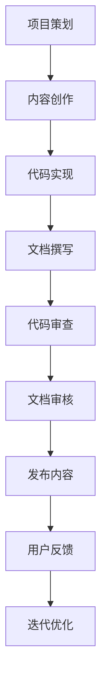

                 

### 《利用开源经验进行技术写作和内容创作》

> 关键词：开源经验、技术写作、内容创作、文档撰写、项目贡献、效率工具

> 摘要：本文旨在探讨如何利用开源经验进行技术写作和内容创作。通过分析开源文化的特点、技术文档的撰写技巧、开源项目的参与方法以及开源工具的应用，本文为读者提供了一个系统且实用的指南，帮助他们在技术领域内更有效地进行写作和内容创作。

#### 第一部分：开源经验与技术写作

# 第一部分：开源经验与技术写作

## 第1章：开源文化与写作心态

### 1.1 开源文化概述

开源文化是一种以开放、透明、协作为核心的精神，其背后的理念是让知识和资源自由共享，以促进技术进步和社会发展。开源文化强调的是社区的力量，每个人都可以贡献自己的力量，共同推进项目的发展。

在开源文化中，写作是一种重要的交流和传播方式。通过撰写技术文档、博客文章、书籍等，开发者可以将自己的经验和见解分享给社区，帮助其他人学习和成长。

### 1.2 技术写作的重要性

技术写作不仅是传递信息的过程，更是一种表达和交流的方式。在开源项目中，良好的技术写作能够提高代码的可读性和可维护性，降低新贡献者的入门门槛。同时，技术写作也是个人品牌建设的重要手段，通过撰写高质量的文章，开发者可以提升自己的知名度，吸引更多的机会和合作。

### 1.3 开源写作与个人成长

参与开源写作不仅能够提升技术能力，还能培养个人的协作能力、沟通能力和解决问题的能力。在开源写作中，开发者需要不断学习新的技术和工具，适应不同的工作方式和节奏，这些都是个人成长的重要经历。

## 第2章：技术文档的撰写技巧

### 2.1 技术文档的基本要素

技术文档的基本要素包括：文档目的、读者对象、概览、安装指南、配置指南、使用指南、API 文档、常见问题解答等。每个要素都需要根据具体项目进行详细阐述，确保读者能够清晰理解和使用。

### 2.2 文档结构设计

文档结构设计是技术文档编写的重要环节。一个良好的文档结构应该清晰、逻辑性强，能够让读者快速找到所需信息。常见的文档结构包括：目录、章节、子章节、附录等。

### 2.3 语言表达与风格

技术文档的语言表达应该简明扼要、准确无误。同时，风格上应该保持一致，避免使用非专业术语和冗长的句子。在撰写文档时，还可以使用代码片段、示意图和表格来增强文档的直观性。

## 第3章：开源项目的贡献与写作

### 3.1 参与开源项目的准备

参与开源项目前，开发者需要了解项目的背景、目标、现状和社区文化。此外，还需要准备好开发环境、版本控制系统和相关的开发工具。

### 3.2 提交代码与文档

在参与开源项目时，开发者需要遵循项目的编码规范和提交流程。提交代码时，需要提供详细的注释和说明，确保代码的可读性和可维护性。对于文档，同样需要提供清晰的撰写和排版，以便其他开发者能够快速理解和使用。

### 3.3 开源社区的沟通与协作

开源社区是一个充满活力和多元化的环境。在社区中，开发者需要积极参与讨论、提供建议、解决问题，并与其他贡献者保持良好的沟通和协作。通过这种方式，开发者不仅能够提升自己的技术能力，还能建立起自己的个人品牌和影响力。

## 第4章：利用开源工具提高写作效率

### 4.1 版本控制系统

版本控制系统是开源项目开发不可或缺的工具。常见的版本控制系统包括 Git、Mercurial 和 Subversion 等。通过版本控制系统，开发者可以方便地管理代码的版本和变更，提高协同工作的效率。

### 4.2 代码质量分析工具

代码质量分析工具可以帮助开发者识别和修复代码中的潜在问题，提高代码的可读性和可维护性。常见的代码质量分析工具包括 Pylint、Checkstyle 和 FindBugs 等。

### 4.3 文档生成工具

文档生成工具可以自动将代码注释和说明转换为文档，提高文档编写的效率。常见的文档生成工具包括 Sphinx、Doxygen 和 JSDoc 等。

#### 第二部分：内容创作实践

# 第二部分：内容创作实践

## 第5章：内容创作策略与方法

### 5.1 内容创作目标设定

内容创作目标的设定是内容创作的重要前提。明确目标有助于指导创作方向，提高创作效率。在设定内容创作目标时，可以从以下几个方面进行思考：

- 目标受众：确定目标受众，明确他们的需求和兴趣点。
- 内容类型：根据目标受众的需求，确定合适的内容类型，如技术博客、书籍、教程等。
- 内容主题：围绕目标受众和内容类型，选择具有吸引力和实用性的主题。
- 发布频率：确定内容的发布频率，如每周一篇博客，每月一本电子书等。

### 5.2 受众分析与定位

受众分析是内容创作过程中不可或缺的一环。通过分析受众的特征、需求和行为，可以为内容创作提供有力的指导。在受众分析中，可以从以下几个方面进行：

- 受众特征：了解受众的年龄、性别、职业、教育程度等基本信息。
- 受众需求：了解受众在技术领域中的关注点、困惑和痛点。
- 受众行为：分析受众在互联网上的行为习惯，如阅读时间、阅读场景、偏好等。

根据受众分析和定位的结果，可以为内容创作提供以下参考：

- 语言风格：根据受众特征和需求，选择适合的语言风格，如专业、亲切、幽默等。
- 内容形式：根据受众行为和偏好，选择适合的内容形式，如图文、视频、音频等。
- 内容调性：根据受众特征和需求，确定内容的调性，如实用、深入、趣味等。

### 5.3 内容创作流程

内容创作流程是确保内容质量和效率的关键。一个完整的内容创作流程通常包括以下几个阶段：

- 策划阶段：确定内容创作目标、受众分析、内容主题和发布计划等。
- 写作阶段：根据策划阶段的结果，进行内容撰写，包括标题、摘要、正文等。
- 审稿阶段：对撰写的内容进行审稿，包括语法、逻辑、格式等方面。
- 发布阶段：将内容发布到相应的平台，如博客、社交媒体、电子书等。
- 运营阶段：对发布的内容进行运营，包括推广、互动、反馈等。

## 第6章：技术博客写作

### 6.1 博客平台选择

在选择博客平台时，需要考虑以下几个方面：

- 技术支持：选择支持markdown、静态网站生成等技术的平台，如Hexo、Jekyll等。
- 可定制性：选择具有高度可定制性的平台，可以根据个人需求进行样式、功能等方面的调整。
- 安全性：选择安全性较高的平台，确保博客内容的安全和稳定。
- 社区活跃度：选择社区活跃度较高的平台，便于与其他开发者交流和学习。

### 6.2 博客内容规划

博客内容规划是确保博客质量的重要环节。在博客内容规划中，可以从以下几个方面进行：

- 内容主题：根据个人兴趣和专业知识，选择具有吸引力和实用性的内容主题。
- 内容类型：结合内容主题，确定适合的内容类型，如图文、视频、音频等。
- 内容规划：根据内容主题和类型，制定合理的博客发布计划，确保内容持续更新。

### 6.3 博文撰写技巧

撰写高质量博文是博客成功的关键。在撰写博文时，可以从以下几个方面进行：

- 标题吸引力：选择具有吸引力的标题，激发读者的阅读兴趣。
- 摘要简洁：撰写简洁明了的摘要，概括博文的核心内容，引导读者继续阅读。
- 正文结构：确保正文结构清晰，逻辑性强，便于读者阅读和理解。
- 代码示例：提供实用的代码示例，帮助读者更好地理解和应用所学知识。
- 图表辅助：使用图表、图片等视觉元素，增强博文的直观性和可读性。

## 第7章：书籍与课程创作

### 7.1 书籍创作的准备

在书籍创作前，需要进行充分的准备。准备内容包括：

- 选题确定：选择具有市场潜力和个人兴趣的书籍主题。
- 内容框架：制定书籍的内容框架，包括章节标题、内容概述等。
- 参考资料搜集：搜集与书籍主题相关的参考资料，为写作提供依据。
- 审稿计划：制定审稿计划，确保书籍内容的准确性和专业性。

### 7.2 教材编写的要点

教材编写需要注重以下几个方面：

- 内容准确性：确保教材内容的准确性，避免出现错误和误导。
- 结构清晰：教材结构应清晰，逻辑性强，便于学生理解和掌握。
- 举例丰富：提供丰富的实例和案例，帮助学生更好地理解和应用所学知识。
- 语言表达：教材语言应简洁明了，通俗易懂，避免使用复杂的术语和语句。

### 7.3 课程内容的构建

课程内容的构建需要考虑以下几个方面：

- 课程目标：明确课程目标，包括知识目标、能力目标和情感目标。
- 内容安排：根据课程目标，合理安排课程内容，确保知识的连贯性和系统性。
- 教学方法：结合课程内容和目标，选择合适的教学方法，如讲授、讨论、实验等。
- 教学资源：准备充分的教学资源，如教材、课件、视频等，为学生提供学习支持。

## 第8章：多媒体内容创作

### 8.1 视频制作基础

视频制作是多媒体内容创作的重要形式。视频制作的基础包括：

- 视频格式：了解常见的视频格式，如MP4、AVI、MOV等，选择适合的格式进行制作和发布。
- 视频编辑软件：选择合适的视频编辑软件，如Adobe Premiere Pro、Final Cut Pro等，进行视频的剪辑、调色、特效等操作。
- 视频素材：搜集和制作视频素材，包括画面、音频、字幕等，为视频制作提供素材支持。

### 8.2 音频内容创作

音频内容创作是多媒体内容创作的重要组成部分。音频内容创作包括：

- 音频格式：了解常见的音频格式，如MP3、WAV、AAC等，选择适合的格式进行制作和发布。
- 音频编辑软件：选择合适的音频编辑软件，如Adobe Audition、Audacity等，进行音频的剪辑、特效等操作。
- 音频素材：搜集和制作音频素材，包括音乐、音效、人声等，为音频内容创作提供素材支持。

### 8.3 社交媒体运营

社交媒体运营是多媒体内容传播的重要途径。社交媒体运营包括：

- 平台选择：选择适合的社交媒体平台，如微博、微信、抖音等，进行内容发布和推广。
- 内容策略：制定合理的社交媒体内容策略，包括内容类型、发布频率、互动方式等。
- 数据分析：通过数据分析，了解用户行为和反馈，优化社交媒体运营策略，提高内容传播效果。

#### 第三部分：开源内容创作案例

# 第三部分：开源内容创作案例

## 第9章：开源项目文档案例

### 9.1 项目文档的组织结构

开源项目文档的组织结构对于项目的可读性和可维护性至关重要。一个典型的项目文档结构包括以下部分：

1. **README.md**：项目的入口文档，通常包含项目简介、安装说明、使用示例、贡献指南等。
2. **LICENSE**：项目的版权声明和许可协议，规定了项目使用的法律条款。
3. **CONTRIBUTING.md**：指导新贡献者如何参与项目的文档，包括代码贡献指南、文档编写规范等。
4. **CHANGELOG.md**：记录项目变更历史的文档，包括每次发布的改动和问题修复。
5. **README.md**：项目的用户文档，通常包含安装指南、配置指南、使用指南等。

### 9.2 文档写作经验分享

在撰写开源项目文档时，以下几个经验分享是至关重要的：

- **保持一致性**：使用统一的术语、代码风格和排版格式。
- **模块化编写**：将文档分为多个模块，便于维护和更新。
- **示例丰富**：提供详细的示例代码和效果图，帮助读者更好地理解文档内容。
- **反馈机制**：建立反馈机制，鼓励社区成员提出意见和建议，及时更新文档。

### 9.3 文档审核与发布流程

开源项目文档的审核与发布流程对于保证文档质量至关重要。以下是一个典型的文档审核与发布流程：

1. **编写**：开发者根据项目需求编写文档，提交到代码仓库。
2. **内部审核**：团队成员对文档进行内部审核，确保文档内容准确无误。
3. **社区审核**：邀请社区成员对文档进行审核，收集反馈和建议。
4. **修订**：根据审核反馈对文档进行修订，确保文档的完整性和准确性。
5. **发布**：将修订后的文档合并到主分支，并通过自动化工具发布到官方网站或GitHub Pages。

## 第10章：技术博客案例

### 10.1 成功博客案例分析

成功的技术博客通常具备以下几个特点：

- **主题明确**：博客主题明确，专注于特定领域或技术点。
- **内容深入**：博客内容深入，不仅解释现象，还探讨原理和机制。
- **语言简洁**：博客语言简洁易懂，避免复杂的专业术语。
- **示例丰富**：博客提供丰富的代码示例和实际案例，帮助读者理解。
- **互动性强**：博客鼓励读者提问和讨论，形成良好的互动氛围。

### 10.2 博客推广策略

博客推广是提升博客影响力的关键。以下是一些有效的博客推广策略：

- **搜索引擎优化（SEO）**：优化博客内容，提高在搜索引擎中的排名。
- **社交媒体**：在社交媒体平台发布博客链接，吸引粉丝和读者。
- **内容分享**：在专业论坛和社群分享博客内容，获取更多曝光。
- **合作与互推**：与其他博主或机构合作，互相推广，扩大影响力。

### 10.3 博客写作反思

在博客写作过程中，不断反思和总结是提高写作质量的重要手段。以下是一些写作反思的要点：

- **内容质量**：反思博客内容的深度和广度，确保提供有价值的信息。
- **读者反馈**：关注读者反馈，了解读者的需求和期望，调整写作方向。
- **写作风格**：反思博客的写作风格，确保语言简洁、条理清晰。
- **时间管理**：合理安排写作时间，确保博客内容的持续更新。

## 第11章：书籍与课程案例

### 11.1 书籍出版的流程

书籍出版的流程通常包括以下几个阶段：

1. **选题策划**：确定书籍主题、目标读者和出版时间。
2. **撰写稿件**：根据选题策划撰写书籍内容，包括章节、案例和示例。
3. **审稿与修改**：邀请专家或编辑对稿件进行审稿，提出修改意见。
4. **排版与设计**：根据审稿意见对稿件进行排版和设计，制作书籍的封面和内页。
5. **印刷与发行**：选择印刷厂进行印刷，并通过渠道进行发行。

### 11.2 课程设计的要点

课程设计是课程成功的关键。以下是一些课程设计的要点：

1. **课程目标**：明确课程目标，包括知识目标、能力目标和情感目标。
2. **内容结构**：合理安排课程内容，确保知识的连贯性和系统性。
3. **教学方法**：选择适合的教学方法，如讲授、讨论、实验等，提高教学效果。
4. **教学资源**：准备充分的教学资源，如教材、课件、视频等，为学生提供学习支持。
5. **评估方式**：制定合理的评估方式，包括考试、作业、项目等，确保学习效果。

### 11.3 教学案例分享

以下是一个教学案例分享：

**课程名称**：Python编程基础

**课程目标**：使学生掌握Python编程语言的基本语法、数据结构和算法。

**课程内容**：

1. **Python基础**：介绍Python语言的基本语法，包括变量、数据类型、运算符等。
2. **数据结构**：介绍Python中的常用数据结构，如列表、字典、元组等。
3. **算法与数据结构**：介绍排序算法、搜索算法等，以及如何使用Python实现这些算法。
4. **实际应用**：通过实际案例，让学生学会使用Python解决实际问题。

**教学方法**：

- **讲授**：讲解Python语言的基本概念和语法。
- **实验**：通过实验课，让学生动手实践，掌握数据结构和算法。
- **讨论**：组织小组讨论，让学生分享学习经验和问题，共同解决问题。

**教学资源**：

- **教材**：《Python编程：从入门到实践》
- **课件**：教学PPT和代码示例
- **视频**：Python编程基础教程视频

**评估方式**：

- **作业**：定期布置作业，检查学生的学习情况。
- **项目**：完成一个实际项目，展示学生的综合能力。
- **考试**：期末考试，评估学生的知识掌握程度。

## 第12章：开源多媒体内容案例

### 12.1 视频内容创作案例

以下是一个视频内容创作案例：

**项目名称**：Python编程入门教程

**项目简介**：该视频教程旨在帮助初学者快速入门Python编程语言，掌握基础语法和数据结构。

**内容结构**：

1. **Python基础**：介绍Python语言的基本语法，包括变量、数据类型、运算符等。
2. **数据结构**：介绍Python中的常用数据结构，如列表、字典、元组等。
3. **算法与数据结构**：介绍排序算法、搜索算法等，以及如何使用Python实现这些算法。
4. **实际应用**：通过实际案例，让学生学会使用Python解决实际问题。

**制作流程**：

1. **剧本编写**：根据课程内容编写视频剧本，明确每个视频的讲解内容和时长。
2. **拍摄**：使用摄像机或手机录制视频，确保画面清晰、声音清楚。
3. **剪辑**：使用视频编辑软件对录制好的视频进行剪辑、调色和添加特效。
4. **配音**：为视频添加旁白和背景音乐，增强观看体验。
5. **发布**：将制作好的视频发布到YouTube、B站等视频平台。

### 12.2 音频内容创作案例

以下是一个音频内容创作案例：

**项目名称**：编程技巧分享

**项目简介**：该音频节目旨在分享编程技巧和经验，帮助开发者提高编程能力。

**内容结构**：

1. **编程语言特点**：介绍不同编程语言的特点和适用场景。
2. **编程技巧**：分享实用的编程技巧和优化方法。
3. **项目实战**：讲解实际项目中遇到的问题和解决方案。
4. **技术趋势**：分析编程领域的新技术和发展趋势。

**制作流程**：

1. **内容策划**：根据节目主题和受众需求，制定内容策划方案。
2. **录音**：使用录音设备录制音频，确保声音质量。
3. **剪辑**：使用音频编辑软件对录音进行剪辑、降噪和混音。
4. **后期制作**：添加背景音乐、特效和字幕等，增强音频节目效果。
5. **发布**：将制作好的音频节目发布到喜马拉雅、网易云音乐等音频平台。

### 12.3 社交媒体内容运营

以下是一个社交媒体内容运营案例：

**平台名称**：GitHub

**运营目标**：提高开源项目的知名度，吸引更多的贡献者和用户。

**内容策略**：

1. **项目介绍**：在GitHub上建立项目页面，详细介绍项目功能、特点和应用场景。
2. **技术博客**：定期发布技术博客，分享项目开发经验和心得。
3. **代码示例**：提供丰富的代码示例和文档，帮助用户更好地理解和使用项目。
4. **互动互动**：回复用户的问题和建议，建立良好的社区互动氛围。

**运营效果**：

- **项目Star数量增加**：通过发布高质量的内容，项目Star数量持续增加。
- **贡献者数量增加**：吸引了更多的开发者参与项目贡献，项目发展速度加快。
- **用户反馈良好**：用户对项目的评价和反馈积极，项目口碑提升。

### 附录

#### 附录 A：开源资源与工具

**A.1 开源写作工具推荐**

- **Markdown编辑器**：Typora、VSCode、GitLab

- **版本控制系统**：Git、Mercurial

- **文档生成工具**：Sphinx、Doxygen、JSDoc

**A.2 开源文档项目汇总**

- **Python官方文档**：[Python Documentation](https://docs.python.org/3/)

- **Apache官方文档**：[Apache Documentation](https://httpd.apache.org/docs/current/)

- **Git官方文档**：[Git Documentation](https://git-scm.com/docs)

**A.3 开源内容创作社区**

- **GitHub**：[GitHub Community](https://github.community/)

- **Stack Overflow**：[Stack Overflow](https://stackoverflow.com/)

- **Reddit**：[r/programming](https://www.reddit.com/r/programming/)

#### 附录 B：参考书目与资料

**B.1 常用开源写作与内容创作书籍**

- **《GitHub实战》**：[《GitHub实战：从零开始搭建自己的开源项目》](https://www.gitbook.com/book/yeasy/gitoss)

- **《技术写作：构建软件文档的艺术》**：[《技术写作：构建软件文档的艺术》](https://www.oreilly.com/library/view/technical-writing/0596101154/)

- **《内容营销实战手册》**：[《内容营销实战手册》](https://www.oreilly.com/library/view/content-marketing-handbook/9780596524191/)

**B.2 开源社区与博客推荐**

- **开源中国**：[开源中国](https://www.oschina.net/)

- **掘金**：[掘金](https://juejin.cn/)

- **V2EX**：[V2EX](https://www.v2ex.com/)

**B.3 技术写作与内容创作的在线课程**

- **Coursera**：[《技术写作》](https://www.coursera.org/specializations/technical-writing)

- **Udemy**：[《Python编程：从入门到实践》](https://www.udemy.com/course/python-the-complete-python-course/)

- **edX**：[《软件工程基础》](https://www.edx.org/course/fundamentals-of-software-engineering)

#### 附录 C：开源内容创作流程图



#### 核心算法原理讲解

## 第X章：算法原理与伪代码讲解

### X.1 算法概述

算法在内容创作中发挥着关键作用，特别是在文本生成、文本优化和文本分类等方面。以下将介绍几个核心算法及其原理。

#### 1. 文本生成算法

**算法名称**：生成对抗网络（GAN）

**原理**：GAN是由生成器（Generator）和判别器（Discriminator）组成的一个对抗性模型。生成器的目标是生成与真实数据尽可能相似的数据，而判别器的目标是区分真实数据和生成数据。通过这种对抗性训练，生成器不断优化，生成更高质量的数据。

**伪代码**：

```python
function generate_fake_samples(z):
    x = generator(z)
    return x

function train_GAN(generator, discriminator):
    for epoch in range(epochs):
        z = sample_noise(z_dim)
        x_fake = generate_fake_samples(z)
        
        # 训练生成器
        g_loss = -torch.mean(torch.log(discriminator(x_fake)))
        g_optimizer.zero_grad()
        g_loss.backward()
        g_optimizer.step()
        
        x_real = real_data
        
        # 训练判别器
        d_loss = -torch.mean(torch.log(discriminator(x_real)) + torch.log(1 - discriminator(x_fake)))
        d_optimizer.zero_grad()
        d_loss.backward()
        d_optimizer.step()
```

#### 2. 文本优化算法

**算法名称**：词嵌入与序列模型

**原理**：词嵌入将单词映射为向量，表示单词的语义信息。序列模型则用于预测下一个单词，通常使用循环神经网络（RNN）或其变种，如长短期记忆网络（LSTM）或门控循环单元（GRU）。

**伪代码**：

```python
function word_embedding(vocab_size, embedding_size):
    W = torch.randn(vocab_size, embedding_size)
    return W

function RNN(input_sequence, hidden_size):
    embedded = W[inputs]
    output, hidden = RNNCell(embedded, hidden)
    return output, hidden
```

#### 3. 文本分类算法

**算法名称**：支持向量机（SVM）

**原理**：SVM是一种监督学习算法，用于分类任务。它的目标是找到一个最佳的超平面，将数据集分为不同的类别。在文本分类中，SVM通过计算文本的特征向量，找到一个最优的分类边界。

**伪代码**：

```python
function SVM(train_data, train_labels):
    # 计算训练数据的特征和标签
    X = train_data
    y = train_labels

    # 计算支持向量
    support_vectors = solve_quadratic_program(C, y, X)

    # 计算分类边界
    weights = compute_weights(support_vectors, y, X)

    return weights
```

### X.2 数学模型讲解

文本生成和优化的关键在于对语言模型的学习。语言模型是一种概率模型，用于预测一个词序列的概率。以下是一个简单的语言模型数学公式：

**语言模型概率**：
$$
P(w_1, w_2, ..., w_n) = \prod_{i=1}^{n} P(w_i | w_{i-1}, ..., w_1)
$$

**词嵌入**：
$$
\text{Embed}(w) = \text{tanh}(W \cdot [w]_v + b)
$$

**序列模型**：
$$
h_t = \text{tanh}(W_h \cdot [h_{t-1}, x_t] + b_h)
$$

### X.3 数学公式举例

假设我们有一个二元分类问题，可以使用逻辑回归模型进行分类。逻辑回归的决策边界为：

$$
\sigma(z) = \frac{1}{1 + e^{-z}}
$$

其中，$z$ 是线性组合：

$$
z = \sum_{i=1}^{n} w_i \cdot x_i + b
$$

#### 项目实战

## 第Y章：项目实战

### Y.1 项目背景

本章节将介绍一个基于开源经验进行技术写作和内容创作的项目实战。该项目旨在通过开源项目文档、技术博客写作和书籍出版，分享作者在技术领域的经验和见解。

### Y.2 开发环境搭建

**1. 系统要求：**
- 操作系统：Linux/MacOS/Windows
- Python版本：Python 3.8及以上

**2. 开发工具：**
- 文本编辑器：Visual Studio Code/Atom/Sublime Text
- 版本控制系统：Git

**3. 开发环境配置：**
- 安装Python 3.8及以上版本。
- 安装Visual Studio Code，并安装Markdown插件。
- 安装Git，并配置好GitHub账户。

### Y.3 源代码实现

**1. 开源项目文档：**
- 使用Markdown编写项目文档，包括项目简介、安装说明、使用指南等。
- 将文档保存在项目的`docs`文件夹中，使用Git进行版本控制。
- 提交文档到GitHub仓库，以便其他贡献者查看和贡献。

**2. 技术博客写作：**
- 在个人博客平台（如GitHub Pages）上创建博客。
- 使用Markdown编写博客文章，包括标题、摘要、正文等。
- 定期发布博客文章，并与读者互动。

**3. 书籍出版：**
- 撰写书籍大纲，包括章节标题和内容概述。
- 使用LaTeX或Word编写书籍内容，并进行排版。
- 将书籍内容提交到电子书平台，如亚马逊Kindle Direct Publishing。

### Y.4 代码解读与分析

**1. 开源项目文档：**
- 分析开源项目文档的结构和组织，学习如何编写清晰、简洁的文档。
- 使用Git查看文档的版本历史，了解文档的修改和更新过程。

**2. 技术博客写作：**
- 分析优秀博客文章的写作风格和内容，学习如何撰写有吸引力的博客。
- 学习使用Markdown进行排版和格式设置，提高博客的可读性。

**3. 书籍出版：**
- 分析成功书籍的写作技巧和营销策略，学习如何编写有价值的书籍内容。
- 了解书籍出版的基本流程和技巧，如排版、校对、发行等。

通过以上项目实战，读者可以了解如何利用开源经验进行技术写作和内容创作，从而提升个人技能和影响力。

### 附录

#### 附录 A：开源资源与工具

**A.1 开源写作工具推荐**

- **Markdown编辑器**：Typora、VSCode、GitLab
- **版本控制系统**：Git、Mercurial
- **文档生成工具**：Sphinx、Doxygen、JSDoc

**A.2 开源文档项目汇总**

- **Python官方文档**：[Python Documentation](https://docs.python.org/3/)
- **Apache官方文档**：[Apache Documentation](https://httpd.apache.org/docs/current/)
- **Git官方文档**：[Git Documentation](https://git-scm.com/docs)

**A.3 开源内容创作社区**

- **GitHub**：[GitHub Community](https://github.community/)
- **Stack Overflow**：[Stack Overflow](https://stackoverflow.com/)
- **Reddit**：[r/programming](https://www.reddit.com/r/programming/)

#### 附录 B：参考书目与资料

**B.1 常用开源写作与内容创作书籍**

- **《GitHub实战》**：[《GitHub实战：从零开始搭建自己的开源项目》](https://www.gitbook.com/book/yeasy/gitoss)
- **《技术写作：构建软件文档的艺术》**：[《技术写作：构建软件文档的艺术》](https://www.oreilly.com/library/view/technical-writing/0596101154/)
- **《内容营销实战手册》**：[《内容营销实战手册》](https://www.oreilly.com/library/view/content-marketing-handbook/9780596524191/)

**B.2 开源社区与博客推荐**

- **开源中国**：[开源中国](https://www.oschina.net/)
- **掘金**：[掘金](https://juejin.cn/)
- **V2EX**：[V2EX](https://www.v2ex.com/)

**B.3 技术写作与内容创作的在线课程**

- **Coursera**：[《技术写作》](https://www.coursera.org/specializations/technical-writing)
- **Udemy**：[《Python编程：从入门到实践》](https://www.udemy.com/course/python-the-complete-python-course/)
- **edX**：[《软件工程基础》](https://www.edx.org/course/fundamentals-of-software-engineering)

#### 附录 C：开源内容创作流程图


### 作者信息

作者：AI天才研究院/AI Genius Institute & 禅与计算机程序设计艺术 /Zen And The Art of Computer Programming


