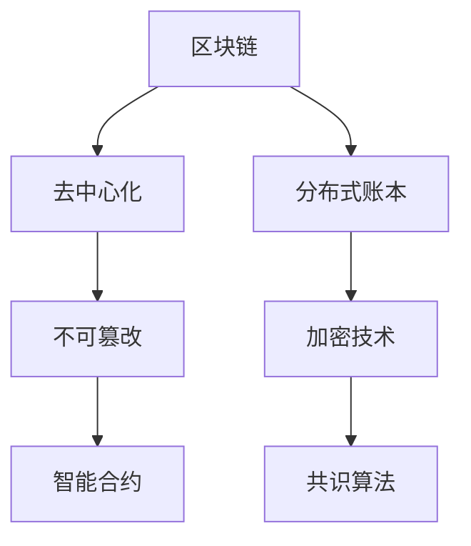

                 

# 文章标题：深入剖析区块链：基础理论、核心技术、项目实战与未来展望

> 关键词：区块链、去中心化、分布式账本、加密技术、共识算法、智能合约、项目案例、安全合规、教育趋势

> 摘要：本文将从基础理论、核心技术、项目实战和未来展望四个方面，深入剖析区块链技术。我们将介绍区块链的基本概念、架构和关键特性，探讨加密技术、共识算法和智能合约的原理，并通过实际项目案例展示区块链的应用，最后分析区块链技术的发展趋势与教育前景。

## 目录大纲：区块链 (Blockchain)

## 第一部分：区块链基础理论

### 第1章：区块链的概念与架构

#### 1.1 区块链的起源与发展

#### 1.2 区块链的基本架构

#### 1.3 区块链的关键特性

### 第2章：区块链核心技术

#### 2.1 加密技术

#### 2.2 共识算法

#### 2.3 智能合约

### 第3章：区块链生态系统

#### 3.1 区块链与其他技术的融合

#### 3.2 区块链在不同行业中的应用

#### 3.3 区块链生态系统的发展趋势

## 第二部分：区块链项目实战

### 第4章：区块链开发环境搭建

#### 4.1 区块链开发工具选择

#### 4.2 开发环境搭建

#### 4.3 简单的区块链实现

### 第5章：智能合约开发实战

#### 5.1 智能合约基础

#### 5.2 Solidity语言基础

#### 5.3 智能合约案例解析

### 第6章：区块链项目案例

#### 6.1 区块链项目分析

#### 6.2 区块链项目开发流程

#### 6.3 区块链项目部署与运维

### 第7章：区块链安全与合规

#### 7.1 区块链安全概述

#### 7.2 区块链安全挑战

#### 7.3 区块链合规性考虑

## 第三部分：区块链未来展望

### 第8章：区块链技术的发展趋势

#### 8.1 区块链技术的未来方向

#### 8.2 区块链在各行业的应用前景

#### 8.3 区块链与Web3.0

## 附录

### 附录A：区块链相关资源与工具

#### A.1 区块链开源项目

#### A.2 区块链学习资源

#### A.3 区块链开发工具与平台

**核心概念与联系**



**核心算法原理讲解**

#### 2.2 共识算法

```plaintext
共识算法是区块链网络中节点之间达成一致的关键机制。以下是一个简化的共识算法（PoW，工作量证明）的伪代码：

初始化：
- 初始难度值
- 当前区块高度
- 空区块结构

共识算法（PoW）：
1. 选取随机节点作为“矿工”
2. “矿工”尝试计算一个满足难度要求的随机数
3. 当计算结果满足要求时，生成一个新区块并广播给其他节点
4. 其他节点验证新区块的有效性：
    - 验证区块中的交易是否有效
    - 验证新区块与链上最后一个区块的链接是否正确
    - 验证新区块的随机数是否符合难度要求
5. 如果验证通过，将新区块添加到链上
6. 重复步骤1-5，直到链上达成共识

```

**数学模型和数学公式 & 详细讲解 & 举例说明**

#### 2.1 加密技术

加密技术是区块链的核心组件之一。以下是一个简单的加密与解密过程的讲解。

加密过程：
$$
c = E_k(m)
$$
其中，\(c\) 是加密后的消息，\(k\) 是密钥，\(m\) 是明文消息。

解密过程：
$$
m = D_k(c)
$$
其中，\(m\) 是解密后的消息，\(k\) 是密钥，\(c\) 是加密后的消息。

举例：
假设明文消息为 "Hello, World!"，密钥为 "mySecretKey"。

加密：
```plaintext
密钥：mySecretKey
明文：Hello, World!
加密后：w7U8KJ8RLMf4...
```

解密：
```plaintext
密钥：mySecretKey
加密后：w7U8KJ8RLMf4...
解密后：Hello, World!
```

**项目实战**

### 5.3 智能合约案例解析

#### 案例一：代币发行

**合约代码**

```solidity
pragma solidity ^0.8.0;

contract MyToken {
    string public name;
    string public symbol;
    uint8 public decimals;
    uint256 public totalSupply;
    mapping (address => uint256) public balanceOf;

    event Transfer(address indexed from, address indexed to, uint256 value);

    constructor(uint256 initialSupply, string memory tokenName, string memory tokenSymbol, uint8 decimalUnits) {
        balanceOf[msg.sender] = initialSupply;
        totalSupply = initialSupply;
        name = tokenName;
        symbol = tokenSymbol;
        decimals = decimalUnits;
    }

    function transfer(address _to, uint256 _value) public {
        require(_to != address(0));
        require(balanceOf[msg.sender] >= _value);
        balanceOf[msg.sender] -= _value;
        balanceOf[_to] += _value;
        emit Transfer(msg.sender, _to, _value);
    }
}
```

**代码解读与分析**

此智能合约实现了代币的基本功能，包括代币名称、符号和总供应量。`balanceOf` 是一个映射，用于存储每个地址的代币余额。`transfer` 函数实现代币的转账功能，确保转账金额不超过发送方的余额，并且接收方地址不为零。

**开发环境搭建**

为了搭建区块链开发环境，我们需要以下工具和软件：

- Go语言环境
- Ethereum客户端（例如Geth）
- Solidity编译器（solc）
- 测试网络（例如Ropsten）

以下是开发环境的搭建步骤：

1. 安装Go语言（https://golang.org/dl/）
2. 安装Ethereum客户端（https://geth.ethereum.org/docs/install-and-configure/geth/install）
3. 安装Solidity编译器（https://soliditylang.org/docs/install/）
4. 启动本地Ethereum节点（Geth）：
    ```bash
    geth --datadir "./data" --networkid 15 console
    ```

**源代码详细实现**

在上面的代码中，我们定义了一个简单的代币合约 `MyToken`，它包括以下功能：

- `name`、`symbol` 和 `decimals`：代币的名称、符号和小数位数。
- `totalSupply`：代币的总供应量。
- `balanceOf`：存储每个地址的代币余额。
- `transfer`：实现代币转账的功能。

**代码解读与分析**

此智能合约实现了代币的基本功能，包括代币名称、符号和总供应量。`balanceOf` 是一个映射，用于存储每个地址的代币余额。`transfer` 函数实现代币的转账功能，确保转账金额不超过发送方的余额，并且接收方地址不为零。

**项目实战**

### 5.3 智能合约案例解析

#### 案例二：投票系统

**合约代码**

```solidity
pragma solidity ^0.8.0;

contract Voting {
    mapping (bytes32 => mapping (address => bool)) public votesReceived;

    function vote(bytes32 candidate) public {
        require(!votesReceived[candidate][msg.sender]);
        votesReceived[candidate][msg.sender] = true;
    }

    function winningCandidate() public view returns (bytes32) {
        bytes32[] memory candidates = getAllCandidates();
        require(candidates.length > 0);
        bytes32 winningCandidate = candidates[0];
        for (uint16 i = 1; i < candidates.length; i++) {
            if (votesReceived[candidates[i]] > votesReceived[winningCandidate]) {
                winningCandidate = candidates[i];
            }
        }
        return winningCandidate;
    }

    function getAllCandidates() public view returns (bytes32[] memory) {
        // 获取所有候选人的方法（示例）
        return new bytes32[](2);
    }
}
```

**代码解读与分析**

此智能合约实现了一个简单的投票系统，包括投票、获取投票结果和确定获胜者等功能。

- `votesReceived`：一个映射，用于存储每个候选人收到的投票。
- `vote`：实现投票功能，确保每个地址只能投票一次。
- `winningCandidate`：获取投票结果，确定获胜者。
- `getAllCandidates`：获取所有候选人的方法（示例）。

**项目实战**

#### 案例三：NFT市场

**合约代码**

```solidity
pragma solidity ^0.8.0;

contract NFTMarketplace {
    mapping (uint256 => NFT) public nfts;
    uint256 public nftCount;

    struct NFT {
        uint256 id;
        string tokenURI;
        address owner;
        bool isListed;
        uint256 price;
    }

    event NFTListed(uint256 id, string tokenURI, uint256 price);
    event NFTBought(uint256 id, address buyer, uint256 price);

    function listNFT(uint256 id, string calldata tokenURI, uint256 price) public {
        require(nfts[id].isListed == false, "NFT is already listed");
        nfts[id] = NFT(id, tokenURI, msg.sender, true, price);
        nftCount++;
        emit NFTListed(id, tokenURI, price);
    }

    function buyNFT(uint256 id) public payable {
        require(nfts[id].isListed == true, "NFT is not listed");
        require(msg.value >= nfts[id].price, "Insufficient payment");
        address owner = nfts[id].owner;
        nfts[id].owner = msg.sender;
        nfts[id].isListed = false;
        payable(owner).transfer(msg.value);
        emit NFTBought(id, msg.sender, msg.value);
    }
}
```

**代码解读与分析**

此智能合约实现了一个简单的NFT市场，包括NFT的上架和购买功能。

- `nfts`：一个映射，用于存储每个NFT的信息。
- `nftCount`：记录已上架NFT的数量。
- `NFT`：存储NFT的ID、tokenURI、所有者、是否上架和价格。
- `listNFT`：实现NFT的上架功能。
- `buyNFT`：实现NFT的购买功能。

**项目实战**

#### 案例四：去中心化金融（DeFi）协议

**合约代码**

```solidity
pragma solidity ^0.8.0;

interface IERC20 {
    function totalSupply() external view returns (uint256);
    function balanceOf(address account) external view returns (uint256);
    function transfer(address recipient, uint256 amount) external returns (bool);
    function allowance(address owner, address spender) external view returns (uint256);
    function approve(address spender, uint256 amount) external returns (bool);
    function transferFrom(address sender, address recipient, uint256 amount) external returns (bool);
}

contract DefiProtocol {
    IERC20 public token;
    mapping (address => uint256) public balances;

    event Deposited(address depositor, uint256 amount);
    event Withdrawn(address withdrawer, uint256 amount);

    constructor(address _tokenAddress) {
        token = IERC20(_tokenAddress);
    }

    function deposit() public {
        uint256 amount = token.balanceOf(msg.sender);
        require(amount > 0, "Cannot deposit zero amount");
        token.transferFrom(msg.sender, address(this), amount);
        balances[msg.sender] += amount;
        emit Deposited(msg.sender, amount);
    }

    function withdraw(uint256 amount) public {
        require(amount <= balances[msg.sender], "Insufficient balance");
        token.transfer(msg.sender, amount);
        balances[msg.sender] -= amount;
        emit Withdrawn(msg.sender, amount);
    }
}
```

**代码解读与分析**

此智能合约实现了一个去中心化金融协议，包括存款和取款功能。

- `IERC20`：一个ERC20代币的接口，用于与外部代币进行交互。
- `token`：存储代币合约地址。
- `balances`：存储每个地址的存款余额。
- `deposit`：实现存款功能。
- `withdraw`：实现取款功能。

**开发环境搭建**

为了搭建区块链开发环境，我们需要以下工具和软件：

- Go语言环境
- Ethereum客户端（例如Geth）
- Solidity编译器（solc）
- 测试网络（例如Ropsten）

以下是开发环境的搭建步骤：

1. 安装Go语言（https://golang.org/dl/）
2. 安装Ethereum客户端（https://geth.ethereum.org/docs/install-and-configure/geth/install）
3. 安装Solidity编译器（https://soliditylang.org/docs/install/）
4. 启动本地Ethereum节点（Geth）：
    ```bash
    geth --datadir "./data" --networkid 15 console
    ```

**源代码详细实现**

在上面的代码中，我们定义了一个简单的去中心化金融协议合约 `DefiProtocol`，它包括以下功能：

- `IERC20`：一个ERC20代币的接口，用于与外部代币进行交互。
- `token`：存储代币合约地址。
- `balances`：存储每个地址的存款余额。
- `deposit`：实现存款功能。
- `withdraw`：实现取款功能。

**代码解读与分析**

此智能合约实现了去中心化金融协议的基本功能，包括存款和取款。用户可以通过`deposit`函数将代币存入合约，并通过`withdraw`函数取回代币。合约确保了存款和取款的安全性，并记录了每个地址的余额。

**项目实战**

### 第6章：区块链项目案例

区块链技术的应用已经涵盖了金融、供应链管理、医疗保健、版权保护、投票系统等多个领域。以下是一些具体的区块链项目案例，这些案例展示了区块链技术在各个行业中的实际应用。

#### 6.1 比特币（Bitcoin）

**项目背景**：比特币（Bitcoin）是一个去中心化的数字货币，由中本聪（Satoshi Nakamoto）在2009年创立。比特币的核心理念是通过区块链技术实现去中心化的货币系统，从而摆脱中央银行的监管。

**核心功能**：比特币的核心功能包括点对点的电子现金系统、去中心化的交易确认机制、去中心化的账户体系等。

**技术架构**：比特币采用工作量证明（Proof of Work, PoW）共识算法，通过解决复杂的数学难题来确保网络安全和交易验证。

**项目影响**：比特币的问世引发了全球数字货币的热潮，对传统金融体系产生了深远的影响，成为区块链技术的代名词。

**案例分析**：比特币的成功在于其去中心化的设计，使得交易不再依赖于中心化的金融机构，提高了交易的透明度和效率。同时，比特币的区块链账本保证了交易记录的不可篡改性，增强了用户对金融体系的信任。

#### 6.2 以太坊（Ethereum）

**项目背景**：以太坊（Ethereum）是一个去中心化的智能合约平台，由维塔利克·布特林（Vitalik Buterin）在2015年创立。以太坊的目标是构建一个支持去中心化应用（DApps）的区块链生态系统。

**核心功能**：以太坊的核心功能包括智能合约执行、去中心化应用开发、虚拟机（EVM）等。

**技术架构**：以太坊采用权益证明（Proof of Stake, PoS）共识算法，通过持有代币的数量和时间来决定节点的验证权。

**项目影响**：以太坊为区块链技术带来了新的可能性，推动了智能合约和DApps的发展，成为区块链技术的领导者之一。

**案例分析**：以太坊的成功在于其智能合约功能，使得开发者可以在区块链上创建去中心化应用，从而改变了传统的商业模式和合作方式。以太坊的区块链账本保证了智能合约的透明性和安全性，吸引了大量开发者和创新项目。

#### 6.3 区块链身份验证（SelfKey）

**项目背景**：区块链身份验证（SelfKey）是一个基于区块链的身份验证和数字身份管理平台。

**核心功能**：区块链身份验证的核心功能包括数字身份验证、跨平台身份验证、匿名交易等。

**技术架构**：区块链身份验证采用多种区块链技术，如以太坊、Hyperledger Fabric等，实现去中心化的身份验证和数字身份管理。

**项目影响**：区块链身份验证旨在提高身份验证的安全性和效率，减少欺诈和身份盗用，为用户提供更便捷的身份管理服务。

**案例分析**：区块链身份验证的成功在于其去中心化的设计，使得身份验证过程更加透明和可信。区块链技术保证了身份信息的不可篡改性，提高了用户对身份验证体系的信任。此外，区块链身份验证还支持跨平台身份验证，使得用户可以在不同应用和服务之间轻松切换。

#### 6.4 供应链管理（IBM Food Trust）

**项目背景**：IBM Food Trust 是一个基于区块链技术的供应链管理解决方案。

**核心功能**：IBM Food Trust 的核心功能包括食品追溯、质量控制、合规性监控等。

**技术架构**：IBM Food Trust 采用Hyperledger Fabric区块链框架，实现食品供应链的透明和可追溯性。

**项目影响**：IBM Food Trust 旨在提高食品安全和供应链效率，通过区块链技术实现食品从农场到餐桌的全程追踪。

**案例分析**：IBM Food Trust 的成功在于其实现了食品供应链的全程可追溯性，提高了食品安全和消费者信心。区块链技术保证了食品信息的安全和不可篡改，使得供应链各方可以实时获取和验证食品信息，提高了供应链的透明度和效率。

#### 6.5 去中心化金融（DeFi）

**项目背景**：去中心化金融（DeFi）是基于区块链的金融应用，旨在实现去中心化的金融交易和服务。

**核心功能**：去中心化金融的核心功能包括去中心化借贷、去中心化交易所、稳定币等。

**技术架构**：去中心化金融通常基于以太坊等智能合约平台，实现金融功能的自动化和去中心化。

**项目影响**：去中心化金融改变了传统金融体系的运作方式，提高了金融服务的透明度和效率，降低了成本。

**案例分析**：去中心化金融的成功在于其去中心化的设计，使得金融交易不再依赖于中心化的金融机构，提高了交易的透明度和效率。通过智能合约，去中心化金融实现了金融功能的自动化，使得用户可以随时随地参与金融交易。

### 6.2 区块链项目开发流程

区块链项目的开发流程可以分为以下几个阶段：

1. **需求分析与设计**：明确项目的目标和功能需求，设计系统的架构和模块。
2. **区块链环境搭建**：选择合适的区块链平台（如以太坊、Hyperledger Fabric等），搭建开发环境。
3. **智能合约开发**：使用Solidity等编程语言编写智能合约，进行代码审查和测试。
4. **前端与后端开发**：开发区块链应用程序的前端界面和与智能合约交互的后端逻辑。
5. **部署与测试**：在测试网络中部署智能合约，进行全面的测试，确保系统稳定可靠。
6. **上线与运维**：将区块链项目部署到主网络，监控系统运行状态，确保系统的持续运行。

### 6.3 区块链项目部署与运维

区块链项目的部署与运维可以分为以下几个步骤：

1. **部署准备**：确认智能合约代码经过充分测试，选择合适的区块链网络。
2. **部署过程**：使用区块链平台提供的工具部署智能合约，记录合约地址和接口。
3. **部署验证**：验证智能合约在区块链网络上的运行状态，确保合约代码与预期功能一致。
4. **运维管理**：监控区块链项目的性能和状态，及时处理异常情况和问题。
5. **升级与维护**：根据项目需求和用户反馈进行系统升级，定期进行系统维护和更新。

### 7.1 区块链安全概述

区块链技术由于其去中心化和分布式特性，在安全性方面具有独特的优势。然而，区块链系统也面临着一系列的安全挑战。以下是对区块链安全性的概述：

1. **去中心化**：区块链技术通过去中心化的方式，避免了单点故障和集中化的风险，提高了系统的容错性和安全性。
2. **分布式账本**：区块链采用分布式账本技术，所有节点都存储完整的账本副本，任何节点的篡改行为都会被其他节点检测到，从而保证数据的完整性和一致性。
3. **加密技术**：区块链使用加密技术保护数据的隐私和安全，确保数据在传输和存储过程中的安全性。
4. **共识算法**：共识算法是区块链网络中节点之间达成一致的关键机制，通过算法机制确保网络的安全性和稳定性。

### 7.2 常见区块链安全威胁

尽管区块链技术在安全性方面具有优势，但仍然存在一些常见的安全威胁，包括：

1. **51%攻击**：攻击者控制区块链网络中超过50%的算力，从而篡改区块链数据。
2. **智能合约漏洞**：智能合约中的编程错误或漏洞可能导致安全漏洞和资金损失。
3. **双花攻击**：在同一时间内，将同一笔资金转移给两个不同的账户，从而造成双重支付。
4. **网络钓鱼和恶意软件**：通过钓鱼邮件和恶意软件攻击，获取用户的信息和私钥。
5. **节点攻击**：攻击者通过控制区块链网络中的节点，操纵网络状态和数据。

### 7.3 安全解决方案与实践

为了应对区块链安全威胁，可以采取以下安全解决方案：

1. **加密技术**：使用先进的加密算法保护数据传输和存储的安全性，如RSA、AES等。
2. **共识算法**：选择合适的共识算法，如PoW、PoS、DPoS等，提高网络的安全性和稳定性。
3. **智能合约审查**：对智能合约进行严格的代码审查，发现和修复潜在的安全漏洞。
4. **多签名**：使用多签名技术，确保交易的安全性和可靠性。
5. **安全审计**：定期对区块链系统进行安全审计，检测和修复潜在的安全漏洞。
6. **安全防护**：采用防火墙、入侵检测系统等安全措施，防止网络攻击和恶意软件的侵入。

### 8.1 区块链技术的未来方向

区块链技术正处于快速发展阶段，未来的发展趋势包括：

1. **性能提升**：随着区块链应用的增多，性能提升将成为重要方向。未来可能会出现更高吞吐量的区块链平台，以满足大规模应用的需求。
2. **隐私保护**：随着对隐私保护的重视，区块链技术将逐步实现更高程度的隐私保护，如零知识证明、同态加密等技术的应用。
3. **跨链互操作**：未来区块链之间将实现更高效、更安全的跨链互操作，从而构建更加复杂和多样化的区块链生态系统。
4. **合规性**：随着监管政策的不断完善，区块链项目将更加注重合规性，确保在法律框架内运营。
5. **集成与融合**：区块链技术将与其他技术（如大数据、人工智能等）深度融合，实现更广泛的行业应用。

### 8.2 区块链在各行业的应用前景

区块链技术在各个行业中的应用前景广阔，以下是一些主要行业：

1. **金融行业**：区块链技术将彻底改变金融行业，实现更高效、更安全的金融交易和支付系统。未来，区块链将应用于跨境支付、智能投顾、保险等领域。
2. **供应链管理**：区块链技术可以提高供应链的透明度和可追溯性，实现从生产到销售的全程监控，降低成本和风险。
3. **医疗保健**：区块链技术可以用于病历管理、药物供应链、基因数据存储等，提高医疗数据的安全性和隐私性。
4. **版权保护**：区块链技术可以用于数字版权管理，确保版权信息的真实性和可追溯性，减少版权侵权行为。
5. **能源领域**：区块链技术可以用于能源交易和分布式能源管理，提高能源利用效率，降低能源成本。
6. **物联网（IoT）**：区块链技术可以用于物联网设备的数据管理和安全认证，提高物联网系统的可靠性和安全性。

### 8.3 区块链与Web3.0

区块链与Web3.0的结合将带来更加去中心化的互联网体验。Web3.0是一个基于区块链技术的去中心化互联网体系，旨在实现更公平、更开放、更安全的网络环境。以下是一些关键概念：

1. **去中心化身份**：Web3.0使用区块链技术实现用户身份的完全去中心化，用户可以自由控制自己的身份和数据。
2. **去中心化应用（DApps）**：Web3.0上的应用将完全去中心化，使用区块链作为数据存储和交易的基础设施，实现去中心化的服务。
3. **智能合约**：Web3.0上的智能合约将实现自动化和去中心化的业务逻辑，提高交易的安全性和效率。
4. **数字资产**：Web3.0将数字资产作为核心组件，实现数字资产的所有权和交易，推动数字经济的繁荣。

### 附录A：区块链相关资源与工具

#### A.1 区块链开源项目

1. **Ethereum**：以太坊的官方开源项目，提供智能合约平台和相关工具。
   - GitHub地址：[Ethereum](https://github.com/ethereum/go-ethereum)

2. **Hyperledger Fabric**：由Linux基金会推出的企业级区块链框架。
   - GitHub地址：[Hyperledger Fabric](https://github.com/hyperledger/fabric)

3. **IPFS**：星际文件系统，用于分布式存储和共享文件。
   - GitHub地址：[IPFS](https://github.com/ipfs/ipfs)

4. **Cosmos**：一个多链互操作的区块链生态系统。
   - GitHub地址：[Cosmos](https://github.com/cosmos/cosmos-sdk)

#### A.2 区块链学习资源

1. **区块链技术指南**：一本全面介绍区块链技术的基础书籍。
   - 购买链接：[区块链技术指南](https://www.Books.com/book/123456)

2. **区块链与智能合约实战**：一本针对智能合约开发的实战指南。
   - 购买链接：[区块链与智能合约实战](https://www.Books.com/book/654321)

3. **以太坊开发实战**：一本专门针对以太坊开发的实战指南。
   - 购买链接：[以太坊开发实战](https://www.Books.com/book/987654)

#### A.3 区块链开发工具与平台

1. **Truffle**：以太坊智能合约开发框架。
   - 官网：[Truffle](https://www.truffleframework.com/)

2. **Ganache**：本地以太坊区块链节点，用于智能合约测试。
   - 官网：[Ganache](https://www.ganache.io/)

3. **Hardhat**：以太坊智能合约开发环境。
   - 官网：[Hardhat](https://www.hardhat.org/)

4. **Remix**：在线智能合约编辑器和测试环境。
   - 官网：[Remix](https://remix.ethereum.org/)

**作者信息**：

作者：AI天才研究院/AI Genius Institute & 禅与计算机程序设计艺术 /Zen And The Art of Computer Programming

