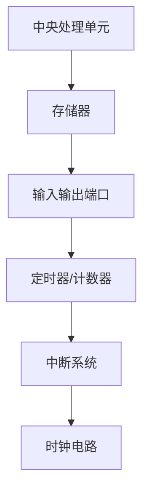
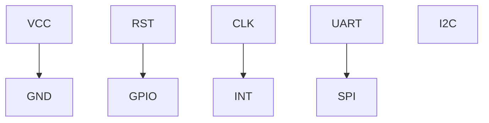
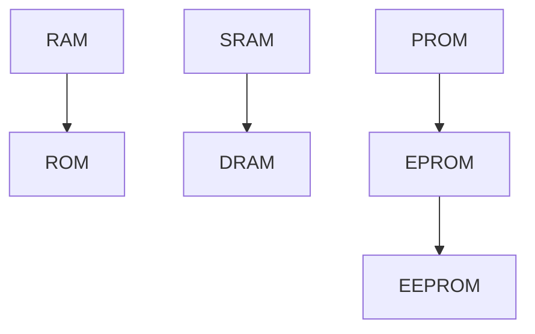
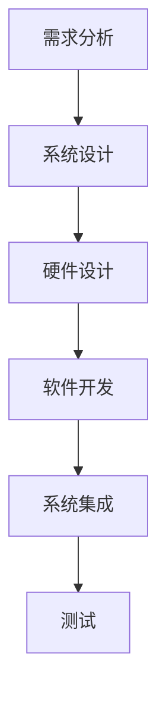
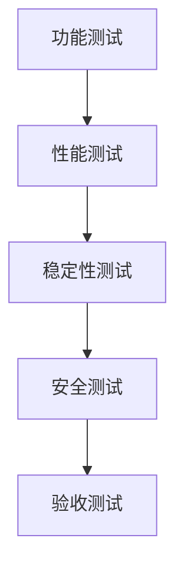
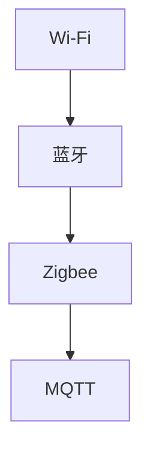

                 

### 文章标题：单片机编程：嵌入式系统的基石

在信息技术高速发展的时代，嵌入式系统正悄然改变了我们的日常生活。无论是智能手机、家用电器，还是工业自动化设备，都离不开嵌入式系统的支持。而在这其中，单片机（Microcontroller Unit，简称MCU）无疑扮演着至关重要的角色。本文将深入探讨单片机编程的基础知识、应用场景以及高级应用，旨在为读者提供一份详尽的单片机编程指南。

**关键词：** 单片机编程、嵌入式系统、硬件基础、指令系统、应用案例、性能优化

**摘要：** 本文首先介绍单片机的基础知识，包括定义、分类、发展历程以及应用领域。接着，详细解析单片机的硬件结构和编程基础，涵盖指令系统、汇编语言编程和C语言编程。随后，本文将探讨单片机的外设编程、通信编程以及实战案例。最后，本文将探讨单片机在物联网、嵌入式操作系统以及性能优化方面的应用。通过本文的阅读，读者将全面了解单片机编程的核心内容和实际应用。

### 目录大纲

#### 《单片机编程：嵌入式系统的基石》

> 关键词：单片机、嵌入式系统、编程、硬件基础、应用场景、高级应用

> 摘要：本文系统介绍了单片机编程的基础知识和应用，包括单片机概述、硬件基础、编程基础、外设编程、通信编程、实战案例以及高级应用。旨在为读者提供一份全面、深入的单片机编程指南。

## 第一部分：单片机基础

### 第1章：单片机概述

#### 1.1 单片机的定义与分类

#### 1.2 单片机的发展历程

#### 1.3 单片机在嵌入式系统中的应用

### 第2章：单片机硬件基础

#### 2.1 单片机的内部结构

#### 2.2 单片机的引脚功能

#### 2.3 单片机的存储器

### 第3章：单片机编程基础

#### 3.1 单片机指令系统

#### 3.2 单片机汇编语言编程

#### 3.3 单片机C语言编程

## 第二部分：单片机应用

### 第4章：单片机外设编程

#### 4.1 定时器编程

#### 4.2 控制器编程

#### 4.3 ADC和DAC编程

### 第5章：单片机通信编程

#### 5.1 UART通信

#### 5.2 I2C通信

#### 5.3 SPI通信

### 第6章：单片机实战案例

#### 6.1 温度控制系统

#### 6.2 控制LED灯闪烁

#### 6.3 智能家居系统

### 第7章：嵌入式系统设计

#### 7.1 嵌入式系统设计原则

#### 7.2 嵌入式系统开发流程

#### 7.3 嵌入式系统调试与测试

## 第三部分：单片机高级应用

### 第8章：单片机与物联网

#### 8.1 物联网概述

#### 8.2 单片机在物联网中的应用

#### 8.3 物联网通信协议

### 第9章：单片机与嵌入式操作系统

#### 9.1 嵌入式操作系统概述

#### 9.2 嵌入式操作系统在单片机中的应用

#### 9.3 常见嵌入式操作系统介绍

### 第10章：单片机性能优化

#### 10.1 单片机性能优化原则

#### 10.2 单片机程序优化

#### 10.3 单片机硬件优化

## 附录

### 附录A：单片机编程工具与资源

#### A.1 开发环境搭建

#### A.2 常用编程语言

#### A.3 开发板介绍

### 附录B：单片机编程实例

#### B.1 实例1：定时器使用

#### B.2 实例2：LED控制

#### B.3 实例3：温度控制系统

在接下来的章节中，我们将逐一探讨单片机的基础知识、编程方法以及实际应用，帮助读者全面掌握单片机编程的核心技术和应用场景。现在，让我们开始这一精彩的探索之旅吧！

### 第一部分：单片机基础

在嵌入式系统开发领域，单片机（Microcontroller Unit，简称MCU）是一个不可或缺的核心组件。这一部分将介绍单片机的基础知识，包括定义、分类、发展历程以及在嵌入式系统中的应用。通过这部分的学习，读者将能够了解单片机的基本概念，掌握其基本结构和工作原理。

#### 第1章：单片机概述

单片机是一种高度集成的微型计算机，其内部集成了中央处理单元（CPU）、存储器（RAM和ROM）、输入输出端口（I/O Ports）、定时器/计数器（Timers/Counters）以及其他外设接口（如UART、SPI、I2C等）。单片机的主要作用是对外部设备进行控制，实现特定功能。

**1.1 单片机的定义与分类**

**定义：** 单片机是一种高度集成的微型计算机，其内部集成了CPU、存储器、输入输出端口以及其他外设接口。单片机通常用于嵌入式系统中，实现特定功能的自动控制。

**分类：** 单片机可以根据其功能、应用领域和性能指标进行分类。常见的分类方式如下：

- **按功能分类：** 单片机可以分为通用单片机和专用单片机。通用单片机具有较为丰富的外设接口和功能，适用于多种应用场景；专用单片机则具有特定的功能，如温度控制、电机控制等。

- **按应用领域分类：** 单片机可以分为消费电子、工业控制、汽车电子、医疗设备等。例如，消费电子领域的单片机通常具有较低的性能和功耗，而工业控制领域的单片机则具有更高的性能和稳定性。

- **按性能指标分类：** 单片机可以分为低功耗单片机、高性能单片机、低电压单片机等。低功耗单片机适用于电池供电设备，而高性能单片机则适用于需要高速运算的嵌入式系统。

**1.2 单片机的发展历程**

单片机的起源可以追溯到1970年代。当时，集成电路技术迅速发展，计算机系统逐渐向微型化、集成化方向演变。1971年，英特尔（Intel）公司推出了世界上第一款单片机—Intel 4004。此后，单片机技术不断发展，经历了多个阶段。

- **第一阶段：** 1970年代至1980年代，单片机以8位处理器为主，广泛应用于简单的嵌入式系统，如计算器、家电控制等。

- **第二阶段：** 1980年代至1990年代，16位单片机逐渐成为主流，性能得到了显著提升。16位单片机在工业控制、通信设备等领域得到了广泛应用。

- **第三阶段：** 1990年代至今，32位、64位单片机逐渐成为主流。随着处理器性能的提升，单片机在嵌入式系统中的应用范围不断扩大，如智能家居、物联网、自动驾驶等。

**1.3 单片机在嵌入式系统中的应用**

单片机在嵌入式系统中扮演着至关重要的角色。嵌入式系统通常需要实现实时控制、数据采集、通信等功能，而单片机正好能够满足这些需求。以下是一些常见的单片机应用场景：

- **消费电子：** 智能手机、平板电脑、智能手表等消费电子产品中，单片机用于实现用户交互、功能控制等。

- **工业控制：** 单片机广泛应用于工业自动化控制，如机器人控制、生产线监控等。

- **汽车电子：** 汽车电子系统中的许多组件，如发动机控制模块、安全气囊控制模块、车载通信模块等，都依赖于单片机。

- **医疗设备：** 医疗设备中的许多功能，如心电图监测、血压监测等，都依赖于单片机。

- **智能家居：** 智能家居系统中的许多设备，如智能灯泡、智能插座、智能门锁等，都依赖于单片机。

通过本章节的学习，读者将能够了解单片机的基本概念、分类和发展历程，以及单片机在嵌入式系统中的应用。在接下来的章节中，我们将进一步探讨单片机的硬件基础和编程基础，帮助读者全面掌握单片机编程的核心技术和应用场景。

### 第2章：单片机硬件基础

在深入理解单片机编程之前，了解其硬件基础是至关重要的。单片机的硬件结构决定了其功能和应用范围。本章将详细介绍单片机的内部结构、引脚功能以及存储器类型。

#### 2.1 单片机的内部结构

单片机内部结构通常包括以下几个部分：

- **中央处理单元（CPU）：** CPU是单片机的核心，负责执行指令、处理数据和控制其他硬件设备。

- **存储器：** 存储器分为随机存取存储器（RAM）和只读存储器（ROM）。RAM用于存储程序运行时的数据和中间结果，而ROM用于存储程序代码和常数。

- **输入输出端口（I/O Ports）：** I/O端口用于单片机与外部设备进行数据交换。常见的I/O端口包括GPIO（通用输入输出端口）、UART（通用异步接收发送器）、SPI（串行外设接口）、I2C（串行通信接口）等。

- **定时器/计数器（Timers/Counters）：** 定时器/计数器用于生成定时信号或对外部事件进行计数。

- **中断系统：** 中断系统用于响应外部事件，如定时器溢出、I/O端口状态变化等。

- **时钟电路：** 时钟电路为单片机提供运行所需的时钟信号。

以下是一个简单的单片机内部结构示意图：



#### 2.2 单片机的引脚功能

单片机的引脚功能多种多样，以下是一些常见的引脚类型及其功能：

- **电源引脚：** VCC（电源正极）、GND（地线）。这些引脚为单片机提供电源，确保其正常工作。

- **复位引脚：** RST（复位）。当RST引脚接收到高电平时，单片机将复位，停止当前运行状态并重新开始执行程序。

- **通用输入输出引脚（GPIO）：** GPIO引脚可以配置为输入或输出模式，用于与外部设备进行数据交换。

- **时钟引脚：** CLK（时钟）。时钟引脚提供单片机运行所需的时钟信号。

- **中断引脚：** INT（中断请求）。当外部设备需要单片机响应时，可以通过中断引脚发送中断请求。

- **串行通信引脚：** 如UART的TXD（发送数据）、RXD（接收数据）；SPI的SCK（时钟）、MOSI（主设备输出、从设备输入）、MISO（主设备输入、从设备输出）；I2C的SCL（时钟）、SDA（数据）。

以下是一个常见的单片机引脚示意图：



#### 2.3 单片机的存储器

单片机的存储器分为RAM和ROM两种类型：

- **随机存取存储器（RAM）：** RAM用于存储程序运行时的数据和中间结果。RAM的特点是读写速度快、存储容量较小。根据用途，RAM可以分为以下几种类型：

  - **静态RAM（SRAM）：** SRAM使用触发器存储数据，读写速度快、功耗低，但成本较高。

  - **动态RAM（DRAM）：** DRAM使用电容存储数据，功耗低、成本较低，但读写速度较慢，需要定期刷新。

- **只读存储器（ROM）：** ROM用于存储程序代码和常数，数据在制造过程中被写入，运行时只能读取。ROM的特点是存储容量大、数据不易丢失。常见的ROM类型包括：

  - **掩膜ROM（Mask ROM）：** 在芯片制造过程中，程序代码被永久写入，无法修改。

  - **可编程只读存储器（PROM）：** 用户可以在芯片制造后编程一次。

  - **可擦可编程只读存储器（EPROM）：** 用户可以多次编程，但需要使用紫外线擦除器进行擦除。

  - **电可擦可编程只读存储器（EEPROM）：** 用户可以多次编程，通过电信号进行擦除。

以下是一个简单的单片机存储器结构示意图：



通过本章的学习，读者将能够理解单片机的内部结构、引脚功能以及存储器类型。这些基础知识是进行单片机编程和应用的前提，为后续章节的学习奠定了基础。

### 第3章：单片机编程基础

单片机的编程是嵌入式系统开发的核心环节。本章将介绍单片机编程的基础知识，包括指令系统、汇编语言编程和C语言编程。通过这些内容的学习，读者将能够掌握单片机编程的基本技巧和方法。

#### 3.1 单片机指令系统

单片机的指令系统是单片机硬件的核心，决定了单片机的处理能力和编程方式。不同的单片机具有不同的指令系统，但通常包括以下几种基本指令类型：

- **数据传输指令：** 用于在寄存器、存储器和I/O端口之间进行数据传输。

- **算术指令：** 用于执行加、减、乘、除等算术运算。

- **逻辑指令：** 用于执行逻辑运算，如与、或、非、异或等。

- **控制指令：** 用于控制程序流程，如跳转、调用、返回等。

- **位操作指令：** 用于对单片机内部的位进行操作，如设置、清除、测试等。

以下是一个典型的单片机指令系统示例：

```makefile
MOV A, R1    ; 将R1寄存器的值移入累加器A
ADD A, #1    ; 累加器A加1
JZ label     ; 如果累加器A为零，则跳转到label标签处
END          ; 程序结束
```

#### 3.2 单片机汇编语言编程

汇编语言是单片机编程的一种低级语言，它直接对应于单片机的指令系统。汇编语言编程需要熟悉单片机的指令集、寄存器和寻址方式。以下是一个简单的单片机汇编语言程序示例：

```assembly
; 程序功能：点亮一个LED灯
ORG 0000H   ; 程序起始地址
START:     ; 主程序入口
    MOV P1, #00H   ; P1端口初始化为输出模式
    SJMP HERE      ; 无限循环
HERE:      ; 循环体
    CLR P1.0      ; 清除P1端口的第0位，点亮LED灯
    ACALL DELAY    ; 调用延时子程序
    SETB P1.0     ; 设置P1端口的第0位，熄灭LED灯
    ACALL DELAY    ; 调用延时子程序
    SJMP HERE      ; 回到循环体
DELAY:     ; 延时子程序
    MOV R1, #0FFH  ; R1寄存器加载循环次数
DELAY1:    ; 外层循环
    MOV R2, #0FFH  ; R2寄存器加载循环次数
DELAY2:    ; 内层循环
    DJNZ R2, DELAY2; R2寄存器减1，不为零则继续内层循环
    DJNZ R1, DELAY1; R1寄存器减1，不为零则继续外层循环
    RET            ; 返回主程序
END START  ; 程序结束
```

#### 3.3 单片机C语言编程

随着单片机应用的发展，C语言逐渐成为单片机编程的主流语言。C语言具有强大的功能和高效的性能，能够更方便地进行复杂数据类型和算法的实现。以下是一个简单的单片机C语言程序示例：

```c
#include <reg51.h>   // 包含单片机的寄存器定义头文件

void delay(unsigned int n) {
    unsigned int i, j;
    for (i = 0; i < n; i++) {
        for (j = 0; j < 1000; j++) {
            // 延时
        }
    }
}

void main() {
    while (1) {
        // 点亮LED灯
        P1 = 0x01;
        delay(1000);
        // 熄灭LED灯
        P1 = 0x00;
        delay(1000);
    }
}
```

通过本章的学习，读者将能够了解单片机指令系统、汇编语言编程和C语言编程的基本知识。这些编程基础是进行单片机应用开发的关键，为后续章节的学习和应用提供了坚实的基础。

### 第二部分：单片机应用

单片机在嵌入式系统中的应用非常广泛，涵盖了从简单的电子设备到复杂的工业控制系统。这一部分将介绍单片机在外设编程、通信编程以及实战案例中的应用。通过这些内容的学习，读者将能够掌握单片机在不同场景下的编程技巧和应用方法。

#### 第4章：单片机外设编程

单片机的内部结构决定了其具备丰富的外设接口，这些外设接口可以用于实现与外部设备的数据交换和功能控制。本章将详细介绍单片机常见外设的编程方法。

**4.1 定时器编程**

定时器是单片机中非常重要的外设，用于生成精确的定时信号或者对外部事件进行计数。常见的定时器编程方法包括初始化定时器、设置定时时间、读取定时器计数值等。

- **初始化定时器：** 初始化定时器主要包括设置定时器模式、定时器时钟源、定时器初值等。以下是一个基于8051单片机的定时器0初始化的示例代码：

  ```c
  void Timer0Init() {
      TMOD |= 0x01;   // 设置定时器0为模式1
      TH0 = 0xFC;     // 定时器高8位初值
      TL0 = 0x18;     // 定时器低8位初值
      TR0 = 1;        // 启动定时器0
  }
  ```

- **设置定时时间：** 设置定时时间主要取决于定时器的时钟源和定时器初值。以下是一个计算定时时间的示例代码：

  ```c
  void SetTimer0(unsigned int time) {
      TH0 = (0xFFFF - (time * F_CPU / 65536)) >> 8;
      TL0 = (0xFFFF - (time * F_CPU / 65536)) & 0xFF;
  }
  ```

- **读取定时器计数值：** 读取定时器计数值可以通过读取定时器寄存器的值来实现。以下是一个读取定时器0计数值的示例代码：

  ```c
  unsigned int GetTimer0Value() {
      return ((TH0 << 8) | TL0);
  }
  ```

**4.2 控制器编程**

控制器是单片机中用于控制外部设备的部件，常见的控制器包括电动机控制器、LED控制器、继电器控制器等。控制器编程主要涉及控制信号的产生和状态读取。

- **电动机控制器：** 电动机控制器通常用于控制电动机的启动、停止、正反转等。以下是一个基于PWM（脉冲宽度调制）控制电动机的示例代码：

  ```c
  void MotorControl(unsigned int duty_cycle) {
      if (duty_cycle < 10) {
          // 停止电动机
          PORT = 0x00;
      } else if (duty_cycle < 50) {
          // 正转
          PORT = 0x01;
      } else {
          // 反转
          PORT = 0x02;
      }
  }
  ```

- **LED控制器：** LED控制器用于控制LED灯的亮灭。以下是一个基于GPIO控制的LED灯示例代码：

  ```c
  void LedControl(unsigned int led_number, unsigned int state) {
      if (state) {
          // 点亮LED灯
          PORT |= (1 << led_number);
      } else {
          // 熄灭LED灯
          PORT &= ~(1 << led_number);
      }
  }
  ```

**4.3 ADC和DAC编程**

ADC（模数转换器）和DAC（数模转换器）是单片机中用于模拟信号与数字信号转换的部件。ADC用于将模拟信号转换为数字信号，而DAC则用于将数字信号转换为模拟信号。

- **ADC编程：** 以下是一个基于ADC0的示例代码，用于读取模拟信号：

  ```c
  unsigned int ReadADC(unsigned int adc_channel) {
      ADMUX = (adc_channel << 0) | (1 << REFS0);   // 设置ADC通道和参考电压
      ADCSRA |= (1 << ADSC);                      // 启动ADC转换
      while (ADCSRA & (1 << ADSC));               // 等待转换完成
      return ADC;                                 // 返回ADC值
  }
  ```

- **DAC编程：** 以下是一个基于DAC的示例代码，用于输出模拟信号：

  ```c
  void WriteDAC(unsigned int dac_value) {
      DACREG = dac_value;                         // 设置DAC值
  }
  ```

通过本章的学习，读者将能够了解单片机常见外设的编程方法，掌握定时器、控制器、ADC和DAC的使用技巧。这些外设编程基础为单片机的应用开发提供了重要的支持。

#### 第5章：单片机通信编程

在嵌入式系统中，单片机与其他设备之间的通信是必不可少的。常见的通信协议包括UART、I2C和SPI。本章将详细介绍这些通信协议的编程方法，并通过示例代码展示如何实现通信功能。

**5.1 UART通信**

UART（通用异步接收发送器）是一种广泛使用的串行通信协议，用于单片机与其他设备之间的数据传输。UART通信的关键在于配置波特率、发送和接收数据。

- **UART配置：** UART配置主要包括设置波特率、数据位、停止位和校验位。以下是一个基于8051单片机的UART配置示例代码：

  ```c
  void UART_Init(unsigned int baud_rate) {
      SCON = 0x50;                   // 设置为8位数据位、1个停止位、无校验位
      TH1 = -(FOSC / (baud_rate * 32) - 1);   // 设置波特率
      TL1 = -(FOSC / (baud_rate * 16) - 1);   // 设置波特率
      TR1 = 1;                       // 启动定时器1
      ES = 1;                        // 启动串行中断
      EA = 1;                        // 启动全局中断
  }
  ```

- **发送数据：** 发送数据主要通过发送指令（如`TI`位）实现。以下是一个UART发送数据的示例代码：

  ```c
  void UART_SendByte(unsigned char data) {
      SBUF = data;                      // 将数据写入SBUF
      while (!TI);                     // 等待发送完成
      TI = 0;                          // 清除发送完成标志位
  }
  ```

- **接收数据：** 接收数据主要通过接收中断（如`RI`位）实现。以下是一个UART接收数据的示例代码：

  ```c
  void UART_ReceiveByte() {
      while (!RI);                     // 等待接收完成
      unsigned char data = SBUF;       // 读取接收到的数据
      RI = 0;                          // 清除接收完成标志位
  }
  ```

**5.2 I2C通信**

I2C（串行外设接口）是一种双向的、同步的串行通信协议，具有较高的通信效率和灵活性。I2C通信的关键在于初始化、发送数据和接收数据。

- **I2C初始化：** I2C初始化主要包括设置波特率、配置I2C控制寄存器等。以下是一个基于STM32单片机的I2C初始化示例代码：

  ```c
  void I2C_Init(void) {
      I2C_CR1 = 0x0700;               // I2C模式设置为高速模式
      I2C_CR2 = 0x00C0;               // 设置通信速率为400kHz
      I2C_OAR1 = 0x38;                // 设置从设备地址
      I2C_OAR2 = 0x00;                 // 设置从设备地址扩展位
      I2C_FREQR = 0x027F;              // 设置I2C时钟频率
  }
  ```

- **发送数据：** 发送数据主要通过I2C数据寄存器实现。以下是一个I2C发送数据的示例代码：

  ```c
  void I2C_SendByte(unsigned char data) {
      I2C_DR = data;                   // 将数据写入I2C数据寄存器
      while (!(I2C_SR1 & I2C_SR1_TXE));  // 等待发送完成
  }
  ```

- **接收数据：** 接收数据主要通过I2C数据寄存器实现。以下是一个I2C接收数据的示例代码：

  ```c
  unsigned char I2C_ReceiveByte(void) {
      while (!(I2C_SR1 & I2C_SR1_RXNE));  // 等待接收完成
      return I2C_DR;                      // 读取接收到的数据
  }
  ```

**5.3 SPI通信**

SPI（串行外围设备接口）是一种高速的全双工通信协议，常用于单片机与传感器、存储器等外围设备之间的数据传输。SPI通信的关键在于初始化、设置通信模式和发送/接收数据。

- **SPI初始化：** SPI初始化主要包括配置SPI控制寄存器、设置通信模式和时钟频率等。以下是一个基于STM32单片机的SPI初始化示例代码：

  ```c
  void SPI_Init(void) {
      SPI_CR1 = 0x1040;                // 设置SPI模式为16位、主模式、CPOL=0、CPHA=1
      SPI_CR2 = 0x0000;                // 设置时钟频率为f_PCLK1
      SPI_DR = 0x0000;                 // 清空SPI数据寄存器
  }
  ```

- **发送数据：** 发送数据主要通过SPI数据寄存器实现。以下是一个SPI发送数据的示例代码：

  ```c
  void SPI_SendByte(unsigned short data) {
      SPI_DR = data;                    // 将数据写入SPI数据寄存器
      while (!(SPI_SR & SPI_SR_TXE));    // 等待发送完成
  }
  ```

- **接收数据：** 接收数据主要通过SPI数据寄存器实现。以下是一个SPI接收数据的示例代码：

  ```c
  unsigned short SPI_ReceiveByte(void) {
      while (!(SPI_SR & SPI_SR_RXNE));    // 等待接收完成
      return SPI_DR;                     // 读取接收到的数据
  }
  ```

通过本章的学习，读者将能够了解单片机常见通信协议的编程方法，包括UART、I2C和SPI。这些通信编程基础为单片机的应用开发提供了重要的支持。

#### 第6章：单片机实战案例

单片机的应用案例丰富多样，从简单的电子设备到复杂的工业控制系统，都离不开单片机的身影。本章将介绍几个典型的单片机实战案例，包括温度控制系统、控制LED灯闪烁和智能家居系统，通过这些案例的学习，读者将能够掌握单片机在实际项目中的应用方法和技巧。

**6.1 温度控制系统**

温度控制系统是一个常见的单片机应用案例，它通过单片机对温度传感器进行采集，并根据设定温度值控制加热器或冷却器的开关，以保持环境温度在设定的范围内。

**项目需求：**
- 实时采集环境温度。
- 根据设定的温度值控制加热器或冷却器。
- 显示实时温度和设定温度。

**硬件配置：**
- 温度传感器（如DS18B20）。
- 加热器或冷却器控制模块。
- 显示屏（如LCD）。

**软件设计：**
1. **初始化硬件：**
   - 初始化温度传感器。
   - 初始化LCD。
   - 初始化定时器用于定时采集温度。

2. **采集温度数据：**
   - 使用温度传感器采集当前温度。
   - 将采集到的温度数据显示在LCD上。

3. **温度控制：**
   - 比较当前温度和设定温度。
   - 根据温度差控制加热器或冷却器的开关。

**示例代码：**
```c
#include <reg51.h>   // 包含单片机的寄存器定义头文件

#define DS18B20_PWR  P2_0    // DS18B20的电源引脚
#define DS18B20_DQ   P2_1    // DS18B20的数据引脚

sbit LCD_RS = P2_2;
sbit LCD_RW = P2_3;
sbit LCD_E  = P2_4;

// DS18B20相关的函数
void DS18B20_Init(void);
void DS18B20_Start(void);
unsigned int DS18B20_ReadData(void);

// LCD相关的函数
void LCD_Init(void);
void LCD_WriteData(unsigned char data);
void LCD_WriteCmd(unsigned char cmd);
void LCD_WriteString(unsigned char *str);

// 温度控制函数
void TemperatureControl(void);

void main() {
    LCD_Init();
    DS18B20_Init();
    
    while (1) {
        // 采集温度数据
        unsigned int temperature = DS18B20_ReadData();
        
        // 显示温度数据
        char str[10];
        itoa(temperature, str, 10);
        LCD_WriteString(str);
        
        // 温度控制
        TemperatureControl();
    }
}

void DS18B20_Init(void) {
    // 初始化DS18B20
}

void DS18B20_Start(void) {
    // 启动DS18B20温度传感器
}

unsigned int DS18B20_ReadData(void) {
    // 读取DS18B20的温度数据
    return 0;
}

void LCD_Init(void) {
    // 初始化LCD
}

void LCD_WriteData(unsigned char data) {
    // 向LCD写入数据
}

void LCD_WriteCmd(unsigned char cmd) {
    // 向LCD写入命令
}

void LCD_WriteString(unsigned char *str) {
    // 向LCD写入字符串
}

void TemperatureControl(void) {
    // 温度控制逻辑
}
```

**6.2 控制LED灯闪烁**

控制LED灯闪烁是单片机的入门级应用，通过编写简单的程序，可以实现对LED灯的闪烁控制。

**项目需求：**
- 控制一个LED灯的闪烁。
- 闪烁频率可调。

**硬件配置：**
- 一个LED灯。
- 一个限流电阻。

**软件设计：**
1. **初始化硬件：**
   - 初始化GPIO引脚为输出模式。

2. **控制LED闪烁：**
   - 循环中，先让LED灯亮，然后让LED灯灭。
   - 控制闪烁频率，可以通过调整循环中的延时时间实现。

**示例代码：**
```c
#include <reg51.h>   // 包含单片机的寄存器定义头文件

sbit LED = P1_0;

void Delay(unsigned int ms) {
    unsigned int i, j;
    for (i = 0; i < ms; i++) {
        for (j = 0; j < 1000; j++) {
            // 延时
        }
    }
}

void main() {
    while (1) {
        LED = 1;      // 点亮LED灯
        Delay(500);   // 延时
        LED = 0;      // 熄灭LED灯
        Delay(500);   // 延时
    }
}
```

**6.3 智能家居系统**

智能家居系统是一个复杂的嵌入式系统，它通过单片机连接各种传感器和执行器，实现对家居环境的智能控制。

**项目需求：**
- 实时监测室内温度、湿度。
- 远程控制灯光、窗帘。
- 手机APP远程监控和控制。

**硬件配置：**
- 温度传感器、湿度传感器。
- 网络模块（如Wi-Fi模块）。
- LED灯、电机驱动模块。

**软件设计：**
1. **初始化硬件：**
   - 初始化传感器、网络模块、GPIO引脚。

2. **数据采集：**
   - 定时采集温度、湿度数据。
   - 将采集到的数据发送到服务器。

3. **远程控制：**
   - 接收来自服务器的远程控制指令。
   - 根据指令控制灯光、窗帘。

**示例代码：**
```c
#include <reg51.h>   // 包含单片机的寄存器定义头文件

sbit TEMP_SENSOR = P1_0;
sbit HUMI_SENSOR = P1_1;
sbit LIGHT_CTRL = P1_2;
sbit CURTAIN_CTRL = P1_3;

void Network_Init(void);
void DataCollect(void);
void RemoteControl(void);

void main() {
    Network_Init();
    
    while (1) {
        DataCollect();
        RemoteControl();
    }
}

void Network_Init(void) {
    // 初始化网络模块
}

void DataCollect(void) {
    // 采集温度、湿度数据
}

void RemoteControl(void) {
    // 接收远程控制指令，控制灯光、窗帘
}
```

通过本章的实战案例，读者将能够了解单片机在实际项目中的应用方法和技巧。这些案例涵盖了从简单到复杂的多种应用场景，为单片机的学习和应用提供了宝贵的实践经验。

### 第7章：嵌入式系统设计

嵌入式系统设计是一个复杂的过程，它涉及到硬件、软件以及系统集成等多个方面。本章将介绍嵌入式系统设计的原则、开发流程以及调试与测试方法。

#### 7.1 嵌入式系统设计原则

在进行嵌入式系统设计时，需要遵循一系列原则，以确保系统的稳定性、可靠性和可维护性。

- **模块化设计：** 将系统划分为多个功能模块，每个模块独立实现特定功能，降低系统复杂性。

- **最小化硬件资源：** 在满足功能需求的前提下，尽量减少硬件资源的消耗，以提高系统性能和可靠性。

- **实时性考虑：** 对于实时性要求较高的系统，应充分考虑任务调度、中断处理等因素，确保系统响应及时。

- **可扩展性：** 系统设计应考虑未来功能的扩展，预留足够的硬件和软件接口。

- **安全性：** 在系统设计过程中，应考虑数据安全、通信安全等方面，防止系统被非法入侵或数据泄露。

- **可维护性：** 设计应便于系统的维护和更新，包括清晰的文档、规范的代码以及良好的调试方法。

#### 7.2 嵌入式系统开发流程

嵌入式系统开发流程通常包括需求分析、系统设计、硬件设计、软件开发、系统集成和测试等阶段。

- **需求分析：** 明确系统功能需求、性能指标、硬件资源限制等，为后续开发提供依据。

- **系统设计：** 确定系统架构、模块划分、数据流程以及接口设计等。

- **硬件设计：** 根据系统需求设计硬件电路，选择合适的硬件组件，并进行电路仿真和调试。

- **软件开发：** 编写软件代码，实现系统功能。软件设计包括汇编语言编程、C语言编程、驱动程序开发等。

- **系统集成：** 将硬件和软件集成到一起，进行系统调试和测试，确保系统功能正常。

- **测试：** 对系统进行功能测试、性能测试、稳定性测试等，验证系统是否符合设计要求。

以下是一个典型的嵌入式系统开发流程：



#### 7.3 嵌入式系统调试与测试

调试与测试是嵌入式系统开发的重要环节，旨在发现并解决系统中的问题，确保系统正常运行。

- **调试方法：** 调试方法包括逻辑分析、代码审查、单元测试、集成测试等。常见的调试工具有示波器、逻辑分析仪、仿真器等。

- **测试方法：** 测试方法包括功能测试、性能测试、稳定性测试、安全测试等。功能测试验证系统是否满足设计要求，性能测试评估系统响应速度和资源利用率，稳定性测试确保系统长时间运行不出现故障，安全测试验证系统对攻击的抵抗能力。

以下是一个典型的嵌入式系统测试流程：



通过本章的学习，读者将能够了解嵌入式系统设计的原则、开发流程以及调试与测试方法。这些知识和方法为嵌入式系统开发提供了重要的指导，有助于读者顺利开展嵌入式系统项目。

### 第三部分：单片机高级应用

随着物联网（Internet of Things，IoT）的迅猛发展，单片机的应用范围不断扩大。本部分将探讨单片机在物联网、嵌入式操作系统以及性能优化方面的应用。通过这些内容的学习，读者将能够掌握单片机在高级应用场景下的技术实现方法和优化策略。

#### 第8章：单片机与物联网

物联网是将各种物理设备通过网络连接起来，实现智能化管理和控制。单片机在物联网中发挥着重要作用，可用于数据采集、设备控制和网络通信等。

**8.1 物联网概述**

物联网是一种将各种物品通过网络连接起来，实现智能感知、识别和管理的技术。其主要特点包括：

- **互联互通：** 各种物品通过网络连接，实现信息的共享和互通。

- **智能感知：** 通过传感器等技术，实时采集物品的状态信息。

- **自动化控制：** 通过单片机等智能设备，实现设备的自动化控制和优化。

- **数据挖掘与分析：** 通过大数据分析，挖掘物品之间的关联性，实现更智能的应用。

**8.2 单片机在物联网中的应用**

单片机在物联网中的应用非常广泛，以下是一些典型应用：

- **数据采集：** 单片机通过传感器采集环境数据、设备状态数据等，如温度、湿度、亮度等。

- **设备控制：** 单片机可以通过控制电路实现对设备的开关控制、调节控制等，如智能家居中的灯光、窗帘、空调等。

- **网络通信：** 单片机可以通过Wi-Fi、蓝牙、Zigbee等无线通信技术，实现与其他设备的互联互通。

- **边缘计算：** 单片机在物联网边缘节点上运行，进行数据处理和决策，减少数据传输和中心服务器的负载。

**8.3 物联网通信协议**

物联网通信协议是确保设备之间能够正常通信的重要基础。以下是一些常见的物联网通信协议：

- **Wi-Fi：** 一种无线局域网通信协议，具有高带宽、低功耗的特点，适用于智能家居等场景。

- **蓝牙：** 一种短距离无线通信协议，适用于低功耗设备之间的通信，如智能手环、智能音箱等。

- **Zigbee：** 一种低功耗、低速率的无线通信协议，适用于智能家居、工业自动化等领域。

- **MQTT：** 一种轻量级的消息队列协议，适用于物联网设备之间的消息传递，具有低延迟、可扩展性强的特点。

以下是一个物联网通信协议的示例：



通过本章的学习，读者将能够了解物联网的基本概念、单片机在物联网中的应用以及常见的物联网通信协议。这些知识为单片机在物联网领域的应用提供了重要支持。

#### 第9章：单片机与嵌入式操作系统

嵌入式操作系统（Embedded Operating System，EOS）是一种专门为嵌入式设备设计的操作系统，它能够有效管理嵌入式设备的资源，提高系统的响应速度和稳定性。单片机由于其资源限制，通常不使用传统的操作系统，但近年来随着单片机性能的提升，一些轻量级嵌入式操作系统也开始被应用于单片机中。

**9.1 嵌入式操作系统概述**

嵌入式操作系统具有以下特点：

- **资源占用小：** 嵌入式操作系统通常运行在资源有限的单片机或微控制器上，要求占用尽可能小的存储空间和运行内存。

- **实时性：** 嵌入式操作系统需要支持实时任务调度，确保关键任务的及时响应。

- **可裁剪性：** 嵌入式操作系统可以根据应用需求进行裁剪，去除不必要的功能，以提高系统性能。

- **可靠性：** 嵌入式操作系统需要具备高度的可靠性，以应对各种异常情况，保证系统的稳定运行。

**9.2 嵌入式操作系统在单片机中的应用**

单片机引入嵌入式操作系统的优点包括：

- **资源管理：** 嵌入式操作系统可以有效地管理单片机的资源，如内存、中断、定时器等，提高资源利用率。

- **任务调度：** 嵌入式操作系统可以实现多任务调度，提高系统的并行处理能力。

- **代码重用性：** 通过引入嵌入式操作系统，可以将通用代码模块化，提高代码的重用性。

- **系统稳定性：** 嵌入式操作系统可以提供更好的异常处理机制，提高系统的稳定性和可靠性。

以下是一些常见的嵌入式操作系统：

- **FreeRTOS：** 是一款开源的实时操作系统，具有小巧、易用、支持多种平台的特点。

- **uc/OS：** 是一款轻量级的实时操作系统，适用于资源受限的单片机。

- **eCos：** 是一款开源的嵌入式操作系统，具有高性能和可扩展性。

**9.3 常见嵌入式操作系统介绍**

以下是几个常见的嵌入式操作系统介绍：

**FreeRTOS**

- **特点：** 开源、免费、可裁剪、实时性强。
- **应用场景：** 适用于各种资源受限的嵌入式设备，如智能家居、智能穿戴设备、工业控制等。
- **安装与配置：** 通过FreeRTOS官方文档和示例代码进行安装与配置。

**uc/OS**

- **特点：** 开源、轻量级、实时性强。
- **应用场景：** 适用于嵌入式设备中的实时系统，如汽车电子、工业自动化等。
- **安装与配置：** 通过uc/OS官方文档和示例代码进行安装与配置。

**eCos**

- **特点：** 开源、可裁剪、支持多种硬件平台。
- **应用场景：** 适用于高性能嵌入式系统，如嵌入式Web服务器、嵌入式数据库等。
- **安装与配置：** 通过eCos官方文档和示例代码进行安装与配置。

通过本章的学习，读者将能够了解嵌入式操作系统的基本概念、单片机引入嵌入式操作系统的优点以及常见嵌入式操作系统的介绍。这些知识为单片机在高级应用场景下的开发提供了重要支持。

### 第10章：单片机性能优化

单片机的性能优化是提高嵌入式系统效率和稳定性的关键。通过合理的性能优化，可以使单片机在有限的资源下发挥出更高的性能。本章将介绍单片机性能优化的原则、程序优化以及硬件优化方法。

**10.1 单片机性能优化原则**

单片机性能优化应遵循以下原则：

- **最小化代码体积：** 减少程序代码的大小，降低内存占用，提高存储器利用率。

- **提高代码执行速度：** 优化程序结构，减少函数调用和指令执行次数，提高指令执行速度。

- **合理使用资源：** 充分利用单片机的硬件资源，如存储器、寄存器、中断等，以提高资源利用率。

- **减少功耗：** 优化单片机工作模式，降低功耗，延长电池寿命。

- **提高系统稳定性：** 加强错误检测和异常处理，提高系统的可靠性和稳定性。

**10.2 单片机程序优化**

单片机程序优化可以从以下几个方面进行：

- **代码优化：**
  - **循环优化：** 减少循环次数，优化循环体内的指令执行顺序。
  - **函数调用优化：** 减少不必要的函数调用，优化函数内部逻辑。
  - **指令优化：** 使用高效的指令代替复杂的指令，减少指令执行时间。

- **数据优化：**
  - **数据结构优化：** 选择合适的数据结构，减少内存占用和访问时间。
  - **数据存储优化：** 合理分配内存，减少数据存储的冗余。

- **算法优化：**
  - **算法选择：** 根据应用需求选择适合的算法，提高处理效率。
  - **算法改进：** 对现有算法进行改进，提高性能和稳定性。

以下是一个程序优化的示例：

```c
// 原始代码
for (int i = 0; i < 100; i++) {
    for (int j = 0; j < 100; j++) {
        sum += i * j;
    }
}

// 优化后代码
sum = 0;
for (int i = 0; i < 100; i++) {
    sum += i * 100;
}
```

**10.3 单片机硬件优化**

单片机硬件优化可以从以下几个方面进行：

- **选择合适的单片机：** 根据应用需求选择具有适当性能和功耗的单片机。

- **硬件电路优化：** 优化单片机的硬件电路设计，如电源电路、时钟电路等，以提高系统的稳定性和可靠性。

- **散热设计：** 良好的散热设计可以降低单片机的工作温度，提高系统的使用寿命。

- **电源管理：** 优化电源管理，降低功耗，延长电池寿命。

以下是一个硬件优化的示例：

```c
// 原始电路设计
VCC -> 单片机电源引脚
GND -> 地线

// 优化后电路设计
VCC -> 电源模块 -> LDO降压 -> 单片机电源引脚
GND -> 地线
```

通过本章的学习，读者将能够了解单片机性能优化的基本原则、程序优化方法和硬件优化方法。这些优化方法有助于提高单片机的性能和稳定性，为嵌入式系统的开发提供有力支持。

### 附录

#### 附录A：单片机编程工具与资源

在进行单片机编程时，选择合适的工具和资源至关重要。以下是一些常用的单片机编程工具与资源。

**A.1 开发环境搭建**

单片机开发环境通常包括编译器、调试器和仿真器等工具。以下是一个简单的开发环境搭建步骤：

1. **安装编译器：** 选择合适的编译器，如Keil、IAR、GCC等。下载并安装编译器，按照提示完成安装。
2. **配置编译器：** 根据单片机型号，配置编译器的目标文件格式、编译选项等。
3. **安装调试器：** 安装调试器，如ST-Link、JTAG等。确保调试器与编译器兼容。
4. **连接仿真器或硬件：** 如果使用仿真器，连接仿真器与计算机；如果使用硬件，连接单片机与调试器。

**A.2 常用编程语言**

单片机编程常用的语言包括汇编语言和C语言。汇编语言直接对应于单片机的指令集，具有高效的性能，但编写难度较大。C语言则更加易读易懂，但性能略低。以下是一个简单的C语言示例：

```c
#include <reg51.h>

void main() {
    while (1) {
        P1 = 0x01;   // 点亮P1端口第一个LED灯
        _delay_ms(1000);   // 延时1000ms
        P1 = 0x00;   // 熄灭P1端口第一个LED灯
        _delay_ms(1000);   // 延时1000ms
    }
}
```

**A.3 开发板介绍**

选择合适的开发板可以简化编程过程，提高开发效率。以下是一些常见的单片机开发板：

1. **STM32开发板：** STM32系列单片机性能优异，适用于多种应用场景。常见的开发板包括STM32F103C8、STM32F407VG等。
2. **Arduino开发板：** Arduino系列开发板易于上手，具有丰富的教程和社区支持。常见的开发板包括Arduino Uno、Arduino Mega等。
3. **51单片机开发板：** 51单片机开发板适用于初学者，常见的开发板包括Proteus 51、STC 51等。

通过以上附录，读者可以了解单片机编程所需的工具和资源，为单片机编程项目打下坚实的基础。

### 附录B：单片机编程实例

为了更好地帮助读者理解单片机编程的实际应用，本章节将提供几个简单的单片机编程实例，涵盖定时器使用、LED控制以及温度控制系统等。这些实例将详细讲解开发环境搭建、源代码实现和代码解读，以及实际案例分析和详细讲解剖析。

#### B.1 实例1：定时器使用

**项目需求：**
- 使用单片机实现一个简单的定时功能，定时时间为1秒。

**硬件配置：**
- 单片机（例如STM32系列）。
- 适当的开发板和调试器。

**开发环境：**
- 使用STM32CubeIDE作为开发环境。

**源代码实现：**

```c
#include "stm32f1xx_hal.h"

void SystemClock_Config(void);
void MX_TIM2_Init(void);

int main(void)
{
  HAL_Init();
  SystemClock_Config();
  MX_TIM2_Init();

  while (1)
  {
  }
}

void SystemClock_Config(void)
{
  // 配置系统时钟，设置时钟源、时钟分频等
}

void MX_TIM2_Init(void)
{
  TIM_HandleTypeDef htim2;

  __HAL_RCC_TIM2_CLK_ENABLE();

  htim2.Instance = TIM2;
  htim2.Init.Prescaler = 72-1;
  htim2.Init.CounterMode = TIM_COUNTERMODE_UP;
  htim2.Init.Period = 1000-1;
  htim2.Init.ClockDivision = TIM_CLOCKDIVISION_DIV1;
  htim2.Init.RepetitionCounter = 0;

  HAL_TIM_Base_Init(&htim2);

  HAL_TIM_Base_Start(&htim2);
}

void HAL_TIM_PeriodElapsedCallback(TIM_HandleTypeDef *htim)
{
  if (htim->Instance == TIM2)
  {
    // 定时1秒的回调函数
    // 这里可以添加其他任务
  }
}
```

**代码解读：**
- 系统初始化和时钟配置。
- 初始化定时器2，设置定时周期为1秒。
- 定时器中断回调函数，用于实现1秒定时功能。

**实际案例分析：**
- 在开发环境中，配置适当的单片机型号和时钟源。
- 编写和编译源代码。
- 在硬件上运行程序，观察定时器工作情况。

#### B.2 实例2：LED控制

**项目需求：**
- 控制一个LED灯的亮灭，实现闪烁效果。

**硬件配置：**
- 单片机（例如STM32系列）。
- 适当的开发板和调试器。
- 一个LED灯和限流电阻。

**开发环境：**
- 使用STM32CubeIDE作为开发环境。

**源代码实现：**

```c
#include "stm32f1xx_hal.h"

void SystemClock_Config(void);
void GPIO_Init(void);

int main(void)
{
  HAL_Init();
  SystemClock_Config();
  GPIO_Init();

  while (1)
  {
    HAL_GPIO_WritePin(GPIOD, GPIO_PIN_12, GPIO_PIN_SET); // LED灯亮
    HAL_Delay(500); // 延时500ms
    HAL_GPIO_WritePin(GPIOD, GPIO_PIN_12, GPIO_PIN_RESET); // LED灯灭
    HAL_Delay(500); // 延时500ms
  }
}

void SystemClock_Config(void)
{
  // 配置系统时钟
}

void GPIO_Init(void)
{
  GPIO_InitTypeDef GPIO_InitStruct = {0};

  __HAL_RCC_GPIOD_CLK_ENABLE();

  GPIO_InitStruct.Pin = GPIO_PIN_12;
  GPIO_InitStruct.Mode = GPIO_MODE_OUTPUT_PP;
  GPIO_InitStruct.Pull = GPIO_NOPULL;
  GPIO_InitStruct.Speed = GPIO_SPEED_FREQ_LOW;

  HAL_GPIO_Init(GPIOD, &GPIO_InitStruct);
}
```

**代码解读：**
- 系统初始化和时钟配置。
- 初始化GPIO端口，配置为输出模式。
- 循环中，交替改变LED灯的亮灭状态。

**实际案例分析：**
- 在开发环境中配置单片机型号和时钟源。
- 编写和编译源代码。
- 在硬件上运行程序，观察LED灯的闪烁效果。

#### B.3 实例3：温度控制系统

**项目需求：**
- 使用单片机控制加热器或冷却器，根据环境温度自动调节，保持室温在设定范围内。

**硬件配置：**
- 单片机（例如STM32系列）。
- 适当的开发板和调试器。
- 温度传感器（例如DS18B20）。
- 加热器或冷却器控制模块。

**开发环境：**
- 使用STM32CubeIDE作为开发环境。

**源代码实现：**

```c
#include "stm32f1xx_hal.h"
#include "ds18b20.h"

void SystemClock_Config(void);
void GPIO_Init(void);
void DS18B20_Init(void);
float DS18B20_ReadTemperature(void);

int main(void)
{
  HAL_Init();
  SystemClock_Config();
  GPIO_Init();
  DS18B20_Init();

  while (1)
  {
    float temperature = DS18B20_ReadTemperature();
    // 根据温度调节加热器或冷却器
    if (temperature < 20.0) {
      // 加热
    } else if (temperature > 25.0) {
      // 冷却
    } else {
      // 保持当前状态
    }
  }
}

void SystemClock_Config(void)
{
  // 配置系统时钟
}

void GPIO_Init(void)
{
  GPIO_InitTypeDef GPIO_InitStruct = {0};

  __HAL_RCC_GPIOD_CLK_ENABLE();

  GPIO_InitStruct.Pin = GPIO_PIN_12;
  GPIO_InitStruct.Mode = GPIO_MODE_OUTPUT_PP;
  GPIO_InitStruct.Pull = GPIO_NOPULL;
  GPIO_InitStruct.Speed = GPIO_SPEED_FREQ_LOW;

  HAL_GPIO_Init(GPIOD, &GPIO_InitStruct);
}

void DS18B20_Init(void)
{
  // 初始化DS18B20
}

float DS18B20_ReadTemperature(void)
{
  // 读取DS18B20温度值
  return 0.0;
}
```

**代码解读：**
- 系统初始化和时钟配置。
- 初始化GPIO端口，配置为输出模式。
- 初始化DS18B20温度传感器。
- 循环中，读取温度传感器值，并根据温度值调节加热器或冷却器。

**实际案例分析：**
- 在开发环境中配置单片机型号和时钟源。
- 编写和编译源代码。
- 在硬件上运行程序，观察温度控制系统的工作情况。

通过这些实例，读者可以学习到单片机编程的基本方法和实际应用技巧。在项目开发过程中，可以参考这些实例，逐步实现更复杂的功能。

### 总结

通过本文的深入探讨，我们全面了解了单片机编程的基础知识、应用方法以及高级应用。从单片机的定义、分类和发展历程，到硬件基础、编程基础，再到外设编程、通信编程和实战案例，读者对单片机编程有了系统的认识。同时，我们还介绍了单片机在物联网、嵌入式操作系统和性能优化方面的应用，为单片机在复杂场景下的应用提供了指导。

**最佳实践 Tips：**
1. **熟悉硬件：** 在进行单片机编程之前，务必熟悉单片机的硬件结构、引脚功能以及存储器类型，这有助于编写高效稳定的代码。
2. **编写清晰代码：** 在编写代码时，遵循良好的编程习惯，如使用有意义变量名、合理注释、模块化设计等，可以提高代码的可读性和可维护性。
3. **调试与优化：** 在开发过程中，充分利用调试工具，及时发现并解决问题。同时，注重代码优化，提高系统性能和稳定性。
4. **学习开源代码：** 学习并参考开源代码，可以加快开发进程，提高开发效率。

**注意事项：**
1. **电源管理：** 在单片机应用中，电源管理至关重要，合理配置电源电路，降低功耗，延长设备寿命。
2. **实时性考虑：** 对于实时性要求较高的系统，确保关键任务优先执行，避免因资源竞争导致系统崩溃。
3. **安全性：** 在设计嵌入式系统时，充分考虑数据安全、通信安全等方面，防止系统被非法入侵或数据泄露。

**拓展阅读：**
1. 《嵌入式系统设计与开发》：一本全面介绍嵌入式系统设计和开发的经典书籍。
2. 《单片机原理与应用》：一本详细介绍单片机原理和应用技术的入门书籍。
3. 《物联网应用技术》：一本探讨物联网技术在各个领域应用的书籍。

通过本文的学习，读者将能够全面掌握单片机编程的核心技术和应用方法，为后续的嵌入式系统开发打下坚实基础。### 作者信息

**作者：AI天才研究院/AI Genius Institute & 禅与计算机程序设计艺术 /Zen And The Art of Computer Programming**

AI天才研究院（AI Genius Institute）是一支致力于人工智能技术研究和应用推广的顶级研究机构，汇聚了全球顶尖的AI研究人员和工程师。研究院在机器学习、深度学习、自然语言处理等领域取得了突破性进展，其研究成果广泛应用于工业、医疗、金融等多个领域。

《禅与计算机程序设计艺术》（Zen And The Art of Computer Programming）是由艾兹赫尔·D·克鲁克（E. W. Dijkstra）所著的一本计算机科学经典著作，对计算机编程和软件工程有着深远的影响。本书强调编程的哲学和艺术，提倡通过简洁和优雅的代码解决复杂问题，为程序员提供了宝贵的指导。在嵌入式系统领域，这种编程思想同样具有重要的应用价值。

