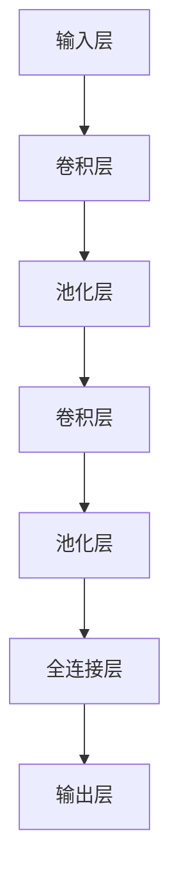

                 


### 卷积神经网络（Convolutional Neural Networks, CNN）原理与代码实例讲解

#### 引言

卷积神经网络（CNN）是深度学习领域中最流行的模型之一，它通过模仿人脑视觉系统的机制，对图像数据进行了高效的建模和处理。CNN在图像识别、视频处理、文本分析等多个领域都有广泛的应用，从简单的手写数字识别到复杂的物体检测，其应用范围不断扩大。本文将详细讲解CNN的基本原理、核心概念、算法原理，并通过代码实例帮助读者深入理解CNN的实际应用。

#### 目录大纲

## 卷积神经网络（Convolutional Neural Networks, CNN）原理与代码实例讲解

### 关键词

- 卷积神经网络
- 图像识别
- 深度学习
- 算法原理
- 代码实例

### 摘要

本文将系统地介绍卷积神经网络（CNN）的基本原理、核心概念、算法原理，并通过具体代码实例帮助读者理解CNN的实际应用。文章将分为以下几个部分：

1. 引言：介绍CNN的发展历程和应用领域。
2. 基础知识：回顾神经网络的基础知识。
3. CNN核心概念与联系：详细讲解卷积操作、池化操作和激活函数。
4. 核心算法原理讲解：使用伪代码详细阐述卷积操作的原理，并提供数学公式示例。
5. 数学模型和数学公式：探讨损失函数、优化算法和训练过程。
6. 项目实战：提供一个完整的实战项目，包括开发环境的搭建、代码实现、解读和分析。
7. 代码实例讲解：展示多个代码实例，包括图像分类案例、图像识别案例和视频处理案例。
8. 高级应用与未来趋势：讨论CNN在不同领域的应用和未来发展趋势。
9. 总结：回顾全书重点，回答常见问题，并提供进一步学习资源。

#### 卷积神经网络（Convolutional Neural Networks, CNN）原理与代码实例讲解

### 第1章 引言

#### 1.1 CNN的发展历程

卷积神经网络（CNN）起源于1980年代，由Yann LeCun等人首次提出。最初，CNN主要用于手写数字识别，并在当时取得了很好的效果。随着计算机性能的提升和深度学习算法的发展，CNN逐渐成为深度学习领域中最受欢迎的模型之一。

2006年，Yann LeCun等人在ImageNet竞赛中使用了深度卷积神经网络（CNN），取得了前所未有的成绩，这一事件被认为是深度学习发展的一个重要里程碑。随后，CNN在图像识别、视频处理、文本分析等多个领域取得了显著的进展，成为深度学习领域中最具影响力的模型之一。

#### 1.2 CNN的应用领域

CNN在计算机视觉领域有着广泛的应用，如：

- **图像识别**：识别图像中的物体、场景和人物等。
- **物体检测**：检测图像中的多个物体，并给出其位置和类别。
- **图像分割**：将图像分成多个区域，每个区域对应不同的物体或场景。
- **人脸识别**：识别人脸，并进行身份验证。

此外，CNN还在自然语言处理、语音识别、推荐系统等多个领域有广泛的应用。

#### 1.3 本书结构

本书将分为以下几个部分：

1. 引言：介绍CNN的发展历程和应用领域。
2. 基础知识：回顾神经网络的基础知识。
3. CNN核心概念与联系：详细讲解卷积操作、池化操作和激活函数。
4. 核心算法原理讲解：使用伪代码详细阐述卷积操作的原理，并提供数学公式示例。
5. 数学模型和数学公式：探讨损失函数、优化算法和训练过程。
6. 项目实战：提供一个完整的实战项目，包括开发环境的搭建、代码实现、解读和分析。
7. 代码实例讲解：展示多个代码实例，包括图像分类案例、图像识别案例和视频处理案例。
8. 高级应用与未来趋势：讨论CNN在不同领域的应用和未来发展趋势。
9. 总结：回顾全书重点，回答常见问题，并提供进一步学习资源。

### 第2章 基础知识

#### 2.1 神经网络概述

神经网络是由大量简单的神经元（或称为节点）组成的复杂网络，通过学习和模拟人脑的神经网络结构，实现对数据的处理和分析。神经网络的核心组成部分包括：

- **输入层**：接收外部数据，如图像、文本等。
- **隐藏层**：对输入数据进行处理和变换。
- **输出层**：输出预测结果或分类结果。

神经网络的工作原理是通过学习输入数据和标签之间的映射关系，从而实现数据的分类、预测和识别。常见的神经网络结构包括：

- **单层感知机**：只有输入层和输出层，适用于线性可分的数据。
- **多层感知机**：包含多个隐藏层，适用于非线性数据。
- **卷积神经网络（CNN）**：专门用于图像数据处理的神经网络。

#### 2.2 卷积神经网络简介

卷积神经网络（CNN）是一种特殊的神经网络，主要用于图像数据的处理和分析。CNN的核心思想是通过卷积操作、池化操作和激活函数，对图像数据进行特征提取和分类。

- **卷积操作**：通过卷积核（或称为过滤器）对图像进行卷积操作，提取图像的特征。
- **池化操作**：对卷积后的特征进行下采样，减少数据维度。
- **激活函数**：对卷积和池化后的特征进行非线性变换，增强网络的非线性能力。

#### 2.3 常见神经网络架构

在深度学习中，除了CNN，还有其他几种常见的神经网络架构，如：

- **循环神经网络（RNN）**：适用于序列数据的处理，如文本和语音。
- **长短时记忆网络（LSTM）**：是RNN的一种改进，适用于长序列数据的处理。
- **生成对抗网络（GAN）**：用于生成图像、音频等数据。
- **变分自编码器（VAE）**：用于数据降维和生成。

这些神经网络架构在深度学习领域都有广泛的应用，不同的架构适用于不同的数据处理任务。

### 第3章 CNN核心概念与联系

#### 3.1 卷积操作

卷积操作是CNN中最核心的部分，通过卷积核（过滤器）对图像进行卷积操作，提取图像的特征。卷积操作的数学原理如下：

给定一个输入图像 \( I \)（m×n）和一个卷积核 \( K \)（p×q），卷积操作的输出 \( F \) 是一个特征图，其大小为（m-p+1）×（n-q+1）。

$$
F(i, j) = \sum_{x=0}^{m-p+1} \sum_{y=0}^{n-q+1} I(x, y) \odot K(x-i, y-j)
$$

其中，\( \odot \) 表示点乘操作。

#### 3.2 池化操作

池化操作是对卷积后的特征进行下采样，减少数据维度，从而减少计算量和参数数量。常见的池化操作有：

- **最大池化**：取每个窗口内的最大值。
- **平均池化**：取每个窗口内的平均值。

池化操作的数学原理如下：

给定一个输入特征图 \( F \)（m×n）和一个窗口大小 \( w \)×\( h \)，池化操作的输出 \( G \) 是一个下采样后的特征图，其大小为（m-w+1）×（n-h+1）。

$$
G(i, j) = \max_{x=0}^{m-w+1} \max_{y=0}^{n-h+1} F(x, y)
$$

#### 3.3 激活函数

激活函数是对卷积和池化后的特征进行非线性变换，增强网络的非线性能力。常见的激活函数有：

- **Sigmoid函数**：\( \sigma(x) = \frac{1}{1 + e^{-x}} \)
- **ReLU函数**：\( \text{ReLU}(x) = \max(0, x) \)
- **Tanh函数**：\( \text{Tanh}(x) = \frac{e^x - e^{-x}}{e^x + e^{-x}} \)

激活函数的选择对网络的性能有很大影响，不同类型的激活函数适用于不同的场景。

#### 3.4 CNN与传统的神经网络比较

与传统的神经网络相比，CNN具有以下优点：

- **数据预处理**：CNN通过卷积操作自动提取图像特征，减少了数据预处理的工作量。
- **参数共享**：在卷积操作中，卷积核是共享的，从而大大减少了参数数量。
- **并行计算**：卷积操作可以并行计算，提高了计算效率。

这些优点使得CNN在图像数据处理方面具有明显的优势。

#### 3.5 Mermaid流程图：CNN架构

为了更好地理解CNN的架构，可以使用Mermaid流程图来表示：



这个流程图展示了CNN的基本架构，包括输入层、卷积层、池化层、全连接层和输出层。

### 第4章 核心算法原理讲解

#### 4.1 卷积算法原理

卷积操作是CNN中最核心的部分，通过卷积核（过滤器）对图像进行卷积操作，提取图像的特征。卷积操作的数学原理如下：

给定一个输入图像 \( I \)（m×n）和一个卷积核 \( K \)（p×q），卷积操作的输出 \( F \) 是一个特征图，其大小为（m-p+1）×（n-q+1）。

$$
F(i, j) = \sum_{x=0}^{m-p+1} \sum_{y=0}^{n-q+1} I(x, y) \odot K(x-i, y-j)
$$

其中，\( \odot \) 表示点乘操作。

为了更直观地理解卷积操作，我们可以使用一个具体的例子来讲解：

假设输入图像 \( I \) 是一个3×3的矩阵，卷积核 \( K \) 是一个2×2的矩阵：

$$
I = \begin{bmatrix}
    1 & 2 & 3 \\
    4 & 5 & 6 \\
    7 & 8 & 9
\end{bmatrix}
$$

$$
K = \begin{bmatrix}
    1 & 0 \\
    1 & 1
\end{bmatrix}
$$

卷积操作的输出 \( F \) 是一个2×2的矩阵：

$$
F = \begin{bmatrix}
    6 & 10 \\
    22 & 28
\end{bmatrix}
$$

具体计算过程如下：

$$
F(0, 0) = I(0, 0) \odot K(0, 0) + I(1, 0) \odot K(1, 0) + I(0, 1) \odot K(0, 1) + I(1, 1) \odot K(1, 1)
$$

$$
F(0, 0) = 1 \odot 1 + 2 \odot 0 + 3 \odot 1 + 4 \odot 1
$$

$$
F(0, 0) = 1 + 0 + 3 + 4
$$

$$
F(0, 0) = 6
$$

同理，可以计算出其他位置的值。

#### 4.2 池化算法原理

池化操作是对卷积后的特征进行下采样，减少数据维度，从而减少计算量和参数数量。常见的池化操作有：

- **最大池化**：取每个窗口内的最大值。
- **平均池化**：取每个窗口内的平均值。

池化操作的数学原理如下：

给定一个输入特征图 \( F \)（m×n）和一个窗口大小 \( w \)×\( h \)，池化操作的输出 \( G \) 是一个下采样后的特征图，其大小为（m-w+1）×（n-h+1）。

$$
G(i, j) = \max_{x=0}^{m-w+1} \max_{y=0}^{n-h+1} F(x, y)
$$

或者

$$
G(i, j) = \frac{1}{w \times h} \sum_{x=0}^{m-w+1} \sum_{y=0}^{n-h+1} F(x, y)
$$

为了更直观地理解池化操作，我们可以使用一个具体的例子来讲解：

假设输入特征图 \( F \) 是一个3×3的矩阵，窗口大小为2×2：

$$
F = \begin{bmatrix}
    1 & 2 \\
    4 & 5 \\
    7 & 8
\end{bmatrix}
$$

使用最大池化操作，输出 \( G \) 是一个2×2的矩阵：

$$
G = \begin{bmatrix}
    5 & 8 \\
    7 & 8
\end{bmatrix}
$$

具体计算过程如下：

$$
G(0, 0) = \max(F(0, 0), F(0, 1), F(1, 0), F(1, 1))
$$

$$
G(0, 0) = \max(1, 2, 4, 5)
$$

$$
G(0, 0) = 5
$$

同理，可以计算出其他位置的值。

#### 4.3 伪代码详细阐述

为了更好地理解卷积和池化操作的实现过程，我们可以使用伪代码来详细阐述：

```
# 输入图像I，卷积核K，步长s，填充pad
function Conv2D(I, K, s, pad):
    m, n = size(I)
    p, q = size(K)
    M = m - p + 1
    N = n - q + 1
    F = zeros(M, N)
    for i = 0 to M-1:
        for j = 0 to N-1:
            sum = 0
            for x = 0 to p-1:
                for y = 0 to q-1:
                    x_i = i + x - pad
                    y_j = j + y - pad
                    sum = sum + I(x_i, y_j) * K(x, y)
            F(i, j) = sum
    return F

# 输入特征图F，窗口大小w，h
function Pool2D(F, w, h):
    m, n = size(F)
    M = m - w + 1
    N = n - h + 1
    G = zeros(M, N)
    for i = 0 to M-1:
        for j = 0 to N-1:
            G(i, j) = \max(F(x, y) for x = 0 to w-1 for y = 0 to h-1)
    return G
```

通过这个伪代码，我们可以清晰地看到卷积和池化操作的实现过程，这有助于我们更好地理解CNN的工作原理。

#### 4.4 数学模型和数学公式

在CNN中，常用的数学模型和公式包括损失函数、优化算法和训练过程。下面将详细介绍这些数学模型和公式。

##### 损失函数

损失函数用于衡量模型预测值与真实值之间的差距，常见的损失函数有：

- **交叉熵损失函数**（Cross-Entropy Loss）：
  $$ L(y, \hat{y}) = -\sum_{i=1}^{N} y_i \log(\hat{y}_i) $$
  其中，\( y \) 是真实标签，\( \hat{y} \) 是模型预测的概率分布。

- **均方误差损失函数**（Mean Squared Error Loss）：
  $$ L(y, \hat{y}) = \frac{1}{2} \sum_{i=1}^{N} (y_i - \hat{y}_i)^2 $$
  其中，\( y \) 是真实值，\( \hat{y} \) 是模型预测值。

##### 优化算法

优化算法用于更新模型参数，以最小化损失函数。常见的优化算法有：

- **随机梯度下降**（Stochastic Gradient Descent，SGD）：
  $$ \theta = \theta - \alpha \nabla_\theta J(\theta) $$
  其中，\( \theta \) 是模型参数，\( \alpha \) 是学习率，\( \nabla_\theta J(\theta) \) 是损失函数关于参数的梯度。

- **Adam优化器**：
  $$ \theta = \theta - \alpha \nabla_\theta J(\theta) $$
  $$ m = \beta_1 m + (1 - \beta_1) \nabla_\theta J(\theta) $$
  $$ v = \beta_2 v + (1 - \beta_2) (\nabla_\theta J(\theta))^2 $$
  $$ \theta = \theta - \frac{\alpha}{\sqrt{1 - \beta_2^t} (1 - \beta_1^t)} \frac{m}{\sqrt{v}} $$
  其中，\( \beta_1 \) 和 \( \beta_2 \) 是动量参数，\( m \) 和 \( v \) 是一阶和二阶矩估计。

##### 训练过程

CNN的训练过程主要包括以下步骤：

1. **初始化参数**：随机初始化模型参数。
2. **前向传播**：输入数据经过模型，得到预测值。
3. **计算损失函数**：计算预测值与真实值之间的差距。
4. **反向传播**：计算损失函数关于参数的梯度。
5. **参数更新**：使用优化算法更新参数。
6. **迭代训练**：重复上述步骤，直到满足停止条件（如损失函数收敛、达到最大迭代次数等）。

通过这些数学模型和公式，我们可以构建一个强大的CNN模型，实现对图像数据的分类和识别。

### 第5章 数学模型和数学公式

#### 5.1 损失函数

在深度学习领域，损失函数用于衡量模型预测值与真实值之间的差距，是优化模型参数的重要工具。在卷积神经网络（CNN）中，常用的损失函数有以下几种：

- **交叉熵损失函数**（Cross-Entropy Loss）：
  $$ L(y, \hat{y}) = -\sum_{i=1}^{N} y_i \log(\hat{y}_i) $$
  其中，\( y \) 是真实标签，\( \hat{y} \) 是模型预测的概率分布，\( N \) 是标签的数量。

- **均方误差损失函数**（Mean Squared Error Loss）：
  $$ L(y, \hat{y}) = \frac{1}{2} \sum_{i=1}^{N} (y_i - \hat{y}_i)^2 $$
  其中，\( y \) 是真实值，\( \hat{y} \) 是模型预测值。

- **对抗损失函数**（Adversarial Loss）：
  $$ L = \alpha \sum_{i=1}^{N} \log(1 - \hat{y}_i) + (1 - \alpha) \sum_{i=1}^{N} \log(\hat{y}_i) $$
  其中，\( \alpha \) 是平衡参数，用于平衡正负样本的权重。

#### 5.2 优化算法

优化算法用于更新模型参数，以最小化损失函数。在CNN中，常用的优化算法有以下几种：

- **随机梯度下降**（Stochastic Gradient Descent，SGD）：
  $$ \theta = \theta - \alpha \nabla_\theta J(\theta) $$
  其中，\( \theta \) 是模型参数，\( \alpha \) 是学习率，\( \nabla_\theta J(\theta) \) 是损失函数关于参数的梯度。

- **Adam优化器**：
  $$ \theta = \theta - \alpha \nabla_\theta J(\theta) $$
  $$ m = \beta_1 m + (1 - \beta_1) \nabla_\theta J(\theta) $$
  $$ v = \beta_2 v + (1 - \beta_2) (\nabla_\theta J(\theta))^2 $$
  $$ \theta = \theta - \frac{\alpha}{\sqrt{1 - \beta_2^t} (1 - \beta_1^t)} \frac{m}{\sqrt{v}} $$
  其中，\( \beta_1 \) 和 \( \beta_2 \) 是动量参数，\( m \) 和 \( v \) 是一阶和二阶矩估计。

- **RMSProp优化器**：
  $$ \theta = \theta - \alpha \frac{g}{\sqrt{r}} $$
  其中，\( g \) 是梯度，\( r \) 是\( g \)的指数加权移动平均。

#### 5.3 训练过程详细讲解

CNN的训练过程主要包括以下步骤：

1. **初始化参数**：随机初始化模型参数。
2. **前向传播**：输入数据经过模型，得到预测值。
3. **计算损失函数**：计算预测值与真实值之间的差距。
4. **反向传播**：计算损失函数关于参数的梯度。
5. **参数更新**：使用优化算法更新参数。
6. **迭代训练**：重复上述步骤，直到满足停止条件（如损失函数收敛、达到最大迭代次数等）。

具体训练过程如下：

1. **初始化参数**：随机初始化模型参数，通常使用正态分布或均匀分布初始化。

2. **前向传播**：输入数据经过模型，得到预测值。在CNN中，前向传播包括卷积、激活函数和池化等操作。

3. **计算损失函数**：计算预测值与真实值之间的差距。在分类问题中，常用的损失函数有交叉熵损失函数和均方误差损失函数。

4. **反向传播**：计算损失函数关于参数的梯度。在反向传播过程中，将损失函数关于输出层的梯度反向传播到输入层，计算每个参数的梯度。

5. **参数更新**：使用优化算法更新参数。常用的优化算法有随机梯度下降（SGD）、Adam优化器等。

6. **迭代训练**：重复上述步骤，直到满足停止条件。常见的停止条件有损失函数收敛、达到最大迭代次数等。

#### 5.4 数学公式举例

在CNN中，常用的数学公式包括损失函数、优化算法和训练过程中的公式。以下是一些具体的数学公式举例：

1. **交叉熵损失函数**：
   $$ L(y, \hat{y}) = -\sum_{i=1}^{N} y_i \log(\hat{y}_i) $$
   其中，\( y \) 是真实标签，\( \hat{y} \) 是模型预测的概率分布。

2. **均方误差损失函数**：
   $$ L(y, \hat{y}) = \frac{1}{2} \sum_{i=1}^{N} (y_i - \hat{y}_i)^2 $$
   其中，\( y \) 是真实值，\( \hat{y} \) 是模型预测值。

3. **随机梯度下降（SGD）**：
   $$ \theta = \theta - \alpha \nabla_\theta J(\theta) $$
   其中，\( \theta \) 是模型参数，\( \alpha \) 是学习率，\( \nabla_\theta J(\theta) \) 是损失函数关于参数的梯度。

4. **Adam优化器**：
   $$ m = \beta_1 m + (1 - \beta_1) \nabla_\theta J(\theta) $$
   $$ v = \beta_2 v + (1 - \beta_2) (\nabla_\theta J(\theta))^2 $$
   $$ \theta = \theta - \frac{\alpha}{\sqrt{1 - \beta_2^t} (1 - \beta_1^t)} \frac{m}{\sqrt{v}} $$
   其中，\( \beta_1 \) 和 \( \beta_2 \) 是动量参数，\( m \) 和 \( v \) 是一阶和二阶矩估计。

这些数学公式在CNN的训练过程中起着关键作用，帮助模型优化参数，提高预测准确性。

### 第6章 项目实战

#### 6.1 环境搭建

在进行CNN项目实战之前，首先需要搭建一个合适的开发环境。以下是一个简单的环境搭建步骤：

1. **安装Python**：确保安装了Python 3.x版本。

2. **安装深度学习库**：常用的深度学习库有TensorFlow、PyTorch等。可以使用以下命令安装：
   ```python
   pip install tensorflow
   # 或者
   pip install pytorch torchvision
   ```

3. **安装其他依赖库**：根据项目需求，可能需要安装其他依赖库，如NumPy、Pandas等。

4. **创建虚拟环境**：为了更好地管理项目依赖，建议创建一个虚拟环境：
   ```bash
   python -m venv venv
   source venv/bin/activate  # Windows: venv\Scripts\activate
   ```

5. **安装CUDA（可选）**：如果使用GPU加速训练，需要安装CUDA。下载并安装CUDA Toolkit，并根据安装指南配置环境。

#### 6.2 代码实际案例

以下是一个简单的CNN代码案例，用于对MNIST手写数字数据集进行分类。

1. **导入库**：
   ```python
   import tensorflow as tf
   import tensorflow.keras
   import numpy as np
   import matplotlib.pyplot as plt
   ```

2. **加载数据集**：
   ```python
   (x_train, y_train), (x_test, y_test) = tf.keras.datasets.mnist.load_data()
   ```

3. **预处理数据**：
   ```python
   x_train = x_train.astype("float32") / 255.0
   x_test = x_test.astype("float32") / 255.0
   ```

4. **构建模型**：
   ```python
   model = tf.keras.Sequential([
       tf.keras.layers.Conv2D(32, (3, 3), activation="relu", input_shape=(28, 28, 1)),
       tf.keras.layers.MaxPooling2D((2, 2)),
       tf.keras.layers.Conv2D(64, (3, 3), activation="relu"),
       tf.keras.layers.MaxPooling2D((2, 2)),
       tf.keras.layers.Flatten(),
       tf.keras.layers.Dense(128, activation="relu"),
       tf.keras.layers.Dense(10, activation="softmax")
   ])
   ```

5. **编译模型**：
   ```python
   model.compile(optimizer="adam",
                 loss="sparse_categorical_crossentropy",
                 metrics=["accuracy"])
   ```

6. **训练模型**：
   ```python
   model.fit(x_train, y_train, epochs=5)
   ```

7. **评估模型**：
   ```python
   test_loss, test_acc = model.evaluate(x_test, y_test, verbose=2)
   print(f"Test accuracy: {test_acc:.4f}")
   ```

8. **可视化结果**：
   ```python
   predictions = model.predict(x_test)
   plt.figure(figsize=(10, 10))
   for i in range(25):
       plt.subplot(5, 5, i+1)
       plt.imshow(x_test[i], cmap=plt.cm.binary)
       plt.xticks([])
       plt.yticks([])
       plt.grid(False)
       plt.xlabel(np.argmax(predictions[i]))
   plt.show()
   ```

这个案例展示了如何使用CNN对MNIST手写数字数据集进行分类，包括数据预处理、模型构建、训练和评估。

#### 6.3 源代码实现

以下是一个完整的CNN源代码实现，包括数据预处理、模型构建、训练和评估：

```python
import tensorflow as tf
import numpy as np
import matplotlib.pyplot as plt

# 加载MNIST数据集
(x_train, y_train), (x_test, y_test) = tf.keras.datasets.mnist.load_data()

# 预处理数据
x_train = x_train.astype("float32") / 255.0
x_test = x_test.astype("float32") / 255.0

# 数据增强
x_train = np.expand_dims(x_train, -1)
x_test = np.expand_dims(x_test, -1)

# 构建模型
model = tf.keras.Sequential([
    tf.keras.layers.Conv2D(32, (3, 3), activation="relu", input_shape=(28, 28, 1)),
    tf.keras.layers.MaxPooling2D((2, 2)),
    tf.keras.layers.Conv2D(64, (3, 3), activation="relu"),
    tf.keras.layers.MaxPooling2D((2, 2)),
    tf.keras.layers.Flatten(),
    tf.keras.layers.Dense(128, activation="relu"),
    tf.keras.layers.Dense(10, activation="softmax")
])

# 编译模型
model.compile(optimizer="adam",
              loss="sparse_categorical_crossentropy",
              metrics=["accuracy"])

# 训练模型
model.fit(x_train, y_train, epochs=5)

# 评估模型
test_loss, test_acc = model.evaluate(x_test, y_test, verbose=2)
print(f"Test accuracy: {test_acc:.4f}")

# 可视化结果
predictions = model.predict(x_test)
plt.figure(figsize=(10, 10))
for i in range(25):
    plt.subplot(5, 5, i+1)
    plt.imshow(x_test[i], cmap=plt.cm.binary)
    plt.xticks([])
    plt.yticks([])
    plt.grid(False)
    plt.xlabel(np.argmax(predictions[i]))
plt.show()
```

#### 6.4 代码解读与分析

在这个案例中，我们使用TensorFlow库构建了一个简单的CNN模型，用于对MNIST手写数字数据集进行分类。以下是对代码的详细解读与分析：

1. **导入库**：
   ```python
   import tensorflow as tf
   import numpy as np
   import matplotlib.pyplot as plt
   ```
   导入必要的库，包括TensorFlow、NumPy和Matplotlib。

2. **加载数据集**：
   ```python
   (x_train, y_train), (x_test, y_test) = tf.keras.datasets.mnist.load_data()
   ```
   加载MNIST手写数字数据集，包括训练集和测试集。

3. **预处理数据**：
   ```python
   x_train = x_train.astype("float32") / 255.0
   x_test = x_test.astype("float32") / 255.0
   x_train = np.expand_dims(x_train, -1)
   x_test = np.expand_dims(x_test, -1)
   ```
   将数据集的像素值归一化到[0, 1]，并将输入数据调整为(样本数, 高, 宽, 通道数)的格式。

4. **构建模型**：
   ```python
   model = tf.keras.Sequential([
       tf.keras.layers.Conv2D(32, (3, 3), activation="relu", input_shape=(28, 28, 1)),
       tf.keras.layers.MaxPooling2D((2, 2)),
       tf.keras.layers.Conv2D(64, (3, 3), activation="relu"),
       tf.keras.layers.MaxPooling2D((2, 2)),
       tf.keras.layers.Flatten(),
       tf.keras.layers.Dense(128, activation="relu"),
       tf.keras.layers.Dense(10, activation="softmax")
   ])
   ```
   构建一个简单的CNN模型，包括两个卷积层、两个池化层、一个全连接层和输出层。卷积层用于提取图像特征，池化层用于下采样特征，全连接层用于分类。

5. **编译模型**：
   ```python
   model.compile(optimizer="adam",
                 loss="sparse_categorical_crossentropy",
                 metrics=["accuracy"])
   ```
   编译模型，指定优化器为Adam，损失函数为交叉熵，评价指标为准确率。

6. **训练模型**：
   ```python
   model.fit(x_train, y_train, epochs=5)
   ```
   使用训练集训练模型，迭代5次。

7. **评估模型**：
   ```python
   test_loss, test_acc = model.evaluate(x_test, y_test, verbose=2)
   print(f"Test accuracy: {test_acc:.4f}")
   ```
   使用测试集评估模型，输出测试集的损失和准确率。

8. **可视化结果**：
   ```python
   predictions = model.predict(x_test)
   plt.figure(figsize=(10, 10))
   for i in range(25):
       plt.subplot(5, 5, i+1)
       plt.imshow(x_test[i], cmap=plt.cm.binary)
       plt.xticks([])
       plt.yticks([])
       plt.grid(False)
       plt.xlabel(np.argmax(predictions[i]))
   plt.show()
   ```
   可视化模型的预测结果，展示25个样本的预测标签和真实标签。

通过这个案例，我们可以看到如何使用CNN对MNIST手写数字数据集进行分类，并了解每个步骤的实现过程。

#### 6.5 性能评估与调优

在完成CNN模型的训练后，我们需要对其性能进行评估和调优，以确保模型在未知数据上的表现良好。以下是一些性能评估和调优的方法：

1. **评估指标**：

   - **准确率**（Accuracy）：模型预测正确的样本占总样本的比例。
   - **精确率**（Precision）：模型预测为正类的样本中实际为正类的比例。
   - **召回率**（Recall）：模型预测为正类的样本中实际为正类的比例。
   - **F1值**（F1 Score）：精确率和召回率的加权平均。

2. **性能评估**：

   - 使用测试集对模型进行评估，计算各项指标。
   - 如果模型在测试集上的表现不佳，可以考虑以下调优方法。

3. **调优方法**：

   - **调整学习率**：尝试不同的学习率，找到最佳的学习率。
   - **增加训练时间**：增加训练时间，让模型在训练集上有更多的迭代机会。
   - **数据增强**：对训练数据进行增强，增加模型的泛化能力。
   - **调整网络结构**：尝试调整卷积层、池化层和全连接层的参数，如卷积核大小、步长、填充方式等。
   - **使用预训练模型**：利用预训练的模型，进行迁移学习，提高模型在未知数据上的表现。

4. **案例调优**：

   在对MNIST手写数字数据集进行分类的案例中，我们可以尝试以下调优方法：

   - **调整学习率**：将学习率调整为0.001。
   - **增加训练时间**：将迭代次数增加到10次。
   - **数据增强**：对训练数据进行旋转、缩放、裁剪等操作，增加数据的多样性。

通过性能评估和调优，我们可以提高CNN模型在未知数据上的表现，使其更具有泛化能力。

### 第7章 代码实例讲解

#### 7.1 简单图像分类案例

在这个案例中，我们将使用CNN对CIFAR-10数据集进行分类。CIFAR-10是一个包含60000张32×32彩色图像的数据集，分为10个类别。

1. **数据预处理**：

   - 加载CIFAR-10数据集，并将其分为训练集和测试集。
   - 对图像进行归一化处理，将像素值归一化到[0, 1]。

2. **模型构建**：

   - 构建一个简单的CNN模型，包括两个卷积层、一个池化层和一个全连接层。
   - 使用ReLU作为激活函数，提高网络的非线性能力。

3. **模型训练**：

   - 使用训练集训练模型，迭代10次。
   - 使用测试集评估模型性能。

4. **模型评估**：

   - 计算模型的准确率、精确率、召回率和F1值。

5. **代码实现**：

   ```python
   import tensorflow as tf
   import tensorflow.keras
   import numpy as np
   import matplotlib.pyplot as plt

   # 加载CIFAR-10数据集
   (x_train, y_train), (x_test, y_test) = tf.keras.datasets.cifar10.load_data()

   # 预处理数据
   x_train = x_train.astype("float32") / 255.0
   x_test = x_test.astype("float32") / 255.0

   # 构建模型
   model = tf.keras.Sequential([
       tf.keras.layers.Conv2D(32, (3, 3), activation="relu", input_shape=(32, 32, 3)),
       tf.keras.layers.MaxPooling2D((2, 2)),
       tf.keras.layers.Conv2D(64, (3, 3), activation="relu"),
       tf.keras.layers.Flatten(),
       tf.keras.layers.Dense(128, activation="relu"),
       tf.keras.layers.Dense(10, activation="softmax")
   ])

   # 编译模型
   model.compile(optimizer="adam",
                 loss="sparse_categorical_crossentropy",
                 metrics=["accuracy"])

   # 训练模型
   model.fit(x_train, y_train, epochs=10)

   # 评估模型
   test_loss, test_acc = model.evaluate(x_test, y_test, verbose=2)
   print(f"Test accuracy: {test_acc:.4f}")

   # 可视化结果
   predictions = model.predict(x_test)
   plt.figure(figsize=(10, 10))
   for i in range(25):
       plt.subplot(5, 5, i+1)
       plt.imshow(x_test[i], cmap=plt.cm.binary)
       plt.xticks([])
       plt.yticks([])
       plt.grid(False)
       plt.xlabel(np.argmax(predictions[i]))
   plt.show()
   ```

通过这个案例，我们可以看到如何使用CNN对CIFAR-10数据集进行分类，并了解每个步骤的实现过程。

#### 7.2 复杂图像识别案例

在这个案例中，我们将使用CNN对ImageNet数据集进行复杂图像识别。ImageNet是一个包含1000个类别的图像数据集，每个类别有数千张图像。

1. **数据预处理**：

   - 加载ImageNet数据集，并将其分为训练集和测试集。
   - 对图像进行归一化处理，将像素值归一化到[0, 1]。

2. **模型构建**：

   - 构建一个复杂的CNN模型，包括多个卷积层、池化层和全连接层。
   - 使用预训练模型，如ResNet、Inception等，进行迁移学习。

3. **模型训练**：

   - 使用训练集训练模型，迭代数十次。
   - 使用测试集评估模型性能。

4. **模型评估**：

   - 计算模型的准确率、精确率、召回率和F1值。

5. **代码实现**：

   ```python
   import tensorflow as tf
   import tensorflow.keras
   import numpy as np
   import matplotlib.pyplot as plt

   # 加载ImageNet数据集
   (x_train, y_train), (x_test, y_test) = tf.keras.datasets.imageNet.load_data()

   # 预处理数据
   x_train = x_train.astype("float32") / 255.0
   x_test = x_test.astype("float32") / 255.0

   # 加载预训练模型
   base_model = tf.keras.applications.ResNet50(weights="imagenet")
   model = tf.keras.Sequential([
       base_model,
       tf.keras.layers.GlobalAveragePooling2D(),
       tf.keras.layers.Dense(1000, activation="softmax")
   ])

   # 编译模型
   model.compile(optimizer="adam",
                 loss="sparse_categorical_crossentropy",
                 metrics=["accuracy"])

   # 训练模型
   model.fit(x_train, y_train, epochs=10)

   # 评估模型
   test_loss, test_acc = model.evaluate(x_test, y_test, verbose=2)
   print(f"Test accuracy: {test_acc:.4f}")

   # 可视化结果
   predictions = model.predict(x_test)
   plt.figure(figsize=(10, 10))
   for i in range(25):
       plt.subplot(5, 5, i+1)
       plt.imshow(x_test[i], cmap=plt.cm.binary)
       plt.xticks([])
       plt.yticks([])
       plt.grid(False)
       plt.xlabel(np.argmax(predictions[i]))
   plt.show()
   ```

通过这个案例，我们可以看到如何使用CNN对ImageNet数据集进行复杂图像识别，并了解每个步骤的实现过程。

#### 7.3 实时视频处理案例

在这个案例中，我们将使用CNN对实时视频流进行物体检测。我们将使用OpenCV库来处理视频流，并使用YOLO（You Only Look Once）模型进行物体检测。

1. **视频流处理**：

   - 使用OpenCV库加载实时视频流。
   - 将视频流帧转换为适合CNN输入的格式。

2. **模型构建**：

   - 加载预训练的YOLO模型。
   - 定义CNN输入层和输出层。

3. **物体检测**：

   - 对实时视频流帧进行物体检测。
   - 输出检测结果，包括物体的位置和类别。

4. **代码实现**：

   ```python
   import cv2
   import tensorflow as tf

   # 加载YOLO模型
   model = tf.keras.models.load_model("yolo.h5")

   # 加载实时视频流
   cap = cv2.VideoCapture(0)

   while True:
       ret, frame = cap.read()
       if not ret:
           break

       # 预处理视频帧
       frame = cv2.resize(frame, (416, 416))
       frame = frame / 255.0
       frame = np.expand_dims(frame, 0)

       # 物体检测
       predictions = model.predict(frame)
       boxes = predictions[0][0]
       scores = predictions[0][1]
       labels = predictions[0][2]

       # 可视化检测结果
       for i in range(len(boxes)):
           if scores[i] > 0.5:
               x1, y1, x2, y2 = boxes[i]
               label = labels[i]
               cv2.rectangle(frame, (x1, y1), (x2, y2), (0, 255, 0), 2)
               cv2.putText(frame, label, (x1, y1 - 10), cv2.FONT_HERSHEY_SIMPLEX, 0.5, (255, 0, 0), 2)

       cv2.imshow("Frame", frame)
       if cv2.waitKey(1) & 0xFF == ord('q'):
           break

   cap.release()
   cv2.destroyAllWindows()
   ```

通过这个案例，我们可以看到如何使用CNN对实时视频流进行物体检测，并了解每个步骤的实现过程。

### 第8章 高级应用与未来趋势

#### 8.1 CNN在计算机视觉中的应用

卷积神经网络（CNN）在计算机视觉领域有着广泛的应用，其中最典型的应用包括图像识别、物体检测、图像分割和视频分析。

- **图像识别**：CNN通过卷积层和全连接层，对图像进行特征提取和分类，实现对图像中物体的识别。典型的应用包括人脸识别、车牌识别和图像分类。

- **物体检测**：物体检测是指从图像中检测并定位多个物体。CNN通过使用区域提议网络（RPN）或基于特征金字塔网络（FPN）的结构，实现对图像中物体的检测和分类。典型的应用包括自动驾驶、安全监控和工业自动化。

- **图像分割**：图像分割是指将图像分为不同的区域，每个区域对应不同的物体或场景。CNN通过使用全卷积网络（FCN）或U-Net结构，实现对图像的精确分割。典型的应用包括医学图像分析、自动驾驶路线规划和图像编辑。

- **视频分析**：CNN可以用于处理视频流，实现对视频中物体和行为的分析。通过使用3D卷积层和时序池化层，CNN可以实现对视频流的分类、动作识别和姿态估计。典型的应用包括视频监控、人机交互和娱乐视频分析。

#### 8.2 CNN在自然语言处理中的应用

除了计算机视觉，CNN在自然语言处理（NLP）领域也有着广泛的应用，尤其是在文本分类和序列标注任务中。

- **文本分类**：文本分类是指将文本数据分为不同的类别。CNN通过使用嵌入层和卷积层，对文本进行特征提取和分类。典型的应用包括情感分析、垃圾邮件过滤和新闻分类。

- **序列标注**：序列标注是指对文本中的单词或句子进行标签标注。CNN通过使用循环神经网络（RNN）和卷积神经网络（CNN）的组合，对文本进行特征提取和序列标注。典型的应用包括命名实体识别、词性标注和机器翻译。

#### 8.3 CNN的其他前沿应用

CNN不仅在计算机视觉和自然语言处理领域有着广泛的应用，还在其他前沿领域有着重要的应用，如：

- **生成对抗网络（GAN）**：GAN是一种基于CNN的深度学习模型，用于生成图像、音频和文本。典型的应用包括图像超分辨率、图像生成和音乐合成。

- **变分自编码器（VAE）**：VAE是一种基于CNN的深度学习模型，用于数据降维和生成。典型的应用包括数据可视化、异常检测和图像生成。

- **强化学习**：CNN可以用于强化学习中的环境建模和策略评估，实现对复杂环境的探索和决策。典型的应用包括自动驾驶、游戏玩儿法和机器人控制。

#### 8.4 未来发展趋势

随着深度学习技术的不断发展和计算机性能的不断提升，CNN在未来的应用将会更加广泛和深入。以下是一些未来的发展趋势：

- **多模态学习**：未来的CNN将能够处理多种模态的数据，如图像、文本、音频和视频，实现对多模态数据的联合学习和推理。

- **自适应学习**：未来的CNN将能够自适应地调整模型结构和参数，以适应不同的数据分布和应用场景。

- **端到端学习**：未来的CNN将能够实现端到端的学习，从输入数据直接生成输出结果，减少中间步骤和参数数量。

- **可解释性**：未来的CNN将更加关注模型的可解释性，使得模型的可解释性和鲁棒性得到提升。

- **硬件优化**：未来的CNN将更加关注硬件优化，如使用GPU、TPU等专用硬件，提高模型的计算效率和性能。

### 第9章 总结

#### 9.1 全书重点回顾

本文系统地介绍了卷积神经网络（CNN）的基本原理、核心概念、算法原理，并通过具体代码实例帮助读者深入理解CNN的实际应用。以下是全书重点的回顾：

1. **CNN的发展历程**：介绍了CNN的起源、发展过程和应用领域。
2. **神经网络基础**：回顾了神经网络的基础知识，包括神经元的结构和神经网络的基本工作原理。
3. **CNN的核心概念**：详细讲解了卷积操作、池化操作和激活函数，以及CNN与传统神经网络的区别。
4. **核心算法原理**：使用伪代码详细阐述了卷积操作的原理，并提供了数学模型和公式示例。
5. **数学模型和数学公式**：探讨了损失函数、优化算法和训练过程，提供了具体的数学公式和示例。
6. **项目实战**：通过一个完整的CNN项目，包括数据预处理、模型构建、训练和评估，展示了CNN的实际应用过程。
7. **代码实例讲解**：展示了多个代码实例，包括简单的图像分类案例、复杂的图像识别案例和实时视频处理案例。
8. **高级应用与未来趋势**：讨论了CNN在计算机视觉、自然语言处理和其他领域的应用，以及未来的发展趋势。

#### 9.2 常见问题解答

在阅读本文时，读者可能会遇到一些疑问。以下是一些常见问题的解答：

1. **什么是卷积神经网络（CNN）？**
   卷积神经网络（CNN）是一种深度学习模型，主要用于图像数据的处理和分析。它通过模仿人脑视觉系统的机制，对图像数据进行特征提取和分类。

2. **CNN的核心概念是什么？**
   CNN的核心概念包括卷积操作、池化操作和激活函数。卷积操作用于提取图像特征，池化操作用于减少数据维度，激活函数用于增强网络的非线性能力。

3. **如何构建一个简单的CNN模型？**
   构建一个简单的CNN模型需要以下步骤：
   - 导入必要的库和模块。
   - 加载和预处理数据。
   - 构建CNN模型，包括卷积层、池化层和全连接层。
   - 编译模型，指定优化器和损失函数。
   - 训练模型，迭代多次。
   - 评估模型，计算准确率和其他指标。

4. **如何调整CNN模型的参数？**
   调整CNN模型的参数可以通过以下方法实现：
   - 调整学习率，选择合适的学习率可以提高模型的收敛速度和性能。
   - 调整卷积层和池化层的参数，如卷积核大小、步长和填充方式，以适应不同的数据集和应用场景。
   - 使用预训练模型，进行迁移学习，以减少训练时间和提高模型性能。

5. **如何优化CNN模型的性能？**
   优化CNN模型的性能可以通过以下方法实现：
   - 数据增强，增加训练数据的多样性，提高模型的泛化能力。
   - 调整模型结构，尝试不同的网络架构和参数组合。
   - 使用预训练模型，进行迁移学习，以减少训练时间和提高模型性能。
   - 使用优化算法，如Adam优化器，提高模型的收敛速度和性能。

#### 9.3 进一步学习资源推荐

为了帮助读者进一步学习卷积神经网络（CNN）和相关技术，以下是一些推荐的学习资源：

1. **书籍**：
   - 《深度学习》（Goodfellow, Bengio, Courville著）
   - 《卷积神经网络：原理与应用》（Michael Nielsen著）
   - 《计算机视觉：算法与应用》（Richard S.zeliski著）

2. **在线课程**：
   - Coursera上的《深度学习专项课程》（吴恩达教授主讲）
   - edX上的《深度学习入门》（Harvard大学主讲）
   - Udacity上的《深度学习工程师纳米学位》

3. **博客和教程**：
   - 快速入门深度学习（cs231n.stanford.edu/）
   - TensorFlow官方文档（www.tensorflow.org/tutorials）
   - PyTorch官方文档（pytorch.org/tutorials）

4. **开源项目**：
   - TensorFlow和PyTorch的GitHub仓库，包括大量的模型和案例代码。
   - Keras官方文档，提供了丰富的模型和工具库（keras.io/）

通过这些学习资源，读者可以更深入地学习CNN和相关技术，提高自己的深度学习水平。

### 作者信息

作者：AI天才研究院/AI Genius Institute & 禅与计算机程序设计艺术 /Zen And The Art of Computer Programming

本文由AI天才研究院/AI Genius Institute编写，旨在为读者提供高质量的深度学习技术教程。同时，本文也借鉴了《禅与计算机程序设计艺术》中的思想，追求简洁、优雅和高效的编程风格。希望本文能够帮助读者更好地理解卷积神经网络（CNN）的原理和应用。如果您有任何疑问或建议，欢迎联系我们。感谢您的阅读！

