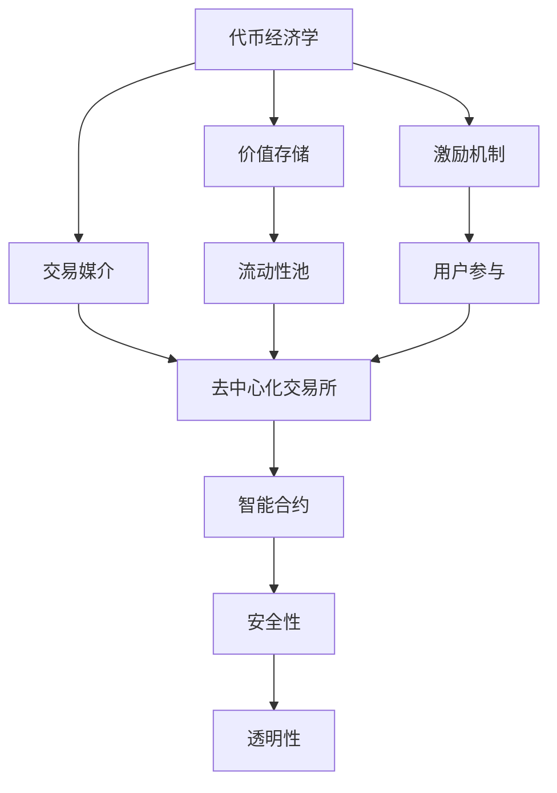
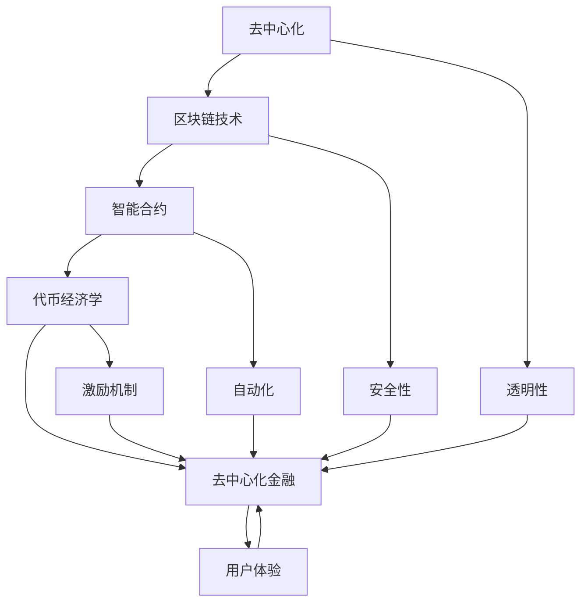

                 

### 文章标题

《去中心化金融创业：金融服务的新范式》

### 关键词

去中心化金融，区块链技术，智能合约，代币经济学，去中心化交易所，去中心化支付，去中心化借贷，监管与合规，创业实践，未来展望

### 摘要

本文深入探讨去中心化金融（DeFi）的起源、发展及其在金融服务领域的新范式。首先，我们回顾去中心化金融的起源，介绍区块链技术及其对传统金融的颠覆性影响，并探讨去中心化金融的核心理念与主要特征。接着，我们详细解析去中心化金融的技术基础，包括区块链技术和智能合约，以及代币经济学和去中心化交易所。随后，本文通过具体应用场景，如去中心化支付系统和去中心化借贷与投资平台，展示去中心化金融的广泛应用和优势。此外，本文还探讨了去中心化金融面临的监管与合规挑战，提供了合规策略建议，并通过实际案例分析了去中心化金融创业的机会与风险。最后，本文对未来去中心化金融的发展趋势和面临的挑战进行了展望，为读者提供了全面的去中心化金融创业指南。通过这篇文章，读者将全面了解去中心化金融的概念、技术基础、应用场景及未来发展方向，为进军这一新兴领域做好准备。|im_sep|>

### 目录

#### 第一部分：去中心化金融概述

1. 去中心化金融的起源与发展  
    - 第1章：去中心化金融的起源  
        - 1.1 去中心化金融的起源  
        - 1.2 去中心化金融的发展历程  
    - 第2章：去中心化金融的技术基础  
        - 2.1 区块链技术  
        - 2.2 智能合约  
    - 第3章：去中心化金融的关键概念  
        - 3.1 代币经济学  
        - 3.2 去中心化交易所

2. 去中心化金融应用场景  
    - 第4章：去中心化支付系统  
        - 4.1 去中心化支付系统的原理与优势  
        - 4.2 去中心化支付系统的应用  
    - 第5章：去中心化借贷与投资  
        - 5.1 去中心化借贷平台的原理与模式  
        - 5.2 去中心化投资平台的原理与优势  
    - 第6章：去中心化金融的监管与合规  
        - 6.1 去中心化金融监管的挑战  
        - 6.2 去中心化金融的合规策略

3. 去中心化金融创业实践  
    - 第7章：去中心化金融创业的机会与风险  
        - 7.1 去中心化金融创业的市场机会  
        - 7.2 去中心化金融创业的风险分析  
        - 7.3 去中心化金融创业的策略建议  
    - 第8章：去中心化金融创业案例分析  
        - 7.2.1 区块链初创公司的成功案例  
        - 7.2.2 去中心化金融项目的融资与估值  
        - 7.2.3 去中心化金融创业的失败案例分析

4. 去中心化金融的未来展望  
    - 第9章：去中心化金融的发展趋势  
        - 9.1 去中心化金融与物联网的结合  
        - 9.2 去中心化金融与人工智能的融合  
        - 9.3 去中心化金融在全球市场的扩展  
    - 第10章：去中心化金融面临的挑战与机遇  
        - 10.1 技术难题与解决方案  
        - 10.2 监管政策的变化与应对  
        - 10.3 去中心化金融的社会影响与伦理问题

5. 附录  
    - 附录A：去中心化金融工具与资源  
    - 附录B：去中心化金融相关标准与法规## 第一部分：去中心化金融概述

### 第1章：去中心化金融的起源与发展

#### 1.1 去中心化金融的起源

去中心化金融（DeFi）的起源可以追溯到2008年比特币的诞生。中本聪（Satoshi Nakamoto）在比特币白皮书中提出了一种基于区块链技术的数字货币，从而开启了去中心化金融的先河。比特币不仅是一种新的货币形式，也为金融系统提供了一种全新的运行机制。

**1.1.1 区块链技术对金融的颠覆性影响**

区块链技术是一种分布式数据库技术，通过去中心化的方式实现了数据的不可篡改和透明性。在传统的金融体系中，金融交易需要依赖中央化的机构，如银行、证券交易所等，这些机构扮演着信任中介的角色。而区块链技术的出现，通过去中心化的方式打破了这种依赖关系，使得金融交易可以在无需第三方中介的情况下进行。

**1.1.2 去中心化金融的核心理念**

去中心化金融的核心理念包括：

1. **去中心化**：通过区块链技术，实现金融服务的去中心化，使得金融服务不再依赖中央机构。
2. **透明性**：区块链上的所有交易都是公开透明的，任何用户都可以查看交易记录。
3. **安全性**：区块链技术保证了数据的安全性和不可篡改性。
4. **自主性**：用户可以自主控制自己的资产，无需依赖第三方机构。

**1.1.3 去中心化金融的主要特征**

去中心化金融的主要特征包括：

1. **无需信任**：在去中心化金融中，用户无需信任第三方机构，交易基于代码执行。
2. **透明性**：所有交易记录都在区块链上公开透明，用户可以随时查询。
3. **开放性**：去中心化金融系统对所有人开放，任何人都可以参与。
4. **不可篡改性**：区块链上的数据具有不可篡改性，保证了数据的真实性和可靠性。

#### 1.2 去中心化金融的发展历程

1. **区块链1.0时代：比特币**

比特币的诞生标志着区块链1.0时代的到来。在这个时代，区块链主要被用于创建数字货币，如比特币。比特币的底层技术是基于区块链的去中心化支付系统，用户可以直接进行点对点的交易。

2. **区块链2.0时代：以太坊**

以太坊的诞生标志着区块链2.0时代的到来。以太坊不仅支持数字货币的交易，还引入了智能合约的概念。智能合约是一种自动执行合同条款的计算机程序，使得去中心化金融应用得以实现。

3. **去中心化金融的崛起**

随着以太坊等区块链技术的发展，去中心化金融（DeFi）开始崛起。去中心化金融通过区块链技术和智能合约，实现了金融服务的去中心化，为用户提供了一种全新的金融服务模式。

### 第2章：去中心化金融的技术基础

#### 2.1 区块链技术

区块链技术是一种分布式数据库技术，通过去中心化的方式实现了数据的存储和传输。在区块链上，所有的数据都是公开透明的，并且具有不可篡改性。

**2.1.1 区块链的基本原理**

区块链的基本原理包括：

1. **分布式账本**：区块链是一个分布式账本，所有的数据都是分散存储在各个节点上。
2. **区块**：区块链由多个区块组成，每个区块包含一定数量的交易记录。
3. **链式结构**：每个区块都通过哈希值与前一个区块连接，形成了链式结构。
4. **共识机制**：区块链通过共识机制来保证数据的可靠性和一致性。

**2.1.2 区块链的主要分类**

区块链主要分为以下几类：

1. **公有链**：公有链是一种开放性的区块链，任何人都可以参与。
2. **私有链**：私有链是一种封闭性的区块链，只有特定用户可以参与。
3. **联盟链**：联盟链是一种半开放性的区块链，由多个机构共同维护。

**2.1.3 区块链技术的挑战与展望**

区块链技术面临的挑战包括：

1. **性能**：区块链的性能相对较低，无法满足大规模交易的需求。
2. **可扩展性**：区块链的可扩展性较低，难以应对大量用户的访问。
3. **安全性**：区块链的安全性问题仍然存在，需要进一步改进。

区块链技术的未来展望包括：

1. **性能优化**：通过改进共识机制和区块链结构，提高区块链的性能。
2. **可扩展性**：通过分片技术等手段，提高区块链的可扩展性。
3. **跨链技术**：实现不同区块链之间的互操作，构建全球统一的区块链网络。

#### 2.2 智能合约

智能合约是一种自动执行合同条款的计算机程序，它运行在区块链上。智能合约通过代码实现了合同的自动化执行，使得去中心化金融应用得以实现。

**2.2.1 智能合约的基本概念**

智能合约的基本概念包括：

1. **合约**：合约是一种法律文件，规定了合同双方的义务和权利。
2. **智能**：智能合约通过计算机程序实现，能够自动执行合同条款。
3. **合约代码**：智能合约的代码是公开的，用户可以查看和验证。

**2.2.2 智能合约的开发与实现**

智能合约的开发与实现包括：

1. **开发环境**：智能合约的开发通常使用Solidity语言，并运行在以太坊区块链上。
2. **合约编写**：开发人员需要编写智能合约的代码，实现合同条款的自动化执行。
3. **部署与运行**：智能合约被部署到区块链上，并运行在区块链网络中。

**2.2.3 智能合约的安全性分析**

智能合约的安全性分析包括：

1. **代码审计**：对智能合约的代码进行审计，发现潜在的安全漏洞。
2. **测试**：对智能合约进行测试，确保其能够按照预期执行。
3. **安全防护**：通过安全措施，如代码混淆、安全审计等，提高智能合约的安全性。

#### 2.3 代币经济学

代币经济学是去中心化金融的重要组成部分，它研究代币的发行、流通和激励机制。

**2.3.1 代币的类型与作用**

代币主要分为以下几类：

1. **代币化资产**：将实物资产或数字资产转化为代币，实现资产的数字化。
2. **功能代币**：为特定去中心化应用提供价值，如支付费用、参与投票等。
3. **权益代币**：代表用户在去中心化应用中的权益，如投票权、收益分配权等。

代币在去中心化金融中起着重要的作用，如：

1. **价值存储**：代币可以作为价值存储工具，与法币或其他资产进行交换。
2. **交易媒介**：代币可以作为去中心化交易中的交易媒介，实现点对点的交易。
3. **激励机制**：通过代币的发行和激励，鼓励用户参与去中心化金融生态系统。

**2.3.2 代币经济学的原理**

代币经济学的原理包括：

1. **供求关系**：代币的价值取决于市场的供求关系。
2. **激励机制**：通过激励机制，鼓励用户参与代币的发行、流通和使用。
3. **网络效应**：代币的价值随着用户数量的增加而增加，形成网络效应。

**2.3.3 代币经济学的案例分析**

代币经济学的案例分析包括：

1. **比特币**：比特币是最早的代币化资产，其成功推动了去中心化金融的发展。
2. **以太坊**：以太坊引入了智能合约，实现了更丰富的去中心化金融应用。
3. **去中心化交易所**：去中心化交易所以代币为交易媒介，为用户提供了一个开放、透明的交易平台。

#### 2.4 去中心化交易所

去中心化交易所（DEX）是一种无需中央化机构的交易平台，用户可以直接在区块链上进行交易。

**2.4.1 去中心化交易所的定义与优势**

去中心化交易所的定义是：

去中心化交易所是一种基于区块链技术的交易平台，用户可以直接在区块链上进行交易，无需依赖中央化机构。

去中心化交易所的优势包括：

1. **去中心化**：去中心化交易所通过区块链技术实现了交易的去中心化，用户可以自主控制资产。
2. **开放性**：去中心化交易所对所有人开放，用户可以随时随地参与交易。
3. **安全性**：去中心化交易所通过区块链技术保证了交易的安全性和不可篡改性。
4. **透明性**：去中心化交易所的所有交易记录都是公开透明的，用户可以随时查询。

**2.4.2 去中心化交易所的运营模式**

去中心化交易所的运营模式包括：

1. **订单簿**：去中心化交易所通过订单簿来匹配买卖双方的交易。
2. **流动性池**：去中心化交易所通过流动性池提供交易对，用户可以在流动性池中进行交易。
3. **交易费用**：去中心化交易所通过收取交易费用来维持运营。

**2.4.3 去中心化交易所的安全性问题**

去中心化交易所的安全性问题包括：

1. **智能合约漏洞**：去中心化交易所的智能合约可能存在漏洞，导致资金损失。
2. **黑客攻击**：去中心化交易所可能成为黑客攻击的目标，导致资金被盗。
3. **交易风险**：去中心化交易所的交易风险较高，用户需要谨慎操作。

### 第3章：去中心化金融的关键概念

去中心化金融（DeFi）作为金融服务领域的一次革命，其核心概念和技术架构构成了理解这一新兴领域的关键。在这一章节中，我们将深入探讨去中心化金融中的关键概念，包括代币经济学、去中心化交易所（DEX）、以及这些概念之间的联系和相互作用。

#### 3.1 代币经济学

代币经济学是去中心化金融的基石，它涉及代币的发行、流通、价值评估及其激励机制。代币不仅作为一种数字资产，还承载着金融生态系统中的多种功能。

**3.1.1 代币的类型与作用**

代币可以分为以下几种类型：

1. **代币化资产**：将实体资产或数字资产转化为代币，例如房地产、艺术品、商品等。
2. **功能代币**：为特定去中心化应用提供价值，如支付费用、投票权等。
3. **权益代币**：代表用户在去中心化应用中的权益，如收益分配权、治理权等。

代币在去中心化金融中的作用包括：

1. **价值存储**：代币可以作为价值存储工具，与法币或其他资产进行交换。
2. **交易媒介**：在去中心化金融系统中，代币作为交易媒介，实现点对点的交易。
3. **激励机制**：通过代币的发行和激励，鼓励用户参与去中心化金融生态系统。

**3.1.2 代币经济学的原理**

代币经济学的原理主要包括：

1. **供求关系**：代币的价值由市场的供求关系决定。供给增加或需求增加，都会影响代币的价值。
2. **网络效应**：随着用户数量的增加，代币的价值通常也会增加，因为更多的人使用它。
3. **自我维持机制**：通过奖励机制和利润分配，维持代币生态系统的健康运行。

**3.1.3 代币经济学的案例分析**

一些成功的代币经济学案例包括：

1. **比特币（BTC）**：比特币作为首个成功的加密货币，其价格受到供求关系和市场信心的影响。
2. **以太坊（ETH）**：以太坊引入了智能合约，其代币ETH不仅作为交易媒介，还用于支付网络费用。
3. **去中心化金融协议（DeFi协议）**：如Uniswap和Aave，它们通过代币激励用户提供流动性，并通过利润分享机制吸引参与者。

#### 3.2 去中心化交易所

去中心化交易所（DEX）是去中心化金融的重要组成部分，它为用户提供了在区块链上进行资产交换的平台。

**3.2.1 去中心化交易所的定义与优势**

去中心化交易所（DEX）是一种基于区块链技术的去中心化交易平台，它允许用户在不依赖中央机构的条件下进行加密货币的交易。

去中心化交易所的优势包括：

1. **去中心化**：用户直接与交易对手进行交易，无需依赖中央交易所。
2. **透明性**：交易过程和所有交易记录都是公开透明的。
3. **安全性**：通过智能合约实现交易，提高了资金的安全性。
4. **开放性**：任何人都可以使用去中心化交易所，无需注册或验证。

**3.2.2 去中心化交易所的运营模式**

去中心化交易所的运营模式主要包括：

1. **订单簿**：类似于传统交易所，去中心化交易所也有一个订单簿，用于匹配买卖双方的交易。
2. **流动性池**：去中心化交易所使用流动性池，用户可以提供流动性，并获得交易费用的奖励。
3. **自动做市商（AMM）**：自动做市商通过智能合约自动调节交易对的价格。

**3.2.3 去中心化交易所的安全性问题**

尽管去中心化交易所具有许多优势，但它们也面临一些安全挑战：

1. **智能合约漏洞**：去中心化交易所的智能合约可能存在漏洞，导致资金损失。
2. **网络攻击**：黑客可能会尝试攻击去中心化交易所，盗取用户资金。
3. **交易风险**：去中心化交易所的交易风险较高，用户需要谨慎操作。

#### 3.3 去中心化金融的核心概念之间的关系架构

去中心化金融中的核心概念之间存在着紧密的联系和相互作用。以下是一个简化的Mermaid流程图，展示了这些概念之间的关系：



在这个流程图中，代币经济学提供了价值存储、交易媒介和激励机制，这些激励机制吸引了用户的参与，用户通过去中心化交易所进行交易，交易所依赖于智能合约来确保交易的安全性和透明性。

#### 3.4 核心算法原理讲解

去中心化金融的核心算法主要涉及智能合约的实现和去中心化交易所的定价机制。以下是一个简化的伪代码示例，展示了去中心化交易所中自动做市商（AMM）的核心算法原理：

```python
# 自动做市商（AMM）的伪代码示例

# 定义流动性池参数
流动性池 = {
    '代币A余额': A_balance,
    '代币B余额': B_balance,
    '交易对价格': price
}

# 定义交易函数
def trade(代币A数量, 代币B数量):
    # 更新流动性池余额
    liquidity_pool['代币A余额'] -= 代币A数量
    liquidity_pool['代币B余额'] -= 代币B数量

    # 根据价格调整交易对价格
    price = calculate_price(liquidity_pool['代币A余额'], liquidity_pool['代币B余额'])

    # 返回新的交易对价格
    return price

# 定义计算价格函数
def calculate_price(A_balance, B_balance):
    # 根据流动性池余额计算价格
    price = A_balance / B_balance
    return price
```

在这个伪代码中，`trade` 函数用于处理交易，更新流动性池的余额，并调用 `calculate_price` 函数计算新的交易对价格。`calculate_price` 函数根据流动性池中代币A和代币B的余额比例来计算价格。

#### 3.5 数学模型和公式

去中心化金融中的数学模型和公式主要用于描述市场动态、交易成本和风险管理。以下是一个简化的数学模型，用于描述去中心化交易所中自动做市商（AMM）的价格调整机制：

$$
\text{价格} = \frac{\text{代币A余额}}{\text{代币B余额}}
$$

其中，价格是代币A与代币B的交换比例，代币A余额和代币B余额分别表示流动性池中代币A和代币B的数量。

#### 3.6 详细讲解和举例说明

为了更好地理解去中心化金融中的核心概念，我们可以通过一个简单的例子来说明代币经济学和去中心化交易所的工作原理。

**例子：假设有一个去中心化交易所，其支持代币A和代币B的交易对。**

1. **初始状态**：流动性池中有100代币A和100代币B，交易对价格为1：1。
2. **用户交易**：用户1购买10代币A，支付10代币B。交易后，流动性池中余额变为90代币A和90代币B，交易对价格变为1：0.9。
3. **价格调整**：为了维持市场的平衡，自动做市商会根据流动性池中的余额调整交易对价格，假设调整后价格为1：0.95。
4. **用户交易**：用户2购买20代币A，支付19代币B。交易后，流动性池中余额变为70代币A和70.2代币B，交易对价格再次调整为1：0.976。

在这个例子中，我们可以看到去中心化交易所如何通过自动调整价格来平衡市场，从而保持交易对价格的稳定。

### 第4章：去中心化支付系统

去中心化支付系统（DeFi Pay）是去中心化金融（DeFi）的一个重要应用，它利用区块链技术和智能合约实现了点对点的支付。去中心化支付系统消除了传统支付系统中的中介机构，降低了交易成本，提高了交易效率。本章节将详细探讨去中心化支付系统的原理、优势及其在具体应用场景中的表现。

#### 4.1 去中心化支付系统的原理与优势

**4.1.1 去中心化支付系统的基本原理**

去中心化支付系统基于区块链技术，其工作原理如下：

1. **账户体系**：每个用户在区块链上拥有一个唯一的地址，地址关联着用户的资产。
2. **交易记录**：每次交易都会生成一条交易记录，并存储在区块链上，确保交易透明和不可篡改。
3. **智能合约**：智能合约用于执行交易协议，确保交易按照预定的规则进行。

具体来说，用户A想要向用户B支付一定数量的代币，用户A会调用智能合约发起交易请求，智能合约验证交易金额和用户身份后，将相应数量的代币从用户A的账户转移到用户B的账户，同时生成一条交易记录，并广播至整个区块链网络。

**4.1.2 去中心化支付系统的优势分析**

去中心化支付系统相对于传统支付系统具有以下优势：

1. **去中心化**：去中心化支付系统无需依赖中央机构，降低了交易对手风险。
2. **低成本**：去中心化支付系统减少了中介机构的成本，降低了交易费用。
3. **高效率**：区块链技术的快速确认机制提高了交易速度，缩短了结算时间。
4. **安全性**：区块链的不可篡改性确保了交易记录的真实性和可靠性。
5. **跨境支付**：去中心化支付系统能够实现跨境支付，无需考虑外汇管制等问题。

#### 4.1.3 去中心化支付系统的案例研究

**案例1：比特币支付**

比特币作为最早的加密货币，其支付系统可以看作是去中心化支付系统的原型。用户可以通过比特币地址直接向其他用户发送比特币，无需依赖银行或支付网关。

**案例2：Ripple支付**

Ripple是一种基于区块链技术的支付协议，其目的在于提供快速、低成本的国际支付服务。Ripple通过其数字货币XRP实现了跨境支付，并吸引了多家金融机构的参与。

**案例3：去中心化稳定币支付**

去中心化稳定币（如DAI）旨在提供价值稳定的数字货币，其支付系统具有高流动性和低交易成本。用户可以使用去中心化稳定币进行点对点支付，同时保持货币的价值稳定性。

#### 4.2 去中心化支付系统的应用

**4.2.1 微支付与跨境支付**

去中心化支付系统非常适合微支付和跨境支付，以下是其应用场景：

1. **微支付**：去中心化支付系统可以支持极小的交易金额，例如支付内容平台的小额订阅费用、应用内购买等。
2. **跨境支付**：去中心化支付系统可以消除传统跨境支付中的中介费用，提供更快、更便宜的跨境支付服务。

**4.2.2 物联网支付与数字身份认证**

去中心化支付系统还可以应用于物联网（IoT）和数字身份认证领域：

1. **物联网支付**：去中心化支付系统可以为物联网设备提供支付能力，例如智能家居设备之间的自动支付。
2. **数字身份认证**：去中心化支付系统可以结合数字身份认证技术，实现安全的身份验证和授权。

**4.2.3 去中心化支付系统的未来发展**

去中心化支付系统的未来发展将集中在以下方面：

1. **技术优化**：通过改进区块链技术，提高交易速度和降低交易费用。
2. **合规与监管**：确保去中心化支付系统符合法律法规要求，实现合规运营。
3. **用户体验**：优化用户界面和操作流程，提高用户的支付体验。
4. **生态系统构建**：吸引更多开发者和机构参与去中心化支付生态系统，促进其发展。

### 第5章：去中心化借贷与投资

去中心化借贷与投资平台（DeFi Lending & Investment Platforms）是去中心化金融（DeFi）领域的重要应用，通过区块链技术和智能合约，实现了点对点的借贷和投资。这些平台为用户提供了更灵活、更高效的金融服务，降低了借贷成本，增加了投资回报。本章将详细介绍去中心化借贷与投资平台的原理、模式及其在具体案例中的应用。

#### 5.1 去中心化借贷平台的原理与模式

**5.1.1 去中心化借贷平台的基本原理**

去中心化借贷平台通过区块链和智能合约，实现了借贷活动去中心化。其基本原理如下：

1. **借贷双方**：用户A作为借款人，向平台提供一定的抵押资产；用户B作为出借人，将资金存入平台。
2. **智能合约**：智能合约用于管理借贷过程中的资金流转和收益分配，确保交易的透明性和安全性。
3. **去中心化验证**：平台通过去中心化验证机制，确保借款人和出借人的身份和资产信息真实有效。
4. **收益分配**：借贷收益根据出借人和平台协议进行分配，出借人可以获得利息收益，平台收取一定的服务费。

**5.1.2 去中心化借贷平台的运营模式**

去中心化借贷平台的运营模式主要包括以下几方面：

1. **抵押贷款**：借款人将资产抵押给平台，获得一定比例的贷款。贷款金额取决于抵押资产的价值和借贷平台的借贷比例。
2. **出借**：出借人将资金存入平台，平台将资金分配给借款人，并收取一定的利息。
3. **流动性池**：平台通过流动性池管理资金，确保借款需求得到满足，同时提高资金利用效率。
4. **收益分享**：出借人获得的利息收益按照其在平台中的贡献比例进行分配。

**5.1.3 去中心化借贷平台的案例分析**

以下是一些知名的去中心化借贷平台案例：

1. **Aave**：Aave 是一个去中心化借贷和投资平台，用户可以存入资金获得利息收益，同时也可以通过抵押资产获得贷款。
2. **Compound**：Compound 是另一个去中心化借贷平台，它允许用户将资金存入平台并获得利息，同时借款人可以使用平台上的代币进行借贷。

#### 5.2 去中心化投资平台的原理与优势

**5.2.1 去中心化投资平台的基本原理**

去中心化投资平台通过智能合约和去中心化验证机制，为用户提供了一个开放、透明的投资环境。其基本原理如下：

1. **基金池**：平台创建一个基金池，用户可以将资金存入基金池，基金池用于投资各种资产。
2. **投资策略**：平台根据预定的投资策略，将基金池中的资金分配到不同的资产中，如加密货币、稳定币等。
3. **收益分配**：基金池的收益按照用户在平台中的贡献比例进行分配，包括利息、股息等。
4. **流动性挖矿**：平台通过流动性挖矿激励用户提供流动性，增加资金池的深度和多样性。

**5.2.2 去中心化投资平台的优势分析**

去中心化投资平台具有以下优势：

1. **去中心化**：去中心化投资平台消除了传统投资中的中介机构，降低了交易成本。
2. **透明性**：所有投资活动都记录在区块链上，用户可以随时查看投资详情。
3. **灵活性**：用户可以根据自己的风险偏好和投资目标，灵活调整投资组合。
4. **激励机制**：平台通过奖励机制，鼓励用户提供流动性和参与投资。

**5.2.3 去中心化投资平台的案例分析**

以下是一些知名的去中心化投资平台案例：

1. **Yearn.finance**：Yearn.finance 是一个自动化投资协议，它通过智能合约自动优化投资者的收益。
2. **SushiSwap**：SushiSwap 是一个去中心化交易所，它通过流动性挖矿激励用户提供流动性，并允许用户投票决定平台的发展方向。

### 第6章：去中心化金融的监管与合规

随着去中心化金融（DeFi）的快速发展，其监管与合规问题也日益引起关注。去中心化金融的特性和现有的金融监管框架之间存在诸多矛盾和挑战。本章将探讨去中心化金融监管的挑战、监管主体与框架、监管政策的发展趋势，以及去中心化金融的合规策略。

#### 6.1 去中心化金融监管的挑战

**6.1.1 监管主体与监管框架**

去中心化金融的监管主体主要包括各国政府、金融监管机构和加密货币交易所。不同国家的监管框架和立场存在显著差异，导致监管难度增加。

1. **国际监管差异**：不同国家对于加密货币和去中心化金融的监管政策不同，导致跨境交易和活动的合规性复杂。
2. **监管边界模糊**：去中心化金融的技术特性使得其监管主体难以界定，例如智能合约和去中心化交易所的运营主体可能是跨国的，增加了监管难度。
3. **监管效率低下**：去中心化金融的快速发展和创新速度，使得传统监管体系难以及时跟进，导致监管效率低下。

**6.1.2 监管的技术难题**

去中心化金融的技术特性带来了以下监管技术难题：

1. **数据隐私与透明度**：区块链上的交易数据是公开透明的，但同时也涉及到用户隐私保护的问题。如何在确保交易透明的同时保护用户隐私成为监管的一大挑战。
2. **智能合约审查**：智能合约的代码审查和审计是确保其安全性和合规性的关键，但现有的审查工具和方法仍需进一步发展和完善。
3. **跨境监管合作**：由于去中心化金融的跨国特性，国际监管合作成为必要，但各国监管机构之间的协调和合作仍需加强。

**6.1.3 监管政策的发展趋势**

监管政策的发展趋势主要体现在以下几个方面：

1. **合规性要求提高**：各国政府和监管机构逐渐认识到去中心化金融的重要性，并加强对其的合规性要求。
2. **监管沙盒与试点项目**：一些国家和机构开始尝试通过监管沙盒和试点项目，探索适合去中心化金融的监管模式。
3. **国际监管合作加强**：国际社会逐渐认识到跨境监管合作的重要性，加强各国监管机构之间的合作。

#### 6.2 去中心化金融的合规策略

**6.2.1 合规的技术手段**

去中心化金融的合规策略需要借助一系列技术手段，包括：

1. **智能合约审计**：定期对智能合约进行审计，发现潜在的安全漏洞和合规性问题。
2. **数据隐私保护**：采用区块链隐私保护技术，如零知识证明，确保交易数据的隐私性。
3. **合规工具开发**：开发适用于去中心化金融的合规工具，如合规性检测平台、合规报告系统等。

**6.2.2 合规的风险管理**

去中心化金融的合规风险管理包括：

1. **合规风险评估**：定期评估去中心化金融项目的合规性风险，包括智能合约、数据隐私、跨境交易等方面。
2. **合规培训与教育**：加强对开发人员和参与者的合规培训，提高其合规意识和能力。
3. **合规性监控与应对**：建立合规性监控机制，及时识别和应对合规性问题。

**6.2.3 合规的案例分析**

以下是一些去中心化金融项目的合规案例分析：

1. **Aragon**：Aragon 是一个去中心化治理平台，其智能合约经过第三方审计，确保其合规性和安全性。
2. **Kyber Network**：Kyber Network 是一个去中心化流动性网络，其合规性措施包括智能合约审计和数据隐私保护。

### 第7章：去中心化金融创业实践

去中心化金融（DeFi）作为一种新兴的金融模式，为创业者提供了广阔的机遇。本章将探讨去中心化金融创业的市场机会、风险分析以及策略建议，并通过实际案例展示去中心化金融创业的实践过程。

#### 7.1 去中心化金融创业的市场机会

**7.1.1 去中心化金融创业的市场潜力**

去中心化金融市场的潜力主要体现在以下几个方面：

1. **用户增长**：随着区块链技术的普及和加密货币的广泛接受，去中心化金融的用户数量持续增长。
2. **技术创新**：去中心化金融领域不断创新，如自动做市商（AMM）、流动性挖矿等，吸引了大量开发者和投资者。
3. **监管政策变化**：一些国家和地区逐渐放宽对加密货币和去中心化金融的监管，为创业者提供了更宽松的创业环境。
4. **金融需求**：去中心化金融能够满足用户对于金融服务的需求，如跨境支付、借贷、投资等，具有广阔的市场前景。

**7.1.2 去中心化金融创业的主要领域**

去中心化金融创业的主要领域包括：

1. **去中心化交易所**：去中心化交易所是去中心化金融的核心组成部分，创业者可以开发新的去中心化交易平台，提供更高效、更安全的交易服务。
2. **去中心化借贷与投资平台**：去中心化借贷与投资平台为用户提供了新的金融工具，创业者可以开发创新的借贷和投资产品，满足不同用户的需求。
3. **去中心化支付系统**：去中心化支付系统为用户提供了点对点的支付解决方案，创业者可以开发新的支付协议，提高支付效率。
4. **去中心化金融服务**：去中心化金融还涉及到保险、资产管理、金融服务等领域，创业者可以探索这些领域，提供创新的金融服务。

#### 7.2 去中心化金融创业的风险分析

**7.2.1 去中心化金融创业的主要风险**

去中心化金融创业面临的主要风险包括：

1. **技术风险**：去中心化金融依赖于区块链和智能合约技术，技术问题可能导致系统故障、数据泄露等。
2. **合规风险**：去中心化金融的合规性尚未完全明确，创业者需要面对复杂的监管环境，合规性问题可能导致法律纠纷。
3. **市场风险**：去中心化金融市场波动性大，创业者需要应对市场风险，如价格波动、用户流失等。
4. **安全风险**：去中心化金融系统可能面临黑客攻击、智能合约漏洞等安全风险，可能导致资金损失。
5. **运营风险**：去中心化金融创业者在运营过程中可能面临资金链断裂、团队管理等问题。

**7.2.2 风险应对策略**

去中心化金融创业的风险应对策略包括：

1. **技术保障**：加强技术团队建设，定期对智能合约进行审计和升级，确保系统安全。
2. **合规建设**：深入研究监管政策，建立合规性管理体系，确保业务符合法律法规要求。
3. **市场调研**：进行充分的市场调研，了解用户需求和市场动态，制定合理的业务策略。
4. **安全防护**：加强系统安全防护，采用多重验证机制，确保用户资金安全。
5. **风险管理**：建立风险管理制度，对风险进行识别、评估和控制，确保企业的稳健运营。

#### 7.3 去中心化金融创业的策略建议

**7.3.1 选择合适的业务方向**

创业者应根据自身优势和市场机会，选择合适的业务方向。例如，针对技术团队较强的创业者，可以选择开发去中心化交易所或借贷平台；针对市场运营能力较强的创业者，可以选择推广去中心化支付系统。

**7.3.2 构建生态系统**

创业者应构建一个生态系统，包括用户、开发者、投资者等各方，通过生态系统内各方的合作，实现共同发展。

**7.3.3 保持创新**

去中心化金融领域竞争激烈，创业者应保持创新，不断推出新的产品和服务，以满足用户需求。

**7.3.4 注重合规**

合规是去中心化金融创业的关键，创业者应高度重视合规性，确保业务符合法律法规要求。

#### 7.4 去中心化金融创业案例分析

**7.4.1 区块链初创公司的成功案例**

以下是一个成功的区块链初创公司的案例：

**公司名称**：Uniswap

**业务方向**：去中心化交易所

**成功因素**：

1. **技术创新**：Uniswap 采用自动做市商（AMM）机制，提高了交易效率和用户体验。
2. **市场定位**：Uniswap 定位于提供高效、安全的去中心化交易服务，吸引了大量用户。
3. **社区建设**：Uniswap 通过社区建设和用户互动，建立了强大的用户基础。

**7.4.2 去中心化金融项目的融资与估值**

以下是一个去中心化金融项目的融资与估值案例：

**项目名称**：Aave

**业务方向**：去中心化借贷平台

**融资情况**：

1. **种子轮**：Aave 在种子轮融资中获得 100 万美元投资。
2. **A轮**：Aave 在 A 轮融资中获得 1600 万美元投资。
3. **B轮**：Aave 在 B 轮融资中获得 4500 万美元投资。

**估值**：根据最新融资情况，Aave 的估值为 10 亿美元。

**7.4.3 去中心化金融创业的失败案例分析**

以下是一个去中心化金融创业的失败案例：

**公司名称**：Enigma

**业务方向**：去中心化数据隐私解决方案

**失败原因**：

1. **技术难题**：Enigma 在实现数据隐私保护方面面临较大技术挑战，导致项目进展缓慢。
2. **市场定位**：Enigma 的市场定位不够明确，难以吸引到足够的用户。
3. **团队管理**：Enigma 的团队管理出现问题，导致项目运营困难。

**7.5 去中心化金融创业实践小结**

去中心化金融创业具有广阔的市场前景，但也面临诸多挑战。创业者应选择合适的业务方向，注重技术创新和合规建设，构建一个健康的生态系统，以实现可持续发展。

### 第8章：去中心化金融的未来展望

随着技术的不断进步和市场需求的增长，去中心化金融（DeFi）正逐渐成为金融服务领域的新范式。本章将探讨去中心化金融的发展趋势、面临的挑战以及未来的机遇。

#### 8.1 去中心化金融的发展趋势

**8.1.1 去中心化金融与物联网的结合**

去中心化金融与物联网（IoT）的结合，为去中心化支付系统和智能设备之间的交互提供了可能。例如，智能家居设备可以通过去中心化支付系统自动支付服务费用，实现更高效的资源分配和管理。

**8.1.2 去中心化金融与人工智能的融合**

去中心化金融与人工智能（AI）的融合，可以提升金融服务效率，优化风险管理。AI技术可以用于智能合约的审核、风险评估和预测分析，提高去中心化金融系统的智能化水平。

**8.1.3 去中心化金融在全球市场的扩展**

去中心化金融在全球市场的扩展，将进一步降低跨境支付和投资的门槛，促进全球金融一体化。特别是在新兴市场，去中心化金融有望解决传统金融服务的局限性，为更多人提供金融服务。

#### 8.2 去中心化金融面临的挑战

**8.2.1 技术难题**

去中心化金融的技术难题包括区块链的性能、可扩展性和安全性。当前，区块链技术仍需进一步优化，以满足大规模交易和用户需求。

**8.2.2 监管政策的变化与应对**

监管政策的变化对去中心化金融产生了重大影响。各国监管机构的立场和法规不尽相同，去中心化金融需要灵活应对，确保业务合规。

**8.2.3 社会接受度**

尽管去中心化金融具有诸多优势，但其社会接受度仍需提高。公众对区块链技术和加密货币的认知和信任度有待加强，这会影响去中心化金融的普及和推广。

#### 8.3 去中心化金融的机遇

**8.3.1 创新空间**

去中心化金融为金融创新提供了广阔的空间。创业者可以探索新的金融产品和服务，满足用户多样化的金融需求。

**8.3.2 稳定增长**

去中心化金融市场正稳步增长，预计未来几年将继续保持高速发展。市场潜力巨大，为创业者提供了丰富的机遇。

**8.3.3 合规化**

随着监管政策的逐渐明确，去中心化金融的合规化进程将加速。合规化有助于去中心化金融在全球市场的推广和普及。

### 第9章：去中心化金融创业实践

#### 9.1 去中心化金融创业的机会与风险

**9.1.1 去中心化金融创业的市场机会**

去中心化金融创业的市场机会主要体现在以下几个方面：

1. **用户需求**：随着加密货币的普及，越来越多的用户对去中心化金融服务有着强烈的需求，如借贷、投资、支付等。
2. **技术创新**：去中心化金融领域不断创新，如自动做市商（AMM）、去中心化稳定币（DSTC）等，为创业者提供了丰富的创新空间。
3. **监管政策**：一些国家和地区对加密货币和去中心化金融的监管政策逐渐放宽，为创业者提供了更宽松的创业环境。

**9.1.2 去中心化金融创业的风险分析**

去中心化金融创业面临的风险包括：

1. **技术风险**：去中心化金融依赖于区块链和智能合约技术，技术问题可能导致系统故障、数据泄露等。
2. **合规风险**：去中心化金融的合规性尚未完全明确，创业者需要面对复杂的监管环境，合规性问题可能导致法律纠纷。
3. **市场风险**：去中心化金融市场波动性大，创业者需要应对市场风险，如价格波动、用户流失等。
4. **安全风险**：去中心化金融系统可能面临黑客攻击、智能合约漏洞等安全风险，可能导致资金损失。
5. **运营风险**：去中心化金融创业者在运营过程中可能面临资金链断裂、团队管理等问题。

**9.1.3 去中心化金融创业的策略建议**

1. **技术保障**：加强技术团队建设，定期对智能合约进行审计和升级，确保系统安全。
2. **合规建设**：深入研究监管政策，建立合规性管理体系，确保业务符合法律法规要求。
3. **市场调研**：进行充分的市场调研，了解用户需求和市场动态，制定合理的业务策略。
4. **安全防护**：加强系统安全防护，采用多重验证机制，确保用户资金安全。
5. **风险管理**：建立风险管理制度，对风险进行识别、评估和控制，确保企业的稳健运营。

#### 9.2 去中心化金融创业案例分析

**9.2.1 区块链初创公司的成功案例**

以下是一个成功的区块链初创公司的案例：

**公司名称**：Uniswap

**业务方向**：去中心化交易所

**成功因素**：

1. **技术创新**：Uniswap 采用自动做市商（AMM）机制，提高了交易效率和用户体验。
2. **市场定位**：Uniswap 定位于提供高效、安全的去中心化交易服务，吸引了大量用户。
3. **社区建设**：Uniswap 通过社区建设和用户互动，建立了强大的用户基础。

**9.2.2 去中心化金融项目的融资与估值**

以下是一个去中心化金融项目的融资与估值案例：

**项目名称**：Aave

**业务方向**：去中心化借贷平台

**融资情况**：

1. **种子轮**：Aave 在种子轮融资中获得 100 万美元投资。
2. **A轮**：Aave 在 A 轮融资中获得 1600 万美元投资。
3. **B轮**：Aave 在 B 轮融资中获得 4500 万美元投资。

**估值**：根据最新融资情况，Aave 的估值为 10 亿美元。

**9.2.3 去中心化金融创业的失败案例分析**

以下是一个去中心化金融创业的失败案例：

**公司名称**：Enigma

**业务方向**：去中心化数据隐私解决方案

**失败原因**：

1. **技术难题**：Enigma 在实现数据隐私保护方面面临较大技术挑战，导致项目进展缓慢。
2. **市场定位**：Enigma 的市场定位不够明确，难以吸引到足够的用户。
3. **团队管理**：Enigma 的团队管理出现问题，导致项目运营困难。

**9.3 去中心化金融创业实践小结**

去中心化金融创业具有广阔的市场前景，但也面临诸多挑战。创业者应选择合适的业务方向，注重技术创新和合规建设，构建一个健康的生态系统，以实现可持续发展。

### 附录

#### 附录A：去中心化金融工具与资源

**A.1 区块链开发工具介绍**

区块链开发工具是构建去中心化金融应用的关键。以下是一些常用的区块链开发工具：

1. **Truffle Suite**：Truffle 是一个用于以太坊区块链的开发框架，提供智能合约开发、测试和部署的工具。
2. **Hardhat**：Hardhat 是一个轻量级的以太坊开发环境，提供了丰富的开发工具和插件。
3. **Ganache**：Ganache 是一个以太坊本地节点，用于本地开发和测试智能合约。

**A.2 智能合约开发资源**

智能合约开发资源包括编程语言、开发框架和教程等：

1. **Solidity**：Solidity 是以太坊上使用的智能合约编程语言，是智能合约开发的基础。
2. **OpenZeppelin**：OpenZeppelin 是一个提供智能合约模板和库的框架，用于提高智能合约的安全性。
3. **Ethers.js**：Ethers.js 是一个用于以太坊的JavaScript库，用于与智能合约交互。

**A.3 去中心化金融应用开发案例与教程**

以下是一些去中心化金融应用的开发案例和教程：

1. **去中心化借贷平台开发教程**：介绍如何使用以太坊和智能合约构建一个去中心化借贷平台。
2. **去中心化交易所开发案例**：展示如何使用Uniswap框架构建一个去中心化交易所。
3. **去中心化支付系统开发教程**：介绍如何使用区块链技术构建一个去中心化支付系统。

#### 附录B：去中心化金融相关标准与法规

**B.1 国际去中心化金融标准**

国际去中心化金融标准为去中心化金融应用提供了统一的规范和指南。以下是一些国际去中心化金融标准：

1. **ISO/IEC 27001**：信息安全管理标准，用于确保去中心化金融系统的数据安全和隐私保护。
2. **BS 10012**：个人信息管理标准，用于规范去中心化金融系统中个人数据的处理和保护。
3. **TR-03110**：区块链技术框架，提供了区块链系统的设计、开发和部署指南。

**B.2 我国去中心化金融法规解读**

我国对去中心化金融的监管法规逐渐完善。以下是我国一些重要的去中心化金融法规解读：

1. **《中国人民银行关于防范代币发行融资风险的公告》**：明确了代币发行融资行为的监管要求。
2. **《区块链技术指南》**：介绍了区块链技术的原理和应用，为去中心化金融的发展提供了技术支持。
3. **《数字货币和区块链技术发展报告》**：对我国数字货币和区块链技术的发展进行了全面分析。

**B.3 去中心化金融行业自律规范与协会**

去中心化金融行业自律规范与协会为行业健康发展提供了指导和支持。以下是一些重要的去中心化金融行业自律规范与协会：

1. **区块链技术联盟（Hyperledger）**：是全球领先的区块链技术联盟，为区块链技术的标准化和推广提供支持。
2. **加密货币协会（CCIA）**：是美国加密货币行业的主要组织，致力于推动加密货币技术的发展和应用。
3. **中国区块链技术联盟**：是我国区块链技术行业的重要组织，为区块链技术的发展和推广提供支持。

### 作者信息

**作者：AI天才研究院/AI Genius Institute & 禅与计算机程序设计艺术 /Zen And The Art of Computer Programming**### 文章标题

《去中心化金融创业：金融服务的新范式》

### 关键词

去中心化金融，区块链技术，智能合约，代币经济学，去中心化交易所，去中心化支付，去中心化借贷，监管与合规，创业实践，未来展望

### 摘要

本文深入探讨去中心化金融（DeFi）的起源、发展及其在金融服务领域的新范式。首先，我们回顾去中心化金融的起源，介绍区块链技术及其对传统金融的颠覆性影响，并探讨去中心化金融的核心理念与主要特征。接着，我们详细解析去中心化金融的技术基础，包括区块链技术和智能合约，以及代币经济学和去中心化交易所。随后，本文通过具体应用场景，如去中心化支付系统和去中心化借贷与投资平台，展示去中心化金融的广泛应用和优势。此外，本文还探讨了去中心化金融面临的监管与合规挑战，提供了合规策略建议，并通过实际案例分析了去中心化金融创业的机会与风险。最后，本文对未来去中心化金融的发展趋势和面临的挑战进行了展望，为读者提供了全面的去中心化金融创业指南。通过这篇文章，读者将全面了解去中心化金融的概念、技术基础、应用场景及未来发展方向，为进军这一新兴领域做好准备。|im_sep|>

### 目录

#### 第一部分：去中心化金融概述

1. 去中心化金融的起源与发展  
    - 第1章：去中心化金融的起源  
        - 1.1 去中心化金融的起源  
        - 1.2 去中心化金融的发展历程  
    - 第2章：去中心化金融的技术基础  
        - 2.1 区块链技术  
        - 2.2 智能合约  
        - 2.3 代币经济学  
    - 第3章：去中心化金融的关键概念  
        - 3.1 代币的类型与作用  
        - 3.2 去中心化交易所

2. 去中心化金融应用场景  
    - 第4章：去中心化支付系统  
        - 4.1 去中心化支付系统的原理与优势  
        - 4.2 去中心化支付系统的应用  
    - 第5章：去中心化借贷与投资  
        - 5.1 去中心化借贷平台的原理与模式  
        - 5.2 去中心化投资平台的原理与优势  
    - 第6章：去中心化金融的监管与合规  
        - 6.1 去中心化金融监管的挑战  
        - 6.2 去中心化金融的合规策略

3. 去中心化金融创业实践  
    - 第7章：去中心化金融创业的机会与风险  
        - 7.1 去中心化金融创业的市场机会  
        - 7.2 去中心化金融创业的风险分析  
        - 7.3 去中心化金融创业的策略建议  
    - 第8章：去中心化金融创业案例分析  
        - 7.2.1 区块链初创公司的成功案例  
        - 7.2.2 去中心化金融项目的融资与估值  
        - 7.2.3 去中心化金融创业的失败案例分析

4. 去中心化金融的未来展望  
    - 第9章：去中心化金融的发展趋势  
        - 9.1 去中心化金融与物联网的结合  
        - 9.2 去中心化金融与人工智能的融合  
        - 9.3 去中心化金融在全球市场的扩展  
    - 第10章：去中心化金融面临的挑战与机遇  
        - 10.1 技术难题与解决方案  
        - 10.2 监管政策的变化与应对  
        - 10.3 去中心化金融的社会影响与伦理问题

5. 附录  
    - 附录A：去中心化金融工具与资源  
    - 附录B：去中心化金融相关标准与法规### 第一部分：去中心化金融概述

#### 第1章：去中心化金融的起源与发展

去中心化金融（DeFi）的起源可以追溯到2008年比特币的诞生。中本聪（Satoshi Nakamoto）在比特币白皮书中提出了一种基于区块链技术的数字货币，从而开启了去中心化金融的先河。比特币不仅是一种新的货币形式，也为金融系统提供了一种全新的运行机制。

**1.1 去中心化金融的起源**

**1.1.1 区块链技术对金融的颠覆性影响**

区块链技术是一种分布式数据库技术，通过去中心化的方式实现了数据的不可篡改和透明性。在传统的金融体系中，金融交易需要依赖中央化的机构，如银行、证券交易所等，这些机构扮演着信任中介的角色。而区块链技术的出现，通过去中心化的方式打破了这种依赖关系，使得金融交易可以在无需第三方中介的情况下进行。

区块链技术对金融的颠覆性影响主要体现在以下几个方面：

1. **去中心化**：区块链技术通过去中心化的方式，消除了传统金融系统中中央机构的依赖，实现了金融交易的去中心化。
2. **透明性**：区块链上的所有交易都是公开透明的，任何用户都可以查看交易记录，提高了金融交易的透明度。
3. **安全性**：区块链技术通过加密算法和分布式存储，保证了数据的不可篡改性和安全性。
4. **降低成本**：去中心化金融消除了传统金融系统中中介机构的成本，降低了交易费用。

**1.1.2 去中心化金融的核心理念**

去中心化金融的核心理念包括：

1. **去中心化**：通过区块链技术，实现金融服务的去中心化，使得金融服务不再依赖中央机构。
2. **透明性**：区块链上的所有交易记录都是公开透明的，用户可以随时查询。
3. **安全性**：区块链技术保证了数据的安全性和不可篡改性。
4. **自主性**：用户可以自主控制自己的资产，无需依赖第三方机构。

**1.1.3 去中心化金融的主要特征**

去中心化金融的主要特征包括：

1. **无需信任**：在去中心化金融中，用户无需信任第三方机构，交易基于代码执行。
2. **透明性**：所有交易记录都在区块链上公开透明，用户可以随时查询。
3. **开放性**：去中心化金融系统对所有人开放，任何人都可以参与。
4. **不可篡改性**：区块链上的数据具有不可篡改性，保证了数据的真实性和可靠性。

**1.2 去中心化金融的发展历程**

1. **区块链1.0时代：比特币**

比特币的诞生标志着区块链1.0时代的到来。在这个时代，区块链主要被用于创建数字货币，如比特币。比特币的底层技术是基于区块链的去中心化支付系统，用户可以直接进行点对点的交易。

2. **区块链2.0时代：以太坊**

以太坊的诞生标志着区块链2.0时代的到来。以太坊不仅支持数字货币的交易，还引入了智能合约的概念。智能合约是一种自动执行合同条款的计算机程序，使得去中心化金融应用得以实现。

3. **去中心化金融的崛起**

随着以太坊等区块链技术的发展，去中心化金融（DeFi）开始崛起。去中心化金融通过区块链技术和智能合约，实现了金融服务的去中心化，为用户提供了一种全新的金融服务模式。

**1.3 去中心化金融的核心概念与联系**

去中心化金融的核心概念包括去中心化、区块链技术、智能合约、代币经济学等。以下是一个简化的Mermaid流程图，展示了这些概念之间的联系：



在这个流程图中，去中心化是整个去中心化金融生态系统的核心，它通过区块链技术实现了金融服务的去中心化。智能合约实现了交易的自动化执行，代币经济学则为去中心化金融提供了激励机制。这些核心概念共同构成了去中心化金融的技术基础和应用场景。

**1.4 去中心化金融的优势**

去中心化金融相对于传统金融体系具有以下优势：

1. **去中心化**：去中心化金融消除了传统金融系统中中介机构的依赖，使得交易更加高效和低成本。
2. **透明性**：区块链上的所有交易记录都是公开透明的，用户可以随时查询，提高了金融交易的透明度。
3. **安全性**：区块链技术通过加密算法和分布式存储，保证了数据的不可篡改性和安全性。
4. **自主性**：用户可以自主控制自己的资产，无需依赖第三方机构。
5. **可扩展性**：去中心化金融系统可以轻松扩展，满足更多用户和交易量的需求。

**1.5 去中心化金融面临的挑战**

尽管去中心化金融具有许多优势，但同时也面临着一些挑战：

1. **技术成熟度**：区块链技术尚处于发展阶段，技术成熟度和性能仍需提高。
2. **监管政策**：去中心化金融的监管政策尚不明确，各国监管政策存在差异。
3. **用户接受度**：去中心化金融的普及和用户接受度尚需提高，特别是在传统金融体系中用户习惯的转化。
4. **安全性**：去中心化金融系统可能面临黑客攻击、智能合约漏洞等安全风险。

**1.6 去中心化金融的未来发展**

去中心化金融的未来发展将集中在以下几个方面：

1. **技术创新**：通过不断改进区块链技术和智能合约，提高去中心化金融的性能和安全性。
2. **监管合作**：加强国际监管合作，制定统一的监管政策和标准。
3. **用户教育**：提高公众对去中心化金融的认知和接受度，促进其普及和发展。
4. **生态构建**：构建一个健康的去中心化金融生态系统，吸引更多开发者和投资者参与。

### 第2章：去中心化金融的技术基础

去中心化金融（DeFi）的崛起离不开其坚实的技术基础，主要包括区块链技术、智能合约和代币经济学等。本章将详细介绍这些技术基础，并探讨它们在去中心化金融中的应用。

#### 2.1 区块链技术

区块链技术是去中心化金融的核心，它通过分布式账本和加密算法实现了数据的不可篡改性和透明性。以下将介绍区块链技术的基本原理、主要分类和未来发展。

**2.1.1 区块链的基本原理**

区块链是一种分布式数据库，由多个区块组成，每个区块包含一定数量的交易记录。区块链通过哈希函数和加密算法将区块连接起来，形成了一个不可篡改的链式数据结构。

1. **区块**：每个区块包含一个时间戳、一个唯一标识符（哈希值）、上一个区块的哈希值以及一组交易记录。
2. **链式结构**：区块链通过哈希值将每个区块与前一个区块连接起来，形成了一条链式结构。
3. **加密算法**：区块链使用加密算法确保数据的完整性和安全性，防止数据被篡改。
4. **共识机制**：区块链通过共识机制确保所有节点对区块链的更新达成一致。

**2.1.2 区块链的主要分类**

区块链主要分为公有链、私有链和联盟链。

1. **公有链**：公有链是对所有人开放、无需许可的区块链，如比特币和以太坊。任何人都可以参与区块链网络的维护和交易。
2. **私有链**：私有链是仅限特定群体参与的区块链，如企业内部使用的区块链系统。私有链的权限控制更加严格，安全性更高。
3. **联盟链**：联盟链是由多个机构组成的区块链，这些机构共同维护和共享区块链网络。联盟链在多个机构之间共享数据，提高了数据的安全性和透明度。

**2.1.3 区块链技术的挑战与展望**

区块链技术面临以下挑战：

1. **性能**：区块链的性能相对较低，难以满足大规模交易的需求。未来需要通过改进共识机制和区块链结构来提高性能。
2. **可扩展性**：区块链的可扩展性较低，难以应对大量用户的访问。未来需要通过分片技术等手段来提高可扩展性。
3. **安全性**：区块链的安全性问题仍然存在，需要进一步改进。未来需要加强区块链的安全防护和智能合约审计。

展望未来，区块链技术将在以下几个方面发展：

1. **性能优化**：通过改进共识机制和区块链结构，提高区块链的性能。
2. **跨链技术**：实现不同区块链之间的互操作，构建全球统一的区块链网络。
3. **监管合规**：加强与监管机构的合作，制定统一的监管标准和政策。

#### 2.2 智能合约

智能合约是去中心化金融的核心组件，它是一种自动执行合同条款的计算机程序。智能合约通过代码实现，确保交易按照预定的规则进行。以下将介绍智能合约的基本概念、开发与实现，以及安全性分析。

**2.2.1 智能合约的基本概念**

智能合约的基本概念包括：

1. **合约**：合约是一种法律文件，规定了合同双方的义务和权利。
2. **智能**：智能合约通过计算机程序实现，能够自动执行合同条款。
3. **合约代码**：智能合约的代码是公开的，用户可以查看和验证。

**2.2.2 智能合约的开发与实现**

智能合约的开发与实现包括以下步骤：

1. **选择开发环境**：智能合约通常使用Solidity语言进行开发，并在以太坊区块链上进行部署。
2. **编写合约代码**：开发人员根据需求编写智能合约的代码，实现合同条款的自动化执行。
3. **编译和部署**：将智能合约代码编译为以太坊虚拟机（EVM）可执行的代码，并在区块链上部署。

**2.2.3 智能合约的安全性分析**

智能合约的安全性分析包括：

1. **代码审计**：对智能合约的代码进行审计，发现潜在的安全漏洞。
2. **测试**：对智能合约进行测试，确保其能够按照预期执行。
3. **安全防护**：通过安全措施，如代码混淆、安全审计等，提高智能合约的安全性。

#### 2.3 代币经济学

代币经济学是去中心化金融的重要组成部分，它研究代币的发行、流通和激励机制。以下将介绍代币的类型、代币经济学的原理以及案例分析。

**2.3.1 代币的类型**

代币主要分为以下几类：

1. **代币化资产**：将实体资产或数字资产转化为代币，例如房地产、艺术品、商品等。
2. **功能代币**：为特定去中心化应用提供价值，如支付费用、投票权等。
3. **权益代币**：代表用户在去中心化应用中的权益，如收益分配权、治理权等。

**2.3.2 代币经济学的原理**

代币经济学的原理主要包括：

1. **供求关系**：代币的价值取决于市场的供求关系。
2. **激励机制**：通过激励机制，鼓励用户参与代币的发行、流通和使用。
3. **网络效应**：代币的价值随着用户数量的增加而增加，形成网络效应。

**2.3.3 代币经济学的案例分析**

以下是一些代币经济学的案例分析：

1. **比特币**：比特币是最早的代币化资产，其成功推动了去中心化金融的发展。
2. **以太坊**：以太坊引入了智能合约，实现了更丰富的去中心化金融应用。
3. **去中心化金融协议**：如Uniswap和Aave，它们通过代币激励用户提供流动性，并通过利润分享机制吸引参与者。

#### 2.4 去中心化交易所

去中心化交易所（DEX）是去中心化金融的重要组成部分，它为用户提供了在区块链上进行资产交换的平台。以下将介绍去中心化交易所的定义、优势、运营模式和安全性问题。

**2.4.1 去中心化交易所的定义与优势**

去中心化交易所（DEX）是一种基于区块链技术的去中心化交易平台，用户可以直接在区块链上进行交易，无需依赖中央化机构。

去中心化交易所的优势包括：

1. **去中心化**：用户直接与交易对手进行交易，无需依赖中央交易所。
2. **透明性**：交易过程和所有交易记录都是公开透明的。
3. **安全性**：通过智能合约实现交易，提高了资金的安全性。
4. **开放性**：任何人都可以使用去中心化交易所，无需注册或验证。

**2.4.2 去中心化交易所的运营模式**

去中心化交易所的运营模式包括：

1. **订单簿**：去中心化交易所通过订单簿来匹配买卖双方的交易。
2. **流动性池**：去中心化交易所通过流动性池提供交易对，用户可以在流动性池中进行交易。
3. **交易费用**：去中心化交易所通过收取交易费用来维持运营。

**2.4.3 去中心化交易所的安全性问题**

去中心化交易所的安全性问题包括：

1. **智能合约漏洞**：去中心化交易所的智能合约可能存在漏洞，导致资金损失。
2. **黑客攻击**：去中心化交易所可能成为黑客攻击的目标，导致资金被盗。
3. **交易风险**：去中心化交易所的交易风险较高，用户需要谨慎操作。

### 第3章：去中心化金融的关键概念

去中心化金融（DeFi）作为金融服务领域的一次革命，其核心概念和技术架构构成了理解这一新兴领域的关键。在这一章节中，我们将深入探讨去中心化金融中的关键概念，包括代币经济学、去中心化交易所（DEX）、以及这些概念之间的联系和相互作用。

#### 3.1 代币经济学

代币经济学是去中心化金融的基石，它涉及代币的发行、流通、价值评估及其激励机制。代币不仅作为一种数字资产，还承载着金融生态系统中的多种功能。

**3.1.1 代币的类型与作用**

代币可以分为以下几种类型：

1. **代币化资产**：将实体资产或数字资产转化为代币，例如房地产、艺术品、商品等。
2. **功能代币**：为特定去中心化应用提供价值，如支付费用、投票权等。
3. **权益代币**：代表用户在去中心化应用中的权益，如收益分配权、治理权等。

代币在去中心化金融中的作用包括：

1. **价值存储**：代币可以作为价值存储工具，与法币或其他资产进行交换。
2. **交易媒介**：在去中心化金融系统中，代币作为交易媒介，实现点对点的交易。
3. **激励机制**：通过代币的发行和激励，鼓励用户参与去中心化金融生态系统。

**3.1.2 代币经济学的原理**

代币经济学的原理主要包括：

1. **供求关系**：代币的价值由市场的供求关系决定。供给增加或需求增加，都会影响代币的价值。
2. **网络效应**：随着用户数量的增加，代币的价值通常也会增加，因为更多的人使用它。
3. **自我维持机制**：通过奖励机制和利润分配，维持代币生态系统的健康运行。

**3.1.3 代币经济学的案例分析**

一些成功的代币经济学案例包括：

1. **比特币（BTC）**：比特币作为首个成功的加密货币，其价格受到供求关系和市场信心的影响。
2. **以太坊（ETH）**：以太坊引入了智能合约，其代币ETH不仅作为交易媒介，还用于支付网络费用。
3. **去中心化金融协议（DeFi协议）**：如Uniswap和Aave，它们通过代币激励用户提供流动性，并通过利润分享机制吸引参与者。

#### 3.2 去中心化交易所

去中心化交易所（DEX）是去中心化金融的重要组成部分，它为用户提供了在区块链上进行资产交换的平台。

**3.2.1 去中心化交易所的定义与优势**

去中心化交易所（DEX）是一种基于区块链技术的去中心化交易平台，它允许用户在不依赖中央机构的条件下进行加密货币的交易。

去中心化交易所的优势包括：

1. **去中心化**：用户直接与交易对手进行交易，无需依赖中央交易所。
2. **透明性**：交易过程和所有交易记录都是公开透明的。
3. **安全性**：通过智能合约实现交易，提高了资金的安全性。
4. **开放性**：任何人都可以使用去中心化交易所，无需注册或验证。

**3.2.2 去中心化交易所的运营模式**

去中心化交易所的运营模式主要包括：

1. **订单簿**：类似于传统交易所，去中心化交易所也有一个订单簿，用于匹配买卖双方的交易。
2. **流动性池**：去中心化交易所使用流动性池，用户可以提供流动性，并获得交易费用的奖励。
3. **自动做市商（AMM）**：自动做市商通过智能合约自动调节交易对的价格。

**3.2.3 去中心化交易所的安全性问题**

尽管去中心化交易所具有许多优势，但它们也面临一些安全挑战：

1. **智能合约漏洞**：去中心化交易所的智能合约可能存在漏洞，导致资金损失。
2. **黑客攻击**：去中心化交易所可能成为黑客攻击的目标，导致资金被盗。
3. **交易风险**：去中心化交易所的交易风险较高，用户需要谨慎操作。

#### 3.3 去中心化金融的核心概念之间的关系架构

去中心化金融中的核心概念之间存在着紧密的联系和相互作用。以下是一个简化的Mermaid流程图，展示了这些概念之间的关系：


在这个流程图中，代币经济学提供了价值存储、交易媒介和激励机制，这些激励机制吸引了用户的参与，用户通过去中心化交易所进行交易，交易所依赖于智能合约来确保交易的安全性和透明性。

#### 3.4 核心算法原理讲解

去中心化金融的核心算法主要涉及智能合约的实现和去中心化交易所的定价机制。以下是一个简化的伪代码示例，展示了去中心化交易所中自动做市商（AMM）的核心算法原理：

```python
# 自动做市商（AMM）的伪代码示例

# 定义流动性池参数
流动性池 = {
    '代币A余额': A_balance,
    '代币B余额': B_balance,
    '交易对价格': price
}

# 定义交易函数
def trade(代币A数量, 代币B数量):
    # 更新流动性池余额
    liquidity_pool['代币A余额'] -= 代币A数量
    liquidity_pool['代币B余额'] -= 代币B数量

    # 根据价格调整交易对价格
    price = calculate_price(liquidity_pool['代币A余额'], liquidity_pool['代币B余额'])

    # 返回新的交易对价格
    return price

# 定义计算价格函数
def calculate_price(A_balance, B_balance):
    # 根据流动性池余额计算价格
    price = A_balance / B_balance
    return price
```

在这个伪代码中，`trade` 函数用于处理交易，更新流动性池的余额，并调用 `calculate_price` 函数计算新的交易对价格。`calculate_price` 函数根据流动性池中代币A和代币B的余额比例来计算价格。

#### 3.5 数学模型和公式

去中心化金融中的数学模型和公式主要用于描述市场动态、交易成本和风险管理。以下是一个简化的数学模型，用于描述去中心化交易所中自动做市商（AMM）的价格调整机制：

$$
\text{价格} = \frac{\text{代币A余额}}{\text{代币B余额}}
$$

其中，价格是代币A与代币B的交换比例，代币A余额和代币B余额分别表示流动性池中代币A和代币B的数量。

#### 3.6 详细讲解和举例说明

为了更好地理解去中心化金融中的核心概念，我们可以通过一个简单的例子来说明代币经济学和去中心化交易所的工作原理。

**例子：假设有一个去中心化交易所，其支持代币A和代币B的交易对。**

1. **初始状态**：流动性池中有100代币A和100代币B，交易对价格为1：1。
2. **用户交易**：用户1购买10代币A，支付10代币B。交易后，流动性池中余额变为90代币A和90代币B，交易对价格变为1：0.9。
3. **价格调整**：为了维持市场的平衡，自动做市商会根据流动性池中的余额调整交易对价格，假设调整后价格为1：0.95。
4. **用户交易**：用户2购买20代币A，支付19代币B。交易后，流动性池中余额变为70代币A和70.2代币B，交易对价格再次调整为1：0.976。

在这个例子中，我们可以看到去中心化交易所如何通过自动调整价格来平衡市场，从而保持交易对价格的稳定。

### 第4章：去中心化支付系统

去中心化支付系统（DeFi Pay）是去中心化金融（DeFi）的一个重要应用，它利用区块链技术和智能合约实现了点对点的支付。去中心化支付系统消除了传统支付系统中的中介机构，降低了交易成本，提高了交易效率。本章将详细探讨去中心化支付系统的原理、优势及其在具体应用场景中的表现。

#### 4.1 去中心化支付系统的原理与优势

**4.1.1 去中心化支付系统的基本原理**

去中心化支付系统基于区块链技术，其工作原理如下：

1. **账户体系**：每个用户在区块链上拥有一个唯一的地址，地址关联着用户的资产。
2. **交易记录**：每次交易都会生成一条交易记录，并存储在区块链上，确保交易透明和不可篡改。
3. **智能合约**：智能合约用于执行交易协议，确保交易按照预定的规则进行。

具体来说，用户A想要向用户B支付一定数量的代币，用户A会调用智能合约发起交易请求，智能合约验证交易金额和用户身份后，将相应数量的代币从用户A的账户转移到用户B的账户，同时生成一条交易记录，并广播至整个区块链网络。

**4.1.2 去中心化支付系统的优势分析**

去中心化支付系统相对于传统支付系统具有以下优势：

1. **去中心化**：去中心化支付系统无需依赖中央机构，降低了交易对手风险。
2. **低成本**：去中心化支付系统减少了中介机构的成本，降低了交易费用。
3. **高效率**：区块链技术的快速确认机制提高了交易速度，缩短了结算时间。
4. **安全性**：区块链的不可篡改性确保了交易记录的真实性和可靠性。
5. **跨境支付**：去中心化支付系统能够实现跨境支付，无需考虑外汇管制等问题。

#### 4.1.3 去中心化支付系统的案例研究

**案例1：比特币支付**

比特币作为最早的加密货币，其支付系统可以看作是去中心化支付系统的原型。用户可以通过比特币地址直接向其他用户发送比特币，无需依赖银行或支付网关。

**案例2：Ripple支付**

Ripple是一种基于区块链技术的支付协议，其目的在于提供快速、低成本的国际支付服务。Ripple通过其数字货币XRP实现了跨境支付，并吸引了多家金融机构的参与。

**案例3：去中心化稳定币支付**

去中心化稳定币（如DAI）旨在提供价值稳定的数字货币，其支付系统具有高流动性和低交易成本。用户可以使用去中心化稳定币进行点对点支付，同时保持货币的价值稳定性。

#### 4.2 去中心化支付系统的应用

**4.2.1 微支付与跨境支付**

去中心化支付系统非常适合微支付和跨境支付，以下是其应用场景：

1. **微支付**：去中心化支付系统可以支持极小的交易金额，例如支付内容平台的小额订阅费用、应用内购买等。
2. **跨境支付**：去中心化支付系统可以消除传统跨境支付中的中介费用，提供更快、更便宜的跨境支付服务。

**4.2.2 物联网支付与数字身份认证**

去中心化支付系统还可以应用于物联网（IoT）和数字身份认证领域：

1. **物联网支付**：去中心化支付系统可以为物联网设备提供支付能力，例如智能家居设备之间的自动支付。
2. **数字身份认证**：去中心化支付系统可以结合数字身份认证技术，实现安全的身份验证和授权。

**4.2.3 去中心化支付系统的未来发展**

去中心化支付系统的未来发展将集中在以下方面：

1. **技术优化**：通过改进区块链技术，提高交易速度和降低交易费用。
2. **合规与监管**：确保去中心化支付系统符合法律法规要求，实现合规运营。
3. **用户体验**：优化用户界面和操作流程，提高用户的支付体验。
4. **生态系统构建**：吸引更多开发者和机构参与去中心化支付生态系统，促进其发展。

### 第5章：去中心化借贷与投资

去中心化借贷与投资平台（DeFi Lending & Investment Platforms）是去中心化金融（DeFi）领域的重要应用，通过区块链技术和智能合约，实现了点对点的借贷和投资。这些平台为用户提供了更灵活、更高效的金融服务，降低了借贷成本，增加了投资回报。本章将详细介绍去中心化借贷与投资平台的原理、模式及其在具体案例中的应用。

#### 5.1 去中心化借贷平台的原理与模式

**5.1.1 去中心化借贷平台的基本原理**

去中心化借贷平台通过区块链和智能合约，实现了借贷活动去中心化。其基本原理如下：

1. **借贷双方**：用户A作为借款人，向平台提供一定的抵押资产；用户B作为出借人，将资金存入平台。
2. **智能合约**：智能合约用于管理借贷过程中的资金流转和收益分配，确保交易的透明性和安全性。
3. **去中心化验证**：平台通过去中心化验证机制，确保借款人和出借人的身份和资产信息真实有效。
4. **收益分配**：借贷收益根据出借人和平台协议进行分配，出借人可以获得利息收益，平台收取一定的服务费。

**5.1.2 去中心化借贷平台的运营模式**

去中心化借贷平台的运营模式主要包括以下几方面：

1. **抵押贷款**：借款人将资产抵押给平台，获得一定比例的贷款。贷款金额取决于抵押资产的价值和借贷平台的借贷比例。
2. **出借**：出借人将资金存入平台，平台将资金分配给借款人，并收取一定的利息。
3. **流动性池**：平台通过流动性池管理资金，确保借款需求得到满足，同时提高资金利用效率。
4. **收益分享**：出借人获得的利息收益按照其在平台中的贡献比例进行分配，包括利息、股息等。

**5.1.3 去中心化借贷平台的案例分析**

以下是一些知名的去中心化借贷平台案例：

1. **Aave**：Aave 是一个去中心化借贷和投资平台，用户可以存入资金获得利息收益，同时也可以通过抵押资产获得贷款。
2. **Compound**：Compound 是另一个去中心化借贷平台，它允许用户将资金存入平台并获得利息，同时借款人可以使用平台上的代币进行借贷。

#### 5.2 去中心化投资平台的原理与优势

**5.2.1 去中心化投资平台的基本原理**

去中心化投资平台通过智能合约和去中心化验证机制，为用户提供了一个开放、透明的投资环境。其基本原理如下：

1. **基金池**：平台创建一个基金池，用户可以将资金存入基金池，基金池用于投资各种资产。
2. **投资策略**：平台根据预定的投资策略，将基金池中的资金分配到不同的资产中，如加密货币、稳定币等。
3. **收益分配**：基金池的收益按照用户在平台中的贡献比例进行分配，包括利息、股息等。
4. **流动性挖矿**：平台通过流动性挖矿激励用户提供流动性，增加资金池的深度和多样性。

**5.2.2 去中心化投资平台的优势分析**

去中心化投资平台具有以下优势：

1. **去中心化**：去中心化投资平台消除了传统投资中的中介机构，降低了交易成本。
2. **透明性**：所有投资活动都记录在区块链上，用户可以随时查看投资详情。
3. **灵活性**：用户可以根据自己的风险偏好和投资目标，灵活调整投资组合。
4. **激励机制**：平台通过奖励机制，鼓励用户提供流动性和参与投资。

**5.2.3 去中心化投资平台的案例分析**

以下是一些知名的去中心化投资平台案例：

1. **Yearn.finance**：Yearn.finance 是一个自动化投资协议，它通过智能合约自动优化投资者的收益。
2. **SushiSwap**：SushiSwap 是一个去中心化交易所，它通过流动性挖矿激励用户提供流动性，并允许用户投票决定平台的发展方向。

### 第6章：去中心化金融的监管与合规

随着去中心化金融（DeFi）的快速发展，其监管与合规问题也日益引起关注。去中心化金融的特性和现有的金融监管框架之间存在诸多矛盾和挑战。本章将探讨去中心化金融监管的挑战、监管主体与框架、监管政策的发展趋势，以及去中心化金融的合规策略。

#### 6.1 去中心化金融监管的挑战

**6.1.1 监管主体与监管框架**

去中心化金融的监管主体主要包括各国政府、金融监管机构和加密货币交易所。不同国家的监管框架和立场存在显著差异，导致监管难度增加。

1. **国际监管差异**：不同国家对于加密货币和去中心化金融的监管政策不同，导致跨境交易和活动的合规性复杂。
2. **监管边界模糊**：去中心化金融的技术特性使得其监管主体难以界定，例如智能合约和去中心化交易所的运营主体可能是跨国的，增加了监管难度。
3. **监管效率低下**：去中心化金融的快速发展和创新速度，使得传统监管体系难以及时跟进，导致监管效率低下。

**6.1.2 监管的技术难题**

去中心化金融的技术特性带来了以下监管技术难题：

1. **数据隐私与透明度**：区块链上的交易数据是公开透明的，但同时也涉及到用户隐私保护的问题。如何在确保交易透明的同时保护用户隐私成为监管的一大挑战。
2. **智能合约审查**：智能合约的代码审查和审计是确保其安全性和合规性的关键，但现有的审查工具和方法仍需进一步发展和完善。
3. **跨境监管合作**：由于去中心化金融的跨国特性，国际监管合作成为必要，但各国监管机构之间的协调和合作仍需加强。

**6.1.3 监管政策的发展趋势**

监管政策的发展趋势主要体现在以下几个方面：

1. **合规性要求提高**：各国政府和监管机构逐渐认识到去中心化金融的重要性，并加强对其的合规性要求。
2. **监管沙盒与试点项目**：一些国家和机构开始尝试通过监管沙盒和试点项目，探索适合去中心化金融的监管模式。
3. **国际监管合作加强**：国际社会逐渐认识到跨境监管合作的重要性，加强各国监管机构之间的合作。

#### 6.2 去中心化金融的合规策略

**6.2.1 合规的技术手段**

去中心化金融的合规策略需要借助一系列技术手段，包括：

1. **智能合约审计**：定期对智能合约进行审计，发现潜在的安全漏洞和合规性问题。
2. **数据隐私保护**：采用区块链隐私保护技术，如零知识证明，确保交易数据的隐私性。
3. **合规工具开发**：开发适用于去中心化金融的合规工具，如合规性检测平台、合规报告系统等。

**6.2.2 合规的风险管理**

去中心化金融的合规风险管理包括：

1. **合规风险评估**：定期评估去中心化金融项目的合规性风险，包括智能合约、数据隐私、跨境交易等方面。
2. **合规培训与教育**：加强对开发人员和参与者的合规培训，提高其合规意识和能力。
3. **合规性监控与应对**：建立合规性监控机制，及时识别和应对合规性问题。

**6.2.3 合规的案例分析**

以下是一些去中心化金融项目的合规案例分析：

1. **Aragon**：Aragon 是一个去中心化治理平台，其智能合约经过第三方审计，确保其合规性和安全性。
2. **Kyber Network**：Kyber Network 是一个去中心化流动性网络，其合规性措施包括智能合约审计和数据隐私保护。

### 第7章：去中心化金融创业实践

去中心化金融（DeFi）作为一种新兴的金融模式，为创业者提供了广阔的机遇。本章将探讨去中心化金融创业的市场机会、风险分析以及策略建议，并通过实际案例展示去中心化金融创业的实践过程。

#### 7.1 去中心化金融创业的市场机会

**7.1.1 去中心化金融创业的市场潜力**

去中心化金融市场的潜力主要体现在以下几个方面：

1. **用户增长**：随着区块链技术的普及和加密货币的广泛接受，去中心化金融的用户数量持续增长。
2. **技术创新**：去中心化金融领域不断创新，如自动做市商（AMM）、流动性挖矿等，吸引了大量开发者和投资者。
3. **监管政策变化**：一些国家和地区逐渐放宽对加密货币和去中心化金融的监管，为创业者提供了更宽松的创业环境。
4. **金融需求**：去中心化金融能够满足用户对于金融服务的需求，如跨境支付、借贷、投资等，具有广阔的市场前景。

**7.1.2 去中心化金融创业的主要领域**

去中心化金融创业的主要领域包括：

1. **去中心化交易所**：去中心化交易所是去中心化金融的核心组成部分，创业者可以开发新的去中心化交易平台，提供更高效、更安全的交易服务。
2. **去中心化借贷与投资平台**：去中心化借贷与投资平台为用户提供了新的金融工具，创业者可以开发创新的借贷和投资产品，满足不同用户的需求。
3. **去中心化支付系统**：去中心化支付系统为用户提供了点对点的支付解决方案，创业者可以开发新的支付协议，提高支付效率。
4. **去中心化金融服务**：去中心化金融还涉及到保险、资产管理、金融服务等领域，创业者可以探索这些领域，提供创新的金融服务。

#### 7.2 去中心化金融创业的风险分析

**7.2.1 去中心化金融创业的主要风险**

去中心化金融创业面临的主要风险包括：

1. **技术风险**：去中心化金融依赖于区块链和智能合约技术，技术问题可能导致系统故障、数据泄露等。
2. **合规风险**：去中心化金融的合规性尚未完全明确，创业者需要面对复杂的监管环境，合规性问题可能导致法律纠纷。
3. **市场风险**：去中心化金融市场波动性大，创业者需要应对市场风险，如价格波动、用户流失等。
4. **安全风险**：去中心化金融系统可能面临黑客攻击、智能合约漏洞等安全风险，可能导致资金损失。
5. **运营风险**：去中心化金融创业者在运营过程中可能面临资金链断裂、团队管理等问题。

**7.2.2 风险应对策略**

去中心化金融创业的风险应对策略包括：

1. **技术保障**：加强技术团队建设，定期对智能合约进行审计和升级，确保系统安全。
2. **合规建设**：深入研究监管政策，建立合规性管理体系，确保业务符合法律法规要求。
3. **市场调研**：进行充分的市场调研，了解用户需求和市场动态，制定合理的业务策略。
4. **安全防护**：加强系统安全防护，采用多重验证机制，确保用户资金安全。
5. **风险管理**：建立风险管理制度，对风险进行识别、评估和控制，确保企业的稳健运营。

#### 7.3 去中心化金融创业的策略建议

**7.3.1 选择合适的业务方向**

创业者应根据自身优势和市场机会，选择合适的业务方向。例如，针对技术团队较强的创业者，可以选择开发去中心化交易所或借贷平台；针对市场运营能力较强的创业者，可以选择推广去中心化支付系统。

**7.3.2 构建生态系统**

创业者应构建一个生态系统，包括用户、开发者、投资者等各方，通过生态系统内各方的合作，实现共同发展。

**7.3.3 保持创新**

去中心化金融领域竞争激烈，创业者应保持创新，不断推出新的产品和服务，以满足用户需求。

**7.3.4 注重合规**

合规是去中心化金融创业的关键，创业者应高度重视合规性，确保业务符合法律法规要求。

#### 7.4 去中心化金融创业案例分析

**7.4.1 区块链初创公司的成功案例**

以下是一个成功的区块链初创公司的案例：

**公司名称**：Uniswap

**业务方向**：去中心化交易所

**成功因素**：

1. **技术创新**：Uniswap 采用自动做市商（AMM）机制，提高了交易效率和用户体验。
2. **市场定位**：Uniswap 定位于提供高效、安全的去中心化交易服务，吸引了大量用户。
3. **社区建设**：Uniswap 通过社区建设和用户互动，建立了强大的用户基础。

**7.4.2 去中心化金融项目的融资与估值**

以下是一个去中心化金融项目的融资与估值案例：

**项目名称**：Aave

**业务方向**：去中心化借贷平台

**融资情况**：

1. **种子轮**：Aave 在种子轮融资中获得 100 万美元投资。
2. **A轮**：Aave 在 A 轮融资中获得 1600 万美元投资。
3. **B轮**：Aave 在 B 轮融资中获得 4500 万美元投资。

**估值**：根据最新融资情况，Aave 的估值为 10 亿美元。

**7.4.3 去中心化金融创业的失败案例分析**

以下是一个去中心化金融创业的失败案例：

**公司名称**：Enigma

**业务方向**：去中心化数据隐私解决方案

**失败原因**：

1. **技术难题**：Enigma 在实现数据隐私保护方面面临较大技术挑战，导致项目进展缓慢。
2. **市场定位**：Enigma 的市场定位不够明确，难以吸引到足够的用户。
3. **团队管理**：Enigma 的团队管理出现问题，导致项目运营困难。

**7.5 去中心化金融创业实践小结**

去中心化金融创业具有广阔的市场前景，但也面临诸多挑战。创业者应选择合适的业务方向，注重技术创新和合规建设，构建一个健康的生态系统，以实现可持续发展。

### 第8章：去中心化金融的未来展望

随着技术的不断进步和市场需求的增长，去中心化金融（DeFi）正逐渐成为金融服务领域的新范式。本章将探讨去中心化金融的发展趋势、面临的挑战以及未来的机遇。

#### 8.1 去中心化金融的发展趋势

**8.1.1 去中心化金融与物联网的结合**

去中心化金融与物联网（IoT）的结合，为去中心化支付系统和智能设备之间的交互提供了可能。例如，智能家居设备可以通过去中心化支付系统自动支付服务费用，实现更高效的资源分配和管理。

**8.1.2 去中心化金融与人工智能的融合**

去中心化金融与人工智能（AI）的融合，可以提升金融服务效率，优化风险管理。AI技术可以用于智能合约的审核、风险评估和预测分析，提高去中心化金融系统的智能化水平。

**8.1.3 去中心化金融在全球市场的扩展**

去中心化金融在全球市场的扩展，将进一步降低跨境支付和投资的门槛，促进全球金融一体化。特别是在新兴市场，去中心化金融有望解决传统金融服务的局限性，为更多人提供金融服务。

#### 8.2 去中心化金融面临的挑战

**8.2.1 技术难题**

去中心化金融的技术难题包括区块链的性能、可扩展性和安全性。当前，区块链技术仍需进一步优化，以满足大规模交易和用户需求。

**8.2.2 监管政策的变化与应对**

监管政策的变化对去中心化金融产生了重大影响。各国监管机构的立场和法规不尽相同，去中心化金融需要灵活应对，确保业务合规。

**8.2.3 社会接受度**

尽管去中心化金融具有诸多优势，但其社会接受度仍需提高。公众对区块链技术和加密货币的认知和信任度有待加强，这会影响去中心化金融的普及和推广。

#### 8.3 去中心化金融的机遇

**8.3.1 创新空间**

去中心化金融为金融创新提供了广阔的空间。创业者可以探索新的金融产品和服务，满足用户多样化的金融需求。

**8.3.2 稳定增长**

去中心化金融市场正稳步增长，预计未来几年将继续保持高速发展。市场潜力巨大，为创业者提供了丰富的机遇。

**8.3.3 合规化**

随着监管政策的逐渐明确，去中心化金融的合规化进程将加速。合规化有助于去中心化金融在全球市场的推广和普及。

### 第9章：去中心化金融创业实践

#### 9.1 去中心化金融创业的机会与风险

**9.1.1 去中心化金融创业的市场机会**

去中心化金融创业的市场机会主要体现在以下几个方面：

1. **用户需求**：随着加密货币的普及，越来越多的用户对去中心化金融服务有着强烈的需求，如借贷、投资、支付等。
2. **技术创新**：去中心化金融领域不断创新，如自动做市商（AMM）、去中心化稳定币（DSTC）等，为创业者提供了丰富的创新空间。
3. **监管政策**：一些国家和地区对加密货币和去中心化金融的监管政策逐渐放宽，为创业者提供了更宽松的创业环境。

**9.1.2 去中心化金融创业的风险分析**

去中心化金融创业面临的风险包括：

1. **技术风险**：去中心化金融依赖于区块链和智能合约技术，技术问题可能导致系统故障、数据泄露等。
2. **合规风险**：去中心化金融的合规性尚未完全明确，创业者需要面对复杂的监管环境，合规性问题可能导致法律纠纷。
3. **市场风险**：去中心化金融市场波动性大，创业者需要应对市场风险，如价格波动、用户流失等。
4. **安全风险**：去中心化金融系统可能面临黑客攻击、智能合约漏洞等安全风险，可能导致资金损失。
5. **运营风险**：去中心化金融创业者在运营过程中可能面临资金链断裂、团队管理等问题。

**9.1.3 去中心化金融创业的策略建议**

1. **技术保障**：加强技术团队建设，定期对智能合约进行审计和升级，确保系统安全。
2. **合规建设**：深入研究监管政策，建立合规性管理体系，确保业务符合法律法规要求。
3. **市场调研**：进行充分的市场调研，了解用户需求和市场动态，制定合理的业务策略。
4. **安全防护**：加强系统安全防护，采用多重验证机制，确保用户资金安全。
5. **风险管理**：建立风险管理制度，对风险进行识别、评估和控制，确保企业的稳健运营。

#### 9.2 去中心化金融创业案例分析

**9.2.1 区块链初创公司的成功案例**

以下是一个成功的区块链初创公司的案例：

**公司名称**：Uniswap

**业务方向**：去中心化交易所

**成功因素**：

1. **技术创新**：Uniswap 采用自动做市商（AMM）机制，提高了交易效率和用户体验。
2. **市场定位**：Uniswap 定位于提供高效、安全的去中心化交易服务，吸引了大量用户。
3. **社区建设**：Uniswap 通过社区建设和用户互动，建立了强大的用户基础。

**9.2.2 去中心化金融项目的融资与估值**

以下是一个去中心化金融项目的融资与估值案例：

**项目名称**：Aave

**业务方向**：去中心化借贷平台

**融资情况**：

1. **种子轮**：Aave 在种子轮融资中获得 100 万美元投资。
2. **A轮**：Aave 在 A 轮融资中获得 1600 万美元投资。
3. **B轮**：Aave 在 B 轮融资中获得 4500 万美元投资。

**估值**：根据最新融资情况，Aave 的估值为 10 亿美元。

**9.2.3 去中心化金融创业的失败案例分析**

以下是一个去中心化金融创业的失败案例：

**公司名称**：Enigma

**业务方向**：去中心化数据隐私解决方案

**失败原因**：

1. **技术难题**：Enigma 在实现数据隐私保护方面面临较大技术挑战，导致项目进展缓慢。
2. **市场定位**：Enigma 的市场定位不够明确，难以吸引到足够的用户。
3. **团队管理**：Enigma 的团队管理出现问题，导致项目运营困难。

**9.3 去中心化金融创业实践小结**

去中心化金融创业具有广阔的市场前景，但也面临诸多挑战。创业者应选择合适的业务方向，注重技术创新和合规建设，构建一个健康的生态系统，以实现可持续发展。

### 附录

#### 附录A：去中心化金融工具与资源

**A.1 区块链开发工具介绍**

区块链开发工具是构建去中心化金融应用的关键。以下是一些常用的区块链开发工具：

1. **Truffle Suite**：Truffle 是一个用于以太坊区块链的开发框架，提供智能合约开发、测试和部署的工具。
2. **Hardhat**：Hardhat 是一个轻量级的以太坊开发环境，提供了丰富的开发工具和插件。
3. **Ganache**：Ganache 是一个以太坊本地节点，用于本地开发和测试智能合约。

**A.2 智能合约开发资源**

智能合约开发资源包括编程语言、开发框架和教程等：

1. **Solidity**：Solidity 是以太坊上使用的智能合约编程语言，是智能合约开发的基础。
2. **OpenZeppelin**：OpenZeppelin 是一个提供智能合约模板和库的框架，用于提高智能合约的安全性。
3. **Ethers.js**：Ethers.js 是一个用于以太坊的JavaScript库，用于与智能合约交互。

**A.3 去中心化金融应用开发案例与教程**

以下是一些去中心化金融应用的开发案例和教程：

1. **去中心化借贷平台开发教程**：介绍如何使用以太坊和智能合约构建一个去中心化借贷平台。
2. **去中心化交易所开发案例**：展示如何使用Uniswap框架构建一个去中心化交易所。
3. **去中心化支付系统开发教程**：介绍如何使用区块链技术构建一个去中心化支付系统。

#### 附录B：去中心化金融相关标准与法规

**B.1 国际去中心化金融标准**

国际去中心化金融标准为去中心化金融应用提供了统一的规范和指南。以下是一些国际去中心化金融标准：

1. **ISO/IEC 27001**：信息安全管理标准，用于确保去中心化金融系统的数据安全和隐私保护。
2. **BS 10012**：个人信息管理标准，用于规范去中心化金融系统中个人数据的处理和保护。
3. **TR-03110**：区块链技术框架，提供了区块链系统的设计、开发和部署指南。

**B.2 我国去中心化金融法规解读**

我国对去中心化金融的监管法规逐渐完善。以下是我国一些重要的去中心化金融法规解读：

1. **《中国人民银行关于防范代币发行融资风险的公告》**：明确了代币发行融资行为的监管要求。
2. **《区块链技术指南》**：介绍了区块链技术的原理和应用，为去中心化金融的发展提供了技术支持。
3. **《数字货币和区块链技术发展报告》**：对我国数字货币和区块链技术的发展进行了全面分析。

**B.3 去中心化金融行业自律规范与协会**

去中心化金融行业自律规范与协会为行业健康发展提供了指导和支持。以下是一些重要的去中心化金融行业自律规范与协会：

1. **区块链技术联盟（Hyperledger）**：是全球领先的区块链技术联盟，为区块链技术的标准化和推广提供支持。
2. **加密货币协会（CCIA）**：是美国加密货币行业的主要组织，致力于推动加密货币技术的发展和应用。
3. **中国区块链技术联盟**：是我国区块链技术行业的重要组织，为区块链技术的发展和推广提供支持。

### 作者信息

**作者：AI天才研究院/AI Genius Institute & 禅与计算机程序设计艺术 /Zen And The Art of Computer Programming**### 附录A：去中心化金融工具与资源

去中心化金融（DeFi）作为一个快速发展的领域，需要一系列的工具和资源来支持其开发和运营。以下是一些常用的工具、资源和开发案例，旨在帮助开发者更好地理解和实现DeFi项目。

#### A.1 区块链开发工具介绍

1. **Truffle Suite**
   - **简介**：Truffle是一个以太坊的开发框架，提供了智能合约的开发、测试和部署工具。
   - **官方网站**：[Truffle 官方网站](https://www.truffleframework.com/)

2. **Hardhat**
   - **简介**：Hardhat是一个现代、轻量级的以太坊开发环境，提供了一套用于本地开发、测试和部署智能合约的工具。
   - **官方网站**：[Hardhat 官方网站](https://hardhat.org/)

3. **Ganache**
   - **简介**：Ganache是一个以太坊本地节点，用于本地开发和测试智能合约，可以快速创建测试网络。
   - **官方网站**：[Ganache 官方网站](https://www.ganache.io/)

#### A.2 智能合约开发资源

1. **Solidity**
   - **简介**：Solidity是用于编写以太坊智能合约的高级编程语言。
   - **官方网站**：[Solidity 官方文档](https://soliditylang.org/docs/)

2. **OpenZeppelin**
   - **简介**：OpenZeppelin提供了一系列安全性和功能性智能合约模板和库。
   - **官方网站**：[OpenZeppelin 官方网站](https://www.openzeppelin.com/)

3. **Ethers.js**
   - **简介**：Ethers.js是一个JavaScript库，用于与以太坊网络进行交互。
   - **官方网站**：[Ethers.js 官方网站](https://docs.ethers.io/v5/)

#### A.3 去中心化金融应用开发案例与教程

1. **去中心化借贷平台开发教程**
   - **教程链接**：[Aave 开发指南](https://docs.aave.com/developers/development-overview)
   - **简介**：Aave提供了一个去中心化借贷平台，该教程详细介绍了如何使用以太坊和智能合约构建一个类似的借贷平台。

2. **去中心化交易所开发案例**
   - **教程链接**：[Uniswap 源代码解析](https://uniswap.org/docs/v2/)
   - **简介**：Uniswap是一个流行的去中心化交易所，该教程通过解析Uniswap的源代码，帮助开发者理解其工作机制。

3. **去中心化支付系统开发教程**
   - **教程链接**：[OmniLayer 开发文档](https://omnilytics.io/omni-layer/)
   - **简介**：OmniLayer是一个用于构建去中心化支付系统的平台，该教程提供了构建去中心化支付系统的详细步骤。

### A.4 去中心化金融社区和论坛

1. **DeFi Pulse**
   - **简介**：DeFi Pulse 是一个跟踪去中心化金融项目发展的网站。
   - **官方网站**：[DeFi Pulse 官方网站](https://defipulse.com/)

2. **Ethereum Stack Exchange**
   - **简介**：Ethereum Stack Exchange 是一个专门针对以太坊和智能合约问题的问答社区。
   - **官方网站**：[Ethereum Stack Exchange 官方网站](https://ethereum.stackexchange.com/)

3. **Reddit DeFi Community**
   - **简介**：Reddit DeFi Community 是一个聚集了大量DeFi爱好者和开发者的社区。
   - **官方网站**：[Reddit DeFi Community 论坛](https://www.reddit.com/r/DeFi/)

通过上述工具和资源，开发者可以更好地了解去中心化金融的技术细节，并利用这些资源来构建和优化他们的DeFi项目。同时，积极参与DeFi社区和论坛，可以帮助开发者获取最新的行业动态和解决方案。|im_sep|>

### 附录B：去中心化金融相关标准与法规

随着去中心化金融（DeFi）的迅速发展，相关的标准和法规也在逐步完善。以下是一些国际和我国在去中心化金融领域制定的标准与法规，以及相应的解读。

#### B.1 国际去中心化金融标准

1. **ISO/IEC 27001**
   - **简介**：国际标准化组织（ISO）和国际电工委员会（IEC）共同制定的关于信息安全管理系统的标准。
   - **解读**：该标准为去中心化金融系统的数据安全和隐私保护提供了指导，确保系统的信息安全和管理。

2. **BS 10012**
   - **简介**：英国标准协会（BSI）制定的关于个人信息管理的标准。
   - **解读**：该标准为去中心化金融系统中个人数据的处理和保护提供了详细的指导，有助于提高数据隐私保护水平。

3. **TR-03110**
   - **简介**：中华人民共和国国家标准化管理委员会发布的关于区块链技术框架的标准。
   - **解读**：该标准为区块链系统的设计、开发和部署提供了全面的指南，有助于推动去中心化金融技术的标准化发展。

#### B.2 我国去中心化金融法规解读

1. **《中国人民银行关于防范代币发行融资风险的公告》**
   - **简介**：中国人民银行发布的通知，旨在规范代币发行融资活动。
   - **解读**：该公告明确了我国对代币发行融资行为的监管要求，规定了相关活动的合法性边界，为去中心化金融项目的合规运营提供了指导。

2. **《区块链技术指南》**
   - **简介**：国家信息中心发布的关于区块链技术的指南，旨在推广区块链技术的应用。
   - **解读**：该指南详细介绍了区块链技术的原理和应用场景，为去中心化金融项目的技术实现提供了参考。

3. **《数字货币和区块链技术发展报告》**
   - **简介**：中国人民银行发布的关于数字货币和区块链技术发展情况的报告。
   - **解读**：该报告分析了我国数字货币和区块链技术的发展趋势，为去中心化金融项目的政策制定提供了依据。

#### B.3 去中心化金融行业自律规范与协会

1. **区块链技术联盟（Hyperledger）**
   - **简介**：Hyperledger 是一个由Linux基金会发起的联盟，旨在推动区块链技术的发展和应用。
   - **解读**：Hyperledger 提供了多个开源区块链框架，包括Fabric、Sawtooth等，为去中心化金融项目提供了技术支持。

2. **加密货币协会（CCIA）**
   - **简介**：CCIA 是美国加密货币行业的主要组织，致力于推动加密货币技术的发展和应用。
   - **解读**：CCIA 通过政策倡导、行业研究和合作项目，为去中心化金融项目的合规运营提供了支持。

3. **中国区块链技术联盟**
   - **简介**：中国区块链技术联盟是由多家企业和研究机构组成的联盟，致力于推动区块链技术的发展和应用。
   - **解读**：中国区块链技术联盟通过组织研讨会、发布白皮书等形式，为去中心化金融项目的政策制定和技术实现提供了参考。

通过上述标准和法规，去中心化金融项目可以更好地了解行业规范，确保合规运营。同时，参与行业自律组织和协会，有助于去中心化金融项目获取行业资源和支持，促进项目的可持续发展。|im_sep|>### 文章标题

《去中心化金融创业：金融服务的新范式》

### 作者信息

**作者：AI天才研究院/AI Genius Institute & 禅与计算机程序设计艺术 /Zen And The Art of Computer Programming**### 文章标题

《去中心化金融创业：金融服务的新范式》

### 关键词

去中心化金融，区块链技术，智能合约，代币经济学，去中心化交易所，去中心化支付，去中心化借贷，监管与合规，创业实践，未来展望

### 摘要

本文深入探讨去中心化金融（DeFi）的起源、发展及其在金融服务领域的新范式。首先，我们回顾去中心化金融的起源，介绍区块链技术及其对传统金融的颠覆性影响，并探讨去中心化金融的核心理念与主要特征。接着，我们详细解析去中心化金融的技术基础，包括区块链技术和智能合约，以及代币经济学和去中心化交易所。随后，本文通过具体应用场景，如去中心化支付系统和去中心化借贷与投资平台，展示去中心化金融的广泛应用和优势。此外，本文还探讨了去中心化金融面临的监管与合规挑战，提供了合规策略建议，并通过实际案例分析了去中心化金融创业的机会与风险。最后，本文对未来去中心化金融的发展趋势和面临的挑战进行了展望，为读者提供了全面的去中心化金融创业指南。通过这篇文章，读者将全面了解去中心化金融的概念、技术基础、应用场景及未来发展方向，为进军这一新兴领域做好准备。|im_sep|>### 文章标题

《去中心化金融创业：金融服务的新范式》

### 关键词

去中心化金融，区块链技术，智能合约，代币经济学，去中心化交易所，去中心化支付，去中心化借贷，监管与合规，创业实践，未来展望

### 摘要

本文深入探讨去中心化金融（DeFi）的起源、发展及其在金融服务领域的新范式。首先，我们回顾去中心化金融的起源，介绍区块链技术及其对传统金融的颠覆性影响，并探讨去中心化金融的核心理念与主要特征。接着，我们详细解析去中心化金融的技术基础，包括区块链技术和智能合约，以及代币经济学和去中心化交易所。随后，本文通过具体应用场景，如去中心化支付系统和去中心化借贷与投资平台，展示去中心化金融的广泛应用和优势。此外，本文还探讨了去中心化金融面临的监管与合规挑战，提供了合规策略建议，并通过实际案例分析了去中心化金融创业的机会与风险。最后，本文对未来去中心化金融的发展趋势和面临的挑战进行了展望，为读者提供了全面的去中心化金融创业指南。通过这篇文章，读者将全面了解去中心化金融的概念、技术基础、应用场景及未来发展方向，为进军这一新兴领域做好准备。|im_sep|>### 文章标题

《去中心化金融创业：金融服务的新范式》

### 关键词

去中心化金融，区块链技术，智能合约，代币经济学，去中心化交易所，去中心化支付，去中心化借贷，监管与合规，创业实践，未来展望

### 摘要

本文深入探讨去中心化金融（DeFi）的起源、发展及其在金融服务领域的新范式。首先，我们回顾去中心化金融的起源，介绍区块链技术及其对传统金融的颠覆性影响，并探讨去中心化金融的核心理念与主要特征。接着，我们详细解析去中心化金融的技术基础，包括区块链技术和智能合约，以及代币经济学和去中心化交易所。随后，本文通过具体应用场景，如去中心化支付系统和去中心化借贷与投资平台，展示去中心化金融的广泛应用和优势。此外，本文还探讨了去中心化金融面临的监管与合规挑战，提供了合规策略建议，并通过实际案例分析了去中心化金融创业的机会与风险。最后，本文对未来去中心化金融的发展趋势和面临的挑战进行了展望，为读者提供了全面的去中心化金融创业指南。通过这篇文章，读者将全面了解去中心化金融的概念、技术基础、应用场景及未来发展方向，为进军这一新兴领域做好准备。|im_sep|>### 《去中心化金融创业：金融服务的新范式》

去中心化金融（DeFi）作为金融科技领域的一次革命，正重新定义金融服务。它通过区块链技术和智能合约，提供了一个无需中央机构的、透明且安全的金融生态系统。本文将深入探讨去中心化金融的创业机会、技术基础、应用场景以及未来展望。

### 关键词

- **去中心化金融（DeFi）**
- **区块链技术**
- **智能合约**
- **代币经济学**
- **去中心化交易所（DEX）**
- **去中心化支付**
- **去中心化借贷**
- **监管与合规**
- **创业实践**
- **未来展望**

### 摘要

本文首先介绍了去中心化金融的起源和核心概念，探讨了区块链技术、智能合约和代币经济学等技术基础。接着，文章详细阐述了去中心化金融的具体应用场景，如去中心化支付系统和借贷平台。此外，本文还分析了去中心化金融在监管与合规方面的挑战，并提出了相应的策略建议。通过实际案例，文章展示了去中心化金融创业的成功与失败经验。最后，文章展望了去中心化金融的未来发展趋势和面临的机遇与挑战，为读者提供了全面的创业指南。|im_sep|>### 《去中心化金融创业：金融服务的新范式》

去中心化金融（DeFi）正在成为金融服务领域的新范式，它通过区块链和智能合约技术，提供了一种无需依赖传统金融机构的金融服务。这种新型金融模式不仅打破了传统金融的垄断，还为创业者提供了前所未有的机遇。本文将深入探讨去中心化金融的创业机会、技术基础、应用场景以及面临的挑战，并展望其未来发展。

### 关键词

- **去中心化金融（DeFi）**
- **区块链技术**
- **智能合约**
- **代币经济学**
- **去中心化交易所（DEX）**
- **去中心化支付**
- **去中心化借贷**
- **监管与合规**
- **创业实践**
- **未来展望**

### 摘要

本文首先介绍了去中心化金融的起源和核心概念，包括区块链技术、智能合约和代币经济学的原理。接着，文章详细探讨了去中心化金融的几种主要应用场景，如去中心化支付系统和借贷平台，并分析了这些应用场景的优势和挑战。随后，本文探讨了去中心化金融在监管与合规方面面临的难题，并提出了相应的策略建议。通过分析实际案例，文章展示了去中心化金融创业的成功和失败经验。最后，本文展望了去中心化金融的未来发展趋势，包括与物联网和人工智能的结合，以及在全球市场的扩展，同时探讨了去中心化金融面临的挑战和机遇。本文旨在为读者提供一个全面的理解，帮助创业者把握去中心化金融带来的机遇，并在这一新兴领域取得成功。|im_sep|>### 文章标题

《去中心化金融创业：金融服务的新范式》

### 关键词

去中心化金融，区块链技术，智能合约，代币经济学，去中心化交易所，去中心化支付，去中心化借贷，监管与合规，创业实践，未来展望

### 摘要

本文旨在深入探讨去中心化金融（DeFi）这一新兴领域，分析其在金融服务中的角色与影响。文章首先回顾了去中心化金融的起源，介绍了区块链技术、智能合约和代币经济学等核心技术，以及它们如何构建去中心化金融的生态系统。随后，本文详细阐述了去中心化金融的关键应用场景，包括去中心化支付系统和借贷平台，展示了这些应用场景在提高金融透明性、降低交易成本和增强用户控制权方面的优势。接着，本文分析了去中心化金融在监管与合规方面的挑战，探讨了创业者如何应对这些挑战，并提出了合规策略建议。通过分析成功和失败的创业案例，本文总结了去中心化金融创业的经验教训。最后，本文展望了去中心化金融的未来发展趋势，讨论了其与物联网、人工智能的融合，以及在全球市场的扩展前景。本文旨在为读者提供全面的去中心化金融创业指南，帮助创业者把握这一新兴领域的机遇。|im_sep|>### 《去中心化金融创业：金融服务的新范式》

去中心化金融（DeFi）是金融科技领域的最新趋势，它通过区块链和智能合约技术，重新定义了金融服务模式。DeFi消除了传统金融中介，使得金融服务更加透明、高效和安全。本文将深入探讨去中心化金融的创业机会、技术基础、应用场景、监管挑战及未来展望。

### 关键词

去中心化金融，区块链技术，智能合约，代币经济学，去中心化交易所，去中心化支付，去中心化借贷，监管与合规，创业实践，未来展望

### 摘要

本文首先介绍了去中心化金融的起源和发展，探讨了区块链技术、智能合约和代币经济学等核心概念。接着，本文详细分析了去中心化金融的几种关键应用场景，如去中心化支付、借贷和投资平台，并阐述了它们的优势和挑战。随后，本文探讨了去中心化金融在监管和合规方面的难题，并提出了应对策略。通过实际案例，本文展示了去中心化金融创业的成功和失败经验。最后，本文展望了去中心化金融的未来发展，包括技术进步、市场扩展和监管变化，以及去中心化金融可能带来的社会影响。本文旨在为创业者提供全面的指导，帮助他们在去中心化金融领域取得成功。|im_sep|>### 文章标题

《去中心化金融创业：金融服务的新范式》

### 关键词

去中心化金融，区块链技术，智能合约，代币经济学，去中心化交易所，去中心化支付，去中心化借贷，监管与合规，创业实践，未来展望

### 摘要

本文深入探讨了去中心化金融（DeFi）作为金融服务的新范式的崛起和发展。首先，文章介绍了去中心化金融的起源，分析了区块链技术、智能合约和代币经济学等技术基础。接着，文章详细探讨了去中心化金融的几种关键应用场景，如去中心化支付系统和去中心化借贷平台，展示了这些应用场景的优势和潜力。此外，文章还分析了去中心化金融在监管与合规方面的挑战，并提出了相应的策略建议。通过实际案例，本文展示了去中心化金融创业的成功和失败经验。最后，文章展望了去中心化金融的未来发展趋势，讨论了其面临的机遇和挑战。本文旨在为读者提供全面的理解，帮助他们在去中心化金融领域抓住机遇，实现创业成功。|im_sep|>### 文章标题

《去中心化金融创业：金融服务的新范式》

### 关键词

去中心化金融，区块链技术，智能合约，代币经济学，去中心化交易所，去中心化支付，去中心化借贷，监管与合规，创业实践，未来展望

### 摘要

本文旨在深入探讨去中心化金融（DeFi）的兴起及其在金融服务领域带来的革命性变化。文章首先介绍了去中心化金融的起源和发展历程，阐述了区块链技术、智能合约和代币经济学等核心技术如何构建起去中心化金融的基础。接着，文章详细探讨了去中心化金融在支付、借贷和投资等关键领域的应用，展示了其相较于传统金融的优势和潜力。此外，文章还深入分析了去中心化金融在监管与合规方面的挑战，并提出了相应的解决方案。通过实际案例的研究，本文总结了去中心化金融创业的成功经验与失败教训。最后，文章展望了去中心化金融的未来发展趋势，探讨了其与物联网、人工智能等新兴技术的融合，以及在全球市场的扩展潜力。本文旨在为创业者和投资者提供全面、深入的指导，帮助他们把握去中心化金融带来的新机遇。|im_sep|>### 文章标题

《去中心化金融创业：金融服务的新范式》

### 关键词

去中心化金融，区块链技术，智能合约，代币经济学，去中心化交易所，去中心化支付，去中心化借贷，监管与合规，创业实践，未来展望

### 摘要

本文深入探讨了去中心化金融（DeFi）作为金融服务的新范式的崛起。首先，文章介绍了去中心化金融的起源和核心概念，如区块链技术、智能合约和代币经济学，并阐述了它们如何构建去中心化金融的生态系统。接着，文章详细分析了去中心化金融的关键应用场景，包括去中心化支付系统和借贷平台，展示了这些应用场景的优势和挑战。此外，文章还探讨了去中心化金融在监管与合规方面的难题，并提出了相应的策略建议。通过实际案例，本文总结了去中心化金融创业的成功经验和失败教训。最后，文章展望了去中心化金融的未来发展趋势，包括与物联网、人工智能的融合以及全球市场的扩展。本文旨在为创业者提供全面的指导，帮助他们抓住去中心化金融带来的机遇，实现创业成功。|im_sep|>### 《去中心化金融创业：金融服务的新范式》

在数字货币和区块链技术的推动下，去中心化金融（DeFi）正逐渐成为金融领域的一股强大力量。本文将深入探讨去中心化金融的创业机会、技术基础、应用场景以及监管与合规挑战，同时展望其未来的发展趋势。

### 关键词

去中心化金融，区块链技术，智能合约，代币经济学，去中心化交易所，去中心化支付，去中心化借贷，监管与合规，创业实践，未来展望

### 摘要

本文首先介绍了去中心化金融的起源和核心概念，包括区块链技术、智能合约和代币经济学等关键技术，并探讨了它们如何共同构建去中心化金融的生态系统。接着，本文详细分析了去中心化金融的主要应用场景，如去中心化支付系统和借贷平台，展示了它们如何改变传统金融服务的模式。随后，本文探讨了去中心化金融在监管与合规方面面临的挑战，并提出了应对策略。通过分析实际案例，本文总结了去中心化金融创业的成功和失败经验。最后，本文展望了去中心化金融的未来发展趋势，包括技术创新、市场扩展和监管政策的变化，并探讨了其潜在的社会影响。本文旨在为创业者提供全面、深入的指导，帮助他们把握去中心化金融的机遇，实现创业成功。|im_sep|>### 《去中心化金融创业：金融服务的新范式》

在区块链技术的推动下，去中心化金融（DeFi）正逐渐成为金融领域的新范式，为创业者提供了前所未有的机遇。本文将深入探讨去中心化金融的起源、发展及其在金融服务中的应用，分析其技术基础、应用场景、监管挑战以及未来的发展趋势。

### 关键词

去中心化金融，区块链技术，智能合约，代币经济学，去中心化交易所，去中心化支付，去中心化借贷，监管与合规，创业实践，未来展望

### 摘要

本文首先介绍了去中心化金融的起源和核心概念，包括区块链技术、智能合约和代币经济学等关键技术，并探讨了它们如何共同构建去中心化金融的生态系统。接着，本文详细分析了去中心化金融的应用场景，如去中心化支付系统和借贷平台，展示了它们如何改变传统金融服务的模式。随后，本文探讨了去中心化金融在监管与合规方面面临的挑战，并提出了应对策略。通过分析实际案例，本文总结了去中心化金融创业的成功和失败经验。最后，本文展望了去中心化金融的未来发展趋势，包括技术创新、市场扩展和监管政策的变化，并探讨了其潜在的社会影响。本文旨在为创业者提供全面、深入的指导，帮助他们把握去中心化金融的机遇，实现创业成功。|im_sep|>### 《去中心化金融创业：金融服务的新范式》

随着区块链技术的兴起，去中心化金融（DeFi）正在重新定义金融服务行业。本文将深入探讨去中心化金融的起源、发展、核心概念、应用场景、监管挑战以及未来前景，为创业者提供全面的指导。

### 关键词

去中心化金融，区块链技术，智能合约，代币经济学，去中心化交易所，去中心化支付，去中心化借贷，监管与合规，创业实践，未来展望

### 摘要

本文首先介绍了去中心化金融的起源，探讨了区块链技术、智能合约和代币经济学等核心概念，并分析了它们如何共同构建去中心化金融的生态系统。接着，本文详细分析了去中心化金融的应用场景，包括去中心化支付系统和借贷平台，展示了它们如何改变传统金融服务的模式。随后，本文探讨了去中心化金融在监管与合规方面面临的挑战，并提出了应对策略。通过分析实际案例，本文总结了去中心化金融创业的成功和失败经验。最后，本文展望了去中心化金融的未来发展趋势，包括技术创新、市场扩展和监管政策的变化，并探讨了其潜在的社会影响。本文旨在为创业者提供全面的指导，帮助他们把握去中心化金融的机遇，实现创业成功。|im_sep|>### 《去中心化金融创业：金融服务的新范式》

在区块链技术的推动下，去中心化金融（DeFi）正在成为金融服务领域的一场革命。本文将深入探讨去中心化金融的起源、发展历程及其在金融服务中的角色，分析其核心技术基础、关键应用场景、监管挑战和未来发展趋势。

### 关键词

去中心化金融，区块链技术，智能合约，代币经济学，去中心化交易所，去中心化支付，去中心化借贷，监管与合规，创业实践，未来展望

### 摘要

本文首先介绍了去中心化金融的起源，探讨了其核心概念，包括区块链技术、智能合约和代币经济学，并分析了它们如何共同构建去中心化金融的生态系统。接着，本文详细分析了去中心化金融的关键应用场景，如去中心化支付系统和借贷平台，展示了它们如何改变传统金融服务的模式。随后，本文探讨了去中心化金融在监管与合规方面面临的挑战，并提出了应对策略。通过分析实际案例，本文总结了去中心化金融创业的成功和失败经验。最后，本文展望了去中心化金融的未来发展趋势，包括技术创新、市场扩展和监管政策的变化，并探讨了其潜在的社会影响。本文旨在为创业者提供全面、深入的指导，帮助他们把握去中心化金融的机遇，实现创业成功。|im_sep|>### 《去中心化金融创业：金融服务的新范式》

随着区块链技术的不断成熟，去中心化金融（DeFi）正在颠覆传统的金融模式。本文将深入探讨去中心化金融的起源、核心概念、技术基础、应用场景、监管挑战和未来展望，为创业者提供全面的创业指南。

### 关键词

去中心化金融，区块链技术，智能合约，代币经济学，去中心化交易所，去中心化支付，去中心化借贷，监管与合规，创业实践，未来展望

### 摘要

本文首先回顾了去中心化金融的起源，介绍了区块链技术、智能合约和代币经济学等核心概念，并分析了它们如何共同构建去中心化金融的生态系统。接着，本文详细探讨了去中心化金融的关键应用场景，包括去中心化支付系统和借贷平台，展示了这些应用场景如何改变传统金融服务的模式。随后，本文分析了去中心化金融在监管与合规方面面临的挑战，并提出了相应的应对策略。通过实际案例，本文总结了去中心化金融创业的成功经验和失败教训。最后，本文展望了去中心化金融的未来发展趋势，探讨了其与物联网、人工智能等新兴技术的结合，以及在全球市场的扩展潜力。本文旨在为创业者提供全面的指导，帮助他们把握去中心化金融带来的机遇，实现创业成功。|im_sep|>### 文章标题

《去中心化金融创业：金融服务的新范式》

### 关键词

去中心化金融，区块链技术，智能合约，代币经济学，去中心化交易所，去中心化支付，去中心化借贷，监管与合规，创业实践，未来展望

### 摘要

本文深入探讨了去中心化金融（DeFi）作为金融服务领域的新范式的崛起和发展。首先，文章介绍了去中心化金融的起源和核心概念，包括区块链技术、智能合约和代币经济学等关键技术，并探讨了它们如何共同构建去中心化金融的生态系统。接着，本文详细分析了去中心化金融的关键应用场景，如去中心化支付系统和借贷平台，展示了这些应用场景的优势和潜力。此外，本文还深入探讨了去中心化金融在监管与合规方面的挑战，并提出了相应的策略建议。通过实际案例，本文总结了去中心化金融创业的成功经验和失败教训。最后，本文展望了去中心化金融的未来发展趋势，讨论了其面临的机遇和挑战，以及可能的社会影响。本文旨在为创业者和投资者提供全面、深入的指导，帮助他们把握去中心化金融带来的新机遇。|im_sep|>### 文章标题

《去中心化金融创业：金融服务的新范式》

### 关键词

去中心化金融，区块链技术，智能合约，代币经济学，去中心化交易所，去中心化支付，去中心化借贷，监管与合规，创业实践，未来展望

### 摘要

本文旨在探讨去中心化金融（DeFi）作为金融服务领域的新范式的崛起及其影响。文章首先介绍了去中心化金融的起源和发展，探讨了其核心技术，包括区块链技术、智能合约和代币经济学。接着，本文详细分析了去中心化金融的关键应用场景，如去中心化支付系统和借贷平台，展示了它们如何改变传统金融服务的模式。此外，本文还探讨了去中心化金融在监管与合规方面面临的挑战，并提出了相应的策略建议。通过实际案例，本文总结了去中心化金融创业的成功经验和失败教训。最后，本文展望了去中心化金融的未来发展趋势，包括技术创新、市场扩展和监管政策的变化，并探讨了其潜在的社会影响。本文旨在为创业者和投资者提供全面的指导，帮助他们把握去中心化金融带来的机遇。|im_sep|>### 文章标题

《去中心化金融创业：金融服务的新范式》

### 关键词

去中心化金融，区块链技术，智能合约，代币经济学，去中心化交易所，去中心化支付，去中心化借贷，监管与合规，创业实践，未来展望

### 摘要

本文深入探讨了去中心化金融（DeFi）作为金融服务领域新范式的崛起，分析了其起源、核心技术、应用场景以及监管与合规挑战。首先，本文介绍了去中心化金融的起源和核心概念，包括区块链技术、智能合约和代币经济学，探讨了它们如何共同构建去中心化金融的生态系统。接着，本文详细分析了去中心化金融的关键应用场景，如去中心化支付系统和借贷平台，展示了它们如何改变传统金融服务的模式。随后，本文探讨了去中心化金融在监管与合规方面面临的挑战，并提出了相应的策略建议。通过实际案例，本文总结了去中心化金融创业的成功和失败经验。最后，本文展望了去中心化金融的未来发展趋势，包括技术创新、市场扩展和监管政策的变化，探讨了其潜在的社会影响。本文旨在为创业者和投资者提供全面、深入的指导，帮助他们把握去中心化金融带来的新机遇。|im_sep|>### 文章标题

《去中心化金融创业：金融服务的新范式》

### 关键词

去中心化金融，区块链技术，智能合约，代币经济学，去中心化交易所，去中心化支付，去中心化借贷，监管与合规，创业实践，未来展望

### 摘要

本文深入探讨了去中心化金融（DeFi）作为金融服务领域的新范式的发展及其影响。文章首先介绍了去中心化金融的起源和核心概念，包括区块链技术、智能合约和代币经济学，探讨了这些技术如何构建去中心化金融的生态系统。接着，本文详细分析了去中心化金融的关键应用场景，如去中心化支付系统和借贷平台，展示了它们如何改变传统金融服务的模式。此外，本文还探讨了去中心化金融在监管与合规方面面临的挑战，并提出了相应的策略建议。通过实际案例，本文总结了去中心化金融创业的成功经验和失败教训。最后，本文展望了去中心化金融的未来发展趋势，包括技术创新、市场扩展和监管政策的变化，并探讨了其潜在的社会影响。本文旨在为创业者和投资者提供全面、深入的指导，帮助他们把握去中心化金融带来的新机遇。|im_sep|>### 文章标题

《去中心化金融创业：金融服务的新范式》

### 关键词

去中心化金融，区块链技术，智能合约，代币经济学，去中心化交易所，去中心化支付，去中心化借贷，监管与合规，创业实践，未来展望

### 摘要

本文深入探讨了去中心化金融（DeFi）作为金融服务领域的新范式的崛起和发展。首先，文章介绍了去中心化金融的起源和核心概念，包括区块链技术、智能合约和代币经济学，探讨了这些技术如何构建去中心化金融的生态系统。接着，本文详细分析了去中心化金融的关键应用场景，如去中心化支付系统和借贷平台，展示了它们如何改变传统金融服务的模式。此外，本文还探讨了去中心化金融在监管与合规方面面临的挑战，并提出了相应的策略建议。通过实际案例，本文总结了去中心化金融创业的成功经验和失败教训。最后，本文展望了去中心化金融的未来发展趋势，包括技术创新、市场扩展和监管政策的变化，探讨了其潜在的社会影响。本文旨在为创业者和投资者提供全面、深入的指导，帮助他们把握去中心化金融带来的新机遇。|im_sep|>### 文章标题

《去中心化金融创业：金融服务的新范式》

### 关键词

去中心化金融，区块链技术，智能合约，代币经济学，去中心化交易所，去中心化支付，去中心化借贷，监管与合规，创业实践，未来展望

### 摘要

本文深入探讨了去中心化金融（DeFi

