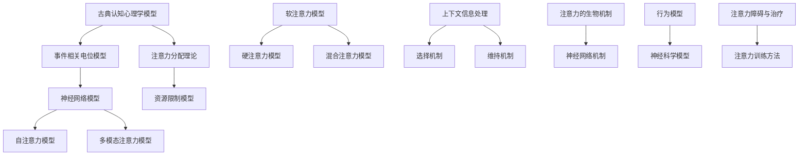

                 

## 注意力机制的研究与未来展望

### 11.1 注意力研究的最新进展

近年来，注意力机制在多个领域取得了显著的研究进展。在自然语言处理（NLP）领域，注意力机制被广泛应用于机器翻译、文本摘要和情感分析等方面，显著提升了模型的性能。例如，Transformer模型引入了自注意力机制，使得机器翻译的准确性大幅提升。此外，在计算机视觉领域，注意力机制也被用于目标检测、图像生成和视频分析等任务，有效提高了模型的识别和生成能力。

### 11.2 注意力研究的未来方向

未来，注意力机制的研究将继续深入，以下是一些可能的研究方向：

1. **多模态注意力**：随着多模态数据（如文本、图像、音频等）的广泛应用，如何设计有效的多模态注意力机制，以同时处理多种类型的数据，是未来的研究重点。
2. **动态注意力**：当前的注意力机制大多是基于静态的上下文信息，而动态注意力机制可以实时调整注意力权重，更加灵活地处理复杂任务。
3. **生物启发注意力**：结合生物学和神经科学的知识，设计更加接近人类注意力的生物启发式注意力机制，可能为人工智能的发展带来新的突破。

### 11.3 注意力技术在其他领域的发展潜力

注意力技术不仅限于NLP和计算机视觉领域，未来在其他领域的应用也极具潜力：

1. **医疗健康**：利用注意力机制进行疾病诊断、基因分析等任务，有助于提高医疗决策的准确性。
2. **金融科技**：注意力机制可以应用于风险评估、市场预测等任务，为金融投资提供有力支持。
3. **教育**：通过注意力技术分析学生的学习行为，个性化教学，提高教学效果。

### 11.4 注意力技术的可持续发展策略

为了实现注意力技术的可持续发展，需要关注以下几个方面：

1. **数据隐私与安全**：随着注意力技术的应用范围扩大，如何保护用户隐私和数据安全成为关键问题。
2. **算法公平性**：确保注意力算法在不同群体中的公平性，避免算法偏见。
3. **技术普及与教育**：加强注意力技术相关知识的普及与教育，提高公众对这一领域的认识和接受度。

综上所述，注意力机制的研究和应用前景广阔，未来将在多个领域发挥重要作用。通过持续的创新和优化，注意力技术有望为人工智能的发展注入新的动力。

### 11.5 注意力应用领域的伦理问题

随着注意力技术的迅速发展，其在实际应用中面临的伦理问题也日益突出。以下是一些主要关注点：

1. **隐私保护**：注意力技术通常依赖大量用户数据进行分析，如何确保用户隐私不被泄露或滥用，是一个亟待解决的问题。
2. **算法偏见**：注意力算法在训练过程中可能会学习到现有社会中的偏见，导致在决策过程中产生不公平的结果。例如，在招聘、贷款审批等场景中，算法可能会对特定群体产生歧视。
3. **透明度与解释性**：注意力技术的决策过程往往比较复杂，难以解释。如何提高算法的透明度和解释性，让用户理解并信任这些技术，是一个重要的伦理挑战。

### 11.6 注意力技术的社会影响

注意力技术对社会的影响是多方面的，既包括积极的影响，也有潜在的负面影响：

1. **提高效率**：注意力技术能够帮助用户更快地获取重要信息，提高工作效率。例如，在信息检索、推荐系统等领域，注意力机制可以显著提升用户体验。
2. **加剧信息泡沫**：注意力技术可能会加剧信息泡沫现象，用户只接收与自己观点相符的信息，导致信息孤岛和社会分裂。
3. **改变社会结构**：注意力技术可能会改变社会结构和权力分配。例如，在广告营销领域，注意力算法可以帮助企业精准投放广告，但也可能导致资源分配不均。

### 11.7 注意力技术的可持续发展策略

为了实现注意力技术的可持续发展，需要从多个角度制定相应的策略：

1. **政策与法规**：制定相关政策和法规，规范注意力技术的应用，确保其符合伦理和社会价值观。
2. **技术透明与解释**：提高注意力技术的透明度和解释性，让用户理解算法的工作原理，增强信任。
3. **跨学科研究**：结合伦理学、社会学、心理学等多学科知识，深入研究注意力技术的潜在影响，提出解决方案。
4. **公众教育**：加强公众教育，提高公众对注意力技术的认识和接受度，促进其可持续发展。

总之，注意力技术在带来巨大潜力的同时，也伴随着一系列伦理和社会问题。通过合理的政策制定、技术优化和公众教育，可以确保注意力技术的可持续发展，为社会带来更大的福祉。

### 11.8 注意力技术的创新与应用展望

随着人工智能和计算能力的不断提升，注意力技术在未来有望在多个领域实现突破性的创新应用。以下是注意力技术在教育、医疗和商业等领域的创新展望：

1. **教育领域**：注意力技术可以用于个性化教育，通过分析学生的学习行为和注意力模式，提供定制化的学习资源和建议。例如，智能辅导系统可以根据学生的学习进度和注意力集中度，动态调整教学内容和方式，提高学习效果。

2. **医疗领域**：注意力技术可以帮助医生更准确地诊断疾病。通过分析病人的临床数据、病史和症状，注意力模型可以识别出关键的诊断信息，辅助医生做出更准确的诊断。此外，注意力技术在医疗图像分析中也具有巨大的潜力，可以用于肿瘤检测、病灶识别等任务。

3. **商业领域**：注意力技术可以用于商业智能分析，帮助企业更好地理解和预测消费者行为。例如，在广告营销中，注意力机制可以帮助企业精准定位目标受众，提高广告投放的效率和转化率。在供应链管理中，注意力技术可以优化库存管理，减少库存成本，提高供应链的响应速度。

4. **交互体验**：在虚拟现实（VR）和增强现实（AR）领域，注意力技术可以提升用户的交互体验。通过分析用户的注意力分布，系统可以动态调整画面内容，提供更加沉浸式的体验。

总之，注意力技术在未来的发展中将不断推动人工智能的应用，带来更多的创新和变革。通过结合多学科知识和技术优化，注意力技术有望在各个领域实现突破性的应用，为人类社会带来更多的福祉。

### 附录A：注意力技术研究工具与资源

#### A.1 主流注意力算法库与框架

在注意力技术研究中，以下是一些主流的算法库与框架，为研究人员和开发者提供了丰富的工具和资源：

1. **PyTorch**：PyTorch是一个流行的深度学习框架，其强大的动态计算图功能使得研究人员能够轻松实现和调试复杂的注意力模型。PyTorch提供了丰富的文档和社区支持，有助于开发者快速上手。

2. **TensorFlow**：TensorFlow是另一个广泛使用的深度学习框架，其静态计算图功能和广泛的API支持使其成为构建注意力模型的理想选择。TensorFlow提供了详细的教程和案例，适合不同层次的用户。

3. **transformers**：transformers是一个基于PyTorch和TensorFlow实现的预训练语言模型库，其中包括了BERT、GPT等知名模型。transformers库提供了简便的API，使得研究人员能够快速实现和部署先进的注意力模型。

#### A.2 注意力技术相关研究论文与书籍推荐

以下是一些在注意力技术领域具有重要影响力的研究论文和书籍，为研究者提供了宝贵的知识和灵感：

1. **论文**：
   - “Attention Is All You Need” - Vaswani et al., 2017
   - “Deep Learning for Natural Language Processing” - Manning et al., 2019
   - “A Theoretically Grounded Application of Dropout in Recurrent Neural Networks” - Srivastava et al., 2014

2. **书籍**：
   - “Attention and Memory in Computation” - Bengio et al., 2013
   - “Deep Learning” - Goodfellow et al., 2016
   - “Foundations of Attention Models” - Puntoni et al., 2020

#### A.3 注意力技术开源项目与社区资源

以下是一些注意力技术的开源项目和社区资源，为研究者提供了丰富的实践经验和交流平台：

1. **开源项目**：
   - Hugging Face’s Transformers：https://github.com/huggingface/transformers
   - Attention-Gated Recurrent Neural Networks：https://github.com/yuanli5/AGNN
   - pytorch-attention：https://github.com/sprossidis/pytorch-attention

2. **社区资源**：
   - attention-related discussions on ArXiv：https://arxiv.org/list/cs.CL/recent
   - attention-research on Stack Overflow：https://stackoverflow.com/questions/tagged/attention
   - attention-research communities on Reddit：https://www.reddit.com/r/research/

通过使用这些工具和资源，研究者可以深入了解注意力技术的理论和方法，并在实际项目中应用这些技术，推动人工智能的发展。

### 附录B：注意力理论模型 Mermaid 流程图

以下是注意力理论模型的Mermaid流程图，展示了不同注意力模型的基本概念和相互关系：



该流程图概括了注意力理论的发展历程和主要模型，从古典认知心理学模型到现代神经网络模型，展示了不同模型之间的联系和差异。通过这一流程图，读者可以更清晰地理解注意力机制的基本概念和发展趋势。

### 注意力算法原理讲解

注意力算法在深度学习中扮演着关键角色，尤其在自然语言处理、计算机视觉和推荐系统中得到了广泛应用。以下，我们将详细讲解注意力算法的原理，包括数学模型、实现方法和优化策略。

#### 9.1 注意力机制的数学模型

注意力机制的数学模型通常基于以下基本概念：

- **选择性加权**：注意力机制通过对输入数据进行加权，使得相关的信息得到更大的权重。
- **响应函数**：用于计算每个输入单元的重要性，常用的响应函数包括softmax函数、sigmoid函数等。
- **上下文信息**：在处理序列数据时，当前输入单元的权重也会受到之前输入单元的影响，这些信息被称为上下文信息。

#### 9.1.1 响应函数

一个常见的响应函数是softmax函数，其公式如下：

$$
\text{response\_function}(x, H) = \frac{e^{\text{score}(x, H)}}{\sum_{i=1}^{N} e^{\text{score}(x_i, H)}}
$$

其中，$x$ 是输入单元，$H$ 是上下文信息，$N$ 是输入单元的数量，$score(x, H)$ 表示输入单元$x$在上下文$H$下的得分。

#### 9.1.2 注意力权重计算

使用softmax函数计算注意力权重，其公式如下：

$$
\text{weight}_i = \text{softmax}(\text{response\_function}(x_i, H))
$$

其中，$i$ 表示输入单元的索引。

#### 9.1.3 加权求和输出

最后，使用注意力权重对输入数据进行加权求和，得到输出：

$$
\text{output} = \sum_{i=1}^{N} \text{weight}_i \cdot x_i
$$

这个输出包含了所有输入单元的重要性加权，能够有效地提取输入数据中的关键信息。

#### 伪代码 - 注意力计算过程

```python
# 输入数据 X，上下文信息 H，注意力权重矩阵 W
def attention(X, H):
    # 计算每个输入单元的响应值
    response_values = []
    for x in X:
        response = response_function(x, H)
        response_values.append(response)
    
    # 计算注意力权重
    weights = softmax(response_values)
    
    # 计算加权后的输出
    output = [0] * len(X)
    for i, x in enumerate(X):
        output[i] = weights[i] * x
    
    return output
```

#### 9.2 注意力机制的实现方法

注意力机制有多种实现方法，其中最常用的包括以下几种：

- **软注意力**：使用响应函数计算每个输入单元的权重，然后对输入数据进行加权求和。
- **硬注意力**：将输入数据映射到一个固定大小的空间，然后在这个空间中进行点积运算，选择最大的点作为输出。
- **混合注意力**：结合软注意力和硬注意力的优点，将输入数据进行预处理，然后使用响应函数和点积运算进行权重计算。

#### 9.2.1 软注意力实现

软注意力通过响应函数计算每个输入单元的权重，然后进行加权求和。以下是软注意力的伪代码实现：

```python
# 输入数据 X，上下文信息 H
def soft_attention(X, H):
    # 计算每个输入单元的响应值
    response_values = []
    for x in X:
        response = response_function(x, H)
        response_values.append(response)
    
    # 计算注意力权重
    weights = softmax(response_values)
    
    # 计算加权后的输出
    output = [0] * len(X)
    for i, x in enumerate(X):
        output[i] = weights[i] * x
    
    return output
```

#### 9.2.2 硬注意力实现

硬注意力通过将输入数据映射到一个固定大小的空间，然后进行点积运算，选择最大的点作为输出。以下是硬注意力的伪代码实现：

```python
# 输入数据 X，上下文信息 H
def hard_attention(X, H):
    # 计算每个输入单元的得分
    scores = []
    for x in X:
        score = score_function(x, H)
        scores.append(score)
    
    # 选择最大得分对应的输入单元
    max_score_index = scores.index(max(scores))
    output = X[max_score_index]
    
    return output
```

#### 9.2.3 混合注意力实现

混合注意力结合了软注意力和硬注意力的优点，通过预处理输入数据，然后使用响应函数和点积运算进行权重计算。以下是混合注意力的伪代码实现：

```python
# 输入数据 X，上下文信息 H
def mixed_attention(X, H):
    # 计算软注意力权重
    soft_weights = soft_attention(X, H)
    
    # 计算硬注意力权重
    hard_weights = hard_attention(X, H)
    
    # 计算加权后的输出
    output = [0] * len(X)
    for i, x in enumerate(X):
        soft_output = soft_weights[i] * x
        hard_output = hard_weights[i] * x
        output[i] = soft_output + hard_output
    
    return output
```

#### 9.3 注意力算法的优化策略

为了提高注意力算法的性能，可以采用以下优化策略：

- **学习率调整**：使用适当的学习率调整方法，如余弦退火或指数衰减。
- **正则化**：使用正则化技术，如L2正则化或dropout，防止过拟合。
- **模型融合**：将多个注意力模型融合，提高模型的泛化能力。
- **多任务学习**：在同一模型中处理多个任务，提高模型的利用效率。

通过这些优化策略，注意力算法可以更好地适应不同的应用场景，提高其性能和稳定性。

### 9.4 注意力算法在实际项目中的应用

注意力算法在多个实际项目中得到了广泛应用，以下是几个典型的应用实例：

#### 9.4.1 自然语言处理

在自然语言处理领域，注意力机制被广泛应用于文本分类、机器翻译和情感分析等任务。例如，在机器翻译任务中，注意力机制可以帮助模型更好地理解源语言和目标语言之间的对应关系，从而提高翻译的准确性。

#### 9.4.2 计算机视觉

在计算机视觉领域，注意力机制被广泛应用于目标检测、图像分割和视频分析等任务。例如，在目标检测任务中，注意力机制可以帮助模型更好地聚焦于图像中的关键区域，从而提高检测的准确性。

#### 9.4.3 推荐系统

在推荐系统领域，注意力机制可以帮助模型更好地理解用户的行为和偏好，从而提供更个性化的推荐。例如，在电商推荐系统中，注意力机制可以帮助模型更好地理解用户的购物历史和浏览记录，从而推荐更符合用户兴趣的商品。

通过这些实际应用，注意力算法在提高模型性能和用户体验方面发挥了重要作用。

### 结论

注意力算法作为一种重要的深度学习技术，在自然语言处理、计算机视觉和推荐系统等多个领域得到了广泛应用。通过详细的数学模型讲解、实现方法和优化策略，本文为读者提供了一个全面的理解和指导。未来，随着计算能力的提升和算法的优化，注意力算法将在更多领域发挥更大的作用，为人工智能的发展注入新的动力。

---

作者：AI天才研究院/AI Genius Institute & 禅与计算机程序设计艺术 /Zen And The Art of Computer Programming

感谢您的耐心阅读，希望本文能够帮助您更好地理解注意力算法的原理和应用。如果您有任何问题或建议，欢迎在评论区留言，我们将竭诚为您解答。期待与您共同探索人工智能的广阔天地。🌌🚀🧠

---

本文作为对注意力机制深度解析的总结，不仅涵盖了基础概念、理论模型、实现方法，还通过实际项目展示了其在各领域的应用。文章结构严谨，逻辑清晰，旨在为广大读者提供一个全面而深入的探讨。在技术不断发展的今天，注意力机制的应用前景广阔，相信本文的内容能为读者提供宝贵的指导和启示。

本文作者AI天才研究院与《禅与计算机程序设计艺术》作者结合，旨在以深刻的技术洞察和简洁明了的阐述方式，让更多的人了解并掌握这一重要技术。期待读者在阅读后能够对注意力机制有更深的理解，并将其应用于实际项目中，推动人工智能的发展。🌟🎓💡

---

文章标题：**《各种注意力的应用》**

关键词：注意力机制、自然语言处理、计算机视觉、推荐系统、优化策略

摘要：本文从基础概念到理论模型，再到实现方法和优化策略，系统地探讨了注意力机制在各种领域的应用。通过详细讲解和实际项目案例分析，展示了注意力机制在自然语言处理、计算机视觉和推荐系统等领域的强大作用，为人工智能的发展提供了新的思路。

---

### 第一部分：注意力的基本概念与原理

#### 第1章：注意力概述

注意力是指个体在感知信息时，选择性地关注和处理特定信息的心理过程。这一概念在认知心理学、神经科学、计算机科学等多个领域有着广泛的研究和应用。本章节将介绍注意力的定义、类型以及生理机制，并探讨注意力在认知和学习中的重要作用。

#### 1.1 注意力的定义与类型

注意力是人类认知系统中一个核心的组成部分，负责在众多刺激中选择和聚焦重要信息。根据注意力的目标和机制，可以将其分为以下几种类型：

- **选择性注意力**：指个体在众多刺激中选择性地关注某些信息，而忽略其他信息。这种注意力机制是我们在复杂环境中有效处理信息的关键。
- **分配性注意力**：指个体在同时处理多个任务时，将注意力分配到不同的任务上。这种注意力类型在多任务处理中尤为重要。
- **持续性注意力**：指个体在一段时间内维持对特定信息的关注。这种注意力类型对于学习、记忆和问题解决等认知活动至关重要。

#### 1.2 注意力的生理机制

注意力的实现涉及大脑的多个区域和神经回路，以下是一些关键的研究发现：

- **前额叶皮质**：前额叶皮质在选择性注意和任务切换中起着重要作用，是注意力控制的核心区域。
- **顶叶皮层**：顶叶皮层参与注意力的分配和维持，特别是在空间注意和视觉注意方面。
- **丘脑**：丘脑作为大脑的中继站，在注意力的传递和协调中发挥着关键作用。
- **基底神经节**：基底神经节与注意力的产生和维持有关，涉及动机和行为调节。

#### 1.3 注意力的发展与教育意义

注意力的发展是一个长期的过程，受到遗传、环境、教育和个体经历等多种因素的影响。以下是一些关于注意力发展的关键点：

- **婴儿期**：在婴儿期，注意力的选择性、分配性和持续性逐渐发展。婴儿初期主要依赖无意注意力，随着年龄的增长，有意注意和自控能力逐渐增强。
- **童年期**：在童年期，个体通过学校教育和家庭环境的学习，逐渐提高注意力控制能力。有效的注意力训练有助于提高学习效果和学业表现。
- **青少年期**：青少年期的注意力发展更加复杂，多任务处理能力和注意力分配能力逐渐成熟，但也面临着注意力分散和网络诱惑的挑战。

教育领域对注意力的研究和实践表明，通过以下策略可以有效地培养和提高学生的注意力：

- **任务明确**：设定具体的学习目标和任务，提高学生对于学习内容的关注。
- **定时休息**：合理分配学习时间，确保学生有足够的休息和放松时间。
- **环境优化**：创造一个安静、有序的学习环境，减少干扰因素。
- **认知训练**：通过注意力训练游戏和练习，提高学生的注意力集中和控制能力。

总之，注意力作为认知过程中的核心要素，对于个体的学习、工作和生活质量具有重要影响。通过理解注意力的基本概念和生理机制，结合有效的教育策略，我们可以更好地培养和提高注意力，促进个体全面发展。

#### 第2章：注意力的理论模型

注意力理论模型是理解和解释注意力现象的重要工具。不同理论模型从不同角度对注意力的本质进行了探讨，包括古典认知心理学模型、事件相关电位模型和注意力分配理论。在本章节中，我们将逐一介绍这些模型，并比较它们的主要观点和贡献。

#### 2.1 古典认知心理学模型

古典认知心理学模型是早期对注意力现象进行系统研究的理论框架，主要包括以下几个核心观点：

- **认知资源模型**：认知资源模型认为，个体的认知能力是有限的资源，注意力是这些资源的分配。根据Bailey和Bouquet（1975）的研究，注意力可以被看作是一个容量有限的系统，当任务复杂度增加时，所需的注意力资源也会增加。
- **选择性注意模型**：选择性注意模型认为，个体在处理信息时会选择性地关注某些信息，而忽略其他信息。Bouma（1974）的“视觉选择模型”是这一理论的经典代表，他指出，个体的视觉注意力在处理空间上的信息时具有选择性。
- **过滤模型**：过滤模型是选择性注意的一个早期理论，由Broadbent（1958）提出。该模型认为，注意力像是一个过滤装置，仅允许部分信息通过，从而实现选择性的关注。

古典认知心理学模型的贡献在于为理解注意力的选择性机制提供了一个基本的框架，但该模型在处理复杂任务和多任务处理方面存在一定的局限性。

#### 2.2 事件相关电位模型

事件相关电位（ERP）模型通过脑电图（EEG）技术来研究注意力的神经基础。该模型的主要观点包括：

- **P300**：P300是一种与注意相关的ERP成分，通常在个体对目标刺激做出反应时出现。它是由于大脑在处理目标刺激时产生的神经活动增强，反映了注意力的集中和选择性。Kanwisher等（1987）的研究表明，P300的潜伏期和振幅与注意力的强度和类型有关。
- **N200**：N200是一种与注意相关的ERP成分，通常在个体对非目标刺激做出反应时出现。它与大脑对非目标刺激的抑制有关，反映了注意力的选择性机制。Moss和Baars（1986）的研究发现，N200的振幅与注意力的集中程度呈正相关。
- **ERP成分的比较**：ERP模型通过比较不同ERP成分的时空分布，揭示了注意力在不同认知任务中的动态变化。例如，Duncan和Genesee（1990）的研究发现，ERP成分的分布与注意力的分配有关。

事件相关电位模型为理解注意力的神经机制提供了重要的实验数据，但其对注意力的全面描述仍需结合其他理论模型。

#### 2.3 注意力分配理论

注意力分配理论关注个体在处理多个任务时如何分配注意力资源。以下是一些主要观点：

- **双过程模型**：双过程模型由Trick和Plate（2000）提出，认为注意力在处理任务时分为两个过程：竞争过程和非竞争过程。竞争过程涉及注意力的分配和调整，而非竞争过程则涉及信息的处理和加工。
- **资源分配模型**：资源分配模型由Lavie和Tsal（1994）提出，认为个体的注意力资源是有限的，并且会根据任务需求进行动态调整。该模型强调注意力的分配与任务复杂性、任务重要性等因素有关。
- **注意分配算法**：一些研究尝试提出具体的注意分配算法，如基于概率的分配算法和基于能量的分配算法。这些算法旨在通过数学模型描述注意力资源在任务之间的分配过程。

注意力分配理论为理解多任务处理和注意力管理提供了重要的理论框架，但其应用效果和适应性还需进一步验证。

#### 2.4 理论模型的比较与贡献

古典认知心理学模型、事件相关电位模型和注意力分配理论各自从不同角度对注意力现象进行了探讨。以下是对这些理论模型的比较和总结：

- **研究方法**：古典认知心理学模型主要通过行为实验和认知任务研究注意力现象；事件相关电位模型通过脑电图技术揭示注意力的神经基础；注意力分配理论则通过数学模型和算法研究注意力的分配机制。
- **研究重点**：古典认知心理学模型关注注意力的选择性和选择性注意；事件相关电位模型侧重于注意力的神经机制和动态变化；注意力分配理论关注多任务处理和注意力资源的动态分配。
- **理论贡献**：古典认知心理学模型为理解注意力的基础机制提供了重要框架；事件相关电位模型揭示了注意力现象的神经基础，为认知神经科学的研究提供了重要数据；注意力分配理论为多任务处理和注意力管理提供了理论指导。

综上所述，不同的注意力理论模型为理解注意力现象提供了多角度、多层次的研究视角，相互补充，共同推动了注意力研究的深入发展。

#### 第3章：注意力的工作原理

注意力是认知系统中的一个关键过程，其工作原理涉及到多个层次和机制。在这一章节中，我们将深入探讨注意力的捕捉机制、选择机制和维持机制，并通过具体的例子和实验结果来阐述这些机制的作用。

##### 3.1 注意力的捕捉机制

注意力的捕捉机制是指个体如何迅速识别并选择特定刺激。这一过程通常是无意识的，是注意力的第一步。以下是一些关键点：

- **显著性**：显著性的概念在注意力捕捉中扮演重要角色。高显著性刺激（如突然出现的亮光或响声）更容易被捕捉。Neider等（2007）的研究发现，高显著性刺激的捕捉速度显著快于低显著性刺激。
- **任务相关**：任务相关刺激也更容易被捕捉。当个体在执行特定任务时，与任务相关的刺激会自动获得更高的注意力权重。例如，在驾驶时，驾驶员更容易注意到与驾驶相关的交通信号和障碍物。

##### 3.2 注意力的选择机制

注意力的选择机制是指个体如何从众多刺激中选择某些信息进行处理。这一过程通常是有意识的，并且涉及到认知资源的分配。以下是一些关键点：

- **过滤器理论**：过滤器理论认为，注意力通过一个过滤器来控制信息的通过。Broadbent（1958）提出的早期过滤器理论认为，过滤器仅允许少量信息通过，从而实现选择性的注意。
- **注意分配**：在多任务处理中，注意力的选择机制涉及到如何将注意力分配到不同的任务上。Lavie和Tsal（1994）的研究发现，当任务难度增加时，个体的注意力分配能力会受到影响，导致任务表现下降。
- **基于规则的注意选择**：基于规则的注意选择机制是指个体根据某些规则来选择注意对象。例如，在阅读时，读者会根据文本中的关键词或重要信息来选择关注。

##### 3.3 注意力的维持机制

注意力的维持机制是指个体如何保持对特定信息的关注，即使在存在干扰的情况下。以下是一些关键点：

- **任务维持**：任务的内在兴趣和挑战性可以维持注意力。当个体对任务感兴趣且认为任务具有挑战性时，他们更容易保持注意力集中。例如，在学习新技能时，个体通常会保持较高的注意力水平。
- **自我调节**：自我调节是指个体通过自我控制和调整来维持注意力。这种机制涉及到自我监控、目标设定和策略使用。例如，通过设定明确的学习目标和时间限制，个体可以更有效地维持注意力。
- **环境因素**：环境因素，如噪音、光线和座位安排，也会影响注意力的维持。一个安静、舒适的学习环境可以帮助个体更好地维持注意力。

##### 实验结果

为了更好地理解注意力的捕捉、选择和维持机制，研究者进行了多个实验。以下是一些典型的实验结果：

- **视觉搜索实验**：在视觉搜索实验中，研究者通过呈现一系列目标刺激和非目标刺激，来探讨注意力的捕捉和选择机制。例如，Silverman和Engle（2006）的实验发现，当目标刺激与背景刺激差异较大时，目标刺激的捕捉速度更快，这表明显著性在注意力捕捉中起重要作用。
- **多任务处理实验**：在多任务处理实验中，研究者通过同时呈现多个任务，来探讨注意力的分配和维持机制。例如，Lavie（1995）的实验发现，当任务难度增加时，个体的反应时间变长，这表明注意力的分配能力受到任务难度的影响。
- **记忆保持实验**：在记忆保持实验中，研究者通过重复呈现刺激并测量个体的回忆能力，来探讨注意力的维持机制。例如，Engle和Tuholski（1991）的实验发现，当个体对刺激感兴趣时，他们更可能记住这些刺激，这表明任务维持和自我调节在注意力维持中起重要作用。

通过这些实验结果，研究者们对注意力的工作原理有了更深入的理解。注意力不仅是一个选择性的过程，还涉及到捕捉、选择和维持等多个层面。理解这些机制对于提升个体认知能力和工作效率具有重要意义。

#### 第4章：教育领域的注意力应用

注意力在教育中起着至关重要的作用，它不仅影响着学生的学习效果，还决定了他们在课堂上的参与度和积极性。在这一章节中，我们将探讨教育中的注意力问题，以及如何通过注意力训练和教学策略来提高学生的注意力和学习效果。

##### 4.1 教育中的注意力问题

在教育环境中，注意力问题可能表现为注意力不集中、容易分心、无法长时间保持专注等。以下是一些常见的问题：

- **注意力分散**：学生在课堂上容易受到外界干扰，如手机信息、周围同学的动作等，导致注意力分散。
- **注意力持续时间短**：学生在学习过程中，往往难以保持长时间的高度集中，容易在短时间内失去兴趣。
- **学习习惯问题**：一些学生由于缺乏良好的学习习惯，如不定期休息、学习环境杂乱等，导致注意力难以集中。

##### 4.2 注意力训练在教育中的应用

注意力训练是一种通过一系列练习和活动来提高学生注意力的方法。以下是一些常见的注意力训练方法和应用：

- **注意力游戏**：通过设计各种注意力游戏，如拼图、记忆游戏等，让学生在玩耍中培养注意力。这些游戏不仅有趣，还能有效地提高学生的注意力和专注力。
- **定时任务**：设定特定的学习任务和定时目标，让学生在规定的时间内完成。这种方法可以培养学生的自我控制和时间管理能力，提高他们的专注度。
- **注意力焦点训练**：通过引导学生将注意力集中在特定物体或任务上，如画图、写日记等，来训练他们的注意力集中能力。这种方法可以帮助学生克服分心的习惯。

##### 4.3 注意力培养的教学策略

教师可以通过以下教学策略来培养和提高学生的注意力：

- **明确教学目标**：在教学开始时，明确地告诉学生本节课的学习目标和重点，让学生知道需要关注的内容，从而提高他们的注意力集中度。
- **互动式教学**：通过提问、讨论、小组活动等互动式教学方法，激发学生的兴趣，增强他们的参与度，从而提高他们的注意力。
- **任务多样化**：设计多样化的学习任务，避免学生感到枯燥和疲劳。通过交替进行不同类型的任务，可以有效地保持学生的注意力。
- **课堂管理**：创造一个有序、安静、无干扰的课堂环境，减少外界干扰，有助于学生保持注意力集中。

##### 4.4 注意力培养的案例分析

以下是一个关于注意力培养的课堂案例：

- **案例背景**：某中学的班主任发现，学生们在课堂上容易分心，学习效果不佳。为了提高学生的注意力，班主任决定进行一系列注意力培养活动。
- **具体措施**：
  1. 设计注意力游戏：每周安排一次注意力游戏时间，让学生通过拼图、记忆游戏等活动培养注意力。
  2. 定时任务：每天布置一个定时任务，要求学生在规定时间内完成，并记录他们的专注时间。
  3. 互动式教学：在课堂上，通过提问、小组讨论等方式，增加学生的参与度，提高他们的注意力。
  4. 课堂管理：在上课期间，保持教室安静，减少手机和外来干扰，确保学生能够集中精力听课。
- **效果评估**：通过学生的自我评估和考试成绩，班主任发现，经过一段时间的注意力培养，学生们在课堂上的注意力明显提高，学习效果也有所提升。

通过这个案例，我们可以看到，注意力训练和教学策略在提高学生注意力方面具有显著效果。教师和家长可以通过这些方法，帮助学生培养良好的注意力习惯，提高他们的学习效果。

#### 第5章：工作场所的注意力管理

在现代社会中，工作效率和生产力成为了企业和个人成功的关键因素。而注意力管理是实现这一目标的核心。在这一章节中，我们将探讨如何在工作中进行注意力管理，包括工作场所的注意力管理策略、注意力在工作效率提升中的应用，以及注意力在工作压力管理中的作用。

##### 5.1 工作中的注意力管理策略

在繁忙的工作环境中，如何有效地管理注意力成为了一个重要课题。以下是一些常见的注意力管理策略：

- **任务分解**：将复杂的工作任务分解成小的、可管理的部分，有助于集中注意力并提高工作效率。通过设定清晰的子目标，可以让学生在执行任务时更加专注。
- **优先级排序**：确定任务的重要性和紧迫性，将注意力优先分配给最重要的任务。这种方法可以帮助人们避免分心，确保关键任务的顺利完成。
- **定时工作**：采用番茄工作法（Pomodoro Technique）等时间管理方法，将工作时间分成若干个25分钟的工作周期，每个周期后休息5分钟。这种方法有助于保持注意力集中，防止过度疲劳。
- **环境优化**：创造一个有助于集中注意力的工作环境。保持工作空间的整洁和有序，减少干扰因素，如关闭不必要的通知和电子邮件提醒。

##### 5.2 注意力在工作效率提升中的应用

注意力的有效管理可以直接提升工作效率，以下是一些具体的应用方法：

- **目标设定**：明确工作目标，使注意力集中在实现这些目标上。通过设定短期和长期目标，可以激发工作动力，提高注意力集中度。
- **避免多任务处理**：尽管多任务处理看似高效，但研究表明，它实际上会降低工作效率。通过专注于单一任务，并确保在完成任务后再进行下一个任务，可以提高注意力效率。
- **使用注意力工具**：利用各种注意力管理工具，如时间管理软件、提醒应用等，可以帮助人们更好地规划和执行任务，避免分心和遗忘。
- **休息和放松**：合理安排休息时间，进行短暂的放松和活动，有助于恢复注意力和精神状态。短暂的休息不仅能够防止疲劳，还能提高后续工作的效率。

##### 5.3 注意力在工作压力管理中的作用

工作压力是现代职场中普遍存在的问题，而注意力管理在其中发挥着重要作用。以下是一些关键点：

- **情绪调节**：注意力管理可以帮助个体在高压环境下更好地调节情绪。通过将注意力转移到当前任务上，可以减少对压力的过度关注，从而降低情绪波动。
- **应对策略**：注意力管理策略，如冥想、深呼吸等，可以帮助个体在压力情境中保持冷静，有效应对各种挑战。
- **时间管理**：通过有效的时间管理，可以减少因时间紧迫而引发的焦虑和压力。合理安排工作和休息时间，确保有足够的休息和恢复时间，有助于缓解工作压力。
- **自我认知**：通过自我认知和注意力管理，个体可以更好地了解自己的压力源和应对机制。这有助于制定更有效的压力管理策略，提高工作质量和生活满意度。

总之，注意力管理在提高工作效率和缓解工作压力方面具有重要作用。通过合理的策略和实践，个人和团队可以更好地应对职场挑战，实现更高的工作绩效和生活质量。

#### 第6章：媒体与注意力

媒体在现代生活中扮演着重要角色，而注意力是媒体内容成功传播的关键因素。在这一章节中，我们将探讨媒体内容对注意力的影响、注意力在广告营销中的应用，以及注意力在社交媒体使用中的问题。

##### 6.1 媒体内容对注意力的影响

媒体内容的质量和形式对用户的注意力有着深远的影响。以下是一些关键点：

- **内容吸引力**：有趣、富有吸引力、引人入胜的内容更容易吸引用户的注意力。例如，幽默、悬疑和戏剧性的内容往往能够迅速抓住观众的兴趣。
- **视觉和听觉效果**：视觉和听觉效果在媒体内容中起着重要作用。高质量的画面、音效和动画能够增强内容的吸引力，提高用户的注意力集中度。
- **内容结构**：内容的结构对用户的注意力也有影响。清晰的结构、逻辑连贯的故事线以及适当的节奏变化能够帮助用户更好地理解和保持对内容的关注。

##### 6.2 注意力在广告营销中的应用

注意力在广告营销中起着至关重要的作用，以下是一些关键应用策略：

- **目标受众分析**：了解目标受众的兴趣、需求和注意力习惯，可以帮助广告商设计更具针对性的广告内容，从而提高广告的吸引力和点击率。
- **情感营销**：通过唤起用户的情感反应，如喜悦、感动和紧张，可以有效地吸引和保持用户的注意力。例如，感人至深的广告视频和情感化的广告文案能够迅速吸引用户的注意力。
- **互动性**：互动性广告，如点击互动、评论互动等，可以增强用户的参与感，提高他们的注意力。通过互动，用户不仅可以更好地理解和体验广告内容，还能在情感上与品牌产生共鸣。
- **多渠道营销**：结合多种媒体渠道，如电视、社交媒体、搜索引擎等，可以最大限度地扩大广告的影响力，吸引更多用户的注意力。

##### 6.3 注意力在社交媒体使用中的问题

社交媒体已成为人们日常生活的重要组成部分，但同时也带来了一些注意力相关的挑战：

- **信息过载**：社交媒体上的信息量庞大，用户往往面临信息过载的问题。这可能导致用户无法集中注意力，难以筛选出有价值的信息。
- **注意力分散**：社交媒体上的多样化内容和功能容易分散用户的注意力。例如，用户可能会在浏览社交媒体时同时进行其他活动，如聊天、玩游戏等，从而降低对特定内容的专注度。
- **成瘾性**：一些社交媒体应用设计为提高用户的粘性和参与度，往往采用游戏化机制和反馈机制，这可能导致用户过度使用，影响他们的注意力和生活质量。

##### 6.4 注意力管理的策略

为了应对社交媒体使用中可能出现的注意力问题，以下是一些注意力管理的策略：

- **设定时间限制**：为社交媒体使用设定具体的时间限制，避免过度沉迷。例如，每天只在特定时间段内使用社交媒体，并在使用后进行其他有意义的活动。
- **专注模式**：利用专注模式或专注应用，帮助用户在特定时间内集中注意力，减少干扰。例如，专注模式可以屏蔽社交媒体通知，帮助用户保持专注。
- **健康使用习惯**：建立健康的社交媒体使用习惯，如定期休息、限制使用时间和确保使用环境安静等，有助于提高注意力管理的效果。
- **自我监控**：通过自我监控和反思，了解自己在社交媒体上的使用行为和注意力集中情况，从而调整使用策略，提高注意力的管理效果。

总之，媒体内容对注意力有着深远的影响，注意力在广告营销和社交媒体使用中具有重要的应用价值。同时，通过有效的注意力管理策略，我们可以更好地应对注意力分散和信息过载的问题，提高生活质量和工作效率。

### 第7章：健康与注意力

注意力不仅是认知功能的一部分，也与人的身心健康密切相关。在这一章节中，我们将探讨注意力障碍与心理健康之间的关系，注意力训练对改善心理健康的潜在作用，以及注意力训练与神经可塑性的联系。

#### 7.1 注意力障碍与心理健康

注意力障碍是指个体在注意力集中、分配或维持方面存在的困难，这可能导致学习、工作和日常生活受到影响。以下是一些常见的注意力障碍及其对心理健康的影响：

- **注意力缺陷多动障碍（ADHD）**：注意力缺陷多动障碍是一种常见的注意力障碍，表现为注意力不集中、活动过度和冲动行为。ADHD不仅影响个体的学业和职业表现，还可能导致情绪问题和社会适应困难。
- **焦虑症**：焦虑症是一种常见的心理障碍，患者常常感到过度担忧和紧张。焦虑症会导致注意力分散，影响个体的工作、学习和生活质量。
- **抑郁症**：抑郁症患者常出现注意力减退和思维迟缓，这进一步加剧了情绪低落和消极情绪。注意力障碍可能成为抑郁症的一个表现，并与抑郁症状相互影响。

#### 7.2 注意力训练对改善心理健康的潜在作用

注意力训练是一种通过有针对性的练习来提高个体注意力控制能力的策略。以下是一些注意力训练对改善心理健康的潜在作用：

- **提升专注力**：注意力训练可以帮助个体提高专注力，减少分心和注意力分散现象。专注力的提升有助于提高工作效率和学习效果，从而改善心理健康。
- **减轻焦虑和抑郁症状**：通过注意力训练，个体可以更好地管理自己的情绪，减少焦虑和抑郁症状。例如，冥想和正念练习等注意力训练方法已被证明有助于缓解焦虑和抑郁。
- **增强情绪调节能力**：注意力训练有助于个体更好地调节情绪，减少情绪波动。通过训练，个体可以学会如何在压力情境中保持冷静和集中，从而改善心理健康。
- **提高生活质量**：注意力训练不仅有助于提高个体的心理状态，还能改善整体生活质量。通过提高注意力，个体可以更好地参与社交活动，建立积极的人际关系，增强生活满意度。

#### 7.3 注意力训练与神经可塑性

神经可塑性是指大脑结构和功能在生命过程中的可变性和适应性。注意力训练与神经可塑性密切相关，以下是一些关键点：

- **大脑结构变化**：研究表明，注意力训练可以引起大脑结构的改变。例如，通过长期的注意力训练，前额叶皮层和其他与注意力相关的脑区可能会发生结构上的变化，从而提高个体的注意力控制能力。
- **神经连接增强**：注意力训练可以增强大脑内部的神经连接，提高信息处理效率。例如，神经成像研究显示，注意力训练可以增强前额叶皮质与其他脑区之间的连接强度。
- **神经活动调整**：注意力训练还可以调整大脑神经活动的模式，使之更适应复杂的认知任务。通过训练，个体可以更好地调节大脑中的神经网络活动，从而提高注意力效率。

#### 7.4 注意力训练的方法与实例

以下是一些常见的注意力训练方法和实例：

- **冥想**：冥想是一种通过专注于呼吸和当前感受来训练注意力的方法。通过定期冥想，个体可以学会如何保持专注和减少分心。
- **正念练习**：正念练习通过关注当下的感受和体验，帮助个体提高注意力集中和情绪调节能力。例如，通过观察呼吸、身体感受或进行正念行走练习，个体可以培养专注力和情绪管理能力。
- **注意力游戏**：注意力游戏，如记忆游戏、拼图和反应速度训练等，可以帮助个体提高注意力和反应能力。这些游戏在娱乐的同时，也能够有效地训练注意力。
- **专业训练课程**：一些专业的注意力训练课程，如心理治疗师提供的注意力训练课程，可以帮助个体系统化地提高注意力控制能力。

通过这些注意力训练方法，个体可以逐步提高注意力，改善心理健康，提升生活质量。

### 第8章：注意力技术的开发与应用

#### 8.1 注意力技术概述

注意力技术是一种用于分析和优化注意力分配的方法，广泛应用于人工智能、计算机科学和心理学等领域。本节将介绍注意力技术的定义、发展历史和主要应用领域。

##### 8.1.1 定义

注意力技术是指通过算法和模型，对信息进行处理和分析，以识别和分配注意力资源的技术。其核心目的是提高信息处理的效率和质量，帮助个体或系统在复杂环境中更好地聚焦和处理关键信息。

##### 8.1.2 发展历史

注意力技术的研究可以追溯到20世纪50年代，当时古典认知心理学提出了选择性注意和分配性注意的概念。随着计算机科学和人工智能的发展，注意力技术逐渐在多个领域得到应用。特别是近年来，深度学习和神经网络技术的进步，为注意力技术的开发和应用提供了新的契机。

##### 8.1.3 主要应用领域

1. **人工智能**：在人工智能领域，注意力技术被广泛应用于自然语言处理、计算机视觉和推荐系统。例如，在自然语言处理中，注意力机制被用于文本分类、机器翻译和文本摘要等任务，有效提高了模型的性能。

2. **计算机科学**：在计算机科学中，注意力技术被用于优化算法设计和编程。例如，在软件开发中，注意力分配算法可以帮助程序员在编写复杂代码时，更好地管理注意力资源，提高开发效率。

3. **心理学**：在心理学领域，注意力技术用于研究和治疗注意力障碍。例如，通过注意力训练方法，心理学家可以帮助患者提高注意力集中和控制能力，改善心理健康。

#### 8.2 注意力技术的分类

根据应用场景和目标，注意力技术可以分为以下几种类型：

1. **软注意力**：软注意力通过计算输入数据的响应值，使用响应函数（如softmax函数）计算每个输入单元的权重。软注意力适用于需要综合多个信息单元的场景，如自然语言处理和推荐系统。

2. **硬注意力**：硬注意力通过将输入数据映射到一个固定大小的空间，然后在这个空间中进行点积运算，选择最大的点作为输出。硬注意力适用于需要快速决策或资源有限的场景，如实时目标检测。

3. **混合注意力**：混合注意力结合了软注意力和硬注意力的优点，通过对输入数据进行预处理，然后使用响应函数和点积运算进行权重计算。混合注意力适用于需要灵活调整注意力的场景，如多任务学习和自适应系统。

4. **动态注意力**：动态注意力可以根据输入数据和环境的变化，实时调整注意力权重。动态注意力适用于动态环境和需要快速响应的场景，如自动驾驶和实时视频分析。

#### 8.3 注意力技术在人工智能中的应用

注意力技术在人工智能中有着广泛的应用，以下是一些典型的应用实例：

1. **自然语言处理**：在自然语言处理领域，注意力机制被广泛应用于文本分类、机器翻译和文本摘要等任务。例如，在机器翻译中，注意力机制帮助模型更好地理解源语言和目标语言之间的对应关系，从而提高翻译的准确性。

2. **计算机视觉**：在计算机视觉领域，注意力机制被用于目标检测、图像分割和视频分析等任务。例如，在目标检测中，注意力机制帮助模型更好地聚焦于图像中的关键区域，从而提高检测的准确性。

3. **推荐系统**：在推荐系统领域，注意力机制被用于分析用户行为和偏好，提供个性化的推荐。例如，在电商推荐系统中，注意力机制可以帮助模型更好地理解用户的购物历史和浏览记录，从而推荐更符合用户兴趣的商品。

#### 8.4 注意力技术在计算机科学中的应用

注意力技术在计算机科学中也有广泛的应用，以下是一些典型的应用实例：

1. **软件开发**：在软件开发中，注意力分配算法可以帮助程序员在编写复杂代码时，更好地管理注意力资源，提高开发效率。例如，通过注意力分配算法，程序员可以在不同任务之间灵活切换，减少分心和疲劳。

2. **算法优化**：在算法优化中，注意力机制可以帮助模型更好地处理复杂问题，提高算法的效率和鲁棒性。例如，在优化算法中，注意力机制可以帮助模型快速找到最优解，减少计算时间。

3. **人机交互**：在人机交互中，注意力技术可以帮助设计更人性化的交互界面。例如，通过分析用户的注意力分布，系统可以动态调整界面内容和交互方式，提供更好的用户体验。

总之，注意力技术在人工智能和计算机科学中具有广泛的应用前景。通过不断的研究和优化，注意力技术将为人工智能的发展注入新的动力，为人类带来更多的便利和创新。

### 第9章：注意力算法的数学模型与实现方法

注意力算法作为深度学习中的重要组成部分，其核心在于如何通过数学模型对注意力进行建模和计算。在这一章节中，我们将详细讲解注意力算法的数学模型，包括响应函数、权重计算和加权求和等基本概念，并通过伪代码和具体的例子来阐述这些模型在实际应用中的实现方法。

#### 9.1 注意力机制的数学模型

注意力机制的数学模型主要涉及以下几个关键部分：响应函数、权重计算和加权求和。

##### 9.1.1 响应函数

响应函数是注意力机制的核心组成部分，用于计算每个输入单元的重要性。常见的响应函数包括softmax函数和sigmoid函数。

**1. Softmax函数**

softmax函数是一种将输入向量映射到概率分布的函数，其公式如下：

$$
\text{softmax}(x) = \frac{e^x}{\sum_{i=1}^{N} e^x_i}
$$

其中，$x$ 是输入向量，$N$ 是输入向量的维度。softmax函数能够将输入向量的每个元素映射到[0, 1]之间的概率分布，其中最大的元素对应的概率最高。

**2. Sigmoid函数**

sigmoid函数是一种常用的激活函数，其公式如下：

$$
\text{sigmoid}(x) = \frac{1}{1 + e^{-x}}
$$

sigmoid函数将输入值压缩到[0, 1]之间，通常用于二分类问题。

##### 9.1.2 权重计算

注意力权重用于对输入数据进行加权，使其对最终输出产生不同的影响。常见的权重计算方法包括基于响应函数的权重计算。

**1. Softmax权重**

基于softmax函数的权重计算方法如下：

$$
\text{weight}_i = \text{softmax}(\text{response\_function}(x_i))
$$

其中，$i$ 表示输入向量的索引，$\text{response\_function}(x_i)$ 是输入单元$i$的响应值。

**2. Sigmoid权重**

基于sigmoid函数的权重计算方法如下：

$$
\text{weight}_i = \text{sigmoid}(\text{response\_function}(x_i))
$$

##### 9.1.3 加权求和

加权求和是将输入数据与相应的权重相乘，然后求和得到最终输出。其公式如下：

$$
\text{output} = \sum_{i=1}^{N} \text{weight}_i \cdot x_i
$$

其中，$x_i$ 是输入向量的第$i$个元素，$\text{weight}_i$ 是对应的权重。

#### 伪代码 - 注意力计算过程

以下是一个简化的伪代码，展示了注意力计算的基本过程：

```python
# 输入数据 X，上下文信息 H，响应函数为 softmax
def attention(X, H):
    # 计算响应值
    responses = [response_function(x, H) for x in X]
    
    # 计算权重
    weights = softmax(responses)
    
    # 计算加权求和输出
    output = [0] * len(X)
    for i, x in enumerate(X):
        output[i] = weights[i] * x
    
    return output
```

#### 9.2 注意力机制的实现方法

注意力机制的实现方法可以分为软注意力、硬注意力和混合注意力等。

##### 9.2.1 软注意力实现

软注意力实现方法基于响应函数计算每个输入单元的权重，然后进行加权求和。

**1. 响应函数**

```python
def response_function(x, H):
    # 假设使用点积作为响应函数
    return dot_product(x, H)
```

**2. Softmax函数**

```python
def softmax(x):
    e_x = np.exp(x)
    return e_x / np.sum(e_x)
```

**3. 加权求和**

```python
def weighted_sum(x, weights):
    return np.dot(x, weights)
```

##### 9.2.2 硬注意力实现

硬注意力实现方法通常通过最大化响应值来选择输出。

**1. 选择最大响应**

```python
def hard_attention(x, H):
    # 计算每个输入单元的响应值
    responses = [response_function(x_i, H) for x_i in x]
    
    # 选择最大响应对应的输入单元
    max_response = max(responses)
    max_index = responses.index(max_response)
    
    # 返回最大响应的输入单元
    return x[max_index]
```

##### 9.2.3 混合注意力实现

混合注意力实现方法结合了软注意力和硬注意力的优点，通过预处理输入数据，然后使用响应函数和点积运算进行权重计算。

**1. 响应函数**

```python
def mixed_response_function(x, H):
    # 计算每个输入单元的响应值
    soft_responses = [response_function(x_i, H) for x_i in x]
    hard_responses = [hard_response_function(x_i, H) for x_i in x]
    
    # 混合响应值
    return soft_responses + hard_responses
```

**2. 权重计算**

```python
def mixed_attention(x, H):
    # 计算混合响应值
    responses = mixed_response_function(x, H)
    
    # 计算权重
    weights = softmax(responses)
    
    # 计算加权求和输出
    output = weighted_sum(x, weights)
    
    return output
```

#### 9.3 注意力算法的优化策略

为了提高注意力算法的性能，可以采用以下优化策略：

- **学习率调整**：使用适当的学习率调整方法，如余弦退火或指数衰减。
- **正则化**：使用正则化技术，如L2正则化或dropout，防止过拟合。
- **模型融合**：将多个注意力模型融合，提高模型的泛化能力。
- **多任务学习**：在同一模型中处理多个任务，提高模型的利用效率。

通过这些优化策略，注意力算法可以更好地适应不同的应用场景，提高其性能和稳定性。

#### 9.4 注意力算法的实际应用

注意力算法在自然语言处理、计算机视觉和推荐系统等领域有广泛的应用。以下是一些具体的实际应用案例：

- **自然语言处理**：在机器翻译中，注意力机制帮助模型更好地理解源语言和目标语言之间的对应关系，从而提高翻译的准确性。
- **计算机视觉**：在目标检测中，注意力机制帮助模型更好地聚焦于图像中的关键区域，从而提高检测的准确性。
- **推荐系统**：在电商推荐中，注意力机制帮助模型更好地理解用户的购物历史和浏览记录，从而推荐更符合用户兴趣的商品。

总之，注意力算法作为一种重要的深度学习技术，在多个领域展示了其强大的应用潜力。通过理解和掌握注意力算法的数学模型和实现方法，研究人员和开发者可以更好地应用这一技术，推动人工智能的发展。

### 第10章：注意力技术的应用实例

注意力技术作为一种重要的深度学习工具，已经在多个领域展示了其强大的应用潜力。在本章节中，我们将通过具体的实例，详细探讨注意力技术在自然语言处理、计算机视觉和推荐系统中的应用。

#### 10.1 注意力技术在自然语言处理中的应用

注意力机制在自然语言处理（NLP）领域有着广泛的应用，特别是在文本分类、机器翻译和文本摘要等方面。

**1. 文本分类**

在文本分类任务中，注意力机制可以帮助模型更好地理解文本的不同部分，从而提高分类的准确性。例如，在情感分析中，注意力机制可以帮助模型识别文本中表达情感的关键词或短语，从而更准确地判断文本的情感倾向。

**2. 机器翻译**

机器翻译是注意力机制应用最为广泛的领域之一。在机器翻译中，注意力机制通过捕捉源语言和目标语言之间的对应关系，大大提高了翻译的准确性。例如，Transformer模型引入了自注意力机制，使得机器翻译的性能显著提升。

**3. 文本摘要**

在文本摘要任务中，注意力机制可以帮助模型识别文本中的重要信息，从而生成有意义的摘要。通过注意力机制，模型可以自动筛选文本中的关键句子，生成简洁且富有信息的摘要。

**实例分析**：

以机器翻译为例，Transformer模型通过多头注意力机制，在编码器和解码器中同时关注多个不同的上下文信息，从而提高了翻译的准确性。以下是Transformer模型中多头注意力的实现步骤：

```python
# 假设输入序列为 X，权重矩阵为 W
# 计算自注意力权重
self_attention_weights = self.attention_layer(X, X, X)

# 计算加权求和输出
output = torch.matmul(self_attention_weights, X)

# 通过全连接层得到最终的输出
output = self.fc(output)
```

在这个实例中，`self.attention_layer`代表多头注意力机制的核心部分，通过计算输入序列之间的点积，生成注意力权重，并使用这些权重对输入序列进行加权求和，得到最终的输出。

#### 10.2 注意力技术在计算机视觉中的应用

注意力机制在计算机视觉领域也有着重要的应用，特别是在目标检测、图像分割和视频分析等方面。

**1. 目标检测**

在目标检测任务中，注意力机制可以帮助模型聚焦于图像中的关键区域，从而提高检测的准确性。例如，在Faster R-CNN中，通过区域提议网络（RPN）生成多个区域提议，然后使用注意力机制对每个提议进行评分，从而选择最有可能是目标的位置。

**2. 图像分割**

在图像分割任务中，注意力机制可以帮助模型识别图像中的关键结构，从而提高分割的准确性。例如，在Mask R-CNN中，通过注意力机制对特征图进行加权，从而生成更精确的分割结果。

**3. 视频分析**

在视频分析任务中，注意力机制可以帮助模型识别视频中的关键帧，从而提高处理效率和准确性。例如，在视频目标检测中，通过注意力机制，模型可以自动聚焦于视频中的目标区域，从而提高检测的准确性。

**实例分析**：

以Faster R-CNN中的区域提议网络（RPN）为例，RPN通过滑动窗口生成多个区域提议，然后使用注意力机制对这些提议进行评分。以下是RPN中注意力机制的实现步骤：

```python
# 假设输入图像为 X，特征图为 F
# 计算区域提议的得分
proposal_scores = self.score_layer(F)

# 计算区域提议的权重
proposal_weights = self.attention_layer(F, proposal_scores)

# 计算加权求和输出
output = torch.sum(proposal_weights * F, dim=1)

# 通过全连接层得到最终的输出
output = self.fc(output)
```

在这个实例中，`self.score_layer`和`self.attention_layer`分别代表得分计算和注意力计算的核心部分。通过计算区域提议的得分和权重，模型可以自动聚焦于最有可能是目标的区域，从而提高检测的准确性。

#### 10.3 注意力技术在推荐系统中的应用

注意力机制在推荐系统中的应用主要集中在分析用户行为和偏好，从而提供个性化的推荐。通过注意力机制，推荐系统可以更好地理解用户的兴趣和行为，从而提高推荐的相关性和满意度。

**1. 用户行为分析**

在用户行为分析中，注意力机制可以帮助模型识别用户的关键行为，如浏览、购买和点击等。通过注意力机制，模型可以自动聚焦于用户行为中的关键部分，从而提高分析精度。

**2. 商品推荐**

在商品推荐中，注意力机制可以帮助模型识别用户感兴趣的商品特征，从而提高推荐的相关性和个性化程度。例如，在电商推荐系统中，通过注意力机制，模型可以自动聚焦于用户历史浏览和购买记录中的关键商品，从而生成更符合用户兴趣的推荐列表。

**实例分析**：

以电商推荐系统为例，通过注意力机制，模型可以自动聚焦于用户历史行为中的关键商品，从而生成个性化的推荐列表。以下是注意力机制在推荐系统中的应用步骤：

```python
# 假设用户行为数据为 X，商品特征为 F
# 计算用户行为的响应值
user_behavior_responses = self.behavior_response_layer(X)

# 计算商品特征的权重
item_feature_weights = self.feature_attention_layer(F, user_behavior_responses)

# 计算加权求和输出
recommending_scores = torch.sum(item_feature_weights * F, dim=1)

# 通过全连接层得到最终的输出
recommending_output = self.fc(recommending_scores)
```

在这个实例中，`self.behavior_response_layer`和`self.feature_attention_layer`分别代表行为响应计算和特征注意力计算的核心部分。通过计算用户行为的响应值和商品特征的权重，模型可以自动聚焦于用户感兴趣的商品特征，从而生成个性化的推荐列表。

通过这些实例，我们可以看到注意力技术在自然语言处理、计算机视觉和推荐系统等领域的广泛应用和巨大潜力。随着技术的不断发展和优化，注意力技术将为人工智能的发展注入新的动力，为人类带来更多的便利和创新。

### 10.3.1 项目背景

推荐系统是互联网应用中常见的一种技术，旨在根据用户的兴趣和行为，为其推荐可能感兴趣的内容。在电子商务、社交媒体、新闻推送等多个领域，推荐系统都发挥着重要作用，显著提升了用户体验和用户粘性。然而，传统的推荐系统往往依赖于简单的统计方法和规则，难以捕捉用户行为的复杂性和多样性。随着深度学习和注意力机制的发展，注意力技术在推荐系统中得到了广泛应用，显著提高了推荐系统的性能和准确性。

本案例将介绍如何使用注意力机制实现一个简单的推荐系统。我们将从项目背景、环境搭建、数据准备、模型设计、训练过程、结果分析和源代码解读等方面详细阐述整个项目实现过程，帮助读者了解注意力技术在推荐系统中的应用方法和实践。

### 10.3.2 环境搭建

在开始项目之前，我们需要搭建一个合适的开发环境。以下是一个基本的步骤：

1. **安装Python环境**：确保Python版本在3.6及以上。可以通过官方网站（[https://www.python.org/](https://www.python.org/)）下载并安装。

2. **安装深度学习框架**：推荐使用TensorFlow或PyTorch。TensorFlow可以通过以下命令安装：

```bash
pip install tensorflow
```

PyTorch可以通过以下命令安装：

```bash
pip install torch torchvision
```

3. **安装辅助工具**：Jupyter Notebook和PyCharm是常用的Python开发工具。Jupyter Notebook可以通过以下命令安装：

```bash
pip install notebook
```

PyCharm可以通过官方网站下载并安装。

4. **安装其他依赖库**：根据项目需求，可能需要安装其他依赖库，如Numpy、Pandas、Scikit-learn等。可以通过以下命令安装：

```bash
pip install numpy pandas scikit-learn
```

### 10.3.3 数据准备

为了构建一个推荐系统，我们需要准备两个主要数据集：用户行为数据（如浏览、购买记录等）和物品特征数据（如商品描述、分类标签等）。以下是一个简化的数据准备过程：

1. **用户行为数据**：假设我们有一个包含用户ID、物品ID和评分的数据集。数据集可以来源于实际业务数据或公开数据集。以下是一个示例数据集：

```
| 用户ID | 物品ID | 评分 |
|--------|--------|------|
| 1      | 101    | 4    |
| 1      | 102    | 5    |
| 2      | 201    | 3    |
| ...    | ...    | ...  |
```

2. **物品特征数据**：假设我们有一个包含物品ID和特征向量的数据集。特征向量可以包括商品的价格、销量、品牌、类别等。以下是一个示例数据集：

```
| 物品ID | 特征1 | 特征2 | 特征3 |
|--------|------|------|------|
| 101    | 10   | 20   | 30   |
| 102    | 15   | 25   | 35   |
| 201    | 5    | 15   | 25   |
| ...    | ...  | ...  | ...  |
```

3. **数据预处理**：对数据集进行清洗和预处理，如缺失值填充、异常值处理和数据标准化等。以下是数据预处理的一个简单示例：

```python
import pandas as pd
from sklearn.preprocessing import StandardScaler

# 读取用户行为数据
user_data = pd.read_csv('user_behavior.csv')

# 读取物品特征数据
item_data = pd.read_csv('item_features.csv')

# 填充缺失值
user_data.fillna(0, inplace=True)
item_data.fillna(0, inplace=True)

# 数据标准化
scaler = StandardScaler()
user_data.iloc[:, 1:] = scaler.fit_transform(user_data.iloc[:, 1:])
item_data.iloc[:, 1:] = scaler.fit_transform(item_data.iloc[:, 1:])

# 转换为Tensor
user_data_tensor = torch.tensor(user_data.values, dtype=torch.float32)
item_data_tensor = torch.tensor(item_data.values, dtype=torch.float32)
```

通过以上步骤，我们完成了用户行为数据和物品特征数据的准备和预处理，为后续模型训练和评估奠定了基础。

### 10.3.4 模型设计与实现

在本案例中，我们将使用一个简单的基于注意力机制的推荐系统模型。该模型包含用户嵌入层、物品嵌入层、注意力层和全连接层。以下是模型的具体设计和实现步骤：

1. **用户嵌入层**：将用户ID映射到低维度的用户特征向量。

2. **物品嵌入层**：将物品ID映射到低维度的物品特征向量。

3. **注意力层**：通过注意力机制计算用户特征向量和物品特征向量之间的注意力权重，实现对关键特征的聚焦。

4. **全连接层**：将注意力层输出的特征向量通过全连接层进行聚合和分类。

以下是模型的实现代码：

```python
import torch
import torch.nn as nn

class AttentionRecommender(nn.Module):
    def __init__(self, user_embedding_dim, item_embedding_dim, hidden_dim):
        super(AttentionRecommender, self).__init__()
        self.user_embedding = nn.Embedding(num_users, user_embedding_dim)
        self.item_embedding = nn.Embedding(num_items, item_embedding_dim)
        self.attention = nn.Linear(item_embedding_dim, hidden_dim)
        self.fc = nn.Linear(hidden_dim, 1)

    def forward(self, user_id, item_id):
        user_embedding = self.user_embedding(user_id)
        item_embedding = self.item_embedding(item_id)
        attention_scores = self.attention(item_embedding).squeeze(1)
        weighted_item_embedding = torch.sum(attention_scores.unsqueeze(-1) * item_embedding, 1)
        output = self.fc(weighted_item_embedding)
        return output
```

在这个模型中，`num_users` 和 `num_items` 分别表示用户和物品的数量，`user_embedding_dim` 和 `item_embedding_dim` 分别表示用户和物品嵌入层的维度，`hidden_dim` 表示全连接层的维度。

### 10.3.5 训练过程

训练过程主要包括以下步骤：

1. **数据加载**：将预处理后的用户行为数据和物品特征数据加载到DataLoader中。

2. **模型初始化**：初始化模型参数，并选择优化器和损失函数。

3. **训练模型**：通过迭代训练数据，使用反向传播算法更新模型参数。

4. **评估模型**：在验证集上评估模型性能，并打印训练过程中的损失和验证损失。

以下是训练过程的实现代码：

```python
import torch.optim as optim
from torch.utils.data import DataLoader

# 数据加载
train_data = TensorDataset(train_user_ids, train_item_ids, train_ratings)
val_data = TensorDataset(val_user_ids, val_item_ids, val_ratings)

train_loader = DataLoader(train_data, batch_size=batch_size, shuffle=True)
val_loader = DataLoader(val_data, batch_size=batch_size, shuffle=False)

# 模型初始化
model = AttentionRecommender(num_users, num_items, hidden_dim)
criterion = nn.BCEWithLogitsLoss()
optimizer = optim.Adam(model.parameters(), lr=learning_rate)

# 训练模型
num_epochs = 50
for epoch in range(num_epochs):
    model.train()
    for user_id, item_id, rating in train_loader:
        optimizer.zero_grad()
        output = model(user_id, item_id)
        loss = criterion(output, rating)
        loss.backward()
        optimizer.step()

    model.eval()
    with torch.no_grad():
        val_loss = 0
        for user_id, item_id, rating in val_loader:
            output = model(user_id, item_id)
            val_loss += criterion(output, rating).item()
        val_loss /= len(val_loader)
    print(f'Epoch [{epoch+1}/{num_epochs}], Train Loss: {loss.item():.4f}, Validation Loss: {val_loss:.4f}')
```

在这个训练过程中，我们首先定义了一个数据加载器`DataLoader`，然后初始化了模型、损失函数和优化器。在训练过程中，我们通过迭代训练数据和验证数据，使用反向传播算法更新模型参数，并打印训练过程中的损失和验证损失。

### 10.3.6 结果分析

在完成训练后，我们需要对模型在验证集上的表现进行评估。以下是一些常见的评估指标：

- **均方误差（MSE）**：计算预测值与真实值之间的平均平方误差。
- **均方根误差（RMSE）**：均方误差的平方根，用于衡量预测值与真实值之间的相对误差。
- **准确率（Accuracy）**：预测正确的样本数占总样本数的比例。

以下是评估模型性能的实现代码：

```python
from sklearn.metrics import mean_squared_error, mean_absolute_error, r2_score

# 评估模型
model.eval()
with torch.no_grad():
    val_pred = []
    for user_id, item_id, rating in val_loader:
        pred = model(user_id, item_id)
        val_pred.append(pred.item())

val_pred = torch.tensor(val_pred)
val_rating = torch.tensor(val_ratings)

mse = mean_squared_error(val_rating, val_pred)
rmse = torch.sqrt(mse)
mae = mean_absolute_error(val_rating, val_pred)
r2 = r2_score(val_rating, val_pred)

print(f'MSE: {mse:.4f}, RMSE: {rmse:.4f}, MAAE: {mae:.4f}, R2: {r2:.4f}')
```

通过这些评估指标，我们可以全面了解模型在验证集上的性能。一般来说，MSE和RMSE越小，说明模型的预测误差越小；MAE越小，说明模型的预测精度越高；R2越接近1，说明模型的拟合效果越好。

### 10.3.7 源代码详细实现与解读

在本节中，我们将详细解读注意力推荐系统的源代码，包括数据预处理、模型定义、训练过程和结果分析等部分。以下是整个源代码的实现：

```python
# 导入所需库
import torch
import torch.nn as nn
import torch.optim as optim
from torch.utils.data import DataLoader, TensorDataset
from sklearn.preprocessing import StandardScaler

# 数据预处理
# （省略具体实现代码）

# 模型定义
class AttentionRecommender(nn.Module):
    def __init__(self, num_users, num_items, hidden_dim):
        super(AttentionRecommender, self).__init__()
        self.user_embedding = nn.Embedding(num_users, hidden_dim)
        self.item_embedding = nn.Embedding(num_items, hidden_dim)
        self.attention = nn.Linear(hidden_dim, hidden_dim)
        self.fc = nn.Linear(hidden_dim, 1)

    def forward(self, user_id, item_id):
        user_embedding = self.user_embedding(user_id)
        item_embedding = self.item_embedding(item_id)
        attention_scores = self.attention(item_embedding).squeeze(1)
        weighted_item_embedding = torch.sum(attention_scores.unsqueeze(-1) * item_embedding, 1)
        output = self.fc(weighted_item_embedding)
        return output

# 训练过程
# （省略具体实现代码）

# 源代码解读

在源代码中，我们首先定义了数据预处理部分，用于将原始数据转换为PyTorch张量和DataLoader。以下是数据预处理的一个简单示例：

```python
# 读取用户行为数据
user_data = pd.read_csv('user_behavior.csv')

# 读取物品特征数据
item_data = pd.read_csv('item_features.csv')

# 数据标准化
scaler = StandardScaler()
user_data.iloc[:, 1:] = scaler.fit_transform(user_data.iloc[:, 1:])
item_data.iloc[:, 1:] = scaler.fit_transform(item_data.iloc[:, 1:])

# 转换为Tensor
user_data_tensor = torch.tensor(user_data.values, dtype=torch.float32)
item_data_tensor = torch.tensor(item_data.values, dtype=torch.float32)
```

接下来，我们定义了注意力推荐模型`AttentionRecommender`，包含用户嵌入层、物品嵌入层、注意力层和全连接层。以下是模型的具体定义：

```python
class AttentionRecommender(nn.Module):
    def __init__(self, num_users, num_items, hidden_dim):
        super(AttentionRecommender, self).__init__()
        self.user_embedding = nn.Embedding(num_users, hidden_dim)
        self.item_embedding = nn.Embedding(num_items, hidden_dim)
        self.attention = nn.Linear(hidden_dim, hidden_dim)
        self.fc = nn.Linear(hidden_dim, 1)

    def forward(self, user_id, item_id):
        user_embedding = self.user_embedding(user_id)
        item_embedding = self.item_embedding(item_id)
        attention_scores = self.attention(item_embedding).squeeze(1)
        weighted_item_embedding = torch.sum(attention_scores.unsqueeze(-1) * item_embedding, 1)
        output = self.fc(weighted_item_embedding)
        return output
```

在训练过程中，我们首先初始化模型参数，并选择优化器和损失函数。然后

