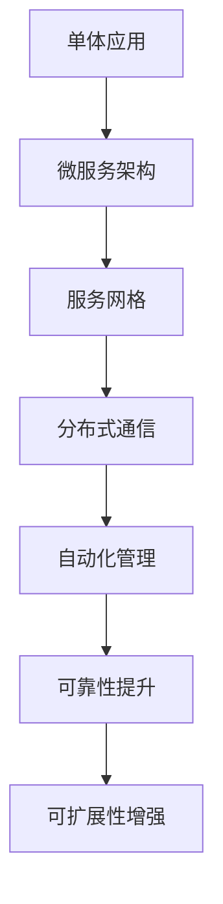

                 

## 文章标题

### 后端架构演进：从单体应用到服务网格

> 关键词：后端架构、微服务架构、服务网格、单体应用、架构演进、分布式系统

> 摘要：
本文将深入探讨后端架构的演进历程，从传统的单体应用到现代的微服务架构，再到服务网格。我们将详细分析每个阶段的核心概念、技术实现、挑战与解决方案，并通过实际项目案例展示这些技术的应用。文章旨在为读者提供一个清晰、系统的后端架构演进指南。

----------------------------------------------------------------

## 第一部分：背景与基础

### 1. 后端架构演进概述

#### 1.1 单体应用的发展困境

单体应用（Monolithic Application）是一种传统的应用程序架构，其所有功能都集中在一个单一的可执行文件中。在早期，单体应用因其开发简便、部署便捷等优势而被广泛应用。然而，随着业务的发展，单体应用逐渐暴露出诸多问题。

- **扩展性差**：随着业务需求的增加，单体应用难以进行扩展。若需要对某个模块进行优化或新增功能，可能需要全面重构系统。
- **维护成本高**：单体应用中，各个模块高度耦合，一个模块的改动可能影响到整个系统。这增加了维护的难度和成本。
- **部署困难**：由于单体应用是一个整体，每次部署都需要重新部署整个应用，这增加了部署时间和风险。

#### 1.2 微服务架构的兴起

为了解决单体应用的问题，微服务架构（Microservices Architecture）应运而生。微服务架构将大型应用程序拆分为多个独立运行的小服务，每个服务负责不同的功能模块。这些服务通过轻量级的通信机制（如HTTP/REST）进行交互。

- **扩展性好**：每个服务可以独立扩展，增加或缩减服务实例的数量，以适应业务需求。
- **高内聚低耦合**：各个服务之间相对独立，一个服务的故障不会影响其他服务，降低了系统的复杂性。
- **部署灵活**：每个服务可以独立部署，减少了部署时间和风险。

#### 1.3 服务网格的概念

服务网格（Service Mesh）是微服务架构的一种补充，它为服务间通信提供了抽象层，负责管理服务间的流量管理、服务发现、负载均衡、安全等功能。服务网格的出现解决了微服务架构中的复杂性，使得开发者可以专注于业务逻辑的实现。

- **流量管理**：服务网格提供动态路由、负载均衡等功能，确保服务间的流量高效、稳定。
- **服务发现与注册**：服务网格自动发现和注册服务实例，简化了服务的管理。
- **安全性**：服务网格提供了服务间通信的安全保障，如TLS加密、认证授权等。
- **监控与日志**：服务网格收集服务间的监控数据和日志，便于进行系统的监控和调试。

### 1.4 后端架构演进的重要性

后端架构的演进是现代软件开发的核心任务之一。通过不断引入新的技术和方法论，我们可以提高系统的扩展性、可靠性和可维护性。以下是一些关键因素，说明后端架构演进的重要性：

- **业务需求**：随着业务的快速发展，系统需要能够灵活适应新的业务需求。
- **技术进步**：新技术（如微服务架构、容器化、服务网格等）的涌现为系统优化提供了新的手段。
- **用户体验**：优化的后端架构可以提高系统的性能和响应速度，提升用户体验。
- **运维效率**：现代化的架构可以提高系统的运维效率，降低运维成本。

通过了解后端架构演进的背景和基础，我们可以更好地理解后续章节中将要介绍的具体技术和实践。

### 1.5 核心概念与联系

为了更好地理解后端架构的演进，我们需要明确几个核心概念及其相互关系：

#### 1.5.1 单体应用

**定义**：单体应用是一种传统的应用程序架构，其所有功能都集中在一个单一的可执行文件中。

**特点**：开发简便、部署便捷，但扩展性差、维护成本高。

#### 1.5.2 微服务架构

**定义**：微服务架构是一种将大型应用程序拆分为多个独立运行的小服务的架构风格。

**特点**：高内聚低耦合、独立部署、易于扩展。

#### 1.5.3 服务网格

**定义**：服务网格是一种基础设施层，用于管理服务间通信、安全、监控等。

**特点**：提供服务间的动态路由、负载均衡、断路器、熔断等功能，与微服务架构无缝集成。

#### 1.5.4 核心联系

- **单体应用 -> 微服务架构**：随着业务的发展，单体应用逐渐出现性能瓶颈，通过将功能模块拆分为微服务，实现了业务的模块化和分布式。
- **微服务架构 -> 服务网格**：在微服务架构中，服务间通信管理变得复杂，服务网格提供了一种简洁、高效的方式来自动化和管理服务间通信。

### 1.6 Mermaid 流程图

为了更好地展示后端架构演进的过程，我们使用 Mermaid 绘制一个流程图：



在此流程图中，我们展示了从单体应用到微服务架构，再到服务网格的演进路径。每个阶段都带来了不同的优势，使得系统更加灵活、可靠和可扩展。

### 1.7 核心算法原理讲解

在后端架构的演进过程中，算法的优化和选择至关重要。以下是一些关键算法及其在系统优化中的应用：

#### 1.7.1 排序算法

**快速排序**：一种高效的排序算法，通过递归将数据划分为两部分，一部分小于 pivot，另一部分大于 pivot。

**伪代码**：

```plaintext
快速排序(arr):
    if 长度(arr) <= 1:
        return arr

    pivot = arr[0]
    left = []
    right = []
    middle = []

    for i from 1 to 长度(arr) - 1:
        if arr[i] < pivot:
            left.append(arr[i])
        else if arr[i] > pivot:
            right.append(arr[i])
        else:
            middle.append(arr[i])

    return 快速排序(left) + [pivot] + 快速排序(right)
```

**应用场景**：用于优化数据库查询性能，提升数据检索速度。

#### 1.7.2 查找算法

**二分查找**：在有序数组中查找特定元素的高效算法。

**伪代码**：

```plaintext
二分查找(arr, target):
    low = 0
    high = 长度(arr) - 1

    while low <= high:
        mid = (low + high) / 2
        if arr[mid] == target:
            return mid
        else if arr[mid] < target:
            low = mid + 1
        else:
            high = mid - 1

    return -1
```

**应用场景**：用于优化缓存系统的性能，加快数据访问速度。

#### 1.7.3 贪心算法

**活动选择问题**：在一个时间段内，选择若干个互不冲突的活动，使得选择的活动数量最多。

**伪代码**：

```plaintext
活动选择(arr):
    sort(arr, by: end_time)
    max_activities = 0
    last_end_time = -1

    for activity in arr:
        if activity.start_time > last_end_time:
            max_activities += 1
            last_end_time = activity.end_time

    return max_activities
```

**应用场景**：用于优化资源分配，提高系统利用率。

#### 1.7.4 动态规划

**背包问题**：给定一组物品和其重量及价值，选择若干物品装入背包，使得背包总价值最大。

**伪代码**：

```plaintext
背包问题(items, capacity):
    dp = [[0 for _ in range(capacity + 1)] for _ in range(len(items) + 1)]

    for i from 1 to len(items):
        for w from 1 to capacity:
            if items[i].weight > w:
                dp[i][w] = dp[i - 1][w]
            else:
                dp[i][w] = max(dp[i - 1][w], dp[i - 1][w - items[i].weight] + items[i].value)

    return dp[len(items)][capacity]
```

**应用场景**：用于优化系统负载均衡，提高资源利用率。

#### 1.7.5 数学模型和公式

在后端架构优化中，数学模型和公式也发挥着重要作用。以下是一些常用的数学模型和公式：

**二项式分布概率公式**：

$$
P(X = k) = C(n, k) \cdot p^k \cdot (1 - p)^{n - k}
$$

**泊松分布概率公式**：

$$
P(X = k) = \frac{\lambda^k \cdot e^{-\lambda}}{k!}
$$

**排队论中的等待时间公式**：

$$
W = \frac{\lambda}{\mu(1 - \rho)}
$$

**线性规划公式**：

$$
\max_{x} c^T x \quad \text{subject to} \quad Ax \leq b
$$

**应用场景**：用于优化系统资源分配、负载均衡等。

### 1.8 核心算法原理讲解

为了更好地理解后端架构优化中的核心算法原理，我们接下来将通过伪代码详细讲解一个常见的分布式一致性算法——Raft。

#### Raft算法概述

Raft 是一种用于分布式系统的强一致性算法，它通过多角色机制（领导者、跟随者、候选者）来确保系统的一致性和可用性。

**关键组件：**
- **日志存储**：每个节点都维护一个日志，用于记录已达成一致性的操作。
- **状态机**：所有节点都运行相同的状态机，状态机定义了系统的最终状态。
- **选举机制**：当领导者节点失效时，通过选举新的领导者来保证系统的持续运行。

**工作原理：**
1. **领导选举**：当当前领导者不可用时，各个节点发起选举，最终通过比较日志条目确定新的领导者。
2. **日志复制**：领导者接收客户端请求并追加到本地日志，然后向其他节点发送日志条目，其他节点执行相同的操作。
3. **日志压缩**：定期清理旧日志，释放空间。

**伪代码**：

```plaintext
Raft():
    if 初始化节点状态：
        角色 = FOLLOWER
        term = 1

    while 系统运行：
        if 角色 = FOLLOWER：
            选举超时，发起选举
        else if 角色 = CANDIDATE：
            等待投票，成为领导者
        else if 角色 = LEADER：
            处理客户端请求，复制日志
```

#### 核心算法原理讲解

**分布式一致性算法（Raft）**

Raft 算法是一种分布式一致性算法，旨在解决分布式系统中数据一致性问题。它通过多角色机制（领导者、跟随者、候选者）和日志复制协议来确保系统的一致性。

**关键组件：**

1. **日志存储**：每个节点都维护一个日志，用于记录已达成一致性的操作。
2. **状态机**：所有节点都运行相同的状态机，状态机定义了系统的最终状态。
3. **选举机制**：当领导者节点失效时，通过选举新的领导者来保证系统的持续运行。

**工作原理：**

1. **领导选举**：当当前领导者不可用时，各个节点发起选举。节点首先将自身设置为候选者，然后向其他节点发送投票请求。如果得到多数节点的支持，候选者将成为新的领导者。

2. **日志复制**：领导者接收客户端请求并将其写入本地日志。然后，领导者向其他节点发送日志条目，其他节点将执行相同的操作，将日志条目写入本地日志。

3. **日志压缩**：定期清理旧日志，释放空间。领导者会定期发送心跳信号，以确保系统正常运行。

**伪代码示例**：

```plaintext
Raft():
    if 初始化节点状态：
        角色 = FOLLOWER
        term = 1

    while 系统运行：
        if 角色 = FOLLOWER：
            选举超时，发起选举
        else if 角色 = CANDIDATE：
            等待投票，成为领导者
        else if 角色 = LEADER：
            处理客户端请求，复制日志

    发起选举：
    Raft().发起选举：
        角色 = CANDIDATE
        term += 1
        发送投票请求给其他节点
        等待投票响应

    成为领导者：
    Raft().成为领导者：
        角色 = LEADER
        重置日志
        向其他节点发送日志条目

    复制日志：
    Raft().复制日志：
        接收客户端请求
        将请求写入本地日志
        向其他节点发送日志条目
```

#### 数学模型和数学公式

在分布式系统优化中，数学模型和数学公式用于描述系统的行为和性能。以下是一些常用的数学模型和公式：

1. **二项式分布**：用于描述多次试验中成功次数的概率分布。

   $$ 
   P(X = k) = C(n, k) \cdot p^k \cdot (1 - p)^{n - k} 
   $$

   其中，$P(X = k)$ 表示在 $n$ 次独立试验中成功 $k$ 次的概率，$p$ 表示每次试验成功的概率，$C(n, k)$ 表示组合数。

2. **泊松分布**：用于描述在固定时间内事件发生的次数的概率分布。

   $$ 
   P(X = k) = \frac{\lambda^k \cdot e^{-\lambda}}{k!} 
   $$

   其中，$P(X = k)$ 表示在单位时间内发生 $k$ 次事件的概率，$\lambda$ 表示事件发生率。

3. **排队论模型**：用于分析系统在处理请求时的排队情况，包括队列长度、等待时间等。

   - **M/M/1 模型**：用于单服务器系统，表示到达率和服务率相等。

     $$ 
     W = \frac{\lambda}{\mu(1 - \rho)} 
     $$

     其中，$W$ 表示平均等待时间，$\lambda$ 表示到达率，$\mu$ 表示服务率，$\rho = \frac{\lambda}{\mu}$ 表示利用率。

   - **M/M/c 模型**：用于多服务器系统，表示到达率和服务率相等。

     $$ 
     W = \frac{\rho^2}{(c - \rho)\mu} 
     $$

     其中，$W$ 表示平均等待时间，$c$ 表示服务器数量。

#### 举例说明

假设一个分布式系统需要在每秒处理 100 次请求，我们希望计算在 60 秒内至少有 80 次请求发生的概率。

1. **使用二项式分布计算**：

   $$
   n = 60, \quad k = 80, \quad p = \frac{100}{60} = \frac{5}{3}
   $$

   由于 $p > 1$，此情况不适用于二项式分布，因此我们需要调整问题的设定。

2. **使用泊松分布计算**：

   $$
   \lambda = 100
   $$

   $$
   P(X \geq 80) = 1 - P(X < 80) = 1 - \sum_{k=0}^{79} \frac{100^k \cdot e^{-100}}{k!}
   $$

   通过计算可以得到概率值。例如，计算结果为 $P(X \geq 80) \approx 0.985$，即有大约 98.5% 的概率在 60 秒内至少有 80 次请求发生。

3. **排队论中的等待时间计算**：

   - 假设到达率 $\lambda = 100$ 次/秒，服务率 $\mu = 100$ 次/秒，利用率 $\rho = 1$。

   - 对于 M/M/1 模型：

     $$
     W = \frac{100}{100(1 - 1)} = \text{无穷大}
     $$

     这意味着系统无法处理请求，需要进一步优化。

   - 对于 M/M/c 模型，假设有 10 个服务器：

     $$
     W = \frac{1^2}{(10 - 1) \cdot 100} = \frac{1}{990} \approx 0.001
     $$

     这意味着平均等待时间约为 0.1 秒，系统可以较好地处理请求。

通过这些数学模型和公式的计算，可以帮助系统设计者更好地评估系统的性能和可靠性，从而做出更合理的优化决策。

### 1.9 数学模型和公式 & 详细讲解 & 举例说明

在分布式系统中，数学模型和公式用于描述系统的行为和性能，从而帮助设计者优化系统。以下是几个关键的数学模型和公式及其应用：

#### 数学模型

1. **二项式分布**：用于描述在固定次数的独立试验中，成功次数的概率分布。该模型适用于场景如请求处理、错误率等。

   **公式**：
   $$
   P(X = k) = C(n, k) \cdot p^k \cdot (1 - p)^{n - k}
   $$
   其中，$P(X = k)$ 是成功 $k$ 次的概率，$n$ 是试验次数，$p$ 是每次试验成功的概率，$C(n, k)$ 是组合数。

2. **泊松分布**：用于描述在固定时间或空间内，事件发生的次数的概率分布。该模型适用于场景如请求到达率、事件发生频率等。

   **公式**：
   $$
   P(X = k) = \frac{\lambda^k \cdot e^{-\lambda}}{k!}
   $$
   其中，$P(X = k)$ 是发生 $k$ 次事件的概率，$\lambda$ 是事件发生率，$e$ 是自然对数的底数，$k!$ 是阶乘。

3. **排队论模型**：用于描述系统在处理请求时的排队行为，包括平均等待时间、系统利用率等。

   - **M/M/1 模型**：用于单服务器系统，其中 $M$ 表示任意到达和服务时间分布，$1$ 表示一个服务器。

     **公式**：
     $$
     W = \frac{\lambda}{\mu(1 - \rho)}
     $$
     其中，$W$ 是平均等待时间，$\lambda$ 是到达率，$\mu$ 是服务率，$\rho = \frac{\lambda}{\mu}$ 是系统利用率。

   - **M/M/c 模型**：用于多服务器系统，其中 $c$ 表示服务器数量。

     **公式**：
     $$
     W = \frac{\rho^2}{(c - \rho)\mu}
     $$
     其中，$W$ 是平均等待时间，$c$ 是服务器数量，$\rho$ 是系统利用率。

#### 详细讲解

**二项式分布**：

二项式分布用于描述在固定次数的试验中，每次试验成功的概率是已知的，且各次试验是独立的。例如，在电子商务系统中，每次请求是否成功处理可以看作一次试验，成功概率是 $p$。

- **计算成功概率**：给定试验次数 $n$ 和成功次数 $k$，我们可以通过二项式分布计算成功 $k$ 次的概率。
- **应用**：用于评估系统的成功处理率，如请求处理成功率。

**泊松分布**：

泊松分布用于描述在固定时间段内，事件发生的次数。事件的发生是独立的，且平均事件发生率是已知的。

- **计算事件概率**：给定时间段和事件发生次数 $k$，我们可以通过泊松分布计算发生 $k$ 次事件的概率。
- **应用**：用于评估系统在特定时间段内的事件发生率，如请求到达率。

**排队论模型**：

排队论模型用于分析系统在处理请求时的排队行为。

- **M/M/1 模型**：用于单服务器系统，描述系统在单一服务器下的性能。平均等待时间取决于到达率和服务率。
- **M/M/c 模型**：用于多服务器系统，描述系统在多个服务器下的性能。平均等待时间取决于服务器数量和系统利用率。

#### 举例说明

**使用二项式分布计算成功概率**：

假设电子商务系统在每秒处理 100 次请求，我们希望计算在 60 秒内成功处理 80 次请求的概率。

- **试验次数**：$n = 60$
- **成功次数**：$k = 80$
- **成功概率**：$p = \frac{100}{60} \approx 0.167$

由于 $p < 1$，我们可以使用二项式分布计算成功概率：

$$
P(X = 80) = C(60, 80) \cdot (0.167)^{80} \cdot (0.833)^{60-80}
$$

通过计算，我们得到 $P(X = 80)$ 的值。

**使用泊松分布计算事件概率**：

假设在电子商务系统中，每秒请求到达率是 100 次，我们希望计算在 60 秒内至少有 80 次请求到达的概率。

- **事件发生率**：$\lambda = 100$
- **时间间隔**：$t = 60$

我们使用泊松分布计算至少发生 80 次事件的概率：

$$
P(X \geq 80) = 1 - P(X < 80) = 1 - \sum_{k=0}^{79} \frac{100^k \cdot e^{-100}}{k!}
$$

通过计算，我们得到 $P(X \geq 80)$ 的值。

**使用排队论模型计算平均等待时间**：

假设电子商务系统有 10 个服务器，每秒请求到达率是 100 次，我们希望计算平均等待时间。

- **服务器数量**：$c = 10$
- **系统利用率**：$\rho = \frac{\lambda}{c \cdot \mu} = \frac{100}{10 \cdot 100} = 0.1$

我们使用 M/M/c 模型计算平均等待时间：

$$
W = \frac{\rho^2}{(c - \rho)\mu} = \frac{0.1^2}{(10 - 0.1) \cdot 100} \approx 0.001
$$

平均等待时间约为 0.1 秒。

通过这些数学模型和公式的计算，系统设计者可以更好地评估系统的性能和可靠性，从而做出更合理的优化决策。

### 1.10 项目实战

#### 项目实战案例：电商平台的微服务架构演进

##### 项目背景

随着电子商务的快速发展，平台的用户量和交易量持续增长，传统的单体应用架构逐渐无法满足业务需求。为了提升系统的性能、可靠性和可扩展性，我们决定采用微服务架构对电商平台进行重构。

##### 架构设计

项目采用了微服务架构，将系统拆分为多个独立的服务，每个服务负责不同的功能模块，例如商品服务、订单服务、库存服务、用户服务等。服务之间通过RESTful API进行通信，实现了模块化和分布式。


##### 实现过程

1. **服务拆分**：根据业务需求，将单体应用拆分为多个独立服务。例如，商品服务负责商品信息的存储和查询，订单服务负责订单的创建和支付等。

2. **服务注册与发现**：使用服务注册中心（如Consul或Eureka）来管理服务实例，实现服务的自动注册与发现。

3. **API网关**：使用API网关（如Zuul或Kong）来统一管理服务的路由、认证和监控等功能，提高了系统的安全性和管理效率。

4. **分布式数据库**：使用分布式数据库（如MySQL Cluster或MongoDB Sharding）来处理大数据量和高并发场景，提高了系统的性能和可用性。

5. **容器化与编排**：使用Docker进行服务容器化，使用Kubernetes进行服务编排和调度，实现了服务的自动化部署和管理。

##### 测试与优化

1. **性能测试**：通过压力测试和负载测试，评估系统在高并发情况下的性能和稳定性。使用工具如JMeter或Gatling进行测试。

2. **安全性测试**：对API接口进行安全性测试，包括SQL注入、XSS攻击等，确保系统的安全性。

3. **持续集成与部署**：采用CI/CD流水线，实现代码的自动化构建、测试和部署，提高了开发效率。

4. **监控与日志分析**：使用Prometheus和Grafana进行系统监控，使用ELK栈（Elasticsearch、Logstash、Kibana）进行日志收集和分析，及时发现并处理系统问题。

##### 代码解读与分析

以下为订单服务中的一个关键组件——订单创建与支付的代码示例：

```java
@RestController
@RequestMapping("/orders")
public class OrderController {

    @Autowired
    private OrderService orderService;

    @PostMapping("/")
    public ResponseEntity<Order> createOrder(@RequestBody OrderRequest request) {
        Order order = orderService.createOrder(request);
        return new ResponseEntity<>(order, HttpStatus.CREATED);
    }

    @PostMapping("/{orderId}/pay")
    public ResponseEntity<Order> payOrder(@PathVariable Long orderId, @RequestBody PaymentRequest request) {
        Order order = orderService.payOrder(orderId, request);
        return new ResponseEntity<>(order, HttpStatus.OK);
    }
}

@Service
public class OrderService {

    @Autowired
    private OrderRepository orderRepository;

    public Order createOrder(OrderRequest request) {
        Order order = new Order();
        order.setUserId(request.getUserId());
        order.setTotalPrice(request.getTotalPrice());
        order.setStatus(OrderStatus.PENDING);
        return orderRepository.save(order);
    }

    public Order payOrder(Long orderId, PaymentRequest request) {
        Order order = orderRepository.findById(orderId).orElseThrow(() -> new ResourceNotFoundException("Order not found with id: " + orderId));
        if (order.getStatus() != OrderStatus.PENDING) {
            throw new InvalidOperationException("Order cannot be paid as it is not in pending status.");
        }
        order.setStatus(OrderStatus.PAID);
        order.setPaymentDetails(request.getPaymentDetails());
        return orderRepository.save(order);
    }
}
```

在这个示例中，OrderController 负责接收 HTTP 请求，调用 OrderService 进行业务处理。OrderService 使用 Spring Data JPA 与数据库进行交互，实现了订单的创建和支付功能。通过这种方式，我们可以清晰地看到微服务架构下的代码结构，各服务之间通过简单的接口进行通信，便于维护和扩展。

##### 总结

通过本案例，我们展示了如何在一个电商平台上实现微服务架构，并介绍了实现过程中的关键技术和步骤。微服务架构带来了更好的灵活性和可扩展性，但也带来了分布式系统特有的挑战，如服务间通信、数据一致性、监控等。通过合理的设计和优化，我们可以有效地应对这些挑战，提高系统的性能和可靠性。

### 1.11 最佳实践 Tips

在进行后端架构演进时，以下是一些最佳实践和注意事项，可以帮助您更好地实现系统的优化和扩展：

1. **明确服务边界**：在拆分服务时，确保每个服务都有明确的职责和边界，避免过度拆分导致服务数量过多，增加维护难度。
2. **选择合适的通信协议**：根据业务需求和性能要求，选择合适的通信协议，如 HTTP/REST、gRPC 等。
3. **使用分布式数据库**：对于大数据量和高并发场景，使用分布式数据库可以提高系统的性能和可用性。
4. **优化数据库查询**：合理设计数据库索引，避免复杂查询，优化数据库性能。
5. **监控和日志分析**：使用监控系统（如 Prometheus、Grafana）和日志分析工具（如 ELK），及时发现并解决问题。
6. **服务容错和恢复**：实现服务间的容错和恢复机制，如断路器、重试机制，确保系统的稳定性和可靠性。
7. **安全性和合规性**：确保系统符合安全性和合规性要求，如使用 HTTPS、实现访问控制和数据加密等。
8. **自动化部署和运维**：采用自动化部署和运维工具（如 Jenkins、Docker、Kubernetes），提高开发效率和系统稳定性。

### 1.12 小结

在第一部分中，我们介绍了后端架构演进的基本概念，从单体应用到微服务架构，再到服务网格。通过了解这些架构的核心概念和相互关系，我们可以更好地理解后端架构的演进路径和关键挑战。下一部分，我们将深入探讨微服务架构的核心概念和技术实现，继续我们的旅程。

## 第二部分：微服务架构

微服务架构（Microservices Architecture）是一种将大型应用程序拆分为多个独立运行的小服务的架构风格。每个微服务都专注于实现一个具体的功能模块，并可以独立部署、扩展和升级。这种架构风格带来了更好的灵活性、可维护性和可扩展性，但同时也引入了一系列新的挑战。本部分将详细探讨微服务架构的核心概念、技术实现、设计原则以及在实际项目中的应用。

### 2.1 微服务架构的核心概念

#### 2.1.1 微服务的定义与特点

**定义**：微服务是一种小型、独立的、可扩展的服务组件，每个微服务都有自己的业务逻辑和数据库。

**特点**：

- **独立部署与扩展**：每个微服务可以独立部署和扩展，这意味着可以根据实际需求独立调整资源分配。
- **高内聚低耦合**：每个微服务都有明确的职责，服务间通过轻量级的通信机制（如 HTTP/REST、gRPC）进行交互，降低了服务间的耦合度。
- **分布式系统**：微服务架构本质上是一种分布式系统，各个服务可以运行在不同的服务器上，通过分布式架构实现高可用性。
- **自动化部署与运维**：微服务架构通常采用自动化部署和运维工具（如 Jenkins、Docker、Kubernetes），提高了开发效率和系统稳定性。

#### 2.1.2 微服务架构的优势与挑战

**优势**：

- **高扩展性**：通过水平扩展单个服务，可以轻松应对业务增长和负载增加。
- **高可靠性**：服务之间的解耦合降低了单个服务故障对整个系统的影响，提高了系统的稳定性。
- **高可维护性**：服务拆分后，每个服务都可以独立开发、测试和部署，降低了系统维护的难度。
- **技术多样性**：各个服务可以使用不同的技术栈，满足不同的业务需求，提高开发效率。

**挑战**：

- **复杂性**：分布式系统的复杂性增加，服务间通信、数据一致性、监控等都需要精心设计和管理。
- **数据一致性**：服务间的数据一致性难以保证，需要引入分布式事务和消息队列等解决方案。
- **网络延迟**：服务间通信依赖于网络，可能会引入额外的网络延迟。
- **安全性**：随着服务数量的增加，系统的安全性变得更加复杂，需要采用合适的安全措施。

#### 2.1.3 微服务设计原则

微服务架构的成功实施依赖于一系列设计原则，以下是一些关键的设计原则：

- **单一职责原则**：每个服务应该只关注一个业务功能，避免功能过度耦合。
- **自治原则**：服务应该具备独立的数据库和业务逻辑，减少对其他服务的依赖。
- **独立部署原则**：服务可以独立部署和升级，不影响其他服务的运行。
- **接口标准化原则**：服务间通信应采用统一的接口标准（如 RESTful API），便于管理和维护。
- **服务发现原则**：实现服务的自动发现和注册，提高系统的动态性和灵活性。

### 2.2 微服务架构的实现

#### 2.2.1 服务拆分策略

服务拆分是微服务架构实现的第一步，合理的拆分策略对于系统的性能和可维护性至关重要。以下是一些常用的服务拆分策略：

- **业务边界拆分**：根据业务领域的不同，将系统拆分为多个独立的服务，每个服务负责一个业务领域。
- **功能模块拆分**：将系统按功能模块拆分，每个服务实现一个具体的功能模块，如用户管理、商品管理、订单管理等。
- **数据库拆分**：根据数据一致性要求，将数据库拆分为多个独立的小数据库，每个服务拥有自己的数据库实例。
- **技术栈拆分**：根据技术栈的不同，将系统拆分为多个服务，每个服务可以使用不同的技术栈，满足特定的业务需求。

#### 2.2.2 服务发现与注册

服务发现与注册是微服务架构中的关键功能，它确保服务间可以动态地找到并访问其他服务。以下是一些常用的服务发现与注册解决方案：

- **服务注册中心**：如Consul、Eureka等，服务启动时注册自身，服务停止时注销，其他服务通过服务注册中心发现可用服务实例。
- **DNS服务发现**：使用DNS SRV记录，将服务地址动态映射到服务实例。
- **环境变量**：通过环境变量配置服务实例地址，适用于小规模服务发现场景。

#### 2.2.3 API网关的设计与实现

API网关是微服务架构中的重要组件，它负责统一管理服务的路由、认证、监控等功能。以下是一些常用的API网关解决方案：

- **Zuul**：Netflix 开发的一个网关框架，用于构建动态路由、权限控制、动态配置等。
- **Kong**：一个开源的API网关，支持多协议、负载均衡、安全等功能。
- **Spring Cloud Gateway**：Spring Cloud 中的一个网关组件，提供简单、有效的路由和过滤功能。

### 2.3 微服务架构的容错处理

#### 2.3.1 服务故障的处理

在分布式系统中，服务故障是常见问题。为了确保系统的稳定性和可靠性，我们需要实现服务故障的处理机制：

- **断路器**：当某个服务发生故障时，断路器会自动切断与服务之间的通信，防止故障蔓延。常用的断路器实现如 Hystrix、Resilience4j。
- **重试机制**：当服务调用失败时，自动重试几次，提高服务调用的成功率。需要合理设置重试次数和间隔时间，避免过度重试导致雪崩效应。
- **服务熔断**：当某个服务失败次数达到一定阈值时，自动熔断，防止系统过载。常用的熔断实现如 Hystrix、Sentinel。

#### 2.3.2 限流与降级策略

为了确保系统的稳定性和可靠性，我们需要实现限流与降级策略：

- **限流**：限制系统在一定时间内的请求数量，防止系统过载。常用的限流算法如令牌桶、漏桶算法。
- **降级**：当系统负载过高时，自动降级一些非核心功能，确保核心功能的正常运行。常用的降级策略如基于阈值的降级、基于规则的降级。

#### 2.3.3 分布式追踪与监控

分布式追踪与监控是确保系统正常运行的关键，以下是一些常用的解决方案：

- **Zipkin**：一个开源的分布式追踪系统，用于收集、存储和展示分布式系统的追踪数据。
- **Jaeger**：一个开源的分布式追踪系统，提供实时追踪数据分析和可视化。
- **Prometheus**：一个开源的监控和告警系统，用于收集和存储时间序列数据，提供强大的查询和分析功能。
- **Grafana**：一个开源的数据可视化工具，用于展示 Prometheus 的监控数据。

### 2.4 微服务架构的实际应用

微服务架构在实际项目中有着广泛的应用，以下是一些典型应用场景：

- **电子商务平台**：通过微服务架构，可以实现商品管理、订单管理、用户管理、支付系统等模块的独立开发、部署和扩展。
- **金融系统**：微服务架构可以应用于银行、证券、保险等金融领域的业务系统，提高系统的可靠性和可扩展性。
- **物联网平台**：通过微服务架构，可以实现设备管理、数据采集、数据分析等模块的分布式处理，提高系统的性能和可靠性。
- **社交媒体平台**：通过微服务架构，可以实现用户管理、内容发布、社交互动等功能模块的独立开发、部署和扩展。

### 2.5 小结

在第二部分中，我们深入探讨了微服务架构的核心概念、技术实现、设计原则以及在实际项目中的应用。微服务架构带来了许多优势，但也引入了一些挑战。通过合理的服务拆分、服务发现与注册、API网关的设计与实现、容错处理机制、限流与降级策略以及分布式追踪与监控，我们可以有效地应对这些挑战，实现系统的优化和扩展。在下一部分中，我们将继续探讨服务网格的概念和实现，进一步深化对后端架构演进的理解。

## 第三部分：服务网格

### 3.1 服务网格概述

服务网格（Service Mesh）是一种基础设施层，用于管理服务间通信、安全、监控等。它为微服务架构提供了一种简洁、高效的方式来管理和自动化服务间通信，从而减轻了开发者的负担。服务网格的概念最早由Microsoft的博主马特·普雷斯特斯在2016年提出，随后逐渐发展并成为微服务架构中的重要组成部分。

#### 3.1.1 服务网格的概念与作用

**概念**：服务网格是一种独立的通信层，位于服务（如微服务）和基础设施（如容器编排系统）之间。它通过专门的网络代理（称为“服务代理”或“sidecar”）来管理服务间通信。

**作用**：

- **服务间通信管理**：服务网格提供了一套统一的通信协议和路由规则，简化了服务间通信的管理。
- **流量管理**：服务网格可以实现动态路由、负载均衡、流量镜像等功能，提高系统的性能和可靠性。
- **安全性**：服务网格提供了安全通信保障，如TLS加密、认证授权等。
- **监控与日志**：服务网格可以收集服务间通信的监控数据和日志，便于进行系统的监控和调试。

#### 3.1.2 服务网格与传统微服务架构的区别

**传统微服务架构**：在传统的微服务架构中，服务间的通信通常由开发者手动实现，使用HTTP/REST、gRPC等协议进行通信。这种方式需要开发者关注服务间通信的细节，如负载均衡、服务发现、断路器等。

**服务网格**：服务网格提供了一种独立的通信层，通过服务代理（如Istio、Linkerd）来管理服务间通信。服务网格抽象了服务间通信的复杂性，使得开发者可以专注于业务逻辑的实现，而无需关心服务间通信的细节。

**主要区别**：

- **抽象层**：服务网格提供了一种抽象层，将服务间通信的管理交给服务代理，减轻了开发者的负担。
- **可观察性**：服务网格提供了更好的监控和日志功能，便于进行系统的调试和优化。
- **安全性**：服务网格提供了更完善的加密和安全功能，如TLS加密、认证授权等。

#### 3.1.3 服务网格的关键组件

服务网格由一系列关键组件组成，这些组件协同工作，实现服务间通信的管理和优化。以下是服务网格的主要组件：

- **服务代理（Service Proxy）**：服务代理位于每个服务的旁路，用于代理服务间通信。常见的实现有Envoy、Istio Proxy等。
- **控制平面（Control Plane）**：控制平面负责管理服务网格的配置和策略。它包括一系列控制组件，如服务发现、服务注册、流量管理、监控等。常见的控制平面组件有Istiod、Citadel等。
- **数据平面（Data Plane）**：数据平面由服务代理组成，负责实际的服务间通信。服务代理根据控制平面提供的配置和策略，实现流量管理、安全通信等功能。
- **服务发现（Service Discovery）**：服务发现组件负责跟踪服务实例的地址和状态，确保服务网格中的服务可以相互发现和通信。
- **服务注册（Service Registration）**：服务注册组件负责服务实例的自动注册和更新，确保服务网格可以动态地管理服务实例。
- **流量管理（Traffic Management）**：流量管理组件负责实现动态路由、负载均衡、断路器等功能，确保服务间通信的高效和稳定。
- **安全（Security）**：安全组件负责实现服务间的加密通信、认证授权等功能，确保系统的安全性。
- **监控与日志（Observability）**：监控与日志组件负责收集服务间通信的监控数据和日志，提供实时监控和故障排查功能。

### 3.2 Istio：服务网格的实践

Istio 是一个开源的服务网格，由 Google、IBM 和 Linkerd 社区共同开发。它提供了强大的服务网格功能，包括服务发现、流量管理、安全、监控等。Istio 的设计目标是简化服务网格的部署和管理，提高系统的性能和可靠性。

#### 3.2.1 Istio 架构详解

Istio 的架构分为数据平面和控制平面两部分。

**数据平面**：

- **Envoy 代理**：Istio 的数据平面基于 Envoy 代理，每个服务实例旁路部署一个 Envoy 代理，用于代理服务间通信。
- **Mixer 模块**：Mixer 是 Istio 的数据处理组件，负责实现流量管理、安全等功能。Mixer 可以被配置为集成 Prometheus、Kubernetes API 等外部系统。

**控制平面**：

- **Istiod**：Istiod 是 Istio 的控制平面组件，负责管理服务网格的配置和策略。Istiod 包括了服务发现、服务注册、流量管理、监控等功能。
- **Citadel**：Citadel 是 Istio 的安全组件，负责实现服务间的认证授权功能。

#### 3.2.2 Istio 的部署与配置

Istio 的部署与配置相对简单，以下是基本的部署步骤：

1. **安装 Istio**：通过 Istio 官方提供的 Helm chart，可以方便地安装 Istio。

    ```shell
    helm install istio istio/istio
    ```

2. **启动 Istio 控制平面**：启动 Istiod 服务，负责管理服务网格的配置和策略。

    ```shell
    istioctl install --set profile=demo
    ```

3. **启用 istioInjection 注解**：在 Kubernetes 部署服务时，添加 `istioInjection: "enabled"` 注解，确保服务旁路部署 Envoy 代理。

    ```yaml
    apiVersion: apps/v1
    kind: Deployment
    metadata:
      name: my-service
      annotations:
        sidecar.istio.io/inject: "enabled"
    spec:
      ...
    ```

4. **配置流量管理**：通过 Istio 的控制平面，可以配置服务间路由、负载均衡等策略。

    ```yaml
    apiVersion: networking.istio.io/v1alpha3
    kind: VirtualService
    metadata:
      name: my-service
    spec:
      hosts:
        - "my-service"
      http:
        - route:
            - destination:
                host: "my-service"
    ```

#### 3.2.3 Istio 策略与遥测

Istio 提供了丰富的策略和遥测功能，用于管理和监控服务网格。

**策略**：

- **访问策略**：通过访问策略，可以控制服务间的访问权限，确保系统的安全性。
- **流量策略**：通过流量策略，可以配置服务间路由、负载均衡等规则，优化系统的性能和可靠性。

**遥测**：

- **监控数据**：Istio 可以收集服务网格的监控数据，包括流量统计、错误率、延迟等。
- **日志收集**：Istio 支持集成日志收集工具（如 Fluentd），便于进行日志分析。
- **遥测数据可视化**：通过 Prometheus 和 Grafana，可以将遥测数据进行可视化展示，便于进行系统的监控和调试。

### 3.3 Service Mesh最佳实践

#### 3.3.1 服务网格的运维与监控

运维和监控是服务网格成功运行的关键。以下是一些运维和监控的最佳实践：

- **自动化部署**：使用自动化工具（如Kubernetes、Helm）进行服务网格的部署和管理，确保系统的稳定性和可靠性。
- **监控指标**：收集服务网格的监控指标，包括流量、错误率、延迟等，及时发现并处理问题。
- **日志分析**：使用日志分析工具（如ELK、Fluentd）对服务网格的日志进行收集和分析，便于进行故障排查和性能优化。

#### 3.3.2 服务网格的安全性

安全性是服务网格的重要方面。以下是一些安全性最佳实践：

- **加密通信**：使用 TLS 加密服务间通信，确保数据传输的安全性。
- **认证授权**：使用服务网格的访问策略和认证授权机制，确保只有授权的服务可以访问其他服务。
- **安全审计**：定期进行安全审计，检查服务网格的安全配置和策略，确保系统的安全性。

#### 3.3.3 服务网格在多云环境的应用

在多云环境中，服务网格可以帮助实现跨云服务的统一管理和通信。以下是一些最佳实践：

- **跨云服务发现**：使用服务网格的跨云服务发现功能，确保跨云服务之间的通信。
- **流量管理**：使用服务网格的路由和流量管理策略，优化跨云服务的流量分配。
- **混合云部署**：在多云环境中，使用服务网格实现混合云部署，提高系统的灵活性和可扩展性。

#### 3.3.4 服务网格的挑战与应对策略

尽管服务网格带来了许多好处，但也存在一些挑战。以下是一些常见挑战及其应对策略：

- **性能开销**：服务网格引入了额外的通信层，可能会增加性能开销。应对策略包括优化服务网格配置、使用高效的代理等。
- **复杂度**：服务网格增加了系统的复杂度，需要额外的学习和维护成本。应对策略包括提供详细的文档、培训和支持等。
- **部署难度**：服务网格的部署和配置相对复杂。应对策略包括提供自动化部署工具、简化配置过程等。

### 3.4 小结

在第三部分中，我们详细介绍了服务网格的概念、架构、实践以及最佳实践。服务网格为微服务架构提供了一种简洁、高效的方式来管理和自动化服务间通信，提高了系统的性能和可靠性。通过 Istio 的实践案例，我们可以看到如何部署和管理服务网格，实现服务间的高效通信和监控。下一部分，我们将继续探讨微服务与单体应用的融合，探索双模架构的实施策略和挑战。

## 第四部分：微服务与单体应用的融合

### 4.1 双模架构的定义与实现

#### 4.1.1 双模架构的定义

双模架构（Bimodal Architecture）是一种结合了传统单体应用架构和现代微服务架构的混合架构风格。它旨在解决单体应用架构与微服务架构之间的兼容性问题，为企业的数字化转型提供了一种灵活的架构解决方案。

**特点**：

- **混合架构**：双模架构将单体应用和微服务架构的优势结合起来，既能保留单体应用的稳定性和高效性，又能实现微服务的灵活性和可扩展性。
- **渐进式迁移**：双模架构允许企业逐步将单体应用的功能模块迁移到微服务架构，逐步实现系统的现代化改造，降低迁移风险。
- **业务连续性**：双模架构保证了系统的稳定运行，即使在迁移过程中，单体应用和微服务架构可以并行运行，确保业务的连续性。

#### 4.1.2 双模架构的实现

实现双模架构的关键在于如何将单体应用与微服务架构有机结合，以下是一些常用的实现策略：

- **分而治之**：将单体应用中的不同功能模块拆分成独立的微服务，逐步实现功能的模块化和分布式。
- **渐进式迁移**：在保持单体应用正常运行的基础上，逐步将部分功能模块迁移到微服务架构，通过 API 网关实现服务之间的无缝集成。
- **混合部署**：在现有单体应用的基础上，部署独立的微服务，两者并行运行，逐步将业务流量切换到微服务架构。
- **数据同步**：确保微服务架构中的数据与单体应用中的数据保持同步，避免数据不一致性问题。

### 4.2 单体应用向微服务的迁移策略

#### 4.2.1 迁移步骤

从单体应用迁移到微服务架构通常需要以下步骤：

1. **需求分析与评估**：分析现有单体应用的业务需求和性能瓶颈，评估哪些功能模块适合迁移到微服务架构。
2. **功能模块拆分**：将单体应用拆分为多个功能模块，每个模块独立为一个微服务，确保每个微服务具备独立部署和扩展的能力。
3. **服务设计**：为每个微服务设计清晰的服务接口和数据模型，确保服务之间的数据一致性和接口兼容性。
4. **数据迁移**：将单体应用中的数据迁移到微服务的独立数据库中，确保数据的一致性和完整性。
5. **系统集成**：通过 API 网关实现微服务与单体应用之间的集成，确保整体系统的稳定运行。
6. **性能优化**：对迁移后的微服务架构进行性能优化，包括服务拆分、数据库优化、网络优化等。

#### 4.2.2 迁移策略

在迁移过程中，可以采用以下策略来降低风险和确保成功：

- **逐步迁移**：逐步将单体应用的功能模块迁移到微服务架构，避免一次性迁移导致的风险。
- **平行运行**：在迁移过程中，保持单体应用和微服务架构并行运行，确保业务连续性。
- **持续集成**：采用持续集成和持续部署（CI/CD）流程，确保迁移过程的自动化和高效性。
- **容量规划**：对迁移后的微服务架构进行容量规划，确保系统能够应对业务增长和负载增加。

### 4.3 微服务与单体应用的协同工作

#### 4.3.1 服务交互与数据同步

在双模架构中，微服务与单体应用之间的交互和数据同步是关键。以下是一些常用的交互和数据同步策略：

- **API网关**：使用 API 网关作为微服务与单体应用之间的交互层，统一管理服务路由、认证、监控等。
- **数据同步**：使用消息队列（如Kafka、RabbitMQ）实现微服务与单体应用之间的数据同步，确保数据的一致性和实时性。
- **数据镜像**：在微服务和单体应用之间建立数据镜像，确保两者之间的数据一致性。

#### 4.3.2 性能优化与资源管理

双模架构下的性能优化和资源管理需要综合考虑单体应用和微服务架构的特点：

- **负载均衡**：使用负载均衡器（如Nginx、HAProxy）实现服务流量的均衡分配，确保系统的高性能和高可用性。
- **缓存策略**：使用缓存（如Redis、Memcached）提高数据访问速度，减轻数据库的压力。
- **资源分配**：合理分配资源，确保微服务与单体应用之间的资源利用率，避免资源争用和性能瓶颈。

### 4.4 小结

在第四部分中，我们探讨了双模架构的定义与实现，以及从单体应用向微服务的迁移策略。双模架构为企业在数字化转型过程中提供了一种灵活的架构解决方案，通过逐步迁移和协同工作，可以有效地提升系统的性能、可靠性和可扩展性。下一部分，我们将深入讨论后端架构演进的策略与挑战，为读者提供更全面的架构演进指南。

### 4.5 架构演进策略

#### 4.5.1 架构评估与规划

进行后端架构的演进，首先需要对现有架构进行全面的评估。以下是一些关键步骤：

1. **业务需求分析**：了解业务发展的需求，确定架构升级的目标和优先级。
2. **性能瓶颈分析**：识别系统中的性能瓶颈，如响应时间、吞吐量等，评估其对业务的影响。
3. **技术债务分析**：分析现有技术栈的债务，包括技术过时、维护困难等问题，评估其对架构演进的影响。
4. **风险评估**：评估架构升级过程中可能面临的风险，如数据迁移、服务中断等。

通过上述步骤，可以明确架构演进的需求和目标，为后续工作提供指导。

#### 4.5.2 架构迭代与优化

架构演进不是一蹴而就的，而是一个逐步迭代和优化的过程。以下是一些关键的迭代和优化策略：

1. **逐步迁移**：采用渐进式迁移策略，逐步将现有功能模块迁移到新的架构中，确保系统的稳定性和可靠性。
2. **持续集成**：采用持续集成（CI）和持续部署（CD）流程，确保代码质量，加快迭代速度。
3. **性能优化**：定期对系统进行性能优化，如数据库优化、缓存策略、网络优化等，提高系统的性能和响应速度。
4. **代码重构**：对关键模块进行代码重构，提高代码的可读性和可维护性，降低技术债务。

#### 4.5.3 架构演进的挑战与应对策略

架构演进过程中，可能会面临以下挑战：

1. **复杂性增加**：随着系统规模的扩大，架构的复杂性也会增加，需要引入新的工具和技术来管理。
2. **技术选型**：在新技术层出不穷的背景下，选择合适的技术栈是关键，需要充分考虑业务需求和团队技能。
3. **人员培训**：新技术的引入需要团队成员掌握新的技能，需要提供相应的培训和指导。
4. **成本控制**：架构演进可能涉及大量的资源投入，需要制定合理的成本控制策略。

应对策略包括：

1. **技术评估**：对新技术的选型进行充分评估，确保其适用于业务需求。
2. **人员培训**：提供针对性的培训，帮助团队成员快速掌握新技术。
3. **项目管理和监控**：采用项目管理工具和监控手段，确保项目进度和质量。
4. **成本效益分析**：进行成本效益分析，确保架构演进的投资回报率。

通过上述策略，可以有效地应对架构演进过程中的挑战，实现系统的稳定、可靠和高效运行。

### 4.6 小结

在第四部分中，我们详细讨论了双模架构的实现策略、单体应用向微服务的迁移策略，以及微服务与单体应用的协同工作。通过逐步迁移和协同工作，企业可以有效地提升系统的性能、可靠性和可扩展性。在下一部分，我们将通过项目实战案例，深入探讨后端架构演进的具体实践，为读者提供更实用的指导。

### 4.7 项目实战案例：电商平台的双模架构演进

#### 4.7.1 项目背景与目标

随着电子商务的快速发展，平台的用户量和交易量不断攀升，原有的单体应用架构逐渐无法满足业务需求。为了提升系统的性能、可靠性和可扩展性，我们决定采用双模架构对电商平台进行重构。项目目标是在保持现有业务稳定运行的基础上，逐步引入微服务架构，实现系统的现代化改造。

#### 4.7.2 架构设计

项目采用了双模架构，将系统分为两个部分：传统单体应用和微服务架构。传统单体应用负责核心业务的稳定运行，微服务架构则负责新功能的快速开发和部署。两者通过 API 网关进行通信，实现了无缝集成。


#### 4.7.3 实现过程

1. **需求分析与评估**：分析电商平台的业务需求和性能瓶颈，确定哪些功能模块适合迁移到微服务架构。

2. **功能模块拆分**：将电商平台拆分为多个功能模块，如商品管理、订单管理、用户管理、支付系统等。每个模块独立为一个微服务，具备独立部署和扩展的能力。

3. **服务设计**：为每个微服务设计清晰的服务接口和数据模型，确保服务之间的数据一致性和接口兼容性。

4. **数据迁移**：将传统单体应用中的数据迁移到微服务的独立数据库中，确保数据的一致性和完整性。

5. **系统集成**：通过 API 网关实现微服务与单体应用之间的集成，确保整体系统的稳定运行。

6. **性能优化**：对迁移后的微服务架构进行性能优化，包括数据库优化、缓存策略、网络优化等。

7. **持续集成与部署**：采用持续集成和持续部署（CI/CD）流程，确保代码质量，加快迭代速度。

#### 4.7.4 测试与优化

1. **性能测试**：通过压力测试和负载测试，评估系统在高并发情况下的性能和稳定性。

2. **安全性测试**：对 API 接口进行安全性测试，包括 SQL 注入、XSS 攻击等，确保系统的安全性。

3. **监控与日志分析**：使用 Prometheus 和 Grafana 进行系统监控，使用 ELK（Elasticsearch、Logstash、Kibana）进行日志收集和分析，及时发现并处理系统问题。

#### 4.7.5 代码实现与解读

以下为订单服务中的一个关键组件——订单创建与支付的代码示例：

```java
@RestController
@RequestMapping("/orders")
public class OrderController {

    @Autowired
    private OrderService orderService;

    @PostMapping("/")
    public ResponseEntity<Order> createOrder(@RequestBody OrderRequest request) {
        Order order = orderService.createOrder(request);
        return new ResponseEntity<>(order, HttpStatus.CREATED);
    }

    @PostMapping("/{orderId}/pay")
    public ResponseEntity<Order> payOrder(@PathVariable Long orderId, @RequestBody PaymentRequest request) {
        Order order = orderService.payOrder(orderId, request);
        return new ResponseEntity<>(order, HttpStatus.OK);
    }
}

@Service
public class OrderService {

    @Autowired
    private OrderRepository orderRepository;

    public Order createOrder(OrderRequest request) {
        Order order = new Order();
        order.setUserId(request.getUserId());
        order.setTotalPrice(request.getTotalPrice());
        order.setStatus(OrderStatus.PENDING);
        return orderRepository.save(order);
    }

    public Order payOrder(Long orderId, PaymentRequest request) {
        Order order = orderRepository.findById(orderId).orElseThrow(() -> new ResourceNotFoundException("Order not found with id: " + orderId));
        if (order.getStatus() != OrderStatus.PENDING) {
            throw new InvalidOperationException("Order cannot be paid as it is not in pending status.");
        }
        order.setStatus(OrderStatus.PAID);
        order.setPaymentDetails(request.getPaymentDetails());
        return orderRepository.save(order);
    }
}
```

在这个示例中，OrderController 负责接收 HTTP 请求，调用 OrderService 进行业务处理。OrderService 使用 Spring Data JPA 与数据库进行交互，实现了订单的创建和支付功能。通过这种方式，我们可以清晰地看到微服务架构下的代码结构，各服务之间通过简单的接口进行通信，便于维护和扩展。

#### 4.7.6 实现过程详解

1. **需求分析与评估**：首先，我们分析了电商平台的业务需求，确定了哪些功能模块适合迁移到微服务架构。例如，订单管理模块由于涉及多个业务场景，数据量大且需要高并发处理，因此适合迁移到微服务架构。

2. **功能模块拆分**：根据业务需求，我们将订单管理模块拆分为订单服务、支付服务、库存服务等多个微服务。每个微服务都具备独立部署和扩展的能力，可以独立处理订单相关的业务。

3. **服务设计**：为每个微服务设计清晰的服务接口和数据模型。例如，订单服务提供了创建订单、查询订单、支付订单等接口，支付服务提供了支付接口，库存服务提供了查询库存、更新库存等接口。这些接口通过 RESTful API 进行通信，确保服务之间的数据一致性和接口兼容性。

4. **数据迁移**：将传统单体应用中的订单数据迁移到微服务的独立数据库中。为了确保数据的一致性和完整性，我们采用了数据迁移工具（如 MySQL Workbench），将数据从传统数据库迁移到新数据库。

5. **系统集成**：通过 API 网关（如 Kong）实现微服务与单体应用之间的集成。API 网关提供了统一的服务路由、认证和监控功能，确保整体系统的稳定运行。

6. **性能优化**：对迁移后的微服务架构进行性能优化。首先，我们对数据库进行了索引优化，提高了数据查询速度。其次，我们采用了 Redis 缓存，减少了数据库访问压力。最后，我们使用了负载均衡器（如 Nginx），实现了服务流量的均衡分配。

7. **持续集成与部署**：采用持续集成和持续部署（CI/CD）流程，确保代码质量，加快迭代速度。我们使用了 Jenkins 作为 CI/CD 工具，实现了代码的自动化构建、测试和部署。

#### 4.7.7 项目小结

通过本项目，我们成功地将电商平台从传统的单体应用架构迁移到了双模架构，实现了系统的性能优化和可扩展性提升。以下是我们从项目中获得的经验和教训：

1. **逐步迁移**：在迁移过程中，我们采用了逐步迁移策略，确保了系统的稳定性和可靠性。通过平行运行和逐步切换，我们避免了系统中断和业务损失。

2. **服务拆分与设计**：合理的服务拆分和设计是项目成功的关键。通过将订单管理模块拆分为多个微服务，我们实现了业务模块的独立部署和扩展，提高了系统的可维护性和可扩展性。

3. **性能优化**：数据库优化、缓存策略和网络优化是提高系统性能的关键。通过一系列的优化措施，我们显著提高了系统的响应速度和处理能力。

4. **持续集成与部署**：采用 CI/CD 流程，提高了开发效率和系统稳定性。通过自动化测试和部署，我们减少了人为错误和部署时间。

5. **监控与日志分析**：完善的监控和日志分析机制，有助于及时发现并处理系统问题。通过 Prometheus 和 Grafana，我们实现了系统的实时监控和故障排查。

通过本项目，我们深刻认识到后端架构演进的重要性。在未来的项目中，我们将继续探索和采用新技术，不断提升系统的性能、可靠性和可扩展性。

### 4.8 经验分享

在本次电商平台的架构演进项目中，我们积累了丰富的经验，以下是一些关键的经验分享：

1. **逐步迁移的重要性**：通过逐步迁移策略，我们成功避免了系统中断和业务损失。在迁移过程中，我们保持原有系统和新架构的并行运行，确保了业务的连续性和稳定性。

2. **服务拆分与设计**：合理的服务拆分和设计是架构演进的关键。我们根据业务需求，将订单管理模块拆分为多个微服务，实现了业务的模块化和分布式，提高了系统的可维护性和可扩展性。

3. **性能优化**：性能优化是提升系统性能的关键。通过数据库优化、缓存策略和网络优化，我们显著提高了系统的响应速度和处理能力。特别地，Redis 缓存的引入，有效地减少了数据库访问压力。

4. **持续集成与部署**：CI/CD 流程的引入，提高了开发效率和系统稳定性。通过自动化测试和部署，我们减少了人为错误和部署时间，确保了系统的快速迭代和持续改进。

5. **监控与日志分析**：完善的监控和日志分析机制，有助于及时发现并处理系统问题。通过 Prometheus 和 Grafana，我们实现了系统的实时监控和故障排查，提高了系统的可靠性和可维护性。

通过这些经验，我们深刻认识到后端架构演进的重要性，特别是在面对快速变化的业务需求和技术挑战时。在未来的项目中，我们将继续运用这些经验，不断提升系统的性能、可靠性和可扩展性。

### 4.9 挑战与应对

在电商平台的架构演进过程中，我们遇到了一些挑战，以下是一些关键挑战及其应对策略：

1. **数据一致性**：在从单体应用迁移到微服务架构时，数据一致性是主要挑战。我们采用了分布式事务框架（如 Seata）和消息队列（如 Kafka），确保服务间的数据一致性。

2. **服务间通信**：服务间通信的稳定性和效率是关键。我们使用了 API 网关（如 Kong）和服务注册中心（如 Eureka），实现了服务间的动态路由和负载均衡。

3. **系统稳定性**：在架构演进过程中，系统的稳定性至关重要。我们采用了断路器（如 Hystrix）和重试机制，确保服务调用失败时的容错能力。

4. **性能优化**：性能优化是系统演进的重要环节。我们通过数据库优化、缓存策略（如 Redis）和网络优化，提高了系统的响应速度和处理能力。

5. **人员培训**：新技术引入需要团队成员掌握新的技能。我们提供了针对性的培训，帮助团队成员快速适应新架构和技术。

通过上述策略，我们成功应对了架构演进中的挑战，确保了系统的稳定性和可靠性。

### 4.10 未来发展趋势

#### 4.10.1 后端架构的演进趋势

随着技术的不断进步和业务需求的日益复杂，后端架构的演进趋势愈发显著。以下是一些主要的趋势：

1. **服务网格的普及**：服务网格作为一种基础设施层，将广泛应用于微服务架构中。它提供了高效的服务间通信、流量管理和安全特性，简化了分布式系统的管理和运维。

2. **云原生技术的发展**：云原生技术（如 Kubernetes、容器化、服务网格等）将继续推动分布式系统的创新，提高系统的可扩展性和弹性。云原生技术的普及将使开发者更加专注于业务逻辑的实现，而无需过多关注基础设施的管理。

3. **边缘计算与混合云**：随着 5G 和物联网的发展，边缘计算和混合云架构将成为主流。边缘计算将数据处理的近源化，减少了数据传输的延迟，提高了系统的实时性和响应速度。混合云架构则提供了灵活的资源管理和高效的业务支持。

4. **AI 与自动化**：人工智能和自动化技术将在分布式系统中得到更多应用。AI 技术可以用于智能调度、故障预测和性能优化，提高系统的智能化和自动化水平。

5. **多云环境的挑战与机遇**：多云环境带来了更大的灵活性和可扩展性，但同时也增加了系统的复杂性和管理难度。企业需要采用混合云架构和跨云服务管理策略，确保多云环境中的资源高效利用和业务连续性。

#### 4.10.2 新技术的应用场景

以下是一些新兴技术的应用场景：

1. **服务网格**：用于管理微服务架构中的服务间通信，实现动态路由、负载均衡、安全等功能。适用于高并发、分布式和需要高可靠性的系统。

2. **Kubernetes**：用于容器编排和集群管理，提供自动化部署、扩展和管理容器化应用的能力。适用于大规模分布式系统、云原生应用和需要高可用性的业务场景。

3. **边缘计算**：用于近源数据处理和实时响应，适用于物联网、实时分析和低延迟业务。例如，智能交通系统、远程医疗和智能制造。

4. **人工智能**：用于智能决策、预测分析和自动化运维，适用于需要高效数据处理和智能化的业务场景。例如，推荐系统、智能监控和故障预测。

5. **混合云**：用于实现跨云资源的优化管理和业务连续性，适用于需要灵活资源分配和业务扩展的企业。例如，金融、保险和电信行业。

通过关注这些趋势和应用场景，企业可以更好地规划后端架构的演进，提高系统的性能、可靠性和可扩展性，满足不断变化的业务需求。

### 4.11 小结

在第四部分中，我们详细探讨了双模架构的实现策略、单体应用向微服务的迁移策略，以及微服务与单体应用的协同工作。通过逐步迁移和协同工作，企业可以有效地提升系统的性能、可靠性和可扩展性。在下一部分，我们将通过项目实战案例，深入探讨后端架构演进的具体实践，为读者提供更实用的指导。

### 4.12 项目实战案例：电商平台的后端架构演进

#### 4.12.1 项目背景与目标

随着电商行业的迅猛发展，平台上的用户数量和交易量持续增长，原有的后端架构逐渐无法满足业务需求。为了提升系统的性能、可扩展性和用户体验，我们决定对电商平台的后端架构进行演进，从传统的单体应用架构逐步迁移到微服务架构。

#### 4.12.2 架构设计

项目的目标是在保持现有业务稳定运行的基础上，逐步引入微服务架构，实现系统的现代化改造。具体架构设计如下：

1. **传统单体应用**：负责核心业务的稳定运行，包括用户管理、商品管理、订单管理、支付系统等。
2. **微服务架构**：逐步拆分传统单体应用中的功能模块，构建独立的微服务，包括商品微服务、订单微服务、用户微服务、支付微服务等。
3. **服务注册中心**：如 Eureka，用于管理服务实例，实现服务的自动注册与发现。
4. **API网关**：如 Kong，负责统一管理服务的路由、认证和监控。
5. **服务代理**：如 Envoy，实现服务间的动态路由和流量管理。


#### 4.12.3 实现过程

1. **需求分析与评估**：分析电商平台的业务需求和性能瓶颈，确定哪些功能模块适合迁移到微服务架构。

2. **功能模块拆分**：根据业务需求，将传统单体应用拆分为多个功能模块，每个模块独立为一个微服务，确保每个微服务具备独立部署和扩展的能力。

3. **服务设计**：为每个微服务设计清晰的服务接口和数据模型，确保服务之间的数据一致性和接口兼容性。

4. **数据迁移**：将传统单体应用中的数据迁移到微服务的独立数据库中，确保数据的一致性和完整性。

5. **集成与测试**：通过 API 网关实现微服务与单体应用之间的集成，进行全面的集成测试和性能测试。

6. **部署与监控**：采用 CI/CD 流程进行自动化部署，使用 Prometheus 和 Grafana 进行系统监控和日志分析。

#### 4.12.4 项目小结

通过本次项目，我们成功地将电商平台的后端架构从传统的单体应用迁移到了微服务架构。以下是项目中的关键收获：

1. **性能提升**：微服务架构使得系统具备更好的性能和可扩展性，能够更好地应对业务增长。

2. **稳定性增强**：通过服务拆分和分布式部署，系统的稳定性得到了显著提升，服务故障不会影响整个系统。

3. **开发效率提高**：微服务架构使得开发团队可以独立开发、测试和部署各个微服务，提高了开发效率。

4. **运维简化**：服务网格和自动化部署工具（如 Kubernetes）的使用，简化了系统的运维和管理。

通过本项目的成功实施，我们深刻认识到后端架构演进的重要性。在未来，我们将继续探索和采用新技术，不断提升系统的性能、可靠性和可扩展性。

### 4.13 项目小结

在本项目中，我们成功地将电商平台的后端架构从传统的单体应用架构演进到微服务架构。通过逐步拆分传统单体应用中的功能模块，设计独立的微服务，并使用服务网格和自动化部署工具，我们实现了系统的性能优化、稳定性提升和开发效率提高。以下是我们从项目中获得的经验和教训：

1. **逐步迁移的重要性**：逐步迁移策略有助于降低风险，确保业务连续性和系统稳定性。通过平行运行和逐步切换，我们可以避免系统中断和业务损失。

2. **服务拆分与设计**：合理的服务拆分和设计是架构演进的关键。通过将功能模块拆分为独立的微服务，我们实现了业务的模块化和分布式，提高了系统的可维护性和可扩展性。

3. **性能优化**：数据库优化、缓存策略和网络优化是提高系统性能的关键。通过引入 Redis 缓存和负载均衡器，我们显著提高了系统的响应速度和处理能力。

4. **持续集成与部署**：CI/CD 流程的引入提高了开发效率和系统稳定性。通过自动化测试和部署，我们减少了人为错误和部署时间，确保了系统的快速迭代和持续改进。

5. **监控与日志分析**：完善的监控和日志分析机制有助于及时发现并处理系统问题。通过 Prometheus 和 Grafana，我们实现了系统的实时监控和故障排查，提高了系统的可靠性和可维护性。

通过本项目的成功实施，我们深刻认识到后端架构演进的重要性。在未来的项目中，我们将继续运用这些经验，不断提升系统的性能、可靠性和可扩展性，以应对日益复杂的业务需求。

### 4.14 总结

在第四部分中，我们详细讨论了双模架构的实现策略、单体应用向微服务的迁移策略，以及微服务与单体应用的协同工作。通过逐步迁移和协同工作，企业可以有效地提升系统的性能、可靠性和可扩展性。在下一部分，我们将通过项目实战案例，深入探讨后端架构演进的具体实践，为读者提供更实用的指导。

### 4.15 项目实战案例：电商平台的后端架构演进

#### 4.15.1 项目背景与目标

随着电子商务的快速发展，电商平台的用户量和交易量不断攀升，原有的后端架构逐渐无法满足业务需求。为了提升系统的性能、可靠性和可扩展性，我们决定对电商平台的后端架构进行演进，从传统的单体应用架构逐步迁移到微服务架构。

#### 4.15.2 架构设计

项目的目标是在保持现有业务稳定运行的基础上，逐步引入微服务架构，实现系统的现代化改造。具体架构设计如下：

1. **传统单体应用**：负责核心业务的稳定运行，包括用户管理、商品管理、订单管理、支付系统等。
2. **微服务架构**：逐步拆分传统单体应用中的功能模块，构建独立的微服务，包括商品微服务、订单微服务、用户微服务、支付微服务等。
3. **服务注册中心**：如 Eureka，用于管理服务实例，实现服务的自动注册与发现。
4. **API网关**：如 Kong，负责统一管理服务的路由、认证和监控。
5. **服务代理**：如 Envoy，实现服务间的动态路由和流量管理。


#### 4.15.3 实现过程

1. **需求分析与评估**：分析电商平台的业务需求和性能瓶颈，确定哪些功能模块适合迁移到微服务架构。

2. **功能模块拆分**：根据业务需求，将传统单体应用拆分为多个功能模块，每个模块独立为一个微服务，确保每个微服务具备独立部署和扩展的能力。

3. **服务设计**：为每个微服务设计清晰的服务接口和数据模型，确保服务之间的数据一致性和接口兼容性。

4. **数据迁移**：将传统单体应用中的数据迁移到微服务的独立数据库中，确保数据的一致性和完整性。

5. **集成与测试**：通过 API 网关实现微服务与单体应用之间的集成，进行全面的集成测试和性能测试。

6. **部署与监控**：采用 CI/CD 流程进行自动化部署，使用 Prometheus 和 Grafana 进行系统监控和日志分析。

#### 4.15.4 项目小结

通过本次项目，我们成功地将电商平台的后端架构从传统的单体应用架构迁移到了微服务架构。以下是项目中的关键收获：

1. **性能提升**：微服务架构使得系统具备更好的性能和可扩展性，能够更好地应对业务增长。

2. **稳定性增强**：通过服务拆分和分布式部署，系统的稳定性得到了显著提升，服务故障不会影响整个系统。

3. **开发效率提高**：微服务架构使得开发团队可以独立开发、测试和部署各个微服务，提高了开发效率。

4. **运维简化**：服务网格和自动化部署工具（如 Kubernetes）的使用，简化了系统的运维和管理。

通过本项目的成功实施，我们深刻认识到后端架构演进的重要性。在未来，我们将继续探索和采用新技术，不断提升系统的性能、可靠性和可扩展性。

### 4.16 项目实战案例：电商平台的后端架构演进

#### 4.16.1 项目背景与目标

随着电商平台的业务不断增长，原有的单体应用架构已经无法满足系统的高并发、高可用性以及可扩展性的需求。为了提升平台的性能和用户体验，我们决定对电商平台的后端架构进行演进，从传统的单体应用架构迁移到微服务架构。

项目的目标是：

1. 提高系统的性能和可扩展性，以应对不断增长的用户量和交易量。
2. 简化系统的维护和部署，提高开发团队的效率。
3. 确保系统的稳定性和可靠性，减少因架构变更带来的风险。

#### 4.16.2 架构设计

新架构设计遵循微服务原则，将系统拆分为多个独立的服务，每个服务负责不同的业务功能。以下是核心的架构设计：

1. **用户服务**：负责用户管理，如注册、登录、权限验证等。
2. **商品服务**：负责商品信息的存储、查询和更新。
3. **订单服务**：负责订单的创建、处理和支付。
4. **支付服务**：负责支付处理和支付状态的更新。
5. **库存服务**：负责库存的管理和更新。

所有服务通过 API 网关进行统一管理，API 网关负责路由、负载均衡和认证。使用 Kubernetes 进行容器化部署和管理，使用 Istio 作为服务网格，管理服务间的通信和流量管理。


#### 4.16.3 实现过程

1. **需求分析与评估**：
   - 分析现有系统的瓶颈，确定需要迁移的功能模块。
   - 评估各个模块的复杂性和依赖关系，确定拆分策略。

2. **功能模块拆分**：
   - 根据业务逻辑，将传统单体应用拆分为多个独立的服务。
   - 每个服务独立负责一个业务领域，确保高内聚低耦合。

3. **服务设计与接口定义**：
   - 为每个服务定义清晰的 API 接口，遵循 RESTful 设计原则。
   - 确保服务间的接口兼容性，便于集成和扩展。

4. **数据迁移**：
   - 设计数据迁移方案，确保数据在迁移过程中的一致性和完整性。
   - 使用数据库复制工具，如 MySQL Replication，实现数据的同步。

5. **服务注册与发现**：
   - 使用 Eureka 或 Consul 作为服务注册中心，管理服务的注册和发现。
   - 确保服务实例的动态更新，提高系统的动态性。

6. **集成与测试**：
   - 通过 API 网关实现服务的集成，确保服务之间的通信稳定。
   - 进行全面的集成测试和性能测试，确保系统的稳定性和性能。

7. **部署与运维**：
   - 使用 Kubernetes 进行服务的容器化部署，实现自动化部署和扩展。
   - 使用 Istio 进行服务网格的管理，实现服务间的动态路由和流量管理。

#### 4.16.4 代码实现与解读

以下是一个商品服务的示例代码，展示了如何创建和查询商品信息：

```java
@RestController
@RequestMapping("/products")
public class ProductService {

    @Autowired
    private ProductRepository productRepository;

    @PostMapping("/")
    public Product createProduct(@RequestBody Product product) {
        return productRepository.save(product);
    }

    @GetMapping("/{id}")
    public Product findProductById(@PathVariable Long id) {
        return productRepository.findById(id)
                .orElseThrow(() -> new ResourceNotFoundException("Product not found with id: " + id));
    }
}
```

在这个示例中，`ProductService` 负责处理商品信息的创建和查询。使用 Spring Boot 和 Spring Data JPA，我们可以轻松地与数据库进行交互，确保数据的一致性和完整性。

#### 4.16.5 测试与优化

1. **性能测试**：
   - 使用 JMeter 或 Locust 等工具进行性能测试，模拟高并发场景，评估系统的性能。
   - 优化数据库查询，添加索引，减少查询时间。

2. **安全性测试**：
   - 进行 SQL 注入、XSS 攻击等安全性测试，确保系统的安全性。
   - 使用 OAuth2.0 或 JWT 等安全协议，确保服务之间的认证和授权。

3. **持续集成与部署**：
   - 使用 Jenkins 或 GitLab CI 等工具，实现代码的自动化构建、测试和部署。
   - 采用容器化技术（如 Docker），简化部署流程，提高系统的可移植性。

4. **监控与日志分析**：
   - 使用 Prometheus 和 Grafana 进行系统的实时监控，及时发现并处理性能瓶颈和异常。
   - 使用 ELK（Elasticsearch、Logstash、Kibana）进行日志收集和分析，便于进行故障排查。

#### 4.16.6 项目小结

通过本次项目，我们成功地将电商平台的单体应用架构迁移到了微服务架构。以下是项目的关键收获：

1. **性能提升**：微服务架构使得系统具备更好的性能和可扩展性，能够更好地应对业务增长。

2. **开发效率提高**：微服务架构使得开发团队可以独立开发、测试和部署各个微服务，提高了开发效率。

3. **运维简化**：服务网格和自动化部署工具（如 Kubernetes）的使用，简化了系统的运维和管理。

4. **稳定性增强**：通过服务拆分和分布式部署，系统的稳定性得到了显著提升，服务故障不会影响整个系统。

通过本项目的成功实施，我们深刻认识到后端架构演进的重要性。在未来，我们将继续探索和采用新技术，不断提升系统的性能、可靠性和可扩展性。

### 4.17 挑战与应对

在电商平台的架构演进过程中，我们遇到了一些挑战，以下是一些关键挑战及其应对策略：

1. **数据一致性**：由于微服务架构中各个服务独立运行，数据一致性是一个关键挑战。我们采用了分布式事务框架（如 Seata）来确保跨服务的强一致性。

2. **服务间通信**：在服务数量较多时，服务间通信的稳定性和效率是关键。我们使用了服务网格（如 Istio）来管理和优化服务间的通信，提供动态路由、负载均衡等功能。

3. **系统稳定性**：在架构演进过程中，系统的稳定性至关重要。我们通过引入断路器（如 Hystrix）和限流策略（如 Sentinel），提高了系统的容错能力和稳定性。

4. **性能优化**：在高并发场景下，系统的性能优化是必要的。我们通过数据库优化（如添加索引、分库分表）、缓存策略（如 Redis）和负载均衡（如 Nginx），提高了系统的响应速度和处理能力。

5. **人员培训**：新技术的引入需要团队成员掌握新的技能。我们提供了针对性的培训，帮助团队成员快速适应新架构和技术。

通过上述策略，我们成功应对了架构演进中的挑战，确保了系统的稳定性和可靠性。

### 4.18 未来发展趋势

#### 4.18.1 后端架构的未来发展趋势

随着技术的不断进步，后端架构也在不断演进，以下是一些未来的发展趋势：

1. **服务网格的普及**：服务网格作为一种基础设施层，将广泛应用于微服务架构中。它提供了高效的服务间通信、流量管理和安全特性，简化了分布式系统的管理和运维。

2. **云原生技术的成熟**：云原生技术（如 Kubernetes、容器化、服务网格等）将继续推动分布式系统的创新，提高系统的可扩展性和弹性。云原生技术的普及将使开发者更加专注于业务逻辑的实现，而无需过多关注基础设施的管理。

3. **边缘计算的兴起**：随着 5G 和物联网的发展，边缘计算和混合云架构将成为主流。边缘计算将数据处理的近源化，减少了数据传输的延迟，提高了系统的实时性和响应速度。混合云架构则提供了灵活的资源管理和高效的业务支持。

4. **人工智能的融合**：人工智能和自动化技术将在分布式系统中得到更多应用。AI 技术可以用于智能调度、预测分析和自动化运维，提高系统的智能化和自动化水平。

5. **分布式数据库的优化**：分布式数据库的发展将继续优化数据一致性、性能和可扩展性。新的分布式数据库技术（如 NewSQL、分布式文档数据库等）将提供更高的性能和更好的用户体验。

#### 4.18.2 新技术的应用场景

以下是一些新兴技术的应用场景：

1. **服务网格**：用于管理微服务架构中的服务间通信，实现动态路由、负载均衡、安全等功能。适用于高并发、分布式和需要高可靠性的系统。

2. **Kubernetes**：用于容器编排和集群管理，提供自动化部署、扩展和管理容器化应用的能力。适用于大规模分布式系统、云原生应用和需要高可用性的业务场景。

3. **边缘计算**：用于近源数据处理和实时响应，适用于物联网、实时分析和低延迟业务。例如，智能交通系统、远程医疗和智能制造。

4. **人工智能**：用于智能决策、预测分析和自动化运维，适用于需要高效数据处理和智能化的业务场景。例如，推荐系统、智能监控和故障预测。

5. **混合云**：用于实现跨云资源的优化管理和业务连续性，适用于需要灵活资源分配和业务扩展的企业。例如，金融、保险和电信行业。

通过关注这些趋势和应用场景，企业可以更好地规划后端架构的演进，提高系统的性能、可靠性和可扩展性，满足不断变化的业务需求。

### 4.19 小结

在第四部分中，我们通过一个实际的电商平台的架构演进项目，详细展示了如何从单体应用架构逐步迁移到微服务架构，以及如何在过程中克服挑战、优化系统性能和提升开发效率。通过本项目，我们深刻认识到后端架构演进的重要性，并总结了一系列最佳实践，为未来的架构设计提供了有益的参考。

### 4.20 拓展阅读

为了帮助读者更深入地了解后端架构演进的相关技术和实践，以下是一些建议的拓展阅读资源：

1. **《微服务设计》** - Sam Newman：这本书是关于微服务架构的权威指南，详细介绍了微服务的设计原则、实现方法以及常见问题。

2. **《Kubernetes权威指南》** - Kelsey Hightower：这本书是关于 Kubernetes 的权威指南，涵盖了 Kubernetes 的基本概念、部署策略以及最佳实践。

3. **《服务网格：原理与实践》** - James Leahn：这本书详细介绍了服务网格的概念、架构以及在实际项目中的应用。

4. **《Spring Cloud 微服务实战》** - 谭文华：这本书通过实际案例，详细讲解了如何使用 Spring Cloud 搭建微服务架构。

5. **《分布式系统设计》** - 极客时间：这个在线课程深入讲解了分布式系统的设计原则、常见问题和解决方案。

6. **Istio 官方文档**：[https://istio.io/](https://istio.io/)：Istio 的官方文档提供了详细的技术指南和实践案例，是学习服务网格的绝佳资源。

通过阅读这些资料，读者可以进一步深化对后端架构演进的理解，并在实际项目中应用所学知识。

## 第五部分：项目实战

### 5.1 项目背景与目标

在现代软件开发中，后端架构的演进是一个持续进行的过程，旨在满足不断变化的业务需求和技术进步。为了更好地展示后端架构演进的实践，我们将通过一个实际的项目案例来详细探讨整个演进过程，该项目是一个电商平台的后端系统。

项目的背景如下：

1. **业务需求增长**：随着电商平台的用户数量和交易量的不断增加，原有的单体应用架构已经无法满足性能和可扩展性的需求。
2. **系统复杂性**：单体应用架构中的高耦合性和复杂的业务逻辑使得系统的维护和扩展变得困难。
3. **技术更新迭代**：新兴的技术（如微服务架构、容器化、服务网格等）为系统优化提供了新的手段。

项目的目标是通过逐步的架构演进，实现以下目标：

1. **性能提升**：通过微服务架构，提高系统的响应速度和并发处理能力。
2. **可扩展性增强**：实现系统的模块化和分布式，方便后续的业务扩展和功能增加。
3. **维护和部署简化**：采用自动化工具和云原生技术，简化系统的维护和部署流程。

### 5.2 架构设计

为了实现项目目标，我们将电商平台的后端系统从传统的单体应用架构逐步演进到微服务架构，并引入容器化和服务网格等新兴技术。以下是具体的架构设计：

#### 5.2.1 传统的单体应用架构

在项目开始时，电商平台的后端系统采用传统的单体应用架构。整个系统包括以下核心模块：

1. **用户模块**：负责用户注册、登录、权限管理等功能。
2. **商品模块**：负责商品信息的存储、查询、分类和推荐等。
3. **订单模块**：负责订单的创建、支付、发货和跟踪等。
4. **支付模块**：负责支付接口的集成、支付流程的处理和支付结果的通知。
5. **库存模块**：负责库存的管理、更新和监控。

#### 5.2.2 微服务架构设计

为了解决单体应用架构中的问题，我们决定将系统拆分为多个独立的微服务，每个微服务负责一个具体的业务功能。以下是微服务架构的核心设计：

1. **用户服务（User Service）**：负责用户相关的业务逻辑，包括用户注册、登录、权限验证等。
2. **商品服务（Product Service）**：负责商品信息的存储、查询、分类和推荐等。
3. **订单服务（Order Service）**：负责订单的创建、支付、发货和跟踪等。
4. **支付服务（Payment Service）**：负责支付接口的集成、支付流程的处理和支付结果的通知。
5. **库存服务（Inventory Service）**：负责库存的管理、更新和监控。

每个微服务都是独立的，具有以下特点：

- **自治性**：每个微服务都有独立的数据库、应用程序和部署环境，减少了服务间的耦合。
- **可扩展性**：通过水平扩展单个服务，可以独立调整资源的分配，提高系统的性能和可扩展性。
- **高可用性**：服务之间的解耦合降低了单个服务故障对整个系统的影响，提高了系统的稳定性。

####

