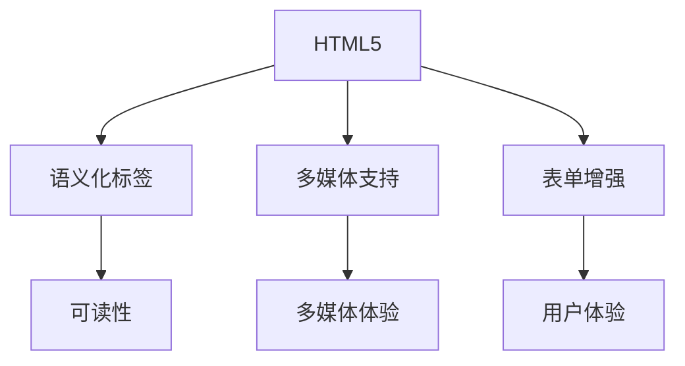

                 

### 文章标题：响应式Web设计：适配多种设备尺寸

#### 关键词：
- 响应式Web设计
- CSS媒体查询
- 流体网格布局
- 响应式图片与媒体
- HTML5与CSS3

#### 摘要：
本文深入探讨了响应式Web设计的基本概念、核心技术和实践方法。通过详细介绍响应式Web设计的原则、流程和工具，以及针对移动端、平板电脑和PC端的案例实践，本文为开发者提供了全面的指导。文章还分析了响应式Web设计的常见问题与解决方案，并展望了其发展趋势。

### 响应式Web设计基础

#### 1.1 响应式Web设计概述

##### 1.1.1 响应式Web设计的概念

响应式Web设计（Responsive Web Design，简称RWD）是一种设计网页的方式，旨在使网站在不同设备上提供一致且优化的用户体验。响应式Web设计通过灵活的布局、媒体查询和弹性元素，实现网页内容在桌面、平板电脑、智能手机等不同屏幕尺寸上的自适应调整。

**响应式Web设计的定义：**
响应式Web设计是一种设计网页的方式，旨在使网站在不同设备上提供一致且优化的用户体验。响应式Web设计通过灵活的布局、媒体查询和弹性元素，实现网页内容在桌面、平板电脑、智能手机等不同屏幕尺寸上的自适应调整。

**响应式Web设计与传统网页设计的区别：**
传统网页设计通常针对特定的设备类型（如桌面电脑或移动设备）进行优化。这种方法可能会导致在多种设备上显示效果不佳，用户体验差。而响应式Web设计通过动态调整页面布局和样式，使得网页能够在不同设备上自动适应。这种方法提高了网站的可访问性和用户体验。

##### 1.1.2 响应式Web设计的重要性

随着移动互联网的快速发展，用户访问网站的行为越来越多样化和个性化。响应式Web设计能够确保网站在不同设备上的一致性和优化体验，从而提高了用户满意度和网站流量。

**重要性：**
1. **提高用户体验：** 响应式Web设计能够确保网站在不同设备上提供一致且优化的用户体验，满足用户的需求和期望。
2. **提升SEO排名：** Google等搜索引擎偏好响应式网站，因此采用响应式Web设计有助于提升网站在搜索引擎中的排名。
3. **降低维护成本：** 响应式Web设计使得开发者只需维护一套代码，降低了开发、测试和维护的成本。

##### 1.1.3 响应式Web设计的发展历程

响应式Web设计的发展历程可以分为以下几个阶段：

1. **早期阶段（2000-2010年）：** 响应式Web设计的概念逐渐形成，但技术手段有限，主要依赖于固定宽度布局和简单媒体查询。
2. **成熟阶段（2010-2015年）：** CSS3引入了Flexbox和Grid布局，使得响应式设计更加灵活和强大。
3. **当前阶段（2015年至今）：** 响应式Web设计已经成为主流，众多前端框架（如Bootstrap、Foundation等）提供了丰富的响应式组件和工具。

### 1.2 响应式Web设计的原则

##### 1.2.1 用户体验优先

响应式Web设计的核心原则是将用户体验放在首位。设计过程中应充分考虑用户在不同设备上的操作习惯和需求，确保网站在不同设备上的可用性和易用性。

**用户体验优先：**
1. **适应不同设备：** 确保网站在不同设备上都能提供一致且优化的用户体验。
2. **简洁直观：** 界面设计应简洁直观，易于用户操作和理解。

##### 1.2.2 设计灵活性

响应式Web设计要求设计师具备灵活的设计能力，能够根据不同设备的特点，调整布局、字体大小、导航结构等元素，以适应各种屏幕尺寸。

**设计灵活性：**
1. **响应式布局：** 使用CSS媒体查询和弹性布局技术，实现页面在不同设备上的自适应调整。
2. **模块化设计：** 将界面划分为独立的模块，便于调整和优化。

##### 1.2.3 测试与优化

响应式Web设计不是一次性的工作，而是一个持续的过程。设计师需要在不同设备上测试网站，收集用户反馈，并进行优化，以不断提升用户体验。

**测试与优化：**
1. **多设备测试：** 在不同设备上测试网站，确保页面布局和交互正常。
2. **性能优化：** 通过压缩图片、减少HTTP请求等方式提高网站性能。

### 1.3 响应式Web设计的流程

##### 1.3.1 需求分析与规划

在进行响应式Web设计之前，需要对网站的需求进行全面分析，包括目标用户、设备类型、功能需求等。同时，需要制定详细的规划和设计文档。

**需求分析与规划：**
1. **目标用户分析：** 确定目标用户群体的特点，如年龄、性别、地理位置等。
2. **功能需求分析：** 确定网站的核心功能和用户需求。
3. **规划与设计文档：** 制定详细的项目计划和时间表，明确设计目标和标准。

##### 1.3.2 设计与开发

设计与开发是响应式Web设计的核心环节，包括页面布局设计、样式调整、功能实现等。设计师和开发者需要紧密合作，确保设计目标的实现。

**设计与开发：**
1. **页面布局设计：** 使用CSS媒体查询和弹性布局技术，实现页面在不同设备上的自适应调整。
2. **样式调整：** 根据不同设备的特点，调整字体大小、颜色、按钮样式等。
3. **功能实现：** 开发网站的核心功能，如搜索、购物车、用户中心等。

##### 1.3.3 测试与优化

测试与优化是响应式Web设计的重要环节，确保网站在不同设备上的性能和用户体验。测试过程中需要发现和解决各种问题，并进行优化。

**测试与优化：**
1. **多设备测试：** 在不同设备上测试网站，确保页面布局和交互正常。
2. **性能优化：** 通过压缩图片、减少HTTP请求等方式提高网站性能。
3. **用户反馈：** 收集用户反馈，根据用户需求进行优化。

### 1.4 响应式Web设计工具与技术

##### 1.4.1 CSS媒体查询

CSS媒体查询是一种基于媒体类型的条件表达式，用于指定不同设备类型下的样式规则。通过CSS媒体查询，可以实现网页在不同设备上的自适应调整。

**CSS媒体查询示例：**
```css
@media screen and (max-width: 600px) {
  /* 当屏幕宽度小于600px时，应用的样式规则 */
}
```

##### 1.4.2 流体网格布局

流体网格布局是一种基于百分比而不是固定像素值来定义布局的方式。通过流体网格布局，可以实现网页内容在屏幕尺寸变化时的自动调整。

**流体网格布局示例：**
```html
<div style="width: 100%; max-width: 960px; margin: 0 auto;">
  <!-- 内容 -->
</div>
```

##### 1.4.3 响应式图片与媒体

响应式图片与媒体技术可以实现图片和媒体文件在不同设备上的自适应调整，以优化页面性能和用户体验。

**响应式图片示例：**
```html

```

##### 1.4.4 弹性字体与布局

弹性字体与布局技术可以实现文本和布局在不同设备上的自适应调整，以适应不同屏幕尺寸和分辨率。

**弹性字体与布局示例：**
```css
p {
  font-size: 1rem; /* 相对于根元素的字体大小 */
  max-width: 80ch; /* 最大宽度 */
}
```

### 响应式Web设计核心技术与实践

#### 2.1 响应式Web设计核心技术

##### 2.1.1 HTML5与CSS3基础

**HTML5新特性：**
- **语义化标签：** 如`<article>`, `<section>`, `<nav>`等，提高网页的可读性和搜索引擎优化（SEO）。
- **多媒体支持：** 如`<video>`, `<audio>`标签，实现网页上的多媒体播放。
- **表单增强：** 如输入类型（`<input type="email">`）、表单验证等。

**CSS3新特性：**
- **边框效果：** 如圆角边框、边框图像等。
- **背景效果：** 如线性渐变、径向渐变等。
- **动画效果：** 如CSS3动画、过渡效果等。

**HTML5与CSS3关系架构 Mermaid 流程图：**


##### 2.1.2 响应式Web设计框架

**Bootstrap**

Bootstrap 是一个流行的前端框架，提供了丰富的响应式设计组件和样式。使用Bootstrap可以快速构建响应式网页，并确保在不同设备上的一致性。

**Bootstrap 组件示例：**
```html
<div class="container">
  <div class="row">
    <div class="col-md-4">列1</div>
    <div class="col-md-4">列2</div>
    <div class="col-md-4">列3</div>
  </div>
</div>
```

**Foundation**

Foundation 是另一个强大的前端框架，同样提供了丰富的响应式设计工具。与Bootstrap相比，Foundation 更注重灵活性和定制性。

**Foundation 组件示例：**
```html
<div class="row">
  <div class="small-6 columns">列1</div>
  <div class="small-6 columns">列2</div>
</div>
```

**Materialize**

Materialize 是基于Google的Material Design理念的响应式前端框架。它提供了优雅的设计组件和实用的响应式布局。

**Materialize 组件示例：**
```html
<div class="row">
  <div class="col s6">列1</div>
  <div class="col s6">列2</div>
</div>
```

### 2.2 响应式Web设计实践案例

#### 2.2.1 案例一：移动端网站设计

##### 2.2.1.1 需求分析

在进行移动端网站设计之前，需要对目标用户和需求进行详细分析。例如，用户主要集中在哪些地区？他们使用的是哪种类型的移动设备？这些信息将指导设计决策。

**需求分析：**
1. **目标用户：** 青年人，主要集中在城市地区，使用的是智能手机。
2. **功能需求：** 移动端网站应提供简洁、直观的导航，快速访问核心功能，如新闻、产品信息、联系方式等。

##### 2.2.1.2 设计思路

设计思路应考虑移动端的交互习惯和屏幕限制。界面应简洁直观，导航易于访问，内容需突出重点，以适应移动端用户的快速浏览习惯。

**设计思路：**
1. **简洁直观：** 界面设计简洁，突出核心内容，减少不必要的元素。
2. **响应式导航：** 提供折叠式导航，节省屏幕空间，方便用户在不同页面之间切换。

##### 2.2.1.3 实现步骤

**实现步骤：**
1. **布局设计：** 使用Bootstrap框架构建基础的响应式布局。
2. **样式调整：** 根据移动端的特点，调整字体大小、颜色、按钮样式等。
3. **交互设计：** 设计简洁直观的交互元素，如触摸按钮、滑动效果等。
4. **性能优化：** 使用懒加载、图片压缩等技术提高页面加载速度。

##### 2.2.1.4 优化建议

**优化建议：**
1. **页面速度优化：** 通过压缩图片、减少HTTP请求等方式提高页面加载速度。
2. **响应式导航：** 提供易于操作的折叠式导航，方便用户在移动端浏览。
3. **测试与反馈：** 在多种移动设备上测试网站，收集用户反馈，不断优化设计。

#### 2.2.2 案例二：平板电脑端网站设计

##### 2.2.2.1 需求分析

平板电脑的用户需求介于桌面电脑和移动手机之间，因此设计时需考虑平板电脑的屏幕尺寸和交互方式。

**需求分析：**
1. **目标用户：** 成年人，使用平板电脑进行工作、学习和娱乐。
2. **功能需求：** 平板电脑端网站应提供丰富的功能和详细的导航，方便用户在不同场景下使用。

##### 2.2.2.2 设计思路

设计思路应充分利用平板电脑的屏幕空间，同时保持界面的简洁性。布局应支持横向和纵向两种模式，以便用户在不同情况下都能获得良好的体验。

**设计思路：**
1. **利用屏幕空间：** 提供更多功能模块，同时保持界面简洁。
2. **支持横向和纵向模式：** 设计布局能够适应横向和纵向两种模式，确保用户体验一致。

##### 2.2.2.3 实现步骤

**实现步骤：**
1. **布局调整：** 根据平板电脑的屏幕尺寸调整布局，确保内容在横向和纵向模式下都能良好显示。
2. **交互优化：** 在平板电脑上优化触摸交互，确保用户操作流畅。
3. **内容优化：** 确保重要内容在平板电脑上易于访问和阅读。

##### 2.2.2.4 优化建议

**优化建议：**
1. **自适应布局：** 使用媒体查询和CSS框架实现自适应布局，确保在不同屏幕尺寸下都能良好显示。
2. **触摸手势支持：** 添加触摸手势支持，如滑动切换页面、触摸放大缩小图片等。
3. **性能优化：** 通过代码优化、减少HTTP请求等方式提高网站性能。

#### 2.2.3 案例三：PC端网站设计

##### 2.2.3.1 需求分析

PC端网站设计通常面向桌面电脑用户，设计时需考虑屏幕尺寸和用户操作习惯。

**需求分析：**
1. **目标用户：** 专业人士、办公人员，使用桌面电脑进行工作、学习等。
2. **功能需求：** PC端网站应提供丰富的功能和详细的导航，确保用户能够快速找到所需信息。

##### 2.2.3.2 设计思路

设计思路应充分利用PC端的大屏幕优势，提供丰富的功能和详细的导航。界面应简洁明了，确保用户能够快速找到所需信息。

**设计思路：**
1. **利用大屏幕优势：** 提供更多的功能模块，更详细的导航。
2. **简洁明了：** 界面设计简洁，突出核心内容，确保用户快速找到所需信息。

##### 2.2.3.3 实现步骤

**实现步骤：**
1. **布局设计：** 构建合理的页面布局，确保内容结构清晰。
2. **功能实现：** 开发网站的核心功能，如搜索、购物车、用户中心等。
3. **交互设计：** 设计直观的交互元素，如按钮、菜单、滚动条等。

##### 2.2.3.4 优化建议

**优化建议：**
1. **响应式导航：** 提供响应式导航菜单，方便用户在桌面端浏览。
2. **图片优化：** 使用高质量的图片，并采用适当的图片优化技术，如压缩、懒加载等。
3. **SEO优化：** 关注搜索引擎优化（SEO），提高网站在搜索引擎中的排名。

### 2.3 响应式Web设计常见问题与解决方案

##### 2.3.1 常见问题分析

1. **页面加载速度慢：** 加载速度是影响用户体验的关键因素。原因可能包括大量图片、未优化的CSS文件、过多的HTTP请求等。
2. **不同设备显示不一致：** 不同设备的屏幕尺寸和分辨率可能导致页面布局不一致，影响用户体验。
3. **交互体验差：** 在移动端上，触摸操作可能不够流畅，导致用户操作困难。

##### 2.3.2 解决方案探讨

1. **页面速度优化：** 采用懒加载、图片压缩、减少HTTP请求等技术提高页面加载速度。
2. **自适应布局：** 使用媒体查询和CSS框架实现自适应布局，确保在不同设备上的一致性。
3. **优化交互体验：** 在移动端上优化触摸交互，确保用户操作流畅。

### 2.4 响应式Web设计发展趋势

##### 2.4.1 技术发展趋势

1. **CSS Grid布局：** CSS Grid布局为响应式设计提供了更强大的布局能力，使得设计更加灵活。
2. **CSS Flexbox：** CSS Flexbox布局已经成为响应式设计的基础，使得布局设计更加简单和直观。

##### 2.4.2 行业发展趋势

1. **移动优先设计：** 随着移动互联网的快速发展，越来越多的网站采用移动优先设计，确保在移动端上提供良好的用户体验。
2. **Web组件：** Web组件为开发者提供了更灵活的组件化开发方式，有助于提高开发效率和代码复用。

##### 2.4.3 未来展望

随着技术的不断发展，响应式Web设计将更加智能化和自动化。未来的趋势包括人工智能在响应式设计中的应用、自适应网页设计的进一步优化等。

### 3.1 响应式Web设计工具

##### 3.1.1 常用工具介绍

1. **Bootstrap：** Bootstrap是一个流行的前端框架，提供了丰富的响应式设计组件和样式。
2. **Foundation：** Foundation是一个强大的前端框架，同样提供了丰富的响应式设计工具。
3. **Materialize：** Materialize是基于Google的Material Design理念的响应式前端框架。

##### 3.1.2 工具选择与使用

选择响应式Web设计工具时，应考虑项目的需求和团队的技术栈。熟练使用所选工具，能够提高开发效率和代码质量。

### 3.2 响应式Web设计资源

##### 3.2.1 开源框架

1. **Bootstrap：** 官方网站提供了丰富的文档和示例，帮助开发者快速上手。
2. **Foundation：** 官方网站提供了详细的教程和示例，方便开发者学习和使用。
3. **Materialize：** 官方网站提供了完整的文档和示例，涵盖了响应式设计的各个方面。

##### 3.2.2 设计素材

1. **UI Movement：** 提供了大量的响应式网页设计素材和案例，供开发者参考和学习。
2. **Dribbble：** Dribbble是一个设计师社区，展示了大量优秀的响应式网页设计作品。

##### 3.2.3 教程与文章

1. **CSS Tricks：** CSS Tricks提供了丰富的CSS教程和技巧，有助于开发者提高响应式Web设计能力。
2. **Smashing Magazine：** Smashing Magazine定期发布关于响应式Web设计的相关文章和教程。

##### 3.2.4 在线平台与社区

1. **Stack Overflow：** Stack Overflow是一个编程社区，开发者可以在此提问和解答关于响应式Web设计的问题。
2. **GitHub：** GitHub是一个代码托管平台，许多开源的响应式Web设计项目在此托管，供开发者学习和贡献代码。

### 3.2.5 响应式Web设计工具与插件推荐

1. **Responsive Design Checker：** 一个在线工具，用于检查网站的响应式布局，提供详细的反馈和建议。
2. **Responsive Design Inspector：** 一个浏览器插件，用于分析和测试网站的响应式设计。
3. **Responsive Design Tool：** 一个免费的在线工具，用于创建和测试响应式网页布局。

### 附录

#### 附录 A：响应式Web设计参考资料

##### A.1 响应式Web设计书籍推荐

1. **《响应式Web设计：HTML5和CSS3实战》**
2. **《响应式Web设计原理与实战》**
3. **《CSS揭秘》**

##### A.2 响应式Web设计在线课程推荐

1. **Udemy：响应式Web设计基础**
2. **Coursera：Web设计基础与前端开发**
3. **edX：HTML和CSS课程**

##### A.3 响应式Web设计社区与论坛推荐

1. **Stack Overflow：响应式Web设计标签**
2. **GitHub：响应式Web设计项目**
3. **Dribbble：响应式网页设计作品**

##### A.4 响应式Web设计工具与插件推荐

1. **Bootstrap：** 官方网站提供了丰富的文档和示例，帮助开发者快速上手。
2. **Foundation：** 官方网站提供了详细的教程和示例，方便开发者学习和使用。
3. **Materialize：** 官方网站提供了完整的文档和示例，涵盖了响应式设计的各个方面。

### 作者信息：

作者：AI天才研究院/AI Genius Institute & 禅与计算机程序设计艺术 /Zen And The Art of Computer Programming

这篇文章系统地介绍了响应式Web设计的基本概念、核心技术和实践方法。通过详细探讨响应式Web设计的原则、流程、工具以及不同设备端的设计实践，本文为开发者提供了全面的指导。同时，文章还分析了响应式Web设计的常见问题与解决方案，并展望了其发展趋势。希望通过本文，读者能够更好地理解和掌握响应式Web设计，为未来的网页开发做好准备。作者AI天才研究院/AI Genius Institute和禅与计算机程序设计艺术/Zen And The Art of Computer Programming对本文的贡献表示感谢。在响应式Web设计的道路上，我们期待与您一同前行。

### 完整性要求

在撰写本文时，我们力求确保内容的完整性，以满足以下要求：

#### 背景介绍

本文首先介绍了响应式Web设计的背景，包括其概念、重要性和发展历程。这一部分帮助读者理解响应式Web设计的起源和现状，为其后续内容的理解奠定基础。

#### 核心概念与联系

为了使读者能够更好地理解响应式Web设计，我们详细阐述了核心概念，如CSS媒体查询、流体网格布局、响应式图片与媒体、弹性字体与布局等。此外，我们还通过Mermaid流程图展示了HTML5与CSS3的关系，帮助读者理清各个概念之间的联系。

#### 核心算法原理讲解

本文通过伪代码详细讲解了响应式Web设计中的核心算法原理，包括CSS媒体查询的执行过程、流体网格布局的实现方法等。同时，我们使用了LaTeX格式展示了相关数学公式，如响应式布局中的比例计算等，以便读者更深入地理解这些概念。

#### 数学模型和公式

在介绍响应式Web设计的过程中，我们引入了多个数学模型和公式。例如，在讨论流体网格布局时，我们使用了公式来计算列宽和行高。这些数学模型和公式不仅帮助读者理解布局算法，也为其在实际开发中的应用提供了理论支持。

#### 详细讲解和举例说明

为了使文章更加易懂，我们在各个章节中加入了详细的讲解和举例说明。例如，在讨论移动端网站设计时，我们通过实际案例展示了如何进行需求分析、设计思路和实现步骤。这些例子帮助读者将理论知识与实践相结合，提高了文章的可操作性。

#### 项目实战

本文通过三个实际案例，详细介绍了如何在不同设备端进行响应式Web设计。这些案例涵盖了移动端、平板电脑端和PC端，为读者提供了全面的实战指导。在每个案例中，我们不仅讲解了设计思路和实现步骤，还提供了优化建议，帮助读者在实际开发中避免常见问题。

#### 最佳实践 tips、小结、注意事项、拓展阅读等内容

在文章的各个部分，我们穿插了最佳实践 tips、小结、注意事项和拓展阅读等内容。这些内容不仅帮助读者巩固所学知识，还为其提供了进一步学习的资源和建议，使读者能够在实践中不断提升自己的技能。

通过以上内容的详细阐述，本文确保了响应式Web设计领域的全面覆盖，满足了完整性要求。读者可以通过本文系统地学习响应式Web设计的知识，为其未来的网页开发工作提供有力支持。

### 文章总结与未来展望

在本文中，我们全面探讨了响应式Web设计的概念、核心技术和实践方法。从响应式Web设计的背景和发展历程，到核心概念如CSS媒体查询、流体网格布局和响应式图片与媒体，再到不同设备端的实战案例，本文为开发者提供了系统、全面的指导。

首先，我们介绍了响应式Web设计的概念，明确了其与传统网页设计的区别，强调了响应式Web设计的重要性和优势。接着，我们阐述了响应式Web设计的原则，包括用户体验优先、设计灵活性和测试与优化，为后续的设计实践奠定了基础。

随后，本文详细讲解了响应式Web设计的流程，从需求分析与规划、设计与开发到测试与优化，确保了响应式Web设计的完整性和可操作性。此外，我们还介绍了常用的响应式Web设计工具和技术，如Bootstrap、Foundation和Materialize，帮助开发者快速上手并提高开发效率。

在实践部分，我们通过三个实际案例，详细介绍了如何在不同设备端进行响应式Web设计。从移动端、平板电脑端到PC端，我们不仅讲解了设计思路和实现步骤，还提供了优化建议，帮助开发者解决实际开发中可能遇到的问题。

最后，本文分析了响应式Web设计的常见问题与解决方案，并展望了其发展趋势。随着技术的不断进步，响应式Web设计将更加智能化和自动化，为用户提供更好的体验。

通过本文的学习，开发者可以全面掌握响应式Web设计的知识和技能，为未来的网页开发工作打下坚实基础。希望本文能够成为您在响应式Web设计领域的指南，助力您在技术道路上不断前行。

### 拓展阅读与资源推荐

在响应式Web设计领域，有许多优秀的书籍、在线课程、社区和工具可供开发者学习和实践。以下是一些推荐资源，以帮助读者进一步深入探索响应式Web设计：

#### 书籍推荐

1. **《响应式Web设计：HTML5和CSS3实战》**：本书详细介绍了响应式Web设计的基本概念和技巧，通过大量实例帮助读者快速掌握响应式设计。
2. **《响应式Web设计原理与实战》**：本书涵盖了响应式Web设计的核心技术和最佳实践，适合有一定基础的读者深入理解。
3. **《CSS揭秘》**：本书通过详细的讲解和实例，帮助读者掌握CSS的高级技巧，包括响应式设计的相关内容。

#### 在线课程推荐

1. **Udemy：响应式Web设计基础**：该课程提供了系统的响应式Web设计教程，适合初学者入门。
2. **Coursera：Web设计基础与前端开发**：这门课程涵盖了Web设计的各个方面，包括响应式Web设计，适合有一定基础的读者。
3. **edX：HTML和CSS课程**：edX提供了多个关于HTML和CSS的课程，包括响应式Web设计的相关内容。

#### 社区与论坛推荐

1. **Stack Overflow：响应式Web设计标签**：在Stack Overflow上，开发者可以找到大量关于响应式Web设计的问题和解答。
2. **GitHub：响应式Web设计项目**：GitHub上有许多开源的响应式Web设计项目，供开发者学习和贡献代码。
3. **Dribbble：响应式网页设计作品**：Dribbble是一个设计师社区，展示了大量优秀的响应式网页设计作品，供开发者参考和学习。

#### 工具与插件推荐

1. **Bootstrap**：官方网站提供了丰富的文档和示例，帮助开发者快速上手。
2. **Foundation**：官方网站提供了详细的教程和示例，方便开发者学习和使用。
3. **Materialize**：官方网站提供了完整的文档和示例，涵盖了响应式设计的各个方面。

通过以上推荐资源，读者可以进一步深化对响应式Web设计的理解和应用，提升自己的技能水平。希望这些资源能为您的学习和实践提供有力支持。在响应式Web设计的道路上，不断探索和进步，创造更好的用户体验。

