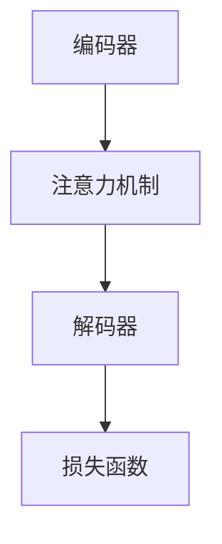

                 

### 图神经网络（Graph Neural Networks） - 原理与代码实例讲解

> 关键词：图神经网络、图卷积网络（GCN）、图注意力网络（GAT）、图自编码器（GAE）、社交网络分析、基因表达预测、电路故障诊断

> 摘要：本文旨在深入探讨图神经网络（Graph Neural Networks, GNN）的原理与应用。我们将首先介绍图神经网络的基本概念和重要性，然后逐步讲解图神经网络的核心算法，包括图卷积网络（GCN）、图注意力网络（GAT）和图自编码器（GAE）。此外，本文还将通过具体的代码实例，展示如何在实际项目中应用图神经网络，并对其开发环境和工具进行详细介绍。通过阅读本文，读者将对图神经网络有全面的理解，并能够掌握其在各种应用场景中的实际应用方法。

### 第一部分：图神经网络基础

#### 第1章：图神经网络概述

##### 1.1 图神经网络的定义与重要性

图神经网络（Graph Neural Networks, GNN）是一种专门用于处理图结构数据的深度学习模型。与传统的卷积神经网络（Convolutional Neural Networks, CNN）和循环神经网络（Recurrent Neural Networks, RNN）不同，GNN能够直接在图结构数据上进行操作和学习。这种特性使得GNN在处理复杂的关系数据时具有独特的优势。

图神经网络的重要性主要体现在以下几个方面：

1. **处理异构图**：图神经网络能够处理包含多种节点和边类型的异构图，这使得它们在许多实际应用中都表现出了强大的能力。
2. **捕捉图结构信息**：通过学习节点和边之间的复杂关系，GNN能够捕捉图结构中的全局和局部特征，从而在节点分类、链接预测等问题上取得了显著的效果。
3. **广泛应用场景**：从社交网络分析、生物学网络分析到电子电路设计优化，GNN在各种领域都展示出了出色的性能。

##### 1.2 图神经网络的应用场景

图神经网络在以下应用场景中具有显著的优势：

1. **社交网络分析**：通过分析社交网络中的节点和边关系，GNN可以用于用户影响力分析、社区发现、好友推荐等任务。
2. **生物学网络分析**：在基因表达预测、蛋白质相互作用预测等领域，GNN能够有效地处理复杂的生物网络结构。
3. **电子电路设计优化**：通过分析电路拓扑结构，GNN可以用于电路故障诊断、拓扑优化等任务。
4. **推荐系统**：在电商、新闻推荐等领域，GNN可以用于处理用户和物品之间的复杂关系，提高推荐系统的准确性。

##### 1.3 图神经网络与深度学习的联系与区别

图神经网络是深度学习的一种特殊形式，它们与传统的深度学习模型（如CNN和RNN）有以下几点不同：

1. **数据结构**：CNN主要处理二维图像数据，而RNN主要处理一维序列数据。相比之下，GNN直接处理图结构数据，这使其在处理复杂的关系数据时具有独特的优势。
2. **模型结构**：GNN的模型结构相对简单，但能够处理复杂的关系。相比之下，CNN和RNN的模型结构更为复杂，但在处理特定类型的数据（如图像和序列）时表现更好。
3. **学习方式**：GNN通过聚合节点和边的特征来学习图结构信息，而CNN和RNN分别通过卷积和循环操作来学习数据中的特征。

尽管存在这些不同，GNN和CNN、RNN在深度学习领域相互补充，共同推动了深度学习技术的发展。

#### 第2章：图论基础

##### 2.1 图的基本概念

图（Graph）是由节点（Vertex）和边（Edge）组成的数据结构，用于表示实体之间的关系。以下是一些基本的图概念：

1. **节点**：图中的实体，可以是人、物品、地点等。
2. **边**：连接两个节点的线，表示节点之间的关系。
3. **无向图**：边没有方向，如社交网络中的朋友关系。
4. **有向图**：边有方向，如网络中的连接关系。

##### 2.2 图的存储与表示

图的存储和表示方法有多种，包括邻接矩阵、邻接表和边列表等。以下是一些常用的图存储和表示方法：

1. **邻接矩阵**：用二维矩阵表示图，其中矩阵的元素表示边是否存在。
2. **邻接表**：用列表表示图，每个节点对应一个列表，列表中的元素表示与该节点相连的其他节点。
3. **边列表**：用列表表示图，列表中的每个元素表示一条边，元素的形式可以是（节点1，节点2）或（节点2，节点1）。

##### 2.3 图的基本算法

图的基本算法包括图的遍历、最短路径算法和图的连通性算法等。以下是一些常用的图算法：

1. **深度优先搜索（DFS）**：从某个节点开始，沿着路径不断深入，直到路径不可行或到达目标节点。
2. **广度优先搜索（BFS）**：从某个节点开始，逐层遍历所有节点，直到找到目标节点。
3. **迪杰斯特拉算法（Dijkstra）**：计算图中两点之间的最短路径。
4. **贝尔曼-福特算法（Bellman-Ford）**：在存在负权环的图中计算最短路径。

这些基本算法为图神经网络提供了重要的理论基础，使得GNN能够有效地处理和利用图结构数据。

#### 第3章：图神经网络核心算法原理

##### 3.1 图卷积网络（GCN）原理

图卷积网络（Graph Convolutional Network, GCN）是图神经网络中的一种核心算法，主要用于节点分类和链接预测等任务。GCN通过聚合节点和其邻居的特征来更新节点的表示。

以下是GCN的核心原理：

1. **邻接矩阵**：首先，GCN使用邻接矩阵表示图。
2. **特征聚合**：对于每个节点，GCN聚合其自身特征和邻居节点的特征，计算新的节点特征。
3. **非线性变换**：通过非线性变换（如ReLU激活函数）来增强特征表示。
4. **迭代更新**：GCN通过迭代更新节点特征，直到达到预定的迭代次数或收敛条件。

以下是GCN的数学模型：

$$
\begin{aligned}
H_{l+1}^{(i)} &= \sigma(\theta_h^h \cdot \text{softmax}(\theta_a \cdot A \cdot H_l^{(i)} + \theta_r \cdot (I - A) \cdot H_l^{(i)} + b_h)) \\
\end{aligned}
$$

其中，$H_l^{(i)}$表示第$l$层第$i$个节点的特征向量，$A$是邻接矩阵，$\sigma$是激活函数，$\theta_h^h$、$\theta_a$和$\theta_r$是权重矩阵，$b_h$是偏置项。

##### 3.2 图注意力网络（GAT）原理

图注意力网络（Graph Attention Network, GAT）是GCN的一种改进，它通过引入注意力机制来提高模型对邻居节点特征的利用。

以下是GAT的核心原理：

1. **邻接矩阵**：与GCN类似，GAT使用邻接矩阵表示图。
2. **特征聚合**：对于每个节点，GAT计算其邻居节点的注意力权重，并加权聚合邻居节点的特征。
3. **非线性变换**：通过非线性变换（如ReLU激活函数）来增强特征表示。
4. **迭代更新**：GAT通过迭代更新节点特征，直到达到预定的迭代次数或收敛条件。

以下是GAT的数学模型：

$$
\begin{aligned}
\text{Attention}(W^1 \cdot H_j^{(l)} + W^2 \cdot H_i^{(l)} + b_1) &= \text{softmax}(\text{LeakyReLU}(W^3 \cdot H_j^{(l)} + W^4 \cdot H_i^{(l)} + b_2)) \\
\end{aligned}
$$

$$
\begin{aligned}
H_i^{(l+1)} &= (1 - \alpha) \cdot H_i^{(l)} + \sum_{j \in \mathcal{N}(i)} \alpha_{ij} \cdot H_j^{(l)}
\end{aligned}
$$

其中，$H_j^{(l)}$和$H_i^{(l)}$分别表示第$l$层第$j$个节点和第$i$个节点的特征向量，$\alpha_{ij}$表示节点$i$对节点$j$的注意力权重。

##### 3.3 图自编码器（GAE）原理

图自编码器（Graph Autoencoder, GAE）是一种无监督学习的图神经网络模型，主要用于学习图结构的表示。

以下是GAE的核心原理：

1. **编码器**：GAE的编码器将节点的特征映射到一个低维表示空间。
2. **解码器**：GAE的解码器将编码器生成的低维表示映射回原始特征空间。
3. **损失函数**：GAE通过最小化编码器生成的表示与原始特征之间的误差来训练模型。

以下是GAE的数学模型：

$$
\begin{aligned}
\text{编码器：} & \, Z_i = \sigma(\theta_e \cdot X_i + b_e) \\
\text{解码器：} & \, X_i' = \text{sigmoid}(\theta_d \cdot Z_i + b_d) \\
\text{损失函数：} & \, \text{Reconstruction Loss} = \sum_{i} \frac{1}{2} \sum_{j \in \mathcal{N}(i)} \left( X_i - X_i' \right)^2
\end{aligned}
$$

其中，$X_i$和$X_i'$分别表示第$i$个节点的原始特征和重构特征，$Z_i$是编码器生成的低维表示。

### 第4章：图神经网络架构与优化

#### 4.1 图神经网络模型架构

图神经网络的模型架构通常包括编码器、解码器和注意力机制等组成部分。以下是一个典型的图神经网络模型架构：

1. **编码器**：编码器将节点的特征映射到一个低维表示空间，以便进行进一步处理。
2. **解码器**：解码器将编码器生成的低维表示映射回原始特征空间，以重构原始特征。
3. **注意力机制**：注意力机制用于提高模型对邻居节点特征的利用，从而改善模型性能。
4. **损失函数**：损失函数用于衡量模型输出与真实值之间的差异，以指导模型优化。

以下是一个简化的图神经网络模型架构：



#### 4.2 图神经网络优化方法

图神经网络的优化方法主要包括随机梯度下降（SGD）、Adam优化器等。以下是一些常用的优化方法：

1. **随机梯度下降（SGD）**：SGD是一种简单的优化方法，通过随机选择一小部分训练样本来更新模型参数。
2. **Adam优化器**：Adam优化器结合了SGD和AdaGrad优化器的优点，在训练过程中动态调整学习率。
3. **批次优化**：批次优化通过批量处理训练样本来更新模型参数，从而提高训练效果。
4. **正则化**：正则化方法（如L1正则化和L2正则化）用于防止模型过拟合，提高模型的泛化能力。

#### 4.3 图神经网络训练技巧

在训练图神经网络时，以下技巧有助于提高模型性能：

1. **数据预处理**：对图数据集进行预处理，包括节点特征标准化、去除噪声等。
2. **数据增强**：通过增加数据多样性来提高模型鲁棒性，例如对图结构进行随机采样或生成。
3. **动态图训练**：使用动态图进行训练，以适应不断变化的图结构。
4. **学习率调整**：在训练过程中动态调整学习率，以避免模型过早饱和或过拟合。

通过以上技巧，我们可以有效地提高图神经网络的训练效果和性能。

### 第5章：图神经网络在真实世界中的应用

#### 5.1 社交网络分析

社交网络分析是图神经网络的重要应用领域之一。通过分析社交网络中的节点和边关系，GNN可以用于多种任务，如用户影响力分析、社区发现和好友推荐。

以下是社交网络分析中的一些具体应用：

1. **用户影响力分析**：通过分析社交网络中的节点度和邻居关系，GNN可以识别出社交网络中的关键节点，从而评估用户的影响力。
2. **社区发现**：GNN可以通过聚类算法识别社交网络中的社区结构，从而帮助社交网络平台更好地组织内容和推荐信息。
3. **好友推荐**：基于用户之间的相似度和社交关系，GNN可以生成个性化的好友推荐列表，提高用户的社交体验。

#### 5.2 生物学网络分析

生物学网络分析是图神经网络的另一个重要应用领域。通过分析生物网络中的节点和边关系，GNN可以用于基因表达预测、蛋白质相互作用预测等任务。

以下是生物学网络分析中的一些具体应用：

1. **基因表达预测**：通过分析基因之间的相互作用关系，GNN可以预测基因在不同条件下的表达水平，从而帮助科学家更好地理解基因调控机制。
2. **蛋白质相互作用预测**：通过分析蛋白质之间的相互作用关系，GNN可以预测蛋白质之间的相互作用，从而帮助生物学家发现新的药物靶点和治疗策略。
3. **疾病预测**：通过分析生物网络中的节点和边关系，GNN可以预测特定疾病的发生风险，从而帮助医生制定个性化的治疗方案。

#### 5.3 电子电路设计优化

电子电路设计优化是图神经网络的另一个重要应用领域。通过分析电路拓扑结构和节点关系，GNN可以用于电路故障诊断、拓扑优化等任务。

以下是电子电路设计优化中的一些具体应用：

1. **电路故障诊断**：通过分析电路拓扑结构和节点关系，GNN可以识别出电路中的故障节点，从而帮助工程师快速定位和修复故障。
2. **拓扑优化**：通过分析电路拓扑结构和节点关系，GNN可以生成优化后的电路拓扑，从而提高电路的性能和可靠性。
3. **电源分配网络设计**：通过分析电路拓扑结构和节点关系，GNN可以优化电源分配网络，从而提高电路的能效和稳定性。

### 第6章：图神经网络的项目实战

#### 6.1 项目1：社交网络用户影响力分析

**项目描述**：本项目旨在通过图神经网络分析社交网络中的用户影响力，评估用户在网络中的重要性。

**开发环境搭建**：使用Python和PyTorch Geometric搭建图神经网络环境。

**代码实现**：

```python
import torch
import torch.nn as nn
import torch.optim as optim
from torch_geometric.nn import GCNConv

# 加载社交网络图数据
data = Data(x=torch.tensor(X), edge_index=torch.tensor(E))

# 定义GCN模型
model = GCNConv(in_features=X.shape[1], out_features=16)

# 定义损失函数和优化器
criterion = nn.CrossEntropyLoss()
optimizer = optim.Adam(model.parameters(), lr=0.01)

# 训练模型
for epoch in range(200):
    optimizer.zero_grad()
    out = model(data)
    loss = criterion(out[data.train_mask], data.y[data.train_mask])
    loss.backward()
    optimizer.step()
```

**代码解读**：此代码实现了社交网络用户影响力分析的项目。首先加载社交网络图数据，然后定义GCN模型，并使用交叉熵损失函数和Adam优化器进行模型训练。在训练过程中，通过前向传播和反向传播更新模型参数，以达到预测用户影响力的目标。

#### 6.2 项目2：基因表达预测

**项目描述**：本项目旨在通过图神经网络预测基因在不同条件下的表达水平。

**开发环境搭建**：使用Python和DGL构建图神经网络环境。

**代码实现**：

```python
import torch
import torch.nn as nn
import torch.optim as optim
from dgl.nn.pytorch import GraphConv

# 加载基因表达数据
data = Data(x=torch.tensor(X), edge_index=torch.tensor(E))

# 定义GCN模型
model = nn.ModuleList([
    GraphConv(X.shape[1], 16),
    GraphConv(16, 1)
])

# 定义损失函数和优化器
criterion = nn.MSELoss()
optimizer = optim.Adam(model.parameters(), lr=0.01)

# 训练模型
for epoch in range(200):
    optimizer.zero_grad()
    out = model[data.x]
    loss = criterion(out[data.train_mask], data.y[data.train_mask])
    loss.backward()
    optimizer.step()
```

**代码解读**：此代码实现了基因表达预测的项目。首先加载基因表达数据，然后定义GCN模型，并使用均方误差损失函数和Adam优化器进行模型训练。在训练过程中，通过前向传播和反向传播更新模型参数，以达到预测基因表达水平的目标。

#### 6.3 项目3：电路故障诊断

**项目描述**：本项目旨在通过图神经网络诊断电路中的故障节点。

**开发环境搭建**：使用Python和PyTorch搭建电路故障诊断模型。

**代码实现**：

```python
import torch
import torch.nn as nn
import torch.optim as optim
from torch_geometric.nn import GATConv

# 加载电路拓扑图数据
data = Data(x=torch.tensor(X), edge_index=torch.tensor(E))

# 定义GAT模型
model = nn.ModuleList([
    GATConv(X.shape[1], 16, num_heads=2),
    GATConv(16, 1, num_heads=2)
])

# 定义损失函数和优化器
criterion = nn.BCELoss()
optimizer = optim.Adam(model.parameters(), lr=0.01)

# 训练模型
for epoch in range(200):
    optimizer.zero_grad()
    out = model(data.x)
    loss = criterion(out[data.train_mask], data.y[data.train_mask])
    loss.backward()
    optimizer.step()
```

**代码解读**：此代码实现了电路故障诊断的项目。首先加载电路拓扑图数据，然后定义GAT模型，并使用二元交叉熵损失函数和Adam优化器进行模型训练。在训练过程中，通过前向传播和反向传播更新模型参数，以达到诊断电路故障节点的目标。

### 第7章：图神经网络开发环境与工具

#### 7.1 Python在图神经网络中的应用

Python是图神经网络开发中常用的编程语言，其简洁易用的语法和丰富的库支持使其成为图神经网络开发的首选语言。Python中的PyTorch、DGL（Deep Graph Library）和PyTorch Geometric等库为图神经网络的研究和应用提供了强大的支持。

以下是在Python中应用图神经网络的一些关键库：

1. **PyTorch**：PyTorch是一个开源的深度学习库，支持图神经网络的各种操作，包括模型构建、训练和评估等。
2. **DGL**：DGL是一个专为图神经网络设计的Python库，提供了高效的图操作和数据加载功能，支持多种图神经网络模型的实现。
3. **PyTorch Geometric**：PyTorch Geometric是一个扩展PyTorch的库，专门用于图神经网络的研究和应用，提供了丰富的图神经网络模型和工具。

#### 7.2 PyTorch Geometric的使用

PyTorch Geometric是图神经网络研究中广泛使用的库之一，它扩展了PyTorch的功能，使得构建和训练图神经网络变得更加简单和高效。

以下是在PyTorch Geometric中构建和训练图神经网络的一些关键步骤：

1. **数据预处理**：使用PyTorch Geometric的Data类加载和处理图数据，包括节点特征、边特征和图结构等。
2. **模型定义**：定义图神经网络模型，包括编码器、解码器和注意力机制等组成部分。
3. **损失函数和优化器**：选择适当的损失函数和优化器，用于模型训练和优化。
4. **训练过程**：使用训练数据训练模型，通过前向传播和反向传播更新模型参数。

以下是一个简单的示例代码，展示了如何使用PyTorch Geometric构建和训练图神经网络：

```python
import torch
import torch.nn as nn
from torch_geometric.nn import GCNConv

# 定义GCN模型
model = nn.Sequential(
    GCNConv(in_channels=64, out_channels=16),
    nn.ReLU(),
    GCNConv(out_channels=1)
)

# 定义损失函数和优化器
criterion = nn.MSELoss()
optimizer = optim.Adam(model.parameters(), lr=0.01)

# 训练模型
for epoch in range(200):
    optimizer.zero_grad()
    out = model(x)
    loss = criterion(out, y)
    loss.backward()
    optimizer.step()
```

#### 7.3 DGL（Deep Graph Library）的实战

DGL是一个高效的图神经网络库，它提供了丰富的API和工具，用于构建和训练各种图神经网络模型。

以下是在DGL中构建和训练图神经网络的一些关键步骤：

1. **数据预处理**：使用DGL的Graph类加载和处理图数据，包括节点特征、边特征和图结构等。
2. **模型定义**：定义图神经网络模型，包括编码器、解码器和注意力机制等组成部分。
3. **损失函数和优化器**：选择适当的损失函数和优化器，用于模型训练和优化。
4. **训练过程**：使用训练数据训练模型，通过前向传播和反向传播更新模型参数。

以下是一个简单的示例代码，展示了如何使用DGL构建和训练图神经网络：

```python
import dgl
import torch
import torch.nn as nn

# 定义GNN模型
class GNNModel(nn.Module):
    def __init__(self, in_feats, hidden_feats, out_feats):
        super(GNNModel, self).__init__()
        self.gcn = nn.Linear(in_feats, hidden_feats)
        self.relu = nn.ReLU()
        self.fc = nn.Linear(hidden_feats, out_feats)

    def forward(self, g, x):
        x = self.gcn(x)
        x = self.relu(x)
        x = self.fc(x)
        return x

# 创建图数据
g = dgl.graph((0, 1, (2, 3)))
x = torch.tensor([[1.0], [2.0]])
y = torch.tensor([0.0])

# 创建GNN模型
model = GNNModel(x.shape[1], 16, 1)

# 定义损失函数和优化器
criterion = nn.MSELoss()
optimizer = torch.optim.Adam(model.parameters(), lr=0.01)

# 训练模型
for epoch in range(200):
    optimizer.zero_grad()
    out = model(g, x)
    loss = criterion(out, y)
    loss.backward()
    optimizer.step()
```

通过以上示例，我们可以看到DGL在构建和训练图神经网络中的强大功能。DGL提供了高效的图操作和数据加载功能，使得图神经网络的研究和应用变得更加简单和高效。

### 附录：图神经网络学习资源与拓展阅读

#### 附录1：推荐阅读材料

1. **《图神经网络：理论与实践》**：这是一本全面的图神经网络教程，涵盖了图神经网络的基本概念、算法原理和应用实例。
2. **《深度学习与图神经网络》**：这本书详细介绍了深度学习和图神经网络的相关知识，包括模型架构、优化方法和实际应用。

#### 附录2：在线课程与讲座推荐

1. **Coursera上的《图神经网络》课程**：这是一门由斯坦福大学开设的图神经网络课程，内容包括图神经网络的基本概念、算法原理和应用实例。
2. **Udacity上的《图神经网络实战》课程**：这是一门由Udacity开设的实战课程，通过项目实践学习图神经网络的应用。

#### 附录3：相关论文与研究报告

1. **“Graph Neural Networks: A Review of Methods and Applications”**：这是一篇综述性论文，详细介绍了图神经网络的各种方法及其应用。
2. **“Deep Learning on Graphs: A New Frontier in AI Research”**：这是一篇研究报告，分析了图神经网络在人工智能领域的前沿研究和发展趋势。

### 作者信息

**作者：AI天才研究院/AI Genius Institute & 禅与计算机程序设计艺术 /Zen And The Art of Computer Programming** 

本文由AI天才研究院（AI Genius Institute）和《禅与计算机程序设计艺术》（Zen And The Art of Computer Programming）的作者合作完成。我们致力于推动人工智能和计算机编程领域的创新与发展，为读者提供高质量的技术文章和教程。如果您对我们的文章有任何建议或意见，请随时联系我们。我们将竭诚为您服务！

