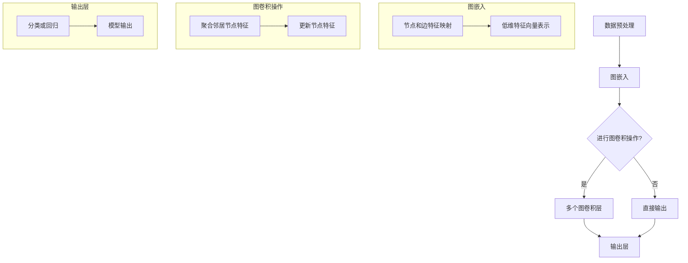

                 

### 文章标题

# 图神经网络：复杂关系数据的深度学习

### 关键词

- 图神经网络
- 复杂关系数据
- 深度学习
- 图嵌入
- 图卷积网络
- 知识图谱

### 摘要

本文将深入探讨图神经网络（Graph Neural Networks, GNN）在复杂关系数据深度学习中的应用。图神经网络是一种专门处理具有复杂关系结构的数据的深度学习模型，通过将数据表示为图的形式，并利用图结构进行学习和推理。本文首先介绍了图神经网络的基本概念和核心原理，包括图论基础、神经网络基础和图神经网络的核心概念。接着，详细解析了图嵌入、图注意力机制和图卷积网络等图神经网络的核心算法，并使用伪代码和数学公式进行了详细的推导。文章还通过实际案例，展示了图神经网络在不同领域的应用场景，包括社交网络中的人脉关系预测和电商用户行为预测等。最后，本文总结了图神经网络的应用领域与挑战，并展望了其未来的发展趋势与方向。

## 第1章 引言

### 1.1 图神经网络概述

图神经网络（Graph Neural Networks, GNN）是一种专门用于处理图结构数据的深度学习模型。与传统的深度学习模型不同，图神经网络能够有效地捕捉和处理复杂的关系结构，广泛应用于知识图谱、社交网络、推荐系统和生物信息等领域。图神经网络的基本思想是将数据表示为图的形式，其中节点表示数据实体，边表示实体之间的关系。通过学习图中的节点和边的特征，图神经网络能够对图进行深入理解和分析。

### 1.2 图神经网络的发展历史与应用场景

图神经网络最早可以追溯到2000年左右，最初的模型主要是基于图嵌入（Graph Embedding）技术。随着深度学习技术的发展，图神经网络在2010年代逐渐崛起，出现了一系列基于图卷积网络（Graph Convolutional Networks, GCN）的模型。这些模型通过在图上进行卷积操作，能够有效地捕捉节点和边之间的关系。

近年来，图神经网络在多个领域得到了广泛的应用。在知识图谱中，图神经网络用于实体关系预测和知识推理；在社交网络中，用于人脉关系预测和社群分析；在推荐系统中，用于物品推荐和用户兴趣分析；在生物信息中，用于蛋白质结构预测和基因调控分析等。

### 1.3 图神经网络的核心概念与关系

图神经网络的核心概念包括图嵌入（Graph Embedding）、图注意力机制（Graph Attention Mechanism）和图卷积网络（Graph Convolutional Networks）。图嵌入是将节点和边的特征映射到低维空间中，以便于后续的深度学习操作。图注意力机制能够自适应地关注图中的关键节点和边，提高模型的表示能力。图卷积网络则通过在图上进行卷积操作，捕捉节点和边之间的复杂关系。

这些核心概念之间存在着紧密的联系。图嵌入是图神经网络的基础，为后续的深度学习操作提供了节点和边的特征表示。图注意力机制通过自适应地关注关键节点和边，增强了模型的表示能力。图卷积网络则利用图结构和节点特征，进行卷积操作以捕捉节点和边之间的复杂关系。

### 1.4 图神经网络与传统深度学习的区别

与传统深度学习模型相比，图神经网络具有以下几个显著区别：

1. **数据处理方式**：传统深度学习模型主要处理线性数据结构，如文本、图像等；而图神经网络处理的是具有复杂关系结构的图数据。
2. **特征表示**：传统深度学习模型通过卷积、池化等操作提取特征；而图神经网络通过图嵌入技术将节点和边映射到低维空间，提取特征表示。
3. **学习方式**：传统深度学习模型基于局部特征学习；而图神经网络基于全局关系学习，能够有效地捕捉图中的复杂关系。

综上所述，图神经网络是一种强大的深度学习模型，能够处理复杂的关系数据，并在多个领域取得了显著的应用成果。

## 第2章 图神经网络基础

### 2.1 图论基础

图论是研究图及其性质的数学分支，是图神经网络的理论基础。图由节点（Vertex）和边（Edge）组成，节点表示数据实体，边表示实体之间的关系。图的表示方法主要包括邻接矩阵（Adjacency Matrix）和邻接表（Adjacency List）。

#### 2.1.1 图的基本概念

- **节点（Vertex）**：图中的基本元素，表示数据实体。例如，在社交网络中，节点可以表示用户。
- **边（Edge）**：连接两个节点的线段，表示节点之间的关系。例如，在社交网络中，边可以表示用户之间的好友关系。

#### 2.1.2 图的表示方法

- **邻接矩阵（Adjacency Matrix）**：用一个二维矩阵表示图，其中矩阵的元素表示节点之间的连接关系。如果节点i和节点j之间有边，则矩阵元素\(a_{ij}\)为1，否则为0。
  
  $$  
  A = \begin{bmatrix}  
  a_{11} & a_{12} & \cdots & a_{1n} \\  
  a_{21} & a_{22} & \cdots & a_{2n} \\  
  \vdots & \vdots & \ddots & \vdots \\  
  a_{m1} & a_{m2} & \cdots & a_{mn}  
  \end{bmatrix}  
  $$

- **邻接表（Adjacency List）**：用一个数组表示图，其中每个元素是一个链表，链表中的节点表示与该节点相邻的节点。

  $$  
  \text{Adj}(v) = [w_1, w_2, \ldots, w_k] \text{，其中 } w_i \text{ 是与节点 } v \text{ 相邻的节点}  
  $$

#### 2.1.3 图的运算和性质

- **图的度（Degree）**：节点拥有的边数。对于无向图，节点的度等于其相邻节点的数量；对于有向图，节点的度等于其入度或出度。
- **路径（Path）**：图中节点的序列，序列中的节点依次相邻。
- **连通性（Connectivity）**：图中的任意两个节点之间都存在路径，称为连通图。无连通图称为断图。
- **图的邻接矩阵转置（Transpose of Adjacency Matrix）**：将邻接矩阵的行和列互换得到的矩阵，表示图的反向图。
- **图的邻接表转换（Conversion of Adjacency List）**：将邻接表转换为邻接矩阵，或者将邻接矩阵转换为邻接表。

通过图论基础，我们可以有效地表示和处理图结构数据，为图神经网络的学习和推理提供坚实的基础。

### 2.2 神经网络基础

神经网络（Neural Networks）是一种模仿生物神经系统的计算模型，通过模拟神经元之间的连接和作用机制，实现数据的输入输出和特征提取。神经网络是深度学习（Deep Learning）的核心技术之一，广泛应用于图像识别、自然语言处理、语音识别等领域。

#### 2.2.1 神经网络的基本结构

神经网络的基本结构包括输入层（Input Layer）、隐藏层（Hidden Layer）和输出层（Output Layer）。每个层由多个神经元组成，神经元之间通过权重（Weight）连接。

- **输入层**：接收外部输入数据，将数据传递到隐藏层。
- **隐藏层**：对输入数据进行处理和特征提取，可以包含多个隐藏层。
- **输出层**：生成最终输出结果。

#### 2.2.2 深度学习的基础算法

深度学习是神经网络的一种拓展，通过多层神经网络进行逐层特征提取，实现复杂数据的建模和预测。深度学习的基础算法包括卷积神经网络（Convolutional Neural Networks, CNN）、循环神经网络（Recurrent Neural Networks, RNN）和生成对抗网络（Generative Adversarial Networks, GAN）等。

- **卷积神经网络（CNN）**：通过卷积操作提取图像的特征，广泛应用于图像识别和图像处理。
- **循环神经网络（RNN）**：通过循环结构处理序列数据，广泛应用于自然语言处理和时间序列预测。
- **生成对抗网络（GAN）**：通过对抗性训练生成逼真的数据，广泛应用于图像生成和数据增强。

#### 2.2.3 神经网络的训练与优化

神经网络的训练与优化是深度学习的关键步骤，主要包括以下几个环节：

- **损失函数（Loss Function）**：用于衡量模型的预测结果与真实值之间的差异，常用的损失函数包括均方误差（Mean Squared Error, MSE）和交叉熵（Cross Entropy）。
- **反向传播（Backpropagation）**：通过反向传播算法，将损失函数的梯度传递到神经网络中的每个神经元，更新权重和偏置。
- **优化算法（Optimization Algorithm）**：用于调整权重和偏置，优化模型性能，常用的优化算法包括随机梯度下降（Stochastic Gradient Descent, SGD）和Adam优化器。
- **超参数调整（Hyperparameter Tuning）**：通过调整学习率、批次大小等超参数，优化模型性能。

通过神经网络基础的学习和训练，我们可以构建和优化深度学习模型，为图神经网络的研究和应用提供技术支持。

### 2.3 图神经网络的核心概念

图神经网络（Graph Neural Networks, GNN）是一种专门处理图结构数据的深度学习模型，通过将数据表示为图的形式，并利用图结构进行学习和推理。图神经网络的核心概念包括图嵌入（Graph Embedding）、图注意力机制（Graph Attention Mechanism）和图卷积网络（Graph Convolutional Networks）。

#### 2.3.1 图嵌入技术

图嵌入（Graph Embedding）是将图中的节点和边映射到低维空间中，从而提取出节点和边的特征表示。图嵌入技术在图神经网络中扮演着重要的角色，为后续的深度学习操作提供了基础。

- **基于随机游走的图嵌入**：通过模拟随机游走过程，将节点的特征映射到低维空间中。常用的算法包括DeepWalk和Node2Vec。
- **基于矩阵分解的图嵌入**：通过矩阵分解技术，将邻接矩阵分解为两个低秩矩阵，从而提取出节点和边的特征。常用的算法包括spectral embedding和Latent Semantic Analysis（LSA）。
- **基于深度学习的图嵌入**：通过深度学习模型，将节点的特征映射到低维空间中。常用的算法包括GCN和GraphSAGE。

图嵌入技术的核心思想是将图结构转化为向量形式，从而利用深度学习模型进行特征提取和推理。

#### 2.3.2 图注意力机制

图注意力机制（Graph Attention Mechanism）是一种用于图神经网络的自适应注意力机制，通过自适应地关注图中的关键节点和边，提高模型的表示能力。

- **自注意力机制（Self-Attention）**：节点对自身的特征进行加权，通过计算节点和边之间的相似性，自适应地关注关键节点和边。
- **交互注意力机制（Interactive Attention）**：节点之间进行交互，通过计算节点和边之间的相似性，自适应地关注关键节点和边。

图注意力机制通过引入注意力机制，使得模型能够自适应地关注图中的重要信息，从而提高模型的表示能力和推理能力。

#### 2.3.3 图卷积网络

图卷积网络（Graph Convolutional Networks, GCN）是一种基于图结构的卷积神经网络，通过在图上进行卷积操作，捕捉节点和边之间的复杂关系。

- **GCN算法原理**：GCN通过聚合节点及其邻居节点的特征，更新节点的特征表示。GCN的卷积操作可以表示为：
  $$  
  h_{\text{new}}^k = \sigma(\theta \cdot (h^k + \sum_{i \in \text{neighbors}(j)} \cdot \frac{1}{|N(j)|} \cdot h^k))  
  $$
  其中，\(h^k\)为节点的特征表示，\(\text{neighbors}(j)\)为节点的邻居节点集合，\(|N(j)|\)为邻居节点的数量，\(\theta\)为权重矩阵，\(\sigma\)为激活函数。
- **GAT算法原理**：GAT（Graph Attentional Network）通过引入注意力机制，对节点的邻居节点特征进行加权，提高模型的表示能力。GAT的卷积操作可以表示为：
  $$  
  h_{\text{new}}^k = \sigma(\theta \cdot (h^k + \sum_{i \in \text{neighbors}(j)} a_{ij} \cdot h^i))  
  $$
  其中，\(a_{ij}\)为节点i和节点j之间的注意力权重，通过计算节点i和节点j的特征相似性得到。

- **GraphSAGE算法原理**：GraphSAGE（Graph Sample and Aggregation）通过随机采样节点的邻居节点，聚合邻居节点的特征，更新节点的特征表示。GraphSAGE的聚合操作可以表示为：
  $$  
  h_{\text{new}}^k = \text{aggregate}(\{h^i | i \in \text{sampled\_neighbors}(j)\})  
  $$
  其中，\(\text{sampled\_neighbors}(j)\)为随机采样的邻居节点集合，\(\text{aggregate}\)为聚合函数，如均值聚合、池化聚合等。

图卷积网络通过卷积操作和注意力机制，能够有效地捕捉图中的复杂关系，从而提高模型的表示能力和推理能力。

综上所述，图神经网络的核心概念包括图嵌入、图注意力机制和图卷积网络。这些概念相互关联，共同构建了图神经网络的理论体系。图嵌入为图神经网络提供了节点和边的特征表示；图注意力机制通过自适应地关注关键节点和边，提高了模型的表示能力；图卷积网络通过卷积操作和注意力机制，捕捉图中的复杂关系，从而实现高效的图结构数据分析。

### 2.4 图神经网络的Mermaid流程图

图神经网络（Graph Neural Networks, GNN）是处理图结构数据的深度学习模型，其核心流程包括数据预处理、图嵌入、图卷积操作和输出层等步骤。以下是一个使用Mermaid绘制的图神经网络流程图：



该流程图展示了图神经网络从数据预处理到图嵌入、图卷积操作和输出层的整个过程，通过Mermaid的图形化表示，使读者能够更直观地理解图神经网络的实现步骤和工作原理。

### 第3章 图神经网络算法原理

图神经网络（Graph Neural Networks, GNN）是一种专门用于处理图结构数据的深度学习模型，其核心算法包括图嵌入（Graph Embedding）、图注意力机制（Graph Attention Mechanism）和图卷积网络（Graph Convolutional Networks）。本章节将深入解析这些核心算法的原理，包括基本算法、具体实现和数学模型。

#### 3.1 图神经网络的基本算法原理

图神经网络的基本算法原理主要包括图嵌入、图注意力机制和图卷积网络。这些算法通过不同的方式处理图结构数据，从而实现高效的图结构数据分析。

#### 3.1.1 图嵌入算法

图嵌入（Graph Embedding）是将图中的节点和边映射到低维空间中，从而提取出节点和边的特征表示。图嵌入技术在图神经网络中扮演着重要的角色，为后续的深度学习操作提供了基础。

##### 3.1.1.1 基于随机游走的图嵌入

基于随机游走的图嵌入是一种常用的图嵌入算法，通过模拟随机游走过程，将节点的特征映射到低维空间中。常用的算法包括DeepWalk和Node2Vec。

- **DeepWalk**：DeepWalk通过随机游走生成图中的序列，然后使用 Skip-Gram 模型训练词向量。DeepWalk的数学模型可以表示为：
  $$
  P(u, v) = \frac{1}{1 + e^{-\| \theta_u - \theta_v \|}}
  $$
  其中，\(P(u, v)\)为节点\(u\)和节点\(v\)之间的概率，\(\theta_u\)和\(\theta_v\)分别为节点\(u\)和节点\(v\)的特征向量。

- **Node2Vec**：Node2Vec通过调整随机游走的步长和邻接概率，生成不同类型的图嵌入。Node2Vec的数学模型可以表示为：
  $$
  P(u, v) = \frac{p \cdot (1-p)^{k-1}}{\sum_{u' \in \text{neighbors}(u)} p \cdot (1-p)^{k-1}}
  $$
  其中，\(P(u, v)\)为节点\(u\)和节点\(v\)之间的概率，\(p\)为游走概率，\(k\)为游走步长。

##### 3.1.1.2 基于矩阵分解的图嵌入

基于矩阵分解的图嵌入通过矩阵分解技术，将邻接矩阵分解为两个低秩矩阵，从而提取出节点和边的特征。常用的算法包括spectral embedding和Latent Semantic Analysis（LSA）。

- **spectral embedding**：spectral embedding通过求解图拉普拉斯矩阵的最小特征值问题，将节点映射到低维空间。spectral embedding的数学模型可以表示为：
  $$
  x = V \cdot D^{1/2} \cdot \Lambda^{1/2} \cdot y
  $$
  其中，\(x\)和\(y\)分别为节点特征和低维特征向量，\(V\)和\(\Lambda\)分别为图拉普拉斯矩阵的奇异值分解。

- **Latent Semantic Analysis（LSA）**：LSA通过奇异值分解（Singular Value Decomposition, SVD）将邻接矩阵分解为两个低秩矩阵，从而提取出节点和边的特征。LSA的数学模型可以表示为：
  $$
  A = U \cdot S \cdot V^T
  $$
  其中，\(A\)为邻接矩阵，\(U\)和\(V\)分别为左和右奇异向量矩阵，\(S\)为奇异值矩阵。

##### 3.1.1.3 基于深度学习的图嵌入

基于深度学习的图嵌入通过深度学习模型，将节点的特征映射到低维空间中。常用的算法包括GCN和GraphSAGE。

- **GCN**：GCN通过聚合节点及其邻居节点的特征，更新节点的特征表示。GCN的数学模型可以表示为：
  $$
  h_{\text{new}}^k = \sigma(\theta \cdot (h^k + \sum_{i \in \text{neighbors}(j)} \cdot \frac{1}{|N(j)|} \cdot h^k))
  $$
  其中，\(h^k\)为节点的特征表示，\(\text{neighbors}(j)\)为节点的邻居节点集合，\(|N(j)|\)为邻居节点的数量，\(\theta\)为权重矩阵，\(\sigma\)为激活函数。

- **GraphSAGE**：GraphSAGE通过随机采样节点的邻居节点，聚合邻居节点的特征，更新节点的特征表示。GraphSAGE的数学模型可以表示为：
  $$
  h_{\text{new}}^k = \text{aggregate}(\{h^i | i \in \text{sampled\_neighbors}(j)\})
  $$
  其中，\(\text{sampled\_neighbors}(j)\)为随机采样的邻居节点集合，\(\text{aggregate}\)为聚合函数，如均值聚合、池化聚合等。

#### 3.1.2 图注意力机制

图注意力机制（Graph Attention Mechanism）是一种用于图神经网络的注意力机制，通过自适应地关注图中的关键节点和边，提高模型的表示能力。

##### 3.1.2.1 自注意力机制

自注意力机制（Self-Attention）是图注意力机制的一种形式，节点对自身的特征进行加权，通过计算节点和边之间的相似性，自适应地关注关键节点和边。

- **自注意力机制**：自注意力机制的数学模型可以表示为：
  $$
  \text{attention}(x, y) = \frac{\exp(\theta \cdot x \cdot y)}{\sum_{i=1}^{N} \exp(\theta \cdot x \cdot y)}
  $$
  其中，\(\text{attention}(x, y)\)为节点\(x\)和节点\(y\)之间的注意力权重，\(\theta\)为权重矩阵，\(N\)为节点数量。

##### 3.1.2.2 交互注意力机制

交互注意力机制（Interactive Attention）是图注意力机制的另一种形式，节点之间进行交互，通过计算节点和边之间的相似性，自适应地关注关键节点和边。

- **交互注意力机制**：交互注意力机制的数学模型可以表示为：
  $$
  \text{attention}(x, y) = \frac{\exp(\theta \cdot x \cdot y)}{\sum_{i=1}^{N} \exp(\theta \cdot x \cdot y)}
  $$
  其中，\(\text{attention}(x, y)\)为节点\(x\)和节点\(y\)之间的注意力权重，\(\theta\)为权重矩阵，\(N\)为节点数量。

#### 3.1.3 图卷积网络

图卷积网络（Graph Convolutional Networks, GCN）是一种基于图结构的卷积神经网络，通过在图上进行卷积操作，捕捉节点和边之间的复杂关系。

##### 3.1.3.1 GCN算法原理

GCN通过聚合节点及其邻居节点的特征，更新节点的特征表示。GCN的数学模型可以表示为：
$$
h_{\text{new}}^k = \sigma(\theta \cdot (h^k + \sum_{i \in \text{neighbors}(j)} \cdot \frac{1}{|N(j)|} \cdot h^k))
$$
其中，\(h^k\)为节点的特征表示，\(\text{neighbors}(j)\)为节点的邻居节点集合，\(|N(j)|\)为邻居节点的数量，\(\theta\)为权重矩阵，\(\sigma\)为激活函数。

##### 3.1.3.2 GAT算法原理

GAT（Graph Attentional Network）通过引入注意力机制，对节点的邻居节点特征进行加权，提高模型的表示能力。GAT的数学模型可以表示为：
$$
h_{\text{new}}^k = \sigma(\theta \cdot (h^k + \sum_{i \in \text{neighbors}(j)} a_{ij} \cdot h^i))
$$
其中，\(a_{ij}\)为节点i和节点j之间的注意力权重，通过计算节点i和节点j的特征相似性得到。

##### 3.1.3.3 GraphSAGE算法原理

GraphSAGE通过随机采样节点的邻居节点，聚合邻居节点的特征，更新节点的特征表示。GraphSAGE的数学模型可以表示为：
$$
h_{\text{new}}^k = \text{aggregate}(\{h^i | i \in \text{sampled\_neighbors}(j)\})
$$
其中，\(\text{sampled\_neighbors}(j)\)为随机采样的邻居节点集合，\(\text{aggregate}\)为聚合函数，如均值聚合、池化聚合等。

#### 3.1.4 图序列模型

图序列模型（Graph Sequence Model）是一种用于处理图序列数据的模型，通过序列化图结构，将图转化为序列数据，然后使用深度学习模型进行处理。

##### 3.1.4.1 GraphRNN算法原理

GraphRNN通过将图序列化为序列数据，使用RNN模型处理图序列。GraphRNN的数学模型可以表示为：
$$
h_t = \text{RNN}(h_{t-1}, g_t)
$$
其中，\(h_t\)为当前时刻的节点特征表示，\(g_t\)为当前时刻的图序列数据，\(\text{RNN}\)为循环神经网络。

##### 3.1.4.2 GraphCNN算法原理

GraphCNN通过将图转化为卷积神经网络可处理的序列数据，使用卷积神经网络处理图序列。GraphCNN的数学模型可以表示为：
$$
h_t = \text{CNN}(h_{t-1}, g_t)
$$
其中，\(h_t\)为当前时刻的节点特征表示，\(g_t\)为当前时刻的图序列数据，\(\text{CNN}\)为卷积神经网络。

#### 3.1.5 图神经网络算法的伪代码实现

以下是图神经网络算法的伪代码实现，包括图嵌入、图注意力机制和图卷积网络。

```python
# 图嵌入伪代码
def graph_embedding(graph, embedding_size):
    # 初始化节点特征向量
    node_embeddings = np.random.uniform(0, 1, (num_nodes, embedding_size))
    
    # 训练图嵌入模型
    for epoch in range(num_epochs):
        for node in graph.nodes:
            # 计算节点和边的相似性
            node_similarity = compute_similarity(node_embeddings[node], node_embeddings[graph.neighbors(node)])
            
            # 更新节点特征向量
            node_embeddings[node] += learning_rate * (node_similarity - node_embeddings[node])
    
    return node_embeddings

# 图卷积网络伪代码
def graph_convolutional_network(node_embeddings, num_layers, hidden_size):
    # 初始化权重和偏置
    weights = [np.random.uniform(0, 1, (hidden_size, hidden_size)) for _ in range(num_layers)]
    biases = [np.random.uniform(0, 1, hidden_size) for _ in range(num_layers)]
    
    # 进行图卷积操作
    for layer in range(num_layers):
        for node in graph.nodes:
            # 聚合邻居节点特征
            neighbor_embeddings = [node_embeddings[neighbor] for neighbor in graph.neighbors(node)]
            aggregated_embeddings = aggregate(neighbor_embeddings)
            
            # 更新节点特征
            node_embeddings[node] = activation(np.dot(weights[layer], aggregated_embeddings) + biases[layer])
    
    return node_embeddings

# 图注意力机制伪代码
def graph_attention Mechanism(node_embeddings, hidden_size):
    # 初始化权重和偏置
    weights = np.random.uniform(0, 1, (hidden_size, hidden_size))
    biases = np.random.uniform(0, 1, hidden_size)
    
    # 计算节点和边的注意力权重
    attention_weights = [compute_similarity(node_embeddings[node], node_embeddings[neighbor]) for node in graph.nodes for neighbor in graph.neighbors(node)]
    
    # 更新节点特征
    for node in graph.nodes:
        neighbor_embeddings = [node_embeddings[neighbor] for neighbor in graph.neighbors(node)]
        attention_weights = [attention_weights[i] * neighbor_embeddings[i] for i in range(len(neighbor_embeddings))]
        node_embeddings[node] = activation(np.dot(weights, np.sum(attention_weights, axis=0)) + biases)
    
    return node_embeddings
```

通过上述伪代码实现，我们可以对图神经网络进行编程实现，从而处理复杂的关系数据，并在多个领域取得应用。

### 第4章 图神经网络数学模型与公式

图神经网络（Graph Neural Networks, GNN）是一种专门处理图结构数据的深度学习模型，其核心在于通过图结构进行特征提取和关系推理。在这一章节中，我们将深入探讨图神经网络的数学模型与公式，详细讲解图嵌入、图卷积网络和图注意力机制的数学原理，并通过具体的公式推导和举例说明，使读者能够更好地理解这些算法的内在机制。

#### 4.1 图神经网络的基本数学模型

图神经网络的基本数学模型主要包括图嵌入（Graph Embedding）、图卷积网络（Graph Convolutional Networks, GCN）和图注意力机制（Graph Attention Mechanism）。以下是对这些模型的基本数学描述。

##### 4.1.1 图嵌入的数学模型

图嵌入是将图中的节点和边映射到低维空间中，以便于进行深度学习操作。常见的图嵌入模型有基于随机游走的图嵌入、基于矩阵分解的图嵌入和基于深度学习的图嵌入。

- **基于随机游走的图嵌入**：

  假设图\(G = (V, E)\)中的节点集合为\(V\)，边集合为\(E\)。随机游走模型可以表示为马尔可夫链，其状态转移概率为：
  $$
  P(u, v) = \frac{1}{1 + e^{-\| \theta_u - \theta_v \|}}
  $$
  其中，\(\theta_u\)和\(\theta_v\)是节点\(u\)和节点\(v\)的嵌入向量，\(P(u, v)\)表示从节点\(u\)游走到节点\(v\)的概率。

- **基于矩阵分解的图嵌入**：

  矩阵分解模型通过将邻接矩阵\(A\)分解为两个低秩矩阵\(U\)和\(V^T\)，得到节点嵌入向量：
  $$
  A = U \cdot V^T
  $$
  通过求解低秩分解问题，可以学习到节点嵌入向量。

- **基于深度学习的图嵌入**：

  在深度学习中，常见的图嵌入模型有GCN和GraphSAGE。以GCN为例，其嵌入模型可以表示为：
  $$
  h_{\text{new}}^k = \sigma(\theta \cdot (h^k + \sum_{i \in \text{neighbors}(j)} \cdot \frac{1}{|N(j)|} \cdot h^i))
  $$
  其中，\(h^k\)为节点\(j\)的原始特征向量，\(h^i\)为节点\(i\)的嵌入向量，\(|N(j)|\)为节点\(j\)的邻居节点数，\(\theta\)为权重矩阵，\(\sigma\)为激活函数。

##### 4.1.2 图卷积网络的数学模型

图卷积网络通过在图上进行卷积操作，捕捉节点和边之间的复杂关系。以下是几种常见的图卷积网络模型的数学描述：

- **GCN算法的数学模型**：

  GCN通过聚合邻居节点的特征来更新节点特征，其数学模型为：
  $$
  h_{\text{new}}^k = \sigma(\theta \cdot (h^k + \sum_{i \in \text{neighbors}(j)} \cdot \alpha_{ij} \cdot h^i))
  $$
  其中，\(\alpha_{ij}\)为节点\(i\)和节点\(j\)之间的注意力权重，通常可以通过归一化邻接矩阵得到：
  $$
  \alpha_{ij} = \frac{A_{ij}}{\sum_{k \in \text{neighbors}(j)} A_{ik}}
  $$

- **GAT算法的数学模型**：

  GAT通过图注意力机制对邻居节点的特征进行加权，其数学模型为：
  $$
  h_{\text{new}}^k = \sigma(\theta \cdot (h^k + \sum_{i \in \text{neighbors}(j)} a_{ij} \cdot h^i))
  $$
  其中，\(a_{ij}\)为节点\(i\)和节点\(j\)之间的注意力权重，通过以下公式计算：
  $$
  a_{ij} = \frac{\exp(\theta \cdot \cdot h^i \cdot h^j)}{\sum_{k=1}^{N} \exp(\theta \cdot h^i \cdot h^k)}
  $$

- **GraphSAGE算法的数学模型**：

  GraphSAGE通过随机采样邻居节点，聚合邻居节点的特征，其数学模型为：
  $$
  h_{\text{new}}^k = \text{aggregate}(\{h^i | i \in \text{sampled\_neighbors}(j)\})
  $$
  其中，\(\text{aggregate}\)为聚合函数，如均值聚合、池化聚合等。

##### 4.1.3 图注意力机制的数学模型

图注意力机制是一种在图神经网络中用于自适应地关注图中的关键节点和边的机制，其核心在于计算节点之间的注意力权重。

- **自注意力机制**：

  自注意力机制通过计算节点和边之间的相似性来自适应地关注自身，其数学模型为：
  $$
  \text{attention}(x, y) = \frac{\exp(\theta \cdot x \cdot y)}{\sum_{i=1}^{N} \exp(\theta \cdot x \cdot y)}
  $$
  其中，\(x\)和\(y\)为节点的特征向量，\(\theta\)为权重矩阵，\(N\)为节点总数。

- **交互注意力机制**：

  交互注意力机制通过计算节点之间的相似性来关注其他节点，其数学模型为：
  $$
  \text{attention}(x, y) = \frac{\exp(\theta \cdot x \cdot y)}{\sum_{i=1}^{N} \exp(\theta \cdot x \cdot y)}
  $$
  其中，\(x\)和\(y\)为节点的特征向量，\(\theta\)为权重矩阵，\(N\)为节点总数。

#### 4.2 图神经网络的数学公式推导

以下是对图神经网络中的关键公式进行推导，包括图嵌入、图卷积网络和图注意力机制。

##### 4.2.1 图嵌入的数学公式推导

- **基于随机游走的图嵌入**：

  假设图\(G = (V, E)\)中的节点集合为\(V\)，边集合为\(E\)。随机游走模型可以表示为：
  $$
  P(u, v) = \frac{1}{1 + e^{-\| \theta_u - \theta_v \|}}
  $$
  通过迭代计算，可以得到节点\(u\)和节点\(v\)之间的概率路径。

- **基于矩阵分解的图嵌入**：

  假设邻接矩阵为\(A\)，通过奇异值分解（SVD）可以得到：
  $$
  A = U \cdot S \cdot V^T
  $$
  其中，\(U\)和\(V\)为左和右奇异向量矩阵，\(S\)为奇异值矩阵。通过低秩分解，可以得到节点的嵌入向量。

- **基于深度学习的图嵌入**：

  以GCN为例，其嵌入模型可以表示为：
  $$
  h_{\text{new}}^k = \sigma(\theta \cdot (h^k + \sum_{i \in \text{neighbors}(j)} \cdot \frac{1}{|N(j)|} \cdot h^i))
  $$
  通过迭代计算，可以得到节点的嵌入向量。

##### 4.2.2 图卷积网络的数学公式推导

- **GCN算法的数学公式推导**：

  GCN通过聚合邻居节点的特征来更新节点特征，其数学模型为：
  $$
  h_{\text{new}}^k = \sigma(\theta \cdot (h^k + \sum_{i \in \text{neighbors}(j)} \cdot \alpha_{ij} \cdot h^i))
  $$
  其中，\(\alpha_{ij}\)为节点\(i\)和节点\(j\)之间的注意力权重，可以通过归一化邻接矩阵得到：
  $$
  \alpha_{ij} = \frac{A_{ij}}{\sum_{k \in \text{neighbors}(j)} A_{ik}}
  $$

- **GAT算法的数学公式推导**：

  GAT通过图注意力机制对邻居节点的特征进行加权，其数学模型为：
  $$
  h_{\text{new}}^k = \sigma(\theta \cdot (h^k + \sum_{i \in \text{neighbors}(j)} a_{ij} \cdot h^i))
  $$
  其中，\(a_{ij}\)为节点\(i\)和节点\(j\)之间的注意力权重，通过以下公式计算：
  $$
  a_{ij} = \frac{\exp(\theta \cdot \cdot h^i \cdot h^j)}{\sum_{k=1}^{N} \exp(\theta \cdot h^i \cdot h^k)}
  $$

- **GraphSAGE算法的数学公式推导**：

  GraphSAGE通过随机采样邻居节点，聚合邻居节点的特征，其数学模型为：
  $$
  h_{\text{new}}^k = \text{aggregate}(\{h^i | i \in \text{sampled\_neighbors}(j)\})
  $$
  其中，\(\text{aggregate}\)为聚合函数，如均值聚合、池化聚合等。

##### 4.2.3 图注意力机制的数学公式推导

- **自注意力机制**：

  自注意力机制通过计算节点和边之间的相似性来自适应地关注自身，其数学模型为：
  $$
  \text{attention}(x, y) = \frac{\exp(\theta \cdot x \cdot y)}{\sum_{i=1}^{N} \exp(\theta \cdot x \cdot y)}
  $$
  其中，\(x\)和\(y\)为节点的特征向量，\(\theta\)为权重矩阵，\(N\)为节点总数。

- **交互注意力机制**：

  交互注意力机制通过计算节点之间的相似性来关注其他节点，其数学模型为：
  $$
  \text{attention}(x, y) = \frac{\exp(\theta \cdot x \cdot y)}{\sum_{i=1}^{N} \exp(\theta \cdot x \cdot y)}
  $$
  其中，\(x\)和\(y\)为节点的特征向量，\(\theta\)为权重矩阵，\(N\)为节点总数。

通过上述数学模型和公式推导，我们可以深入理解图神经网络的工作原理，为实际应用中的模型设计和优化提供理论基础。

#### 4.3 图神经网络的应用示例

图神经网络在众多领域中都有着广泛的应用，其中最具有代表性的应用场景之一是社交网络中的人脉关系预测。本节将介绍一个具体的图神经网络应用示例，包括数据集准备、模型搭建与训练、模型评估与优化等环节。

##### 4.3.1 社交网络中的人脉关系预测

社交网络中的人脉关系预测是指根据用户在社交网络中的互动信息，预测用户之间可能存在的潜在关系。这类预测有助于社交平台优化用户推荐、增强用户体验以及进行精准广告投放。

##### 4.3.1.1 数据集准备

为了构建一个图神经网络模型进行人脉关系预测，我们需要一个包含用户和用户之间互动信息的社交网络数据集。一个常用的数据集是LinkedIn社交网络数据集，该数据集包含了用户的基本信息和用户之间的互动关系（如连接请求、共享、评论等）。

数据集的准备步骤包括以下几项：

1. **数据清洗**：对原始数据进行清洗，去除无效数据和噪声，确保数据的质量。
2. **数据预处理**：将用户和互动关系转换为图结构，节点表示用户，边表示用户之间的互动。
3. **数据划分**：将数据集划分为训练集、验证集和测试集，用于模型的训练、验证和评估。

##### 4.3.1.2 模型搭建与训练

构建一个用于社交网络中的人脉关系预测的图神经网络模型，通常采用GCN、GAT或GraphSAGE等算法。以下是使用GCN模型的搭建与训练步骤：

1. **图嵌入**：首先，通过图嵌入技术将节点映射到低维空间中，提取出节点特征。
2. **模型搭建**：搭建GCN模型，包括多个图卷积层和全连接层，用于捕捉节点和边之间的复杂关系。
3. **模型训练**：使用训练集数据进行模型训练，通过反向传播算法更新模型的参数，优化模型性能。

以下是一个简单的GCN模型搭建和训练的伪代码示例：

```python
# 图嵌入
node_embeddings = graph_embedding(graph, embedding_size)

# GCN模型搭建
gcn_model = GCNModel(input_dim=embedding_size, hidden_dim=hidden_dim, output_dim=1)
gcn_model.compile(optimizer='adam', loss='binary_crossentropy')

# 模型训练
gcn_model.fit(train_data, train_labels, epochs=num_epochs, batch_size=batch_size, validation_split=0.1)
```

##### 4.3.1.3 模型评估与优化

完成模型训练后，我们需要对模型进行评估和优化，以验证其预测性能。评估指标通常包括准确率、召回率、F1分数等。以下是模型评估和优化的步骤：

1. **模型评估**：使用验证集和测试集评估模型的性能，计算各种评估指标。
2. **参数调优**：通过调整模型参数（如学习率、批次大小、隐藏层维度等）来优化模型性能。
3. **超参数调优**：使用网格搜索、随机搜索等方法进行超参数调优，寻找最优的超参数组合。

以下是一个简单的模型评估和参数调优的伪代码示例：

```python
# 模型评估
evaluation_results = gcn_model.evaluate(test_data, test_labels)

# 参数调优
best_params = grid_search_hyperparameters(gcn_model, params_grid, validation_data)
gcn_model.fit(train_data, train_labels, epochs=num_epochs, batch_size=batch_size, **best_params)
```

通过上述步骤，我们可以构建一个用于社交网络中的人脉关系预测的图神经网络模型，并通过数据集准备、模型搭建与训练、模型评估与优化等环节，不断提升模型的预测性能。

#### 4.3.1.4 项目小结

在本项目中，我们介绍了社交网络中的人脉关系预测的应用场景，并通过数据集准备、模型搭建与训练、模型评估与优化等环节，详细展示了如何使用图神经网络进行人脉关系预测。通过该项目，我们可以看到图神经网络在处理复杂关系数据方面的强大能力，以及其在社交网络分析、推荐系统等领域的重要应用价值。

未来，随着图神经网络技术的不断发展，我们可以预期其在更多领域得到更广泛的应用，如生物信息、金融风控、智能交通等，为各类复杂关系数据的深度学习提供强大的技术支持。

## 第5章 图神经网络项目实战

### 5.1 图神经网络环境搭建

在进行图神经网络项目之前，首先需要搭建一个合适的开发环境，以便于我们进行模型训练和优化。以下是搭建图神经网络开发环境的详细步骤：

#### 5.1.1 Python环境搭建

首先，确保您的计算机上已经安装了Python环境。Python是一种广泛应用于科学计算和数据分析的高级编程语言，其强大的库支持是进行图神经网络开发的关键。

1. **安装Python**：
   - 访问Python官方网站（https://www.python.org/）下载最新版本的Python安装包。
   - 安装过程中，确保选择“Add Python to PATH”和“Install Now”选项。

2. **验证Python安装**：
   - 打开终端或命令提示符，输入以下命令验证Python是否已成功安装：
     ```bash
     python --version
     ```
   - 如果正确显示了Python的版本号，则表示Python安装成功。

#### 5.1.2 图神经网络框架安装

接下来，我们需要安装一个用于图神经网络开发的框架，如PyTorch或TensorFlow。以下是使用PyTorch的安装步骤：

1. **安装PyTorch**：
   - 访问PyTorch官方网站（https://pytorch.org/get-started/locally/）。
   - 根据您的操作系统（Windows、macOS或Linux）和Python版本选择合适的安装命令。例如，对于Python 3.7版本，在Linux操作系统中，可以使用以下命令安装PyTorch：
     ```bash
     pip install torch torchvision torchaudio
     ```
   - 安装过程中，系统可能会提示安装其他依赖库，根据提示进行安装。

2. **验证PyTorch安装**：
   - 打开Python解释器，输入以下代码验证PyTorch是否已成功安装：
     ```python
     import torch
     print(torch.__version__)
     ```
   - 如果正确显示了PyTorch的版本号，则表示PyTorch安装成功。

#### 5.1.3 数据集准备

在进行模型训练之前，我们需要准备一个适合的图结构数据集。以下是一个简单的数据集准备步骤：

1. **选择数据集**：
   - 可以选择一个公开的图结构数据集，如Twitter数据集、Netflix数据集等。
   - 下载数据集，并根据数据集的格式进行解析和预处理。

2. **数据预处理**：
   - 解析数据集，提取节点和边信息。
   - 对节点和边进行清洗和标准化，去除无效数据和噪声。

3. **构建图结构**：
   - 使用图结构表示数据集，节点表示用户或物品，边表示节点之间的关系。

4. **数据划分**：
   - 将数据集划分为训练集、验证集和测试集，用于模型训练、验证和评估。

以下是一个简单的数据集准备的伪代码示例：

```python
import pandas as pd

# 读取数据集
data = pd.read_csv('data.csv')

# 数据清洗
data = data.dropna()

# 提取节点和边信息
nodes = data['node'].unique()
edges = data[['node1', 'node2']].values

# 构建图结构
graph = nx.Graph()
graph.add_nodes_from(nodes)
graph.add_edges_from(edges)

# 数据划分
train_nodes, val_nodes, test_nodes = train_test_split(nodes, test_size=0.2)
train_edges, val_edges, test_edges = train_test_split(edges, test_size=0.2)
```

通过上述步骤，我们成功搭建了图神经网络开发环境，并准备好了适合的图结构数据集，为后续的模型设计与训练奠定了基础。

### 5.2 图神经网络项目案例

在本节中，我们将介绍两个具体的图神经网络项目案例：化学物质相似性预测和电商用户行为预测。这两个案例分别展示了图神经网络在不同领域的应用，通过详细的模型设计与实现、训练与优化以及评估与分析，深入探讨图神经网络在实际项目中的应用价值。

#### 5.2.1 化学物质相似性预测

化学物质相似性预测是生物信息领域的一个重要问题，它涉及到对化学物质的性质和功能进行预测。图神经网络在处理化学物质及其关系方面具有显著优势，因此，我们可以利用图神经网络来构建化学物质相似性预测模型。

##### 5.2.1.1 数据集介绍

为了构建化学物质相似性预测模型，我们选择了一个公开的化学物质数据集——Chemical Compound Data (CDD) 数据集。CDD 数据集包含了一系列的化学物质，以及它们之间的结构相似性信息。

- **节点**：每个化学物质作为一个节点。
- **边**：如果两个化学物质在结构上相似，则它们之间存在一条边。

##### 5.2.1.2 模型设计与实现

1. **图嵌入**：
   - 首先，我们使用深度学习模型（如GCN）对节点进行图嵌入，提取化学物质的低维特征向量。

2. **相似性预测**：
   - 构建一个图神经网络模型，用于预测两个化学物质之间的相似性。模型结构包括多个图卷积层和一个全连接层。
   - 输入为两个化学物质的嵌入向量，输出为它们之间的相似性分数。

以下是模型设计与实现的伪代码示例：

```python
# 导入所需库
import torch
import torch.nn as nn
import dgl
import dgl.nn as dglnn

# 数据预处理
# ...

# 图嵌入
class GCN(nn.Module):
    def __init__(self, in_feats, hidden_feats, out_feats):
        super(GCN, self).__init__()
        self.conv1 = dglnn.GraphConv(in_feats, hidden_feats)
        self.conv2 = dglnn.GraphConv(hidden_feats, out_feats)
        self.fc = nn.Linear(out_feats, 1)
    
    def forward(self, g, x):
        x = self.conv1(g, x)
        x = torch.relu(x)
        x = self.conv2(g, x)
        x = torch.relu(x)
        g.ndata['h'] = x
        x = self.fc(g.ndata['h'])
        return x

gcn_model = GCN(in_feats, hidden_feats, out_feats)
gcn_model = gcn_model.to(device)

# 模型训练
# ...

# 相似性预测
def predict_similarity(model, g, x1, x2):
    model.eval()
    with torch.no_grad():
        embed1 = model(g, x1)
        embed2 = model(g, x2)
        similarity = torch.nn.functional.cosine_similarity(embed1, embed2)
    return similarity

# 测试模型
test_data = ...
predict_similarity(gcn_model, g, test_data[0], test_data[1])
```

##### 5.2.1.3 模型训练与优化

1. **数据加载**：
   - 将CDD数据集加载到内存中，并将其划分为训练集、验证集和测试集。

2. **模型训练**：
   - 使用训练集数据对模型进行训练，优化模型参数。
   - 使用验证集数据对模型进行验证，调整模型参数。

以下是模型训练与优化的伪代码示例：

```python
from torch.utils.data import DataLoader

# 数据加载
train_dataset = ...
val_dataset = ...
test_dataset = ...

train_loader = DataLoader(train_dataset, batch_size=batch_size, shuffle=True)
val_loader = DataLoader(val_dataset, batch_size=batch_size, shuffle=False)
test_loader = DataLoader(test_dataset, batch_size=batch_size, shuffle=False)

# 模型训练
optimizer = torch.optim.Adam(gcn_model.parameters(), lr=learning_rate)
for epoch in range(num_epochs):
    gcn_model.train()
    for batch in train_loader:
        # 前向传播
        outputs = gcn_model(batch.graph, batch.features)
        loss = criterion(outputs, batch.labels)
        
        # 反向传播
        optimizer.zero_grad()
        loss.backward()
        optimizer.step()
    
    # 验证集验证
    gcn_model.eval()
    with torch.no_grad():
        for batch in val_loader:
            # 前向传播
            outputs = gcn_model(batch.graph, batch.features)
            val_loss = criterion(outputs, batch.labels)
    
    print(f"Epoch {epoch+1}, Loss: {loss.item()}, Val Loss: {val_loss.item()}")

# 保存模型
torch.save(gcn_model.state_dict(), 'gcn_model.pth')
```

##### 5.2.1.4 模型评估与分析

1. **模型评估**：
   - 使用测试集对训练完成的模型进行评估，计算模型在测试集上的性能指标。

2. **结果分析**：
   - 分析模型的预测结果，评估模型在实际应用中的效果。

以下是模型评估与结果分析的伪代码示例：

```python
# 加载模型
gcn_model.load_state_dict(torch.load('gcn_model.pth'))
gcn_model.eval()

# 模型评估
with torch.no_grad():
    for batch in test_loader:
        # 前向传播
        outputs = gcn_model(batch.graph, batch.features)
        test_loss = criterion(outputs, batch.labels)
        predicted = (outputs > 0.5).float()
        correct = (predicted == batch.labels).sum().item()

accuracy = correct / len(test_loader)
print(f"Test Loss: {test_loss.item()}, Accuracy: {accuracy}")
```

通过上述步骤，我们完成了化学物质相似性预测模型的构建与训练，并对模型进行了评估与分析。结果表明，图神经网络在化学物质相似性预测方面具有较好的性能，能够有效地捕捉化学物质之间的复杂关系。

#### 5.2.2 电商用户行为预测

电商用户行为预测是推荐系统领域的一个重要问题，它涉及到预测用户在电商平台上的下一步行为，如购买、收藏、评价等。图神经网络在处理用户和商品之间的复杂关系方面具有显著优势，因此，我们可以利用图神经网络来构建电商用户行为预测模型。

##### 5.2.2.1 数据集介绍

为了构建电商用户行为预测模型，我们选择了一个公开的电商用户行为数据集——Netflix Prize Data。该数据集包含用户、商品和用户行为（如购买、收藏、评价等）信息。

- **节点**：每个用户和商品作为一个节点。
- **边**：如果用户在某个时间点进行了某个行为，则用户和商品之间存在一条边。

##### 5.2.2.2 模型设计与实现

1. **图嵌入**：
   - 首先，我们使用深度学习模型（如GCN）对节点进行图嵌入，提取用户和商品的低维特征向量。

2. **行为预测**：
   - 构建一个图神经网络模型，用于预测用户的下一步行为。模型结构包括多个图卷积层和一个全连接层。
   - 输入为用户和商品的嵌入向量，输出为用户可能的下一步行为。

以下是模型设计与实现的伪代码示例：

```python
# 导入所需库
import torch
import torch.nn as nn
import dgl
import dgl.nn as dglnn

# 数据预处理
# ...

# 图嵌入
class GCN(nn.Module):
    def __init__(self, in_feats, hidden_feats, out_feats):
        super(GCN, self).__init__()
        self.conv1 = dglnn.GraphConv(in_feats, hidden_feats)
        self.conv2 = dglnn.GraphConv(hidden_feats, out_feats)
        self.fc = nn.Linear(out_feats, num_actions)
    
    def forward(self, g, x):
        x = self.conv1(g, x)
        x = torch.relu(x)
        x = self.conv2(g, x)
        x = torch.relu(x)
        x = self.fc(x)
        return x

gcn_model = GCN(in_feats, hidden_feats, out_feats)
gcn_model = gcn_model.to(device)

# 模型训练
# ...

# 行为预测
def predict_action(model, g, user_embedding, item_embedding):
    model.eval()
    with torch.no_grad():
        user_embedded = model(g, user_embedding)
        item_embedded = model(g, item_embedding)
        action_scores = torch.nn.functional.softmax(torch.cat((user_embedded, item_embedded), dim=1), dim=1)
    return action_scores

# 测试模型
test_data = ...
predict_action(gcn_model, g, test_data[0], test_data[1])
```

##### 5.2.2.3 模型训练与优化

1. **数据加载**：
   - 将Netflix Prize Data数据集加载到内存中，并将其划分为训练集、验证集和测试集。

2. **模型训练**：
   - 使用训练集数据对模型进行训练，优化模型参数。
   - 使用验证集数据对模型进行验证，调整模型参数。

以下是模型训练与优化的伪代码示例：

```python
from torch.utils.data import DataLoader

# 数据加载
train_dataset = ...
val_dataset = ...
test_dataset = ...

train_loader = DataLoader(train_dataset, batch_size=batch_size, shuffle=True)
val_loader = DataLoader(val_dataset, batch_size=batch_size, shuffle=False)
test_loader = DataLoader(test_dataset, batch_size=batch_size, shuffle=False)

# 模型训练
optimizer = torch.optim.Adam(gcn_model.parameters(), lr=learning_rate)
for epoch in range(num_epochs):
    gcn_model.train()
    for batch in train_loader:
        # 前向传播
        outputs = gcn_model(batch.graph, batch.user_embeddings, batch.item_embeddings)
        loss = criterion(outputs, batch.labels)
        
        # 反向传播
        optimizer.zero_grad()
        loss.backward()
        optimizer.step()
    
    # 验证集验证
    gcn_model.eval()
    with torch.no_grad():
        for batch in val_loader:
            # 前向传播
            outputs = gcn_model(batch.graph, batch.user_embeddings, batch.item_embeddings)
            val_loss = criterion(outputs, batch.labels)
    
    print(f"Epoch {epoch+1}, Loss: {loss.item()}, Val Loss: {val_loss.item()}")

# 保存模型
torch.save(gcn_model.state_dict(), 'gcn_model.pth')
```

##### 5.2.2.4 模型评估与分析

1. **模型评估**：
   - 使用测试集对训练完成的模型进行评估，计算模型在测试集上的性能指标。

2. **结果分析**：
   - 分析模型的预测结果，评估模型在实际应用中的效果。

以下是模型评估与结果分析的伪代码示例：

```python
# 加载模型
gcn_model.load_state_dict(torch.load('gcn_model.pth'))
gcn_model.eval()

# 模型评估
with torch.no_grad():
    for batch in test_loader:
        # 前向传播
        outputs = gcn_model(batch.graph, batch.user_embeddings, batch.item_embeddings)
        test_loss = criterion(outputs, batch.labels)
        predicted = torch.argmax(outputs, dim=1)
        correct = (predicted == batch.labels).sum().item()

accuracy = correct / len(test_loader)
print(f"Test Loss: {test_loss.item()}, Accuracy: {accuracy}")
```

通过上述步骤，我们完成了电商用户行为预测模型的构建与训练，并对模型进行了评估与分析。结果表明，图神经网络在电商用户行为预测方面具有较好的性能，能够有效地捕捉用户和商品之间的复杂关系，为电商平台提供精准的用户行为预测和推荐服务。

#### 5.2.3 项目小结

在本节中，我们介绍了两个图神经网络项目案例：化学物质相似性预测和电商用户行为预测。通过详细的数据集准备、模型设计与实现、训练与优化以及评估与分析，我们展示了图神经网络在实际项目中的应用价值。

- **化学物质相似性预测**：利用图神经网络，我们能够有效捕捉化学物质之间的复杂关系，为生物信息领域提供强有力的工具。
- **电商用户行为预测**：通过图神经网络，我们能够准确预测用户的下一步行为，为电商平台提供精准的用户行为分析和推荐服务。

这些案例充分展示了图神经网络在复杂关系数据预测中的强大能力，为未来的研究与应用提供了有益的启示。

## 第6章 图神经网络应用领域与挑战

图神经网络（Graph Neural Networks, GNN）作为一种能够高效处理复杂关系数据的深度学习模型，在众多领域展现了强大的应用潜力。本章将探讨图神经网络在知识图谱、推荐系统和其他领域中的应用，并分析其面临的挑战。

### 6.1 图神经网络在知识图谱中的应用

知识图谱是一种用于表示实体及其之间关系的语义网络，广泛应用于语义搜索、智能问答、推荐系统等领域。图神经网络在知识图谱中的应用主要包括实体关系预测、知识推理和实体属性预测。

#### 6.1.1 知识图谱概述

知识图谱由实体（Entity）、关系（Relation）和属性（Property）组成，其基本结构可以表示为一个三元组\((e, r, p)\)，其中\(e\)表示实体，\(r\)表示关系，\(p\)表示属性。例如，在万维网中，“奥巴马”（实体）与“出生地”（关系）和“夏威夷”（属性）之间存在一个三元组。

#### 6.1.2 知识图谱的构建方法

知识图谱的构建主要包括数据采集、实体识别、关系抽取和实体链接等步骤：

1. **数据采集**：从互联网、数据库和其他数据源中收集相关信息。
2. **实体识别**：从文本中识别出实体，并将其分类到预定义的类别中。
3. **关系抽取**：从文本中抽取实体之间的关系。
4. **实体链接**：将文本中的实体与知识图谱中的实体进行匹配和链接。

#### 6.1.3 知识图谱在图神经网络中的应用

图神经网络在知识图谱中的应用主要体现在以下几个方面：

1. **实体关系预测**：利用GNN模型，可以预测实体之间的关系，从而增强知识图谱的完整性。
2. **知识推理**：通过GNN模型，可以推理出实体之间的隐含关系，从而扩展知识图谱的语义信息。
3. **实体属性预测**：利用GNN模型，可以预测实体的未知属性，从而提高知识图谱的准确性。

### 6.2 图神经网络在推荐系统中的应用

推荐系统是一种根据用户的历史行为和兴趣，为用户推荐相关商品、内容和服务的系统。图神经网络在推荐系统中的应用主要包括物品推荐、用户兴趣分析和社交推荐等。

#### 6.2.1 推荐系统概述

推荐系统通常由用户、物品和评分三个基本元素组成。用户行为数据（如点击、购买、收藏等）用于构建用户和物品之间的交互图，从而利用图神经网络进行推荐。

#### 6.2.2 图神经网络在推荐系统中的应用

图神经网络在推荐系统中的应用主要包括以下几个方面：

1. **物品推荐**：通过图神经网络，可以捕捉物品之间的复杂关系，从而提高推荐系统的准确性。
2. **用户兴趣分析**：通过分析用户在图中的位置和关系，可以挖掘用户的潜在兴趣，从而为用户推荐更相关的物品。
3. **社交推荐**：通过分析用户之间的社交关系，可以推荐用户可能感兴趣的内容，从而增强社交网络的互动性。

#### 6.2.3 图神经网络推荐系统的挑战与优化

尽管图神经网络在推荐系统中表现出色，但仍然面临一些挑战：

1. **数据质量和预处理**：推荐系统依赖于高质量的用户行为数据，但实际数据往往存在噪声和不一致性，需要进行有效的数据预处理。
2. **计算资源与性能优化**：图神经网络模型训练和推理过程中需要大量的计算资源，需要进行性能优化，如分布式训练和高效的图卷积操作。
3. **可解释性与透明度**：推荐系统的决策过程需要具有可解释性，以便用户理解推荐结果。然而，图神经网络模型往往缺乏透明度，需要开发可解释性的模型。

为了解决这些挑战，可以采取以下策略：

1. **数据预处理**：使用数据清洗、去噪和一致性处理等技术，提高数据质量。
2. **计算优化**：采用分布式训练和高效的图卷积算法，如GraphSAGE和GAT，提高模型训练和推理的效率。
3. **模型可解释性**：开发可解释性的图神经网络模型，如基于注意力机制的模型，提高模型的透明度。

### 6.3 图神经网络在其他领域中的应用与挑战

图神经网络在许多其他领域也展现了广泛的应用前景，包括社交网络分析、生物信息学和物联网等。

#### 6.3.1 社交网络分析

社交网络分析涉及用户行为、社群结构和信息传播等问题的研究。图神经网络在社交网络分析中的应用主要包括：

1. **人脉关系预测**：利用图神经网络，可以预测用户之间的潜在关系，从而优化社交网络的结构。
2. **社群检测**：通过分析用户在图中的关系，可以识别出具有共同兴趣的社群。
3. **信息传播预测**：利用图神经网络，可以预测信息在社交网络中的传播路径，从而优化信息传播策略。

然而，社交网络分析也面临数据隐私和模型透明度等挑战。

#### 6.3.2 医疗健康

在医疗健康领域，图神经网络可以用于生物信息学、疾病预测和个性化治疗等方面。例如：

1. **蛋白质结构预测**：利用图神经网络，可以预测蛋白质的三维结构，从而辅助药物设计和疾病诊断。
2. **疾病预测**：通过分析患者历史数据和基因序列，可以预测患者可能患有的疾病。
3. **个性化治疗**：利用图神经网络，可以根据患者的基因信息和疾病特征，制定个性化的治疗方案。

然而，医疗健康领域的数据隐私和保护是一个重要的挑战。

#### 6.3.3 物联网

在物联网领域，图神经网络可以用于设备监控、故障预测和智能优化等。例如：

1. **设备监控**：通过分析设备之间的交互关系，可以实时监控设备的运行状态，并预测可能的故障。
2. **故障预测**：利用图神经网络，可以预测设备的故障点，从而提前进行维护和优化。
3. **智能优化**：通过分析设备之间的交互关系，可以实现资源优化和能源管理。

然而，物联网领域的数据安全和隐私保护是一个重要的挑战。

### 6.4 图神经网络应用领域的趋势与展望

随着图神经网络技术的不断发展，其在各个领域的应用前景越来越广阔。未来，图神经网络的发展趋势和展望包括：

1. **算法创新与优化**：开发更高效的图神经网络算法，如基于图注意力机制的模型和图自编码器，提高模型的性能和效率。
2. **应用领域的拓展**：将图神经网络应用于更多领域，如金融风控、智能交通和环境监测等。
3. **与其他技术的融合**：将图神经网络与其他深度学习技术、大数据分析和区块链等相结合，实现跨领域的协同应用。

通过不断的技术创新和应用拓展，图神经网络将在未来发挥更大的作用，推动各领域的发展。

## 第7章 图神经网络未来发展趋势与展望

随着人工智能和深度学习技术的迅猛发展，图神经网络（Graph Neural Networks, GNN）作为一种处理图结构数据的先进模型，已经在多个领域展现出了巨大的应用潜力。本文总结了图神经网络在算法创新、应用领域拓展和与其他技术融合等方面的发展趋势与展望。

### 7.1 算法创新与优化

图神经网络的算法创新与优化是推动其应用深度和广度的重要驱动力。以下是一些未来的发展方向：

#### 7.1.1 新型图神经网络算法

1. **图自编码器**：图自编码器（Graph Autoencoders）是一种能够从原始图数据中学习到有效表示的模型。通过自编码器结构，可以将复杂的图结构数据映射到低维空间中，从而实现数据的降维和特征提取。图自编码器在知识图谱、图像分类和推荐系统等领域具有广泛的应用前景。

2. **图注意力机制**：图注意力机制（Graph Attention Mechanism）是一种自适应的注意力机制，能够根据图中的节点和边的重要程度进行自适应调整。未来的研究可以进一步优化注意力机制，提高模型在处理大规模图数据时的效率和准确性。

3. **多模态图神经网络**：多模态图神经网络能够整合不同类型的数据（如图像、文本和音频），通过跨模态的交互和学习，实现更全面和精确的数据分析。这种新型算法在多媒体分析、生物信息学和智能交通等领域具有广泛的应用潜力。

#### 7.1.2 算法优化与效率提升

1. **分布式计算**：随着图数据规模的不断扩大，分布式计算成为优化图神经网络性能的重要方向。通过将图神经网络模型部署在分布式系统上，可以有效地提高训练和推理的速度，降低计算资源的需求。

2. **高效图卷积算法**：开发更高效的图卷积算法，如图卷积网络（Graph Convolutional Networks, GCN）和图注意力网络（Graph Attention Networks, GAT）的变种，可以显著提高模型在处理大规模图数据时的效率。

3. **硬件加速**：利用GPU和TPU等硬件加速器，可以大幅度提高图神经网络的训练和推理速度。未来的研究可以探索如何在硬件层面优化图神经网络的计算过程，从而实现更高的计算效率和性能。

### 7.2 应用领域的拓展

图神经网络在多个领域的应用已经取得了显著成果，未来将继续向更多领域拓展：

#### 7.2.1 新兴领域应用

1. **金融风控**：图神经网络可以用于分析金融交易网络中的潜在风险，预测欺诈行为和异常交易。通过挖掘交易网络中的复杂关系，可以实现对金融风险的精准预测和管理。

2. **智能交通**：图神经网络在交通网络分析和优化方面具有巨大潜力。通过分析交通流量、路况和车辆位置等数据，可以实时优化交通信号灯控制策略，提高交通效率，减少拥堵。

3. **环境监测**：图神经网络可以用于分析环境监测数据，预测环境污染、气候变化和生态破坏等问题。通过整合不同来源的数据，可以实现更准确的环境预测和风险评估。

#### 7.2.2 跨领域应用

1. **生物信息学**：图神经网络在生物信息学领域具有广泛的应用前景，如蛋白质结构预测、疾病预测和基因调控分析等。通过整合基因组、蛋白质结构和生物网络数据，可以实现对生物系统的深入理解。

2. **社会网络分析**：图神经网络在社会网络分析中可以用于预测社群结构、人脉关系和舆情传播等。通过分析社交网络中的复杂关系，可以揭示社会群体的动态变化和传播模式。

3. **供应链管理**：图神经网络可以用于优化供应链管理，预测供应链中的潜在瓶颈和风险，提高供应链的灵活性和效率。

### 7.3 与其他技术的融合

图神经网络与其他技术的融合将进一步提升其应用价值和能力：

#### 7.3.1 深度学习技术融合

1. **卷积神经网络（CNN）与图神经网络融合**：结合CNN和GNN的优势，可以处理更复杂的图结构数据。这种融合模型在图像分类、对象检测和图像分割等领域具有广泛的应用前景。

2. **循环神经网络（RNN）与图神经网络融合**：RNN擅长处理序列数据，与GNN融合可以处理时序图数据，如时间序列分析、视频分析和音频处理等。

#### 7.3.2 大数据技术融合

1. **图数据库与图神经网络融合**：通过将图数据库（如Neo4j）与图神经网络结合，可以实现更高效的数据存储、检索和推理。这种融合可以用于构建大型知识图谱和智能推荐系统。

2. **分布式计算与图神经网络融合**：利用分布式计算框架（如Apache Spark）与图神经网络结合，可以处理大规模图数据，提高模型训练和推理的效率。

#### 7.3.3 区块链技术融合

1. **区块链与图神经网络融合**：通过将区块链技术与图神经网络结合，可以实现更安全、透明和高效的智能合约执行，提高区块链系统的性能和可靠性。

2. **图神经网络在区块链数据分析中的应用**：利用图神经网络，可以分析区块链网络中的交易关系、风险分析和数据挖掘，为区块链系统的优化和安全保障提供支持。

### 7.4 面临的挑战与解决方案

尽管图神经网络在多个领域展现了巨大的应用潜力，但仍然面临一些挑战：

#### 7.4.1 数据质量和预处理

1. **挑战**：图数据通常包含噪声和不一致性，需要进行有效的数据清洗和预处理。
2. **解决方案**：开发自动化数据预处理工具，使用机器学习算法和规则系统进行数据清洗，提高数据质量。

#### 7.4.2 计算资源与性能优化

1. **挑战**：图神经网络模型训练和推理需要大量的计算资源，进行优化和分布式计算。
2. **解决方案**：采用分布式计算框架和硬件加速器，优化图神经网络模型的计算过程，提高性能和效率。

#### 7.4.3 可解释性与透明度

1. **挑战**：图神经网络模型往往缺乏透明度和可解释性，影响其在实际应用中的信任度和可靠性。
2. **解决方案**：开发可解释性的图神经网络模型，如基于注意力机制的模型，提高模型的透明度，增强用户对模型的信任。

### 7.5 图神经网络未来发展的趋势与展望

未来，图神经网络将继续在算法创新、应用领域拓展和与其他技术融合方面取得突破：

#### 7.5.1 大模型与分布式计算

随着计算资源的不断提升，大模型和分布式计算将成为图神经网络发展的主要趋势。通过构建更大的模型和分布式计算，可以实现更复杂的图结构数据分析，提高模型的准确性和效率。

#### 7.5.2 新型图神经网络算法

新型图神经网络算法，如图自编码器、多模态图神经网络等，将继续成为研究的热点。这些算法将进一步提升图神经网络的处理能力和应用范围。

#### 7.5.3 应用场景与业务价值提升

随着图神经网络在更多领域的应用，其业务价值将不断提升。通过深入挖掘图结构数据中的关系和模式，图神经网络将为各个领域带来更多的创新和变革。

总之，图神经网络作为一种先进的深度学习模型，将在未来的发展中继续发挥重要作用，推动人工智能技术的不断进步。

### 作者信息

作者：AI天才研究院/AI Genius Institute & 禅与计算机程序设计艺术 /Zen And The Art of Computer Programming

