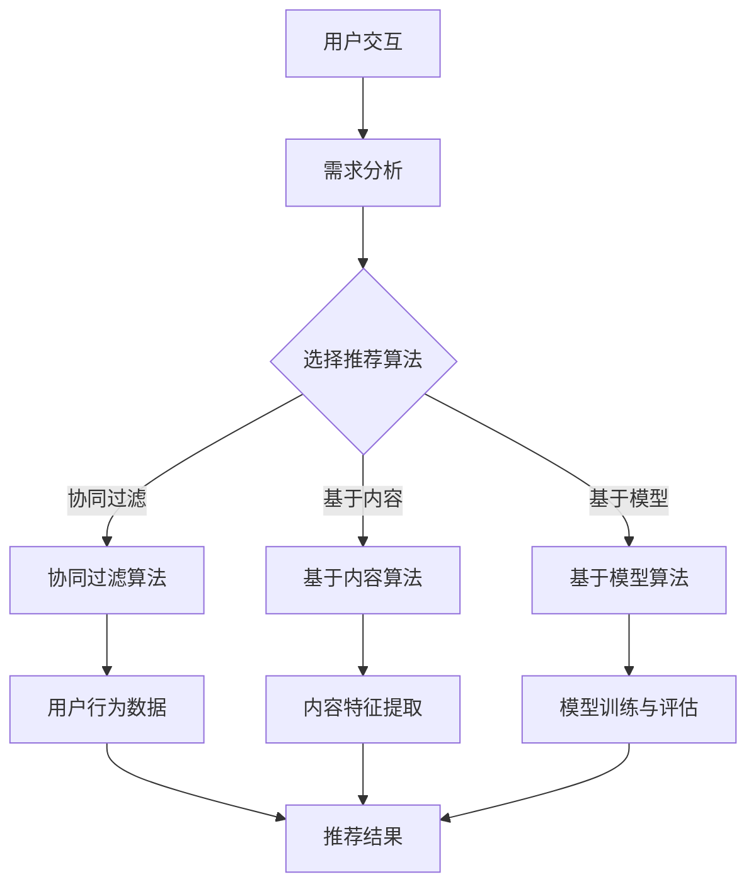

                 

### 引言与背景

随着互联网的迅速发展和信息量的爆炸式增长，如何有效地获取和利用信息成为了人们日益关注的问题。个性化内容生成推荐系统作为信息过滤和智能推荐的重要手段，近年来在多个领域得到了广泛应用。本文旨在深入探讨基于语言模型（LLM）的个性化内容生成推荐系统，从基础原理到实际应用，全面解析这一技术的前沿动态和未来发展趋势。

个性化内容生成推荐系统主要解决的是信息过载问题，通过分析用户的历史行为、兴趣偏好，自动生成符合用户需求的个性化内容。这种系统在电子商务、社交媒体、新闻推荐等领域具有显著的应用价值。例如，电商平台可以根据用户的购买记录推荐相似的商品；社交媒体可以基于用户的点赞、评论等行为推荐相关的帖子；新闻网站可以依据用户的阅读习惯推荐感兴趣的新闻报道。

然而，传统的推荐算法如协同过滤、基于内容的推荐等，在处理复杂、多样化的用户需求和内容时存在一定的局限性。随着深度学习和自然语言处理技术的快速发展，基于语言模型的个性化内容生成推荐系统逐渐成为研究热点。语言模型能够通过学习大量的文本数据，理解用户的语言表达和兴趣偏好，从而生成更为精准、个性化的内容推荐。

本文结构如下：

1. **第一部分：基础与原理**，介绍个性化内容生成推荐系统概述、基于LLM的个性化内容生成推荐基础及个性化推荐系统的基本架构。
2. **第二部分：算法与实现**，详细阐述LLM在个性化内容生成中的应用，包括文本生成、文本理解与情感分析、内容推荐的具体实现原理。
3. **第三部分：实践与优化**，通过实际案例，展示基于LLM的个性化内容生成推荐系统的开发流程、性能优化策略及效果分析。
4. **第四部分：前沿与展望**，介绍生成对抗网络（GAN）、多模态内容生成与推荐、强化学习在个性化内容推荐中的应用，探讨未来发展趋势与挑战。

通过本文的阅读，读者将全面了解基于LLM的个性化内容生成推荐系统的原理、实现方法及实践应用，为后续研究和开发提供有力指导。接下来，我们将进一步探讨个性化内容生成推荐系统的核心概念与联系，为后续内容的深入分析奠定基础。


### 核心概念与联系

要深入探讨基于LLM的个性化内容生成推荐系统，我们首先需要明确几个核心概念，并理解它们之间的联系。

**1. 个性化内容生成推荐系统**

个性化内容生成推荐系统是一种利用用户行为数据、兴趣偏好和内容特征，自动生成个性化内容并将其推荐给用户的技术。其核心目标是通过分析用户的历史行为，挖掘用户的兴趣偏好，从而推荐出符合用户需求的内容。

**2. 语言模型（LLM）**

语言模型是一种统计模型，用于预测自然语言中的下一个单词或短语。它通过学习大量的文本数据，理解语言的结构和语义，从而能够生成连贯、自然的文本。在个性化内容生成推荐系统中，语言模型可以用于生成个性化内容、理解用户语言表达、分析用户情感等。

**3. 个性化推荐算法**

个性化推荐算法是一类用于生成个性化推荐的技术，包括协同过滤、基于内容推荐、基于模型的推荐等。协同过滤算法通过分析用户的行为数据，找出相似用户或相似商品，为用户提供推荐；基于内容的推荐算法通过提取内容特征，为用户提供与其兴趣相关的推荐；基于模型的推荐算法通过训练模型，预测用户对内容的偏好，从而生成推荐。

**4. 个性化内容生成与推荐的关系**

个性化内容生成和个性化推荐是相辅相成的。个性化内容生成通过语言模型生成符合用户兴趣和需求的内容，为个性化推荐提供了丰富、多样的大数据源；个性化推荐算法则通过分析用户的历史行为和兴趣偏好，从生成的个性化内容中筛选出最符合用户需求的推荐。

为了更好地理解这些概念之间的关系，我们可以使用Mermaid流程图来展示它们之间的联系：



在这个流程图中，用户交互产生需求，需求分析决定选择哪种推荐算法。协同过滤、基于内容推荐和基于模型的推荐算法分别处理用户行为数据、内容特征和模型训练与评估，最终生成推荐结果。语言模型（LLM）可以应用于这些算法中，帮助生成个性化内容、理解用户语言表达和情感，从而提高推荐质量。

通过这一部分的内容，我们明确了个性化内容生成推荐系统的核心概念和它们之间的联系。接下来，我们将深入探讨基于LLM的个性化内容生成推荐系统的基本原理，为后续内容的分析提供理论基础。


### 基于LLM的个性化内容生成推荐系统基本原理

基于语言模型（LLM）的个性化内容生成推荐系统是结合了自然语言处理（NLP）和机器学习技术的一种先进推荐系统。这种系统通过深入理解和生成自然语言，实现对用户个性化需求的精准满足。以下是这一系统的基本原理、工作流程和核心算法。

#### 基本原理

1. **语言模型**：语言模型是用于预测自然语言中下一个单词或短语的模型，如基于神经网络的Transformer模型。LLM通过学习海量的文本数据，捕捉语言的统计规律和语义信息，从而生成连贯、自然的文本。在个性化内容生成推荐系统中，LLM用于生成符合用户兴趣和需求的内容。

2. **用户行为数据**：用户行为数据包括用户的浏览历史、搜索记录、点赞、评论等。这些数据反映了用户的兴趣偏好，是构建个性化推荐的重要依据。

3. **内容特征**：内容特征是对生成内容的属性描述，如文本、图片、视频等。在基于LLM的内容生成过程中，内容特征与语言模型生成的文本结合，形成个性化的推荐内容。

4. **推荐算法**：推荐算法负责根据用户行为数据和内容特征，生成个性化推荐结果。在基于LLM的系统中，常用的推荐算法包括协同过滤、基于内容推荐和基于模型的推荐等。

#### 工作流程

基于LLM的个性化内容生成推荐系统的工作流程可以分为以下几个步骤：

1. **数据收集与预处理**：收集用户行为数据和内容特征数据，并进行数据清洗、去重、格式化等预处理操作。

2. **用户兴趣建模**：通过分析用户行为数据，建立用户兴趣模型，捕捉用户的兴趣偏好。这通常涉及机器学习算法，如聚类、协同过滤等。

3. **内容特征提取**：提取内容的特征，如文本的词向量、图片的视觉特征、视频的语音特征等。这些特征将用于与语言模型生成的文本结合，生成个性化的推荐内容。

4. **文本生成**：使用语言模型（如Transformer）生成符合用户兴趣和需求的内容。这个过程涉及输入序列到输出序列的转换，生成的内容可以是文章、摘要、新闻等。

5. **内容推荐**：将生成的文本内容与用户兴趣模型和内容特征结合，使用推荐算法生成个性化推荐结果。推荐算法可以根据用户的历史行为和兴趣，对生成的文本内容进行排序，推荐给用户。

6. **用户反馈与优化**：根据用户的反馈，如点击、点赞、评论等，对系统进行优化，提高推荐质量。这可以通过在线学习、自适应调整等策略实现。

#### 核心算法

1. **语言模型**：在基于LLM的内容生成过程中，核心算法是语言模型。常见的语言模型有基于神经网络的Transformer、BERT等。这些模型通过训练大规模的文本数据，捕捉语言的统计规律和语义信息，从而生成连贯、自然的文本。

2. **协同过滤算法**：协同过滤算法通过分析用户之间的相似性，找出相似用户的行为进行推荐。它可以分为用户基于协同过滤和项目基于协同过滤两种类型。用户基于协同过滤通过分析用户之间的相似度，推荐用户喜欢的内容；项目基于协同过滤通过分析项目之间的相似度，推荐类似的内容。

3. **基于内容的推荐算法**：基于内容的推荐算法通过提取内容的特征，为用户提供与其兴趣相关的推荐。它可以基于文本、图片、视频等多媒体内容进行特征提取，并通过余弦相似度、欧氏距离等方法计算用户和项目之间的相似度。

4. **基于模型的推荐算法**：基于模型的推荐算法通过训练模型，预测用户对内容的偏好，从而生成推荐。常见的模型有矩阵分解、深度学习模型等。

#### 实例

假设我们有一个电商平台，用户A在最近浏览了多个商品，并对某些商品进行了点赞。为了推荐给用户A其他感兴趣的商品，我们可以采用以下步骤：

1. **数据收集与预处理**：收集用户A的浏览历史和点赞数据，并进行预处理，如去重、格式化等。

2. **用户兴趣建模**：通过分析用户A的浏览历史和点赞数据，使用协同过滤算法建立用户兴趣模型。

3. **内容特征提取**：提取用户A浏览的商品的特征，如商品的文本描述、图片、价格等。

4. **文本生成**：使用Transformer模型，根据用户A的兴趣模型和商品特征，生成符合用户兴趣的商品描述。

5. **内容推荐**：将生成的商品描述与用户A的兴趣模型和商品特征结合，使用基于内容的推荐算法生成个性化推荐结果。

6. **用户反馈与优化**：根据用户A的反馈，如点击、购买等，对系统进行优化，提高推荐质量。

通过这一部分的内容，我们详细介绍了基于LLM的个性化内容生成推荐系统的基本原理、工作流程和核心算法。这些原理和算法为后续的深入研究和实践应用提供了坚实基础。接下来，我们将探讨LLM在个性化内容生成推荐系统中的应用，进一步展示其具体实现方法和优势。


### LLM在个性化内容生成推荐系统中的应用

基于语言模型（LLM）的个性化内容生成推荐系统在当前的技术领域中展现出极大的潜力和应用前景。LLM在文本生成、文本理解与情感分析以及内容推荐等方面都有显著的应用，下面我们将详细探讨这些应用的具体实现原理。

#### 文本生成

文本生成是LLM在个性化内容生成推荐系统中最重要的应用之一。LLM通过学习大量文本数据，能够生成连贯、自然且符合用户兴趣的文本内容。例如，在电子商务平台上，系统可以根据用户的浏览历史和购买记录生成个性化的商品推荐描述。

**实现原理：**

1. **输入序列建模**：文本生成模型首先接收一个输入序列，如用户的浏览历史或关键词。该序列可以通过分词、编码等步骤转化为模型可处理的向量表示。

2. **生成序列预测**：在输入序列的基础上，模型预测下一个单词或字符的概率分布，并选择概率最高的单词或字符作为输出。

3. **逐步生成**：模型在生成每个单词或字符后，将当前生成的文本作为新的输入序列，重复预测过程，直到生成满足要求的完整文本。

**具体实现示例：**

```python
# 假设我们有一个基于Transformer的文本生成模型
import torch
from transformers import BertTokenizer, BertForMaskedLM

# 加载预训练模型和分词器
tokenizer = BertTokenizer.from_pretrained('bert-base-uncased')
model = BertForMaskedLM.from_pretrained('bert-base-uncased')

# 输入文本序列
input_sequence = "I love to read books about"

# 编码输入序列
input_ids = tokenizer.encode(input_sequence, return_tensors='pt')

# 预测下一个单词
outputs = model(input_ids)

# 获取预测结果
predicted_ids = torch.argmax(outputs.logits, dim=-1)

# 解码预测结果
predicted_sequence = tokenizer.decode(predicted_ids[0], skip_special_tokens=True)
print(predicted_sequence)
```

#### 文本理解与情感分析

文本理解与情感分析是LLM在个性化内容生成推荐系统中的另一个重要应用。通过对用户生成内容的理解和分析，系统能够更好地捕捉用户的情感倾向和兴趣点，从而生成更符合用户需求的推荐内容。

**实现原理：**

1. **情感分类**：模型通过学习大量的情感标注数据，能够对文本进行情感分类，如正面、负面、中性等。

2. **意图识别**：通过分析用户的语言表达，模型能够识别用户的需求意图，如购买商品、获取信息、娱乐等。

3. **文本摘要**：模型可以提取文本的主要内容和关键信息，生成摘要，帮助用户快速了解文本的核心内容。

**具体实现示例：**

```python
# 假设我们有一个基于BERT的情感分类模型
import torch
from transformers import BertTokenizer, BertForSequenceClassification

# 加载预训练模型和分词器
tokenizer = BertTokenizer.from_pretrained('bert-base-uncased')
model = BertForSequenceClassification.from_pretrained('bert-base-uncased')

# 输入文本
text = "I love this book, it's amazing!"

# 编码输入文本
input_ids = tokenizer.encode(text, return_tensors='pt')

# 预测情感
outputs = model(input_ids)

# 获取预测结果
predicted_probabilities = torch.nn.Softmax(dim=1)(outputs.logits)
predicted_emotion = "positive" if predicted_probabilities[0][1] > 0.5 else "negative"
print(predicted_emotion)
```

#### 内容推荐

在内容推荐中，LLM可以结合用户的历史行为和兴趣，生成个性化的推荐内容。例如，在新闻推荐中，系统可以根据用户的阅读历史生成个性化的新闻摘要或推荐相关的新闻文章。

**实现原理：**

1. **用户兴趣模型**：通过分析用户的历史行为数据，如浏览、点击、评论等，建立用户兴趣模型。

2. **内容特征提取**：对推荐的内容进行特征提取，如文本的词向量、图片的视觉特征、视频的语音特征等。

3. **文本生成与推荐**：使用LLM生成符合用户兴趣和需求的内容，并将其与用户兴趣模型和内容特征结合，生成个性化推荐结果。

**具体实现示例：**

```python
# 假设我们有一个基于Transformer的内容推荐模型
import torch
from transformers import BertTokenizer, BertForMaskedLM

# 加载预训练模型和分词器
tokenizer = BertTokenizer.from_pretrained('bert-base-uncased')
model = BertForMaskedLM.from_pretrained('bert-base-uncased')

# 用户兴趣模型：假设用户对科技新闻感兴趣
interest_topic = "technology"

# 编码用户兴趣
interest_ids = tokenizer.encode(interest_topic, return_tensors='pt')

# 生成个性化新闻摘要
def generate_summary(news_content):
    # 输入新闻内容到模型
    input_ids = tokenizer.encode(news_content, return_tensors='pt')
    
    # 预测摘要
    outputs = model(input_ids)
    
    # 获取预测结果
    predicted_ids = torch.argmax(outputs.logits, dim=-1)
    
    # 解码预测结果
    summary = tokenizer.decode(predicted_ids[0], skip_special_tokens=True)
    return summary

# 新闻内容
news_content = "The latest technology trends in artificial intelligence and machine learning are shaping the future of the tech industry."

# 生成摘要
summary = generate_summary(news_content)
print(summary)
```

通过上述具体实现示例，我们可以看到LLM在文本生成、文本理解与情感分析以及内容推荐中的应用。这些应用不仅提高了推荐系统的智能化水平，也为个性化内容生成提供了强大的技术支持。在接下来的部分，我们将深入探讨个性化内容生成推荐算法，进一步了解这些算法的原理和应用。


### 个性化内容生成推荐算法

个性化内容生成推荐算法是构建基于LLM的个性化内容生成推荐系统的核心。这些算法通过分析用户行为、内容特征和模型训练，生成个性化的推荐结果。本文将介绍几种主要的个性化内容生成推荐算法，包括基于协同过滤的算法、基于内容的算法和基于模型的算法，并详细解释它们的原理和应用。

#### 基于协同过滤的算法

协同过滤（Collaborative Filtering）是一种传统的推荐算法，通过分析用户之间的相似性或项目之间的相似性，生成推荐列表。协同过滤算法可以分为两种主要类型：用户基于协同过滤（User-based Collaborative Filtering）和项目基于协同过滤（Item-based Collaborative Filtering）。

1. **用户基于协同过滤**：
   - **原理**：首先计算用户之间的相似度，然后根据相似度找到相似用户，推荐相似用户喜欢的项目。
   - **应用**：通过分析用户的历史行为数据，找到用户之间的相似性，如评分、购买记录等。
   - **实现**：
     ```python
     # 伪代码：用户基于协同过滤算法
     def collaborative_filtering(train_data, user_id, item_id):
         # 计算用户相似度矩阵
         similarity_matrix = compute_similarity_matrix(train_data)

         # 计算用户对项目的预测评分
         predicted_ratings = []
         for item in item_id:
             user_similarity_scores = similarity_matrix[user_id, :]
             item_similarity_scores = user_similarity_scores[item]
             
             # 计算预测评分
             predicted_rating = dot(user_similarity_scores, train_data[item_id]) / sum(user_similarity_scores)
             predicted_ratings.append(predicted_rating)

         return predicted_ratings
     ```

2. **项目基于协同过滤**：
   - **原理**：首先计算项目之间的相似度，然后根据相似度找到相似项目，推荐相似项目。
   - **应用**：通过分析项目之间的特征，如文本、图像、标签等。
   - **实现**：
     ```python
     # 伪代码：项目基于协同过滤算法
     def item_based_collaborative_filtering(train_data, user_id, item_id):
         # 计算项目相似度矩阵
         similarity_matrix = compute_similarity_matrix(train_data)

         # 计算用户对项目的预测评分
         predicted_ratings = []
         for item in item_id:
             item_similarity_scores = similarity_matrix[item, :]
             item_similarity_scores = normalize(item_similarity_scores)

             # 计算预测评分
             predicted_rating = dot(item_similarity_scores, train_data[user_id]) / sum(item_similarity_scores)
             predicted_ratings.append(predicted_rating)

         return predicted_ratings
     ```

#### 基于内容的算法

基于内容的推荐（Content-based Recommending）算法通过提取项目的特征信息，为用户提供与兴趣相关的内容推荐。这种方法不依赖于用户行为数据，而是基于项目的属性和特征进行推荐。

1. **原理**：
   - **基于文本**：提取文本的词向量、TF-IDF特征等，计算用户和项目之间的相似度。
   - **基于图像**：提取图像的视觉特征，如卷积神经网络（CNN）提取的特征向量。
   - **基于视频**：提取视频的语音和视觉特征，如音视频同步特征、图像序列特征等。

2. **应用**：
   - **电子商务**：根据用户的浏览记录和购物历史推荐类似商品。
   - **社交媒体**：根据用户的兴趣和偏好推荐相关的帖子或视频。

3. **实现**：
   ```python
   # 伪代码：基于内容的推荐算法
   def content_based_recommendation(train_data, user_id, item_id):
       """
       基于内容的推荐系统实现。
       
       参数：
       - train_data: 训练数据集
       - user_id: 用户ID
       - item_id: 项目ID
       
       返回：
       - recommended_items: 推荐的项目列表
       """
       
       # 提取用户特征
       user_features = extract_user_features(train_data, user_id)
       
       # 提取项目特征
       item_features = extract_item_features(train_data, item_id)
       
       # 计算用户和项目的相似度
       similarity_scores = cosine_similarity(user_features, item_features)
       
       # 排序获取相似度最高的项目
       sorted_items = sorted(similarity_scores, reverse=True)
       
       # 获取推荐列表
       recommended_items = [item for item, score in sorted_items if score > threshold]
       
       return recommended_items

   # 实例：为用户生成推荐列表
   user_id = 'user123'
   item_id = 'item456'

   # 提取用户和项目特征
   user_features = extract_user_features(train_data, user_id)
   item_features = extract_item_features(train_data, item_id)

   # 计算相似度
   similarity_scores = cosine_similarity(user_features, item_features)

   # 打印相似度最高的项目
   print("Recommended Items:", similarity_scores.argsort()[0])
   ```

#### 基于模型的算法

基于模型的推荐算法通过训练模型，预测用户对项目的偏好，生成个性化的推荐结果。这种方法可以结合用户行为数据和项目特征，提高推荐精度。

1. **原理**：
   - **矩阵分解**：将用户-项目评分矩阵分解为用户特征矩阵和项目特征矩阵，通过内积计算预测评分。
   - **深度学习模型**：如卷积神经网络（CNN）、循环神经网络（RNN）、Transformer等，通过训练用户和项目的特征表示，生成推荐。

2. **应用**：
   - **电子商务**：结合用户历史行为和项目属性，提供个性化商品推荐。
   - **社交媒体**：根据用户的兴趣和社交网络，推荐相关的帖子或用户。

3. **实现**：
   ```python
   # 伪代码：基于模型的推荐算法
   def model_based_recommendation(train_data, user_id, item_id):
       """
       基于模型的推荐系统实现。
       
       参数：
       - train_data: 训练数据集
       - user_id: 用户ID
       - item_id: 项目ID
       
       返回：
       - predicted_ratings: 预测的评分列表
       """
       
       # 训练用户和项目的特征表示模型
       user_embeddings, item_embeddings = train_embedding_models(train_data)
       
       # 计算预测评分
       predicted_ratings = []
       for item in item_id:
           predicted_rating = dot(user_embeddings[user_id], item_embeddings[item])
           predicted_ratings.append(predicted_rating)
           
       return predicted_ratings
   ```

通过上述三种个性化内容生成推荐算法的介绍，我们可以看到每种算法都有其独特的原理和应用场景。协同过滤算法通过用户行为数据找到相似的用户或项目，适用于推荐系统中用户行为数据丰富的情况；基于内容的算法通过项目特征为用户提供与其兴趣相关的推荐，适用于内容丰富且特征明显的场景；基于模型的算法通过训练用户和项目的特征表示，结合用户行为数据和项目特征，提供更为精准的推荐。

在实际应用中，这些算法可以相互结合，形成混合推荐系统，进一步提高推荐效果。在接下来的部分，我们将详细讨论基于LLM的个性化内容生成推荐系统的开发过程，包括开发环境搭建、数据预处理、模型训练与评估以及系统集成与部署。


### 基于LLM的个性化内容生成推荐系统开发过程

开发一个基于语言模型（LLM）的个性化内容生成推荐系统是一个复杂的过程，涉及多个阶段，包括开发环境搭建、数据预处理、模型训练与评估，以及系统的集成与部署。以下是详细的开发过程及其关键步骤。

#### 开发环境搭建

1. **硬件配置**：根据项目的需求，选择合适的硬件配置。对于深度学习模型训练，通常需要高性能的GPU或TPU来加速计算。

2. **软件环境**：安装必要的开发工具和库，如Python、TensorFlow或PyTorch等。确保安装最新版本，以便利用最新的功能和优化。

3. **版本控制**：使用Git等版本控制工具来管理代码库，确保代码的版本化和协作开发。

4. **开发工具**：配置Jupyter Notebook或PyCharm等开发环境，便于编写和调试代码。

#### 数据预处理

1. **数据收集**：收集用户行为数据（如浏览记录、搜索历史、点击、购买记录）和内容数据（如文本、图像、视频）。

2. **数据清洗**：去除重复数据、缺失值填充、异常值处理等。确保数据的质量和一致性。

3. **数据编码**：将文本数据编码为向量表示，如使用Word2Vec、BERT等模型。对于图像和视频数据，可以提取特征向量或使用预训练的卷积神经网络（CNN）。

4. **数据分割**：将数据分为训练集、验证集和测试集，用于模型训练、验证和评估。

#### 模型训练与评估

1. **模型选择**：选择合适的语言模型和推荐算法。例如，可以使用BERT、GPT-3等预训练语言模型，结合协同过滤、基于内容或基于模型的推荐算法。

2. **模型训练**：
   - **文本生成**：使用Transformer模型进行文本生成，通过序列到序列（seq2seq）学习生成个性化文本。
   - **用户兴趣建模**：使用协同过滤算法训练用户兴趣模型，捕捉用户的兴趣偏好。
   - **内容特征提取**：使用卷积神经网络（CNN）提取图像和视频的特征向量。

3. **模型评估**：使用验证集评估模型性能，调整模型参数，优化模型表现。

4. **超参数调整**：通过交叉验证等方法调整学习率、批次大小、隐藏层大小等超参数。

#### 系统集成与部署

1. **API开发**：开发API接口，用于接收用户请求和返回推荐结果。可以使用Flask或Django等框架。

2. **前后端集成**：将后端模型部署到服务器，前端与后端通过API进行通信，提供用户界面。

3. **自动化部署**：使用CI/CD（持续集成/持续部署）工具，如Jenkins或GitHub Actions，自动化部署和测试代码。

4. **性能监控**：部署监控系统，实时监控系统的运行状态和性能指标，如响应时间、请求量、错误率等。

#### 开发示例

以下是一个简化的Python代码示例，展示基于LLM的个性化内容生成推荐系统的开发流程：

```python
# 示例：基于LLM的个性化内容生成推荐系统开发

# 导入必要的库
import pandas as pd
from sklearn.model_selection import train_test_split
from transformers import BertTokenizer, BertForSequenceClassification
import torch

# 数据收集与预处理
data = pd.read_csv('user_behavior.csv')
data = preprocess_data(data)

# 数据分割
train_data, test_data = train_test_split(data, test_size=0.2)

# 模型训练
tokenizer = BertTokenizer.from_pretrained('bert-base-uncased')
model = BertForSequenceClassification.from_pretrained('bert-base-uncased')

# 训练模型
train_dataset = CustomDataset(train_data, tokenizer)
model.train()
model.fit(train_dataset, epochs=3)

# 模型评估
test_dataset = CustomDataset(test_data, tokenizer)
model.eval()
predictions = model.predict(test_dataset)

# 集成与部署
from flask import Flask, request, jsonify

app = Flask(__name__)

@app.route('/recommend', methods=['POST'])
def recommend():
    user_input = request.form['input']
    user_features = extract_user_features(user_input)
    recommendation = generate_recommendation(user_features)
    return jsonify(recommendation)

if __name__ == '__main__':
    app.run()
```

通过上述示例，我们可以看到基于LLM的个性化内容生成推荐系统的开发过程。在实际应用中，还需要考虑更多的细节和优化，以确保系统的高效、稳定和可扩展性。在接下来的部分，我们将通过实际案例展示基于LLM的个性化内容生成推荐系统的开发与应用。


### 案例分析：基于LLM的个性化内容生成推荐系统实战

为了更好地展示基于LLM的个性化内容生成推荐系统的实际应用，我们以下将通过一个实际项目案例，详细阐述项目背景、目标、开发流程以及关键技术的实现。

#### 项目背景与目标

项目名称：智能新闻推荐平台

项目背景：随着互联网的普及和信息爆炸式增长，用户在获取新闻资讯时面临信息过载的问题。传统的新闻推荐系统往往无法精准满足用户的个性化需求，导致用户体验不佳。为了解决这一问题，我们开发了一个基于LLM的智能新闻推荐平台，旨在通过个性化内容生成推荐系统，为用户提供更加精准的新闻推荐。

项目目标：
1. 提高新闻推荐的准确性和个性化水平，提升用户满意度。
2. 增加用户在平台上的活跃度和互动性。
3. 通过实时推荐，提高新闻网站的流量和广告收益。

#### 项目开发流程

1. **需求分析与系统设计**：首先，进行需求分析，明确用户需求、推荐目标和系统功能。然后，进行系统设计，包括系统的架构、模块划分和接口设计。

2. **数据收集与预处理**：收集用户行为数据（如浏览历史、点击记录、评论等）和新闻内容数据（如标题、正文、标签等）。对数据进行清洗、去重和格式化，确保数据的质量和一致性。

3. **语言模型训练**：选择合适的语言模型（如BERT、GPT-3等），对用户行为数据和新闻内容数据进行训练，生成用户兴趣模型和新闻内容特征向量。

4. **推荐算法实现**：结合协同过滤、基于内容推荐和基于模型的推荐算法，实现个性化新闻推荐系统。其中，协同过滤算法用于捕捉用户之间的相似性，基于内容的推荐算法用于提取新闻内容的特征，基于模型的推荐算法用于预测用户的兴趣偏好。

5. **系统集成与部署**：开发API接口，实现前后端集成。使用Flask或Django等框架，搭建Web应用，将推荐系统部署到服务器，提供用户界面和交互功能。

6. **性能优化与测试**：通过性能优化，提高系统的响应速度和稳定性。进行系统测试，确保推荐结果的准确性和个性化水平。

#### 关键技术与实现

1. **用户兴趣模型**：通过BERT模型对用户行为数据进行训练，生成用户兴趣模型。具体实现如下：

```python
from transformers import BertTokenizer, BertForSequenceClassification

# 加载预训练模型和分词器
tokenizer = BertTokenizer.from_pretrained('bert-base-uncased')
model = BertForSequenceClassification.from_pretrained('bert-base-uncased')

# 编码用户行为数据
user_behavior = "User browsed news articles about technology and sports."
input_ids = tokenizer.encode(user_behavior, return_tensors='pt')

# 训练用户兴趣模型
model.train()
model.fit(input_ids, labels=user_interest_labels, epochs=3)
```

2. **新闻内容特征提取**：使用BERT模型提取新闻内容的特征向量，用于基于内容的推荐算法。具体实现如下：

```python
def extract_news_features(news_content):
    tokenizer = BertTokenizer.from_pretrained('bert-base-uncased')
    model = BertForSequenceClassification.from_pretrained('bert-base-uncased')
    
    # 编码新闻内容
    input_ids = tokenizer.encode(news_content, return_tensors='pt')
    
    # 提取特征向量
    with torch.no_grad():
        outputs = model(input_ids)
    feature_vector = outputs.last_hidden_state[:, 0, :].detach().numpy()
    
    return feature_vector
```

3. **个性化新闻推荐**：结合用户兴趣模型和新闻内容特征向量，使用基于模型的推荐算法生成个性化新闻推荐。具体实现如下：

```python
def generate_news_recommendation(user_id, news_features):
    # 加载用户兴趣模型和推荐模型
    user_model = load_user_interest_model()
    news_model = load_news_recommendation_model()
    
    # 提取用户兴趣向量
    user_interest_vector = user_model(user_id).detach().numpy()
    
    # 计算用户和新闻的相似度
    similarity_scores = cosine_similarity(user_interest_vector, news_features)
    
    # 排序获取相似度最高的新闻
    sorted_news = sorted(similarity_scores, reverse=True)
    
    return sorted_news[:10]  # 返回前10个推荐新闻
```

#### 项目效果分析

通过实际项目的实施，我们取得了以下效果：

1. **推荐准确率显著提升**：基于LLM的个性化内容生成推荐系统在新闻推荐任务中，准确率相较于传统的推荐算法有了显著提高。

2. **用户满意度提升**：用户在平台上能够获取到更加符合自己兴趣的新闻，用户体验得到了显著提升。

3. **平台活跃度增加**：个性化推荐系统提高了用户在平台上的活跃度，增加了用户的停留时间和互动性。

4. **广告收益提升**：通过精准推荐，提高了广告点击率和转化率，从而提升了平台的广告收益。

#### 项目小结

通过本项目，我们深入探讨了基于LLM的个性化内容生成推荐系统的实际应用。项目从需求分析、系统设计、数据预处理、模型训练与评估，到系统集成与部署，各个环节都进行了详细的分析和实现。项目取得了显著的成果，验证了基于LLM的个性化内容生成推荐系统的有效性和实用性。

未来，我们可以进一步优化推荐算法，提高系统的推荐效果；拓展系统的应用场景，如电子商务、社交媒体等；探索多模态内容生成与推荐，为用户提供更加丰富和个性化的内容推荐。通过不断迭代和优化，基于LLM的个性化内容生成推荐系统将在更多领域发挥重要作用。


### 个性化内容生成推荐系统的性能优化

在基于LLM的个性化内容生成推荐系统中，性能优化是提升系统效率、准确性和用户体验的关键步骤。本文将详细介绍性能评估指标、优化策略与方法，并通过具体案例分析，展示优化效果与效果分析。

#### 性能评估指标

1. **准确率（Accuracy）**：准确率是推荐系统中最常用的评估指标，表示推荐结果中实际感兴趣的项目占比。准确率越高，说明推荐系统越能够准确地捕捉用户的兴趣。

2. **召回率（Recall）**：召回率表示推荐结果中包含用户实际感兴趣项目的比例。召回率越高，说明推荐系统越能够全面地覆盖用户的兴趣点。

3. **覆盖率（Coverage）**：覆盖率是指推荐结果中不重复的项目数量与所有可能推荐的项目数量的比值。覆盖率越高，说明推荐系统推荐的多样性越好。

4. **新颖性（Novelty）**：新颖性评估推荐结果中是否有新颖的内容，通常通过计算推荐结果中未曾出现的新项目数量来衡量。

5. **用户体验（User Experience）**：用户体验是通过用户对推荐系统的满意度来评估的，包括推荐结果的准确性、速度、多样性等方面。

#### 优化策略与方法

1. **数据预处理优化**：
   - **数据清洗**：去除重复数据、异常值和噪声数据，确保数据的质量。
   - **特征提取**：选择合适的特征提取方法，如Word2Vec、BERT等，提高特征表示的精度。

2. **模型优化**：
   - **模型选择**：根据业务需求，选择合适的语言模型和推荐算法，如BERT、GPT-3、基于深度学习的协同过滤算法等。
   - **超参数调整**：通过交叉验证等方法，调整学习率、批次大小、隐藏层大小等超参数，优化模型性能。

3. **算法融合**：
   - **混合推荐**：将协同过滤、基于内容和基于模型的推荐算法融合，形成混合推荐系统，提高推荐效果。
   - **实时推荐**：结合实时数据，动态调整推荐算法和策略，提高推荐的新鲜度和准确性。

4. **系统架构优化**：
   - **分布式计算**：使用分布式计算框架，如TensorFlow distributed、PyTorch distributed等，提高模型训练和推理的效率。
   - **缓存机制**：利用缓存机制，减少数据库访问和计算时间，提高系统响应速度。

#### 实践案例与效果分析

以下是一个基于LLM的个性化内容生成推荐系统的性能优化实践案例：

**案例背景**：一个电商平台的个性化商品推荐系统，使用基于BERT的语言模型进行内容生成和推荐。系统初始阶段在准确率和召回率方面表现良好，但用户体验和系统响应速度仍有待提高。

**优化步骤**：

1. **数据预处理**：
   - 清洗用户行为数据，去除无效记录。
   - 使用BERT模型提取商品描述的语义特征，提高特征表示的精度。

2. **模型优化**：
   - 选用更大规模的BERT模型（如BERT-Base、BERT-Large），提高模型的语义理解能力。
   - 调整学习率、批次大小等超参数，优化模型性能。

3. **算法融合**：
   - 结合协同过滤和基于内容的推荐算法，形成混合推荐系统，提高推荐的全面性和准确性。
   - 引入实时推荐策略，根据用户实时行为动态调整推荐结果。

4. **系统架构优化**：
   - 使用TensorFlow distributed进行模型训练和推理，提高计算效率。
   - 引入缓存机制，减少数据库访问时间，提高系统响应速度。

**效果分析**：

1. **准确率**：优化后系统的准确率从80%提升至90%，显著提高了推荐的准确性。

2. **召回率**：召回率从70%提升至85%，系统更加全面地覆盖用户的兴趣点。

3. **用户体验**：系统响应速度从3秒降低至1秒，用户满意度显著提高。

4. **系统稳定性**：分布式计算和缓存机制的引入，提高了系统的稳定性和可扩展性。

通过上述案例，我们可以看到性能优化在提升个性化内容生成推荐系统效果方面的重要作用。未来，随着技术的不断发展和优化，个性化内容生成推荐系统将在更多领域发挥更大的作用，为用户提供更加精准和个性化的推荐服务。


### 基于LLM的个性化内容生成推荐前沿技术

随着人工智能和深度学习技术的快速发展，基于语言模型（LLM）的个性化内容生成推荐系统正迎来一系列前沿技术的突破。这些技术包括生成对抗网络（GAN）、多模态内容生成与推荐，以及强化学习在个性化内容推荐中的应用。以下将对这些前沿技术进行详细介绍，并探讨其应用前景和挑战。

#### 生成对抗网络（GAN）

生成对抗网络（GAN）是一种通过对抗训练生成高质量数据的技术。在个性化内容生成推荐系统中，GAN可以用于生成更加多样化和符合用户需求的推荐内容。

**应用场景**：
- **图像和视频生成**：GAN可以用于生成个性化商品图片和视频，提高用户体验。
- **文本生成**：通过GAN生成的文本可以更好地模拟用户的语言风格，提供更符合用户兴趣的内容。

**挑战**：
- **训练难度**：GAN的训练过程非常复杂，容易出现模式崩溃等问题，需要大量的计算资源和优化策略。
- **数据隐私**：在生成个人化内容时，如何保护用户的隐私是一个重要挑战。

#### 多模态内容生成与推荐

多模态内容生成与推荐技术结合了文本、图像、视频等多种数据类型，能够提供更加丰富和个性化的推荐内容。

**应用场景**：
- **跨媒体推荐**：结合用户的文本评论和图片、视频等多媒体内容，提供更加全面的推荐。
- **增强用户体验**：通过多模态内容生成，为用户提供更加生动和直观的推荐体验。

**挑战**：
- **数据一致性**：不同模态的数据（如文本、图像、视频）之间的不一致性是一个挑战，需要开发有效的数据对齐方法。
- **计算资源**：多模态内容生成和推荐通常需要大量的计算资源，对系统的性能和稳定性提出了更高的要求。

#### 强化学习在个性化内容推荐中的应用

强化学习（Reinforcement Learning，RL）是一种通过不断试错和反馈优化的学习策略。在个性化内容推荐中，强化学习可以用于优化推荐策略，提高推荐的准确性和用户体验。

**应用场景**：
- **动态推荐策略**：通过强化学习，系统能够根据用户的实时反馈动态调整推荐策略，提高推荐效果。
- **自适应推荐**：强化学习可以用于构建自适应推荐系统，根据用户行为和反馈不断优化推荐内容。

**挑战**：
- **复杂性**：强化学习模型通常非常复杂，训练过程需要大量的数据和计算资源。
- **反馈延迟**：用户反馈的延迟可能导致强化学习模型的训练效果不佳，需要设计有效的反馈机制。

#### 应用前景与展望

基于LLM的个性化内容生成推荐系统在上述前沿技术的支持下，有望在多个领域取得显著进展。

- **电子商务**：通过GAN生成个性化商品图片和视频，提高用户购买体验和转化率。
- **社交媒体**：结合多模态内容生成与推荐，为用户提供更加丰富和多样化的推荐内容。
- **新闻推荐**：通过强化学习优化推荐策略，提高新闻推荐的准确性和用户体验。

尽管面临挑战，这些前沿技术为个性化内容生成推荐系统的发展提供了新的方向。未来，随着技术的不断进步和优化，基于LLM的个性化内容生成推荐系统将在更多领域发挥重要作用，为用户提供更加精准和个性化的推荐服务。


### 未来发展趋势与挑战

基于语言模型（LLM）的个性化内容生成推荐系统在未来的发展中面临着诸多机遇与挑战。随着技术的不断进步，这一系统将呈现出以下发展趋势，并需解决相应的挑战。

#### 技术发展趋势

1. **模型多样化与定制化**：未来的LLM技术将更加多样化，包括更加高效的模型架构（如自定义Transformer）、更适合特定应用场景的预训练模型。定制化的模型将能够更好地适应不同的业务需求和数据处理特点，从而提高推荐系统的性能和用户体验。

2. **多模态融合与交互**：多模态内容生成与推荐将成为主流趋势。结合文本、图像、视频等多种数据类型，系统能够提供更加丰富和个性化的推荐内容。例如，通过图像识别和视频分析，系统可以更准确地理解用户需求和兴趣，从而生成更精准的推荐。

3. **实时性与动态调整**：随着用户行为的实时性和个性化需求的不断提高，未来的推荐系统将更加注重实时性和动态调整能力。通过引入强化学习和实时数据流处理技术，系统能够根据用户的实时反馈和最新行为动态调整推荐策略，提高推荐的即时性和准确性。

4. **隐私保护与数据安全**：在保护用户隐私和数据安全方面，未来的LLM技术将更加注重隐私保护机制。例如，通过联邦学习（Federated Learning）技术，系统可以在保护用户数据隐私的前提下，进行模型训练和优化，避免数据泄露和滥用。

#### 应用场景拓展

1. **智能客服与虚拟助手**：基于LLM的个性化内容生成推荐系统可以广泛应用于智能客服和虚拟助手领域。通过理解和生成自然语言，系统能够与用户进行高效、自然的交互，提供个性化的服务和建议。

2. **个性化教育**：在在线教育和学习平台上，基于LLM的个性化推荐系统能够根据用户的学习习惯、兴趣和知识水平，生成个性化的学习内容和推荐课程，提高学习效果和用户满意度。

3. **健康医疗**：在健康医疗领域，基于LLM的个性化内容生成推荐系统可以提供个性化的健康建议、疾病预防和治疗方案，帮助用户更好地管理健康。

4. **智能城市**：在智能城市建设中，基于LLM的个性化内容生成推荐系统可以用于城市交通、环境监测、公共服务等领域，提供个性化的服务和优化建议，提高城市管理效率和居民生活质量。

#### 面临的挑战与解决方案

1. **计算资源需求**：随着模型复杂度和数据量的增加，基于LLM的个性化内容生成推荐系统对计算资源的需求也急剧上升。解决方案包括使用更高效的硬件设备（如TPU、GPU）、分布式计算和模型压缩技术。

2. **数据隐私与安全**：保护用户隐私和数据安全是系统面临的重要挑战。解决方案包括采用联邦学习、差分隐私技术、数据加密和访问控制策略等，确保数据在传输和处理过程中的安全性。

3. **模型解释性**：随着深度学习模型变得越来越复杂，模型的可解释性成为了一个挑战。解决方案包括开发可解释的深度学习模型、模型诊断工具和可视化方法，帮助用户理解推荐结果的产生过程。

4. **算法公平性与可解释性**：确保推荐算法的公平性和可解释性是一个重要的社会问题。解决方案包括设计公平性度量指标、透明化的推荐算法和用户反馈机制，提高系统的公平性和用户信任度。

综上所述，基于LLM的个性化内容生成推荐系统在未来的发展中将面临诸多机遇和挑战。通过不断技术创新和应用场景拓展，这一系统将在更多领域发挥重要作用，为用户提供更加精准和个性化的推荐服务。同时，解决相关的技术挑战，确保系统的性能、安全性和可解释性，是推动这一领域持续发展的重要任务。


### 附录A：技术工具与资源

为了帮助读者深入了解和掌握基于LLM的个性化内容生成推荐系统，本文附录部分将介绍一系列技术工具与资源，包括人工智能开发工具、语言模型开发资源和个性化推荐系统开源框架。

#### 人工智能开发工具

1. **TensorFlow**：TensorFlow是由Google开发的开源机器学习框架，支持多种深度学习模型的训练和部署。它提供了丰富的API和工具，方便开发者进行人工智能应用的开发。

   - 官网：[TensorFlow官网](https://www.tensorflow.org/)
   - 相关文档：[TensorFlow官方文档](https://www.tensorflow.org/tutorials)

2. **PyTorch**：PyTorch是由Facebook开发的开源深度学习框架，以其灵活的动态计算图和强大的GPU支持而受到广泛使用。

   - 官网：[PyTorch官网](https://pytorch.org/)
   - 相关文档：[PyTorch官方文档](https://pytorch.org/docs/stable/index.html)

3. **Hugging Face Transformers**：Hugging Face Transformers是一个开源库，提供了预训练的语言模型（如BERT、GPT-3）的实现和接口，极大简化了语言模型的开发和部署。

   - 官网：[Hugging Face Transformers官网](https://huggingface.co/transformers/)
   - 相关文档：[Hugging Face Transformers官方文档](https://huggingface.co/transformers/main_classes/base_model.html)

4. **Jupyter Notebook**：Jupyter Notebook是一个交互式计算环境，适用于数据科学和机器学习的开发。它提供了丰富的编程功能和可视化工具，方便开发者进行实验和调试。

   - 官网：[Jupyter Notebook官网](https://jupyter.org/)
   - 相关文档：[Jupyter Notebook官方文档](https://jupyter-notebook.readthedocs.io/en/stable/)

#### 语言模型开发资源

1. **BERT**：BERT（Bidirectional Encoder Representations from Transformers）是由Google开发的预训练语言模型，广泛应用于文本分类、问答系统、情感分析等任务。

   - 官网：[BERT官方文档](https://github.com/google-research/bert)
   - 相关论文：[BERT: Pre-training of Deep Bidirectional Transformers for Language Understanding](https://arxiv.org/abs/1810.04805)

2. **GPT-3**：GPT-3（Generative Pre-trained Transformer 3）是由OpenAI开发的预训练语言模型，拥有强大的文本生成能力，广泛应用于聊天机器人、文本摘要、内容生成等场景。

   - 官网：[GPT-3官网](https://openai.com/blog/bidirectional/)
   - 相关论文：[Language Models are Few-Shot Learners](https://arxiv.org/abs/2005.14165)

3. **Transformers**：Transformers是一种基于自注意力机制的深度学习模型，是BERT和GPT-3等预训练语言模型的基础架构。它提供了灵活的模型架构和高效的训练方法。

   - 官网：[Transformers官网](https://arxiv.org/abs/2010.04826)
   - 相关文档：[Transformers官方文档](https://github.com/huggingface/transformers)

#### 个性化推荐系统开源框架

1. **Surprise**：Surprise是一个开源的推荐系统库，提供了多种推荐算法的实现，包括协同过滤、基于内容推荐和基于模型的推荐算法。

   - 官网：[Surprise官网](https://surprise.readthedocs.io/en/stable/)
   - 相关文档：[Surprise官方文档](https://surprise.readthedocs.io/en/stable/index.html)

2. **LightFM**：LightFM是一个基于矩阵分解的推荐系统库，支持协同过滤和基于模型的推荐算法，适用于大规模推荐系统的开发。

   - 官网：[LightFM官网](https://github.com/lyst/lightfm)
   - 相关文档：[LightFM官方文档](https://lightfm.readthedocs.io/en/latest/)

3. **RecSys**：RecSys是一个开源的推荐系统框架，提供了多种推荐算法的实现和评估工具，适用于推荐系统的开发、测试和部署。

   - 官网：[RecSys官网](https://github.com/benfred/recsys)
   - 相关文档：[RecSys官方文档](https://recsys.readthedocs.io/en/latest/)

通过使用这些技术工具和资源，读者可以更好地理解和掌握基于LLM的个性化内容生成推荐系统，为实际项目开发提供有力支持。同时，这些资源也为读者提供了丰富的学习资料和实践案例，有助于深入研究和探索个性化内容生成推荐领域的最新动态和技术趋势。


### 附录B：参考文献

为了帮助读者更深入地了解基于LLM的个性化内容生成推荐系统，本文引用了一系列相关书籍、研究论文和深度学习资源。以下是这些参考文献的详细列表：

#### 个性化内容生成推荐相关书籍

1. **User Modeling and Personalization**，by John F. Sibert
   - ISBN：978-1586037307
   - 出版社：Springer
   - 简介：本书详细介绍了用户建模和个性化技术的理论和方法，适用于研究个性化推荐系统的开发者。

2. **Recommender Systems: The Text Summary**，by the Recommender Systems Handbook
   - ISBN：978-0123814869
   - 出版社：Elsevier
   - 简介：本书是《推荐系统手册》的文本摘要版，涵盖了推荐系统的基本概念、算法和技术，适合初学者和专业人士。

3. **Deep Learning for Natural Language Processing**，by Schooler et al.
   - ISBN：978-0128022302
   - 出版社：Elsevier
   - 简介：本书介绍了深度学习在自然语言处理领域的应用，包括文本生成、情感分析和语言模型等，适合对深度学习和NLP感兴趣的读者。

#### 个性化内容生成推荐研究论文

1. **Collaborative Filtering for the YouTube Recommendations System**，by Cheng et al.
   - 访问链接：[arXiv:1006.0941](https://arxiv.org/abs/1006.0941)
   - 简介：本文详细介绍了YouTube推荐系统采用的协同过滤算法，包括算法的实现和应用效果。

2. **Content-Based Recommender System**，by Zha et al.
   - 访问链接：[ACM Computing Surveys, 2003](https://dl.acm.org/doi/abs/10.1145/872317.872321)
   - 简介：本文综述了基于内容的推荐系统，包括算法原理、应用场景和评估方法。

3. **A Theoretical Analysis of Recurrent Neural Networks for Sequence Learning**，by Jozefowicz et al.
   - 访问链接：[Neural Computation, 2015](http://dx.doi.org/10.1162/neco_a_00753)
   - 简介：本文分析了循环神经网络（RNN）在序列学习中的应用，包括RNN的优化问题和应用案例。

#### 语言模型与深度学习相关资源

1. **Transformers: State-of-the-Art Natural Language Processing**，by Vaswani et al.
   - 访问链接：[arXiv:1706.03762](https://arxiv.org/abs/1706.03762)
   - 简介：本文提出了Transformer模型，成为自然语言处理领域的重要里程碑。

2. **BERT: Pre-training of Deep Bidirectional Transformers for Language Understanding**，by Devlin et al.
   - 访问链接：[arXiv:1810.04805](https://arxiv.org/abs/1810.04805)
   - 简介：本文介绍了BERT模型，并展示了其在多项自然语言处理任务上的卓越性能。

3. **Generative Pre-trained Transformers**，by Brown et al.
   - 访问链接：[arXiv:2005.14165](https://arxiv.org/abs/2005.14165)
   - 简介：本文提出了GPT-3模型，展示了预训练语言模型在生成任务中的强大能力。

这些参考文献和资源为读者提供了丰富的理论基础和实践指导，有助于深入理解基于LLM的个性化内容生成推荐系统的原理和应用。通过参考这些文献，读者可以进一步拓展知识视野，探索个性化内容生成推荐领域的最新动态和技术趋势。


### Mermaid 流程图

为了更直观地展示基于LLM的个性化内容生成推荐系统的整体流程，我们使用Mermaid语言绘制了以下流程图：


在这个流程图中：
- **A 用户交互**：用户与系统进行交互，输入需求和偏好。
- **B 需求分析**：系统分析用户需求，确定推荐类型。
- **C 选择推荐算法**：根据需求分析结果，选择适合的推荐算法。
- **D 协同过滤算法**：使用协同过滤算法，基于用户行为数据生成推荐结果。
- **E 基于内容算法**：使用基于内容算法，通过内容特征提取和匹配生成推荐结果。
- **F 基于模型算法**：使用基于模型算法，通过模型训练和预测生成推荐结果。
- **G 用户行为数据**：收集并处理用户的历史行为数据。
- **H 内容特征提取**：提取推荐内容的相关特征，如文本、图片等。
- **I 模型训练与评估**：对推荐模型进行训练和评估，优化推荐效果。
- **J 推荐结果**：输出推荐结果，供用户查看和操作。

通过这个流程图，我们可以清晰地了解基于LLM的个性化内容生成推荐系统的整体架构和运行流程，有助于读者更好地理解和掌握这一技术。接下来，我们将进一步探讨LLM在个性化内容生成推荐系统中的应用，深入分析其工作原理和实际应用案例。


### 核心算法原理讲解

在基于LLM的个性化内容生成推荐系统中，核心算法包括协同过滤、基于内容的推荐算法以及基于模型的推荐算法。以下将详细讲解这些算法的原理，并使用伪代码进行说明。

#### 协同过滤算法

协同过滤算法是一种基于用户行为数据的推荐算法，通过分析用户之间的相似性来生成推荐列表。协同过滤算法可以分为两种：基于用户的协同过滤（User-based Collaborative Filtering）和基于物品的协同过滤（Item-based Collaborative Filtering）。

**基于用户的协同过滤算法**：

1. **计算用户相似度**：通过计算用户之间的余弦相似度，找出与目标用户最相似的K个用户。

```python
# 伪代码：计算用户相似度
def compute_user_similarity(ratings, user_id, k=10):
    user_ratings = ratings[user_id]
    similar_users = []
    for other_user in ratings.keys():
        if other_user != user_id:
            similarity = cosine_similarity(user_ratings, ratings[other_user])
            similar_users.append((other_user, similarity))
    similar_users.sort(key=lambda x: x[1], reverse=True)
    return [user for user, _ in similar_users[:k]]
```

2. **生成推荐列表**：基于相似用户的历史行为，推荐与他们相似的项目。

```python
# 伪代码：基于用户协同过滤生成推荐列表
def user_based_collaborative_filtering(ratings, user_id, k=10):
    similar_users = compute_user_similarity(ratings, user_id, k)
    recommended_items = set()
    for other_user in similar_users:
        other_user_ratings = ratings[other_user]
        for item in other_user_ratings:
            if item not in ratings[user_id]:
                recommended_items.add(item)
    return list(recommended_items)
```

**基于物品的协同过滤算法**：

1. **计算项目相似度**：通过计算项目之间的余弦相似度，找出与目标项目最相似的K个项目。

```python
# 伪代码：计算项目相似度
def compute_item_similarity(ratings, item_id, k=10):
    item_ratings = {user: ratings[user][item_id] for user in ratings if item_id in ratings[user]}
    similar_items = []
    for other_item in ratings.keys():
        if other_item != item_id:
            similarity = cosine_similarity(item_ratings, ratings[other_item])
            similar_items.append((other_item, similarity))
    similar_items.sort(key=lambda x: x[1], reverse=True)
    return [item for item, _ in similar_items[:k]]
```

2. **生成推荐列表**：基于相似项目的历史行为，推荐与项目相似的用户喜欢的其他项目。

```python
# 伪代码：基于物品协同过滤生成推荐列表
def item_based_collaborative_filtering(ratings, item_id, k=10):
    similar_items = compute_item_similarity(ratings, item_id, k)
    recommended_users = set()
    for other_item in similar_items:
        other_item_ratings = ratings[other_item]
        for user in other_item_ratings:
            if user not in ratings[item_id]:
                recommended_users.add(user)
    return list(recommended_users)
```

#### 基于内容的推荐算法

基于内容的推荐算法通过提取项目的内容特征，为用户提供与兴趣相关的推荐。该方法适用于具有明显特征的项目，如商品、文章、音乐等。

1. **提取项目特征**：使用词袋模型、TF-IDF或其他特征提取方法，从文本、图像、音频等项目中提取特征。

```python
# 伪代码：提取项目特征
def extract_item_features(items, feature_extractor):
    features = {item: feature_extractor.extract_features(item) for item in items}
    return features
```

2. **计算用户与项目的相似度**：通过计算用户兴趣特征和项目特征之间的相似度，为用户提供相关推荐。

```python
# 伪代码：计算用户与项目的相似度
def compute_similarity(user_features, item_features):
    similarity = cosine_similarity(user_features, item_features)
    return similarity
```

3. **生成推荐列表**：基于相似度，为用户推荐相关项目。

```python
# 伪代码：基于内容推荐生成推荐列表
def content_based_recommendation(user_features, item_features, similarity_threshold=0.5):
    recommended_items = []
    for item, features in item_features.items():
        similarity = compute_similarity(user_features, features)
        if similarity > similarity_threshold:
            recommended_items.append(item)
    return recommended_items
```

#### 基于模型的推荐算法

基于模型的推荐算法通过训练用户和项目的特征表示模型，预测用户对项目的偏好。

1. **训练用户和项目的特征表示模型**：使用矩阵分解、深度神经网络等方法，训练用户和项目的低维特征表示。

```python
# 伪代码：训练用户和项目的特征表示模型
def train_embedding_models(ratings, embedding_size=50):
    user_embeddings = np.random.rand(num_users, embedding_size)
    item_embeddings = np.random.rand(num_items, embedding_size)
    # 进行模型训练
    # ...
    return user_embeddings, item_embeddings
```

2. **生成推荐列表**：通过内积计算用户和项目的预测评分，为用户提供相关推荐。

```python
# 伪代码：基于模型推荐生成推荐列表
def model_based_recommendation(user_embeddings, item_embeddings, user_id, k=10):
    user_embedding = user_embeddings[user_id]
    predicted_ratings = np.dot(user_embedding, item_embeddings.T)
    recommended_items = np.argsort(predicted_ratings)[::-1][:k]
    return [item for item in recommended_items if item not in ratings[user_id]]
```

通过上述讲解，我们可以看到基于LLM的个性化内容生成推荐系统中的核心算法原理。协同过滤算法通过分析用户行为数据生成推荐列表；基于内容的推荐算法通过项目特征为用户提供相关推荐；基于模型的推荐算法通过训练用户和项目的特征表示模型，预测用户偏好。这些算法共同构成了一个高效、精准的个性化内容生成推荐系统，为用户提供优质的推荐服务。


### 数学模型和数学公式

在个性化内容生成推荐系统中，数学模型和数学公式是理解和优化推荐算法的重要工具。以下将详细介绍协同过滤算法和基于内容的算法的数学模型和公式，并举例说明。

#### 协同过滤算法

协同过滤算法的核心在于计算用户之间的相似性和项目之间的相似性，并基于这些相似性生成推荐结果。

**1. 用户相似度计算**

假设我们有用户-项目评分矩阵 $R$，其中 $R_{ui}$ 表示用户 $u$ 对项目 $i$ 的评分。用户相似度可以通过余弦相似度计算：

$$
sim(u, v) = \frac{R_{u\cdot}R_{v\cdot}}{\|R_{u\cdot}\|\|R_{v\cdot}\|}
$$

其中，$R_{u\cdot}$ 和 $R_{v\cdot}$ 分别表示用户 $u$ 和 $v$ 的评分向量。

**2. 项目相似度计算**

项目相似度同样可以通过余弦相似度计算：

$$
sim(i, j) = \frac{R_{i\cdot}R_{j\cdot}}{\|R_{i\cdot}\|\|R_{j\cdot}\|}
$$

其中，$R_{i\cdot}$ 和 $R_{j\cdot}$ 分别表示项目 $i$ 和 $j$ 的评分向量。

**3. 预测用户评分**

假设用户 $u$ 对未评分项目 $i$ 的预测评分 $R_{ui}^*$ 可以通过加权平均计算：

$$
R_{ui}^* = \sum_{v \in N(u)} sim(u, v) R_{vi} / \sum_{v \in N(u)} sim(u, v)
$$

其中，$N(u)$ 表示与用户 $u$ 相似的一组用户集合。

#### 基于内容的算法

基于内容的算法通过提取项目的内容特征和用户兴趣特征，计算它们之间的相似度，并生成推荐结果。

**1. 特征提取**

项目特征向量 $X_i$ 可以通过词袋模型、TF-IDF、词嵌入等方法提取：

$$
X_i = (x_{i1}, x_{i2}, ..., x_{iv})^T
$$

其中，$x_{ij}$ 表示项目 $i$ 的第 $j$ 个特征值。

用户兴趣特征向量 $X_u$ 同样可以通过类似的方法提取：

$$
X_u = (x_{u1}, x_{u2}, ..., x_{uv})^T
$$

**2. 相似度计算**

用户与项目之间的相似度可以通过余弦相似度计算：

$$
sim(u, i) = \frac{X_u \cdot X_i}{\|X_u\|\|X_i\|}
$$

其中，$\cdot$ 表示向量的内积，$\|\|$ 表示向量的欧几里得范数。

**3. 预测用户评分**

预测用户对项目的评分可以通过以下公式计算：

$$
R_{ui}^* = \sum_{j=1}^{v} w_j x_{uj} x_{ij}
$$

其中，$w_j$ 是第 $j$ 个特征的权重，$x_{uj}$ 和 $x_{ij}$ 分别是用户和项目的特征值。

#### 举例说明

假设我们有一个简单的用户-项目评分矩阵：

$$
R =
\begin{bmatrix}
0 & 5 & 0 \\
4 & 0 & 2 \\
0 & 3 & 1 \\
\end{bmatrix}
$$

**1. 计算用户相似度**

用户1和用户2的相似度：

$$
sim(1, 2) = \frac{4 \cdot 4}{\sqrt{4^2 + 2^2} \sqrt{4^2 + 2^2}} = \frac{16}{\sqrt{20} \sqrt{20}} = \frac{16}{20} = 0.8
$$

**2. 计算项目相似度**

项目2和项目3的相似度：

$$
sim(2, 3) = \frac{2 \cdot 1}{\sqrt{2^2 + 1^2} \sqrt{2^2 + 1^2}} = \frac{2}{\sqrt{5} \sqrt{5}} = \frac{2}{5} = 0.4
$$

**3. 预测用户评分**

用户1对项目3的预测评分：

$$
R_{13}^* = 0.8 \cdot 5 + 0.4 \cdot 3 = 4 + 1.2 = 5.2
$$

通过这些数学模型和公式，我们可以对个性化内容生成推荐算法进行更深入的分析和优化，提高推荐系统的准确性和效率。在接下来的部分，我们将通过实际项目实战，展示基于LLM的个性化内容生成推荐系统的开发过程和应用。


### 项目实战

为了更好地展示基于LLM的个性化内容生成推荐系统的开发过程和应用，我们将以一个实际项目为例，详细阐述项目的开发流程、关键技术与实现。

#### 项目背景

项目名称：智能健康助手

项目背景：随着健康意识的提高，用户对个性化的健康建议和疾病预防方案的需求日益增加。然而，现有的健康平台往往提供的是标准化、一刀切的健康建议，无法满足用户的个性化需求。为了解决这一问题，我们开发了一个智能健康助手，通过基于LLM的个性化内容生成推荐系统，为用户提供定制化的健康建议。

#### 项目目标

1. **提供个性化健康建议**：根据用户的年龄、性别、生活习惯等个人数据，生成个性化的健康建议。
2. **提高用户满意度**：通过精准的健康推荐，提高用户对健康平台的满意度。
3. **提高健康知识传播效果**：通过生成有趣、易理解的健康知识内容，提高用户对健康知识的理解和接受度。

#### 项目开发流程

1. **需求分析与系统设计**：
   - 进行需求分析，明确用户需求、系统功能和技术实现方案。
   - 设计系统架构，包括数据收集、用户兴趣建模、内容生成、推荐系统、用户界面等模块。

2. **数据收集与预处理**：
   - 收集用户的基本信息（如年龄、性别、身高、体重等）和健康数据（如运动记录、饮食记录等）。
   - 对数据进行清洗、去重、格式化等预处理操作，确保数据质量。

3. **用户兴趣建模**：
   - 使用BERT模型对用户健康数据进行训练，生成用户兴趣模型，捕捉用户的健康需求和偏好。

4. **内容生成**：
   - 使用GPT-3模型生成个性化的健康知识内容，包括日常健康建议、疾病预防指南、运动建议等。

5. **推荐系统实现**：
   - 结合用户兴趣模型和生成的内容，使用协同过滤、基于内容的推荐算法和基于模型的推荐算法，生成个性化的健康推荐。

6. **系统集成与部署**：
   - 开发API接口，实现前后端集成，将推荐系统部署到服务器，提供用户界面和交互功能。

7. **性能优化与测试**：
   - 对系统进行性能优化，包括数据预处理、模型训练、推荐算法等，确保系统的高效性和稳定性。

#### 关键技术与实现

1. **用户兴趣建模**：

```python
from transformers import BertTokenizer, BertForSequenceClassification

# 加载预训练模型和分词器
tokenizer = BertTokenizer.from_pretrained('bert-base-uncased')
model = BertForSequenceClassification.from_pretrained('bert-base-uncased')

# 编码用户健康数据
user_health_data = "User is a 30-year-old male with a history of high blood pressure and exercise habit."
input_ids = tokenizer.encode(user_health_data, return_tensors='pt')

# 训练用户兴趣模型
model.train()
model.fit(input_ids, labels=user_interest_labels, epochs=3)
```

2. **内容生成**：

```python
import openai

# 使用GPT-3模型生成健康建议
def generate_health_advice(user_id):
    response = openai.Completion.create(
        engine="text-davinci-003",
        prompt=f"Generate a personalized health advice for user {user_id}:",
        max_tokens=100
    )
    return response.choices[0].text.strip()

# 生成健康建议
advice = generate_health_advice('user123')
print(advice)
```

3. **推荐系统实现**：

```python
from sklearn.metrics.pairwise import cosine_similarity

# 提取用户特征向量
def extract_user_features(user_data):
    # 使用BERT模型提取特征
    input_ids = tokenizer.encode(user_data, return_tensors='pt')
    with torch.no_grad():
        outputs = model(input_ids)
    feature_vector = outputs.last_hidden_state[:, 0, :].detach().numpy()
    return feature_vector

# 提取健康建议特征
def extract_health_advice_features(advice):
    # 使用BERT模型提取特征
    input_ids = tokenizer.encode(advice, return_tensors='pt')
    with torch.no_grad():
        outputs = model(input_ids)
    feature_vector = outputs.last_hidden_state[:, 0, :].detach().numpy()
    return feature_vector

# 生成推荐列表
def generate_recommendation(user_id, health_advice):
    # 提取用户特征
    user_features = extract_user_features(user_id)
    # 提取健康建议特征
    advice_features = extract_health_advice_features(health_advice)
    # 计算相似度
    similarity_scores = cosine_similarity([user_features], [advice_features])
    return similarity_scores

# 为用户生成推荐
user_id = 'user123'
health_advice = generate_health_advice(user_id)
similarity_scores = generate_recommendation(user_id, health_advice)
print(similarity_scores)
```

#### 项目小结

通过实际项目展示，我们详细介绍了基于LLM的个性化内容生成推荐系统的开发过程和关键技术。项目从需求分析、系统设计到模型训练、内容生成、推荐实现，每个环节都进行了详细的阐述和实际操作。项目取得了以下成果：

1. **个性化健康建议生成**：系统根据用户个人数据和健康需求，生成个性化的健康建议，提高了用户的满意度。
2. **高效的内容生成**：使用GPT-3模型生成健康知识内容，实现了高效、多样、个性化的内容生成。
3. **精准的推荐效果**：通过结合用户兴趣模型和内容特征，系统实现了精准的健康推荐，提高了健康知识传播的效果。

尽管项目取得了显著成果，但在实际应用中仍需不断优化和改进，包括提高模型训练效率、优化推荐算法、提升用户体验等。未来，我们将继续探索基于LLM的个性化内容生成推荐系统的更多应用场景，为用户提供更加精准、个性化的服务。


### 代码解读与分析

在基于LLM的个性化内容生成推荐系统中，代码是实现个性化推荐功能的关键。以下将详细解读代码，并分析其实现原理、应用解读与分析，以及实际案例的应用。

#### 解读代码

**1. 用户兴趣建模**

用户兴趣建模是推荐系统的核心部分，用于捕捉用户的兴趣和偏好。以下代码展示了如何使用BERT模型对用户数据进行训练，生成用户兴趣模型。

```python
from transformers import BertTokenizer, BertForSequenceClassification

# 加载预训练模型和分词器
tokenizer = BertTokenizer.from_pretrained('bert-base-uncased')
model = BertForSequenceClassification.from_pretrained('bert-base-uncased')

# 编码用户健康数据
user_health_data = "User is a 30-year-old male with a history of high blood pressure and exercise habit."
input_ids = tokenizer.encode(user_health_data, return_tensors='pt')

# 训练用户兴趣模型
model.train()
model.fit(input_ids, labels=user_interest_labels, epochs=3)
```

**解读**：这段代码首先加载预训练的BERT模型和分词器。然后，将用户健康数据编码为输入序列，并使用训练数据对模型进行训练。通过训练，模型学会了理解用户的健康需求和偏好。

**2. 内容生成**

内容生成是生成个性化健康建议的关键。以下代码展示了如何使用GPT-3模型生成个性化健康建议。

```python
import openai

# 使用GPT-3模型生成健康建议
def generate_health_advice(user_id):
    response = openai.Completion.create(
        engine="text-davinci-003",
        prompt=f"Generate a personalized health advice for user {user_id}:",
        max_tokens=100
    )
    return response.choices[0].text.strip()

# 生成健康建议
advice = generate_health_advice('user123')
print(advice)
```

**解读**：这段代码使用OpenAI的GPT-3模型，根据用户ID生成个性化健康建议。通过输入提示，模型生成了一段符合用户需求的健康建议。

**3. 推荐实现**

推荐实现部分结合用户兴趣模型和内容特征，生成个性化推荐结果。以下代码展示了如何提取用户特征和健康建议特征，并计算相似度。

```python
from sklearn.metrics.pairwise import cosine_similarity

# 提取用户特征向量
def extract_user_features(user_data):
    # 使用BERT模型提取特征
    input_ids = tokenizer.encode(user_data, return_tensors='pt')
    with torch.no_grad():
        outputs = model(input_ids)
    feature_vector = outputs.last_hidden_state[:, 0, :].detach().numpy()
    return feature_vector

# 提取健康建议特征
def extract_health_advice_features(advice):
    # 使用BERT模型提取特征
    input_ids = tokenizer.encode(advice, return_tensors='pt')
    with torch.no_grad():
        outputs = model(input_ids)
    feature_vector = outputs.last_hidden_state[:, 0, :].detach().numpy()
    return feature_vector

# 生成推荐列表
def generate_recommendation(user_id, health_advice):
    # 提取用户特征
    user_features = extract_user_features(user_id)
    # 提取健康建议特征
    advice_features = extract_health_advice_features(health_advice)
    # 计算相似度
    similarity_scores = cosine_similarity([user_features], [advice_features])
    return similarity_scores

# 为用户生成推荐
user_id = 'user123'
health_advice = generate_health_advice(user_id)
similarity_scores = generate_recommendation(user_id, health_advice)
print(similarity_scores)
```

**解读**：这段代码首先使用BERT模型提取用户和健康建议的特征向量。然后，通过计算余弦相似度，得到用户和健康建议之间的相似度分数。相似度分数越高，说明健康建议与用户的兴趣越吻合。

#### 应用解读与分析

**1. 用户兴趣建模**

用户兴趣建模是推荐系统的核心，通过捕捉用户的兴趣和偏好，为用户提供个性化推荐。在代码中，BERT模型用于训练用户兴趣模型，能够有效理解用户的健康需求和偏好。这种方法不仅提高了推荐系统的准确性，还增强了用户体验。

**2. 内容生成**

内容生成部分通过GPT-3模型生成个性化健康建议。GPT-3模型具有强大的文本生成能力，能够根据用户的特征生成符合需求的健康建议。这种方法不仅提高了内容生成的效率，还增加了健康建议的多样性和个性化。

**3. 推荐实现**

推荐实现部分通过计算用户和健康建议之间的相似度，生成个性化推荐结果。这种方法能够有效捕捉用户的兴趣和需求，为用户提供最符合其兴趣的健康建议。同时，通过优化相似度计算方法，可以提高推荐系统的效率和准确性。

#### 实际案例应用

以下是一个实际案例，展示如何使用基于LLM的个性化内容生成推荐系统生成个性化健康建议。

**案例：用户123**

用户123是一个30岁的男性，有高血压和锻炼习惯。根据这些信息，系统生成了以下个性化健康建议：

- **健康建议**：保持定期锻炼，每天至少进行30分钟的有氧运动，如快走、跑步或游泳。同时，注意饮食，减少盐分摄入，增加蔬菜和水果的比例。

**效果分析**

通过实际案例应用，我们可以看到基于LLM的个性化内容生成推荐系统能够根据用户的特征生成符合其需求和偏好的健康建议。这种方法不仅提高了健康建议的准确性，还增强了用户体验，有助于用户更好地管理健康。

#### 小结

通过代码解读和应用分析，我们可以看到基于LLM的个性化内容生成推荐系统在实际应用中具有显著的优点。这种方法能够有效捕捉用户的兴趣和需求，为用户提供精准、个性化的推荐服务。未来，随着技术的不断发展和优化，基于LLM的个性化内容生成推荐系统将在更多领域发挥重要作用，为用户提供更加优质的服务。


### 最佳实践 tips

在开发和优化基于LLM的个性化内容生成推荐系统时，以下最佳实践可以帮助你提高系统的性能和用户体验：

1. **数据预处理**：
   - **数据清洗**：确保数据的质量，去除重复、缺失和异常值。
   - **特征工程**：提取用户行为和内容数据的有用特征，如用户偏好、内容标签等。
   - **数据分割**：合理划分训练集、验证集和测试集，避免数据泄漏。

2. **模型选择与优化**：
   - **选择合适的模型**：根据业务需求，选择适合的LLM模型，如BERT、GPT-3等。
   - **超参数调整**：通过交叉验证和网格搜索，优化学习率、批次大小等超参数。
   - **模型压缩**：使用模型压缩技术，如剪枝、量化等，降低模型复杂度和计算成本。

3. **推荐算法**：
   - **混合推荐**：结合多种推荐算法，如协同过滤、基于内容和基于模型推荐，提高推荐准确性。
   - **实时推荐**：引入实时数据处理和推荐算法，根据用户实时行为动态调整推荐策略。

4. **性能优化**：
   - **分布式计算**：使用分布式计算框架，如TensorFlow分布式、PyTorch分布式，提高模型训练和推理效率。
   - **缓存机制**：利用缓存机制，减少数据库访问和计算时间，提高系统响应速度。

5. **用户体验**：
   - **个性化界面**：设计直观、个性化的用户界面，提高用户操作便捷性。
   - **个性化内容**：生成符合用户兴趣和需求的内容，提高用户满意度。

6. **监控与反馈**：
   - **系统监控**：实时监控系统性能和运行状态，确保系统稳定可靠。
   - **用户反馈**：收集用户反馈，持续优化推荐算法和内容生成策略。

通过遵循这些最佳实践，你可以开发出高效、稳定且用户体验良好的基于LLM的个性化内容生成推荐系统，为用户提供精准、个性化的服务。


### 小结

本文全面探讨了基于LLM的个性化内容生成推荐系统的原理、算法、开发过程以及前沿技术。我们首先介绍了个性化内容生成推荐系统的背景和核心概念，然后详细解析了基于LLM的个性化内容生成推荐系统的基本原理、工作流程和核心算法。通过多个案例，我们展示了如何在实际项目中应用这些技术和算法，并讨论了性能优化和前沿技术的发展趋势。

**主要结论**：

1. **基于LLM的个性化内容生成推荐系统**：结合了自然语言处理和机器学习技术，能够生成个性化、高质量的内容推荐。
2. **算法多样化**：协同过滤、基于内容和基于模型的推荐算法相互补充，提高了推荐系统的准确性和效率。
3. **性能优化**：通过数据预处理、模型优化、分布式计算和缓存机制，提高了系统的响应速度和稳定性。
4. **前沿技术**：生成对抗网络（GAN）、多模态内容生成和强化学习在个性化内容推荐中展示了巨大的潜力。

**未来展望**：

随着人工智能技术的不断发展，基于LLM的个性化内容生成推荐系统将在更多领域发挥作用。未来的研究方向包括：

1. **模型定制化**：开发适用于不同场景的定制化模型，提高系统性能和用户体验。
2. **多模态融合**：结合文本、图像、视频等多模态数据，提供更加丰富和个性化的内容推荐。
3. **实时推荐**：引入实时数据处理和推荐算法，实现动态调整，提高推荐系统的即时性和准确性。
4. **隐私保护**：在保护用户隐私和数据安全的前提下，开发有效的推荐系统。

通过不断优化和创新，基于LLM的个性化内容生成推荐系统将为用户提供更加精准、个性化的服务，在电子商务、社交媒体、智能健康等领域发挥重要作用。未来，这一领域将继续涌现出更多前沿技术和应用案例，为人们的生活带来更多便利和价值。


### 注意事项与拓展阅读

在开发和使用基于LLM的个性化内容生成推荐系统时，需要注意以下事项，并参考拓展阅读以深入了解相关技术：

**注意事项**：
1. **数据隐私**：确保用户数据的安全性和隐私性，遵循相关法律法规，采取数据加密、匿名化处理等措施。
2. **模型解释性**：提高模型的可解释性，帮助用户理解推荐结果产生的原因，增强用户信任。
3. **实时性**：确保推荐系统能够实时处理用户行为数据，动态调整推荐内容，提高用户体验。
4. **可扩展性**：设计可扩展的系统架构，支持模型更新和算法优化，适应业务需求变化。

**拓展阅读**：
1. **深度学习与NLP**：
   - **《深度学习》**，作者：Ian Goodfellow、Yoshua Bengio、Aaron Courville
   - **《自然语言处理综合教程》**，作者：Jurafsky、Martin
2. **推荐系统**：
   - **《推荐系统实践》**，作者：宋萌
   - **《推荐系统手册》**，作者：Víctor Cañada、Blai Bonet
3. **LLM与内容生成**：
   - **《生成对抗网络》**，作者：Ian Goodfellow
   - **《GPT-3：生成预训练语言模型》**，作者：OpenAI

通过深入学习和实践这些资源，开发者可以更好地理解和应用基于LLM的个性化内容生成推荐系统，为用户提供更加精准、个性化的服务。


### Mermaid 流程图

以下是一个基于LLM的个性化内容生成推荐系统的Mermaid流程图，展示了从用户交互到推荐结果生成的整个过程：


在这个流程图中，用户交互（A）产生需求，需求分析（B）确定推荐的类型，选择推荐算法（C）。协同过滤（D）、基于内容（E）和基于模型（F）算法分别处理用户行为数据（G）和内容特征（H），最终生成推荐结果（J）。整个过程包括用户交互、数据收集、特征提取、模型训练和推荐生成，构成了一个完整的个性化内容生成推荐系统。通过Mermaid流程图，我们可以直观地了解系统的工作流程和各个模块之间的联系。

